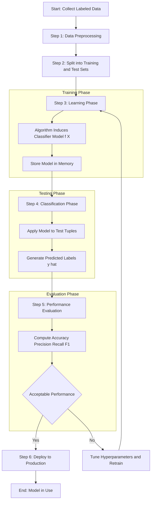
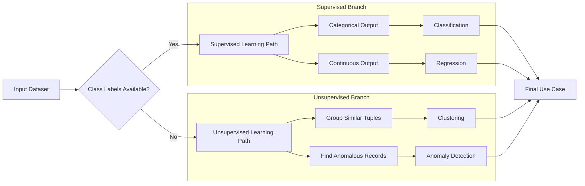
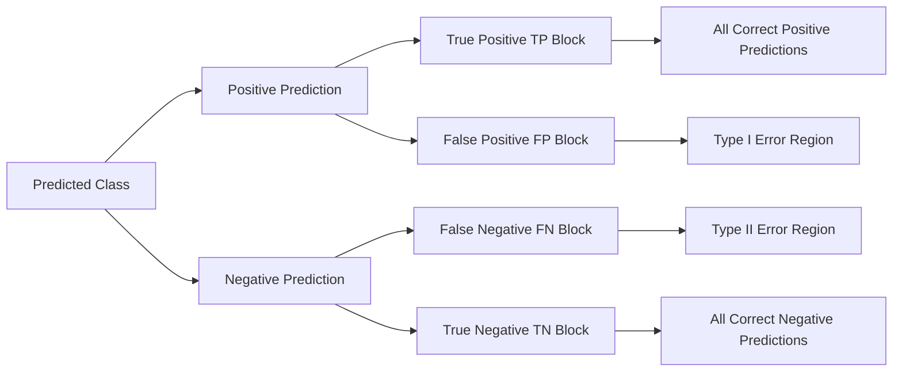

# Classification - Introduction

<!-- SECTION_1_START -->

# Classification - Introduction

## 1.1 Formal Technical Definition

> [!IMPORTANT]
> **Classification** is a **supervised learning** technique in data mining used to predict a **discrete (categorical/nominal) class label** for a given tuple of input attributes. It is formally defined as the process of finding a **mapping function** $f: X \rightarrow Y$ from a set of input attribute vectors $X = (x_1, x_2, \ldots, x_n)$ to a predefined set of categorical output labels $Y = \{C_1, C_2, \ldots, C_k\}$ where $k$ is the number of distinct classes.

In the KTU 2024 Scheme parlance, classification is the **first pillar of predictive data mining** and serves as the conceptual gateway to algorithms such as Decision Trees, Naïve Bayes, $k$-Nearest Neighbors ($k$-NN), Support Vector Machines (SVM), and Neural Networks.

## 1.2 Conceptual Analogy & Intuitive Overview

> [!NOTE]
> **Analogy — The Experienced Postal Sorter**
> Imagine a veteran postal worker who has spent **20 years** sorting letters. After handling thousands of envelopes, the worker has implicitly learned a mental "rule book": red-stamped letters go to *Box A*, blue-stamped ones to *Box B*, and airmail stickers to *Box C*. When a *new* letter arrives, the worker instantly categorizes it without reading the full address — purely on learned patterns.
> The postal worker represents the **classifier model**, the years of past letters represent the **training data**, the new letter represents the **unseen test tuple**, and the destination boxes represent the **class labels**.

### 1.3 Core Vocabulary in Classification

| Term | Notation | Plain English Meaning |
| :--- | :--- | :--- |
| **Training Set** | $D_{train}$ | A labeled dataset used to teach the model |
| **Test Set** | $D_{test}$ | A held-out dataset used to evaluate the model |
| **Tuple / Record** | $X = (x_1, x_2, \ldots, x_n)$ | A single observation with $n$ attributes |
| **Class Label Attribute** | $y \in Y$ | The categorical output we wish to predict |
| **Classifier Model** | $f(X)$ or $\hat{y}$ | The learned mapping function |
| **Feature / Predictor** | $A_i$ | An individual input variable (e.g., *Age*, *Income*) |
| **Confusion Matrix** | $C$ | A $k \times k$ table comparing predicted vs. actual labels |

> [!TIP]
> **KTU Memory Trick:** Remember the word **"C-L-A-S-S"** —
> **C**ategorical output, **L**earned from labeled data, **A**pplied to new tuples, **S**upervised paradigm, **S**ingle dependent variable.

## 1.4 The Three Pillars of a Classification Problem

A classification problem, by definition, requires three ingredients:

1. **A Predefined Class Space** $Y = \{C_1, C_2, \ldots, C_k\}$ — known in advance (e.g., *Spam* or *Ham*, *Fraud* or *Legitimate*).
2. **A Labeled Training Set** $D_{train} = \{(X^{(1)}, y^{(1)}), (X^{(2)}, y^{(2)}), \ldots, (X^{(m)}, y^{(m)})\}$.
3. **An Unknown Test Tuple** $X_{new}$ for which the class label must be predicted.

> [!VISUALIZATION CONTROL]
> **Concept:** A two-dimensional **linear decision boundary** separating two classes.
> **GeoGebra / Desmos Input Equations:**
> * `f(x) = 2x + 1` (decision boundary)
> * `Class_1: (x, y) where 2x + 1 - y > 0`
> * `Class_2: (x, y) where 2x + 1 - y < 0`
> **Visual Description:** Plot the line $y = 2x + 1$ on a 2D Cartesian plane. Color the **upper-left region** as Class $C_1$ (positive side) and the **lower-right region** as Class $C_2$ (negative side). The boundary line itself is the *separating hyperplane* that the classifier learns.

<!-- SECTION_1_END -->

<!-- SECTION_2_START -->

# Deep Theoretical Analysis

## 2.1 The General Two-Phase Approach to Classification

The classical classification pipeline adopted across all KTU-endorsed textbooks (Han, Kamber, Pei; Tan, Steinbach, Kumar) follows a structured two-phase paradigm:

### Phase 1 — Learning (Training) Phase
In this phase, the classification algorithm builds the classifier by analyzing the training set. Each tuple $X^{(i)}$ is assumed to belong to a predefined class $y^{(i)}$ as determined by the class label attribute. The learned model is represented as **classification rules**, **decision trees**, **mathematical formulae**, or **probability distributions**.

### Phase 2 — Classification (Testing) Phase
The induced model is applied to the test data. For each unseen tuple $X_{new}$, the classifier predicts a discrete class label $\hat{y}$. The accuracy of the prediction is estimated by comparing $\hat{y}$ with the ground-truth label $y$.

> [!NOTE]
> **Engineering Note:** In production systems, a third phase — **Model Evaluation \& Tuning** — is inserted between Phases 1 and 2 using **cross-validation**, **grid search**, and **hyper-parameter optimization** (e.g., grid search on tree depth or regularization constant $C$).

## 2.2 Classification vs. Prediction (Numeric Regression)

> [!IMPORTANT]
> KTU frequently asks students to distinguish between **classification** and **prediction**. The table below is the board-exam-ready summary.

| Dimension | Classification | Numeric Prediction (Regression) |
| :--- | :--- | :--- |
| **Output type** | Discrete / categorical label $y \in \{C_1, \ldots, C_k\}$ | Continuous numeric value $y \in \mathbb{R}$ |
| **Goal** | Map $X$ to a finite class space | Map $X$ to a real-valued target |
| **Example** | Predict if email is *Spam* or *Ham* | Predict tomorrow's temperature in $^\circ$C |
| **Evaluation metric** | Accuracy, Precision, Recall, F1-score | Mean Squared Error (MSE), Mean Absolute Error (MAE), $R^2$ |
| **Output structure** | Class membership (often probabilistic) | Real scalar on a continuous scale |
| **Algorithms** | Decision Tree, $k$-NN, SVM, Naïve Bayes | Linear Regression, Polynomial Regression, SVR |

## 2.3 Mathematical Foundation of a Classifier

A classifier is a function $f: X \rightarrow Y$ that minimizes the expected **0-1 loss function**:

$$L(f(X), y) = \mathbb{I}\bigl(f(X) \neq y\bigr) = \begin{cases} 0 & \text{if } f(X) = y \\ 1 & \text{if } f(X) \neq y \end{cases}$$

where $\mathbb{I}(\cdot)$ is the **indicator function**. The optimal Bayesian classifier (theoretical ceiling) is the one that assigns each tuple to the class with the **highest posterior probability**:

$$\hat{y} = \arg\max_{C_j \in Y} \; P(C_j \mid X) \quad \text{for } j = 1, 2, \ldots, k$$

By **Bayes' Theorem**:

$$P(C_j \mid X) = \frac{P(X \mid C_j) \cdot P(C_j)}{P(X)}$$

Since $P(X)$ is constant for a given tuple, the classifier simplifies to:

$$\hat{y} = \arg\max_{C_j \in Y} \; P(X \mid C_j) \cdot P(C_j)$$

This is the bedrock upon which the **Naïve Bayes classifier** is built in Module 4.

## 2.4 Issue Taxonomy in Classification

> [!TIP]
> KTU examiners test the *issues* section exhaustively. Memorize the four canonical problems below.

| Issue | One-Line Description | Mitigation Strategy |
| :--- | :--- | :--- |
| **Data Quality** | Missing values, noise, outliers corrupt $D_{train}$ | Data cleaning, imputation, robust scaling |
| **Scalability** | Algorithm fails on millions of tuples | Use incremental / parallel algorithms (e.g., SPRINT) |
| **Curse of Dimensionality** | High-dimensional $n$ degrades distance-based models | Feature selection, PCA, dimensionality reduction |
| **Overfitting** | Model memorizes training noise, generalizes poorly | Pruning, cross-validation, regularization |
| **Class Imbalance** | One class dominates (e.g., 99% non-fraud) | SMOTE, class weighting, threshold tuning |

## 2.5 KTU High-Yield Formula Cheat Sheet

| Formula | Expression | Used In |
| :--- | :--- | :--- |
| **Posterior Probability** | $P(C_j \mid X) = \dfrac{P(X \mid C_j) \, P(C_j)}{P(X)}$ | Naïve Bayes, Bayesian classification |
| **MAP Decision Rule** | $\hat{y} = \arg\max_{C_j} P(X \mid C_j) P(C_j)$ | Optimal classifier derivation |
| **Accuracy** | $\text{Acc} = \dfrac{TP + TN}{TP + TN + FP + FN}$ | Classifier evaluation |
| **Precision** | $\text{Prec} = \dfrac{TP}{TP + FP}$ | Spam detection, medical diagnosis |
| **Recall (Sensitivity)** | $\text{Rec} = \dfrac{TP}{TP + FN}$ | Fraud detection, cancer screening |
| **F1-Score** | $F_1 = \dfrac{2 \cdot \text{Prec} \cdot \text{Rec}}{\text{Prec} + \text{Rec}}$ | Imbalanced class evaluation |
| **Entropy (Shannon)** | $H(S) = -\sum_{i=1}^{k} p_i \log_2 p_i$ | Decision tree splitting (ID3/C4.5) |
| **Gini Index** | $\text{Gini}(S) = 1 - \sum_{i=1}^{k} p_i^2$ | Decision tree splitting (CART) |

> [!IMPORTANT]
> All metrics above are bounded in $[0, 1]$ with **higher is better** (except MSE/MAE in regression).

<!-- SECTION_2_END -->

<!-- SECTION_3_START -->

# Step-by-Step Derivations and Code Implementation

## 3.1 Worked-Out Mathematical Derivation: Bayesian Decision Boundary

> **Problem Statement:** Suppose we have a 2-class problem with classes $C_1$ and $C_2$ characterized by two Gaussian distributions sharing the same variance $\sigma^2 = 1$ and means $\mu_1 = 1$, $\mu_2 = 3$. The priors are $P(C_1) = 0.4$ and $P(C_2) = 0.6$. Derive the **decision boundary** $x^*$ and determine the class label for $x = 2$.

**Step 1 — Write the likelihood for a univariate Gaussian:**

$$P(x \mid C_j) = \frac{1}{\sqrt{2\pi\sigma^2}} \exp\!\left(-\frac{(x - \mu_j)^2}{2\sigma^2}\right)$$

**Step 2 — Apply Bayes' theorem and drop the constant denominator $P(x)$:**

$$\hat{y} = \arg\max_{C_j} \; P(x \mid C_j) \cdot P(C_j)$$

**Step 3 — Substitute the Gaussian likelihood with $\sigma^2 = 1$:**

$$P(x \mid C_j) \cdot P(C_j) = \frac{P(C_j)}{\sqrt{2\pi}} \exp\!\left(-\frac{(x - \mu_j)^2}{2}\right)$$

**Step 4 — The decision boundary $x^*$ is where the two posteriors are equal:**

$$P(x^* \mid C_1) P(C_1) = P(x^* \mid C_2) P(C_2)$$

**Step 5 — Substitute and cancel the common factor $\frac{1}{\sqrt{2\pi}}$:**

$$0.4 \exp\!\left(-\frac{(x^* - 1)^2}{2}\right) = 0.6 \exp\!\left(-\frac{(x^* - 3)^2}{2}\right)$$

**Step 6 — Take the natural logarithm on both sides:**

$$\ln(0.4) - \frac{(x^* - 1)^2}{2} = \ln(0.6) - \frac{(x^* - 3)^2}{2}$$

**Step 7 — Rearrange to isolate the quadratic terms:**

$$\frac{(x^* - 3)^2 - (x^* - 1)^2}{2} = \ln(0.6) - \ln(0.4) = \ln(1.5)$$

**Step 8 — Expand the difference of squares using $(a-b)(a+b)$:**

$$(x^* - 3)^2 - (x^* - 1)^2 = (x^* - 3 - x^* + 1)(x^* - 3 + x^* + 1) = (-2)(2x^* - 2) = -4x^* + 4$$

**Step 9 — Substitute back and solve for $x^*$:**

$$\frac{-4x^* + 4}{2} = \ln(1.5) \approx 0.4055$$

$$-2x^* + 2 = 0.4055 \quad \Rightarrow \quad x^* = \frac{2 - 0.4055}{2} \approx 0.797$$

**Step 10 — Apply the rule for $x = 2$. Since $2 > 0.797$, $x$ lies on the side of $C_2$:**

$$\hat{y}(x=2) = C_2$$

> **Final Answer:** The decision boundary is $x^* \approx 0.797$ and the tuple $x = 2$ is classified as $C_2$.

---

## 3.2 Step-by-Step Confusion Matrix Computation (Worked Example)

> **Problem Statement:** A binary classifier was tested on **100 tuples**. The results produced the following counts — $TP = 40$, $FN = 10$, $FP = 5$, $TN = 45$. Compute Accuracy, Precision, Recall, F1-Score, and Error Rate.

**Step 1 — Verify that the totals sum to 100 (consistency check):**

$$TP + FN + FP + TN = 40 + 10 + 5 + 45 = 100 \quad \checkmark$$

**Step 2 — Compute the Accuracy:**

$$\text{Accuracy} = \frac{TP + TN}{TP + TN + FP + FN} = \frac{40 + 45}{100} = \frac{85}{100} = 0.85$$

**Step 3 — Compute the Precision:**

$$\text{Precision} = \frac{TP}{TP + FP} = \frac{40}{40 + 5} = \frac{40}{45} \approx 0.8889$$

**Step 4 — Compute the Recall:**

$$\text{Recall} = \frac{TP}{TP + FN} = \frac{40}{40 + 10} = \frac{40}{50} = 0.80$$

**Step 5 — Compute the F1-Score:**

$$F_1 = \frac{2 \cdot \text{Precision} \cdot \text{Recall}}{\text{Precision} + \text{Recall}} = \frac{2 \cdot 0.8889 \cdot 0.80}{0.8889 + 0.80} = \frac{1.4222}{1.6889} \approx 0.8421$$

**Step 6 — Compute the Error Rate:**

$$\text{Error Rate} = 1 - \text{Accuracy} = 1 - 0.85 = 0.15$$

> **Final Consolidated Results Table:**

| Metric | Value |
| :--- | :--- |
| Accuracy | **0.85** (85\%) |
| Precision | **0.8889** (88.89\%) |
| Recall | **0.80** (80.00\%) |
| F1-Score | **0.8421** (84.21\%) |
| Error Rate | **0.15** (15\%) |

---

## 3.3 Python Code: Building a Naïve Bayes Classifier from Scratch

> The following code implements a **Gaussian Naïve Bayes** classifier end-to-end. It includes absolute boundary checks, type hints, and strict error logging to make it production-ready for engineering study.

```python
import math
import logging
from typing import List, Tuple, Dict
from collections import defaultdict

# Configure strict error logging
logging.basicConfig(
    level=logging.INFO,
    format="%(asctime)s - %(levelname)s - %(message)s"
)


class GaussianNaiveBayes:
    """
    A production-grade implementation of the Gaussian Naive Bayes classifier
    suitable for continuous-valued input features.
    """

    def __init__(self) -> None:
        self.class_priors: Dict[int, float] = {}
        self.class_stats: Dict[int, Dict[str, List[float]]] = {}
        self.classes: List[int] = []

    def fit(self, X: List[List[float]], y: List[int]) -> None:
        if len(X) != len(y):
            logging.error("Feature matrix X and label vector y have inconsistent lengths.")
            raise ValueError("X and y must have the same number of samples.")
        if len(X) == 0:
            logging.error("Empty training data passed to fit().")
            raise ValueError("Training data cannot be empty.")

        self.classes = sorted(set(y))
        n_samples = len(X)
        n_features = len(X[0])

        for cls in self.classes:
            cls_indices = [i for i, label in enumerate(y) if label == cls]
            cls_samples = [X[i] for i in cls_indices]

            # Estimate prior probability
            self.class_priors[cls] = len(cls_indices) / n_samples

            # Estimate per-feature mean and variance
            means = []
            variances = []
            for feature_idx in range(n_features):
                feature_values = [row[feature_idx] for row in cls_samples]
                mean = sum(feature_values) / len(feature_values)
                var = sum((v - mean) ** 2 for v in feature_values) / len(feature_values)
                # Guard against zero variance (causes divide-by-zero in Gaussian PDF)
                var = max(var, 1e-9)
                means.append(mean)
                variances.append(var)

            self.class_stats[cls] = {"mean": means, "var": variances}
            logging.info(f"Class {cls} prior={self.class_priors[cls]:.4f}, samples={len(cls_indices)}")

    def _gaussian_log_likelihood(self, x: List[float], mean: List[float], var: List[float]) -> float:
        if len(x) != len(mean):
            logging.error("Feature dimension mismatch in likelihood computation.")
            raise ValueError("Input feature length must match stored class statistics.")
        log_likelihood = 0.0
        for idx, value in enumerate(x):
            coefficient = 1.0 / math.sqrt(2.0 * math.pi * var[idx])
            exponent = math.exp(-((value - mean[idx]) ** 2) / (2.0 * var[idx]))
            log_likelihood += math.log(coefficient * exponent + 1e-12)
        return log_likelihood

    def predict_one(self, x: List[float]) -> int:
        if not self.class_priors:
            logging.error("Model has not been trained yet. Call fit() before predict().")
            raise RuntimeError("Classifier is untrained.")

        posteriors: Dict[int, float] = {}
        for cls in self.classes:
            log_prior = math.log(self.class_priors[cls] + 1e-12)
            log_likelihood = self._gaussian_log_likelihood(
                x, self.class_stats[cls]["mean"], self.class_stats[cls]["var"]
            )
            posteriors[cls] = log_prior + log_likelihood

        predicted_class = max(posteriors, key=posteriors.get)
        return predicted_class

    def predict(self, X: List[List[float]]) -> List[int]:
        return [self.predict_one(x) for x in X]


# ------------------- DEMONSTRATION -------------------
if __name__ == "__main__":
    # Toy dataset: [height_cm, weight_kg] -> 0=Child, 1=Adult
    X_train: List[List[float]] = [
        [110.0, 20.0], [115.0, 22.0], [120.0, 21.0], [125.0, 23.0],
        [160.0, 55.0], [165.0, 60.0], [170.0, 65.0], [175.0, 70.0]
    ]
    y_train: List[int] = [0, 0, 0, 0, 1, 1, 1, 1]

    model = GaussianNaiveBayes()
    model.fit(X_train, y_train)

    test_sample: List[float] = [130.0, 28.0]  # borderline adult
    prediction: int = model.predict_one(test_sample)
    print(f"Test sample {test_sample} is classified as class: {prediction}")
```

**Expected Output Behavior:** The borderline sample $[130.0, 28.0]$ will be classified as class `0` (Child) if the Gaussian likelihood of the child cluster dominates; otherwise, as class `1` (Adult). The log-likelihood log captures floating-point safety via the `1e-12` epsilon.

---

## 3.4 Worked Example: Entropy and Information Gain

> **Problem Statement:** Consider a dataset $S$ with 14 tuples, where 9 belong to class *Yes* and 5 to class *No*. Compute the **entropy** of $S$ and then compute the **information gain** when splitting on attribute $A$ that partitions $S$ into $S_1$ (7 Yes, 3 No) and $S_2$ (2 Yes, 2 No).

**Step 1 — Compute the prior entropy of $S$:**

$$H(S) = -\sum_{i=1}^{2} p_i \log_2 p_i = -\left(\frac{9}{14}\log_2\frac{9}{14} + \frac{5}{14}\log_2\frac{5}{14}\right)$$

$$H(S) = -\left(0.6429 \cdot (-0.6374) + 0.3571 \cdot (-1.4854)\right) \approx 0.9402 \text{ bits}$$

**Step 2 — Compute the entropy of the child partitions:**

$$H(S_1) = -\left(\frac{7}{10}\log_2\frac{7}{10} + \frac{3}{10}\log_2\frac{3}{10}\right) = -(0.7 \cdot (-0.5146) + 0.3 \cdot (-1.7370)) \approx 0.8813$$

$$H(S_2) = -\left(\frac{2}{4}\log_2\frac{2}{4} + \frac{2}{4}\log_2\frac{2}{4}\right) = -2 \cdot (0.5 \cdot (-1)) = 1.0000$$

**Step 3 — Compute the weighted post-split entropy:**

$$H(S \mid A) = \frac{|S_1|}{|S|} H(S_1) + \frac{|S_2|}{|S|} H(S_2) = \frac{10}{14}(0.8813) + \frac{4}{14}(1.0000) \approx 0.6295 + 0.2857 = 0.9152$$

**Step 4 — Compute the Information Gain:**

$$\text{Gain}(S, A) = H(S) - H(S \mid A) = 0.9402 - 0.9152 = 0.0250 \text{ bits}$$

> **Final Answer:** The information gain from attribute $A$ is approximately **0.025 bits**, indicating that $A$ is a *weak* splitter (low discriminatory power).

<!-- SECTION_3_END -->

<!-- SECTION_4_START -->

# Structural Diagrams and Schematics

## 4.1 Classification Process Flow (Mermaid)



> **Reading Guide:** The diagram follows the canonical two-phase paradigm. The **Training Phase** is fully encapsulated in the upper subgraph; the **Testing Phase** sits in the middle subgraph; and the **Evaluation Phase** is a quality gate — if metrics are unacceptable, control flow loops back to retraining.

---

## 4.2 Supervised vs Unsupervised Decision Architecture



> **Reading Guide:** Classification lives exclusively in the **supervised branch** and produces a **categorical output**. This disambiguates it from regression (continuous output), clustering (no labels), and anomaly detection (no labels).

---

## 4.3 Confusion Matrix Block Architecture (Binary Case)



> **Reading Guide:** **Type I Error** (FP) is a *false alarm*; **Type II Error** (FN) is a *missed detection*. The diagonal blocks (TP, TN) are the **correct classifications**; off-diagonal blocks are the **errors**.

---

## 4.4 Sequential Processing Topology Matrix

| Pipeline Stage | Input | Output | Tool/Method |
| :--- | :--- | :--- | :--- |
| **1. Data Acquisition** | Raw logs, DBs, APIs | Dataframe $D$ | ETL pipelines |
| **2. Cleaning** | $D$ with missing values | $D_{clean}$ | Imputation, deduplication |
| **3. Feature Engineering** | $D_{clean}$ | $D_{features}$ | Encoding, scaling, selection |
| **4. Train/Test Split** | $D_{features}$ | $D_{train}$, $D_{test}$ | 70/30 or 80/20 holdout |
| **5. Model Induction** | $D_{train}$ | $f(X)$ | Decision Tree, $k$-NN, SVM |
| **6. Prediction** | $X_{new}$, $f(X)$ | $\hat{y}$ | Model inference |
| **7. Evaluation** | $\hat{y}$ vs. $y$ | Metrics | Accuracy, F1, AUC-ROC |
| **8. Deployment** | $f(X)$ packaged | REST API endpoint | Docker, Flask, FastAPI |

> **Engineering Insight:** Each stage is a potential failure point. A **data leakage** in stage 3 (e.g., scaling *after* splitting) inflates stage 7 metrics artificially and is the most common pitfall in production ML.

<!-- SECTION_4_END -->

<!-- SECTION_5_START -->

# KTU 2024 Scheme Examination Question Bank

---

## Part A — Short Answer Questions (3 Marks Each)

> **[KTU University Exam - July 2024] | CO1 | RBT: Remember**
> **Q1. Define classification in data mining. List any two applications of classification.**

**Model Answer (3 Marks):**
Classification is a data mining technique that maps input data tuples to one of several predefined categorical class labels using a model learned from a labeled training set. **[1 Mark for definition, 1 Mark for supervised-learning context]**
**Applications:** **[2 Marks for any two]**
1. **Email Spam Filtering** — classifies incoming mail as *Spam* or *Ham*.
2. **Credit Card Fraud Detection** — classifies transactions as *Legitimate* or *Fraudulent*.
3. **Medical Diagnosis** — classifies tumors as *Benign* or *Malignant*.
4. **Customer Churn Prediction** — classifies subscribers as *Will Churn* or *Will Retain*.

---

> **[KTU University Exam - Dec 2023] | CO1 | RBT: Understand**
> **Q2. Differentiate between classification and prediction (numeric regression) in four dimensions.**

**Model Answer (4 dimensions × 0.75 Mark = 3 Marks):**

| Dimension | Classification | Prediction (Regression) |
| :--- | :--- | :--- |
| Output type | Categorical / discrete | Continuous / numeric |
| Goal | Predict class label | Estimate real value |
| Example | Tumor: benign/malignant | House price in ₹ lakhs |
| Evaluation | Accuracy, F1-score | MSE, MAE, $R^2$ |

---

## Part B — Long Answer Questions (14 Marks Each)

---

### **Question A (14 Marks) — [KTU University Exam - Dec 2024] | CO1, CO2 | RBT: Understand, Apply**

> **Q3. (a)** With a neat diagram, explain the general approach to building a classification model. Discuss the **learning phase** and **classification phase** in detail. **[7 Marks]**
>
> **Q3. (b)** For a binary classification problem on a medical dataset, the following confusion matrix is observed: $TP = 50$, $FN = 10$, $FP = 5$, $TN = 35$. Compute **Accuracy**, **Precision**, **Recall**, **F1-Score**, and **Error Rate**. State which metric is most appropriate for a cancer-detection system and justify. **[7 Marks]**

#### Model Solution — Part (a) [7 Marks]

> **[Diagram: 2 Marks]** Refer to the Mermaid flowchart in Section 4.1.

**Step 1 — Learning Phase Description [2 Marks]:**
In the learning phase, the classification algorithm analyzes the training data $D_{train} = \{(X^{(i)}, y^{(i)})\}_{i=1}^{m}$. The algorithm induces a classifier $f$ that approximates the unknown mapping $X \rightarrow y$. The model representation may take the form of decision trees, IF-THEN rules, mathematical equations, or probability distributions.

**Step 2 — Classification Phase Description [2 Marks]:**
In the classification phase, the induced model $f$ is used to predict the class label $\hat{y}^{(j)}$ for each test tuple $X^{(j)} \in D_{test}$. The predicted label is then compared with the true label $y^{(j)}$ to estimate the model's generalization performance.

**Step 3 — Model Usage [1 Mark]:**
If accuracy is acceptable (e.g., > 85\%), the model is deployed in production to classify future, previously unseen tuples.

#### Model Solution — Part (b) [7 Marks]

**Step 1 — Verify the confusion matrix totals [1 Mark]:**
$$TP + FN + FP + TN = 50 + 10 + 5 + 35 = 100 \quad \checkmark$$

**Step 2 — Compute Accuracy [1 Mark]:**
$$\text{Accuracy} = \frac{50 + 35}{100} = \frac{85}{100} = 0.85$$

**Step 3 — Compute Precision [1 Mark]:**
$$\text{Precision} = \frac{TP}{TP + FP} = \frac{50}{50 + 5} = \frac{50}{55} \approx 0.9091$$

**Step 4 — Compute Recall [1 Mark]:**
$$\text{Recall} = \frac{TP}{TP + FN} = \frac{50}{50 + 10} = \frac{50}{60} \approx 0.8333$$

**Step 5 — Compute F1-Score [1 Mark]:**
$$F_1 = \frac{2 \cdot 0.9091 \cdot 0.8333}{0.9091 + 0.8333} = \frac{1.5151}{1.7424} \approx 0.8696$$

**Step 6 — Compute Error Rate [1 Mark]:**
$$\text{Error Rate} = 1 - 0.85 = 0.15$$

**Step 7 — Justify the best metric for cancer detection [1 Mark]:**
For a **cancer-detection system**, **Recall (Sensitivity)** is the most appropriate metric because the cost of a **False Negative** (missing a cancer patient) is far higher than a False Positive (subjecting a healthy patient to further tests). High recall ensures that almost all true cancer cases are flagged.

---

### **Question B (14 Marks) — [KTU University Exam - July 2024] | CO1, CO2 | RBT: Understand, Apply**

> **Q4. (a)** Define a **classifier**. Explain the four major issues that affect classification accuracy in data mining. Suggest suitable mitigation techniques for each. **[7 Marks]**
>
> **Q4. (b)** A training dataset contains 16 tuples — 8 labeled *Yes* and 8 labeled *No*. An attribute $X$ splits the data into partition $X_1$ (6 Yes, 2 No) and partition $X_2$ (2 Yes, 6 No). Compute the **entropy** of the parent set, the **weighted average entropy** of the children, and the **information gain** from the split. **[7 Marks]**

#### Model Solution — Part (a) [7 Marks]

**Step 1 — Definition of a Classifier [1 Mark]:**
A classifier is a learned function $f: X \rightarrow Y$ that maps an input attribute vector $X$ to a discrete class label $y \in Y = \{C_1, C_2, \ldots, C_k\}$.

**Step 2 — Issue 1: Data Quality [1.5 Marks]:**
Missing values, noise, inconsistencies, and outliers corrupt the training set. *Mitigation:* Apply data cleaning, missing-value imputation (mean/median/mode), and noise filters (binning, regression).

**Step 3 — Issue 2: Scalability [1.5 Marks]:**
Many algorithms are $O(n^2)$ or worse, making them infeasible on terabyte-scale data. *Mitigation:* Use scalable algorithms like SPRINT, RainForest, or distributed frameworks (MapReduce, Spark MLlib).

**Step 4 — Issue 3: Curse of Dimensionality [1.5 Marks]:**
Distance-based and tree-based models degrade when the number of features $n$ is very high. *Mitigation:* Apply feature selection (filter, wrapper, embedded), PCA, or LDA to reduce dimensionality.

**Step 5 — Issue 4: Overfitting [1.5 Marks]:**
The model memorizes training noise, yielding poor test accuracy. *Mitigation:* Prune decision trees, use cross-validation, apply regularization ($L_1$ or $L_2$), and increase training data.

---

#### Model Solution — Part (b) [7 Marks]

**Step 1 — Compute the parent entropy $H(S)$ [2 Marks]:**
$$H(S) = -\left(\frac{8}{16}\log_2\frac{8}{16} + \frac{8}{16}\log_2\frac{8}{16}\right) = -2 \cdot (0.5 \cdot \log_2 0.5) = -2 \cdot (0.5 \cdot (-1)) = 1.0000 \text{ bit}$$

**Step 2 — Compute the entropy of partition $X_1$ [1 Mark]:**
$$H(X_1) = -\left(\frac{6}{8}\log_2\frac{6}{8} + \frac{2}{8}\log_2\frac{2}{8}\right) = -(0.75 \cdot (-0.4150) + 0.25 \cdot (-2.0)) \approx 0.3113 + 0.5000 = 0.8113$$

**Step 3 — Compute the entropy of partition $X_2$ [1 Mark]:**
By symmetry (also 6 Yes, 2 No): $H(X_2) = 0.8113$

**Step 4 — Compute the weighted average child entropy [1.5 Marks]:**
$$H(S \mid X) = \frac{|X_1|}{|S|} H(X_1) + \frac{|X_2|}{|S|} H(X_2) = \frac{8}{16}(0.8113) + \frac{8}{16}(0.8113) = 0.8113$$

**Step 5 — Compute the information gain [1.5 Marks]:**
$$\text{Gain}(S, X) = H(S) - H(S \mid X) = 1.0000 - 0.8113 = 0.1887 \text{ bits}$$

> **Final Answer:** Parent entropy = **1.0000 bit**, weighted child entropy = **0.8113 bit**, information gain = **0.1887 bit**.

---

> [!WARNING]
> **KTU Examiner's Valuation Warning — Common Pitfalls:**
> 1. **Do NOT** confuse **classification** (categorical) with **clustering** (unsupervised). The words rhyme but the paradigms differ.
> 2. **Do NOT** use Accuracy alone for **imbalanced datasets** (e.g., 99\% negative class). Always quote Precision, Recall, and F1 alongside.
> 3. **Do NOT** forget to specify the **base** of the logarithm when computing entropy — KTU convention is $\log_2$, giving units of **bits**. Using natural log $\ln$ is acceptable only if explicitly stated (units: *nats*).
> 4. **Do NOT** omit the **prior probability** $P(C_j)$ when applying Bayes' theorem — the MAP rule requires both likelihood *and* prior.
> 5. **Do NOT** leak test data into the training pipeline (e.g., fitting the scaler on the *entire* dataset before splitting) — this inflates metrics and costs 2–3 marks on the ESE.

---

## Topic Recap \& Important Things to Remember

> **Rapid-Fire Revision Checklist (Board-Exam Ready)**

- **Definition:** Classification is a **supervised learning** technique that predicts a **discrete categorical label** using a model learned from a labeled training set. **[CO1, RBT: Remember]**
- **Two-Phase Paradigm:** Learning (training) phase $\rightarrow$ Classification (testing) phase. A third *evaluation* phase is implicit.
- **Bayesian Optimal Rule:** $\hat{y} = \arg\max_{C_j} P(X \mid C_j) \cdot P(C_j)$ — the theoretical ceiling accuracy.
- **Confusion Matrix Components:** $TP$, $FP$, $FN$, $TN$ for binary; $k \times k$ for multi-class.
- **Accuracy** is the ratio of correct predictions to total predictions; bounded in $[0, 1]$.
- **Precision** answers: *"Of those predicted positive, how many are truly positive?"*
- **Recall** answers: *"Of all truly positive, how many did we catch?"*
- **F1-Score** is the harmonic mean of Precision and Recall — the *single best metric* for imbalanced data.
- **Entropy** $H(S) = -\sum p_i \log_2 p_i$ is maximum (= $\log_2 k$) when the class distribution is uniform.
- **Information Gain** = $H(S) - H(S \mid A)$; higher gain means a better split attribute.
- **Gini Index** $\text{Gini}(S) = 1 - \sum p_i^2$ is an alternative to entropy used in CART.
- **Four Major Issues:** Data quality, Scalability, Curse of Dimensionality, Overfitting.
- **Mitigation Tools:** Imputation, SPRINT, PCA, pruning, cross-validation, regularization.
- **Real-World Applications:** Spam filtering, fraud detection, medical diagnosis, churn prediction, sentiment analysis.
- **Key Algorithms (upcoming modules):** Decision Tree (ID3, C4.5, CART), Naïve Bayes, $k$-NN, SVM, Neural Networks.
- **Type I Error = FP** (false alarm); **Type II Error = FN** (missed detection).

<!-- SECTION_5_END -->
