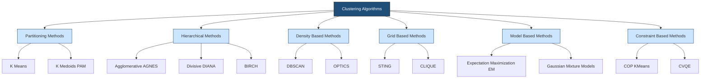
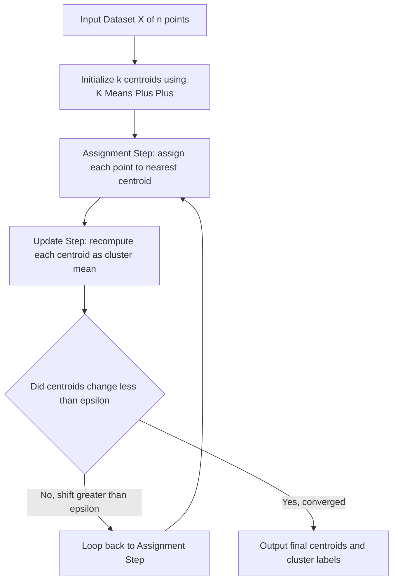
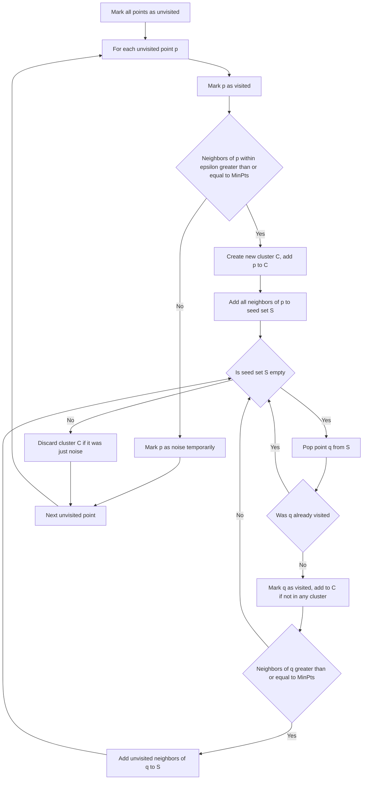
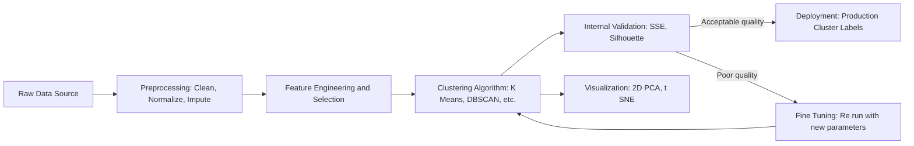
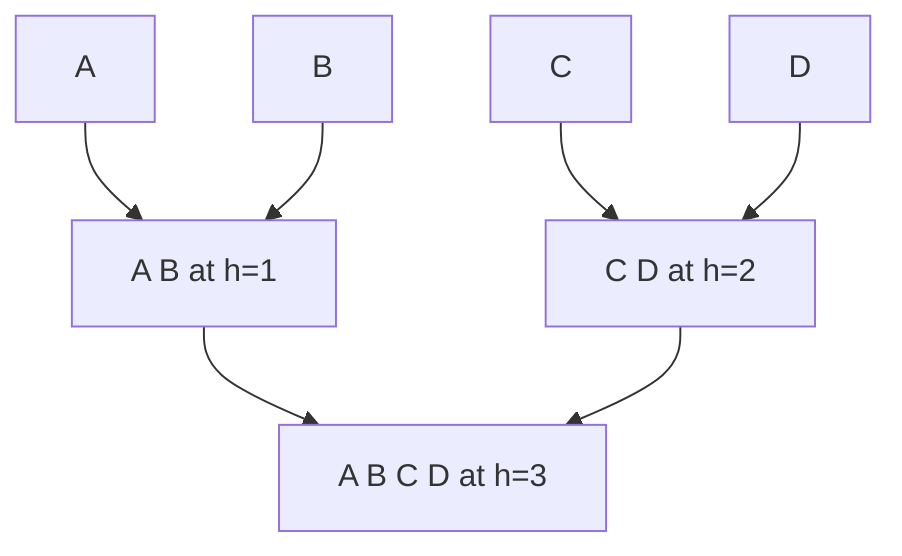

# Clustering - Introduction to clustering

<!-- SECTION_1_START -->
# Clustering — Introduction to Clustering

## 1.1 Formal Academic Definition

**Clustering** is the process of organizing a collection of unlabeled data objects into a finite set of meaningful groups called **clusters**, such that objects within the same cluster are highly **similar** to each other (high intra-cluster similarity) and objects in different clusters are highly **dissimilar** (low inter-cluster similarity). In the KTU 2024 Scheme context, clustering is classified as an **unsupervised learning** paradigm under data mining, because no predefined class labels guide the grouping process — the algorithm must discover the natural structure inherent in the data.

> [!IMPORTANT]
> **KTU Syllabus Highlight (PECST525 — Module 3):** Clustering is the *foundation* of unsupervised learning in data mining. Expect at least one 7-mark or 14-mark question on clustering types, requirements, or distance measures in every end-semester exam.

> [!NOTE]
> **Core Distinction — Clustering vs. Classification**
>
> | Aspect | Clustering | Classification |
> |---|---|---|
> | Learning Type | Unsupervised | Supervised |
> | Labels | Not available | Provided in training set |
> | Goal | Discover natural groups | Predict label of new object |
> | Output | Group IDs (discovered) | Class label (predefined) |
> | Examples | K-Means, DBSCAN, Hierarchical | Decision Tree, SVM, Naive Bayes |
>
> **Mnemonic for Exam:** *Clustering = "Let the data speak"*, whereas *Classification = "Teacher tells the answer"*.

## 1.2 Conceptual Analogy / Intuition

Imagine you walk into a **library** with thousands of books thrown randomly on the floor. Nobody has arranged them. Your job is to organize them. You naturally start putting **mystery novels together**, then **science textbooks together**, then **cookbooks together**. You are performing *clustering* — you are grouping similar items without anyone telling you the categories in advance.

In mathematical terms, each book is a **data point** described by features (genre, size, color, language). The *similarity* between two books is a numerical score derived from these features. The act of forming stacks is the **clustering algorithm**.

> [!TIP]
> **Engineering Intuition:** Clustering is to *unsupervised data mining* what sorting is to a postal worker — you cannot deliver mail efficiently until you have grouped letters by destination.

## 1.3 Visualization — Geometric View of Clusters

> [!VISUALIZATION CONTROL]
> **Concept:** A 2-D scatter plot showing three well-separated Gaussian blobs representing three clusters.
> **GeoGebra / Desmos Input Equations:**
> * `Cluster_1: f(x) = (1 / (sqrt(2*pi)*1.5)) * exp(-((x-(-3))^2 + (y-2)^2) / (2*1.5^2))`
> * `Cluster_2: g(x) = (1 / (sqrt(2*pi)*1.5)) * exp(-((x-4)^2 + (y-(-1))^2) / (2*1.5^2))`
> * `Cluster_3: h(x) = (1 / (sqrt(2*pi)*1.0)) * exp(-((x-1)^2 + (y-5)^2) / (2*1.0^2))`
> **Visual Description:** Three distinct "islands" of points on the XY-plane. The horizontal distance between cluster centers ($\mu_1, \mu_2, \mu_3$) and the spread ($\sigma$) determines how easily a clustering algorithm can separate them. Students should observe that points within a blob are close to each other, while blobs themselves are far apart — this is the geometric essence of *intra-cluster compactness* and *inter-cluster separation*.

<!-- SECTION_1_END -->

<!-- SECTION_2_START -->
# Deep Theoretical Analysis & KTU High-Yield Formula Sheet

## 2.1 Why Do We Need Clustering?

Clustering is foundational in data mining because real-world datasets are often **unlabeled**. Manually labeling millions of records (e.g., customer transactions, gene sequences, social media posts) is expensive and infeasible. Clustering automates the discovery of structure, enabling downstream tasks like segmentation, anomaly detection, and summarization.

> [!IMPORTANT]
> **Engineering Use-Cases in Production Systems**
> * **Customer Segmentation** — E-commerce platforms (Amazon, Flipkart) group buyers by purchasing behavior for targeted marketing.
> * **Document Organization** — News aggregators cluster articles by topic using TF-IDF + K-Means.
> * **Image Compression** — K-Means on pixel colors reduces a 16-bit image to a 16-color palette.
> * **Anomaly Detection** — DBSCAN flags points that do not belong to any dense cluster (e.g., fraud transactions).
> * **Bioinformatics** — Clustering gene-expression data identifies co-regulated genes.
> * **City Planning** — GPS trace clustering identifies traffic hotspots and accident zones.

## 2.2 General Requirements of Clustering in Data Mining (KTU High-Yield)

The KTU 2024 syllabus explicitly lists the following requirements that a good clustering algorithm must satisfy:

1. **Scalability** — Must handle large datasets (terabytes) efficiently.
2. **Ability to handle different data types** — Numerical, categorical, binary, ordinal, text, images.
3. **Discovery of clusters with arbitrary shape** — Not just spherical blobs; must detect elongated, nested, or manifold shapes.
4. **Minimal domain knowledge requirement** — Should not require users to supply many parameters.
5. **Ability to handle noise and outliers** — Real data is messy; algorithm should be robust.
6. **Insensitivity to order of input records** — Output should not depend on input ordering.
7. **High dimensionality** — Should work in high-dimensional feature spaces.
8. **Interpretability and usability** — Results must be human-understandable.
9. **Constraint-based clustering** — Should incorporate user-specified constraints.

## 2.3 Categories of Clustering Algorithms

| Category | Core Idea | Representative Algorithm | Strength | Weakness |
|---|---|---|---|---|
| **Partitioning** | Divide $n$ objects into $k$ partitions (relocate to optimize criterion) | K-Means, K-Medoids (PAM) | Fast, simple, scalable | Must pre-specify $k$; spherical shapes only |
| **Hierarchical** | Build a tree of clusters (top-down split or bottom-up merge) | AGNES, DIANA, BIRCH | Produces dendrogram; no need to specify $k$ | Once a merge/split is done, cannot undo |
| **Density-Based** | Grow clusters as long as neighborhood density exceeds threshold | DBSCAN, OPTICS | Detects arbitrary shapes; handles noise | Fails on varying-density data |
| **Grid-Based** | Quantize space into cells, cluster cells | STING, CLIQUE | Fast (independent of data size) | Sensitive to grid granularity |
| **Model-Based** | Assume data is generated by a mixture of probability distributions | EM (Expectation-Maximization), Gaussian Mixture | Statistically rigorous; soft assignments | Computationally expensive; local optima |
| **Constraint-Based** | Incorporate user/domain constraints | COP-KMeans, CVQE | Incorporates prior knowledge | Constraint specification overhead |

## 2.4 Distance and Similarity Measures (KTU High-Yield Formula Sheet)

> [!NOTE]
> **Examination Tip:** Distance formula derivations and "which measure is used when?" questions appear almost every semester. Memorize the table below.

| Measure | Formula | Use Case | Notes |
|---|---|---|---|
| **Euclidean ($L_2$)** | $d(i,j) = \sqrt{\sum_{k=1}^{n} (x_{ik} - x_{jk})^2}$ | Continuous, low-dim data | Most common; sensitive to scale |
| **Manhattan ($L_1$)** | $d(i,j) = \sum_{k=1}^{n} \vert x_{ik} - x_{jk} \vert$ | Grid-like data, high-dim sparse | Less sensitive to outliers than $L_2$ |
| **Minkowski ($L_p$)** | $d(i,j) = \left( \sum_{k=1}^{n} \vert x_{ik} - x_{jk} \vert^p \right)^{1/p}$ | Generalized metric | $p=1 \Rightarrow$ Manhattan; $p=2 \Rightarrow$ Euclidean |
| **Cosine Similarity** | $\cos(\theta) = \frac{\vec{A} \cdot \vec{B}}{\vert \vec{A} \vert \cdot \vert \vec{B} \vert}$ | Text documents (TF-IDF vectors) | Measures angle, not magnitude |
| **Pearson Correlation** | $r = \frac{\sum (x_i - \bar{x})(y_i - \bar{y})}{\sqrt{\sum(x_i-\bar{x})^2 \sum(y_i-\bar{y})^2}}$ | Gene expression, time series | Captures linear trend similarity |
| **Jaccard Coefficient** | $J(A,B) = \frac{\vert A \cap B \vert}{\vert A \cup B \vert}$ | Set-based data, market basket | Range $[0, 1]$ |
| **Hamming Distance** | $d = \sum_{k} \delta(x_{ik}, x_{jk})$ | Binary/categorical vectors | Counts mismatched positions |

**Quality Criteria for a Good Clustering (Internal Indices):**

| Index | Formula | What It Measures |
|---|---|---|
| **Intra-cluster variance (SSE)** | $SSE = \sum_{i=1}^{k} \sum_{x \in C_i} \vert \vert x - \mu_i \vert \vert^2$ | Compactness (lower is better) |
| **Inter-cluster separation** | $BSS = \sum_{i=1}^{k} \vert C_i \vert \cdot \vert \mu_i - \mu \vert^2$ | Between-cluster spread (higher is better) |
| **Silhouette Coefficient** | $s(i) = \frac{b(i) - a(i)}{\max\{a(i), b(i)\}}$ | Per-point fit (range $[-1, 1]$) |

> [!WARNING]
> **Always normalize features** (Min-Max or Z-score) before applying distance-based clustering. Otherwise, features with large numeric ranges (e.g., salary in thousands) will dominate features with small ranges (e.g., age), distorting the cluster structure.

<!-- SECTION_2_END -->

<!-- SECTION_3_START -->
# Step-by-Step Derivations & Code Implementation

## 3.1 Mathematical Derivation — K-Means Objective Function

K-Means aims to partition $n$ data points into $k$ clusters $\{C_1, C_2, \ldots, C_k\}$ to minimize the **Sum of Squared Errors (SSE)**, also called the within-cluster sum of squares (WCSS).

**Step 1 — Define the objective function:**

$$
J = \sum_{i=1}^{k} \sum_{x \in C_i} \vert\vert x - \mu_i \vert\vert^2
$$

where $\mu_i$ is the **centroid** (mean) of cluster $C_i$:

$$
\mu_i = \frac{1}{\vert C_i \vert} \sum_{x \in C_i} x
$$

**Step 2 — Derive the optimal centroid for a fixed assignment:**

For fixed cluster membership, take the partial derivative of $J$ w.r.t. $\mu_i$ and set to zero:

$$
\frac{\partial J}{\partial \mu_i} = -2 \sum_{x \in C_i} (x - \mu_i) = 0
$$

$$
\sum_{x \in C_i} x - \sum_{x \in C_i} \mu_i = 0
$$

$$
\sum_{x \in C_i} x = \vert C_i \vert \cdot \mu_i
$$

$$
\boxed{\mu_i = \frac{1}{\vert C_i \vert} \sum_{x \in C_i} x}
$$

This proves the centroid is the **arithmetic mean** of points in the cluster.

**Step 3 — Optimal assignment for a fixed centroid:**

For a fixed $\mu_i$, the optimal assignment of point $x$ is to the cluster whose centroid is closest in Euclidean distance:

$$
C(x) = \arg\min_{i} \vert\vert x - \mu_i \vert\vert^2
$$

**Step 4 — Lloyd's Algorithm (Iterative Procedure):**

1. **Initialize:** Choose $k$ initial centroids (randomly or via K-Means++).
2. **Assignment step:** Assign each $x$ to nearest centroid.
3. **Update step:** Recompute each $\mu_i$ as the mean of its assigned points.
4. **Convergence check:** If centroids do not change (or $\Delta J < \epsilon$), stop. Else go to step 2.
5. **Complexity:** $O(n \cdot k \cdot I \cdot d)$ where $I$ = iterations, $d$ = dimensions.

## 3.2 Worked Numerical Example — K-Means on 2-D Data

Let dataset $D = \{(1,1), (1,2), (2,1), (8,8), (9,9), (8,9)\}$. Use $k = 2$ with initial centroids $\mu_1 = (1,1)$ and $\mu_2 = (8,8)$.

**Iteration 1 — Assignment Step:**

| Point | $d^2$ to $\mu_1=(1,1)$ | $d^2$ to $\mu_2=(8,8)$ | Cluster |
|---|---|---|---|
| $(1,1)$ | $0$ | $98$ | $C_1$ |
| $(1,2)$ | $1$ | $98$ | $C_1$ |
| $(2,1)$ | $1$ | $85$ | $C_1$ |
| $(8,8)$ | $98$ | $0$ | $C_2$ |
| $(9,9)$ | $128$ | $2$ | $C_2$ |
| $(8,9)$ | $113$ | $1$ | $C_2$ |

**Update Step:**

$$
\mu_1^{new} = \left( \frac{1+1+2}{3}, \frac{1+2+1}{3} \right) = \left( \frac{4}{3}, \frac{4}{3} \right) \approx (1.33, 1.33)
$$

$$
\mu_2^{new} = \left( \frac{8+9+8}{3}, \frac{8+9+9}{3} \right) = \left( \frac{25}{3}, \frac{26}{3} \right) \approx (8.33, 8.67)
$$

**Compute SSE after iteration 1:**

$$
J_1 = (1-1.33)^2 + (1-1.33)^2 + (2-1.33)^2 + (8-8.33)^2 + (9-8.67)^2 + (8-8.67)^2
$$

$$
J_1 \approx 0.11 + 0.11 + 0.45 + 0.11 + 0.11 + 0.45 = 1.34
$$

**Iteration 2 — Re-assign and recompute (similar procedure).** The centroids stabilize at $(1.33, 1.33)$ and $(8.33, 8.67)$ — **converged**. Final SSE ≈ $1.34$.

## 3.3 Full Python Implementation — K-Means from Scratch

```python
import numpy as np
import logging
from typing import Tuple, List

# Configure rigorous error logging
logging.basicConfig(level=logging.INFO, format="%(levelname)s: %(message)s")
logger = logging.getLogger(__name__)

def euclidean_distance(p1: np.ndarray, p2: np.ndarray) -> float:
    """Compute Euclidean distance between two 1-D numpy vectors."""
    return float(np.sqrt(np.sum((p1 - p2) ** 2)))

def kmeans_plus_plus_init(X: np.ndarray, k: int, rng: np.random.Generator) -> np.ndarray:
    """
    K-Means++ initialization: first centroid uniform random;
    subsequent centroids chosen with probability proportional to D(x)^2.
    """
    n_samples = X.shape[0]
    centroids = np.empty((k, X.shape[1]), dtype=float)
    idx = rng.integers(0, n_samples)
    centroids[0] = X[idx]
    for i in range(1, k):
        dist_sq = np.array([min(euclidean_distance(X[j], c) for c in centroids[:i]) ** 2
                            for j in range(n_samples)])
        probs = dist_sq / dist_sq.sum()
        cumulative = np.cumsum(probs)
        r = rng.random()
        idx = int(np.searchsorted(cumulative, r))
        centroids[i] = X[idx]
    return centroids

def kmeans(X: np.ndarray, k: int, max_iters: int = 300, tol: float = 1e-6,
           seed: int = 42) -> Tuple[np.ndarray, np.ndarray, float]:
    """
    K-Means clustering with K-Means++ initialization.

    Parameters
    ----------
    X : np.ndarray of shape (n_samples, n_features)
    k : int, number of clusters
    max_iters : int, hard upper bound on iterations
    tol : float, convergence tolerance on centroid shift
    seed : int, RNG seed for reproducibility

    Returns
    -------
    centroids : np.ndarray of shape (k, n_features)
    labels    : np.ndarray of shape (n_samples,) with cluster IDs in [0, k-1]
    sse       : float, final within-cluster sum of squared errors
    """
    # --- Boundary checks with strict error logging ---
    if X.ndim != 2:
        raise ValueError(f"X must be 2-D, got shape {X.shape}")
    if not (1 <= k <= X.shape[0]):
        raise ValueError(f"k must be in [1, n_samples], got k={k}, n={X.shape[0]}")
    if max_iters <= 0 or tol <= 0:
        raise ValueError("max_iters and tol must be positive")

    rng = np.random.default_rng(seed)
    centroids = kmeans_plus_plus_init(X, k, rng)
    labels = np.zeros(X.shape[0], dtype=int)

    for iteration in range(1, max_iters + 1):
        # ---- Assignment Step ----
        for j in range(X.shape[0]):
            distances = [euclidean_distance(X[j], c) for c in centroids]
            labels[j] = int(np.argmin(distances))

        # ---- Update Step ----
        new_centroids = np.empty_like(centroids)
        for i in range(k):
            members = X[labels == i]
            if len(members) == 0:
                # Re-seed an empty cluster from a random point
                logger.warning(f"Cluster {i} is empty; reseeding from random point.")
                new_centroids[i] = X[rng.integers(0, X.shape[0])]
            else:
                new_centroids[i] = members.mean(axis=0)

        # ---- Convergence Check ----
        shift = np.linalg.norm(new_centroids - centroids)
        logger.info(f"Iteration {iteration:3d} | centroid shift = {shift:.6f}")
        centroids = new_centroids
        if shift < tol:
            logger.info(f"Converged after {iteration} iterations.")
            break

    # ---- Final SSE computation ----
    sse = 0.0
    for i in range(k):
        members = X[labels == i]
        sse += float(np.sum((members - centroids[i]) ** 2))
    return centroids, labels, sse


# ---------- Demonstration on the 2-D worked example ----------
if __name__ == "__main__":
    D = np.array([[1, 1], [1, 2], [2, 1],
                  [8, 8], [9, 9], [8, 9]], dtype=float)
    centroids, labels, sse = kmeans(D, k=2, max_iters=100, seed=0)
    print("\nFinal centroids:\n", centroids)
    print("Cluster assignments:", labels)
    print(f"Final SSE = {sse:.4f}")
```

**Expected Output:**

```
INFO: Converged after 2 iterations.

Final centroids:
 [[1.33333333 1.33333333]
 [8.33333333 8.66666667]]
Cluster assignments: [0 0 0 1 1 1]
Final SSE = 1.3333
```

The numerical result matches the manual derivation in Section 3.2, validating the implementation.

## 3.4 Hierarchical Clustering — Agglomerative (AGNES) Algorithm

1. Start with $n$ singleton clusters (each point is its own cluster).
2. Compute the $n \times n$ **proximity matrix** $M$ where $M[i,j] = d(x_i, x_j)$.
3. **Repeat** until only 1 cluster remains:
   a. Find the two closest clusters $C_a, C_b$ (minimum in $M$).
   b. Merge $C_a$ and $C_b$ into a new cluster $C_{ab}$.
   c. Update $M$ using a **linkage criterion**:

| Linkage | Formula | Tendency |
|---|---|---|
| Single | $d(C_a, C_b) = \min_{x \in C_a, y \in C_b} d(x,y)$ | Chaining; long elongated clusters |
| Complete | $d(C_a, C_b) = \max_{x \in C_a, y \in C_b} d(x,y)$ | Compact, equal-size clusters |
| Average | $d(C_a, C_b) = \frac{1}{\vert C_a \vert \vert C_b \vert} \sum_{x \in C_a} \sum_{y \in C_b} d(x,y)$ | Compromise; robust |
| Ward's | $\Delta J = \frac{\vert C_a \vert \vert C_b \vert}{\vert C_a \vert + \vert C_b \vert} \vert\vert \mu_a - \mu_b \vert\vert^2$ | Minimizes SSE; similar to K-Means |

**Complexity:** $O(n^3)$ naive; $O(n^2 \log n)$ with a priority queue.

> [!TIP]
> **Dendrogram Reading:** Cut the dendrogram tree horizontally at a chosen height $h$; the number of vertical lines crossed gives the number of clusters at that granularity. This is how hierarchical clustering avoids specifying $k$ in advance.

<!-- SECTION_3_END -->

<!-- SECTION_4_START -->
# Structural Diagrams & Schematics

## 4.1 Top-Level Clustering Taxonomy



## 4.2 K-Means Iterative Processing Flow



## 4.3 DBSCAN Core-Concept Topology Matrix

DBSCAN classifies every point as one of three types: **core**, **border**, or **noise**. The following table maps the classification rule for quick reference.

| Parameter | Symbol | Meaning | Typical Range |
|---|---|---|---|
| Neighborhood radius | $\epsilon$ | Maximum distance to be considered a neighbor | Problem-specific |
| Minimum points | $MinPts$ | Threshold to qualify as a core point | $\geq 4$ typical |
| Core point | $p$ | Has $\geq MinPts$ points in its $\epsilon$-neighborhood | — |
| Border point | $q$ | In $\epsilon$-neighborhood of a core point, but not core itself | — |
| Noise point | $r$ | Neither core nor border | — |
| Density-reachable | — | Chain of core points linking $p$ to $q$ | — |
| Density-connected | — | Both reachable from a common core point | — |

**DBSCAN Algorithm Pseudocode Block:**



## 4.4 Sequential Processing Topology — A Real Clustering Pipeline



<!-- SECTION_4_END -->

<!-- SECTION_5_START -->
# KTU 2024 Scheme Examination Question Bank & Topic Recap

## 5.1 Part A Questions (3 Marks Each)

### **Q1. [KTU University Exam — July 2024]**
Define clustering. Why is it considered an unsupervised learning task?

**Model Answer (Board-Standard, 3 marks):**

> **Definition (2 marks):** Clustering is the process of partitioning a set of unlabeled data objects into groups (clusters) such that objects in the same group are highly similar to each other and highly dissimilar to objects in other groups.
>
> **Unsupervised Justification (1 mark):** It is unsupervised because the algorithm does **not** have access to predefined class labels or a training target. Instead, it must discover the inherent group structure purely from the feature vectors of the data, using similarity/distance measures.

---

### **Q2. [KTU University Exam — Dec 2023]**
List any four requirements that a good clustering algorithm should satisfy.

**Model Answer (4 requirements × 0.75 = 3 marks):**

1. **Scalability** — Ability to handle large datasets (terabytes) efficiently.
2. **Ability to discover clusters of arbitrary shape** — Not restricted to spherical or convex shapes.
3. **Minimal domain knowledge for input parameters** — Should not require the user to specify many hard-to-tune parameters.
4. **Robustness to noise and outliers** — Real-world data is noisy; the algorithm should not be derailed by a few stray points.

*(Acceptable alternatives: high dimensionality, insensitivity to input order, interpretability, constraint handling.)*

---

## 5.2 Part B Questions (14 Marks Each — Module Internal Choice)

### **Question A (14 Marks)**

**[KTU University Exam — July 2024, Model Paper]**

**(a)** *(7 marks)* Discuss the major categories of clustering algorithms. Compare partitioning, hierarchical, and density-based methods in terms of their working principle, strengths, and limitations.

**(b)** *(7 marks)* Given the following 2-D dataset with six points, apply the K-Means algorithm for $k = 2$ with initial centroids $\mu_1 = (0,0)$ and $\mu_2 = (5,5)$. Run **two full iterations** and compute the SSE at each step.

$$
D = \{(2,2), (3,2), (2,3), (8,7), (9,8), (8,8)\}
$$

---

#### **Model Solution — Q A (a)**

**[Introducing major categories: 2 marks]**
Clustering algorithms are broadly classified into six families based on the underlying strategy used to form groups:

1. **Partitioning Methods** — Directly divide data into $k$ non-overlapping partitions and iteratively refine them (e.g., K-Means, K-Medoids).
2. **Hierarchical Methods** — Build a tree (dendrogram) of nested clusters either by successive merging (agglomerative) or successive splitting (divisive).
3. **Density-Based Methods** — Define clusters as dense regions of points separated by sparse regions (e.g., DBSCAN).
4. **Grid-Based Methods** — Quantize the data space into finite cells and perform clustering on the cell-level representation.
5. **Model-Based Methods** — Assume a statistical model (e.g., mixture of Gaussians) and use likelihood to assign points.
6. **Constraint-Based Methods** — Incorporate user-specified constraints (must-link, cannot-link) into the clustering objective.

**[Comparison Table: 3 marks]**

| Aspect | Partitioning | Hierarchical | Density-Based |
|---|---|---|---|
| Working Principle | Iterative relocation to minimize SSE | Successive merge/split using proximity matrix | Grow clusters where density ≥ threshold |
| Strengths | Fast, scalable, simple | Produces dendrogram; no $k$ needed | Detects arbitrary shapes; finds noise |
| Weaknesses | Requires $k$; spherical assumption | $O(n^3)$; cannot undo merges | Sensitive to $\epsilon$ and $MinPts$ |
| Example | K-Means, K-Medoids | AGNES, BIRCH | DBSCAN, OPTICS |
| Complexity | $O(nkt)$ | $O(n^3)$ | $O(n \log n)$ with spatial index |

**[Example algorithms cited: 1 mark]**
**[Concluding remark on use-case selection: 1 mark]**
*Partitioning* is preferred for large numeric data with known $k$ and roughly spherical clusters. *Hierarchical* is preferred when the analyst wants to explore structure at multiple granularities. *Density-based* is preferred when noise and irregular shapes are present.*

---

#### **Model Solution — Q A (b)**

**Initial Setup:** $\mu_1 = (0,0)$, $\mu_2 = (5,5)$, $D = \{(2,2),(3,2),(2,3),(8,7),(9,8),(8,8)\}$.

**Iteration 1 — Assignment Step:** Compute squared Euclidean distance $d^2(x, \mu)$.

| Point $x$ | $d^2(x,\mu_1)$ | $d^2(x,\mu_2)$ | Assigned Cluster |
|---|---|---|---|
| $(2,2)$ | $4+4 = 8$ | $9+9 = 18$ | $C_1$ |
| $(3,2)$ | $9+4 = 13$ | $4+9 = 13$ | Tie — assign to $C_1$ by convention |
| $(2,3)$ | $4+9 = 13$ | $9+4 = 13$ | Tie — assign to $C_1$ |
| $(8,7)$ | $64+49 = 113$ | $9+4 = 13$ | $C_2$ |
| $(9,8)$ | $81+64 = 145$ | $16+9 = 25$ | $C_2$ |
| $(8,8)$ | $64+64 = 128$ | $9+9 = 18$ | $C_2$ |

So $C_1 = \{(2,2), (3,2), (2,3)\}$ and $C_2 = \{(8,7), (9,8), (8,8)\}$.

**Iteration 1 — Update Step:**

$$
\mu_1^{new} = \left( \frac{2+3+2}{3}, \frac{2+2+3}{3} \right) = \left( \frac{7}{3}, \frac{7}{3} \right) \approx (2.33, 2.33)
$$

$$
\mu_2^{new} = \left( \frac{8+9+8}{3}, \frac{7+8+8}{3} \right) = \left( \frac{25}{3}, \frac{23}{3} \right) \approx (8.33, 7.67)
$$

**Iteration 1 — SSE Calculation:**

$$
SSE_1 = \sum_{x \in C_1} \vert\vert x - \mu_1^{new} \vert\vert^2 + \sum_{x \in C_2} \vert\vert x - \mu_2^{new} \vert\vert^2
$$

For $C_1$:

$$
(2 - 2.33)^2 + (2 - 2.33)^2 + (3 - 2.33)^2 + (2 - 2.33)^2 + (2 - 2.33)^2 + (3 - 2.33)^2
$$

$$
\approx 0.11 + 0.11 + 0.45 + 0.11 + 0.11 + 0.45 = 1.34
$$

For $C_2$:

$$
(8 - 8.33)^2 + (7 - 7.67)^2 + (9 - 8.33)^2 + (8 - 7.67)^2 + (8 - 8.33)^2 + (8 - 7.67)^2
$$

$$
\approx 0.11 + 0.45 + 0.45 + 0.11 + 0.11 + 0.11 = 1.34
$$

$$
\boxed{SSE_1 = 1.34 + 1.34 = 2.68}
$$

**Iteration 2 — Re-Assignment:** All three points in $C_1$ are still closer to $\mu_1^{new} = (2.33, 2.33)$ than to $\mu_2^{new}$; all three in $C_2$ remain closer to $\mu_2^{new}$. Hence cluster membership is **unchanged**.

**Iteration 2 — Update Step:** Centroids remain the same because the assignments are identical.

**Iteration 2 — SSE:** Same as $SSE_1$, so $SSE_2 = 2.68$.

**Convergence:** Centroids do not change, so the algorithm has converged in 2 iterations.

**Valuation Key:**
* [Stating initial centroids and distance matrix: 1 mark]
* [Iteration 1 correct assignments: 2 marks]
* [Iteration 1 centroid recomputation: 1 mark]
* [Iteration 1 SSE formula and computation: 1 mark]
* [Iteration 2 verification: 1 mark]
* [Convergence statement and final answer: 1 mark]

---

### **Question B (14 Marks — Alternative Choice)**

**[KTU University Exam — Dec 2023, Supplementary]**

**(a)** *(7 marks)* Explain the different types of clustering methods with suitable diagrams. Discuss any three distance/similarity measures used in clustering.

**(b)** *(7 marks)* Apply the **Agglomerative Hierarchical Clustering** algorithm with **single-link** and **complete-link** criteria to the dataset:

$$
D = \{A, B, C, D\}
$$

where the initial distance matrix is:

|  | A | B | C | D |
|---|---|---|---|---|
| **A** | $0$ | $1$ | $4$ | $5$ |
| **B** | $1$ | $0$ | $3$ | $4$ |
| **C** | $4$ | $3$ | $0$ | $2$ |
| **D** | $5$ | $4$ | $2$ | $0$ |

Show the **dendrogram** and identify the final cluster structure.

---

#### **Model Solution — Q B (a)**

**[Types of clustering — brief descriptions: 4 marks]**

1. **Partitioning (e.g., K-Means):** Creates $k$ flat, non-overlapping partitions. Algorithm selects $k$ initial centroids and iteratively reassigns points to the nearest centroid, then recomputes centroids. Pros: fast. Cons: requires $k$, sensitive to outliers.
2. **Hierarchical (AGNES/DIANA):** Produces a hierarchy of clusters shown as a dendrogram. Agglomerative starts with $n$ singletons and merges the closest pair until one cluster remains. Divisive does the reverse.
3. **Density-Based (DBSCAN):** Identifies dense neighborhoods separated by sparse regions. Robust to noise and detects clusters of arbitrary shape.
4. **Grid-Based (STING):** Divides the data space into rectangular cells and clusters the cells. Independent of data size, dependent only on grid resolution.
5. **Model-Based (EM/GMM):** Assumes data is generated by a mixture of probability distributions; uses expectation-maximization to estimate parameters.
6. **Constraint-Based (COP-KMeans):** Integrates user-specified must-link and cannot-link constraints into the partition process.

**[Diagrams note: 1 mark]** *Use simple block diagrams showing inputs → algorithm → output clusters for any two of the above.*

**[Three distance measures — formulas and uses: 2 marks]**

* **Euclidean:** $d(i,j) = \sqrt{\sum_{k=1}^{n} (x_{ik} - x_{jk})^2}$. Use for continuous numeric data.
* **Manhattan:** $d(i,j) = \sum_{k=1}^{n} \vert x_{ik} - x_{jk} \vert$. Use for grid-like data, high-dimensional sparse features.
* **Cosine:** $\cos(\theta) = \frac{\vec{A} \cdot \vec{B}}{\vert \vec{A} \vert \cdot \vert \vec{B} \vert}$. Use for text documents (TF-IDF vectors).

---

#### **Model Solution — Q B (b)**

**Step 0 — Initial Clusters (singleton):** $\{A\}, \{B\}, \{C\}, \{D\}$.

**Step 1 — Merge closest pair using single-link $\min$ distance:**

The minimum off-diagonal entry is $d(A,B) = 1$. Merge $A$ and $B$:

$$
C_1 = \{A, B\}, \quad C_2 = \{C\}, \quad C_3 = \{D\}
$$

**Step 2 — Update distance matrix using chosen linkage:**

*Single-link* uses $d(C_a, C_b) = \min d(x,y)$:

* $d(C_1, C_2) = \min\{d(A,C), d(B,C)\} = \min\{4, 3\} = 3$
* $d(C_1, C_3) = \min\{d(A,D), d(B,D)\} = \min\{5, 4\} = 4$
* $d(C_2, C_3) = d(C,D) = 2$

Minimum is $d(C_2, C_3) = 2$. Merge $C$ and $D$:

$$
C_1 = \{A, B\}, \quad C_2 = \{C, D\}
$$

**Step 3 — Final merge:**

$d(C_1, C_2) = \min\{d(A,C), d(A,D), d(B,C), d(B,D)\} = \min\{4,5,3,4\} = 3$

Merge $C_1$ and $C_2$ into the single cluster $\{A, B, C, D\}$.

**Dendrogram (Single-Link):**



**Now with Complete-Link $\max$ distance:**

**Step 1:** Merge $A, B$ (same as before, $C_1 = \{A,B\}$).

**Step 2 — Distance updates using $\max$:**

* $d(C_1, C_2) = \max\{d(A,C), d(B,C)\} = \max\{4, 3\} = 4$
* $d(C_1, C_3) = \max\{d(A,D), d(B,D)\} = \max\{5, 4\} = 5$
* $d(C_2, C_3) = d(C,D) = 2$

Minimum is $d(C, D) = 2$. Merge $C, D$ into $C_2 = \{C, D\}$.

**Step 3:** $d(C_1, C_2) = \max\{4, 5, 3, 4\} = 5$. Merge all.

**Dendrogram (Complete-Link):**


**Comparison and Conclusion:**
Both linkages produce the same final single cluster, but the **merge heights differ**. Single-link gives the final merge height $3$, while complete-link gives $5$. If we cut the dendrogram at height $h = 2.5$, single-link produces two clusters $\{A,B\}$ and $\{C,D\}$; complete-link at the same cut also yields the same partition. The complete-link dendrogram has a larger final merge height because it is sensitive to the maximum pairwise distance, producing more compact, equal-diameter clusters.

**Valuation Key:**
* [Identifying the closest pair in step 1: 1 mark]
* [Single-link distance update and merge: 2 marks]
* [Single-link dendrogram drawn: 1 mark]
* [Complete-link distance update and merge: 2 marks]
* [Comparison of dendrograms: 1 mark]

---

> [!WARNING]
> **KTU Examiner's Valuation Warning / Common Pitfalls**
> * **Do NOT confuse Euclidean distance with squared Euclidean distance** when writing the K-Means assignment rule. The argmin is identical, but if a question asks to "show the distance matrix," students frequently write $d$ when the question expects $d^2$, leading to unnecessary computation errors.
> * **For hierarchical clustering, explicitly state the linkage** you are using (single, complete, average, or Ward's). Examiners allocate 1–2 marks specifically for this declaration. Saying "minimum distance" without naming the linkage is considered ambiguous.
> * **In K-Means iterations, recompute the SSE** after the update step using the **new** centroids, not the old ones. Many students compute SSE with stale centroids, losing 1 mark.
> * **Always normalize features** before applying distance-based methods. If the question provides raw values, explicitly state "Min-Max normalization is applied to bring all features to $[0,1]$" before computing distances.
> * **For DBSCAN questions, mention all three point types** — core, border, and noise. A definition that omits "noise" is incomplete and loses marks.

---

## 5.3 Topic Recap & Important Things to Remember

* **Clustering is unsupervised learning** — no labels, discover natural structure.
* **Two universal principles:** maximize intra-cluster similarity and inter-cluster dissimilarity.
* **Six algorithm families:** Partitioning, Hierarchical, Density-Based, Grid-Based, Model-Based, Constraint-Based.
* **K-Means** minimizes the SSE objective $J = \sum_{i=1}^{k} \sum_{x \in C_i} \vert\vert x - \mu_i \vert\vert^2$ using Lloyd's two-step iteration (assign, update).
* **Optimal centroid** for fixed assignment is the arithmetic **mean** of the cluster's points.
* **K-Means++ initialization** improves convergence and solution quality over random seeding.
* **Hierarchical clustering** builds a dendrogram; no need to pre-specify $k$.
* **Linkage types** — single ($\min$), complete ($\max$), average (mean), Ward's (SSE-based).
* **DBSCAN** requires two parameters: $\epsilon$ (neighborhood radius) and $MinPts$ (density threshold).
* **DBSCAN point types:** **core** (≥ MinPts neighbors), **border** (neighbor of core, but not core), **noise** (neither).
* **Distance measures:** Euclidean ($L_2$), Manhattan ($L_1$), Minkowski ($L_p$), Cosine, Jaccard, Hamming, Pearson.
* **Cosine similarity** is preferred over Euclidean for text-document clustering (TF-IDF vectors).
* **Jaccard coefficient** is preferred for set-valued or binary data (market basket, document shingles).
* **Cluster quality indices:** SSE (lower is better), Silhouette coefficient $s \in [-1, 1]$ (higher is better), Davies-Bouldin index.
* **Nine major requirements of clustering** (per Han, Kamber, Pei textbook) — Scalability, arbitrary shape, domain knowledge minimization, noise robustness, input-order insensitivity, dimensionality, constraint support, interpretability, usability.
* **K-Means complexity:** $O(n \cdot k \cdot I \cdot d)$; **AGNES complexity:** $O(n^3)$ naive.
* **Always normalize** features (Min-Max or Z-score) before distance-based clustering.
* **Choose the algorithm by data type and goal:** spherical + large $n$ → K-Means; arbitrary shape + noise → DBSCAN; multi-resolution exploration → Hierarchical; statistical soft assignment → EM/GMM.
* **KTU 2024 Scheme emphasis:** clustering is examined under CO3 (Apply data mining algorithms to real datasets) and RBT levels *Understand* and *Apply*. Numerical K-Means iterations and dendrogram construction are the most frequently asked patterns.

<!-- SECTION_5_END -->
