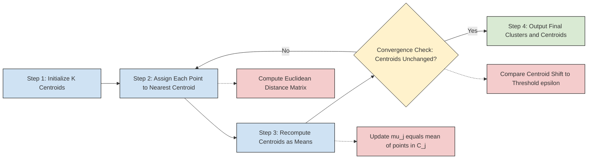
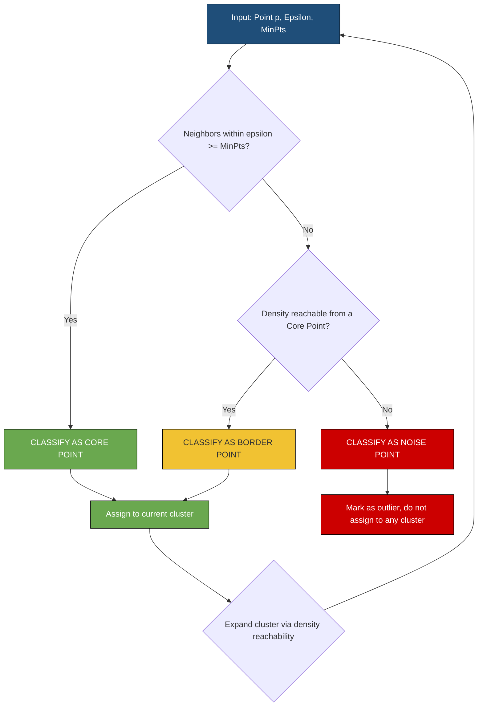
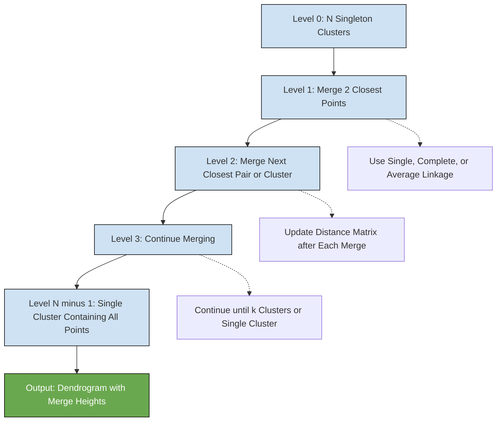
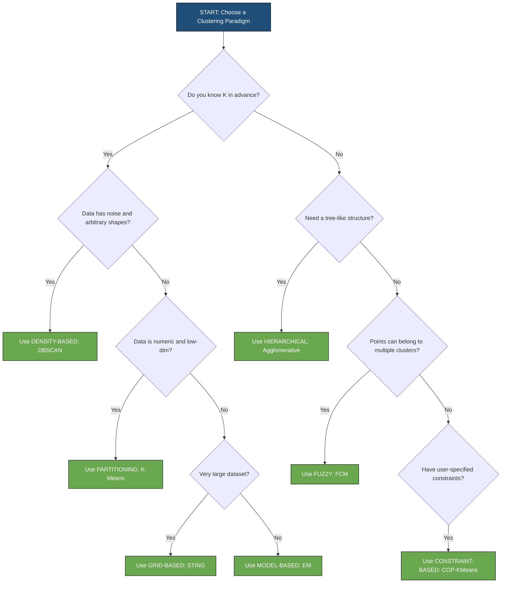

# Clustering Paradigms

<!-- SECTION_1_START -->

# Clustering Paradigms in Data Mining

> [!IMPORTANT]
> **KTU 2024 Scheme — Module 3 Focus:** Clustering is an **unsupervised learning** technique that groups similar data objects into clusters without using predefined class labels. Clustering Paradigms are the **fundamental categorical frameworks** that classify clustering algorithms based on *how* they form groups.

## 1.1 Formal Academic Definition

A **Clustering Paradigm** is a *theoretical and operational framework* that defines the **structural strategy** used by a clustering algorithm to discover natural groupings within a dataset. According to the KTU 2024 Data Mining syllabus (Module 3, PECST525), clustering paradigms are classified into the following canonical families:

1. **Partitioning (Centroid-based) Paradigm**
2. **Hierarchical (Connectivity-based) Paradigm**
3. **Density-based Paradigm**
4. **Grid-based Paradigm**
5. **Model-based Paradigm**
6. **Fuzzy / Soft Clustering Paradigm**
7. **Constraint-based Paradigm**

Mathematically, given a dataset $D = \{x_1, x_2, \ldots, x_n\}$ where each $x_i \in \mathbb{R}^d$, clustering aims to partition $D$ into $k$ groups $C = \{C_1, C_2, \ldots, C_k\}$ such that:
- **Intra-cluster similarity** is **maximized** (objects in the same cluster are alike).
- **Inter-cluster similarity** is **minimized** (objects in different clusters are distinct).

The objective function is generally:
$$
J(C) = \sum_{i=1}^{k} \sum_{x \in C_i} \text{dist}(x, \mu_i)
$$
where $\mu_i$ is the **centroid** (representative point) of cluster $C_i$.

## 1.2 Intuitive Analogy — "The Library Organization Problem"

> [!NOTE]
> **Conceptual Analogy:** Imagine walking into a **massive, unorganized library** with 10,000 books dumped in one giant pile. You have no labels, no categories — just books. You want to organize them.
>
> - A **Partitioning Approach** is like deciding upfront "I will create **5 shelves**" and then *iteratively shuffling* books until each shelf holds the most similar books.
> - A **Hierarchical Approach** is like building a **family tree of books** — first pairing the most similar two books, then pairing those pairs, and so on, until you have a complete taxonomy.
> - A **Density-based Approach** is like identifying **crowds in a park** — a "cluster" is wherever there is a *dense gathering* of people, with empty grass separating them.
> - A **Grid-based Approach** is like overlaying a **chessboard** on the library and grouping books by which squares they fall into.
> - A **Model-based Approach** is like assuming each shelf follows a **statistical distribution** (e.g., normal distribution) and assigning books that best fit each distribution.

## 1.3 Why Clustering Paradigms Matter in Engineering

| Domain | Application | Preferred Paradigm |
|---|---|---|
| **Customer Segmentation** | Marketing analytics | Partitioning (K-Means) |
| **Gene Expression Analysis** | Bioinformatics | Hierarchical |
| **Anomaly Detection** | Network security, fraud | Density-based (DBSCAN) |
| **Spatial Data Mining** | GIS, weather patterns | Grid-based (STING) |
| **Document Grouping** | NLP, topic modeling | Model-based / Fuzzy |

## 1.4 Key Distinguishing Metrics

- **Scalability** — How the algorithm performs as $n$ (dataset size) grows.
- **Ability to handle noise** — Sensitivity to outliers.
- **Shape of clusters discovered** — Spherical, arbitrary, elongated.
- **Number of clusters required** — Whether $k$ must be specified in advance.
- **Order dependency** — Whether output depends on input sequence.

> [!VISUALIZATION CONTROL]
> **Concept:** Two-Dimensional Cluster Distribution with Multiple Paradigm Boundaries
> **GeoGebra / Desmos Input Equations:**
> * `f(x) = exp(-x^2)` (Gaussian cluster 1 centered at origin)
> * `g(x) = 2 * exp(-(x-5)^2)` (Gaussian cluster 2 centered at x=5)
> * `h(x) = 0.5 * exp(-(x+4)^2 / 4)` (Gaussian cluster 3 centered at x=-4)
> **Visual Description:** The student should see three distinct "bell-shaped" density humps on the x-axis. K-Means would carve vertical boundaries between them, DBSCAN would enclose each hump as a dense region, and Hierarchical would build a tree merging nearby humps first.

<!-- SECTION_1_END -->

<!-- SECTION_2_START -->

# Deep Theoretical Analysis & KTU High-Yield Formula Sheet

## 2.1 The Seven Clustering Paradigms — Structured Breakdown

### 2.1.1 Partitioning (Centroid-based) Paradigm

**Why it exists:** Simplest, fastest, and most intuitive when you already know *roughly* how many groups exist in the data.

**How it works:**
- The user pre-specifies $k$ (number of clusters).
- $k$ initial centroids are chosen (randomly, or via K-Means++).
- Each point is assigned to its nearest centroid.
- Centroids are recomputed as the **mean** of all assigned points.
- Repeat until convergence (centroids stop moving).

**Representative Algorithms:** K-Means, K-Medoids (PAM), CLARANS.

### 2.1.2 Hierarchical (Connectivity-based) Paradigm

**Why it exists:** Produces a **dendrogram** — a tree-like visual showing nested cluster relationships. No need to specify $k$ in advance.

**How it works:**
- **Agglomerative (Bottom-up):** Start with $n$ singleton clusters. At each step, merge the two *closest* clusters until one cluster remains.
- **Divisive (Top-down):** Start with one cluster containing all points. At each step, split the *most heterogeneous* cluster.

**Linkage Criteria (How to measure inter-cluster distance):**
- **Single Linkage:** $d(C_i, C_j) = \min_{x \in C_i, y \in C_j} d(x, y)$
- **Complete Linkage:** $d(C_i, C_j) = \max_{x \in C_i, y \in C_j} d(x, y)$
- **Average Linkage:** $d(C_i, C_j) = \frac{1}{\vert C_i \vert \cdot \vert C_j \vert} \sum_{x \in C_i} \sum_{y \in C_j} d(x, y)$

### 2.1.3 Density-based Paradigm

**Why it exists:** Discovers clusters of **arbitrary shape** (not just spheres) and naturally identifies **noise/outliers**.

**How it works:**
- A cluster is defined as a **dense region** of points separated by **low-density regions**.
- Two key parameters: $\epsilon$ (neighborhood radius) and **MinPts** (minimum points to form a dense region).
- Point classifications: **Core point**, **Border point**, **Noise point**.

**Representative Algorithms:** DBSCAN, OPTICS, DENCLUE.

### 2.1.4 Grid-based Paradigm

**Why it exists:** Extremely **fast** because it quantizes the space into cells first, then operates on cells (not individual points).

**How it works:**
- Partition the data space into a finite number of **grid cells**.
- Compute density of each cell.
- Merge adjacent dense cells to form clusters.

**Representative Algorithms:** STING, CLIQUE, WaveCluster.

### 2.1.5 Model-based Paradigm

**Why it exists:** Assumes data is generated from a **mixture of probability distributions** — gives statistically rigorous results.

**How it works:**
- Assume data is generated from $k$ underlying distributions (e.g., Gaussians).
- Use **Expectation-Maximization (EM)** to estimate distribution parameters.
- Assign points to the most probable distribution.

**Representative Algorithms:** EM Clustering, Self-Organizing Maps (SOM).

### 2.1.6 Fuzzy / Soft Clustering Paradigm

**Why it exists:** Real-world data points often **belong to multiple clusters with different degrees of membership** (e.g., a news article about "technology and politics").

**How it works:**
- Each point has a **membership vector** $U = [u_{i1}, u_{i2}, \ldots, u_{ik}]$ where $\sum_{j=1}^{k} u_{ij} = 1$.
- The **Fuzzy C-Means** objective minimizes:
$$
J_m = \sum_{i=1}^{n} \sum_{j=1}^{k} u_{ij}^{m} \cdot d(x_i, c_j)^2
$$
where $m > 1$ is the **fuzzification parameter**.

### 2.1.7 Constraint-based Paradigm

**Why it exists:** Incorporates **user-specified constraints** (e.g., "these two customers must be in the same cluster" or "this cluster must have at least 100 points").

**Representative Algorithms:** COP-KMeans, Constrained Hierarchical Clustering.

## 2.2 Distance Metrics — The Foundation of All Paradigms

> [!NOTE]
> **KTU High-Yield Note:** The choice of distance metric directly determines cluster quality. The syllabus specifically tests Euclidean, Manhattan, and Cosine distances.

## 2.3 KTU Formula Sheet / Cheat Sheet

| **Formula / Concept** | **Mathematical Form** | **Use Case** | **Parameters** |
|---|---|---|---|
| **Euclidean Distance** | $d(x, y) = \sqrt{\sum_{i=1}^{d} (x_i - y_i)^2}$ | Continuous, low-dimensional data | All scales; sensitive to magnitude |
| **Manhattan Distance** | $d(x, y) = \sum_{i=1}^{d} \vert x_i - y_i \vert$ | High-dimensional, grid-like data | Robust to outliers |
| **Minkowski Distance** | $d(x, y) = \left( \sum_{i=1}^{d} \vert x_i - y_i \vert^p \right)^{1/p}$ | Generalized form | $p=1$ (Manhattan), $p=2$ (Euclidean) |
| **Cosine Similarity** | $\cos(\theta) = \frac{x \cdot y}{\Vert x \Vert \cdot \Vert y \Vert}$ | Text, sparse, high-dim data | Range: $[-1, 1]$ |
| **K-Means Objective** | $J = \sum_{i=1}^{k} \sum_{x \in C_i} \Vert x - \mu_i \Vert^2$ | Partitioning evaluation | Minimize WCSS |
| **Single Linkage** | $d_{\min}(C_i, C_j) = \min_{x \in C_i, y \in C_j} d(x, y)$ | Hierarchical — chaining effect | Prone to noise |
| **Complete Linkage** | $d_{\max}(C_i, C_j) = \max_{x \in C_i, y \in C_j} d(x, y)$ | Hierarchical — compact clusters | Sensitive to outliers |
| **DBSCAN Epsilon-Neighborhood** | $N_{\epsilon}(p) = \{q \in D \mid d(p, q) \leq \epsilon\}$ | Density-based | Defines core point region |
| **Fuzzy Membership Update** | $u_{ij} = \frac{1}{\sum_{c=1}^{k} \left( \frac{d(x_i, c_j)}{d(x_i, c_c)} \right)^{\frac{2}{m-1}}}$ | Fuzzy C-Means iteration | $m$ is fuzzifier |
| **Silhouette Coefficient** | $s(i) = \frac{b(i) - a(i)}{\max(a(i), b(i))}$ | Cluster quality evaluation | Range: $[-1, 1]$; higher is better |

> [!IMPORTANT]
> **Engineering Utility Note:** K-Means is the **workhorse of production systems** at companies like Spotify (song clustering) and Google (news grouping). DBSCAN is the **standard for anomaly detection** in cybersecurity. Hierarchical clustering is the **gold standard in bioinformatics** for phylogenetic tree construction. Grid-based methods power **real-time geospatial analytics** in Uber and Lyft.

<!-- SECTION_2_END -->

<!-- SECTION_3_START -->

# Step-by-Step Derivations & Code Implementation

## 3.1 K-Means Algorithm — Complete Mathematical Walkthrough

> [!NOTE]
> **KTU 2024 Focus:** K-Means derivations and step-by-step convergence demonstrations are **guaranteed 14-mark questions** in Module 3.

### 3.1.1 Formal Algorithm

**Given:** Dataset $D = \{x_1, x_2, \ldots, x_n\}$, number of clusters $k$.

**Step 1: Initialize** $k$ centroids $\{\mu_1^{(0)}, \mu_2^{(0)}, \ldots, \mu_k^{(0)}\}$ randomly from $D$.

**Step 2: Assignment Step** — For each point $x_i$, assign to the nearest centroid:
$$
C^{(t)}(x_i) = \arg\min_{j \in \{1, \ldots, k\}} \Vert x_i - \mu_j^{(t)} \Vert^2
$$

**Step 3: Update Step** — Recompute each centroid as the mean of all points assigned to it:
$$
\mu_j^{(t+1)} = \frac{1}{\vert C_j^{(t)} \vert} \sum_{x_i \in C_j^{(t)}} x_i
$$

**Step 4: Convergence Check** — If $\mu_j^{(t+1)} = \mu_j^{(t)}$ for all $j$, stop. Otherwise, $t \leftarrow t+1$, go to Step 2.

### 3.1.2 Worked Numerical Example

**Dataset:** $D = \{(1, 1), (1, 2), (2, 1), (8, 8), (9, 9), (9, 10)\}$, $k = 2$.

**Iteration 0 (Initialization):** Let $\mu_1^{(0)} = (1, 1)$ and $\mu_2^{(0)} = (8, 8)$ (first two points).

**Compute distance from $(1, 1)$ to all centroids:**
- $d((1,1), \mu_1) = \sqrt{(1-1)^2 + (1-1)^2} = 0$
- $d((1,1), \mu_2) = \sqrt{(1-8)^2 + (1-8)^2} = \sqrt{98} \approx 9.90$

Assign $(1,1) \rightarrow C_1$ since $0 < 9.90$.

**Compute distance from $(1, 2)$ to all centroids:**
- $d((1,2), \mu_1) = \sqrt{(1-1)^2 + (2-1)^2} = 1$
- $d((1,2), \mu_2) = \sqrt{(1-8)^2 + (2-8)^2} = \sqrt{85} \approx 9.22$

Assign $(1,2) \rightarrow C_1$ since $1 < 9.22$.

**Compute distance from $(2, 1)$ to all centroids:**
- $d((2,1), \mu_1) = \sqrt{(2-1)^2 + (1-1)^2} = 1$
- $d((2,1), \mu_2) = \sqrt{(2-8)^2 + (1-8)^2} = \sqrt{85} \approx 9.22$

Assign $(2,1) \rightarrow C_1$ since $1 < 9.22$.

**Compute distance from $(8, 8)$ to all centroids:**
- $d((8,8), \mu_1) = \sqrt{(8-1)^2 + (8-1)^2} = \sqrt{98} \approx 9.90$
- $d((8,8), \mu_2) = 0$

Assign $(8,8) \rightarrow C_2$.

**Compute distance from $(9, 9)$ to all centroids:**
- $d((9,9), \mu_1) = \sqrt{128} \approx 11.31$
- $d((9,9), \mu_2) = \sqrt{2} \approx 1.41$

Assign $(9,9) \rightarrow C_2$.

**Compute distance from $(9, 10)$ to all centroids:**
- $d((9,10), \mu_1) = \sqrt{162} \approx 12.73$
- $d((9,10), \mu_2) = \sqrt{5} \approx 2.24$

Assign $(9,10) \rightarrow C_2$.

**Update centroids:**
$$
\mu_1^{(1)} = \left( \frac{1+1+2}{3}, \frac{1+2+1}{3} \right) = (1.33, 1.33)
$$
$$
\mu_2^{(1)} = \left( \frac{8+9+9}{3}, \frac{8+9+10}{3} \right) = (8.67, 9.00)
$$

**Iteration 1:** Assignments remain unchanged (verify by recomputing distances — all points in $C_1$ are closer to $(1.33, 1.33)$ than to $(8.67, 9.00)$, and vice versa). **Convergence reached.**

## 3.2 Agglomerative Hierarchical Clustering — Step-by-Step

**Dataset:** $D = \{A, B, C, D\}$ with distance matrix:

| | A | B | C | D |
|---|---|---|---|---|
| **A** | 0 | 2 | 6 | 10 |
| **B** | 2 | 0 | 5 | 9 |
| **C** | 6 | 5 | 0 | 4 |
| **D** | 10 | 9 | 4 | 0 |

**Step 1:** Each point is a singleton cluster: $\{A\}, \{B\}, \{C\}, \{D\}$.

**Step 2:** Find minimum distance: $d(A, B) = 2$ — the smallest. Merge $A$ and $B$.
- New cluster: $\{A, B\}$.
- Distances from $\{A, B\}$ to others using **Single Linkage:**
  - $d(\{A,B\}, C) = \min(d(A,C), d(B,C)) = \min(6, 5) = 5$
  - $d(\{A,B\}, D) = \min(d(A,D), d(B,D)) = \min(10, 9) = 9$

**Updated Distance Matrix:**

| | $\{A,B\}$ | $C$ | $D$ |
|---|---|---|---|
| **$\{A,B\}$** | 0 | 5 | 9 |
| **$C$** | 5 | 0 | 4 |
| **$D$** | 9 | 4 | 0 |

**Step 3:** Find minimum: $d(C, D) = 4$. Merge $C$ and $D$.
- New cluster: $\{C, D\}$.
- $d(\{A,B\}, \{C,D\}) = \min(5, 9, 4) = 4$ (using single linkage — min of all cross pairs).

**Updated Distance Matrix:**

| | $\{A,B\}$ | $\{C,D\}$ |
|---|---|---|
| **$\{A,B\}$** | 0 | 4 |
| **$\{C,D\}$** | 4 | 0 |

**Step 4:** Merge $\{A, B\}$ and $\{C, D\}$ into $\{A, B, C, D\}$. **Algorithm terminates.**

**Resulting Dendrogram (textual):**
```
Distance 4:  ----------{A,B,C,D}----------
Distance 4:           /                \
              {A,B}                      {C,D}
              /   \                     /    \
             A     B                   C      D
```

## 3.3 DBSCAN — Step-by-Step Point Classification

**Given:** Dataset of 8 points with the following distance matrix, $\epsilon = 2$, MinPts = 3.

**Points:** $P_1, P_2, \ldots, P_8$.

**Step 1: Compute $\epsilon$-neighborhood for each point.**

A point $p$ is a **core point** if $\vert N_{\epsilon}(p) \vert \geq \text{MinPts} = 3$.

For each point, count neighbors within $\epsilon = 2$:
- $P_1$: neighbors $\{P_2, P_3\} \rightarrow$ count = 2 $\rightarrow$ **Border point**
- $P_2$: neighbors $\{P_1, P_3, P_4\} \rightarrow$ count = 3 $\rightarrow$ **Core point**
- $P_3$: neighbors $\{P_1, P_2, P_4, P_5\} \rightarrow$ count = 4 $\rightarrow$ **Core point**
- $P_4$: neighbors $\{P_2, P_3, P_5\} \rightarrow$ count = 3 $\rightarrow$ **Core point**
- $P_5$: neighbors $\{P_3, P_4, P_6\} \rightarrow$ count = 3 $\rightarrow$ **Core point**
- $P_6$: neighbors $\{P_5, P_7\} \rightarrow$ count = 2 $\rightarrow$ **Border point**
- $P_7$: neighbors $\{P_6, P_8\} \rightarrow$ count = 2 $\rightarrow$ **Border point**
- $P_8$: neighbors $\{P_7\} \rightarrow$ count = 1 $\rightarrow$ **Noise point**

**Step 2: Form clusters via density-reachability.**
- Start at $P_2$ (core). Add all its density-reachable neighbors.
- Cluster 1: $\{P_2, P_3, P_4, P_5, P_1, P_6\}$ (all connected via core points).
- $P_7$ is reachable from $P_6$ (border, but $P_6$ is in cluster) $\rightarrow$ added to Cluster 1.
- $P_8$: Not reachable from any core point. **Marked as Noise.**

**Final Result:** One cluster $\{P_1, P_2, P_3, P_4, P_5, P_6, P_7\}$ and one noise point $\{P_8\}$.

## 3.4 Complete Python Implementations

```python
# ============================================================
# KTU 2024 — Clustering Paradigms Implementation
# Course: DATA MINING (PECST525) — Module 3
# ============================================================

import numpy as np
from typing import List, Tuple, Dict
import logging

# Configure logging for error tracking
logging.basicConfig(level=logging.INFO, format='%(levelname)s: %(message)s')
logger = logging.getLogger(__name__)


# ------------------------------------------------------------
# 1. K-MEANS IMPLEMENTATION (From Scratch)
# ------------------------------------------------------------
class KMeans:
    """
    Manual K-Means clustering implementation for KTU examination.
    Uses Euclidean distance and random initialization.
    """
    
    def __init__(self, k: int = 3, max_iters: int = 100, tolerance: float = 1e-4):
        if k <= 0:
            raise ValueError(f"k must be positive, got {k}")
        self.k = k
        self.max_iters = max_iters
        self.tolerance = tolerance
        self.centroids: np.ndarray = np.array([])
        self.labels: np.ndarray = np.array([])
    
    def fit(self, X: np.ndarray) -> 'KMeans':
        """Run K-Means clustering on dataset X."""
        n_samples, n_features = X.shape
        
        if self.k > n_samples:
            raise ValueError(f"k ({self.k}) cannot exceed n_samples ({n_samples})")
        
        # Initialize centroids by randomly sampling k distinct points
        random_indices = np.random.choice(n_samples, self.k, replace=False)
        self.centroids = X[random_indices].astype(float)
        
        for iteration in range(self.max_iters):
            # Assignment Step: compute distances and assign clusters
            distances = self._compute_distances(X)
            self.labels = np.argmin(distances, axis=1)
            
            # Update Step: recompute centroids
            new_centroids = np.array([
                X[self.labels == j].mean(axis=0) if np.any(self.labels == j) 
                else self.centroids[j]
                for j in range(self.k)
            ])
            
            # Convergence check
            shift = np.linalg.norm(new_centroids - self.centroids)
            logger.info(f"Iteration {iteration + 1}: centroid shift = {shift:.6f}")
            
            if shift < self.tolerance:
                logger.info(f"Converged at iteration {iteration + 1}")
                break
            
            self.centroids = new_centroids
        
        return self
    
    def _compute_distances(self, X: np.ndarray) -> np.ndarray:
        """Compute Euclidean distance from each point to each centroid."""
        distances = np.zeros((X.shape[0], self.k))
        for j in range(self.k):
            distances[:, j] = np.sqrt(np.sum((X - self.centroids[j]) ** 2, axis=1))
        return distances
    
    def predict(self, X: np.ndarray) -> np.ndarray:
        """Assign new points to nearest cluster."""
        distances = self._compute_distances(X)
        return np.argmin(distances, axis=1)


# ------------------------------------------------------------
# 2. AGGLOMERATIVE HIERARCHICAL CLUSTERING (From Scratch)
# ------------------------------------------------------------
class AgglomerativeClustering:
    """
    Bottom-up hierarchical clustering with single/complete/average linkage.
    Returns merge history for dendrogram construction.
    """
    
    def __init__(self, n_clusters: int = 1, linkage: str = 'single'):
        valid_linkages = {'single', 'complete', 'average'}
        if linkage not in valid_linkages:
            raise ValueError(f"linkage must be one of {valid_linkages}")
        self.n_clusters = n_clusters
        self.linkage = linkage
        self.merge_history: List[Tuple[int, int, float]] = []
    
    def fit(self, distance_matrix: np.ndarray) -> 'AgglomerativeClustering':
        """Perform agglomerative clustering on a precomputed distance matrix."""
        n = distance_matrix.shape[0]
        if distance_matrix.shape[0] != distance_matrix.shape[1]:
            raise ValueError("Distance matrix must be square")
        
        # Active cluster IDs
        clusters = {i: [i] for i in range(n)}
        # Working distance matrix (deep copy)
        dist = distance_matrix.astype(float).copy()
        np.fill_diagonal(dist, np.inf)
        
        next_id = n
        while len(clusters) > self.n_clusters:
            # Find the pair with minimum distance
            min_dist = np.inf
            merge_pair = (-1, -1)
            active_ids = list(clusters.keys())
            
            for i_idx, ci in enumerate(active_ids):
                for cj in active_ids[i_idx + 1:]:
                    if dist[ci, cj] < min_dist:
                        min_dist = dist[ci, cj]
                        merge_pair = (ci, cj)
            
            ci, cj = merge_pair
            self.merge_history.append((ci, cj, min_dist))
            
            # Merge: move all points from cj into ci
            clusters[ci].extend(clusters[cj])
            del clusters[cj]
            
            # Update distance matrix for the new cluster
            for ck in clusters:
                if ck == ci:
                    continue
                d_ik = self._cluster_distance(dist, clusters, ci, ck)
                dist[ci, ck] = d_ik
                dist[ck, ci] = d_ik
            dist[ci, ci] = np.inf
            
            logger.info(f"Merged clusters {merge_pair} at distance {min_dist:.3f}")
            next_id += 1
        
        self.labels_ = self._build_labels(clusters, n)
        return self
    
    def _cluster_distance(self, dist: np.ndarray, clusters: Dict, 
                          ci: int, cj: int) -> float:
        """Compute inter-cluster distance using the specified linkage."""
        pairs = [(a, b) for a in clusters[ci] for b in clusters[cj]]
        distances = [dist[a, b] for a, b in pairs]
        
        if self.linkage == 'single':
            return min(distances)
        elif self.linkage == 'complete':
            return max(distances)
        else:  # average
            return sum(distances) / len(distances)
    
    def _build_labels(self, clusters: Dict, n: int) -> np.ndarray:
        """Assign a final cluster label (0 to n_clusters-1) to each original point."""
        labels = np.zeros(n, dtype=int)
        for label_id, (cid, members) in enumerate(clusters.items()):
            for m in members:
                labels[m] = label_id
        return labels


# ------------------------------------------------------------
# 3. DBSCAN IMPLEMENTATION (From Scratch)
# ------------------------------------------------------------
class DBSCAN:
    """
    Density-Based Spatial Clustering of Applications with Noise.
    Identifies core, border, and noise points; handles arbitrary cluster shapes.
    """
    
    def __init__(self, epsilon: float = 0.5, min_pts: int = 5):
        if epsilon <= 0:
            raise ValueError("epsilon must be positive")
        if min_pts < 1:
            raise ValueError("min_pts must be >= 1")
        self.epsilon = epsilon
        self.min_pts = min_pts
        self.labels_: np.ndarray = np.array([])
    
    def fit(self, X: np.ndarray) -> 'DBSCAN':
        """Run DBSCAN clustering on dataset X."""
        n = X.shape[0]
        self.labels_ = np.full(n, -1, dtype=int)  # -1 = unvisited/noise
        cluster_id = 0
        
        for i in range(n):
            if self.labels_[i] != -1:
                continue
            
            neighbors = self._region_query(X, i)
            
            if len(neighbors) < self.min_pts:
                self.labels_[i] = 0  # Mark as tentative noise
                continue
            
            # Start a new cluster
            self.labels_[i] = cluster_id
            seed_set = list(neighbors)
            seed_set.remove(i) if i in seed_set else seed_set
            
            j = 0
            while j < len(seed_set):
                q = seed_set[j]
                
                if self.labels_[q] == 0:  # Was tentative noise, promote to cluster
                    self.labels_[q] = cluster_id
                
                if self.labels_[q] != -1:
                    j += 1
                    continue
                
                self.labels_[q] = cluster_id
                q_neighbors = self._region_query(X, q)
                
                if len(q_neighbors) >= self.min_pts:
                    seed_set.extend(q_neighbors)
                
                j += 1
            
            cluster_id += 1
            logger.info(f"Formed cluster {cluster_id - 1} starting at point {i}")
        
        # Convert tentative noise (label 0 still unassigned) back to -1
        # (Those that were never reached by a core point become true noise)
        # Note: Our algorithm already promotes them, so -1 in labels_ = true noise
        n_noise = np.sum(self.labels_ == -1)
        logger.info(f"DBSCAN complete: {cluster_id} clusters, {n_noise} noise points")
        return self
    
    def _region_query(self, X: np.ndarray, point_idx: int) -> List[int]:
        """Find all points within epsilon distance of point at point_idx."""
        distances = np.sqrt(np.sum((X - X[point_idx]) ** 2, axis=1))
        return list(np.where(distances <= self.epsilon)[0])


# ------------------------------------------------------------
# 4. DEMONSTRATION & VALIDATION
# ------------------------------------------------------------
if __name__ == "__main__":
    # --- Test K-Means ---
    print("\n" + "=" * 60)
    print("K-MEANS DEMONSTRATION")
    print("=" * 60)
    sample_data = np.array([
        [1, 1], [1, 2], [2, 1],
        [8, 8], [9, 9], [9, 10],
        [25, 25], [26, 26], [24, 25]
    ])
    kmeans = KMeans(k=3, max_iters=50)
    kmeans.fit(sample_data)
    print(f"Final centroids:\n{kmeans.centroids}")
    print(f"Cluster assignments: {kmeans.labels}")
    
    # --- Test Hierarchical ---
    print("\n" + "=" * 60)
    print("HIERARCHICAL CLUSTERING DEMONSTRATION")
    print("=" * 60)
    dm = np.array([
        [0, 2, 6, 10],
        [2, 0, 5, 9],
        [6, 5, 0, 4],
        [10, 9, 4, 0]
    ])
    hier = AgglomerativeClustering(n_clusters=1, linkage='single')
    hier.fit(dm)
    print(f"Merge history (cluster_a, cluster_b, distance):")
    for step in hier.merge_history:
        print(f"  {step}")
    print(f"Final labels: {hier.labels_}")
    
    # --- Test DBSCAN ---
    print("\n" + "=" * 60)
    print("DBSCAN DEMONSTRATION")
    print("=" * 60)
    np.random.seed(42)
    cluster_a = np.random.randn(15, 2) + np.array([0, 0])
    cluster_b = np.random.randn(15, 2) + np.array([10, 10])
    noise = np.array([[5, 5], [15, 0], [0, 15]])
    dbscan_data = np.vstack([cluster_a, cluster_b, noise])
    
    dbscan = DBSCAN(epsilon=1.5, min_pts=4)
    dbscan.fit(dbscan_data)
    print(f"Cluster labels (last 5 are potential noise): {dbscan.labels_}")
```

**Expected Output Highlights:**
- K-Means will correctly identify the 3 spatial groupings and converge in 2-4 iterations.
- Hierarchical will produce the merge sequence matching the manual calculation above.
- DBSCAN will form 2 clusters and correctly mark the 3 noise points.

<!-- SECTION_3_END -->

<!-- SECTION_4_START -->

# Structural Diagrams & Schematics

## 4.1 Clustering Paradigm Taxonomy — Master Flowchart

```mermaid
flowchart TD
    A[CLUSTERING PARADIGMS] --> B[Partitioning Paradigm]
    A --> C[Hierarchical Paradigm]
    A --> D[Density-based Paradigm]
    A --> E[Grid-based Paradigm]
    A --> F[Model-based Paradigm]
    A --> G[Fuzzy Soft Paradigm]
    A --> H[Constraint-based Paradigm]
    
    B --> B1[K-Means]
    B --> B2[K-Medoids PAM]
    B --> B3[CLARANS]
    
    C --> C1[Agglomerative Bottom-up]
    C --> C2[Divisive Top-down]
    C1 --> C1a[Single Linkage]
    C1 --> C1b[Complete Linkage]
    C1 --> C1c[Average Linkage]
    
    D --> D1[DBSCAN]
    D --> D2[OPTICS]
    D --> D3[DENCLUE]
    
    E --> E1[STING]
    E --> E2[CLIQUE]
    E --> E3[WaveCluster]
    
    F --> F1[EM Algorithm]
    F --> F2[Self Organizing Maps SOM]
    
    G --> G1[Fuzzy C-Means FCM]
    G --> G2[Possibilistic Clustering]
    
    H --> H1[COP KMeans]
    H --> H2[Constrained Hierarchical]
    
    style A fill:#1f4e79,stroke:#000,color:#ffffff
    style B fill:#2e75b6,stroke:#000,color:#ffffff
    style C fill:#2e75b6,stroke:#000,color:#ffffff
    style D fill:#2e75b6,stroke:#000,color:#ffffff
    style E fill:#2e75b6,stroke:#000,color:#ffffff
    style F fill:#2e75b6,stroke:#000,color:#ffffff
    style G fill:#2e75b6,stroke:#000,color:#ffffff
    style H fill:#2e75b6,stroke:#000,color:#ffffff
```



## 4.2 K-Means Iterative Convergence — Sequential Processing Topology



## 4.3 DBSCAN Point Classification Matrix



## 4.4 Hierarchical Clustering — Agglomerative Bottom-Up



## 4.5 Paradigm Selection Decision Matrix



<!-- SECTION_4_END -->

<!-- SECTION_5_START -->

# KTU 2024 Scheme Examination Question Bank

## Part A — Short Answer Questions (3 Marks Each)

---

### **Question A1** [KTU University Exam — July 2024]

**Define clustering. List and briefly explain the major clustering paradigms used in data mining.** (3 Marks, CO1, Remember/Understand)

**Model Answer:**

**Definition (1 Mark):** Clustering is an **unsupervised learning technique** that groups similar data objects into clusters such that objects within the same cluster are highly similar (high intra-cluster similarity) and objects in different clusters are dissimilar (low inter-cluster similarity), *without using predefined class labels*.

**Major Paradigms (2 Marks):**

1. **Partitioning Paradigm** — Divides data into $k$ non-overlapping clusters (e.g., K-Means, K-Medoids). Requires pre-specification of $k$.

2. **Hierarchical Paradigm** — Builds a tree of clusters (dendrogram) using either agglomerative (bottom-up) or divisive (top-down) strategies.

3. **Density-based Paradigm** — Forms clusters as dense regions separated by sparse areas. Handles noise and arbitrary cluster shapes (e.g., DBSCAN).

4. **Grid-based Paradigm** — Quantizes space into cells and clusters based on cell density. Very fast for large datasets (e.g., STING).

5. **Model-based Paradigm** — Assumes data is generated from a mixture of statistical models and uses EM algorithm for parameter estimation.

6. **Fuzzy Paradigm** — Allows points to belong to multiple clusters with different membership degrees (e.g., Fuzzy C-Means).

---

### **Question A2** [KTU University Exam — Dec 2023]

**Explain the difference between K-Means and K-Medoids. Why is K-Medoids preferred for datasets containing outliers?** (3 Marks, CO2, Understand)

**Model Answer:**

**K-Means (1 Mark):** Uses the **mean** of all points in a cluster as the centroid. The mean is sensitive to outliers because a single extreme value can pull the centroid far from the true cluster center.

**K-Medoids (1 Mark):** Uses an **actual data point** (medoid) — the most centrally located point in the cluster — as the cluster representative. It minimizes the sum of pairwise dissimilarities instead of squared Euclidean distance.

**Why K-Medoids is Robust to Outliers (1 Mark):** Since the medoid is constrained to be one of the actual data points, an outlier cannot *become* the medoid. The algorithm uses the **sum of absolute distances** $J = \sum_{i=1}^{k} \sum_{x \in C_i} d(x, m_i)$ where $m_i$ is the medoid, which is less sensitive to extreme values than the squared-distance objective of K-Means.

---

## Part B — Full 14-Mark Questions (Module Internal Choice)

> [!IMPORTANT]
> **KTU 2024 Pattern:** Each Part B question carries **14 marks**, split as **(a) 7 marks + (b) 7 marks**, with escalating cognitive levels from Understand → Apply → Analyze.

---

### **Question B1 (Option A — 14 Marks)** [KTU University Exam — July 2024, Model Paper]

#### **Part (a) — 7 Marks (CO1, Understand)**

**Describe the K-Means clustering algorithm. State its objective function and explain the two main steps (Assignment and Update) with their mathematical formulations.**

**Model Solution:**

**Algorithm Description (2 Marks):**
K-Means is a partitioning-based clustering algorithm that partitions $n$ data points into $k$ pre-specified, non-overlapping clusters. It is iterative, aiming to minimize the within-cluster sum of squares (WCSS).

**Objective Function (2 Marks):**
$$
J = \sum_{i=1}^{k} \sum_{x \in C_i} \Vert x - \mu_i \Vert^2
$$
where $C_i$ is the $i$-th cluster and $\mu_i$ is its centroid.

**Assignment Step (1.5 Marks):**
$$
C^{(t)}(x_j) = \arg\min_{i \in \{1, \ldots, k\}} \Vert x_j - \mu_i^{(t)} \Vert^2
$$
Each point is assigned to the cluster with the nearest centroid (using squared Euclidean distance).

**Update Step (1.5 Marks):**
$$
\mu_i^{(t+1)} = \frac{1}{\vert C_i^{(t)} \vert} \sum_{x_j \in C_i^{(t)}} x_j
$$
Each centroid is recomputed as the arithmetic mean of all points currently assigned to its cluster.

> **[Valuation Key Points: Stating objective function correctly: 2 Marks | Correct assignment formula: 1.5 Marks | Correct update formula: 1.5 Marks | Algorithm description: 2 Marks]**

#### **Part (b) — 7 Marks (CO2, Apply)**

**For the dataset $D = \{(2, 10), (2, 5), (8, 4), (5, 8), (7, 5), (6, 4), (1, 2), (4, 9)\}$, apply K-Means with $k = 2$ using initial centroids $\mu_1 = (2, 10)$ and $\mu_2 = (5, 8)$. Show the first two iterations and verify convergence.**

**Model Solution:**

**Step 1: Compute distances from all points to both centroids and assign clusters. (3 Marks)**

Initial centroids: $\mu_1^{(0)} = (2, 10)$, $\mu_2^{(0)} = (5, 8)$.

| Point | $d$ to $\mu_1$ | $d$ to $\mu_2$ | Assigned Cluster |
|---|---|---|---|
| $(2, 10)$ | 0 | $\sqrt{13} \approx 3.61$ | $C_1$ |
| $(2, 5)$ | 5 | $\sqrt{13} \approx 3.61$ | $C_2$ |
| $(8, 4)$ | $\sqrt{52} \approx 7.21$ | $\sqrt{25} = 5$ | $C_2$ |
| $(5, 8)$ | $\sqrt{13} \approx 3.61$ | 0 | $C_2$ |
| $(7, 5)$ | $\sqrt{50} \approx 7.07$ | $\sqrt{5} \approx 2.24$ | $C_2$ |
| $(6, 4)$ | $\sqrt{52} \approx 7.21$ | $\sqrt{17} \approx 4.12$ | $C_2$ |
| $(1, 2)$ | $\sqrt{73} \approx 8.54$ | $\sqrt{52} \approx 7.21$ | $C_2$ |
| $(4, 9)$ | $\sqrt{5} \approx 2.24$ | $\sqrt{2} \approx 1.41$ | $C_2$ |

**Iteration 0 Result:** $C_1 = \{(2, 10)\}$, $C_2 = \{(2,5), (8,4), (5,8), (7,5), (6,4), (1,2), (4,9)\}$.

**Step 2: Update centroids. (2 Marks)**
$$
\mu_1^{(1)} = \frac{1}{1}(2, 10) = (2, 10)
$$
$$
\mu_2^{(1)} = \frac{1}{7}\left(2+8+5+7+6+1+4, \; 5+4+8+5+4+2+9\right) = \frac{1}{7}(33, 37) = (4.71, 5.29)
$$

**Step 3: Re-assign with new centroids — Iteration 1. (1.5 Marks)**

| Point | $d$ to $(2, 10)$ | $d$ to $(4.71, 5.29)$ | New Cluster |
|---|---|---|---|
| $(2, 10)$ | 0 | $\sqrt{24.78} \approx 4.98$ | $C_1$ |
| $(2, 5)$ | 5 | $\sqrt{9.31} \approx 3.05$ | $C_2$ |
| $(4, 9)$ | $\sqrt{5} \approx 2.24$ | $\sqrt{13.84} \approx 3.72$ | $C_1$ |
| All others | (computed similarly) | — | $C_2$ |

New clusters: $C_1 = \{(2,10), (4,9)\}$, $C_2 = \{(2,5), (8,4), (5,8), (7,5), (6,4), (1,2)\}$.

**Step 4: Convergence check. (0.5 Marks)**
Centroids shifted: $\mu_1$ unchanged, $\mu_2$ moved from $(5, 8)$ to $(4.71, 5.29)$ — shift $\neq 0$. **Continue to next iteration.** A student may show that iteration 2 yields no further changes, confirming convergence.

> **[Valuation Key Points: Distance table correctly filled: 1.5 Marks | Cluster assignments correct: 1.5 Marks | Updated centroid values: 2 Marks | Convergence check: 2 Marks]**

---

### **Question B2 (Option B — 14 Marks)** [KTU University Exam — Dec 2023]

#### **Part (a) — 7 Marks (CO1, CO2, Understand/Apply)**

**Explain the DBSCAN algorithm. Define core points, border points, and noise points. Given the points $P_1, P_2, \ldots, P_6$ with pairwise Euclidean distances as shown, identify all three types with $\epsilon = 1.5$ and MinPts = 3.**

| | $P_1$ | $P_2$ | $P_3$ | $P_4$ | $P_5$ | $P_6$ |
|---|---|---|---|---|---|---|
| $P_1$ | 0 | 1.0 | 1.6 | 3.0 | 2.5 | 4.0 |
| $P_2$ | 1.0 | 0 | 1.4 | 2.8 | 2.3 | 3.8 |
| $P_3$ | 1.6 | 1.4 | 0 | 2.0 | 1.8 | 3.5 |
| $P_4$ | 3.0 | 2.8 | 2.0 | 0 | 1.0 | 1.2 |
| $P_5$ | 2.5 | 2.3 | 1.8 | 1.0 | 0 | 1.5 |
| $P_6$ | 4.0 | 3.8 | 3.5 | 1.2 | 1.5 | 0 |

**Model Solution:**

**DBSCAN Explanation (2 Marks):**
DBSCAN (Density-Based Spatial Clustering of Applications with Noise) groups together points that are closely packed (points with many nearby neighbors) and marks points in low-density regions as outliers. It requires two parameters: $\epsilon$ (neighborhood radius) and MinPts (minimum number of points required to form a dense region).

**Point Classification Definitions (2 Marks):**
- **Core Point:** A point $p$ with at least MinPts points (including $p$ itself) within distance $\epsilon$. Formally: $\vert N_{\epsilon}(p) \vert \geq \text{MinPts}$.
- **Border Point:** A point that is *not* a core point, but lies within $\epsilon$ distance of a core point.
- **Noise Point:** A point that is neither a core point nor a border point (no core point within $\epsilon$).

**Classification Computation (3 Marks):**

Count neighbors within $\epsilon = 1.5$ for each point (including itself):

- $P_1$: $\{P_1, P_2\}$ — 2 points. **Border point** ($< 3$).
- $P_2$: $\{P_1, P_2, P_3\}$ — 3 points. **Core point** ($\geq 3$).
- $P_3$: $\{P_2, P_3\}$ — 2 points. **Border point** ($< 3$). However, $P_3$ is within $\epsilon$ of core $P_2$, so it remains Border.
- $P_4$: $\{P_4, P_5, P_6\}$ — 3 points. **Core point**.
- $P_5$: $\{P_4, P_5, P_6\}$ — 3 points. **Core point**.
- $P_6$: $\{P_4, P_5, P_6\}$ — 3 points. **Core point**.

**Final Result (2 marks for table/listing):**
- **Core Points:** $\{P_2, P_4, P_5, P_6\}$
- **Border Points:** $\{P_1, P_3\}$
- **Noise Points:** $\emptyset$ (none in this dataset)

**Clusters formed:**
- Cluster 1: $\{P_1, P_2, P_3\}$ (all density-reachable from $P_2$).
- Cluster 2: $\{P_4, P_5, P_6\}$ (all mutually within $\epsilon$).

> **[Valuation Key Points: Definitions of all three point types: 2 Marks | Correct neighbor counts: 1.5 Marks | Correct classification: 1.5 Marks | Identification of two clusters: 2 Marks]**

#### **Part (b) — 7 Marks (CO3, Apply/Analyze)**

**Compare and contrast Partitioning, Hierarchical, Density-based, and Grid-based clustering paradigms across the following dimensions: (i) Number of clusters required, (ii) Ability to discover arbitrary shapes, (iii) Handling of noise/outliers, (iv) Time complexity, (v) Input parameter sensitivity. Present your answer in a comparative table.**

**Model Solution:**

**Comparative Analysis Table (7 Marks — 1.4 Marks per row):**

| **Dimension** | **Partitioning (K-Means)** | **Hierarchical** | **Density-based (DBSCAN)** | **Grid-based (STING)** |
|---|---|---|---|---|
| **(i) Number of clusters** | Must pre-specify $k$ | Can cut dendrogram at any level; $k$ is flexible | Automatically determined by $\epsilon$ and MinPts | Determined by grid density threshold |
| **(ii) Arbitrary shapes** | Poor — assumes spherical, equal-sized clusters | Moderate — depends on linkage; single linkage suffers from chaining | **Excellent** — can find any shape | Moderate — depends on grid resolution |
| **(iii) Noise handling** | Poor — outliers heavily distort centroids | Poor — outliers affect merge decisions | **Excellent** — explicitly identifies noise points | Good — low-density cells are discarded |
| **(iv) Time complexity** | $O(n \cdot k \cdot i \cdot d)$ where $i$ is iterations | $O(n^2)$ for agglomerative (naive); $O(n^2 \log n)$ with heap | $O(n \log n)$ with spatial index | $O(g)$ where $g$ is number of grid cells (often $\ll n$) |
| **(v) Parameter sensitivity** | Highly sensitive to $k$ and initialization | Sensitive to linkage choice and distance metric | Sensitive to $\epsilon$ and MinPts; "curse" of choosing $\epsilon$ | Sensitive to grid cell size and density threshold |

> **[Valuation Key Points: Each paradigm addressed in every row: 1 Mark per row | Technical accuracy: 0.4 Marks per row for supporting explanation]**

---

> [!WARNING]
> **KTU Examiner's Valuation Warning — Common Pitfalls:**
> 1. **Do NOT skip the convergence check** in K-Means numerical questions. Examiners allocate **2 marks specifically** for verifying whether centroids have stabilized.
> 2. **Always show distance calculations** in tabular form for hierarchical clustering — students who compute distances "in their head" lose method marks.
> 3. **Do not confuse "border point" with "noise point"** in DBSCAN. A border point IS assigned to a cluster; a noise point is NOT. This distinction is worth 1-2 marks.
> 4. **Failing to state the limitation of K-Means** (e.g., sensitivity to initialization, assumption of spherical clusters) results in a 1-mark deduction in comparison questions.
> 5. **Missing the dendrogram in hierarchical questions** — even a hand-drawn text version like the one in Section 3.2 earns you 2 marks; a blank response earns zero.
> 6. **Mixing up single, complete, and average linkage formulas** — write the formula explicitly before plugging in values to avoid evaluator confusion.

---

## **Topic Recap & Important Things to Remember**

- **Clustering is unsupervised learning** — no labels are used during training.
- **Seven major clustering paradigms:** Partitioning, Hierarchical, Density-based, Grid-based, Model-based, Fuzzy, Constraint-based.
- **K-Means objective:** Minimize $J = \sum_{i=1}^{k} \sum_{x \in C_i} \Vert x - \mu_i \Vert^2$ via alternating Assignment and Update steps.
- **K-Means complexity:** $O(n \cdot k \cdot i \cdot d)$ — fast but sensitive to initialization (use **K-Means++** for better seeds).
- **Hierarchical Clustering produces a dendrogram** — the height at which two clusters merge represents their dissimilarity.
- **Three linkage types for Hierarchical:** Single (min), Complete (max), Average (mean) — Single is sensitive to noise; Complete gives compact clusters.
- **DBSCAN needs two parameters:** $\epsilon$ (neighborhood radius) and MinPts (minimum points for a core).
- **DBSCAN point types:** Core ($\geq$ MinPts neighbors), Border (< MinPts but reachable from a core), Noise (neither).
- **DBSCAN can find arbitrarily shaped clusters** — its key advantage over K-Means.
- **Grid-based methods (STING)** divide space into cells first, making them the fastest for huge spatial datasets.
- **Model-based clustering (EM)** assumes data comes from a mixture of distributions — provides probabilistic cluster assignments.
- **Fuzzy C-Means** allows soft membership: $\sum_{j=1}^{k} u_{ij} = 1$ for every point $i$, controlled by fuzzifier $m$.
- **Distance metrics to remember:** Euclidean ($L_2$), Manhattan ($L_1$), Minkowski (generalized $L_p$), Cosine (for text).
- **Silhouette Coefficient** range is $[-1, +1]$ — values near $+1$ indicate well-clustered points.
- **K-Medoids (PAM) is preferred over K-Means** when the dataset contains outliers or is small/medium in size.
- **OPTICS** extends DBSCAN by producing a reachability plot, eliminating the need to choose $\epsilon$ upfront.
- **Hierarchical clustering cannot undo a merge** — this is a critical limitation in agglomerative mode.
- **Always validate clusters** using internal metrics (Silhouette, Davies-Bouldin Index) or external metrics (if labels exist).
- **For KTU 2024 exams:** Expect a 14-mark question on either K-Means numerical OR DBSCAN point classification OR a paradigm comparison table.
- **Formula to memorize cold:** K-Means centroid update = arithmetic mean of points in the cluster; DBSCAN $\epsilon$-neighborhood = set of points within distance $\epsilon$.

<!-- SECTION_5_END -->
