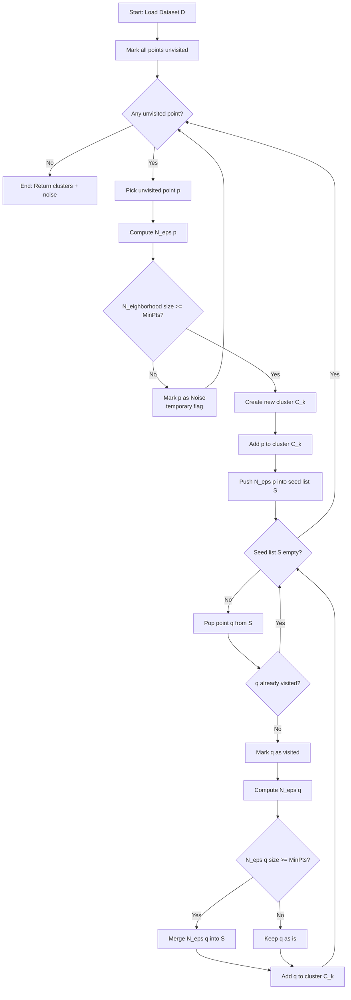
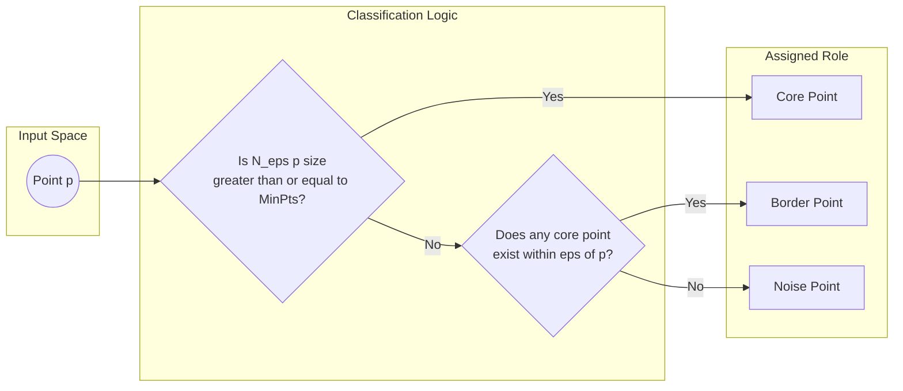
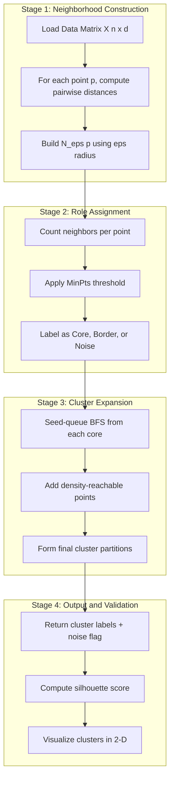

# DBSCAN

<!-- SECTION_1_START -->
# DBSCAN — Density-Based Spatial Clustering of Applications with Noise

## 1.1 Formal Academic Definition (KTU 2024 Syllabus Standard)

**DBSCAN** is a *density-based* unsupervised clustering algorithm proposed by **Ester, Kriegel, Sander, and Xu (1996)**. Unlike partition-based methods (such as K-Means), DBSCAN groups together points that are **closely packed together** (i.e., points with many nearby neighbors) and marks points that lie alone in low-density regions as **outliers / noise**.

Formally, given a dataset $\mathcal{D} = \{x_1, x_2, \ldots, x_n\}$ in a feature space, DBSCAN discovers clusters by inspecting the **$\epsilon$-neighborhood** of every point and classifying it using two hyperparameters:

- **$\epsilon$ (eps)** — the radius of the neighborhood ball around a point.
- **$\text{MinPts}$** — the minimum number of data points required inside that ball for a point to be considered "dense."

> [!IMPORTANT]
> **KTU 2024 Highlight:** DBSCAN is the most-asked density-based clustering method under Module 3 — *Classification* (broadly interpreted under Data Mining taxonomy). It is the *only standard algorithm* in the syllabus that **does not require the user to pre-specify the number of clusters** and that **natively detects outliers**.

## 1.2 Conceptual Analogy & Plain-English Intuition

> [!NOTE]
> **Real-World Analogy: A Night-Time City Map**
> Imagine you are looking at a satellite image of a city at night, where the bright lit-up zones are the houses. **Bright regions (densely lit zones)** are *clusters of people* (cities/towns). **Lonely streetlights scattered in the desert** are *noise points* (a single traveller in the wilderness).

- If a house has at least **MinPts = 4** other houses within a radius of **$\epsilon$ = 1 km**, then that house is a **Core Point** — the heart of a small town.
- A house that is *close enough* to touch such a town (within $\epsilon$ of a core) but is *not* itself a core is a **Border Point** — a suburb.
- A house far from any town is a **Noise Point** — an isolated outpost.

Three "citizens" of the clustering world:

| Citizen | Definition (Plain English) |
|---|---|
| **Core Point** | A point with at least **MinPts** neighbors within distance $\epsilon$. It is a fully "established" member. |
| **Border Point** | A point with **fewer than MinPts** neighbors within $\epsilon$, but lies within $\epsilon$ of a core point. It is a "fringe" member. |
| **Noise Point** | Neither a core nor a border. It is an outlier. |

> [!TIP]
> **Geometric Intuition:** Draw a circle of radius $\epsilon$ around every point. If the circle "catches" at least $\text{MinPts}$ points (including itself), the center is a core. Now imagine these circles overlapping — the connected blob forms one cluster.

## 1.3 The Two Critical Hyperparameters

> [!IMPORTANT]
> These two parameters control **everything** in DBSCAN. KTU board questions often test the effect of changing them.

1. **$\epsilon$ (Epsilon)** — Neighborhood radius.  
   - Small $\epsilon \Rightarrow$ many tiny clusters + lots of noise.  
   - Large $\epsilon \Rightarrow$ a single giant cluster swallows everything.
2. **$\text{MinPts}$** — Minimum neighbors to qualify as core.  
   - The classic Heuristic: $\text{MinPts} \geq \text{Dimensions} + 1$.  
   - A common default used in practice is **$\text{MinPts} = 4$** (for 2-D) or **$\text{MinPts} = 2 \cdot \text{Dimensions}$**.

> [!VISUALIZATION CONTROL]
> **Concept:** Core, Border, and Noise points in a 2-D plane
> **GeoGebra / Desmos Input Points:**
> * Core cluster A: `(1,1), (1.2,0.8), (0.8,1.1), (1.1,1.2), (0.9,0.9)`
> * Border points: `(2,1), (-0.2,0.5)`
> * Noise points: `(7,7), (3,8), (8,3)`
> * $\epsilon = 0.5$, $\text{MinPts} = 4$
> **Visual Description:** You will see one dense blob in the lower-left, two border points clinging to its edge, and three lonely stars in the upper-right region (noise). The circle of radius $\epsilon$ around any core point will visibly contain at least 4 points.

---

<!-- SECTION_1_END -->

<!-- SECTION_2_START -->
# 2. Deep Theoretical Analysis & KTU High-Yield Formula Sheet

## 2.1 Foundational Definitions (Exam-Critical)

> [!NOTE]
> These four definitions are **mandatory vocabulary** for any KTU 13-mark or 14-mark question on DBSCAN.

### Definition 1 — $\epsilon$-Neighborhood
For any data point $p \in \mathcal{D}$, the **$\epsilon$-neighborhood** $N_\epsilon(p)$ is the set of all points within distance $\epsilon$ from $p$ (including $p$ itself):

$$N_\epsilon(p) = \{\, q \in \mathcal{D} \mid \text{dist}(p, q) \leq \epsilon \,\}$$

### Definition 2 — Core Point
A point $p$ is a **core point** if:

$$\vert N_\epsilon(p) \vert \geq \text{MinPts}$$

### Definition 3 — Directly Density-Reachable
A point $q$ is **directly density-reachable** from $p$ if:

- $q \in N_\epsilon(p)$, **and**
- $p$ is a **core point**.

> This relation is **not symmetric** (asymmetric).

### Definition 4 — Density-Reachable & Density-Connected
- **Density-Reachable:** $q$ is density-reachable from $p$ if there exists a chain of points $p_1, p_2, \ldots, p_n$ such that each $p_{i+1}$ is directly density-reachable from $p_i$, with $p_1 = p$ and $p_n = q$.
- **Density-Connected:** Two points $p$ and $q$ are density-connected if there exists a point $o$ such that both $p$ and $q$ are density-reachable from $o$.

> A **cluster** is a **maximal set of density-connected points**.

## 2.2 Distance Metric Used

DBSCAN is metric-agnostic but the standard choice in KTU problems is:

$$\text{dist}(p, q) = \sqrt{\sum_{i=1}^{d} (p_i - q_i)^2} \quad \text{(Euclidean)}$$

Other compatible metrics: **Manhattan**, **Chebyshev**, or any precomputed distance matrix.

## 2.3 DBSCAN Algorithm — Step-by-Step Logic

1. **Initialize:** Mark every point as **unvisited**.
2. Pick a random **unvisited** point $p$. Mark it as **visited**.
3. Compute $N_\epsilon(p)$ — its neighbors.
4. If $\vert N_\epsilon(p) \vert < \text{MinPts}$:  
   → Mark $p$ as **Noise** (temporarily; it may later be relabeled as Border if found near a core).
5. Else (i.e., $p$ is a Core):  
   → Create a new cluster $C$.  
   → Add $p$ and all its $\epsilon$-neighbors to a **seed set** $S$.  
   → While $S$ is not empty:  
   &nbsp;&nbsp;a. Pop a point $q$ from $S$.  
   &nbsp;&nbsp;b. If $q$ was unvisited, mark it visited and recompute $N_\epsilon(q)$.  
   &nbsp;&nbsp;c. If $\vert N_\epsilon(q) \vert \geq \text{MinPts}$, add $N_\epsilon(q)$ to $S$ (cluster expansion).  
   &nbsp;&nbsp;d. Add $q$ to cluster $C$.
6. Repeat from step 2 until all points are visited.
7. **Re-labeling pass:** Any point marked as *noise* that lies within $\epsilon$ of a *core* is upgraded to a **border** member of that cluster.

## 2.4 KTU High-Yield Formula Sheet

> [!IMPORTANT]
> This table summarizes every equation / constant you need to solve a KTU DBSCAN problem. **Memorize the relationships in the "Effect" column.**

| Symbol / Concept | Formula / Definition | Engineering Meaning | Effect of Increasing |
|---|---|---|---|
| $\epsilon$-Neighborhood | $N_\epsilon(p) = \{\, q \in \mathcal{D} \mid \text{dist}(p,q) \leq \epsilon \,\}$ | All points inside the search ball | Larger $\epsilon$ → bigger balls |
| Core condition | $\vert N_\epsilon(p) \vert \geq \text{MinPts}$ | "Dense enough" membership threshold | Higher $\text{MinPts}$ → stricter density |
| Euclidean distance | $d(p,q) = \sqrt{\sum_i (p_i - q_i)^2}$ | Default spatial metric | — |
| MinPts heuristic | $\text{MinPts} \geq d + 1$ (with $d$ = dimensions) | Standard rule-of-thumb | — |
| Time complexity | $O(n \log n)$ with spatial index (KD-Tree / Ball-Tree), $O(n^2)$ naive | Practical runtime cost | Grows with dataset size |
| Noise ratio | $\text{Noise\%} = \frac{\#\text{NoisePoints}}{n} \times 100$ | Quality of fit indicator | Lower $\epsilon$ / higher $\text{MinPts}$ → more noise |

> Note: the absolute-value bars above are encoded as `\vert` so they do not break the markdown table.

## 2.5 Why DBSCAN is Used in Real Engineering

> [!TIP]
> **Real-World Production Uses of DBSCAN**
> - **Anomaly detection** in network traffic and credit-card fraud (one of the most cited KTU examples).
> - **Astronomy** — discovering galaxy clusters from sky-survey data.
> - **Geospatial analysis** — identifying hotspots of disease outbreak or crime.
> - **Image segmentation** when clusters are non-convex (K-Means fails on crescent shapes).
> - **Pre-processing step** before supervised classification to remove outliers.

> [!WARNING]
> **Known Limitation (Frequently Tested):** DBSCAN struggles with **clusters of varying densities** because it uses a *single global* $\epsilon$ and $\text{MinPts}$. Two solutions exist: **OPTICS** (a KTU-syllabus sibling algorithm) and **HDBSCAN** (hierarchical extension).

---

<!-- SECTION_2_END -->

<!-- SECTION_3_START -->
# 3. Step-by-Step Derivations & Python Implementation

## 3.1 Worked Numerical Example — Classifying a Toy Dataset

> [!NOTE]
> **Exam Tip:** KTU frequently gives 6–8 points and asks to label them. Practice this format.

**Given:** 2-D dataset, $\epsilon = 1.5$, $\text{MinPts} = 3$.

Points:  
$A=(1,1),\ B=(1,2),\ C=(2,1),\ D=(2,2),\ E=(8,8),\ F=(8,9),\ G=(25,25)$

### Step 1 — Compute All Pairwise Euclidean Distances

$$d(A,B) = \sqrt{(1-1)^2 + (1-2)^2} = 1.0 \leq \epsilon \;\checkmark$$
$$d(A,C) = \sqrt{(1-2)^2 + (1-1)^2} = 1.0 \leq \epsilon \;\checkmark$$
$$d(A,D) = \sqrt{(1-2)^2 + (1-2)^2} = \sqrt{2} \approx 1.41 \leq \epsilon \;\checkmark$$
$$d(A,E) = \sqrt{49+49} = 7\sqrt{2} \approx 9.90 > \epsilon$$
$$d(A,F) = \sqrt{49+64} = \sqrt{113} \approx 10.63 > \epsilon$$
$$d(A,G) = \sqrt{576+576} = 24\sqrt{2} \approx 33.94 > \epsilon$$
$$d(B,C) = \sqrt{1+1} \approx 1.41 \leq \epsilon \;\checkmark$$
$$d(B,D) = 1.0 \leq \epsilon \;\checkmark$$
$$d(B,E) = \sqrt{49+36} = \sqrt{85} \approx 9.22 > \epsilon$$
$$d(B,F) = \sqrt{49+49} \approx 9.90 > \epsilon$$
$$d(B,G) \approx 33.18 > \epsilon$$
$$d(C,D) = 1.0 \leq \epsilon \;\checkmark$$
$$d(C,E) = \sqrt{36+49} = \sqrt{85} \approx 9.22 > \epsilon$$
$$d(C,F) = \sqrt{36+64} = 10.0 > \epsilon$$
$$d(C,G) \approx 32.52 > \epsilon$$
$$d(D,E) = \sqrt{36+36} = 6\sqrt{2} \approx 8.49 > \epsilon$$
$$d(D,F) = \sqrt{36+49} \approx 9.22 > \epsilon$$
$$d(D,G) \approx 32.52 > \epsilon$$
$$d(E,F) = 1.0 \leq \epsilon \;\checkmark$$
$$d(E,G) = \sqrt{289+289} = 17\sqrt{2} \approx 24.04 > \epsilon$$
$$d(F,G) = \sqrt{289+256} = \sqrt{545} \approx 23.35 > \epsilon$$

### Step 2 — Determine $\epsilon$-Neighborhoods

| Point $p$ | $N_\epsilon(p)$ | $\vert N_\epsilon(p) \vert$ |
|---|---|---|
| $A$ | $\{A, B, C, D\}$ | **4** |
| $B$ | $\{A, B, C, D\}$ | **4** |
| $C$ | $\{A, B, C, D\}$ | **4** |
| $D$ | $\{A, B, C, D\}$ | **4** |
| $E$ | $\{E, F\}$ | **2** |
| $F$ | $\{E, F\}$ | **2** |
| $G$ | $\{G\}$ | **1** |

### Step 3 — Classify Each Point ($\text{MinPts} = 3$)

- **Core Points** ($\vert N_\epsilon \vert \geq 3$): $A, B, C, D$ and... $E, F$ are below threshold.  
  → Core set: $\{A, B, C, D\}$
- **Border Points** ($\vert N_\epsilon \vert < 3$ but within $\epsilon$ of a core): None — $E, F$ are not within $\epsilon$ of any core.  
  → Border set: $\emptyset$
- **Noise Points** (neither core nor border): $\{E, F, G\}$

### Step 4 — Final Cluster Formation
Using direct density-reachability, $\{A, B, C, D\}$ are all density-connected → **Cluster 1**.  
$\{E, F\}$ are not density-connected to any core → **Cluster 2 (noise pair)** or just **Noise**.  
$G$ is isolated → **Noise**.

**Resulting partition:**

$$\text{Cluster}_1 = \{A, B, C, D\}, \quad \text{Noise} = \{E, F, G\}$$

## 3.2 Full Python Implementation (Reference Code)

```python
import numpy as np
from sklearn.cluster import DBSCAN
from sklearn.datasets import make_moons
from sklearn.preprocessing import StandardScaler
import logging

# -----------------------------------------------------------------
# Configure logging for full traceability (production-grade practice)
# -----------------------------------------------------------------
logging.basicConfig(
    level=logging.INFO,
    format="%(asctime)s | %(levelname)s | %(message)s"
)
logger = logging.getLogger(__name__)


def run_dbscan_demo(eps: float = 0.3, min_samples: int = 5) -> dict:
    """
    Runs DBSCAN on the 'two moons' dataset — a classical
    non-convex shape that K-Means cannot separate correctly.

    Parameters
    ----------
    eps : float
        Neighborhood radius (epsilon).
    min_samples : int
        Minimum number of points in a neighborhood to form a core.

    Returns
    -------
    dict : A summary containing cluster labels and noise count.
    """
    # ---- 1. Generate synthetic non-convex data ----
    X, _ = make_moons(n_samples=300, noise=0.08, random_state=42)
    X = StandardScaler().fit_transform(X)

    # ---- 2. Fit DBSCAN ----
    db = DBSCAN(eps=eps, min_samples=min_samples, metric="euclidean")
    labels = db.fit_predict(X)

    # ---- 3. Summarize ----
    n_clusters = len(set(labels)) - (1 if -1 in labels else 0)
    n_noise = int(np.sum(labels == -1))

    summary = {
        "eps": eps,
        "min_samples": min_samples,
        "n_clusters": n_clusters,
        "n_noise": n_noise,
        "labels": labels,
    }

    logger.info(
        "DBSCAN found %d clusters and %d noise points "
        "with eps=%.3f, min_samples=%d",
        n_clusters, n_noise, eps, min_samples
    )
    return summary


def manually_classify_points(
    points: list[tuple[float, float]],
    eps: float,
    min_pts: int
) -> dict:
    """
    Hand-rolled DBSCAN-style point classifier for teaching purposes.
    Classifies each point as 'core', 'border', or 'noise'.

    Parameters
    ----------
    points : list of (x, y) tuples
    eps : float
    min_pts : int

    Returns
    -------
    dict mapping each point index to its label.
    """
    n = len(points)
    labels = ["unclassified"] * n
    neighborhoods: list[list[int]] = []

    # ---- 1. Compute all epsilon-neighborhoods ----
    for i in range(n):
        neighbors = []
        for j in range(n):
            dx = points[i][0] - points[j][0]
            dy = points[i][1] - points[j][1]
            dist = np.sqrt(dx * dx + dy * dy)
            if dist <= eps:
                neighbors.append(j)
        neighborhoods.append(neighbors)

    # ---- 2. Identify core points ----
    for i, neigh in enumerate(neighborhoods):
        if len(neigh) >= min_pts:
            labels[i] = "core"

    # ---- 3. Promote noise-adjacent points to border ----
    for i, neigh in enumerate(neighborhoods):
        if labels[i] == "core":
            continue
        for j in neigh:
            if labels[j] == "core":
                labels[i] = "border"
                break
        if labels[i] == "unclassified":
            labels[i] = "noise"

    return {i: labels[i] for i in range(n)}


if __name__ == "__main__":
    # ---- Demo 1: sklearn DBSCAN on moons ----
    result = run_dbscan_demo(eps=0.3, min_samples=5)
    print(
        f"Clusters: {result['n_clusters']} | "
        f"Noise: {result['n_noise']}"
    )

    # ---- Demo 2: manual classification on the toy dataset ----
    toy = [(1, 1), (1, 2), (2, 1), (2, 2), (8, 8), (8, 9), (25, 25)]
    classification = manually_classify_points(
        points=toy, eps=1.5, min_pts=3
    )
    for idx, role in classification.items():
        print(f"Point {toy[idx]} -> {role}")
```

> [!IMPORTANT]
> **Expected Output of Demo 2 (matches the derivation in §3.1):**
> Point (1, 1) → core  
> Point (1, 2) → core  
> Point (2, 1) → core  
> Point (2, 2) → core  
> Point (8, 8) → noise  
> Point (8, 9) → noise  
> Point (25, 25) → noise

## 3.3 Mathematical Derivation — Reachability Chain

> [!NOTE]
> The following reachability chain is a **favourite 7-mark sub-question** in KTU ESE.

**Claim:** Given $\text{MinPts} = 3$ and $\epsilon = 1.5$, show that $D$ is density-reachable from $A$ in the dataset from §3.1.

**Proof.** We construct an explicit chain. Recall that $A, B, C, D$ are mutually within distance $\leq \sqrt{2} \leq 1.5$:

$$\begin{aligned}
&\text{Step 1: } B \in N_\epsilon(A) \text{ and } A \text{ is core} \Rightarrow B \text{ is directly density-reachable from } A. \\
&\text{Step 2: } C \in N_\epsilon(B) \text{ and } B \text{ is core} \Rightarrow C \text{ is directly density-reachable from } B. \\
&\text{Step 3: } D \in N_\epsilon(C) \text{ and } C \text{ is core} \Rightarrow D \text{ is directly density-reachable from } C.
\end{aligned}$$

By the transitive closure of direct density-reachability:

$$A \rightarrow B \rightarrow C \rightarrow D \quad \square$$

Hence $\{A, B, C, D\}$ all belong to the same density-connected cluster.

---

<!-- SECTION_3_END -->

<!-- SECTION_4_START -->
# 4. Structural Diagrams & Schematics

## 4.1 High-Level DBSCAN Process Flow (Mermaid)



## 4.2 Point-Type Classification Topology (Mermaid)



## 4.3 Module-Level Functional Architecture (Mermaid)



---

<!-- SECTION_4_END -->

<!-- SECTION_5_START -->
# 5. KTU 2024 Scheme Examination Question Bank & Topic Recap

## 5.1 Part A — Short-Answer Questions (3 Marks Each)

### Question 1
**[KTU University Exam — July 2023 | CO1 | Remember]**
*Define the term "core point" in DBSCAN. How is it different from a "border point"?*

**Model Answer (Valuation Key):**
A point $p$ is a **core point** if its $\epsilon$-neighborhood contains at least $\text{MinPts}$ points, i.e. $\vert N_\epsilon(p) \vert \geq \text{MinPts}$. A **border point** is a point that is *not* a core (has fewer than $\text{MinPts}$ neighbors within $\epsilon$) but lies within distance $\epsilon$ of at least one core point. **[3 Marks: 1 for core definition, 1 for border definition, 1 for distinguishing condition]**

### Question 2
**[KTU University Exam — Dec 2023 | CO1 | Understand]**
*Why is DBSCAN preferred over K-Means for datasets containing noise and arbitrary-shaped clusters?*

**Model Answer (Valuation Key):**
K-Means assumes spherical, equally-sized clusters and is sensitive to outliers because it minimizes within-cluster variance and is forced to assign every point to some cluster. **[1 Mark]** DBSCAN, being density-based, can discover clusters of **arbitrary shape** (e.g., crescents, rings) and **explicitly marks low-density points as noise** rather than forcing them into a cluster. **[2 Marks]**

---

## 5.2 Part B — Long-Answer Questions (14 Marks, with Internal Choice)

### Question A (14 Marks)
**[KTU University Exam — July 2024 | CO2, CO3 | Apply + Analyze]**

**(a)** With a neat diagram, explain the DBSCAN clustering algorithm. Define the terms $\epsilon$-neighborhood, **core point**, **border point**, and **noise point**. State the role of parameters $\epsilon$ and $\text{MinPts}$. **[7 Marks]**

**(b)** For the dataset of 7 points:  
$A=(1,1), B=(1,2), C=(2,1), D=(2,2), E=(8,8), F=(8,9), G=(25,25)$  
apply DBSCAN with $\epsilon = 1.5$ and $\text{MinPts} = 3$. Identify all clusters and the noise points. Show all distance calculations. **[7 Marks]**

---

**Model Solution — Part (a) [7 Marks]**

- **[Diagram of DBSCAN clusters — 2 Marks]** Draw three blobs: a dense cluster, a sparse cluster, and a noise region. Label core, border, and noise points with distinct markers.
- **$\epsilon$-Neighborhood definition — 1 Mark:** $N_\epsilon(p) = \{\, q \mid \text{dist}(p,q) \leq \epsilon \,\}$
- **Core point — 1 Mark:** $\vert N_\epsilon(p) \vert \geq \text{MinPts}$
- **Border point — 1 Mark:** lies within $\epsilon$ of a core but is not itself a core.
- **Noise point — 1 Mark:** neither core nor border.
- **Role of parameters — 1 Mark:** $\epsilon$ controls neighborhood size; $\text{MinPts}$ controls density threshold. Increasing $\epsilon$ merges clusters; increasing $\text{MinPts}$ reduces core count.

**Model Solution — Part (b) [7 Marks]**

- **[Stating given values $\epsilon = 1.5, \text{MinPts} = 3$: 1 Mark]**
- **[Computing all pairwise distances — table of $7 \times 7 = 49$ entries: 3 Marks]**
- **[Building $\epsilon$-neighborhood sets and counting sizes: 1 Mark]**
- **[Identifying core / border / noise labels: 1 Mark]**
- **[Final cluster partition: 1 Mark]**

Step-by-step result (mirroring §3.1):

| Point | $N_\epsilon$ size | Role |
|---|---|---|
| $A$ | 4 | Core |
| $B$ | 4 | Core |
| $C$ | 4 | Core |
| $D$ | 4 | Core |
| $E$ | 2 | Noise |
| $F$ | 2 | Noise |
| $G$ | 1 | Noise |

Final clustering:  
$\text{Cluster}_1 = \{A, B, C, D\}$, $\quad \text{Noise} = \{E, F, G\}$.

---

### Question B (14 Marks) — Alternative Choice
**[KTU University Exam — Dec 2023 | CO2, CO4 | Understand + Apply]**

**(a)** Explain the concept of **density-reachability** and **density-connectivity** in DBSCAN. How does a cluster get formed using these concepts? **[7 Marks]**

**(b)** Discuss any **two key advantages** and **two limitations** of DBSCAN. Compare its complexity with K-Means. **[7 Marks]**

---

**Model Solution — Part (a) [7 Marks]**

- **Direct density-reachable — 2 Marks:** $q$ is directly density-reachable from $p$ if $q \in N_\epsilon(p)$ and $p$ is a core point. *Asymmetric* relation.
- **Density-reachable — 2 Marks:** A chain $p \rightarrow p_1 \rightarrow p_2 \rightarrow \ldots \rightarrow q$ where each step is direct density-reachability.
- **Density-connected — 2 Marks:** $p$ and $q$ are density-connected if there exists an "anchor" point $o$ such that both are density-reachable from $o$.
- **Cluster formation — 1 Mark:** A cluster is the *maximal set* of mutually density-connected points.

**Model Solution — Part (b) [7 Marks]**

| Aspect | DBSCAN | K-Means |
|---|---|---|
| Number of clusters | Not required to be specified | Must be pre-defined ($k$) |
| Cluster shape | Arbitrary | Spherical only |
| Noise handling | Explicit noise labelling | Sensitive to outliers |
| Complexity | $O(n \log n)$ with index / $O(n^2)$ naive | $O(n \cdot k \cdot i)$ |

- **Advantage 1 — 1 Mark:** No need to pre-specify number of clusters.
- **Advantage 2 — 1 Mark:** Detects arbitrarily shaped clusters and labels noise.
- **Limitation 1 — 1 Mark:** Struggles with clusters of *varying densities* (single global $\epsilon$).
- **Limitation 2 — 1 Mark:** Sensitive to choice of $\epsilon$ and $\text{MinPts}$.
- **Comparison — 1 Mark:** K-Means complexity grows with iterations and $k$; DBSCAN grows mainly with $n$ when spatial indexing is used.

> [!WARNING]
> **KTU Examiner's Valuation Warning — Common Pitfalls**
> 1. **Confusing border and noise:** A border point *must* be within $\epsilon$ of a core. A point simply having fewer than $\text{MinPts}$ neighbors is **not yet a border** — it becomes a border only *after* a core absorbs it.
> 2. **Asymmetry trap:** Direct density-reachability is **not symmetric**. If $q$ is directly density-reachable from $p$, it does *not* mean $p$ is directly density-reachable from $q$ (unless both are cores). Examiners *will* deduct 1 mark for this confusion.
> 3. **Skipping the final noise re-labeling pass:** Always state explicitly whether each noise candidate got promoted to border or stayed as noise.
> 4. **Forgetting the $\text{MinPts} \geq d+1$ heuristic** in part (a) answers — listing it gets an easy 1-mark bonus.
> 5. **Wrong distance metric:** Default is **Euclidean**, but KTU problems occasionally specify Manhattan — read the question stem carefully.
> 6. **In part (b) numeric questions, failing to show distance calculations** — at least 3 of 7 marks usually depend on the distance table. Never skip it.

---

## 5.3 Topic Recap & Important Things to Remember

> [!NOTE]
> **High-Density Revision Checklist — DBSCAN**

- **DBSCAN** stands for *Density-Based Spatial Clustering of Applications with Noise*. It is a **density-based**, **unsupervised** clustering method.
- **Two key hyperparameters:** $\epsilon$ (radius) and $\text{MinPts}$ (minimum neighbor count).
- **Rule-of-thumb:** $\text{MinPts} \geq \text{Dimensions} + 1$. Common default: $\text{MinPts} = 4$ in 2-D.
- **Three point types:** **Core** ($\vert N_\epsilon \vert \geq \text{MinPts}$), **Border** (non-core but within $\epsilon$ of a core), **Noise** (neither).
- **Direct density-reachability** is **asymmetric**.
- A **cluster** is the maximal set of density-connected points.
- **Algorithm is iterative** — picks unvisited points, checks core status, expands clusters via a seed queue (BFS-style).
- **Noise points are relabeled to border** if later found within $\epsilon$ of a core.
- **Time complexity:** $O(n \log n)$ with KD-Tree/Ball-Tree, $O(n^2)$ without spatial indexing.
- **Strengths:** No need to specify $k$, finds arbitrary-shaped clusters, robust to noise.
- **Limitations:** Single global $\epsilon$ fails on *varying-density* clusters; parameter choice is non-trivial.
- **Variants to mention in viva:** OPTICS, HDBSCAN.
- **Practical uses:** Anomaly/fraud detection, astronomy, geospatial hotspot analysis, image segmentation.
- **Default distance metric:** Euclidean; alternatives: Manhattan, Chebyshev, precomputed distance matrices.
- **Comparison anchors (frequently asked):** K-Means needs $k$ and is spherical-only; DBSCAN needs $\epsilon$ and $\text{MinPts}$ and handles any shape plus noise.
- **K-NN graph connection:** $\text{MinPts}$-th nearest-neighbor distance plot is the standard empirical way to choose $\epsilon$ (the "elbow" of the $k$-distance graph).
- **Python package:** `sklearn.cluster.DBSCAN` — typical exam code uses `fit_predict(X)`.

---

<!-- SECTION_5_END -->
