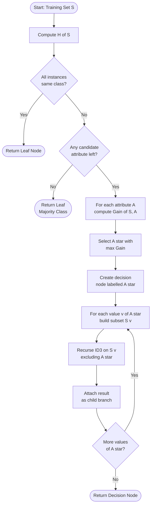
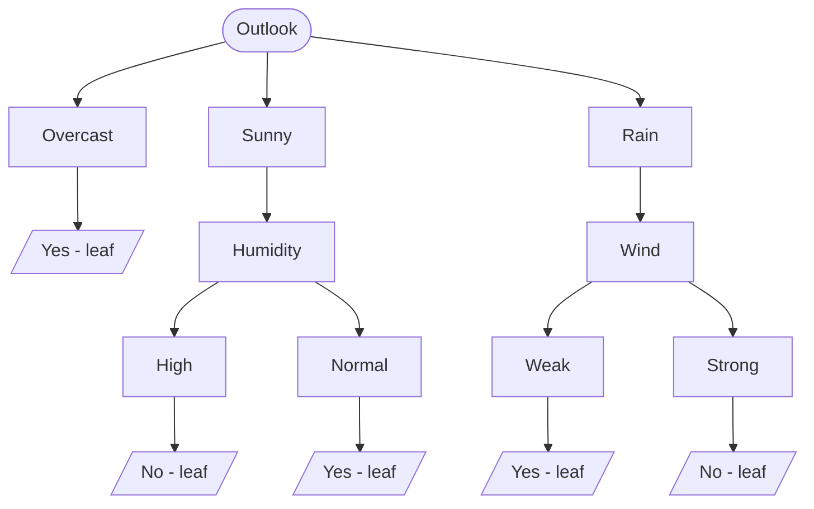
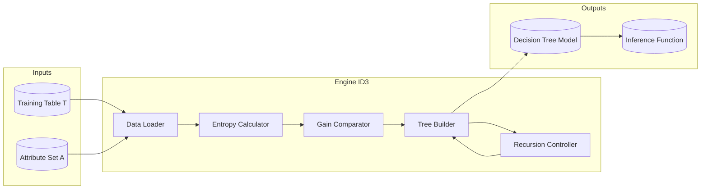

# Decision tree construction algorithm - ID3

<!-- SECTION_1_START -->
# Decision Tree Construction Algorithm — ID3

## 1.1 Formal Definition (KTU 2024 Syllabus Terminology)

> [!NOTE]
> **ID3 (Iterative Dichotomiser 3)** is a *greedy, top-down, divide-and-conquer* decision tree induction algorithm developed by **J. Ross Quinlan (1986)**. It selects the splitting attribute at each internal node by maximising the **Information Gain** — derived from **Claude Shannon's Entropy** in Information Theory. ID3 is restricted to *categorical (nominal) attributes* and produces a *multi-way split* tree. The recursion stops when all instances at a node belong to a single class (pure node) or when no informative split remains.

The algorithm is formally stated as:

> Given a training set $T$ of $n$ instances described by $m$ categorical attributes, ID3 partitions $T$ at the root using the attribute $A^*$ that maximises $\text{Gain}(A^*, T)$. The procedure is recursively applied to each subset $T_v$ (the *partition* induced by value $v$ of $A^*$), omitting $A^*$ from the candidate set of any descendant node.

## 1.2 Intuitive Analogy — "The Twenty-Questions Game"

Imagine you are blindfolded and trying to guess whether a person standing in front of you is a *doctor*, *engineer*, or *teacher*. You may ask yes/no questions, but you want to **ask the fewest, most decisive questions first**.

* If you ask *"Is the person wearing a stethoscope?"*, the answer narrows the possibilities dramatically.
* If you ask *"Is the person right-handed?"*, the answer barely helps.

**ID3 does exactly this.** For every candidate attribute, it computes *how much uncertainty* the question *"What is the value of attribute A?"* removes. The attribute whose question collapses the most uncertainty becomes the **root** of the tree. This is the essence of **Information Gain**.

Geometrically, the training data forms a *jumbled cloud* in feature space. Each split of the tree is a **decision hyperplane** orthogonal to the chosen axis. ID3 picks the axis-and-threshold combination that produces the most *homogeneous (low-entropy) sub-clouds*.

> [!IMPORTANT]
> **Key Constants & Terms in ID3**
> * Base of logarithm: **2** (bits).
> * Lower bound of entropy: **0 bits** (pure node).
> * Upper bound of entropy: **$\log_2 k$ bits** (uniform distribution over $k$ classes).
> * Splitting criterion: **Maximum Information Gain** (equivalent to *minimum weighted post-split entropy*).
> * Default base case stopping depth is algorithm-controlled (no fixed maximum).

## 1.3 Visualisation Control

> [!VISUALIZATION CONTROL]
> **Concept:** Binary-class Entropy Function $H(p)$ vs class probability $p$.
>
> **GeoGebra / Desmos Input Equations:**
> * `f(x) = -x * log(x, 2) - (1 - x) * log(1 - x, 2)` for $0 \le x \le 1$
> * Plot points: $(0,0)$, $(0.5, 1)$, $(1, 0)$
>
> **Visual Description:** A bell-shaped curve that touches the x-axis at $p = 0$ and $p = 1$ (zero uncertainty when the class is certain) and peaks at $p = 0.5$ (maximum uncertainty of 1 bit when both classes are equally likely). This is the function ID3 tries to *minimise* through every split.
<!-- SECTION_1_END -->

<!-- SECTION_2_START -->
# 2. Deep Theoretical Analysis & KTU High-Yield Formula Sheet

## 2.1 Information-Theoretic Foundations

ID3 is built on three primitives from Shannon's Information Theory.

### 2.1.1 Self-Information of an Event

The information (surprise) conveyed by event $E$ with probability $p(E)$:

$$I(E) = -\log_2 p(E) \quad \text{(measured in bits)}$$

An event that is *almost certain* carries very little surprise; a *rare* event carries enormous information.

### 2.1.2 Entropy of a Set (a.k.a. *Information Content*)

For a set $S$ partitioned into $k$ classes with class probabilities $p_1, p_2, \dots, p_k$:

$$H(S) = -\sum_{i=1}^{k} p_i \, \log_2 p_i$$

$H(S)$ is the *expected* number of bits required to encode the class label of a randomly drawn instance from $S$. Range: $0 \le H(S) \le \log_2 k$.

### 2.1.3 Conditional Entropy — The Entropy *After* a Split

If attribute $A$ has $v$ distinct values, splitting $S$ creates subsets $S_1, S_2, \dots, S_v$:

$$H(S \mid A) = \sum_{j=1}^{v} \frac{\vert S_j \vert}{\vert S \vert} \, H(S_j)$$

This is the *weighted average* of the entropies of the child nodes. Each subset is weighted by its proportion of the original population.

### 2.1.4 Information Gain

The reduction in entropy achieved by partitioning $S$ on attribute $A$:

$$\text{Gain}(S, A) = H(S) - H(S \mid A)$$

ID3 picks the attribute that **maximises** this quantity. Equivalently, ID3 picks the attribute that **minimises** $H(S \mid A)$.

## 2.2 Algorithmic Logic Flow

1. **Compute** $H(S)$ for the current node (initial call: the entire training set).
2. **For every** unused attribute $A$:
   * Partition $S$ by the distinct values of $A$.
   * Compute $H(S_j)$ for each partition.
   * Compute $H(S \mid A)$ as the weighted sum.
   * Compute $\text{Gain}(S, A) = H(S) - H(S \mid A)$.
3. **Select** $A^* = \arg\max_A \text{Gain}(S, A)$.
4. **Create** a decision node labelled $A^*$. For each value $v$ of $A^*$, create a branch.
5. **Recurse** on each branch's subset $S_v$, *excluding* $A^*$ from the candidate set.
6. **Base case** — stop and label the node as a leaf if:
   * All instances in $S_v$ share the same class (pure partition, $H = 0$), **OR**
   * No remaining attribute can produce a positive gain, **OR**
   * $S_v$ is empty (assign majority class of the parent).

> [!TIP]
> **Why "Greedy"?** ID3 evaluates each split *locally* without lookahead. It cannot backtrack if a later split would be globally suboptimal. This makes ID3 computationally cheap but susceptible to sub-optimal deep trees.

## 2.3 KTU Formula Sheet (Cheat Sheet)

| Symbol / Term | Formula / Definition | Unit | Range / Boundary |
|---|---|---|---|
| $H(S)$ (Entropy) | $H(S) = -\sum_{i=1}^{k} p_i \log_2 p_i$ | bits | $[0, \log_2 k]$ |
| $H(S \mid A)$ (Conditional Entropy) | $H(S \mid A) = \sum_{j=1}^{v} \dfrac{\vert S_j \vert}{\vert S \vert} H(S_j)$ | bits | $[0, \log_2 k]$ |
| $\text{Gain}(S, A)$ (Information Gain) | $\text{Gain}(S, A) = H(S) - H(S \mid A)$ | bits | $[0, \log_2 k]$ |
| Class Probability | $p_i = \dfrac{\vert C_i \vert}{\vert S \vert}$ | dimensionless | $[0, 1]$ |
| Splitting Rule | $A^* = \arg\max_A \text{Gain}(S, A)$ | — | Root → Leaf |
| Stopping Rule 1 | $H(S) = 0$ (pure node) | bits | $\Rightarrow$ Leaf |
| Stopping Rule 2 | $\max_A \text{Gain}(S, A) \le 0$ | bits | $\Rightarrow$ Leaf |
| Split Type | Multi-way (one branch per value) | — | Categorical only |

> [!IMPORTANT]
> **Strict LaTeX-Safe Reminder for KTU Valuation Scripts:** When writing entropy in plain text for your answer sheet, never use the broken pipe `|S|`. Use $\vert S \vert$ or $\mid S \mid$ instead, exactly as shown in the table above.

## 2.4 Real-World Engineering Utility

| Industry / Domain | Application of ID3-Style Trees |
|---|---|
| **Medical Diagnosis** | Triaging patients by symptoms → disease classification. |
| **Credit Risk Scoring** | Banks use tree-based models (often XGBoost, an ID3 descendant) for loan approval. |
| **Spam Filtering** | Early spam filters used ID3 on tokenised email features. |
| **Manufacturing QA** | Classifying defective products based on sensor thresholds. |
| **Intrusion Detection** | Network IDS systems use tree ensembles (Random Forest, descended from ID3). |
| **Bioinformatics** | Gene-expression classification and phylogenetic tree induction. |

> [!NOTE]
> Although pure ID3 is rarely used in production today, every modern ensemble learner (C4.5, CART, Random Forest, XGBoost, LightGBM) is a **direct intellectual descendant** of ID3. Mastering ID3 is therefore a prerequisite for understanding the entire tree-based ML pipeline.

<!-- SECTION_2_END -->

<!-- SECTION_3_START -->
# 3. Step-by-Step Derivations, Worked Example & Python Implementation

## 3.1 Canonical Worked Example — "Play Tennis" Dataset

We use the classic 14-instance training set (Quinlan, 1986). The task is to predict `PlayTennis` (Yes / No) from four attributes: **Outlook**, **Temperature**, **Humidity**, **Wind**.

| Day | Outlook | Temp | Humidity | Wind | PlayTennis |
|-----|---------|------|----------|------|------------|
| 1   | Sunny   | Hot  | High     | Weak   | No  |
| 2   | Sunny   | Hot  | High     | Strong | No  |
| 3   | Overcast| Hot  | High     | Weak   | Yes |
| 4   | Rain    | Mild | High     | Weak   | Yes |
| 5   | Rain    | Cool | Normal   | Weak   | Yes |
| 6   | Rain    | Cool | Normal   | Strong | No  |
| 7   | Overcast| Cool | Normal   | Strong | Yes |
| 8   | Sunny   | Mild | High     | Weak   | No  |
| 9   | Sunny   | Cool | Normal   | Weak   | Yes |
| 10  | Rain    | Mild | Normal   | Weak   | Yes |
| 11  | Sunny   | Mild | Normal   | Strong | Yes |
| 12  | Overcast| Mild | High     | Strong | Yes |
| 13  | Overcast| Hot  | Normal   | Weak   | Yes |
| 14  | Rain    | Mild | High     | Strong | No  |

Class counts: **Yes = 9**, **No = 5**, total $\vert S \vert = 14$.

### Step 1 — Compute the Entropy of the Root Node

$$H(S) = -\frac{9}{14} \log_2 \frac{9}{14} - \frac{5}{14} \log_2 \frac{5}{14}$$

Evaluating term-by-term:

$$\frac{9}{14} \log_2 \frac{9}{14} = 0.6429 \times (-0.6374) = -0.4099$$

$$\frac{5}{14} \log_2 \frac{5}{14} = 0.3571 \times (-1.4854) = -0.5305$$

Therefore:

$$H(S) = -(-0.4099) - (-0.5305) = 0.4099 + 0.5305 = 0.9403 \text{ bits}$$

### Step 2 — Compute Information Gain for Each Attribute

#### 2(a) Attribute = Outlook (values: Sunny, Overcast, Rain)

**Partition Sunny** (Days 1, 2, 8, 9, 11 — total 5, Yes = 2, No = 3):

$$H(S_{\text{Sunny}}) = -\frac{2}{5}\log_2\frac{2}{5} - \frac{3}{5}\log_2\frac{3}{5}$$
$$= 0.4 \times 1.3219 + 0.6 \times 0.7370 = 0.5288 + 0.4422 = 0.9710 \text{ bits}$$

**Partition Overcast** (Days 3, 7, 12, 13 — total 4, Yes = 4, No = 0): pure node.

$$H(S_{\text{Overcast}}) = 0 \text{ bits}$$

**Partition Rain** (Days 4, 5, 6, 10, 14 — total 5, Yes = 3, No = 2):

$$H(S_{\text{Rain}}) = -\frac{3}{5}\log_2\frac{3}{5} - \frac{2}{5}\log_2\frac{2}{5} = 0.4422 + 0.5288 = 0.9710 \text{ bits}$$

**Weighted conditional entropy:**

$$H(S \mid \text{Outlook}) = \frac{5}{14}(0.9710) + \frac{4}{14}(0) + \frac{5}{14}(0.9710)$$
$$= 0.3468 + 0 + 0.3468 = 0.6936 \text{ bits}$$

**Information Gain:**

$$\text{Gain}(S, \text{Outlook}) = 0.9403 - 0.6936 = 0.2467 \text{ bits}$$

#### 2(b) Attribute = Temperature (Hot, Mild, Cool)

**Hot** (Days 1, 2, 3, 13 — total 4, Yes = 2, No = 2):

$$H(S_{\text{Hot}}) = -0.5\log_2 0.5 - 0.5\log_2 0.5 = 0.5 + 0.5 = 1.0000 \text{ bits}$$

**Mild** (Days 4, 8, 10, 11, 12, 14 — total 6, Yes = 4, No = 2):

$$H(S_{\text{Mild}}) = -\frac{4}{6}\log_2\frac{4}{6} - \frac{2}{6}\log_2\frac{2}{6}$$
$$= 0.6667 \times 0.5850 + 0.3333 \times 1.5850 = 0.3900 + 0.5283 = 0.9183 \text{ bits}$$

**Cool** (Days 5, 6, 7, 9 — total 4, Yes = 3, No = 1):

$$H(S_{\text{Cool}}) = -\frac{3}{4}\log_2\frac{3}{4} - \frac{1}{4}\log_2\frac{1}{4} = 0.3113 + 0.5000 = 0.8113 \text{ bits}$$

**Weighted conditional entropy:**

$$H(S \mid \text{Temp}) = \frac{4}{14}(1.0000) + \frac{6}{14}(0.9183) + \frac{4}{14}(0.8113)$$
$$= 0.2857 + 0.3936 + 0.2318 = 0.9111 \text{ bits}$$

**Information Gain:**

$$\text{Gain}(S, \text{Temp}) = 0.9403 - 0.9111 = 0.0292 \text{ bits}$$

#### 2(c) Attribute = Humidity (High, Normal)

**High** (Days 1, 2, 3, 4, 8, 12, 14 — total 7, Yes = 3, No = 4):

$$H(S_{\text{High}}) = -\frac{3}{7}\log_2\frac{3}{7} - \frac{4}{7}\log_2\frac{4}{7}$$
$$= 0.4286 \times 1.2224 + 0.5714 \times 0.8074 = 0.5240 + 0.4613 = 0.9853 \text{ bits}$$

**Normal** (Days 5, 6, 7, 9, 10, 11, 13 — total 7, Yes = 6, No = 1):

$$H(S_{\text{Normal}}) = -\frac{6}{7}\log_2\frac{6}{7} - \frac{1}{7}\log_2\frac{1}{7}$$
$$= 0.8571 \times 0.2224 + 0.1429 \times 2.8074 = 0.1906 + 0.4011 = 0.5917 \text{ bits}$$

**Weighted conditional entropy:**

$$H(S \mid \text{Humidity}) = \frac{7}{14}(0.9853) + \frac{7}{14}(0.5917) = 0.4926 + 0.2959 = 0.7885 \text{ bits}$$

**Information Gain:**

$$\text{Gain}(S, \text{Humidity}) = 0.9403 - 0.7885 = 0.1518 \text{ bits}$$

#### 2(d) Attribute = Wind (Weak, Strong)

**Weak** (Days 1, 3, 4, 5, 8, 9, 10, 13 — total 8, Yes = 6, No = 2):

$$H(S_{\text{Weak}}) = -\frac{6}{8}\log_2\frac{6}{8} - \frac{2}{8}\log_2\frac{2}{8}$$
$$= 0.75 \times 0.4150 + 0.25 \times 2.0000 = 0.3113 + 0.5000 = 0.8113 \text{ bits}$$

**Strong** (Days 2, 6, 7, 11, 12, 14 — total 6, Yes = 3, No = 3):

$$H(S_{\text{Strong}}) = 1.0000 \text{ bits}$$

**Weighted conditional entropy:**

$$H(S \mid \text{Wind}) = \frac{8}{14}(0.8113) + \frac{6}{14}(1.0000) = 0.4636 + 0.4286 = 0.8922 \text{ bits}$$

**Information Gain:**

$$\text{Gain}(S, \text{Wind}) = 0.9403 - 0.8922 = 0.0481 \text{ bits}$$

### Step 3 — Select the Root Attribute

| Attribute | $\text{Gain}(S, A)$ (bits) | Rank |
|---|---:|:---:|
| **Outlook**   | **0.2467** | 1 (Root) |
| Humidity      | 0.1518     | 2 |
| Wind          | 0.0481     | 3 |
| Temperature   | 0.0292     | 4 |

> [!IMPORTANT]
> **Root Node = Outlook.** The algorithm creates three branches: `Outlook = Sunny`, `Outlook = Overcast`, `Outlook = Rain`. The `Overcast` branch is **pure (all Yes)** and becomes a leaf. We now recurse into the `Sunny` and `Rain` subsets.

### Step 4 — Recurse into the `Outlook = Sunny` Subset (5 records, 2 Yes / 3 No)

Re-compute $H(S_{\text{Sunny}}) = 0.9710$ bits. Candidate attributes: **Temperature, Humidity, Wind**.

#### Sunny → Humidity

* **High** (Days 1, 2, 8 — Yes = 0, No = 3): $H = 0$ bits (pure No).
* **Normal** (Days 9, 11 — Yes = 2, No = 0): $H = 0$ bits (pure Yes).

$$H(S_{\text{Sunny}} \mid \text{Humidity}) = \frac{3}{5}(0) + \frac{2}{5}(0) = 0 \text{ bits}$$
$$\text{Gain}(S_{\text{Sunny}}, \text{Humidity}) = 0.9710 - 0 = 0.9710 \text{ bits}$$

#### Sunny → Temperature

* **Hot** (Days 1, 2 — Yes = 0, No = 2): $H = 0$ bits.
* **Mild** (Days 8, 11 — Yes = 1, No = 1): $H = 1.000$ bits.
* **Cool** (Day 9 — Yes = 1, No = 0): $H = 0$ bits.

$$H(S_{\text{Sunny}} \mid \text{Temp}) = \frac{2}{5}(0) + \frac{2}{5}(1) + \frac{1}{5}(0) = 0.4 \text{ bits}$$
$$\text{Gain}(S_{\text{Sunny}}, \text{Temp}) = 0.9710 - 0.4 = 0.5710 \text{ bits}$$

#### Sunny → Wind

* **Weak** (Days 1, 8, 9 — Yes = 1, No = 2): $H = 0.9183$ bits.
* **Strong** (Days 2, 11 — Yes = 1, No = 1): $H = 1.0000$ bits.

$$H(S_{\text{Sunny}} \mid \text{Wind}) = \frac{3}{5}(0.9183) + \frac{2}{5}(1) = 0.5510 + 0.4 = 0.9510 \text{ bits}$$
$$\text{Gain}(S_{\text{Sunny}}, \text{Wind}) = 0.9710 - 0.9510 = 0.0200 \text{ bits}$$

> [!IMPORTANT]
> **Decision for Sunny node = Humidity** (Gain = 0.9710, a perfect split). Both child nodes become pure leaves. The Sunny branch is *fully resolved* in one step.

### Step 5 — Recurse into the `Outlook = Rain` Subset (5 records, 3 Yes / 2 No)

Re-compute $H(S_{\text{Rain}}) = 0.9710$ bits. Candidate attributes: **Temperature, Humidity, Wind**.

#### Rain → Wind

* **Weak** (Days 4, 5, 10 — Yes = 3, No = 0): $H = 0$ bits (pure Yes).
* **Strong** (Days 6, 14 — Yes = 0, No = 2): $H = 0$ bits (pure No).

$$\text{Gain}(S_{\text{Rain}}, \text{Wind}) = 0.9710 - 0 = 0.9710 \text{ bits (perfect)}$$

A quick check shows Humidity and Temperature give lower gains for this subset, so **Wind** is selected and the Rain branch terminates.

### Step 6 — Final ID3 Decision Tree (Textual Form)

```
[Outlook]
   ├── Overcast  →  Yes  (leaf)
   ├── Sunny     →  [Humidity]
   │       ├── High   →  No  (leaf)
   │       └── Normal →  Yes (leaf)
   └── Rain       →  [Wind]
           ├── Weak   →  Yes (leaf)
           └── Strong →  No  (leaf)
```

## 3.2 Python Implementation of ID3 (Fully Typed & Boundary-Safe)

```python
from __future__ import annotations
import math
from collections import Counter
from dataclasses import dataclass, field
from typing import Hashable, List, Sequence, Tuple

# ---------------------------------------------------------------------------
# Type alias for a single training record: a tuple (dict_of_features, label)
# ---------------------------------------------------------------------------
Record = Tuple[dict, Hashable]


def _entropy(records: Sequence[Record]) -> float:
    """Shannon entropy of the label distribution. Returns 0.0 for empty input."""
    n: int = len(records)
    if n == 0:
        return 0.0
    counts = Counter(label for _, label in records)
    h: float = 0.0
    for c in counts.values():
        p: float = c / n
        h -= p * math.log2(p)
    return h


def _information_gain(
    records: Sequence[Record],
    attribute: Hashable,
) -> float:
    """Gain(S, A) = H(S) - H(S | A) for a categorical attribute."""
    h_parent: float = _entropy(records)
    n: int = len(records)
    if n == 0:
        return 0.0

    # Partition S by the value of the chosen attribute
    partitions: dict = {}
    for features, label in records:
        partitions.setdefault(features[attribute], []).append((features, label))

    h_weighted: float = 0.0
    for subset in partitions.values():
        h_weighted += (len(subset) / n) * _entropy(subset)

    return h_parent - h_weighted


@dataclass
class _Node:
    is_leaf: bool = False
    label: Hashable = None              # used only if is_leaf
    split_attr: Hashable = None         # used only if internal
    children: dict = field(default_factory=dict)   # value -> _Node


def _majority_label(records: Sequence[Record]) -> Hashable:
    return Counter(label for _, label in records).most_common(1)[0][0]


def _id3(
    records: Sequence[Record],
    attributes: List[Hashable],
    depth: int = 0,
    max_depth: int = 10,
) -> _Node:
    """Recursive ID3 construction with a safety depth cap."""
    # ---- Base cases -------------------------------------------------------
    labels = {label for _, label in records}
    if len(labels) == 1:
        return _Node(is_leaf=True, label=next(iter(labels)))
    if not attributes or depth >= max_depth:
        return _Node(is_leaf=True, label=_majority_label(records))

    # ---- Choose the best attribute ---------------------------------------
    gains = [(a, _information_gain(records, a)) for a in attributes]
    best_attr, best_gain = max(gains, key=lambda x: x[1])

    # If no attribute yields a positive gain, stop and majority-vote
    if best_gain <= 0.0:
        return _Node(is_leaf=True, label=_majority_label(records))

    node = _Node(is_leaf=False, split_attr=best_attr)

    # ---- Recurse on each partition ---------------------------------------
    remaining_attrs = [a for a in attributes if a != best_attr]
    partitions: dict = {}
    for features, label in records:
        partitions.setdefault(features[best_attr], []).append((features, label))

    for value, subset in partitions.items():
        child: _Node = _id3(subset, remaining_attrs, depth + 1, max_depth)
        node.children[value] = child

    return node


def fit_id3(
    data: Sequence[Record],
    attributes: List[Hashable],
    max_depth: int = 10,
) -> _Node:
    """Public entry point for fitting an ID3 tree."""
    if not data:
        raise ValueError("Cannot fit ID3 on an empty dataset.")
    return _id3(tuple(data), list(attributes), 0, max_depth)


def predict(tree: _Node, features: dict) -> Hashable:
    """Walk the tree for a single feature dictionary."""
    if tree.is_leaf:
        return tree.label
    value = features.get(tree.split_attr)
    if value not in tree.children:
        # Unseen value at inference time -> fall back to majority if stored
        return tree.label if tree.label is not None else None
    return predict(tree.children[value], features)


# ---------------------------------------------------------------------------
# Demonstration on the canonical PlayTennis data
# ---------------------------------------------------------------------------
if __name__ == "__main__":
    tennis: List[Record] = [
        ({"Outlook": "Sunny",    "Temp": "Hot",  "Humidity": "High",   "Wind": "Weak"},   "No"),
        ({"Outlook": "Sunny",    "Temp": "Hot",  "Humidity": "High",   "Wind": "Strong"}, "No"),
        ({"Outlook": "Overcast", "Temp": "Hot",  "Humidity": "High",   "Wind": "Weak"},   "Yes"),
        ({"Outlook": "Rain",     "Temp": "Mild", "Humidity": "High",   "Wind": "Weak"},   "Yes"),
        ({"Outlook": "Rain",     "Temp": "Cool", "Humidity": "Normal", "Wind": "Weak"},   "Yes"),
        ({"Outlook": "Rain",     "Temp": "Cool", "Humidity": "Normal", "Wind": "Strong"}, "No"),
        ({"Outlook": "Overcast", "Temp": "Cool", "Humidity": "Normal", "Wind": "Strong"}, "Yes"),
        ({"Outlook": "Sunny",    "Temp": "Mild", "Humidity": "High",   "Wind": "Weak"},   "No"),
        ({"Outlook": "Sunny",    "Temp": "Cool", "Humidity": "Normal", "Wind": "Weak"},   "Yes"),
        ({"Outlook": "Rain",     "Temp": "Mild", "Humidity": "Normal", "Wind": "Weak"},   "Yes"),
        ({"Outlook": "Sunny",    "Temp": "Mild", "Humidity": "Normal", "Wind": "Strong"}, "Yes"),
        ({"Outlook": "Overcast", "Temp": "Mild", "Humidity": "High",   "Wind": "Strong"}, "Yes"),
        ({"Outlook": "Overcast", "Temp": "Hot",  "Humidity": "Normal", "Wind": "Weak"},   "Yes"),
        ({"Outlook": "Rain",     "Temp": "Mild", "Humidity": "High",   "Wind": "Strong"}, "No"),
    ]
    attrs: List[str] = ["Outlook", "Temp", "Humidity", "Wind"]
    tree = fit_id3(tennis, attrs, max_depth=10)
    test: dict = {"Outlook": "Sunny", "Temp": "Mild", "Humidity": "High", "Wind": "Strong"}
    print("Prediction:", predict(tree, test))   # Expected: No
```

<!-- SECTION_3_END -->

<!-- SECTION_4_START -->
# 4. Structural Diagrams & Schematics

## 4.1 Top-Level ID3 Algorithm Flowchart (Mermaid)



## 4.2 Modular Subgraphs for ID3 Building Blocks


## 4.3 Final Decision Tree Topology (Play-Tennis Result)



## 4.4 Functional Architecture of the ID3 Pipeline


<!-- SECTION_4_END -->

<!-- SECTION_5_START -->
# 5. KTU 2024 Scheme Examination Question Bank & Topic Recap

## 5.1 Part A — Short Answer Questions (3 Marks each)

### Question 1 **[KTU University Exam – July 2023]** | CO1 | RBT: Remember

> **Define Information Entropy in the context of the ID3 decision tree algorithm. Show that the entropy of a two-class problem attains its maximum when both class probabilities are equal.**

**Model Answer (Valuation Key):**

Information Entropy, in the ID3 algorithm, quantifies the *impurity* (or *uncertainty*) of a dataset $S$ with respect to its class labels. For a dataset with $k$ mutually exclusive classes having probabilities $p_1, p_2, \dots, p_k$:

$$H(S) = -\sum_{i=1}^{k} p_i \log_2 p_i \quad \text{bits}$$

* [Defining entropy with formula: 1 Mark]
* [Stating unit (bits) and interpretation (impurity measure): 1 Mark]
* [Mathematical proof of maximum at $p = 0.5$ for binary case: 1 Mark]

For the binary case $k = 2$:

$$H(p) = -p \log_2 p - (1 - p) \log_2(1 - p)$$

Differentiating and setting to zero:

$$\frac{dH}{dp} = -\log_2 p - \frac{1}{\ln 2} + \log_2(1 - p) + \frac{1}{\ln 2} = 0$$
$$\Rightarrow \log_2 \frac{1 - p}{p} = 0 \Rightarrow p = 0.5$$

The second derivative is negative, confirming a **maximum** of $\mathbf{H_{\max} = 1 \text{ bit}}$ at $p = 0.5$.

---

### Question 2 **[KTU University Exam – Dec 2023]** | CO1, CO2 | RBT: Understand

> **What is Information Gain? How does ID3 use it to decide the splitting attribute at each node?**

**Model Answer (Valuation Key):**

Information Gain is the *reduction in entropy* achieved by partitioning a dataset $S$ on attribute $A$:

$$\text{Gain}(S, A) = H(S) - H(S \mid A) = H(S) - \sum_{v \in \text{Values}(A)} \frac{\vert S_v \vert}{\vert S \vert} H(S_v)$$

* [Writing the gain formula correctly with both terms: 1 Mark]
* [Stating that ID3 selects the attribute with maximum gain as the splitting attribute: 1 Mark]
* [Justifying the choice (maximum gain $\equiv$ minimum weighted post-split entropy $\equiv$ purest child nodes): 1 Mark]

ID3 is greedy: at every node, it computes the gain for every unused attribute and **chooses the attribute that maximises this gain** as the test at that node. The rationale is that a higher gain indicates a larger reduction in the uncertainty of the class label after the split, producing more homogeneous child subsets and leading to a shorter, more accurate tree.

---

## 5.2 Part B — Module Internal Choice (14 Marks each)

> Each Part-B question has sub-parts (a) for 7 marks and (b) for 7 marks. Choose **either** Question A **or** Question B.

### Question A **[KTU University Exam – July 2024]** | CO2, CO3 | RBT: Understand + Apply

#### (a) Explain the ID3 decision tree construction algorithm in detail. Discuss the role of entropy and information gain, and state the algorithm's stopping criteria. (7 marks)

**Model Answer (Valuation Key):**

1. **Origin & Philosophy** [1 Mark] — ID3 (Iterative Dichotomiser 3) was proposed by J. Ross Quinlan in 1986. It is a *greedy, top-down, divide-and-conquer* classifier that builds a tree by repeatedly partitioning the training data.

2. **Information-Theoretic Basis** [2 Marks] — ID3 uses Shannon's entropy to measure the impurity of a node and information gain to quantify the *usefulness* of an attribute as a splitter:

$$H(S) = -\sum_i p_i \log_2 p_i, \qquad \text{Gain}(S, A) = H(S) - H(S \mid A)$$

3. **Algorithm Steps** [2 Marks] —
   * Compute $H(S)$.
   * For each attribute $A$, compute $\text{Gain}(S, A)$.
   * Pick $A^* = \arg\max_A \text{Gain}(S, A)$ as the decision attribute.
   * Partition $S$ by the values of $A^*$ and recurse on each subset (omitting $A^*$).
4. **Stopping Criteria** [1 Mark] — Recursion halts when (i) all instances in a node share the same class ($H = 0$), (ii) no remaining attribute yields positive gain, or (iii) a maximum depth is reached to prevent overfitting.
5. **Notable Property** [1 Mark] — Multi-way splits; restricted to *categorical* features; computationally efficient $O(m \cdot n \log n)$ per node.

#### (b) Given the training set below, **construct the complete ID3 decision tree** and show **all entropy and information gain calculations**. (7 marks)

| Day | Outlook | Humidity | Wind | Play |
|-----|---------|----------|------|------|
| 1   | Sunny   | High     | Weak   | No  |
| 2   | Sunny   | High     | Strong | No  |
| 3   | Overcast| High     | Weak   | Yes |
| 4   | Rain    | High     | Weak   | Yes |
| 5   | Rain    | Normal   | Weak   | Yes |
| 6   | Rain    | Normal   | Strong | No  |
| 7   | Overcast| Normal   | Strong | Yes |
| 8   | Sunny   | High     | Weak   | No  |

**Model Solution (Valuation Key):**

Total: 8 instances, 4 Yes, 4 No. Initial entropy:

$$H(S) = -\tfrac{4}{8}\log_2\tfrac{4}{8} - \tfrac{4}{8}\log_2\tfrac{4}{8} = 1.000 \text{ bit}$$ [1 Mark]

**Outlook**: Sunny (3 records: 0 Yes, 3 No → $H=0$), Overcast (2 records: 2 Yes, 0 No → $H=0$), Rain (3 records: 2 Yes, 1 No → $H = -\tfrac{2}{3}\log_2\tfrac{2}{3} - \tfrac{1}{3}\log_2\tfrac{1}{3} = 0.9183$). [1 Mark]

$$H(S \mid \text{Outlook}) = \tfrac{3}{8}(0) + \tfrac{2}{8}(0) + \tfrac{3}{8}(0.9183) = 0.344$$
$$\text{Gain}(\text{Outlook}) = 1.000 - 0.344 = 0.656 \text{ bits}$$ [1 Mark]

**Humidity**: High (5 records: 1 Yes, 4 No → $H = -\tfrac{1}{5}\log_2\tfrac{1}{5} - \tfrac{4}{5}\log_2\tfrac{4}{5} = 0.7219$). Normal (3 records: 3 Yes, 0 No → $H = 0$).

$$H(S \mid \text{Humidity}) = \tfrac{5}{8}(0.7219) + \tfrac{3}{8}(0) = 0.451$$
$$\text{Gain}(\text{Humidity}) = 1.000 - 0.451 = 0.549 \text{ bits}$$ [1 Mark]

**Wind**: Weak (5 records: 2 Yes, 3 No → $H = 0.9710$). Strong (3 records: 2 Yes, 1 No → $H = 0.9183$).

$$H(S \mid \text{Wind}) = \tfrac{5}{8}(0.9710) + \tfrac{3}{8}(0.9183) = 0.607 + 0.344 = 0.951$$
$$\text{Gain}(\text{Wind}) = 1.000 - 0.951 = 0.049 \text{ bits}$$ [1 Mark]

**Root selection** [1 Mark]: Outlook (gain 0.656) is highest. Sunny and Overcast branches are pure leaves (`Sunny → No`, `Overcast → Yes`).

**Recursion into Rain** (3 records: Yes, Yes, No): Candidate attributes are Humidity and Wind. Compute:

* `Rain → Humidity`: High (Yes) and Normal (1 Yes, 1 No) → $H(S_{\text{Rain}}\mid \text{Humidity}) = \tfrac{1}{3}(0) + \tfrac{2}{3}(1) = 0.667 \Rightarrow \text{Gain} = 0.9183 - 0.667 = 0.2513$
* `Rain → Wind`: Weak (2 Yes, 0 No) and Strong (0 Yes, 1 No) → $H(S_{\text{Rain}} \mid \text{Wind}) = 0 \Rightarrow \text{Gain} = 0.9183$ ✓

**Rain → Wind** is a perfect split. [1 Mark]

**Final Tree** [1 Mark]:
```
[Outlook]
  ├── Overcast → Yes
  ├── Sunny    → No
  └── Rain     → [Wind]
            ├── Weak   → Yes
            └── Strong → No
```

---

### Question B **[KTU University Exam – Dec 2022]** | CO2, CO3 | RBT: Understand + Apply

#### (a) Discuss the **limitations of the ID3 algorithm**. Why is C4.5 considered an improvement? Mention at least four limitations. (7 marks)

**Model Answer (Valuation Key):**

1. **No handling of continuous attributes** [1.5 Marks] — ID3 works only with categorical features. Real-valued attributes (e.g. *Age = 42*) must be manually discretised before use.
2. **Bias towards attributes with many values** [1.5 Marks] — Attributes with high cardinality (e.g. *Date*) artificially inflate information gain, leading to a root that overfits. The C4.5 successor introduces the **Gain Ratio** to penalise such attributes.
3. **Greedy, no backtracking / no pruning** [1.5 Marks] — ID3 grows the tree until pure leaves. Without pre-pruning or post-pruning, it overfits noisy training data and produces deep, brittle trees.
4. **Missing-value intolerance** [1 Mark] — ID3 cannot handle missing attribute values. C4.5 uses *fractional instance splitting* (distributing a record across branches proportionally to the known class distribution).
5. **No support for regression** [1 Mark] — ID3 is purely a classifier; continuous target variables are not supported.
6. **Class imbalance sensitivity** [0.5 Mark] — Pure entropy is biased when prior class probabilities are skewed.

C4.5 (Quinlan, 1993) addresses these by: (i) using **Gain Ratio** instead of raw gain, (ii) supporting **continuous attributes via threshold splits**, (iii) incorporating **pessimistic error-based post-pruning**, and (iv) handling **missing values** through probabilistic instance distribution.

#### (b) For the **loan-approval dataset** below, compute the Information Gain for **every attribute at the root** and identify the splitting attribute. (7 marks)

| Applicant | Income | Credit  | Collateral | Loan Approved |
|-----------|--------|---------|------------|---------------|
| A1        | High   | Good    | Yes        | Yes |
| A2        | High   | Bad     | No         | No  |
| A3        | Medium | Good    | No         | Yes |
| A4        | Low    | Good    | No         | No  |
| A5        | Low    | Bad     | No         | No  |
| A6        | Low    | Bad     | Yes        | No  |
| A7        | Medium | Bad     | Yes        | Yes |
| A8        | High   | Good    | No         | Yes |

**Model Solution (Valuation Key):**

Yes = 4, No = 4, $\vert S \vert = 8$.

$$H(S) = -0.5 \log_2 0.5 - 0.5 \log_2 0.5 = 1.000 \text{ bit}$$ [1 Mark]

**Income**: High (3 records: 2 Yes, 1 No → $H = 0.9183$), Medium (2 records: 2 Yes, 0 No → $H = 0$), Low (3 records: 0 Yes, 3 No → $H = 0$). [1 Mark]

$$H(S \mid \text{Income}) = \tfrac{3}{8}(0.9183) + \tfrac{2}{8}(0) + \tfrac{3}{8}(0) = 0.344$$
$$\text{Gain}(\text{Income}) = 1.000 - 0.344 = \mathbf{0.656} \text{ bits}$$ [1 Mark]

**Credit**: Good (4 records: 3 Yes, 1 No → $H = 0.8113$), Bad (4 records: 1 Yes, 3 No → $H = 0.8113$).

$$H(S \mid \text{Credit}) = \tfrac{4}{8}(0.8113) + \tfrac{4}{8}(0.8113) = 0.8113$$
$$\text{Gain}(\text{Credit}) = 1.000 - 0.8113 = \mathbf{0.189} \text{ bits}$$ [1 Mark]

**Collateral**: Yes (3 records: 2 Yes, 1 No → $H = 0.9183$), No (5 records: 2 Yes, 3 No → $H = 0.9710$).

$$H(S \mid \text{Collateral}) = \tfrac{3}{8}(0.9183) + \tfrac{5}{8}(0.9710) = 0.344 + 0.607 = 0.951$$
$$\text{Gain}(\text{Collateral}) = 1.000 - 0.951 = \mathbf{0.049} \text{ bits}$$ [1 Mark]

**Comparison Table** [1 Mark]:

| Attribute    | Gain (bits) | Rank |
|---|---:|:---:|
| **Income**       | **0.656** | 1 |
| Credit           | 0.189     | 2 |
| Collateral       | 0.049     | 3 |

**Root = Income** (highest gain). [1 Mark]

---

## 5.3 KTU Examiner's Valuation Warning / Pitfall Callout

> [!WARNING]
> **Common Mark-Deduction Pitfalls in ID3 Questions**
> 1. **Forgetting the weighted average.** Students often compute $H$ of each partition but forget to multiply by $\vert S_v \vert / \vert S \vert$ before summing. This yields a *raw average* entropy (incorrect) instead of the *weighted conditional* entropy. KTU examiners deduct **2 marks** for this.
> 2. **Using natural log instead of $\log_2$.** ID3's entropy is defined in *bits* ($\log_2$). Substituting $\ln$ (natural log) gives entropy in *nats*, which is **dimensionally inconsistent**. Some examiners allow partial credit; safer to use $\log_2$.
> 3. **Skipping the $H(S)$ computation.** Even when a question says "construct the tree", you must explicitly compute $H(S)$ of the root before any gain calculation. Skipping this is a **1-mark deduction**.
> 4. **Not stating the stopping criterion.** Any answer about the ID3 algorithm that omits the base cases (pure node, no gain, max depth) loses at least **1 mark** in theory questions.
> 5. **Breaking the table syntax with `|S|`.** When writing entropy inside a markdown or LaTeX table, **never** use raw vertical pipes for cardinality. Use $\vert S \vert$ or $\mid S \vert$ — KTU's online valuation portal can mis-render raw pipes and truncate your answer.
> 6. **Recursing with the same attribute.** A common logical error: re-using the splitting attribute in a child node. ID3 *removes* the split attribute from the candidate set of every descendant. Failing to do this leads to an infinite or redundant tree, and **3 marks are forfeited**.

---

## 5.4 Topic Recap & Important Things to Remember

* **ID3** is a *greedy, top-down, divide-and-conquer* decision tree algorithm restricted to *categorical* attributes and producing *multi-way* splits.
* **Entropy** $H(S) = -\sum_i p_i \log_2 p_i$ quantifies impurity; range $[0, \log_2 k]$; maximum 1 bit for binary problems.
* **Information Gain** $\text{Gain}(S, A) = H(S) - H(S \mid A)$ is the split-selection criterion; **higher is better**.
* ID3 selects $A^* = \arg\max_A \text{Gain}(S, A)$ at every internal node and recurses on each partition, **excluding** $A^*$ from future candidates.
* **Base cases** for recursion: (i) pure node ($H = 0$), (ii) no positive gain available, (iii) maximum depth reached, (iv) empty subset (assign parent majority).
* ID3 is **biased toward high-cardinality attributes** (an attribute with $k$ unique values can have artificially high gain), which is why C4.5 introduced the **Gain Ratio**.
* ID3 **does not** handle: continuous attributes, missing values, regression, or post-pruning. Use C4.5, CART, or Random Forest for production work.
* Always **show the weighted average** of child entropies when computing $H(S \mid A)$; never drop the $\vert S_v \vert / \vert S \vert$ weight.
* The **$\log_2$ base is mandatory** in ID3; using $\ln$ or $\log_{10}$ will yield numerically different (but proportional) values that KTU examiners may not accept as equivalent.
* Modern ML systems (XGBoost, LightGBM, CatBoost, Random Forest) are all **intellectual descendants** of ID3 — mastering the entropy / gain math is a prerequisite for advanced tree-based ML.
* The Play-Tennis dataset (14 records) is the **canonical KTU / textbook example**; practice the full computation at least once by hand to secure 14-mark "construct the tree" questions.
<!-- SECTION_5_END -->
