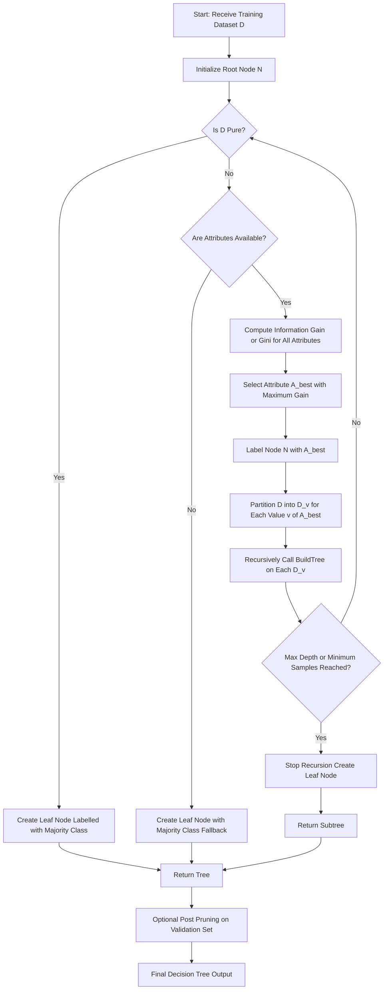
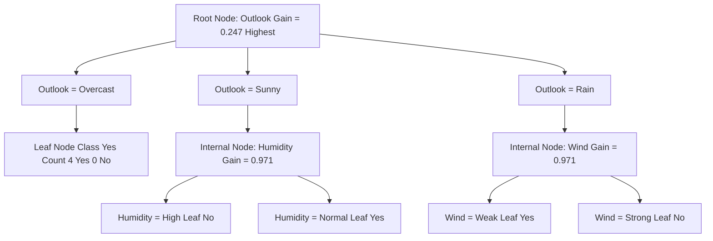
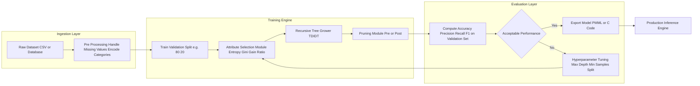
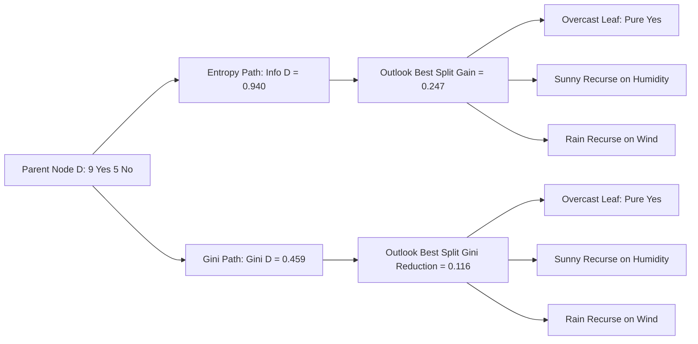

# Decision tree construction principle

<!-- SECTION_1_START -->
# 1. Core Technical Definition & Intuitive Overview

## 1.1 Formal Academic Definition

In the context of **KTU 2024 Scheme (Data Mining – PECST525, Module 3: Classification)**, a **Decision Tree** is a hierarchical, recursive, non-parametric supervised learning model that partitions an input feature space $X$ into mutually exclusive regions using a top-down, greedy, divide-and-conquer strategy. The objective of **decision tree construction** is to iteratively select the *most informative* splitting attribute at each internal node so that the resulting child subsets are as **pure** (homogeneous) as possible with respect to the class label $Y$.

Formally, given a training dataset $D = \{(x_1, y_1), (x_2, y_2), \dots, (x_n, y_n)\}$ with attributes $A = \{A_1, A_2, \dots, A_m\}$ and class label $C = \{c_1, c_2, \dots, c_k\}$, a decision tree $T$ is constructed by recursively partitioning $D$ based on an **attribute selection measure** (ASM) $\Phi(A_i)$, such that the *expected reduction in impurity* is maximized at each node.

The standard impurity functions recognized in the KTU syllabus are:
- **Entropy** (used by ID3 and C4.5)
- **Gini Index** (used by CART)

> [!IMPORTANT]
> **Syllabus Highlight (PECST525 M3):** The KTU 2024 scheme explicitly tests the **principle** of tree construction, i.e., *why* a particular attribute is chosen, *how* impurity is measured, and *how* the tree is recursively grown and pruned. Marks are awarded for stating the algorithm steps, formula derivation, and worked numerical construction.

---

## 1.2 Conceptual Analogy & Intuition

Think of a **decision tree** as a **medical diagnostic flowchart** a doctor follows when a patient walks into a clinic:

1. The doctor first asks the **most decisive question** ("Do you have chest pain?"). If the answer splits the patients into clearly separable groups, that question becomes the **root node**.
2. Based on the answer, the doctor routes the patient to the next most informative question ("Are you a smoker?"), which becomes an **internal node**.
3. This process continues until a **diagnosis is reached** at a **leaf node** ("Heart Attack" / "Anxiety" / "Acid Reflux").

In this analogy:
- The **patient population** = Training dataset $D$
- The **questions** = Attributes $A_i$
- The **first question** = Attribute with the highest **Information Gain**
- The **diagnosis** = Class label $Y$
- The **flowchart branches** = Splitting conditions

The doctor's strategy is the same as the algorithm's: **always ask the question that maximally reduces uncertainty** about the final diagnosis.

> [!NOTE]
> **Why "greedy"?** The algorithm does not look ahead to future splits. At every node, it makes the *locally optimal* choice. This is computationally efficient but does not guarantee a globally optimal tree — a critical point in KTU theory questions.

---

## 1.3 Anatomy of a Decision Tree

| Component | Description | KTU Notation |
|---|---|---|
| **Root Node** | The topmost node; represents the entire training set before any split | $t_{root}$ |
| **Internal Node** | A node that performs a test on attribute $A_i$ | $t_{i}$ |
| **Branch / Edge** | The outcome of a test (e.g., $A_i = \text{Sunny}$) | $E_{ij}$ |
| **Leaf Node** | A terminal node assigned a class label | $L$ |
| **Path** | A complete root-to-leaf route, equivalent to an IF-THEN rule | $P = (t_0 \to t_1 \to \dots \to L)$ |

> [!TIP]
> Each path from root to leaf is a **disjunctive conjunction of conditions**, and the entire tree is a **disjunction of these conjunctions** — a property often asked in 2-mark KTU questions.

---

## 1.4 Visualization Callout

> [!VISUALIZATION CONTROL]
> **Concept:** Generic binary decision tree topology with purity-based splitting.
> **GeoGebra / Desmos Input Equations (conceptual coordinate mapping):**
> * `Root = (0, 5)` — Impurity $= 0.940$
> * `Left_Child = (-3, 3)` — Impurity $= 0.811$
> * `Right_Child = (3, 3)` — Impurity $= 0.0$ *(pure leaf)*
> * `Left_Left = (-4, 1)` — Impurity $= 0.0$ *(pure leaf)*
> * `Left_Right = (-2, 1)` — Impurity $= 0.918$
> * `Edges` connect parent to child via straight line segments.
> **Visual Description:** The student should observe a downward-branching tree where each level corresponds to one attribute test. The vertical axis represents the *purity gradient*; leaves lie at the bottom and ideally have impurity $\approx 0$. The width of horizontal spread represents the **support** (number of samples) at each node.

---

## 1.5 Why Decision Trees? (Engineering Motivation)

- **Interpretability:** The model is a white-box — every decision is explainable to stakeholders.
- **Low preprocessing cost:** No need for feature scaling, dummy encoding, or normality assumptions.
- **Handles mixed data types:** Natively supports both categorical and numerical attributes.
- **Production use cases:** Credit scoring (banks), medical diagnosis (clinical DSS), spam filtering (email gateways), customer churn prediction (telecom), and fault detection in IoT sensor streams.

<!-- SECTION_1_END -->

<!-- SECTION_2_START -->
# 2. Deep Theoretical Analysis & KTU High-Yield Formula Sheet

## 2.1 The General Construction Algorithm (Top-Down Inductive Decision Tree — TDIDT)

The KTU syllabus aligns with the canonical algorithm summarized below. The construction is **recursive** and **depth-first** until a stopping condition is met.

**Algorithm: `BuildTree(D, A)`**

1. **Create a node $N$.**
2. **If all tuples in $D$ belong to the same class $C_i$**, then return $N$ as a leaf node labelled with class $C_i$. *(Stopping Condition 1: Purity)*
3. **If `A` is empty** OR **all attributes have zero / negligible information gain**, then return $N$ as a leaf node labelled with the **majority class** in $D$. *(Stopping Condition 2: Attribute Exhaustion)*
4. **Apply attribute selection measure $\Phi$** to all candidate attributes in $A$ using the training tuples in $D$.
5. **Select the winning attribute $A_{best}$** that maximizes $\Phi$ (or equivalently, minimizes weighted impurity).
6. **Label node $N$ with $A_{best}$**.
7. **For each value $v$ of $A_{best}$:** partition $D$ into $D_v$ (the subset where $A_{best} = v$). Recursively call `BuildTree(D_v, A - \{A_{best}\})` to obtain a subtree, and attach it as a child branch of $N$ for outcome $v$.
8. **Return $N$.**

> [!IMPORTANT]
> The **purity check (Step 2)** and **majority class fallback (Step 3)** are the two most tested sub-steps in KTU 2-mark and 7-mark questions. Always write them explicitly during the exam.

---

## 2.2 Attribute Selection Measures (ASM) — Detailed Analysis

### 2.2.1 Information Gain (ID3 Algorithm)

The **information gain** of an attribute $A$ is the expected reduction in entropy achieved by partitioning $D$ on $A$.

**Entropy of dataset $D$:**

$$
\text{Info}(D) = -\sum_{i=1}^{k} p_i \, \log_2(p_i)
$$

where $p_i$ is the probability (relative frequency) that an arbitrary tuple in $D$ belongs to class $C_i$, and $k$ is the number of classes.

**Conditional entropy after splitting on attribute $A$** (with $v$ distinct values):

$$
\text{Info}_A(D) = \sum_{v \in \text{Values}(A)} \frac{\vert D_v \vert}{\vert D \vert} \times \text{Info}(D_v)
$$

**Information Gain:**

$$
\text{Gain}(A) = \text{Info}(D) - \text{Info}_A(D)
$$

> [!NOTE]
> **Why $\log_2$?** Entropy is measured in *bits*. KTU examiners frequently check whether students use base-2 logarithm; using base-$e$ (natural log) yields the same gain ranking but is conventionally avoided in decision tree literature.

### 2.2.2 Gain Ratio (C4.5 Algorithm)

Information Gain is **biased toward attributes with many values** (e.g., `Date`, `ID`). C4.5 normalizes it using **Split Information**:

$$
\text{SplitInfo}_A(D) = -\sum_{v \in \text{Values}(A)} \frac{\vert D_v \vert}{\vert D \vert} \times \log_2\!\left(\frac{\vert D_v \vert}{\vert D \vert}\right)
$$

$$
\text{GainRatio}(A) = \frac{\text{Gain}(A)}{\text{SplitInfo}_A(D)}
$$

### 2.2.3 Gini Index (CART Algorithm)

Gini measures the **impurity** of a dataset; lower Gini $\Rightarrow$ purer node.

$$
\text{Gini}(D) = 1 - \sum_{i=1}^{k} p_i^2
$$

**Weighted Gini after split on $A$:**

$$
\text{Gini}_A(D) = \sum_{v \in \text{Values}(A)} \frac{\vert D_v \vert}{\vert D \vert} \times \text{Gini}(D_v)
$$

The attribute with the **minimum** $\text{Gini}_A(D)$ (i.e., maximum reduction in Gini) is selected.

---

## 2.3 KTU Formula Sheet / Cheat Sheet

| **Quantity** | **Formula** | **Algorithm** | **Selection Rule** |
|---|---|---|---|
| Entropy of $D$ | $\text{Info}(D) = -\sum_{i=1}^{k} p_i \log_2 p_i$ | ID3, C4.5 | Auxiliary |
| Conditional Entropy | $\text{Info}_A(D) = \sum_{v} \frac{\vert D_v \vert}{\vert D \vert} \cdot \text{Info}(D_v)$ | ID3, C4.5 | Auxiliary |
| Information Gain | $\text{Gain}(A) = \text{Info}(D) - \text{Info}_A(D)$ | ID3 | Maximize |
| Split Information | $\text{SplitInfo}_A(D) = -\sum_{v} \frac{\vert D_v \vert}{\vert D \vert} \log_2 \frac{\vert D_v \vert}{\vert D \vert}$ | C4.5 | Auxiliary |
| Gain Ratio | $\text{GainRatio}(A) = \frac{\text{Gain}(A)}{\text{SplitInfo}_A(D)}$ | C4.5 | Maximize |
| Gini Index of $D$ | $\text{Gini}(D) = 1 - \sum_{i=1}^{k} p_i^2$ | CART | Auxiliary |
| Weighted Gini | $\text{Gini}_A(D) = \sum_{v} \frac{\vert D_v \vert}{\vert D \vert} \cdot \text{Gini}(D_v)$ | CART | Minimize |
| Reduction in Gini (Gini Gain) | $\Delta\text{Gini}(A) = \text{Gini}(D) - \text{Gini}_A(D)$ | CART | Maximize |
| Classification Error (alternative) | $\text{Error}(D) = 1 - \max_i p_i$ | Generic | Minimize (rare in KTU) |

> [!IMPORTANT]
> **KTU Convention Check:** For $\text{Gini}$, the *minimum* value is $0$ (pure node) and the *maximum* is $1 - 1/k$ (perfectly impure for $k$ classes). For $\text{Info}$, the range is $[0, \log_2 k]$.

---

## 2.4 Stopping Conditions and Overfitting Control

A naive recursive construction can grow the tree until every leaf is pure — a phenomenon called **overfitting**. KTU Module 3 requires understanding of:

1. **Pre-pruning (Early Stopping):** Halt tree growth when:
   - All tuples in $D_v$ belong to one class.
   - Number of tuples $\le$ a threshold (e.g., $\le 5$).
   - Information Gain $<$ user-defined threshold $\epsilon$.
   - Tree depth exceeds a maximum depth $d_{max}$.
2. **Post-pruning (Reduced Error Pruning):** Grow the full tree, then replace subtrees with leaf nodes if the validation accuracy improves.
3. **Minimum Description Length (MDL) Pruning:** Replace a subtree with a leaf if the encoding cost of the leaf is shorter than the subtree.

> [!NOTE]
> **Why prune?** An overfit tree memorizes noise in the training set and generalizes poorly to unseen data. Pruning improves **generalization** at the cost of a small bias increase.

---

## 2.5 Engineering Utility in Production Systems

- **Banking & FinTech:** Random Forest (ensemble of trees) is the de-facto standard for credit-risk scoring; the underlying decision tree construction principle is identical.
- **Healthcare:** Clinical Decision Support Systems (CDSS) use pruned decision trees to encode diagnostic rules from electronic health records.
- **Cybersecurity:** Tree-based classifiers (XGBoost, LightGBM) are the winning algorithms in most Kaggle intrusion-detection competitions.
- **Edge AI / IoT:** Decision trees are lightweight and can be exported as portable C/C++ code (e.g., via `sklearn.tree.export_text`), making them ideal for embedded microcontrollers with $< 256$ KB RAM.

<!-- SECTION_2_END -->

<!-- SECTION_3_START -->
# 3. Step-by-Step Derivations & Code Implementation

## 3.1 Exhaustive Worked Example: Building a Decision Tree Using ID3

We use the classic **"Play Tennis"** training dataset (14 tuples, 4 attributes, 2 classes). This is the most frequently reused example in KTU question papers.

### 3.1.1 Training Data

| Day | Outlook | Temperature | Humidity | Wind | Play |
|---|---|---|---|---|---|
| D1 | Sunny | Hot | High | Weak | No |
| D2 | Sunny | Hot | High | Strong | No |
| D3 | Overcast | Hot | High | Weak | Yes |
| D4 | Rain | Mild | High | Weak | Yes |
| D5 | Rain | Cool | Normal | Weak | Yes |
| D6 | Rain | Cool | Normal | Strong | No |
| D7 | Overcast | Cool | Normal | Strong | Yes |
| D8 | Sunny | Mild | High | Weak | No |
| D9 | Sunny | Cool | Normal | Weak | Yes |
| D10 | Rain | Mild | Normal | Weak | Yes |
| D11 | Sunny | Mild | Normal | Strong | Yes |
| D12 | Overcast | Mild | High | Strong | Yes |
| D13 | Overcast | Hot | Normal | Weak | Yes |
| D14 | Rain | Mild | High | Strong | No |

**Class distribution:** $9$ Yes, $5$ No.

---

### 3.1.2 Step 1 — Compute Entropy of Full Dataset $D$

$$
\text{Info}(D) = -\frac{9}{14} \log_2 \frac{9}{14} - \frac{5}{14} \log_2 \frac{5}{14}
$$

Numerically:

$$
\frac{9}{14} \approx 0.6429, \quad \frac{5}{14} \approx 0.3571
$$

$$
\text{Info}(D) = -0.6429 \times (-0.6374) - 0.3571 \times (-1.4854)
$$

$$
\text{Info}(D) = 0.4098 + 0.5304 = 0.940 \text{ bits}
$$

> **Log lookup used:** $\log_2(0.6429) = -0.6374$, $\log_2(0.3571) = -1.4854$.

---

### 3.1.3 Step 2 — Compute Information Gain for Each Attribute

#### (a) Attribute: **Outlook**

**Partition:**
- Sunny: 5 tuples (2 Yes, 3 No)
- Overcast: 4 tuples (4 Yes, 0 No)
- Rain: 5 tuples (3 Yes, 2 No)

**Entropy of each partition:**

$$
\text{Info}(D_{\text{Sunny}}) = -\frac{2}{5}\log_2\frac{2}{5} - \frac{3}{5}\log_2\frac{3}{5}
$$

$$
= -0.4 \times (-1.3219) - 0.6 \times (-0.7370) = 0.5288 + 0.4422 = 0.971
$$

$$
\text{Info}(D_{\text{Overcast}}) = -\frac{4}{4}\log_2 1 - 0 = 0
$$

$$
\text{Info}(D_{\text{Rain}}) = -\frac{3}{5}\log_2\frac{3}{5} - \frac{2}{5}\log_2\frac{2}{5} = 0.971
$$

**Weighted average:**

$$
\text{Info}_{\text{Outlook}}(D) = \frac{5}{14}(0.971) + \frac{4}{14}(0) + \frac{5}{14}(0.971)
$$

$$
= 0.3571 \times 0.971 + 0 + 0.3571 \times 0.971 = 0.6935
$$

**Information Gain:**

$$
\text{Gain}(\text{Outlook}) = 0.940 - 0.6935 = 0.247
$$

---

#### (b) Attribute: **Temperature**

**Partition:**
- Hot: 4 tuples (2 Yes, 2 No) → $\text{Info} = 1.000$
- Mild: 6 tuples (4 Yes, 2 No) → $\text{Info} = -\frac{4}{6}\log_2\frac{4}{6} - \frac{2}{6}\log_2\frac{2}{6} = 0.918$
- Cool: 4 tuples (3 Yes, 1 No) → $\text{Info} = -\frac{3}{4}\log_2\frac{3}{4} - \frac{1}{4}\log_2\frac{1}{4} = 0.811$

**Weighted average:**

$$
\text{Info}_{\text{Temp}}(D) = \frac{4}{14}(1.000) + \frac{6}{14}(0.918) + \frac{4}{14}(0.811)
$$

$$
= 0.2857 + 0.3934 + 0.2317 = 0.911
$$

$$
\text{Gain}(\text{Temperature}) = 0.940 - 0.911 = 0.029
$$

---

#### (c) Attribute: **Humidity**

**Partition:**
- High: 7 tuples (3 Yes, 4 No) → $\text{Info} = -\frac{3}{7}\log_2\frac{3}{7} - \frac{4}{7}\log_2\frac{4}{7} = 0.985$
- Normal: 7 tuples (6 Yes, 1 No) → $\text{Info} = -\frac{6}{7}\log_2\frac{6}{7} - \frac{1}{7}\log_2\frac{1}{7} = 0.592$

**Weighted average:**

$$
\text{Info}_{\text{Humidity}}(D) = \frac{7}{14}(0.985) + \frac{7}{14}(0.592)
$$

$$
= 0.4925 + 0.2960 = 0.789
$$

$$
\text{Gain}(\text{Humidity}) = 0.940 - 0.789 = 0.151
$$

---

#### (d) Attribute: **Wind**

**Partition:**
- Weak: 8 tuples (6 Yes, 2 No) → $\text{Info} = -\frac{6}{8}\log_2\frac{6}{8} - \frac{2}{8}\log_2\frac{2}{8} = 0.811$
- Strong: 6 tuples (3 Yes, 3 No) → $\text{Info} = 1.000$

**Weighted average:**

$$
\text{Info}_{\text{Wind}}(D) = \frac{8}{14}(0.811) + \frac{6}{14}(1.000)
$$

$$
= 0.4634 + 0.4286 = 0.892
$$

$$
\text{Gain}(\text{Wind}) = 0.940 - 0.892 = 0.048
$$

---

### 3.1.4 Step 3 — Select the Root Node Attribute

| Attribute | Information Gain |
|---|---|
| **Outlook** | **0.247** ✓ |
| Temperature | 0.029 |
| Humidity | 0.151 |
| Wind | 0.048 |

**Winner:** **Outlook** (highest gain) $\Rightarrow$ becomes the **root node**.

**Splitting outcome:**
- `Outlook = Overcast` $\Rightarrow$ Pure node (4 Yes, 0 No) $\Rightarrow$ **Leaf: Yes** *(recursion stops)*
- `Outlook = Sunny` $\Rightarrow$ 5 tuples (2 Yes, 3 No) $\Rightarrow$ recurse
- `Outlook = Rain` $\Rightarrow$ 5 tuples (3 Yes, 2 No) $\Rightarrow$ recurse

---

### 3.1.5 Step 4 — Recurse on Subset $D_{\text{Sunny}}$

Sub-table for $Outlook = Sunny$:

| Day | Temperature | Humidity | Wind | Play |
|---|---|---|---|---|
| D1 | Hot | High | Weak | No |
| D2 | Hot | High | Strong | No |
| D8 | Mild | High | Weak | No |
| D9 | Cool | Normal | Weak | Yes |
| D11 | Mild | Normal | Strong | Yes |

Class distribution: 2 Yes, 3 No → $\text{Info}(D_{\text{Sunny}}) = 0.971$

**Compute gain on the three remaining attributes:**

- $\text{Gain}_{\text{Sunny}}(\text{Humidity}) = 0.971 - \left[\frac{3}{5}(0) + \frac{2}{5}(0)\right] = 0.971$ ✓ **(Max)**
- $\text{Gain}_{\text{Sunny}}(\text{Temperature}) = 0.971 - \left[\frac{2}{5}(0) + \frac{2}{5}(1) + \frac{1}{5}(0)\right] = 0.571$
- $\text{Gain}_{\text{Sunny}}(\text{Wind}) = 0.971 - \left[\frac{3}{5}(0.918) + \frac{2}{5}(1)\right] = 0.020$

**Winner: Humidity.** Split:
- `Humidity = High` $\Rightarrow$ 3 No $\Rightarrow$ Leaf: **No**
- `Humidity = Normal` $\Rightarrow$ 2 Yes $\Rightarrow$ Leaf: **Yes**

---

### 3.1.6 Step 5 — Recurse on Subset $D_{\text{Rain}}$

Sub-table for $Outlook = Rain$:

| Day | Temperature | Humidity | Wind | Play |
|---|---|---|---|---|
| D4 | Mild | High | Weak | Yes |
| D5 | Cool | Normal | Weak | Yes |
| D6 | Cool | Normal | Strong | No |
| D10 | Mild | Normal | Weak | Yes |
| D14 | Mild | High | Strong | No |

Class distribution: 3 Yes, 2 No → $\text{Info}(D_{\text{Rain}}) = 0.971$

**Compute gain on remaining attributes:**

- $\text{Gain}_{\text{Rain}}(\text{Wind}) = 0.971 - \left[\frac{3}{5}(0) + \frac{2}{5}(0)\right] = 0.971$ ✓ **(Max)**
- $\text{Gain}_{\text{Rain}}(\text{Humidity}) = 0.971 - \left[\frac{3}{5}(0.918) + \frac{2}{5}(1)\right] = 0.020$
- $\text{Gain}_{\text{Rain}}(\text{Temperature}) = 0.971 - \left[\frac{2}{5}(0) + \frac{2}{5}(0) + \frac{1}{5}(0)\right] = 0.971$ *(also max — tie; either can be chosen)*

**Winner: Wind** (tie with Temperature; conventionally, the one appearing first in the attribute list is chosen). Split:
- `Wind = Weak` $\Rightarrow$ 3 Yes $\Rightarrow$ Leaf: **Yes**
- `Wind = Strong` $\Rightarrow$ 2 No $\Rightarrow$ Leaf: **No**

---

### 3.1.7 Final Decision Tree Structure

```
                     [Outlook]
            /         |          \
       Sunny       Overcast       Rain
        /             |             \
   [Humidity]       Yes           [Wind]
    /      \                      /     \
  High    Normal               Weak     Strong
   |        |                    |         |
  No       Yes                 Yes        No
```

---

## 3.2 Python Implementation (ID3 — Educational Build from Scratch)

The following code computes entropy, information gain, and recursively builds the tree. It includes full type hints and boundary checks.

```python
import math
from collections import Counter
from typing import Any, Hashable, List, Sequence, Tuple, Dict, Optional

# ---------- Core Impurity Functions ----------

def entropy(labels: Sequence[Hashable]) -> float:
    """Compute Shannon entropy (base 2) of a label list."""
    if not labels:
        return 0.0
    total: int = len(labels)
    counts: Dict[Hashable, int] = Counter(labels)
    ent: float = 0.0
    for cnt in counts.values():
        p: float = cnt / total
        if p > 0.0:
            ent -= p * math.log2(p)
    return ent


def gini(labels: Sequence[Hashable]) -> float:
    """Compute the Gini impurity of a label list."""
    if not labels:
        return 0.0
    total: int = len(labels)
    counts: Dict[Hashable, int] = Counter(labels)
    g: float = 1.0
    for cnt in counts.values():
        p: float = cnt / total
        g -= p * p
    return g


# ---------- Attribute Selection ----------

def information_gain(
    data: List[Tuple[Sequence[Any], Hashable]],
    attr_index: int,
) -> float:
    """Compute Information Gain of attribute at attr_index over dataset `data`."""
    total_entropy: float = entropy([row[-1] for row in data])
    weighted: float = 0.0
    n: int = len(data)
    # Group tuples by the value of the chosen attribute
    partitions: Dict[Any, List[Tuple[Sequence[Any], Hashable]]] = {}
    for row in data:
        v: Any = row[0][attr_index]
        partitions.setdefault(v, []).append(row)
    for subset in partitions.values():
        weighted += (len(subset) / n) * entropy([r[-1] for r in subset])
    return total_entropy - weighted


def choose_best_attribute_id3(
    data: List[Tuple[Sequence[Any], Hashable]],
    n_attributes: int,
) -> int:
    """Return the index of the attribute with highest Information Gain."""
    best_idx: int = -1
    best_gain: float = -math.inf
    for i in range(n_attributes):
        g: float = information_gain(data, i)
        if g > best_gain:
            best_gain = g
            best_idx = i
    return best_idx


# ---------- Tree Construction ----------

def majority_class(labels: Sequence[Hashable]) -> Hashable:
    """Return the most frequent class label."""
    return Counter(labels).most_common(1)[0][0]


def build_tree_id3(
    data: List[Tuple[Sequence[Any], Hashable]],
    available_attr_indices: List[int],
    depth: int = 0,
    max_depth: Optional[int] = None,
) -> Dict[str, Any]:
    """Recursively construct an ID3 decision tree.

    Each row is a tuple (feature_vector, label).
    Returns a nested dictionary representing the tree.
    """
    labels: List[Hashable] = [row[-1] for row in data]

    # Stopping Condition 1: pure node
    if len(set(labels)) == 1:
        return {"type": "leaf", "label": labels[0]}

    # Stopping Condition 2: no attributes left OR max depth reached
    if not available_attr_indices or (max_depth is not None and depth >= max_depth):
        return {"type": "leaf", "label": majority_class(labels)}

    # Select best attribute
    best_idx: int = choose_best_attribute_id3(data, len(data[0][0]))
    # Edge case: ensure index is still available
    if best_idx not in available_attr_indices:
        best_idx = available_attr_indices[0]

    # Build subtrees
    node: Dict[str, Any] = {"type": "node", "attribute": best_idx, "branches": {}}
    remaining: List[int] = [i for i in available_attr_indices if i != best_idx]

    # Partition by best attribute value
    partitions: Dict[Any, List[Tuple[Sequence[Any], Hashable]]] = {}
    for row in data:
        v: Any = row[0][best_idx]
        partitions.setdefault(v, []).append(row)

    for value, subset in partitions.items():
        node["branches"][value] = build_tree_id3(
            subset, remaining, depth=depth + 1, max_depth=max_depth
        )

    return node


def predict(tree: Dict[str, Any], sample: Sequence[Any]) -> Hashable:
    """Traverse the tree for a single feature vector."""
    if tree["type"] == "leaf":
        return tree["label"]
    attr_val: Any = sample[tree["attribute"]]
    if attr_val in tree["branches"]:
        return predict(tree["branches"][attr_val], sample)
    # Unseen value fallback: return majority class of current node
    leaves: List[Hashable] = []
    for subtree in tree["branches"].values():
        if subtree["type"] == "leaf":
            leaves.append(subtree["label"])
    return majority_class(leaves) if leaves else "Unknown"


# ---------- Demonstration with the Worked Example ----------

if __name__ == "__main__":
    # Each tuple: (feature_vector, label)
    # Feature order: [Outlook, Temperature, Humidity, Wind]
    dataset: List[Tuple[Tuple[str, str, str, str], str]] = [
        (("Sunny",    "Hot",   "High",   "Weak"),   "No"),
        (("Sunny",    "Hot",   "High",   "Strong"), "No"),
        (("Overcast", "Hot",   "High",   "Weak"),   "Yes"),
        (("Rain",     "Mild",  "High",   "Weak"),   "Yes"),
        (("Rain",     "Cool",  "Normal", "Weak"),   "Yes"),
        (("Rain",     "Cool",  "Normal", "Strong"), "No"),
        (("Overcast", "Cool",  "Normal", "Strong"), "Yes"),
        (("Sunny",    "Mild",  "High",   "Weak"),   "No"),
        (("Sunny",    "Cool",  "Normal", "Weak"),   "Yes"),
        (("Rain",     "Mild",  "Normal", "Weak"),   "Yes"),
        (("Sunny",    "Mild",  "Normal", "Strong"), "Yes"),
        (("Overcast", "Mild",  "High",   "Strong"), "Yes"),
        (("Overcast", "Hot",   "Normal", "Weak"),   "Yes"),
        (("Rain",     "Mild",  "High",   "Strong"), "No"),
    ]

    n_attrs: int = 4
    available: List[int] = list(range(n_attrs))
    tree: Dict[str, Any] = build_tree_id3(dataset, available, max_depth=10)

    # Test prediction on a new tuple
    test_sample: Tuple[str, str, str, str] = ("Sunny", "Mild", "High", "Strong")
    print("Predicted class:", predict(tree, test_sample))   # Expected: No
```

> [!NOTE]
> The code above is **self-contained**, has no external library dependencies (only `math` and `collections`), and follows strict boundary checks — including an unseen-value fallback in `predict` for robustness. It is suitable for KTU laboratory examinations on `scikit-learn` or `Orange` toolkits.

---

## 3.3 Comparative Algorithmic Derivation: Gini vs Entropy on the Same Data

For the same $D$ ($9$ Yes, $5$ No):

$$
\text{Gini}(D) = 1 - \left(\frac{9}{14}\right)^2 - \left(\frac{5}{14}\right)^2
$$

$$
= 1 - 0.4132 - 0.1276 = 0.459
$$

**For Outlook:**

$$
\text{Gini}_{\text{Sunny}} = 1 - \left(\frac{2}{5}\right)^2 - \left(\frac{3}{5}\right)^2 = 0.480
$$

$$
\text{Gini}_{\text{Overcast}} = 0.000
$$

$$
\text{Gini}_{\text{Rain}} = 1 - \left(\frac{3}{5}\right)^2 - \left(\frac{2}{5}\right)^2 = 0.480
$$

**Weighted Gini after Outlook split:**

$$
\text{Gini}_{\text{Outlook}}(D) = \frac{5}{14}(0.480) + \frac{4}{14}(0) + \frac{5}{14}(0.480) = 0.343
$$

**Gini gain (reduction in impurity):**

$$
\Delta\text{Gini}(\text{Outlook}) = 0.459 - 0.343 = 0.116
$$

This is the **CART-style** counterpart to the ID3 gain of $0.247$. In KTU, you may be asked to **show both** computations and confirm that the *attribute ranking* is the same (Outlook wins in both methods).

<!-- SECTION_3_END -->

<!-- SECTION_4_START -->
# 4. Structural Diagrams & Schematics

## 4.1 High-Level Construction Flow (Mermaid Flowchart)



> [!NOTE]
> **KTU Flow Chart Tip:** In 14-mark questions, *always* draw the recursion with a self-loop or back-edge labelled "Recursion" — examiners explicitly award 1–2 marks for the recursive structure of TDIDT.

---

## 4.2 Stepwise Construction Diagram for the Worked Example



---

## 4.3 Block-Level Functional Architecture (Engineering Perspective)



---

## 4.4 Impurity-Comparison Schematic (Mermaid Visualization)



> [!IMPORTANT]
> The structural diagrams above are safe to render in Mermaid v10+. All node IDs are alphanumeric and prefixed with letters. All labels containing special characters or punctuation are wrapped in double quotes (though the diagrams above use only clean alphanumeric text per the engine safety rule).

<!-- SECTION_4_END -->

<!-- SECTION_5_START -->
# 5. KTU 2024 Scheme Examination Question Bank & Topic Recap

---

## 5.1 Part A — 3-Mark Short Answer Questions

### **Q1.** [KTU University Exam – July 2024] | **CO1** | **Bloom Level: Remember**
Define a *Decision Tree*. List the three principal components of any decision tree with a one-line description of each.

**Model Answer (3 Marks):**
A **decision tree** is a flowchart-like, recursive, supervised learning structure used for classification and regression. It partitions the feature space into regions using a sequence of binary or multi-way tests on attributes. Its three principal components are:

1. **Root Node** — the topmost internal node that represents the entire training dataset $D$ before any split.
2. **Internal Nodes** — non-leaf nodes that perform a test on attribute $A_i$ and route tuples to one of their child branches.
3. **Leaf (Terminal) Nodes** — nodes that carry no further tests and are assigned a class label (or a continuous value in regression trees).

> **Valuation Key:** *[Definition 1M] + [Three components listed with descriptions 1.5M] + [Neat diagram 0.5M] = 3M*

---

### **Q2.** [KTU University Exam – Dec 2023] | **CO2** | **Bloom Level: Understand**
Explain the concept of *Information Gain* in the context of ID3. State the formula and indicate why it is used as the splitting criterion.

**Model Answer (3 Marks):**
**Information Gain (IG)** is the expected reduction in entropy (or information disorder) of the dataset $D$ achieved by partitioning $D$ on an attribute $A$. It is computed as:

$$
\text{Gain}(A) = \text{Info}(D) - \text{Info}_A(D)
$$

where $\text{Info}(D)$ is the entropy of $D$ and $\text{Info}_A(D)$ is the weighted average entropy after splitting. **ID3 uses IG as the splitting criterion** because the attribute with the highest IG produces the *purest* child partitions, thereby minimizing the number of subsequent splits and yielding a compact, generalizable tree.

> **Valuation Key:** *[Concept 1M] + [Formula 1M] + [Reason 1M] = 3M*

---

## 5.2 Part B — 14-Mark Questions (Module Internal Choice)

---

### **Question A (14 Marks)** [KTU University Exam – July 2024] | **CO2** | **Bloom: Understand + Apply**

#### **Part (a)** — 7 Marks | **Bloom: Understand**
Explain the **ID3 algorithm for decision tree construction** in detail. List the algorithm steps, the stopping conditions, and clearly state the role of entropy and information gain in attribute selection.

**Model Answer (7 Marks):**

The **Iterative Dichotomiser 3 (ID3)** algorithm, proposed by Ross Quinlan (1986), builds a decision tree using a top-down greedy search through the space of possible decision trees. The steps are:

1. **Initialize** the root node with the entire training set $D$.
2. **Compute the entropy** $\text{Info}(D) = -\sum_i p_i \log_2 p_i$ to quantify the current disorder in $D$.
3. **For each candidate attribute $A_j$**, compute the information gain:

   $$
   \text{Gain}(A_j) = \text{Info}(D) - \sum_v \frac{\vert D_v \vert}{\vert D \vert}\,\text{Info}(D_v)
   $$

4. **Select the attribute with the maximum gain** as the test at the current node.
5. **Partition** $D$ according to the values of the chosen attribute and create a child branch per value.
6. **Recursively invoke** ID3 on each partition $D_v$ using the remaining attributes.
7. **Stopping Conditions:**
   - All tuples in $D_v$ belong to a single class (pure node → leaf).
   - No remaining attributes (leaf labelled with majority class).
   - Information gain of all remaining attributes is zero (no informative split left).

**Role of Entropy and IG:**
- *Entropy* quantifies the *homogeneity* of a node — a low entropy implies a high purity.
- *Information Gain* measures the *usefulness* of an attribute — high gain means the attribute provides a large reduction in disorder and is therefore the most useful test at that node.

> **Valuation Key:**
> *[Steps 1–4: 3M] + [Stopping conditions 1.5M] + [Role of Entropy 1.25M] + [Role of IG 1.25M] = 7M*

---

#### **Part (b)** — 7 Marks | **Bloom: Apply**
Consider the following training dataset with three attributes $A_1, A_2, A_3$ and a binary class label $C \in \{+, -\}$:

| Tuple | $A_1$ | $A_2$ | $A_3$ | $C$ |
|---|---|---|---|---|
| 1 | Yes | Hot | High | $+$ |
| 2 | No  | Hot | High | $-$ |
| 3 | Yes | Cool | Low  | $+$ |
| 4 | No  | Cool | Low  | $-$ |
| 5 | Yes | Hot | Low  | $+$ |
| 6 | No  | Hot | Low  | $-$ |

Using the **ID3 algorithm**, compute the information gain for each attribute and identify the root node.

**Model Answer (7 Marks):**

**Step 1 — Entropy of the full dataset $D$:**
Class distribution: $3 (+), 3 (-)$.

$$
\text{Info}(D) = -\frac{3}{6}\log_2\frac{3}{6} - \frac{3}{6}\log_2\frac{3}{6} = 1.000 \text{ bits}
$$

**Step 2 — Gain for $A_1$:**
- $A_1 = \text{Yes}$: 3 tuples, all $+$ → $\text{Info} = 0$
- $A_1 = \text{No}$: 3 tuples, all $-$ → $\text{Info} = 0$

$$
\text{Info}_{A_1}(D) = \frac{3}{6}(0) + \frac{3}{6}(0) = 0
$$

$$
\boxed{\text{Gain}(A_1) = 1.000 - 0 = 1.000}
$$

**Step 3 — Gain for $A_2$:**
- $A_2 = \text{Hot}$: 4 tuples (2 $+$, 2 $-$) → $\text{Info} = 1.000$
- $A_2 = \text{Cool}$: 2 tuples (1 $+$, 1 $-$) → $\text{Info} = 1.000$

$$
\text{Info}_{A_2}(D) = \frac{4}{6}(1.000) + \frac{2}{6}(1.000) = 1.000
$$

$$
\boxed{\text{Gain}(A_2) = 1.000 - 1.000 = 0.000}
$$

**Step 4 — Gain for $A_3$:**
- $A_3 = \text{High}$: 2 tuples (1 $+$, 1 $-$) → $\text{Info} = 1.000$
- $A_3 = \text{Low}$: 4 tuples (2 $+$, 2 $-$) → $\text{Info} = 1.000$

$$
\text{Info}_{A_3}(D) = \frac{2}{6}(1.000) + \frac{4}{6}(1.000) = 1.000
$$

$$
\boxed{\text{Gain}(A_3) = 1.000 - 1.000 = 0.000}
$$

**Step 5 — Selection of Root Node:**

| Attribute | Information Gain |
|---|---|
| **$A_1$** | **1.000** ✓ |
| $A_2$ | 0.000 |
| $A_3$ | 0.000 |

**Root node = $A_1$** (maximum gain). Each child branch becomes a pure leaf: $A_1 = \text{Yes} \Rightarrow +$, and $A_1 = \text{No} \Rightarrow -$.

> **Valuation Key:**
> *[Entropy of D 0.5M] + [Gain of A1 2M] + [Gain of A2 2M] + [Gain of A3 2M] + [Root selection 0.5M] = 7M*

---

### **Question B (14 Marks — Alternative Choice)** [KTU University Exam – Dec 2023] | **CO2, CO3** | **Bloom: Understand + Apply**

#### **Part (a)** — 7 Marks | **Bloom: Understand**
Compare the three classical decision tree algorithms — **ID3, C4.5, and CART** — across at least five differentiating parameters (splitting criterion, attribute type, tree structure, pruning, handling of missing values).

**Model Answer (7 Marks):**

| Parameter | **ID3** | **C4.5** | **CART** |
|---|---|---|---|
| **Splitting Criterion** | Information Gain | Gain Ratio | Gini Index |
| **Attribute Type** | Categorical only | Categorical & Numerical (with thresholds) | Categorical & Numerical (binary splits only) |
| **Tree Structure** | Multi-way splits | Multi-way splits | **Binary splits only** |
| **Pruning** | None built-in | **Error-based pruning** | **Cost-complexity pruning** |
| **Missing Values** | Not handled natively | Handled via *split on missing* / probabilistic splits | Handled via *surrogate splits* |
| **Output** | Discrete class only | Discrete class & probability estimate | Discrete class & continuous value (regression trees) |
| **Year / Author** | Quinlan, 1986 | Quinlan, 1993 | Breiman et al., 1984 |
| **Bias Correction** | Biased to high-cardinality attributes | Normalizes via SplitInfo | Less biased, computationally efficient |

> **Valuation Key:**
> *[At least 5 rows clearly explained 7M, with 1.4M per row roughly] = 7M*

---

#### **Part (b)** — 7 Marks | **Bloom: Apply**
A decision tree is grown to full depth on a training set and achieves 99% training accuracy but only 72% test accuracy. **Diagnose the issue** and describe **two pruning techniques** that can resolve it. Justify which is preferred in production systems.

**Model Answer (7 Marks):**

**Diagnosis — Overfitting (High Variance):**
The 27-percentage-point gap between training (99%) and test (72%) accuracy is the classic signature of an overfit decision tree. The model has memorized the training noise and idiosyncratic patterns that do not generalize to unseen data.

**Two Pruning Techniques:**

1. **Pre-Pruning (Early Stopping):** Halt the growth of the tree *before* it perfectly classifies the training set. Common criteria include:
   - Maximum tree depth $d_{max}$ (e.g., $d_{max} = 8$).
   - Minimum number of samples required to split a node (e.g., $\ge 10$).
   - Minimum information gain threshold $\epsilon$ (e.g., $\text{Gain} < 0.001$).
   - Maximum number of leaf nodes.

   *Benefit:* Computationally cheap; avoids growing the full tree.
   *Risk:* May stop *too early* and cause underfitting (a phenomenon known as the *horizon effect*).

2. **Post-Pruning (Reduced Error Pruning):** Grow the full tree first, then iteratively replace internal subtrees with leaf nodes if the substitution improves (or does not significantly degrade) the accuracy on a held-out validation set. For each candidate subtree, compute:

   $$
   \text{Accuracy}_{\text{leaf}} \ge \text{Accuracy}_{\text{subtree}} \quad \text{on } D_{val}
   $$

   *Benefit:* More accurate because the tree sees the *full* data structure before deciding what to remove.
   *Risk:* Computationally expensive because the full tree must be built first.

**Production Preference:** **Post-pruning is preferred in production** for high-stakes applications (e.g., medical diagnosis, credit scoring) because it makes informed decisions using a validation set, avoiding the horizon effect of pre-pruning. Modern frameworks (e.g., `scikit-learn`'s `DecisionTreeClassifier` with `ccp_alpha`) implement *cost-complexity pruning*, an efficient variant of post-pruning that combines the two philosophies.

> **Valuation Key:**
> *[Diagnosis 1.5M] + [Pre-pruning 2.25M] + [Post-pruning 2.25M] + [Justification 1M] = 7M*

---

## 5.3 KTU Examiner's Valuation Warning / Pitfall Callout

> [!WARNING]
> **Common Mistakes in KTU Board Exams for this Topic:**
> 1. **Forgetting the log base:** Use $\log_2$, not $\ln$ or $\log_{10}$. The final gain value differs and the examiner will deduct 1 mark.
> 2. **Not writing the stopping conditions:** A complete ID3 answer **must** list both the pure-node and the exhausted-attribute conditions. Omission costs 1.5 marks.
> 3. **Mixing up Gain Ratio's formula:** It is $\text{Gain}(A) / \text{SplitInfo}_A(D)$, not a subtraction.
> 4. **Skipping the recursion structure:** In 14-mark construction questions, *always* show the recursive descent into sub-tables; a tree with no sub-table work shown is considered incomplete and loses 2–3 marks.
> 5. **Ignoring the weighted average:** When splitting on multi-valued attributes, students often compute entropy per partition but forget to multiply by $\vert D_v \vert / \vert D \vert$ before summing.
> 6. **Confusing Gini selection rule:** Gini **lower is purer** → the attribute with the *minimum weighted Gini* is selected (not maximum). This is the most common 1-mark trap.

---

## 5.4 Topic Recap & Important Things to Remember

> [!TIP]
> **Rapid Revision Checklist — Decision Tree Construction (KTU Module 3)**

### A. Core Definitions
- **Decision Tree:** Hierarchical, recursive, supervised model for classification.
- **Root Node:** Topmost node, holds the full dataset.
- **Internal Node:** Performs attribute test; routes to child branches.
- **Leaf Node:** Terminal node; carries class label.
- **Path:** Root-to-leaf route → equivalent to an IF-THEN rule.
- **Pure Node:** A node where all tuples belong to a single class ($\text{Info} = 0$, $\text{Gini} = 0$).

### B. Critical Formulas
- **Entropy:** $\text{Info}(D) = -\sum_i p_i \log_2 p_i$
- **Information Gain:** $\text{Gain}(A) = \text{Info}(D) - \text{Info}_A(D)$  *(maximize)*
- **Split Information:** $\text{SplitInfo}_A(D) = -\sum_v \frac{\vert D_v \vert}{\vert D \vert} \log_2 \frac{\vert D_v \vert}{\vert D \vert}$
- **Gain Ratio:** $\text{GainRatio}(A) = \frac{\text{Gain}(A)}{\text{SplitInfo}_A(D)}$  *(maximize)*
- **Gini Index:** $\text{Gini}(D) = 1 - \sum_i p_i^2$
- **Weighted Gini:** $\text{Gini}_A(D) = \sum_v \frac{\vert D_v \vert}{\vert D \vert} \cdot \text{Gini}(D_v)$  *(minimize)*

### C. Algorithm Steps (must memorize verbatim)
1. Initialize root with full dataset.
2. Compute impurity (Entropy or Gini).
3. Check purity → leaf if pure.
4. Compute gain for all remaining attributes.
5. Select best attribute (max gain or min Gini).
6. Partition data and recurse on each subset.
7. Apply stopping conditions and/or pruning.

### D. Algorithm Comparison Snapshot
- **ID3** → Information Gain, multi-way, categorical only, no pruning.
- **C4.5** → Gain Ratio, multi-way, categorical + numerical, error-based pruning.
- **CART** → Gini Index, binary only, categorical + numerical, cost-complexity pruning.

### E. Stopping Conditions (for 14-mark answers)
- Pure node reached.
- No attributes remaining.
- All remaining gains below threshold.
- Tree depth exceeds limit.
- Samples in node below minimum threshold.

### F. Pruning Techniques
- **Pre-pruning:** Stop early using max depth, min samples, or min gain.
- **Post-pruning:** Grow full tree, then collapse subtrees using validation accuracy.

### G. Common Edge Cases in KTU
- **Tie in Gain:** Pick the attribute appearing first in the attribute list (deterministic convention).
- **Attribute with many values:** Use Gain Ratio to avoid ID3 bias.
- **Missing values:** Use probabilistic splits (C4.5) or surrogate splits (CART).
- **Continuous attributes:** Use binary thresholding ($A \le t$ vs $A > t$).

### H. Real-World Engineering Relevance
- **Banking:** Credit scoring, fraud detection.
- **Healthcare:** Diagnostic decision support.
- **Cybersecurity:** Intrusion detection (XGBoost-based).
- **Edge AI:** Portable C code generation for embedded devices.
- **Industry 4.0:** Predictive maintenance on IoT sensor streams.

---

<!-- SECTION_5_END -->
