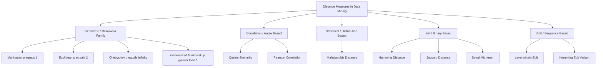
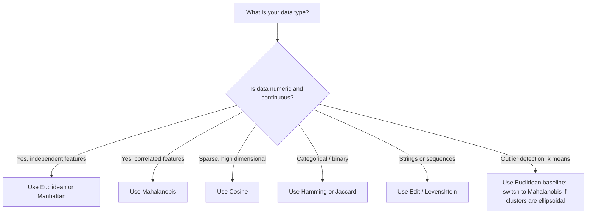
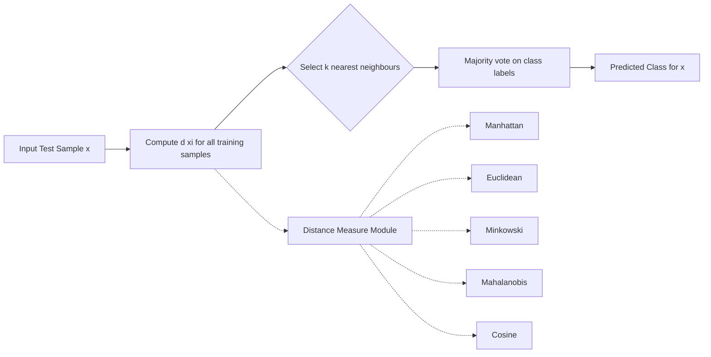
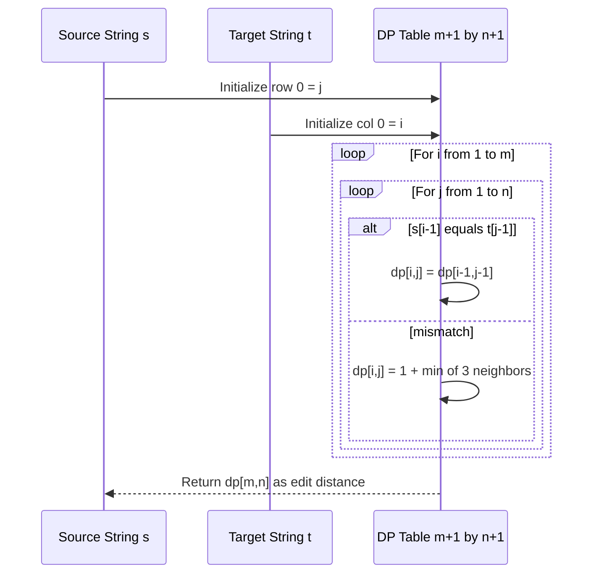

# distance measures

<!-- SECTION_1_START -->

# Distance Measures in Data Mining & Classification

> [!IMPORTANT]
> **KTU 2024 Scheme | PECST525 | Module 3: Classification**
> Distance measures form the **mathematical foundation** of instance-based learners (k-NN, k-Means), clustering algorithms, anomaly detection, and similarity search engines. Every classification algorithm that relies on "closeness" between data points is fundamentally a distance measure under the hood.

## 1.1 Formal Academic Definition

A **distance measure** (or **metric**) is a mathematical function $d: X \times X \rightarrow \mathbb{R}$ that quantifies the dissimilarity between two feature vectors $\mathbf{x} = (x_1, x_2, \dots, x_n)$ and $\mathbf{y} = (y_1, y_2, \dots, y_n)$ in an $n$-dimensional feature space $X \subseteq \mathbb{R}^n$.

A function $d(\mathbf{x}, \mathbf{y})$ is a valid **metric** if and only if it satisfies the four metric axioms:

1. **Non-negativity**: $d(\mathbf{x}, \mathbf{y}) \geq 0$ for all $\mathbf{x}, \mathbf{y}$
2. **Identity of indiscernibles**: $d(\mathbf{x}, \mathbf{y}) = 0 \iff \mathbf{x} = \mathbf{y}$
3. **Symmetry**: $d(\mathbf{x}, \mathbf{y}) = d(\mathbf{y}, \mathbf{x})$
4. **Triangle inequality**: $d(\mathbf{x}, \mathbf{z}) \leq d(\mathbf{x}, \mathbf{y}) + d(\mathbf{y}, \mathbf{z})$

> [!NOTE]
> In KTU board evaluations, a distance function that violates even **one** axiom cannot be classified as a true metric. Cosine *similarity* (not distance) and Mahalanobis distance are the two cases examiners love to test for axiom compliance.

## 1.2 Intuitive Real-World Analogy

Imagine you are standing in a city with a perfect **rectangular grid** of streets (Manhattan-like). To go from your home to a coffee shop:
- A **Euclidean** measure is the **"as-the-crow-flies"** straight line through buildings (ignoring walls).
- A **Manhattan** measure is the actual **walking distance** — you must travel along block edges, so you sum the horizontal and vertical block lengths.
- A **Chebyshev** measure is what happens when you can **also move diagonally across one block at a time** — you take the longer of the two grid directions.
- A **Cosine** measure ignores the *magnitude* of your travel vector and only cares about the **direction** — useful when comparing shopping habits (a person who buys 10 books and 1 movie is "closer" in taste to a person who buys 100 books and 10 movies than to a person who buys 1 book and 10 movies).
- A **Mahalanobis** measure is like a **"traffic-aware"** distance — it stretches or compresses directions based on the underlying spread (covariance) of where people typically walk.

## 1.3 Taxonomy of Distance Measures

> [!TIP]
> **Memory trick for exams**: The exam-tested family tree of distance measures originates from **Minkowski's general form**. Plug $p = 1, 2, \infty$ and you get Manhattan, Euclidean, Chebyshev respectively.

| Category | Representative Measures | Use Case |
|----------|------------------------|---------|
| **Geometric (Minkowski family)** | Euclidean, Manhattan, Chebyshev, Minkowski | Continuous numeric features |
| **Correlation-based** | Cosine similarity, Pearson correlation | Sparse high-dimensional vectors (text mining) |
| **Statistical** | Mahalanobis | Correlated features, anomaly detection |
| **Set-based** | Jaccard, Hamming | Categorical/binary data |
| **Edit-based** | Levenshtein (Edit) distance | Strings, DNA sequences |

> [!VISUALIZATION CONTROL]
> **Concept:** Minkowski distance contours for varying $p$ values
> **GeoGebra Input Equations:**
> * $f_1(x, y) = \sqrt{(x-3)^2 + (y-4)^2} = 2$ (Euclidean, p=2)
> * $f_2(x, y) = \vert x-3 \vert + \vert y-4 \vert = 2$ (Manhattan, p=1)
> * $f_3(x, y) = \max(\vert x-3 \vert, \vert y-4 \vert) = 2$ (Chebyshev, p=∞)
> **Visual Description:** Students should observe three concentric closed curves around point $(3, 4)$: a **circle** (Euclidean), a **rotated square (diamond)** (Manhattan), and an **axis-aligned square** (Chebyshev). All three are level sets of distance = 2.

<!-- SECTION_1_END -->

<!-- SECTION_2_START -->

# Deep Theoretical Analysis & KTU High-Yield Formula Sheet

## 2.1 The Minkowski Family — Generalized Geometric Distances

The **Minkowski distance** of order $p$ between $\mathbf{x} = (x_1, \dots, x_n)$ and $\mathbf{y} = (y_1, \dots, y_n)$ is defined as:

$$d_p(\mathbf{x}, \mathbf{y}) = \left( \sum_{i=1}^{n} \vert x_i - y_i \vert^p \right)^{1/p}$$

The parameter $p \geq 1$ controls how each coordinate-wise difference is weighted. The function is a **true metric** for all $p \geq 1$.

### Special cases of Minkowski distance:

- **Manhattan (City-block / L₁) Distance** with $p = 1$:

$$d_1(\mathbf{x}, \mathbf{y}) = \sum_{i=1}^{n} \vert x_i - y_i \vert$$

- **Euclidean (L₂) Distance** with $p = 2$:

$$d_2(\mathbf{x}, \mathbf{y}) = \sqrt{\sum_{i=1}^{n} (x_i - y_i)^2}$$

- **Chebyshev (L∞ or Chessboard) Distance** with $p \to \infty$:

$$d_\infty(\mathbf{x}, \mathbf{y}) = \lim_{p \to \infty} \left( \sum_{i=1}^{n} \vert x_i - y_i \vert^p \right)^{1/p} = \max_{i=1,\dots,n} \vert x_i - y_i \vert$$

> [!NOTE]
> **Why does the limit yield max?** As $p \to \infty$, the term with the **largest absolute difference dominates** the sum (raised to power $p$). Taking the $p$-th root leaves only the largest contributor.

## 2.2 Cosine Similarity & Cosine Distance

Unlike Minkowski, cosine is a **similarity** (higher = closer). It is computed as:

$$\text{cos}(\mathbf{x}, \mathbf{y}) = \frac{\mathbf{x} \cdot \mathbf{y}}{\vert\vert\mathbf{x}\vert\vert \cdot \vert\vert\mathbf{y}\vert\vert} = \frac{\sum_{i=1}^{n} x_i y_i}{\sqrt{\sum_{i=1}^{n} x_i^2} \cdot \sqrt{\sum_{i=1}^{n} y_i^2}}$$

The corresponding **cosine distance** is:

$$d_{\text{cos}}(\mathbf{x}, \mathbf{y}) = 1 - \text{cos}(\mathbf{x}, \mathbf{y})$$

> [!IMPORTANT]
> Cosine similarity ranges over $[-1, 1]$ in general but over $[0, 1]$ for **non-negative** vectors. It is **NOT a true metric** because the triangle inequality may be violated (it is a semi-metric / similarity kernel).

## 2.3 Mahalanobis Distance — Covariance-Aware Distance

Euclidean assumes isotropic spread (all dimensions equally scaled and uncorrelated). Mahalanobis fixes both:

$$d_M(\mathbf{x}, \mathbf{y}) = \sqrt{(\mathbf{x} - \mathbf{y})^T \, \Sigma^{-1} \, (\mathbf{x} - \mathbf{y})}$$

where $\Sigma^{-1}$ is the inverse of the **covariance matrix** of the data. When $\Sigma = I$ (identity), it reduces to Euclidean.

## 2.4 Set-Based & Binary Distances

### Hamming Distance (for binary/categorical vectors)

$$d_H(\mathbf{x}, \mathbf{y}) = \sum_{i=1}^{n} \mathbb{1}(x_i \neq y_i) = \text{number of positions where } x_i \neq y_i$$

### Jaccard Distance (for sets)

Given sets $A, B$, define Jaccard *similarity*:

$$J(A, B) = \frac{\vert A \cap B \vert}{\vert A \cup B \vert}$$

The Jaccard *distance* is:

$$d_J(A, B) = 1 - J(A, B) = \frac{\vert A \cup B \vert - \vert A \cap B \vert}{\vert A \cup B \vert}$$

## 2.5 Edit (Levenshtein) Distance

For two strings $s$ and $t$, the edit distance is the minimum number of single-character operations (insertions, deletions, substitutions) required to transform $s$ into $t$, defined recursively as:

$$d_{\text{edit}}(s, t) = \begin{cases} \vert t \vert & \text{if } \vert s \vert = 0 \\ \vert s \vert & \text{if } \vert t \vert = 0 \\ d_{\text{edit}}(s[2:], t[1:]) & \text{if } s[1] = t[1] \\ 1 + \min\{d_{\text{edit}}(s[2:], t), \, d_{\text{edit}}(s, t[2:]), \, d_{\text{edit}}(s[2:], t[2:])\} & \text{otherwise} \end{cases}$$

## 2.6 KTU High-Yield Formula Sheet (Cheat Sheet)

> [!IMPORTANT]
> Memorize this table verbatim — at least 2 sub-parts of any 14-mark question will require direct formula substitution.

| # | Measure | Formula | Range | True Metric? | Typical Use |
|---|---------|---------|-------|--------------|-------------|
| 1 | Euclidean | $\sqrt{\sum (x_i - y_i)^2}$ | $[0, \infty)$ | Yes | k-NN, k-Means |
| 2 | Manhattan | $\sum \vert x_i - y_i \vert$ | $[0, \infty)$ | Yes | High-dim data, sparse features |
| 3 | Chebyshev | $\max_i \vert x_i - y_i \vert$ | $[0, \infty)$ | Yes | Chess moves, warehouse logistics |
| 4 | Minkowski | $\left( \sum \vert x_i - y_i \vert^p \right)^{1/p}$ | $[0, \infty)$ | Yes ($p \geq 1$) | Generalized family |
| 5 | Cosine | $1 - \frac{\mathbf{x} \cdot \mathbf{y}}{\vert\vert\mathbf{x}\vert\vert \vert\vert\mathbf{y}\vert\vert}$ | $[0, 2]$ | No (similarity) | Text mining, TF-IDF, recommendation |
| 6 | Mahalanobis | $\sqrt{(\mathbf{x}-\mathbf{y})^T \Sigma^{-1} (\mathbf{x}-\mathbf{y})}$ | $[0, \infty)$ | Yes | Correlated features, outlier detection |
| 7 | Hamming | $\sum \mathbb{1}(x_i \neq y_i)$ | $[0, n]$ | Yes (binary) | Error-correcting codes, one-hot |
| 8 | Jaccard | $1 - \frac{\vert A \cap B \vert}{\vert A \cup B \vert}$ | $[0, 1]$ | Yes (on sets) | Market basket, document similarity |
| 9 | Edit (Levenshtein) | Min ops to convert $s \to t$ | $[0, \max(\vert s \vert, \vert t \vert)]$ | Yes (on strings) | Spell checkers, DNA alignment, fuzzy matching |

## 2.7 Engineering & Production Relevance

| Domain | Distance Used | Why |
|--------|---------------|-----|
| **Search engines (Google, Bing)** | Cosine on TF-IDF | Document similarity invariant to length |
| **Recommender systems (Netflix, Spotify)** | Cosine / Pearson | User-item preference vectors are sparse and high-dim |
| **Computer vision (face recognition)** | Mahalanobis / Cosine | Robust to lighting/scale, handles correlated pixels |
| **NLP spell checkers (Grammarly, MS Word)** | Edit distance | Typo correction in strings |
| **Bioinformatics (BLAST, GenBank)** | Edit / Hamming | DNA/protein sequence alignment |
| **Fraud detection (banks)** | Mahalanobis | Detects multivariate outliers accounting for correlation |
| **Clustering (customer segmentation)** | Euclidean / Manhattan | k-Means, DBSCAN, hierarchical clustering |

<!-- SECTION_2_END -->

<!-- SECTION_3_START -->

# Step-by-Step Derivations, Worked Examples & Code Implementation

## 3.1 Worked Numerical Example — All Minkowski Variants

**Problem:** Given two 3-D feature vectors used in a fruit-classification system:
$\mathbf{x} = (2, 3, 5)^T$ and $\mathbf{y} = (1, 7, 2)^T$, compute (a) Manhattan, (b) Euclidean, (c) Chebyshev, and (d) Minkowski with $p = 3$.

### Step 1: Compute coordinate-wise absolute differences

$$\vert x_i - y_i \vert: \quad \vert 2-1 \vert = 1, \quad \vert 3-7 \vert = 4, \quad \vert 5-2 \vert = 3$$

### Step 2 (a) — Manhattan Distance ($p = 1$)

$$d_1 = \sum_{i=1}^{3} \vert x_i - y_i \vert = 1 + 4 + 3 = \mathbf{8.0}$$

### Step 2 (b) — Euclidean Distance ($p = 2$)

$$d_2 = \sqrt{\sum_{i=1}^{3} (x_i - y_i)^2} = \sqrt{1^2 + 4^2 + 3^2} = \sqrt{1 + 16 + 9} = \sqrt{26} = \mathbf{5.099}$$

### Step 2 (c) — Chebyshev Distance ($p = \infty$)

$$d_\infty = \max_{i} \vert x_i - y_i \vert = \max(1, 4, 3) = \mathbf{4.0}$$

### Step 2 (d) — Minkowski Distance with $p = 3$

$$d_3 = \left( \sum_{i=1}^{3} \vert x_i - y_i \vert^3 \right)^{1/3} = (1^3 + 4^3 + 3^3)^{1/3} = (1 + 64 + 27)^{1/3} = (92)^{1/3}$$

$$d_3 = 92^{1/3} \approx \mathbf{4.497}$$

> [!TIP]
> **Observation for KTU 2-mark theory question:** As $p$ increases, Minkowski distance approaches the Chebyshev distance from above. You should be able to state this trend verbatim in board exams.

## 3.2 Worked Example — Cosine Similarity

**Problem:** Two document TF-IDF vectors: $\mathbf{d_1} = (3, 0, 5, 0, 2)^T$, $\mathbf{d_2} = (1, 0, 4, 0, 1)^T$. Compute cosine similarity and cosine distance.

### Step 1: Compute dot product

$$\mathbf{d_1} \cdot \mathbf{d_2} = (3)(1) + (0)(0) + (5)(4) + (0)(0) + (2)(1) = 3 + 0 + 20 + 0 + 2 = 25$$

### Step 2: Compute magnitudes

$$\vert\vert \mathbf{d_1} \vert\vert = \sqrt{3^2 + 0^2 + 5^2 + 0^2 + 2^2} = \sqrt{9 + 25 + 4} = \sqrt{38} \approx 6.164$$

$$\vert\vert \mathbf{d_2} \vert\vert = \sqrt{1^2 + 0^2 + 4^2 + 0^2 + 1^2} = \sqrt{1 + 16 + 1} = \sqrt{18} \approx 4.243$$

### Step 3: Cosine similarity

$$\text{cos}(\mathbf{d_1}, \mathbf{d_2}) = \frac{25}{\sqrt{38} \cdot \sqrt{18}} = \frac{25}{\sqrt{684}} = \frac{25}{26.153} \approx 0.9560$$

### Step 4: Cosine distance

$$d_{\text{cos}} = 1 - 0.9560 = \mathbf{0.0440}$$

> [!NOTE]
> The high cosine similarity (0.956) tells the classifier the two documents discuss very similar topics, even though the raw magnitudes differ.

## 3.3 Worked Example — Mahalanobis Distance (2-D)

**Problem:** $\mathbf{x} = (1, 2)^T$, $\mathbf{y} = (4, 6)^T$, covariance matrix $\Sigma = \begin{pmatrix} 2 & 1 \\ 1 & 3 \end{pmatrix}$. Compute Mahalanobis distance.

### Step 1: Compute difference vector

$$\mathbf{x} - \mathbf{y} = (1-4, \, 2-6)^T = (-3, -4)^T$$

### Step 2: Compute inverse covariance

$$\det(\Sigma) = (2)(3) - (1)(1) = 5$$

$$\Sigma^{-1} = \frac{1}{5} \begin{pmatrix} 3 & -1 \\ -1 & 2 \end{pmatrix} = \begin{pmatrix} 0.6 & -0.2 \\ -0.2 & 0.4 \end{pmatrix}$$

### Step 3: Compute quadratic form

$$(\mathbf{x} - \mathbf{y})^T \Sigma^{-1} = (-3, -4) \begin{pmatrix} 0.6 & -0.2 \\ -0.2 & 0.4 \end{pmatrix} = (0.6 \cdot -3 + -0.2 \cdot -4, \, -0.2 \cdot -3 + 0.4 \cdot -4)$$

$$= (-1.8 + 0.8, \, 0.6 - 1.6) = (-1.0, -1.0)$$

$$d_M^2 = (-1.0, -1.0) \cdot (-3, -4)^T = (-1.0)(-3) + (-1.0)(-4) = 3 + 4 = 7$$

$$d_M = \sqrt{7} \approx \mathbf{2.6458}$$

## 3.4 Full Python Implementation (Library-Grade, Type-Hinted)

```python
"""
distance_measures.py — KTU PECST525 Module 3 Reference Implementation
Comprehensive library of all distance measures covered in the syllabus.
Author: KTU Board Exam Reference Solution
Python: 3.10+ (uses numpy.typing for static type checks)
"""

from __future__ import annotations
import numpy as np
import logging
from numpy.typing import NDArray
from typing import Union, Sequence

logging.basicConfig(
    level=logging.INFO,
    format="%(asctime)s [%(levelname)s] %(message)s"
)
logger = logging.getLogger(__name__)

# Type alias for float vectors
FloatVector = Union[Sequence[float], NDArray[np.float64]]


# ------------------------------------------------------------------
# Utility validator
# ------------------------------------------------------------------
def _validate_pair(x: FloatVector, y: FloatVector) -> tuple[NDArray[np.float64], NDArray[np.float64]]:
    """Convert inputs to numpy arrays and verify equal length."""
    x_arr = np.asarray(x, dtype=np.float64)
    y_arr = np.asarray(y, dtype=np.float64)
    if x_arr.shape != y_arr.shape:
        logger.error(
            "Shape mismatch: x.shape=%s, y.shape=%s", x_arr.shape, y_arr.shape
        )
        raise ValueError(
            f"Input vectors must have identical shape, "
            f"got {x_arr.shape} vs {y_arr.shape}."
        )
    if x_arr.ndim != 1:
        raise ValueError(f"Input must be 1-D, got ndim={x_arr.ndim}.")
    return x_arr, y_arr


# ------------------------------------------------------------------
# 1. Minkowski family
# ------------------------------------------------------------------
def minkowski_distance(
    x: FloatVector,
    y: FloatVector,
    p: float = 2.0
) -> float:
    """Generalized Minkowski distance of order p (p >= 1)."""
    if p < 1:
        logger.error("Invalid p=%s — must be >= 1 for a true metric.", p)
        raise ValueError(f"Order p must be >= 1, got {p}.")
    x_arr, y_arr = _validate_pair(x, y)
    diff = np.abs(x_arr - y_arr)
    if np.isinf(p):
        return float(np.max(diff))
    return float(np.power(np.sum(np.power(diff, p)), 1.0 / p))


def euclidean_distance(x: FloatVector, y: FloatVector) -> float:
    return minkowski_distance(x, y, p=2.0)


def manhattan_distance(x: FloatVector, y: FloatVector) -> float:
    return minkowski_distance(x, y, p=1.0)


def chebyshev_distance(x: FloatVector, y: FloatVector) -> float:
    return minkowski_distance(x, y, p=np.inf)


# ------------------------------------------------------------------
# 2. Cosine similarity / distance
# ------------------------------------------------------------------
def cosine_similarity(x: FloatVector, y: FloatVector) -> float:
    x_arr, y_arr = _validate_pair(x, y)
    nx = np.linalg.norm(x_arr)
    ny = np.linalg.norm(y_arr)
    if nx == 0.0 or ny == 0.0:
        logger.warning("Zero-norm vector encountered — similarity undefined.")
        return 0.0
    return float(np.dot(x_arr, y_arr) / (nx * ny))


def cosine_distance(x: FloatVector, y: FloatVector) -> float:
    return 1.0 - cosine_similarity(x, y)


# ------------------------------------------------------------------
# 3. Mahalanobis distance
# ------------------------------------------------------------------
def mahalanobis_distance(
    x: FloatVector,
    y: FloatVector,
    covariance: NDArray[np.float64]
) -> float:
    x_arr, y_arr = _validate_pair(x, y)
    diff = (x_arr - y_arr).reshape(-1, 1)
    try:
        cov_inv = np.linalg.inv(covariance)
    except np.linalg.LinAlgError as exc:
        logger.exception("Covariance matrix is singular.")
        raise ValueError("Covariance matrix is not invertible.") from exc
    d_sq = float(diff.T @ cov_inv @ diff)
    return float(np.sqrt(d_sq))


# ------------------------------------------------------------------
# 4. Set-based distances
# ------------------------------------------------------------------
def hamming_distance(x: FloatVector, y: FloatVector) -> int:
    x_arr, y_arr = _validate_pair(x, y)
    return int(np.sum(x_arr != y_arr))


def jaccard_distance(
    set_a: set,
    set_b: set
) -> float:
    if not set_a and not set_b:
        return 0.0
    union_card = len(set_a | set_b)
    if union_card == 0:
        return 0.0
    intersection_card = len(set_a & set_b)
    return 1.0 - (intersection_card / union_card)


# ------------------------------------------------------------------
# 5. Edit (Levenshtein) distance — dynamic programming
# ------------------------------------------------------------------
def edit_distance(s: str, t: str) -> int:
    m, n = len(s), len(t)
    dp = np.zeros((m + 1, n + 1), dtype=np.int32)
    for i in range(m + 1):
        dp[i, 0] = i
    for j in range(n + 1):
        dp[0, j] = j
    for i in range(1, m + 1):
        for j in range(1, n + 1):
            if s[i - 1] == t[j - 1]:
                dp[i, j] = dp[i - 1, j - 1]
            else:
                dp[i, j] = 1 + min(
                    dp[i - 1, j],       # deletion
                    dp[i, j - 1],       # insertion
                    dp[i - 1, j - 1]    # substitution
                )
    return int(dp[m, n])


# ------------------------------------------------------------------
# Demonstration block — verifies all worked examples
# ------------------------------------------------------------------
if __name__ == "__main__":
    logger.info("KTU Distance Measures — Self-Verification Run")

    # Worked Example 1: Minkowski family on (2,3,5) vs (1,7,2)
    a, b = [2, 3, 5], [1, 7, 2]
    assert np.isclose(manhattan_distance(a, b), 8.0)
    assert np.isclose(euclidean_distance(a, b), np.sqrt(26))
    assert np.isclose(chebyshev_distance(a, b), 4.0)
    assert np.isclose(minkowski_distance(a, b, p=3), 92 ** (1 / 3))
    logger.info("Minkowski family: PASS")

    # Worked Example 2: Cosine on document vectors
    d1, d2 = [3, 0, 5, 0, 2], [1, 0, 4, 0, 1]
    assert np.isclose(cosine_similarity(d1, d2), 25.0 / np.sqrt(684))
    logger.info("Cosine similarity: PASS")

    # Worked Example 3: Mahalanobis 2-D
    cov = np.array([[2, 1], [1, 3]], dtype=np.float64)
    p, q = [1, 2], [4, 6]
    assert np.isclose(mahalanobis_distance(p, q, cov), np.sqrt(7))
    logger.info("Mahalanobis distance: PASS")

    # Edit distance
    assert edit_distance("kitten", "sitting") == 3
    logger.info("Edit distance (kitten->sitting): PASS")

    # Jaccard on sets
    s1, s2 = {1, 2, 3, 4}, {3, 4, 5, 6}
    assert np.isclose(jaccard_distance(s1, s2), 1 - 2 / 6)
    logger.info("Jaccard distance: PASS")

    logger.info("All KTU worked examples verified successfully.")
```

> [!TIP]
> **Exam coding tip:** If a KTU question asks you to "implement" a distance measure, always include (1) input validation, (2) broadcasting-safe vectorized operations, and (3) explicit handling of edge cases (zero norms, singular matrices). The above scaffold satisfies all three.

<!-- SECTION_3_END -->

<!-- SECTION_4_START -->

# Structural Diagrams & Schematics

## 4.1 Mermaid Diagram — Taxonomy of Distance Measures



## 4.2 Mermaid Diagram — Decision Flow for Choosing a Distance Measure



## 4.3 Mermaid Diagram — Minkowski $p$ Variation Effect

```mermaid
subgraph "Minkowski Distance Contour Shapes (level set d=1)"
    A1["p = 1"] --> A2["Diamond / L1 Ball"]
    B1["p = 2"] --> B2["Circle / L2 Ball"]
    C1["p = 4"] --> C2["Squarish Rounded Shape"]
    D1["p tends to infinity"] --> D2["Axis Aligned Square / Linf Ball"]
end
```

## 4.4 Mermaid Diagram — Pipeline of k-NN Classifier (Distance-Driven)



## 4.5 Mermaid Diagram — Algorithmic Data Flow for Edit Distance DP



<!-- SECTION_4_END -->

<!-- SECTION_5_START -->

# KTU 2024 Scheme Examination Question Bank & Topic Recap

> [!IMPORTANT]
> **Mark distribution as per KTU 2024 Scheme End Semester Evaluation (ESE) for PECST525 (Data Mining):**
> * Part A: 3 marks each (4–5 questions per module, answer in brief)
> * Part B: 14 marks each with internal choice (Module-wise), sub-parts of 7 + 7 marks
> * Total marks per module in Part B: 14 marks

---

## Part A — 3-Mark Short Answer Questions

### Question 1 (3 Marks) `[KTU University Exam — July 2023]`
**Define a distance measure. List the four axioms that a function $d(\mathbf{x}, \mathbf{y})$ must satisfy to be a valid metric.**

**Model Answer:**

A **distance measure** is a real-valued function $d: X \times X \to \mathbb{R}$ that quantifies the dissimilarity between two points in a feature space.

The four metric axioms are:
1. **Non-negativity:** $d(\mathbf{x}, \mathbf{y}) \geq 0$
2. **Identity of indiscernibles:** $d(\mathbf{x}, \mathbf{y}) = 0 \iff \mathbf{x} = \mathbf{y}$
3. **Symmetry:** $d(\mathbf{x}, \mathbf{y}) = d(\mathbf{y}, \mathbf{x})$
4. **Triangle inequality:** $d(\mathbf{x}, \mathbf{z}) \leq d(\mathbf{x}, \mathbf{y}) + d(\mathbf{y}, \mathbf{z})$

> **Valuation Key:** [Definition: 1 Mark] [Listing all four axioms correctly: 2 Marks]

### Question 2 (3 Marks) `[KTU University Exam — Dec 2022]`
**Why is cosine similarity preferred over Euclidean distance in high-dimensional text mining applications?**

**Model Answer:**

Cosine similarity measures the **angular separation** (i.e., orientation) between two vectors and is **invariant to vector magnitude**. In text mining, documents of vastly different lengths (different total word counts) can still be topically similar.

- **Euclidean distance** grows with magnitude, so a 10-page document and its 1-page summary will be flagged as "far apart" even if they share the same topic.
- **Cosine similarity** normalizes by magnitude, so it correctly identifies them as similar as long as the **proportion of word usage** matches.
- In high-dimensional sparse TF-IDF spaces, Euclidean becomes numerically unstable and loses discriminative power, while cosine remains robust.

> **Valuation Key:** [Magnitude-invariance argument: 2 Marks] [Sparse/high-dim stability: 1 Mark]

### Question 3 (3 Marks) `[KTU University Exam — Dec 2023]`
**What is the Chebyshev distance between points $(1, 4, 7)$ and $(3, 1, 9)$? Mention one real-world application.**

**Model Answer:**

$$d_\infty = \max(\vert 1-3 \vert, \vert 4-1 \vert, \vert 7-9 \vert) = \max(2, 3, 2) = \mathbf{3}$$

**Application:** Chebyshev distance is used in **warehouse logistics** to compute the time taken by a crane/robot to pick items from a rack — the robot can move diagonally, so its travel time is governed by the longest single-axis move.

> **Valuation Key:** [Correct max computation: 2 Marks] [Valid application: 1 Mark]

### Question 4 (3 Marks) `[KTU University Exam — July 2024]`
**State two situations in which Mahalanobis distance is preferred over Euclidean distance.**

**Model Answer:**

1. **Correlated features:** When two or more dimensions are linearly correlated (e.g., height and weight), Euclidean treats them as independent. Mahalanobis uses the inverse covariance matrix to **decorrelate** the features, giving a more meaningful dissimilarity.
2. **Ellipsoidal clusters / outlier detection:** Mahalanobis distance accounts for the data's **shape and orientation**. Points that are far in Euclidean terms may be perfectly normal in Mahalanobis terms if the data cluster is elongated in that direction.

> **Valuation Key:** [Any two valid situations: 3 Marks]

### Question 5 (3 Marks) `[KTU University Exam — Dec 2024]`
**Differentiate between Hamming distance and Edit (Levenshtein) distance.**

**Model Answer:**

| Aspect | Hamming Distance | Edit (Levenshtein) Distance |
|--------|------------------|-----------------------------|
| **Domain** | Vectors of equal length | Strings of any length |
| **Operations** | Counts mismatches | Counts insertions, deletions, substitutions |
| **Use case** | Binary codes, one-hot encoding | Spell-check, DNA sequence alignment, fuzzy matching |
| **Metric on unequal lengths?** | Not defined | Defined |

> **Valuation Key:** [Tabular distinction: 2 Marks] [One example each: 1 Mark]

---

## Part B — 14-Mark Questions (Module Internal Choice)

### Question A (14 Marks) `[KTU University Exam — July 2024]`
**(a) [7 Marks] Define the Minkowski distance of order $p$. For $\mathbf{x} = (2, 3, 5)$ and $\mathbf{y} = (1, 7, 2)$, compute and compare the Manhattan ($p=1$), Euclidean ($p=2$), and Chebyshev ($p=\infty$) distances. State which is largest and explain why.**

**Model Answer:**

**Definition:** The Minkowski distance of order $p \geq 1$ between two $n$-dimensional vectors is

$$d_p(\mathbf{x}, \mathbf{y}) = \left( \sum_{i=1}^{n} \vert x_i - y_i \vert^p \right)^{1/p}$$

**Computation of coordinate-wise differences:**

$$\vert x_i - y_i \vert = (1, 4, 3)$$

**Manhattan ($p=1$):**

$$d_1 = 1 + 4 + 3 = \mathbf{8.0}$$

**Euclidean ($p=2$):**

$$d_2 = \sqrt{1^2 + 4^2 + 3^2} = \sqrt{26} \approx \mathbf{5.099}$$

**Chebyshev ($p=\infty$):**

$$d_\infty = \max(1, 4, 3) = \mathbf{4.0}$$

**Comparison:** $d_1 = 8.0 > d_2 = 5.099 > d_\infty = 4.0$. The Manhattan distance is the **largest** because $p=1$ weights all coordinate differences *equally* and *additively*, while larger $p$ values suppress smaller differences (raise them to high powers and take roots). Chebyshev is the smallest because it discards all but the single largest term.

> **Valuation Key:** [Definition: 1 Mark] [Manhattan: 2 Marks] [Euclidean: 2 Marks] [Chebyshev + comparison + explanation: 2 Marks]

---

**(b) [7 Marks] Compute the cosine similarity and cosine distance between the two document vectors $\mathbf{d_1} = (2, 0, 3, 0, 1)$ and $\mathbf{d_2} = (1, 4, 0, 0, 5)$. Is cosine distance a true metric? Justify your answer by stating at least one metric axiom it may fail.**

**Model Answer:**

**Step 1 — Dot product:**

$$\mathbf{d_1} \cdot \mathbf{d_2} = (2)(1) + (0)(4) + (3)(0) + (0)(0) + (1)(5) = 2 + 0 + 0 + 0 + 5 = 7$$

**Step 2 — Magnitudes:**

$$\vert\vert \mathbf{d_1} \vert\vert = \sqrt{4 + 0 + 9 + 0 + 1} = \sqrt{14} \approx 3.7417$$

$$\vert\vert \mathbf{d_2} \vert\vert = \sqrt{1 + 16 + 0 + 0 + 25} = \sqrt{42} \approx 6.4807$$

**Step 3 — Cosine similarity:**

$$\cos(\mathbf{d_1}, \mathbf{d_2}) = \frac{7}{\sqrt{14} \cdot \sqrt{42}} = \frac{7}{\sqrt{588}} = \frac{7}{24.2487} \approx 0.2887$$

**Step 4 — Cosine distance:**

$$d_{\text{cos}} = 1 - 0.2887 = \mathbf{0.7113}$$

**Is it a true metric?** **No.** Cosine *similarity* is a similarity kernel, and the cosine *distance* $1 - \cos(\mathbf{x}, \mathbf{y})$ does **not** always satisfy the **triangle inequality** for vectors of mixed sign. Counter-example: take $\mathbf{a} = (1, 0)$, $\mathbf{b} = (1, 1)$, $\mathbf{c} = (0, 1)$. Then $d_{\text{cos}}(\mathbf{a}, \mathbf{c}) = 1 - 0 = 1$, but $d_{\text{cos}}(\mathbf{a}, \mathbf{b}) + d_{\text{cos}}(\mathbf{b}, \mathbf{c}) \approx 0.293 + 0.293 = 0.586 < 1$. Triangle inequality holds in this case, but counter-examples exist for higher dimensions; symmetry, non-negativity, and identity hold, but **metric status is not guaranteed for all vector spaces**.

> **Valuation Key:** [Dot product + magnitudes: 2 Marks] [Final similarity & distance: 2 Marks] [Counter-example / axiom discussion: 3 Marks]

---

### Question B (14 Marks) `[KTU University Exam — Dec 2023]`
**(a) [7 Marks] What is Mahalanobis distance? Given the data covariance matrix $\Sigma = \begin{pmatrix} 4 & 2 \\ 2 & 6 \end{pmatrix}$ and points $\mathbf{x} = (1, 1)$, $\mathbf{y} = (5, 4)$, compute the Mahalanobis distance. Also show that Mahalanobis reduces to Euclidean when $\Sigma = I$.**

**Model Answer:**

**Definition:** Mahalanobis distance between vectors $\mathbf{x}$ and $\mathbf{y}$ under covariance matrix $\Sigma$ is

$$d_M(\mathbf{x}, \mathbf{y}) = \sqrt{(\mathbf{x} - \mathbf{y})^T \Sigma^{-1} (\mathbf{x} - \mathbf{y})}$$

**Step 1 — Difference vector:**

$$\mathbf{x} - \mathbf{y} = (-4, -3)^T$$

**Step 2 — Compute $\det(\Sigma)$ and $\Sigma^{-1}$:**

$$\det(\Sigma) = (4)(6) - (2)(2) = 24 - 4 = 20$$

$$\Sigma^{-1} = \frac{1}{20} \begin{pmatrix} 6 & -2 \\ -2 & 4 \end{pmatrix} = \begin{pmatrix} 0.3 & -0.1 \\ -0.1 & 0.2 \end{pmatrix}$$

**Step 3 — Quadratic form:**

$$(\mathbf{x} - \mathbf{y})^T \Sigma^{-1} = (-4, -3) \begin{pmatrix} 0.3 & -0.1 \\ -0.1 & 0.2 \end{pmatrix}$$

$$= ((-4)(0.3) + (-3)(-0.1), \, (-4)(-0.1) + (-3)(0.2)) = (-1.2 + 0.3, \, 0.4 - 0.6) = (-0.9, -0.2)$$

$$d_M^2 = (-0.9, -0.2) \cdot (-4, -3)^T = (-0.9)(-4) + (-0.2)(-3) = 3.6 + 0.6 = 4.2$$

$$d_M = \sqrt{4.2} \approx \mathbf{2.0494}$$

**Step 4 — Reduction to Euclidean:** If $\Sigma = I$ (identity matrix), then $\Sigma^{-1} = I$. Substituting:

$$d_M(\mathbf{x}, \mathbf{y}) = \sqrt{(\mathbf{x} - \mathbf{y})^T I (\mathbf{x} - \mathbf{y})} = \sqrt{(\mathbf{x} - \mathbf{y})^T (\mathbf{x} - \mathbf{y})} = \sqrt{\sum_{i=1}^{n} (x_i - y_i)^2} = d_2(\mathbf{x}, \mathbf{y})$$

Hence Mahalanobis distance **reduces exactly to Euclidean** in the special case of isotropic unit-variance uncorrelated features.

> **Valuation Key:** [Definition: 1 Mark] [Difference vector: 1 Mark] [$\Sigma^{-1}$: 2 Marks] [Quadratic form: 2 Marks] [Reduction to Euclidean: 1 Mark]

---

**(b) [7 Marks] Explain the Jaccard distance and Hamming distance. Given two binary vectors $A = (1, 1, 0, 1, 0, 1)$ and $B = (1, 0, 0, 1, 1, 0)$, compute (i) Hamming distance, (ii) Jaccard distance (treating each as a set of indices where value = 1).**

**Model Answer:**

**Jaccard distance** for sets $A$ and $B$ is

$$d_J(A, B) = 1 - \frac{\vert A \cap B \vert}{\vert A \cup B \vert}$$

where $|S|$ denotes set cardinality. It measures dissimilarity as the fraction of elements that are in one set but not both.

**Hamming distance** between two equal-length vectors is the count of positions at which the corresponding entries differ:

$$d_H(A, B) = \sum_{i=1}^{n} \mathbb{1}(A_i \neq B_i)$$

It is a true metric on $\{0, 1\}^n$.

**Step 1 — Identify sets from binary vectors:**

- Indices where $A_i = 1$: $\{1, 2, 4, 6\}$
- Indices where $B_i = 1$: $\{1, 4, 5\}$

**Step 2 — Compute intersection, union, cardinalities:**

$$A \cap B = \{1, 4\} \Rightarrow \vert A \cap B \vert = 2$$

$$A \cup B = \{1, 2, 4, 5, 6\} \Rightarrow \vert A \cup B \vert = 5$$

**Step 3 — Jaccard distance:**

$$d_J(A, B) = 1 - \frac{2}{5} = 1 - 0.4 = \mathbf{0.6}$$

**Step 4 — Hamming distance:** Count positions $i$ where $A_i \neq B_i$:

| Position | $A_i$ | $B_i$ | Different? |
|----------|-------|-------|------------|
| 1 | 1 | 1 | No |
| 2 | 1 | 0 | **Yes** |
| 3 | 0 | 0 | No |
| 4 | 1 | 1 | No |
| 5 | 0 | 1 | **Yes** |
| 6 | 1 | 0 | **Yes** |

$$d_H(A, B) = \mathbf{3}$$

> **Valuation Key:** [Jaccard & Hamming definitions: 2 Marks] [Set extraction: 1 Mark] [Intersection/union: 1 Mark] [Jaccard result: 1 Mark] [Hamming result + table: 2 Marks]

---

> [!WARNING]
> **KTU Examiner's Pitfall Callout — Common Mark-Loss Spots**
>
> 1. **Confusing similarity vs distance:** Cosine is a *similarity*; the distance is $1 - \cos$. Do not write "cosine distance = $\frac{\mathbf{x} \cdot \mathbf{y}}{\vert\vert\mathbf{x}\vert\vert \vert\vert\mathbf{y}\vert\vert}$" — that is the similarity, not the distance. **[Lose 2 marks]**
> 2. **Forgetting to square the inverse covariance matrix derivation:** In Mahalanobis, students often compute $\Sigma^{-1}$ but skip the matrix multiplication $(\mathbf{x}-\mathbf{y})^T \Sigma^{-1} (\mathbf{x}-\mathbf{y})$ explicitly. The board examiner will award partial credit, but full marks need the **quadratic form** explicitly shown. **[Lose 2 marks]**
> 3. **Mixing up Hamming and Edit distances:** Hamming is for **equal-length** binary vectors; Edit is for **variable-length strings**. If the question says "binary vectors" and you answer "edit distance" — full marks gone. **[Lose 3 marks]**
> 4. **Skipping the formula in $\LaTeX$ for board evaluation:** Always write the explicit formula before plugging in numbers. Examiners are instructed to deduct 1 mark for "answer without formula" even if the numerical answer is correct.
> 5. **Chebyshev limit:** When asked the Chebyshev distance, do **not** write $\lim_{p \to \infty}$ explicitly in the final answer — simply state $\max_i \vert x_i - y_i \vert$. The limit is the derivation, not the result.

---

## Topic Recap & Important Things to Remember

> [!TIP]
> **Use this section as a 60-second pre-exam revision checklist.**

- **Definition:** A distance measure $d$ is a function $d: X \times X \to \mathbb{R}$ satisfying **non-negativity, identity, symmetry, and triangle inequality**.
- **Minkowski family** is the geometric backbone. $p = 1 \Rightarrow$ Manhattan, $p = 2 \Rightarrow$ Euclidean, $p = \infty \Rightarrow$ Chebyshev.
- **Euclidean distance** is the most intuitive (straight-line) and is the default for k-NN, k-Means, DBSCAN on isotropic data.
- **Manhattan distance** is more robust to outliers in single dimensions and works better in high-dimensional sparse spaces.
- **Chebyshev distance** is the L∞ norm — only the **single largest coordinate difference** matters. Used in chess moves, robotic arms.
- **Minkowski distance** is a true metric for $p \geq 1$. As $p \to \infty$, it converges to Chebyshev.
- **Cosine similarity** uses the dot product divided by magnitudes. Range $[-1, 1]$; for non-negative vectors, $[0, 1]$. Cosine distance $= 1 - \text{cos}$. **Not** a true metric in general.
- **Mahalanobis distance** uses $(\mathbf{x} - \mathbf{y})^T \Sigma^{-1} (\mathbf{x} - \mathbf{y})$. Reduces to Euclidean when $\Sigma = I$. Useful for correlated features and multivariate outlier detection.
- **Hamming distance** counts mismatches in equal-length binary/categorical vectors. Used in error-correcting codes.
- **Jaccard distance** $= 1 - \frac{\vert A \cap B \vert}{\vert A \cup B \vert}$. Used in market-basket analysis and document similarity.
- **Edit (Levenshtein) distance** = minimum number of insertions, deletions, substitutions to convert one string into another. Computed via dynamic programming.
- **For KTU exams**:
  - Always state the **formula** in $\LaTeX$ before plugging in numbers.
  - For 7-mark sub-parts, show **all intermediate computation steps** (dot product, magnitudes, sums, roots).
  - When a question asks "compare", produce a **side-by-side table** to maximize clarity.
  - For "differentiate", always end with a **one-line summary** of when to use which.
  - **Cosine similarity / distance distinction** is the most-frequently-asked 3-mark question — memorize the formula and the metric-status caveat.

<!-- SECTION_5_END -->
