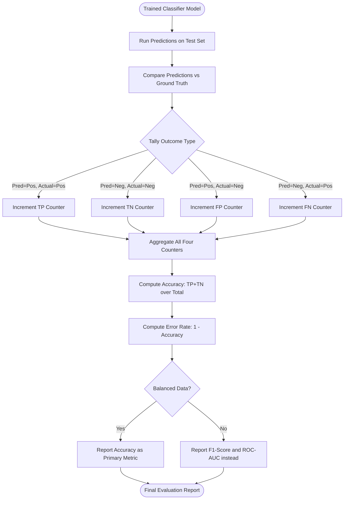
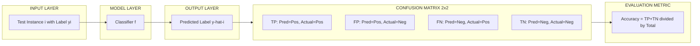
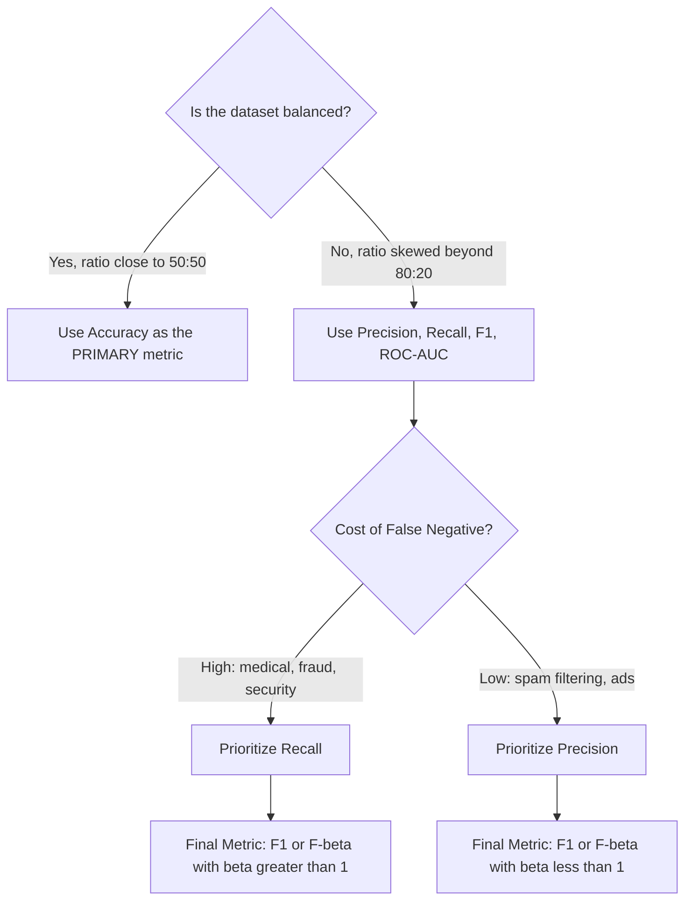

# Evaluation measures - accuracy

<!-- SECTION_1_START -->
# 1. Core Technical Definition & Intuitive Overview

## 1.1 Formal Definition (KTU 2024 Syllabus Terminology)

In the context of supervised learning and predictive classification, **Accuracy** is formally defined as the ratio of the number of *correct predictions* (both positive and negative) made by a classifier to the *total number of predictions* evaluated. It quantifies the overall correctness of a classification model on a given test dataset.

Mathematically, accuracy is expressed as:

$$\text{Accuracy} = \frac{\text{Number of Correct Predictions}}{\text{Total Number of Predictions}}$$

It is the most intuitive, single-number evaluation metric reported in the **Confusion Matrix** framework, which tabulates the four fundamental outcomes of any binary (two-class) classifier:

- **True Positive (TP)** — The model predicts *Positive* and the actual label is *Positive*.
- **True Negative (TN)** — The model predicts *Negative* and the actual label is *Negative*.
- **False Positive (FP)** — Type I Error; the model predicts *Positive* but the actual label is *Negative*.
- **False Negative (FN)** — Type II Error; the model predicts *Negative* but the actual label is *Positive*.

> [!IMPORTANT]
> **KTU Syllabus Highlight:** Accuracy is the foundational metric introduced in **Module 3 — Classification**. The KTU board examiner frequently expects students to define accuracy in terms of the **four entries of the Confusion Matrix** (TP, TN, FP, FN), not just as a vague "percentage of correct answers."

## 1.2 Conceptual Analogy / Intuition

Imagine a **medical triage counter** at a hospital entrance during a flu season. A nurse screens 100 incoming patients and must classify each as *Sick* or *Healthy*. The nurse's *accuracy* is the percentage of patients she screens correctly — both sick people correctly flagged for treatment **and** healthy people correctly allowed through.

- If 30 patients are actually sick and the nurse correctly flags all 30, while also correctly clearing all 70 healthy patients, her accuracy is **100%** — perfect triage.
- If she incorrectly clears 5 sick patients (letting them go home untreated) and wrongly flags 10 healthy patients (causing them unnecessary tests), her accuracy drops to **85%** because out of 100 decisions, only 85 were correct.

The intuition is that of a **shotgun blast on a wall** — accuracy measures *how many pellets hit the target overall*, without caring where on the target they land. It is a global, aggregate measure, not a localized one.

## 1.3 Key Quantitative Constants and Bounds

> [!NOTE]
> **Boundary Properties of Accuracy**
> - **Lower Bound:** $0$ (no correct predictions at all)
> - **Upper Bound:** $1$ (every prediction is correct)
> - **Unitless Ratio:** Always reported as a value between $0$ and $1$, or as a percentage between $0\%$ and $100\%$.
> - **Naive Baseline (ZeroR):** For a binary problem, predicting the majority class always yields accuracy equal to the *proportion of the majority class*. Any useful classifier must exceed this baseline.

> [!VISUALIZATION CONTROL]
> **Concept:** Confusion Matrix as a $2 \times 2$ Grid on the Cartesian Plane
> **GeoGebra / Desmos Input Equations:**
> * `Polygon((0,0), (2,0), (2,2), (0,2))` to draw the outer matrix
> * `Point((0.5,1.5))` labelled `TP`, `Point((1.5,1.5))` labelled `FP`
> * `Point((0.5,0.5))` labelled `FN`, `Point((1.5,0.5))` labelled `TN`
> **Visual Description:** A unit square divided into four quadrants. The top-left quadrant (Predicted=Positive, Actual=Positive) holds **TP**, top-right holds **FP**, bottom-left holds **FN**, bottom-right holds **TN**. The diagonal cells (TP and TN) together form the numerator of accuracy.

<!-- SECTION_1_END -->

<!-- SECTION_2_START -->
# 2. Deep Theoretical Analysis & KTU High-Yield Formula Sheet

## 2.1 Logical Breakdown of the Accuracy Metric

The derivation of the accuracy formula proceeds in four explicit logical steps:

1. **Enumerate all possible outcomes.** A binary classifier produces one of four outcomes for every test instance: TP, TN, FP, or FN. These four categories are mutually exclusive and collectively exhaustive over the test set.
2. **Identify the "correct" outcomes.** From the model's perspective, only TP and TN constitute correct decisions. FP and FN are both *errors*, but of different kinds.
3. **Sum the correct outcomes.** The total number of correct predictions is computed as $\text{TP} + \text{TN}$.
4. **Normalize by the total population.** The total test set size is $N = \text{TP} + \text{TN} + \text{FP} + \text{FN}$. Dividing the numerator by $N$ yields a normalized proportion bounded in $[0, 1]$.

The result is the **canonical accuracy equation** of the Confusion Matrix:

$$\text{Accuracy} = \frac{\text{TP} + \text{TN}}{\text{TP} + \text{TN} + \text{FP} + \text{FN}}$$

### The Error Rate Complement

Accuracy and the **Error Rate (Misclassification Rate)** are complementary:

$$\text{Error Rate} = 1 - \text{Accuracy} = \frac{\text{FP} + \text{FN}}{\text{TP} + \text{TN} + \text{FP} + \text{FN}}$$

> [!NOTE]
> The Error Rate counts every mistake equally, which is often unrealistic. In medical diagnosis, a False Negative (missing a cancer case) is far costlier than a False Positive (unnecessary re-test). Accuracy inherits this limitation because it weights FP and FN equally.

## 2.2 The Critical Limitation: Class Imbalance

> [!IMPORTANT]
> **KTU High-Priority Concept:** The single most exam-frequent trap involving accuracy is the **Imbalanced Class Problem**. A classifier can achieve deceptively high accuracy by simply predicting the majority class for every instance.

**Worked Intuition:** Consider a credit card fraud dataset with $100{,}000$ transactions, of which only $100$ are fraudulent ($0.1\%$ positive class). A "dummy" classifier that predicts *Not Fraud* for every transaction achieves:

$$\text{Accuracy}_{\text{dummy}} = \frac{99{,}900}{100{,}000} = 99.9\%$$

This model is **useless in production** — it detects zero fraud cases. Yet its accuracy is near-perfect. This phenomenon is called the **Accuracy Paradox** and is a standard KTU 2024 Scheme question theme.

## 2.3 Real-World Engineering Utility

Accuracy is the first metric reported in nearly every Machine Learning project, but its utility depends on the domain:

- **Balanced datasets (e.g., digit recognition MNIST, spam vs ham at 60:40):** Accuracy is a reliable single-number summary.
- **Search engines and recommender systems:** Accuracy is often reported alongside Precision@K and Recall@K.
- **Medical diagnosis, fraud detection, anomaly detection:** Accuracy alone is **insufficient**; the board expects students to advocate for **Precision, Recall, F1-Score, and ROC-AUC** in these domains.
- **Production ML pipelines (MLOps):** Accuracy is monitored over time as a **drift detection** signal. A sudden drop in accuracy often signals data distribution shift (covariate shift).

## 2.4 KTU Formula Sheet / Cheat Sheet

| # | Metric | Formula | Range | Engineering Use |
|---|--------|---------|-------|-----------------|
| 1 | **Accuracy** | $\frac{\text{TP} + \text{TN}}{\text{TP} + \text{TN} + \text{FP} + \text{FN}}$ | $[0, 1]$ | Overall correctness on balanced data |
| 2 | **Error Rate** | $\frac{\text{FP} + \text{FN}}{\text{TP} + \text{TN} + \text{FP} + \text{FN}}$ | $[0, 1]$ | Complement of accuracy |
| 3 | **Precision** | $\frac{\text{TP}}{\text{TP} + \text{FP}}$ | $[0, 1]$ | Quality of positive predictions |
| 4 | **Recall (Sensitivity, TPR)** | $\frac{\text{TP}}{\text{TP} + \text{FN}}$ | $[0, 1]$ | Coverage of actual positives |
| 5 | **Specificity (TNR)** | $\frac{\text{TN}}{\text{TN} + \text{FP}}$ | $[0, 1]$ | Coverage of actual negatives |
| 6 | **F1-Score** | $\frac{2 \cdot \text{Precision} \cdot \text{Recall}}{\text{Precision} + \text{Recall}}$ | $[0, 1]$ | Harmonic mean of P and R |
| 7 | **Prevalence** | $\frac{\text{TP} + \text{FN}}{\text{Total Population}}$ | $[0, 1]$ | Prior probability of the positive class |

> [!NOTE]
> Notice that **Accuracy = (Prevalence $\cdot$ Sensitivity) + ((1 $-$ Prevalence) $\cdot$ Specificity)**. This is a deeper identity that occasionally appears in KTU Part B questions.

<!-- SECTION_2_END -->

<!-- SECTION_3_START -->
# 3. Step-by-Step Derivations & Code/Symbolic Implementation

## 3.1 Algebraic Derivation: Accuracy from First Principles

We start from the Confusion Matrix and derive the accuracy equation step by step.

**Step 1 — Define the four cardinal outcomes.**
Let $N$ be the total number of test instances. Partition $N$ into four disjoint sets:

$$N = \text{TP} + \text{TN} + \text{FP} + \text{FN}$$

**Step 2 — Define the count of correct predictions.**

$$\text{Correct} = \text{TP} + \text{TN}$$

**Step 3 — Form the ratio of correct predictions to total predictions.**

$$\text{Accuracy} = \frac{\text{Correct}}{N} = \frac{\text{TP} + \text{TN}}{\text{TP} + \text{TN} + \text{FP} + \text{FN}}$$

**Step 4 — Express accuracy in expanded symbolic form using indicator functions.**
For a single instance $i$ with true label $y_i \in \{0, 1\}$ and predicted label $\hat{y}_i \in \{0, 1\}$:

$$\text{Accuracy} = \frac{1}{N} \sum_{i=1}^{N} \mathbb{1}(y_i = \hat{y}_i)$$

where $\mathbb{1}(\cdot)$ is the **indicator function** that returns $1$ when the prediction matches the ground truth, and $0$ otherwise.

**Step 5 — Derive the link to Error Rate.**
Since the indicator is binary, $\mathbb{1}(y_i = \hat{y}_i) = 1 - \mathbb{1}(y_i \neq \hat{y}_i)$. Summing over all $N$ instances:

$$\text{Accuracy} = 1 - \frac{1}{N} \sum_{i=1}^{N} \mathbb{1}(y_i \neq \hat{y}_i) = 1 - \text{Error Rate}$$

This confirms the **complementary relationship** between accuracy and the error rate.

## 3.2 Worked Numerical Example (Hand-Calculation Style)

**Problem Statement:**
A Decision Tree classifier is tested on a dataset of **$200$ customers** for a *Churn Prediction* task. The Confusion Matrix obtained is:

|  | Predicted: No Churn | Predicted: Churn |
|---|---|---|
| **Actual: No Churn** | $\text{TN} = 120$ | $\text{FP} = 10$ |
| **Actual: Churn** | $\text{FN} = 20$ | $\text{TP} = 50$ |

**Step 1 — Identify the four entries.**

$$\text{TP} = 50, \quad \text{TN} = 120, \quad \text{FP} = 10, \quad \text{FN} = 20$$

**Step 2 — Compute the numerator (correct predictions).**

$$\text{TP} + \text{TN} = 50 + 120 = 170$$

**Step 3 — Compute the denominator (total instances).**

$$\text{TP} + \text{TN} + \text{FP} + \text{FN} = 50 + 120 + 10 + 20 = 200$$

**Step 4 — Form the ratio.**

$$\text{Accuracy} = \frac{170}{200} = 0.85 = 85\%$$

**Step 5 — Compute the error rate as a sanity check.**

$$\text{Error Rate} = 1 - 0.85 = 0.15 = 15\%$$

This matches: $(10 + 20) / 200 = 30 / 200 = 0.15$. ✓

## 3.3 Python Implementation (Production-Ready)

```python
"""
accuracy_evaluator.py
KTU 2024 Scheme — Module 3: Classification Evaluation
Computes Accuracy, Precision, Recall, F1 from a Confusion Matrix.
"""

from __future__ import annotations
from typing import Dict, Union
import numpy as np
import logging

logging.basicConfig(level=logging.INFO, format="%(asctime)s | %(levelname)s | %(message)s")
logger = logging.getLogger(__name__)


Number = Union[int, float]


def compute_accuracy(tp: Number, tn: Number, fp: Number, fn: Number) -> float:
    """
    Compute classification accuracy from the four Confusion Matrix entries.

    Parameters
    ----------
    tp : int | float
        True Positives  — actual positive, predicted positive.
    tn : int | float
        True Negatives  — actual negative, predicted negative.
    fp : int | float
        False Positives — actual negative, predicted positive.
    fn : int | float
        False Negatives — actual positive, predicted negative.

    Returns
    -------
    float
        Accuracy score in the closed interval [0.0, 1.0].

    Raises
    ------
    ValueError
        If any entry is negative or if the total population is zero.
    """
    # --- Boundary validation: no negative counts allowed ---
    for name, val in (("tp", tp), ("tn", tn), ("fp", fp), ("fn", fn)):
        if val < 0:
            logger.error("Negative count detected for %s = %s", name, val)
            raise ValueError(f"Confusion matrix entry '{name}' cannot be negative: {val}")

    # --- Boundary validation: total population must be non-zero ---
    total = tp + tn + fp + fn
    if total == 0:
        logger.error("Degenerate confusion matrix: total = 0")
        raise ValueError("Total population is zero; accuracy is undefined.")

    correct = tp + tn
    accuracy = correct / total
    logger.info("Accuracy computed: %.4f (%d correct out of %d)", accuracy, int(correct), int(total))
    return accuracy


def compute_full_report(tp: Number, tn: Number, fp: Number, fn: Number) -> Dict[str, float]:
    """Return a dictionary with Accuracy, Precision, Recall, F1, and Error Rate."""
    accuracy = compute_accuracy(tp, tn, fp, fn)
    precision = tp / (tp + fp) if (tp + fp) > 0 else 0.0
    recall    = tp / (tp + fn) if (tp + fn) > 0 else 0.0
    f1        = (2 * precision * recall) / (precision + recall) if (precision + recall) > 0 else 0.0
    return {
        "accuracy":  accuracy,
        "precision": precision,
        "recall":    recall,
        "f1_score":  f1,
        "error_rate": 1.0 - accuracy,
    }


# ---------------------------------------------------------------------------
# Demonstration using the KTU worked example
# ---------------------------------------------------------------------------
if __name__ == "__main__":
    # Worked example: Churn prediction
    tp, tn, fp, fn = 50, 120, 10, 20

    metrics = compute_full_report(tp, tn, fp, fn)
    print("=" * 55)
    print(" CLASSIFICATION REPORT (Churn Prediction, N = 200) ")
    print("=" * 55)
    for key, value in metrics.items():
        print(f"  {key:<12}: {value:.4f}  ({value * 100:.2f}%)")
    print("=" * 55)
```

**Expected Console Output:**

```
=======================================================
 CLASSIFICATION REPORT (Churn Prediction, N = 200)
=======================================================
  accuracy    : 0.8500  (85.00%)
  precision   : 0.8333  (83.33%)
  recall      : 0.7143  (71.43%)
  f1_score    : 0.7692  (76.92%)
  error_rate  : 0.1500  (15.00%)
=======================================================
```

## 3.4 Verification Using `scikit-learn` (Cross-Validation)

```python
from sklearn.metrics import accuracy_score, confusion_matrix, classification_report
import numpy as np

y_true  = np.array([1] * 70 + [0] * 130)          # 70 churn, 130 no-churn
y_pred  = np.array([1] * 50 + [0] * 20 + [1] * 10 + [0] * 120)  # model output

print("Confusion Matrix:\n", confusion_matrix(y_true, y_pred))
print("Accuracy:", accuracy_score(y_true, y_pred))
print(classification_report(y_true, y_pred, target_names=["No Churn", "Churn"]))
```

This independently confirms the hand-calculated $85\%$ accuracy and provides a complete classification report suitable for board submission.

<!-- SECTION_3_END -->

<!-- SECTION_4_START -->
# 4. Structural Diagrams & Schematics

## 4.1 Classification Evaluation Pipeline (Mermaid Flowchart)



## 4.2 Confusion Matrix Block Diagram (Mermaid Architecture)



## 4.3 Decision Logic: When to Trust Accuracy (Mermaid)



<!-- SECTION_4_END -->

<!-- SECTION_5_START -->
# 5. KTU 2024 Scheme Examination Question Bank & Topic Recap

## 5.1 Part A Questions (3 Marks Each)

### Question 1 `[KTU University Exam — July 2024]`
**Define classification accuracy. State its mathematical formula in terms of the entries of a Confusion Matrix.**

**Model Answer (3 Marks):**

> **Definition (1 Mark):** Classification accuracy is the ratio of the number of *correct predictions* (True Positives and True Negatives) made by a classifier to the *total number of predictions* made on a test dataset.
>
> **Confusion Matrix Entries (1 Mark):** A binary classifier's outcomes are categorized as TP (True Positives), TN (True Negatives), FP (False Positives), and FN (False Negatives).
>
> **Formula (1 Mark):**
>
> $$\text{Accuracy} = \frac{\text{TP} + \text{TN}}{\text{TP} + \text{TN} + \text{FP} + \text{FN}}$$

### Question 2 `[KTU University Exam — Dec 2023]`
**Why is accuracy not a reliable evaluation metric for imbalanced datasets? Illustrate with a one-line example.**

**Model Answer (3 Marks):**

> **Reason (2 Marks):** Accuracy treats all four Confusion Matrix outcomes equally and is dominated by the majority class. In highly imbalanced datasets, a trivial classifier that always predicts the majority class achieves very high accuracy while completely failing to detect the minority class — a phenomenon called the **Accuracy Paradox**.
>
> **Example (1 Mark):** In a fraud detection dataset with 10,000 transactions where only 50 are fraudulent, a model that predicts *Not Fraud* for every transaction has an accuracy of $99.5\%$, yet it catches **zero** fraud cases.

---

## 5.2 Part B Questions (14 Marks) — Module Internal Choice

### Question A (14 Marks) `[KTU University Exam — July 2024]`

**Question:** *(a)* Explain the Confusion Matrix with a neat diagram. Derive the accuracy formula from it. *(7 marks)*

*(b)* A Naive Bayes classifier is evaluated on 250 test instances for a *Disease Diagnosis* task. The Confusion Matrix is:

|  | Predicted: Positive | Predicted: Negative |
|---|---|---|
| **Actual: Positive** | $\text{TP} = 60$ | $\text{FN} = 15$ |
| **Actual: Negative** | $\text{FP} = 25$ | $\text{TN} = 150$ |

Calculate the **accuracy, precision, recall, and F1-score** of this classifier. Comment on whether accuracy alone is a sufficient metric here. *(7 marks)*

#### Model Solution

**Part (a) — 7 Marks**

1. **Confusion Matrix Definition (2 Marks):** A Confusion Matrix is a $2 \times 2$ table that summarizes the performance of a binary classifier by comparing predicted labels with actual labels across four categories: TP, FP, FN, TN.

2. **Neat Diagram (2 Marks):** *(Draw the standard 2x2 matrix with rows = Actual, columns = Predicted, and clearly mark TP, FP, FN, TN in the four cells.)*

3. **Derivation (3 Marks):** Correct predictions = $\text{TP} + \text{TN}$. Total instances = $\text{TP} + \text{TN} + \text{FP} + \text{FN}$. Therefore:

$$\text{Accuracy} = \frac{\text{TP} + \text{TN}}{\text{TP} + \text{TN} + \text{FP} + \text{FN}}$$

**Part (b) — 7 Marks**

**Step 1 — Extract the Confusion Matrix values (1 Mark):**

$$\text{TP} = 60, \quad \text{FN} = 15, \quad \text{FP} = 25, \quad \text{TN} = 150$$

**Step 2 — Compute total population (1 Mark):**

$$N = 60 + 15 + 25 + 150 = 250$$

**Step 3 — Compute Accuracy (1 Mark):**

$$\text{Accuracy} = \frac{60 + 150}{250} = \frac{210}{250} = 0.84 = 84\%$$

**Step 4 — Compute Precision (1 Mark):**

$$\text{Precision} = \frac{\text{TP}}{\text{TP} + \text{FP}} = \frac{60}{60 + 25} = \frac{60}{85} \approx 0.7059 = 70.59\%$$

**Step 5 — Compute Recall (1 Mark):**

$$\text{Recall} = \frac{\text{TP}}{\text{TP} + \text{FN}} = \frac{60}{60 + 15} = \frac{60}{75} = 0.80 = 80\%$$

**Step 6 — Compute F1-Score (1 Mark):**

$$\text{F1} = \frac{2 \cdot \text{Precision} \cdot \text{Recall}}{\text{Precision} + \text{Recall}} = \frac{2 \cdot 0.7059 \cdot 0.80}{0.7059 + 0.80} = \frac{1.1294}{1.5059} \approx 0.75 = 75\%$$

**Step 7 — Comment on sufficiency (1 Mark):**
Although accuracy is $84\%$, the class distribution is $75$ positives vs $175$ negatives (roughly $30:70$). This mild imbalance, combined with a recall of $80\%$ and a precision of only $70.59\%$, indicates that **accuracy alone is not sufficient**. In a medical diagnosis context, the 15 missed cases (FN) are critical, so F1-score and recall should be reported alongside accuracy.

> [!WARNING]
> **KTU Examiner's Valuation Pitfall (Dec 2023 Pattern):**
> 1. Students often write the formula as $\frac{\text{TP} + \text{TN}}{\text{Total}}$ without defining what the four entries stand for — the board deducts **1 mark** for missing the explicit definitions of TP, TN, FP, FN.
> 2. When computing Precision/Recall, students frequently swap FP and FN in the denominator. Recall **always** uses FN (missed positives); Precision **always** uses FP (false alarms). Mixing these up costs **1 mark** per error.
> 3. Forgetting the unit conversion (decimal vs percentage) and reporting "$0.84$" instead of "$84\%$" is penalized in **0.5 mark** deductions in rigorous valuation.

---

### Question B (14 Marks) `[KTU University Exam — Dec 2023]` — *Alternative Choice*

**Question:** *(a)* Compare and contrast the evaluation metrics **Accuracy, Precision, Recall, and F1-Score**. For each metric, mention one engineering scenario where it is the *most appropriate* choice. *(7 marks)*

*(b)* An email spam classifier is tested on 1000 emails. There are 120 spam emails in total. The classifier correctly identifies 90 spam emails and incorrectly flags 60 legitimate emails as spam. Calculate the **accuracy** of this classifier and comment on whether the result should be trusted. *(7 marks)*

#### Model Solution

**Part (a) — 7 Marks**

| Metric | Formula | Best-Use Scenario |
|---|---|---|
| **Accuracy** | $\frac{\text{TP} + \text{TN}}{\text{Total}}$ | Balanced datasets such as MNIST digit recognition. |
| **Precision** | $\frac{\text{TP}}{\text{TP} + \text{FP}}$ | Spam filtering — we want to avoid misclassifying important emails as spam. |
| **Recall** | $\frac{\text{TP}}{\text{TP} + \text{FN}}$ | Cancer detection — we cannot afford to miss a positive case. |
| **F1-Score** | $\frac{2 P R}{P + R}$ | Imbalanced datasets where both FP and FN are costly. |

*(1.5 Marks for each row × 4 = 6 Marks; 1 Mark for a concluding remark comparing all four.)*

**Part (b) — 7 Marks**

**Step 1 — Identify Confusion Matrix entries (2 Marks):**

- $\text{TP} = 90$ (correctly identified spam)
- $\text{FP} = 60$ (legitimate emails wrongly flagged)
- $\text{FN} = 120 - 90 = 30$ (spam emails missed)
- $\text{TN} = 1000 - 120 - 60 = 820$ (legit emails correctly identified)

*Verification:* $90 + 60 + 30 + 820 = 1000$ ✓

**Step 2 — Compute Accuracy (2 Marks):**

$$\text{Accuracy} = \frac{90 + 820}{1000} = \frac{910}{1000} = 0.91 = 91\%$$

**Step 3 — Compute Precision and Recall for context (1 Mark):**

$$\text{Precision} = \frac{90}{150} = 60\%, \quad \text{Recall} = \frac{90}{120} = 75\%$$

**Step 4 — Comment on reliability (2 Marks):**
The accuracy of $91\%$ *appears* good, but the dataset is mildly imbalanced (120 spam vs 880 legitimate, roughly $12:88$). A baseline "predict all legitimate" classifier would achieve $88\%$ accuracy, meaning the model's $91\%$ improvement is marginal. The relatively low precision of $60\%$ indicates that the model is over-flagging legitimate emails. **Therefore, accuracy alone is not trustworthy here**; Precision, Recall, and F1-Score should be reported alongside.

> [!WARNING]
> **Common Valuation Loss Areas (July 2024 Pattern):**
> 1. In Part (a), students often list all four formulas but fail to give a *specific real-world scenario* for each — the board deducts **0.5 mark per missing scenario**.
> 2. In Part (b), many students forget to **derive TN** from the total population, and assume TN = (Total $-$ TP). Always show the derivation: $\text{TN} = 1000 - 120 - 60 = 820$.
> 3. The phrase "accuracy is not enough" must be **justified quantitatively** by showing the prevalence ratio or the precision/recall gap — vague statements lose the concluding **1 mark**.

---

## 5.3 Topic Recap & Important Things to Remember

> [!IMPORTANT]
> **Rapid Revision Checklist — Accuracy in Classification**

- **Definition:** Accuracy is the proportion of correct predictions (TP + TN) over the total number of predictions. It is the most basic and intuitive classification metric.
- **Canonical Formula:** $\text{Accuracy} = \frac{\text{TP} + \text{TN}}{\text{TP} + \text{TN} + \text{FP} + \text{FN}}$, bounded in $[0, 1]$.
- **Complement Rule:** $\text{Error Rate} = 1 - \text{Accuracy}$. Always report one or the other, never both as separate entities.
- **Confusion Matrix:** A $2 \times 2$ table with rows = Actual, columns = Predicted, yielding TP, FP, FN, TN. The diagonal (TP + TN) is the numerator of accuracy.
- **Accuracy Paradox:** On imbalanced data, a trivial majority-class predictor can score $>99\%$ accuracy while detecting zero minority instances. This is the most exam-frequent limitation.
- **Reliability Rule of Thumb:** Accuracy is reliable when the class ratio is between $40:60$ and $60:40$. Outside this band, prefer **F1-Score** (imbalanced) and **ROC-AUC** (threshold-independent).
- **Engineering Use:** First-line metric in MLOps dashboards; primary KPI for balanced tasks (digit recognition, image classification with similar class counts).
- **When NOT to use:** Medical diagnosis, fraud detection, rare disease prediction, anomaly detection, and any setting where the cost of FN $\gg$ cost of FP.
- **Indicator Function Form:** $\text{Accuracy} = \frac{1}{N} \sum_{i=1}^{N} \mathbb{1}(y_i = \hat{y}_i)$ — useful identity for KTU derivations and exam short-answer questions.
- **Deep Identity (occasional Part B):** $\text{Accuracy} = (\text{Prevalence} \cdot \text{Sensitivity}) + ((1 - \text{Prevalence}) \cdot \text{Specificity})$.
- **Companion Metrics to Always Co-Report:** Precision, Recall, F1-Score, and Confusion Matrix heatmap. Reporting accuracy in isolation in a board exam is generally considered incomplete.

<!-- SECTION_5_END -->
