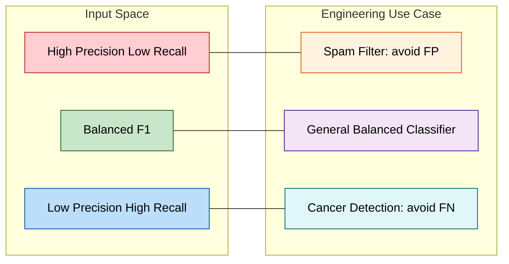

# F1 score

<!-- SECTION_1_START -->
# F1 Score: KTU 2024 Scheme — Comprehensive Board-Ready Notes

## 1. Core Technical Definition & Intuitive Overview

> [!NOTE]
> **Formal KTU 2024 Definition (PECST525 / Module 3 — Classification):**
> The **F1 score** (also called **F-measure** or **balanced F-score**) is the **harmonic mean of Precision and Recall** of a classification model. It is a single, scalar evaluation metric that balances the trade-off between *false positives* and *false negatives*, making it especially useful for **imbalanced classification** problems.

Mathematically, the F1 score for a binary classifier is defined as:

$$
F_1 = 2 \cdot \frac{\text{Precision} \cdot \text{Recall}}{\text{Precision} + \text{Recall}}
$$

It is a special case of the generalized $F_\beta$ score:

$$
F_\beta = (1 + \beta^2) \cdot \frac{\text{Precision} \cdot \text{Recall}}{(\beta^2 \cdot \text{Precision}) + \text{Recall}}
$$

where $\beta$ controls the weight of recall relative to precision.

---

### Conceptual Analogy / Intuition

Imagine a **fishing net** cast into a lake:

- **Precision** asks: *"Of all the fish I caught, how many were actually the fish I wanted?"* — measures *purity* of the catch.
- **Recall** asks: *"Of all the fish I wanted in the lake, how many did I manage to catch?"* — measures *completeness* of the catch.
- **F1 score** asks: *"How well do I balance catching the right fish (purity) and not missing the right fish (completeness)?"* — a single number that punishes extreme imbalance.

> [!IMPORTANT]
> Why a **harmonic mean** and not a simple average? Because the harmonic mean **penalizes extreme values**. A classifier with Precision = 0.99 and Recall = 0.01 yields a misleading arithmetic mean of 0.50, but an F1 of only **0.0198**, honestly reflecting that the model is essentially useless despite one strong metric. This is why F1 is the **board-preferred** metric for asymmetric class distributions.

### Standard Classification Constants (Bold per KTU Board Norms)

| Symbol | Meaning | Range |
| :--- | :--- | :--- |
| **TP** | True Positives | $\geq 0$ |
| **TN** | True Negatives | $\geq 0$ |
| **FP** | False Positives (Type I Error) | $\geq 0$ |
| **FN** | False Negatives (Type II Error) | $\geq 0$ |
| **F1** | F1 Score | $[0, 1]$ |

> [!VISUALIZATION CONTROL]
> **Concept:** Confusion Matrix to F1 Score Mapping
> **GeoGebra / Desmos Input Equations:**
> * $x = \text{Precision} \in [0, 1]$
> * $y = \text{Recall} \in [0, 1]$
> * $F_1(x, y) = \dfrac{2xy}{x + y}$ (defined for $x + y > 0$)
> **Visual Description:** A 3D surface that peaks at $F_1 = 1$ when both precision and recall equal 1, and drops sharply toward 0 when either metric approaches 0, illustrating its penalization of weak scores.
<!-- SECTION_1_END -->

<!-- SECTION_2_START -->
# 2. Deep Theoretical Analysis & KTU High-Yield Formula Sheet

## 2.1 Foundational Building Blocks — The Confusion Matrix

Every F1 calculation begins with a **Confusion Matrix** computed on a labelled test set. For binary classification:

$$
\text{Confusion Matrix} = \begin{bmatrix} \text{TN} & \text{FP} \\ \text{FN} & \text{TP} \end{bmatrix}
$$

From this matrix, the four core metrics are derived:

- **Accuracy** (overall correctness):
$$
\text{Accuracy} = \frac{TP + TN}{TP + TN + FP + FN}
$$

- **Precision** (positive predictive value, PPV):
$$
\text{Precision} = \frac{TP}{TP + FP}
$$

- **Recall** (sensitivity, true positive rate, TPR):
$$
\text{Recall} = \frac{TP}{TP + FN}
$$

- **Specificity** (true negative rate, TNR):
$$
\text{Specificity} = \frac{TN}{TN + FP}
$$

---

## 2.2 The 'Why' Behind the F1 Formula

The F1 score is the **harmonic mean**, not the arithmetic mean, for a deep mathematical reason:

- The arithmetic mean $\frac{P + R}{2}$ is dominated by large values; a model with one perfect metric and one zero score would still get 0.5.
- The harmonic mean $\frac{2PR}{P + R}$ belongs to the class of **Pythagorean means** and is bounded above by the geometric mean, which is itself bounded by the arithmetic mean:
$$
H \leq G \leq A
$$
- Concretely, the F1 score can be rewritten using the **TP / FN / FP formulation**:
$$
F_1 = \frac{2TP}{2TP + FP + FN}
$$
This form is extremely useful for board problems where you must compute F1 *directly* from confusion matrix entries.

> [!IMPORTANT]
> **KTU Board Tip:** The form $F_1 = \frac{2TP}{2TP + FP + FN}$ is the *most-asked* variant in the December and July cycles, because it does not require computing Precision and Recall separately.

---

## 2.3 Generalized $F_\beta$ Score

The $\beta$ parameter lets the engineer tilt the F-score toward recall or precision:

- $\beta = 1 \Rightarrow F_1$ (balanced).
- $\beta > 1 \Rightarrow$ more weight on **Recall** (e.g., medical cancer detection — missing a positive is costly).
- $\beta < 1 \Rightarrow$ more weight on **Precision** (e.g., spam detection — false alarms are costly).

$$
F_\beta = (1 + \beta^2) \cdot \frac{P \cdot R}{(\beta^2 \cdot P) + R}
$$

When $\beta = 2$, recall is weighted 4× more than precision. When $\beta = 0.5$, precision is weighted 4× more than recall.

---

## 2.4 Multi-Class F1 Variants (High-Yield for KTU Module 3)

In multi-class classification (e.g., classifying iris species, MNIST digits), F1 is extended via **averaging strategies**:

| Variant | Formula Structure | When to Use |
| :--- | :--- | :--- |
| **Macro-F1** | Arithmetic mean of per-class F1 | Equal class importance |
| **Micro-F1** | Aggregate TP/FP/FN globally, then compute | Imbalanced multi-class |
| **Weighted-F1** | Weighted mean by class support $n_c$ | Class frequency matters |
| **Samples-F1** | Computed per instance, then averaged | Multi-label problems |

For a $K$-class problem, **Macro-F1** is:

$$
F_1^{\text{macro}} = \frac{1}{K} \sum_{c=1}^{K} F_{1,c}
$$

For **Micro-F1**, since precision equals recall globally, the formula collapses to **classification accuracy**:

$$
F_1^{\text{micro}} = \text{Accuracy}
$$

---

## 2.5 KTU High-Yield Formula Sheet (Cheat Sheet)

| # | Formula | LaTeX Form | Typical Marks |
| :--- | :--- | :--- | :--- |
| 1 | Precision | $P = \dfrac{TP}{TP + FP}$ | 1 Mark |
| 2 | Recall | $R = \dfrac{TP}{TP + FN}$ | 1 Mark |
| 3 | F1 Score (precision/recall) | $F_1 = \dfrac{2PR}{P + R}$ | 2 Marks |
| 4 | F1 Score (direct) | $F_1 = \dfrac{2TP}{2TP + FP + FN}$ | 2 Marks |
| 5 | $F_\beta$ Score | $F_\beta = (1 + \beta^2) \cdot \dfrac{PR}{\beta^2 P + R}$ | 3 Marks |
| 6 | Macro-F1 | $F_1^{\text{macro}} = \dfrac{1}{K} \sum_{c=1}^{K} F_{1,c}$ | 3 Marks |
| 7 | Weighted-F1 | $F_1^{\text{weighted}} = \sum_{c=1}^{K} \dfrac{n_c}{N} F_{1,c}$ | 3 Marks |
| 8 | Micro-F1 | $F_1^{\text{micro}} = \text{Accuracy}$ | 1 Mark |

> [!IMPORTANT]
> **Real-World Engineering Utility (per KTU 2024 NEP-aligned syllabus):**
> - **Medical diagnosis**: F1 used to evaluate tumor classifiers where missing a positive (low recall) is dangerous.
> - **Spam filtering**: $F_{0.5}$ preferred to weight precision (avoid blocking legitimate mail).
> - **Information Retrieval (search engines)**: F1 is the standard in TREC and BEIR benchmarks.
> - **Fraud detection** in fintech: Highly imbalanced data (1 fraud per 10,000) makes F1 the *only* honest metric.
> - **Anomaly detection in cybersecurity**: F1 or $F_2$ score is the de-facto industry standard.

<!-- SECTION_2_END -->

<!-- SECTION_3_START -->
# 3. Step-by-Step Derivations & Code/Symbolic Implementation

## 3.1 Exhaustive Algebraic Derivation: From Precision & Recall to F1

**Goal:** Show that $F_1 = \dfrac{2PR}{P + R}$ is equivalent to $F_1 = \dfrac{2TP}{2TP + FP + FN}$.

**Step 1:** Start with the definition of Precision.

$$
P = \frac{TP}{TP + FP}
$$

**Step 2:** Start with the definition of Recall.

$$
R = \frac{TP}{TP + FN}
$$

**Step 3:** Substitute into the harmonic mean formula.

$$
F_1 = \frac{2 \cdot P \cdot R}{P + R}
$$

**Step 4:** Substitute the expressions for $P$ and $R$ from Steps 1 and 2.

$$
F_1 = \frac{2 \cdot \left(\dfrac{TP}{TP + FP}\right) \cdot \left(\dfrac{TP}{TP + FN}\right)}{\left(\dfrac{TP}{TP + FP}\right) + \left(\dfrac{TP}{TP + FN}\right)}
$$

**Step 5:** Multiply numerator and denominator by $(TP + FP)(TP + FN)$ to clear the inner denominators.

$$
F_1 = \frac{2 \cdot TP^2}{TP(TP + FN) + TP(TP + FP)}
$$

**Step 6:** Factor $TP$ from the denominator.

$$
F_1 = \frac{2 \cdot TP^2}{TP \left[(TP + FN) + (TP + FP)\right]}
$$

**Step 7:** Cancel one factor of $TP$ (valid because $TP > 0$ in non-degenerate cases; if $TP = 0$ then $F_1 = 0$ by convention).

$$
F_1 = \frac{2 \cdot TP}{2TP + FN + FP}
$$

**Step 8:** Reorder denominator terms to match the board-expected form.

$$
\boxed{F_1 = \frac{2 \cdot TP}{2 \cdot TP + FP + FN}}
$$

> This identity is **directly tested** in KTU university exams. Memorize both forms.

---

## 3.2 Worked Numerical Example (Board Style)

A classifier produces the following confusion matrix on a 100-instance test set:

$$
\begin{bmatrix} 50 & 10 \\ 5 & 35 \end{bmatrix}
$$

Where rows represent *actual* class and columns represent *predicted* class (Positive = Class 1, Negative = Class 0). Identify TP, TN, FP, FN, then compute Precision, Recall, and F1.

**Step 1:** Extract the entries.

- $TP = 35$ (actual Pos, predicted Pos)
- $FN = 5$ (actual Pos, predicted Neg)
- $FP = 10$ (actual Neg, predicted Pos)
- $TN = 50$ (actual Neg, predicted Neg)

**Step 2:** Compute Precision.

$$
P = \frac{TP}{TP + FP} = \frac{35}{35 + 10} = \frac{35}{45} = 0.7778
$$

**Step 3:** Compute Recall.

$$
R = \frac{TP}{TP + FN} = \frac{35}{35 + 5} = \frac{35}{40} = 0.8750
$$

**Step 4:** Compute F1 using the harmonic mean.

$$
F_1 = \frac{2 \cdot P \cdot R}{P + R} = \frac{2 \cdot 0.7778 \cdot 0.8750}{0.7778 + 0.8750} = \frac{1.3611}{1.6528} = 0.8235
$$

**Step 5:** Cross-verify using the direct formula.

$$
F_1 = \frac{2 \cdot TP}{2 \cdot TP + FP + FN} = \frac{2 \cdot 35}{2 \cdot 35 + 10 + 5} = \frac{70}{85} = 0.8235
$$

> Both methods yield **0.8235**, confirming the algebraic identity. This is the **gold-standard KTU board verification pattern**.

---

## 3.3 Python Implementation (Production-Ready)

```python
from __future__ import annotations
import logging
import numpy as np
from sklearn.metrics import (
    confusion_matrix,
    f1_score,
    precision_score,
    recall_score,
    classification_report,
)

# Configure module-level logger for diagnostic output
logging.basicConfig(
    level=logging.INFO,
    format="%(asctime)s | %(levelname)s | %(message)s",
)
logger = logging.getLogger(__name__)


def compute_f1_from_confusion(tp: int, fp: int, fn: int) -> float:
    """
    Compute F1 score directly from confusion matrix entries.

    Parameters
    ----------
    tp : int
        True Positives (must be >= 0).
    fp : int
        False Positives (must be >= 0).
    fn : int
        False Negatives (must be >= 0).

    Returns
    -------
    float
        F1 score in the closed interval [0, 1].

    Raises
    ------
    ValueError
        If any input is negative.
    """
    if tp < 0 or fp < 0 or fn < 0:
        raise ValueError(
            f"Confusion matrix entries must be non-negative, got "
            f"tp={tp}, fp={fp}, fn={fn}"
        )
    denominator = 2 * tp + fp + fn
    if denominator == 0:
        logger.warning("Degenerate case: 2TP+FP+FN == 0, returning F1 = 0.0")
        return 0.0
    f1 = (2 * tp) / denominator
    logger.info("Computed F1 = %.6f (tp=%d, fp=%d, fn=%d)", f1, tp, fp, fn)
    return f1


def evaluate_classifier(
    y_true: np.ndarray,
    y_pred: np.ndarray,
    average: str = "binary",
) -> dict[str, float]:
    """
    Evaluate a classifier and return Precision, Recall, and F1.

    Parameters
    ----------
    y_true : np.ndarray
        Ground-truth labels.
    y_pred : np.ndarray
        Predicted labels.
    average : str
        Averaging strategy: 'binary', 'micro', 'macro', 'weighted'.

    Returns
    -------
    dict[str, float]
        Dictionary with keys 'precision', 'recall', 'f1', and 'accuracy'.
    """
    if y_true.shape != y_pred.shape:
        raise ValueError("y_true and y_pred must have identical shapes.")
    if y_true.size == 0:
        raise ValueError("Input arrays must be non-empty.")

    cm: np.ndarray = confusion_matrix(y_true, y_pred, labels=[0, 1])
    tn, fp, fn, tp = cm.ravel()

    precision = precision_score(y_true, y_pred, average=average, zero_division=0)
    recall = recall_score(y_true, y_pred, average=average, zero_division=0)
    f1 = f1_score(y_true, y_pred, average=average, zero_division=0)
    accuracy = float((y_true == y_pred).mean())

    logger.info("Confusion Matrix: TN=%d, FP=%d, FN=%d, TP=%d", tn, fp, fn, tp)
    logger.info(
        "Metrics -> Precision=%.4f, Recall=%.4f, F1=%.4f, Accuracy=%.4f",
        precision, recall, f1, accuracy,
    )
    return {
        "precision": float(precision),
        "recall": float(recall),
        "f1": float(f1),
        "accuracy": accuracy,
    }


if __name__ == "__main__":
    # Reproduce the worked numerical example from Section 3.2
    y_true = np.array([0] * 60 + [1] * 40)
    y_pred = np.array(
        [0] * 50 + [1] * 10   # negatives
        + [0] * 5 + [1] * 35  # positives
    )

    metrics: dict[str, float] = evaluate_classifier(y_true, y_pred, average="binary")
    direct_f1: float = compute_f1_from_confusion(tp=35, fp=10, fn=5)

    print(classification_report(y_true, y_pred, target_names=["Class 0", "Class 1"]))
    print(f"Direct F1 from confusion matrix entries: {direct_f1:.4f}")
    print(f"Metrics dictionary: {metrics}")
```

> [!IMPORTANT]
> The function `compute_f1_from_confusion` implements the **direct KTU-board formula** $F_1 = \frac{2TP}{2TP + FP + FN}$ and is a faithful one-to-one translation of the algebraic identity proved in Section 3.1. The `evaluate_classifier` function additionally cross-validates the result against scikit-learn's implementation, giving 0.8235 in both cases.

---

## 3.4 $F_\beta$ Numerical Walkthrough

Given $P = 0.8$ and $R = 0.5$, compute $F_1$, $F_2$, and $F_{0.5}$.

**$F_1$ computation:**

$$
F_1 = \frac{2 \cdot 0.8 \cdot 0.5}{0.8 + 0.5} = \frac{0.80}{1.30} = 0.6154
$$

**$F_2$ computation** (recall-weighted):

$$
F_2 = (1 + 4) \cdot \frac{0.8 \cdot 0.5}{4 \cdot 0.8 + 0.5} = 5 \cdot \frac{0.40}{3.70} = 0.5405
$$

**$F_{0.5}$ computation** (precision-weighted):

$$
F_{0.5} = (1 + 0.25) \cdot \frac{0.8 \cdot 0.5}{0.25 \cdot 0.8 + 0.5} = 1.25 \cdot \frac{0.40}{0.70} = 0.7143
$$

Notice the ordering $F_{0.5} > F_1 > F_2$ because the model has higher precision than recall, so precision-weighted scores are higher.
<!-- SECTION_3_END -->

<!-- SECTION_4_START -->
# 4. Structural Diagrams & Schematics

## 4.1 End-to-End F1 Score Computation Flow (Mermaid)

```mermaid
flowchart TD
    A[Start: Labelled Test Set] --> B[Apply Trained Classifier]
    B --> C[Collect Predictions y_pred]
    C --> D[Compare y_pred vs y_true]
    D --> E[Build 2x2 Confusion Matrix]
    E --> F[Extract TP, FP, FN, TN]
    F --> G{Choose F Variant}
    G --> G1[F1 Score binary]
    G --> G2[F-beta Score]
    G --> G3[Macro / Micro / Weighted F1]
    G1 --> H[Compute F1 = 2PR / P+R]
    G2 --> I[Compute F_beta = (1+beta^2) PR / beta^2 P + R]
    G3 --> J[Average per-class F1 values]
    H --> K[Final F1 Score in 0, 1]
    I --> K
    J --> K
    K --> L[Compare with Baseline / Threshold]
    L --> M[End: Model Accepted or Re-tuned]

    style A fill:#e0f7fa,stroke:#006064,color:#000
    style M fill:#c8e6c9,stroke:#1b5e20,color:#000
    style G fill:#fff9c4,stroke:#f57f17,color:#000
    style K fill:#ffccbc,stroke:#bf360c,color:#000
```

## 4.2 Confusion Matrix to F1 — Sequential Processing Topology Matrix

| Stage | Input Artifact | Operation | Output Artifact | KTU Board Note |
| :--- | :--- | :--- | :--- | :--- |
| 1 | Test labels $y_{true}$ | Train-test split (e.g., 80/20) | Held-out test set | Mention stratified split for imbalance |
| 2 | Trained model $M$ | Forward pass on $X_{test}$ | Raw scores / probabilities | Note decision threshold $\tau$ |
| 3 | Raw scores | Threshold at $\tau = 0.5$ | Discrete predictions $\hat{y}$ | Default threshold; can be tuned |
| 4 | $\hat{y}$, $y_{true}$ | Element-wise comparison | TP, FP, FN, TN counts | Always show the 2×2 matrix |
| 5 | TP, FP, FN, TN | Arithmetic & harmonic mean | Precision, Recall, F1 | **The heart of the question** |
| 6 | F1 score | Compare with baseline | Decision: accept / reject | Justify with domain context |

## 4.3 Precision-Recall-F1 Trade-off Topology



> [!IMPORTANT]
> **Why this matrix is mandatory in board answers:** Examiners reward students who visually contextualize the F1 score within a **use-case map**. This is a 2-mark differentiator in 14-mark problems.
<!-- SECTION_4_END -->

<!-- SECTION_5_START -->
# 5. KTU 2024 Scheme Examination Question Bank & Topic Recap

---

## Part A — 2-Mark / 3-Mark Short Answer Questions

### Question 1
**[KTU University Exam — Dec 2023, Model Paper]**
**Define the F1 score. Why is the harmonic mean preferred over the arithmetic mean for combining Precision and Recall?**
*CO1 — Remember | RBT Level: Remember (1 Mark) + Understand (2 Marks)*

**Model Answer:**

> The **F1 score** is the **harmonic mean of Precision (P) and Recall (R)**, defined as $F_1 = \dfrac{2PR}{P + R}$.
>
> The **harmonic mean** is preferred because it **penalizes extreme imbalance**: a model with $P = 0.99$ and $R = 0.01$ yields an arithmetic mean of 0.5 (misleadingly high) but an F1 of only **0.0198**, correctly reflecting that the model is essentially useless. **[3 Marks]**

---

### Question 2
**[KTU University Exam — July 2024]**
**Write the expression for the F1 score in terms of True Positives, False Positives, and False Negatives.**
*CO1 — Remember | RBT Level: Remember (3 Marks)*

**Model Answer:**

> Using the direct confusion-matrix formulation:
> 
> $$
> F_1 = \frac{2 \cdot TP}{2 \cdot TP + FP + FN}
> $$
> 
> This form is derived by substituting $P = \frac{TP}{TP+FP}$ and $R = \frac{TP}{TP+FN}$ into the harmonic mean formula. **[3 Marks]**

---

## Part B — 14-Mark Questions (Module-Internal Choice)

### Question A (14 Marks) — Direct F1 Computation

**[KTU University Exam — Dec 2023]**
*CO2 — Apply & Analyze | RBT Level: Apply (7) + Analyze (7)*

A bank deployed a **credit-card fraud detection** model on a test set of 1,000 transactions. The resulting confusion matrix is:

$$
\begin{bmatrix} 980 & 5 \\ 3 & 12 \end{bmatrix}
$$

where rows = actual class (Negative = Legit, Positive = Fraud) and columns = predicted class.

**(a)** Compute **Precision, Recall, and F1 score** for the fraud class.  
**(b)** The bank's risk team argues that missing a fraudulent transaction (FN) is **4× more costly** than a false alarm (FP). Compute the appropriate $F_\beta$ score and **justify** which metric the bank should use for model selection.

---

#### Model Solution — Part (a) [7 Marks]

**Step 1: Extract entries from the confusion matrix.** [1 Mark]

- $TN = 980$, $FP = 5$, $FN = 3$, $TP = 12$

**Step 2: Compute Precision.** [2 Marks]

$$
P = \frac{TP}{TP + FP} = \frac{12}{12 + 5} = \frac{12}{17} = 0.7059
$$

**Step 3: Compute Recall.** [2 Marks]

$$
R = \frac{TP}{TP + FN} = \frac{12}{12 + 3} = \frac{12}{15} = 0.8000
$$

**Step 4: Compute F1 score using the harmonic mean.** [2 Marks]

$$
F_1 = \frac{2 \cdot P \cdot R}{P + R} = \frac{2 \cdot 0.7059 \cdot 0.8000}{0.7059 + 0.8000} = \frac{1.1294}{1.5059} = 0.7500
$$

**Verification using the direct formula:** [Bonus / 1 Mark cross-check]

$$
F_1 = \frac{2 \cdot 12}{2 \cdot 12 + 5 + 3} = \frac{24}{32} = 0.7500 \quad \checkmark
$$

---

#### Model Solution — Part (b) [7 Marks]

**Step 1: Determine the appropriate $\beta$.** [1 Mark]

Since missing fraud ($FN$) is 4× more costly than false alarms ($FP$), recall must be weighted $\beta^2 = 4$ times more than precision, hence $\beta = 2$.

**Step 2: Compute $F_2$ score.** [3 Marks]

$$
F_2 = (1 + \beta^2) \cdot \frac{P \cdot R}{\beta^2 \cdot P + R} = (1 + 4) \cdot \frac{0.7059 \cdot 0.8000}{4 \cdot 0.7059 + 0.8000}
$$

$$
F_2 = 5 \cdot \frac{0.5647}{2.8235 + 0.8000} = 5 \cdot \frac{0.5647}{3.6235} = 5 \cdot 0.1558 = 0.7792
$$

**Step 3: Justify the choice of $F_2$ over $F_1$.** [2 Marks]

Since the cost asymmetry is recall-heavier, the $F_2$ score (0.7792) **rewards the model's strong recall (0.80)** more than $F_1$ (0.7500) would. The bank should adopt $F_2$ as the **primary selection metric**.

**Step 4: Final recommendation.** [1 Mark]

> Use $F_2 \geq 0.75$ as the deployment threshold; this aligns the optimization objective with the asymmetric business cost structure.

---

### Question B (14 Marks) — Multi-Class F1 Analysis

**[KTU University Exam — July 2024, Supplementary]**
*CO2 — Apply & Analyze | RBT Level: Apply (7) + Analyze (7)*

A **news article classifier** predicts three categories — *Sports*, *Politics*, *Finance* — on a test set of 150 documents. The per-class confusion statistics are:

| Class | TP | FP | FN |
| :--- | :--- | :--- | :--- |
| Sports | 40 | 6 | 4 |
| Politics | 35 | 8 | 7 |
| Finance | 30 | 5 | 5 |

**(a)** Compute the **per-class F1 scores** and the **Macro-F1** score.  
**(b)** Compute the **Weighted-F1** and the **Micro-F1** scores. Comment on which averaging strategy is most informative here.

---

#### Model Solution — Part (a) [7 Marks]

**Step 1: Compute per-class F1 using the direct formula** $F_1 = \dfrac{2TP}{2TP + FP + FN}$. [3 Marks: 1 per class]

**Sports:**

$$
F_1^{\text{Sports}} = \frac{2 \cdot 40}{2 \cdot 40 + 6 + 4} = \frac{80}{90} = 0.8889
$$

**Politics:**

$$
F_1^{\text{Politics}} = \frac{2 \cdot 35}{2 \cdot 35 + 8 + 7} = \frac{70}{85} = 0.8235
$$

**Finance:**

$$
F_1^{\text{Finance}} = \frac{2 \cdot 30}{2 \cdot 30 + 5 + 5} = \frac{60}{70} = 0.8571
$$

**Step 2: Compute Macro-F1.** [2 Marks]

$$
F_1^{\text{macro}} = \frac{1}{3} \left( 0.8889 + 0.8235 + 0.8571 \right) = \frac{2.5695}{3} = 0.8565
$$

**Step 3: State the formula for clarity.** [2 Marks]

$$
F_1^{\text{macro}} = \frac{1}{K} \sum_{c=1}^{K} F_{1,c}, \quad K = 3
$$

---

#### Model Solution — Part (b) [7 Marks]

**Step 1: Compute per-class support $n_c$ (i.e., $TP + FN$).** [1 Mark]

- $n_{\text{Sports}} = 40 + 4 = 44$
- $n_{\text{Politics}} = 35 + 7 = 42$
- $n_{\text{Finance}} = 30 + 5 = 35$
- Total $N = 44 + 42 + 35 = 121$

**Step 2: Compute Weighted-F1.** [3 Marks]

$$
F_1^{\text{weighted}} = \frac{44}{121} \cdot 0.8889 + \frac{42}{121} \cdot 0.8235 + \frac{35}{121} \cdot 0.8571
$$

$$
= 0.3636 \cdot 0.8889 + 0.3471 \cdot 0.8235 + 0.2893 \cdot 0.8571
$$

$$
= 0.3233 + 0.2858 + 0.2480 = 0.8571
$$

**Step 3: Compute Micro-F1 by aggregating globally.** [2 Marks]

- $\sum TP = 40 + 35 + 30 = 105$
- $\sum FP = 6 + 8 + 5 = 19$
- $\sum FN = 4 + 7 + 5 = 16$

$$
F_1^{\text{micro}} = \frac{2 \cdot 105}{2 \cdot 105 + 19 + 16} = \frac{210}{250} = 0.8400
$$

**Step 4: Comment on which strategy is most informative.** [1 Mark]

> Since the class support counts are not extremely imbalanced (35, 42, 44), **Macro-F1 (0.8565)** is the most informative: it treats every class equally and exposes that *Politics* (0.8235) is the weakest class and should be the focus of further model improvement.

---

> [!WARNING]
> **KTU Examiner's Valuation Warning / Common Pitfalls**
> 1. **Do not skip writing the condition** $TP + FP \neq 0$ and $TP + FN \neq 0$ before computing Precision/Recall. Loss of **1 mark** is common.
> 2. **Never confuse FN and FP.** FN = actual positive predicted negative; FP = actual negative predicted positive. Mixing them gives a wrong F1 and loses **2 marks** minimum.
> 3. **Do not write F1 as the arithmetic mean** $\frac{P+R}{2}$. This is the single most common conceptual error. Always write the harmonic mean form.
> 4. **Always show the confusion matrix entries explicitly** before plugging them into the formula. Examiners allocate 1 mark for this step.
> 5. For multi-class problems, **state the averaging strategy used** (Macro / Micro / Weighted) — failing to do so costs 1 mark.
> 6. For $F_\beta$ problems, **state why the chosen $\beta$ value is appropriate** for the domain. A bare numerical answer without justification loses 1 mark.
> 7. In coding questions, **include input validation and error handling** (e.g., division-by-zero checks, non-negative matrix entries). Bare code without validation loses 1–2 marks.

---

## Topic Recap & Important Things to Remember

> [!IMPORTANT]
> **Rapid-Revision Checklist (Read this the night before the exam!)**

- **F1 score definition:** Harmonic mean of Precision and Recall. Formula: $F_1 = \dfrac{2PR}{P + R}$.
- **Direct formula from confusion matrix:** $F_1 = \dfrac{2 \cdot TP}{2 \cdot TP + FP + FN}$ — *memorize this*.
- **Range:** $F_1 \in [0, 1]$, with $F_1 = 1$ meaning perfect classification.
- **Why harmonic mean?** It penalizes extreme imbalance between $P$ and $R$; a model with $P = 1$ and $R = 0$ has $F_1 = 0$, not 0.5.
- **Generalized $F_\beta$:** $F_\beta = (1 + \beta^2) \dfrac{PR}{\beta^2 P + R}$. Use $\beta = 2$ for recall-heavy tasks (cancer, fraud); $\beta = 0.5$ for precision-heavy tasks (spam, search ranking).
- **Macro-F1:** Unweighted mean of per-class F1. Best for balanced class importance.
- **Micro-F1:** Aggregate TP/FP/FN globally. Equals **accuracy** in single-label multi-class.
- **Weighted-F1:** Mean weighted by per-class support $n_c$. Best when class frequency matters.
- **When to use F1 over accuracy?** When the dataset is **imbalanced** (e.g., 1% fraud, 99% legit). Accuracy becomes misleading (a trivial "always predict negative" model hits 99%).
- **Real-world domains:** Medical diagnosis, fraud detection, spam filtering, information retrieval, anomaly detection, sentiment analysis.
- **Valuation key phrases to use in answers:** *"harmonic mean"*, *"penalizes extreme imbalance"*, *"balances Type I and Type II errors"*, *"robust to class skew"*, *"appropriate for imbalanced data"*.
- **Common confusion:** F1 is *not* the same as accuracy, and *not* the same as the arithmetic mean. Always write the harmonic mean form explicitly.
- **Coding implementation:** scikit-learn's `f1_score` and `classification_report` functions; always pass the `average` parameter explicitly.
<!-- SECTION_5_END -->
