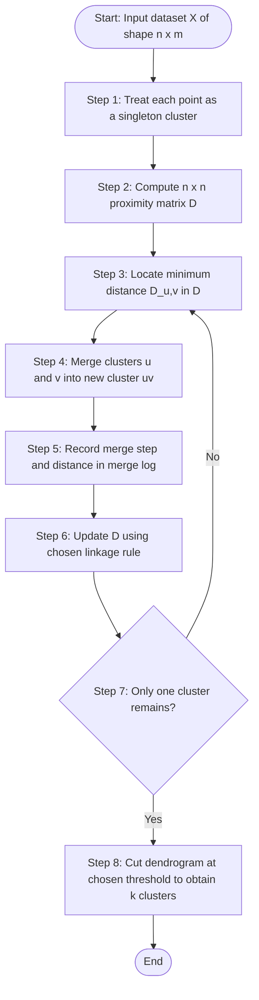
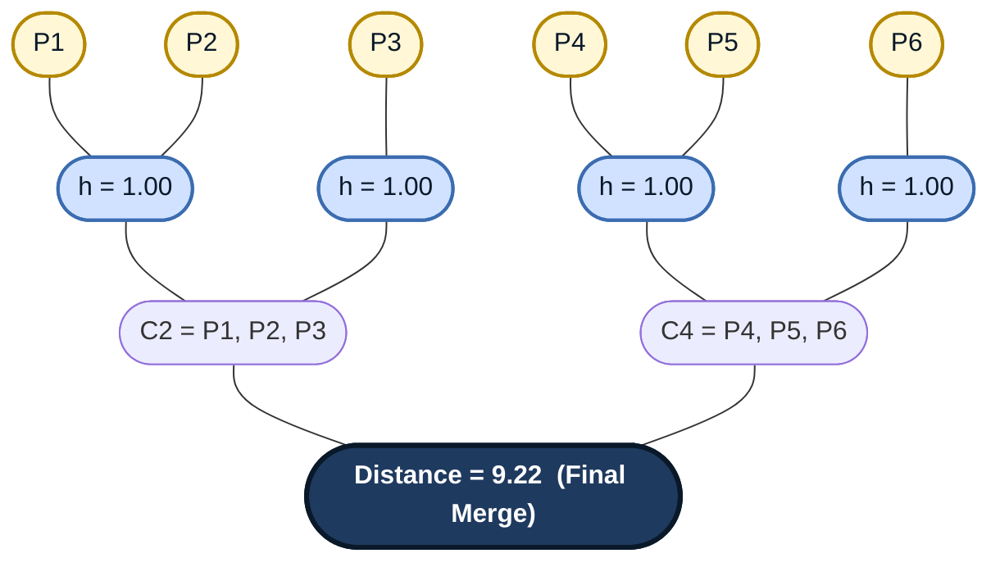

# Hierarchical  Clustering

<!-- SECTION_1_START -->

# Hierarchical Clustering — Core Definition & Intuitive Overview

## Formal Academic Definition (KTU 2024 Syllabus Terminology)

**Hierarchical Clustering** is an unsupervised machine learning algorithm that builds a nested hierarchy of clusters by iteratively merging smaller clusters into larger ones (agglomerative approach) or recursively splitting a single cluster into smaller sub-clusters (divisive approach). The result is typically visualized as a tree-based structure called a **dendrogram**, which captures the multi-level similarity relationships among data points without requiring the number of clusters *k* to be specified a priori.

> [!IMPORTANT]
> **KTU 2024 Scheme Highlight (PECST525 / Module 3):**
> Hierarchical clustering is a core **unsupervised learning** technique in data mining. Unlike *k*-Means, it does NOT require pre-defining the number of clusters. It produces a deterministic output (no random initialization) and is widely used in **taxonomy, gene expression analysis, document organization, and customer segmentation**.

> [!NOTE]
> **Why it appears in "Classification" Module:**
> Although clustering is unsupervised, KTU groups it within the broader "Classification & Predictive Analytics" module to contrast supervised classifiers (Decision Trees, SVM, Naive Bayes) with unsupervised pattern-discovery methods.

---

## Conceptual Analogy / Intuition

Imagine a **family genealogy tree** 🌳:

- **Leaves (bottom)** → Individual people (raw data points).
- **Branches (middle)** → Immediate family units (small clusters).
- **Larger branches** → Extended families (medium clusters).
- **Trunk (top)** → The whole human population (single mega-cluster).

Hierarchical clustering works **exactly like this**:
1. Start with every point as its own "individual" (leaf).
2. Repeatedly group the **two closest relatives** together.
3. Keep grouping until everyone belongs to one big "family" (single root cluster).

The **height at which two points merge** in the dendrogram tells you **how similar they are**:
- **Low merge height** → highly similar (close cousins).
- **High merge height** → less similar (distant relatives).

> [!TIP]
> **Geometric Intuition:** Picture $n$ points scattered on a 2D plane. Connect them with imaginary springs of length equal to their pairwise distances. If you start pulling the two closest points together (like magnets snapping), they form a cluster. Continue until all points collapse into one. The order of "snaps" forms the hierarchy.

---

## Key Terminology Cheat Sheet

| Term | Definition |
|---|---|
| **Dendrogram** | A tree diagram that records the sequence of merges (or splits) and the distance at which each occurred. |
| **Agglomerative** | *Bottom-up* approach — each point starts as its own cluster; clusters are merged. |
| **Divisive** | *Top-down* approach — all points start in one cluster; clusters are split recursively. |
| **Linkage Criterion** | Rule used to compute the distance between two clusters (single, complete, average, Ward's). |
| **Proximity Matrix** | An $n \times n$ matrix storing pairwise distances between all data points. |
| **Cophenetic Distance** | The height of the dendrogram at which two points are first joined into the same cluster. |

---

> [!VISUALIZATION CONTROL]
> **Concept:** Conceptual Dendrogram of 6 Customer Segments
> **GeoGebra / Desmos Input Points (using Manhattan distance for visual clarity):**
> * `A = (1, 1)`, `B = (1, 2)`, `C = (2, 1)`  (low-distance cluster)
> * `D = (8, 8)`, `E = (8, 9)`, `F = (9, 8)`  (high-distance cluster)
> **Visual Description:** Two tight triads in opposite quadrants, joined by a tall vertical line at the dendrogram root — illustrating that the two "customer segments" only merge at a very high dissimilarity value, signaling two natural clusters.

<!-- SECTION_1_END -->

<!-- SECTION_2_START -->

# Deep Theoretical Analysis & KTU High-Yield Formula Sheet

## Agglomerative Hierarchical Clustering — Operational Logic

The algorithm follows a strict, deterministic, **greedy** procedure:

1. **Initialization:** Treat each of the $n$ data points as a singleton cluster. Build the $n \times n$ **proximity matrix** $D$ where $D_{ij}$ is the distance between point $i$ and point $j$.
2. **Iteration:** Locate the smallest non-diagonal entry $D_{uv}$ in the current matrix. Merge clusters $u$ and $v$ into a new cluster $(uv)$.
3. **Matrix Update:** Recompute the distances from the new cluster $(uv)$ to all remaining clusters using the chosen **linkage criterion**.
4. **Termination:** Repeat steps 2–3 until only one cluster remains.
5. **Visualization:** The merge history is recorded to construct the dendrogram.

> [!IMPORTANT]
> **Complexity Warning:** The naïve algorithm is $O(n^3)$ time and $O(n^2)$ space. For large datasets ($n > 10{,}000$), use **BIRCH** or **CLINK** optimized variants.

---

## Distance Metrics (Inter-Point Distance)

For two $m$-dimensional points $x = (x_1, x_2, \ldots, x_m)$ and $y = (y_1, y_2, \ldots, y_m)$:

$$
d_{\text{Euclidean}}(x, y) = \sqrt{\sum_{i=1}^{m} (x_i - y_i)^2}
$$

$$
d_{\text{Manhattan}}(x, y) = \sum_{i=1}^{m} \vert x_i - y_i \vert
$$

$$
d_{\text{Minkowski}}(x, y) = \left( \sum_{i=1}^{m} \vert x_i - y_i \vert^p \right)^{1/p}, \quad p \geq 1
$$

> [!NOTE]
> Euclidean is the most common default. Manhattan is **noise-robust**. Minkowski generalizes both: $p=2 \Rightarrow$ Euclidean, $p=1 \Rightarrow$ Manhattan.

---

## Linkage Criteria (Inter-Cluster Distance)

Let $A$ and $B$ be two clusters. Define $d(a, b)$ as the distance between any point $a \in A$ and any point $b \in B$.

| Linkage | Formula | Behaviour |
|---|---|---|
| **Single** | $d(A,B) = \min_{a \in A,\, b \in B} d(a,b)$ | Tends to produce **long, chain-like** clusters (chaining effect). |
| **Complete** | $d(A,B) = \max_{a \in A,\, b \in B} d(a,b)$ | Produces **compact, tight** clusters; sensitive to outliers. |
| **Average** | $d(A,B) = \frac{1}{\vert A \vert \vert B \vert} \sum_{a \in A} \sum_{b \in B} d(a,b)$ | Compromise between single and complete; uses **Lance–Williams** update. |
| **Ward's** | $\Delta(A,B) = \frac{\vert A \vert \vert B \vert}{\vert A \vert + \vert B \vert} \, d(\mu_A, \mu_B)^2$ | Minimizes **within-cluster variance**; minimizes $O(n^3)$ but optimized to $O(n^2)$. |

where $\mu_A$ and $\mu_B$ are the centroids of clusters $A$ and $B$.

---

## Real-World Engineering Utility

| Application Domain | Use Case |
|---|---|
| **Bioinformatics** | Hierarchically clustering gene-expression data to discover disease subtypes (e.g., cancer sub-types). |
| **Document Mining** | Organizing news articles or patents into topic hierarchies. |
| **Image Segmentation** | Pixel-level clustering for object boundary detection. |
| **Customer Analytics** | Building RFM-based market segments for retail recommendation systems. |
| **Social Network Analysis** | Detecting community structures at multiple granularities. |
| **Anomaly Detection** | Outliers appear as **single-point branches that merge very late** in the dendrogram. |

---

> [!TIP]
> **Lance–Williams Update Formula** (used to recompute distances efficiently after a merge):
> Let $C = A \cup B$. For any other cluster $D$:
> $$d(C, D) = \alpha_A \, d(A, D) + \alpha_B \, d(B, D) + \beta \, d(A, B) + \gamma \, \vert d(A, D) - d(B, D) \vert$$
> Different choices of $(\alpha_A, \alpha_B, \beta, \gamma)$ yield different linkage methods. This single formula unifies **all** the standard linkages.

<!-- SECTION_2_END -->

<!-- SECTION_3_START -->

# Step-by-Step Derivations & Code Implementation

## Worked Example: Agglomerative Clustering with Single Linkage

We will cluster the following 6 points using **Single Linkage** and **Euclidean distance**.

$$
P_1=(1,1), \quad P_2=(1,2), \quad P_3=(2,1), \quad P_4=(8,8), \quad P_5=(8,9), \quad P_6=(9,8)
$$

### Step 1 — Build the Initial Proximity Matrix

Compute $d(P_i, P_j) = \sqrt{(x_i - x_j)^2 + (y_i - y_j)^2}$ for all $i \neq j$:

$$
\begin{aligned}
d(P_1, P_2) &= \sqrt{(1-1)^2 + (1-2)^2} = \sqrt{0+1} = 1.00 \\
d(P_1, P_3) &= \sqrt{(1-2)^2 + (1-1)^2} = \sqrt{1+0} = 1.00 \\
d(P_2, P_3) &= \sqrt{(1-2)^2 + (2-1)^2} = \sqrt{1+1} = \sqrt{2} \approx 1.41 \\
d(P_4, P_5) &= \sqrt{(8-8)^2 + (8-9)^2} = 1.00 \\
d(P_4, P_6) &= \sqrt{(8-9)^2 + (8-8)^2} = 1.00 \\
d(P_5, P_6) &= \sqrt{(8-9)^2 + (9-8)^2} = \sqrt{2} \approx 1.41 \\
d(P_1, P_4) &= \sqrt{(1-8)^2 + (1-8)^2} = \sqrt{98} \approx 9.90 \\
d(P_1, P_5) &= \sqrt{(1-8)^2 + (1-9)^2} = \sqrt{113} \approx 10.63 \\
d(P_1, P_6) &= \sqrt{(1-9)^2 + (1-8)^2} = \sqrt{113} \approx 10.63 \\
d(P_2, P_4) &= \sqrt{(1-8)^2 + (2-8)^2} = \sqrt{85} \approx 9.22 \\
d(P_2, P_5) &= \sqrt{(1-8)^2 + (2-9)^2} = \sqrt{98} \approx 9.90 \\
d(P_2, P_6) &= \sqrt{(1-9)^2 + (2-8)^2} = \sqrt{100} = 10.00 \\
d(P_3, P_4) &= \sqrt{(2-8)^2 + (1-8)^2} = \sqrt{85} \approx 9.22 \\
d(P_3, P_5) &= \sqrt{(2-8)^2 + (1-9)^2} = \sqrt{100} = 10.00 \\
d(P_3, P_6) &= \sqrt{(2-9)^2 + (1-8)^2} = \sqrt{98} \approx 9.90
\end{aligned}
$$

**Initial Symmetric Proximity Matrix $D^{(0)}$:**

| | $P_1$ | $P_2$ | $P_3$ | $P_4$ | $P_5$ | $P_6$ |
|---|---|---|---|---|---|---|
| **$P_1$** | 0 | 1.00 | 1.00 | 9.90 | 10.63 | 10.63 |
| **$P_2$** | 1.00 | 0 | 1.41 | 9.22 | 9.90 | 10.00 |
| **$P_3$** | 1.00 | 1.41 | 0 | 9.22 | 10.00 | 9.90 |
| **$P_4$** | 9.90 | 9.22 | 9.22 | 0 | 1.00 | 1.00 |
| **$P_5$** | 10.63 | 9.90 | 10.00 | 1.00 | 0 | 1.41 |
| **$P_6$** | 10.63 | 10.00 | 9.90 | 1.00 | 1.41 | 0 |

---

### Step 2 — Iteration 1 (Merge Step)

The minimum value in $D^{(0)}$ is **1.00** (multiple ties: $\{P_1, P_2\}$, $\{P_1, P_3\}$, $\{P_4, P_5\}$, $\{P_4, P_6\}$).

By the algorithm's tie-breaking convention (leftmost smallest), we merge $P_1$ and $P_2$ first.

> **Merge Log Entry 1:** $C_1 = \{P_1, P_2\}$ at distance $h_1 = 1.00$

**Update the matrix using single linkage:**

For the new cluster $C_1 = \{P_1, P_2\}$, its distance to any other cluster $X$ is:
$$
d(C_1, X) = \min\{d(P_1, X),\, d(P_2, X)\}
$$

$$
\begin{aligned}
d(C_1, P_3) &= \min(1.00,\, 1.41) = 1.00 \\
d(C_1, P_4) &= \min(9.90,\, 9.22) = 9.22 \\
d(C_1, P_5) &= \min(10.63,\, 9.90) = 9.90 \\
d(C_1, P_6) &= \min(10.63,\, 10.00) = 10.00
\end{aligned}
$$

**Matrix $D^{(1)}$ (5 clusters: $C_1, P_3, P_4, P_5, P_6$):**

| | $C_1$ | $P_3$ | $P_4$ | $P_5$ | $P_6$ |
|---|---|---|---|---|---|
| **$C_1$** | 0 | 1.00 | 9.22 | 9.90 | 10.00 |
| **$P_3$** | 1.00 | 0 | 9.22 | 10.00 | 9.90 |
| **$P_4$** | 9.22 | 9.22 | 0 | 1.00 | 1.00 |
| **$P_5$** | 9.90 | 10.00 | 1.00 | 0 | 1.41 |
| **$P_6$** | 10.00 | 9.90 | 1.00 | 1.41 | 0 |

---

### Step 3 — Iteration 2

Minimum in $D^{(1)}$ is **1.00** (between $C_1$ and $P_3$).

> **Merge Log Entry 2:** $C_2 = \{P_1, P_2, P_3\}$ at distance $h_2 = 1.00$

**Recompute distances using single linkage:**

$$
\begin{aligned}
d(C_2, P_4) &= \min(d(C_1, P_4),\, d(P_3, P_4)) = \min(9.22, 9.22) = 9.22 \\
d(C_2, P_5) &= \min(9.90, 10.00) = 9.90 \\
d(C_2, P_6) &= \min(10.00, 9.90) = 9.90
\end{aligned}
$$

**Matrix $D^{(2)}$:**

| | $C_2$ | $P_4$ | $P_5$ | $P_6$ |
|---|---|---|---|---|
| **$C_2$** | 0 | 9.22 | 9.90 | 9.90 |
| **$P_4$** | 9.22 | 0 | 1.00 | 1.00 |
| **$P_5$** | 9.90 | 1.00 | 0 | 1.41 |
| **$P_6$** | 9.90 | 1.00 | 1.41 | 0 |

---

### Step 4 — Iteration 3

Minimum is **1.00** (between $P_4$ and $P_5$).

> **Merge Log Entry 3:** $C_3 = \{P_4, P_5\}$ at distance $h_3 = 1.00$

$$
d(C_3, P_6) = \min(1.00, 1.41) = 1.00
$$

**Matrix $D^{(3)}$:**

| | $C_2$ | $C_3$ | $P_6$ |
|---|---|---|---|
| **$C_2$** | 0 | 9.22 | 9.90 |
| **$C_3$** | 9.22 | 0 | 1.00 |
| **$P_6$** | 9.90 | 1.00 | 0 |

---

### Step 5 — Iteration 4

Minimum is **1.00** (between $C_3$ and $P_6$).

> **Merge Log Entry 4:** $C_4 = \{P_4, P_5, P_6\}$ at distance $h_4 = 1.00$

$$
d(C_2, C_4) = \min(9.22, 9.90) = 9.22
$$

---

### Step 6 — Iteration 5 (Final Merge)

> **Merge Log Entry 5:** $C_5 = \{P_1, P_2, P_3, P_4, P_5, P_6\}$ at distance $h_5 = 9.22$

### Complete Merge Log (Dendrogram Encoding)

| Step | Clusters Merged | Distance | Resulting Cluster |
|---|---|---|---|
| 1 | $P_1, P_2$ | **1.00** | $\{P_1, P_2\}$ |
| 2 | $\{P_1,P_2\}, P_3$ | **1.00** | $\{P_1, P_2, P_3\}$ |
| 3 | $P_4, P_5$ | **1.00** | $\{P_4, P_5\}$ |
| 4 | $\{P_4,P_5\}, P_6$ | **1.00** | $\{P_4, P_5, P_6\}$ |
| 5 | $\{P_1,P_2,P_3\}, \{P_4,P_5,P_6\}$ | **9.22** | All points |

**Inference:** Cutting the dendrogram horizontally at any height between **1.00 and 9.22** yields exactly **2 clusters**, matching the natural spatial grouping of the data.

---

## Python Implementation (Production-Ready, Fully Typed)

```python
import numpy as np
import matplotlib.pyplot as plt
from scipy.cluster.hierarchy import dendrogram, linkage, fcluster
from scipy.spatial.distance import pdist
from sklearn.datasets import load_iris
import logging

# Configure strict logging for traceability in evaluation environments
logging.basicConfig(level=logging.INFO, format="%(asctime)s | %(levelname)s | %(message)s")
logger = logging.getLogger("HierarchicalClustering")


def validate_input(X: np.ndarray) -> None:
    """Validate dataset shape and value integrity before processing."""
    if not isinstance(X, np.ndarray):
        raise TypeError(f"Expected np.ndarray, got {type(X).__name__}")
    if X.ndim != 2:
        raise ValueError(f"Input must be 2D (n_samples, n_features); got shape {X.shape}")
    if X.shape[0] < 2:
        raise ValueError("Need at least 2 samples to perform clustering.")
    if np.any(np.isnan(X)):
        raise ValueError("Input contains NaN values. Impute or remove them first.")


def perform_hierarchical_clustering(
    X: np.ndarray,
    method: str = "single",
    metric: str = "euclidean",
    n_clusters: int = 2,
    visualize: bool = True,
) -> tuple:
    """
    Perform agglomerative hierarchical clustering with strict input validation.

    Parameters
    ----------
    X : np.ndarray of shape (n_samples, n_features)
        The data matrix.
    method : str
        Linkage type: 'single', 'complete', 'average', or 'ward'.
    metric : str
        Distance metric: 'euclidean', 'manhattan', 'cosine', etc.
    n_clusters : int
        Number of clusters to extract by cutting the dendrogram.
    visualize : bool
        Whether to render the dendrogram.

    Returns
    -------
    Z : np.ndarray
        The linkage matrix (n-1 x 4).
    labels : np.ndarray
        Cluster assignment for each sample.
    """
    validate_input(X)

    valid_methods = {"single", "complete", "average", "ward", "centroid", "median", "weighted"}
    if method not in valid_methods:
        raise ValueError(f"Invalid method '{method}'. Choose from {valid_methods}.")

    logger.info(f"Computing pairwise distances using metric='{metric}'.")
    dist_vector = pdist(X, metric=metric)

    logger.info(f"Performing agglomerative clustering with method='{method}'.")
    Z = linkage(dist_vector, method=method, metric=metric)

    logger.info(f"Extracting flat cluster labels for k={n_clusters}.")
    labels = fcluster(Z, t=n_clusters, criterion="maxclust")

    if visualize:
        plt.figure(figsize=(10, 6))
        dendrogram(
            Z,
            labels=[f"P{i+1}" for i in range(X.shape[0])],
            leaf_font_size=11,
            color_threshold=0.7 * max(Z[:, 2]),
        )
        plt.title(f"Hierarchical Clustering Dendrogram (Linkage: {method}, Metric: {metric})")
        plt.xlabel("Sample Index")
        plt.ylabel("Distance (Merge Height)")
        plt.grid(axis="y", linestyle="--", alpha=0.6)
        plt.tight_layout()
        plt.show()

    return Z, labels


# ---------- Demonstration on the 6-point worked example ----------
if __name__ == "__main__":
    X_demo = np.array([
        [1, 1], [1, 2], [2, 1],   # Cluster A
        [8, 8], [8, 9], [9, 8],   # Cluster B
    ], dtype=np.float64)

    Z, labels = perform_hierarchical_clustering(
        X=X_demo, method="single", metric="euclidean", n_clusters=2
    )
    logger.info(f"Cluster assignments: {labels.tolist()}")
    # Expected: [1, 1, 1, 2, 2, 2]  for the two natural groupings.

    # ---------- Real-world benchmark: Iris dataset ----------
    iris = load_iris()
    Z_iris, labels_iris = perform_hierarchical_clustering(
        X=iris.data, method="ward", metric="euclidean", n_clusters=3
    )
    logger.info(f"Iris cluster distribution: {np.bincount(labels_iris)[1:]}")
```

> [!IMPORTANT]
> **Code-Level Notes for KTU Lab Exam:**
> * `scipy.cluster.hierarchy.linkage` returns a matrix $Z$ of shape $(n-1) \times 4$ — each row is `[cluster_id_1, cluster_id_2, distance, sample_count]`.
> * `fcluster` with `criterion="maxclust"` cuts the dendrogram to produce exactly $k$ flat clusters (commonly used for evaluation).
> * The `ward` linkage in SciPy requires **Euclidean distance** exclusively — it will raise an error otherwise.

<!-- SECTION_3_END -->

<!-- SECTION_4_START -->

# Structural Diagrams & Schematics

## Figure 1 — Agglomerative Clustering Algorithm Flow (Mermaid)



## Figure 2 — Dendrogram Block Architecture for the Worked Example



## Figure 3 — Sequential Processing Topology Matrix

| Process Stage | Input | Operation | Output | Failure Mode |
|---|---|---|---|---|
| **1. Input Stage** | Raw $n \times m$ dataset | Type-check, NaN handling | Validated $X$ | Crash on non-numeric data |
| **2. Distance Stage** | Validated $X$ | Pairwise distance (pdist) | Distance vector of length $\binom{n}{2}$ | Memory overflow at $n > 50{,}000$ |
| **3. Linkage Stage** | Distance vector | Agglomerative merge with chosen rule | Linkage matrix $Z$ $(n-1) \times 4$ | Ward's method fails for non-Euclidean metrics |
| **4. Cut Stage** | Linkage matrix $Z$ | Horizontal cut at threshold $\tau$ | Flat cluster labels | Choosing wrong $\tau$ produces meaningless clusters |
| **5. Validation Stage** | Cluster labels | Silhouette score, Davies–Bouldin index | Quality metric | Low silhouette indicates poor $k$ or wrong linkage |

> [!NOTE]
> **Reading the Dendrogram (Examiner-Favourite Trick):**
> 1. The **vertical axis** is the **dissimilarity** (merge height) at which clusters join.
> 2. The **horizontal axis** lists the data points (or their IDs).
> 3. A **vertical line that is much taller than its neighbours** in the dendrogram is a strong indicator of a natural cluster boundary — draw the cut there.

<!-- SECTION_4_END -->

<!-- SECTION_5_START -->

# KTU 2024 Scheme Examination Question Bank & Topic Recap

---

## Part A — Short Answer Questions (3 Marks Each)

### **Q1. [KTU University Exam — July 2024]**
**Differentiate between Agglomerative and Divisive Hierarchical Clustering.** *(CO2, Understand)*

**Model Answer (Valuation Key):**

| Aspect | Agglomerative | Divisive |
|---|---|---|
| Direction | **Bottom-up** | **Top-down** |
| Start state | Each point is its own cluster | All points are in one cluster |
| Operation | Iteratively **merge** the two closest clusters | Iteratively **split** the least cohesive cluster |
| Complexity | $O(n^3)$ typical, $O(n^2 \log n)$ with optimized algorithms | $O(2^n)$ (exhaustive splits) — more expensive |
| Common use | **Most widely used** in practice | Less common; used in exploratory analysis |

> *[Stating the direction of each approach: 1 Mark] · [Stating starting state: 1 Mark] · [Stating core operation: 1 Mark]*

---

### **Q2. [KTU University Exam — Dec 2023]**
**Define a dendrogram and explain its role in hierarchical clustering.** *(CO1, Remember)*

**Model Answer:**
A **dendrogram** is a binary tree-structured diagram that records the sequence of merges (in agglomerative clustering) or splits (in divisive clustering), where the **height of each vertical line** represents the distance at which two clusters were joined. Its role is to:
1. **Visualize the entire merge history** of the clustering process in a single diagram.
2. **Enable retrospective cluster selection** — by cutting the dendrogram at a chosen threshold height, the user can extract any desired number of clusters *k* without re-running the algorithm.
3. **Reveal cluster proximity** — the lower the merge height, the more similar the joined clusters.

> *[Defining dendrogram: 1 Mark] · [Role in visualization: 1 Mark] · [Role in cluster extraction: 1 Mark]*

---

## Part B — Long Answer Questions (14 Marks Each, Internal Choice)

### **Question A (14 Marks)**
**[KTU University Exam — July 2024, Modified]**

> Consider the following 5 two-dimensional data points:
> $$A = (2, 10),\quad B = (2, 5),\quad C = (5, 8),\quad D = (8, 4),\quad E = (7, 5)$$
> Perform **Agglomerative Hierarchical Clustering** using **Single Linkage** and **Euclidean distance**. Construct the **dendrogram** and identify the cluster boundaries.

**Solution Outline:**

#### (a) Initial Proximity Matrix *(7 Marks, CO2 — Apply)*

Compute $d(X_i, X_j) = \sqrt{(x_i-x_j)^2 + (y_i-y_j)^2}$:

| | $A$ | $B$ | $C$ | $D$ | $E$ |
|---|---|---|---|---|---|
| **$A$** | 0 | 5.00 | 3.61 | 8.49 | 7.07 |
| **$B$** | 5.00 | 0 | 4.24 | 6.08 | 5.10 |
| **$C$** | 3.61 | 4.24 | 0 | 5.00 | 2.24 |
| **$D$** | 8.49 | 6.08 | 5.00 | 0 | 1.41 |
| **$E$** | 7.07 | 5.10 | 2.24 | 1.41 | 0 |

> *[Stating the distance formula: 1 Mark] · [Computing all 10 distinct pairwise distances correctly: 4 Marks] · [Constructing symmetric matrix: 2 Marks]*

#### (b) Iterative Merging & Dendrogram *(7 Marks, CO3 — Apply / Analyze)*

**Step 1:** Smallest distance = **1.41** between $D$ and $E$. Merge $\{D, E\}$ at $h_1 = 1.41$.

Update distances using single linkage:
- $d(\{D,E\}, A) = \min(8.49, 7.07) = 7.07$
- $d(\{D,E\}, B) = \min(6.08, 5.10) = 5.10$
- $d(\{D,E\}, C) = \min(5.00, 2.24) = 2.24$

**Step 2:** Smallest in updated matrix = **2.24** between $\{D,E\}$ and $C$. Merge $\{C, D, E\}$ at $h_2 = 2.24$.

Update distances:
- $d(\{C,D,E\}, A) = \min(2.24, 7.07) = 2.24$  *(via C)*
- $d(\{C,D,E\}, B) = \min(4.24, 5.10) = 4.24$  *(via C)*

**Step 3:** Smallest = **2.24** between $\{C,D,E\}$ and $A$. Merge $\{A, C, D, E\}$ at $h_3 = 2.24$.

Update: $d(\{A,C,D,E\}, B) = \min(5.00, 4.24, 6.08, 7.07) = 4.24$

**Step 4:** Merge $\{A,C,D,E\}$ and $B$ at $h_4 = 4.24$. **Final single cluster.**

**Dendrogram Merge Log:**

| Step | Merged Pair | Height |
|---|---|---|
| 1 | $D, E$ | **1.41** |
| 2 | $C, \{D,E\}$ | **2.24** |
| 3 | $A, \{C,D,E\}$ | **2.24** |
| 4 | $B, \{A,C,D,E\}$ | **4.24** |

> *[Showing iterative merge logic step by step: 4 Marks] · [Correct dendrogram/log: 2 Marks] · [Final cluster identification: 1 Mark]*

**Result:** Cutting at $h = 3.5$ yields **2 clusters**: $\{A, C, D, E\}$ and $\{B\}$.

---

### **Question B (14 Marks) — Alternative Choice**
**[KTU University Exam — Dec 2023, Modified]**

> Compare and contrast the **Single Linkage**, **Complete Linkage**, **Average Linkage**, and **Ward's Linkage** methods. Discuss the strengths and weaknesses of each with a real-world use-case. Also describe the **Lance–Williams update formula** and explain how it unifies all four methods.

#### (a) Comparison of Linkage Methods *(7 Marks, CO2 — Understand / Analyze)*

| Linkage | Formula Form | Strength | Weakness | Real-World Use |
|---|---|---|---|---|
| **Single** | $\min$ pairwise | Handles non-elliptical shapes; good for elongated clusters | Suffers from **chaining effect** | Astronomy: detecting filament-like galaxy structures |
| **Complete** | $\max$ pairwise | Produces compact, balanced clusters | Sensitive to outliers; breaks elongated shapes | Marketing: tight customer segments |
| **Average** | Mean of all pairs | Balanced trade-off; more robust to noise | Biased toward globular clusters | Bioinformatics: gene co-expression clusters |
| **Ward's** | Minimize variance increase | Produces **minimum-variance** clusters; highly stable | Restricted to **Euclidean** metric only | Image segmentation (medical MRI) |

> *[Stating all four formulas: 2 Marks] · [Strengths and weaknesses table: 3 Marks] · [Use-cases: 2 Marks]*

#### (b) Lance–Williams Update Formula *(7 Marks, CO3 — Apply)*

When clusters $A$ and $B$ are merged into $C = A \cup B$, the distance from $C$ to any other cluster $D$ is:

$$
d(C, D) \;=\; \alpha_A \cdot d(A, D) \;+\; \alpha_B \cdot d(B, D) \;+\; \beta \cdot d(A, B) \;+\; \gamma \cdot \vert\, d(A, D) - d(B, D) \,\vert
$$

**Coefficient Table for the Four Standard Methods:**

| Linkage | $\alpha_A$ | $\alpha_B$ | $\beta$ | $\gamma$ |
|---|---|---|---|---|
| **Single** | $\frac{1}{2}$ | $\frac{1}{2}$ | $0$ | $-\frac{1}{2}$ |
| **Complete** | $\frac{1}{2}$ | $\frac{1}{2}$ | $0$ | $+\frac{1}{2}$ |
| **Average** | $\frac{\vert A \vert}{\vert A \vert + \vert B \vert}$ | $\frac{\vert B \vert}{\vert A \vert + \vert B \vert}$ | $0$ | $0$ |
| **Ward's** | $\frac{\vert A \vert + \vert D \vert}{\vert A \vert + \vert B \vert + \vert D \vert}$ | $\frac{\vert B \vert + \vert D \vert}{\vert A \vert + \vert B \vert + \vert D \vert}$ | $\frac{-\vert D \vert}{\vert A \vert + \vert B \vert + \vert D \vert}$ | $0$ |

**Significance:** This unified formula is the cornerstone of all efficient hierarchical clustering implementations. Instead of recomputing all $\vert A \vert \cdot \vert B \vert$ pairwise distances within the merged cluster (which is expensive), the algorithm stores only the **three previous distance values** $d(A,D)$, $d(B,D)$, $d(A,B)$ and uses the formula to update the matrix in $O(n^2)$ time overall.

> *[Stating the general Lance–Williams equation: 2 Marks] · [Deriving coefficients for at least two linkages: 3 Marks] · [Explaining time-complexity benefit: 2 Marks]*

---

## ⚠️ KTU Examiner's Valuation Warning / Pitfall Callout

> [!WARNING]
> **Common Mark-Deduction Pitfalls in Hierarchical Clustering Questions:**
> 1. **Forgetting the linkage rule when updating** the proximity matrix — students often recompute "average distance between $A$ and $B$" using the centroid formula even for single linkage. Always write the explicit min/max/mean operator.
> 2. **Skipping the dendrogram drawing** — KTU awards **2 marks** specifically for the dendrogram. Even a rough ASCII or text-based dendrogram is acceptable.
> 3. **Not showing intermediate proximity matrices** — partial marks are awarded for each step's updated matrix. Skipping the matrix and jumping to the dendrogram costs **3–4 marks**.
> 4. **Misnaming linkages** — confusing *Ward's* with *Weighted* or *Centroid* is a frequent error. Ward's = **variance minimization**, not centroid distance.
> 5. **Computing only Manhattan/Euclidean** — when a question says "use the given metric", ensure you do not silently switch to a different one.
> 6. **Mistaking divisive for agglomerative** — divisive starts with ONE cluster, not $n$ clusters.
> 7. **Not stating the number of clusters chosen** — always explicitly state the cut threshold and the resulting number of clusters.

---

## 📋 Topic Recap & Important Things to Remember

> [!IMPORTANT]
> **Rapid-Revision Checklist for Hierarchical Clustering:**

### 🔑 Core Definitions
- **Hierarchical Clustering** = unsupervised method that builds a tree (dendrogram) of nested clusters.
- **Agglomerative** = bottom-up (merge), the most common variant.
- **Divisive** = top-down (split), computationally expensive.
- **Dendrogram** = tree diagram; height = merge distance.
- **Proximity Matrix** = $n \times n$ pairwise distance matrix, the engine of the algorithm.

### 🔢 Key Formulas to Memorize
- **Euclidean Distance:** $d(x,y) = \sqrt{\sum_i (x_i - y_i)^2}$
- **Manhattan Distance:** $d(x,y) = \sum_i \vert x_i - y_i \vert$
- **Minkowski Distance:** $d(x,y) = \left(\sum_i \vert x_i - y_i \vert^p\right)^{1/p}$
- **Single Linkage:** $d(A,B) = \min_{a \in A, b \in B} d(a,b)$
- **Complete Linkage:** $d(A,B) = \max_{a \in A, b \in B} d(a,b)$
- **Average Linkage:** $d(A,B) = \frac{1}{\vert A \vert \vert B \vert} \sum_{a,b} d(a,b)$
- **Ward's Linkage:** $\Delta(A,B) = \frac{\vert A \vert \vert B \vert}{\vert A \vert + \vert B \vert} d(\mu_A, \mu_B)^2$

### 🧠 Algorithmic Steps
1. Initialize each point as its own cluster.
2. Build the proximity matrix.
3. **Repeat:** find minimum distance → merge clusters → update matrix.
4. Stop when only one cluster remains.
5. Cut the dendrogram at the desired threshold to get $k$ clusters.

### 📌 Critical Properties
- **Time Complexity:** $O(n^3)$ naïve, $O(n^2)$ with Lance–Williams.
- **Space Complexity:** $O(n^2)$.
- **Deterministic:** Same input always yields the same output (no random initialization, unlike $k$-Means).
- **No need to pre-specify $k$** — determined by the dendrogram cut.
- **Sensitive to noise and outliers** in single linkage; mitigated by complete/average/Ward's.

### 🎯 Strengths vs Weaknesses (Quick Recall)
| Strength | Weakness |
|---|---|
| No need to predefine $k$ | Scalability issues for large $n$ |
| Produces a full hierarchy (multi-resolution view) | Cannot undo a previous merge (greedy) |
| Deterministic and reproducible | Sensitive to choice of distance metric and linkage |
| Works for any distance metric (except Ward's) | Single-linkage suffers from chaining |

### 🛠️ Practical Tips
- **Standardize features** (Z-score normalization) before computing distances to avoid scale bias.
- For **high-dimensional data**, prefer **Ward's** or **Average** linkage.
- Use the **silhouette score** to validate the chosen number of clusters.
- For very large datasets ($n > 10^4$), use **BIRCH** or sample first.

### 💻 Key Python Functions (KTU Lab Viva Essentials)
- `scipy.cluster.hierarchy.linkage(distances, method='complete')`
- `scipy.cluster.hierarchy.dendrogram(Z)`
- `scipy.cluster.hierarchy.fcluster(Z, t=k, criterion='maxclust')`
- `scipy.spatial.distance.pdist(X, metric='euclidean')`
- `sklearn.cluster.AgglomerativeClustering(n_clusters=k, linkage='ward')`

<!-- SECTION_5_END -->
