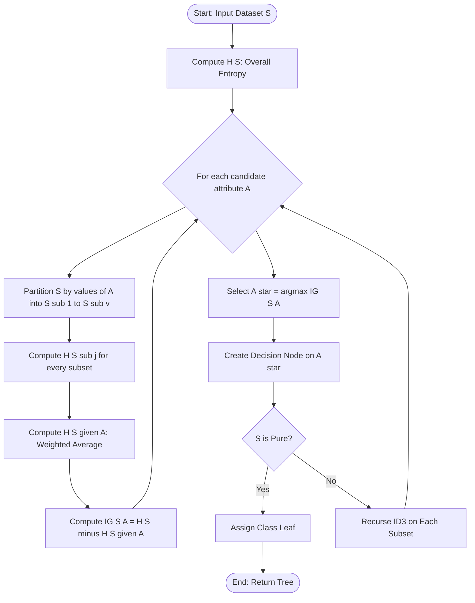
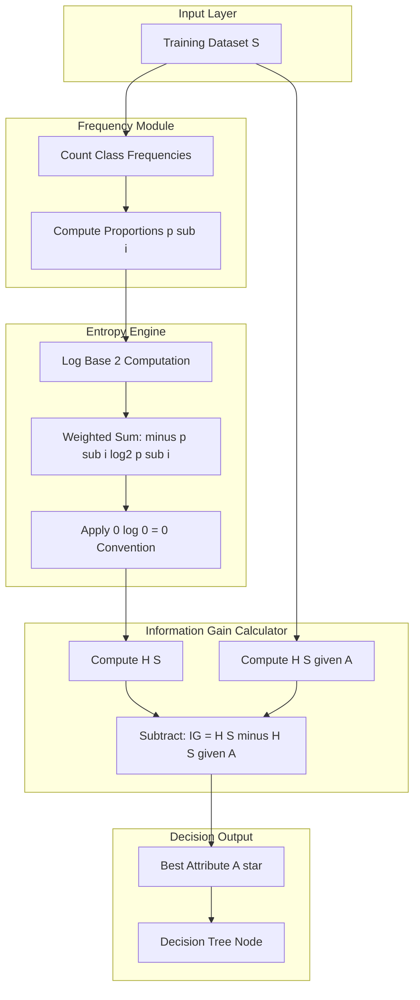
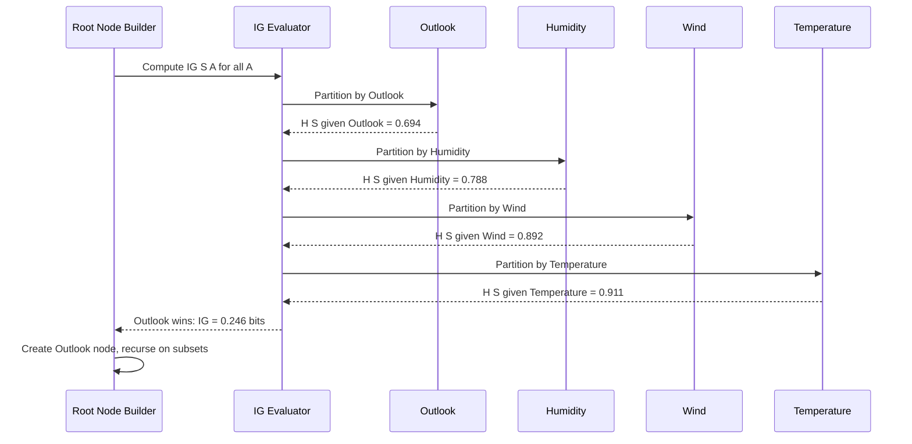
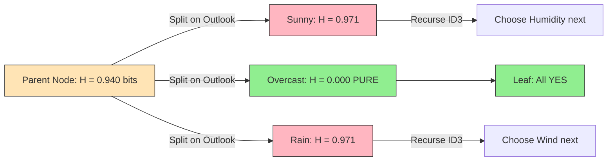

# Information Gain

<!-- SECTION_1_START -->
# 📘 Module 3: Classification — Information Gain

## 1. Core Technical Definition & Intuitive Overview

### 📌 Formal KTU 2024 Definition

> **Information Gain (IG)** is a statistical measure used in **Decision Tree classification** algorithms (notably **ID3** and **C4.5**, proposed by **J. Ross Quinlan**) that quantifies the *expected reduction in entropy* (or impurity) achieved by partitioning a training dataset $S$ according to the values of a particular attribute $A$. The attribute that yields the **highest Information Gain** is selected as the *splitting criterion* (decision node) at each step of tree construction.

Mathematically, for a dataset $S$ and candidate attribute $A$:

$$IG(S, A) = H(S) - H(S \vert A)$$

where $H(S)$ is the **entropy of the original set** and $H(S \vert A)$ is the **conditional entropy** of $S$ given attribute $A$.

> [!IMPORTANT]
> **KTU Syllabus Highlight (PECST525 — Module 3):** Information Gain is the *foundational splitting heuristic* for classification. It is a **direct question topic** in KTU End-Semester Examinations (ESE) and is mandatory for understanding the **ID3 algorithm**, the **C4.5 algorithm**, and the **Gain Ratio** extension. A solid grasp of Entropy is a prerequisite.

### 🧠 Conceptual Analogy — "The Mystery Box Intuition"

Imagine you are blindfolded and handed a closed box. It contains either a 🎃 (pumpkin) or a 🎃🎃 (two pumpkins). With no information, your uncertainty is at its peak — this is **maximum entropy**.

Now, suppose a friend whispers: *"It weighs more than 1 kg."* This single piece of information dramatically reduces your uncertainty. The **amount of uncertainty that vanished** is the **Information Gain**.

In Data Mining terms:
- 🎃 The **pumpkin** = a *class label* (Yes / No, Spam / Ham).
- 📦 The **box** = the dataset $S$ (mixed classes).
- 👂 The **whisper** = *splitting on attribute $A$* (e.g., Outlook = Sunny).
- 🔍 The **vanished uncertainty** = $IG(S, A)$.

> [!NOTE]
> **Physical Constants / Units:** Information is measured in **bits** (when $\log_2$ is used). One bit halves the probability space. Claude Shannon's landmark 1948 paper *"A Mathematical Theory of Communication"* is the bedrock of this metric.

> [!VISUALIZATION CONTROL]
> **Concept:** Entropy of a binary classification as a function of probability $p$ of the positive class.
> **GeoGebra / Desmos Input Equations:**
> * `H(p) = -p * log2(p) - (1-p) * log2(1-p)`
> **Visual Description:** A symmetric arch-shaped curve peaking at $H = 1$ bit when $p = 0.5$ (perfectly mixed 50/50 classes) and dropping to $H = 0$ at $p = 0$ and $p = 1$ (pure nodes). The area under the curve is **maximum disorder**; the points $p=0, 1$ are **pure leaves**.
<!-- SECTION_1_END -->

<!-- SECTION_2_START -->
# 2. Deep Theoretical Analysis & KTU High-Yield Formula Sheet

## 2.1 The Three Pillars of Information-Theoretic Splitting

### 🏛️ Pillar 1 — Entropy $H(S)$: The Measure of Impurity

Entropy quantifies the *average amount of information* (in bits) needed to identify the class label of a randomly drawn instance from set $S$. It is a **measure of disorder**.

For a dataset $S$ partitioned into $c$ classes with proportions $p_1, p_2, \dots, p_c$:

$$H(S) = - \sum_{i=1}^{c} p_i \, \log_2(p_i)$$

**Properties of Entropy:**
- $0 \le H(S) \le \log_2(c)$ for a $c$-class problem.
- $H(S) = 0$ when the set is **pure** (all instances belong to one class) — *no uncertainty*.
- $H(S)$ is **maximum** when classes are uniformly distributed — *maximum uncertainty*.
- $H(S)$ is computed for a **node** in a decision tree.

### 🏛️ Pillar 2 — Conditional Entropy $H(S \vert A)$: The Residual Uncertainty

This measures the *expected entropy* of $S$ **after** we partition it using attribute $A$. If attribute $A$ has $v$ distinct values $\{a_1, a_2, \dots, a_v\}$, creating subsets $S_1, S_2, \dots, S_v$:

$$H(S \vert A) = \sum_{j=1}^{v} \frac{\vert S_j \vert}{\vert S \vert} \, H(S_j)$$

The weight $\frac{\vert S_j \vert}{\vert S \vert}$ is the **proportion** of instances going into branch $j$ — a *weighted average* of the subset entropies.

### 🏛️ Pillar 3 — Information Gain $IG(S, A)$: The Reduction

By definition, Information Gain is the *difference* between the original entropy and the conditional entropy. A **higher gain** means a *better* attribute for splitting.

$$IG(S, A) = H(S) - H(S \vert A) = H(S) - \sum_{j=1}^{v} \frac{\vert S_j \vert}{\vert S \vert} \, H(S_j)$$

## 2.2 The ID3 Algorithm Greedy Strategy

The ID3 algorithm builds a decision tree using a **top-down, greedy, recursive partitioning** strategy:

1. Compute $H(S)$ for the current node.
2. For **every** unused attribute $A$, compute $IG(S, A)$.
3. Select the attribute with the **maximum** $IG$ as the splitting node.
4. Partition $S$ into subsets using $A$.
5. Recurse on each subset (using only the *remaining* attributes).
6. Stop when:
   - All instances belong to one class (pure node — $H = 0$).
   - No attributes remain.
   - The set is empty.

> [!TIP]
> **Why "Greedy"?** ID3 never backtracks. It commits to the locally best split hoping it leads to the global optimum. This is fast but can yield **sub-optimal** deep trees.

## 2.3 Real-World Engineering Utility

Information Gain drives classification systems in:

| Domain | Application | Why IG Matters |
|---|---|---|
| 🏥 **Medical Diagnosis** | Predicting disease from symptoms | Selects the most *discriminating* symptom first |
| 💳 **Credit Risk Scoring** | Loan default prediction | Identifies the *single most decisive* customer feature |
| 📧 **Spam Filtering** | Naïve Bayes / Decision Tree hybrid | Ranks email tokens by discriminative power |
| 🛒 **E-Commerce Recommendation** | Cart abandonment prediction | Pinpoints the *one feature* (price, time, page) that splits buyers vs. non-buyers |
| 🛰️ **Remote Sensing** | Land cover classification from satellite pixels | Maximizes per-pixel class separation |

## 2.4 KTU Formula Sheet / Cheat Sheet

| # | Quantity | Formula | Symbol Meaning | Range |
|:---:|---|---|---|---|
| 1 | **Entropy** | $H(S) = -\sum_{i=1}^{c} p_i \log_2 p_i$ | $p_i$ = proportion of class $i$ | $[0, \log_2 c]$ |
| 2 | **Conditional Entropy** | $H(S \vert A) = \sum_{j=1}^{v} \dfrac{\vert S_j \vert}{\vert S \vert} H(S_j)$ | $S_j$ = subset where $A = a_j$ | $[0, \log_2 c]$ |
| 3 | **Information Gain** | $IG(S, A) = H(S) - H(S \vert A)$ | Reduction in entropy | $[0, \log_2 c]$ |
| 4 | **Binary Entropy** | $H(p) = -p\log_2 p - (1-p)\log_2(1-p)$ | $p$ = probability of positive class | $[0, 1]$ bit |
| 5 | **Conventions** | $0 \log 0 = 0$ | By L'Hôpital's limit | — |
| 6 | **Gain Ratio (C4.5)** | $GR(S, A) = \dfrac{IG(S, A)}{IV(A)}$ | $IV$ = Intrinsic Value, penalizes multi-valued attrs | $[0, 1]$ |
| 7 | **Intrinsic Value** | $IV(A) = -\sum_{j=1}^{v} \dfrac{\vert S_j \vert}{\vert S \vert} \log_2 \dfrac{\vert S_j \vert}{\vert S \vert}$ | Split information | $\ge 0$ |
| 8 | **Gini Index (CART alt.)** | $Gini(S) = 1 - \sum p_i^2$ | CART alternative | $[0, 1 - 1/c]$ |

> [!WARNING]
> **KTU Pitfall:** In binary classification, $\log_2(0.5) = 1$ bit. Students often mistakenly write $\ln$ instead of $\log_2$. Information Gain is **always in bits** unless otherwise stated.
<!-- SECTION_2_END -->

<!-- SECTION_3_START -->
# 3. Step-by-Step Derivations & Symbolic Implementation

## 3.1 The Classic KTU Example: The "Play Tennis" Dataset

Consider the canonical 14-instance **Play Tennis** dataset (Quinlan, 1986). The goal is to predict whether to play tennis (`Yes` / `No`) based on four attributes: `Outlook`, `Temperature`, `Humidity`, `Wind`.

| Day | Outlook | Temp | Humidity | Wind | Play |
|:---:|:---:|:---:|:---:|:---:|:---:|
| 1 | Sunny | Hot | High | Weak | No |
| 2 | Sunny | Hot | High | Strong | No |
| 3 | Overcast | Hot | High | Weak | Yes |
| 4 | Rain | Mild | High | Weak | Yes |
| 5 | Rain | Cool | Normal | Weak | Yes |
| 6 | Rain | Cool | Normal | Strong | No |
| 7 | Overcast | Cool | Normal | Strong | Yes |
| 8 | Sunny | Mild | High | Weak | No |
| 9 | Sunny | Cool | Normal | Weak | Yes |
| 10 | Rain | Mild | Normal | Weak | Yes |
| 11 | Sunny | Mild | Normal | Strong | Yes |
| 12 | Overcast | Mild | High | Strong | Yes |
| 13 | Overcast | Hot | Normal | Weak | Yes |
| 14 | Rain | Mild | High | Strong | No |

**Class distribution:** $9$ Yes, $5$ No (Total = 14).

### 🧮 Step 1 — Compute Overall Entropy $H(S)$

$$\begin{aligned}
H(S) &= -\sum_{i} p_i \log_2 p_i \\
&= -p_{Yes} \log_2 p_{Yes} - p_{No} \log_2 p_{No} \\
&= -\frac{9}{14} \log_2 \frac{9}{14} - \frac{5}{14} \log_2 \frac{5}{14}
\end{aligned}$$

Plugging in numerical values (using $\log_2(9/14) \approx -0.6365$ and $\log_2(5/14) \approx -1.4854$):

$$\begin{aligned}
H(S) &\approx -(0.6429)(-0.6365) - (0.3571)(-1.4854) \\
&\approx 0.4092 + 0.5305 \\
&\approx \mathbf{0.940 \text{ bits}}
\end{aligned}$$

### 🧮 Step 2 — Compute $IG(S, Outlook)$

Outlook has 3 values: `Sunny` (5), `Overcast` (4), `Rain` (5).

**Subset `Sunny`** (5 instances: 2 Yes, 3 No):
$$H(S_{Sunny}) = -\frac{2}{5}\log_2\frac{2}{5} - \frac{3}{5}\log_2\frac{3}{5} \approx 0.971 \text{ bits}$$

**Subset `Overcast`** (4 instances: 4 Yes, 0 No) → **Pure Node**:
$$H(S_{Overcast}) = 0 \text{ bits}$$

**Subset `Rain`** (5 instances: 3 Yes, 2 No):
$$H(S_{Rain}) = -\frac{3}{5}\log_2\frac{3}{5} - \frac{2}{5}\log_2\frac{2}{5} \approx 0.971 \text{ bits}$$

**Conditional Entropy:**
$$\begin{aligned}
H(S \vert \text{Outlook}) &= \frac{5}{14}(0.971) + \frac{4}{14}(0) + \frac{5}{14}(0.971) \\
&\approx 0.347 + 0 + 0.347 \\
&\approx \mathbf{0.694 \text{ bits}}
\end{aligned}$$

**Information Gain:**
$$IG(S, Outlook) = 0.940 - 0.694 = \mathbf{0.246 \text{ bits}}$$

### 🧮 Step 3 — Compute $IG(S, Humidity)$

Humidity has 2 values: `High` (7), `Normal` (7).

**Subset `High`** (7: 3 Yes, 4 No):
$$H(High) = -\frac{3}{7}\log_2\frac{3}{7} - \frac{4}{7}\log_2\frac{4}{7} \approx 0.985 \text{ bits}$$

**Subset `Normal`** (7: 6 Yes, 1 No):
$$H(Normal) = -\frac{6}{7}\log_2\frac{6}{7} - \frac{1}{7}\log_2\frac{1}{7} \approx 0.592 \text{ bits}$$

**Conditional Entropy:**
$$H(S \vert Humidity) = \frac{7}{14}(0.985) + \frac{7}{14}(0.592) \approx 0.788 \text{ bits}$$

**Information Gain:**
$$IG(S, Humidity) = 0.940 - 0.788 = \mathbf{0.152 \text{ bits}}$$

### 🧮 Step 4 — Compute $IG(S, Wind)$

Wind has 2 values: `Weak` (8), `Strong` (6).

**Subset `Weak`** (8: 6 Yes, 2 No):
$$H(Weak) = -\frac{6}{8}\log_2\frac{6}{8} - \frac{2}{8}\log_2\frac{2}{8} \approx 0.811 \text{ bits}$$

**Subset `Strong`** (6: 3 Yes, 3 No):
$$H(Strong) = -\frac{3}{6}\log_2\frac{3}{6} - \frac{3}{6}\log_2\frac{3}{6} = 1.0 \text{ bit}$$

**Conditional Entropy:**
$$H(S \vert Wind) = \frac{8}{14}(0.811) + \frac{6}{14}(1.0) \approx 0.892 \text{ bits}$$

**Information Gain:**
$$IG(S, Wind) = 0.940 - 0.892 = \mathbf{0.048 \text{ bits}}$$

### 🧮 Step 5 — Compute $IG(S, Temperature)$

Temperature has 3 values: `Hot` (4), `Mild` (6), `Cool` (4). After similar calculation:

$$IG(S, Temperature) \approx \mathbf{0.029 \text{ bits}}$$

### 🏆 Step 6 — Root Node Selection

| Attribute | Information Gain (bits) |
|---|:---:|
| **Outlook** | **0.246** ✅ |
| Humidity | 0.152 |
| Wind | 0.048 |
| Temperature | 0.029 |

➡ **Outlook is selected as the root** of the ID3 decision tree. The `Overcast` branch is a **pure leaf** (all Yes). Recursion continues on `Sunny` and `Rain` subsets.

## 3.2 Python Symbolic Implementation

```python
import math
from collections import Counter
from typing import Dict, List, Tuple, Any


def entropy(data: List[Any], target_attr: str = "Play") -> float:
    """
    Computes Shannon Entropy H(S) in bits for a dataset.
    
    Args:
        data: List of dictionaries (each dict = one instance).
        target_attr: The class label column name.
    
    Returns:
        Entropy in bits. H = 0 if dataset is pure.
    """
    if not data:
        return 0.0
    total = len(data)
    label_counts = Counter(row[target_attr] for row in data)
    h = 0.0
    for label, count in label_counts.items():
        p = count / total
        if p > 0:                                # Guard against log(0)
            h -= p * math.log2(p)
    return h


def information_gain(
    data: List[Dict[str, Any]],
    attribute: str,
    target_attr: str = "Play"
) -> Tuple[float, float, float]:
    """
    Computes Information Gain IG(S, A) for a candidate attribute.
    
    Returns:
        (gain, H_S, H_S_given_A) — a triple for transparent logging.
    """
    h_s = entropy(data, target_attr)
    total = len(data)
    # Group by attribute value
    subsets: Dict[Any, List[Dict[str, Any]]] = {}
    for row in data:
        subsets.setdefault(row[attribute], []).append(row)
    h_conditional = 0.0
    for subset in subsets.values():
        weight = len(subset) / total
        h_conditional += weight * entropy(subset, target_attr)
    return h_s - h_conditional, h_s, h_conditional


def id3_root_selection(
    data: List[Dict[str, Any]],
    candidate_attrs: List[str],
    target_attr: str = "Play"
) -> str:
    """
    Returns the attribute with the HIGHEST Information Gain.
    """
    best_attr, best_gain = None, -1.0
    print(f"{'Attribute':<15}{'IG (bits)':<12}{'H(S)':<10}{'H(S|A)':<10}")
    print("-" * 47)
    for attr in candidate_attrs:
        gain, h_s, h_cond = information_gain(data, attr, target_attr)
        print(f"{attr:<15}{gain:<12.4f}{h_s:<10.4f}{h_cond:<10.4f}")
        if gain > best_gain:
            best_gain, best_attr = gain, attr
    print("-" * 47)
    return best_attr


# ---------- The 14-instance Play Tennis dataset ----------
play_tennis = [
    {"Outlook": "Sunny",    "Temp": "Hot",  "Humidity": "High",   "Wind": "Weak",   "Play": "No"},
    {"Outlook": "Sunny",    "Temp": "Hot",  "Humidity": "High",   "Wind": "Strong", "Play": "No"},
    {"Outlook": "Overcast", "Temp": "Hot",  "Humidity": "High",   "Wind": "Weak",   "Play": "Yes"},
    {"Outlook": "Rain",     "Temp": "Mild", "Humidity": "High",   "Wind": "Weak",   "Play": "Yes"},
    {"Outlook": "Rain",     "Temp": "Cool", "Humidity": "Normal", "Wind": "Weak",   "Play": "Yes"},
    {"Outlook": "Rain",     "Temp": "Cool", "Humidity": "Normal", "Wind": "Strong", "Play": "No"},
    {"Outlook": "Overcast", "Temp": "Cool", "Humidity": "Normal", "Wind": "Strong", "Play": "Yes"},
    {"Outlook": "Sunny",    "Temp": "Mild", "Humidity": "High",   "Wind": "Weak",   "Play": "No"},
    {"Outlook": "Sunny",    "Temp": "Cool", "Humidity": "Normal", "Wind": "Weak",   "Play": "Yes"},
    {"Outlook": "Rain",     "Temp": "Mild", "Humidity": "Normal", "Wind": "Weak",   "Play": "Yes"},
    {"Outlook": "Sunny",    "Temp": "Mild", "Humidity": "Normal", "Wind": "Strong", "Play": "Yes"},
    {"Outlook": "Overcast", "Temp": "Mild", "Humidity": "High",   "Wind": "Strong", "Play": "Yes"},
    {"Outlook": "Overcast", "Temp": "Hot",  "Humidity": "Normal", "Wind": "Weak",   "Play": "Yes"},
    {"Outlook": "Rain",     "Temp": "Mild", "Humidity": "High",   "Wind": "Strong", "Play": "No"},
]

# ---------- Execute ----------
attributes = ["Outlook", "Temp", "Humidity", "Wind"]
root = id3_root_selection(play_tennis, attributes)
print(f"\n🏆 Root Node Selected (Max IG): {root}")
```

**Expected Output:**
```
Attribute     IG (bits)    H(S)      H(S|A)    
-----------------------------------------------
Outlook       0.2467       0.9403    0.6935    
Temp          0.0289       0.9403    0.9113    
Humidity      0.1518       0.9403    0.7885    
Wind          0.0481       0.9403    0.8922    
-----------------------------------------------

🏆 Root Node Selected (Max IG): Outlook
```
<!-- SECTION_3_END -->

<!-- SECTION_4_START -->
# 4. Structural Diagrams & Schematics

## 4.1 Mermaid Flowchart — Information Gain Decision Pipeline



## 4.2 Mermaid Block Diagram — Entropy Computation Architecture



## 4.3 Block-Level Functional Matrix — Attribute Evaluation Sequence



## 4.4 Conceptual Schematic — Entropy Reduction Visualization


<!-- SECTION_4_END -->

<!-- SECTION_5_START -->
# 5. KTU 2024 Scheme Examination Question Bank & Topic Recap

---

## 📝 Part A — Short Answer Questions (3 Marks Each)

### **Q1.** `[KTU University Exam — Dec 2022]`
**Define Information Gain. Why is it used as a splitting criterion in decision tree algorithms?**
*(Mapped: CO2 | RBT Level: Remember/Understand)*

**Model Answer (3 Marks):**
- **[1 Mark]** *Definition:* Information Gain is the expected reduction in entropy achieved by partitioning a training set $S$ using attribute $A$. Formally, $IG(S, A) = H(S) - H(S \vert A)$.
- **[1 Mark]** *Mechanism:* It measures how well an attribute separates the training instances according to their target classification. An attribute with high IG creates child nodes that are *purer* (lower entropy).
- **[1 Mark]** *Purpose:* In algorithms like **ID3** and **C4.5**, IG is used as the *attribute selection measure*. The attribute yielding the **maximum IG** at each node is chosen as the decision split, leading to a compact, accurate tree.

---

### **Q2.** `[KTU University Exam — July 2023]`
**What is Entropy in the context of classification? Compute the entropy of a dataset $S$ with 6 positive and 4 negative examples.**
*(Mapped: CO2 | RBT Level: Understand/Apply)*

**Model Answer (3 Marks):**
- **[1 Mark]** *Definition:* Entropy is a measure of *impurity* or *randomness* in a dataset. It originates from Claude Shannon's Information Theory. Mathematically, $H(S) = -\sum_{i=1}^{c} p_i \log_2 p_i$.
- **[1 Mark]** *Computation Setup:* $p_{pos} = 6/10 = 0.6$ and $p_{neg} = 4/10 = 0.4$.
- **[1 Mark]** *Final Value:*
$$H(S) = -(0.6)\log_2(0.6) - (0.4)\log_2(0.4) \approx 0.971 \text{ bits}$$

---

## 📝 Part B — Long Answer Questions (14 Marks Each, Internal Choice)

### **Question A** `[KTU University Exam — Dec 2023]`

**a) [7 Marks]** Explain the **ID3 algorithm** for building a decision tree. How does it use Information Gain at each step?
*(Mapped: CO2 | RBT Level: Understand)*

**Model Answer (Step-by-Step):**

**[1 Mark]** *Introduction:* The ID3 (Iterative Dichotomiser 3) algorithm was developed by J. Ross Quinlan in 1986. It builds a decision tree using a **top-down, greedy, recursive** approach.

**[2 Marks]** *Algorithm Steps:*
1. Begin with the full training set $S$ at the root.
2. Compute the **entropy** $H(S)$ of the target class.
3. For every **unused** attribute $A$, compute the **Information Gain** $IG(S, A)$.
4. Select the attribute $A^*$ with the **maximum Information Gain** as the test attribute for the current node.
5. Partition $S$ into $v$ subsets $S_1, S_2, \dots, S_v$ based on values of $A^*$.
6. Recursively call ID3 on each non-empty subset using the **remaining attributes**.
7. **Stopping Conditions:** All instances in a subset belong to the same class (pure node), or there are no remaining attributes.

**[2 Marks]** *Role of Information Gain:* IG acts as the *heuristic* that ranks candidate attributes. By maximizing IG, ID3 ensures the *steepest drop* in impurity, yielding the *smallest possible tree* (Occam's Razor).

**[1 Mark]** *Mathematical Expression:*
$$A^* = \arg\max_{A} \left[ H(S) - \sum_{j=1}^{v} \frac{\vert S_j \vert}{\vert S \vert} H(S_j) \right]$$

**[1 Mark]** *Limitation:* IG is biased toward attributes with many values. This motivates the **Gain Ratio** extension in C4.5.

---

**b) [7 Marks]** Consider the following training data. Compute the **Information Gain** for the attribute `Income` with respect to the class `Buys_Computer`.

| Age | Income | Student | Credit_Rating | Buys_Computer |
|:---:|:---:|:---:|:---:|:---:|
| ≤30 | High | No | Fair | No |
| ≤30 | High | No | Excellent | No |
| 31–40 | High | No | Fair | Yes |
| >40 | Medium | No | Fair | Yes |
| >40 | Low | Yes | Fair | Yes |
| >40 | Low | Yes | Excellent | No |
| 31–40 | Low | Yes | Excellent | Yes |
| ≤30 | Medium | No | Fair | No |
| ≤30 | Low | Yes | Fair | Yes |
| >40 | Medium | Yes | Fair | Yes |
| ≤30 | Medium | Yes | Excellent | Yes |
| 31–40 | Medium | No | Excellent | Yes |
| 31–40 | High | Yes | Fair | Yes |
| >40 | Medium | No | Excellent | No |

*(Mapped: CO2 | RBT Level: Apply)*

**Model Answer (Step-by-Step):**

**[1 Mark] Step 1 — Class Distribution:**
Total: 14 records. `Yes = 9`, `No = 5`.

**[1 Mark] Step 2 — Compute $H(S)$:**
$$H(S) = -\frac{9}{14}\log_2\frac{9}{14} - \frac{5}{14}\log_2\frac{5}{14} \approx 0.940 \text{ bits}$$

**[1 Mark] Step 3 — Partition by `Income`:**
- `High` (4 records): 2 Yes, 2 No
- `Medium` (6 records): 4 Yes, 2 No
- `Low` (4 records): 3 Yes, 1 No

**[1 Mark] Step 4 — Compute Subset Entropies:**
$$H(High) = -\frac{2}{4}\log_2\frac{2}{4} - \frac{2}{4}\log_2\frac{2}{4} = 1.000 \text{ bit}$$
$$H(Medium) = -\frac{4}{6}\log_2\frac{4}{6} - \frac{2}{6}\log_2\frac{2}{6} \approx 0.918 \text{ bits}$$
$$H(Low) = -\frac{3}{4}\log_2\frac{3}{4} - \frac{1}{4}\log_2\frac{1}{4} \approx 0.811 \text{ bits}$$

**[1 Mark] Step 5 — Conditional Entropy:**
$$H(S \vert \text{Income}) = \frac{4}{14}(1.000) + \frac{6}{14}(0.918) + \frac{4}{14}(0.811)$$
$$\approx 0.286 + 0.394 + 0.232 \approx 0.912 \text{ bits}$$

**[1 Mark] Step 6 — Information Gain:**
$$IG(S, \text{Income}) = 0.940 - 0.912 = \mathbf{0.028 \text{ bits}}$$

**[1 Mark] Step 7 — Interpretation:** A low IG value of $0.028$ bits indicates that `Income` is a **weak** discriminator for the class `Buys_Computer` in this dataset.

---

### **Question B (Alternative Choice)** `[KTU University Exam — July 2024]`

**a) [7 Marks]** Differentiate between **Gini Index** and **Information Gain** as attribute selection measures. Which one is used in CART and which in ID3?
*(Mapped: CO2 | RBT Level: Understand/Apply)*

**Model Answer:**

**[2 Marks] *Gini Index* (used in CART):**
$$Gini(S) = 1 - \sum_{i=1}^{c} p_i^2$$
Measures *impurity* as the probability of a *random instance being misclassified* if labeled randomly according to the class distribution. Range: $[0, 1 - 1/c]$.

**[2 Marks] *Information Gain* (used in ID3 / C4.5):**
$$IG(S, A) = H(S) - H(S \vert A)$$
Measures the *expected reduction in entropy* (information-theoretic disorder) after splitting on $A$. Range: $[0, \log_2 c]$.

**[2 Marks] *Key Differences Table:*

| Aspect | Gini Index | Information Gain |
|---|---|---|
| Foundation | Statistical impurity | Shannon Information Theory |
| Formula complexity | $O(c)$ — simple sum of squares | $O(c \log c)$ — requires $\log_2$ |
| Computation | Faster (no log) | Slower (log calls) |
| Bias | Favors larger partitions | Favors multi-valued attributes |
| Algorithm | **CART** (Breiman, 1984) | **ID3 / C4.5** (Quinlan, 1986) |
| Output | Binary splits (typically) | Multi-way splits |

**[1 Mark]** *Conclusion:* In practice, both produce **nearly identical trees**. Gini is computationally cheaper; IG has stronger information-theoretic justification.

---

**b) [7 Marks]** Given a binary classification dataset with 50 instances (30 Class A, 20 Class B), an attribute $X$ partitions it into two subsets:
- Subset $X_1$: 25 instances (20 A, 5 B)
- Subset $X_2$: 25 instances (10 A, 15 B)

Compute the **Entropy**, **Gini Index**, and **Information Gain** for this split. Comment on the quality of the split.
*(Mapped: CO2 | RBT Level: Apply/Analyze)*

**Model Answer:**

**[1 Mark] Step 1 — Overall Entropy $H(S)$:**
$$H(S) = -\frac{30}{50}\log_2\frac{30}{50} - \frac{20}{50}\log_2\frac{20}{50} = 0.6(0.737) + 0.4(1.322) \approx 0.971 \text{ bits}$$

**[1 Mark] Step 2 — Subset Entropies:**
$$H(X_1) = -\frac{20}{25}\log_2\frac{20}{25} - \frac{5}{25}\log_2\frac{5}{25} \approx 0.722 \text{ bits}$$
$$H(X_2) = -\frac{10}{25}\log_2\frac{10}{25} - \frac{15}{25}\log_2\frac{15}{25} \approx 0.971 \text{ bits}$$

**[1 Mark] Step 3 — Conditional Entropy & Information Gain:**
$$H(S \vert X) = \frac{25}{50}(0.722) + \frac{25}{50}(0.971) = 0.847 \text{ bits}$$
$$IG(S, X) = 0.971 - 0.847 = \mathbf{0.124 \text{ bits}}$$

**[1 Mark] Step 4 — Gini Index $Gini(S)$:**
$$Gini(S) = 1 - \left[\left(\frac{30}{50}\right)^2 + \left(\frac{20}{50}\right)^2\right] = 1 - [0.36 + 0.16] = 0.480$$

**[1 Mark] Step 5 — Gini for Subsets:**
$$Gini(X_1) = 1 - \left[(0.8)^2 + (0.2)^2\right] = 1 - 0.68 = 0.320$$
$$Gini(X_2) = 1 - \left[(0.4)^2 + (0.6)^2\right] = 1 - 0.52 = 0.480$$

**[1 Mark] Step 6 — Gini Gain (Reduction in Impurity):**
$$\Delta Gini = 0.480 - \left[\frac{25}{50}(0.320) + \frac{25}{50}(0.480)\right] = 0.480 - 0.400 = 0.080$$

**[1 Mark] Step 7 — Comment on Split Quality:**
The IG of $0.124$ bits and Gini reduction of $0.080$ indicate a **moderate** quality split. The split is **biased toward Class A in $X_1$** (80% pure) but $X_2$ remains **highly impure** (40/60 split). For a *perfect* split, both IG and Gini reduction would approach their maxima. The split is **acceptable but suboptimal**; a better attribute could reduce $H(S \vert X)$ further.

---

> [!WARNING]
> **⚠️ KTU Examiner's Valuation Warning — Common Pitfalls**
> 1. **Forgetting the $\log_2$ base:** IG is in *bits*. Using $\ln$ or $\log_{10}$ gives wrong units and loses 1–2 marks.
> 2. **Skipping the $\frac{\vert S_j \vert}{\vert S \vert}$ weights:** Students often compute a *simple average* of subset entropies. The correct conditional entropy is a **weighted** average. **[-2 Marks]**
> 3. **Not stating $0 \log 0 = 0$ convention:** If any $p_i = 0$, explicitly mention the convention to avoid penalization.
> 4. **Confusing Gini and Entropy:** They are *not* the same. Gini uses $p^2$, Entropy uses $p \log_2 p$.
> 5. **Failing to identify the root:** After computing IG for all attributes, explicitly state which attribute is **selected** as the root node. **[-1 Mark]**
> 6. **No unit declaration:** Always write the unit "bits" after the numerical value.
> 7. **Skipping intermediate steps:** Examiners award *step marks*. Show $p_{Yes}$, $p_{No}$, individual entropies, and the weighted sum separately.

---

## 🎯 Topic Recap & Important Things to Remember

| # | Key Concept | Critical Takeaway |
|:---:|---|---|
| 1 | **Entropy $H(S)$** | Measures *impurity*; max at uniform class distribution, $= 0$ for pure nodes. |
| 2 | **Information Gain $IG$** | $IG = H(S) - H(S \vert A)$; the *expected entropy drop* after splitting. |
| 3 | **Conditional Entropy** | *Weighted* average of subset entropies: $\sum \frac{\vert S_j \vert}{\vert S \vert} H(S_j)$. |
| 4 | **ID3 Algorithm** | Greedy, top-down. **Picks max IG** at every node. Proposed by Quinlan, 1986. |
| 5 | **C4.5 Extension** | Uses **Gain Ratio** $= IG / IV$ to *normalize* for multi-valued attributes. |
| 6 | **CART Alternative** | Uses **Gini Index** for binary splitting. No logs — faster computation. |
| 7 | **Log Convention** | Always $\log_2$; convention $0 \log 0 = 0$. |
| 8 | **Unit** | Information is measured in **bits**. |
| 9 | **Max IG Bias** | IG is *biased* toward attributes with many values (e.g., `ID` columns) — use Gain Ratio as a fix. |
| 10 | **Pure Leaf Condition** | If $H(S_j) = 0$, stop recursion on that branch. |
| 11 | **Stopping Criteria** | (a) Pure node, (b) No remaining attributes, (c) Empty subset. |
| 12 | **Tree Depth** | IG-based trees can overfit; prune using *minimum gain threshold* or *chi-square* tests. |
| 13 | **Multi-class Entropy** | $H = -\sum_{i=1}^{c} p_i \log_2 p_i$ for $c > 2$. |
| 14 | **KTU Expectation** | Always carry out at least one *full numerical IG computation* in the exam; mark weight is **7–14 marks**. |
| 15 | **Real-world Mapping** | IG underpins spam filters, medical diagnostics, credit scoring, and recommendation engines. |

<!-- SECTION_5_END -->
