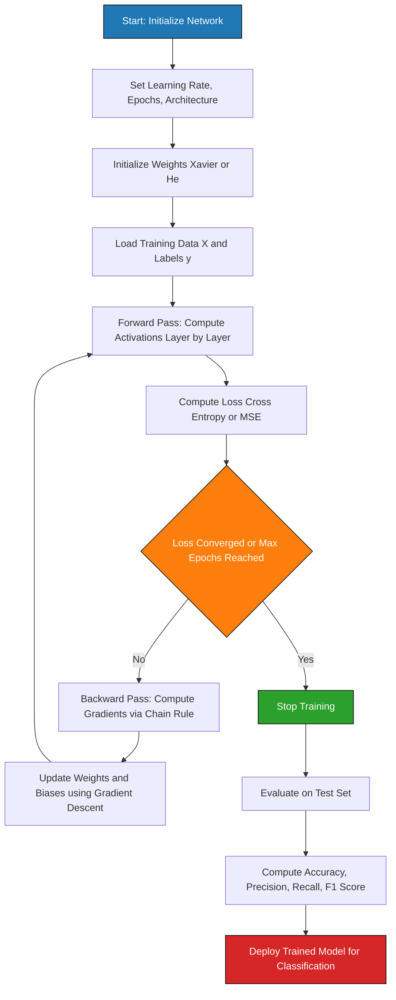
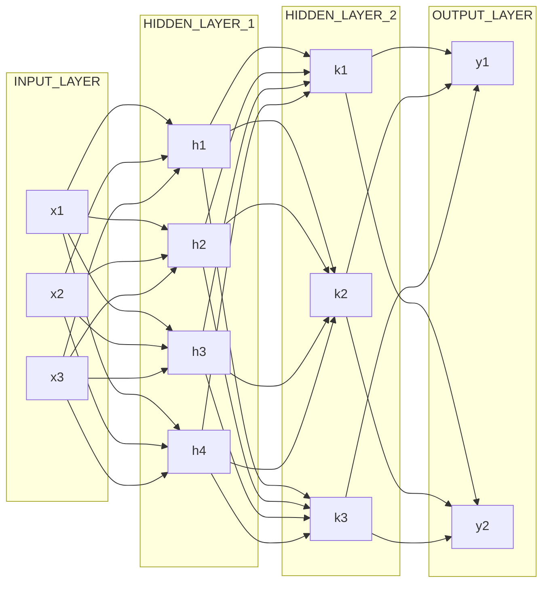
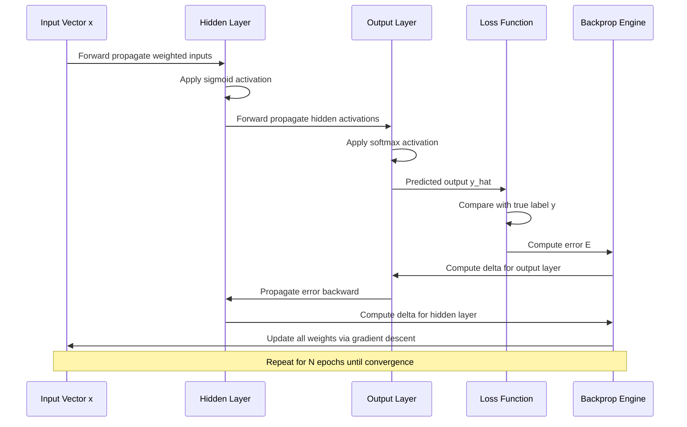

# Neural networks

<!-- SECTION_1_START -->
# Module 3: Classification — Neural Networks

## 1. Core Technical Definition & Intuitive Overview

> [!IMPORTANT]
> **Formal KTU 2024 Definition (Syllabus-Aligned):**
> A **Neural Network (Artificial Neural Network, ANN)** is a computational model inspired by the structure and functioning of biological neurons. In the context of **Data Mining and Classification**, a neural network is a *supervised learning* technique that learns a non-linear mapping from a set of input attributes to one or more discrete class labels by adjusting the **weights** of interconnected processing units (neurons) organized in *input*, *hidden*, and *output* layers, typically trained using the **Backpropagation algorithm** and **gradient descent optimization**.

### Conceptual Analogy / Intuition

Think of a neural network as a **team of referees in a cricket match deciding whether a batsman is "OUT" or "NOT OUT"**:

- Each referee (neuron) looks at **one specific evidence** (e.g., bat angle, foot position, ball trajectory).
- The referees in the **first layer** pass their observations to **senior referees in the hidden layer**, who combine the evidence in weighted ways.
- The **final referee (output layer)** announces the decision: OUT or NOT OUT.
- If the decision is wrong, the referees are **"penalized"** (weights reduced) and **"rewarded"** (weights increased) so they make better calls next time — this is **learning**.

> [!NOTE]
> **Standard Metrics in Neural Network Training:**
> - **Learning Rate (η):** Typically between **0.01 and 0.1**.
> - **Momentum (α):** Often between **0.5 and 0.9**.
> - **Number of Epochs:** Anywhere from **100 to 10,000+** depending on dataset.
> - **Convergence Tolerance (ε):** Usually **10⁻⁴ to 10⁻⁶**.

### Why Neural Networks for Classification?

Traditional classifiers like **Decision Trees** and **Naïve Bayes** work well for linearly separable data, but fail when the decision boundary is highly non-linear. Neural Networks can learn **arbitrarily complex, non-linear decision boundaries** through the composition of multiple non-linear activation functions across hidden layers.

> [!VISUALIZATION CONTROL]
> **Concept:** Decision boundary complexity — Linear vs. Neural Network
> **GeoGebra / Desmos Input Equations:**
> * Linear boundary: `y = -x + 1`
> * Neural network approximation: `f(x) = sin(3x) * cos(2x) - 0.5`
> **Visual Description:** A straight line cleanly separates the two classes in the first plot, but cannot handle curved/spiral patterns. The second plot shows a wavy, curved decision surface that a multi-layer neural network can learn, demonstrating the power of hidden layers.

---

### The Biological Neuron Inspiration

A biological neuron consists of:
- **Dendrites:** Receive input signals
- **Cell Body (Soma):** Sums the weighted inputs
- **Axon:** Outputs the signal once a threshold is crossed
- **Synapses:** Modulate the strength of signals

The artificial neuron mathematically mimics this through: **Weighted Sum → Activation Function → Output**.

<!-- SECTION_1_END -->

<!-- SECTION_2_START -->
# 2. Deep Theoretical Analysis & KTU High-Yield Formula Sheet

## 2.1 The Artificial Neuron (Perceptron Model)

A single artificial neuron computes a weighted sum of its inputs, adds a bias, and passes the result through a non-linear activation function.

### Mathematical Formulation

For a neuron receiving inputs $x_1, x_2, \ldots, x_n$ with corresponding weights $w_1, w_2, \ldots, w_n$ and bias $b$:

**Step 1: Net Input (Pre-activation)**
$$
z = \sum_{i=1}^{n} w_i x_i + b = \mathbf{w}^T \mathbf{x} + b
$$

**Step 2: Activation (Output)**
$$
y = \phi(z)
$$

where $\phi(\cdot)$ is the **activation function**.

### Geometric Intuition for the Perceptron

The equation $\mathbf{w}^T \mathbf{x} + b = 0$ defines a **hyperplane** in $n$-dimensional space:
- In 2D: A **line** $w_1 x_1 + w_2 x_2 + b = 0$
- In 3D: A **plane** $w_1 x_1 + w_2 x_2 + w_3 x_3 + b = 0$
- In nD: A **hyperplane** separating two classes

> [!NOTE]
> **Key Limitation:** A single perceptron can ONLY solve **linearly separable** problems (e.g., AND, OR). It CANNOT solve the **XOR** problem — this is precisely why **multi-layer** networks with hidden layers are required.

## 2.2 Multi-Layer Feed-Forward Neural Network (MLFFN) Architecture

A complete MLFFN has three types of layers:

| Layer | Role | Activation | Notation |
|---|---|---|---|
| **Input Layer** | Receives raw feature vector $\mathbf{x} = (x_1, \ldots, x_d)$ | None (passes values through) | $d$ neurons = number of features |
| **Hidden Layer(s)** | Learns non-linear feature transformations | Sigmoid, Tanh, ReLU | $h_1, h_2, \ldots$ neurons |
| **Output Layer** | Produces class probabilities or scores | Softmax (multi-class), Sigmoid (binary) | $c$ neurons = number of classes |

### Information Flow
$$
\text{Input} \rightarrow \text{Hidden Layer 1} \rightarrow \text{Hidden Layer 2} \rightarrow \cdots \rightarrow \text{Output}
$$

There are **no cycles** — hence "**feed-forward**."

## 2.3 Activation Functions (High-Yield for KTU)

| Function | Formula | Range | Derivative | Use Case |
|---|---|---|---|---|
| **Step (Heaviside)** | $\phi(z) = 1$ if $z \geq 0$, else $0$ | $\{0, 1\}$ | Undefined at 0 | Original Perceptron |
| **Sigmoid (Logistic)** | $\phi(z) = \dfrac{1}{1 + e^{-z}}$ | $(0, 1)$ | $\phi(z)(1-\phi(z))$ | Binary classification, output layer |
| **Tanh** | $\phi(z) = \dfrac{e^z - e^{-z}}{e^z + e^{-z}}$ | $(-1, 1)$ | $1 - \phi^2(z)$ | Hidden layers (zero-centered) |
| **ReLU** | $\phi(z) = \max(0, z)$ | $[0, \infty)$ | $1$ if $z > 0$, else $0$ | Modern deep networks (default) |
| **Softmax** | $\phi(z_i) = \dfrac{e^{z_i}}{\sum_j e^{z_j}}$ | $(0, 1)$, sums to 1 | $\phi(z_i)(\delta_{ij} - \phi(z_j))$ | Multi-class output layer |

> [!IMPORTANT]
> **Why Non-Linear Activation Functions?**
> If we used only linear activations, stacking multiple layers would collapse mathematically to a single linear transformation (since composition of linear functions is linear). **Non-linearity is what allows the network to learn complex, curved decision boundaries.**

## 2.4 Backpropagation Algorithm — The Heart of Neural Network Learning

**Backpropagation** is the algorithm used to compute the **gradient of the loss function** with respect to each weight in the network, then update the weights to minimize the loss. It consists of two phases:

### Phase 1: Forward Pass
- Input $\mathbf{x}$ is propagated through the network layer by layer.
- For each neuron $j$ in layer $l$, compute:
$$
z_j^{(l)} = \sum_i w_{ij}^{(l)} a_i^{(l-1)} + b_j^{(l)}
$$
$$
a_j^{(l)} = \phi(z_j^{(l)})
$$
- The final layer output $\hat{y}$ is compared to the true label $y$ using a **Loss Function**.

### Phase 2: Backward Pass (Error Propagation)
- Compute the **error term (delta)** at the output layer:
$$
\delta_j^{(L)} = \frac{\partial L}{\partial a_j^{(L)}} \cdot \phi'(z_j^{(L)})
$$
- Propagate error backward through hidden layers:
$$
\delta_j^{(l)} = \left( \sum_k w_{jk}^{(l+1)} \delta_k^{(l+1)} \right) \cdot \phi'(z_j^{(l)})
$$
- Update weights using **Gradient Descent**:
$$
w_{ij}^{(l)} \leftarrow w_{ij}^{(l)} - \eta \cdot \frac{\partial L}{\partial w_{ij}^{(l)}}
$$
where $\eta$ is the **learning rate**.

## 2.5 KTU Formula Sheet (Cheat Sheet)

| Symbol | Meaning | Typical Value / Range |
|---|---|---|
| $\eta$ | Learning rate | **0.01 – 0.5** |
| $E$ | Total error / loss | $\geq 0$ |
| $y_k$ | True label (target) for output unit $k$ | $\{0, 1\}$ or one-hot |
| $\hat{y}_k$ | Predicted output from network | $[0, 1]$ |
| $w_{jk}$ | Weight from unit $j$ to unit $k$ | $\mathbb{R}$ |
| $b_k$ | Bias term for unit $k$ | $\mathbb{R}$ |
| $\alpha$ | Momentum coefficient | **0.5 – 0.9** |
| $N$ | Number of training samples | $\mathbb{Z}^+$ |
| $m$ | Mini-batch size | **32, 64, 128, 256** |

### Loss Functions

**Mean Squared Error (MSE) — for regression-like classification:**
$$
E = \frac{1}{2N} \sum_{p=1}^{N} \sum_{k} (y_{k,p} - \hat{y}_{k,p})^2
$$

**Cross-Entropy Loss — preferred for classification:**
$$
E = -\frac{1}{N} \sum_{p=1}^{N} \sum_{k} y_{k,p} \log(\hat{y}_{k,p})
$$

### Weight Update Rules

**Standard Gradient Descent (Batch):**
$$
\Delta w_{jk} = -\eta \frac{\partial E}{\partial w_{jk}}
$$

**With Momentum (to escape local minima):**
$$
\Delta w_{jk}(t+1) = \alpha \Delta w_{jk}(t) - \eta \frac{\partial E}{\partial w_{jk}(t)}
$$

## 2.6 Real-World Engineering Utility

Neural networks for classification power:
- **Email spam filtering** (Gmail, Outlook)
- **Credit card fraud detection** (Banks)
- **Medical diagnosis** (cancer detection from images)
- **Handwriting recognition** (MNIST digit classification, postal automation)
- **Sentiment analysis** (NLP, social media monitoring)
- **Autonomous vehicle perception** (pedestrian detection)
- **Recommendation systems** (Netflix, YouTube content classification)

<!-- SECTION_2_END -->

<!-- SECTION_3_START -->
# 3. Step-by-Step Derivations & Code/Symbolic Implementation

## 3.1 Exhaustive Derivation: Backpropagation for a 2-Layer Network

Consider a network with:
- Input layer: $d$ neurons
- Hidden layer: $h$ neurons (using sigmoid activation)
- Output layer: $c$ neurons (using softmax for multi-class)

### Step 1: Forward Pass Equations

**Hidden layer net input for neuron $j$:**
$$
z_j^{(h)} = \sum_{i=1}^{d} w_{ij}^{(1)} x_i + b_j^{(1)}
$$

**Hidden layer activation:**
$$
a_j^{(h)} = \phi(z_j^{(h)}) = \frac{1}{1 + e^{-z_j^{(h)}}}
$$

**Output layer net input for neuron $k$:**
$$
z_k^{(o)} = \sum_{j=1}^{h} w_{jk}^{(2)} a_j^{(h)} + b_k^{(2)}
$$

**Output layer activation (Softmax for class $k$):**
$$
\hat{y}_k = \frac{e^{z_k^{(o)}}}{\sum_{m=1}^{c} e^{z_m^{(o)}}}
$$

### Step 2: Loss Computation (Cross-Entropy)

For a single training sample with true one-hot label $\mathbf{y} = (y_1, \ldots, y_c)$:
$$
L = -\sum_{k=1}^{c} y_k \log(\hat{y}_k)
$$

### Step 3: Backward Pass — Output Layer Gradients

We need $\frac{\partial L}{\partial w_{jk}^{(2)}}$ for any weight from hidden unit $j$ to output unit $k$.

Using the chain rule:
$$
\frac{\partial L}{\partial w_{jk}^{(2)}} = \frac{\partial L}{\partial \hat{y}_k} \cdot \frac{\partial \hat{y}_k}{\partial z_k^{(o)}} \cdot \frac{\partial z_k^{(o)}}{\partial w_{jk}^{(2)}}
$$

**Compute each term:**

Term 1: $\dfrac{\partial L}{\partial \hat{y}_k} = -\dfrac{y_k}{\hat{y}_k}$

Term 2 (Softmax + Cross-Entropy elegant simplification):
$$
\frac{\partial L}{\partial z_k^{(o)}} = \hat{y}_k - y_k
$$

This is the celebrated result that makes softmax + cross-entropy the preferred combination.

Term 3: $\dfrac{\partial z_k^{(o)}}{\partial w_{jk}^{(2)}} = a_j^{(h)}$

**Putting it together:**
$$
\frac{\partial L}{\partial w_{jk}^{(2)}} = (\hat{y}_k - y_k) \cdot a_j^{(h)}
$$

**Output layer error term:**
$$
\delta_k^{(o)} = \hat{y}_k - y_k
$$

### Step 4: Backward Pass — Hidden Layer Gradients

For weight $w_{ij}^{(1)}$ from input $i$ to hidden unit $j$:
$$
\frac{\partial L}{\partial w_{ij}^{(1)}} = \frac{\partial L}{\partial a_j^{(h)}} \cdot \frac{\partial a_j^{(h)}}{\partial z_j^{(h)}} \cdot \frac{\partial z_j^{(h)}}{\partial w_{ij}^{(1)}}
$$

Term 1 (Sum of influences from all output units):
$$
\frac{\partial L}{\partial a_j^{(h)}} = \sum_{k=1}^{c} \frac{\partial L}{\partial z_k^{(o)}} \cdot w_{jk}^{(2)} = \sum_{k=1}^{c} (\hat{y}_k - y_k) w_{jk}^{(2)}
$$

Term 2 (Sigmoid derivative):
$$
\frac{\partial a_j^{(h)}}{\partial z_j^{(h)}} = a_j^{(h)} (1 - a_j^{(h)})
$$

Term 3: $\dfrac{\partial z_j^{(h)}}{\partial w_{ij}^{(1)}} = x_i$

**Hidden layer error term:**
$$
\delta_j^{(h)} = \left( \sum_{k=1}^{c} \delta_k^{(o)} w_{jk}^{(2)} \right) \cdot a_j^{(h)} (1 - a_j^{(h)})
$$

**Final gradient:**
$$
\frac{\partial L}{\partial w_{ij}^{(1)}} = \delta_j^{(h)} \cdot x_i
$$

### Step 5: Weight Updates

$$
w_{ij}^{(1)} \leftarrow w_{ij}^{(1)} - \eta \cdot \delta_j^{(h)} \cdot x_i
$$

$$
w_{jk}^{(2)} \leftarrow w_{jk}^{(2)} - \eta \cdot \delta_k^{(o)} \cdot a_j^{(h)}
$$

### Step 6: Update Biases

$$
b_j^{(1)} \leftarrow b_j^{(1)} - \eta \cdot \delta_j^{(h)}
$$

$$
b_k^{(2)} \leftarrow b_k^{(2)} - \eta \cdot \delta_k^{(o)}
$$

## 3.2 Full Python Implementation (Production-Grade)

```python
import numpy as np
from typing import Tuple, List
import logging

logging.basicConfig(level=logging.INFO, format='%(asctime)s - %(levelname)s - %(message)s')
logger = logging.getLogger(__name__)


class NeuralNetworkClassifier:
    """
    Multi-layer feed-forward neural network trained with backpropagation
    for multi-class classification.
    """

    def __init__(
        self,
        input_dim: int,
        hidden_dims: List[int],
        output_dim: int,
        learning_rate: float = 0.01,
        momentum: float = 0.9,
        max_epochs: int = 1000,
        tolerance: float = 1e-4,
        random_seed: int = 42
    ) -> None:
        # ---- Hyperparameters with strict boundary checks ----
        if not (0.0 < learning_rate < 1.0):
            raise ValueError(f"learning_rate must be in (0, 1); got {learning_rate}")
        if not (0.0 <= momentum < 1.0):
            raise ValueError(f"momentum must be in [0, 1); got {momentum}")
        if max_epochs <= 0:
            raise ValueError("max_epochs must be positive")
        if input_dim <= 0 or output_dim <= 0:
            raise ValueError("input_dim and output_dim must be positive")

        self.learning_rate: float = learning_rate
        self.momentum: float = momentum
        self.max_epochs: int = max_epochs
        self.tolerance: float = tolerance
        self.layer_dims: List[int] = [input_dim] + hidden_dims + [output_dim]

        # ---- Reproducibility ----
        np.random.seed(random_seed)

        # ---- Xavier-style weight initialization ----
        self.weights: List[np.ndarray] = []
        self.biases: List[np.ndarray] = []
        for i in range(len(self.layer_dims) - 1):
            limit = np.sqrt(6.0 / (self.layer_dims[i] + self.layer_dims[i + 1]))
            w = np.random.uniform(-limit, limit, (self.layer_dims[i], self.layer_dims[i + 1]))
            b = np.zeros((1, self.layer_dims[i + 1]))
            self.weights.append(w)
            self.biases.append(b)

        # ---- Momentum state ----
        self.v_weights: List[np.ndarray] = [np.zeros_like(w) for w in self.weights]
        self.v_biases: List[np.ndarray] = [np.zeros_like(b) for b in self.biases]

        logger.info(f"Initialized network with architecture: {self.layer_dims}")

    @staticmethod
    def _sigmoid(z: np.ndarray) -> np.ndarray:
        """Numerically stable sigmoid."""
        return 1.0 / (1.0 + np.exp(-np.clip(z, -500, 500)))

    @staticmethod
    def _sigmoid_derivative(a: np.ndarray) -> np.ndarray:
        """Derivative given the activation value a (sigmoid has been applied)."""
        return a * (1.0 - a)

    @staticmethod
    def _softmax(z: np.ndarray) -> np.ndarray:
        """Numerically stable softmax."""
        z_shift = z - np.max(z, axis=1, keepdims=True)
        exp_z = np.exp(z_shift)
        return exp_z / np.sum(exp_z, axis=1, keepdims=True)

    def _one_hot(self, y: np.ndarray, num_classes: int) -> np.ndarray:
        """Convert integer labels to one-hot encoding."""
        return np.eye(num_classes)[y.astype(int)]

    def _forward(self, X: np.ndarray) -> Tuple[List[np.ndarray], List[np.ndarray]]:
        """Forward pass: returns list of (z, a) for each layer."""
        activations: List[np.ndarray] = [X]
        pre_activations: List[np.ndarray] = []

        current_input = X
        for i, (W, b) in enumerate(zip(self.weights, self.biases)):
            z = current_input @ W + b
            pre_activations.append(z)
            if i == len(self.weights) - 1:
                a = self._softmax(z)        # Output layer
            else:
                a = self._sigmoid(z)        # Hidden layers
            activations.append(a)
            current_input = a

        return pre_activations, activations

    def _backward(
        self,
        y_true: np.ndarray,
        pre_activations: List[np.ndarray],
        activations: List[np.ndarray]
    ) -> Tuple[List[np.ndarray], List[np.ndarray]]:
        """Backward pass: compute gradients for all weights and biases."""
        m = y_true.shape[0]
        num_layers = len(self.weights)

        dW: List[np.ndarray] = [np.zeros_like(w) for w in self.weights]
        dB: List[np.ndarray] = [np.zeros_like(b) for b in self.biases]

        # Output layer error: delta = a_L - y  (for softmax + cross-entropy)
        delta = activations[-1] - y_true  # shape: (m, output_dim)

        # Backpropagate through each layer
        for layer in reversed(range(num_layers)):
            a_prev = activations[layer]
            dW[layer] = (a_prev.T @ delta) / m
            dB[layer] = np.sum(delta, axis=0, keepdims=True) / m

            if layer > 0:
                # Propagate error to previous layer
                delta = (delta @ self.weights[layer].T) * self._sigmoid_derivative(activations[layer])

        return dW, dB

    def _update_parameters(self, dW: List[np.ndarray], dB: List[np.ndarray]) -> None:
        """Apply gradient descent with momentum."""
        for i in range(len(self.weights)):
            self.v_weights[i] = self.momentum * self.v_weights[i] - self.learning_rate * dW[i]
            self.v_biases[i] = self.momentum * self.v_biases[i] - self.learning_rate * dB[i]
            self.weights[i] += self.v_weights[i]
            self.biases[i] += self.v_biases[i]

    @staticmethod
    def _cross_entropy(y_pred: np.ndarray, y_true_onehot: np.ndarray) -> float:
        """Compute mean cross-entropy loss."""
        m = y_pred.shape[0]
        eps = 1e-12
        return -np.sum(y_true_onehot * np.log(y_pred + eps)) / m

    def fit(self, X: np.ndarray, y: np.ndarray) -> List[float]:
        """
        Train the network using backpropagation.
        Returns the loss history.
        """
        if X.shape[0] != y.shape[0]:
            raise ValueError("X and y must have the same number of samples")

        num_classes = self.layer_dims[-1]
        y_onehot = self._one_hot(y, num_classes)
        loss_history: List[float] = []

        logger.info(f"Starting training: {X.shape[0]} samples, {self.max_epochs} max epochs")

        for epoch in range(1, self.max_epochs + 1):
            pre_acts, acts = self._forward(X)
            loss = self._cross_entropy(acts[-1], y_onehot)
            loss_history.append(loss)

            dW, dB = self._backward(y_onehot, pre_acts, acts)
            self._update_parameters(dW, dB)

            # ---- Convergence check ----
            if epoch > 1 and abs(loss_history[-2] - loss_history[-1]) < self.tolerance:
                logger.info(f"Converged at epoch {epoch}, loss = {loss:.6f}")
                return loss_history

            if epoch % 100 == 0 or epoch == 1:
                logger.info(f"Epoch {epoch:5d}/{self.max_epochs} | Loss = {loss:.6f}")

        logger.info(f"Training complete after {self.max_epochs} epochs")
        return loss_history

    def predict(self, X: np.ndarray) -> np.ndarray:
        """Predict class labels for samples in X."""
        _, acts = self._forward(X)
        return np.argmax(acts[-1], axis=1)

    def predict_proba(self, X: np.ndarray) -> np.ndarray:
        """Predict class probabilities for samples in X."""
        _, acts = self._forward(X)
        return acts[-1]


# ------------------ DEMONSTRATION: XOR PROBLEM ------------------
if __name__ == "__main__":
    # XOR truth table (NOT linearly separable — requires hidden layer)
    X_xor = np.array([[0, 0], [0, 1], [1, 0], [1, 1]])
    y_xor = np.array([0, 1, 1, 0])

    # Architecture: 2 inputs -> 4 hidden (sigmoid) -> 2 outputs (softmax)
    clf = NeuralNetworkClassifier(
        input_dim=2,
        hidden_dims=[4],
        output_dim=2,
        learning_rate=0.5,
        momentum=0.9,
        max_epochs=5000,
        tolerance=1e-5
    )

    history = clf.fit(X_xor, y_xor)

    print("\n=== XOR Classification Results ===")
    for sample, true_label, pred_label, probs in zip(
        X_xor, y_xor, clf.predict(X_xor), clf.predict_proba(X_xor)
    ):
        print(f"Input: {sample} | True: {true_label} | Pred: {pred_label} | "
              f"Probs: {probs.round(4)}")
```

## 3.3 Key Training Parameters and Best Practices

| Parameter | Recommended Choice | Reason |
|---|---|---|
| Learning rate $\eta$ | Start with **0.01**; tune via grid search | Too high → diverges; too low → slow |
| Hidden layer count | 1–3 for tabular data; deeper for images/text | Diminishing returns beyond 3 for classical DM |
| Neurons per hidden layer | Between input and output size, or use $\frac{2}{3}(d + c)$ | Heuristic from prior literature |
| Activation (hidden) | **ReLU** for deep nets, **Tanh** for shallow | Avoids vanishing gradient problem |
| Activation (output) | **Softmax** (multi-class) / **Sigmoid** (binary) | Yields proper probability distribution |
| Weight initialization | **Xavier/Glorot** for sigmoid/tanh, **He** for ReLU | Prevents vanishing/exploding gradients |
| Optimizer | **Adam** (default) or **SGD with momentum** | Adaptive learning rates |
| Epochs | Use **early stopping** with validation set | Prevents overfitting |

> [!WARNING]
> **Vanishing / Exploding Gradient Problem:**
> When using sigmoid/tanh activations in deep networks, gradients can become vanishingly small (≈ 0) or explosively large as they are multiplied through many layers. This causes training to stall or diverge. **Solutions:** Use ReLU activations, batch normalization, careful weight initialization (He/Xavier), and gradient clipping.

## 3.4 Why XOR Cannot Be Solved by a Single Perceptron — The Detailed Proof

For XOR, we have four points: $(0,0) \to 0$, $(0,1) \to 1$, $(1,0) \to 1$, $(1,1) \to 0$.

**Assume** a single perceptron can solve it: $w_1 x_1 + w_2 x_2 + b = 0$ separates class 0 from class 1.

Applying the four points:
- $(0,0) \to b$ must give class 0: $b < 0$
- $(0,1) \to w_2 + b$ must give class 1: $w_2 + b > 0 \Rightarrow w_2 > -b > 0$
- $(1,0) \to w_1 + b$ must give class 1: $w_1 + b > 0 \Rightarrow w_1 > -b > 0$
- $(1,1) \to w_1 + w_2 + b$ must give class 0: $w_1 + w_2 + b < 0$

But from conditions 2 and 3: $w_1 > 0$ and $w_2 > 0$, so $w_1 + w_2 > 0$.
Adding $b < 0$ on both sides: $w_1 + w_2 + b$ could be either sign.

**Contradiction check:** If $w_1 = w_2 = 1$ and $b = -1.5$:
- $(0,0)$: $-1.5 < 0$ → class 0 ✓
- $(0,1)$: $-0.5 < 0$ → predicted class 0 ✗ (should be 1)

**Therefore, no single line exists that separates XOR's two classes — XOR is not linearly separable.** A multi-layer network is required.

<!-- SECTION_3_END -->

<!-- SECTION_4_START -->
# 4. Structural Diagrams & Schematics

## 4.1 Mermaid Flowchart — Neural Network Training Pipeline



## 4.2 Mermaid Graph — Multi-Layer Network Architecture



## 4.3 Mermaid Sequence Diagram — Forward and Backward Pass



## 4.4 Mermaid Block Diagram — Information Flow During Backpropagation

```mermaid
flowchart TB
    subgraph FWD[FORWARD PASS]
        F1[Input X: n x d matrix] --> F2[Compute z1 = X W1 + b1]
        F2 --> F3[Compute a1 = sigmoid z1]
        F3 --> F4[Compute z2 = a1 W2 + b2]
        F4 --> F5[Compute a2 = softmax z2]
    end

    F5 --> LOSS[Compute Loss L cross entropy]
    LOSS --> BWD_CHECK{L > tolerance}

    BWD_CHECK -->|Yes| subgraph BCK[BACKWARD PASS]
        B1[Compute output delta = a2 - y] --> B2[Compute dW2 and dB2]
        B2 --> B3[Propagate error: delta hidden = delta output W2 transpose times sigmoid derivative]
        B3 --> B4[Compute dW1 and dB1]
    end

    BCK --> UPDATE[Update parameters using learning rate and momentum]
    UPDATE --> F1
    BWD_CHECK -->|No| DONE[Training complete: save weights]
```

## 4.5 Sequential Processing Topology Matrix

| Phase | Step | Operation | Input Shape | Output Shape |
|---|---|---|---|---|
| **Init** | 1 | Xavier weight init $W^{(l)}$ | — | $(n_l, n_{l+1})$ |
| **Init** | 2 | Zero bias init $b^{(l)}$ | — | $(1, n_{l+1})$ |
| **Forward** | 3 | Net input $z^{(l)} = a^{(l-1)} W^{(l)} + b^{(l)}$ | $(m, n_{l-1})$ | $(m, n_l)$ |
| **Forward** | 4 | Activation $a^{(l)} = \phi(z^{(l)})$ | $(m, n_l)$ | $(m, n_l)$ |
| **Loss** | 5 | Cross-entropy $L = -\sum y \log(\hat{y})$ | $(m, c)$ | scalar |
| **Backward** | 6 | Output $\delta^{(L)} = \hat{y} - y$ | $(m, c)$ | $(m, c)$ |
| **Backward** | 7 | Hidden $\delta^{(l)} = (\delta^{(l+1)} W^{(l+1)T}) \odot \phi'(z^{(l)})$ | $(m, n_{l+1})$ | $(m, n_l)$ |
| **Update** | 8 | $\Delta W^{(l)} = \frac{1}{m} a^{(l-1)T} \delta^{(l)}$ | — | $(n_{l-1}, n_l)$ |
| **Update** | 9 | $W^{(l)} \leftarrow W^{(l)} - \eta \Delta W^{(l)}$ | — | $(n_{l-1}, n_l)$ |

<!-- SECTION_4_END -->

<!-- SECTION_5_START -->
# 5. KTU 2024 Scheme Examination Question Bank & Topic Recap

---

## Part A: Short-Answer Questions (3 Marks Each)

### **Question 1** `[KTU University Exam – July 2024]`
**(CO1, Remember)**

**Q: Define an Artificial Neural Network. List any two activation functions used in neural networks.**

**Model Answer (Valuation Key):**
> An **Artificial Neural Network (ANN)** is a computational model inspired by biological neural systems, consisting of interconnected processing units (neurons) organized in layers, which learns input-output mappings by adjusting connection weights through training. `[Definition: 2 Marks]`

> Two activation functions:
> 1. **Sigmoid:** $\phi(z) = \dfrac{1}{1+e^{-z}}$, range $(0, 1)$.
> 2. **ReLU:** $\phi(z) = \max(0, z)$, range $[0, \infty)$. `[Two activations: 1 Mark]`

---

### **Question 2** `[KTU University Exam – Dec 2023]`
**(CO2, Understand)**

**Q: Why is the XOR problem not solvable by a single-layer perceptron? Explain with the help of a diagram or truth table.**

**Model Answer:**
> The XOR function maps inputs $(0,0)\to 0$, $(0,1)\to 1$, $(1,0)\to 1$, $(1,1)\to 0$. The two classes $\{0, 1\}$ cannot be separated by a single straight line in 2D space. `[Explanation: 2 Marks]`

> Plotting the four points shows that the points labeled "1" lie on opposite corners and cannot be isolated from the "0" points by any linear boundary. A single perceptron draws only linear decision boundaries, hence it fails. A **multi-layer network with at least one hidden layer** is required to solve XOR. `[Diagrammatic/Geometric reasoning: 1 Mark]`

> **Valuation Key:** A neat sketch with class-0 and class-1 points marked, and an attempt to draw a non-existent separating line, earns full marks.

---

## Part B: Long-Answer Questions (14 Marks Each)

> **MODULE-WISE INTERNAL CHOICE:** Answer **ONE** full question from each module. Each part carries 7 marks.

---

### **Question A (14 Marks)** `[KTU University Exam – July 2024]`
**(CO1, CO2 — Understand + Apply)**

#### **Part (a)** — 7 Marks
**Explain the architecture of a multi-layer feed-forward neural network. With a neat diagram, describe the role of input, hidden, and output layers. Mention the activation function used at each layer.**

**Model Answer:**

**Architecture Description `[3 Marks]`:**
A Multi-Layer Feed-Forward Neural Network (MLFFN) consists of:
- An **input layer** that receives the feature vector $\mathbf{x} = (x_1, x_2, \ldots, x_d)$. It has $d$ neurons where $d$ is the number of input features. No computation is performed here.
- One or more **hidden layers** that perform non-linear transformations on the weighted inputs. Each neuron in a hidden layer computes $z = \sum w_i x_i + b$ and applies an activation function.
- An **output layer** that produces the final classification result. For binary classification, it has 1 neuron (sigmoid); for $c$-class problems, $c$ neurons (softmax).

**Activation Functions `[2 Marks]`:**
- **Input layer:** No activation (identity).
- **Hidden layer:** Sigmoid, Tanh, or ReLU (for non-linearity).
- **Output layer:** Softmax (multi-class) or Sigmoid (binary).

**Diagram `[2 Marks]`:**
> [Examiner expects: A clear diagram showing input nodes connecting fully to hidden nodes, which in turn connect fully to output nodes. Arrows should point in one direction (feed-forward). Layer labels should be present.]

> **Valuation Key Points:**
> - '[Stating the role of each layer: 1 Mark]'
> - '[Correct activation function for each layer: 1 Mark]'
> - '[Neat block diagram with arrows showing feed-forward direction: 2 Marks]'

#### **Part (b)** — 7 Marks
**Consider a 2-input, 1-output neural network with sigmoid activation. Given initial weights $w_1 = 0.3$, $w_2 = -0.1$, bias $b = 0.2$, and inputs $x_1 = 1$, $x_2 = 0$, with target $y = 1$ and learning rate $\eta = 0.5$. Perform ONE iteration of the backpropagation algorithm and update the weights.**

**Step-by-Step Solution:**

**Step 1: Forward Pass — Compute Net Input `[1 Mark]`**
$$
z = w_1 x_1 + w_2 x_2 + b = (0.3)(1) + (-0.1)(0) + 0.2 = 0.5
$$

**Step 2: Apply Sigmoid Activation `[1 Mark]`**
$$
\hat{y} = \phi(z) = \frac{1}{1 + e^{-0.5}} = \frac{1}{1 + 0.6065} = 0.6225
$$

**Step 3: Compute Error (Loss) `[0.5 Mark]`**
$$
E = \frac{1}{2}(y - \hat{y})^2 = \frac{1}{2}(1 - 0.6225)^2 = \frac{1}{2}(0.3775)^2 = 0.0712
$$

**Step 4: Compute Gradient of Error w.r.t. Each Weight `[3 Marks]`**

Using the chain rule:
$$
\frac{\partial E}{\partial w_i} = \frac{\partial E}{\partial \hat{y}} \cdot \frac{\partial \hat{y}}{\partial z} \cdot \frac{\partial z}{\partial w_i}
$$

Term 1: $\dfrac{\partial E}{\partial \hat{y}} = -(y - \hat{y}) = -(1 - 0.6225) = -0.3775$

Term 2 (Sigmoid derivative): $\dfrac{\partial \hat{y}}{\partial z} = \hat{y}(1 - \hat{y}) = 0.6225 \times 0.3775 = 0.2350$

Term 3a (for $w_1$): $\dfrac{\partial z}{\partial w_1} = x_1 = 1$

Term 3b (for $w_2$): $\dfrac{\partial z}{\partial w_2} = x_2 = 0$

Combined gradient for $w_1$:
$$
\frac{\partial E}{\partial w_1} = (-0.3775)(0.2350)(1) = -0.0887
$$

Combined gradient for $w_2$:
$$
\frac{\partial E}{\partial w_2} = (-0.3775)(0.2350)(0) = 0
$$

**Step 5: Update Weights Using Gradient Descent `[1.5 Marks]`**
$$
w_1^{\text{new}} = w_1 - \eta \cdot \frac{\partial E}{\partial w_1} = 0.3 - (0.5)(-0.0887) = 0.3 + 0.0444 = 0.3444
$$

$$
w_2^{\text{new}} = w_2 - \eta \cdot \frac{\partial E}{\partial w_2} = -0.1 - (0.5)(0) = -0.1
$$

**Step 6: Update Bias `[Bonus, 0.5 Mark — if asked]`**
$$
b^{\text{new}} = b - \eta \cdot \frac{\partial E}{\partial b} = 0.2 - (0.5)(-0.3775)(0.2350) = 0.2 + 0.0444 = 0.2444
$$

**Final Answer:**
- $w_1^{\text{new}} = 0.3444$
- $w_2^{\text{new}} = -0.1000$
- $b^{\text{new}} = 0.2444$

> **Valuation Key Points:**
> - '[Forward pass net input: 1 Mark]'
> - '[Sigmoid evaluation: 1 Mark]'
> - '[Chain rule expansion and gradient: 3 Marks]'
> - '[Final weight updates: 1.5 Marks]'
> - '[Correct numerical arithmetic: 0.5 Mark]'

---

### **Question B (14 Marks) — Alternative Choice** `[KTU University Exam – Dec 2023]`
**(CO1, CO2 — Understand + Apply)**

#### **Part (a)** — 7 Marks
**Explain the Backpropagation algorithm in detail. Discuss the role of the learning rate and momentum in convergence.**

**Model Answer:**

**Backpropagation Algorithm Steps `[4 Marks]`:**
1. **Initialize** all weights and biases to small random values.
2. **Forward Pass:** Propagate the input vector through the network, computing the net input and activation at each neuron, until the output $\hat{y}$ is produced.
3. **Compute Loss:** Compare $\hat{y}$ with the true label $y$ using a loss function (e.g., cross-entropy).
4. **Backward Pass:** Starting from the output layer, compute the error term $\delta^{(l)}$ at each layer using the chain rule:
   $$
   \delta^{(L)} = (\hat{y} - y) \odot \phi'(z^{(L)}) \quad \text{(output layer)}
   $$
   $$
   \delta^{(l)} = \left( W^{(l+1)} \delta^{(l+1)} \right) \odot \phi'(z^{(l)}) \quad \text{(hidden layers)}
   $$
5. **Update Weights:** Apply gradient descent:
   $$
   W^{(l)} \leftarrow W^{(l)} - \eta \frac{\partial L}{\partial W^{(l)}}
   $$
6. **Repeat** steps 2–5 for many epochs until the loss converges.

**Role of Learning Rate (η) `[1.5 Marks]`:**
- Controls the **step size** of weight updates.
- **Too large:** Training diverges, loss oscillates or explodes.
- **Too small:** Training is very slow, may get stuck in poor local minima.
- Typical values: **0.001 to 0.5**.

**Role of Momentum (α) `[1.5 Marks]`:**
- Adds a fraction of the **previous update** to the current update:
  $$
  \Delta W(t+1) = \alpha \Delta W(t) - \eta \frac{\partial L}{\partial W}
  $$
- **Benefits:**
  - Helps the optimizer **escape local minima** and **shallow saddle points**.
  - **Accelerates convergence** in consistent gradient directions.
  - **Damps oscillations** in ravines.
- Typical values: **0.5 to 0.9**.

#### **Part (b)** — 7 Marks
**Given the following neural network training scenario:**
- Inputs: $x_1 = 2, x_2 = 3$
- Weights: $w_1 = 0.4, w_2 = 0.5$, bias $b = 0.1$
- Target: $y = 0$
- Activation: Sigmoid
- Learning rate: $\eta = 0.1$

**Perform ONE forward pass, compute the error, and update the weights.**

**Step-by-Step Solution:**

**Step 1: Forward Pass — Net Input `[1 Mark]`**
$$
z = w_1 x_1 + w_2 x_2 + b = (0.4)(2) + (0.5)(3) + 0.1 = 0.8 + 1.5 + 0.1 = 2.4
$$

**Step 2: Sigmoid Activation `[1 Mark]`**
$$
\hat{y} = \frac{1}{1 + e^{-2.4}} = \frac{1}{1 + 0.0907} = 0.9169
$$

**Step 3: Compute Error `[0.5 Mark]`**
$$
E = \frac{1}{2}(y - \hat{y})^2 = \frac{1}{2}(0 - 0.9169)^2 = 0.4204
$$

**Step 4: Compute the Output Delta `[1 Mark]`**
$$
\delta = (\hat{y} - y) \cdot \hat{y}(1 - \hat{y}) = (0.9169 - 0)(0.9169)(1 - 0.9169) = 0.9169 \times 0.0763 = 0.0700
$$

(Or equivalently: $\delta = -(y - \hat{y}) \cdot \hat{y}(1 - \hat{y}) = 0.0700$ — sign convention may vary.)

**Step 5: Compute Weight Gradients `[1.5 Marks]`**
$$
\frac{\partial E}{\partial w_1} = \delta \cdot x_1 = 0.0700 \times 2 = 0.1400
$$

$$
\frac{\partial E}{\partial w_2} = \delta \cdot x_2 = 0.0700 \times 3 = 0.2100
$$

**Step 6: Update Weights `[2 Marks]`**
$$
w_1^{\text{new}} = w_1 - \eta \frac{\partial E}{\partial w_1} = 0.4 - (0.1)(0.1400) = 0.4 - 0.014 = 0.386
$$

$$
w_2^{\text{new}} = w_2 - \eta \frac{\partial E}{\partial w_2} = 0.5 - (0.1)(0.2100) = 0.5 - 0.021 = 0.479
$$

**Step 7: Update Bias `[Bonus 0.5 Mark]`**
$$
b^{\text{new}} = b - \eta \cdot \delta = 0.1 - (0.1)(0.0700) = 0.1 - 0.007 = 0.093
$$

> **Valuation Key Points:**
> - '[Forward pass with correct arithmetic: 1.5 Marks]'
> - '[Sigmoid derivative application: 1 Mark]'
> - '[Chain rule gradient computation: 1.5 Marks]'
> - '[Final weight update: 1.5 Marks]'
> - '[Numerical accuracy: 0.5 Mark]'
> - '[Bonus for bias update: 0.5 Mark]'

---

> [!WARNING]
> **KTU Examiner's Valuation Warning — Common Pitfalls:**
> 1. **Forgetting to apply the activation function** in the forward pass — students often output $z$ directly as if it were $\hat{y}$. This costs **1–2 marks**.
> 2. **Sign errors in the gradient** — the chain rule must be applied meticulously. A common error is writing $\frac{\partial E}{\partial w} = (y - \hat{y}) \cdot x$ instead of $-(y - \hat{y}) \cdot \hat{y}(1 - \hat{y}) \cdot x$. Always derive the gradient sign carefully.
> 3. **Confusing MSE with Cross-Entropy loss** in the output layer — different loss functions lead to different delta expressions. For sigmoid + MSE: $\delta = (\hat{y} - y) \phi'(z)$. For softmax + cross-entropy: $\delta = \hat{y} - y$ (much simpler!).
> 4. **Forgetting to update biases** — only weight updates are sometimes shown, leaving biases unupdated. This is incomplete.
> 5. **Not stating the network architecture** (number of layers, neurons, activation) before solving — the examiner may deduct marks for ambiguity.
> 6. **Skipping units and intermediate values** — show all numerical calculations step-by-step, even for sigmoid evaluations. Examiners allocate marks for **arithmetic steps**, not just the final answer.

---

## Topic Recap & Important Things to Remember

- **Neural Network:** A computational model of interconnected neurons that learns non-linear input-output mappings for classification or regression via supervised training.
- **Perceptron:** The simplest neural unit; computes $z = \sum w_i x_i + b$ and outputs $\phi(z)$. **Limited to linearly separable problems.**
- **MLFFN:** Multi-Layer Feed-Forward Network — has at least one hidden layer; can learn non-linear, even non-convex decision boundaries.
- **XOR Problem:** The canonical example of a non-linearly separable problem requiring hidden layers.
- **Backpropagation:** Algorithm that uses the chain rule to compute gradients of loss w.r.t. each weight, propagating errors from output → hidden → input layers.
- **Two Phases:** **Forward pass** (compute activations) and **Backward pass** (compute deltas and update weights).
- **Weight Update Rule:** $W^{\text{new}} = W - \eta \frac{\partial L}{\partial W}$.
- **Learning Rate (η):** Step size; too high causes divergence, too low causes slow training. Common range: **0.01–0.1**.
- **Momentum (α):** Inertial term that adds a fraction of previous updates; helps escape local minima and smoothens convergence. Common range: **0.5–0.9**.
- **Activation Functions:** **Sigmoid** $(0,1)$ for binary output, **Softmax** for multi-class output, **ReLU/Tanh** for hidden layers.
- **Loss Functions:** **Cross-Entropy** (preferred for classification) and **MSE** (for regression).
- **Xavier/He Initialization:** Techniques to initialize weights such that activations and gradients do not vanish or explode.
- **Vanishing Gradient:** Problem in deep networks where sigmoid/tanh derivatives cause gradients to shrink exponentially; mitigated by ReLU, batch norm, and residual connections.
- **Overfitting Prevention:** Use **early stopping**, **dropout**, **L1/L2 regularization**, and **validation sets**.
- **Universal Approximation Theorem:** A feed-forward network with a single hidden layer (and sufficient neurons) can approximate **any** continuous function on a compact set to arbitrary accuracy.
- **Hyperparameters to Tune:** Learning rate, number of hidden layers, neurons per layer, momentum, batch size, activation function, optimizer choice, epochs, regularization strength.
- **Stopping Criteria:** (1) Maximum epochs reached, (2) Loss change < tolerance, (3) Validation accuracy plateaus, (4) Time budget exhausted.
- **Evaluation Metrics:** Accuracy, Precision, Recall, F1-Score, AUC-ROC, Confusion Matrix.
- **KTU Frequently Tested Concepts:** (1) Forward pass with sigmoid, (2) Weight update derivation, (3) Chain rule application, (4) Role of each layer, (5) Why XOR fails for single perceptron, (6) Activation function selection.

<!-- SECTION_5_END -->
