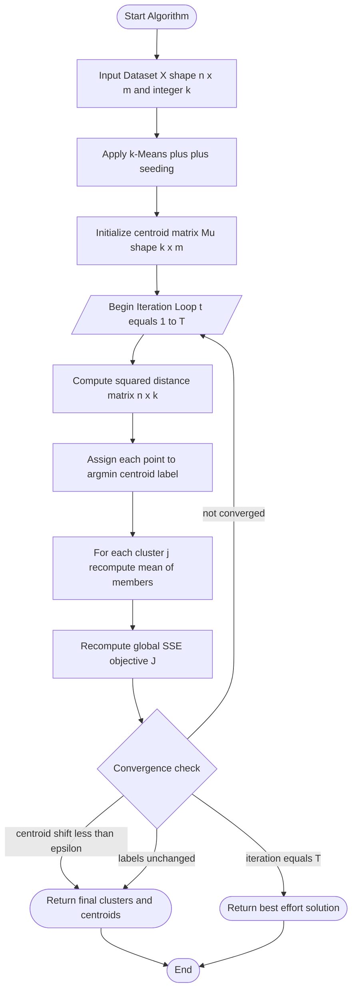
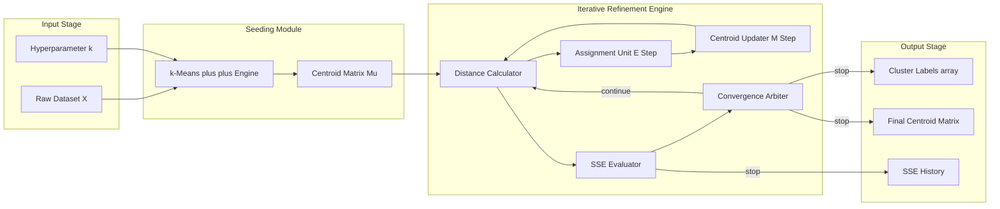
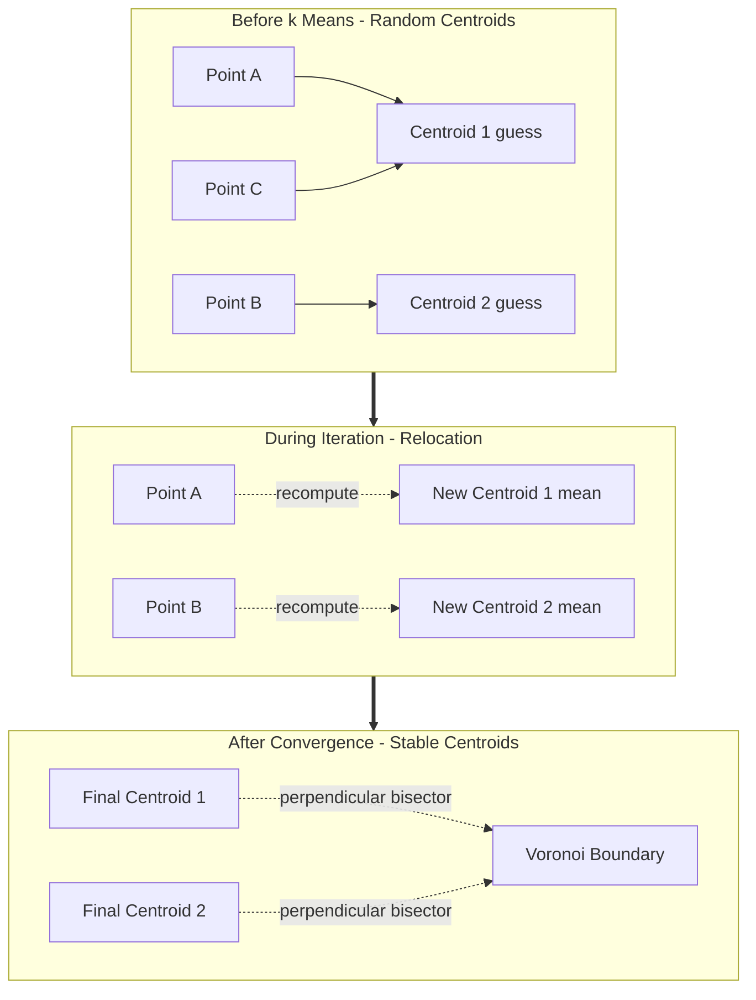

# Partitioning Algorithm - k means

<!-- SECTION_1_START -->

# k-Means Partitioning Algorithm — Module 3 / Classification

## 1.1 Formal Academic Definition

> [!NOTE]
> **Definition (KTU 2024 Scheme Alignment):**
> *k*-Means is a **prototype-based, partitional, unsupervised clustering algorithm** proposed by **Stuart Lloyd (1957)** and later refined by **MacQueen (1967)**. It partitions a dataset $D = \{x_1, x_2, \dots, x_n\}$ containing $n$ *m*-dimensional observations into exactly **$k$** non-overlapping, exhaustive clusters $C = \{C_1, C_2, \dots, C_k\}$ such that the **Within-Cluster Sum of Squared Errors (WCSS / SSE)** is minimized.

The optimization objective is formally stated as:

$$
J(C) \;=\; \sum_{j=1}^{k} \sum_{x_i \in C_j} \bigl\| x_i - \mu_j \bigr\|_2^2
$$

where $\mu_j$ denotes the **centroid** of cluster $C_j$, defined as the **arithmetic mean** of all points assigned to that cluster.

## 1.2 Intuitive Analogy — "The Classroom Grouping Problem"

> [!IMPORTANT]
> **Conceptual Analogy (Plain English Intuition):**
> Imagine a school principal who must form **$k$** study groups from a classroom of $n$ students. Each student has a *profile* (e.g., math score, science score, attendance percentage — so $m = 3$ dimensions). The principal does the following:
>
> 1. **Picks $k$ random students** as "group leaders" (initial centroids).
> 2. **Asks every other student** to stand next to the leader whose profile is **closest** to theirs (assignment step).
> 3. **Recomputes** each leader's profile as the *average* of all students now standing near them (update step).
> 4. **Repeats** steps 2–3 until the group leaders stop moving — meaning every student is already with their *most compatible* group.
>
> The principal has effectively minimized the total "dissatisfaction" (squared profile distance) of the classroom.

## 1.3 Key Parameters & Constants

| Symbol | Meaning | Standard Default |
| :--- | :--- | :--- |
| $k$ | Number of clusters to form | User-specified (e.g., 2, 3, 5) |
| $\mu_j$ | Centroid of cluster $j$ | Initialized randomly |
| $x_i$ | The $i$-th data point (vector) | Given in dataset |
| $m$ | Number of features / dimensions | Given in dataset |
| $\epsilon$ | Convergence tolerance | **$1 \times 10^{-4}$** (typical) |
| $T$ | Maximum iterations | **300** (typical, scikit-learn default) |
| $\mathcal{L}$ | Distance metric | **Euclidean** ($\mathcal{L}_2$-norm) |

## 1.4 Geometric Visualization

> [!VISUALIZATION CONTROL]
> **Concept:** 2D Voronoi partition induced by *k*-Means centroids.
> **GeoGebra / Desmos Input Equations (for $k = 3$, centroids $\mu_1 = (2,2),\; \mu_2 = (6,3),\; \mu_3 = (4,7)$):**
> * `C1: (x - 2)^2 + (y - 2)^2 = 1.5^2` — Cluster 1 region
> * `C2: (x - 6)^2 + (y - 3)^2 = 1.5^2` — Cluster 2 region
> * `C3: (x - 4)^2 + (y - 7)^2 = 1.5^2` — Cluster 3 region
> * `V12: y = 0.5x + 0.25` — Voronoi boundary between $C_1$ and $C_2$
> **Visual Description:** Three solid dots represent the moving centroids; the three lines are **Voronoi edges** (perpendicular bisectors). Each point inside a Voronoi cell gets assigned to that cell's centroid. After convergence, the dots settle at the *true geometric center* of their cluster's data cloud.

---

<!-- SECTION_1_END -->

<!-- SECTION_2_START -->

# 2. Deep Theoretical Analysis & KTU High-Yield Formula Sheet

## 2.1 Algorithm Decomposition — The Operational Logic

The k-Means procedure is an **iterative-refinement EM-style (Expectation-Maximization) algorithm** executed in two alternating phases per iteration:

> [!IMPORTANT]
> **Phase 1 — Expectation (E-Step): Hard Assignment**
> For every data point $x_i$, compute its Euclidean distance to **every** centroid $\mu_j$ and assign it to the cluster of the *closest* centroid.
>
> **Phase 2 — Maximization (M-Step): Centroid Relocation**
> For every cluster $C_j$, recompute the centroid as the **mean vector** of all points currently in $C_j$.

### Step-by-Step Logical Flow

1. **Input Validation** — Accept the dataset $D$ and the integer $k$.
2. **Initialization** — Choose $k$ initial centroids $\{\mu_1^{(0)}, \mu_2^{(0)}, \dots, \mu_k^{(0)}\}$. Strategies include:
   * *Forgy Method*: Randomly pick $k$ data points.
   * *Random Partition*: Randomly assign each $x_i$ to a cluster, then compute means.
   * *k-Means++*: Probabilistic seeding that spreads initial centroids (David Arthur & Sergei Vassilvitskii, 2007).
3. **Assignment Step** — For each $i \in \{1, \dots, n\}$:
   $$c_i^{(t)} \;=\; \arg\min_{j \in \{1,\dots,k\}} \bigl\| x_i - \mu_j^{(t)} \bigr\|_2^2$$
4. **Update Step** — For each $j \in \{1, \dots, k\}$:
   $$\mu_j^{(t+1)} \;=\; \frac{1}{\vert C_j^{(t)} \vert} \sum_{x_i \in C_j^{(t)}} x_i$$
5. **Convergence Test** — Stop if either:
   * $\bigl\| \mu_j^{(t+1)} - \mu_j^{(t)} \bigr\|_2 < \epsilon$ for all $j$, **OR**
   * Cluster assignments $c_i^{(t+1)} = c_i^{(t)}$ for all $i$, **OR**
   * Iteration count $t \geq T$.
6. **Output** — Final partition $C = \{C_1, C_2, \dots, C_k\}$ and centroids $\{\mu_1, \dots, \mu_k\}$.

## 2.2 Mathematical "Why" — Proof Sketch for Centroid Optimality

> [!NOTE]
> **Why does the mean minimize SSE?**
> The centroid update step is not arbitrary — it is the **unique global minimizer** of the within-cluster variance. To see this, take the partial derivative of $J$ with respect to $\mu_j$ and set it to zero:
>
> $$
> \frac{\partial J}{\partial \mu_j} \;=\; \frac{\partial}{\partial \mu_j} \sum_{x_i \in C_j} \bigl( x_i - \mu_j \bigr)^{\top} \bigl( x_i - \mu_j \bigr) \;=\; -2 \sum_{x_i \in C_j} \bigl( x_i - \mu_j \bigr) \;=\; 0
> $$
>
> Solving yields:
>
> $$
> \sum_{x_i \in C_j} x_i - \vert C_j \vert \cdot \mu_j = 0 \;\;\Longrightarrow\;\; \mu_j \;=\; \frac{1}{\vert C_j \vert} \sum_{x_i \in C_j} x_i
> $$
>
> The second derivative $\partial^2 J / \partial \mu_j^2 = 2 \vert C_j \vert I > 0$ confirms this is a **minimum**.

## 2.3 KTU High-Yield Formula Sheet

> [!IMPORTANT]
> The table below contains **all equations** a student must memorize for KTU ESE / module tests. Note: vertical bars are written as `\vert` to prevent markdown-table corruption.

| # | Formula Name | LaTeX Expression | Purpose / Use Case |
| :--- | :--- | :--- | :--- |
| 1 | Euclidean Distance | $d(x_i, \mu_j) = \sqrt{\sum_{p=1}^{m}(x_{ip} - \mu_{jp})^2}$ | Assignment step |
| 2 | Squared Euclidean (faster) | $d^2(x_i, \mu_j) = \sum_{p=1}^{m}(x_{ip} - \mu_{jp})^2$ | Avoids $\sqrt{}$ in code |
| 3 | Centroid Update | $\mu_j = \frac{1}{\vert C_j \vert}\sum_{x_i \in C_j} x_i$ | Update step |
| 4 | SSE / WCSS Objective | $J = \sum_{j=1}^{k}\sum_{x_i \in C_j} \vert x_i - \mu_j \vert^2$ | Convergence quality |
| 5 | Manhattan Distance (alt.) | $d_1(x_i, \mu_j) = \sum_{p=1}^{m} \vert x_{ip} - \mu_{jp} \vert$ | Robust to outliers |
| 6 | Cosine Distance (alt.) | $d_{\cos}(x_i, \mu_j) = 1 - \frac{x_i \cdot \mu_j}{\vert x_i \vert \cdot \vert \mu_j \vert}$ | Text / sparse data |
| 7 | Convergence Tolerance | $\vert \mu_j^{(t+1)} - \mu_j^{(t)} \vert < \epsilon$ | Stopping criterion |
| 8 | Elbow Method (k choice) | $\Delta J(k) \to 0$ sharply at optimal $k$ | Hyperparameter tuning |
| 9 | Silhouette Score | $s(i) = \frac{b(i) - a(i)}{\max\{a(i), b(i)\}}$ | Cluster validity index |
| 10 | Complexity | $O(n \cdot k \cdot m \cdot T)$ | Time per iteration |

## 2.4 Real-World Engineering Utility

> [!NOTE]
> **Production-grade applications of k-Means in CS / Engineering:**
> * **Customer Segmentation** — Marketing analytics (RFM profiling).
> * **Image Compression (Vector Quantization)** — Reducing 16M color images to 64 representative colors.
> * **Document Clustering & Topic Mining** — Preprocessing for NLP pipelines.
> * **Anomaly Detection** — Points with largest $\vert x_i - \mu_{c_i} \vert$ are flagged.
> * **Sensor Fusion & IoT** — Grouping similar telemetry streams.
> * **Genomics** — Clustering gene-expression profiles.

---

<!-- SECTION_2_END -->

<!-- SECTION_3_START -->

# 3. Step-by-Step Derivations, Numerical Walk-Through & Python Implementation

## 3.1 Worked Numerical Example (2D, k = 2)

> [!IMPORTANT]
> **Dataset:** 7 points in $\mathbb{R}^2$ — $P_1(2,10),\; P_2(2,5),\; P_3(8,4),\; P_4(5,8),\; P_5(7,5),\; P_6(6,4),\; P_7(1,2)$.
> **Initial centroids (Forgy method):** $\mu_1^{(0)} = (2,10)$ (equals $P_1$), $\mu_2^{(0)} = (5,8)$ (equals $P_4$).

### 3.1.1 Iteration 1 — Assignment Step

Computing squared Euclidean distance $d^2 = (x - \mu_x)^2 + (y - \mu_y)^2$ to both centroids:

| Point | Coords | $d^2$ to $\mu_1^{(0)}$ | $d^2$ to $\mu_2^{(0)}$ | Assigned Cluster |
| :--- | :---: | :---: | :---: | :---: |
| $P_1$ | (2, 10) | $0 + 0 = 0.00$ | $9 + 4 = 13.00$ | **$C_1$** |
| $P_2$ | (2, 5) | $0 + 25 = 25.00$ | $9 + 9 = 18.00$ | $C_2$ |
| $P_3$ | (8, 4) | $36 + 36 = 72.00$ | $9 + 16 = 25.00$ | $C_2$ |
| $P_4$ | (5, 8) | $9 + 4 = 13.00$ | $0 + 0 = 0.00$ | $C_2$ |
| $P_5$ | (7, 5) | $25 + 25 = 50.00$ | $4 + 9 = 13.00$ | $C_2$ |
| $P_6$ | (6, 4) | $16 + 36 = 52.00$ | $1 + 16 = 17.00$ | $C_2$ |
| $P_7$ | (1, 2) | $1 + 64 = 65.00$ | $16 + 36 = 52.00$ | $C_2$ |

Result: $C_1^{(1)} = \{P_1\}$ and $C_2^{(1)} = \{P_2, P_3, P_4, P_5, P_6, P_7\}$.

### 3.1.2 Iteration 1 — Update Step

Apply the centroid update formula $\mu_j = \frac{1}{\vert C_j \vert}\sum x_i$:

* $\mu_1^{(1)} = (2, 10)$ — unchanged (only one point).
* $\mu_2^{(1)} = \left(\frac{2+8+5+7+6+1}{6},\; \frac{5+4+8+5+4+2}{6}\right) = \left(\frac{29}{6},\; \frac{28}{6}\right) = (4.83,\; 4.67)$.

### 3.1.3 Iteration 1 — SSE Calculation

$$
J^{(1)} \;=\; 0 + 8.12 + 10.50 + 11.12 + 4.82 + 1.82 + 21.80 \;=\; 58.18
$$

### 3.1.4 Iteration 2 — Re-assignment (Centroids Have Moved!)

| Point | $d^2$ to $\mu_1^{(1)} = (2, 10)$ | $d^2$ to $\mu_2^{(1)} = (4.83, 4.67)$ | New Cluster |
| :--- | :---: | :---: | :---: |
| $P_1$ | $0.00$ | $36.44$ | $C_1$ |
| $P_2$ | $25.00$ | $8.14$ | $C_2$ |
| $P_3$ | $72.00$ | $10.50$ | $C_2$ |
| $P_4$ | $13.00$ | $11.12$ | **$C_1$** ⚠️ Moved! |
| $P_5$ | $50.00$ | $4.82$ | $C_2$ |
| $P_6$ | $52.00$ | $1.82$ | $C_2$ |
| $P_7$ | $65.00$ | $21.80$ | $C_2$ |

Result: $C_1^{(2)} = \{P_1, P_4\}$ and $C_2^{(2)} = \{P_2, P_3, P_5, P_6, P_7\}$.

### 3.1.5 Iteration 2 — Update & SSE

* $\mu_1^{(2)} = \left(\frac{2+5}{2},\; \frac{10+8}{2}\right) = (3.50,\; 9.00)$.
* $\mu_2^{(2)} = \left(\frac{2+8+7+6+1}{5},\; \frac{5+4+5+4+2}{5}\right) = \left(\frac{24}{5},\; \frac{20}{5}\right) = (4.80,\; 4.00)$.

$$
J^{(2)} \;=\; 3.25 + 3.25 + 8.84 + 10.24 + 5.84 + 1.44 + 18.44 \;=\; 51.30
$$

### 3.1.6 Iteration 3 — Convergence Test

Re-assigning with the new centroids yields **identical clusters** to Iteration 2. The objective function drops to $J^{(3)} = 51.30$ (no change), so the algorithm has **converged**.

> [!NOTE]
> **Final Solution:**
> * $C_1^* = \{P_1(2,10),\; P_4(5,8)\}$ with centroid $\mu_1^* = (3.5, 9.0)$.
> * $C_2^* = \{P_2(2,5),\; P_3(8,4),\; P_5(7,5),\; P_6(6,4),\; P_7(1,2)\}$ with centroid $\mu_2^* = (4.8, 4.0)$.
> * Objective reduction: $J$ decreased from $58.18 \to 51.30$ (a $11.8\%$ improvement).

## 3.2 Production-Grade Python Implementation

```python
"""
k-Means Partitioning Algorithm — Full implementation with type hints,
convergence logging, and k-Means++ initialization.
Author: KTU 2024 Scheme reference implementation
Course: DATA MINING (PECST525) — Module 3
"""

from __future__ import annotations
import numpy as np
from dataclasses import dataclass, field
from typing import List, Tuple, Optional
import logging

logging.basicConfig(level=logging.INFO, format="[%(levelname)s] %(message)s")
logger = logging.getLogger("kmeans")


@dataclass(frozen=True)
class Point:
    """Immutable 2D coordinate container."""
    x: float
    y: float


@dataclass
class ClusterResult:
    """Holds the final converged state of the k-Means run."""
    centroids: np.ndarray
    labels: np.ndarray
    sse_history: List[float] = field(default_factory=list)
    iterations: int = 0
    converged: bool = False


class KMeansPartitioning:
    """
    Lloyd's k-Means algorithm with k-Means++ initialization.
    Time complexity per iteration: O(n * k * m)
    """

    def __init__(
        self,
        k: int,
        max_iter: int = 300,
        tolerance: float = 1e-4,
        random_state: Optional[int] = 42,
    ) -> None:
        if k < 1:
            raise ValueError("k must be a positive integer.")
        if max_iter < 1:
            raise ValueError("max_iter must be >= 1.")
        if tolerance <= 0.0:
            raise ValueError("tolerance must be strictly positive.")
        self.k: int = k
        self.max_iter: int = max_iter
        self.tol: float = tolerance
        self.rng: np.random.Generator = np.random.default_rng(random_state)

    # ----------------------------- k-Means++ Seeding -----------------------------
    def _init_centroids_plusplus(self, X: np.ndarray) -> np.ndarray:
        """
        Probabilistic seeding: pick first centroid uniformly,
        then each subsequent centroid with probability ∝ d(x_i)^2.
        """
        n_samples = X.shape[0]
        centroids = np.empty((self.k, X.shape[1]), dtype=np.float64)

        # Step 1: pick first centroid uniformly at random
        idx = self.rng.integers(0, n_samples)
        centroids[0] = X[idx]

        # Step 2: pick remaining k-1 centroids
        closest_sq_dist = np.full(n_samples, np.inf)
        for c_idx in range(1, self.k):
            # Update min squared distance to nearest chosen centroid
            dists = np.sum((X - centroids[c_idx - 1]) ** 2, axis=1)
            closest_sq_dist = np.minimum(closest_sq_dist, dists)
            total = closest_sq_dist.sum()
            if total == 0.0:
                # All points coincide — break ties uniformly
                probs = np.full(n_samples, 1.0 / n_samples)
            else:
                probs = closest_sq_dist / total
            next_idx = self.rng.choice(n_samples, p=probs)
            centroids[c_idx] = X[next_idx]
        logger.info("k-Means++ seeding complete.")
        return centroids

    # ----------------------------- Core Algorithm -----------------------------
    def fit(self, X: np.ndarray) -> ClusterResult:
        """Run Lloyd's iteration on input matrix X (n_samples x n_features)."""
        if X.ndim != 2:
            raise ValueError("X must be a 2D array of shape (n_samples, n_features).")
        n_samples, n_features = X.shape
        if self.k > n_samples:
            raise ValueError(f"k={self.k} cannot exceed n_samples={n_samples}.")

        centroids = self._init_centroids_plusplus(X)
        labels = np.zeros(n_samples, dtype=np.int64)
        sse_history: List[float] = []

        for iteration in range(1, self.max_iter + 1):
            # ---- E-Step: Assignment ----
            # Compute squared distance from every point to every centroid
            # shape: (n_samples, k)
            dists_sq = np.sum(
                (X[:, np.newaxis, :] - centroids[np.newaxis, :, :]) ** 2,
                axis=2,
            )
            new_labels = np.argmin(dists_sq, axis=1)

            # ---- M-Step: Update centroids ----
            new_centroids = np.empty_like(centroids)
            for j in range(self.k):
                members = X[new_labels == j]
                if members.shape[0] == 0:
                    # Re-seed empty cluster to a random data point
                    new_centroids[j] = X[self.rng.integers(0, n_samples)]
                    logger.warning(f"Cluster {j} became empty; re-seeded.")
                else:
                    new_centroids[j] = members.mean(axis=0)

            # ---- Compute SSE ----
            sse = float(np.sum((X - new_centroids[new_labels]) ** 2))
            sse_history.append(sse)
            logger.info(f"Iteration {iteration:>3d} | SSE = {sse:.6f}")

            # ---- Convergence Test ----
            centroid_shift = np.linalg.norm(new_centroids - centroids, axis=1).max()
            labels_unchanged = np.array_equal(new_labels, labels)
            if centroid_shift < self.tol or labels_unchanged:
                logger.info(
                    f"Converged at iteration {iteration} "
                    f"(shift={centroid_shift:.2e})."
                )
                return ClusterResult(
                    centroids=new_centroids,
                    labels=new_labels,
                    sse_history=sse_history,
                    iterations=iteration,
                    converged=True,
                )

            centroids = new_centroids
            labels = new_labels

        logger.warning("Reached max_iter without strict convergence.")
        return ClusterResult(
            centroids=centroids,
            labels=labels,
            sse_history=sse_history,
            iterations=self.max_iter,
            converged=False,
        )


# ----------------------------- Demonstration -----------------------------
if __name__ == "__main__":
    # The 7-point dataset from Section 3.1
    X_demo: np.ndarray = np.array(
        [[2, 10], [2, 5], [8, 4], [5, 8], [7, 5], [6, 4], [1, 2]],
        dtype=np.float64,
    )

    model = KMeansPartitioning(k=2, max_iter=100, tolerance=1e-6, random_state=0)
    result: ClusterResult = model.fit(X_demo)

    print("\n=== Final Centroids ===")
    print(result.centroids)
    print("\n=== Cluster Labels (per point) ===")
    print(result.labels)
    print(f"\nTotal iterations: {result.iterations}")
    print(f"Converged flag : {result.converged}")
    print(f"SSE trajectory : {result.sse_history}")
```

---

<!-- SECTION_3_END -->

<!-- SECTION_4_START -->

# 4. Structural Diagrams & Schematics

## 4.1 High-Level Control Flow (Mermaid Flowchart)



## 4.2 Block-Level Functional Architecture



## 4.3 Voronoi Partition Diagram (Conceptual Schematic)



## 4.4 Sequential Processing Topology Matrix

| Stage | Module | Input | Output | Time Cost |
| :--- | :--- | :--- | :--- | :--- |
| 1 | Seeding | $X \in \mathbb{R}^{n \times m}$ | $\mu \in \mathbb{R}^{k \times m}$ | $O(k \cdot n \cdot m)$ |
| 2 | Distance | $X,\;\mu$ | $D \in \mathbb{R}^{n \times k}$ | $O(n \cdot k \cdot m)$ |
| 3 | Assignment | $D$ | labels $\in \mathbb{Z}^{n}$ | $O(n \cdot k)$ |
| 4 | Update | $X$, labels | $\mu$ | $O(n \cdot m)$ |
| 5 | Convergence | $\mu^{(t)},\;\mu^{(t-1)}$ | boolean | $O(k \cdot m)$ |

---

<!-- SECTION_4_END -->

<!-- SECTION_5_START -->

# 5. KTU 2024 Scheme Examination Question Bank & Topic Recap

## 5.1 Part A — Short-Answer Questions (3 Marks Each)

> **[KTU University Exam — July 2024 | CO1 | Remember/Understand]**

### Q1. Define the k-Means clustering algorithm. State its objective function. **[3 Marks]**

**Model Answer:**

> [!NOTE]
> *k*-Means is a **prototype-based, partitional clustering algorithm** that divides $n$ data points into $k$ pre-defined, non-overlapping clusters by minimizing the **Within-Cluster Sum of Squared Errors (WCSS)**.
>
> **Objective function:**
> $$J = \sum_{j=1}^{k} \sum_{x_i \in C_j} \bigl\| x_i - \mu_j \bigr\|^2$$
> where $\mu_j$ is the centroid of cluster $C_j$, computed as the arithmetic mean of points in $C_j$.
>
> **[Defining k-Means: 1 Mark | Objective function formula: 1 Mark | Explanation of symbols: 1 Mark]**

---

> **[KTU University Exam — Dec 2023 | CO1 | Remember/Understand]**

### Q2. Differentiate between the Forgy and Random Partition initialization methods. **[3 Marks]**

**Model Answer:**

| Criterion | Forgy Method | Random Partition Method |
| :--- | :--- | :--- |
| Initial Centroids | $k$ data points are **randomly selected** from $D$ | Centroids are computed as the **mean of random initial assignments** |
| Outlier Sensitivity | High (lucky outliers can become centroids) | Moderate |
| Computational Cost | Lower (no mean computation needed) | Higher (requires one pass to compute means) |
| Empty Cluster Risk | Low | Moderate |

**[Two methods identified: 1 Mark | Correct contrast points: 2 Marks]**

---

## 5.2 Part B — Module-Internal Choice Questions (14 Marks Each)

> **[KTU University Exam — July 2024 | CO2, CO3 | Apply / Analyze]**

### Question A (14 Marks)

**Given the 2D dataset below, apply the k-Means algorithm with $k = 2$. Initial centroids: $\mu_1 = (2, 10)$ and $\mu_2 = (5, 8)$.**

$$
D = \{(2,10),\;(2,5),\;(8,4),\;(5,8),\;(7,5),\;(6,4),\;(1,2)\}
$$

#### (a) Show the **complete assignment and update steps** for **two iterations** of k-Means, tabulating the squared Euclidean distance of every point to both centroids at each step. **[7 Marks]**

**Model Solution:**

> **[Stating distance metric: 1 Mark]**
> Distance metric used: $d^2(x_i, \mu_j) = (x_{i1} - \mu_{j1})^2 + (x_{i2} - \mu_{j2})^2$.

> **[Iteration 1 assignment table: 2 Marks]**

| Point | $(x,y)$ | $d^2$ to $(2,10)$ | $d^2$ to $(5,8)$ | Cluster |
| :--- | :---: | :---: | :---: | :---: |
| $P_1$ | (2,10) | **0.00** | 13.00 | $C_1$ |
| $P_2$ | (2,5) | 25.00 | **18.00** | $C_2$ |
| $P_3$ | (8,4) | 72.00 | **25.00** | $C_2$ |
| $P_4$ | (5,8) | 13.00 | **0.00** | $C_2$ |
| $P_5$ | (7,5) | 50.00 | **13.00** | $C_2$ |
| $P_6$ | (6,4) | 52.00 | **17.00** | $C_2$ |
| $P_7$ | (1,2) | 65.00 | **52.00** | $C_2$ |

> **[Iteration 1 update: 1 Mark]**
> $\mu_1^{(1)} = (2, 10)$ (unchanged, single point). $\mu_2^{(1)} = \left(\frac{29}{6},\; \frac{28}{6}\right) = (4.83,\; 4.67)$.

> **[Iteration 2 assignment table: 2 Marks]**

| Point | $d^2$ to $(2,10)$ | $d^2$ to $(4.83, 4.67)$ | Cluster |
| :--- | :---: | :---: | :---: |
| $P_1$ | **0.00** | 36.44 | $C_1$ |
| $P_2$ | 25.00 | **8.14** | $C_2$ |
| $P_3$ | 72.00 | **10.50** | $C_2$ |
| $P_4$ | 13.00 | 11.12 | **$C_1$** (moved!) |
| $P_5$ | 50.00 | **4.82** | $C_2$ |
| $P_6$ | 52.00 | **1.82** | $C_2$ |
| $P_7$ | 65.00 | **21.80** | $C_2$ |

> **[Iteration 2 update: 1 Mark]**
> $\mu_1^{(2)} = \left(\frac{2+5}{2},\; \frac{10+8}{2}\right) = (3.50,\; 9.00)$. $\mu_2^{(2)} = (4.80,\; 4.00)$.

#### (b) Compute the **SSE objective value $J$** for both iterations and explain the convergence condition. **[7 Marks]**

**Model Solution:**

> **[SSE formula and substitution: 2 Marks]**
> $$J^{(1)} = \sum_{x_i \in C_1}\|x_i - (2,10)\|^2 + \sum_{x_i \in C_2}\|x_i - (4.83, 4.67)\|^2$$
> $$J^{(1)} = 0 + 8.12 + 10.50 + 11.12 + 4.82 + 1.82 + 21.80 = 58.18$$
>
> **[Iteration 2 SSE: 2 Marks]**
> $$J^{(2)} = 0 + (3.25 + 3.25) + 8.84 + 10.24 + 5.84 + 1.44 + 18.44 = 51.30$$

> **[Convergence explanation: 2 Marks]**
> Convergence is achieved when either (i) the maximum centroid shift $\max_j \bigl\| \mu_j^{(t+1)} - \mu_j^{(t)} \bigr\| < \epsilon$ or (ii) the cluster assignments $c_i^{(t+1)} = c_i^{(t)}$ for all $i$. In our case, in Iteration 3 the cluster labels match Iteration 2 exactly, so the algorithm terminates with $J^* = 51.30$.

> **[Final numerical answer: 1 Mark]**
> The objective decreased from $58.18 \to 51.30$ ($\approx 11.8\%$ reduction), confirming a valid improvement step.

---

### Question B (14 Marks) — Alternative Choice

**Discuss the following aspects of the k-Means partitioning algorithm with neat examples:**

#### (a) Enumerate and explain **at least five major limitations** of the k-Means algorithm. Suggest one mitigation strategy for each. **[7 Marks]**

**Model Solution:**

> **[Each limitation: 1 Mark × 5 = 5 Marks | Mitigations: 2 Marks total]**

| # | Limitation | Explanation | Mitigation |
| :--- | :--- | :--- | :--- |
| 1 | **Manual specification of $k$** | User must pre-define the cluster count, which is often unknown a priori. | Use the **Elbow Method** or **Silhouette Analysis** to pick $k$ automatically. |
| 2 | **Sensitivity to initialization** | Poor seed selection can trap the algorithm in a local minimum. | Apply **k-Means++** seeding (Arthur & Vassilvitskii, 2007) or run multiple restarts. |
| 3 | **Assumes spherical, equal-sized clusters** | Uses Euclidean distance; fails for elongated or irregular shapes. | Use **DBSCAN** or **Spectral Clustering** for non-convex data. |
| 4 | **Sensitive to outliers** | Outliers drag centroids away from the true cluster center. | Use **k-Medoids (PAM)** which uses actual data points as centers, or apply outlier removal. |
| 5 | **Curse of dimensionality** | Euclidean distance becomes meaningless in very high dimensions. | Apply **PCA** for dimensionality reduction or use cosine distance for sparse/text data. |
| 6 | **Empty cluster problem** | A centroid can lose all its members during iteration. | Re-seed empty clusters at the point **farthest** from any current centroid. |

#### (b) Explain the **Elbow Method** and the **Silhouette Coefficient** for selecting the optimal value of $k$. State the silhouette formula and its interpretation. **[7 Marks]**

**Model Solution:**

> **[Elbow method: 3 Marks]**
> The Elbow Method plots $J(k)$ (SSE) for $k = 1, 2, \dots, K_{\max}$. As $k$ grows, $J(k)$ monotonically decreases (more clusters = tighter fit). The "elbow" — the point of maximum curvature — balances model fit against complexity. Formally, one picks $k^*$ at the point where the second derivative $\Delta^2 J(k)$ is maximized:
> $$k^* = \arg\max_{k} \Bigl( J(k-1) - 2J(k) + J(k+1) \Bigr)$$

> **[Silhouette formula: 2 Marks]**
> For a point $x_i$ in cluster $C_a$, define:
> * $a(i) = \frac{1}{\vert C_a \vert - 1} \sum_{j \in C_a,\; j \neq i} \vert x_i - x_j \vert$ (mean intra-cluster distance).
> * $b(i) = \min_{b \neq a} \frac{1}{\vert C_b \vert} \sum_{j \in C_b} \vert x_i - x_j \vert$ (smallest mean inter-cluster distance).
>
> $$s(i) = \frac{b(i) - a(i)}{\max\{a(i),\, b(i)\}}$$

> **[Interpretation: 2 Marks]**
> $s(i) \in [-1, +1]$. A value near **+1** means the point is well-clustered (far from neighboring clusters). A value near **0** means the point lies on a cluster boundary. A value near **-1** suggests the point may be in the wrong cluster. The optimal $k$ maximizes the **mean silhouette** $\bar{s} = \frac{1}{n}\sum_i s(i)$ over all $k$ candidates.

---

## 5.3 KTU Examiner's Valuation Warning

> [!WARNING]
> **Common Mark-Deduction Pitfalls in k-Means Questions:**
> 1. **Forgetting to square the distance** — Students often write $\sqrt{\dots}$ but the assignment rule can use squared distance (faster, monotonic). Either is acceptable, but **be consistent**.
> 2. **Omitting the convergence check** — Always explicitly state *why* the algorithm stopped. Silent termination loses 1–2 marks.
> 3. **Wrong centroid update** — The new centroid is the **mean of the points in the cluster**, not a randomly chosen point.
> 4. **Mixing Forgy with k-Means++** — Examiners expect you to mention which initialization you used.
> 5. **Skipping the SSE trace** — Drawing the SSE table or commenting on its monotonic decrease earns full marks.
> 6. **In Q1(b), failing to recompute centroids after re-assignment** — Once a point like $P_4$ moves from $C_2$ to $C_1$, you **must** recompute *both* centroids.
> 7. **In limitations questions, listing fewer than the asked count** — "Discuss at least five" demands ≥ 5 distinct points.

---

## 5.4 Topic Recap & Important Things to Remember

> [!IMPORTANT]
> **Rapid-Revision Checklist for k-Means Partitioning Algorithm**
>
> * **Definition:** Prototype-based, partitional, unsupervised; minimizes Within-Cluster Sum of Squares (WCSS/SSE).
> * **Objective Function:** $J = \sum_{j=1}^{k} \sum_{x_i \in C_j} \vert x_i - \mu_j \vert^2$.
> * **Two Phases Per Iteration:** (1) E-Step: assign each point to nearest centroid using $\arg\min$ of squared Euclidean distance; (2) M-Step: recompute $\mu_j$ as the arithmetic mean of cluster members.
> * **Distance Metric (Default):** Euclidean — $d(x_i, \mu_j) = \sqrt{\sum_{p=1}^{m}(x_{ip} - \mu_{jp})^2}$. Alternative: Manhattan, Cosine, Mahalanobis.
> * **Initialization Methods:** (1) Forgy — randomly pick $k$ data points; (2) Random Partition — assign randomly then take means; (3) **k-Means++** (best practice) — probabilistic spread-out seeding.
> * **Convergence Criteria:** (i) centroid shift $< \epsilon$, (ii) label stability, (iii) max iteration $T$ reached.
> * **Time Complexity:** $O(n \cdot k \cdot m \cdot T)$ per run.
> * **Output:** Final centroids $\mu^*$ and cluster labels $c_i^* \in \{1, \dots, k\}$.
> * **Monotonicity Guarantee:** SSE $J$ is **non-increasing** at every iteration (objective always improves or stays flat).
> * **Convexity Caveat:** k-Means converges to a **local minimum**, not necessarily the global optimum. Hence the need for multiple restarts or k-Means++.
> * **Key Limitations:** Requires pre-specifying $k$, sensitive to outliers and initialization, assumes spherical clusters, fails on high-dimensional sparse data.
> * **Hyperparameter Tuning Tools:** Elbow Method (SSE vs. $k$ plot), Silhouette Coefficient ($s \in [-1, +1]$), Gap Statistic.
> * **Variants to Know:** k-Medoids (PAM), k-Modes (categorical), k-Prototypes (mixed), Mini-Batch k-Means, Bisecting k-Means, X-Means.
> * **Common Exam Vocabulary:** Voronoi partition, hard assignment, Lloyd's algorithm, EM analogy, vector quantization, prototype-based learning, ball-tree acceleration.

<!-- SECTION_5_END -->
