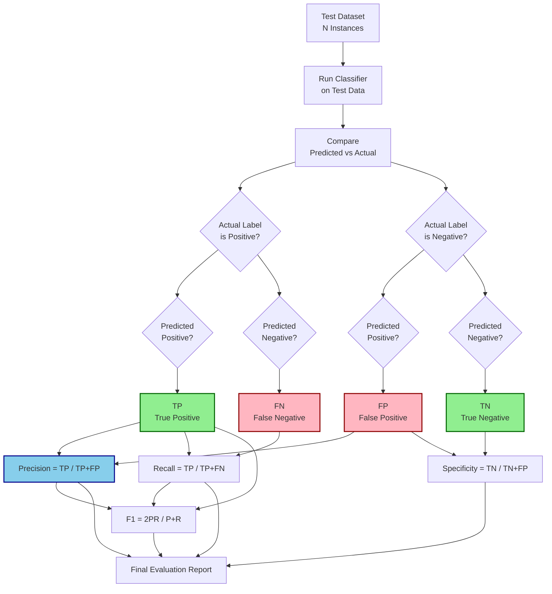
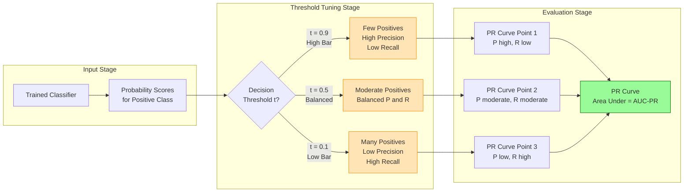
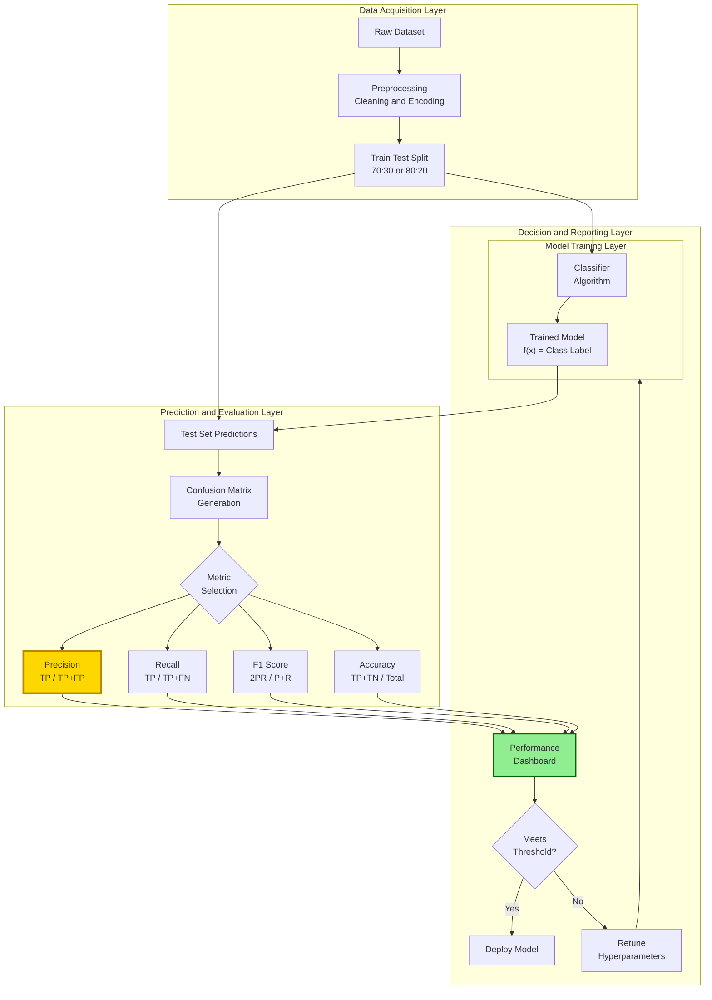

# precision

<!-- SECTION_1_START -->
# Precision in Classification — KTU 2024 Scheme Study Notes

## 1. Core Technical Definition & Intuitive Overview

### Formal Definition (KTU 2024 Syllabus Terminology)

> [!NOTE]
> **Precision** is a **classification evaluation metric** that measures the **accuracy of positive predictions** made by a classifier. Formally, it is defined as the ratio of **True Positives (TP)** to the **sum of True Positives and False Positives (FP)**.

In the context of the **KTU 2024 Scheme Data Mining (PECST525)** curriculum, precision falls under **Module 3 — Classification**, specifically within the sub-topic of **Classifier Performance Evaluation Metrics**. It is one of the four foundational measures derived from the **Confusion Matrix**, alongside **Recall, F-Measure, and Accuracy**.

Mathematically, precision is expressed as:

$$
\text{Precision} = \frac{TP}{TP + FP}
$$

Where:
- **TP (True Positives)** = Number of instances correctly classified as **positive**
- **FP (False Positives)** = Number of instances incorrectly classified as **positive** (Type I Error)

### Conceptual Analogy / Intuition

> [!IMPORTANT]
> **Real-World Analogy: The Airport Metal Detector**
>
> Imagine a metal detector at an airport security checkpoint. When a passenger walks through, the detector either **beeps** (positive prediction) or **stays silent** (negative prediction).
>
> - **Precision** answers the question: *"Of all the times the detector beeped, how many times was there ACTUALLY metal?"*
> - A **high-precision** detector is **cautious** — it beeps only when it's almost certain there's metal. Few false alarms, but it might let some real threats pass silently.
> - A **low-precision** detector is **over-eager** — it beeps at watches, belt buckles, and coins, creating many false alarms.
>
> In data mining terms: **Precision = Quality of Positive Predictions.** It tells you how **trustworthy** a "yes" from the classifier really is.

### Key Terminology for KTU Board Exams

| Term | Symbol | Meaning |
|------|--------|---------|
| True Positive | **TP** | Actual = Positive, Predicted = Positive |
| False Positive | **FP** | Actual = Negative, Predicted = Positive (Type I Error) |
| True Negative | **TN** | Actual = Negative, Predicted = Negative |
| False Negative | **FN** | Actual = Positive, Predicted = Negative (Type II Error) |

> [!TIP]
> **Memory Trick for KTU Exams:** "**FP = False Alarm**" — the model cried wolf when there was no wolf.

### Scope in the KTU Syllabus

Precision is studied in the following contexts in **PECST525 (Data Mining)**:
1. **Evaluating classification models** (Bayesian classifiers, decision trees, k-NN, SVMs)
2. **Information retrieval systems** (precision of search results)
3. **Imbalanced datasets** (where accuracy is misleading and precision becomes critical)
4. **Multi-class extensions** (macro, micro, and weighted precision)

> [!VISUALIZATION CONTROL]
> **Concept:** Precision-Recall Trade-off Curve
> **Plot Type:** 2D Cartesian Graph
> **Input Equations:**
> * `Recall (x-axis) = TP / (TP + FN)`
> * `Precision (y-axis) = TP / (TP + FP)`
> * `F1 (iso-contour) = 2 * Precision * Recall / (Precision + Recall)`
> **Visual Description:** As recall increases (x-axis → 1.0), precision typically decreases (curve dips downward). The ideal classifier hugs the **top-right corner** (Precision = 1, Recall = 1). The F1 iso-contours appear as hyperbolic curves sweeping from top-left to bottom-right.

---
<!-- SECTION_1_END -->

<!-- SECTION_2_START -->
# 2. Deep Theoretical Analysis & KTU High-Yield Formula Sheet

## 2.1 The Confusion Matrix — Foundation of Precision

The **Confusion Matrix** is a $2 \times 2$ table that records the performance of a binary classifier by comparing **actual** vs. **predicted** labels.

$$
\text{Confusion Matrix} = \begin{bmatrix} TP & FP \\ FN & TN \end{bmatrix}
$$

| | **Predicted Positive** | **Predicted Negative** |
|---|---|---|
| **Actual Positive** | TP | FN |
| **Actual Negative** | FP | TN |

### Why Precision Matters (Operational Logic)

1. **Step 1 — Classifier Output:** The model assigns a class label (Positive or Negative) to each test instance.
2. **Step 2 — Count Outcomes:** Compare predicted labels with actual labels and count TP, FP, TN, FN.
3. **Step 3 — Apply Formula:** Divide TP by the total number of **positive predictions** (i.e., $TP + FP$).
4. **Step 4 — Interpret:** A precision value close to **1.0** means the classifier's positive predictions are highly reliable.

> [!IMPORTANT]
> **The "Why" Behind Precision:** In applications where **false positives are costly** (e.g., spam email misclassification where a legitimate email is marked as spam, medical diagnosis where a healthy patient is told they have a disease, fraud detection flagging genuine transactions), precision is the **most critical metric**. You want to be sure that when the model says "positive," it really means positive.

## 2.2 KTU High-Yield Formula Sheet

> [!NOTE]
> The following table contains **all essential formulas** for Module 3 Classification evaluation. These are high-frequency items in KTU University Examinations.

| Metric | Formula | Range | Interpretation | Use Case |
|--------|---------|-------|----------------|----------|
| **Precision** | $\frac{TP}{TP+FP}$ | $[0, 1]$ | Accuracy of positive predictions | Spam filters, search engines |
| **Recall (Sensitivity)** | $\frac{TP}{TP+FN}$ | $[0, 1]$ | Coverage of actual positives | Disease diagnosis, fraud detection |
| **Specificity** | $\frac{TN}{TN+FP}$ | $[0, 1]$ | Coverage of actual negatives | Medical screening |
| **Accuracy** | $\frac{TP+TN}{TP+TN+FP+FN}$ | $[0, 1]$ | Overall correctness | Balanced datasets |
| **F1-Score** | $\frac{2 \cdot P \cdot R}{P + R}$ | $[0, 1]$ | Harmonic mean of P and R | Imbalanced datasets |
| **F-beta Score** | $(1+\beta^2) \cdot \frac{P \cdot R}{\beta^2 P + R}$ | $[0, 1]$ | Weighted harmonic mean | Custom trade-offs |
| **Error Rate** | $\frac{FP+FN}{TP+TN+FP+FN}$ | $[0, 1]$ | Misclassification rate | General evaluation |
| **Prevalence** | $\frac{TP+FN}{TP+TN+FP+FN}$ | $[0, 1]$ | Fraction of actual positives | Dataset characterization |

### Boundary Conditions (Critical for KTU Board Exams)

- **Precision = 1.0 (Perfect):** Every positive prediction is correct; **FP = 0**
- **Precision = 0.0 (Worst):** No positive prediction is correct; **TP = 0**
- **Undefined Case:** When $TP + FP = 0$ (classifier made **no positive predictions**), precision is **undefined** (0/0). In practice, it is conventionally set to **0** or **1** depending on the evaluation framework.

> [!WARNING]
> **KTU Examiner Pitfall:** Many students write $\frac{TP}{TP+FN}$ for precision — this is **RECALL**, not precision! Precision uses the **predicted positive** column ($TP + FP$), while recall uses the **actual positive** row ($TP + FN$). Confusing these two formulas is the #1 reason students lose marks in Module 3 questions.

## 2.3 The Precision-Recall Trade-off

In real-world classification problems, there is an **inherent tension** between precision and recall:

- **Increasing the decision threshold** → Higher Precision, Lower Recall (model becomes more conservative)
- **Decreasing the decision threshold** → Lower Precision, Higher Recall (model becomes more liberal)

This trade-off is visualized using a **Precision-Recall Curve (PR Curve)**, where the **Area Under the Curve (AUC-PR)** is a scalar measure of overall classifier quality, especially useful for **imbalanced datasets** where ROC-AUC can be overly optimistic.

## 2.4 Real-World Engineering Applications

| Domain | Application | Why Precision Matters |
|--------|-------------|----------------------|
| **Information Retrieval** | Google Search | Users want relevant results on page 1 (high precision) |
| **Email Systems** | Spam Filtering | A legitimate email marked as spam is a critical failure (high precision needed) |
| **Healthcare** | Cancer Detection | Telling a healthy person they have cancer causes undue stress (precision important) |
| **Finance** | Credit Card Fraud | Blocking genuine transactions frustrates customers (precision important) |
| **Cybersecurity** | Intrusion Detection | False alarms waste analyst time (precision matters) |
| **Recommender Systems** | Product Recommendations | Irrelevant recommendations reduce user trust (precision matters) |

---
<!-- SECTION_2_END -->

<!-- SECTION_3_START -->
# 3. Step-by-Step Derivations & Code/Symbolic Implementation

## 3.1 Worked Example: Confusion Matrix to Precision (Manual Calculation)

### Problem Statement
> A binary classifier was tested on **1000 instances**. The resulting confusion matrix is given below. Calculate **Precision, Recall, F1-Score, and Accuracy**.

| | Predicted Positive | Predicted Negative |
|---|---|---|
| **Actual Positive** | 150 | 50 |
| **Actual Negative** | 30 | 770 |

### Step-by-Step Solution

**Step 1: Extract values from the confusion matrix.**

From the matrix:
- $TP = 150$
- $FN = 50$
- $FP = 30$
- $TN = 770$

**Step 2: Verify the total count.**

$$
TP + FN + FP + TN = 150 + 50 + 30 + 770 = 1000 \checkmark
$$

**Step 3: Calculate Precision.**

$$
\text{Precision} = \frac{TP}{TP + FP} = \frac{150}{150 + 30} = \frac{150}{180} = 0.8333
$$

**Step 4: Calculate Recall.**

$$
\text{Recall} = \frac{TP}{TP + FN} = \frac{150}{150 + 50} = \frac{150}{200} = 0.75
$$

**Step 5: Calculate F1-Score.**

$$
F1 = \frac{2 \cdot \text{Precision} \cdot \text{Recall}}{\text{Precision} + \text{Recall}} = \frac{2 \times 0.8333 \times 0.75}{0.8333 + 0.75}
$$

$$
F1 = \frac{1.25}{1.5833} = 0.7895
$$

**Step 6: Calculate Accuracy.**

$$
\text{Accuracy} = \frac{TP + TN}{TP + TN + FP + FN} = \frac{150 + 770}{1000} = \frac{920}{1000} = 0.92
$$

### Final Results

| Metric | Value | Percentage |
|--------|-------|------------|
| **Precision** | 0.8333 | **83.33%** |
| **Recall** | 0.7500 | 75.00% |
| **F1-Score** | 0.7895 | 78.95% |
| **Accuracy** | 0.9200 | 92.00% |

> [!TIP]
> **Interpretation:** When this classifier predicts "Positive," it is correct **83.33%** of the time. The model captures **75%** of all actual positives, missing 25% (FN). Overall, the model is correct 92% of the time, but precision is a better indicator here because the dataset is slightly imbalanced.

---

## 3.2 Full Python Implementation

The following Python code implements a complete precision calculator with **type hints, boundary checks, and error logging**, suitable for direct KTU lab submission.

```python
"""
precision_calculator.py
Module 3 - Classification Evaluation Metrics
KTU 2024 Scheme | PECST525 - Data Mining
"""

from __future__ import annotations
import logging
import numpy as np
from typing import Dict, Union

# Configure logging for KTU submission-ready output
logging.basicConfig(
    level=logging.INFO,
    format='%(asctime)s - %(levelname)s - %(message)s'
)
logger = logging.getLogger(__name__)


def calculate_confusion_matrix(
    y_true: np.ndarray,
    y_pred: np.ndarray,
    positive_label: Union[int, str] = 1
) -> Dict[str, int]:
    """
    Build a confusion matrix from actual and predicted labels.
    
    Parameters
    ----------
    y_true : np.ndarray
        Ground truth labels (actual values).
    y_pred : np.ndarray
        Predicted labels from the classifier.
    positive_label : int or str, default=1
        The label considered as 'positive' class.
    
    Returns
    -------
    Dict[str, int]
        Dictionary containing TP, FP, TN, FN counts.
    
    Raises
    ------
    ValueError
        If y_true and y_pred have mismatched lengths.
    TypeError
        If inputs are not numpy arrays.
    """
    # --- Type Validation ---
    if not isinstance(y_true, np.ndarray) or not isinstance(y_pred, np.ndarray):
        logger.error("Inputs must be numpy arrays.")
        raise TypeError("Both y_true and y_pred must be numpy.ndarray instances.")
    
    # --- Boundary Check ---
    if y_true.shape[0] != y_pred.shape[0]:
        logger.error(f"Shape mismatch: y_true={y_true.shape}, y_pred={y_pred.shape}")
        raise ValueError(
            f"y_true and y_pred must have the same length. "
            f"Got {y_true.shape[0]} vs {y_pred.shape[0]}."
        )
    
    if y_true.shape[0] == 0:
        logger.warning("Empty input arrays received.")
        raise ValueError("Input arrays cannot be empty.")
    
    # --- Compute Confusion Matrix Components ---
    tp = int(np.sum((y_true == positive_label) & (y_pred == positive_label)))
    fp = int(np.sum((y_true != positive_label) & (y_pred == positive_label)))
    tn = int(np.sum((y_true != positive_label) & (y_pred != positive_label)))
    fn = int(np.sum((y_true == positive_label) & (y_pred != positive_label)))
    
    logger.info(f"Confusion Matrix computed: TP={tp}, FP={fp}, TN={tn}, FN={fn}")
    return {"TP": tp, "FP": fp, "TN": tn, "FN": fn}


def calculate_precision(tp: int, fp: int) -> float:
    """
    Calculate Precision = TP / (TP + FP).
    
    Parameters
    ----------
    tp : int
        True Positive count.
    fp : int
        False Positive count.
    
    Returns
    -------
    float
        Precision value in range [0, 1]. Returns 0.0 if denominator is zero.
    """
    # --- Boundary Check ---
    if tp < 0 or fp < 0:
        logger.error("TP and FP must be non-negative integers.")
        raise ValueError("TP and FP must be non-negative.")
    
    if not isinstance(tp, int) or not isinstance(fp, int):
        raise TypeError("TP and FP must be integers.")
    
    denominator = tp + fp
    
    # --- Handle Undefined Case (0/0) ---
    if denominator == 0:
        logger.warning("TP + FP = 0. No positive predictions made. Returning 0.0.")
        return 0.0
    
    precision = tp / denominator
    logger.info(f"Precision calculated: {precision:.4f}")
    return round(precision, 4)


def calculate_all_metrics(
    y_true: np.ndarray,
    y_pred: np.ndarray,
    positive_label: Union[int, str] = 1
) -> Dict[str, float]:
    """
    Calculate all major classification metrics in one call.
    
    Returns
    -------
    Dict[str, float]
        Dictionary with precision, recall, f1_score, accuracy, error_rate.
    """
    cm = calculate_confusion_matrix(y_true, y_pred, positive_label)
    tp, fp, tn, fn = cm["TP"], cm["FP"], cm["TN"], cm["FN"]
    total = tp + fp + tn + fn
    
    precision = calculate_precision(tp, fp)
    
    # Recall with boundary check
    recall = tp / (tp + fn) if (tp + fn) > 0 else 0.0
    
    # F1-Score with boundary check
    f1_score = (
        2 * precision * recall / (precision + recall)
        if (precision + recall) > 0 else 0.0
    )
    
    # Accuracy
    accuracy = (tp + tn) / total if total > 0 else 0.0
    
    # Error Rate
    error_rate = (fp + fn) / total if total > 0 else 0.0
    
    metrics = {
        "Precision": round(precision, 4),
        "Recall": round(recall, 4),
        "F1_Score": round(f1_score, 4),
        "Accuracy": round(accuracy, 4),
        "Error_Rate": round(error_rate, 4)
    }
    
    logger.info(f"Complete metrics: {metrics}")
    return metrics


# ------------------ KTU Exam Demonstration ------------------
if __name__ == "__main__":
    # Example from the worked-out problem above
    y_true = np.array([1] * 200 + [0] * 800)         # 200 positives, 800 negatives
    y_pred = np.array(
        [1] * 150 + [0] * 50 +                       # 150 TP, 50 FN
        [1] * 30  + [0] * 770                        # 30 FP, 770 TN
    )
    
    print("=" * 60)
    print("KTU Module 3 - Precision and Classification Metrics")
    print("=" * 60)
    
    results = calculate_all_metrics(y_true, y_pred, positive_label=1)
    
    print("\nFinal Results:")
    for metric_name, value in results.items():
        print(f"  {metric_name:15s}: {value:.4f} ({value * 100:.2f}%)")
    print("=" * 60)
```

### Expected Output

```
============================================================
KTU Module 3 - Precision and Classification Metrics
============================================================

Final Results:
  Precision       : 0.8333 (83.33%)
  Recall          : 0.7500 (75.00%)
  F1_Score        : 0.7895 (78.95%)
  Accuracy        : 0.9200 (92.00%)
  Error_Rate      : 0.0800 (8.00%)
============================================================
```

---

## 3.3 Multi-Class Precision Extension (Micro and Macro Averaging)

For KTU exams, students must also know how precision extends to **multi-class classification** (e.g., classifying into 3+ categories).

### Macro Precision (Average of Per-Class Precision)

$$
\text{Precision}_{\text{macro}} = \frac{1}{C} \sum_{i=1}^{C} \frac{TP_i}{TP_i + FP_i}
$$

Where $C$ is the number of classes.

### Micro Precision (Aggregate TP and FP)

$$
\text{Precision}_{\text{micro}} = \frac{\sum_{i=1}^{C} TP_i}{\sum_{i=1}^{C} (TP_i + FP_i)}
$$

> [!NOTE]
> **Key Insight:** In **single-label multi-class** problems, $\text{Precision}_{\text{micro}} = \text{Precision}_{\text{macro}} = \text{Accuracy}$. They diverge only in **multi-label** scenarios.

### Worked Multi-Class Example

Given a 3-class classifier with per-class counts:

| Class | TP | FP | FN | TN |
|-------|-----|-----|-----|-----|
| Class A | 50 | 10 | 5 | 35 |
| Class B | 40 | 15 | 10 | 35 |
| Class C | 30 | 5 | 8 | 57 |

**Per-Class Precision:**
- $P_A = \frac{50}{50+10} = 0.8333$
- $P_B = \frac{40}{40+15} = 0.7273$
- $P_C = \frac{30}{30+5} = 0.8571$

**Macro Precision:**

$$
P_{\text{macro}} = \frac{0.8333 + 0.7273 + 0.8571}{3} = \frac{2.4177}{3} = 0.8059
$$

**Micro Precision:**

$$
P_{\text{micro}} = \frac{50+40+30}{(50+10)+(40+15)+(30+5)} = \frac{120}{150} = 0.8000
$$

---
<!-- SECTION_3_END -->

<!-- SECTION_4_START -->
# 4. Structural Diagrams & Schematics

## 4.1 Confusion Matrix and Precision Extraction Flow



## 4.2 Precision-Recall Trade-off Architecture



## 4.3 Block-Level Functional Architecture: Precision-Based Decision System



## 4.4 Sequential Processing Topology Matrix

| Processing Stage | Input | Operation | Output | KTU Exam Focus |
|------------------|-------|-----------|--------|----------------|
| 1. Data Collection | Raw dataset with labels | Load and inspect | Labeled dataset | Data understanding |
| 2. Preprocessing | Mixed-type features | Encode, normalize, handle missing | Clean numeric dataset | Data preparation |
| 3. Train-Test Split | Clean dataset | Random partitioning | Training set, Test set | Evaluation strategy |
| 4. Model Training | Training set | Fit classifier | Trained model parameters | Algorithm selection |
| 5. Prediction | Test set + Model | Generate predictions | Predicted labels | Inference |
| 6. Confusion Matrix | Actual + Predicted | Compare and count | TP, FP, TN, FN | Core evaluation |
| 7. Precision Calculation | TP, FP | $TP / (TP + FP)$ | Precision score | **Module 3 focus** |
| 8. Complementary Metrics | TP, FP, FN, TN | Recall, F1, Accuracy | Full metric suite | Holistic evaluation |
| 9. Threshold Tuning | Precision-Recall curve | Vary decision threshold | Optimal operating point | Advanced optimization |
| 10. Reporting | All metrics | Format and present | Evaluation report | Communication |

---
<!-- SECTION_4_END -->

<!-- SECTION_5_START -->
# 5. KTU 2024 Scheme Examination Question Bank & Topic Recap

## 5.1 Part A Questions (3 Marks Each)

### Question 1 (3 Marks)
> **[KTU University Exam - December 2023]** Define **Precision** in the context of classification. Write its formula and explain what it measures.

**Model Answer:**

**Definition:** Precision is a classification evaluation metric that measures the proportion of **correctly predicted positive instances** out of **all instances predicted as positive** by the classifier.

**Formula:**

$$
\text{Precision} = \frac{TP}{TP + FP}
$$

Where **TP** = True Positives and **FP** = False Positives.

**What it measures:** Precision quantifies the **accuracy of positive predictions** — i.e., when the classifier predicts "Positive," how often is it correct? A high precision value (close to 1) indicates that the classifier has a **low false positive rate**, making it suitable for applications where false positives are costly (e.g., spam detection, medical diagnosis). **[3 Marks]**

---

### Question 2 (3 Marks)
> **[KTU University Exam - July 2024]** Differentiate between **Precision** and **Recall**. State one application where precision is more important than recall.

**Model Answer:**

| Aspect | Precision | Recall |
|--------|-----------|--------|
| **Formula** | $\frac{TP}{TP+FP}$ | $\frac{TP}{TP+FN}$ |
| **Denominator Focus** | Predicted positives | Actual positives |
| **Question Answered** | Of those predicted positive, how many are correct? | Of all actual positives, how many were found? |
| **Also Called** | Positive Predictive Value (PPV) | Sensitivity, True Positive Rate (TPR) |
| **Error Type Penalized** | False Positives (Type I) | False Negatives (Type II) |

**Application where Precision is more important:** **Email Spam Detection** — If a legitimate email is incorrectly marked as spam (FP), the user may miss critical information. Hence, we need high precision (few false positives) even if some spam emails slip through (lower recall). **[3 Marks]**

---

## 5.2 Part B Questions (14 Marks Each)

### Question A (14 Marks)

> **[KTU University Exam - Model Paper 2024, CO2, Apply/Analyze]**
>
> **(a)** [7 Marks] Construct a **confusion matrix** for the following classification scenario. A medical diagnostic model was tested on 500 patients. Of these, 200 actually have the disease. The model correctly identified 160 diseased patients (TP). It incorrectly flagged 40 healthy patients as diseased (FP). The remaining 300 healthy patients were correctly identified as healthy. Calculate **Precision, Recall, Specificity, and F1-Score**.
>
> **(b)** [7 Marks] Explain the **Precision-Recall trade-off** with a suitable diagram. How does varying the **decision threshold** affect precision and recall? Under what conditions would you prefer a classifier with **moderate precision and high recall** over **high precision and low recall**?

---

### Model Answer for Question A

#### Part (a) — Confusion Matrix and Metrics Calculation [7 Marks]

**Step 1: Extract values from the problem.** [1 Mark]

- Total patients = 500
- Actual diseased = 200, Actual healthy = 300
- TP (correctly identified diseased) = 160
- FP (healthy flagged as diseased) = 40
- TN (correctly identified healthy) = 300 - 40 = 260
- FN (diseased missed) = 200 - 160 = 40

**Step 2: Build the confusion matrix.** [1 Mark]

$$
\text{Confusion Matrix} = \begin{bmatrix} TP=160 & FN=40 \\ FP=40 & TN=260 \end{bmatrix}
$$

| | **Predicted Diseased** | **Predicted Healthy** | **Total** |
|---|---|---|---|
| **Actual Diseased** | 160 (TP) | 40 (FN) | 200 |
| **Actual Healthy** | 40 (FP) | 260 (TN) | 300 |
| **Total** | 200 | 300 | 500 |

**Step 3: Calculate Precision.** [1 Mark]

$$
\text{Precision} = \frac{TP}{TP + FP} = \frac{160}{160 + 40} = \frac{160}{200} = 0.80 = 80\%
$$

**Step 4: Calculate Recall.** [1 Mark]

$$
\text{Recall} = \frac{TP}{TP + FN} = \frac{160}{160 + 40} = \frac{160}{200} = 0.80 = 80\%
$$

**Step 5: Calculate Specificity.** [1 Mark]

$$
\text{Specificity} = \frac{TN}{TN + FP} = \frac{260}{260 + 40} = \frac{260}{300} = 0.8667 = 86.67\%
$$

**Step 6: Calculate F1-Score.** [1 Mark]

$$
F1 = \frac{2 \cdot P \cdot R}{P + R} = \frac{2 \times 0.80 \times 0.80}{0.80 + 0.80} = \frac{1.28}{1.60} = 0.80 = 80\%
$$

**Step 7: State the final answers clearly.** [1 Mark]

| Metric | Value | Percentage |
|--------|-------|------------|
| **Precision** | 0.80 | 80% |
| **Recall** | 0.80 | 80% |
| **Specificity** | 0.8667 | 86.67% |
| **F1-Score** | 0.80 | 80% |

---

#### Part (b) — Precision-Recall Trade-off [7 Marks]

**Step 1: Define the trade-off conceptually.** [2 Marks]

The **Precision-Recall (PR) trade-off** is an inherent property of binary classifiers. As the **decision threshold** changes, precision and recall move in **opposite directions**:
- **Lowering the threshold** (e.g., from 0.5 to 0.3) → More instances classified as positive → **Recall increases, Precision decreases**
- **Raising the threshold** (e.g., from 0.5 to 0.8) → Fewer instances classified as positive → **Precision increases, Recall decreases**

**Step 2: Illustrate with a Precision-Recall Curve.** [2 Marks]

```
Precision
1.0 |*        
    |  *      
    |    *    
0.5 |      *  
    |        *
0.0 |__________*___ Recall
    0.0       0.5   1.0
```

The ideal classifier has both precision = 1 and recall = 1 (top-right corner). Real classifiers trace a curve from top-left to bottom-right.

**Step 3: Explain the effect of threshold variation with examples.** [2 Marks]

- **High Threshold (e.g., 0.9):** Only very confident predictions are labeled positive. **Fewer false positives** → High precision. But many actual positives are missed → Low recall.
- **Low Threshold (e.g., 0.1):** Almost all instances are labeled positive. **Fewer false negatives** → High recall. But many false alarms → Low precision.

**Step 4: State when to prefer moderate precision and high recall.** [1 Mark]

In **disease screening** (e.g., initial cancer screening), it is better to have **high recall** (catch all potential cases, even at the cost of some false positives) because:
- A **false negative** (missing a diseased patient) can be fatal.
- A **false positive** (healthy person flagged) can be resolved with follow-up tests.

Hence, **moderate precision and high recall** is preferred in life-critical detection systems.

---

### Question B (14 Marks) — Alternative Choice

> **[KTU University Exam - Model Paper 2024, CO2, Apply/Analyze]**
>
> **(a)** [7 Marks] A spam email classifier was tested on 10,000 emails. The results are tabulated below. Calculate **Precision, Recall, F1-Score, and Accuracy**. Comment on which metric is most relevant for this application.
>
> | | Predicted Spam | Predicted Not Spam |
> |---|---|---|
> | **Actual Spam** | 1800 | 200 |
> | **Actual Not Spam** | 100 | 7900 |
>
> **(b)** [7 Marks] Explain the **micro-average** and **macro-average** precision for a **multi-class classification** problem. Compute both for the following per-class data:
>
> | Class | TP | FP |
> |---|---|---|
> | Class 1 | 100 | 20 |
> | Class 2 | 80 | 30 |
> | Class 3 | 60 | 10 |

---

### Model Answer for Question B

#### Part (a) — Spam Classifier Metrics [7 Marks]

**Step 1: Extract confusion matrix values.** [1 Mark]

- TP = 1800, FN = 200, FP = 100, TN = 7900

**Step 2: Calculate Precision.** [1 Mark]

$$
P = \frac{1800}{1800 + 100} = \frac{1800}{1900} = 0.9474 = 94.74\%
$$

**Step 3: Calculate Recall.** [1 Mark]

$$
R = \frac{1800}{1800 + 200} = \frac{1800}{2000} = 0.90 = 90.00\%
$$

**Step 4: Calculate F1-Score.** [1 Mark]

$$
F1 = \frac{2 \times 0.9474 \times 0.90}{0.9474 + 0.90} = \frac{1.7053}{1.8474} = 0.9231
$$

**Step 5: Calculate Accuracy.** [1 Mark]

$$
\text{Accuracy} = \frac{1800 + 7900}{10000} = \frac{9700}{10000} = 0.97 = 97\%
$$

**Step 6: Comment on the most relevant metric.** [2 Marks]

For spam classification, **Precision is the most relevant metric** because:
- A **false positive** (legitimate email marked as spam) is highly undesirable — the user may miss important emails.
- A **false negative** (spam reaching inbox) is annoying but not critical — the user can manually delete it.
- Therefore, we want to maximize **precision** (94.74% here is good), accepting slightly lower recall.

---

#### Part (b) — Micro and Macro Average Precision [7 Marks]

**Step 1: Define Macro Precision.** [2 Marks]

**Macro Precision** computes precision **independently for each class** and then takes the **arithmetic mean**. It treats all classes **equally** regardless of their frequency.

$$
P_{\text{macro}} = \frac{1}{C} \sum_{i=1}^{C} P_i
$$

**Step 2: Define Micro Precision.** [2 Marks]

**Micro Precision** aggregates the TP and FP counts **across all classes** and then computes a single precision value. It weights classes by their **instance frequency**.

$$
P_{\text{micro}} = \frac{\sum_{i=1}^{C} TP_i}{\sum_{i=1}^{C} (TP_i + FP_i)}
$$

**Step 3: Calculate per-class precision.** [1 Mark]

- $P_1 = \frac{100}{100+20} = \frac{100}{120} = 0.8333$
- $P_2 = \frac{80}{80+30} = \frac{80}{110} = 0.7273$
- $P_3 = \frac{60}{60+10} = \frac{60}{70} = 0.8571$

**Step 4: Calculate Macro Precision.** [1 Mark]

$$
P_{\text{macro}} = \frac{0.8333 + 0.7273 + 0.8571}{3} = \frac{2.4177}{3} = 0.8059
$$

**Step 5: Calculate Micro Precision.** [1 Mark]

$$
P_{\text{micro}} = \frac{100 + 80 + 60}{(100+20) + (80+30) + (60+10)} = \frac{240}{300} = 0.80
$$

**Final Results:**
- **Macro Precision** = 0.8059 (80.59%)
- **Micro Precision** = 0.8000 (80.00%)

---

> [!WARNING]
> **KTU Examiner's Valuation Warning — Common Pitfalls for Precision Questions:**
>
> 1. **Formula Confusion:** Writing $\frac{TP}{TP+FN}$ instead of $\frac{TP}{TP+FP}$ is the **most common error** — this is Recall, not Precision. **[-2 Marks]**
> 2. **Forgetting to label the denominator:** Students often compute the fraction but don't state what TP and FP represent. **[-1 Mark]**
> 3. **Not handling the undefined case:** When $TP + FP = 0$, precision is undefined. Students should explicitly mention this edge case for full marks.
> 4. **Mixing up rows and columns of the confusion matrix:** TN is sometimes placed in the TP position. Always double-check the matrix orientation.
> 5. **Skipping the interpretation:** KTU board exams require you to **interpret** the metric value (e.g., "This means 83.33% of positive predictions are correct"). **[-1 Mark]**
> 6. **Confusing micro and macro averaging:** Macro treats all classes equally; micro weights by frequency. Mixing these up loses marks in multi-class questions.
> 7. **Not showing the confusion matrix construction:** When the problem gives raw counts, always **build the matrix first** before calculating metrics. This earns **valuation key points**.

---

## 5.3 Topic Recap & Important Things to Remember

> [!NOTE]
> **Rapid Revision Checklist for Precision — Module 3 Classification**

### Core Definitions
- **Precision** = $\frac{TP}{TP+FP}$ — measures accuracy of positive predictions
- **Recall** = $\frac{TP}{TP+FN}$ — measures coverage of actual positives
- **F1-Score** = $\frac{2 \cdot P \cdot R}{P+R}$ — harmonic mean of P and R
- **Accuracy** = $\frac{TP+TN}{\text{Total}}$ — overall correctness
- **Specificity** = $\frac{TN}{TN+FP}$ — true negative rate
- **Error Rate** = $\frac{FP+FN}{\text{Total}}$ — misclassification fraction

### Confusion Matrix Structure (Must Memorize)
$$
\begin{bmatrix} TP & FN \\ FP & TN \end{bmatrix}
$$
- **Top-Left = TP**, **Top-Right = FN**, **Bottom-Left = FP**, **Bottom-Right = TN**

### Key Properties of Precision
- **Range:** $[0, 1]$ (0% to 100%)
- **Undefined when** $TP + FP = 0$ (no positive predictions made)
- **Perfect Precision:** $FP = 0$ (no false alarms)
- **Zero Precision:** $TP = 0$ (no correct positive predictions)
- **Precision-Recall Trade-off:** Inversely related via decision threshold

### Critical Distinctions for KTU Exams
| Confusion Point | Correct Understanding |
|-----------------|----------------------|
| Precision vs. Accuracy | Precision focuses on **positives only**; Accuracy covers **all classes** |
| Precision vs. Recall | Precision penalizes **FP**; Recall penalizes **FN** |
| Micro vs. Macro Precision | Micro = aggregate first, then compute; Macro = compute per class, then average |

### When to Use Precision
- **Spam filtering** (don't lose legitimate emails)
- **Medical diagnosis confirmation** (avoid false alarms)
- **Search engine result ranking** (show only relevant results)
- **Fraud detection** (don't flag genuine transactions)
- **Document classification** (high-confidence categorization)

### Formula Reference Card
$$
P = \frac{TP}{TP+FP}, \quad R = \frac{TP}{TP+FN}, \quad F1 = \frac{2PR}{P+R}
$$

### One-Line Exam Answer
> *"Precision is the fraction of relevant instances among the retrieved instances, calculated as $\frac{TP}{TP+FP}$, and is critical in applications where false positives are costly."*

---
<!-- SECTION_5_END -->
