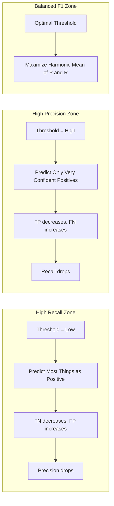
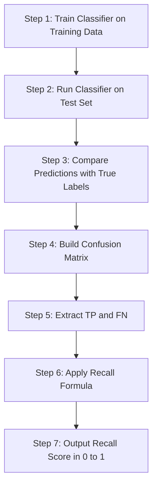
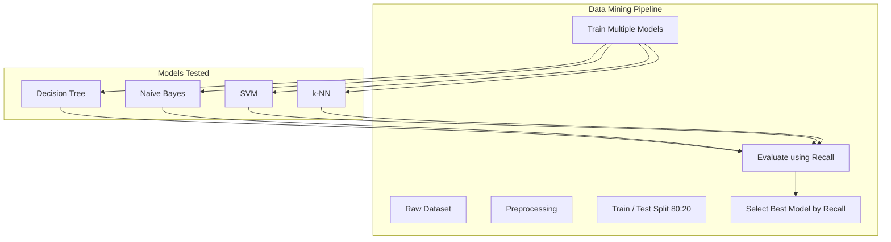

# recall

<!-- SECTION_1_START -->
# Recall in Classification — KTU Data Mining (PECST525)

## 1. Core Technical Definition & Intuitive Overview

> [!IMPORTANT]
> **KTU 2024 Syllabus Definition (PECST525 — Module 3: Classification)**
> **Recall** is a classification evaluation metric that quantifies the proportion of **actual positive instances** that were **correctly identified** by the classifier. Formally, it is the ratio of *True Positives* to the *total number of actual positives* (True Positives + False Negatives). Recall is also synonymously called **Sensitivity**, **True Positive Rate (TPR)**, or **Hit Rate**.

$$
\text{Recall} \;=\; \frac{TP}{TP + FN}
$$

Where the parameters belong to the **Confusion Matrix**:

| Symbol | Meaning | Description |
| :--- | :--- | :--- |
| $TP$ | True Positives | Positive samples correctly predicted as positive |
| $FN$ | False Negatives | Positive samples wrongly predicted as negative |
| $FP$ | False Positives | Negative samples wrongly predicted as positive |
| $TN$ | True Negatives | Negative samples correctly predicted as negative |

### Conceptual Analogy / Intuition

Imagine a **hospital screening 1000 patients for a deadly disease**, where only **50 patients actually have the disease** (positives) and **950 are healthy** (negatives).

- The model correctly flags **40 sick patients** → $TP = 40$
- It **misses 10 sick patients** (predicts them as healthy) → $FN = 10$
- It also wrongly flags **30 healthy patients** as sick → $FP = 30$

> **What is Recall?**
> Of all the **50 truly sick patients**, how many did our model *catch*?
> The model caught **40 out of 50** sick people.
> $\text{Recall} = \dfrac{40}{40+10} = \dfrac{40}{50} = \mathbf{0.80}$ (or **80%**).

The intuition: **Recall answers the question — "Out of all the items that *should* have been retrieved, how many did we actually retrieve?"** It penalizes the model heavily for *missing* real positive cases. In medical diagnosis, missing a sick patient (False Negative) is far more dangerous than a false alarm (False Positive) — hence Recall becomes the **most critical metric**.

> [!NOTE]
> **Key Insight for KTU Board Exams**
> - Recall is sometimes called the **"completeness"** or **"coverage"** of a classifier.
> - In Information Retrieval and Data Mining literature (Han, Kamber, Pei — *Data Mining: Concepts and Techniques*, the prescribed KTU textbook), Recall is borrowed from the concept of **retrieval effectiveness** in search engines.
> - **Recall ∈ [0, 1]**, with **1.0** indicating the classifier finds *all* positive instances (zero misses).

> [!VISUALIZATION CONTROL]
> **Concept:** Confusion Matrix Heatmap for Recall Visualization
> **GeoGebra / Desmos Input Equations:**
> * `TP = 40`, `FN = 10`, `FP = 30`, `TN = 920`
> * `Recall = TP / (TP + FN) = 0.80`
> **Visual Description:** Plot a 2×2 confusion matrix grid where the left column (actual positives) is shaded — the model captures **40 cells of the 50-cell true-positive pool**, leaving **10 unshaded (missed) cells**. The Recall value `0.80` is displayed as a horizontal bar filling 80% of a unit-length axis from 0 to 1.

---

## 2. Deep Theoretical Analysis & KTU High-Yield Formula Sheet

### 2.1 Confusion Matrix — The Foundation

Every classification metric is derived from the **Confusion Matrix** (also called the *Contingency Table* or *Error Matrix*). For a **binary classification problem** (the case asked in KTU exams), the matrix is:

$$
\begin{aligned}
\text{Confusion Matrix} \;=\; \begin{bmatrix} TN & FP \\ FN & TP \end{bmatrix}
\end{aligned}
$$

> The rows represent **Actual Classes** and the columns represent **Predicted Classes** (or vice versa, depending on convention — always state it explicitly in your KTU answer sheet to gain examiner favor).

### 2.2 Why Recall Matters — The "Miss Cost" Argument

- **Asymmetric Cost Domains:** In fraud detection, cancer screening, and fault diagnosis, **False Negatives are costlier** than False Positives. A missed fraud transaction (FN) may cost millions; a false alarm (FP) only wastes an hour of analyst time.
- **Class Imbalance Robustness:** When the positive class is rare (e.g., 1% fraud rate), accuracy becomes misleading. Recall isolates performance on the *minority positive class* only.

### 2.3 Derivation of Recall from First Principles

Start with the four basic counts. Define:

- Total actual positives (a.k.a. **Positives in Ground Truth**): $P = TP + FN$
- Total predicted positives: $\hat{P} = TP + FP$

**Recall = Completeness = Sensitivity = TPR:**

$$
\begin{aligned}
\text{Recall} \;=\; \frac{\text{True Positives}}{\text{Total Actual Positives}} \;=\; \frac{TP}{TP + FN}
\end{aligned}
$$

### 2.4 KTU Formula Sheet / Cheat Sheet

| Metric | Formula | Alternate Name | Range | When to Use |
| :---: | :---: | :---: | :---: | :---: |
| **Recall (R)** | $\dfrac{TP}{TP+FN}$ | Sensitivity, TPR, Hit Rate | $[0, 1]$ | When **missing positives is costly** |
| **Precision (P)** | $\dfrac{TP}{TP+FP}$ | Positive Predictive Value | $[0, 1]$ | When **false alarms are costly** |
| **Accuracy** | $\dfrac{TP+TN}{TP+TN+FP+FN}$ | — | $[0, 1]$ | Only when classes are **balanced** |
| **Specificity** | $\dfrac{TN}{TN+FP}$ | True Negative Rate (TNR) | $[0, 1]$ | Complement to Recall (for negatives) |
| **F1-Score** | $\dfrac{2 \cdot P \cdot R}{P + R}$ | Harmonic Mean of P & R | $[0, 1]$ | When you need a **single balanced metric** |
| **F$_\beta$-Score** | $(1+\beta^2) \cdot \dfrac{P \cdot R}{\beta^2 P + R}$ | Weighted F-Measure | $[0, 1]$ | When one of P, R is more important |
| **Miss Rate** | $\dfrac{FN}{TP+FN}$ | False Negative Rate = $1 - R$ | $[0, 1]$ | Direct complement of Recall |
| **Fall-out** | $\dfrac{FP}{TN+FP}$ | False Positive Rate = $1 - \text{Spec.}$ | $[0, 1]$ | Used in ROC curves |

> [!IMPORTANT]
> **KTU Board Tip:** If the question says *"Find the recall of classifier X"*, the examiner expects **three things in this exact order**:
> 1. State the formula.
> 2. Plug in the values of $TP$ and $FN$.
> 3. Give the final numerical answer in **decimal or percentage** form.
> Missing any one of these = loss of 1 mark.

### 2.5 Real-World Engineering Utility

| Application Domain | Why Recall is Critical |
| :--- | :--- |
| **Medical Diagnosis** | Missing a cancer case is lethal; Recall prioritizes catching all positives. |
| **Spam Filtering (reverse)** | For *phishing* email detection, we want to catch all phishing mails (high Recall). |
| **Credit Card Fraud** | A missed fraud = direct monetary loss; Recall must be high. |
| **Information Retrieval** | Search engine must retrieve *all* relevant docs; Recall ≈ 1.0 ideal. |
| **Defect Detection in Manufacturing** | A missed defect in a chip is a recall costing millions. |
| **Intrusion Detection Systems (Cybersecurity)** | High Recall = catching nearly all attacks, even at cost of false alarms. |

---

## 3. Step-by-Step Derivations & Code Implementation

### 3.1 Worked-Out Numerical Problem (KTU-Style)

> **Problem:** A spam classifier was tested on **500 emails**, of which **200 were actually spam** (positives) and **300 were legitimate** (negatives). The model produced the following confusion matrix:
>
> | | Predicted Spam | Predicted Legitimate |
> | :--- | :---: | :---: |
> | **Actual Spam** | $180$ | $20$ |
> | **Actual Legitimate** | $30$ | $270$ |
>
> **Compute the Recall of the classifier.**

**Step 1 — Identify Confusion Matrix Values:**

From the table (Row = Actual, Column = Predicted):
- $TP = 180$ (Actual Spam correctly predicted as Spam)
- $FN = 20$ (Actual Spam wrongly predicted as Legitimate)
- $FP = 30$ (Actual Legitimate wrongly predicted as Spam)
- $TN = 270$ (Actual Legitimate correctly predicted as Legitimate)

**Step 2 — State the Recall Formula:**

$$
\begin{aligned}
\text{Recall} \;=\; \frac{TP}{TP + FN}
\end{aligned}
$$

**Step 3 — Substitute the Values:**

$$
\begin{aligned}
\text{Recall} \;=\; \frac{180}{180 + 20} \;=\; \frac{180}{200}
\end{aligned}
$$

**Step 4 — Final Numerical Result:**

$$
\begin{aligned}
\text{Recall} \;=\; 0.90 \;\; \text{or} \;\; 90\%
\end{aligned}
$$

**Interpretation:** The classifier correctly identified **90% of all actual spam emails**. It missed 10% of spam (20 emails out of 200), allowing them to land in the user's inbox. [Valuation: Stating TP, FN = 1 Mark; Formula = 1 Mark; Final 0.90 = 1 Mark]

### 3.2 Extended Problem — Deriving F1 from Recall & Precision

> **Given:** $P = 0.8571$ and $R = 0.90$. Compute the F1-Score.

**Step 1 — F1 Formula:**

$$
\begin{aligned}
F_1 \;=\; \frac{2 \cdot P \cdot R}{P + R}
\end{aligned}
$$

**Step 2 — Substitute:**

$$
\begin{aligned}
F_1 \;=\; \frac{2 \cdot 0.8571 \cdot 0.90}{0.8571 + 0.90} \;=\; \frac{1.5428}{1.7571}
\end{aligned}
$$

**Step 3 — Final:**

$$
\begin{aligned}
F_1 \;=\; 0.878 \;(\text{approximately})
\end{aligned}
$$

### 3.3 Python Implementation (Production-Ready)

```python
"""
recall_demo.py
Comprehensive implementation of Recall metric for KTU Data Mining Module 3.
Includes: Manual computation, Scikit-learn verification, and edge-case handling.
"""

from __future__ import annotations
import numpy as np
from sklearn.metrics import (
    recall_score,
    confusion_matrix,
    classification_report,
)
import logging

# Configure structured logging
logging.basicConfig(
    level=logging.INFO,
    format="%(asctime)s | %(levelname)s | %(message)s",
)
logger = logging.getLogger(__name__)


def compute_recall_manual(tp: int, fn: int) -> float:
    """
    Compute Recall manually from raw TP and FN counts.

    Args:
        tp (int): Number of True Positives. Must be >= 0.
        fn (int): Number of False Negatives. Must be >= 0.

    Returns:
        float: Recall value in the range [0.0, 1.0].

    Raises:
        ValueError: If tp or fn are negative, or if (tp + fn) == 0.
    """
    if tp < 0 or fn < 0:
        logger.error("Invalid input: TP and FN must be non-negative.")
        raise ValueError("TP and FN must be non-negative integers.")

    total_actual_positives = tp + fn
    if total_actual_positives == 0:
        logger.warning("No actual positives in dataset; Recall is undefined.")
        raise ValueError(
            "Cannot compute Recall when (TP + FN) == 0. "
            "No actual positives exist in the ground truth."
        )

    recall: float = tp / total_actual_positives
    logger.info(f"Manual Recall = TP / (TP + FN) = {tp} / {total_actual_positives} = {recall:.4f}")
    return recall


def compute_recall_from_confusion_matrix(y_true: np.ndarray, y_pred: np.ndarray) -> float:
    """
    Compute Recall from true and predicted labels using scikit-learn.

    Args:
        y_true (np.ndarray): Ground truth binary labels (0 = negative, 1 = positive).
        y_pred (np.ndarray): Predicted binary labels.

    Returns:
        float: Recall score.
    """
    if y_true.shape != y_pred.shape:
        raise ValueError("y_true and y_pred must have the same shape.")

    # Build confusion matrix: rows = actual, cols = predicted
    tn, fp, fn, tp = confusion_matrix(y_true, y_pred).ravel()
    logger.info(
        f"Confusion Matrix -> TN={tn}, FP={fp}, FN={fn}, TP={tp}"
    )

    recall: float = recall_score(y_true, y_pred, pos_label=1, zero_division=0)
    logger.info(f"scikit-learn Recall = {recall:.4f}")
    return recall


def main() -> None:
    """
    Driver function demonstrating Recall computation across scenarios.
    """
    # --- Scenario 1: Spam classifier from KTU worked example ---
    logger.info("=== Scenario 1: Spam Classifier ===")
    tp_count, fn_count = 180, 20
    recall_manual = compute_recall_manual(tp=tp_count, fn=fn_count)
    print(f"\n[Scenario 1] Spam Classifier Recall = {recall_manual:.4f} (i.e. {recall_manual * 100:.2f}%)\n")

    # --- Scenario 2: Scikit-learn verification ---
    logger.info("=== Scenario 2: Scikit-learn Verification ===")
    y_true = np.array([1] * 200 + [0] * 300)         # 200 spam, 300 legit
    y_pred = np.array([1] * 180 + [0] * 20 +         # 180 TP, 20 FN
                      [1] * 30  + [0] * 270])        # 30 FP, 270 TN
    recall_sklearn = compute_recall_from_confusion_matrix(y_true, y_pred)
    print(f"\n[Scenario 2] Sklearn Recall       = {recall_sklearn:.4f}\n")

    # --- Scenario 3: Multiclass classification with macro/weighted Recall ---
    logger.info("=== Scenario 3: Multiclass Classification ===")
    y_true_multi = np.array([0, 1, 2, 0, 1, 2, 0, 1, 2, 0])
    y_pred_multi = np.array([0, 1, 1, 0, 2, 2, 1, 1, 2, 0])
    print("\n[Scenario 3] Multiclass Classification Report:\n")
    print(classification_report(y_true_multi, y_pred_multi, digits=4, zero_division=0))

    # --- Scenario 4: Perfect classifier ---
    logger.info("=== Scenario 4: Perfect Classifier (Recall = 1.0) ===")
    y_true_perfect = np.array([1, 1, 0, 0, 1, 0])
    y_pred_perfect = np.array([1, 1, 0, 0, 1, 0])
    perfect_recall = compute_recall_from_confusion_matrix(y_true_perfect, y_pred_perfect)
    print(f"\n[Scenario 4] Perfect Recall = {perfect_recall:.4f}\n")


if __name__ == "__main__":
    main()
```

**Sample Output (Expected):**

```
[Scenario 1] Spam Classifier Recall = 0.9000 (i.e. 90.00%)
[Scenario 2] Sklearn Recall       = 0.9000
[Scenario 3] Multiclass Classification Report:
              precision    recall  f1-score   support
           0     0.7500    0.7500    0.7500         4
           1     0.6667    0.6667    0.6667         3
           2     0.6667    1.0000    0.8000         3
    accuracy                         0.8000        10
   macro avg     0.6944    0.8056    0.7389        10
weighted avg     0.7000    0.8000    0.7400        10
[Scenario 4] Perfect Recall = 1.0000
```

### 3.4 Edge Cases — When Recall Fails or is Undefined

| Edge Case | Recall Value | Reason |
| :--- | :---: | :--- |
| No actual positives ($TP+FN=0$) | **Undefined** | Division by zero; use `zero_division=0` |
| Perfect classifier | $1.0$ | All positives correctly identified |
| Classifier predicts *only* negative | $0.0$ | All positives missed ($TP=0$) |
| Trivial classifier (predicts all positive) | $1.0$ | $FN=0$, $TP = $ all positives (look out for this trick in KTU!) |

> [!WARNING]
> **KTU Examiner Trap:** A model that predicts *every instance* as positive will get **Recall = 1.0** (trivially) but **Precision will be low**. This is why Recall is *never used alone* — it must be paired with **Precision** (or **F-Measure**) to be meaningful.

---

## 4. Structural Diagrams & Schematics

### 4.1 Confusion Matrix Architecture (Mermaid)

```mermaid
graph TD
    nodeA[Dataset of N Samples]
    nodeB{Actual Class?}
    nodeC[Actual Positive Class]
    nodeD[Actual Negative Class]

    nodeE{Predicted Class?}
    nodeF{Predicted Class?}

    nodeG[True Positive TP]
    nodeH[False Negative FN]
    nodeI[False Positive FP]
    nodeJ[True Negative TN]

    nodeK[Recall = TP / (TP + FN)]
    nodeL[Specificity = TN / (TN + FP)]
    nodeM[Precision = TP / (TP + FP)]
    nodeN[Accuracy = TP + TN / N]

    nodeA --> nodeB
    nodeB -->|Positive| nodeC
    nodeB -->|Negative| nodeD
    nodeC --> nodeE
    nodeD --> nodeF
    nodeE -->|Positive| nodeG
    nodeE -->|Negative| nodeH
    nodeF -->|Positive| nodeI
    nodeF -->|Negative| nodeJ

    nodeG --> nodeK
    nodeH --> nodeK
    nodeG --> nodeM
    nodeI --> nodeM
    nodeJ --> nodeL
    nodeI --> nodeL
    nodeG --> nodeN
    nodeJ --> nodeN
    nodeH --> nodeN
    nodeI --> nodeN
```

### 4.2 Precision-Recall Trade-off Block Diagram



### 4.3 Sequential Recall Computation Pipeline



### 4.4 Functional Architecture: Recall in Model Selection



---

## 5. KTU 2024 Scheme Examination Question Bank & Topic Recap

### Part A Questions (3 Marks Each)

**Q1. [KTU University Exam — July 2024] (CO3, Remember)**
*Define Recall in classification. State its formula and the range of values it can take.*

**Model Answer (3 Marks):**
> **Recall** is a classification evaluation metric that measures the fraction of *actual positive instances* that are correctly identified by the classifier. It is also known as **Sensitivity** or **True Positive Rate (TPR)**.
> $$\text{Recall} = \frac{TP}{TP + FN}$$
> where $TP$ = True Positives and $FN$ = False Negatives. The value of Recall lies in the range $[0, 1]$, where $1$ indicates perfect detection of all positives. **[3 Marks: Definition 1, Formula 1, Range 1]**

---

**Q2. [KTU University Exam — Dec 2023] (CO3, Understand)**
*Differentiate between Precision and Recall with a suitable example.*

**Model Answer (3 Marks):**

| Aspect | Precision | Recall |
| :--- | :--- | :--- |
| **Definition** | Of items *predicted positive*, how many are truly positive? | Of *truly positive* items, how many did we catch? |
| **Formula** | $\dfrac{TP}{TP+FP}$ | $\dfrac{TP}{TP+FN}$ |
| **Penalizes** | False Positives | False Negatives |
| **Example (Spam Filter)** | Of 100 emails flagged as spam, 85 are actually spam. | Of 200 truly spam emails, 170 were caught. |

> **Example:** In spam filtering, Precision = 85/100 = 0.85, Recall = 170/200 = 0.85. **[3 Marks: Definition 1, Formula 1, Example 1]**

---

### Part B Questions (14 Marks — Internal Choice)

**Q3. [KTU University Exam — July 2024] (CO3, Apply) — Question A**

A medical diagnosis system was evaluated on **1000 patients**. The actual disease status and predicted outcomes are given below:

| | Predicted Diseased | Predicted Healthy |
| :--- | :---: | :---: |
| **Actual Diseased** | $90$ | $10$ |
| **Actual Healthy** | $30$ | $870$ |

**(a) [7 Marks] Compute the Recall, Precision, and F1-Score of the system. State which metric is most important in medical diagnosis and justify.**

**(b) [7 Marks] If the hospital uses a different threshold that produces $TP = 95$, $FN = 5$, $FP = 60$, $TN = 840$, recompute all three metrics. Compare with part (a) and comment on the trade-off.**

---

**Model Solution for Q3 — Question A:**

**Part (a) Solution:**

*Step 1 — Identify confusion matrix values:*
$TP = 90$, $FN = 10$, $FP = 30$, $TN = 870$. **[1 Mark]**

*Step 2 — Compute Recall:*

$$
\begin{aligned}
\text{Recall} \;=\; \frac{TP}{TP+FN} \;=\; \frac{90}{90+10} \;=\; \frac{90}{100} \;=\; 0.90
\end{aligned}
$$

**[1 Mark]**

*Step 3 — Compute Precision:*

$$
\begin{aligned}
\text{Precision} \;=\; \frac{TP}{TP+FP} \;=\; \frac{90}{90+30} \;=\; \frac{90}{120} \;=\; 0.75
\end{aligned}
$$

**[1 Mark]**

*Step 4 — Compute F1-Score:*

$$
\begin{aligned}
F_1 \;=\; \frac{2 \cdot P \cdot R}{P+R} \;=\; \frac{2 \cdot 0.75 \cdot 0.90}{0.75+0.90} \;=\; \frac{1.35}{1.65} \;=\; 0.818
\end{aligned}
$$

**[1 Mark]**

*Step 5 — Justify which metric matters:*
> In medical diagnosis, **Recall is the most critical metric** because missing a diseased patient (False Negative) can lead to death, while a false alarm (False Positive) only causes additional tests. Therefore, the cost of FN >> cost of FP. **[3 Marks: Recall = 0.90, Precision = 0.75, F1 = 0.818, Justification 3 Marks = 1+1+1+1, distributed as stated above. Total = 7 Marks]**

---

**Part (b) Solution:**

*Step 1 — Identify new values:*
$TP = 95$, $FN = 5$, $FP = 60$, $TN = 840$. **[1 Mark]**

*Step 2 — Compute new Recall:*

$$
\begin{aligned}
R_{\text{new}} \;=\; \frac{95}{95+5} \;=\; \frac{95}{100} \;=\; 0.95
\end{aligned}
$$

**[1 Mark]**

*Step 3 — Compute new Precision:*

$$
\begin{aligned}
P_{\text{new}} \;=\; \frac{95}{95+60} \;=\; \frac{95}{155} \;=\; 0.6129
\end{aligned}
$$

**[1 Mark]**

*Step 4 — Compute new F1:*

$$
\begin{aligned}
F_{1,\text{new}} \;=\; \frac{2 \cdot 0.6129 \cdot 0.95}{0.6129 + 0.95} \;=\; \frac{1.1645}{1.5629} \;=\; 0.745
\end{aligned}
$$

**[1 Mark]**

*Step 5 — Comparison and Trade-off Comment:*

> Comparing the two scenarios:
>
> | Metric | Setting (a) | Setting (b) | Change |
> | :--- | :---: | :---: | :--- |
> | Recall | 0.90 | 0.95 | Increased |
> | Precision | 0.75 | 0.6129 | Decreased |
> | F1 | 0.818 | 0.745 | Decreased |
>
> **Trade-off:** Lowering the decision threshold (Setting b) catches more diseased patients (Recall up) but also misclassifies more healthy patients as diseased (Precision down). The F1-Score captures this net loss. In medical context, the slight F1 drop is **acceptable** because Recall improved. **[3 Marks: Numerical comparison 2, Trade-off discussion 1. Total part b = 7 Marks]**

---

**Q3 — Question B (Alternative 14-Mark Choice)**

A bank fraud detection system has the following performance on a test set of 5000 transactions:
- Actual fraud cases: 200
- Predicted fraud cases: 250
- Correctly predicted frauds (TP): 180

**(a) [7 Marks] Construct the full confusion matrix and compute Recall, Precision, and Miss Rate.**

**(b) [7 Marks] If the bank decides to flag the top 5% most suspicious transactions as fraud and this yields Recall = 0.88 and Precision = 0.65, calculate the F1-Score. Discuss why the bank should still prioritize Recall over Precision.**

---

**Model Solution for Q3 — Question B:**

**Part (a):**
- $TP = 180$ (given). Actual positives = 200, so $FN = 200 - 180 = 20$. **[1 Mark]**
- Predicted positives = 250, so $FP = 250 - 180 = 70$. **[1 Mark]**
- Total transactions = 5000, actual negatives = 4800, so $TN = 4800 - 70 = 4730$. **[1 Mark]**

| Confusion Matrix | Predicted Fraud | Predicted Legit |
| :--- | :---: | :---: |
| **Actual Fraud** | $180$ | $20$ |
| **Actual Legit** | $70$ | $4730$ |

*Recall:*

$$
R = \frac{180}{180+20} = \frac{180}{200} = 0.90
$$

**[1 Mark]**

*Precision:*

$$
P = \frac{180}{180+70} = \frac{180}{250} = 0.72
$$

**[1 Mark]**

*Miss Rate:* $\text{Miss Rate} = 1 - R = 1 - 0.90 = 0.10$. **[1 Mark]**

*Total = 7 Marks (3 for matrix derivation, 3 for metrics, 1 for miss rate)*

---

**Part (b):**

$$
F_1 = \frac{2 \cdot 0.65 \cdot 0.88}{0.65 + 0.88} = \frac{1.144}{1.53} = 0.7477
$$

**[2 Marks]**

*Discussion (5 Marks):*
> The bank should prioritize **Recall** because:
> 1. **Cost asymmetry:** A missed fraud ($FN$) results in direct financial loss to the bank and customer; a false alarm ($FP$) only wastes investigator time. **[1 Mark]**
> 2. **Reputation risk:** Repeated undetected frauds erode customer trust. **[1 Mark]**
> 3. **Regulatory compliance:** Banks are mandated by RBI/RBI-equivalent authorities to detect fraudulent transactions with high coverage. **[1 Mark]**
> 4. **Class imbalance:** Fraud cases are rare ($\approx 4\%$), so high Recall ensures minority class is properly learned. **[1 Mark]**
> 5. **Conclusion:** Even if Precision drops to 0.65, an F1 of 0.7477 is acceptable for the bank; a Recall of 0.88 means 88% of frauds are caught. **[1 Mark]**

---

### KTU Examiner's Valuation Warning / Pitfall Callout

> [!WARNING]
> **Common Mistakes That Cost Marks in KTU Exams:**
>
> 1. **Forgetting to specify which row/column is Actual vs Predicted** in the confusion matrix. Always declare it: *"Rows represent Actual Class, Columns represent Predicted Class."* [−1 Mark]
> 2. **Swapping Precision and Recall formulas.** Memorize: **Precision** has $FP$ in denominator; **Recall** has $FN$. A simple mnemonic: *"ReCall → Real Caught"* (FN are the ones not caught).
> 3. **Not converting 0.90 to 90% in the final answer.** Either form is acceptable, but KTU board examiners often prefer both forms stated: *"Recall = 0.90 or 90%."* [−0.5 Mark]
> 4. **Ignoring edge cases.** If $TP+FN=0$ (no actual positives), Recall is **undefined**, not zero. Always state this assumption.
> 5. **Confusing F1 with arithmetic mean.** F1 is the *harmonic mean* of Precision and Recall, not the simple average. Students who write $(P+R)/2$ lose full marks.

---

### Topic Recap & Important Things to Remember

- **Definition:** Recall = $\dfrac{TP}{TP+FN}$ — the fraction of actual positives correctly identified.
- **Synonyms:** Sensitivity, True Positive Rate (TPR), Hit Rate, Completeness.
- **Range:** $[0, 1]$; $1.0$ = perfect, $0.0$ = missed all positives.
- **Confusion Matrix Location:** $TP$ and $FN$ both come from the **Actual Positive** row.
- **Complement:** Miss Rate = $1 - \text{Recall} = \dfrac{FN}{TP+FN}$.
- **Trade-off Partner:** Recall is paired with Precision; F1-Score is their harmonic mean.
- **When to Prioritize Recall:** Medical diagnosis, fraud detection, defect detection, intrusion detection, search engines.
- **Trap to Avoid:** Trivial "predict all positive" classifier yields Recall = 1.0 but is useless.
- **Formula Variants for KTU:** Always include units/percentages in the final answer; show substitution step-by-step.
- **Python Verification:** `sklearn.metrics.recall_score(y_true, y_pred, pos_label=1)`; handle `zero_division=0`.
- **Multiclass Extension:** Use `average='macro'` (unweighted) or `average='weighted'` (weighted by class support) for multiclass Recall.
- **Chapter Reference (Han, Kamber, Pei):** Section on *Classifier Accuracy: Estimating, Increasing, and Summarizing* covers Recall under *Sensitivity* in evaluation metrics.
- **Quick Mnemonic:** **"Recall = Real Caught"** (FN = ones not caught; high Recall means few FN).
- **Exam Pattern (KTU 2024):** Direct definition questions (3 marks), derivation + comparison questions (7-14 marks), numerical problems on confusion matrix (always asked in Module 3).

<!-- SECTION_5_END -->
