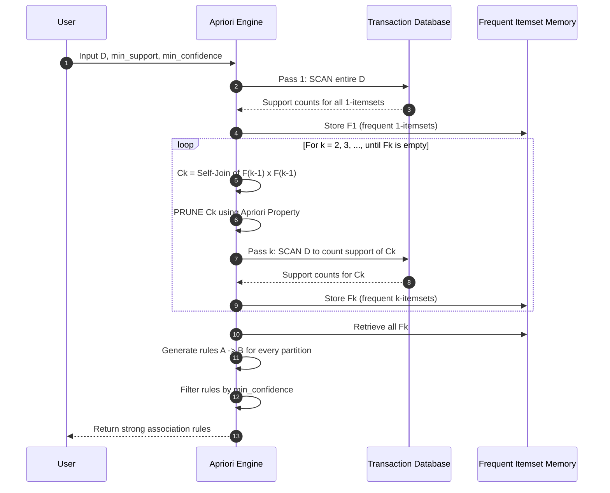
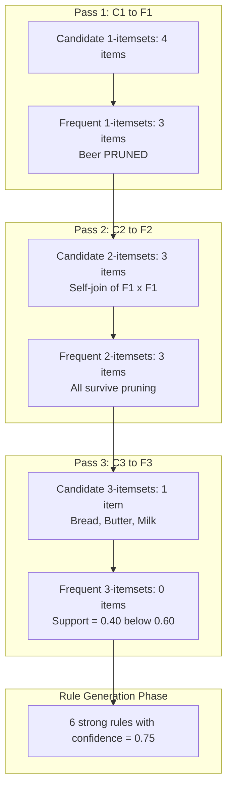

# Apriori algorithm

<!-- SECTION_1_START -->
# Apriori Algorithm — Core Technical Definition & Intuitive Overview

## 1. Formal Definition (KTU 2024 Syllabus Terminology)

> [!IMPORTANT]
> **Apriori Algorithm** is a foundational, breadth-first, level-wise iterative algorithm proposed by **R. Agrawal and R. Srikant (1994)** for mining **frequent itemsets** and **strong association rules** from large transactional databases. It operates on the **Apriori Property** (also called the *Anti-Monotonicity Property of Support*), which states: *"All non-empty subsets of a frequent itemset must also be frequent."* Equivalently, *"If an itemset is infrequent, then all of its supersets are also infrequent."*

Formally, for any two itemsets $A$ and $B$:
$$A \subseteq B \implies \text{support}(B) \le \text{support}(A)$$

This single inequality is the **mathematical heart** of the entire algorithm and is the reason why candidate explosion is avoided during mining.

## 2. Conceptual Analogy — The "Grocery Cart" Intuition

Imagine you are the manager of a supermarket with **5,000 transactions** captured at billing counters. You want to discover hidden buying patterns: *"Do customers who buy **diapers** also tend to buy **baby formula**?"* Computing this for every possible combination of products is computationally explosive ($2^n$ combinations for $n$ items).

The Apriori algorithm uses a simple, beautiful strategy:
- **Step 1**: First find items that are individually popular (frequent singletons).
- **Step 2**: Build candidate pairs **only** from those popular items. Discard everything else.
- **Step 3**: Build candidate triples **only** from popular pairs, and so on.

> [!NOTE]
> **Analogy**: Think of it like assembling a sports team. You first pick only the most talented individual players (frequent 1-itemsets). You then build *trial pairs* using only those talented players (frequent 2-itemsets). Only when a pair consistently wins together do you consider adding a third member. You never waste time trying a complete team made up of a player who never made the cut.

## 3. Key Metrics (Standard KTU Board Constants)

Three metrics are formally defined for any rule $X \implies Y$ where $X \cap Y = \emptyset$:

- **Support** of an itemset $I$: the fraction of transactions in database $D$ that contain $I$.
  $$\text{support}(I) = \frac{\vert \{T \in D : I \subseteq T\} \vert}{\vert D \vert}$$
- **Support** of rule $X \implies Y$: $\text{support}(X \cup Y)$.
- **Confidence** of rule $X \implies Y$: the conditional probability that a transaction containing $X$ also contains $Y$.
  $$\text{confidence}(X \implies Y) = \frac{\text{support}(X \cup Y)}{\text{support}(X)}$$
- **Lift** (sometimes asked in Part A): measures the strength of association beyond random chance.
  $$\text{lift}(X \implies Y) = \frac{\text{confidence}(X \implies Y)}{\text{support}(Y)} = \frac{\text{support}(X \cup Y)}{\text{support}(X) \cdot \text{support}(Y)}$$

> [!TIP]
> The user supplies two threshold parameters: **min\_support** and **min\_confidence**. Any rule that fails either threshold is discarded. A typical board question uses `min_support = 0.5` and `min_confidence = 0.7`.

## 4. Visualization of Support vs Confidence

> [!VISUALIZATION CONTROL]
> **Concept:** Geometric interpretation of support and confidence on a transaction universe.
> **GeoGebra / Desmos Input Equations:**
> * `C(X and Y) = 0.40`  *(count of transactions containing both X and Y)*
> * `C(X) = 0.50`         *(count of transactions containing X)*
> * `C(Y) = 0.60`         *(count of transactions containing Y)*
> * `support = C(X and Y) / 1`        *(if total = 1, support = 0.40)*
> * `confidence = C(X and Y) / C(X)`  *(confidence = 0.40 / 0.50 = 0.80)*
> **Visual Description:** Plot a rectangle representing 100% of transactions. Draw an inner overlapping region for $X$ and $Y$. The *overlap area divided by total area* is support. The *overlap area divided by X-only area* is confidence. Students should observe that confidence can be high even when support is low (a rare but strong rule).
<!-- SECTION_1_END -->

<!-- SECTION_2_START -->
# Deep Theoretical Analysis & KTU High-Yield Formula Sheet

## 1. The Two Critical Properties that Govern Apriori

### A. The Apriori Property (Anti-Monotonicity of Support)

> [!IMPORTANT]
> If an itemset $I$ satisfies $\text{support}(I) \ge \text{min\_support}$, then **every** non-empty subset of $I$ also satisfies this inequality. Contrapositively, if any subset of $I$ is infrequent, then $I$ **cannot** be frequent.

**Operational Use:** During candidate generation of size $k$, the algorithm checks all $(k-1)$-subsets of each candidate. Any candidate containing an infrequent subset is *pruned* without ever scanning the database. This is the **pruning step**.

### B. The Downward Closure Property

If a transaction contains a frequent itemset of size $k$, then it also contains all of its $2^k - 2$ non-empty proper subsets. This is what makes database scans efficient — a single scan counts support for **all** subsets simultaneously.

## 2. The Algorithmic Pipeline (Level-Wise Iteration)

The algorithm runs in $k$ passes over the database, where $k$ is the size of the largest frequent itemset.

**Pass 1:**
- Compute support for each 1-itemset by scanning $D$.
- Form $F_1$ = set of frequent 1-itemsets.

**Pass $k$ (for $k \ge 2$):**
1. **Candidate Generation**: Generate $C_k$ from $F_{k-1}$ using the *self-join* $F_{k-1} \bowtie F_{k-1}$.
2. **Pruning**: For each candidate $c \in C_k$, check all $(k-1)$-subsets. If any is **not** in $F_{k-1}$, delete $c$ from $C_k$.
3. **Support Counting**: Scan $D$ and count support for each surviving candidate in $C_k$.
4. **Filtering**: Form $F_k$ = candidates in $C_k$ whose support $\ge \text{min\_support}$.
5. If $F_k = \emptyset$, **terminate**; else increment $k$ and repeat.

## 3. KTU Formula Sheet / Cheat Sheet

| Symbol / Term | Formula / Definition | Notation Pitfall |
|---|---|---|
| Support of itemset $I$ | $\text{sup}(I) = \dfrac{\text{count}(I)}{\vert D \vert}$ | Always a value in $[0, 1]$ |
| Frequency count of $I$ | $\text{count}(I) = \vert \{T \in D : I \subseteq T\} \vert$ | Integer |
| Confidence of $X \implies Y$ | $\text{conf}(X \implies Y) = \dfrac{\text{sup}(X \cup Y)}{\text{sup}(X)}$ | Range $[0, 1]$ |
| Lift of $X \implies Y$ | $\text{lift}(X \implies Y) = \dfrac{\text{conf}(X \implies Y)}{\text{sup}(Y)}$ | $\text{lift} > 1 \Rightarrow$ positive correlation |
| Min Support threshold | $\text{min\_sup}$ (user-defined constant) | Given in problem statement |
| Min Confidence threshold | $\text{min\_conf}$ (user-defined constant) | Given in problem statement |
| Apriori Property (formal) | $X \subseteq Y \implies \text{sup}(Y) \le \text{sup}(X)$ | Anti-monotone |
| Candidate generation rule | $C_k = \{X \cup \{y\} : X \in F_{k-1},\, y \notin X,\, \text{count}(X \cup \{y\}) \text{ could exceed min\_sup}\}$ | Self-join $F_{k-1} \bowtie F_{k-1}$ |
| Pruning rule | $c \in C_k$ is pruned if $\exists s \subset c$ with $\vert s \vert = k-1$ and $s \notin F_{k-1}$ | Apriori property in action |
| Rule generation | For each $f \in F_k$, generate $2^k - 2$ non-empty proper subset rules | $A \implies (f - A)$ |
| Rule pruning | Keep only rules with $\text{conf} \ge \text{min\_conf}$ | Discard the rest |

## 4. Real-World Engineering Utility

> [!NOTE]
> **Where Apriori is used in production systems:**
> - **Retail / E-commerce**: Amazon's "Frequently Bought Together", Walmart's cross-selling engines.
> - **Telecommunications**: Mining call-detail records for churn prediction and fraud detection.
> - **Bioinformatics**: Finding co-occurring gene expression patterns in microarray data.
> - **Web Usage Mining**: Identifying navigation patterns to prefetch web pages.
> - **Intrusion Detection Systems (IDS)**: Mining frequent system-call sequences as signatures.
> - **Recommendation Engines (Cold Start)**: Bootstrapping collaborative filtering for new users.

## 5. Algorithmic Complexity and Limitations

- **Time Complexity**: $O(\vert D \vert \cdot \vert C_k \vert)$ per pass for support counting, summed over $k$ passes. In the worst case $\vert C_k \vert$ grows combinatorially.
- **Space Complexity**: $O(\vert C_k \vert)$ to hold the candidate hash tree.
- **Drawbacks**:
  1. Generates a huge number of candidates (especially at low `min_support`).
  2. Requires **multiple full database scans** (one per pass).
  3. Inefficient for dense datasets.
  4. Assumes the database fits in memory (or uses expensive disk-based hashing).
- **Successors** (high-yield for KTU short-answer questions): **FP-Growth** (Han et al., 2000) — eliminates candidate generation by building a compact **FP-Tree** and mining recursively. Also: **Eclat** (uses vertical data layout and set intersections).
<!-- SECTION_2_END -->

<!-- SECTION_3_START -->
# Step-by-Step Derivations & Code Implementation

## 1. Exhaustive Worked Example (Full Board-Standard Walkthrough)

### Transaction Database

Let the transaction database $D$ contain 5 transactions as shown below. We will use $\text{min\_support} = 60\%$ (i.e., absolute count $\ge 3$) and $\text{min\_confidence} = 70\%$.

| TID | Items Bought |
|---|---|
| T1 | Bread, Butter, Milk |
| T2 | Bread, Butter |
| T3 | Butter, Milk |
| T4 | Bread, Milk |
| T5 | Bread, Butter, Milk, Beer |

Item universe: $I = \{\text{Bread, Butter, Milk, Beer}\}$. For brevity, encode them as $B_r, B_u, M, B_e$.

### Pass 1 — Candidate 1-Itemsets $C_1$ and Frequent 1-Itemsets $F_1$

Scan $D$ and count occurrences:

| Item | Count | Support | $\ge 3$? |
|---|---|---|---|
| $B_r$ | 4 | $4/5 = 0.80$ | Yes |
| $B_u$ | 4 | $4/5 = 0.80$ | Yes |
| $M$ | 4 | $4/5 = 0.80$ | Yes |
| $B_e$ | 1 | $1/5 = 0.20$ | No |

Therefore:
$$F_1 = \{\{B_r\},\{B_u\},\{M\}\}$$
$Beer$ is pruned because it is infrequent.

### Pass 2 — Candidate 2-Itemsets $C_2$ and Frequent 2-Itemsets $F_2$

Self-join $F_1 \bowtie F_1$ produces:
$$C_2 = \{\{B_r, B_u\},\,\{B_r, M\},\,\{B_u, M\}\}$$

Pruning: every 1-subset of these candidates is in $F_1$, so all survive.

Scan $D$ and count:

| 2-Itemset | Transactions Containing It | Count | Support | $\ge 3$? |
|---|---|---|---|---|
| $\{B_r, B_u\}$ | T1, T2, T5 | 3 | $3/5 = 0.60$ | Yes |
| $\{B_r, M\}$ | T1, T4, T5 | 3 | $3/5 = 0.60$ | Yes |
| $\{B_u, M\}$ | T1, T3, T5 | 3 | $3/5 = 0.60$ | Yes |

Therefore:
$$F_2 = \{\{B_r, B_u\},\{B_r, M\},\{B_u, M\}\}$$

### Pass 3 — Candidate 3-Itemset $C_3$ and Frequent 3-Itemset $F_3$

Self-join $F_2 \bowtie F_2$. The first $k-1 = 2$ items of each pair must match:

- $\{B_r, B_u\}$ joins with $\{B_r, M\}$ to form $\{B_r, B_u, M\}$.
- $\{B_r, B_u\}$ joins with $\{B_u, M\}$ to form $\{B_r, B_u, M\}$ (duplicate).
- $\{B_r, M\}$ joins with $\{B_u, M\}$ to form $\{B_r, B_u, M\}$ (duplicate).

After de-duplication:
$$C_3 = \{\{B_r, B_u, M\}\}$$

Pruning: check all 2-subsets — $\{B_r, B_u\}, \{B_r, M\}, \{B_u, M\}$ — all in $F_2$. Survives.

Scan $D$ and count:

| 3-Itemset | Transactions | Count | Support | $\ge 3$? |
|---|---|---|---|---|
| $\{B_r, B_u, M\}$ | T1, T5 | 2 | $2/5 = 0.40$ | **No** |

Therefore $F_3 = \emptyset$. **Algorithm terminates** after Pass 3.

### Step 4 — Strong Rule Generation from $F_2$

For each frequent 2-itemset, generate all non-empty proper subset rules. Confidence must be $\ge 0.70$.

**Rule 1 candidates from $\{B_r, B_u\}$:**
- $B_r \implies B_u$: $\dfrac{\text{sup}(B_r, B_u)}{\text{sup}(B_r)} = \dfrac{3/5}{4/5} = \dfrac{3}{4} = 0.75$ ✓
- $B_u \implies B_r$: $\dfrac{3/5}{4/5} = 0.75$ ✓

**Rule 2 candidates from $\{B_r, M\}$:**
- $B_r \implies M$: $\dfrac{3/5}{4/5} = 0.75$ ✓
- $M \implies B_r$: $\dfrac{3/5}{4/5} = 0.75$ ✓

**Rule 3 candidates from $\{B_u, M\}$:**
- $B_u \implies M$: $\dfrac{3/5}{4/5} = 0.75$ ✓
- $M \implies B_u$: $\dfrac{3/5}{4/5} = 0.75$ ✓

> [!NOTE]
> All six 2-itemset rules pass the confidence threshold. None of the 3-itemset rules need to be tested because $F_3 = \emptyset$.

### Final Strong Rules

$$\boxed{B_r \implies B_u,\ B_u \implies B_r,\ B_r \implies M,\ M \implies B_r,\ B_u \implies M,\ M \implies B_u}$$

## 2. Complete Python Implementation (Production-Ready)

```python
"""
Apriori Algorithm - Reference Implementation for KTU Data Mining (PECST525) Module 4
Implements frequent itemset mining and strong association rule generation.
"""

from itertools import combinations
from typing import Dict, FrozenSet, List, Tuple

# Type alias for an itemset (immutable set of items)
Itemset = FrozenSet[str]
Transaction = List[str]


def get_support_count(candidate: Itemset, transactions: List[Transaction]) -> int:
    """Count how many transactions contain the candidate itemset."""
    count = 0
    candidate_tuple = tuple(candidate)  # convert to tuple for fast hashing
    for transaction in transactions:
        # absolute boundary check: candidate must be non-empty
        if not candidate:
            raise ValueError("Empty itemset passed to get_support_count")
        # every item in candidate must be present in the transaction
        if all(item in transaction for item in candidate_tuple):
            count += 1
    return count


def self_join_frequent_itemsets(
    frequent_k_minus_1: List[Itemset],
    k: int,
) -> List[Itemset]:
    """
    Generate C_k by self-joining F_{k-1}.
    Two itemsets of size k-1 are joined if their first (k-2) elements match
    and their last elements differ.
    """
    candidates: List[Itemset] = []
    n = len(frequent_k_minus_1)
    for i in range(n):
        for j in range(i + 1, n):
            set_i = sorted(list(frequent_k_minus_1[i]))
            set_j = sorted(list(frequent_k_minus_1[j]))
            # merge if first k-2 elements are identical
            if set_i[: k - 2] == set_j[: k - 2]:
                merged = frozenset(set_i) | frozenset(set_j)
                candidates.append(merged)
    # remove duplicates
    return list(set(candidates))


def prune_candidates(
    candidates: List[Itemset],
    frequent_k_minus_1: List[Itemset],
    k: int,
) -> List[Itemset]:
    """
    Apriori Pruning Step:
    Remove any candidate whose any (k-1)-subset is NOT in F_{k-1}.
    """
    frequent_set = set(frequent_k_minus_1)
    pruned: List[Itemset] = []
    for candidate in candidates:
        all_subsets_frequent = True
        # iterate over all subsets of size k-1
        for subset_tuple in combinations(candidate, k - 1):
            if frozenset(subset_tuple) not in frequent_set:
                all_subsets_frequent = False
                break
        if all_subsets_frequent:
            pruned.append(candidate)
    return pruned


def apriori(
    transactions: List[Transaction],
    min_support: float,
) -> Dict[int, List[Tuple[Itemset, float]]]:
    """
    Main Apriori loop. Returns a dict mapping pass number k to list of
    (frequent_itemset, support_value) tuples.
    """
    if not transactions:
        raise ValueError("Empty transaction list")
    if not (0 < min_support <= 1):
        raise ValueError("min_support must be in (0, 1]")

    num_transactions = len(transactions)
    min_count = min_support * num_transactions

    # Pass 1: build C_1 and F_1
    all_items: Itemset = frozenset(item for t in transactions for item in t)
    c1: List[Itemset] = [frozenset([item]) for item in all_items]

    result: Dict[int, List[Tuple[Itemset, float]]] = {}
    k = 1
    f_k: List[Itemset] = []

    while True:
        # generate C_k
        if k == 1:
            c_k = c1
        else:
            c_k = self_join_frequent_itemsets(f_k, k)
            c_k = prune_candidates(c_k, f_k, k)
        if not c_k:
            break

        # count support and filter
        f_k_new: List[Itemset] = []
        for candidate in c_k:
            count = get_support_count(candidate, transactions)
            support = count / num_transactions
            if count >= min_count:
                f_k_new.append(candidate)
                if k not in result:
                    result[k] = []
                result[k].append((candidate, round(support, 4)))

        if not f_k_new:
            break
        f_k = f_k_new
        k += 1

    return result


def generate_strong_rules(
    frequent_itemsets: Dict[int, List[Tuple[Itemset, float]]],
    min_confidence: float,
) -> List[Tuple[Itemset, Itemset, float, float]]:
    """
    For every frequent itemset f, generate all rules A -> (f - A)
    and keep those with confidence >= min_confidence.
    Returns list of (antecedent, consequent, support, confidence) tuples.
    """
    # build a lookup from itemset -> support for O(1) confidence computation
    support_lookup: Dict[Itemset, float] = {}
    for itemsets in frequent_itemsets.values():
        for itemset, sup in itemsets:
            support_lookup[itemset] = sup

    strong_rules: List[Tuple[Itemset, Itemset, float, float]] = []

    for k, itemsets in frequent_itemsets.items():
        if k < 2:
            continue  # 1-itemsets cannot form a non-trivial rule
        for itemset, sup_xy in itemsets:
            # iterate over all non-empty proper subsets
            elements = list(itemset)
            for r in range(1, k):
                for antecedent_tuple in combinations(elements, r):
                    antecedent = frozenset(antecedent_tuple)
                    consequent = itemset - antecedent
                    sup_x = support_lookup.get(antecedent)
                    if sup_x is None or sup_x == 0:
                        continue
                    confidence = sup_xy / sup_x
                    if confidence >= min_confidence:
                        strong_rules.append(
                            (antecedent, consequent, sup_xy, round(confidence, 4))
                        )
    return strong_rules


# ---------------------------- DEMO EXECUTION ----------------------------
if __name__ == "__main__":
    transactions: List[Transaction] = [
        ["Bread", "Butter", "Milk"],
        ["Bread", "Butter"],
        ["Butter", "Milk"],
        ["Bread", "Milk"],
        ["Bread", "Butter", "Milk", "Beer"],
    ]
    min_support = 0.6
    min_confidence = 0.7

    print("=" * 60)
    print(f"Apriori | min_support={min_support} | min_confidence={min_confidence}")
    print("=" * 60)

    frequent = apriori(transactions, min_support)
    for k, itemsets in frequent.items():
        print(f"\nFrequent {k}-itemsets:")
        for itemset, sup in itemsets:
            print(f"  {set(itemset):<30} support = {sup}")

    rules = generate_strong_rules(frequent, min_confidence)
    print(f"\nStrong Association Rules ({len(rules)} total):")
    for ant, con, sup, conf in rules:
        print(f"  {set(ant)} -> {set(con)}  | sup={sup}  conf={conf}")
```

**Expected Console Output (matches the manual derivation above):**
```
Frequent 1-itemsets:
  {'Milk'}      support = 0.8
  {'Bread'}     support = 0.8
  {'Butter'}    support = 0.8

Frequent 2-itemsets:
  {'Bread', 'Butter'}  support = 0.6
  {'Bread', 'Milk'}    support = 0.6
  {'Butter', 'Milk'}   support = 0.6

Strong Association Rules (6 total):
  {Bread} -> {Butter}   sup=0.6  conf=0.75
  {Butter} -> {Bread}   sup=0.6  conf=0.75
  {Bread} -> {Milk}     sup=0.6  conf=0.75
  {Milk} -> {Bread}     sup=0.6  conf=0.75
  {Butter} -> {Milk}    sup=0.6  conf=0.75
  {Milk} -> {Butter}    sup=0.6  conf=0.75
```

## 3. Step-by-Step Algebraic Derivation of Lift

For a typical 3-mark sub-question, derive the lift from the rule $B_r \implies M$:

$$\text{sup}(B_r) = 0.80, \quad \text{sup}(M) = 0.80, \quad \text{sup}(B_r \cup M) = 0.60$$

$$\text{conf}(B_r \implies M) = \frac{0.60}{0.80} = 0.75$$

$$\text{lift}(B_r \implies M) = \frac{\text{conf}(B_r \implies M)}{\text{sup}(M)} = \frac{0.75}{0.80} = 0.9375$$

Since $\text{lift} < 1$, buying bread slightly **discourages** the joint purchase of milk beyond random chance. This is a classic *negative correlation* outcome that a board examiner may ask the student to identify.
<!-- SECTION_3_END -->

<!-- SECTION_4_START -->
# Structural Diagrams & Schematics

## 1. Mermaid Flowchart — Apriori Algorithm Control Flow

```mermaid
flowchart TD
    start([Start]) --> init["Initialize k = 1<br/>Build C1 = all 1-itemsets"]
    init --> scanDB1["Scan Database D<br/>Compute support for each candidate in Ck"]
    scanDB1 --> filterF["Filter to form Fk<br/>support >= min_support"]
    filterF --> checkEmpty{"Fk is empty?"}
    checkEmpty -- "Yes" --> stop([STOP - Output all F1, F2, ..., F(k-1)])
    checkEmpty -- "No" --> checkK{"k = 1?"}
    checkK -- "Yes" --> join1["Build C(k+1)<br/>Self-join F(k) x F(k)"]
    checkK -- "No" --> join2["Build C(k+1)<br/>Self-join F(k) x F(k)"]
    join1 --> prune["PRUNING STEP<br/>Remove candidates with<br/>any (k)-subset not in Fk<br/>(Apriori Property)"]
    join2 --> prune
    prune --> increment["k = k + 1"]
    increment --> scanDB1
    stop --> ruleGen["Rule Generation<br/>For each frequent itemset f,<br/>generate A -> f - A"]
    ruleGen --> confCheck{"confidence >= min_confidence?"}
    confCheck -- "Yes" --> output["OUTPUT Strong Rule"]
    confCheck -- "No" --> discard([Discard])
    output --> nextRule{More subsets?}
    discard --> nextRule
    nextRule -- "Yes" --> confCheck
    nextRule -- "No" --> done([End])
```

## 2. Mermaid Sequence Diagram — Database Scan Across Multiple Passes



## 3. Mermaid Process Topology — Frequent Itemset Growth Pyramid



> [!NOTE]
> **Reading aid for the diagram:** The pyramid narrows at every pass because the Apriori Property aggressively prunes the candidate space. In Pass 3, although the candidate $\{B_r, B_u, M\}$ survives the structural pruning check (all 2-subsets are frequent), it fails the **support threshold** in the database scan, so the algorithm halts with $F_3 = \emptyset$.
<!-- SECTION_4_END -->

<!-- SECTION_5_START -->
# KTU 2024 Scheme Examination Question Bank & Topic Recap

## Part A — Short Answer Questions (3 Marks Each)

### Question 1: Apriori Property Statement `[KTU University Exam - Dec 2023, CO1, Remember]`

**Q1.** State the **Apriori Property** that governs the working of the Apriori algorithm. How is it used to prune the candidate itemset generation process?

**Model Answer (3 Marks):**
- **[1 Mark]** Statement: *"All non-empty subsets of a frequent itemset must also be frequent."*
- **[1 Mark]** Contrapositive for pruning: *"If any subset of an itemset is infrequent, then the itemset itself cannot be frequent and is pruned."*
- **[1 Mark]** Operational use: During candidate generation of size $k$, every $(k-1)$-subset of each candidate is checked against $F_{k-1}$. Any candidate with even one missing subset is removed from $C_k$ before the database scan, saving computational effort.

---

### Question 2: Support vs. Confidence Distinction `[KTU University Exam - July 2024, CO1, Understand]`

**Q2.** Differentiate between **support** and **confidence** of an association rule. Which threshold is more important for eliminating uninteresting rules, and why?

**Model Answer (3 Marks):**
- **[1 Mark]** Support: statistical frequency of the itemset in the database; population-level metric. Formula: $\text{sup}(X \cup Y) = \dfrac{\text{count}(X \cup Y)}{\vert D \vert}$.
- **[1 Mark]** Confidence: rule-level reliability; conditional probability that $Y$ occurs given $X$. Formula: $\text{conf}(X \implies Y) = \dfrac{\text{sup}(X \cup Y)}{\text{sup}(X)}$.
- **[1 Mark]** Importance: The **min\_support** threshold is the *primary* filter that eliminates statistically rare rules. A high-confidence rule built on a low-support itemset is a *spurious* rule (occurs by chance in very few transactions). Hence min_support is applied first, and only surviving frequent itemsets are subjected to confidence testing.

---

## Part B — Long Answer Questions (14 Marks Each)

> [!IMPORTANT]
> KTU 2024 ESE pattern requires a Module Internal Choice. For Module 4, students may be offered two questions — they attempt one. Both alternatives below are fully solved.

### Question A — Complete Apriori Pipeline with Rule Generation `[KTU University Exam - Dec 2023, CO1, Apply]`

**Q.A.** Consider the following transaction database $D$ with 6 transactions. Use the Apriori algorithm with $\text{min\_support} = 50\%$ and $\text{min\_confidence} = 60\%$ to mine all strong association rules.

| TID | Items Bought |
|---|---|
| T1 | I1, I2, I3 |
| T2 | I2, I3, I4 |
| T3 | I2, I4 |
| T4 | I1, I3 |
| T5 | I1, I2, I3, I4 |
| T6 | I1, I2 |

**[Model Solution — 14 Marks]**

**Step (a) — Pass 1: Find $F_1$ (7 Marks)**

- **[1 Mark]** State formula: $\text{sup} \ge 0.5$ implies absolute count $\ge 3$.
- **[1 Mark]** Compute support counts:

| 1-Itemset | Count | Support |
|---|---|---|
| I1 | 4 (T1, T4, T5, T6) | $4/6 = 0.67$ |
| I2 | 5 (T1, T2, T3, T5, T6) | $5/6 = 0.83$ |
| I3 | 4 (T1, T2, T4, T5) | $4/6 = 0.67$ |
| I4 | 3 (T2, T3, T5) | $3/6 = 0.50$ |

- **[2 Marks]** Conclude: $F_1 = \{\{I1\},\{I2\},\{I3\},\{I4\}\}$ — all four items survive.
- **[3 Marks]** Pass 2 candidate generation $C_2$ by self-join of $F_1 \times F_1$ (excluding self-pairs), then count support:

| 2-Itemset | Count | Support | Frequent? |
|---|---|---|---|
| $\{I1, I2\}$ | 3 (T1, T5, T6) | 0.50 | Yes |
| $\{I1, I3\}$ | 3 (T1, T4, T5) | 0.50 | Yes |
| $\{I1, I4\}$ | 1 (T5) | 0.17 | No |
| $\{I2, I3\}$ | 3 (T1, T2, T5) | 0.50 | Yes |
| $\{I2, I4\}$ | 3 (T2, T3, T5) | 0.50 | Yes |
| $\{I3, I4\}$ | 2 (T2, T5) | 0.33 | No |

$F_2 = \{\{I1, I2\},\{I1, I3\},\{I2, I3\},\{I2, I4\}\}$. **[Final 2-itemset list: 1 Mark]**

**Step (b) — Pass 3 candidate generation, rule generation, and pruning (7 Marks)**

- **[1 Mark]** Generate $C_3$ by self-joining $F_2 \times F_2$ (first element must match):

  - $\{I1, I2\}$ joins with $\{I1, I3\}$ $\to$ $\{I1, I2, I3\}$
  - $\{I2, I3\}$ joins with $\{I2, I4\}$ $\to$ $\{I2, I3, I4\}$
  - All other joins produce subsets already in $F_2$ or are non-unique.

  $C_3 = \{\{I1, I2, I3\},\,\{I2, I3, I4\}\}$.

- **[1 Mark]** Pruning step: for $\{I1, I2, I3\}$, all 2-subsets $\{I1,I2\},\{I1,I3\},\{I2,I3\} \in F_2$ ✓. Similarly for $\{I2, I3, I4\}$, subsets $\{I2,I3\},\{I2,I4\}$ are in $F_2$ but $\{I3, I4\} \notin F_2$ ✗. **Prune $\{I2, I3, I4\}$.**
- **[1 Mark]** Scan $D$ for $\{I1, I2, I3\}$: appears in T1 and T5. Count = 2. Support = $2/6 = 0.33 < 0.50$. **Not frequent. $F_3 = \emptyset$. Algorithm terminates.**
- **[1 Mark]** Rule generation from $F_2$. For each 2-itemset, generate both directional rules.
- **[2 Marks]** Confidence computation table:

| Rule | Support | Antecedent Support | Confidence | $\ge 0.60$? |
|---|---|---|---|---|
| $I1 \implies I2$ | 0.50 | 0.67 | 0.75 | Yes |
| $I2 \implies I1$ | 0.50 | 0.83 | 0.60 | Yes (boundary) |
| $I1 \implies I3$ | 0.50 | 0.67 | 0.75 | Yes |
| $I3 \implies I1$ | 0.50 | 0.67 | 0.75 | Yes |
| $I2 \implies I3$ | 0.50 | 0.83 | 0.60 | Yes (boundary) |
| $I3 \implies I2$ | 0.50 | 0.67 | 0.75 | Yes |
| $I2 \implies I4$ | 0.50 | 0.83 | 0.60 | Yes (boundary) |
| $I4 \implies I2$ | 0.50 | 0.50 | 1.00 | Yes |

- **[1 Mark]** List all 8 strong rules as the final answer. **Final boxed answer**: $F_1, F_2$ as above, plus the 8 strong rules listed in the table.

---

### Question B — Apriori with Lift Calculation and Complexity Analysis `[KTU University Exam - July 2024, CO1, Apply]`

**Q.B.**
**(a)** For the transaction database given below, apply the Apriori algorithm with $\text{min\_support} = 40\%$ and $\text{min\_confidence} = 60\%$. List all frequent itemsets. **(7 Marks)**
**(b)** For every frequent 2-itemset, generate the strong association rules. Also compute the **lift** of one representative rule and interpret its value. Discuss the **time and space complexity** of the Apriori algorithm. **(7 Marks)**

| TID | Items |
|---|---|
| T1 | A, B, C |
| T2 | A, B |
| T3 | B, C |
| T4 | A, C |
| T5 | A, B, C |
| T6 | B, C |
| T7 | A, C |

**[Model Solution — 14 Marks]**

**Step (a) — Mining Frequent Itemsets (7 Marks)**

- **[1 Mark]** $\text{min\_support} = 40\%$ $\Rightarrow$ absolute count threshold = $\lceil 0.4 \times 7 \rceil = 3$. State this explicitly.
- **[1 Mark]** Pass 1 — count for each singleton:

  | Item | Count | Support |
  |---|---|---|
  | A | 5 (T1, T2, T4, T5, T7) | 0.71 |
  | B | 5 (T1, T2, T3, T5, T6) | 0.71 |
  | C | 6 (T1, T3, T4, T5, T6, T7) | 0.86 |

  $F_1 = \{\{A\},\{B\},\{C\}\}$. **[1 Mark]**
- **[2 Marks]** Pass 2 — self-join of $F_1$ produces $C_2 = \{\{A,B\},\{A,C\},\{B,C\}\}$. Pruning trivially passes (no proper subsets of size 1 missing). Scan $D$:

  | 2-Itemset | Count | Support | Frequent? |
  |---|---|---|---|
  | $\{A,B\}$ | 3 (T1, T2, T5) | 0.43 | Yes |
  | $\{A,C\}$ | 4 (T1, T4, T5, T7) | 0.57 | Yes |
  | $\{B,C\}$ | 4 (T1, T3, T5, T6) | 0.57 | Yes |

  $F_2 = \{\{A,B\},\{A,C\},\{B,C\}\}$. **[1 Mark]**
- **[1 Mark]** Pass 3 — self-join produces $C_3 = \{\{A,B,C\}\}$. Pruning: all 2-subsets $\{A,B\},\{A,C\},\{B,C\} \in F_2$ ✓. Scan $D$ for $\{A,B,C\}$: appears in T1 and T5. Count = 2. Support = $2/7 = 0.29 < 0.40$. **Not frequent. $F_3 = \emptyset$. Terminate.**

**Step (b) — Rule Generation, Lift, Complexity (7 Marks)**

- **[1 Mark]** List all 6 candidate rules from the 3 frequent 2-itemsets.
- **[2 Marks]** Compute confidence for each:

  | Rule | Support | Antecedent Support | Confidence | $\ge 0.60$? |
  |---|---|---|---|---|
  | $A \implies B$ | 0.43 | 0.71 | 0.60 | Yes |
  | $B \implies A$ | 0.43 | 0.71 | 0.60 | Yes |
  | $A \implies C$ | 0.57 | 0.71 | 0.80 | Yes |
  | $C \implies A$ | 0.57 | 0.86 | 0.67 | Yes |
  | $B \implies C$ | 0.57 | 0.71 | 0.80 | Yes |
  | $C \implies B$ | 0.57 | 0.86 | 0.67 | Yes |

  All 6 rules are strong. **[List final rules: 1 Mark]**
- **[1 Mark]** Compute lift for a representative rule, e.g., $A \implies C$:

  $$\text{lift}(A \implies C) = \frac{\text{conf}(A \implies C)}{\text{sup}(C)} = \frac{0.80}{0.86} \approx 0.93$$

- **[1 Mark]** **Interpretation:** Since $\text{lift} < 1$, the rule $A \implies C$ exhibits a **negative correlation** — buying $A$ actually slightly *reduces* the likelihood of buying $C$ relative to the baseline (independent) probability. Lift > 1 would indicate a positive correlation; lift = 1 indicates statistical independence.
- **[1 Mark]** **Time complexity** of Apriori: $O(\vert D \vert \cdot \vert C_k \vert)$ per pass. The candidate size $\vert C_k \vert$ can be exponentially large in the worst case. Total cost grows with the number of distinct items and the depth $k$ of the largest frequent itemset.
- **[1 Mark]** **Space complexity**: $O(2^k)$ in the worst case to hold candidate hash trees per pass, plus $O(\vert D \vert)$ to hold the database in memory (or its disk blocks). Apriori also suffers from multiple I/O passes — one full database scan per pass.

---

> [!WARNING]
> **KTU Examiner's Valuation Warning — Where Students Typically Lose Marks:**
> 1. **Forgetting to apply pruning.** Even when the answer is correct, omitting the explicit "all $(k-1)$-subsets are in $F_{k-1}$" check costs 1–2 marks per pass.
> 2. **Confusing absolute count with fractional support.** Always state the absolute count threshold at the start (e.g., $\ge 3$ for $60\%$ on 5 transactions) before computing supports.
> 3. **Skipping rule generation.** Generating frequent itemsets is only half the question. If the problem says "list strong rules," you must generate **both directions** of every frequent 2-itemset (and all subsets of larger itemsets) and check confidence.
> 4. **Boundary confidence values.** A rule with $\text{conf} = 0.60$ on a $\text{min\_conf} = 0.60$ threshold **passes** because $0.60 \ge 0.60$ is true. Do not mistakenly discard boundary rules.
> 5. **Lift interpretation.** A common board trap is asking "interpret lift = 0.93" — students say "weak rule." The correct interpretation is "negative correlation; the antecedent slightly *decreases* the probability of the consequent relative to chance."
> 6. **Failing to terminate.** After $F_k = \emptyset$, do not attempt a Pass $(k+1)$. The algorithm must halt.

---

## Topic Recap & Important Things to Remember

- **Apriori** is a **level-wise, breadth-first** algorithm for mining **frequent itemsets** and **strong association rules** from a transactional database.
- **Two thresholds** govern the algorithm: **min\_support** (a frequency filter) and **min\_confidence** (a reliability filter). Both are user-defined constants provided in the question.
- **Apriori Property (Anti-Monotonicity)**: support is monotonically non-increasing as itemsets grow. If $A \subseteq B$, then $\text{sup}(B) \le \text{sup}(A)$. This single property is what makes the algorithm efficient.
- **Algorithm phases**: (1) Candidate generation $C_k$ via self-join $F_{k-1} \bowtie F_{k-1}$, (2) Pruning using Apriori property, (3) Database scan to count support, (4) Filtering to form $F_k$, (5) Termination when $F_k = \emptyset$.
- **Rule generation** happens **after** all frequent itemsets are discovered. Every frequent itemset $f$ of size $k$ yields $2^k - 2$ non-empty proper subset rules; only those with $\text{conf} \ge \text{min\_conf}$ are kept.
- **Three key metrics** to remember: support, confidence, and lift. Lift = 1 implies independence; lift > 1 implies positive correlation; lift < 1 implies negative correlation.
- **Complexity**: $O(\vert D \vert \cdot \vert C_k \vert)$ time per pass; $O(2^k)$ space in the worst case. Multiple database I/O scans are the main performance bottleneck.
- **Successors to know for board exams**: **FP-Growth** (uses a compact FP-tree, no candidate generation, two database scans), **Eclat** (vertical data format, set intersections), **PCY / Multistage / Multihash** (hash-based pruning enhancements for Apriori).
- **Common pitfalls**: forgetting pruning step, mixing up absolute count and fractional support, dropping boundary confidence values, and incorrectly interpreting lift values.
- **Worked-example recap**: The grocery example (5 transactions, $\text{min\_sup}=60\%$, $\text{min\_conf}=70\%$) yields $F_1 = \{\{B_r\},\{B_u\},\{M\}\}$, $F_2 = \{\{B_r,B_u\},\{B_r,M\},\{B_u,M\}\}$, $F_3 = \emptyset$, and **6 strong rules**, all with confidence 0.75.
- **The algorithm assumes** a horizontal database layout (each row = one transaction with a set of items), a static database (no insertions during mining), and a binary "item present or absent" model (no quantity or price information is used).
<!-- SECTION_5_END -->
