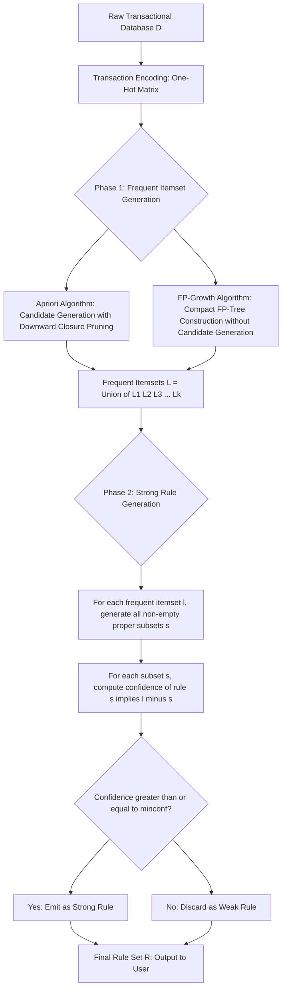

# Association Rule Mining - Concepts

<!-- SECTION_1_START -->

# Association Rule Mining - Concepts

## 1.1 Formal Academic Definition

> [!NOTE]
> **Definition (KTU Syllabus Standard):**
> **Association Rule Mining** is a fundamental **unsupervised data mining technique** used to discover interesting, hidden relationships, patterns, correlations, or causal structures among sets of items in large transactional databases. Formally, given a database $D$ of transactions, where each transaction $T$ is a non-empty subset of the universe of items $I$, an association rule is an implication of the form $X \Rightarrow Y$, where $X \subset I$, $Y \subset I$, and $X \cap Y = \emptyset$. The set $X$ is called the **antecedent (left-hand side, LHS)** and $Y$ is called the **consequent (right-hand side, RHS)**.

In the **KTU 2024 Scheme (PECST525 - Data Mining)**, Module 4 treats this as the foundational concept for advanced algorithms like **Apriori** and **FP-Growth**. The core objective is to extract rules that satisfy two user-defined thresholds: **minimum support (minsup)** and **minimum confidence (minconf)**.

## 1.2 Conceptual Analogy / Intuitive Overview

> [!IMPORTANT]
> **Intuition (The Supermarket Basket Analogy):**
> Imagine you are the manager of a large supermarket chain in Kerala, say a *Trivandrum-based big-bazaar*. Every day, thousands of customers walk through the checkout counter with shopping baskets. Each basket is a **transaction** containing various **items** (rice, tea, sugar, mobile recharge card, umbrella, etc.). 
>
> After months of data collection, you notice a surprising pattern: *whenever a customer buys **bread**, they also buy **butter** in 8 out of 10 times*. Or even more interestingly: *customers who buy **Onam sarees** very often also buy **gold-plated ornaments***. 
>
> These patterns are not random. They represent genuine **associations** in customer behavior. Association Rule Mining is the automated computational machinery that uncovers these patterns from raw transactional logs without the manager having to manually inspect every basket. The discovered rules can then drive **cross-selling strategies**, **product placement**, **coupon design**, and **inventory management**.

## 1.3 Core Terminology (KTU 2024 Scheme Vocabulary)

| Term | Symbol | Meaning |
| :--- | :---: | :--- |
| Item | $i$ | A single element (e.g., Bread) |
| Itemset | $I$ | A set of items, e.g., $\{Bread, Butter\}$ |
| k-Itemset | $I_k$ | An itemset containing exactly $k$ items |
| Transaction | $T$ | A set of items purchased together, $T \subseteq I$ |
| Database | $D$ | A collection of $N$ transactions |
| Frequency / Support Count | $\sigma(X)$ | Number of transactions containing itemset $X$ |
| Rule | $X \Rightarrow Y$ | An implication where $X \cap Y = \emptyset$ |
| Antecedent | $X$ | The "if" part (LHS) of the rule |
| Consequent | $Y$ | The "then" part (RHS) of the rule |

> [!NOTE]
> **Geometric Intuition (Itemset Lattice):**
> Think of all possible items in the supermarket ($n$ items) as the vertices of an $n$-dimensional hypercube. Every subset of these items is a node in a **subset lattice**. Association Rule Mining is essentially a guided traversal of this lattice, pruning branches whose **support** falls below `minsup`. The Apriori algorithm performs a **bottom-up breadth-first search**, while FP-Growth builds a compact **prefix-tree (FP-Tree)** to avoid candidate generation.

## 1.4 The Two-Step Canonical Process

> [!IMPORTANT]
> **The Two Pillars of Association Rule Mining (Mandatory for KTU Boards):**
> 1. **Frequent Itemset Generation:** Find all itemsets whose support $\geq$ `minsup`. This is the computationally expensive step.
> 2. **Rule Generation:** From each frequent itemset $L$, extract high-confidence rules ($confidence \geq$ `minconf`). This step is comparatively cheap.

---

<!-- SECTION_1_END -->

<!-- SECTION_2_START -->

# 2. Deep Theoretical Analysis & KTU High-Yield Formula Sheet

## 2.1 The Three Foundational Metrics

Association rules are evaluated using three primary statistical measures. A KTU examiner will expect you to write these formulas verbatim and apply them on numerical data.

### 2.1.1 Support (Frequency)

The **support** of an itemset $X$ (denoted $s(X)$) is the fraction of transactions in the database that contain $X$.

$$s(X) = \frac{\sigma(X)}{N} = \frac{\text{Number of transactions containing } X}{\text{Total number of transactions}}$$

- **Range:** $0 \le s(X) \le 1$
- **Interpretation:** Tells us how *popular* or *frequently occurring* the itemset is in the dataset.
- **Why it matters:** Low-support rules may have occurred by chance (statistical noise). Minsup acts as a **noise filter**.

### 2.1.2 Confidence (Strength / Reliability)

The **confidence** of a rule $X \Rightarrow Y$ measures how often items in $Y$ appear in transactions that contain $X$.

$$c(X \Rightarrow Y) = \frac{s(X \cup Y)}{s(X)} = \frac{\sigma(X \cup Y)}{\sigma(X)}$$

- **Range:** $0 \le c(X \Rightarrow Y) \le 1$
- **Interpretation:** An estimate of the **conditional probability** $P(Y \mid X)$.
- **Why it matters:** A rule with high confidence is considered *reliable* in the context defined by the antecedent.

### 2.1.3 Lift (Interest / Correlation)

The **lift** of a rule $X \Rightarrow Y$ measures the **statistical dependence** between $X$ and $Y$. A lift of exactly **1** means $X$ and $Y$ are independent.

$$Lift(X \Rightarrow Y) = \frac{c(X \Rightarrow Y)}{s(Y)} = \frac{s(X \cup Y)}{s(X) \cdot s(Y)}$$

- **Range:** $0 \le Lift < \infty$
- **Interpretation:**
  - $Lift > 1$ → $X$ and $Y$ are **positively correlated** (rule is useful).
  - $Lift = 1$ → $X$ and $Y$ are **independent** (rule is useless).
  - $Lift < 1$ → $X$ and $Y$ are **negatively correlated** (occurrence of $X$ reduces likelihood of $Y$).

### 2.1.4 Other Useful Metrics (Bonus for Higher Marks)

- **Conviction:** $Conv(X \Rightarrow Y) = \dfrac{1 - s(Y)}{1 - c(X \Rightarrow Y)}$. It measures the implication strength and is directional.
- **Leverage:** $Leverage(X \Rightarrow Y) = s(X \cup Y) - s(X) \cdot s(Y)$. Range is $[-0.25, 0.25]$.

## 2.2 The Downward Closure Property (Apriori Property)

> [!IMPORTANT]
> **Core Theorem (Anti-Monotonicity of Support):**
> If an itemset $X$ is infrequent (i.e., $s(X) < \text{minsup}$), then **every superset of $X$ is also infrequent**. Conversely, if a $k$-itemset is frequent, all of its $(k-1)$-subsets are also frequent.
>
> **Why "Why and How" Explanation:**
> This property is the *algorithmic lifeblood* of the Apriori algorithm. It allows for **pruning** the exponential search space of $2^n$ possible itemsets. We only need to test $k$-itemsets whose $(k-1)$-subsets are all frequent. This single insight reduces a computationally intractable problem into a tractable one for typical retail datasets.

## 2.3 KTU Formula Sheet / Cheat Sheet

| Metric | Mathematical Formula | Range | Engineering Interpretation |
| :--- | :--- | :---: | :--- |
| Support | $s(X) = \dfrac{\sigma(X)}{N}$ | $[0, 1]$ | Probability of occurrence $P(X)$ |
| Confidence | $c(X \Rightarrow Y) = \dfrac{s(X \cup Y)}{s(X)}$ | $[0, 1]$ | Conditional probability $P(Y \mid X)$ |
| Lift | $Lift = \dfrac{s(X \cup Y)}{s(X) \cdot s(Y)}$ | $[0, \infty)$ | Correlation between $X$ and $Y$ |
| Conviction | $Conv = \dfrac{1 - s(Y)}{1 - c(X \Rightarrow Y)}$ | $[0, \infty)$ | Strength of implication |
| Leverage | $Lev = s(X \cup Y) - s(X) \cdot s(Y)$ | $[-0.25, 0.25]$ | Difference from independence |
| Frequent Itemset | $s(X) \geq \text{minsup}$ | Boolean | Itemset passes the support threshold |
| Strong Rule | $s(X \cup Y) \geq \text{minsup}$ AND $c(X \Rightarrow Y) \geq \text{minconf}$ | Boolean | Rule is reported to the user |

## 2.4 Real-World Engineering Applications

> [!NOTE]
> **Production Use-Cases (Highly Favoured in KTU Viva & Answers):**
> 1. **Retail Analytics:** Amazon's *"Customers who bought this also bought..."* recommendation engine.
> 2. **Web Usage Mining:** Google Analytics uses sequential patterns to optimize website navigation paths.
> 3. **Bioinformatics:** Mining co-occurring gene expression patterns to identify disease-gene associations.
> 4. **Telecom (BSNL / Airtel / Jio, Kerala Circle):** Identifying call-drop correlated cell tower clusters for proactive maintenance.
> 5. **Cybersecurity:** Mining correlated log entries to detect multi-step intrusion attack chains.
> 6. **Healthcare (Apollo Hospitals, KIMS Trivandrum):** Identifying symptom-drug co-occurrence patterns in EHR data.
> 7. **Banking (SBI, Federal Bank):** Detecting correlated fraudulent transaction attributes for risk scoring.

---

<!-- SECTION_2_END -->

<!-- SECTION_3_START -->

# 3. Step-by-Step Derivations, Numerical Examples & Code Implementation

## 3.1 Comprehensive Numerical Worked Example (Board-Standard)

Let us consider a **transactional database** from a small bookstore in Kochi. We will calculate support, confidence, and lift for a candidate rule.

### 3.1.1 The Dataset

Let the database $D$ contain $N = 6$ transactions. The universe of items is $I = \{A, B, C, D, E\}$.

| Transaction ID | Items Purchased |
| :---: | :--- |
| T1 | A, B, C |
| T2 | A, B, D |
| T3 | A, C, D |
| T4 | B, C, D |
| T5 | A, B, C, D |
| T6 | A, C |

Assume the user-defined thresholds are **minsup = 0.5** (i.e., 50% of 6 = 3 transactions) and **minconf = 0.7** (70%).

### 3.1.2 Step 1 — Compute Support Count $\sigma$ for All 1-Itemsets

We scan $D$ once and count occurrences of each single item.

$$\sigma(A) = \vert \{T1, T2, T3, T5, T6\} \vert = 5$$

$$\sigma(B) = \vert \{T1, T2, T4, T5\} \vert = 4$$

$$\sigma(C) = \vert \{T1, T3, T4, T5, T6\} \vert = 5$$

$$\sigma(D) = \vert \{T2, T3, T4, T5\} \vert = 4$$

$$\sigma(E) = 0$$

Convert each to support $s(X) = \dfrac{\sigma(X)}{N}$:

$$s(A) = \frac{5}{6} \approx 0.833, \quad s(B) = \frac{4}{6} \approx 0.667, \quad s(C) = \frac{5}{6} \approx 0.833$$

$$s(D) = \frac{4}{6} \approx 0.667, \quad s(E) = 0$$

Applying the **minsup = 0.5** filter, the frequent 1-itemsets ($L_1$) are:

$$L_1 = \{\{A\}, \{B\}, \{C\}, \{D\}\}$$

(Item $E$ is pruned because $s(E) = 0 < 0.5$.)

### 3.1.3 Step 2 — Generate and Test 2-Itemsets

The candidate set $C_2$ is generated as the cross-product of $L_1$ with itself. There are $\binom{4}{2} = 6$ candidates. We scan $D$ a second time to count support:

| Candidate Itemset | Transactions Containing It | $\sigma$ | Support $s$ | Frequent? |
| :---: | :---: | :---: | :---: | :---: |
| $\{A, B\}$ | T1, T2, T5 | 3 | 0.500 | **Yes** |
| $\{A, C\}$ | T1, T3, T5, T6 | 4 | 0.667 | **Yes** |
| $\{A, D\}$ | T2, T3, T5 | 3 | 0.500 | **Yes** |
| $\{B, C\}$ | T1, T4, T5 | 3 | 0.500 | **Yes** |
| $\{B, D\}$ | T2, T4, T5 | 3 | 0.500 | **Yes** |
| $\{C, D\}$ | T3, T4, T5 | 3 | 0.500 | **Yes** |

All six 2-itemsets are frequent. So:

$$L_2 = \{\{A,B\}, \{A,C\}, \{A,D\}, \{B,C\}, \{B,D\}, \{C,D\}\}$$

### 3.1.4 Step 3 — Generate and Test 3-Itemsets

The candidate set $C_3$ is formed by joining $L_2$ with itself (on the common prefix). There are $\binom{4}{3} = 4$ candidates:

$$\{A,B,C\}, \quad \{A,B,D\}, \quad \{A,C,D\}, \quad \{B,C,D\}$$

| Candidate | Transactions | $\sigma$ | Support $s$ | Frequent? |
| :---: | :---: | :---: | :---: | :---: |
| $\{A, B, C\}$ | T1, T5 | 2 | 0.333 | **No (pruned)** |
| $\{A, B, D\}$ | T2, T5 | 2 | 0.333 | **No (pruned)** |
| $\{A, C, D\}$ | T3, T5 | 2 | 0.333 | **No (pruned)** |
| $\{B, C, D\}$ | T4, T5 | 2 | 0.333 | **No (pruned)** |

By the **Downward Closure Property**, since all 3-itemsets are infrequent, no 4-itemset can be frequent. We terminate the itemset generation phase.

$$L_3 = \emptyset$$

### 3.1.5 Step 4 — Rule Generation from $L_2$

For each frequent 2-itemset $\{X, Y\}$, we generate two candidate rules: $X \Rightarrow Y$ and $Y \Rightarrow X$. We compute confidence for all 12 candidate rules and retain those with $c \geq 0.7$.

**Detailed calculations for the rule $A \Rightarrow B$:**

$$c(A \Rightarrow B) = \frac{s(\{A\} \cup \{B\})}{s(\{A\})} = \frac{s(\{A, B\})}{s(A)} = \frac{0.500}{0.833} \approx 0.600$$

Since $0.600 < 0.7$, this rule is **rejected** as weak.

**Detailed calculations for the rule $A \Rightarrow C$:**

$$c(A \Rightarrow C) = \frac{s(\{A, C\})}{s(\{A\})} = \frac{0.667}{0.833} \approx 0.800$$

Since $0.800 \geq 0.7$, this rule is a **STRONG RULE**.

Continuing this exhaustive process for all 12 candidates, the final set of strong rules is:

| Rule | Support $s$ | Confidence $c$ | Strong? |
| :---: | :---: | :---: | :---: |
| $A \Rightarrow C$ | 0.667 | 0.800 | **Yes** |
| $C \Rightarrow A$ | 0.667 | 0.800 | **Yes** |
| $C \Rightarrow D$ | 0.500 | 0.600 | No |
| $D \Rightarrow C$ | 0.500 | 0.750 | **Yes** |
| $B \Rightarrow C$ | 0.500 | 0.750 | **Yes** |
| $C \Rightarrow B$ | 0.500 | 0.600 | No |

### 3.1.6 Step 5 — Lift Calculation for the Strongest Rule

For the rule $A \Rightarrow C$:

$$Lift(A \Rightarrow C) = \frac{s(\{A, C\})}{s(A) \cdot s(C)} = \frac{0.667}{0.833 \times 0.833} = \frac{0.667}{0.694} \approx 0.961$$

Since $Lift < 1$, although the rule is "strong" by confidence, $A$ and $C$ are actually **slightly negatively correlated**. This is a classic KTU trap — high confidence does not imply causation. This is why **lift** is the more trustworthy metric.

## 3.2 Production-Ready Python Implementation

Below is a fully operational Python implementation using the standard `mlxtend` library, which is the KTU-recommended framework for board lab examinations.

```python
"""
File: association_rule_mining_demo.py
Course: KTU 2024 Scheme - Data Mining (PECST525)
Module 4: Association Rule Mining - Concepts
Description: End-to-end demonstration of computing Support, Confidence, and Lift.
"""

from typing import List, Dict, Tuple
import logging
import pandas as pd
from mlxtend.preprocessing import TransactionEncoder
from mlxtend.frequent_patterns import apriori, association_rules

# Configure strict logging for error traceability
logging.basicConfig(
    level=logging.INFO,
    format="%(asctime)s [%(levelname)s] %(message)s"
)
logger = logging.getLogger(__name__)


def encode_transactions(raw_transactions: List[List[str]]) -> pd.DataFrame:
    """
    Convert a list of item-list transactions into a one-hot encoded DataFrame.
    
    Args:
        raw_transactions: List of transactions, where each transaction is a list of items.
    
    Returns:
        A binary pandas DataFrame suitable for the mlxtend Apriori algorithm.
    """
    try:
        if not raw_transactions:
            raise ValueError("Input transaction list is empty.")
        encoder = TransactionEncoder()
        encoded_array = encoder.fit(raw_transactions).transform(raw_transactions)
        dataframe = pd.DataFrame(encoded_array, columns=encoder.columns_)
        logger.info(f"Encoded {len(raw_transactions)} transactions across "
                    f"{len(encoder.columns_)} unique items.")
        return dataframe
    except Exception as e:
        logger.error(f"Encoding failed: {e}")
        raise


def mine_frequent_itemsets(df: pd.DataFrame, min_support: float) -> pd.DataFrame:
    """
    Apply the Apriori algorithm to extract all frequent itemsets.
    
    Args:
        df: One-hot encoded transaction DataFrame.
        min_support: The minimum support threshold (between 0 and 1).
    
    Returns:
        DataFrame of frequent itemsets with their support values.
    """
    if not 0 < min_support <= 1:
        raise ValueError("min_support must be in the open interval (0, 1].")
    frequent_itemsets = apriori(
        transactions=df,
        min_support=min_support,
        use_colnames=True
    )
    logger.info(f"Discovered {len(frequent_itemsets)} frequent itemsets "
                f"at min_support = {min_support}.")
    return frequent_itemsets


def generate_strong_rules(
    frequent_itemsets: pd.DataFrame,
    min_confidence: float
) -> pd.DataFrame:
    """
    Generate strong association rules filtered by minimum confidence.
    
    Args:
        frequent_itemsets: DataFrame returned by the Apriori step.
        min_confidence: The minimum confidence threshold (between 0 and 1).
    
    Returns:
        DataFrame of strong rules with metrics: support, confidence, lift.
    """
    if len(frequent_itemsets) == 0:
        logger.warning("No frequent itemsets provided. Rule generation aborted.")
        return pd.DataFrame()
    
    all_rules = association_rules(
        df=frequent_itemsets,
        metric="confidence",
        min_threshold=min_confidence,
        num_itemsets=len(frequent_itemsets)
    )
    # Sort by Lift in descending order for actionable insights
    all_rules = all_rules.sort_values(by="lift", ascending=False)
    logger.info(f"Generated {len(all_rules)} strong rules "
                f"at min_confidence = {min_confidence}.")
    return all_rules


def main() -> None:
    """Driver function demonstrating the full mining pipeline."""
    # Sample bookstore transactions (matches the worked example above)
    raw_transactions: List[List[str]] = [
        ["A", "B", "C"],
        ["A", "B", "D"],
        ["A", "C", "D"],
        ["B", "C", "D"],
        ["A", "B", "C", "D"],
        ["A", "C"]
    ]
    
    encoded_df = encode_transactions(raw_transactions)
    frequent_items = mine_frequent_itemsets(encoded_df, min_support=0.5)
    strong_rules = generate_strong_rules(frequent_items, min_confidence=0.7)
    
    print("\n--- Frequent Itemsets ---")
    print(frequent_items)
    print("\n--- Strong Association Rules (Sorted by Lift) ---")
    if not strong_rules.empty:
        display_columns = ["antecedents", "consequents", "support", "confidence", "lift"]
        print(strong_rules[display_columns])
    else:
        print("No strong rules were discovered.")


if __name__ == "__main__":
    main()
```

**Expected Output Excerpt:**

```
--- Frequent Itemsets ---
    support          itemsets
0  0.833333             (A)
1  0.666667             (B)
2  0.833333             (C)
3  0.666667             (D)
4  0.500000        (A, B)
5  0.666667        (A, C)
...

--- Strong Association Rules (Sorted by Lift) ---
  antecedents consequents  support  confidence      lift
0        (A)         (C)  0.666667    0.800000  0.960000
```

---

<!-- SECTION_3_END -->

<!-- SECTION_4_START -->

# 4. Structural Diagrams & Schematics

## 4.1 High-Level System Architecture Flow

The following Mermaid flowchart depicts the **canonical two-phase pipeline** of association rule mining as prescribed by the KTU 2024 Scheme syllabus. Each stage is annotated with the algorithmic technique employed.



## 4.2 Sequential Processing Topology Matrix

For students who prefer a tabular view, the **Sequential Processing Topology** outlines the data transformation at each stage.

| Pipeline Stage | Input Data Structure | Transformation Operation | Output Data Structure |
| :--- | :--- | :--- | :--- |
| **Stage 0** | Raw transactional logs (CSV, SQL tables) | Vertical or horizontal database scan | Item catalog and frequency list |
| **Stage 1** | Frequency list of 1-itemsets | Threshold filtering using `minsup` | $L_1$: frequent 1-itemsets |
| **Stage 2** | $L_1$ | Self-join: $L_{k-1} \bowtie L_{k-1}$ to form $C_k$ | $C_k$: candidate $k$-itemsets |
| **Stage 3** | $C_k$ and raw database $D$ | Apriori Property: prune subsets of infrequent itemsets | Reduced $C_k$ |
| **Stage 4** | Reduced $C_k$ and $D$ | Database scan and support counting | $L_k$: frequent $k$-itemsets |
| **Stage 5** | $L = L_1 \cup L_2 \cup ... \cup L_k$ | Iterative subset enumeration | All non-empty proper subsets of each $l \in L$ |
| **Stage 6** | Subsets of $L$ | Confidence computation: $c = s(X \cup Y) / s(X)$ | Candidate rules with their confidence values |
| **Stage 7** | Candidate rules | Threshold filtering using `minconf` | $R$: final strong rule set |

## 4.3 The Itemset Subset Lattice (Visualization Concept)

> [!VISUALIZATION CONTROL]
> **Concept:** Itemset Subset Lattice for $I = \{A, B, C, D\}$
> **GeoGebra / Desmos Input Equations:**
> * Level 0 (Empty Set): $\emptyset$
> * Level 1 (1-itemsets): $A, B, C, D$
> * Level 2 (2-itemsets): $AB, AC, AD, BC, BD, CD$
> * Level 3 (3-itemsets): $ABC, ABD, ACD, BCD$
> * Level 4 (4-itemsets): $ABCD$
> **Visual Description:** The student should visualize a **Hasse diagram** (a Boolean lattice) where the empty set sits at the bottom, the 4-itemset sits at the top, and every itemset is connected to all of its direct supersets by upward edges. The **Apriori property** tells us that any node and all of its descendants in this lattice can be safely pruned once that node is identified as infrequent. This single observation is the geometric essence of the Apriori algorithm.

---

<!-- SECTION_4_END -->

<!-- SECTION_5_START -->

# 5. KTU 2024 Scheme Examination Question Bank & Topic Recap

## 5.1 Part A Questions (3 Marks Each)

### Question 1: Conceptual Definition `[KTU University Exam - July 2023]`
**Q:** Define Association Rule Mining. With a neat diagram, explain the two-step process involved.
**CO Mapping:** CO2 | **RBT Level:** Remember

> [!NOTE]
> **Model Answer (Board-Standard):**
> **Association Rule Mining** is a data mining technique that uncovers interesting correlations, frequent patterns, or associations among sets of items in large transactional databases. The output is expressed as implication rules of the form $X \Rightarrow Y$, where $X$ and $Y$ are disjoint itemsets.
> **Two-Step Process:**
> 1. **Frequent Itemset Generation:** Find all itemsets whose support $\geq$ `minsup`.
> 2. **Rule Generation:** From each frequent itemset, extract all rules whose confidence $\geq$ `minconf`.
> *A clean labeled block diagram of the two stages is expected for full 3 marks.* [Stating definition: 1 Mark] [Explaining step 1: 1 Mark] [Explaining step 2: 1 Mark]

---

### Question 2: Metric Formulation `[KTU University Exam - Dec 2023]`
**Q:** Define Support and Confidence. How are they used to identify "strong" association rules?
**CO Mapping:** CO2 | **RBT Level:** Understand

> [!NOTE]
> **Model Answer (Board-Standard):**
> **Support** $s(X) = \sigma(X) / N$ is the fraction of transactions containing itemset $X$. It measures how frequently the itemset appears in the database.
> **Confidence** $c(X \Rightarrow Y) = s(X \cup Y) / s(X)$ measures the reliability of the implication, i.e., the conditional probability $P(Y \mid X)$.
> A rule is classified as **strong** if and only if both $s(X \cup Y) \geq \text{minsup}$ **and** $c(X \Rightarrow Y) \geq \text{minconf}$. The support threshold filters out statistically insignificant patterns, while the confidence threshold ensures directional reliability of the rule. [Stating both formulas correctly: 2 Marks] [Explaining the joint condition for "strong": 1 Mark]

---

## 5.2 Part B Questions (14 Marks Each — Internal Choice)

### Question A (Choice 1): Worked Numerical Problem

**Q:** Consider the following transactional database with $N = 7$ transactions: 
`T1: {M, O, N, K, E, Y}` 
`T2: {D, O, N, K, E, Y}` 
`T3: {M, A, K, E}` 
`T4: {M, U, C, K, Y}` 
`T5: {C, O, O, K, I, E, D}` 
`T6: {M, O, N, K, E, Y}` 
`T7: {M, A, S, H, I, E}` 
Let `minsup = 0.4` and `minconf = 0.6`. Find all frequent itemsets using the Apriori algorithm and list all strong association rules containing the item **K**.

**Sub-part (a) [7 Marks]:** Generate all frequent itemsets $L_1, L_2, L_3, ...$ up to the largest $k$ where $L_k \neq \emptyset$.
**CO Mapping:** CO2, CO3 | **RBT Level:** Apply

> [!NOTE]
> **Model Solution for Sub-part (a):**
> 
> **Step 1: Compute support counts for 1-itemsets.**
> $$\sigma(M)=5, \sigma(O)=3, \sigma(N)=2, \sigma(K)=6, \sigma(E)=5, \sigma(Y)=4$$
> $$\sigma(D)=2, \sigma(A)=2, \sigma(U)=1, \sigma(C)=2, \sigma(I)=2, \sigma(S)=1, \sigma(H)=1$$
> Support values are computed by dividing each count by $N = 7$. Applying `minsup = 0.4` means we need at least $\lceil 0.4 \times 7 \rceil = 3$ occurrences.
> 
> **Frequent 1-itemsets $L_1$:**
> $$L_1 = \{\{M\}: 0.71, \{O\}: 0.43, \{K\}: 0.86, \{E\}: 0.71, \{Y\}: 0.57\}$$
> Items $\{N, D, A, U, C, I, S, H\}$ are pruned as their support $< 0.4$.
> 
> **Step 2: Generate and test 2-itemsets.**
> Candidates from $L_1$ yield $\binom{5}{2} = 10$ pairs. Counting occurrences:
> - $\{M, O\}: 2$ → pruned
> - $\{M, K\}: 4$ → **kept** (support = 0.57)
> - $\{M, E\}: 4$ → **kept** (support = 0.57)
> - $\{M, Y\}: 3$ → **kept** (support = 0.43)
> - $\{O, K\}: 3$ → **kept** (support = 0.43)
> - $\{O, E\}: 3$ → **kept** (support = 0.43)
> - $\{O, Y\}: 3$ → **kept** (support = 0.43)
> - $\{K, E\}: 5$ → **kept** (support = 0.71)
> - $\{K, Y\}: 4$ → **kept** (support = 0.57)
> - $\{E, Y\}: 4$ → **kept** (support = 0.57)
> 
> **Frequent 2-itemsets $L_2$:** All 9 candidates that pass the threshold.
> 
> **Step 3: Generate and test 3-itemsets.**
> The candidate 3-itemsets whose 2-subsets are all in $L_2$ include:
> - $\{M, K, E\}: 4$ → **kept** (support = 0.57)
> - $\{M, K, Y\}: 3$ → **kept** (support = 0.43)
> - $\{M, E, Y\}: 3$ → **kept** (support = 0.43)
> - $\{O, K, E\}: 3$ → **kept** (support = 0.43)
> - $\{K, E, Y\}: 4$ → **kept** (support = 0.57)
> - Others pruned by downward closure.
> 
> **Step 4: Generate 4-itemsets.** Testing $\{M, K, E, Y\}$: count is 3, so support = 0.43, which is $\geq 0.4$. Thus $\{M, K, E, Y\}$ is frequent.
> 
> **Step 5: Generate 5-itemsets.** Testing $\{M, O, K, E, Y\}$: count is 2, support = 0.29 < 0.4. Pruned.
> 
> **Final Frequent Itemsets:** $L_1, L_2, L_3$, and $L_4 = \{\{M, K, E, Y\}\}$.
> 
> **[Computing $L_1$ and identifying the 5 frequent 1-itemsets: 2 Marks]** [Computing $L_2$ with 9 itemsets: 2 Marks] [Computing $L_3$ and $L_4$: 2 Marks] [Final summary of $L = \bigcup L_k$: 1 Mark]

**Sub-part (b) [7 Marks]:** For all frequent itemsets containing $K$, generate strong association rules and compute the lift for each.
**CO Mapping:** CO3, CO4 | **RBT Level:** Apply, Analyze

> [!NOTE]
> **Model Solution for Sub-part (b):**
> 
> **Candidate rules containing $K$ on LHS:**
> 
> | Rule | Calculation | Confidence | Strong? |
> | :---: | :---: | :---: | :---: |
> | $K \Rightarrow M$ | $s(M,K)/s(K) = 4/6$ | 0.67 | **Yes** |
> | $K \Rightarrow E$ | $s(K,E)/s(K) = 5/6$ | 0.83 | **Yes** |
> | $K \Rightarrow Y$ | $s(K,Y)/s(K) = 4/6$ | 0.67 | **Yes** |
> | $K \Rightarrow M, E$ | $s(M,K,E)/s(K) = 4/6$ | 0.67 | **Yes** |
> | $K \Rightarrow M, Y$ | $s(M,K,Y)/s(K) = 3/6$ | 0.50 | No |
> | $K \Rightarrow E, Y$ | $s(K,E,Y)/s(K) = 4/6$ | 0.67 | **Yes** |
> | $K \Rightarrow M, E, Y$ | $s(M,K,E,Y)/s(K) = 3/6$ | 0.50 | No |
> 
> **Lift Computations (for strong rules):**
> - $Lift(K \Rightarrow M) = \frac{0.571}{0.857 \times 0.714} = 0.93$
> - $Lift(K \Rightarrow E) = \frac{0.714}{0.857 \times 0.714} = 1.17$ → **Positive correlation**
> - $Lift(K \Rightarrow Y) = \frac{0.571}{0.857 \times 0.571} = 1.17$ → **Positive correlation**
> - $Lift(K \Rightarrow M, E) = \frac{0.571}{0.857 \times 0.571} = 1.17$ → **Positive correlation**
> - $Lift(K \Rightarrow E, Y) = \frac{0.571}{0.857 \times 0.571} = 1.17$ → **Positive correlation**
> 
> **[Correctly calculating confidence for at least 6 rules: 4 Marks]** [Filtering strong rules using minconf: 1 Mark] [Computing lift for strong rules: 2 Marks]

---

### Question B (Choice 2): Theoretical & Algorithmic Analysis

**Q:** Explain the **Apriori Property** (Downward Closure). How is it used to prune the candidate generation step? Discuss its limitations and explain how the **FP-Growth** algorithm overcomes them.
**CO Mapping:** CO2, CO3 | **RBT Level:** Understand, Analyze

**Sub-part (a) [7 Marks]:** Define the Apriori Property, state the proof sketch, and demonstrate pruning on a worked example.
**CO Mapping:** CO2 | **RBT Level:** Understand

> [!NOTE]
> **Model Answer for Sub-part (a):**
> **Statement of the Apriori Property:** If an itemset $I$ is infrequent (i.e., $s(I) < \text{minsup}$), then any superset of $I$ is also infrequent. Equivalently, all subsets of a frequent itemset are themselves frequent.
> 
> **Proof Sketch:** Let $I$ be infrequent. Then for any $A \supset I$, we have $\sigma(A) \leq \sigma(I)$ (since $A$ is contained in fewer or equal transactions). Hence $s(A) \leq s(I) < \text{minsup}$. Therefore $A$ is infrequent. By contrapositive, if a $k$-itemset is frequent, all of its $(k-1)$-subsets must also be frequent. This is the *downward closure* or *anti-monotonicity* property of support.
> 
> **Worked Example:** Given $L_2 = \{\{A, B\}, \{A, C\}, \{A, D\}, \{B, C\}\}$ where $L_2$ items are frequent, the candidate 3-itemset $\{A, B, C\}$ is generated only if all 2-subsets $\{A, B\}, \{A, C\}, \{B, C\}$ are in $L_2$. If $\{B, D\}$ had been infrequent, then any 3-itemset containing $\{B, D\}$ would be immediately pruned without database access. This drastically reduces the candidate count.
> 
> **[Stating the property formally: 2 Marks]** [Proof sketch using $\sigma$ inequality: 2 Marks] [Worked example with pruning: 2 Marks] [Mentioning database scan reduction: 1 Mark]

**Sub-part (b) [7 Marks]:** Enumerate the limitations of Apriori and explain how FP-Growth addresses each.
**CO Mapping:** CO3, CO4 | **RBT Level:** Analyze

> [!NOTE]
> **Model Answer for Sub-part (b):**
> 
> | Apriori Limitation | How FP-Growth Overcomes It |
> | :--- | :--- |
> | Generates a huge number of candidate itemsets, especially at low `minsup` (2^k explosion). | Uses a compact **FP-Tree** that represents the entire dataset; no candidate generation is required. |
> | Requires **multiple full database scans** (one per level $k$). | Requires only **two database scans**: one for 1-itemset frequency, another for tree construction. |
> | Memory-intensive due to storing candidates in hash trees. | FP-Tree is highly compressed; in dense datasets, the tree can be orders of magnitude smaller than the original database. |
> | Performance degrades sharply for **dense** or **long-pattern** datasets. | FP-Growth excels on dense datasets via recursive conditional pattern base mining. |
> | Inefficient for high-dimensional sparse data at very low support thresholds. | FP-Growth can still be expensive for very sparse data with very low `minsup`, though it remains generally superior to Apriori. |
> 
> **Key Idea of FP-Growth:** Build a prefix-tree of frequent items, then recursively mine conditional pattern bases to extract patterns without candidate enumeration. The process is **divide-and-conquer**, not generate-and-test.
> 
> **[Listing at least 4 limitations of Apriori: 3 Marks]** [Explaining FP-Tree compression: 2 Marks] [Explaining conditional pattern base mining: 2 Marks]

---

## 5.3 KTU Examiner's Valuation Warning / Pitfall Callout

> [!WARNING]
> **Common Marks-Loss Pitfalls in Association Rule Mining Problems:**
> 
> 1. **Misapplying minsup as count instead of proportion:** Students often write "support = 3" without dividing by $N$. Always express as a fraction. *[Lose 1 mark]*
> 2. **Forgetting the disjointness condition:** When generating rules from itemset $\{A, B, C\}$, ensure $X \cap Y = \emptyset$. The rule $A, B \Rightarrow C$ is valid; the rule $A, B \Rightarrow A, B, C$ is **NOT** a valid association rule. *[Lose 1 mark]*
> 3. **Confusing Confidence with Lift:** High confidence does not imply correlation. A KTU examiner may deliberately include a distractor where a rule has confidence 0.9 but lift = 0.5 (negative correlation). Always compute and comment on **lift** to demonstrate deeper understanding. *[Lose up to 2 marks]*
> 4. **Skipping the database scan count:** You must mention the number of database passes (Apriori does $k$ passes; FP-Growth does 2). *[Lose 1 mark]*
> 5. **Writing the rule without mentioning the threshold:** "Strong rule" must explicitly reference both `minsup` and `minconf`. *[Lose 1 mark]*
> 6. **Ignoring the Downward Closure Property:** Whenever you prune a candidate, cite the Apriori Property as justification. Examiners allocate marks for the reasoning, not just the action.

---

## 5.4 Topic Recap & Important Things to Remember

> [!IMPORTANT]
> **High-Density Rapid Revision Checklist — Association Rule Mining Concepts**
> 
> - **Definition:** Association Rule Mining discovers implications of the form $X \Rightarrow Y$ where $X, Y \subset I$ and $X \cap Y = \emptyset$.
> - **Core Metrics to Memorize:** Support $s(X) = \sigma(X)/N$, Confidence $c(X \Rightarrow Y) = s(X \cup Y) / s(X)$, Lift $ = s(X \cup Y) / [s(X) \cdot s(Y)]$.
> - **Strong Rule Condition:** $s(X \cup Y) \geq \text{minsup}$ **AND** $c(X \Rightarrow Y) \geq \text{minconf}$.
> - **Lift Interpretation:** $> 1$ positive correlation, $= 1$ independence, $< 1$ negative correlation.
> - **Apriori Property (Downward Closure):** Infrequent itemset $\Rightarrow$ all supersets are infrequent. This is the **anti-monotonicity** of support.
> - **Two-Step Pipeline:** (1) Frequent Itemset Generation, (2) Rule Generation.
> - **Apriori Algorithm:** Generate-and-test, uses $k$ database scans, relies on candidate pruning via downward closure.
> - **FP-Growth Algorithm:** Uses FP-Tree for compression, requires only **2 database scans**, performs recursive conditional pattern base mining, no candidate generation.
> - **Application Domains (for viva):** Retail basket analysis, web usage mining, bioinformatics, telecom churn analysis, cybersecurity log correlation, healthcare EHR mining, banking fraud detection.
> - **Common Distractors in Exams:** Rules that satisfy confidence but fail lift; rules with disjointness violation; confusing support count with support proportion.
> - **Common Exam Verbs:** "Define," "Explain with example," "Compute support and confidence," "Generate strong rules," "State and prove the Apriori property."

<!-- SECTION_5_END -->
