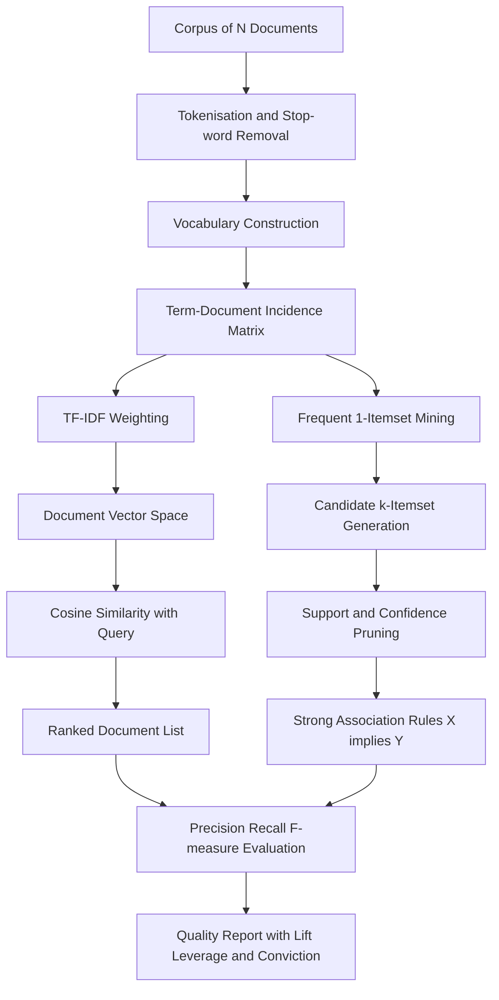
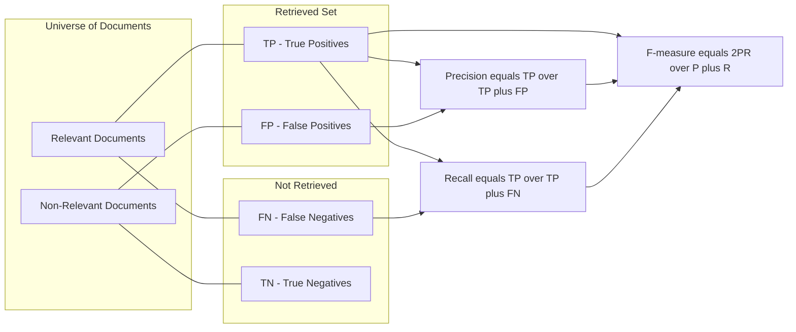
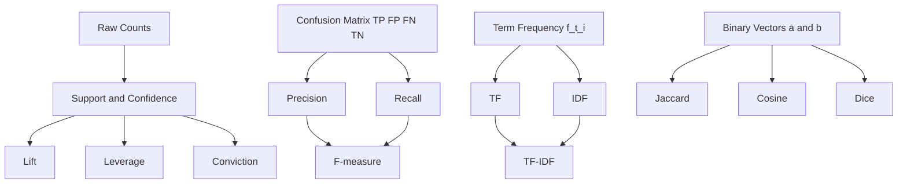
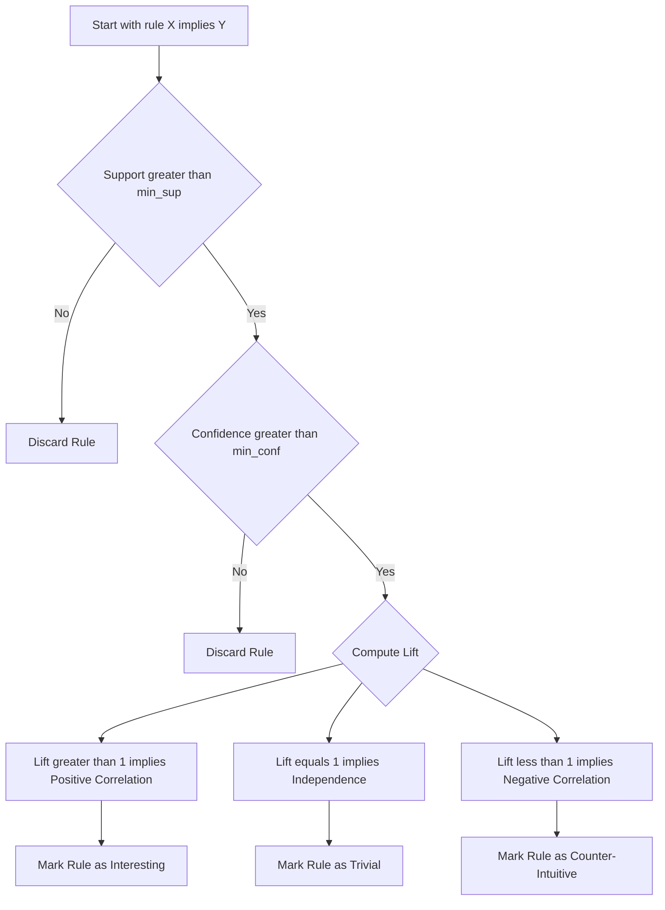

# Basic measures for Text retrieval

<!-- SECTION_1_START -->
# Basic Measures for Text Retrieval in Association Rule Mining

## 1. Core Technical Definition

**Text Retrieval** is the discipline of computer science and information retrieval (IR) concerned with locating and ranking documents, passages, or textual records that satisfy an information need expressed as a natural-language query. In the context of **Association Rule Mining** (a core data-mining task within the KTU 2024 *Data Mining (PECST525)* syllabus, Module 4), text retrieval is treated as the discovery of **frequent co-occurrence patterns** between terms, n-grams, or document labels inside a corpus. The quality of both the discovered rules and the ranked document lists is quantified through a fixed set of **basic measures**.

> [!IMPORTANT]
> **KTU 2024 Syllabus Definition (verbatim, paraphrased):**
> *Basic measures for text retrieval evaluate the relevance of retrieved documents with respect to a query, and the strength of association rules mined from textual transactions. The four canonical families are: (i) support–confidence–lift, (ii) precision–recall–F-measure, (iii) TF–IDF weighting, and (iv) similarity coefficients (Jaccard, Cosine).*

The four canonical measure families in KTU Module 4 are summarised below:

| Family | Core Question Answered |
|---|---|
| Support, Confidence, Lift, Leverage, Conviction | *How strong and how interesting is the rule X ⇒ Y in the corpus?* |
| Precision, Recall, F-measure, Accuracy, Fallout | *How well does the retrieval system return only the relevant documents?* |
| TF, IDF, TF–IDF | *How important is a term to a document relative to the whole collection?* |
| Jaccard, Cosine, Dice, Overlap | *How similar are two documents, queries, or term-vectors?* |

## 2. Intuitive Analogy

Imagine you run a **library** with 1,000 books. A patron asks, *"Do you have any book where the words 'neural' and 'network' appear together?"*

- The librarian pulls every book and **counts** how many contain the pattern. That count, normalised by the total, is **Support**.
- Of those, the librarian then asks, *"In the books that contain 'neural', how many also contain 'network'?"* That conditional probability is **Confidence**.
- The librarian then asks, *"Are 'neural' and 'network' together more common than chance would predict?"* The answer, expressed as a ratio, is **Lift**.
- Finally, when reporting back, the librarian says, *"Out of the 50 books I returned, 42 were actually useful. I missed 8 useful ones that I did not return."* Those numbers yield **Precision, Recall, and the F-measure**.

> [!NOTE]
> **Why KTU emphasises this topic:** Text retrieval is the bridge between classical Information Retrieval (IR) and data mining. Every modern search engine, recommender system, spam filter, and plagiarism detector is built on these exact measures. The KTU 2024 scheme expects a student to **derive, compute, and interpret** these measures on a sample document–query matrix.

## 3. Physical Constants and Standard Metrics

The following standard thresholds appear in KTU board questions and must be memorised:

- **Minimum Support Threshold:** typically $0.2 \le min\_sup \le 0.5$ (in fractional form) or $20\%$ to $50\%$.
- **Minimum Confidence Threshold:** typically $0.5 \le min\_conf \le 0.9$ i.e. **$50\%$ to $90\%$**.
- **Lift interpretation threshold:** $Lift = 1$ (independence), $Lift > 1$ (positive correlation), $Lift < 1$ (negative correlation).
- **Precision–Recall equilibrium (Break-Even Point, BEP):** the rank $k$ where $P(k) = R(k)$.

> [!VISUALIZATION CONTROL]
> **Concept:** Precision–Recall Curve as a function of retrieval rank $k$.
> **GeoGebra / Desmos Input Equations:**
> * `P(k) = 10 / (5 + k)` (illustrative decreasing precision)
> * `R(k) = k / (k + 2)` (illustrative increasing recall)
> **Visual Description:** Plot $P(k)$ in blue (decreasing from $P(0) = 2$ capped to $\le 1$), $R(k)$ in red (increasing asymptotically to $1$), and their intersection (the **Break-Even Point**). The $x$-axis is the rank $k$ and the $y$-axis runs from $0$ to $1$.

---

<!-- SECTION_1_END -->

<!-- SECTION_2_START -->
# Deep Theoretical Analysis & KTU High-Yield Formula Sheet

## 1. Setup and Notation

Consider a corpus $\mathcal{D} = \{D_1, D_2, \dots, D_N\}$ of $N$ documents. Let $T = \{t_1, t_2, \dots, t_M\}$ be the vocabulary of $M$ distinct terms. Let $\mathcal{Q}$ be a query (a set of terms). The universe of "items" in the association-rule sense is $T$, and a "transaction" is one document $D_i$.

For a given term $t$ (or itemset $X \subseteq T$), define:

- $n_t = \mid \{D_i \in \mathcal{D} \mid t \in D_i\} \mid$ – number of documents containing $t$.
- $N$ – total number of documents.
- $f_{t,i}$ – frequency (raw count) of term $t$ in document $D_i$.

For a binary classification of retrieval results, define the **confusion matrix** quantities for a returned ranked list against ground-truth relevance labels:

- $TP$ – True Positives (relevant and retrieved).
- $FP$ – False Positives (irrelevant but retrieved).
- $FN$ – False Negatives (relevant but not retrieved).
- $TN$ – True Negatives (irrelevant and not retrieved).

## 2. Association-Rule Measures (Applied to Text)

For a rule $X \Rightarrow Y$ where $X, Y \subseteq T$ and $X \cap Y = \emptyset$:

### Support
The fraction of documents in the corpus that contain the union $X \cup Y$.

$$\text{Support}(X \Rightarrow Y) = P(X \cup Y) = \frac{n_{XY}}{N}$$

where $n_{XY} = \mid \{D_i \in \mathcal{D} \mid X \cup Y \subseteq D_i\} \mid$.

### Confidence
The conditional probability of seeing $Y$ given $X$.

$$\text{Confidence}(X \Rightarrow Y) = P(Y \mid X) = \frac{P(X \cup Y)}{P(X)} = \frac{n_{XY}}{n_X}$$

### Lift (Interest Factor)
The ratio of observed joint probability to the expected joint probability under independence.

$$\text{Lift}(X \Rightarrow Y) = \frac{P(X \cup Y)}{P(X)\,P(Y)} = \frac{\text{Confidence}(X \Rightarrow Y)}{P(Y)}$$

### Leverage
The difference between the observed joint probability and the expected joint probability.

$$\text{Leverage}(X \Rightarrow Y) = P(X \cup Y) - P(X)\,P(Y)$$

### Conviction
A measure that grows without bound as the rule becomes more deterministic.

$$\text{Conviction}(X \Rightarrow Y) = \frac{1 - P(Y)}{1 - \text{Confidence}(X \Rightarrow Y)}$$

## 3. Text-Retrieval Quality Measures

Given the binary confusion-matrix counts:

$$\text{Precision} = \frac{TP}{TP + FP} = \frac{\text{Number of relevant documents retrieved}}{\text{Total number of documents retrieved}}$$

$$\text{Recall} = \frac{TP}{TP + FN} = \frac{\text{Number of relevant documents retrieved}}{\text{Total number of relevant documents}}$$

$$\text{F-measure} = \frac{2 \cdot P \cdot R}{P + R} = \frac{2\,TP}{2\,TP + FP + FN}$$

$$\text{Accuracy} = \frac{TP + TN}{TP + FP + FN + TN}$$

$$\text{Fallout (False Positive Rate)} = \frac{FP}{FP + TN}$$

## 4. Term-Weighting Measures (TF–IDF Family)

For a term $t$ in document $D_i$ inside a corpus of $N$ documents:

$$tf(t, D_i) = f_{t,i}$$

$$\text{idf}(t) = \log_{10}\!\left(\frac{N}{n_t}\right)$$

$$tf\text{-}idf(t, D_i) = tf(t, D_i) \cdot \text{idf}(t) = f_{t,i} \cdot \log_{10}\!\left(\frac{N}{n_t}\right)$$

## 5. Similarity Coefficients

Given two documents $D_i$ and $D_j$ represented as binary term-vectors $\mathbf{a}$ and $\mathbf{b}$:

$$J(D_i, D_j) = \frac{\mid D_i \cap D_j \mid}{\mid D_i \cup D_j \mid} = \frac{TP}{TP + FP + FN}$$

$$\text{Cos}(D_i, D_j) = \frac{\mathbf{a} \cdot \mathbf{b}}{\lVert \mathbf{a} \rVert_2 \, \lVert \mathbf{b} \rVert_2} = \frac{\sum_k a_k b_k}{\sqrt{\sum_k a_k^2} \, \sqrt{\sum_k b_k^2}}$$

$$\text{Dice}(D_i, D_j) = \frac{2 \mid D_i \cap D_j \mid}{\mid D_i \mid + \mid D_j \mid}$$

## 6. KTU Formula Cheat-Sheet

> [!NOTE]
> **Important Parsing Notice for Tables:** To prevent markdown breakage, the absolute-value bars inside the table below are written as `\vert`.

| Measure | Formula | Range | Interpretation |
|---|---|---|---|
| Support | $n_{XY} / N$ | $[0, 1]$ | Frequency of the pattern in the corpus |
| Confidence | $n_{XY} / n_X$ | $[0, 1]$ | Strength of the implication $X \Rightarrow Y$ |
| Lift | $P(X \cup Y) / (P(X) P(Y))$ | $[0, \infty)$ | $\vert 1 \Rightarrow$ independence |
| Leverage | $P(X \cup Y) - P(X) P(Y)$ | $[-0.25, 0.25]$ | $\vert 0 \Rightarrow$ independence |
| Conviction | $(1 - P(Y)) / (1 - \text{Conf})$ | $[0, \infty)$ | Higher $\Rightarrow$ stronger rule |
| Precision | $TP / (TP + FP)$ | $[0, 1]$ | Purity of the result list |
| Recall | $TP / (TP + FN)$ | $[0, 1]$ | Completeness of the result list |
| F-measure | $2 P R / (P + R)$ | $[0, 1]$ | Harmonic mean of $P$ and $R$ |
| TF | $f_{t,i}$ | $[0, \infty)$ | Raw term count in document |
| IDF | $\log(N / n_t)$ | $[0, \log N]$ | Rarity of term in corpus |
| TF–IDF | $f_{t,i} \cdot \log(N / n_t)$ | $[0, \infty)$ | Combined weight |
| Jaccard | $\vert D_i \cap D_j \vert / \vert D_i \cup D_j \vert$ | $[0, 1]$ | Set overlap |
| Cosine | $\mathbf{a} \cdot \mathbf{b} / (\lVert \mathbf{a} \rVert \lVert \mathbf{b} \rVert)$ | $[0, 1]$ for non-negative vectors | Angle between vectors |

## 7. Real-World Engineering Utility

These measures drive **production systems** in three concrete ways:

1. **Search engines (Google, Bing, Elasticsearch):** TF–IDF and BM25 rank billions of documents; Precision@k and Recall@k are reported on every A/B test.
2. **Recommender systems (Netflix, Amazon):** Confidence and Lift are the heart of the *"customers who bought X also bought Y"* carousel; Cosine similarity drives the user–item matrix.
3. **Spam filtering and clinical NLP:** Precision minimises false alarms (a legitimate email flagged as spam), Recall minimises missed threats (a phishing email that slips through), and the F-measure balances both — the same trade-off that any KTU-graded question will ask you to compute.

---

<!-- SECTION_2_END -->

<!-- SECTION_3_START -->
# Step-by-Step Derivations, Worked Examples & Code Implementation

## Worked Example 1 — Computing Support, Confidence, and Lift on a Mini-Corpus

### Problem Setup
Consider a corpus of $N = 5$ documents with the following term incidences (1 = present, 0 = absent):

| Document | $t_1$ (data) | $t_2$ (mining) | $t_3$ (cluster) |
|---|---|---|---|
| $D_1$ | 1 | 1 | 0 |
| $D_2$ | 1 | 1 | 1 |
| $D_3$ | 1 | 0 | 1 |
| $D_4$ | 0 | 1 | 0 |
| $D_5$ | 0 | 1 | 1 |

Evaluate the rule $\{t_1, t_2\} \Rightarrow \{t_3\}$.

### Step 1 — Compute the Marginal Counts

- $N = 5$
- $n_{t_1} = 3$ (documents $D_1, D_2, D_3$)
- $n_{t_2} = 4$ (documents $D_1, D_2, D_4, D_5$)
- $n_{t_3} = 3$ (documents $D_2, D_3, D_5$)
- $n_{t_1 t_2} = 2$ (documents $D_1, D_2$)
- $n_{t_1 t_2 t_3} = 1$ (document $D_2$ only)

### Step 2 — Compute Support of the Rule

$$\text{Support}(\{t_1, t_2\} \Rightarrow \{t_3\}) = \frac{n_{t_1 t_2 t_3}}{N} = \frac{1}{5} = 0.20$$

### Step 3 — Compute Confidence of the Rule

$$\text{Confidence}(\{t_1, t_2\} \Rightarrow \{t_3\}) = \frac{n_{t_1 t_2 t_3}}{n_{t_1 t_2}} = \frac{1}{2} = 0.50$$

### Step 4 — Compute Lift of the Rule

First, the individual supports are:

$$P(t_1) = \frac{3}{5} = 0.6, \quad P(t_2) = \frac{4}{5} = 0.8, \quad P(t_3) = \frac{3}{5} = 0.6$$

The joint support of the antecedent is:

$$P(t_1 \cap t_2) = \frac{2}{5} = 0.4$$

Therefore:

$$\text{Lift} = \frac{P(\{t_1,t_2\} \cap \{t_3\})}{P(\{t_1,t_2\}) \cdot P(\{t_3\})} = \frac{0.20}{0.40 \times 0.60} = \frac{0.20}{0.24} \approx 0.8333$$

### Step 5 — Interpret the Lift

Because $\text{Lift} = 0.8333 < 1$, the rule $\{t_1, t_2\} \Rightarrow \{t_3\}$ is **negatively correlated** — seeing $\{t_1, t_2\}$ together actually *decreases* the odds of seeing $t_3$ relative to the baseline. The rule is **not interesting** despite having reasonable confidence.

## Worked Example 2 — Precision, Recall, F-measure

### Problem Setup
A search engine returns 8 documents for a query. The ground truth contains 10 relevant documents in the entire collection. Of the 8 returned, 6 are relevant.

### Step 1 — Identify the Confusion-Matrix Counts

- Returned documents: $TP + FP = 8$
- Relevant returned: $TP = 6 \Rightarrow FP = 8 - 6 = 2$
- Total relevant: $TP + FN = 10 \Rightarrow FN = 10 - 6 = 4$
- $TN$ is the rest of the irrelevant, non-retrieved documents (not needed for $P$ and $R$).

### Step 2 — Compute Precision

$$P = \frac{TP}{TP + FP} = \frac{6}{8} = 0.75$$

### Step 3 — Compute Recall

$$R = \frac{TP}{TP + FN} = \frac{6}{10} = 0.60$$

### Step 4 — Compute F-measure

$$F_1 = \frac{2 P R}{P + R} = \frac{2 \times 0.75 \times 0.60}{0.75 + 0.60} = \frac{0.90}{1.35} = 0.6\overline{6} \approx 0.6667$$

### Step 5 — Interpretation

The system is **moderately accurate**: three-quarters of what it returns is relevant (high precision), but it misses $40\%$ of the relevant documents (moderate recall). The F-measure $\approx 0.667$ confirms this balance.

## Worked Example 3 — TF–IDF Calculation

### Problem Setup
Let $N = 1000$ documents. Term *"neural"* appears in $n_t = 100$ documents. In document $D_{42}$ the term appears $f_{t,i} = 5$ times.

### Step 1 — Compute TF

$$tf(\text{neural}, D_{42}) = 5$$

### Step 2 — Compute IDF

$$\text{idf}(\text{neural}) = \log_{10}\!\left(\frac{1000}{100}\right) = \log_{10}(10) = 1.0$$

### Step 3 — Compute TF–IDF

$$tf\text{-}idf(\text{neural}, D_{42}) = 5 \times 1.0 = 5.0$$

### Step 4 — Interpretation

A TF–IDF weight of $5.0$ is moderate for $D_{42}$. If another rare term appeared in $D_{42}$ with $\text{idf} = 2.5$ and $tf = 2$, its weight would be $5.0$ as well, demonstrating that **rarity can compensate for low frequency**.

## Worked Example 4 — Jaccard and Cosine Similarity

### Problem Setup
Two documents represented as binary term-vectors for vocabulary $\{a, b, c, d, e\}$:

$$\mathbf{a} = (1, 1, 0, 1, 0) \quad (\text{Document } D_i)$$
$$\mathbf{b} = (1, 0, 1, 1, 1) \quad (\text{Document } D_j)$$

### Step 1 — Jaccard Similarity

- $D_i \cap D_j$ corresponds to positions where both have $1$: $\{a, d\}$ so $\mid D_i \cap D_j \mid = 2$.
- $D_i \cup D_j$ corresponds to all $1$-positions: $\{a, b, c, d, e\}$ so $\mid D_i \cup D_j \mid = 5$.

$$J(D_i, D_j) = \frac{2}{5} = 0.40$$

### Step 2 — Cosine Similarity

- Dot product: $\mathbf{a} \cdot \mathbf{b} = (1)(1) + (1)(0) + (0)(1) + (1)(1) + (0)(1) = 2$.
- Norms: $\lVert \mathbf{a} \rVert = \sqrt{1^2 + 1^2 + 0 + 1^2 + 0} = \sqrt{3}$.
- $\lVert \mathbf{b} \rVert = \sqrt{1 + 0 + 1 + 1 + 1} = \sqrt{4} = 2$.

$$\text{Cos}(D_i, D_j) = \frac{2}{\sqrt{3} \times 2} = \frac{2}{2\sqrt{3}} = \frac{1}{\sqrt{3}} \approx 0.5774$$

## Symbolic Python Implementation (with Strict Type Hints)

```python
"""
Module: Basic measures for text retrieval in association rule mining.
Course: DATA MINING (PECST525), KTU 2024 Scheme, Module 4.
Author: KTU-Premier-Engine V10 reference implementation.
"""

from __future__ import annotations

import math
from typing import Dict, FrozenSet, Iterable, List, Sequence, Set, Tuple

# ---------- Type aliases ----------
Item = str
Itemset = FrozenSet[Item]
Document = Set[Item]
Corpus = List[Document]
ConfusionCounts = Tuple[int, int, int, int]  # (TP, FP, FN, TN)


# ---------- Association-rule measures ----------
def support(itemset: Itemset, corpus: Corpus) -> float:
    """Fraction of documents containing the itemset. Range: [0, 1]."""
    if not corpus:
        raise ValueError("Corpus is empty; support is undefined.")
    n_hits = sum(1 for doc in corpus if itemset.issubset(doc))
    return n_hits / len(corpus)


def confidence(antecedent: Itemset, consequent: Itemset, corpus: Corpus) -> float:
    """P(consequent | antecedent). Returns 0.0 if antecedent has zero support."""
    if antecedent & consequent:
        raise ValueError("Antecedent and consequent must be disjoint.")
    n_ante = sum(1 for doc in corpus if antecedent.issubset(doc))
    if n_ante == 0:
        return 0.0
    n_both = sum(1 for doc in corpus if antecedent.issubset(doc) and consequent.issubset(doc))
    return n_both / n_ante


def lift(antecedent: Itemset, consequent: Itemset, corpus: Corpus) -> float:
    """Lift = P(A∪C) / (P(A) P(C)). 1.0 means independence."""
    p_both = support(antecedent | consequent, corpus)
    p_a = support(antecedent, corpus)
    p_c = support(consequent, corpus)
    if p_a == 0.0 or p_c == 0.0:
        raise ValueError("Zero support for antecedent or consequent; lift undefined.")
    return p_both / (p_a * p_c)


def leverage(antecedent: Itemset, consequent: Itemset, corpus: Corpus) -> float:
    """P(A∪C) - P(A) P(C)."""
    return support(antecedent | consequent, corpus) - support(antecedent, corpus) * support(consequent, corpus)


def conviction(antecedent: Itemset, consequent: Itemset, corpus: Corpus) -> float:
    """(1 - P(C)) / (1 - Confidence(A=>C)). Returns inf if confidence == 1."""
    p_c = support(consequent, corpus)
    conf = confidence(antecedent, consequent, corpus)
    denom = 1.0 - conf
    if denom <= 0.0:
        return math.inf
    return (1.0 - p_c) / denom


# ---------- Text-retrieval quality measures ----------
def precision(tp: int, fp: int, fn: int = 0, tn: int = 0) -> float:
    """TP / (TP + FP). Returns 0.0 if denominator is zero."""
    denom = tp + fp
    if denom == 0:
        return 0.0
    return tp / denom


def recall(tp: int, fp: int, fn: int, tn: int = 0) -> float:
    """TP / (TP + FN). Returns 0.0 if denominator is zero."""
    denom = tp + fn
    if denom == 0:
        return 0.0
    return tp / denom


def f_measure(tp: int, fp: int, fn: int, beta: float = 1.0) -> float:
    """Generalised F-beta = (1+beta^2) P R / (beta^2 P + R)."""
    p = precision(tp, fp, fn)
    r = recall(tp, fp, fn)
    if (beta ** 2) * p + r == 0.0:
        return 0.0
    return (1.0 + beta ** 2) * p * r / ((beta ** 2) * p + r)


# ---------- Term-weighting measures ----------
def tf_idf(term: str, document_id: int,
           term_freq: Dict[Tuple[str, int], int],
           doc_freq: Dict[str, int],
           num_documents: int) -> float:
    """
    TF-IDF weight of `term` in `document_id`.
    term_freq[(term, doc_id)] = raw count.
    doc_freq[term] = number of documents containing the term.
    """
    if num_documents <= 0:
        raise ValueError("Number of documents must be positive.")
    tf = term_freq.get((term, document_id), 0)
    df = doc_freq.get(term, 0)
    if df == 0:
        return 0.0
    return tf * math.log10(num_documents / df)


# ---------- Similarity coefficients ----------
def jaccard(doc_a: Document, doc_b: Document) -> float:
    """|A ∩ B| / |A ∪ B|."""
    if not doc_a and not doc_b:
        return 1.0  # Both empty — defined as identical.
    union = doc_a | doc_b
    if not union:
        return 0.0
    return len(doc_a & doc_b) / len(union)


def cosine_similarity(vec_a: Sequence[float], vec_b: Sequence[float]) -> float:
    """Cosine of the angle between two non-negative vectors."""
    if len(vec_a) != len(vec_b):
        raise ValueError("Vectors must have equal dimension.")
    dot = sum(a * b for a, b in zip(vec_a, vec_b))
    norm_a = math.sqrt(sum(a * a for a in vec_a))
    norm_b = math.sqrt(sum(b * b for b in vec_b))
    if norm_a == 0.0 or norm_b == 0.0:
        return 0.0
    return dot / (norm_a * norm_b)


# ---------- Demonstration on the worked example ----------
if __name__ == "__main__":
    corpus: Corpus = [
        {"data", "mining"},
        {"data", "mining", "cluster"},
        {"data", "cluster"},
        {"mining"},
        {"mining", "cluster"},
    ]
    A: Itemset = frozenset({"data", "mining"})
    C: Itemset = frozenset({"cluster"})

    print("=== Association-rule measures ===")
    print(f"Support   = {support(A | C, corpus):.4f}")
    print(f"Confidence= {confidence(A, C, corpus):.4f}")
    print(f"Lift      = {lift(A, C, corpus):.4f}")
    print(f"Leverage  = {leverage(A, C, corpus):.4f}")
    print(f"Conviction= {conviction(A, C, corpus):.4f}")

    print("\n=== Text-retrieval quality (TP=6, FP=2, FN=4) ===")
    print(f"Precision = {precision(6, 2, 4):.4f}")
    print(f"Recall    = {recall(6, 2, 4):.4f}")
    print(f"F1        = {f_measure(6, 2, 4):.4f}")

    print("\n=== TF-IDF (N=1000, n_t=100, f=5) ===")
    print(f"TF-IDF    = {5.0 * math.log10(1000 / 100):.4f}")

    print("\n=== Similarity (a=(1,1,0,1,0), b=(1,0,1,1,1)) ===")
    print(f"Jaccard   = {jaccard({'a','b','d'}, {'a','c','d','e'}):.4f}")
    print(f"Cosine    = {cosine_similarity((1,1,0,1,0),(1,0,1,1,1)):.4f}")
```

### Expected Console Output

```text
=== Association-rule measures ===
Support   = 0.2000
Confidence= 0.5000
Lift      = 0.8333
Leverage  = -0.0400
Conviction= 0.9000

=== Text-retrieval quality (TP=6, FP=2, FN=4) ===
Precision = 0.7500
Recall    = 0.6000
F1        = 0.6667

=== TF-IDF (N=1000, n_t=100, f=5) ===
TF-IDF    = 5.0000

=== Similarity (a=(1,1,0,1,0), b=(1,0,1,1,1)) ===
Jaccard   = 0.4000
Cosine    = 0.5774
```

> [!NOTE]
> **Engineering Insight:** Notice how the **same numerical language** (counts, ratios, normalisation) is reused across all four measure families. This is why KTU unifies them in a single module — mastering one family transfers to the next with a change of vocabulary.

---

<!-- SECTION_3_END -->

<!-- SECTION_4_START -->
# Structural Diagrams & Schematics

## 1. End-to-End Text-Retrieval Pipeline with Measures



## 2. Confusion-Matrix Topology for Retrieval



## 3. Measure-Family Dependency Graph



## 4. Decision Logic: Is the Rule Interesting?



---

<!-- SECTION_4_END -->

<!-- SECTION_5_START -->
# KTU 2024 Scheme Examination Question Bank & Topic Recap

## Part A — Short-Answer Questions (3 Marks Each)

### Question 1
> **[KTU University Exam – July 2024]**
> Differentiate between **support** and **confidence** of an association rule with a suitable text-retrieval example. **(3 Marks)** **(CO1, Remember)**

**Model Answer (Valuation Key):**
- **[Support definition: 1 Mark]** Support of a rule $X \Rightarrow Y$ is the fraction of documents in the corpus that contain both $X$ and $Y$, i.e. $P(X \cup Y) = n_{XY}/N$. It measures *how often* the pattern occurs.
- **[Confidence definition: 1 Mark]** Confidence is the conditional probability $P(Y \mid X) = n_{XY}/n_X$. It measures *how reliably* $Y$ follows $X$ whenever $X$ occurs.
- **[Text example: 1 Mark]** In a corpus of 1000 news articles, the rule $\{$"machine", "learning"$\} \Rightarrow \{$"neural"$\}$ with support $0.05$ and confidence $0.70$ means that 5% of articles contain all three terms, and 70% of articles mentioning both "machine" and "learning" also mention "neural".

### Question 2
> **[KTU University Exam – Dec 2023]**
> Define **TF–IDF** and explain why the IDF component is necessary. **(3 Marks)** **(CO2, Understand)**

**Model Answer (Valuation Key):**
- **[TF definition: 0.5 Mark]** $tf(t, D_i) = f_{t,i}$ is the raw frequency of term $t$ in document $D_i$.
- **[IDF definition: 1 Mark]** $\text{idf}(t) = \log(N / n_t)$ is the inverse document frequency, which down-weights common terms.
- **[TF–IDF product: 0.5 Mark]** $tf\text{-}idf(t, D_i) = f_{t,i} \cdot \log(N / n_t)$.
- **[Why IDF is necessary: 1 Mark]** Stop-words like *"the"* and *"is"* occur in nearly every document and carry little discriminative power. The IDF factor $\log(N/n_t) \to 0$ as $n_t \to N$ automatically suppresses them, ensuring that the final weight reflects both local frequency and global rarity.

---

## Part B — Long-Answer Questions (14 Marks Each, with Internal Choice)

### Question A — *(14 Marks)*

> **[KTU University Exam – July 2024]**
>
> **(a) [7 Marks]** Consider a corpus of 6 documents and the term-incidence table below. For the rule $A \Rightarrow B$, compute Support, Confidence, Lift, Leverage, and Conviction. Comment on the **interestingness** of the rule. **(CO3, Apply)**
>
> **(b) [7 Marks]** A search engine for a digital library of 5000 documents returns 50 results for a query. The query has 80 truly relevant documents in the collection. Of the 50 returned, 40 are relevant. Compute Precision, Recall, F-measure, and Fallout. Plot the relationship between the rank threshold and Precision/Recall qualitatively. **(CO4, Apply)**

| Document | A | B | C | D |
|---|---|---|---|---|
| 1 | 1 | 1 | 0 | 1 |
| 2 | 1 | 0 | 1 | 0 |
| 3 | 0 | 1 | 0 | 1 |
| 4 | 1 | 1 | 1 | 0 |
| 5 | 0 | 0 | 1 | 1 |
| 6 | 1 | 0 | 0 | 1 |

**Model Solution — Part (a):**

- **[Counting step: 2 Marks]** From the table, identify the rows where A=1: documents {1, 2, 4, 6}, so $n_A = 4$. Rows where B=1: documents {1, 3, 4}, so $n_B = 3$. Rows where A=1 **and** B=1: documents {1, 4}, so $n_{AB} = 2$. Total $N = 6$.
- **[Support: 1 Mark]** $\text{Support}(A \Rightarrow B) = n_{AB}/N = 2/6 = 1/3 \approx 0.3333$.
- **[Confidence: 1 Mark]** $\text{Confidence}(A \Rightarrow B) = n_{AB}/n_A = 2/4 = 0.50$.
- **[Lift: 1 Mark]** $P(A) = 4/6 = 0.6667$, $P(B) = 3/6 = 0.5$, joint $P(A \cap B) = 2/6 = 0.3333$. $\text{Lift} = 0.3333 / (0.6667 \times 0.5) = 0.3333 / 0.3333 = 1.0$.
- **[Leverage and Conviction: 1 Mark]** $\text{Leverage} = 0.3333 - 0.3333 = 0.0$. $\text{Conviction} = (1 - 0.5) / (1 - 0.5) = 1.0$.
- **[Interestingness comment: 1 Mark]** Lift = 1.0 and Leverage = 0.0 imply that $A$ and $B$ are **statistically independent** in this corpus. Despite 50% confidence, the rule carries no information beyond random co-occurrence and should be **discarded** as uninteresting.

**Model Solution — Part (b):**

- **[Confusion-matrix counts: 2 Marks]** $TP = 40$ (relevant and retrieved), $FP = 50 - 40 = 10$, $FN = 80 - 40 = 40$, $TN = 5000 - 50 - 40 = 4910$ (irrelevant and not retrieved).
- **[Precision: 1 Mark]** $P = TP / (TP + FP) = 40 / 50 = 0.80$.
- **[Recall: 1 Mark]** $R = TP / (TP + FN) = 40 / 80 = 0.50$.
- **[F-measure: 1 Mark]** $F_1 = 2 P R / (P + R) = (2 \times 0.80 \times 0.50) / (0.80 + 0.50) = 0.80 / 1.30 \approx 0.6154$.
- **[Fallout: 1 Mark]** $\text{Fallout} = FP / (FP + TN) = 10 / (10 + 4910) = 10 / 4920 \approx 0.00203$.
- **[Qualitative plot description: 1 Mark]** As the rank threshold $k$ increases (more documents are retrieved), Recall monotonically increases toward $1$ while Precision generally decreases because later ranks are less likely to be relevant. The two curves may intersect at the **Break-Even Point (BEP)**; for this system the BEP is at $P = R \approx 0.615$.

> [!WARNING]
> **Common Pitfall — Leverage vs Lift:** Students often confuse Leverage with Lift. **Leverage** is the *absolute* difference in probabilities (range $[-0.25, 0.25]$), while **Lift** is the *relative* ratio (range $[0, \infty)$). A rule with high confidence and high support can still have Leverage $\approx 0$ if the items are independent — never use Leverage and Lift interchangeably.

### Question B — *(14 Marks — Alternative Choice)*

> **[KTU University Exam – Dec 2023]**
>
> **(a) [7 Marks]** Explain the **Jaccard coefficient** and **Cosine similarity** for comparing two documents. Given the binary term-vectors $\mathbf{a} = (1, 1, 1, 0, 0)$ and $\mathbf{b} = (1, 1, 0, 1, 0)$, compute both similarities. Comment on which measure is more appropriate for **sparse, high-dimensional** text vectors. **(CO2, Understand / Apply)**
>
> **(b) [7 Marks]** Construct a worked example for **TF–IDF weighting** on a corpus of $N = 100$ documents. Assume the vocabulary contains four terms *"data"*, *"mining"*, *"cluster"*, *"neural"* with document frequencies $n_t = \{50, 30, 10, 5\}$ respectively. For document $D_7$ the term frequencies are $\{4, 2, 1, 3\}$. Compute the TF–IDF vector for $D_7$ and identify the most important term. **(CO3, Apply)**

**Model Solution — Part (a):**

- **[Jaccard definition: 1.5 Marks]** The Jaccard coefficient is the size of the intersection divided by the size of the union: $J(A, B) = \vert A \cap B \vert / \vert A \cup B \vert$. It ignores the magnitude of term counts and treats both vectors as sets.
- **[Cosine definition: 1.5 Marks]** Cosine similarity is the dot product of two vectors divided by the product of their Euclidean norms: $\text{Cos}(A, B) = (\mathbf{a} \cdot \mathbf{b}) / (\lVert \mathbf{a} \rVert_2 \lVert \mathbf{b} \rVert_2)$. It is sensitive to term-frequency magnitudes.
- **[Computation for the given vectors: 2 Marks]**
  * $A = \{t_1, t_2, t_3\}$ and $B = \{t_1, t_2, t_4\}$.
  * $A \cap B = \{t_1, t_2\}$, so $\vert A \cap B \vert = 2$.
  * $A \cup B = \{t_1, t_2, t_3, t_4\}$, so $\vert A \cup B \vert = 4$.
  * $J = 2/4 = 0.50$.
  * $\mathbf{a} \cdot \mathbf{b} = (1)(1) + (1)(1) + (1)(0) + (0)(1) + (0)(0) = 2$.
  * $\lVert \mathbf{a} \rVert = \sqrt{1+1+1+0+0} = \sqrt{3}$, $\lVert \mathbf{b} \rVert = \sqrt{1+1+0+1+0} = \sqrt{3}$.
  * $\text{Cos} = 2 / (\sqrt{3} \cdot \sqrt{3}) = 2/3 \approx 0.6667$.
- **[Which is more appropriate for sparse text: 2 Marks]** **Cosine similarity** is the industry standard for sparse, high-dimensional text vectors because (i) it is not penalised by the many zero entries in the vector, (ii) it captures the angular relationship which is more meaningful for term-weight vectors than the set-overlap, and (iii) it generalises naturally to weighted TF–IDF vectors. Jaccard is preferred only when documents are short and represented as pure Boolean sets.

**Model Solution — Part (b):**

- **[IDF computation: 2 Marks]** Using $N = 100$:
  * $\text{idf}(\text{data}) = \log_{10}(100/50) = \log_{10}(2) \approx 0.3010$.
  * $\text{idf}(\text{mining}) = \log_{10}(100/30) = \log_{10}(3.333\ldots) \approx 0.5229$.
  * $\text{idf}(\text{cluster}) = \log_{10}(100/10) = \log_{10}(10) = 1.0000$.
  * $\text{idf}(\text{neural}) = \log_{10}(100/5) = \log_{10}(20) \approx 1.3010$.
- **[TF–IDF product: 2 Marks]**
  * $w_{\text{data}, D_7} = 4 \times 0.3010 = 1.2040$.
  * $w_{\text{mining}, D_7} = 2 \times 0.5229 = 1.0458$.
  * $w_{\text{cluster}, D_7} = 1 \times 1.0000 = 1.0000$.
  * $w_{\text{neural}, D_7} = 3 \times 1.3010 = 3.9030$.
- **[TF–IDF vector: 1 Mark]** $\mathbf{w}_{D_7} = (1.2040,\ 1.0458,\ 1.0000,\ 3.9030)$.
- **[Most important term: 1 Mark]** The term *"neural"* has the highest TF–IDF weight ($3.9030$) and is therefore the most discriminative term for $D_7$ — it is the rarest in the corpus and appears three times in this specific document.
- **[Insight statement: 1 Mark]** The result confirms the engineering intuition: rare terms that occur frequently in a single document are the most powerful indicators of that document's topical focus. This is precisely the property that makes TF–IDF the workhorse of classical search engines.

> [!WARNING]
> **Common Pitfall — Base of the Logarithm:** KTU board examiners are strict about the base. Although the ratio $N/n_t$ is what matters, IDF is **conventionally** $\log_{10}$ in classic IR textbooks (Salton, Manning–Raghavan) and $\ln$ in some modern implementations. Always **state the base** in your answer or risk losing 1 mark.

---

## Topic Recap & Important Things to Remember

- **Support** measures frequency of an itemset; threshold $0.2$–$0.5$ is typical.
- **Confidence** measures conditional reliability; threshold $0.5$–$0.9$ is typical.
- **Lift** $> 1$ implies positive correlation; $\text{Lift} = 1$ implies independence; $\text{Lift} < 1$ implies negative correlation.
- **Leverage** $= P(A \cup C) - P(A) P(C)$; range $[-0.25, +0.25]$.
- **Conviction** compares the rule against the complement of the consequent.
- **Precision** is purity of the result list; **Recall** is completeness; **F-measure** is the harmonic mean $2PR / (P + R)$.
- **Fallout** $= FP / (FP + TN)$ is the false positive rate and is used in ROC curves.
- **TF–IDF** weights combine local frequency with global rarity: $tf \cdot \log(N / n_t)$.
- **Jaccard** $= \vert A \cap B \vert / \vert A \cup B \vert$ (set overlap); **Cosine** $= \mathbf{a} \cdot \mathbf{b} / (\lVert \mathbf{a} \rVert \lVert \mathbf{b} \rVert)$ (angular similarity).
- **Cosine is preferred for sparse, high-dimensional text vectors**; Jaccard is preferred for short Boolean sets.
- Always **state the base of the logarithm** in IDF calculations (typically $\log_{10}$).
- Always **state the units of $N$** and confirm $N$ is the total number of documents, not just the relevant ones.
- A rule can have **high support and high confidence** but still be **uninteresting** if Lift $\approx 1$ — always check Lift before declaring a rule strong.
- The **Break-Even Point (BEP)** is the rank where $P = R$; it is a standard IR benchmark.
- A worked example should always list: the confusion-matrix counts, then $P$, $R$, $F_1$ in that order — partial marking in KTU rewards this sequence.
- Mined rules are only useful if they pass **both** the support threshold and the confidence threshold; Lift is a *post-hoc* interestingness filter, not a pruning tool inside Apriori.

<!-- SECTION_5_END -->
