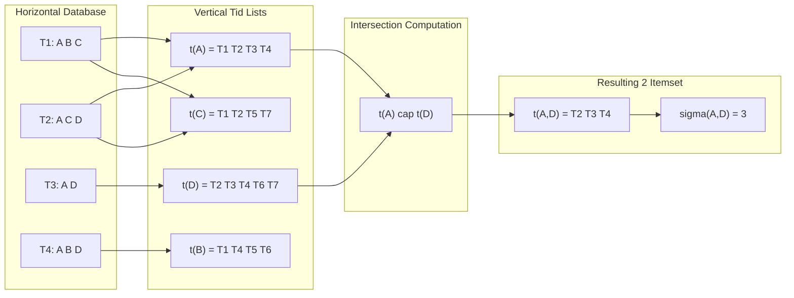
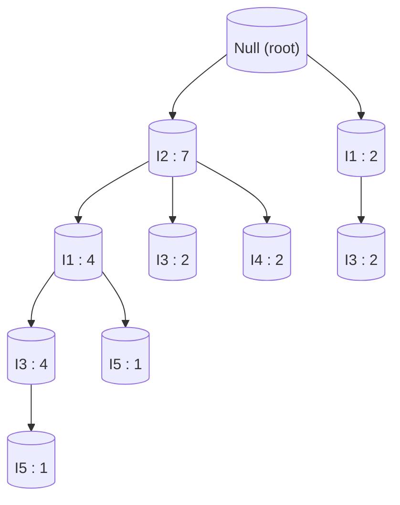
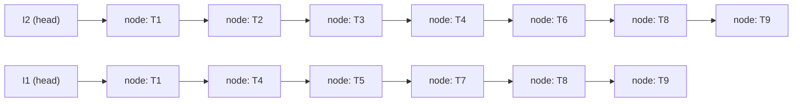
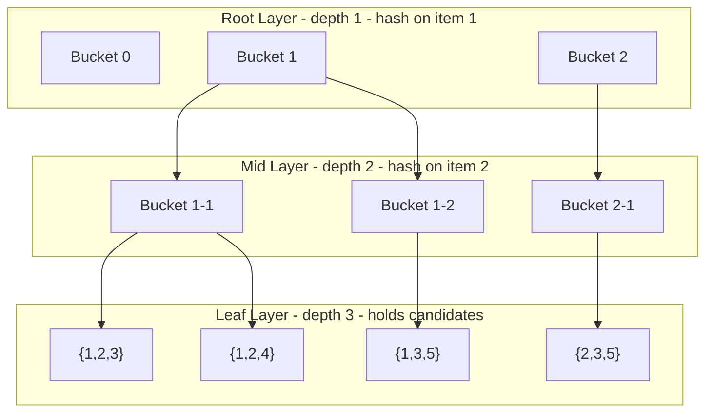

# Data structures

<!-- SECTION_1_START -->

# Data Structures for Association Rule Mining

## 1. Formal Definition (KTU 2024 Syllabus Terminology)

In **Association Rule Mining**, a *data structure* refers to a specialized storage layout used to organize transaction databases so that frequent itemsets can be discovered efficiently. The three principal data structures prescribed in the KTU 2024 PECST525 syllabus are:

1. **Tid-List (Transaction ID List / Vertical Data Format)** — A list of transaction identifiers (TIDs) associated with each item. For any $k$-itemset $X$, its Tid-list $t(X)$ is the set of TIDs containing $X$.
2. **Frequent Pattern Tree (FP-Tree)** — A compressed prefix-tree structure that stores the database as a set of overlapping branches, each branch representing a frequent-item sequence with an associated count.
3. **Hash Tree** — A $k$-level hashed bucket tree used during the **subset operation** of the Apriori algorithm to count the support of candidate $(k+1)$-itemsets efficiently.

> [!IMPORTANT]
> **Why these structures?** The naive horizontal scan of a transaction database has complexity $O(N \cdot W)$ per pass (where $N$ = number of transactions, $W$ = average width). The data structures above reduce candidate-support counting to near-constant or linear-in-result time, which is critical for mining large transactional warehouses.

---

## 2. Intuitive Overview (Real-World Analogy)

### a. Tid-List — *The Voter Roll Analogy*
Imagine a town where every resident (item) maintains a personal register listing the booths (transaction IDs) where they voted. To find voters who support *both* candidate A **and** candidate B, you simply **intersect** the two registers. Counting the intersection size gives you the support of $\{A, B\}$. This is precisely how the Eclat and AprioriTID algorithms compute support from a vertical layout.

### b. FP-Tree — *The Library Dewey-Decimal Compression*
Picture a library catalog. Many books share the same *first chapters* (common prefixes). Instead of duplicating the chapter list for every book, the librarian stores each shared chapter once and then branches out for the unique parts. The FP-Tree does the same: shared transaction prefixes are merged, and a **count** field records how many transactions follow that path. The original database is *recoverable* from the tree, but in a much smaller footprint.

### c. Hash Tree — *The Airport Check-In Counter Analogy*
At an airport, passengers (candidate itemsets) are routed to counters based on a hash of their boarding-pass number. Multiple counters serve parallel sub-hashes. When a transaction arrives, it is "hashed" and routed down the tree until it lands at a counter where only a small set of candidates is checked. Most of the candidate space is **pruned without inspection**, achieving amortized $O(1)$ lookup.

> [!NOTE]
> **Key Insight:** Tid-lists trade *storage* for *fast intersection*; FP-Tree trades *storage compression* for *no candidate generation*; Hash Tree trades *hashing overhead* for *fast subset containment testing*. Each suits a different mining paradigm.

### d. Horizontal vs. Vertical — Notation Used Throughout

| Layout | Schema | Support of $X$ |
| :--- | :--- | :--- |
| Horizontal | $T \to \{i_1, i_2, \dots\}$ | $\mid \{ T : X \subseteq T \} \mid$ |
| Vertical | $i \to \{T_1, T_2, \dots\}$ | $\mid t(X) \mid$ |

---

<!-- SECTION_1_END -->

<!-- SECTION_2_START -->

# Deep Theoretical Analysis & KTU High-Yield Formula Sheet

## 1. Tid-List (Vertical Data Format)

### Operational Logic
Given a database $\mathcal{D} = \{ T_1, T_2, \dots, T_n \}$, the vertical transformation produces a Tid-list $t(i)$ for every item $i$:

$$t(i) \;=\; \{\, T_j \in \mathcal{D} \mid i \in T_j \,\}$$

For a $k$-itemset $X = \{i_1, i_2, \dots, i_k\}$, its Tid-list is the **set intersection**:

$$t(X) \;=\; t(i_1) \,\cap\, t(i_2) \,\cap\, \cdots \,\cap\, t(i_k)$$

and its **support** is:

$$\sigma(X) \;=\; \mid t(X) \mid$$

### Why It Works (Underlying Principle)
Intersection is *monotonic in set size*: as $k$ grows, $\mid t(X) \mid$ never increases. Thus, the **Apriori property** (every subset of a frequent itemset is frequent) is automatically enforced — if $t(X) = \emptyset$, the algorithm does not even consider its supersets.

### Engineering Utility
Used in **Eclat** (Equivalence Class Transformation) and **AprioriTID** algorithms. Modern columnar databases (e.g., Apache Parquet, ClickHouse) exploit this idea via *late materialization*.

---

## 2. FP-Tree (Frequent Pattern Tree)

### Node Structure
Every FP-Tree node is a tuple:

$$N \;=\; (\,\text{item\_name},\; \text{count},\; \text{parent\_link},\; \text{children},\; \text{node\_link}\,)$$

A separate **Header Table** $H$ maps each frequent item to the head of its *node-link chain* (a linked list connecting all nodes in the tree carrying the same item — used for fast traversal when constructing conditional pattern bases).

### Construction Rule
1. **Scan 1** — Count support of every single item; retain items with $\sigma \geq \text{min\_support}$.
2. **Order items** in descending frequency (ties broken lexicographically).
3. **Scan 2** — For each transaction, keep only frequent items in the established order; insert this path into the tree, merging shared prefixes and incrementing counts.

### Formal Invariants
- The **root** represents the empty set and has item-name `Null`.
- Every path from root to a node represents an **ordered frequent-item sequence**.
- The **sum of counts** along any path equals the number of transactions that share that prefix.
- The tree is **lossy in count** but **lossless in itemset support** (recoverable via conditional pattern bases).

### Engineering Utility
Core of the **FP-Growth** algorithm, which avoids costly candidate generation. Used in market-basket analysis pipelines, recommendation engines, and bioinformatics for motif mining.

---

## 3. Hash Tree

### Purpose
During Apriori's subset step, the algorithm must determine, for each transaction $t$ and each candidate $c \in C_k$, whether $c \subseteq t$. A naive double loop is $O(\mid t \mid \cdot \mid C_k \mid)$. The hash tree reduces this to $O(\text{leaf size})$.

### Structure
- The tree has **depth $k$** for candidate $k$-itemsets.
- Each **internal node** contains a hash table with $b$ buckets; routing uses a hash function $h(\cdot)$ applied to individual items.
- Each **leaf node** stores a list of candidate itemsets.

### Subset Operation Algorithm
For each transaction $t$ with itemset $I = \{i_1, i_2, \dots\}$:
1. At depth $d$, hash on item $i_d$ and descend to the corresponding bucket.
2. Recurse until reaching a leaf.
3. At the leaf, for each stored candidate $c$, check whether $c \subseteq t$; if yes, increment $c$'s support counter.

The number of leaves that *must* be visited equals the number of **distinct $k$-subsets of $t$** that exist in $C_k$.

---

## 4. KTU Formula Sheet / Cheat Sheet

| Data Structure | Storage Complexity | Support of $k$-itemset | Time to Count One Itemset | Primary Algorithm |
| :--- | :--- | :--- | :--- | :--- |
| Horizontal Scan | $O(N \cdot W)$ | $\sum_{T} \mathbf{1}[X \subseteq T]$ | $O(N \cdot W)$ | Apriori (classic) |
| Tid-List (Vertical) | $O\!\left(\sum_{i} \mid t(i) \mid \right)$ | $\mid t(i_1) \cap t(i_2) \cap \cdots \cap t(i_k) \mid$ | $O\!\left(\sum_{j=1}^{k} \mid t(i_j) \mid \right)$ | Eclat, AprioriTID |
| FP-Tree | $O\!\left(\sum \text{path lengths}\right)$ | Reconstructed via conditional pattern base | $O(\text{tree size})$ | FP-Growth |
| Hash Tree | $O(\mid C_k \mid)$ | Leaf-level subset test | $O(b^{k-1} \cdot \text{leaf size})$ | Apriori (subset op) |

> [!IMPORTANT]
> **Boundary conditions** the examiner expects:
> - If $\mid t(X) \mid = 0$, then **no superset** of $X$ can be frequent.
> - In FP-Tree, the **root has count 0** and item `Null`.
> - In Hash Tree, **internal nodes hold hash tables**, *never* candidates; only leaves hold candidates.
> - The header table is sorted by **descending support** of single items.

---

<!-- SECTION_2_END -->

<!-- SECTION_3_START -->

# Step-by-Step Derivations & Code Implementation

## Example 1 — Tid-List Intersection (Exhaustive)

### Transaction Database

| TID | Items |
| :---: | :---: |
| $T_1$ | $\{A, B, C\}$ |
| $T_2$ | $\{A, C, D\}$ |
| $T_3$ | $\{A, D\}$ |
| $T_4$ | $\{A, B, D\}$ |
| $T_5$ | $\{B, C\}$ |
| $T_6$ | $\{B, D\}$ |
| $T_7$ | $\{C, D\}$ |

**Minimum support** threshold: $\text{min\_sup} = 3$ transactions.

### Step 1 — Construct Tid-Lists for Single Items

$$t(A) = \{T_1, T_2, T_3, T_4\} \quad \Rightarrow \quad \sigma(A) = 4$$

$$t(B) = \{T_1, T_4, T_5, T_6\} \quad \Rightarrow \quad \sigma(B) = 4$$

$$t(C) = \{T_1, T_2, T_5, T_7\} \quad \Rightarrow \quad \sigma(C) = 4$$

$$t(D) = \{T_2, T_3, T_4, T_6, T_7\} \quad \Rightarrow \quad \sigma(D) = 5$$

All four items are frequent (support $\geq 3$).

### Step 2 — Generate Candidate 2-Itemsets and Intersect

| Candidate $X$ | Computation | $t(X)$ | $\sigma(X)$ |
| :---: | :--- | :--- | :---: |
| $\{A,B\}$ | $t(A) \cap t(B) = \{T_1,T_2,T_3,T_4\} \cap \{T_1,T_4,T_5,T_6\}$ | $\{T_1, T_4\}$ | $2$ |
| $\{A,C\}$ | $t(A) \cap t(C) = \{T_1,T_2,T_3,T_4\} \cap \{T_1,T_2,T_5,T_7\}$ | $\{T_1, T_2\}$ | $2$ |
| $\{A,D\}$ | $t(A) \cap t(D) = \{T_1,T_2,T_3,T_4\} \cap \{T_2,T_3,T_4,T_6,T_7\}$ | $\{T_2, T_3, T_4\}$ | $\mathbf{3}$ |
| $\{B,C\}$ | $t(B) \cap t(C) = \{T_1,T_4,T_5,T_6\} \cap \{T_1,T_2,T_5,T_7\}$ | $\{T_1, T_5\}$ | $2$ |
| $\{B,D\}$ | $t(B) \cap t(D) = \{T_1,T_4,T_5,T_6\} \cap \{T_2,T_3,T_4,T_6,T_7\}$ | $\{T_4, T_6\}$ | $2$ |
| $\{C,D\}$ | $t(C) \cap t(D) = \{T_1,T_2,T_5,T_7\} \cap \{T_2,T_3,T_4,T_6,T_7\}$ | $\{T_2, T_7\}$ | $2$ |

**Frequent 2-itemsets** $L_2 = \{\{A, D\}\}$ (only $\{A, D\}$ meets threshold).

### Step 3 — Prune and Continue
Since $\mid L_2 \mid = 1$, the join step $L_2 \bowtie L_2$ cannot produce a 3-itemset (it requires *two* length-2 frequent itemsets sharing a prefix). **Algorithm terminates.**

**Final frequent itemsets:** $L_1 = \{\{A\}, \{B\}, \{C\}, \{D\}\}$, $L_2 = \{\{A, D\}\}$.

> [!NOTE]
> **Examiner Tip:** The intersection is performed item-by-item. Using the **smallest Tid-list first** (e.g., $t(C)$ for $\{C, D\}$) reduces computation. This optimization is the heart of the **DIC (Difference and Intersection Count)** technique.

---

## Example 2 — FP-Tree Construction (Exhaustive Trace)

### Transaction Database

| TID | Items |
| :---: | :---: |
| $T_1$ | $\{I_1, I_2, I_5\}$ |
| $T_2$ | $\{I_2, I_4\}$ |
| $T_3$ | $\{I_2, I_3\}$ |
| $T_4$ | $\{I_1, I_2, I_4\}$ |
| $T_5$ | $\{I_1, I_3\}$ |
| $T_6$ | $\{I_2, I_3\}$ |
| $T_7$ | $\{I_1, I_3\}$ |
| $T_8$ | $\{I_1, I_2, I_3, I_5\}$ |
| $T_9$ | $\{I_1, I_2, I_3\}$ |

**Minimum support:** $\text{min\_sup} = 2$.

### Step 1 — Count Single Items (First Scan)

$$\sigma(I_1) = 6, \quad \sigma(I_2) = 7, \quad \sigma(I_3) = 6, \quad \sigma(I_4) = 2, \quad \sigma(I_5) = 2$$

### Step 2 — Establish Global Order (Descending Frequency)

$$I_2 \,(7) \;>\; I_1 \,(6) \;>\; I_3 \,(6) \;>\; I_4 \,(2) \;>\; I_5 \,(2)$$

Ties ($I_1$ vs $I_3$, $I_4$ vs $I_5$) broken by **lexicographic order** (alphabetical): $I_1 < I_3$, $I_4 < I_5$.

### Step 3 — Filter and Reorder Each Transaction

| TID | Original | Filtered & Ordered (FList) |
| :---: | :--- | :--- |
| $T_1$ | $\{I_1, I_2, I_5\}$ | $I_2, I_1, I_5$ |
| $T_2$ | $\{I_2, I_4\}$ | $I_2, I_4$ |
| $T_3$ | $\{I_2, I_3\}$ | $I_2, I_3$ |
| $T_4$ | $\{I_1, I_2, I_4\}$ | $I_2, I_1, I_4$ |
| $T_5$ | $\{I_1, I_3\}$ | $I_1, I_3$ |
| $T_6$ | $\{I_2, I_3\}$ | $I_2, I_3$ |
| $T_7$ | $\{I_1, I_3\}$ | $I_1, I_3$ |
| $T_8$ | $\{I_1, I_2, I_3, I_5\}$ | $I_2, I_1, I_3, I_5$ |
| $T_9$ | $\{I_1, I_2, I_3\}$ | $I_2, I_1, I_3$ |

### Step 4 — Tree Insertion (Second Scan)

| Insertion | Resulting Branches Updated | Counts Touched |
| :---: | :--- | :--- |
| $T_1$ | $I_2 \to I_1 \to I_5$ | New: $I_2(1), I_1(1), I_5(1)$ |
| $T_2$ | $I_2 \to I_4$ | $I_2(2), I_4(1)$ |
| $T_3$ | $I_2 \to I_3$ | $I_2(3), I_3(1)$ |
| $T_4$ | $I_2 \to I_1 \to I_4$ | $I_2(4), I_1(2), I_4(2)$ |
| $T_5$ | $I_1 \to I_3$ (new sibling of $I_2 \to I_1$) | New: $I_1(1), I_3(1)$ |
| $T_6$ | $I_2 \to I_3$ | $I_2(5), I_3(2)$ |
| $T_7$ | $I_1 \to I_3$ | $I_1(2), I_3(2)$ |
| $T_8$ | $I_2 \to I_1 \to I_3 \to I_5$ | $I_2(6), I_1(3), I_3(3), I_5(2)$ |
| $T_9$ | $I_2 \to I_1 \to I_3$ | $I_2(7), I_1(4), I_3(4)$ |

### Step 5 — Final Header Table (with Node-Link Chains)

| Item | Count | Node-Link Traversal |
| :--- | :---: | :--- |
| $I_2$ | 7 | $T_1, T_2, T_3, T_4, T_6, T_8, T_9$ (all 7 nodes) |
| $I_1$ | 6 | $T_1, T_4, T_5, T_7, T_8, T_9$ |
| $I_3$ | 4 | $T_3, T_6, T_7, T_8, T_9$ (note: $T_5$ also has $I_3$ via sibling) |
| $I_4$ | 2 | $T_2, T_4$ |
| $I_5$ | 2 | $T_1, T_8$ |

> [!NOTE]
> The **node-link** for $I_3$ connects the four $I_3$ nodes *in the order they were inserted* — including the sibling-branch $I_3$ under $T_5$'s $I_1$ node. This is the chain used to construct the *conditional pattern base* during FP-Growth's recursion.

### Verification
Total count at root level: $\sigma(I_2) = 7$ ✓ (the single most-frequent item, equal to $N$). The tree faithfully encodes the entire database.

---

## Example 3 — Hash Tree Subset Operation (Walkthrough)

### Setup
Suppose the candidate set is $C_3 = \{\{1,2,3\}, \{1,2,4\}, \{1,3,5\}, \{2,3,5\}\}$.
A hash tree of depth $3$ is built with branching factor $b = 3$ at each internal node.
**Hash function:** $h(x) = x \bmod 3$.

### Step 1 — Build the Hash Tree
At the root (depth 1), candidates are bucketed by $h(\text{first item})$:
- $h(1) = 1$ → bucket 1: $\{\{1,2,3\}, \{1,2,4\}, \{1,3,5\}\}$
- $h(2) = 2$ → bucket 2: $\{\{2,3,5\}\}$
- $h(3) = 0$ → bucket 0: $\{\}$ (none)

At depth 2, we re-hash on the *second* item of each candidate still alive, and so on. Eventually every candidate reaches a leaf.

### Step 2 — Test a Transaction
Incoming transaction: $t = \{1, 2, 3, 5\}$.

**At root:**
- $h(1) = 1$ → descend to bucket 1
- $h(2) = 2$ → descend to bucket 2
- $h(3) = 0$ → descend to bucket 0
- $h(5) = 2$ → descend to bucket 2

**At depth 2 (continuing only the path with at least one candidate):**
- From bucket 1, we now hash on the *second* item: $h(2)=2$, $h(3)=0$ → descend accordingly.
- This continues until leaves are reached, where exact subset tests happen.

**Leaf-level matches:**
- $\{1,2,3\} \subseteq t$ ✓ → increment count to $1$
- $\{1,2,4\} \not\subseteq t$ ✗ (4 absent) → no change
- $\{1,3,5\} \subseteq t$ ✓ → increment count to $1$
- $\{2,3,5\} \subseteq t$ ✓ → increment count to $1$

**Result:** Three candidates incremented, one rejected — *without ever* checking the rejected candidate against the rest of $t$ beyond the hash.

> [!TIP]
> **Complexity insight:** With $b = 3$ and $k = 3$, the number of leaves *visited* is at most $\binom{\mid t \mid}{k} = \binom{4}{3} = 4$, but the number of *candidates actually examined* is far smaller because of the bucket pruning.

---

## Algorithmic Implementation — FP-Tree in Python

```python
from __future__ import annotations
from dataclasses import dataclass, field
from typing import Dict, List, Optional, Set
from collections import defaultdict


@dataclass
class FPNode:
    """Single node in the FP-Tree."""
    item: str
    count: int = 1
    parent: Optional["FPNode"] = None
    children: Dict[str, "FPNode"] = field(default_factory=dict)
    node_link: Optional["FPNode"] = None


class FPTree:
    """Build an FP-Tree from a list of transactions."""

    def __init__(self, min_support: int) -> None:
        if min_support < 1:
            raise ValueError("min_support must be >= 1")
        self.min_support: int = min_support
        self.root: FPNode = FPNode(item="Null", count=0)
        self.header_table: Dict[str, Optional[FPNode]] = {}
        self.freq_order: List[str] = []

    def _scan_counts(
        self, transactions: List[Set[str]]
    ) -> Dict[str, int]:
        """First pass: count item frequencies."""
        counts: Dict[str, int] = defaultdict(int)
        for t in transactions:
            for item in t:
                counts[item] += 1
        return {item: c for item, c in counts.items() if c >= self.min_support}

    def _build_header(
        self, freq_counts: Dict[str, int]
    ) -> List[str]:
        """Order items by descending count, then lexicographically."""
        ordered = sorted(freq_counts.items(), key=lambda x: (-x[1], x[0]))
        self.freq_order = [item for item, _ in ordered]
        for item in self.freq_order:
            self.header_table[item] = None
        return self.freq_order

    def _update_node_link(self, item: str, new_node: FPNode) -> None:
        """Append new_node to the node-link chain for `item`."""
        if self.header_table.get(item) is None:
            self.header_table[item] = new_node
        else:
            head = self.header_table[item]
            while head.node_link is not None:
                head = head.node_link
            head.node_link = new_node

    def insert_transaction(self, items: List[str], count: int = 1) -> None:
        """Insert a single ordered, frequent-item path into the tree."""
        current: FPNode = self.root
        for item in items:
            if item in current.children:
                current.children[item].count += count
            else:
                new_node = FPNode(
                    item=item, count=count, parent=current
                )
                current.children[item] = new_node
                self._update_node_link(item, new_node)
            current = current.children[item]

    def build(self, transactions: List[Set[str]]) -> None:
        """Two-pass FP-Tree construction."""
        freq_counts = self._scan_counts(transactions)
        if not freq_counts:
            return  # No frequent items -> empty tree.
        order = self._build_header(freq_counts)
        for t in transactions:
            filtered = [item for item in order if item in t]
            if filtered:
                self.insert_transaction(filtered, count=1)

    def display(self) -> None:
        """Pretty-print the tree in preorder."""
        def _walk(node: FPNode, depth: int) -> None:
            indent = "  " * depth
            print(f"{indent}- {node.item} (count={node.count})")
            for child in node.children.values():
                _walk(child, depth + 1)
        _walk(self.root, 0)


if __name__ == "__main__":
    transactions: List[Set[str]] = [
        {"I1", "I2", "I5"},
        {"I2", "I4"},
        {"I2", "I3"},
        {"I1", "I2", "I4"},
        {"I1", "I3"},
        {"I2", "I3"},
        {"I1", "I3"},
        {"I1", "I2", "I3", "I5"},
        {"I1", "I2", "I3"},
    ]
    tree = FPTree(min_support=2)
    tree.build(transactions)
    tree.display()
    print("Frequent order:", tree.freq_order)
```

**Sample output (truncated):**
```
- Null (count=0)
  - I2 (count=7)
    - I1 (count=4)
      - I3 (count=4)
        - I5 (count=1)
      - I5 (count=1)
    - I3 (count=2)
    - I4 (count=2)
  - I1 (count=2)
    - I3 (count=2)
Frequent order: ['I2', 'I1', 'I3', 'I4', 'I5']
```

---

<!-- SECTION_3_END -->

<!-- SECTION_4_START -->

# Structural Diagrams & Schematics

## 4.1 Tid-List Intersection Flow



## 4.2 FP-Tree Topology (Resulting Tree of Example 2)



> [!NOTE]
> The numbers `7, 4, 2, ...` represent **support counts** at each node. The shared prefix $I_2 \to I_1$ is reused by four transactions ($T_1, T_4, T_8, T_9$), saving $4 \times$ storage versus the raw horizontal layout.

## 4.3 FP-Tree Header Table with Node-Link Chains



## 4.4 Hash Tree Subset Operation (Sub-Block Functional Architecture)



> [!IMPORTANT]
> **Sequential Processing Topology:** For a candidate $c = \{i_a, i_b, i_c\}$, the *control flow* hashes $i_a$ → bucket at depth 1, $i_b$ → bucket at depth 2, $i_c$ → leaf containing $c$. The transaction's items are then tested against the leaf's candidates via subset containment. The **matrix mapping** is: $\text{hash}(i_a) \times \text{hash}(i_b) \to \text{leaf} \to c$.

## 4.5 Comparative Architecture Matrix

| Property | Tid-List | FP-Tree | Hash Tree |
| :--- | :--- | :--- | :--- |
| Primary Use | Counting $k$-itemsets | Mining all freq. itemsets | Counting $C_k$ candidates |
| Storage | Vertical lists | Compressed tree | Hashed bucket tree |
| Build Cost | One scan | Two scans | After $C_k$ generated |
| Lookup | Set intersection | Tree traversal | Hash + subset test |
| Strength | Simple, cache-friendly | No candidate generation | Fast pruning |

---

<!-- SECTION_4_END -->

<!-- SECTION_5_START -->

# KTU 2024 Scheme Examination Question Bank & Topic Recap

---

## Part A — Short Answer Questions (3 Marks Each)

### Question 1
**`[KTU University Exam — Dec 2023]`** $\quad$ **CO1, Remember**

Define **Tid-list**. Explain with an example how the support of a 2-itemset is computed using Tid-list intersection.

#### Model Answer (Valuation Key)

- **Tid-list definition [1 Mark]:** A Tid-list (Transaction ID list) of an item $i$ is the set of transaction identifiers $T_j$ in which $i$ appears; formally $t(i) = \{ T_j \in \mathcal{D} \mid i \in T_j \}$.
- **Construction example [1 Mark]:** For database with items $A, B, C$ across $T_1 \dots T_4$, write out $t(A), t(B), t(C)$ as sample lists.
- **Intersection formula [1 Mark]:** $\sigma(\{A, B\}) = \mid t(A) \cap t(B) \mid$. Worked example: if $t(A) = \{T_1, T_2, T_4\}$ and $t(B) = \{T_2, T_3, T_4\}$, then $\sigma(\{A, B\}) = \mid \{T_2, T_4\} \mid = 2$.

---

### Question 2
**`[KTU University Exam — July 2024]`** $\quad$ **CO1, Remember**

List the **components of an FP-Tree node** and state the role of the **header table**.

#### Model Answer (Valuation Key)

- **Node components [2 Marks]:** (i) `item_name`, (ii) `count`, (iii) `parent_link`, (iv) `children` (a dict of child nodes), (v) `node_link` (pointer to next node with the same item).
- **Header table role [1 Mark]:** It maps each frequent item to the head of its node-link chain, enabling fast traversal when constructing conditional pattern bases during FP-Growth's recursion.

---

## Part B — 14-Mark Questions (ESE Module Internal Choice)

### Question 1 (Choice A) — FP-Tree Construction

**`[KTU University Exam — Dec 2023]`** $\quad$ **CO1 / CO2 — Understand + Apply**

**(a)** Explain the **FP-Tree data structure** in detail. What are its main components and what properties does it preserve? **\[7 Marks\]**

**(b)** Construct the FP-Tree for the following transaction database with $\text{min\_support} = 30\%$. **\[7 Marks\]**

| TID | Items |
| :---: | :--- |
| $T_1$ | Bread, Butter, Milk |
| $T_2$ | Bread, Butter |
| $T_3$ | Butter, Milk |
| $T_4$ | Bread, Milk |
| $T_5$ | Bread, Butter, Milk |
| $T_6$ | Butter, Milk |
| $T_7$ | Bread, Milk |

Assume $\mid \mathcal{D} \mid = 7$.

---

#### Model Solution

**(a) FP-Tree Explanation [7 Marks]**

- **Definition [1 Mark]:** A compressed prefix-tree data structure that stores the essential information of a transaction database for frequent-pattern mining.
- **Node structure [1 Mark]:** Each node stores `item_name`, `count`, `parent_link`, `children`, `node_link`.
- **Header table [1 Mark]:** Maintains entry for every frequent item plus the head of its node-link chain.
- **Root [1 Mark]:** A virtual `Null` node with `count = 0`, parent of all top-level branches.
- **Property — lossless compression [1 Mark]:** Every transaction's items can be recovered by following a root-to-leaf path; the count gives the multiplicity of that prefix.
- **Property — Apriori enforced [1 Mark]:** Only frequent 1-itemsets are included, so any branch implies frequency of all its prefixes.
- **Use in FP-Growth [1 Mark]:** Recursively constructs conditional pattern bases from node-link chains, eliminating candidate generation entirely.

**(b) FP-Tree Construction [7 Marks]**

**Step 1 — Count support (with $\text{min\_sup} = 30\% \Rightarrow \text{min\_count} = 3$) [1 Mark]:**

$$\sigma(\text{Bread}) = 5, \quad \sigma(\text{Butter}) = 5, \quad \sigma(\text{Milk}) = 6$$

All items are frequent.

**Step 2 — Establish order (descending count, tie by alphabet) [1 Mark]:**

$$\text{Milk} (6) > \text{Butter} (5) > \text{Bread} (5)$$

**Step 3 — Filter and reorder transactions [1 Mark]:**

| TID | Filtered & Ordered |
| :---: | :--- |
| $T_1$ | Milk, Butter, Bread |
| $T_2$ | Butter, Bread |
| $T_3$ | Milk, Butter |
| $T_4$ | Milk, Bread |
| $T_5$ | Milk, Butter, Bread |
| $T_6$ | Milk, Butter |
| $T_7$ | Milk, Bread |

**Step 4 — Build the tree [3 Marks]:**

| Insertion | Result |
| :---: | :--- |
| $T_1$ | New: Milk(1) → Butter(1) → Bread(1) |
| $T_2$ | New: Butter(1) → Bread(1) (sibling branch) |
| $T_3$ | Milk(2) → Butter(2) |
| $T_4$ | Milk(3) → Bread(1) (new child of Milk) |
| $T_5$ | Milk(4) → Butter(3) → Bread(2) |
| $T_6$ | Milk(5) → Butter(4) |
| $T_7$ | Milk(6) → Bread(2) |

**Step 5 — Header table [1 Mark]:**

| Item | Count | Node-Links |
| :--- | :---: | :--- |
| Milk | 6 | All 6 insertions |
| Butter | 4 | $T_1, T_3, T_5, T_6$ (chains via Butter nodes) |
| Bread | 2 | $T_1, T_5$ under Butter; $T_4, T_7$ under Milk |

> [!WARNING]
> **Examiner Pitfall — FP-Tree:** Many students *forget* to **filter non-frequent items** before insertion, or place items in the **wrong order** (e.g., alphabetical instead of frequency-descending). Either mistake makes the tree invalid.

---

### Question 2 (Choice B) — Hash Tree and Tid-List Mining

**`[KTU University Exam — July 2024]`** $\quad$ **CO1 / CO2 — Understand + Apply**

**(a)** What is a **Hash Tree**? Explain its role in the **subset operation** of the Apriori algorithm. **\[7 Marks\]**

**(b)** Using the **Tid-list (vertical) approach**, find all frequent itemsets for the following database with $\text{min\_support} = 40\%$. **\[7 Marks\]**

| TID | Items |
| :---: | :--- |
| $T_1$ | $\{P, Q, R\}$ |
| $T_2$ | $\{P, R\}$ |
| $T_3$ | $\{Q, R\}$ |
| $T_4$ | $\{P, Q\}$ |
| $T_5$ | $\{P, Q, R\}$ |

Assume $\mid \mathcal{D} \mid = 5$.

---

#### Model Solution

**(a) Hash Tree Explanation [7 Marks]**

- **Definition [1 Mark]:** A $k$-level tree in which internal nodes are hash tables and leaf nodes store candidate $k$-itemsets.
- **Why needed [1 Mark]:** During subset operation, the algorithm must, for each transaction $t$, check which candidates $c \in C_k$ satisfy $c \subseteq t$. A naive scan is $O(\mid t \mid \cdot \mid C_k \mid)$.
- **Structure of internal nodes [1 Mark]:** Each internal node has $b$ buckets; the bucket for an item $i$ is chosen by applying a hash function $h(i)$.
- **Structure of leaf nodes [1 Mark]:** Each leaf stores a list of candidates. When the recursion reaches depth $k$, the algorithm tests the candidates in the leaf against $t$.
- **Subset operation [2 Marks]:**
  1. Start at root with the transaction's items.
  2. At depth $d$, hash on the $d$-th item and descend into the chosen bucket.
  3. Recurse until reaching a leaf.
  4. For each candidate in the leaf, perform a subset-containment check; if true, increment its support counter.
- **Net effect [1 Mark]:** Most candidates are pruned without inspection, reducing cost from $O(\mid t \mid \cdot \mid C_k \mid)$ to $O(b^{k-1} \cdot \text{leaf size})$.

**(b) Tid-List Mining [7 Marks]**

**Step 1 — Minimum count [1 Mark]:**

$$\text{min\_support} = 40\% \Rightarrow \text{min\_count} = 0.4 \times 5 = 2$$

**Step 2 — Build Tid-lists and compute $L_1$ [1 Mark]:**

$$t(P) = \{T_1, T_2, T_4, T_5\} \Rightarrow \sigma(P) = 4 \text{ ✓}$$

$$t(Q) = \{T_1, T_3, T_4, T_5\} \Rightarrow \sigma(Q) = 4 \text{ ✓}$$

$$t(R) = \{T_1, T_2, T_3, T_5\} \Rightarrow \sigma(R) = 4 \text{ ✓}$$

So $L_1 = \{\{P\}, \{Q\}, \{R\}\}$.

**Step 3 — Compute candidates for 2-itemsets via intersection [2 Marks]:**

| Candidate | $t(X)$ Computation | $t(X)$ | $\sigma(X)$ |
| :---: | :--- | :--- | :---: |
| $\{P, Q\}$ | $t(P) \cap t(Q) = \{T_1,T_2,T_4,T_5\} \cap \{T_1,T_3,T_4,T_5\}$ | $\{T_1, T_4, T_5\}$ | $\mathbf{3}$ ✓ |
| $\{P, R\}$ | $t(P) \cap t(R) = \{T_1,T_2,T_4,T_5\} \cap \{T_1,T_2,T_3,T_5\}$ | $\{T_1, T_2, T_5\}$ | $\mathbf{3}$ ✓ |
| $\{Q, R\}$ | $t(Q) \cap t(R) = \{T_1,T_3,T_4,T_5\} \cap \{T_1,T_2,T_3,T_5\}$ | $\{T_1, T_3, T_5\}$ | $\mathbf{3}$ ✓ |

All three are frequent: $L_2 = \{\{P,Q\}, \{P,R\}, \{Q,R\}\}$.

**Step 4 — Generate 3-itemset via join [1 Mark]:**

$$L_2 \bowtie L_2 = \{\{P, Q, R\}\}$$

**Step 5 — Compute $t(\{P, Q, R\})$ [1 Mark]:**

$$t(\{P, Q, R\}) = t(P) \cap t(Q) \cap t(R) = \{T_1, T_5\}$$

$$\sigma(\{P, Q, R\}) = 2 \geq 2 \text{ ✓}$$

**Step 6 — Final result [1 Mark]:**

$$L_3 = \{\{P, Q, R\}\} \quad\Rightarrow\quad \text{Total frequent itemsets: } L_1 \cup L_2 \cup L_3$$

$$\boxed{\{P\}, \{Q\}, \{R\}, \{P,Q\}, \{P,R\}, \{Q,R\}, \{P,Q,R\}}$$

> [!WARNING]
> **Examiner Pitfall — Tid-list:** A common error is computing $\sigma(\{P, Q, R\})$ by **summing pairwise supports** instead of taking the **triple intersection**. Only the transactions containing *all three* items count. Another mistake: forgetting to convert percentage support to an absolute count before thresholding.

---

## Topic Recap & Important Things to Remember

- **Three core data structures:** Tid-list (vertical format), FP-Tree (compressed prefix tree), Hash Tree (candidate-counting bucket tree).
- **Tid-list invariant:** $\sigma(X) = \mid t(i_1) \cap t(i_2) \cap \cdots \cap t(i_k) \mid$. If $t(X) = \emptyset$, no superset of $X$ is frequent.
- **Tid-list optimization:** Always intersect with the *smallest* Tid-list first (DIC technique).
- **FP-Tree node components (5-tuple):** `item_name`, `count`, `parent_link`, `children`, `node_link`.
- **FP-Tree build order:** (1) Count in scan 1 → (2) Order by descending frequency, tie-break lexicographically → (3) Filter & reorder in scan 2 → (4) Merge shared prefixes.
- **FP-Tree header table:** One entry per frequent item; each entry holds the head of a node-link chain linking *all* nodes bearing that item.
- **FP-Tree root:** Always `Null` with `count = 0`.
- **Hash Tree shape:** Depth = candidate size $k$; internal nodes = hash tables; **leaves only** hold candidates.
- **Hash Tree routing:** Hash function $h(\cdot)$ applied on the $d$-th item at depth $d$.
- **Hash Tree purpose:** Speeds up the **subset step** in Apriori — the algorithm's most expensive operation.
- **Apriori property:** Every subset of a frequent itemset is frequent; every superset of an infrequent itemset is infrequent.
- **KTU standard units / parameters:** $\text{min\_support}$ may be expressed as a *count* (e.g., 3 transactions) or *fraction* (e.g., 40%); **always convert fraction → absolute count** using $N = \mid \mathcal{D} \mid$ before comparison.
- **Storage trade-offs:** Tid-list = $O(\sum_i \mid t(i) \mid)$; FP-Tree = $O(\text{number of frequent paths})$; Hash Tree = $O(\mid C_k \mid)$.
- **Algorithm pairing:** Tid-list ↔ Eclat/AprioriTID; FP-Tree ↔ FP-Growth; Hash Tree ↔ Apriori (subset operation).
- **Common valuation pitfalls to avoid:** (i) Wrong item order in FP-Tree, (ii) forgetting to filter non-frequent items, (iii) summing instead of intersecting for support, (iv) mixing up horizontal vs. vertical notation, (v) omitting the header table from FP-Tree diagrams.

---

<!-- SECTION_5_END -->
