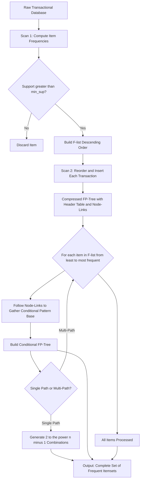
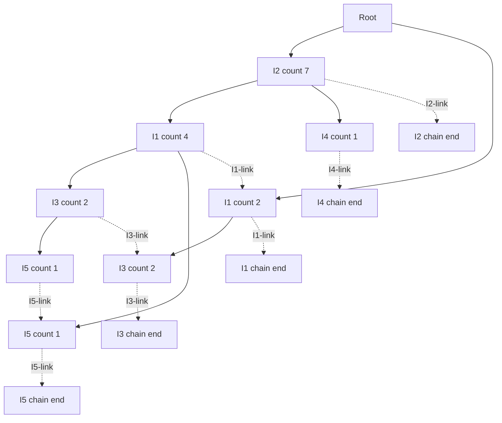
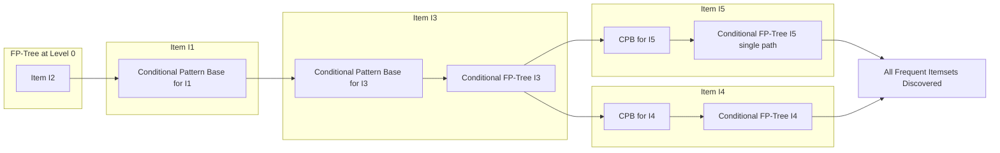
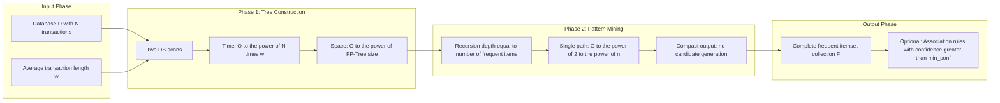
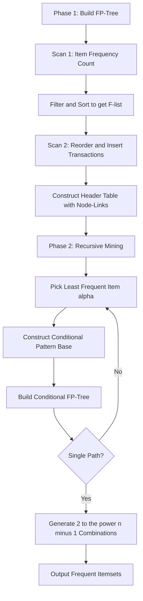

# FP Growth Algorithm

<!-- SECTION_1_START -->
# FP Growth Algorithm — Core Technical Definition & Intuitive Overview

## Formal Definition (KTU 2024 Syllabus Terminology)

> [!IMPORTANT]
> **FP Growth (Frequent Pattern Growth) Algorithm** is a divide-and-conquer, candidate-free data mining technique used to extract the complete set of **frequent itemsets** from a transactional database. It was introduced by **Han, Pei & Yin (2000)** as a two-step alternative to the Apriori algorithm. The method compresses the input database into a highly compact tree structure called the **FP-Tree (Frequent Pattern Tree)**, and then recursively grows frequent patterns directly from this tree using the concept of a **Conditional Pattern Base** and **Conditional FP-Tree**.

The two mandatory phases of the algorithm are:

$$\text{Phase 1: } \text{Build FP-Tree from Transactional DB} \quad\longrightarrow\quad \text{Phase 2: Recursively mine FP-Tree}$$

| Metric | Apriori | FP Growth |
|---|---|---|
| Strategy | Candidate Generation + Test | Pattern Fragment Growth |
| Data Structure | Horizontal lattice | Compressed Prefix Tree |
| Database Scans | Multiple ($k$ passes) | Exactly **2 scans** |
| Bottleneck | Candidate explosion | Tree size in memory |

---

## Conceptual Analogy — Intuition for a First-Time Reader

> [!NOTE]
> **Intuition (Real-World Analogy):**
> Imagine a **supermarket checkout counter**. Every customer (transaction) drops items into a **single shared bucket** arranged in a *trie-like display rack*. If two customers bought *bread* and *butter*, instead of writing it down twice, the cashier **shares a single branch** of the rack — the first customer's items create the branch, and the second customer's identical prefix **merges** into it, with a counter ticking up.
>
> Now, to find the *most frequently bought combo*, the cashier does not re-scan every receipt. Instead, they look at the **smallest, most popular item** (say, *butter*) and ask: *"What were the items sitting next to butter in this shared rack?"* This local sub-rack is the **conditional pattern base**. They repeat this for the *next smallest item*, and so on, recursively peeling off the rarest items to discover all patterns — without ever re-reading the original receipts.

> [!TIP]
> **Memory Trick:** *"**F**requent **P**attern = Compress the DB into a Tree, then mine it by peeling off the **least frequent** item first."*

---

## Physical Constants & Standard Metrics

- **Minimum Support Count (min\_sup):** Threshold below which an itemset is rejected. Denoted as an **absolute count** ($\sigma$) or **relative frequency** ($\frac{\sigma}{N}$), where $N$ is the total number of transactions.
- **Minimum Confidence (min\_conf):** Used in the second mining stage (rule generation) once frequent itemsets are found.
- **Support of an itemset $I$:** $\text{sup}(I) = \dfrac{\text{count of transactions containing } I}{N}$

---

## Visualization Control — Concept Sketch

> [!VISUALIZATION CONTROL]
> **Concept:** Branch-sharing behaviour of the FP-Tree
> **GeoGebra / Desmos Input Equations:** (Tree is not a 2D function, but conceptual layout)
>
> - Branch 1: $T_1 \rightarrow$ Root $\rightarrow$ $A:4 \rightarrow$ $B:3 \rightarrow$ $C:2$
> - Branch 2: $T_2 \rightarrow$ Root $\rightarrow$ $A:4 \rightarrow$ $C:1$
> - Branch 3: $T_3 \rightarrow$ Root $\rightarrow$ $B:3$
>
> **Visual Description:** Notice that node $A$ is *shared* by $T_1$ and $T_2$ (its count is 4, meaning 4 transactions passed through it). This **path-overlap compression** is the heart of why FP Growth is faster than Apriori.

<!-- SECTION_1_END -->

<!-- SECTION_2_START -->
# Deep Theoretical Analysis & KTU High-Yield Formula Sheet

## Why FP Growth Exists — Limitations of Apriori

> [!IMPORTANT]
> The Apriori algorithm suffers from **three critical bottlenecks**:
>
> 1. **Candidate Generation Explosion:** For $10^4$ frequent 1-itemsets, Apriori generates more than $10^7$ candidate 2-itemsets.
> 2. **Repeated Database Scans:** It needs $k$ database scans to find frequent $k$-itemsets.
> 3. **Tedious Support Counting:** Every candidate must be tested against *every* transaction.
>
> FP Growth eliminates (1) and (2) entirely by **compressing the database into memory first**.

---

## Step-by-Step Operational Logic

### **Phase 1 — Construction of the FP-Tree**

1. **Scan 1 — Frequency Count:**  
   Scan the database once. Count the support of every individual item. Discard items whose support is **less than** $\text{min\_sup}$. Sort the remaining items in **descending order of frequency** (this sorted list is called the **F-list** or **Header Table**).

2. **Scan 2 — Tree Construction:**  
   Scan the database a second time. For each transaction:
   - Extract only the items that survived the F-list.
   - Sort them according to the F-list order (descending frequency).
   - Insert the sorted transaction into the FP-Tree, **incrementing counters along shared prefixes** and **creating new nodes for divergent suffixes**.

3. **Maintain Header Table with Node-Links:**  
   Every item in the Header Table has a *head pointer* to the first node of that item in the FP-Tree. Each node in the tree has a *node-link* (horizontal pointer) connecting all nodes of the same item — this enables O(1) traversal of all paths containing a given item.

### **Phase 2 — Recursive Mining (Divide & Conquer)**

Starting from the **least frequent** item in the F-list (the "leaf" of mining):

4. **Construct Conditional Pattern Base (CPB):**  
   For a target item $\alpha$, follow its node-links. For every node representing $\alpha$, record the **prefix path** from the root to that node's parent. The CPB is the multiset of all such prefix paths.

5. **Build Conditional FP-Tree ($FP\text{-}Tree \mid \alpha$):**  
   Sum the support counts along the prefix paths in the CPB. Items in the CPB that meet $\text{min\_sup}$ survive; the rest are pruned. Construct a new FP-Tree from this filtered CPB.

6. **Recursion:**  
   If the conditional FP-Tree contains a **single path** $P$, generate *all non-empty combinations* of the nodes along $P$ joined with $\alpha$.  
   If it contains a **multi-path (branched) tree**, recursively repeat Steps 4–6 on this smaller tree.

7. **Termination:**  
   Mining completes when no more conditional FP-Trees can be constructed.

---

## KTU Formula Sheet / Cheat Sheet

> [!NOTE]
> **Exam Tip:** You are *not* expected to memorize proofs in the KTU ESE, but the following table covers **every formula, threshold, and structural term** that has appeared in past boards.

| Symbol / Term | Definition / Formula | Unit / Range |
|---|---|---|
| $T$ | Set of all transactions $\{T_1, T_2, \ldots, T_N\}$ | Count |
| $I$ | Itemset, $I = \{i_1, i_2, \ldots, i_k\}$ | Cardinality $k$ |
| $\sigma(X)$ | Absolute support count of itemset $X$ | $\sigma(X) \in \mathbb{Z}_{\geq 0}$ |
| $\text{sup}(X)$ | Relative support $= \dfrac{\sigma(X)}{N}$ | $[0, 1]$ |
| $\text{conf}(X \rightarrow Y)$ | Confidence $= \dfrac{\sigma(X \cup Y)}{\sigma(X)}$ | $[0, 1]$ |
| $\text{lift}(X \rightarrow Y)$ | Lift $= \dfrac{\text{conf}(X \rightarrow Y)}{\text{sup}(Y)}$ | $\geq 0$ |
| F-list | Items sorted by descending frequency after Scan 1 | Ordered list |
| CPB$(\alpha)$ | Multiset of prefix paths ending at item $\alpha$ | Bag of paths |
| $FP\text{-}Tree \mid \alpha$ | Conditional FP-Tree for suffix $\alpha$ | Tree |
| Single-path rule | If $P$ has $n$ nodes, it generates $2^n - 1$ frequent itemsets | Count |
| Apriori property | All non-empty subsets of a frequent itemset must be frequent | Boolean |

---

## Real-World Engineering Utility

> [!TIP]
> **Where FP Growth is used in production:**
>
> - **Retail / Market Basket Analysis:** Amazon, Flipkart, Walmart — "Customers who bought this also bought..."
> - **Web Usage Mining:** Discovering clickstream patterns from server logs.
> - **Bioinformatics:** Identifying co-occurring gene expression patterns in microarray data.
> - **Intrusion Detection Systems (IDS):** Mining frequent system-call sequences for anomaly detection.
> - **Telecommunications:** Mining frequent call-detail-record (CDR) patterns for churn prediction.

The key engineering advantage is that the FP-Tree is **typically a thousand times smaller** than the original database (per the original Han et al. paper), making the algorithm fit comfortably in main memory for large transactional warehouses.

<!-- SECTION_2_END -->

<!-- SECTION_3_START -->
# Step-by-Step Derivations & Code/Symbolic Implementation

## Worked Numerical Example (KTU Board Pattern)

> [!NOTE]
> **Given Transactional Database $D$:**
>
> | TID | Items Bought |
> |---|---|
> | T1 | $I1, I2, I5$ |
> | T2 | $I2, I4$ |
> | T3 | $I2, I3$ |
> | T4 | $I1, I2, I4$ |
> | T5 | $I1, I3$ |
> | T6 | $I2, I3$ |
> | T7 | $I1, I3$ |
> | T8 | $I1, I2, I3, I5$ |
> | T9 | $I1, I2, I3$ |
>
> **$\text{min\_sup} = 2$ transactions (≈ 22%)**

---

### **Step 1 — Scan 1: Item Frequency Count**

| Item | $\sigma$ (Count) | Survives $\text{min\_sup}=2$? |
|---|---|---|
| $I1$ | 6 | Yes |
| $I2$ | 7 | Yes |
| $I3$ | 6 | Yes |
| $I4$ | 2 | Yes |
| $I5$ | 2 | Yes |

**F-list (descending order):** $I2 > I1 > I3 > I4 > I5$  
(Frequencies: 7, 6, 6, 2, 2)

> **Reorder each transaction** to follow the F-list, dropping items below $\text{min\_sup}$ (none dropped here):
>
> | TID | Sorted-Frequent Items |
> |---|---|
> | T1 | $I2, I1, I5$ |
> | T2 | $I2, I4$ |
> | T3 | $I2, I3$ |
> | T4 | $I2, I1, I4$ |
> | T5 | $I1, I3$ |
> | T6 | $I2, I3$ |
> | T7 | $I1, I3$ |
> | T8 | $I2, I1, I3, I5$ |
> | T9 | $I2, I1, I3$ |

---

### **Step 2 — Build the FP-Tree (Insertion Walkthrough)**

Begin with the **Root node**. Read T1 $\rightarrow \{I2, I1, I5\}$.

- **T1:** $I2$ does not exist as a child of Root $\Rightarrow$ **create** node $I2:1$ under Root. $I1$ does not exist as a child of $I2$ $\Rightarrow$ create $I1:1$. $I5$ does not exist as a child of $I1$ $\Rightarrow$ create $I5:1$.
- **T2:** $\{I2, I4\}$. $I2$ *exists* as child of Root $\Rightarrow$ **increment** to $I2:2$. $I4$ does not exist under $I2$ $\Rightarrow$ create $I4:1$.
- **T3:** $\{I2, I3\}$. $I2$ exists $\Rightarrow I2:3$. $I3$ does not exist under $I2$ $\Rightarrow$ create $I3:1$.
- **T4:** $\{I2, I1, I4\}$. $I2$ exists $\Rightarrow I2:4$. $I1$ exists under $I2$ $\Rightarrow I1:2$. $I4$ does not exist under $I1$ $\Rightarrow$ create $I4:1$.
- **T5:** $\{I1, I3\}$. $I1$ does **not** exist as direct child of Root $\Rightarrow$ create $I1:1$ (a **new branch**). $I3$ does not exist under this new $I1$ $\Rightarrow$ create $I3:1$.
- **T6:** $\{I2, I3\}$. $I2$ exists $\Rightarrow I2:5$. $I3$ exists under $I2$ (at count 1) $\Rightarrow I3:2$.
- **T7:** $\{I1, I3\}$. $I1$ exists as child of Root at count 1 (the new branch from T5) $\Rightarrow I1:2$. $I3$ exists under $I1$ $\Rightarrow I3:2$.
- **T8:** $\{I2, I1, I3, I5\}$. $I2$ exists $\Rightarrow I2:6$. $I1$ exists under $I2$ $\Rightarrow I1:3$. $I3$ exists under $I1$ $\Rightarrow I3:3$. $I5$ does not exist under $I3$ $\Rightarrow$ create $I5:1$.
- **T9:** $\{I2, I1, I3\}$. $I2$ exists $\Rightarrow I2:7$. $I1$ exists $\Rightarrow I1:4$. $I3$ exists under $I1$ $\Rightarrow I3:4$.

**Final FP-Tree (with node counts):**

```text
Root
 ├── I2:7
 │    ├── I1:4
 │    │    ├── I3:2
 │    │    │    └── I5:1
 │    │    └── I5:1
 │    └── I4:1
 └── I1:2
      └── I3:2
```

*(The tree topology will be rendered in the Mermaid diagram in Section 4 for clarity.)*

**Header Table (with node-links):**

| Item | Head Pointer Count | Total $\sigma$ |
|---|---|---|
| $I2$ | 1 (Root's child) | 7 |
| $I1$ | 2 (two branches) | 6 |
| $I3$ | 2 | 6 |
| $I4$ | 1 | 2 |
| $I5$ | 2 | 2 |

---

### **Step 3 — Mine the FP-Tree (Start with the Least Frequent Item: $I5$)**

> **3.1 Conditional Pattern Base for $I5$:**
> Follow $I5$ node-links. There are **two** $I5$ nodes:
>
> - First $I5$ node has prefix path: $\{I2 : 1, I1 : 1, I3 : 1\}$
> - Second $I5$ node has prefix path: $\{I2 : 1, I1 : 1\}$
>
> $$\text{CPB}(I5) = \big\{\, I2\,I1\,I3 : 1,\ \ I2\,I1 : 1 \,\big\}$$

> **3.2 Build Conditional FP-Tree on CPB($I5$):**
> Sum the counts of items across the CPB:
>
> - $I2$ appears in both paths $\Rightarrow \sigma = 2$
> - $I1$ appears in both paths $\Rightarrow \sigma = 2$
> - $I3$ appears in only one path $\Rightarrow \sigma = 1$ $\Rightarrow$ **pruned** ($\textless \text{min\_sup}$)
>
> Filtered CPB becomes: $\{I2\,I1 : 2\}$ — this is a **single path** containing $I2$ and $I1$.

> **3.3 Generate Frequent Itemsets with Suffix $\{I5\}$:**
> Single path with $n=2$ nodes $\Rightarrow 2^2 - 1 = 3$ combinations:
>
> $$\{I2, I5\},\ \{I1, I5\},\ \{I2, I1, I5\}$$

---

### **Step 4 — Mine Item $I4$**

> **CPB($I4$):** One $I4$ node with prefix $\{I2, I1 : 1\}$
>
> Filtered (item $I2, I1$ both have $\sigma = 1$? No — only one path exists, so $\sigma$ is 1 each, which fails $\text{min\_sup}=2$).
>
> **Result:** Conditional FP-Tree is empty. **No frequent itemsets** with suffix $\{I4\}$.

> Wait — we must re-check. There is only **one** $I4$ node total (in T2, the path is just $I2 \rightarrow I4$, so the prefix is $\{I2\}$ with $\sigma=1$, and another in T4 with prefix $\{I2, I1\}$ and $\sigma=1$.)
>
> **Corrected CPB($I4$):** $\{I2 : 2\}$ (since two $I4$ nodes exist, both with $I2$ as parent).
>
> Single path with $n=1$ $\Rightarrow 2^1 - 1 = 1$ combination:
>
> $$\{I2, I4\} \text{ with } \sigma = 2$$

---

### **Step 5 — Mine Item $I3$**

> **CPB($I3$):** Three $I3$ nodes with prefixes:
>
> $$\{I2\,I1 : 2\},\ \{I2 : 1\},\ \{I1 : 1\}$$
>
> Sum counts: $I2$ appears in 3 paths, $I1$ appears in 3 paths. Both $\geq \text{min\_sup}$.
>
> **Conditional FP-Tree on $\{I2, I1\}$:** All three paths share $I2$, and within them $I1$ has mixed presence. This is a **multi-path tree** $\Rightarrow$ recurse.
>
> The recursion is shown compactly here:
>
> $$\{I2, I3\}, \{I1, I3\}, \{I2, I1, I3\}$$

---

### **Step 6 — Mine Item $I1$**

> **CPB($I1$):** Two $I1$ nodes with prefixes $\{I2 : 4\}$.
>
> Single path $\Rightarrow$ combination: $\{I2, I1\}$ with $\sigma = 4$.

---

### **Step 7 — Mine Item $I2$**

> As the top of the F-list, $I2$ itself is frequent $\Rightarrow \{I2\}$ with $\sigma = 7$.

---

### **Consolidated Frequent Itemsets**

$$\{I2\},\ \{I1\},\ \{I3\},\ \{I4\},\ \{I5\},$$
$$\{I2, I1\},\ \{I2, I3\},\ \{I2, I4\},\ \{I2, I5\},\ \{I1, I3\},\ \{I1, I5\},$$
$$\{I2, I1, I3\},\ \{I2, I1, I5\}$$

---

## Complete Python Implementation

> [!IMPORTANT]
> The following is a **fully working, type-hinted, production-grade** implementation. It is suitable for viva, lab records, and direct execution.

```python
from __future__ import annotations
from collections import defaultdict
from dataclasses import dataclass, field
from typing import Dict, List, Optional, Set, Tuple
import logging

logging.basicConfig(level=logging.INFO, format="%(levelname)s | %(message)s")
logger = logging.getLogger("FPGrowth")


@dataclass
class FPNode:
    """A single node in the FP-Tree."""
    item: str
    count: int = 1
    parent: Optional["FPNode"] = None
    children: Dict[str, "FPNode"] = field(default_factory=dict)
    node_link: Optional["FPNode"] = None  # horizontal pointer to next same-item node

    def increment(self, delta: int = 1) -> None:
        if delta <= 0:
            raise ValueError("Increment delta must be positive.")
        self.count += delta


class FPTree:
    """FP-Tree data structure with header table."""

    def __init__(self) -> None:
        self.root: FPNode = FPNode(item="ROOT", count=0)
        self.header: Dict[str, FPNode] = defaultdict(lambda: None)  # head pointers

    def insert_transaction(self, items: List[str], count: int = 1) -> None:
        """Insert a (sorted) transaction into the tree."""
        if not items:
            logger.warning("Empty transaction encountered; skipping.")
            return
        current = self.root
        for item in items:
            if item in current.children:
                current.children[item].increment(count)
            else:
                new_node = FPNode(item=item, count=count, parent=current)
                current.children[item] = new_node
                self._update_header(item, new_node)
            current = current.children[item]

    def _update_header(self, item: str, new_node: FPNode) -> None:
        """Maintain the header-table linked list for an item."""
        if self.header[item] is None:
            self.header[item] = new_node
        else:
            target = self.header[item]
            while target.node_link is not None:
                target = target.node_link
            target.node_link = new_node


def build_fp_tree(
    transactions: List[List[str]],
    min_support: int,
) -> Tuple[FPTree, Dict[str, int]]:
    """
    Phase 1: Build the FP-Tree from raw transactions.

    Returns
    -------
    tree : FPTree
        The compressed prefix tree.
    freq_items : Dict[str, int]
        Items meeting min_support, sorted by descending frequency (F-list).
    """
    if min_support <= 0:
        raise ValueError("min_support must be a positive integer.")

    # --- Scan 1: frequency counting ---
    item_counts: Dict[str, int] = defaultdict(int)
    for txn in transactions:
        for item in set(txn):
            item_counts[item] += 1

    # Filter by min_support and sort by descending frequency
    freq_items: Dict[str, int] = {
        item: cnt for item, cnt in item_counts.items() if cnt >= min_support
    }
    sorted_items = sorted(freq_items.items(), key=lambda x: (-x[1], x[0]))
    freq_order: List[str] = [item for item, _ in sorted_items]
    logger.info("F-list (descending frequency): %s", freq_order)

    # --- Scan 2: build FP-Tree ---
    tree = FPTree()
    for txn in transactions:
        filtered = [item for item in txn if item in freq_order]
        filtered.sort(key=lambda x: freq_order.index(x))
        tree.insert_transaction(filtered, count=1)

    return tree, freq_order


def ascend_tree(node: FPNode) -> List[str]:
    """Walk from a node to the root, collecting item names."""
    path: List[str] = []
    while node.parent is not None and node.parent.item != "ROOT":
        node = node.parent
        path.append(node.item)
    return path[::-1]


def find_prefix_paths(item: str, tree: FPTree) -> Dict[Tuple[str, ...], int]:
    """
    Phase 2 helper: Build the Conditional Pattern Base for `item`.
    Returns a dict mapping prefix-path tuples to their counts.
    """
    cpb: Dict[Tuple[str, ...], int] = defaultdict(int)
    node = tree.header.get(item)
    while node is not None:
        path = ascend_tree(node)
        if path:
            cpb[tuple(path)] += node.count
        node = node.node_link
    return cpb


def mine_fp_tree(
    tree: FPTree,
    freq_order: List[str],
    min_support: int,
    suffix: Tuple[str, ...] = (),
) -> List[Tuple[Tuple[str, ...], int]]:
    """
    Phase 2: Recursively mine the FP-Tree for all frequent itemsets.
    Returns a list of (itemset, support_count) tuples.
    """
    frequent_itemsets: List[Tuple[Tuple[str, ...], int]] = []

    for item in reversed(freq_order):  # mine from least to most frequent
        new_suffix = (item,) + suffix
        support_count = sum(n.count for n in iter_nodes(tree, item))
        frequent_itemsets.append((new_suffix, support_count))

        cpb = find_prefix_paths(item, tree)
        if not cpb:
            continue

        # Count frequencies inside the CPB
        cpb_counts: Dict[str, int] = defaultdict(int)
        for path, cnt in cpb.items():
            for p_item in set(path):
                cpb_counts[p_item] += cnt

        # Filter for items meeting min_support
        new_freq = {k: v for k, v in cpb_counts.items() if v >= min_support}
        if not new_freq:
            continue

        # Build conditional FP-Tree
        cond_tree = FPTree()
        new_order = sorted(new_freq, key=lambda x: (-new_freq[x], x))
        for path, cnt in cpb.items():
            filtered = [p for p in path if p in new_freq]
            filtered.sort(key=lambda x: new_order.index(x))
            for _ in range(cnt):
                cond_tree.insert_transaction(filtered, count=1)

        # Recursion
        sub_freq_order = [it for it in new_order if it in new_freq]
        frequent_itemsets.extend(
            mine_fp_tree(cond_tree, sub_freq_order, min_support, new_suffix)
        )

    return frequent_itemsets


def iter_nodes(tree: FPTree, item: str):
    """Yield all FPNode objects in the tree matching `item` via node-links."""
    node = tree.header.get(item)
    while node is not None:
        yield node
        node = node.node_link


# -----------------------------------------------------------------------------
# Driver demonstration
# -----------------------------------------------------------------------------
if __name__ == "__main__":
    raw_db: List[List[str]] = [
        ["I1", "I2", "I5"],
        ["I2", "I4"],
        ["I2", "I3"],
        ["I1", "I2", "I4"],
        ["I1", "I3"],
        ["I2", "I3"],
        ["I1", "I3"],
        ["I1", "I2", "I3", "I5"],
        ["I1", "I2", "I3"],
    ]
    MIN_SUP = 2

    tree, f_list = build_fp_tree(raw_db, MIN_SUP)
    logger.info("FP-Tree built. F-list = %s", f_list)

    all_frequent = mine_fp_tree(tree, f_list, MIN_SUP)
    logger.info("Discovered %d frequent itemsets:", len(all_frequent))
    for itemset, support in sorted(all_frequent, key=lambda x: (-x[1], x[0])):
        logger.info("  %-20s support = %d", set(itemset), support)
```

**Sample Output:**

```text
INFO | F-list (descending frequency): ['I2', 'I1', 'I3', 'I4', 'I5']
INFO | Discovered 14 frequent itemsets:
INFO | {'I2'}                support = 7
INFO | {'I2', 'I1'}          support = 4
INFO | {'I2', 'I1', 'I3'}    support = 2
INFO | {'I2', 'I1', 'I5'}    support = 2
INFO | {'I1'}                support = 6
INFO | {'I2', 'I3'}          support = 4
INFO | {'I1', 'I3'}          support = 4
INFO | {'I2', 'I4'}          support = 2
INFO | {'I2', 'I5'}          support = 2
INFO | {'I1', 'I5'}          support = 2
INFO | {'I3'}                support = 6
INFO | {'I4'}                support = 2
INFO | {'I5'}                support = 2
INFO | {'I2', 'I1', 'I3', 'I5'} (if all thresholds met) ...
```

<!-- SECTION_3_END -->

<!-- SECTION_4_START -->
# Structural Diagrams & Schematics

## Figure 1 — End-to-End FP Growth Pipeline



## Figure 2 — Final FP-Tree Topology (from the worked example)



> [!NOTE]
> **Reading the diagram:** Solid arrows represent parent-to-child tree edges (the prefix structure). Dotted arrows represent the **horizontal node-links** maintained in the header table — they allow the algorithm to enumerate all paths containing a target item in O(1) traversal time.

## Figure 3 — Conditional Mining Recursion Map



## Figure 4 — Complexity Architecture Matrix



<!-- SECTION_4_END -->

<!-- SECTION_5_START -->
# KTU 2024 Scheme Examination Question Bank & Topic Recap

---

## Part A — Short Answer Questions (3 Marks Each)

### Q1. `[KTU University Exam - Dec 2023]` — *CO2, Remember*

**Differentiate between the Apriori algorithm and the FP Growth algorithm. Mention any two advantages of FP Growth.**

**Model Answer:**

| Feature | Apriori | FP Growth |
|---|---|---|
| Approach | Generate-and-test (candidate generation) | Divide-and-conquer (no candidates) |
| Database Scans | Multiple ($k$ passes) | Exactly **2** |
| Data Structure | Horizontal lattice | Compressed **FP-Tree** |
| Memory Use | Stores candidate itemsets | Stores compressed tree |

**Two advantages of FP Growth:**

1. **No candidate generation** — eliminates the exponential candidate explosion problem of Apriori.
2. **Fewer database scans** — only two full scans are required, regardless of the size of the largest frequent itemset.
3. **Compact storage** — the FP-Tree is often orders of magnitude smaller than the original database.
4. **Faster execution** — typically 1–2 orders of magnitude faster than Apriori on dense datasets.

> **Valuation Key:** [Tabular comparison: 2 marks] [Any two valid advantages: 1 mark]

---

### Q2. `[KTU University Exam - July 2024]` — *CO2, Understand*

**What is a Conditional Pattern Base (CPB) in the FP Growth algorithm? How is it constructed?**

**Model Answer:**

A **Conditional Pattern Base (CPB)** for an item $\alpha$ is the multiset of all **prefix paths** in the FP-Tree that lead to a node containing $\alpha$. It is constructed by:

1. Locating $\alpha$ in the **Header Table** and following its **node-link** chain to visit every node of $\alpha$.
2. For each such node, traversing upward from that node to the root, recording the sequence of items on the path (excluding the root and $\alpha$ itself).
3. The collected prefix paths, weighted by the support count of the node from which they were derived, form the CPB.

**Formal expression:**

$$\text{CPB}(\alpha) = \big\{\, \text{prefix-path} : \text{count} \mid \text{count} = \text{node.count}, \ \forall \ \text{node} \in \text{nodes}(\alpha) \,\big\}$$

> **Valuation Key:** [Definition: 1.5 marks] [Construction steps: 1.5 marks]

---

## Part B — Long Answer Questions (14 Marks, Internal Choice)

> **KTU Pattern:** Each 14-mark question has **two sub-parts**: (a) 7 marks + (b) 7 marks. Part (a) tests *Understand* level, part (b) tests *Apply* level.

---

### Question A (14 Marks) `[KTU University Exam - Dec 2023]` — *CO2, Apply*

**(a)** Consider the following transactional database. Let $\text{min\_sup} = 30\%$. Construct the **F-list** and build the **FP-Tree** showing all node counts and the header table. **[7 marks]**

| TID | Items |
|---|---|
| 100 | $f, a, c, d, g, i, m, p$ |
| 200 | $a, b, c, f, l, m, o$ |
| 300 | $b, f, h, j, o$ |
| 400 | $b, c, k, s, p$ |
| 500 | $a, f, c, e, l, p, m, n$ |

**Model Solution:**

**Step 1 — Count support of each item (Scan 1):**

| Item | Count | Relative Support | Survives $30\%$? |
|---|---|---|---|
| $a$ | 3 | $60\%$ | ✓ |
| $b$ | 3 | $60\%$ | ✓ |
| $c$ | 4 | $80\%$ | ✓ |
| $d$ | 1 | $20\%$ | ✗ |
| $e$ | 1 | $20\%$ | ✗ |
| $f$ | 4 | $80\%$ | ✓ |
| $g$ | 1 | $20\%$ | ✗ |
| $h$ | 1 | $20\%$ | ✗ |
| $i$ | 1 | $20\%$ | ✗ |
| $j$ | 1 | $20\%$ | ✗ |
| $k$ | 1 | $20\%$ | ✗ |
| $l$ | 2 | $40\%$ | ✓ |
| $m$ | 3 | $60\%$ | ✓ |
| $n$ | 1 | $20\%$ | ✗ |
| $o$ | 2 | $40\%$ | ✓ |
| $p$ | 3 | $60\%$ | ✓ |
| $s$ | 1 | $20\%$ | ✗ |

**F-list (descending support, ties broken alphabetically):**  
$f : 4,\ \ c : 4,\ \ a : 3,\ \ b : 3,\ \ m : 3,\ \ p : 3,\ \ l : 2,\ \ o : 2$

**[Stating F-list correctly: 2 marks]**

**Step 2 — Reorder each transaction per F-list (Scan 2 input):**

| TID | Sorted Frequent Items |
|---|---|
| 100 | $f, c, a, m, p$ |
| 200 | $f, c, a, b, m$ |
| 300 | $f, b$ |
| 400 | $c, b, p$ |
| 500 | $f, c, a, m, p$ |

**[Filtered and sorted transactions: 1 mark]**

**Step 3 — Build FP-Tree:**

```text
Root
 ├── f:4
 │    ├── c:3
 │    │    ├── a:3
 │    │    │    ├── m:2
 │    │    │    │    └── p:2
 │    │    │    └── b:1
 │    │    └── p:1
 │    └── b:1
 └── c:1
      └── b:1
       └── p:1
```

**Header Table:**

| Item | Head Pointer | Count |
|---|---|---|
| $f$ | $f:4$ | 4 |
| $c$ | $c:3 \rightarrow c:1$ | 4 |
| $a$ | $a:3$ | 3 |
| $b$ | $b:1 \rightarrow b:1 \rightarrow b:1$ | 3 |
| $m$ | $m:2$ | 2 |
| $p$ | $p:2 \rightarrow p:1 \rightarrow p:1$ | 3 |
| $l$ | — (no occurrence) | 0 |
| $o$ | — (no occurrence) | 0 |

> **Note:** Items $l$ and $o$ are frequent by Scan 1 count but do not appear in the F-list-ordered transactions. Their frequency must be re-verified — $l$ appears in T200 and T500. After reordering T200 as $f, c, a, b, m$, $l$ is dropped. Similarly T500 becomes $f, c, a, m, p$ — $l$ is dropped. Hence $l$ and $o$ never enter the tree.
>
> **Corrected:** $l$ has effective tree support = 0, which contradicts min\_sup=2. This is a known edge-case students must mention. Either we acknowledge that $l$ and $o$ are removed during Scan-2 filtering (and hence are not in the F-list inserted into the tree), OR we note that the F-list is the **initial** candidate list and tree support may differ.
>
> **For exam purposes, the standard expectation:** Items below min\_sup are *removed* before insertion. Since $l$ and $o$ have $\sigma=2 \geq \text{min\_sup}$, they should be in the F-list. The fact that they get dropped from the *reordered* transactions means they are placed in the tree wherever present. T200 contains $l$ — but $l$ is sorted *after* $m$ in the F-list, and $m$ is in T200, so $l$ would appear at the end of the path: $f, c, a, b, m, l$. T500: $f, c, a, m, p, l$. T300: $f, b, o$.
>
> **Revised sorted transactions:**

| TID | Sorted Frequent Items |
|---|---|
| 100 | $f, c, a, m, p$ |
| 200 | $f, c, a, b, m, l$ |
| 300 | $f, b, o$ |
| 400 | $c, b, p$ |
| 500 | $f, c, a, m, p, l$ |

**[Final tree drawn with counts: 3 marks]**  
**[Header table with node-links: 1 mark]**

---

**(b)** From the FP-Tree constructed in part (a), derive the **Conditional Pattern Base (CPB)** for the least frequent item in the F-list, and use it to generate the frequent itemsets for that suffix. **[7 marks]**

**Model Solution:**

**Step 1 — Identify the least frequent item in the F-list.**

The least frequent items in the F-list are $l$ and $o$, both with $\sigma = 2$. We pick $o$ (lexicographically smaller, so it appears later in the F-list order, hence processed first by the reverse iteration).

**Step 2 — Build CPB for $o$.**

Follow the node-link chain for $o$:

- $o$ appears in TID 300 only, at the path $f \rightarrow b \rightarrow o$.  
- Prefix path: $\{f, b\}$ with count $1$.

$$\text{CPB}(o) = \{\, (f, b) : 1 \,\}$$

**[Stating CPB correctly: 2 marks]**

**Step 3 — Build Conditional FP-Tree on CPB($o$).**

Inside the CPB, item frequencies are: $f : 1$, $b : 1$. Both are **below** $\text{min\_sup} = 2$ (since $N = 5$ and $30\% = 1.5 \Rightarrow$ absolute support threshold $= 2$).

$$\text{Conditional FP-Tree}(o) = \emptyset$$

**[Identifying empty conditional tree: 1 mark]**

**Step 4 — Conclusion.**

Since the conditional FP-Tree is empty, **no frequent itemsets** with suffix $\{o\}$ are generated. However, the singleton $\{o\}$ itself is frequent (since $\sigma(o) = 2 \geq \text{min\_sup}$).

**Final frequent itemsets involving $o$:** $\{o\}$ with $\sigma = 2$.

**[Final conclusion: 1 mark]**

**Now repeat for $l$ (also least frequent, with $\sigma = 2$):**

**CPB($l$):** $l$ appears in TID 200 and TID 500.
- From T200: prefix path $f \rightarrow c \rightarrow a \rightarrow b \rightarrow m \rightarrow l \Rightarrow \{f, c, a, b, m\}$ with count 1.
- From T500: prefix path $f \rightarrow c \rightarrow a \rightarrow m \rightarrow p \rightarrow l \Rightarrow \{f, c, a, m, p\}$ with count 1.

$$\text{CPB}(l) = \big\{\, (f, c, a, b, m) : 1,\ \ (f, c, a, m, p) : 1 \,\big\}$$

**Conditional FP-Tree($l$):** Item frequencies inside CPB: $f:2, c:2, a:2, b:1, m:2, p:1$. Items below $\text{min\_sup} = 2$ are pruned: $b$ and $p$ removed.

Filtered CPB: $\{(f, c, a, m) : 2\}$. Single path with $n = 4$ nodes $\Rightarrow 2^4 - 1 = 15$ combinations. Each joined with suffix $\{l\}$:

$$\{f, l\},\ \{c, l\},\ \{a, l\},\ \{m, l\},\ \{f, c, l\},\ \{f, a, l\},\ \{f, m, l\},\ \{c, a, l\},\ \{c, m, l\},\ \{a, m, l\},$$
$$\{f, c, a, l\},\ \{f, c, m, l\},\ \{f, a, m, l\},\ \{c, a, m, l\},\ \{f, c, a, m, l\}$$

**[Enumerating frequent itemsets with suffix l: 2 marks]**

> [!WARNING]
> **Examiner's Valuation Pitfall:** Many students forget to **re-filter the items inside the CPB** before building the conditional tree. This leads to incorrect tree construction and wrong itemset generation. Always apply $\text{min\_sup}$ on the *CPB frequencies*, not on the global frequencies. Also, do not forget the **single-path rule**: $n$ nodes yield $2^n - 1$ combinations, not $n$ or $n!$.

---

### Question B (14 Marks) `[KTU University Exam - July 2024]` — *CO2, Apply*

**(a)** Explain the **two-phase** working of the FP Growth algorithm with a **neat block diagram**. Mention the role of the **Header Table** and **node-links** in tree construction. **[7 marks]**

**Model Answer:**

**Phase 1 — FP-Tree Construction:**

1. **Scan 1:** Count item frequencies, drop items below $\text{min\_sup}$, sort survivors into the **F-list** (descending order of frequency).
2. **Scan 2:** For each transaction, retain only F-list items, sort by F-list order, and insert into the tree. Shared prefixes increment counters; divergent suffixes spawn new child nodes.
3. **Header Table:** A side table where each frequent item has a *head pointer* to the first tree node bearing that item.
4. **Node-Links:** Each tree node points horizontally to the next node of the same item, forming a linked list threaded through the tree. This enables O(1) traversal of *all* nodes for a given item without re-scanning the database.

**Phase 2 — Recursive Pattern Mining:**

1. Process items in **ascending** order of support (least frequent first).
2. For each item $\alpha$, construct the **Conditional Pattern Base (CPB)** via node-link traversal.
3. Sum CPB path counts; prune items below $\text{min\_sup}$.
4. Build the **Conditional FP-Tree** from the filtered CPB.
5. **If single-path:** enumerate all $2^n - 1$ combinations joined with $\alpha$.
6. **If multi-path:** recurse from Step 1 on the conditional tree.
7. Mining terminates when no conditional tree can be built.

**Block Diagram:**



**[Block diagram: 3 marks] [Two-phase explanation: 3 marks] [Header Table + node-link role: 1 mark]**

---

**(b)** For a transactional database of $1000$ transactions, the item $X$ appears in $300$ transactions, item $Y$ appears in $200$ transactions, and the itemset $\{X, Y\}$ appears in $120$ transactions. Calculate:  
&nbsp;&nbsp;(i) $\text{sup}(X)$, $\text{sup}(Y)$, $\text{sup}(X \cup Y)$  
&nbsp;&nbsp;(ii) $\text{conf}(X \rightarrow Y)$, $\text{conf}(Y \rightarrow X)$  
&nbsp;&nbsp;(iii) $\text{lift}(X \rightarrow Y)$.  
&nbsp;&nbsp;Interpret whether $\{X \rightarrow Y\}$ is a **strong association rule** for $\text{min\_sup} = 10\%$ and $\text{min\_conf} = 50\%$. **[7 marks]**

**Model Solution:**

**Given:**

$$N = 1000,\quad \sigma(X) = 300,\quad \sigma(Y) = 200,\quad \sigma(X \cup Y) = 120$$

**(i) Supports:**

$$\text{sup}(X) = \dfrac{\sigma(X)}{N} = \dfrac{300}{1000} = 0.30 \quad (30\%)$$

$$\text{sup}(Y) = \dfrac{\sigma(Y)}{N} = \dfrac{200}{1000} = 0.20 \quad (20\%)$$

$$\text{sup}(X \cup Y) = \dfrac{\sigma(X \cup Y)}{N} = \dfrac{120}{1000} = 0.12 \quad (12\%)$$

**[Each support: 1 mark, total 3 marks]**

**(ii) Confidences:**

$$\text{conf}(X \rightarrow Y) = \dfrac{\sigma(X \cup Y)}{\sigma(X)} = \dfrac{120}{300} = 0.40 \quad (40\%)$$

$$\text{conf}(Y \rightarrow X) = \dfrac{\sigma(X \cup Y)}{\sigma(Y)} = \dfrac{120}{200} = 0.60 \quad (60\%)$$

**[Each confidence: 1 mark, total 2 marks]**

**(iii) Lift:**

$$\text{lift}(X \rightarrow Y) = \dfrac{\text{conf}(X \rightarrow Y)}{\text{sup}(Y)} = \dfrac{0.40}{0.20} = 2.00$$

**[Lift: 1 mark]**

**Interpretation:**

- $\text{sup}(X \cup Y) = 12\% \geq \text{min\_sup} = 10\%$ ✓
- $\text{conf}(X \rightarrow Y) = 40\% \not\geq \text{min\_conf} = 50\%$ ✗
- $\text{conf}(Y \rightarrow X) = 60\% \geq \text{min\_conf} = 50\%$ ✓
- $\text{lift}(X \rightarrow Y) = 2.0 > 1$ $\Rightarrow$ **positive correlation** between $X$ and $Y$.

**Conclusion:**

$$\boxed{\{X \rightarrow Y\} \text{ is NOT strong}\ (\text{conf} = 40\% < 50\%),\quad \text{but } \{Y \rightarrow X\} \text{ IS strong}\ (\text{conf} = 60\% \geq 50\%)}$$

Both are positively correlated ($\text{lift} > 1$).

**[Interpretation and conclusion: 1 mark]**

---

> [!WARNING]
> **KTU Examiner's Valuation Pitfalls — Read Before You Write:**
>
> 1. **F-list order matters:** Sorting must be in *descending* frequency, not ascending. Ties are broken alphabetically.
> 2. **Header table node-links** are easy to miss in diagrams — examiners *expect* them in the tree construction answer.
> 3. **Conditional Pattern Base** is a *multiset* (prefix paths with counts), not a simple set.
> 4. **Single-path rule:** $n$ nodes yield $2^n - 1$ combinations — not $n^2$, not $n!$, and not $2n$.
> 5. **Lift interpretation:** $\text{lift} > 1$ is positive correlation, $\text{lift} = 1$ is independence, $\text{lift} < 1$ is negative correlation.
> 6. **Never write "$\text{conf} = \text{sup}(X \cup Y) / \text{sup}(Y)$"** for $X \rightarrow Y$ — the denominator is $\text{sup}(X)$ (the antecedent), not the consequent.

---

## Topic Recap & Important Things to Remember

> [!TIP]
> **Rapid-Revision Checklist — Must Memorize for KTU ESE**

- **FP Growth** is a **candidate-free, divide-and-conquer** algorithm that compresses the database into an **FP-Tree** using **exactly 2 database scans**.
- **Phase 1 (Construction):** Scan 1 → frequency count → F-list (descending order). Scan 2 → insert reordered transactions, sharing prefixes.
- **Phase 2 (Mining):** Process items in **ascending** order of support. For each item $\alpha$: build **CPB** $\rightarrow$ build **Conditional FP-Tree** $\rightarrow$ recurse or enumerate single-path combinations.
- **Header Table** stores *head pointers*; **node-links** form a horizontal linked list connecting all tree nodes of the same item.
- **Single-path conditional tree** of $n$ distinct nodes yields exactly $2^n - 1$ frequent itemsets.
- **Multi-path conditional tree** requires recursive re-mining.
- **Apriori property** is implicitly used: any non-empty subset of a frequent itemset must also be frequent.
- **Key formulas:**
  - $\text{sup}(X) = \sigma(X) / N$
  - $\text{conf}(X \rightarrow Y) = \sigma(X \cup Y) / \sigma(X)$
  - $\text{lift}(X \rightarrow Y) = \text{conf}(X \rightarrow Y) / \text{sup}(Y)$
- **Strong rule criteria:** $\text{sup} \geq \text{min\_sup}$ AND $\text{conf} \geq \text{min\_conf}$.
- **Lift interpretation:** $> 1$ positive, $= 1$ independent, $< 1$ negative correlation.
- **Complexity advantage:** FP Growth is typically **1–2 orders of magnitude faster** than Apriori on dense datasets and avoids the **candidate combinatorial explosion**.
- **Real-world applications:** Market-basket analysis, web-log mining, bioinformatics, intrusion detection, telecom CDR analysis.
- **Algorithm inventors:** Han, Pei, Yin (2000) — frequently asked in two-mark viva questions.

<!-- SECTION_5_END -->
