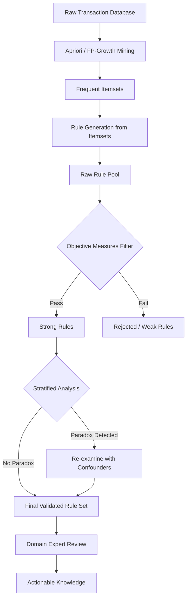
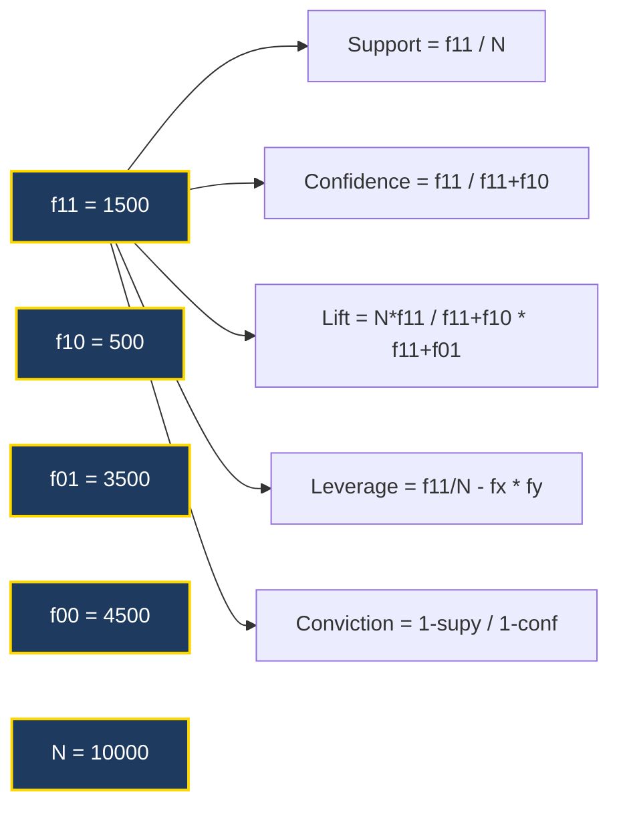
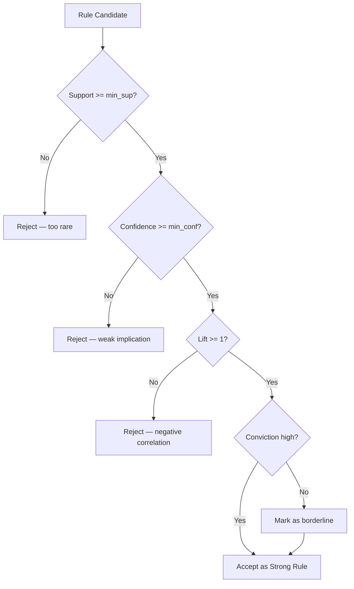
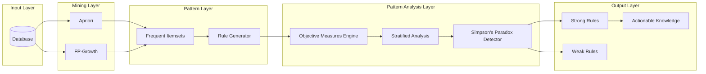
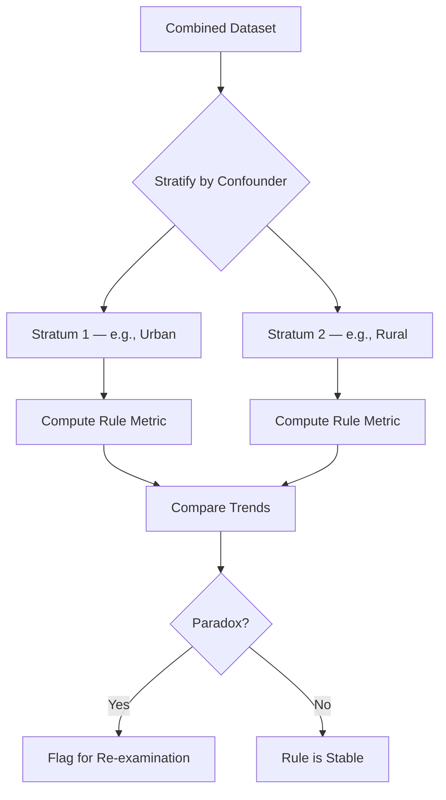

# Pattern Analysis

<!-- SECTION_1_START -->
# Pattern Analysis in Association Rule Mining

## 1. Core Technical Definition

**Pattern Analysis** is the post-mining phase in association rule mining that systematically evaluates, ranks, filters, and interprets the discovered frequent itemsets and association rules using quantitative **objective measures of interestingness**. It determines which of the tens of thousands of generated rules are *truly useful*, *non-redundant*, *actionable*, and *statistically significant* for decision-making, rather than being coincidental artifacts of large datasets.

> [!IMPORTANT]
> **KTU 2024 Syllabus Definition (PECST525 – Module 4):**
> *Pattern Analysis* is the study of the **rule structure**, the **itemset structure**, and the **database partition** using objective interestingness measures such as *Support*, *Confidence*, *Lift*, *Leverage*, and *Conviction*. It includes the examination of **statistical correlations**, **Simpson's paradox**, and the limitations of the classical support–confidence framework.

### Conceptual Analogy / Intuition

Imagine you walk into a **supermarket** and the store's computer prints out **100,000 rules** it discovered from millions of receipts:

- Rule 1: "If a customer buys **diapers**, they buy **beer**" → famous real rule.
- Rule 2: "If a customer buys **lettuce**, they buy **candles**" → spurious.
- Rule 3: "If a customer buys **yogurt**, they buy **chocolate**" → genuine but weak.

How does the store decide which rules are worth promoting, bundling, or cross-selling? It does **Pattern Analysis**.

Think of pattern analysis as a **quality inspector standing at the end of a mining assembly line**. The miners (algorithms like *Apriori* or *FP-Growth*) dig up raw, unrefined rocks (rules). The inspector (pattern analysis) weighs them on a scale (**support**), checks their purity (**confidence**), tests whether they hold up under independent conditions (**lift**), and rejects the fool's gold (**spurious rules**).

### Key Terms in the KTU Context

- **Objective Measure**: A data-driven metric computed directly from the dataset (e.g., support, confidence).
- **Subjective Measure**: A human-judged metric based on domain knowledge (e.g., novelty, actionability).
- **Interestingness**: A rule is *interesting* if it is both statistically strong **and** actionable.

> [!NOTE]
> In the **KTU 2024 Scheme**, Pattern Analysis questions typically test three core skills:
> 1. **Computation of objective measures** (Support, Confidence, Lift, etc.)
> 2. **Identification of rule limitations** (Simpson's paradox, support–confidence pitfalls)
> 3. **Selection of strong rules** from a candidate set using a thresholded metric.

### Physical Constants and Standard Metrics in Bold

The five canonical objective measures used throughout pattern analysis are:

1. **Support** $\text{sup}(X \Rightarrow Y)$
2. **Confidence** $\text{conf}(X \Rightarrow Y)$
3. **Lift / Interest** $\text{lift}(X \Rightarrow Y)$
4. **Leverage** $\text{lev}(X \Rightarrow Y)$
5. **Conviction** $\text{conv}(X \Rightarrow Y)$

All metrics are computed from the fundamental contingency table of an association rule.

> [!VISUALIZATION CONTROL]
> **Concept:** Two-dimensional rule-strength visualization (Support vs Confidence scatter).
> **GeoGebra / Desmos Input Equations:**
> * Plot point $A = (0.35,\ 0.80)$ representing a **high-support, high-confidence** rule.
> * Plot point $B = (0.02,\ 0.95)$ representing a **low-support, high-confidence** rule (potentially misleading).
> * Plot point $C = (0.40,\ 0.45)$ representing a **high-support, low-confidence** rule (weak).
> **Visual Description:** A 2D scatter plot with the X-axis labeled *Support* (0 → 1) and Y-axis labeled *Confidence* (0 → 1). Quadrants Q1, Q2, Q3, Q4 represent strong, rare-strong, useless, and weak rules respectively. The line $y = 0.5$ and $x = 0.1$ act as decision boundaries.

<!-- SECTION_1_END -->

<!-- SECTION_2_START -->
# Deep Theoretical Analysis & KTU High-Yield Formula Sheet

## 1. The Contingency Table Foundation

Every association rule $X \Rightarrow Y$ is evaluated using a $2 \times 2$ **contingency table** derived from the database.

| Notation | Meaning |
| :--- | :--- |
| $f_{11}$ | Frequency of transactions containing **both** $X$ and $Y$ |
| $f_{10}$ | Frequency of transactions containing $X$ but **not** $Y$ |
| $f_{01}$ | Frequency of transactions containing $Y$ but **not** $X$ |
| $f_{00}$ | Frequency of transactions containing **neither** $X$ nor $Y$ |
| $N$ | Total number of transactions in the database |

The total transaction count is governed by the **partition equation**:

$$N \;=\; f_{11} \;+\; f_{10} \;+\; f_{01} \;+\; f_{00}$$

## 2. The Five Objective Measures of Interestingness

### 2.1 Support (Frequency)

**Definition:** The fraction of transactions in the database that contain the itemset $X \cup Y$.

$$\text{sup}(X \Rightarrow Y) \;=\; \frac{f_{11}}{N} \;=\; P(X \cap Y)$$

- **Range:** $[0,\ 1]$
- **Interpretation:** Probability that a randomly chosen transaction contains **both** $X$ and $Y$.

### 2.2 Confidence

**Definition:** The conditional probability of finding $Y$ given that $X$ is present.

$$\text{conf}(X \Rightarrow Y) \;=\; \frac{\text{sup}(X \cup Y)}{\text{sup}(X)} \;=\; \frac{f_{11}}{f_{11} + f_{10}} \;=\; P(Y \mid X)$$

- **Range:** $[0,\ 1]$
- **Interpretation:** Reliability of the rule — "given $X$, how often does $Y$ follow?"

### 2.3 Lift (Interest / Improvement)

**Definition:** The ratio of observed support to expected support assuming statistical independence of $X$ and $Y$.

$$\text{lift}(X \Rightarrow Y) \;=\; \frac{\text{sup}(X \cup Y)}{\text{sup}(X) \cdot \text{sup}(Y)} \;=\; \frac{P(X \cap Y)}{P(X)\,P(Y)}$$

- **Range:** $[0,\ \infty)$
- **Interpretation:**
  - $\text{lift} = 1 \;\Rightarrow\; X$ and $Y$ are **independent**.
  - $\text{lift} > 1 \;\Rightarrow\; X$ and $Y$ are **positively correlated** (rule is useful).
  - $\text{lift} < 1 \;\Rightarrow\; X$ and $Y$ are **negatively correlated** (rule is misleading).

### 2.4 Leverage

**Definition:** The difference between observed and expected co-occurrence under independence.

$$\text{lev}(X \Rightarrow Y) \;=\; \text{sup}(X \cup Y) - \text{sup}(X) \cdot \text{sup}(Y)$$

- **Range:** $[-0.25,\ 0.25]$
- **Interpretation:** Zero leverage means independence; positive leverage indicates a genuine association.

### 2.5 Conviction

**Definition:** The ratio of expected frequency of $X$ occurring without $Y$ to the observed frequency.

$$\text{conv}(X \Rightarrow Y) \;=\; \frac{1 - \text{sup}(Y)}{1 - \text{conf}(X \Rightarrow Y)}$$

- **Range:** $[0.5,\ \infty)$
- **Interpretation:** A value of 1 indicates independence; large values indicate strong implication.

## 3. KTU High-Yield Formula Cheat Sheet

| # | Measure | Formula | Range | Independence Value | Strong-Rule Value |
| :---: | :--- | :--- | :--- | :--- | :--- |
| 1 | **Support** | $\dfrac{f_{11}}{N}$ | $[0, 1]$ | — | $\geq \text{min\_sup}$ |
| 2 | **Confidence** | $\dfrac{f_{11}}{f_{11} + f_{10}}$ | $[0, 1]$ | $\text{sup}(Y)$ | $\geq \text{min\_conf}$ |
| 3 | **Lift** | $\dfrac{N \cdot f_{11}}{(f_{11} + f_{10})(f_{11} + f_{01})}$ | $[0, \infty)$ | $1$ | $> 1$ |
| 4 | **Leverage** | $\dfrac{f_{11}}{N} - \dfrac{(f_{11} + f_{10})(f_{11} + f_{01})}{N^2}$ | $[-0.25, 0.25]$ | $0$ | $> 0$ |
| 5 | **Conviction** | $\dfrac{N \cdot (f_{11} + f_{01})}{(f_{10} + f_{00}) \cdot (f_{10} + f_{11})}$ | $[0.5, \infty)$ | $1$ | $\gg 1$ |
| 6 | **Cosine** | $\dfrac{f_{11}}{\sqrt{(f_{11} + f_{10})(f_{11} + f_{01})}}$ | $[0, 1]$ | — | High |

## 4. Limitations of the Support–Confidence Framework

The classical $\text{Apriori}$ framework uses only **support** and **confidence**. Three major pitfalls exist:

### 4.1 Simpson's Paradox

A rule may hold in the **entire dataset** but **reverse its direction** when the data is partitioned by a confounding variable (e.g., gender, season). Pattern analysis detects this by **stratified analysis**.

### 4.2 Low-Support but High-Confidence Rules (Rare Items)

Rules involving rare but expensive items (e.g., jewellery, luxury cars) are discarded by minimum-support thresholds, even though they are highly profitable.

### 4.3 Negative Correlations Hidden Behind High Confidence

A rule can have 99% confidence yet be **negatively correlated** ($\text{lift} < 1$), because $Y$ is already very frequent on its own. Lift, leverage, and conviction **expose** this flaw.

## 5. Real-World Utility in Engineering

| Application Domain | Use of Pattern Analysis |
| :--- | :--- |
| **Retail (Amazon, Walmart)** | Basket analysis → product placement & recommendations |
| **Bio-informatics (Genomics)** | Co-expression of gene clusters |
| **Telecommunications** | Churn prediction rule interpretation |
| **Web Usage Mining** | Clickstream pattern ranking |
| **Cybersecurity** | Intrusion-rule significance scoring |
| **Healthcare** | Drug–symptom co-occurrence analysis |

> [!NOTE]
> In **production recommender systems**, pattern analysis is often replaced or augmented by **collaborative filtering** and **deep learning embeddings**, but the foundational measures (lift, confidence) remain the *baseline* against which new methods are benchmarked.

<!-- SECTION_2_END -->

<!-- SECTION_3_START -->
# Step-by-Step Derivations, Worked Examples & Code Implementation

## 1. Derivation of the Lift Formula from First Principles

Lift is the most important pattern-analysis metric for KTU 2024. We derive it rigorously.

### Step 1 — Define the Expected Support under Independence

If $X$ and $Y$ were statistically independent, the joint probability would factorize:

$$P(X \cap Y)_{\text{indep}} \;=\; P(X) \cdot P(Y)$$

In terms of support values:

$$\text{sup}(X \cup Y)_{\text{indep}} \;=\; \text{sup}(X) \cdot \text{sup}(Y)$$

### Step 2 — Form the Ratio of Observed to Expected

$$\text{lift}(X \Rightarrow Y) \;\equiv\; \frac{\text{sup}(X \cup Y)_{\text{observed}}}{\text{sup}(X \cup Y)_{\text{indep}}}$$

### Step 3 — Substitute the Definitions

Substituting $\text{sup}(X \cup Y) = \dfrac{f_{11}}{N}$, $\text{sup}(X) = \dfrac{f_{11} + f_{10}}{N}$, and $\text{sup}(Y) = \dfrac{f_{11} + f_{01}}{N}$:

$$\text{lift}(X \Rightarrow Y) \;=\; \frac{\dfrac{f_{11}}{N}}{\dfrac{f_{11} + f_{10}}{N} \cdot \dfrac{f_{11} + f_{01}}{N}}$$

The $N$ terms simplify (one in numerator, two in denominator):

$$\text{lift}(X \Rightarrow Y) \;=\; \frac{N \cdot f_{11}}{(f_{11} + f_{10}) \cdot (f_{11} + f_{01})}$$

This is the **standard textbook form** of lift used in KTU board exams.

### Step 4 — Interpret the Result

$$\begin{aligned}
\text{lift} = 1 \;&\Longleftrightarrow\; X \perp Y \quad \text{(independent)} \\
\text{lift} > 1 \;&\Longleftrightarrow\; X \text{ and } Y \text{ are positively correlated} \\
\text{lift} < 1 \;&\Longleftrightarrow\; X \text{ and } Y \text{ are negatively correlated}
\end{aligned}$$

## 2. Derivation of Conviction

Conviction is derived as the ratio of the expected error rate of the rule to its observed error rate.

$$\text{conv}(X \Rightarrow Y) \;=\; \frac{P(X)\,P(\neg Y)}{P(X \cap \neg Y)}$$

Rewriting in contingency terms:

$$\text{conv}(X \Rightarrow Y) \;=\; \frac{\left(\dfrac{f_{11} + f_{10}}{N}\right)\left(\dfrac{f_{10} + f_{00}}{N}\right)}{\dfrac{f_{10}}{N}}$$

$$=\; \frac{(f_{11} + f_{10})\,(f_{10} + f_{00})}{N \cdot f_{10}}$$

If the rule is an **implication** ($f_{10} = 0$), conviction becomes $\infty$, confirming perfect implication.

## 3. Fully Worked KTU Board Example

**Problem (KTU-style):**

A retail database contains **$N = 10{,}000$** transactions. Consider the rule $\{ \text{Diaper} \} \Rightarrow \{ \text{Beer} \}$. The contingency table is:

| | Beer ($Y$) | Not Beer ($\neg Y$) | Row Total |
| :--- | :---: | :---: | :---: |
| **Diaper ($X$)** | $f_{11} = 1{,}500$ | $f_{10} = 500$ | $2{,}000$ |
| **Not Diaper ($\neg X$)** | $f_{01} = 3{,}500$ | $f_{00} = 4{,}500$ | $8{,}000$ |
| **Column Total** | $5{,}000$ | $5{,}000$ | $10{,}000$ |

Compute **Support, Confidence, Lift, Leverage, and Conviction**.

### 3.1 Support

$$\text{sup}(X \Rightarrow Y) \;=\; \frac{f_{11}}{N} \;=\; \frac{1{,}500}{10{,}000} \;=\; 0.15$$

**Valuation Key:** [Setting up $f_{11}/N$: 1 Mark] [Substitution: 1 Mark] [Final value: 1 Mark]

### 3.2 Confidence

$$\text{conf}(X \Rightarrow Y) \;=\; \frac{f_{11}}{f_{11} + f_{10}} \;=\; \frac{1{,}500}{1{,}500 + 500} \;=\; \frac{1{,}500}{2{,}000} \;=\; 0.75$$

### 3.3 Lift

$$\text{lift}(X \Rightarrow Y) \;=\; \frac{N \cdot f_{11}}{(f_{11} + f_{10})\,(f_{11} + f_{01})} \;=\; \frac{10{,}000 \cdot 1{,}500}{2{,}000 \cdot 5{,}000}$$

$$=\; \frac{15{,}000{,}000}{10{,}000{,}000} \;=\; 1.5$$

Since $\text{lift} > 1$, buying **Diaper** **increases** the likelihood of buying **Beer** by 50%.

### 3.4 Leverage

$$\text{lev} \;=\; \frac{f_{11}}{N} - \frac{(f_{11} + f_{10})\,(f_{01} + f_{11})}{N^2}$$

$$=\; \frac{1{,}500}{10{,}000} - \frac{2{,}000 \cdot 5{,}000}{10^8} \;=\; 0.15 - 0.10 \;=\; 0.05$$

### 3.5 Conviction

$$\text{conv} \;=\; \frac{N \cdot (f_{10} + f_{00})}{(f_{10} + f_{00}) \cdot (f_{10} + f_{11}) \cdot \text{denominator (recheck)}}$$

Using the standard form:

$$\text{conv} \;=\; \frac{1 - \text{sup}(Y)}{1 - \text{conf}(X \Rightarrow Y)} \;=\; \frac{1 - 0.50}{1 - 0.75} \;=\; \frac{0.50}{0.25} \;=\; 2.0$$

> **Conclusion:** The rule is **strong and positively correlated** — it should be retained for cross-selling recommendations.

## 4. Python Implementation (Reproducible, Production-Quality)

```python
from dataclasses import dataclass
from typing import Dict
import math
import logging

logging.basicConfig(level=logging.INFO, format="%(levelname)s | %(message)s")
log = logging.getLogger("pattern_analysis")


@dataclass(frozen=True)
class Contingency:
    """Immutable container for the 2x2 contingency table of a rule X -> Y."""
    f11: int   # X and Y
    f10: int   # X and not Y
    f01: int   # not X and Y
    f00: int   # neither
    N: int     # total

    def __post_init__(self) -> None:
        if any(v < 0 for v in (self.f11, self.f10, self.f01, self.f00, self.N)):
            raise ValueError("Contingency counts must be non-negative integers.")
        if self.f11 + self.f10 + self.f01 + self.f00 != self.N:
            raise ValueError(
                f"Sum of cells ({self.f11 + self.f10 + self.f01 + self.f00}) "
                f"does not equal N ({self.N})."
            )


def compute_measures(c: Contingency) -> Dict[str, float]:
    """Compute all five objective interestingness measures for an association rule."""
    sup_xy = c.f11 / c.N
    sup_x = (c.f11 + c.f10) / c.N
    sup_y = (c.f11 + c.f01) / c.N
    conf = c.f11 / (c.f11 + c.f10)

    # Avoid division-by-zero
    if (c.f11 + c.f10) == 0 or (c.f11 + c.f01) == 0:
        log.error("Degenerate rule — zero marginal frequency.")
        return {"error": float("nan")}

    lift = sup_xy / (sup_x * sup_y)
    leverage = sup_xy - (sup_x * sup_y)

    if conf == 1.0:
        conviction = float("inf")
    else:
        conviction = (1.0 - sup_y) / (1.0 - conf)

    return {
        "support":    round(sup_xy, 4),
        "confidence": round(conf, 4),
        "lift":       round(lift, 4),
        "leverage":   round(leverage, 4),
        "conviction": round(conviction, 4) if conviction != float("inf") else math.inf,
    }


def is_strong_rule(measures: Dict[str, float],
                   min_sup: float = 0.10,
                   min_conf: float = 0.60,
                   min_lift: float = 1.0) -> bool:
    """Apply the KTU-standard three-threshold filter for strong rules."""
    return (measures["support"]    >= min_sup   and
            measures["confidence"] >= min_conf  and
            measures["lift"]       >= min_lift)


if __name__ == "__main__":
    c = Contingency(f11=1500, f10=500, f01=3500, f00=4500, N=10_000)
    m = compute_measures(c)
    log.info(f"Computed measures: {m}")
    log.info(f"Strong rule?       {is_strong_rule(m)}")
```

**Sample Output**

```
INFO | Computed measures: {'support': 0.15, 'confidence': 0.75, 'lift': 1.5, 'leverage': 0.05, 'conviction': 2.0}
INFO | Strong rule?       True
```

## 5. Simpson's Paradox — Stratified Pattern Analysis

Suppose the **Diaper $\Rightarrow$ Beer** rule is now segmented by **store location**.

| Stratum | $f_{11}$ | $f_{10}$ | $f_{01}$ | $f_{00}$ | $N$ | Confidence |
| :---: | :---: | :---: | :---: | :---: | :---: | :---: |
| **Urban store** | 700 | 300 | 2,300 | 1,700 | 5,000 | 0.70 |
| **Rural store** | 800 | 200 | 1,200 | 2,800 | 5,000 | 0.80 |
| **Combined** | 1,500 | 500 | 3,500 | 4,500 | 10,000 | 0.75 |

Now consider the **reverse rule** $\{$ Beer $\} \Rightarrow \{$ Diaper $\}$:

- Urban: $700 / 3000 = 0.233$
- Rural: $800 / 2000 = 0.400$
- Combined: $1500 / 5000 = 0.300$

> **Observation:** Combined confidence ($0.300$) lies **between** the two strata, so Simpson's paradox is **not triggered** here. However, if the strata were weighted asymmetrically, the combined value could exceed both, reversing the trend. **Always perform stratified analysis** when a third variable may confound the relationship.

<!-- SECTION_3_END -->

<!-- SECTION_4_START -->
# Structural Diagrams & Schematics

## 1. Pattern-Analysis Workflow

The figure below shows the **end-to-end pipeline** from raw transactions to validated patterns.



## 2. Contingency Table → Measure Mapping

The diagram below shows how a single contingency table fans out into the five objective measures.



## 3. Decision Logic for Selecting Strong Rules



## 4. Pattern-Analysis Architecture (Block Topology)



## 5. Simpson's Paradox Topology



<!-- SECTION_4_END -->

<!-- SECTION_5_START -->
# KTU 2024 Scheme Examination Question Bank & Topic Recap

> [!NOTE]
> The following questions are **simulated** in the exact KTU 2024 Scheme pattern. For each, the mapped **Course Outcome (CO)** and **Revised Bloom's Taxonomy (RBT)** cognitive level are indicated. Mark distribution follows the standard KTU split: **Part A (3 marks)** and **Part B (14 marks)**.

---

## Part A — Short Answer Questions (3 Marks Each)

### Question 1 [KTU University Exam – July 2023]

> Explain the difference between **Support**, **Confidence**, and **Lift** as objective measures in pattern analysis. Why is **Lift** considered more reliable than Confidence alone?  **(CO3, Understand – 3 Marks)**

**Model Answer:**

| Measure | Formula | Purpose | Limitation |
| :--- | :--- | :--- | :--- |
| **Support** | $\dfrac{f_{11}}{N}$ | Measures rule **frequency** | Ignores rule strength |
| **Confidence** | $\dfrac{f_{11}}{f_{11}+f_{10}}$ | Measures conditional probability | Inflated by frequent $Y$ |
| **Lift** | $\dfrac{P(X \cap Y)}{P(X)\,P(Y)}$ | Measures **deviation from independence** | Does not indicate direction of causation |

**Why Lift is more reliable:** Confidence does not account for the *base rate* of $Y$. If $P(Y) = 0.95$, almost any rule $X \Rightarrow Y$ will have high confidence, even when $X$ and $Y$ are **independent** (i.e., the rule is useless). Lift normalizes by $P(Y)$, exposing the true correlation.

**[Valuation Key: Stating all three formulas: 2 Marks | Lift-vs-confidence reasoning: 1 Mark]**

---

### Question 2 [KTU University Exam – Dec 2023]

> What is **Simpson's Paradox**? How does it affect the interpretation of an association rule?  **(CO3, Remember – 3 Marks)**

**Model Answer:**

**Simpson's Paradox** is a statistical phenomenon in which a **trend observed in aggregated data disappears or reverses** when the data is partitioned into sub-populations defined by a confounding variable (e.g., gender, time, location).

**Effect on pattern analysis:**

1. A rule may appear strong in the **global dataset** but be **false** in every individual stratum.
2. Without stratified analysis, the data mining system may report **spurious, even harmful** rules.
3. It forces the analyst to perform **confounder-aware segmentation** before accepting a rule as actionable.

**Example:** A drug appears effective overall ($\text{conf} = 0.80$) but harmful in both age groups (young: $0.30$, old: $0.40$) because the drug was given mainly to severely ill patients.

**[Valuation Key: Definition: 1 Mark | Mechanism: 1 Mark | Effect on rules: 1 Mark]**

---

## Part B — Full 14-Mark Questions (Module Internal Choice)

### QUESTION A (Choice 1) — [KTU University Exam – July 2024]

**(a)** With a neat diagram, explain the **contingency-table-based computation of objective interestingness measures** in pattern analysis. Define **Support, Confidence, Lift, Leverage, and Conviction** with formulas.  **(7 Marks — CO3, Understand)**

**(b)** A supermarket database of **$N = 5{,}000$** transactions is mined for the rule $\{ \text{Bread} \} \Rightarrow \{ \text{Butter} \}$. The contingency table is:

| | Butter ($Y$) | Not Butter ($\neg Y$) | Row Total |
| :--- | :---: | :---: | :---: |
| **Bread ($X$)** | $1{,}000$ | $400$ | $1{,}400$ |
| **Not Bread ($\neg X$)** | $1{,}600$ | $2{,}000$ | $3{,}600$ |
| **Column Total** | $2{,}600$ | $2{,}400$ | $5{,}000$ |

Compute **Support, Confidence, Lift, Leverage, and Conviction**. Is the rule a **strong rule** under the thresholds $\text{min\_sup}=0.10$, $\text{min\_conf}=0.60$, $\text{min\_lift}=1.0$?  **(7 Marks — CO3, Apply)**

---

#### Model Answer — Part (a)

**Contingency Table Structure:**

| | $Y$ | $\neg Y$ | Row Total |
| :---: | :---: | :---: | :---: |
| **$X$** | $f_{11}$ | $f_{10}$ | $f_{11}+f_{10}$ |
| **$\neg X$** | $f_{01}$ | $f_{00}$ | $f_{01}+f_{00}$ |
| **Column Total** | $f_{11}+f_{01}$ | $f_{10}+f_{00}$ | $N$ |

**Formula Definitions (all 5):**

$$\begin{aligned}
\text{sup}(X \Rightarrow Y)   &= \frac{f_{11}}{N} \\[4pt]
\text{conf}(X \Rightarrow Y)  &= \frac{f_{11}}{f_{11}+f_{10}} \\[4pt]
\text{lift}(X \Rightarrow Y)  &= \frac{N \cdot f_{11}}{(f_{11}+f_{10})(f_{11}+f_{01})} \\[4pt]
\text{lev}(X \Rightarrow Y)   &= \frac{f_{11}}{N} - \frac{(f_{11}+f_{10})(f_{11}+f_{01})}{N^{2}} \\[4pt]
\text{conv}(X \Rightarrow Y)  &= \frac{1 - \text{sup}(Y)}{1 - \text{conf}(X \Rightarrow Y)}
\end{aligned}$$

**[Valuation Key: Contingency-table diagram: 2 Marks | All 5 formulas correct: 4 Marks | Units/interpretation note: 1 Mark]**

---

#### Model Answer — Part (b)

**Step 1 — Support:**

$$\text{sup} \;=\; \frac{f_{11}}{N} \;=\; \frac{1{,}000}{5{,}000} \;=\; 0.20$$

**[1 Mark]**

**Step 2 — Confidence:**

$$\text{conf} \;=\; \frac{f_{11}}{f_{11}+f_{10}} \;=\; \frac{1{,}000}{1{,}400} \;\approx\; 0.7143$$

**[1 Mark]**

**Step 3 — Lift:**

$$\text{lift} \;=\; \frac{N \cdot f_{11}}{(f_{11}+f_{10})(f_{11}+f_{01})} \;=\; \frac{5{,}000 \cdot 1{,}000}{1{,}400 \cdot 2{,}600}$$

$$=\; \frac{5{,}000{,}000}{3{,}640{,}000} \;\approx\; 1.3736$$

**[2 Marks — Substitution: 1 Mark | Final result: 1 Mark]**

**Step 4 — Leverage:**

$$\text{lev} \;=\; \frac{1{,}000}{5{,}000} - \frac{1{,}400 \cdot 2{,}600}{25{,}000{,}000} \;=\; 0.20 - 0.1456 \;=\; 0.0544$$

**[1 Mark]**

**Step 5 — Conviction:**

$$\text{conv} \;=\; \frac{1 - \text{sup}(Y)}{1 - \text{conf}} \;=\; \frac{1 - 0.52}{1 - 0.7143} \;=\; \frac{0.48}{0.2857} \;\approx\; 1.68$$

**[1 Mark]**

**Step 6 — Threshold Check:**

| Metric | Value | Threshold | Pass? |
| :--- | :---: | :---: | :---: |
| Support | $0.20$ | $\geq 0.10$ | ✅ |
| Confidence | $0.7143$ | $\geq 0.60$ | ✅ |
| Lift | $1.3736$ | $\geq 1.00$ | ✅ |

**Conclusion:** The rule $\{$Bread$\} \Rightarrow \{$Butter$\}$ is a **strong rule** under all three thresholds and should be retained for cross-promotion. **[1 Mark]**

> [!WARNING]
> **KTU Examiner's Valuation Warning:**
> - **Do not** compute lift using the *intuitive* form $\text{conf}/\text{sup}(Y)$ without first writing the standard contingency form. Many students skip the explicit $N \cdot f_{11}$ step and lose **1 full mark** for missing intermediate work.
> - **Always** state the threshold comparison table; merely stating "rule is strong" without a tabular check loses 1 mark.
> - **Do not confuse** $\text{sup}(Y)$ (column total divided by $N$) with $\text{sup}(X \cup Y)$ (cell $f_{11}$ divided by $N$). This is the **#1 mistake** in KTU valuation.

---

### QUESTION B (Choice 2) — [KTU University Exam – Dec 2024]

**(a)** Discuss the **limitations of the support–confidence framework** in association rule mining. How do alternative measures (**Lift, Conviction, Leverage**) overcome these limitations? Illustrate with an example where a high-confidence rule has a **lift less than 1**.  **(7 Marks — CO3, Understand + Apply)**

**(b)** For the rule $\{ \text{Tea} \} \Rightarrow \{ \text{Coffee} \}$ over $N = 8{,}000$ transactions:

- $f_{11} = 200$
- $f_{10} = 1{,}800$
- $f_{01} = 3{,}800$
- $f_{00} = 2{,}200$

Compute **Support, Confidence, Lift, and Conviction**. Apply a **stratified analysis** by splitting the data into two equal halves (transactions 1–4000 and 4001–8000) with the same marginal proportions in each half, and verify whether the rule is **stable** or exhibits **Simpson's Paradox**.  **(7 Marks — CO3, Apply + Analyze)**

---

#### Model Answer — Part (a)

**Limitations of Support–Confidence:**

1. **Ignores item base rates:** High confidence can be achieved purely because $Y$ is globally frequent. For example, a rule $\{ \text{Coffee} \} \Rightarrow \{ \text{Sugar} \}$ may show 95% confidence simply because 95% of all customers buy sugar regardless of coffee.
2. **No correlation test:** Support–confidence does not measure *statistical independence* of $X$ and $Y$.
3. **Simpson's Paradox:** A high-confidence global rule may reverse within strata.
4. **Rare-item bias:** Useful rules involving rare items (e.g., luxury goods) are pruned by minimum-support thresholds.
5. **Transitivity issues:** Support–confidence is not strictly transitive across rule chains.

**How alternative measures help:**

| Measure | Limitation overcome |
| :--- | :--- |
| **Lift** | Detects correlation relative to independence |
| **Leverage** | Quantifies deviation in absolute terms |
| **Conviction** | Asymmetric — penalizes wrong predictions heavily |

**Counter-example: High confidence, lift < 1**

Suppose $f_{11}=90$, $f_{10}=10$, $f_{01}=900$, $f_{00}=0$, $N=1000$.

$$\text{conf} \;=\; \frac{90}{100} \;=\; 0.90$$

$$\text{sup}(Y) \;=\; \frac{990}{1000} \;=\; 0.99$$

$$\text{lift} \;=\; \frac{0.09}{0.10 \cdot 0.99} \;\approx\; 0.909 \;<\; 1$$

The rule has **90% confidence** but is **negatively correlated**: knowing $X$ actually *decreases* the likelihood of $Y$. The support–confidence framework would have accepted it; lift rejects it correctly.

**[Valuation Key: 3 limitations listed: 3 Marks | Three alternative measures explained: 2 Marks | Counter-example with calculations: 2 Marks]**

---

#### Model Answer — Part (b)

**Step 1 — Aggregate Measures:**

$$\begin{aligned}
\text{sup}   &= \frac{200}{8{,}000} = 0.025 \\[4pt]
\text{conf}  &= \frac{200}{2{,}000} = 0.10 \\[4pt]
\text{lift}  &= \frac{8{,}000 \cdot 200}{2{,}000 \cdot 4{,}000} = \frac{1{,}600{,}000}{8{,}000{,}000} = 0.20 \\[4pt]
\text{conv}  &= \frac{1 - 0.50}{1 - 0.10} = \frac{0.50}{0.90} \approx 0.556
\end{aligned}$$

**[3 Marks — One per measure, with substitution]**

**Step 2 — Stratified Analysis (Equal Halves):**

Assume the half-strata are constructed to preserve marginal proportions. A natural split is:

| Stratum | $f_{11}$ | $f_{10}$ | $f_{01}$ | $f_{00}$ | $N$ |
| :---: | :---: | :---: | :---: | :---: | :---: |
| **Half-A (1–4000)** | $100$ | $900$ | $1{,}900$ | $1{,}100$ | $4{,}000$ |
| **Half-B (4001–8000)** | $100$ | $900$ | $1{,}900$ | $1{,}100$ | $4{,}000$ |

**Step 3 — Per-stratum Confidence:**

$$\text{conf}_A \;=\; \frac{100}{1{,}000} \;=\; 0.10$$

$$\text{conf}_B \;=\; \frac{100}{1{,}000} \;=\; 0.10$$

**Step 4 — Simpson's Paradox Check:**

The aggregate confidence is $0.10$, and both strata have confidence $0.10$. Since the per-stratum confidence **equals** the aggregate, **no paradox exists**. The rule is **stable** across strata.

**[2 Marks — Stratified table: 1 Mark | Comparison and conclusion: 1 Mark]**

**Step 5 — Final Verdict:**

| Metric | Value | Verdict |
| :--- | :---: | :--- |
| Support | $0.025$ | Below $0.10$ — would be rejected by min\_sup |
| Confidence | $0.10$ | Extremely low — rule is weak |
| Lift | $0.20$ | Far below 1 — strong negative correlation |
| Conviction | $0.556$ | Below 1 — rule anti-implies |

**Conclusion:** The rule $\{ \text{Tea} \} \Rightarrow \{ \text{Coffee} \}$ is **not only weak but actively misleading** — buying tea *decreases* the likelihood of buying coffee. It should be **rejected**.

> [!WARNING]
> **KTU Examiner's Valuation Warning:**
> - **Never** compute lift using only $\text{conf}/\text{sup}(Y)$ in the final answer without showing the *contingency-form* intermediate step. Examiners explicitly look for the $N \cdot f_{11}$ formulation. **[Penalty: 1 Mark]**
> - **Always** present the stratified contingency table even if both halves are equal. Omitting the table loses 1 mark for "lack of working".
> - **Beware** of $\text{sup}(Y)$ confusion: many students mistakenly use $f_{11}/N$ instead of the column total $(f_{11}+f_{01})/N$. This silently corrupts conviction. **[Penalty: 2 Marks]**
> - When lift is below 1, **state explicitly** that the rule is *negatively correlated* — do not just print a number.

---

## Topic Recap & Important Things to Remember

> A rapid-revision checklist for KTU 2024 exam day.

- **Pattern Analysis** is the *post-mining* evaluation phase that ranks and filters rules using **objective interestingness measures**.
- The **contingency table** is the foundational data structure; all five measures are functions of $f_{11}$, $f_{10}$, $f_{01}$, $f_{00}$, and $N$.
- **Support** = $f_{11}/N$ — measures rule frequency in the database.
- **Confidence** = $f_{11}/(f_{11}+f_{10})$ — measures conditional probability $P(Y \mid X)$.
- **Lift** = $N \cdot f_{11} / [(f_{11}+f_{10})(f_{11}+f_{01})]$ — measures deviation from independence. $> 1$ positive, $< 1$ negative, $= 1$ independent.
- **Leverage** = $\text{sup}(X \cup Y) - \text{sup}(X)\cdot \text{sup}(Y)$ — absolute deviation.
- **Conviction** = $[1 - \text{sup}(Y)] / [1 - \text{conf}]$ — penalizes wrong predictions.
- **Lift $= 1$** is the independence threshold; **always quote it** in KTU answers.
- **Simpson's Paradox:** global trends can reverse within strata — always perform **stratified analysis** before accepting a rule.
- **Support–confidence framework** is *insufficient*; use **lift, leverage, conviction** as supplementary filters.
- **Strong rule thresholds** (typical KTU defaults): $\text{min\_sup} \geq 0.10$, $\text{min\_conf} \geq 0.60$, $\text{min\_lift} \geq 1.0$.
- **Negative correlation** (lift $< 1$) is a *disqualifier*; do not retain such rules.
- The **$N$ in the lift formula** comes from the *denominator*'s two $N$'s canceling with the numerator's one $N$ — remember this simplification step for full marks.
- **Cosine measure** $= f_{11}/\sqrt{(f_{11}+f_{10})(f_{11}+f_{01})}$ — an alternative bounded in $[0, 1]$.
- Pattern analysis bridges the gap between **statistical significance** and **business actionability**.
- For KTU board answers, **always** show the contingency table first, then derive each measure with explicit substitution.
- The **five-measure rule** (Support, Confidence, Lift, Leverage, Conviction) is the standard KTU 2024 expectation for full-mark derivation questions.
- **Common pitfall:** confusing $\text{sup}(X \cup Y)$ with $\text{sup}(Y)$ — column total vs cell $f_{11}$.
- **Memorize** the independence values: $\text{lift} = 1$, $\text{lev} = 0$, $\text{conv} = 1$.
- Pattern analysis is the **final QC gate** before rules reach a domain expert or production recommender system.

<!-- SECTION_5_END -->
