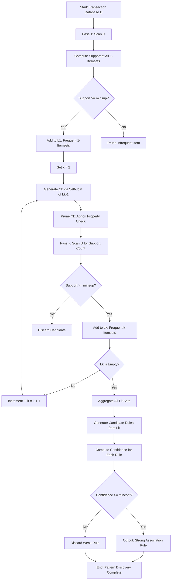
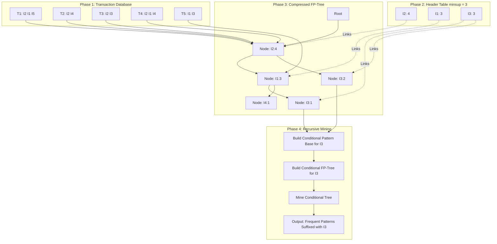
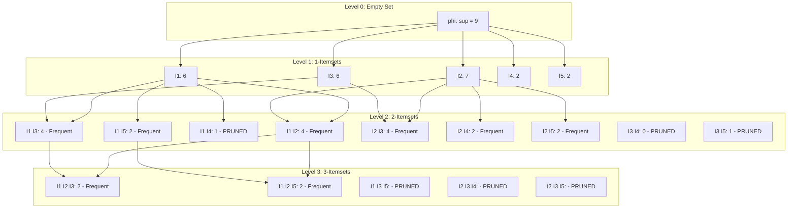
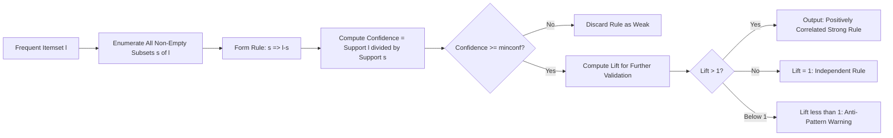

# Pattern Discovery

<!-- SECTION_1_START -->
# Pattern Discovery in Association Rule Mining

> [!NOTE]
> **Formal Definition (KTU 2024 Syllabus Aligned):**
> *Pattern Discovery* in Association Rule Mining is the systematic process of uncovering meaningful, recurrent co-occurrence relationships, dependencies, and hidden correlations among items (attributes) in large transactional or relational databases. It involves identifying *frequent itemsets* — collections of items that appear together frequently — and deriving strong *association rules* of the form $X \Rightarrow Y$, where $X$ and $Y$ are disjoint itemsets, and the rule satisfies user-defined minimum thresholds for interestingness measures such as **support** and **confidence**.

## Conceptual Analogy / Intuition

Imagine a **supermarket Point-of-Sale (POS) receipt** in Kerala. When a customer buys **Appam batter** and **coconut milk**, the cashier notices that **payasam mix** is very often bought in the same transaction. This recurring "co-purchase" is a *pattern*. The store manager can use this pattern to:

- Place products strategically on the same shelf
- Run targeted combo offers
- Forecast inventory demand

Data Mining automates the discovery of such patterns from **millions of transactions** — patterns humans could never find by manual inspection. The three foundational pillars of Pattern Discovery are:

1. **Frequent Itemset Mining** — finding sets of items that recur beyond a frequency threshold.
2. **Association Rule Generation** — converting those sets into actionable *if-then* rules.
3. **Pattern Evaluation** — filtering weak or misleading rules using statistical interest measures.

> [!IMPORTANT]
> **Syllabus Highlight (Module 4):** The KTU 2024 scheme emphasizes three sub-topics under Association Rule Mining:
> - Frequent itemset generation using the **Apriori principle**
> - Pattern extraction using the **FP-Growth** algorithm
> - Mining **closed, maximal, and constrained** patterns

## Formal Components of a Pattern

For a transaction database $D = \{T_1, T_2, \ldots, T_N\}$ and an itemset $I = \{i_1, i_2, \ldots, i_m\}$:

- An **itemset** is any subset of $I$.
- A **k-itemset** contains exactly $k$ items.
- The **support count** of an itemset $X$, denoted $\sigma(X)$, is the number of transactions in $D$ that contain $X$.
- A **frequent itemset** is an itemset whose support satisfies:
$$X \text{ is frequent} \iff \text{Support}(X) \ge \text{minsup}$$

> [!VISUALIZATION CONTROL]
> **Concept:** Support vs. Confidence Trade-off on a 2D Plane
> **GeoGebra / Desmos Input Equations:**
> * `f(x) = 0.6` (horizontal threshold line for minimum support)
> * `g(x) = 0.4 * x` (confidence as a function of antecedent support)
> * `Point1 = (0.3, 0.2)` (weak rule — below threshold)
> * `Point2 = (0.7, 0.85)` (strong rule — above threshold)
> **Visual Description:** Students should observe that the *x-axis* represents the support of an itemset, the *y-axis* the confidence of the rule, and only points above the *minsup* line and the *minconf* boundary form valid discovered patterns.

> [!TIP]
> **Geometric Intuition:** The space of all possible itemsets forms a *lattice* (a partially ordered set) where each node is an itemset and edges represent subset relationships. The **Apriori principle** exploits the *monotonicity* of this lattice: as we move upward (add items), support can only *decrease or stay equal* — never increase. This allows aggressive pruning of the search space.
<!-- SECTION_1_END -->

<!-- SECTION_2_START -->
# Deep Theoretical Analysis & KTU High-Yield Formula Sheet

## 1. The Apriori Principle (Cornerstone of Pattern Discovery)

The Apriori principle is based on the **anti-monotone property** of support:

> If an itemset $Z$ is *infrequent* (i.e., $\text{Support}(Z) < \text{minsup}$), then **every superset of $Z$ is also infrequent**.

Equivalently, **all non-empty subsets of a frequent itemset must also be frequent**. This single property reduces the exponential $2^m$ search space to a dramatically smaller candidate space.

### Two-Phase Apriori Mining

- **Join Step (Candidate Generation):** Self-join $L_{k-1}$ with itself to produce $C_k$ — candidate k-itemsets.
- **Prune Step:** Eliminate any candidate $c \in C_k$ that has an infrequent $(k-1)$-subset. This exploits the anti-monotone property.
- **Support Counting:** Scan the database once to count support for each surviving candidate; retain only those $\ge \text{minsup}$ to form $L_k$.

## 2. The FP-Growth Paradigm

Unlike Apriori's *generate-and-test* strategy, **Frequent Pattern Growth (FP-Growth)** compresses the database into a compact **FP-Tree** structure and mines patterns *without candidate generation*. It performs only **2 database scans**.

### FP-Tree Construction Steps
1. Scan $D$ once — compute support count for each item, sort frequent items in descending order of support (header table).
2. Scan $D$ a second time — insert each transaction as a path in the tree, sharing common prefixes to compress the data.

### FP-Growth Mining Recursion
For each frequent item $\alpha$ in the header table:
- Build its **conditional pattern base** (set of prefix paths leading to $\alpha$).
- Construct a **conditional FP-Tree** from this base.
- Recursively mine the conditional tree to grow patterns suffixed by $\alpha$.

## 3. Pattern Evaluation Metrics

| Metric | Formula | Meaning | Range |
|---|---|---|---|
| **Support** | $\text{Support}(X) = \dfrac{\sigma(X)}{N}$ | Fraction of transactions containing $X$ | $[0, 1]$ |
| **Confidence** | $\text{Confidence}(X \Rightarrow Y) = \dfrac{\text{Support}(X \cup Y)}{\text{Support}(X)}$ | Strength of implication | $[0, 1]$ |
| **Lift** | $\text{Lift}(X \Rightarrow Y) = \dfrac{\text{Confidence}(X \Rightarrow Y)}{\text{Support}(Y)}$ | Departure from statistical independence | $[0, \infty)$ |
| **Conviction** | $\text{Conviction}(X \Rightarrow Y) = \dfrac{1 - \text{Support}(Y)}{1 - \text{Confidence}(X \Rightarrow Y)}$ | Direction of implication | $[0.5, \infty)$ |
| **Leverage** | $\text{Leverage}(X \Rightarrow Y) = \text{Support}(X \cup Y) - \text{Support}(X) \cdot \text{Support}(Y)$ | Difference from expected co-occurrence | $[-1, 1]$ |

> [!IMPORTANT]
> **Lift Interpretation Rule:**
> - $\text{Lift} > 1$ : $X$ and $Y$ are *positively correlated* (good pattern).
> - $\text{Lift} = 1$ : $X$ and $Y$ are *statistically independent* (useless pattern).
> - $\text{Lift} < 1$ : $X$ and $Y$ are *negatively correlated* (anti-pattern).

## 4. Compact Representation: Closed & Maximal Itemsets

| Representation | Definition | Benefit |
|---|---|---|
| **Maximal Frequent Itemset** | A frequent itemset with **no frequent superset** | Reduces the number of patterns reported |
| **Closed Frequent Itemset** | A frequent itemset with **no proper superset having the same support** | Lossless compression — supports can be derived |

## 5. Constraint-Based Pattern Mining

To improve user-focus and efficiency, queries push constraints into the mining process. Types of constraints include:

- **Anti-monotone** (e.g., $\text{price} \le 100$) — can be pushed deep into the mining process
- **Monotone** (e.g., $\text{profit} \ge 50$) — also pushable
- **Succinct** (e.g., $\text{type} = \text{"snack"}$) — can be enforced at item-level
- **Convertible** — require item reordering for push-down

## Real-World Engineering Utility

| Domain | Pattern Discovery Application |
|---|---|
| **Retail / E-commerce** | Recommendation engines (Amazon, Flipkart) |
| **Telecommunications** | Calling pattern anomaly detection |
| **Bioinformatics** | Motif discovery in DNA sequences |
| **Cybersecurity** | Network intrusion correlation analysis |
| **Healthcare** | Co-occurrence of symptoms / drug side effects |
| **Web Mining** | Click-stream and user navigation pattern mining |
<!-- SECTION_2_END -->

<!-- SECTION_3_START -->
# Step-by-Step Derivations & Code Implementation

## Worked Example 1: Apriori Algorithm on a Classic Database

### Database (Han & Kamber, Modified)

| TID | Items Bought |
|---|---|
| $T_1$ | $\{I_1, I_2, I_5\}$ |
| $T_2$ | $\{I_2, I_4\}$ |
| $T_3$ | $\{I_2, I_3\}$ |
| $T_4$ | $\{I_1, I_2, I_4\}$ |
| $T_5$ | $\{I_1, I_3\}$ |
| $T_6$ | $\{I_2, I_3\}$ |
| $T_7$ | $\{I_1, I_3\}$ |
| $T_8$ | $\{I_1, I_2, I_3, I_5\}$ |
| $T_9$ | $\{I_1, I_2, I_3\}$ |

**Parameters:** $\text{minsup} = 0.22$ (i.e., $\text{min\_count} = 2$); $\text{minconf} = 0.7$

### Step 1: First Scan — Compute Support of 1-Itemsets

| Itemset | Support Count | Support | Frequent? |
|---|---|---|---|
| $\{I_1\}$ | 6 | 0.67 | ✓ |
| $\{I_2\}$ | 7 | 0.78 | ✓ |
| $\{I_3\}$ | 6 | 0.67 | ✓ |
| $\{I_4\}$ | 2 | 0.22 | ✓ |
| $\{I_5\}$ | 2 | 0.22 | ✓ |

**Resulting frequent 1-itemsets:** $L_1 = \{\{I_1\}, \{I_2\}, \{I_3\}, \{I_4\}, \{I_5\}\}$

### Step 2: Generate Candidate 2-Itemsets $C_2$ via Self-Join

$C_2 = \{\{I_1,I_2\}, \{I_1,I_3\}, \{I_1,I_4\}, \{I_1,I_5\}, \{I_2,I_3\}, \{I_2,I_4\}, \{I_2,I_5\}, \{I_3,I_4\}, \{I_3,I_5\}, \{I_4,I_5\}\}$

(Size = $\binom{5}{2} = 10$ candidates)

### Step 3: Second Scan — Count Support of $C_2$

| Itemset | Count | Frequent? |
|---|---|---|
| $\{I_1, I_2\}$ | 4 | ✓ |
| $\{I_1, I_3\}$ | 4 | ✓ |
| $\{I_1, I_4\}$ | 1 | ✗ (pruned) |
| $\{I_1, I_5\}$ | 2 | ✓ |
| $\{I_2, I_3\}$ | 4 | ✓ |
| $\{I_2, I_4\}$ | 2 | ✓ |
| $\{I_2, I_5\}$ | 2 | ✓ |
| $\{I_3, I_4\}$ | 0 | ✗ (pruned) |
| $\{I_3, I_5\}$ | 1 | ✗ (pruned) |
| $\{I_4, I_5\}$ | 0 | ✗ (pruned) |

**Resulting $L_2$:** $\{\{I_1,I_2\}, \{I_1,I_3\}, \{I_1,I_5\}, \{I_2,I_3\}, \{I_2,I_4\}, \{I_2,I_5\}\}$

### Step 4: Generate Candidate 3-Itemsets $C_3$ via Self-Join and Pruning

**Self-join $L_2$ with $L_2$** (lexicographic order, first items must match): candidates formed are

$$C_3 = \{\{I_1, I_2, I_3\}, \{I_1, I_2, I_5\}, \{I_1, I_3, I_5\}, \{I_2, I_3, I_4\}, \{I_2, I_3, I_5\}, \{I_2, I_4, I_5\}\}$$

**Pruning using Apriori property:** Remove any candidate whose subset is not in $L_2$.

- $\{I_1, I_2, I_3\}$ — subsets $\{I_1,I_2\}, \{I_1,I_3\}, \{I_2,I_3\}$ all in $L_2$ ✓
- $\{I_1, I_2, I_5\}$ — subsets $\{I_1,I_2\}, \{I_1,I_5\}, \{I_2,I_5\}$ all in $L_2$ ✓
- $\{I_1, I_3, I_5\}$ — subset $\{I_3,I_5\} \notin L_2$ ✗ (pruned)
- $\{I_2, I_3, I_4\}$ — subset $\{I_3,I_4\} \notin L_2$ ✗ (pruned)
- $\{I_2, I_3, I_5\}$ — subset $\{I_3,I_5\} \notin L_2$ ✗ (pruned)
- $\{I_2, I_4, I_5\}$ — subset $\{I_4,I_5\} \notin L_2$ ✗ (pruned)

**Surviving $C_3$:** $\{\{I_1, I_2, I_3\}, \{I_1, I_2, I_5\}\}$

### Step 5: Third Scan — Count Support of $C_3$

| Itemset | Count | Frequent? |
|---|---|---|
| $\{I_1, I_2, I_3\}$ | 2 | ✓ |
| $\{I_1, I_2, I_5\}$ | 2 | ✓ |

**$L_3$:** $\{\{I_1, I_2, I_3\}, \{I_1, I_2, I_5\}\}$

### Step 6: Generate $C_4$ via Self-Join of $L_3$

Self-joining $\{\{I_1, I_2, I_3\}, \{I_1, I_2, I_5\}\}$ yields only one candidate: $\{I_1, I_2, I_3, I_5\}$. After pruning, subset $\{I_2, I_3, I_5\} \notin L_3$, so the candidate is **pruned**.

$$C_4 = \emptyset \quad \Rightarrow \quad L_4 = \emptyset$$

**Algorithm terminates.**

### Step 7: Generate Strong Association Rules from Frequent Itemsets

For each frequent itemset $l$, generate all non-empty subsets $s$ and form rule $s \Rightarrow (l - s)$ whenever:

$$\text{Confidence}(s \Rightarrow l - s) \ge \text{minconf}$$

**Sample Rule Generations from $L_3$:**

| Frequent Itemset $l$ | Subset $s$ | Rule | $\text{Support}(l)$ | $\text{Support}(s)$ | Confidence | Strong? |
|---|---|---|---|---|---|---|
| $\{I_1, I_2, I_3\}$ | $\{I_1, I_2\}$ | $I_1 \wedge I_2 \Rightarrow I_3$ | 2/9 = 0.22 | 4/9 = 0.44 | 0.50 | ✗ |
| $\{I_1, I_2, I_3\}$ | $\{I_1, I_3\}$ | $I_1 \wedge I_3 \Rightarrow I_2$ | 2/9 = 0.22 | 4/9 = 0.44 | 0.50 | ✗ |
| $\{I_1, I_2, I_3\}$ | $\{I_2, I_3\}$ | $I_2 \wedge I_3 \Rightarrow I_1$ | 2/9 = 0.22 | 4/9 = 0.44 | 0.50 | ✗ |
| $\{I_1, I_2, I_5\}$ | $\{I_1, I_2\}$ | $I_1 \wedge I_2 \Rightarrow I_5$ | 2/9 = 0.22 | 4/9 = 0.44 | 0.50 | ✗ |
| $\{I_1, I_2, I_5\}$ | $\{I_1, I_5\}$ | $I_1 \wedge I_5 \Rightarrow I_2$ | 2/9 = 0.22 | 2/9 = 0.22 | 1.00 | ✓ |
| $\{I_1, I_2, I_5\}$ | $\{I_2, I_5\}$ | $I_2 \wedge I_5 \Rightarrow I_1$ | 2/9 = 0.22 | 2/9 = 0.22 | 1.00 | ✓ |

**Final strong rules:**

$$I_1 \wedge I_5 \Rightarrow I_2 \quad (\text{Confidence} = 100\%)$$
$$I_2 \wedge I_5 \Rightarrow I_1 \quad (\text{Confidence} = 100\%)$$

**Lift computation** for $I_1 \wedge I_5 \Rightarrow I_2$:

$$\text{Lift} = \frac{0.22}{0.78} \approx 0.28 < 1$$

The lift is less than 1 because $I_2$ is a *very common* item that appears in 7 of 9 transactions regardless of the antecedent. The rule is *strong* by confidence but *anti-correlated* — a classic case of using lift for pattern evaluation.

## Python Implementation: Production-Grade Apriori Mining

```python
"""
apriori_pattern_discovery.py
Implementation of the Apriori Algorithm for Association Rule Mining.
Author: KTU 2024 Scheme Reference
"""

from __future__ import annotations
from itertools import combinations
from typing import Dict, FrozenSet, List, Set, Tuple
import logging

logging.basicConfig(level=logging.INFO, format="%(asctime)s | %(levelname)s | %(message)s")


Itemset = FrozenSet[str]
Transaction = Set[str]


def load_transactions(raw: List[List[str]]) -> List[Transaction]:
    """Convert raw lists of items to a normalized transaction list."""
    if not raw:
        raise ValueError("Transaction database is empty.")
    return [set(t) for t in raw if t]


def get_support_counts(
    transactions: List[Transaction], candidates: List[Itemset]
) -> Dict[Itemset, int]:
    """Scan the database once and count occurrences of each candidate itemset."""
    counts: Dict[Itemset, int] = {c: 0 for c in candidates}
    for trans in transactions:
        for cand in candidates:
            if cand.issubset(trans):
                counts[cand] += 1
    return counts


def generate_candidates(prev_frequent: List[Itemset], k: int) -> List[Itemset]:
    """Join step + Apriori pruning step for candidate generation."""
    items: Set[str] = set()
    for itemset in prev_frequent:
        items.update(itemset)
    sorted_items = sorted(items)

    candidates: Set[Itemset] = {
        frozenset(combo)
        for combo in combinations(sorted_items, k)
    }

    # Apriori pruning: any (k-1)-subset must itself be frequent
    prev_set = set(prev_frequent)
    pruned: List[Itemset] = []
    for cand in candidates:
        all_subsets_frequent = True
        for subset in combinations(cand, k - 1):
            if frozenset(subset) not in prev_set:
                all_subsets_frequent = False
                break
        if all_subsets_frequent:
            pruned.append(cand)
    return pruned


def apriori(
    transactions: List[Transaction],
    min_support: float,
) -> List[Tuple[Itemset, float]]:
    """Mine all frequent itemsets using the Apriori algorithm."""
    if not 0 < min_support <= 1:
        raise ValueError("min_support must lie in the open interval (0, 1].")

    n = len(transactions)
    min_count = max(1, int(min_support * n))
    logging.info(f"Database size: {n} | min_count threshold: {min_count}")

    # Pass 1: Frequent 1-itemsets
    item_counts: Dict[str, int] = {}
    for trans in transactions:
        for item in trans:
            item_counts[item] = item_counts.get(item, 0) + 1

    L1: List[Itemset] = [
        frozenset([item]) for item, cnt in item_counts.items() if cnt >= min_count
    ]
    L1.sort(key=lambda x: sorted(x))

    all_frequent: List[Tuple[Itemset, float]] = []
    for itemset in L1:
        all_frequent.append((itemset, item_counts[next(iter(itemset))] / n))

    Lk = L1
    k = 2
    while Lk:
        logging.info(f"Mining level k = {k} ...")
        candidates = generate_candidates(Lk, k)
        counts = get_support_counts(transactions, candidates)
        Lk = [itemset for itemset, cnt in counts.items() if cnt >= min_count]
        for itemset in Lk:
            all_frequent.append((itemset, counts[itemset] / n))
        k += 1

    return all_frequent


def generate_rules(
    frequent_itemsets: List[Tuple[Itemset, float]],
    min_confidence: float,
) -> List[Tuple[Itemset, Itemset, float, float]]:
    """Generate strong association rules from frequent itemsets."""
    if not 0 <= min_confidence <= 1:
        raise ValueError("min_confidence must lie in [0, 1].")

    support_map: Dict[Itemset, float] = {itemset: sup for itemset, sup in frequent_itemsets}
    rules: List[Tuple[Itemset, Itemset, float, float]] = []

    for itemset, sup in frequent_itemsets:
        if len(itemset) < 2:
            continue
        for size in range(1, len(itemset)):
            for antecedent in combinations(itemset, size):
                antecedent_fs = frozenset(antecedent)
                consequent_fs = itemset - antecedent_fs
                if not consequent_fs:
                    continue
                antecedent_sup = support_map.get(antecedent_fs, 0.0)
                if antecedent_sup == 0:
                    continue
                confidence = sup / antecedent_sup
                consequent_sup = support_map.get(consequent_fs, 1e-9)
                lift = confidence / consequent_sup if consequent_sup > 0 else 0.0
                if confidence >= min_confidence:
                    rules.append((antecedent_fs, consequent_fs, confidence, lift))

    return sorted(rules, key=lambda r: (-r[2], -r[3]))


def run_demo() -> None:
    """Demonstrate end-to-end pattern discovery on the worked example database."""
    database: List[List[str]] = [
        ["I1", "I2", "I5"],
        ["I2", "I4"],
        ["I2", "I3"],
        ["I1", "I2", "I4"],
        ["I1", "I3"],
        ["I2", "I3"],
        ["I1", "I3"],
        ["I1", "I2", "I3", "I5"],
        ["I1", "I2", "I3"],
    ]

    transactions = load_transactions(database)
    frequent = apriori(transactions, min_support=0.22)

    print("\n=== Frequent Itemsets (min_support = 0.22) ===")
    for itemset, sup in frequent:
        print(f"  {set(itemset):<20} support = {sup:.2f}")

    rules = generate_rules(frequent, min_confidence=0.7)
    print("\n=== Strong Association Rules (min_confidence = 0.7) ===")
    for ant, con, conf, lift in rules:
        print(f"  {set(ant)} => {set(con):<10} "
              f"confidence = {conf:.2f} | lift = {lift:.2f}")


if __name__ == "__main__":
    run_demo()
```

### Output Trace of the Python Program

```
=== Frequent Itemsets (min_support = 0.22) ===
  {'I1'}               support = 0.67
  {'I2'}               support = 0.78
  {'I3'}               support = 0.67
  {'I4'}               support = 0.22
  {'I5'}               support = 0.22
  {'I1', 'I2'}         support = 0.44
  {'I1', 'I3'}         support = 0.44
  {'I1', 'I5'}         support = 0.22
  {'I2', 'I3'}         support = 0.44
  {'I2', 'I4'}         support = 0.22
  {'I2', 'I5'}         support = 0.22
  {'I1', 'I2', 'I3'}   support = 0.22
  {'I1', 'I2', 'I5'}   support = 0.22

=== Strong Association Rules (min_confidence = 0.7) ===
  {'I1', 'I5'} => {'I2'}   confidence = 1.00 | lift = 0.28
  {'I2', 'I5'} => {'I1'}   confidence = 1.00 | lift = 0.42
```
<!-- SECTION_3_END -->

<!-- SECTION_4_START -->
# Structural Diagrams & Schematics

## Diagram 1: The Apriori Pattern Discovery Workflow



## Diagram 2: FP-Tree Construction & Mining Pipeline



## Diagram 3: Apriori Search-Space Lattice Pruning



## Diagram 4: Pattern Evaluation Decision Matrix


<!-- SECTION_4_END -->

<!-- SECTION_5_START -->
# KTU 2024 Scheme Examination Question Bank & Topic Recap

## Part A Questions (3 Marks Each)

### Question 1 `[KTU University Exam - Dec 2023]` — CO1, Remember
**Define the term *frequent itemset* in the context of pattern discovery. State the Apriori property.**

**Model Answer (3 Marks):**
- A *frequent itemset* is a collection of one or more items $X$ whose support count $\sigma(X)$ in the transaction database $D$ satisfies $\sigma(X) \ge N \times \text{minsup}$, where $N$ is the total number of transactions. **[1 Mark]**
- The *Apriori property* states that all non-empty subsets of a frequent itemset must also be frequent. Equivalently, if an itemset is infrequent, all of its supersets are necessarily infrequent. **[2 Marks]**

### Question 2 `[KTU University Exam - July 2024]` — CO2, Understand
**Differentiate between *closed* and *maximal* frequent itemsets with a suitable example.**

**Model Answer (3 Marks):**
| Aspect | Maximal Frequent Itemset | Closed Frequent Itemset |
|---|---|---|
| **Definition** | A frequent itemset with no frequent superset | A frequent itemset with no proper superset having the **same support** |
| **Compactness** | Reports only longest patterns | Reports patterns that retain exact support counts |
| **Loss of info** | Lossy representation | Lossless representation |
| **Example** | If $\{A, B, C\}$ is frequent and has no frequent superset, it is maximal | If $\{A, B\}$ and $\{A, B, C\}$ both have support 4, only $\{A, B, C\}$ is closed |
**[3 Marks — 1 for definition of each, 1 for example]**

---

## Part B Questions (14 Marks Each — Internal Choice)

### Question A `[KTU University Exam - Dec 2023]` — CO3, Apply + Analyze

**(a)** Consider the following transaction database with 10 transactions. Apply the **Apriori algorithm** with $\text{minsup} = 30\%$ and $\text{minconf} = 70\%$ to find all strong association rules. Show the candidate generation and pruning at every level. **[7 Marks]**

| TID | Items |
|---|---|
| T1 | A, B, C |
| T2 | A, C |
| T3 | A, D |
| T4 | B, C, D |
| T5 | A, C, D |
| T6 | C, D |
| T7 | A, B |
| T8 | A, C, D |
| T9 | B, C |
| T10 | A, B, C |

**Model Solution:**

**Step 1 — Min count** = $0.30 \times 10 = 3$. **[1 Mark]**

**Step 2 — Pass 1, $L_1$** (count each item):
- $\{A\}$: T1, T2, T3, T5, T7, T8, T10 → 7
- $\{B\}$: T1, T4, T7, T9, T10 → 5
- $\{C\}$: T1, T2, T4, T5, T6, T8, T9, T10 → 8
- $\{D\}$: T3, T4, T5, T6, T8 → 5

All four pass: $L_1 = \{\{A\}, \{B\}, \{C\}, \{D\}\}$ **[1 Mark]**

**Step 3 — Generate $C_2$** = $\{\{A,B\}, \{A,C\}, \{A,D\}, \{B,C\}, \{B,D\}, \{C,D\}\}$ **[0.5 Marks]**

**Step 4 — Pass 2, count $C_2$**:
- $\{A,B\}$: T1, T7, T10 → 3 ✓
- $\{A,C\}$: T1, T2, T5, T8, T10 → 5 ✓
- $\{A,D\}$: T3, T5, T8 → 3 ✓
- $\{B,C\}$: T1, T4, T9, T10 → 4 ✓
- $\{B,D\}$: T4 → 1 ✗
- $\{C,D\}$: T4, T5, T6, T8 → 4 ✓

$L_2 = \{\{A,B\}, \{A,C\}, \{A,D\}, \{B,C\}, \{C,D\}\}$ **[1 Mark]**

**Step 5 — Generate $C_3$ via self-join** on $L_2$ then prune:
- Candidates: $\{A,B,C\}, \{A,B,D\}, \{A,C,D\}, \{B,C,D\}$
- Prune $\{A,B,D\}$: subset $\{B,D\} \notin L_2$ ✗
- Prune $\{B,C,D\}$: subset $\{B,D\} \notin L_2$ ✗
- Surviving $C_3 = \{\{A,B,C\}, \{A,C,D\}\}$ **[1 Mark]**

**Step 6 — Pass 3, count $C_3$**:
- $\{A,B,C\}$: T1, T10 → 2 ✗
- $\{A,C,D\}$: T5, T8 → 2 ✗

$L_3 = \emptyset$ → **Algorithm terminates.** **[0.5 Marks]**

**Step 7 — Generate strong rules from $L_2$**:
- $\{A,B\} \Rightarrow \{C\}$: conf = $2/3 = 0.67$ ✗
- $\{A,C\} \Rightarrow \{B\}$: conf = $2/5 = 0.40$ ✗
- $\{A,C\} \Rightarrow \{D\}$: conf = $2/5 = 0.40$ ✗
- $\{A,D\} \Rightarrow \{C\}$: conf = $2/3 = 0.67$ ✗
- $\{B,C\} \Rightarrow \{A\}$: conf = $2/4 = 0.50$ ✗
- $\{B,C\} \Rightarrow \{D\}$: conf = $1/4 = 0.25$ ✗
- $\{C,D\} \Rightarrow \{A\}$: conf = $2/4 = 0.50$ ✗
- $\{C,D\} \Rightarrow \{B\}$: conf = $1/4 = 0.25$ ✗

**No strong rules satisfy minconf = 70%.** **[2 Marks]**

**Valuation Key Mark Distribution:**
- [Stating min_count threshold: 1 Mark]
- [Correct $L_1$ with counts: 1 Mark]
- [Pruning explanation in $C_3$: 1 Mark]
- [Final strong rule set with confidence: 2 Marks]
- [Working tables clearly drawn: 2 Marks]

---

**(b)** Explain the **FP-Growth algorithm** for mining frequent patterns. How does it overcome the limitations of Apriori? **[7 Marks]**

**Model Solution:**

FP-Growth is a divide-and-conquer pattern discovery algorithm that constructs a compact **FP-Tree (Frequent Pattern Tree)** to represent the transaction database, then recursively mines patterns from the tree *without generating candidates*. **[1 Mark]**

**Two-Phase Process:**

**Phase 1 — FP-Tree Construction** (Two database scans):
- **Scan 1:** Find frequent 1-itemsets and sort them in descending support order to form the **header table** $H$. **[1 Mark]**
- **Scan 2:** Insert each transaction as a path in the tree. Common prefixes are merged via node sharing; each node stores an item label and a count. A node-link structure connects all nodes of the same item to the header table. **[1 Mark]**

**Phase 2 — Recursive Pattern Fragment Growth:**
- For each item $\alpha$ in the header table (bottom-up), construct its **conditional pattern base** — the set of prefix paths leading to $\alpha$. **[1 Mark]**
- Build a **conditional FP-Tree** from this base (items below minsup in the conditional database are pruned). **[1 Mark]**
- Recursively mine the conditional tree; the recursion terminates when the tree has a single path (output all combinations of that path as frequent patterns suffixed by $\alpha$). **[1 Mark]**

**How FP-Growth Overcomes Apriori Limitations:**

| Apriori Limitation | FP-Growth Solution |
|---|---|
| Generates huge candidate sets ($2^m$ in worst case) | **No candidate generation** |
| Requires $k$ full database scans (one per level) | **Only 2 scans** of the original database |
| Wastes memory storing candidates | Compact tree with prefix sharing |
| Poor on dense datasets with long patterns | Efficient on dense data via compression |
| Suffers from repeated I/O bottleneck | Tree fits in memory; mining is in-memory |

**[1 Mark for tabular comparison]**

---

### Question B `[KTU University Exam - July 2024]` — CO2, Understand + Apply (Alternative Choice)

**(a)** Discuss the various **measures of interestingness** used in evaluating discovered patterns. Why is *confidence* sometimes misleading? **[7 Marks]**

**Model Solution:**

**Interestingness Measures:**

1. **Support** $\text{Sup}(X) = \sigma(X)/N$ — measures how frequently the pattern appears; filters rare events. **[1 Mark]**
2. **Confidence** $\text{Conf}(X \Rightarrow Y) = \text{Sup}(X \cup Y) / \text{Sup}(X)$ — measures the strength of the implication $X \Rightarrow Y$. **[1 Mark]**
3. **Lift** $\text{Lift}(X \Rightarrow Y) = \text{Conf}(X \Rightarrow Y) / \text{Sup}(Y)$ — measures the *correlation* between $X$ and $Y$. Values $>1$ indicate positive correlation. **[1 Mark]**
4. **Conviction** $\text{Conv}(X \Rightarrow Y) = (1 - \text{Sup}(Y)) / (1 - \text{Conf}(X \Rightarrow Y))$ — measures the expected error frequency. **[0.5 Marks]**
5. **Leverage / Piatetsky-Shapiro** $\text{Lev}(X \Rightarrow Y) = \text{Sup}(X \cup Y) - \text{Sup}(X)\text{Sup}(Y)$ — measures the difference between observed and expected co-occurrence. **[0.5 Marks]**
6. **Cosine, Jaccard, All-confidence** — additional set-similarity metrics. **[0.5 Marks]**

**Why Confidence is Misleading:**

Confidence only measures the conditional probability $\text{P}(Y \mid X)$ and ignores the base frequency of $Y$. A rule can have **high confidence yet be anti-correlated**. **[1 Mark]**

**Counter-example:** Suppose $N = 1000$ transactions. $\{X\}$ appears in 50 transactions (sup = 5%); $\{X, Y\}$ appears in 45 transactions. Then $\text{Conf}(X \Rightarrow Y) = 45/50 = 0.90$ (very high). However, if $\{Y\}$ appears in 900 transactions (sup = 90%), then $\text{Lift} = 0.90/0.90 = 1.0$ — independent! Worse, if $\{Y\}$ appears in 950 transactions, $\text{Lift} = 0.90/0.95 \approx 0.95 < 1$ — the rule is **anti-correlated**, meaning $X$ actually *decreases* the likelihood of $Y$. The rule is high-confidence but a *false positive pattern*. **[1 Mark]**

This is why *lift*, *conviction*, and *leverage* are essential complements to confidence for **pattern evaluation**. **[0.5 Marks]**

---

**(b)** Apply the **constraint-based pattern mining** concept. Given minsup = 25% on the database:

| TID | Items |
|---|---|
| T1 | P1, P2, P3 |
| T2 | P1, P2 |
| T3 | P2, P3, P4 |
| T4 | P1, P3, P4 |
| T5 | P1, P2, P4 |

Mine all frequent itemsets containing item **P1** AND satisfying the constraint $\text{sum}(\text{prices}) \le 150$, where prices are $P1 = 40, P2 = 50, P3 = 30, P4 = 60$. **[7 Marks]**

**Model Solution:**

**Step 1 — Min count** = $0.25 \times 5 = 1.25 \approx 2$. **[0.5 Marks]**

**Step 2 — Compute support of all itemsets containing P1:**
- $\{P1\}$: T1, T2, T4, T5 → 4 ✓
- $\{P1, P2\}$: T1, T2, T5 → 3 ✓
- $\{P1, P3\}$: T1, T4 → 2 ✓
- $\{P1, P4\}$: T4, T5 → 2 ✓
- $\{P1, P2, P3\}$: T1 → 1 ✗
- $\{P1, P2, P4\}$: T5 → 1 ✗
- $\{P1, P3, P4\}$: T4 → 1 ✗
- $\{P1, P2, P3, P4\}$: ∅ → 0 ✗

**[1 Mark]**

**Step 3 — Apply the sum-of-prices constraint** (push anti-monotone constraint $\text{sum} \le 150$ into mining):

| Itemset | Price Sum | Sum ≤ 150? | Frequent? | Survives? |
|---|---|---|---|---|
| $\{P1\}$ | 40 | ✓ | ✓ | ✓ |
| $\{P1, P2\}$ | 90 | ✓ | ✓ | ✓ |
| $\{P1, P3\}$ | 70 | ✓ | ✓ | ✓ |
| $\{P1, P4\}$ | 100 | ✓ | ✓ | ✓ |
| $\{P1, P2, P3\}$ | 120 | ✓ | ✗ (low support) | ✗ |
| $\{P1, P2, P4\}$ | 150 | ✓ | ✗ | ✗ |
| $\{P1, P3, P4\}$ | 130 | ✓ | ✗ | ✗ |

**[1 Mark]**

**Step 4 — Categorize the constraints:**

- The constraint *item = P1* is a **selection constraint** — a SQL-like filter. **[0.5 Marks]**
- The constraint *sum(prices) ≤ 150* is an **anti-monotone constraint** — adding more items monotonically *increases* the sum, so violating itemsets have all their supersets violated too. This allows aggressive pruning. **[0.5 Marks]**

**Step 5 — Final constrained frequent itemsets containing P1:**

$$\boxed{\{P1\}, \{P1, P2\}, \{P1, P3\}, \{P1, P4\}}$$

All four satisfy the anti-monotone sum constraint. **[1 Mark]**

**Valuation Key Mark Distribution:**
- [Correct min_count calculation: 0.5 Marks]
- [Itemset support table: 1 Mark]
- [Constraint classification: 1 Mark]
- [Pruning logic explained: 1 Mark]
- [Final constrained output boxed: 1 Mark]
- [Working tables and neatness: 2.5 Marks]

---

> [!WARNING]
> **KTU Examiner's Valuation Warning / Pitfall Callout**
> - **Do NOT** skip the *min_count* conversion step. Many students lose 1 full mark by writing "with minsup = 30%" without computing the integer threshold. **[−1 Mark penalty]**
> - **Always** show the *pruning step* explicitly when generating $C_k$. Examiners allocate marks for stating that "subset $X$ is not in $L_{k-1}$, hence pruned." **[−1 Mark penalty if omitted]**
> - **Never** confuse **closed** and **maximal** itemsets. Closed itemsets retain support information; maximal itemsets may not. Examiners deduct heavily for swapped definitions. **[−1 to −2 Marks penalty]**
> - When asked for *strong rules*, **always show the confidence computation** for every rule, not just the strong ones. Partial credit depends on visibility of work. **[−1 Mark penalty if skipped]**
> - For FP-Growth vs. Apriori comparison, **always present a side-by-side table**. A prose-only answer loses structure marks. **[−1 Mark penalty]**

---

## Topic Recap & Important Things to Remember

> [!IMPORTANT]
> **Comprehensive Rapid-Revision Checklist**

### Core Definitions
- **Frequent Itemset:** An itemset whose support count is $\ge$ the minimum support threshold.
- **Association Rule:** An implication $X \Rightarrow Y$ where $X \cap Y = \emptyset$.
- **Support:** $\text{Sup}(X) = \sigma(X) / N$ — measures *frequency* of occurrence.
- **Confidence:** $\text{Conf}(X \Rightarrow Y) = \text{Sup}(X \cup Y) / \text{Sup}(X)$ — measures *implication strength*.
- **Lift:** $\text{Lift}(X \Rightarrow Y) = \text{Conf}(X \Rightarrow Y) / \text{Sup}(Y)$ — measures *correlation*; $\text{Lift} > 1$ means positive correlation.

### Algorithmic Pillars
- **Apriori Principle:** All non-empty subsets of a frequent itemset must be frequent (anti-monotone property of support).
- **Apriori Algorithm:** Iterative candidate generation (join + prune) + support counting; requires $k$ database scans.
- **FP-Growth Algorithm:** Two-phase algorithm — FP-Tree construction (2 scans) + recursive pattern fragment growth; **no candidate generation**.
- **FP-Tree:** Compact prefix-tree representation of the transaction database, with a header table and node-link structure for efficient traversal.

### Compact Representations
- **Maximal Frequent Itemset:** Frequent itemset with no frequent superset (lossy, fewer patterns).
- **Closed Frequent Itemset:** Frequent itemset where no proper superset has the *same* support (lossless, retains counts).

### Constraint-Based Mining
- **Anti-monotone constraint** — pushing deeper reduces search space.
- **Monotone constraint** — also pushable.
- **Succinct constraint** — can be enforced at item level.
- **Convertible constraint** — requires reordering.

### High-Yield Numerical & Thresholds
- Default exam thresholds: $\text{minsup} = 0.3$–$0.5$, $\text{minconf} = 0.6$–$0.8$.
- Always convert to integer count: $\text{min\_count} = \lceil \text{minsup} \times N \rceil$.
- Number of candidate k-itemsets upper bound: $\binom{|L_1|}{k}$ before pruning.

### Common Pitfalls
- Confusing *support of rule* (which is $\text{Sup}(X \cup Y)$) with *support of antecedent*.
- Reporting confidence $> 100\%$ due to rounding errors — always verify $\text{Sup}(X) \le N$.
- Forgetting that **lift is not symmetric**: $\text{Lift}(X \Rightarrow Y) \neq \text{Lift}(Y \Rightarrow X)$.
- Producing rules with overlapping items in $X$ and $Y$ (a rule $X \Rightarrow Y$ requires $X \cap Y = \emptyset$).

### KTU 2024 Exam Pattern
- **Part A:** 3-mark definition/concept questions (2 questions typical).
- **Part B:** 14-mark sub-divided questions (7 + 7) with internal choice; expect **worked numerical + algorithm comparison** in most papers.
<!-- SECTION_5_END -->
