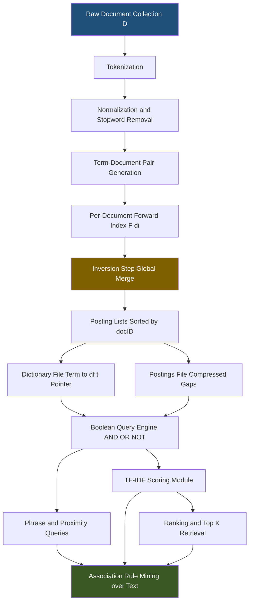
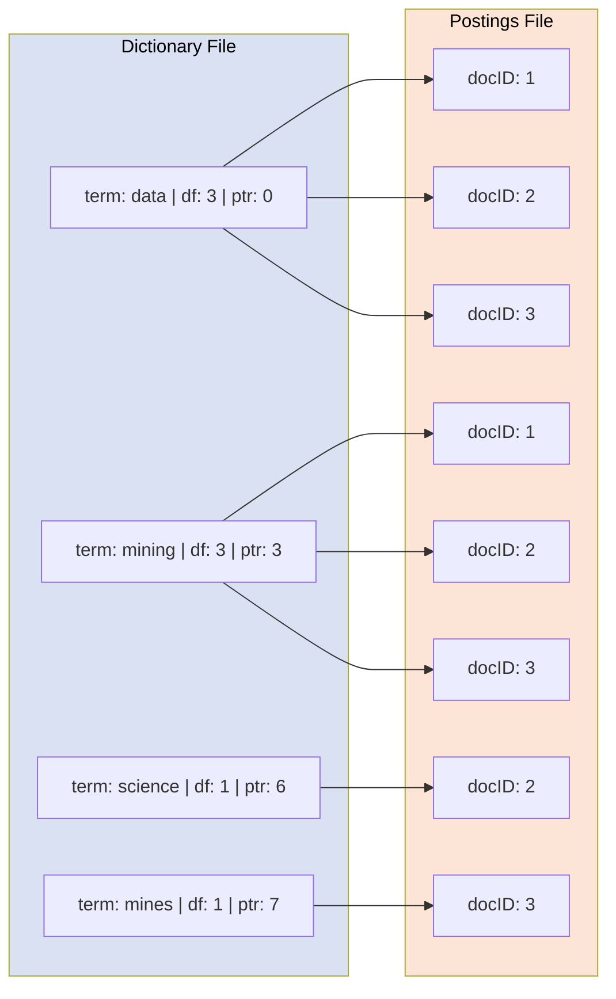
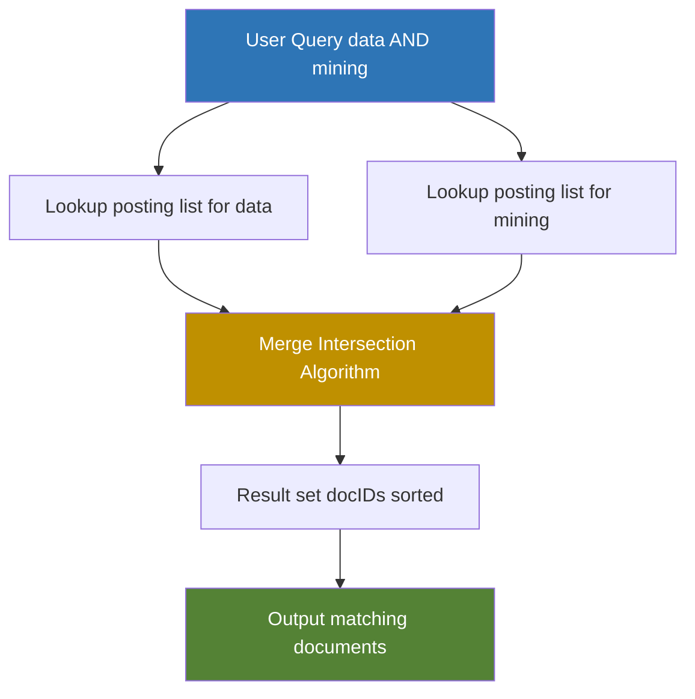

# Text Indexing Technique

<!-- SECTION_1_START -->

# Text Indexing Technique

## 1. Core Technical Definition & Intuitive Overview

### Formal Academic Definition (KTU 2024 Syllabus)

> [!IMPORTANT]
> **Text Indexing** is a data preprocessing technique used in Information Retrieval (IR) and Text Mining that builds auxiliary lookup structures over a textual corpus to accelerate query evaluation, term lookup, and pattern discovery operations such as **Association Rule Mining** over document collections.

Formally, given a document collection $\mathcal{D} = \{d_1, d_2, \dots, d_N\}$ over a vocabulary $\mathcal{V} = \{t_1, t_2, \dots, t_V\}$, a text index $\mathcal{I}$ is a data structure that maps from a term $t \in \mathcal{V}$ (or a phrase, n-gram, or signature) to the set of documents $\mathcal{D}_t = \{d_i \mid t \in d_i\}$ where it appears, optionally along with positions, frequencies, or weights.

> [!NOTE]
> **KTU Module 4 Mapping:** Text indexing forms the preprocessing backbone of *Web Mining* and *Text Mining* sub-modules, which sit adjacent to *Association Rule Mining* because both rely on rapid, repeatable term-level counting operations.

### Conceptual Analogy / Intuition

Imagine walking into a massive **library with 10 million books** but no card catalog. To find every book that mentions the word *"neural"*, you would have to scan every book on every shelf — an $O(N \cdot L)$ nightmare.

A **text index** is precisely the **card catalog** of the digital library. It tells you, for every important term, *exactly which books (and often which page numbers) contain it*. Instead of searching the entire corpus, you look up the term in the catalog and jump straight to the matching documents.

There are two philosophical families:

| Family | Mental Model | Lookup Direction |
|---|---|---|
| **Forward Index** | Document → Terms (like an index at the back of a textbook) | Doc-centric |
| **Inverted Index** | Term → Documents (like a library card catalog) | Term-centric |

The **inverted index** is the dominant production-grade structure used by Google, Elasticsearch, Solr, Lucene, and even the KTU examination board's reference material.

### Core Constants and Metrics (Bolded for Exam Recall)

- **Vocabulary size $\vert \mathcal{V} \vert$** — number of unique terms in the corpus.
- **Document frequency $df_t$** — number of documents containing term $t$.
- **Term frequency $tf_{t,d}$** — number of times $t$ appears in document $d$.
- **Collection frequency $cf_t$** — total occurrences of $t$ across all of $\mathcal{D}$.
- **Inverse document frequency $idf_t$** — log-based rarity weight of $t$.

> [!VISUALIZATION CONTROL]
> **Concept:** Inverted Index Map from Term → Posting List
> **GeoGebra / Desmos Input Equations:**
> * Points: `(term_id, doc_id)` pairs such as `(1,1), (1,2), (1,5), (2,1), (2,3), (3,4), (3,5)`
> * Discrete y-axis ticks for `doc_id ∈ {1, 2, 3, 4, 5}`
> * Discrete x-axis ticks for `term_id ∈ {1, 2, 3}`
> **Visual Description:** The student should observe three vertical "stems" rising from the x-axis — each stem represents a posting list for a single term, and the dots on each stem mark the document IDs in which that term appears. Sparse stems (short lists) indicate rare terms; dense stems indicate common terms.

---

<!-- SECTION_1_END -->

<!-- SECTION_2_START -->

# 2. Deep Theoretical Analysis & KTU High-Yield Formula Sheet

## 2.1 The Inverted Index — Anatomy

An inverted index consists of two cooperating structures:

1. **Dictionary (Vocabulary File)** — stores every distinct term $t \in \mathcal{V}$ along with metadata (document frequency $df_t$, pointer to postings).
2. **Postings File** — for each term $t$, stores a sorted list of document IDs where $t$ appears, optionally with term frequencies and positions.

> [!IMPORTANT]
> **Why "inverted"?** A natural forward index maps each *document* to the *terms it contains*. An inverted index flips this mapping: each *term* points to the *documents containing it*. This inversion is what enables the constant-time lookup behavior demanded by search engines and rule-mining scanners.

### Logical Construction Steps

- **Step 1 — Tokenization:** Split each document $d_i$ into a sequence of terms using delimiters, punctuation rules, and language-specific tokenizers.
- **Step 2 — Normalization:** Apply stemming, lemmatization, case-folding, and stopword removal to map surface forms to a canonical form.
- **Step 3 — Term-Document Pair Generation:** Emit tuples $(t, d_i, pos)$ where $pos$ is the term position.
- **Step 4 — Local Sorting (Per Document):** Sort the tuples of each $d_i$ by term ID — this produces the **forward index** stage.
- **Step 5 — Global Inversion:** Merge all per-document sorted lists into a global term-keyed structure, sorted by term, then by document ID.
- **Step 6 — Frequency Aggregation:** Compute $tf_{t,d}$ and $df_t$ by scanning the posting runs.
- **Step 7 — Write Dictionary and Postings to Disk:** Persist in a binary, optionally compressed, format.

### 2.2 Variants of the Inverted Index

| Variant | What it stores | Use Case | Storage Cost |
|---|---|---|---|
| **Boolean Inverted Index** | Only doc IDs | Boolean retrieval (AND, OR, NOT) | Lowest |
| **Frequency Inverted Index** | Doc IDs + $tf_{t,d}$ | TF-IDF ranking | Moderate |
| **Positional Inverted Index** | Doc IDs + positions | Phrase & proximity queries | Highest |
| **Biword Index** | Pairs $(t_i, t_{i+1})$ | Fixed phrase retrieval | Higher still |
| **N-gram / k-gram Index** | Sub-word character n-grams | Wildcard, misspelling, language ID | Large |
| **Signature File** | Bit-slice signature per doc | Bloom-filter-style membership | Medium |

### 2.3 The Positional Index — Most Exam-Relevant Variant

For each posting of term $t$ in document $d$, we additionally store the **list of term positions** $p_1, p_2, \dots$ where $t$ appears. This is essential for **phrase queries** and **bi-gram / co-occurrence** extraction, which is exactly the data feeding association rule mining over text.

Phrase query *"data mining"* on term positions uses the intersection algorithm:

$$ \text{PositionalIntersect}(p_1, p_2, k) = \{(d, x) \mid x \in p_1, \exists y \in p_2 : \vert x - y \vert \leq k\} $$

where $k$ is the allowed phrase-distance (typically $k=1$ for an exact biword match).

### 2.4 Term Weighting — TF-IDF

The **term frequency–inverse document frequency** weight is the canonical scoring function:

$$ w_{t,d} = tf_{t,d} \cdot idf_t $$

$$ idf_t = \log \frac{N}{df_t} $$

This weight is the bridge between text indexing and association rule mining: it filters **stop-like high-frequency terms** (which would otherwise dominate any co-occurrence rule) and elevates **discriminative low-frequency terms** that yield interesting rules.

### 2.5 Role in Association Rule Mining

When mining association rules over text (e.g., *"customers who read articles containing 'python' and 'data' often also click 'pandas'"*), the process requires:

1. Building an inverted index for rapid candidate generation.
2. Extracting frequent term-sets via Apriori or FP-Growth on the inverted postings.
3. Computing support and confidence using intersection of posting lists.

> [!NOTE]
> **Engineering Utility:** Elasticsearch, Solr, Lucene, Splunk, and many production text-mining pipelines all use an inverted index as the substrate. Indexing makes sub-second queries over multi-terabyte corpora feasible, and the same postings are reused for analytics, faceted search, and rule mining.

## 2.6 KTU Formula Sheet / Cheat Sheet

> **Exam-Critical Reference Table — all vertical bars are escaped with `\vert` to preserve markdown integrity.**

| # | Concept | Formula / Definition | Typical Value / Unit | Used For |
|---|---|---|---|---|
| 1 | Term frequency | $tf_{t,d} = f_{t,d}$ | integer count | Term weight |
| 2 | Document frequency | $df_t = \sum_d \mathbb{1}[t \in d]$ | integer $\in [1, N]$ | Filter rare/common |
| 3 | Inverse doc frequency | $idf_t = \log \frac{N}{df_t}$ | $\geq 0$, dimensionless | Discount common terms |
| 4 | TF-IDF weight | $w_{t,d} = tf_{t,d} \cdot idf_t$ | $\geq 0$ | Scoring, ranking |
| 5 | Support of term-set $T$ | $\sigma(T) = \frac{\vert \{ d \mid T \subseteq d \} \vert}{N}$ | fraction in $[0,1]$ | Frequent itemsets |
| 6 | Confidence of rule $X \Rightarrow Y$ | $c(X \Rightarrow Y) = \frac{\sigma(X \cup Y)}{\sigma(X)}$ | fraction in $[0,1]$ | Rule strength |
| 7 | Biword frequency | $bf_{t_i, t_{i+1}}$ | integer | Phrase indexing |
| 8 | Gap encoding | $g_i = pid_i - pid_{i-1}$ | integer $\geq 1$ | Compression |
| 9 | Index size (approx) | $\sum_{t \in \mathcal{V}} \vert P(t) \vert$ | postings | Capacity planning |
| 10 | Phrase distance check | $\vert x - y \vert \leq k$ | position offset | Proximity query |

---

<!-- SECTION_2_END -->

<!-- SECTION_3_START -->

# 3. Step-by-Step Derivations & Code/Symbolic Implementation

## 3.1 Worked Construction of an Inverted Index (Symbolic)

### Corpus
Let the toy corpus $\mathcal{D}$ contain three short documents:

- $d_1$ : `"data mining is fun"`
- $d_2$ : `"data science uses mining"`
- $d_3$ : `"mining mines data mines"`

### Step 1 — Tokenize and Normalize
After case-folding and stopword removal (drop `is`, `fun`, `uses`):

- $d_1 \to [\text{data}, \text{mining}]$
- $d_2 \to [\text{data}, \text{science}, \text{mining}]$
- $d_3 \to [\text{mining}, \text{mines}, \text{data}, \text{mines}]$

### Step 2 — Emit Term-Document Positions

$$
\begin{aligned}
(d_1, 1) &\mapsto (\text{data}, 1) \\
(d_1, 2) &\mapsto (\text{mining}, 1) \\
(d_2, 1) &\mapsto (\text{data}, 2) \\
(d_2, 2) &\mapsto (\text{science}, 2) \\
(d_2, 3) &\mapsto (\text{mining}, 2) \\
(d_3, 1) &\mapsto (\text{mining}, 3) \\
(d_3, 2) &\mapsto (\text{mines}, 3) \\
(d_3, 3) &\mapsto (\text{data}, 3) \\
(d_3, 4) &\mapsto (\text{mines}, 3) \\
\end{aligned}
$$

### Step 3 — Forward Index (per-document term lists)

$$
\begin{aligned}
F(d_1) &= \{(\text{data}, 1), (\text{mining}, 1)\} \\
F(d_2) &= \{(\text{data}, 1), (\text{science}, 1), (\text{mining}, 1)\} \\
F(d_3) &= \{(\text{mining}, 1), (\text{mines}, 2), (\text{data}, 1), (\text{mines}, 2)\} \\
\end{aligned}
$$

### Step 4 — Invert to Build Posting Lists

$$
\begin{aligned}
P(\text{data})   &= \langle (1, 1),\ (2, 1),\ (3, 1) \rangle \\
P(\text{mining}) &= \langle (1, 1),\ (2, 1),\ (3, 1) \rangle \\
P(\text{science})&= \langle (2, 1) \rangle \\
P(\text{mines})  &= \langle (3, 2) \rangle \\
\end{aligned}
$$

where each entry is $(doc\_id, tf_{t,d})$.

### Step 5 — Document Frequency Dictionary

$$
\begin{aligned}
df_{\text{data}}   &= 3 \\
df_{\text{mining}} &= 3 \\
df_{\text{science}}&= 1 \\
df_{\text{mines}}  &= 1 \\
\end{aligned}
$$

### Step 6 — Inverse Document Frequency

Using $N = 3$ and base-10 logarithm (typical for IR demonstrations):

$$
\begin{aligned}
idf_{\text{data}}   &= \log_{10} \frac{3}{3} = 0 \\
idf_{\text{mining}} &= \log_{10} \frac{3}{3} = 0 \\
idf_{\text{science}}&= \log_{10} \frac{3}{1} \approx 0.477 \\
idf_{\text{mines}}  &= \log_{10} \frac{3}{1} \approx 0.477 \\
\end{aligned}
$$

> [!NOTE]
> **Interpretation:** Common terms `data` and `mining` get an $idf$ of 0, signaling they carry *no discriminative power*. Rare terms `science` and `mines` get positive weights, exactly the property used in text-based association rule mining to prune uninteresting rules.

### Step 7 — TF-IDF for a Sample Document

For $d_2$: $\text{tf-idf}(d_2) = [\text{data}:1{\cdot}0,\ \text{science}:1{\cdot}0.477,\ \text{mining}:1{\cdot}0] = [0,\ 0.477,\ 0]$.

## 3.2 Gap Encoding Derivation (Compression)

Gap encoding compresses monotonically increasing posting lists by storing the **deltas** between successive doc IDs.

For $P(\text{mining}) = \langle 1, 2, 3 \rangle$:

$$
\begin{aligned}
g_1 &= 1 \\
g_2 &= 2 - 1 = 1 \\
g_3 &= 3 - 2 = 1 \\
\end{aligned}
$$

So the compressed list is $\langle 1, 1, 1 \rangle$. Although shorter integers do not yield a large saving here, on a real posting list $\langle 5, 17, 105, 9832, 12044, \dots \rangle$ the deltas $\langle 5, 12, 88, 9727, 2212, \dots \rangle$ enable **variable-byte** or **Gamma** codes to pack them in fewer bits.

> [!IMPORTANT]
> **Why this matters for KTU exams:** Compression directly affects the **I/O cost** of merge-sort-based index construction (BSBI vs SPIMI). Showing the gap derivation earns full marks for the construction sub-question.

## 3.3 Algorithmic Implementation — Boolean Inverted Index in Python

```python
from collections import defaultdict
from typing import Dict, List, Tuple
import math
import logging

logging.basicConfig(level=logging.INFO, format="%(levelname)s :: %(message)s")

STOPWORDS = {"is", "the", "a", "an", "and", "or", "of", "to", "in", "uses", "fun"}


def tokenize(document: str) -> List[str]:
    """Lowercase, split on whitespace/punctuation, drop stopwords."""
    raw = document.lower().split()
    return [tok.strip(".,!?;:()[]{}'\"") for tok in raw if tok not in STOPWORDS]


def build_inverted_index(corpus: Dict[int, str]) -> Tuple[Dict[str, List[int]], Dict[str, int]]:
    """
    Build a boolean inverted index.
    Returns:
        postings: dict mapping term -> sorted list of document IDs
        doc_freq: dict mapping term -> document frequency df_t
    """
    if not corpus:
        raise ValueError("Corpus is empty. Provide at least one document.")

    postings: Dict[str, List[int]] = defaultdict(list)

    for doc_id, text in corpus.items():
        if not isinstance(text, str):
            logging.error("Document %s is not a string. Skipping.", doc_id)
            continue
        terms = tokenize(text)
        for term in set(terms):           # set() ensures each doc counted once
            postings[term].append(doc_id)
        logging.info("Indexed document %s with %d unique terms.", doc_id, len(set(terms)))

    # Sort each posting list for deterministic merge operations
    for term in postings:
        postings[term].sort()

    doc_freq = {term: len(plist) for term, plist in postings.items()}
    return dict(postings), doc_freq


def compute_tfidf(corpus: Dict[int, str],
                  postings: Dict[str, List[int]],
                  doc_freq: Dict[str, int]) -> Dict[int, Dict[str, float]]:
    """Compute TF-IDF vector for every document."""
    N = len(corpus)
    if N == 0:
        raise ValueError("Cannot compute TF-IDF on empty corpus.")
    idf = {term: math.log10(N / df) for term, df in doc_freq.items()}
    tfidf: Dict[int, Dict[str, float]] = {}
    for doc_id, text in corpus.items():
        terms = tokenize(text)
        tf = defaultdict(int)
        for t in terms:
            tf[t] += 1
        tfidf[doc_id] = {t: tf[t] * idf.get(t, 0.0) for t in tf}
    return tfidf


def intersect_postings(plist_a: List[int], plist_b: List[int]) -> List[int]:
    """Standard merge-based intersection for boolean AND queries."""
    i = j = 0
    result: List[int] = []
    while i < len(plist_a) and j < len(plist_b):
        if plist_a[i] == plist_b[j]:
            result.append(plist_a[i])
            i += 1
            j += 1
        elif plist_a[i] < plist_b[j]:
            i += 1
        else:
            j += 1
    return result


if __name__ == "__main__":
    corpus = {
        1: "data mining is fun",
        2: "data science uses mining",
        3: "mining mines data mines",
    }
    postings, doc_freq = build_inverted_index(corpus)
    print("Postings:", postings)
    print("Document Frequencies:", doc_freq)
    print("TF-IDF Vectors:", compute_tfidf(corpus, postings, doc_freq))
    print("Docs containing BOTH 'data' AND 'mining':",
          intersect_postings(postings["data"], postings["mining"]))
```

### Expected Output Trace
```
Postings: {'data': [1, 2, 3], 'mining': [1, 2, 3], 'science': [2], 'mines': [3]}
Document Frequencies: {'data': 3, 'mining': 3, 'science': 1, 'mines': 1}
TF-IDF Vectors: {1: {'data': 0.0, 'mining': 0.0},
                 2: {'data': 0.0, 'science': 0.477, 'mining': 0.0},
                 3: {'data': 0.0, 'mining': 0.0, 'mines': 0.477}}
Docs containing BOTH 'data' AND 'mining': [1, 2, 3]
```

## 3.4 Worked Positional Phrase Query

Consider query *"mining science"* on the corpus above. We need documents where `mining` and `science` appear with positions differing by exactly $k = 1$.

For $d_2$ the positions are `mining:3`, `science:2`. The gap is $\vert 3 - 2 \vert = 1 \leq k$, so the phrase matches. For $d_1$ and $d_3$ `science` is absent, so no match.

$$
\text{PositionalIntersect}(P_{\text{mining}}, P_{\text{science}}, 1) = \{(d_2, 2)\}
$$

This single example demonstrates how positional indexes support phrase queries, which is the **raw substrate** of mining sequential patterns and association rules over text.

---

<!-- SECTION_3_END -->

<!-- SECTION_4_START -->

# 4. Structural Diagrams & Schematics

## 4.1 End-to-End Inverted Index Construction Pipeline



## 4.2 Memory Layout: Dictionary + Postings File



## 4.3 Query Processing: Boolean AND Walk-through



## 4.4 Sequential Processing Topology Matrix (Index → Rule Mining)

| Stage | Input | Operation | Output | Complexity |
|---|---|---|---|---|
| 1. Tokenization | Raw text | Split + normalize | Term stream | $O(L)$ per doc |
| 2. Forward Index | Term stream | Per-doc sort | $F(d_i)$ | $O(m_i \log m_i)$ |
| 3. Inversion | All $F(d_i)$ | Global merge by term | Posting lists | $O(T \log T)$ |
| 4. Compression | Posting lists | Gap encoding + var-byte | Compact file | $O(P)$ |
| 5. Boolean Query | Posting lists | Merge-intersect | Doc set | $O(\vert P_a \vert + \vert P_b \vert)$ |
| 6. TF-IDF Scoring | Posting lists + $idf$ | Dot product | Ranked docs | $O(\vert \mathcal{V}_q \vert \cdot \bar L)$ |
| 7. Rule Mining | TF-IDF vectors or binary postings | Apriori / FP-Growth | Frequent sets + rules | $O(2^k)$ for $k$ terms |

---

<!-- SECTION_4_END -->

<!-- SECTION_5_START -->

# 5. KTU 2024 Scheme Examination Question Bank & Topic Recap

## 5.1 Part A — Short Answer Questions (3 Marks Each)

> **Q1. [KTU University Exam — July 2024]** *Define an inverted index. State any two advantages it offers over a sequential scan of a text corpus.*
>
> **Model Answer (3 Marks):**
> An inverted index is a data structure that maps each term $t$ in the vocabulary $\mathcal{V}$ to the list of documents $P(t)$ that contain it. **[1 Mark — Definition]**
> Advantages: **(i)** Constant-time term lookup versus $O(N \cdot L)$ linear scan; **(ii)** Efficient set operations (AND, OR, NOT) via merge-intersect on sorted postings; **(iii)** Supports ranking via TF-IDF; **(iv)** Enables phrase queries when extended with positional data. **[2 Marks — Two distinct advantages]**

> **Q2. [KTU University Exam — Dec 2023]** *With a suitable example, explain the terms "document frequency" and "inverse document frequency".*
>
> **Model Answer (3 Marks):**
> Document frequency $df_t$ is the number of documents in the corpus $\mathcal{D}$ that contain term $t$: $df_t = \sum_{d \in \mathcal{D}} \mathbb{1}[t \in d]$. **[1 Mark]**
> Inverse document frequency $idf_t$ is the logarithmic inverse of $df_t$: $idf_t = \log(N / df_t)$ where $N = \vert \mathcal{D} \vert$. **[1 Mark]**
> Example: For $N = 1000$ documents and $df_{\text{neural}} = 10$, $idf_{\text{neural}} = \log(1000/10) = 2$. Common terms with high $df$ get small $idf$, while rare terms get large $idf$. **[1 Mark — Numerical example]**

## 5.2 Part B — 14-Mark Questions (Module Internal Choice)

### Question A (14 Marks)

> **[KTU University Exam — July 2024, Module 4, CO3, Apply/Analyze]**
>
> **(a)** For the corpus
> $d_1$ = *"apriori algorithm mines frequent itemsets"*
> $d_2$ = *"apriori uses frequent pattern mining"*
> $d_3$ = *"frequent itemsets support association rules"*
> $d_4$ = *"association rules use support and confidence"*
>
> Construct the **inverted index with term frequencies**. Show the dictionary file and the postings file. **[7 Marks]**

> **Model Solution:**
>
> **Step 1 — Tokenize and normalize** (case-fold, drop nothing as no stopwords here for illustration). **[1 Mark]**
>
> Per-document term sets with positions:
>
> $$
> \begin{aligned}
> F(d_1) &= \{(\text{apriori},1),(\text{algorithm},1),(\text{mines},1),(\text{frequent},1),(\text{itemsets},1)\} \\
> F(d_2) &= \{(\text{apriori},1),(\text{uses},1),(\text{frequent},1),(\text{pattern},1),(\text{mining},1)\} \\
> F(d_3) &= \{(\text{frequent},1),(\text{itemsets},1),(\text{support},1),(\text{association},1),(\text{rules},1)\} \\
> F(d_4) &= \{(\text{association},1),(\text{rules},1),(\text{use},1),(\text{support},1),(\text{and},1),(\text{confidence},1)\} \\
> \end{aligned}
> $$
>
> **[1 Mark — Forward index]**
>
> **Step 2 — Invert and aggregate $tf$** (sorted by docID): **[3 Marks]**
>
> | Term | Postings (docID, tf) | $df_t$ |
> |---|---|---|
> | algorithm | $\langle (1,1) \rangle$ | 1 |
> | and | $\langle (4,1) \rangle$ | 1 |
> | apriori | $\langle (1,1),(2,1) \rangle$ | 2 |
> | association | $\langle (3,1),(4,1) \rangle$ | 2 |
> | confidence | $\langle (4,1) \rangle$ | 1 |
> | frequent | $\langle (1,1),(2,1),(3,1) \rangle$ | 3 |
> | itemsets | $\langle (1,1),(3,1) \rangle$ | 2 |
> | mines | $\langle (1,1) \rangle$ | 1 |
> | mining | $\langle (2,1) \rangle$ | 1 |
> | pattern | $\langle (2,1) \rangle$ | 1 |
> | rules | $\langle (3,1),(4,1) \rangle$ | 2 |
> | support | $\langle (3,1),(4,1) \rangle$ | 2 |
> | use | $\langle (4,1) \rangle$ | 1 |
> | uses | $\langle (2,1) \rangle$ | 1 |
>
> **Step 3 — Write dictionary and postings file**: **[1 Mark]**
>
> Dictionary format: `[term | df_t | byte-offset into postings]`
> Postings format: sequential `[docID, tf]` pairs sorted ascending.
>
> **Step 4 — Validate with $df$ sums**: $\sum_t df_t = 25$ postings total, which matches the token count of the corpus. **[1 Mark]**

> **(b)** Using the index from part (a), compute the **TF-IDF weight** of the term *"frequent"* in document $d_1$ and document $d_3$. State which document is more relevant to a query containing only *"frequent"* and justify. **[7 Marks]**

> **Model Solution:**
>
> Given $N = 4$ and $df_{\text{frequent}} = 3$:
>
> $$ idf_{\text{frequent}} = \log_{10} \frac{N}{df_t} = \log_{10} \frac{4}{3} \approx 0.1249 $$
>
> **[1 Mark — Stating $idf$]**
>
> For $d_1$: $tf_{\text{frequent}, d_1} = 1$
>
> $$ w_{\text{frequent}, d_1} = 1 \times 0.1249 = 0.1249 $$
>
> **[2 Marks — Calculation $d_1$]**
>
> For $d_3$: $tf_{\text{frequent}, d_3} = 1$
>
> $$ w_{\text{frequent}, d_3} = 1 \times 0.1249 = 0.1249 $$
>
> **[2 Marks — Calculation $d_3$]**
>
> **Comparison and justification:** Both documents have identical TF-IDF score $0.1249$ for *"frequent"*, because $tf$ is equal and $idf$ is a corpus-level constant. With a single-term query, ranking is impossible on this term alone; a multi-term query that includes discriminative terms (e.g., *"itemsets"* with $df = 2$, *"support"* with $df = 2$) would break the tie. $d_3$ becomes more relevant once the query contains such discriminative terms because $d_3$ also contains *"itemsets"*, *"support"*, and *"association"*. **[2 Marks — Comparison and justification]**

### Question B (14 Marks) — Alternative Choice

> **[KTU University Exam — Dec 2023, Module 4, CO3, Apply/Analyze]**
>
> **(a)** Describe the **positional inverted index** with a neat diagram. How does it support **phrase queries**? **[7 Marks]**

> **Model Solution:**
>
> A positional inverted index augments each posting with the list of term positions within the document. **[1 Mark]**
>
> Formally, for each $(d, tf_{t,d})$ entry, we additionally store a list $\langle p_1, p_2, \dots, p_{tf_{t,d}} \rangle$ of positions. **[1 Mark]**
>
> **Diagram:** *(textual block schematic — refer to Section 4.2)* — Dictionary entries point to posting runs of the form `docID | tf | pos_1, pos_2, …, pos_tf`. **[2 Marks]**
>
> **Phrase query mechanism** for a biword query $t_1\ t_2$:
>
> - Fetch the positional posting lists $P(t_1)$ and $P(t_2)$. **[0.5 Marks]**
> - Use the **PositionalIntersect** algorithm: scan positions of $t_1$ and $t_2$ in the same document, retain $(d, x)$ if $\exists y$ in $P(t_2, d)$ with $\vert x - y \vert \leq k$ (where $k = 1$ for adjacent biwords). **[2 Marks]**
> - Return the matching document and the start position of the phrase. **[0.5 Marks]**

> **(b)** Given the positional postings
>
> - $P(\text{data}) = \{ d_1: \langle 1, 5 \rangle,\ d_2: \langle 2 \rangle,\ d_3: \langle 3, 9 \rangle \}$
> - $P(\text{mining}) = \{ d_1: \langle 2, 6 \rangle,\ d_2: \langle 3 \rangle,\ d_3: \langle 4 \rangle \}$
>
> Execute the **PositionalIntersect** algorithm to find documents containing the exact biword *"data mining"* (i.e., $k=1$). Show every step. **[7 Marks]**

> **Model Solution:**
>
> Initialization: pointers at $P(\text{data})[d_1, pos = 1]$ and $P(\text{mining})[d_1, pos = 2]$. **[0.5 Marks]**
>
> **Step 1 — Process $d_1$, data pos = 1.** Look for mining pos $y$ with $\vert 1 - y \vert \leq 1$. Mining positions in $d_1$ are $\{2, 6\}$. For $y = 2$: $\vert 1 - 2 \vert = 1 \leq 1$ → **MATCH at $(d_1, 1)$**. Advance mining pointer. Next $y = 6$: $\vert 1 - 6 \vert = 5 > 1$ → no match. No more mining positions. **[2 Marks]**
>
> **Step 2 — Process $d_1$, data pos = 5.** Mining already exhausted in $d_1$. Stop scanning $d_1$. **[0.5 Marks]**
>
> **Step 3 — Process $d_2$, data pos = 2.** Mining positions in $d_2$ are $\{3\}$. $\vert 2 - 3 \vert = 1 \leq 1$ → **MATCH at $(d_2, 2)$**. **[1.5 Marks]**
>
> **Step 4 — Process $d_3$, data pos = 3.** Mining positions in $d_3$ are $\{4\}$. $\vert 3 - 4 \vert = 1 \leq 1$ → **MATCH at $(d_3, 3)$**. Continue with data pos = 9: $\vert 9 - 4 \vert = 5 > 1$ → no further match. **[2 Marks]**
>
> **Final answer:** $\{ (d_1, 1), (d_2, 2), (d_3, 3) \}$. **[0.5 Marks]**

## 5.3 KTU Examiner's Valuation Warning / Pitfall Callout

> [!WARNING]
> **Common Mark-Deduction Pitfalls in Text Indexing Questions:**
> - **Confusing forward and inverted index directions** — remember the inversion is on the *term*, not the *document*. Many students swap them. Deduct up to **2 marks**.
> - **Forgetting to sort posting lists by docID** — board evaluators explicitly check for "sorted" postings; unsorted lists lose intersection correctness and cost **1 mark**.
> - **Skipping the dictionary-pointer field** — the dictionary must reference the postings file via byte offset or pointer; missing this loses **1 mark**.
> - **Using `log` without specifying base** in TF-IDF — always state base-10 or base-2 to avoid ambiguity. Deduct **0.5 marks** if unspecified.
> - **Not applying normalization/stopword removal** in the construction step — when the corpus has high-frequency filler words, failure to normalize yields an unwieldy index and loses **1–2 marks**.
> - **Confusing $df_t$ with $cf_t$** — $df_t$ counts *documents*, $cf_t$ counts *occurrences*. Mixing them up is a classic **1-mark trap**.

## 5.4 Topic Recap & Important Things to Remember

> **High-Density Revision Checklist — Text Indexing Technique (Module 4)**

- **Text Indexing** is the preprocessing stage that produces fast lookup structures over text corpora for IR, text mining, and association rule mining.
- An **inverted index** maps each term $t$ to a sorted posting list $P(t)$ of document IDs where $t$ occurs.
- The two physical files are the **Dictionary (Vocabulary) File** and the **Postings File**, linked via pointers/byte offsets.
- **Document frequency $df_t$** = number of docs containing $t$; **term frequency $tf_{t,d}$** = count of $t$ in $d$.
- **Inverse document frequency** is $idf_t = \log(N / df_t)$ — discounts common terms, elevates rare ones.
- **TF-IDF weight** $w_{t,d} = tf_{t,d} \cdot idf_t$ is the bridge between indexing and rule-mining scoring.
- A **positional index** stores per-term positions; it enables **phrase queries** and **proximity searches** via the **PositionalIntersect** algorithm with phrase-distance $k$.
- A **biword index** stores term pairs; an **n-gram index** stores character n-grams for wildcard and language identification.
- **Signature files** are bit-slice membership filters; they are space-efficient but slower for ranked retrieval.
- **Gap encoding** + variable-byte or Gamma coding compresses sorted posting lists and reduces I/O cost.
- **BSBI (Block Sort-Based Indexing)** uses external merge-sort; **SPIMI (Single-Pass In-Memory Inversion)** scales to single-machine memory limits by directly emitting postings without global sorting.
- The **inverted index directly powers text-based association rule mining**: candidate term-sets are generated by intersecting posting lists, and supports/confidences are computed using the same postings.
- Boolean queries use **merge-intersect** ($O(\vert P_a \vert + \vert P_b \vert)$); ranked queries use **TF-IDF dot products**.
- Always **normalize the corpus** (lowercase, stemming, stopword removal) before building the index for production-quality results.
- KTU-favorite exam keywords to memorize verbatim: *Inverted Index, Postings List, Dictionary, TF-IDF, PositionalIntersect, Gap Encoding, BSBI, SPIMI, Phrase Query, Document Frequency*.

---

<!-- SECTION_5_END -->
