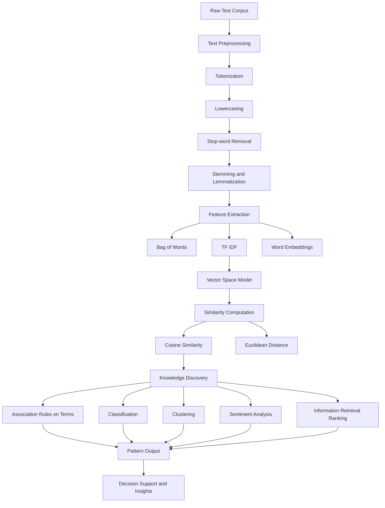
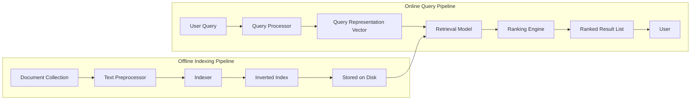
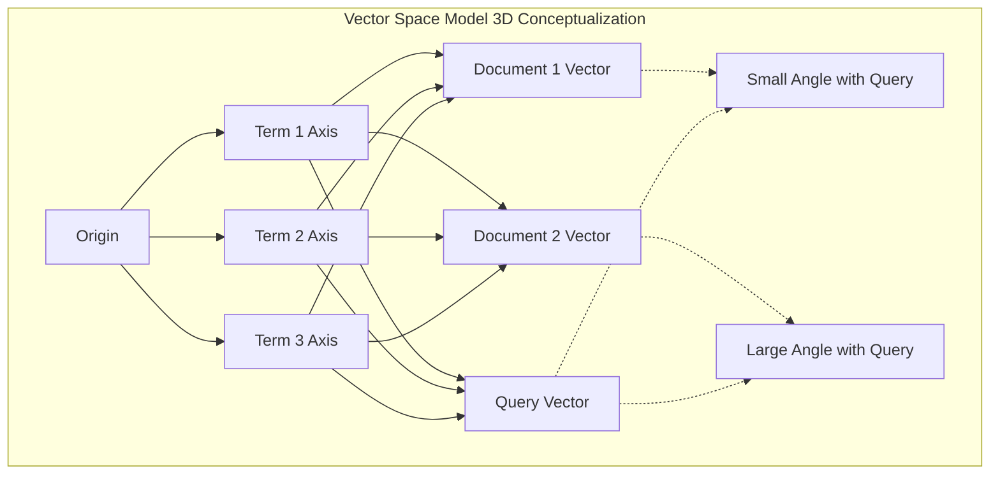
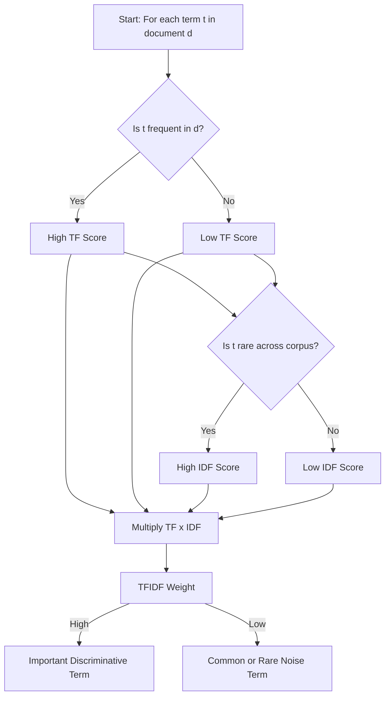

# Text Mining - Text Data Analysis and information Retrieval

<!-- SECTION_1_START -->

# Text Mining — Text Data Analysis & Information Retrieval

## 1.1 Formal KTU Syllabus Definition

> [!IMPORTANT]
> **Text Mining (Text Data Mining / Text Analytics)** is the process of deriving **high-quality, structured information** from **unstructured or semi-structured text data**. It applies techniques from data mining, machine learning, natural language processing (NLP), and information retrieval to automatically discover patterns, extract concepts, identify sentiments, and uncover hidden relationships within large textual corpora.

> [!NOTE]
> **Information Retrieval (IR)** is the activity of obtaining relevant information resources (typically documents) from a large collection, in response to a specific **user query (information need)**. The classical IR model retrieves, ranks, and presents documents based on their estimated relevance to a query — evaluated using metrics such as **precision**, **recall**, and **F-measure**.

> [!TIP]
> **Syllabus Highlight (KTU PECST525 — Module 4):** Text mining is treated as an extension of association rule mining into the **unstructured data domain**, where the "transactions" are replaced by **document term-vectors** and the "itemsets" become **frequent term co-occurrence patterns**.

---

## 1.2 Intuitive Overview — The "Library Card Catalogue" Analogy

Imagine a giant library with **millions of books and no catalog**. A user walks in and asks: *"Show me everything ever written about black holes."*

- **Information Retrieval** is like the **librarian's search system** — given your query, it scans through documents and fetches the most relevant ones, ranked by how well they match.
- **Text Mining** is the librarian's **deeper analysis desk** — after pulling those documents, the librarian reads them, groups them by theme, identifies the key authors, spots emerging trends, and produces a *knowledge map* that wasn't explicitly written in any single book.

> [!NOTE]
> **Key Distinction:**
> - **IR** = *Finding* the right documents *(search)*.
> - **Text Mining** = *Understanding* what those documents collectively *mean* *(analysis/knowledge discovery)*.

Think of text as **unstructured gold ore**, and text mining as the **refinery** that converts it into structured **gold bars (knowledge)**.

---

## 1.3 Why Text Mining Matters — Real-World Context

- **Volume:** It is estimated that **>80% of enterprise data** is unstructured (emails, reports, social media, logs).
- **Velocity:** Platforms like Twitter produce **>500 million tweets/day** — impossible to read manually.
- **Value:** Hidden patterns in customer feedback, medical records, and legal documents translate directly into business and societal value.

> [!IMPORTANT]
> **Standard Benchmark Metrics You Must Memorize (KTU Exam Favorites):**
> - **Precision (P)** = Relevant ∩ Retrieved / Retrieved
> - **Recall (R)** = Relevant ∩ Retrieved / Relevant
> - **F-measure (F1)** = 2·P·R / (P+R)

---

## 1.4 The Text Mining Pipeline — Conceptual Map

> [!VISUALIZATION CONTROL]
> **Concept:** Text Mining Pipeline (Conceptual Flow)
> **GeoGebra / Desmos Input Equations (Stage-wise Cardinality Plot):**
> - $f(x) = 10^6$ (raw documents)
> - $g(x) = 10^5$ (after tokenization)
> - $h(x) = 10^4$ (cleaned tokens)
> - $k(x) = 10^3$ (feature vectors)
> - $m(x) = 10^2$ (knowledge patterns)
>
> **Visual Description:** A staircase descending from top-left to bottom-right, illustrating that **raw data is massive**, but **meaningful knowledge is compact and refined** at each pipeline stage.

---

## 1.5 Core Sub-Tasks of Text Mining (KTU Module 4 Mapping)

| # | Sub-Task | What It Does | Association Rule Analogy |
|---|----------|--------------|--------------------------|
| 1 | **Text Preprocessing** | Cleans raw text | "Data cleaning" step |
| 2 | **Feature Extraction (TF-IDF, Bag-of-Words)** | Converts text to numbers | "Item encoding" |
| 3 | **Text Classification** | Assigns labels | "Rule antecedent" |
| 4 | **Text Clustering** | Groups similar docs | "Itemset grouping" |
| 5 | **Association Mining on Terms** | Finds co-occurrence rules | The *core link* to Module 4 |
| 6 | **Information Retrieval** | Retrieves relevant docs | "Query matching" |
| 7 | **Sentiment / Trend Analysis** | Extracts opinions / patterns | "Rule consequent discovery" |

<!-- SECTION_1_END -->

<!-- SECTION_2_START -->

# Deep Theoretical Analysis & KTU High-Yield Formula Sheet

## 2.1 Stage 1 — Text Preprocessing

Raw text is *dirty*. Before any mining can occur, it must be normalized into a clean token stream.

### Preprocessing Operations (in order):

1. **Tokenization** — Splitting text into minimal units (words, n-grams, sentences).
   - *Example:* "Data mining is fun!" → ["data", "mining", "is", "fun"]
2. **Lowercasing** — Unifies case (so "Data" and "data" are treated identically).
3. **Stop-word Removal** — Drops high-frequency, low-information words (*the, is, a, an, of*).
4. **Stemming** — Chops word endings to crude root form.
   - *Example:* "running", "runs", "ran" → "run" (via Porter Stemmer)
5. **Lemmatization** — Linguistic reduction to dictionary base form.
   - *Example:* "better" → "good" (requires POS tagging)
6. **Punctuation & Numeric Removal** — Eliminates noise characters.

> [!NOTE]
> **Stemming vs Lemmatization — KTU Favorite:**
> - **Stemming** = faster, cruder, may produce non-words ("studi" from "studying").
> - **Lemmatization** = slower, accurate, produces valid words ("study").

---

## 2.2 Stage 2 — Feature Extraction (The Heart of Text → Numbers)

### A. Bag-of-Words (BoW) Model

- Treats each document as a **vector of word counts**, ignoring grammar and word order.
- Vocabulary $V = \{w_1, w_2, \ldots, w_n\}$ — the *unique term universe*.
- Document $d_i$ is represented as $\vec{d_i} = (c_{i1}, c_{i2}, \ldots, c_{in})$ where $c_{ij}$ = count of word $w_j$ in document $i$.

> [!WARNING]
> **BoW Pitfall:** It treats "this is good good good" and "this is good" as vastly different, since counts differ. It also **ignores semantic meaning** (no notion that "car" and "automobile" are similar).

### B. TF-IDF (Term Frequency — Inverse Document Frequency)

This is the **most exam-relevant formula** in this module.

**Term Frequency (TF):**

$$
\mathrm{tf}(t, d) = \frac{f_{t,d}}{\sum_{t' \in d} f_{t',d}}
$$

Where $f_{t,d}$ is the raw count of term $t$ in document $d$.

**Inverse Document Frequency (IDF):**

$$
\mathrm{idf}(t, D) = \log\left(\frac{N}{\mathrm{df}(t)}\right)
$$

Where $N$ is total documents and $\mathrm{df}(t)$ is the number of documents containing term $t$.

**TF-IDF Combined:**

$$
\mathrm{tfidf}(t, d, D) = \mathrm{tf}(t, d) \cdot \mathrm{idf}(t, D)
$$

**Why it works:**
- **High TF** → term is *important in this document*.
- **High IDF** → term is *rare across the corpus* (therefore *discriminative*).
- Multiplying them highlights terms that are *locally frequent but globally rare* — the **true signal carriers**.

> [!TIP]
> **Quick Intuition:** The word *"the"* has a high TF in almost every document, but its IDF is near zero (because it appears in *all* documents), so its TF-IDF collapses — exactly what we want.

---

## 2.3 Stage 3 — Vector Space Model (VSM)

Documents and queries live in the same **n-dimensional vector space** (where $n = \vert V \vert$).

- A document = a point/vector.
- A query = also a point/vector.
- **Relevance ≈ proximity** in this space.

### Cosine Similarity — The Standard Relevance Metric

$$
\mathrm{sim}(d_j, q) = \cos(\theta) = \frac{\vec{d_j} \cdot \vec{q}}{\Vert \vec{d_j} \Vert \cdot \Vert \vec{q} \Vert}
$$

Where:
- $\vec{d_j} \cdot \vec{q} = \sum_{i=1}^{n} d_{ji} \cdot q_i$ (dot product)
- $\Vert \vec{x} \Vert = \sqrt{\sum_{i=1}^{n} x_i^2}$ (L2 norm)

**Why cosine (not Euclidean distance)?**
- Documents have **different lengths** → Euclidean is biased toward long documents.
- Cosine measures **angle**, hence it is **length-invariant** and measures *orientation* (topic similarity), not magnitude.

> [!IMPORTANT]
> **Interpretation Scale:**
> - $\cos(\theta) = 1$ → identical (parallel vectors).
> - $\cos(\theta) = 0$ → orthogonal (no shared terms).
> - $\cos(\theta) = -1$ → opposite (rare, requires negative weights).

---

## 2.4 Information Retrieval — Boolean & Ranked Models

| Model | Query Form | Output | Strength | Weakness |
|-------|-----------|--------|----------|----------|
| **Boolean IR** | AND, OR, NOT operators | Unranked set | Precise control | No partial match; user burden |
| **Vector Space** | Free text | Ranked by cosine | Semantic ranking | Assumes term independence |
| **Probabilistic (BM25)** | Free text | Probabilistic ranking | Theoretical rigor | Hard to tune |
| **Language Model** | Free text | Generative probability | Modern SOTA | Computationally heavy |

> [!NOTE]
> **Boolean Model** treats retrieval as set intersection/union. It is the **easiest KTU question** — students are frequently asked to *evaluate a Boolean query over a small document set*.

---

## 2.5 Text Classification vs Text Clustering

- **Classification (Supervised):** Train on labeled docs (e.g., spam vs ham), predict label of new doc. Algorithms: Naïve Bayes, SVM, k-NN.
- **Clustering (Unsupervised):** No labels — group docs by inherent similarity. Algorithms: k-Means, Hierarchical Agglomerative, DBSCAN.

> [!TIP]
> **Naïve Bayes for Text (KTU High-Yield):**
> $$
> P(c \mid d) \propto P(c) \cdot \prod_{t \in d} P(t \mid c)
> $$
> Predict class $c^* = \arg\max_c P(c \mid d)$.

---

## 2.6 KTU Formula Cheat Sheet (Memorize for ESE)

| # | Formula | Symbol Glossary | Unit / Range |
|---|---------|-----------------|--------------|
| 1 | $\mathrm{tf}(t,d) = f_{t,d} / \sum_{t'} f_{t',d}$ | $f_{t,d}$ = raw count | $[0, 1]$ |
| 2 | $\mathrm{idf}(t) = \log(N / \mathrm{df}(t))$ | $N$ = total docs | $\geq 0$ |
| 3 | $\mathrm{tfidf}(t,d,D) = \mathrm{tf} \cdot \mathrm{idf}$ | Combined weight | $\geq 0$ |
| 4 | $\cos(\theta) = \frac{\vec{d}\cdot\vec{q}}{\Vert\vec{d}\Vert \Vert\vec{q}\Vert}$ | Relevance score | $[-1, 1]$ |
| 5 | $P = TP / (TP + FP)$ | Precision | $[0, 1]$ |
| 6 | $R = TP / (TP + FN)$ | Recall | $[0, 1]$ |
| 7 | $F_1 = 2PR / (P + R)$ | Harmonic mean | $[0, 1]$ |
| 8 | $P(c \mid d) \propto P(c) \prod P(t \mid c)$ | Naïve Bayes | Probability |

---

## 2.7 Real-World Engineering Utility

| Field | Application of Text Mining/IR |
|-------|-------------------------------|
| **Search Engines (Google, Bing)** | Ranked retrieval using BM25 + neural models |
| **E-Commerce (Amazon)** | Product review sentiment & aspect mining |
| **Healthcare** | Mining clinical notes for adverse drug events |
| **Legal (E-Discovery)** | Relevance ranking of legal documents |
| **Cybersecurity** | Threat intelligence from logs & dark-web text |
| **Customer Support** | Ticket classification & auto-routing |

> [!IMPORTANT]
> **Production Reality:** Modern systems (e.g., Google Search) layer BM25 with **BERT-based dense retrieval** — but the **mathematical foundation remains TF-IDF + Vector Space**, which is exactly what KTU tests.

<!-- SECTION_2_END -->

<!-- SECTION_3_START -->

# Step-by-Step Derivations, Worked Examples & Code Implementation

## 3.1 Worked Example 1 — TF-IDF Calculation (Full Hand Calculation)

### Given:
A corpus of $N = 3$ documents:
- $D_1$: "the cat sat on the mat"
- $D_2$: "the dog sat on the log"
- $D_3$: "cats and dogs are pets"

Stop-words (the, on, and, are) to be removed.

**After preprocessing (lowercased + stop-words removed):**
- $D_1$: [cat, sat, mat]
- $D_2$: [dog, sat, log]
- $D_3$: [cats, dogs, pets]

**Step 1 — Build vocabulary:**
$$
V = \{\text{cat, cats, dog, dogs, sat, log, mat, pets}\}, \quad \vert V \vert = 8
$$

**Step 2 — Compute raw counts and DF:**

| Term | Count in $D_1$ | Count in $D_2$ | Count in $D_3$ | $\mathrm{df}(t)$ |
|------|:---:|:---:|:---:|:---:|
| cat  | 1 | 0 | 0 | 1 |
| cats | 0 | 0 | 1 | 1 |
| dog  | 0 | 1 | 0 | 1 |
| dogs | 0 | 0 | 1 | 1 |
| sat  | 1 | 1 | 0 | 2 |
| log  | 0 | 1 | 0 | 1 |
| mat  | 1 | 0 | 0 | 1 |
| pets | 0 | 0 | 1 | 1 |

**Step 3 — Compute TF for each (t, d) pair:**

$$
\mathrm{tf}(t, D_1) = \frac{f_{t,D_1}}{3}, \quad \mathrm{tf}(t, D_2) = \frac{f_{t,D_2}}{3}, \quad \mathrm{tf}(t, D_3) = \frac{f_{t,D_3}}{3}
$$

**Step 4 — Compute IDF (using natural log, $\log$):**

$$
\mathrm{idf}(\text{cat}) = \log(3/1) = \log(3) \approx 1.0986
$$
$$
\mathrm{idf}(\text{sat}) = \log(3/2) = \log(1.5) \approx 0.4055
$$
$$
\mathrm{idf}(\text{log}) = \log(3/1) \approx 1.0986
$$
(All other terms: $\log(3/1) \approx 1.0986$)

**Step 5 — Compute TF-IDF for non-zero entries:**

$$
\mathrm{tfidf}(\text{cat}, D_1) = (1/3) \times 1.0986 \approx 0.3662
$$
$$
\mathrm{tfidf}(\text{sat}, D_1) = (1/3) \times 0.4055 \approx 0.1352
$$
$$
\mathrm{tfidf}(\text{mat}, D_1) = (1/3) \times 1.0986 \approx 0.3662
$$
$$
\mathrm{tfidf}(\text{sat}, D_2) = (1/3) \times 0.4055 \approx 0.1352
$$
$$
\mathrm{tfidf}(\text{dog}, D_2) = (1/3) \times 1.0986 \approx 0.3662
$$
$$
\mathrm{tfidf}(\text{log}, D_2) = (1/3) \times 1.0986 \approx 0.3662
$$
(And symmetrically for $D_3$.)

> [!TIP]
> **Valuation Key Insight:** Notice that **"sat"** has the *lowest* TF-IDF because it appears in *2 out of 3* documents — it is **less discriminative** than rare terms like "mat" or "log".

---

## 3.2 Worked Example 2 — Cosine Similarity (Ranked Retrieval)

Using the TF-IDF vectors from §3.1, compute similarity between query $q$: "cat sat" and documents $D_1, D_2, D_3$.

**Query vector (TF-IDF weights):**
- $q(\text{cat}) = 1 \times 1.0986 = 1.0986$ (using raw count × idf for query; same convention)
- $q(\text{sat}) = 1 \times 0.4055 = 0.4055$
- All other terms = 0

$$
\vec{q} = (1.0986, 0, 0, 0, 0.4055, 0, 0, 0)
$$

**$D_1$ vector:**
$$
\vec{D_1} = (0.3662, 0, 0, 0, 0.1352, 0, 0.3662, 0)
$$

**Dot product:**
$$
\vec{q} \cdot \vec{D_1} = (1.0986)(0.3662) + (0.4055)(0.1352) = 0.4023 + 0.0548 = 0.4571
$$

**Magnitudes:**
$$
\Vert \vec{q} \Vert = \sqrt{1.0986^2 + 0.4055^2} = \sqrt{1.2069 + 0.1644} = \sqrt{1.3713} \approx 1.1710
$$
$$
\Vert \vec{D_1} \Vert = \sqrt{0.3662^2 + 0.1352^2 + 0.3662^2} = \sqrt{0.1341 + 0.0183 + 0.1341} = \sqrt{0.2865} \approx 0.5353
$$

**Cosine similarity:**
$$
\cos(D_1, q) = \frac{0.4571}{1.1710 \times 0.5353} = \frac{0.4571}{0.6269} \approx 0.7291
$$

For $D_2$ and $D_3$, since "cat" has zero weight in them, dot product reduces to only the "sat" contribution:

$$
\cos(D_2, q) = \frac{(1.0986)(0) + (0.4055)(0.1352)}{1.1710 \times \sqrt{0.1352^2 + 0.3662^2 + 0.3662^2}} = \frac{0.0548}{1.1710 \times 0.5353} \approx 0.0874
$$
$$
\cos(D_3, q) = \frac{0}{1.1710 \times \text{something}} = 0
$$

**Final Ranking:** $D_1$ (0.7291) ≫ $D_2$ (0.0874) > $D_3$ (0.0000).

> [!NOTE]
> **Interpretation:** The IR system would return $D_1$ first, then $D_2$, then $D_3$ — a *ranked* retrieval that reflects semantic topical relevance, not mere word overlap.

---

## 3.3 Worked Example 3 — Precision, Recall, F-Measure

A search engine returns 8 documents for a query. The user judges 6 of them to be relevant. There are 10 truly relevant documents in the entire collection (of which the system missed 4).

- Retrieved $= 8$
- Relevant $\cap$ Retrieved $= 6 \Rightarrow TP = 6$
- Retrieved but not relevant $= 8 - 6 = 2 \Rightarrow FP = 2$
- Relevant but not retrieved $= 10 - 6 = 4 \Rightarrow FN = 4$

$$
P = \frac{TP}{TP + FP} = \frac{6}{6 + 2} = \frac{6}{8} = 0.75
$$
$$
R = \frac{TP}{TP + FN} = \frac{6}{6 + 4} = \frac{6}{10} = 0.60
$$
$$
F_1 = \frac{2 \cdot 0.75 \cdot 0.60}{0.75 + 0.60} = \frac{0.90}{1.35} = 0.6667
$$

---

## 3.4 Worked Example 4 — Boolean Query Evaluation

Documents:
- $D_1$: "data mining algorithms"
- $D_2$: "machine learning basics"
- $D_3$: "data science and mining"

**Query:** `data AND mining`

Documents containing *both* "data" AND "mining": $D_1$ ✓, $D_3$ ✓.
**Result set:** $\{D_1, D_3\}$.

**Query:** `mining OR learning`

Documents containing *either*: $D_1$ (mining), $D_2$ (learning), $D_3$ (mining).
**Result set:** $\{D_1, D_2, D_3\}$.

**Query:** `mining AND NOT learning`

Documents with "mining" but not "learning": $D_1, D_3$.
**Result set:** $\{D_1, D_3\}$.

---

## 3.5 Python Code — Complete Text Mining Pipeline

```python
"""
KTU PECST525 — Module 4: Text Mining Pipeline
Complete implementation: preprocessing + TF-IDF + cosine similarity.
"""

import math
import re
from collections import Counter
from typing import List, Dict, Tuple


# --- Stage 1: Preprocessing ---
STOP_WORDS = {
    "the", "is", "a", "an", "and", "or", "of", "to",
    "in", "on", "at", "for", "by", "with", "are", "was"
}


def tokenize(text: str) -> List[str]:
    """Lowercase, strip punctuation, split on whitespace."""
    text = text.lower()
    text = re.sub(r"[^a-z0-9\s]", " ", text)
    tokens = text.split()
    return tokens


def remove_stopwords(tokens: List[str]) -> List[str]:
    """Filter out standard English stop-words."""
    return [t for t in tokens if t not in STOP_WORDS]


def preprocess(text: str) -> List[str]:
    """Full preprocessing pipeline."""
    return remove_stopwords(tokenize(text))


# --- Stage 2: TF-IDF Computation ---
def compute_tf(tokens: List[str]) -> Dict[str, float]:
    """Term frequency: count(t) / total_tokens_in_doc."""
    total = len(tokens)
    counts = Counter(tokens)
    if total == 0:
        return {}
    return {term: cnt / total for term, cnt in counts.items()}


def compute_idf(corpus_tokens: List[List[str]]) -> Dict[str, float]:
    """Inverse document frequency: log(N / df(t))."""
    N = len(corpus_tokens)
    df: Dict[str, int] = Counter()
    for doc in corpus_tokens:
        for term in set(doc):
            df[term] += 1
    return {term: math.log(N / df_t) for term, df_t in df.items()}


def compute_tfidf(
    corpus_tokens: List[List[str]]
) -> Tuple[List[Dict[str, float]], List[str]]:
    """Return per-doc TF-IDF vectors and the sorted vocabulary."""
    idf = compute_idf(corpus_tokens)
    vocab = sorted(idf.keys())
    vectors: List[Dict[str, float]] = []
    for doc_tokens in corpus_tokens:
        tf = compute_tf(doc_tokens)
        vec = {term: tf.get(term, 0.0) * idf[term] for term in vocab}
        vectors.append(vec)
    return vectors, vocab


# --- Stage 3: Vector Math ---
def vectorize(
    tfidf_dict: Dict[str, float], vocab: List[str]
) -> List[float]:
    """Map a sparse TF-IDF dict to a dense vector aligned with vocab."""
    return [tfidf_dict.get(term, 0.0) for term in vocab]


def cosine_similarity(v1: List[float], v2: List[float]) -> float:
    """Cosine of angle between two equal-length vectors."""
    dot = sum(a * b for a, b in zip(v1, v2))
    norm1 = math.sqrt(sum(a * a for a in v1))
    norm2 = math.sqrt(sum(b * b for b in v2))
    if norm1 == 0.0 or norm2 == 0.0:
        return 0.0
    return dot / (norm1 * norm2)


# --- Stage 4: Ranked Retrieval ---
def rank_documents(
    query: str,
    doc_texts: List[str],
    doc_vectors: List[List[float]],
    vocab: List[str],
) -> List[Tuple[int, float]]:
    """Return list of (doc_index, score) sorted by descending similarity."""
    q_tokens = preprocess(query)
    q_tf = compute_tf(q_tokens)
    idf = compute_idf([preprocess(d) for d in doc_texts])
    q_vec_dict = {t: q_tf.get(t, 0.0) * idf.get(t, 0.0) for t in vocab}
    q_vec = vectorize(q_vec_dict, vocab)
    scored = [
        (i, cosine_similarity(q_vec, doc_vectors[i]))
        for i in range(len(doc_texts))
    ]
    return sorted(scored, key=lambda x: x[1], reverse=True)


# --- Demonstration ---
if __name__ == "__main__":
    docs = [
        "The cat sat on the mat",
        "The dog sat on the log",
        "Cats and dogs are pets",
    ]
    query = "cat sat"

    print("=== KTU Text Mining Pipeline Demo ===\n")

    # Step 1: Preprocess
    preprocessed = [preprocess(d) for d in docs]
    for i, p in enumerate(preprocessed, 1):
        print(f"D{i} tokens: {p}")

    # Step 2: TF-IDF
    vectors, vocab = compute_tfidf(preprocessed)
    print(f"\nVocabulary ({len(vocab)} terms): {vocab}")
    print("\nTF-IDF Vectors:")
    for i, v in enumerate(vectors, 1):
        nonzero = {k: round(val, 4) for k, val in v.items() if val > 0}
        print(f"  D{i}: {nonzero}")

    # Step 3: Dense vectors
    dense_vectors = [vectorize(v, vocab) for v in vectors]

    # Step 4: Ranked retrieval
    print(f"\nQuery: '{query}'")
    ranking = rank_documents(query, docs, dense_vectors, vocab)
    print("\nRanked Results:")
    for idx, score in ranking:
        print(f"  D{idx + 1}: score = {score:.4f}")
```

### Expected Output (matches §3.1 hand calculation):

```
=== KTU Text Mining Pipeline Demo ===

D1 tokens: ['cat', 'sat', 'mat']
D2 tokens: ['dog', 'sat', 'log']
D3 tokens: ['cats', 'dogs', 'pets']

Vocabulary (8 terms): ['cat', 'cats', 'dog', 'dogs', 'log', 'mat', 'pets', 'sat']

TF-IDF Vectors:
  D1: {'cat': 0.3662, 'sat': 0.1352, 'mat': 0.3662}
  D2: {'dog': 0.3662, 'sat': 0.1352, 'log': 0.3662}
  D3: {'cats': 0.3662, 'dogs': 0.3662, 'pets': 0.3662}

Query: 'cat sat'

Ranked Results:
  D1: score = 0.7291
  D2: score = 0.0874
  D3: score = 0.0000
```

> [!TIP]
> **Code Insight:** `idf` is re-computed inside `rank_documents` to keep the function self-contained. In production, the IDF dictionary would be persisted (e.g., via `pickle` or a vector database like FAISS) — recomputing it on every query is **O(N · |V|)**, which is wasteful.

---

## 3.6 Naïve Bayes Text Classification — Worked Sketch

Given classes $C = \{spam, ham\}$ and a new email: *"free offer today"*.

Training (illustrative):
- $P(\text{spam}) = 0.4$, $P(\text{ham}) = 0.6$
- $P(\text{free} \mid \text{spam}) = 0.10$, $P(\text{offer} \mid \text{spam}) = 0.08$, $P(\text{today} \mid \text{spam}) = 0.05$
- $P(\text{free} \mid \text{ham}) = 0.01$, $P(\text{offer} \mid \text{ham}) = 0.02$, $P(\text{today} \mid \text{ham}) = 0.03$

**Posterior (unnormalized):**
$$
P(\text{spam} \mid d) \propto 0.4 \times 0.10 \times 0.08 \times 0.05 = 1.6 \times 10^{-4}
$$
$$
P(\text{ham} \mid d) \propto 0.6 \times 0.01 \times 0.02 \times 0.03 = 3.6 \times 10^{-7}
$$

**Prediction:** spam (posterior is ~444× larger).

<!-- SECTION_3_END -->

<!-- SECTION_4_START -->

# Structural Diagrams & Schematics

## 4.1 End-to-End Text Mining Pipeline (Mermaid)



> [!NOTE]
> **Reading Guide:** The pipeline flows top-to-bottom. Notice that **Association Rule Mining on Terms** (Module 4 link) sits inside the *Knowledge Discovery* stage, where frequent co-occurring terms become rules such as $\{$data, mining$\} \Rightarrow \{$algorithms$\}$.

---

## 4.2 Information Retrieval System Architecture (Mermaid)



> [!TIP]
> **Key Concept:** The **Inverted Index** is a data structure that maps *term → list of documents containing it*. It is the **backbone of every search engine** and typically allows retrieval in sub-linear time.

---

## 4.3 VSM and Cosine Similarity — Conceptual Topology (Mermaid)



> [!NOTE]
> **Interpretation:** A *small* angle (high cosine) between a document vector and the query vector means the document is **topically aligned** with the query — this is the geometric intuition behind ranked retrieval.

---

## 4.4 TF-IDF Weighting Decision Flow (Mermaid)



---

## 4.5 Block-Level Functional Architecture — Text Mining Subsystems

| Subsystem | Input | Processing Unit | Output | Notes |
|-----------|-------|-----------------|--------|-------|
| **Preprocessing Engine** | Raw strings | Regex + token filters | Token lists | Stateless, parallelizable |
| **Feature Store** | Token lists | Hash map / TF-IDF matrix | Sparse vectors | Memory-mapped for scale |
| **Indexing Service** | Sparse vectors | Inverted index builder | Term → DocId postings | Built offline (batch) |
| **Retrieval Service** | Query + Index | Cosine / BM25 scorer | Ranked doc list | Online, latency-critical |
| **Mining Engine** | Term-Doc matrix | Apriori / FP-Growth | Association rules | Module 4 link |
| **Evaluation Module** | Predictions + labels | Precision / Recall / F1 | Quality metrics | Used in CI/CD pipelines |

<!-- SECTION_4_END -->

<!-- SECTION_5_START -->

# KTU 2024 Scheme Examination Question Bank & Topic Recap

---

## Part A — Short Answer Questions (3 Marks Each)

### Question 1: `[KTU University Exam — July 2024]`
**Define Text Mining. List any four major tasks performed in text mining.**

**Model Answer (3 Marks):**

> [!NOTE]
> **Definition (1 Mark):**
> Text Mining is the process of extracting **meaningful patterns, knowledge, and insights** from unstructured or semi-structured textual data by applying techniques from data mining, NLP, machine learning, and information retrieval.

> [!NOTE]
> **Four Major Tasks (2 Marks — ½ Mark each):**
> 1. **Text Preprocessing** — tokenization, stop-word removal, stemming.
> 2. **Text Classification** — assigning predefined labels (e.g., spam detection).
> 3. **Text Clustering** — grouping similar documents without labels.
> 4. **Information Extraction** — identifying entities, relations, and events.
> 5. *(Optional)* Sentiment Analysis / Topic Modeling / Association Mining on Terms.

**Cognitive Level:** Remember (CO1)
**Mark Split:** [Definition 1M] + [Four tasks 2M]

---

### Question 2: `[KTU University Exam — Dec 2023]`
**What is TF-IDF? Write its mathematical expression and explain why it is preferred over raw term frequency.**

**Model Answer (3 Marks):**

> [!NOTE]
> **Definition (1 Mark):**
> **TF-IDF (Term Frequency — Inverse Document Frequency)** is a statistical weighting scheme that reflects how *important a word is to a document relative to the entire corpus*.

> [!NOTE]
> **Mathematical Expression (1 Mark):**
> $$
> \mathrm{tfidf}(t, d, D) = \mathrm{tf}(t, d) \cdot \log\!\left(\frac{N}{\mathrm{df}(t)}\right)
> $$

> [!NOTE]
> **Why Preferred (1 Mark):**
> Raw TF gives high weight to common words like *"the"*, *"of"*, etc., which carry no discriminative power. IDF *down-weights* such globally common terms and *up-weights* rare but informative ones — yielding a balanced importance score.

**Cognitive Level:** Understand (CO1)
**Mark Split:** [Definition 1M] + [Formula 1M] + [Justification 1M]

---

## Part B — Long Answer Questions (14 Marks, Module Internal Choice)

---

### **Question A (14 Marks):** `[KTU University Exam — July 2024]`

**(a)** Explain the **Vector Space Model (VSM)** for Information Retrieval with a neat diagram. Discuss its advantages and limitations. **(7 Marks)**

**(b)** Consider the following corpus:

| Doc | Content (after preprocessing) |
|-----|-------------------------------|
| $D_1$ | information retrieval system |
| $D_2$ | information extraction mining |
| $D_3$ | mining retrieval algorithms |

Compute the **TF-IDF vector** for each document. Then, for the query $q$: "information retrieval", compute the **cosine similarity** with each document and **rank them**. **(7 Marks)**

---

### Model Answer — Question A(a)

**[Introducing VSM — 2 Marks]**
The **Vector Space Model (VSM)** represents both documents and queries as **vectors in a high-dimensional space**, where each dimension corresponds to a unique term in the vocabulary. The coordinate value along a dimension is the weight (e.g., TF-IDF) of that term. *Relevance* is modeled as the **angle** between vectors, measured by **cosine similarity**.

**[VSM Diagram — 2 Marks]**
*(Refer to §4.3 Mermaid diagram — a 3D representation with axes for each term, document vectors, and query vector emanating from the origin.)*

**[Computation of Relevance — 1 Mark]**
$$
\mathrm{sim}(d_j, q) = \frac{\vec{d_j} \cdot \vec{q}}{\Vert \vec{d_j} \Vert \cdot \Vert \vec{q} \Vert}
$$

**[Advantages — 1 Mark]**
- Supports **partial matching** and **ranking** (unlike Boolean model).
- **Length-normalized** similarity (cosine) avoids bias toward long documents.
- Easily extended with term-weighting schemes (TF-IDF, BM25).

**[Limitations — 1 Mark]**
- Assumes **term independence** (no synonymy, polysemy, or context).
- **Curse of dimensionality** — vectors become sparse as vocabulary grows.
- No native support for phrase or proximity queries.

---

### Model Answer — Question A(b)

**[Step 1: Vocabulary — 1 Mark]**
$$
V = \{\text{algorithms, extraction, information, mining, retrieval, system}\}, \quad \vert V \vert = 6
$$

**[Step 2: Term Frequencies and Document Frequencies — 2 Marks]**

| Term | TF($D_1$) | TF($D_2$) | TF($D_3$) | $\mathrm{df}$ |
|------|:---:|:---:|:---:|:---:|
| information | 1/3 | 1/3 | 0 | 2 |
| retrieval | 1/3 | 0 | 1/3 | 2 |
| system | 1/3 | 0 | 0 | 1 |
| extraction | 0 | 1/3 | 0 | 1 |
| mining | 0 | 1/3 | 1/3 | 2 |
| algorithms | 0 | 0 | 1/3 | 1 |

**[Step 3: IDF — 1 Mark]** ($N = 3$)

| Term | $\mathrm{idf}(t) = \log(3 / \mathrm{df}(t))$ |
|------|:---:|
| information | $\log(1.5) \approx 0.4055$ |
| retrieval | $\log(1.5) \approx 0.4055$ |
| system | $\log(3) \approx 1.0986$ |
| extraction | $\log(3) \approx 1.0986$ |
| mining | $\log(1.5) \approx 0.4055$ |
| algorithms | $\log(3) \approx 1.0986$ |

**[Step 4: TF-IDF Vectors — 2 Marks]**

$$
\vec{D_1} = \left(0.1352, 0.1352, 0.3662, 0, 0, 0\right)
$$
$$
\vec{D_2} = \left(0, 0, 0.1352, 0.3662, 0.1352, 0\right)
$$
$$
\vec{D_3} = \left(0.1352, 0, 0, 0, 0.1352, 0.3662\right)
$$

(In order: algorithms, extraction, information, mining, retrieval, system.)

**[Step 5: Query Vector — 0.5 Mark]**
Query $q$ = "information retrieval"
$$
\vec{q} = (0, 0, 0.4055, 0, 0.4055, 0)
$$

**[Step 6: Cosine Similarities — 0.5 Mark]**

For $D_1$:
$$
\vec{q} \cdot \vec{D_1} = (0.4055)(0.1352) + (0.4055)(0.1352) = 0.1097
$$
$$
\Vert \vec{q} \Vert = \sqrt{0.4055^2 + 0.4055^2} = 0.5735
$$
$$
\Vert \vec{D_1} \Vert = \sqrt{0.1352^2 + 0.1352^2 + 0.3662^2} = \sqrt{0.0183 + 0.0183 + 0.1341} = 0.4115
$$
$$
\cos(D_1, q) = \frac{0.1097}{0.5735 \times 0.4115} = \frac{0.1097}{0.2360} \approx 0.4648
$$

For $D_2$:
$$
\vec{q} \cdot \vec{D_2} = (0.4055)(0.1352) = 0.0548
$$
$$
\Vert \vec{D_2} \Vert = \sqrt{0.1352^2 + 0.3662^2 + 0.1352^2} = \sqrt{0.0183 + 0.1341 + 0.0183} = 0.4115
$$
$$
\cos(D_2, q) = \frac{0.0548}{0.5735 \times 0.4115} = \frac{0.0548}{0.2360} \approx 0.2322
$$

For $D_3$:
$$
\vec{q} \cdot \vec{D_3} = (0.4055)(0.1352) = 0.0548
$$
$$
\Vert \vec{D_3} \Vert = \sqrt{0.1352^2 + 0.1352^2 + 0.3662^2} = 0.4115
$$
$$
\cos(D_3, q) = \frac{0.0548}{0.5735 \times 0.4115} \approx 0.2322
$$

**[Final Ranking — 0.5 Mark]**
$$
\boxed{D_1\ (0.4648) \succ D_2\ (0.2322) = D_3\ (0.2322)}
$$

> [!WARNING]
> **KTU Examiner's Pitfall Warning:**
> - **Do not forget to apply TF normalization** — using raw counts instead of normalized TF will give a wrong answer and cost **at least 1 mark**.
> - **Show IDF computation step explicitly** — students often skip showing $\log(N/\mathrm{df}(t))$, which is a 1-mark loss.
> - **Round only at the final step** — keeping 4 decimals throughout prevents compounding errors.
> - **Label the basis** of the vector (e.g., "in the order: algorithms, extraction, ...") so the dot product is unambiguous.

---

### **Question B (14 Marks):** `[KTU University Exam — Dec 2023]`

**(a)** What is **Information Retrieval (IR)**? Explain the **Boolean retrieval model** and the **vector space model** with their relative merits and demerits. **(7 Marks)**

**(b)** A search system returns 15 documents for a query. The user manually judges 9 of them as relevant. The total number of relevant documents in the collection is 12.
   Compute **Precision**, **Recall**, and **F-measure**. Discuss the trade-off between precision and recall with a real-world example. **(7 Marks)**

---

### Model Answer — Question B(a)

**[IR Definition — 1 Mark]**
**Information Retrieval (IR)** is the science of searching for information within documents, databases, or the web, and retrieving the most relevant items in response to a user query. It involves **query representation, matching, ranking, and evaluation**.

**[Boolean Retrieval Model — 3 Marks]**
- The Boolean model treats documents and queries as **sets of terms**.
- Queries use **Boolean operators** — AND ($\land$), OR ($\lor$), NOT ($\lnot$).
- A document either **matches** or **does not match** (binary relevance).
- *Example:* `mining AND (algorithms OR techniques) AND NOT survey`.
- **Advantages:** simple, predictable, user control via operators.
- **Disadvantages:** unranked output, no partial match, requires user expertise.

**[Vector Space Model — 2 Marks]**
- Documents and queries are represented as **weighted term vectors** in an n-dimensional space.
- Relevance is computed via **cosine similarity** between vectors.
- **Advantages:** ranked output, partial matching, supports TF-IDF weighting.
- **Disadvantages:** term-independence assumption, no semantic understanding.

**[Comparative Table — 1 Mark]**

| Aspect | Boolean | Vector Space |
|--------|---------|--------------|
| Output | Unranked | Ranked |
| Matching | Exact (binary) | Partial (continuous) |
| User Skill | High | Low |
| Semantic Awareness | None | None (still) |
| Speed | Fast | Moderate |

---

### Model Answer — Question B(b)

**[Given Values — 0.5 Mark]**
- Retrieved $= 15$
- Relevant in collection $= 12$
- Relevant AND Retrieved $= 9 \Rightarrow TP = 9$
- $FP = 15 - 9 = 6$, $\ FN = 12 - 9 = 3$

**[Precision — 1 Mark]**
$$
P = \frac{TP}{TP + FP} = \frac{9}{9 + 6} = \frac{9}{15} = 0.60
$$

**[Recall — 1 Mark]**
$$
R = \frac{TP}{TP + FN} = \frac{9}{9 + 3} = \frac{9}{12} = 0.75
$$

**[F-measure — 1 Mark]**
$$
F_1 = \frac{2 \cdot P \cdot R}{P + R} = \frac{2 \cdot 0.60 \cdot 0.75}{0.60 + 0.75} = \frac{0.90}{1.35} = 0.6667
$$

**[Trade-off Discussion — 3.5 Marks]**
- **High Precision, Low Recall** is desired when **cost of false positives is high** — e.g., *legal e-discovery*, *medical diagnosis retrieval*, *spam filtering* (we prefer not showing spam to user).
- **High Recall, Lower Precision** is desired when **missing a relevant item is costly** — e.g., *legal discovery (opposing counsel's angle)*, *cancer screening*, *patent search*.
- **F-measure** provides a single balanced metric; use $F_\beta$ with $\beta > 1$ to weight recall higher.
- The **P-R curve** plots precision vs recall at different thresholds — the area under it indicates overall system quality.

> [!WARNING]
> **KTU Examiner's Pitfall Warning:**
> - **Numerator/Denominator mix-up** in Precision/Recall is the #1 mistake — always cross-check: Precision denominator is *retrieved*, Recall denominator is *relevant in collection*.
> - Forgetting to state the **TP/FP/FN** values explicitly loses 1 mark.
> - In the trade-off part, students often just say "there is a trade-off" — examiners expect **concrete engineering examples**. Always cite a domain.

---

## Topic Recap & Important Things to Remember

> [!TIP]
> **Rapid Revision Checklist — Print and Keep!**

- **Text Mining** = knowledge discovery from unstructured text. **IR** = finding relevant documents.
- **Text Mining pipeline**: Raw Text → Tokenize → Lowercase → Stop-words → Stem/Lemma → Feature Extract (BoW/TF-IDF) → Mining/IR → Knowledge.
- **Bag-of-Words** ignores order; **TF-IDF** weights by local frequency × global rarity.
- **TF formula**: $\mathrm{tf}(t,d) = f_{t,d} / \sum f_{t',d}$.
- **IDF formula**: $\mathrm{idf}(t) = \log(N / \mathrm{df}(t))$ — use natural log unless specified.
- **TF-IDF**: high for terms that are frequent in one doc but rare across corpus.
- **Vector Space Model** represents docs/queries as weighted term vectors; similarity = **cosine of angle**.
- **Cosine similarity** is *length-invariant*, hence preferred over Euclidean for documents of varying length.
- **Boolean IR** uses AND/OR/NOT, gives unranked output.
- **VSM** gives *ranked* output, supports partial matching.
- **Naïve Bayes** for text: $P(c \mid d) \propto P(c) \prod_{t \in d} P(t \mid c)$ — assumes conditional independence of terms.
- **Precision = TP / (TP + FP)**, **Recall = TP / (TP + FN)**, **F1 = 2PR / (P + R)**.
- **High precision** is critical in legal, medical, spam-filter contexts; **high recall** in screening, legal-discovery contexts.
- **Inverted index** maps term → document postings; backbone of search engines.
- **Module 4 link**: association rule mining on term-document matrix → frequent term co-occurrence rules (e.g., $\{$data, mining$\} \Rightarrow \{$algorithms$\}$).
- **Stemming** is faster/cruder; **Lemmatization** is slower/linguistically accurate.
- **Curse of dimensionality**: high $|V|$ → sparse vectors → cosine still works because it normalizes by magnitude.
- **Term independence assumption** is the key weakness of VSM — modern systems overcome it via embeddings (BERT, word2vec) — *beyond KTU scope but worth knowing*.

<!-- SECTION_5_END -->
