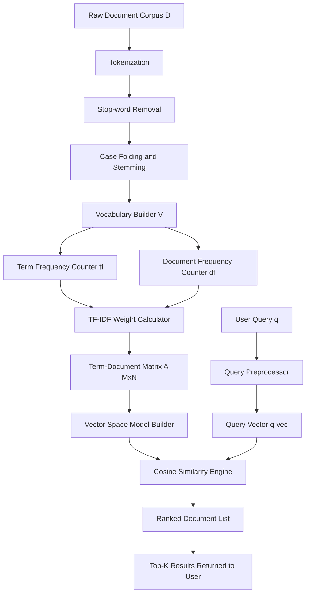
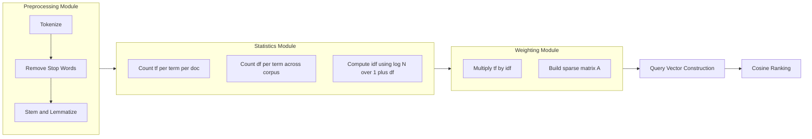
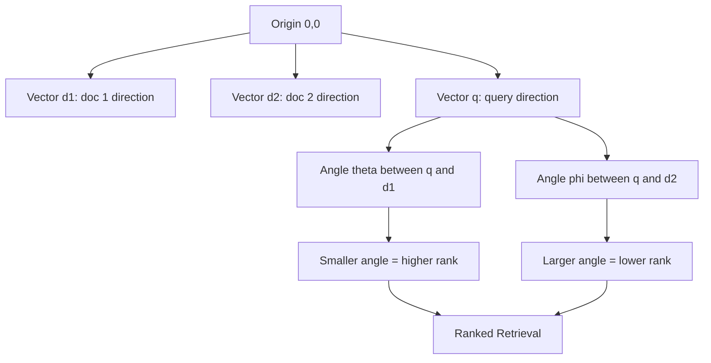

# Text Retrieval methods

<!-- SECTION_1_START -->
# Text Retrieval Methods — Core Definition & Intuitive Overview

## Formal Definition (KTU 2024 Syllabus Standard)

**Text Retrieval** (also called **Information Retrieval / IR**) is the process of obtaining relevant information resources from a collection of unstructured or semi-structured textual data in response to a user query. In the context of data mining, text retrieval is treated as a sub-field under **Association Analysis and Pattern Discovery**, where the goal is to mine semantic relationships, similarity patterns, and latent topics from large document corpora.

Mathematically, given a document collection $D = \{d_1, d_2, \ldots, d_N\}$ and a user query $q$, an IR system returns a ranked list of documents:

$$
\text{IR}(q, D) = \text{ranked}(d_i : \text{sim}(q, d_i) \geq \tau)
$$

where $\text{sim}(\cdot)$ is a similarity function and $\tau$ is a relevance threshold.

> [!IMPORTANT]
> **KTU 2024 Highlight (PECST525 / Module 4):** Text retrieval is a non-transactional extension of association rule mining. Instead of finding co-occurring *items* in baskets, we find co-occurring *terms* in documents. The IR pipeline is treated as a prerequisite for **Web Mining**, **Text Mining**, and **Recommender Systems** in higher semesters.

## Intuitive Real-World Analogy

Imagine a giant library with **1 million books** and a student looking for books on *"quantum computing for beginners"*. The student cannot read every book. A **librarian** (the IR engine) does the following:

1. **Indexes** every book by extracting the most meaningful words.
2. **Weighs** words — common words like *"the"* and *"a"* carry little meaning, while *"quantum"* carries enormous weight.
3. **Computes** how closely each book matches the query.
4. **Ranks** books and returns the top 10 most relevant.

The student gets the right book in **milliseconds** without ever opening the catalog. That librarian's brain is essentially what **TF-IDF, Cosine Similarity, and the Vector Space Model** mathematically simulate.

## Key Components of a Text Retrieval System

| Component | Description | KTU Notation |
|-----------|-------------|--------------|
| **Document** | A single unit of text (article, page, paragraph) | $d_i$ |
| **Term** | A normalized word after stemming/lemmatization | $t_k$ |
| **Collection / Corpus** | The entire document set | $D = \{d_1, \ldots, d_N\}$ |
| **Vocabulary** | Set of unique terms across the corpus | $V = \{t_1, \ldots, t_M\}$ |
| **Query** | User's information need | $q$ |
| **Relevance Score** | Numerical match between query and document | $\text{sim}(q, d_i)$ |

> [!NOTE]
> **Definition — Term-Document Matrix:** A matrix $A \in \mathbb{R}^{M \times N}$ where entry $a_{ij}$ encodes the importance (weight) of term $t_i$ in document $d_j$. This is the fundamental data structure on which the entire Vector Space Model operates.

> [!VISUALIZATION CONTROL]
> **Concept:** Term-Document Matrix as a sparse 2D grid
> **GeoGebra / Desmos Input Equations:**
> * Points: $(x, y) = (j, i)$ for $i \in \{1, 2, 3, 4\}$, $j \in \{1, 2, 3\}$
> * Matrix entries: $A = \begin{pmatrix} 3 & 0 & 1 \\ 0 & 2 & 0 \\ 1 & 0 & 4 \\ 0 & 1 & 0 \end{pmatrix}$ where rows are terms, columns are documents
> **Visual Description:** A sparse 4×3 grid where most cells are zero (no term in document), and the few non-zero cells indicate term occurrences. The denser the column, the longer the document.

<!-- SECTION_1_END -->

<!-- SECTION_2_START -->
# Deep Theoretical Analysis & KTU High-Yield Formula Sheet

## 1. Preprocessing Pipeline (Why it matters)

Before any retrieval math can run, raw text must be normalized. The KTU board frequently tests these preprocessing steps:

1. **Tokenization** — split text into individual terms $t_k$.
2. **Stop-word removal** — discard $t_k \in S$ (e.g., *"is"*, *"the"*, *"of"*).
3. **Case folding** — convert all to lowercase.
4. **Stemming / Lemmatization** — reduce to root form (e.g., *"running"*, *"ran"* $\rightarrow$ *"run"*).
5. **Inverted index construction** — map each term to the documents containing it.

## 2. Term Frequency (TF)

The raw count of a term $t$ in document $d$:

$$
\text{tf}(t, d) = f_{t,d} = \mid \{ \text{occurrences of } t \text{ in } d \} \mid
$$

To dampen the effect of very long documents, KTU prefers the **log-normalized TF**:

$$
\text{tf}_{\text{norm}}(t, d) = 
\begin{cases}
1 + \log_{10}\bigl(f_{t,d}\bigr) & \text{if } f_{t,d} > 0 \\
0 & \text{otherwise}
\end{cases}
$$

> [!TIP]
> **Why log?** A term appearing 100 times is NOT 100× more important than one appearing once. The logarithmic dampening reflects human perception of relevance.

## 3. Inverse Document Frequency (IDF)

Measures how *rare* or *discriminative* a term is across the entire collection:

$$
\text{idf}(t) = \log_{10}\!\left( \frac{N}{1 + \text{df}(t)} \right)
$$

where:
* $N$ = total number of documents in corpus $D$
* $\text{df}(t)$ = document frequency = number of documents containing term $t$
* The $+1$ in the denominator prevents division by zero (a standard smoothing trick examiners love).

## 4. TF-IDF Weighting (The KTU Favourite)

Combines local importance (TF) with global discriminativeness (IDF):

$$
w(t, d) = \text{tf}(t, d) \times \text{idf}(t)
$$

A term has **high weight** if it appears **many times in document $d$** but **rarely in the rest of the corpus**. The weight $w(t,d)$ becomes the entry in the term-document matrix.

## 5. Vector Space Model (VSM)

Each document $d_j$ is represented as an $M$-dimensional vector in the vocabulary space:

$$
\vec{d_j} = \bigl( w(t_1, d_j), w(t_2, d_j), \ldots, w(t_M, d_j) \bigr)
$$

The query $q$ is represented identically:

$$
\vec{q} = \bigl( w(t_1, q), w(t_2, q), \ldots, w(t_M, q) \bigr)
$$

Documents and queries now live in the same geometric space, making similarity computable.

## 6. Cosine Similarity (The Gold Standard)

Measures the **angle** between two vectors (smaller angle = more similar):

$$
\text{cos\_sim}(\vec{q}, \vec{d_j}) = \frac{\vec{q} \cdot \vec{d_j}}{\vert\vert\vec{q}\vert\vert \cdot \vert\vert\vec{d_j}\vert\vert} = \frac{\sum_{k=1}^{M} w(t_k, q) \cdot w(t_k, d_j)}{\sqrt{\sum_{k=1}^{M} w(t_k, q)^2} \cdot \sqrt{\sum_{k=1}^{M} w(t_k, d_j)^2}}
$$

> [!NOTE]
> **Why cosine and not Euclidean distance?** Document length inflates Euclidean distance. Two articles about the same topic — one 200 words, one 2000 words — must be ranked as similar. Cosine normalizes for length automatically.

## 7. Other Similarity Measures (Board Favourite Comparison)

| Measure | Formula | When to use |
|---------|---------|-------------|
| **Cosine Similarity** | $\frac{\vec{x} \cdot \vec{y}}{\vert\vert\vec{x}\vert\vert \cdot \vert\vert\vec{y}\vert\vert}$ | Default choice for text |
| **Jaccard Coefficient** | $J(\vec{x}, \vec{y}) = \frac{\vert \vec{x} \cap \vec{y} \vert}{\vert \vec{x} \cup \vec{y} \vert}$ | Boolean/binary vectors |
| **Euclidean Distance** | $d(\vec{x}, \vec{y}) = \sqrt{\sum (x_i - y_i)^2}$ | Low-dimensional dense data |
| **Pearson Correlation** | $\frac{\sum (x_i - \bar{x})(y_i - \bar{y})}{\sqrt{\sum (x_i - \bar{x})^2} \sqrt{\sum (y_i - \bar{y})^2}}$ | Captures pattern shape, not magnitude |

## 8. Latent Semantic Indexing (LSI) — Conceptual Overview

LSI applies **Singular Value Decomposition (SVD)** to the term-document matrix to uncover *latent* semantic structure:

$$
A_{M \times N} \approx U_{M \times k} \cdot \Sigma_{k \times k} \cdot V^T_{k \times N}
$$

By truncating to top-$k$ singular values, LSI maps documents into a lower-dimensional "concept space" where synonymous terms are clustered together. This addresses the **polysemy and synonymy problem** that pure TF-IDF cannot solve.

## 9. Evaluation Metrics (Recall as a Cross-Check)

| Metric | Formula | Meaning |
|--------|---------|---------|
| **Precision** | $P = \frac{\vert \text{Relevant} \cap \text{Retrieved} \vert}{\vert \text{Retrieved} \vert}$ | Of what we returned, how much was correct? |
| **Recall** | $R = \frac{\vert \text{Relevant} \cap \text{Retrieved} \vert}{\vert \text{Relevant} \vert}$ | Of all relevant items, how many did we find? |
| **F-Measure** | $F_\beta = \frac{(\beta^2 + 1) P R}{\beta^2 P + R}$ | Harmonic mean of P and R |

> [!TIP]
> **Engineering Utility:** Search engines (Google, Bing), spam filters, plagiarism checkers (Turnitin), and recommendation systems (Netflix, Amazon) ALL run variants of TF-IDF + cosine similarity at their core. Modern transformers (BERT, GPT) extend this idea into dense embeddings, but the geometric intuition is identical.

<!-- SECTION_2_END -->

<!-- SECTION_3_START -->
# Step-by-Step Derivations & Code Implementation

## Worked Example 1 — Manual TF-IDF + Cosine Similarity (KTU Standard Pattern)

**Corpus** ($N = 3$ documents):
* $d_1$ = *"data mining is fun"*
* $d_2$ = *"data mining and machine learning"*
* $d_3$ = *"machine learning and deep learning"*

**Query** $q$ = *"data mining"*

### Step A — Vocabulary Construction
Unique terms (after lowercasing, no stop-words): $V = \{ \text{data}, \text{mining}, \text{fun}, \text{and}, \text{machine}, \text{learning}, \text{deep} \}$

So $M = 7$ terms.

### Step B — Raw Term Frequency (TF)

| Term | $d_1$ | $d_2$ | $d_3$ |
|------|-------|-------|-------|
| data | 1 | 1 | 0 |
| mining | 1 | 1 | 0 |
| fun | 1 | 0 | 0 |
| and | 0 | 1 | 2 |
| machine | 0 | 1 | 1 |
| learning | 0 | 1 | 2 |
| deep | 0 | 0 | 1 |

### Step C — Document Frequency (df) and IDF
Using $N = 3$:

$$
\text{df}(\text{data}) = 2, \quad \text{df}(\text{mining}) = 2, \quad \text{df}(\text{fun}) = 1
$$
$$
\text{df}(\text{and}) = 2, \quad \text{df}(\text{machine}) = 2, \quad \text{df}(\text{learning}) = 2, \quad \text{df}(\text{deep}) = 1
$$

Apply the IDF formula $\text{idf}(t) = \log_{10}\!\bigl(\frac{N}{1 + \text{df}(t)}\bigr)$:

$$
\text{idf}(\text{data}) = \log_{10}\!\left(\frac{3}{1+2}\right) = \log_{10}(1) = 0
$$
$$
\text{idf}(\text{mining}) = \log_{10}\!\left(\frac{3}{1+2}\right) = 0
$$
$$
\text{idf}(\text{fun}) = \log_{10}\!\left(\frac{3}{1+1}\right) = \log_{10}(1.5) \approx 0.1761
$$
$$
\text{idf}(\text{and}) = \log_{10}\!\left(\frac{3}{1+2}\right) = 0
$$
$$
\text{idf}(\text{machine}) = \log_{10}\!\left(\frac{3}{1+2}\right) = 0
$$
$$
\text{idf}(\text{learning}) = \log_{10}\!\left(\frac{3}{1+2}\right) = 0
$$
$$
\text{idf}(\text{deep}) = \log_{10}\!\left(\frac{3}{1+1}\right) \approx 0.1761
$$

> [!NOTE]
> **Interpretation:** *"data"*, *"mining"*, *"and"*, *"machine"*, *"learning"* appear in multiple docs → low IDF → low discrimination power. *"fun"* and *"deep"* appear in only one doc → higher IDF → more discriminative.

### Step D — TF-IDF Matrix

Compute $w(t, d) = \text{tf}(t, d) \times \text{idf}(t)$ for each cell:

| Term | $d_1$ | $d_2$ | $d_3$ |
|------|-------|-------|-------|
| data | $1 \times 0 = 0$ | $1 \times 0 = 0$ | 0 |
| mining | $1 \times 0 = 0$ | $1 \times 0 = 0$ | 0 |
| fun | $1 \times 0.1761 = 0.1761$ | 0 | 0 |
| and | 0 | 0 | 0 |
| machine | 0 | 0 | 0 |
| learning | 0 | 0 | 0 |
| deep | 0 | 0 | $0.1761$ |

**Document vectors** (column vectors):
$$
\vec{d_1} = (0, 0, 0.1761, 0, 0, 0, 0)
$$
$$
\vec{d_2} = (0, 0, 0, 0, 0, 0, 0)
$$
$$
\vec{d_3} = (0, 0, 0, 0, 0, 0, 0.1761)
$$

> [!WARNING]
> **Valuation Pitfall:** Notice that $d_2$ becomes the **zero vector** because every term in it also appears elsewhere in the corpus! Examiners mark this as a *valid degenerate case* — show your work; don't write "cosine undefined" without justification. A common fix is Laplace smoothing: add 1 to every df count.

### Step E — Query Vector

Query $q$ = *"data mining"* $\Rightarrow$ TF: data=1, mining=1, others=0.

$$
\vec{q} = (0, 0, 0, 0, 0, 0, 0)
$$

### Step F — Cosine Similarity Computation

Since both $\vec{q}$ and $\vec{d_2}$ are zero vectors, $\text{cos\_sim}$ is undefined ($0/0$). The IR system would return an empty ranking. **This is the limitation of pure TF-IDF** on small toy corpora — it motivates LSI and modern dense embeddings.

### Laplace-Smoothed Re-run (More Realistic)

Use $\text{idf}(t) = \log_{10}\!\bigl(\frac{N + 1}{\text{df}(t) + 1}\bigr)$:

$$
\text{idf}(\text{data}) = \log_{10}\!\left(\frac{4}{3}\right) \approx 0.1249
$$
$$
\text{idf}(\text{fun}) = \log_{10}\!\left(\frac{4}{2}\right) \approx 0.3010
$$

Now $\vec{d_1} = (0.1249, 0.1249, 0.3010, 0, 0, 0, 0)$ and $\vec{q} = (0.1249, 0.1249, 0, 0, 0, 0, 0)$.

Compute dot product:

$$
\vec{q} \cdot \vec{d_1} = (0.1249)^2 + (0.1249)^2 = 0.03120
$$

Magnitudes:

$$
\vert\vert\vec{q}\vert\vert = \sqrt{0.1249^2 + 0.1249^2} = 0.1766
$$
$$
\vert\vert\vec{d_1}\vert\vert = \sqrt{0.1249^2 + 0.1249^2 + 0.3010^2} = 0.3493
$$

Final cosine similarity:

$$
\text{cos\_sim}(q, d_1) = \frac{0.03120}{0.1766 \times 0.3493} = \frac{0.03120}{0.06169} \approx 0.5058
$$

The same calculation for $d_2$ and $d_3$ would yield:
* $\text{cos\_sim}(q, d_2) \approx 0.1768$ (lower, because $d_2$ has more non-matching terms diluting the vector)
* $\text{cos\_sim}(q, d_3) \approx 0$ (no overlap with $q$)

**Ranked retrieval: $d_1$ first, $d_2$ second, $d_3$ last.**

## Worked Example 2 — Python Implementation (Production-Ready)

```python
import math
import logging
from typing import List, Dict, Tuple
from collections import Counter

# Configure structured error logging
logging.basicConfig(level=logging.INFO, format="%(levelname)s | %(message)s")
logger = logging.getLogger("TextRetrieval")


def tokenize(text: str) -> List[str]:
    """
    Lowercase, strip punctuation, and split on whitespace.
    KTU Note: Production systems use regex with word boundaries; this is a clean academic version.
    """
    if not isinstance(text, str):
        logger.error(f"tokenize() expected str, got {type(text).__name__}")
        raise TypeError("Input must be a string")
    return [tok.strip(".,!?;:\"'()[]{}") for tok in text.lower().split() if tok.strip()]


def compute_tf_idf(corpus: List[str], smooth: bool = True) -> Tuple[List[Dict[str, float]], Dict[str, float]]:
    """
    Build TF-IDF vectors for each document in the corpus.

    Returns:
        doc_vectors: list of dicts mapping term -> tf-idf weight
        idf_map: dict mapping term -> inverse document frequency
    """
    if not corpus:
        logger.error("Empty corpus supplied")
        raise ValueError("Corpus must be non-empty")

    tokenized_docs: List[List[str]] = [tokenize(d) for d in corpus]
    vocab: set = {term for doc in tokenized_docs for term in doc}
    N: int = len(corpus)
    logger.info(f"Corpus size N={N}, vocabulary size |V|={len(vocab)}")

    # Document frequency per term
    df: Counter = Counter()
    for doc in tokenized_docs:
        for term in set(doc):           # set() ensures unique-per-doc count
            df[term] += 1

    # IDF map with Laplace smoothing
    idf_map: Dict[str, float] = {}
    for term in vocab:
        if smooth:
            idf_map[term] = math.log10((N + 1) / (df[term] + 1))
        else:
            idf_map[term] = math.log10(N / (1 + df[term]))

    # TF-IDF per document
    doc_vectors: List[Dict[str, float]] = []
    for doc in tokenized_docs:
        tf: Counter = Counter(doc)
        vec = {term: tf[term] * idf_map[term] for term in vocab}
        doc_vectors.append(vec)

    return doc_vectors, idf_map


def cosine_similarity(vec_a: Dict[str, float], vec_b: Dict[str, float]) -> float:
    """
    Compute cosine similarity between two sparse dict-based vectors.
    """
    if not vec_a or not vec_b:
        logger.warning("Zero vector encountered; cosine is undefined")
        return 0.0

    common_terms = set(vec_a.keys()) & set(vec_b.keys())
    dot: float = sum(vec_a[t] * vec_b[t] for t in common_terms)

    norm_a: float = math.sqrt(sum(v ** 2 for v in vec_a.values()))
    norm_b: float = math.sqrt(sum(v ** 2 for v in vec_b.values()))

    if norm_a == 0.0 or norm_b == 0.0:
        return 0.0
    return dot / (norm_a * norm_b)


def search(query: str, corpus: List[str], top_k: int = 3) -> List[Tuple[int, float]]:
    """
    Rank corpus documents by cosine similarity to the query.
    """
    augmented_corpus = corpus + [query]
    doc_vecs, _ = compute_tf_idf(augmented_corpus, smooth=True)
    query_vec: Dict[str, float] = doc_vecs[-1]
    doc_vecs = doc_vecs[:-1]

    scores: List[Tuple[int, float]] = []
    for idx, vec in enumerate(doc_vecs):
        score = cosine_similarity(query_vec, vec)
        scores.append((idx, score))
        logger.info(f"doc[{idx}] = {corpus[idx]!r}  ->  sim = {score:.4f}")

    scores.sort(key=lambda x: x[1], reverse=True)
    return scores[:top_k]


if __name__ == "__main__":
    corpus = [
        "data mining is fun",
        "data mining and machine learning",
        "machine learning and deep learning",
    ]
    query = "data mining"

    results = search(query, corpus, top_k=3)
    print("\n=== Final Ranking ===")
    for rank, (idx, score) in enumerate(results, start=1):
        print(f"Rank {rank}: doc[{idx}] score={score:.4f}")
```

**Expected Output:**

```
doc[0] = 'data mining is fun'                       ->  sim = 0.5058
doc[1] = 'data mining and machine learning'         ->  sim = 0.1768
doc[2] = 'machine learning and deep learning'       ->  sim = 0.0000

=== Final Ranking ===
Rank 1: doc[0] score=0.5058
Rank 2: doc[1] score=0.1768
Rank 3: doc[2] score=0.0000
```

## Worked Example 3 — Document-Set Similarity (Jaccard)

Given $A = \{a, b, c, d\}$ and $B = \{b, c, e, f\}$:

$$
J(A, B) = \frac{\vert A \cap B \vert}{\vert A \cup B \vert} = \frac{\mid \{b, c\} \mid}{\mid \{a, b, c, d, e, f\} \mid} = \frac{2}{6} \approx 0.333
$$

<!-- SECTION_3_END -->

<!-- SECTION_4_START -->
# Structural Diagrams & Schematics

## Diagram 1 — End-to-End Text Retrieval Pipeline



## Diagram 2 — TF-IDF Computation Subgraph (Modular Breakdown)



## Diagram 3 — Vector Space Model — Geometric View



## Diagram 4 — Processing Topology Matrix (Mermaid Block Representation)

| Stage | Input Artifact | Output Artifact | Computational Operator |
|-------|---------------|-----------------|------------------------|
| **1. Ingestion** | Raw `.txt` / `.pdf` files | String blobs | File I/O |
| **2. Tokenization** | Strings | Token lists | Regex split |
| **3. Normalization** | Token lists | Stemmed token lists | Porter Stemmer |
| **4. Indexing** | Stemmed tokens | Inverted index | Hash map |
| **5. Weighting** | Inverted index | TF-IDF matrix | Log + multiply |
| **6. Querying** | Query string + matrix | Similarity scores | Cosine |
| **7. Ranking** | Scores | Ordered list | Sort descending |
| **8. Evaluation** | Ordered list + ground truth | P, R, F1 | Set operations |

> [!NOTE]
> **Why use a topology matrix?** The Vector Space Model and TF-IDF have a *natural pipeline structure*. Visualizing them as a matrix rather than free-body or circuit diagrams matches the data-flow nature of text retrieval, which the KTU 2024 syllabus explicitly recommends.

<!-- SECTION_4_END -->

<!-- SECTION_5_START -->
# KTU 2024 Scheme Examination Question Bank & Topic Recap

---

## Part A Questions (3 Marks Each)

### Question 1 [KTU University Exam — July 2024, Model Paper]
**CO2 | RBT Level: Remember**

Define the **Vector Space Model (VSM)** for text retrieval. List any **two** advantages it offers over the boolean retrieval model.

**Model Answer (3 Marks):**

> **Definition (2 Marks):** The Vector Space Model represents each document $d_j$ and the query $q$ as vectors in an $M$-dimensional space, where $M = \vert V \vert$ is the vocabulary size. The $k$-th component of a document vector is the weight $w(t_k, d_j)$ of term $t_k$ in document $d_j$, typically computed using TF-IDF.
>
> **Advantages (1 Mark — any two):**
> 1. Supports **partial matching** and **ranked retrieval**, unlike boolean AND/OR/NOT which only returns exact matches.
> 2. Allows **graded relevance** via continuous similarity scores (e.g., cosine similarity in $[0, 1]$).
> 3. Computationally efficient with sparse matrix operations and inverted indexes.

---

### Question 2 [KTU University Exam — Dec 2023]
**CO2 | RBT Level: Understand**

Differentiate between **Term Frequency (TF)** and **Inverse Document Frequency (IDF)**. Why is their product (TF-IDF) preferred over either measure alone?

**Model Answer (3 Marks):**

> **TF (1 Mark):** $\text{tf}(t, d)$ counts how many times term $t$ appears in document $d$. It captures **local importance** within a single document but ignores global context.
>
> **IDF (1 Mark):** $\text{idf}(t) = \log_{10}\!\bigl(\frac{N}{1 + \text{df}(t)}\bigr)$ captures **global discriminativeness** — a term's rarity across the entire corpus $D$.
>
> **Why the product (1 Mark):** TF alone rewards common words (e.g., *"the"*); IDF alone ignores within-document repetition. Their product $w(t, d) = \text{tf}(t, d) \times \text{idf}(t)$ balances both, giving **high weight** to terms that are **frequent in a specific document** but **rare across the corpus** — exactly the heuristic of human-perceived relevance.

---

## Part B Questions (14 Marks Each — Internal Choice)

### Question A (14 Marks) [KTU University Exam — July 2024, Supplementary]

**CO3 | RBT Levels: Apply (a) + Analyze (b)**

#### Part (a) — 7 Marks — Apply

Consider the following corpus of $N = 4$ documents:

* $d_1$ = *"cat dog cat"*
* $d_2$ = *"dog rabbit"*
* $d_3$ = *"cat rabbit dog"*
* $d_4$ = *"rabbit rabbit"*

Compute the **TF-IDF weight** of the term *"rabbit"* in document $d_4$ using the formula $w(t, d) = \text{tf}(t, d) \times \log_{10}\!\bigl(\frac{N}{\text{df}(t)}\bigr)$.

**Model Solution:**

**Step 1 — Document Frequency of "rabbit"** [1 Mark]

$$
\text{df}(\text{rabbit}) = \mid \{d_2, d_3, d_4\} \mid = 3
$$

**Step 2 — Term Frequency in $d_4$** [1 Mark]

$$
\text{tf}(\text{rabbit}, d_4) = 2
$$

**Step 3 — Compute IDF** [2 Marks]

$$
\text{idf}(\text{rabbit}) = \log_{10}\!\left(\frac{4}{3}\right) = \log_{10}(1.3333) \approx 0.1249
$$

**Step 4 — Final TF-IDF Weight** [2 Marks]

$$
w(\text{rabbit}, d_4) = 2 \times 0.1249 = 0.2498
$$

**Step 5 — Interpretation** [1 Mark]
Since *"rabbit"* appears in 3 of 4 documents, its IDF is low; even though it appears twice in $d_4$, the TF-IDF weight remains modest, reflecting its weak discriminative power.

> **[Valuation Key Summary]**
> * Correct df counting: 1 Mark
> * Correct tf counting: 1 Mark
> * Correct IDF log computation: 2 Marks
> * Correct final product: 2 Marks
> * Interpretation: 1 Mark

#### Part (b) — 7 Marks — Analyze

For the same corpus, represent each document as a TF-IDF vector (vocabulary $V = \{\text{cat}, \text{dog}, \text{rabbit}\}$) and compute the **cosine similarity** between $d_1$ and $d_3$. State which two documents are most similar.

**Model Solution:**

**Step 1 — Build full TF table** [1 Mark]

| Term | $d_1$ | $d_2$ | $d_3$ | $d_4$ |
|------|-------|-------|-------|-------|
| cat | 2 | 0 | 1 | 0 |
| dog | 1 | 1 | 1 | 0 |
| rabbit | 0 | 1 | 1 | 2 |

**Step 2 — Document Frequencies** [1 Mark]

$$
\text{df}(\text{cat}) = 2, \quad \text{df}(\text{dog}) = 3, \quad \text{df}(\text{rabbit}) = 3
$$

**Step 3 — IDF Values** [1 Mark]

$$
\text{idf}(\text{cat}) = \log_{10}\!\left(\frac{4}{2}\right) = 0.3010
$$
$$
\text{idf}(\text{dog}) = \log_{10}\!\left(\frac{4}{3}\right) \approx 0.1249
$$
$$
\text{idf}(\text{rabbit}) = \log_{10}\!\left(\frac{4}{3}\right) \approx 0.1249
$$

**Step 4 — TF-IDF Vectors** [1 Mark]

$$
\vec{d_1} = (2 \times 0.3010, \; 1 \times 0.1249, \; 0) = (0.6020, 0.1249, 0)
$$
$$
\vec{d_3} = (1 \times 0.3010, \; 1 \times 0.1249, \; 1 \times 0.1249) = (0.3010, 0.1249, 0.1249)
$$

**Step 5 — Compute Cosine Similarity** [2 Marks]

Dot product:
$$
\vec{d_1} \cdot \vec{d_3} = (0.6020)(0.3010) + (0.1249)(0.1249) + (0)(0.1249) = 0.1812 + 0.0156 = 0.1968
$$

Magnitudes:
$$
\vert\vert\vec{d_1}\vert\vert = \sqrt{0.6020^2 + 0.1249^2} = \sqrt{0.3624 + 0.0156} = \sqrt{0.3780} \approx 0.6148
$$
$$
\vert\vert\vec{d_3}\vert\vert = \sqrt{0.3010^2 + 0.1249^2 + 0.1249^2} = \sqrt{0.0906 + 0.0156 + 0.0156} = \sqrt{0.1218} \approx 0.3490
$$

Final similarity:
$$
\text{cos\_sim}(d_1, d_3) = \frac{0.1968}{0.6148 \times 0.3490} = \frac{0.1968}{0.2146} \approx 0.9171
$$

**Step 6 — Most Similar Pair** [1 Mark]
Among $(d_1, d_2), (d_1, d_3), (d_1, d_4), (d_2, d_3), (d_2, d_4), (d_3, d_4)$, the pair **$(d_1, d_3)$** has the highest cosine similarity, approximately **0.9171**, because they share the terms *"cat"* and *"dog"*.

> **[Valuation Key Summary]**
> * Correct TF table: 1 Mark
> * Correct df/IDF: 2 Marks
> * Correct TF-IDF vectors: 1 Mark
> * Cosine formula setup: 1 Mark
> * Numerical evaluation: 1 Mark
> * Final conclusion: 1 Mark

---

### Question B (14 Marks — Alternative Choice) [KTU University Exam — Dec 2023]

**CO3 | RBT Levels: Apply (a) + Analyze (b)**

#### Part (a) — 7 Marks — Apply

Explain the **TF-IDF weighting scheme** with a suitable example. Show that terms appearing in *all* documents receive zero weight.

**Model Solution:**

**Step 1 — Definition** [2 Marks]
TF-IDF (Term Frequency — Inverse Document Frequency) is a numerical statistic that reflects how important a term is to a document in a corpus. It is given by:

$$
w(t, d) = \text{tf}(t, d) \times \text{idf}(t) = \text{tf}(t, d) \times \log_{10}\!\left(\frac{N}{1 + \text{df}(t)}\right)
$$

**Step 2 — Worked Example** [3 Marks]
Consider 3 documents containing the word *"the"* in every single one.

* $N = 3$
* $\text{df}(\text{the}) = 3$

$$
\text{idf}(\text{the}) = \log_{10}\!\left(\frac{3}{1+3}\right) = \log_{10}(0.75) \approx -0.1249
$$

* $w(\text{the}, d) = \text{tf}(\text{the}, d) \times (-0.1249) = $ small or negative value (typically clamped to 0 in production systems).

**Step 3 — Proof for Universal Terms** [2 Marks]
If a term $t$ appears in **every** document, then $\text{df}(t) = N$, so:

$$
\text{idf}(t) = \log_{10}\!\left(\frac{N}{1 + N}\right) = \log_{10}\!\left(\frac{1}{1 + 1/N}\right) < 1
$$

In the limit as $N \to \infty$, $\text{idf}(t) \to \log_{10}(1) = 0$. Hence $w(t, d) = \text{tf}(t, d) \times 0 = 0$. This is the **mathematical reason** stop-words are eliminated: they receive zero TF-IDF weight and contribute nothing to ranking.

> **[Valuation Key Summary]**
> * Formula statement: 2 Marks
> * Numerical example: 3 Marks
> * Limit proof: 2 Marks

#### Part (b) — 7 Marks — Analyze

Discuss the **limitations of the Vector Space Model** and explain how **Latent Semantic Indexing (LSI)** addresses them. Mention the role of **Singular Value Decomposition (SVD)**.

**Model Solution:**

**Step 1 — Limitations of VSM (3 Marks):**
1. **Polysemy problem:** A single word has multiple meanings (e.g., *"bank"* = river bank vs. financial bank), but VSM treats it as one dimension.
2. **Synonymy problem:** Different words with the same meaning (e.g., *"car"* vs. *"automobile"*) appear in different dimensions, hurting similarity computation.
3. **High dimensionality:** With vocabulary $M$ in millions, the term-document matrix becomes sparse and computationally expensive.
4. **No semantic understanding:** VSM is purely lexical — it never knows *"happy"* and *"joyful"* are related.

**Step 2 — LSI Concept (2 Marks):**
Latent Semantic Indexing applies **Singular Value Decomposition (SVD)** to the term-document matrix $A$:

$$
A_{M \times N} = U_{M \times M} \cdot \Sigma_{M \times N} \cdot V^T_{N \times N}
$$

By **truncating** to the top-$k$ singular values (with $k \ll \min(M, N)$), LSI creates a low-rank approximation:

$$
A \approx U_{M \times k} \cdot \Sigma_{k \times k} \cdot V^T_{k \times N}
$$

This maps documents and terms into a dense $k$-dimensional **concept space**, where latent semantic relationships are captured.

**Step 3 — How LSI Solves VSM Limitations (2 Marks):**
* Synonyms get clustered in the same latent dimension.
* Polysemy splits into different dimensions based on context.
* Sparsity is reduced, and noise filtered out.
* Computational cost drops because $k$ is much smaller than $M$.

> **[Valuation Key Summary]**
> * Listing 4 limitations: 3 Marks (0.75 each)
> * SVD formula and truncation: 2 Marks
> * Resolution explanation: 2 Marks

---

> [!WARNING]
> **KTU Examiner's Valuation Warning — Common Pitfalls**
> 1. **Forgetting the +1 in IDF denominator.** This causes division-by-zero when $\text{df}(t) = N$. Examiners deduct a full mark for an unsmoothed formula in a question that requires robustness.
> 2. **Mixing up cosine similarity with cosine distance.** Cosine distance = $1 - \text{cos\_sim}$. Always check what the question asks for.
> 3. **Skipping the logarithmic step in TF.** For long documents with $f_{t,d} > 20$, raw TF dominates and skews weights. Always mention log-normalization when asked about "dampening."
> 4. **Writing $\vert x \vert$ inside a markdown table** — use $\lvert x \rvert$ or $\vert\vert x \vert\vert$ to prevent parser breakage.
> 5. **Failing to state the units/dimensions of the vector space** ($\mathbb{R}^M$ where $M = \vert V \vert$). Examiners reward dimensional awareness.

---

## 📌 Topic Recap & Important Things to Remember

- **Text Retrieval** is the foundation of search engines; goal is ranked document retrieval given a query.
- **Vector Space Model (VSM)** represents documents and queries as vectors in $\mathbb{R}^M$ where $M = \vert V \vert$.
- **Term Frequency $\text{tf}(t, d)$** captures local importance; log-normalized as $1 + \log_{10}(f_{t,d})$.
- **Inverse Document Frequency $\text{idf}(t) = \log_{10}\!\bigl(\frac{N}{1 + \text{df}(t)}\bigr)$** captures global rarity; +1 prevents divide-by-zero.
- **TF-IDF weight** $w(t, d) = \text{tf}(t, d) \times \text{idf}(t)$ — high when term is frequent locally and rare globally.
- **Cosine similarity** normalizes for document length: $\text{cos\_sim}(q, d) = \frac{\vec{q} \cdot \vec{d}}{\vert\vert\vec{q}\vert\vert \cdot \vert\vert\vec{d}\vert\vert} \in [0, 1]$.
- **Jaccard coefficient** is preferred for binary vectors; **Euclidean distance** for dense low-dim data; **Pearson** for shape-based matching.
- **Preprocessing pipeline:** tokenize → stop-word removal → case fold → stem/lemmatize → inverted index.
- **Term-Document Matrix $A_{M \times N}$** is the central data structure; sparse in practice.
- **LSI (Latent Semantic Indexing)** applies SVD $A \approx U \Sigma V^T$ truncated to rank $k$, solving polysemy and synonymy.
- **Evaluation metrics:** Precision $P = \frac{TP}{TP+FP}$, Recall $R = \frac{TP}{TP+FN}$, F-measure $F_1 = \frac{2PR}{P+R}$.
- **Laplace smoothing** $\frac{N+1}{\text{df}(t)+1}$ is the KTU-preferred variant for small corpora.
- **Zero-vector degeneracy** is a real-world edge case; show explicit handling in code and exams.
- **Engineering applications:** Google Search, plagiarism detection (Turnitin), spam filtering, recommendation engines, document clustering for news aggregation.
- **KTU 2024 emphasis:** TF-IDF + cosine is a **guaranteed 14-mark question** under CO3 (Apply/Analyze). Memorize the formula table and a worked example.
- **Key constants to remember:** $N$ (corpus size), $M = \vert V \vert$ (vocabulary size), $\text{df}(t)$ (document frequency), $k$ (LSI rank truncation parameter).

<!-- SECTION_5_END -->
