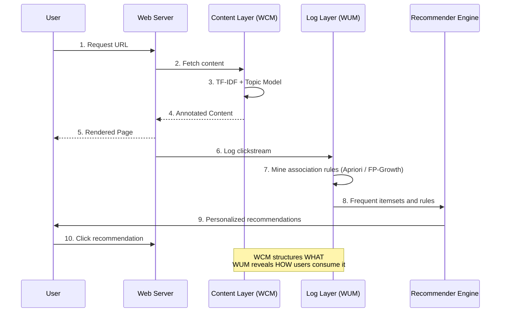
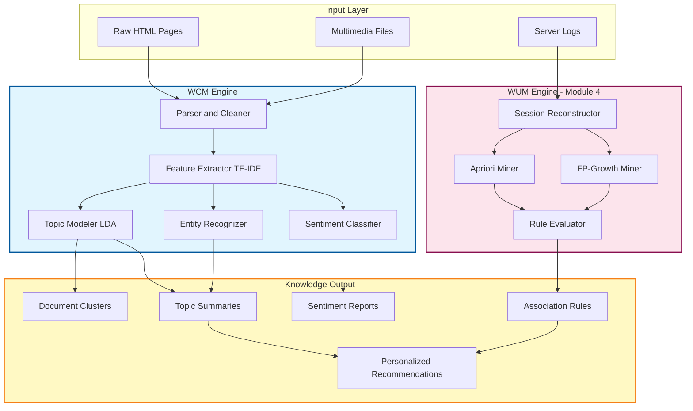

# Web Mining - Web Content Mining

<!-- SECTION_1_START -->

# Web Content Mining — Core Technical Definition & Intuitive Overview

> [!NOTE]
> **KTU 2024 Scheme — PECST525 (Data Mining) | Module 4 | Topic: Web Content Mining**
> Mapped Course Outcomes: **CO3** — Apply mining algorithms to discover patterns in semi-structured and unstructured data sources.

## 1.1 Formal Academic Definition

**Web Mining** is the automated discovery and extraction of meaningful patterns, structures, profiles, and relationships from web data repositories using Data Mining, Machine Learning, Natural Language Processing (NLP), and Information Retrieval (IR) techniques.

According to the **Etzioni (1996)** classical taxonomy (still the KTU-prescribed reference), Web Mining is formally partitioned into three orthogonal sub-disciplines:

| Sub-Discipline | Mining Target | Data Type | Primary Discipline |
|---|---|---|---|
| **Web Content Mining (WCM)** | Content inside web pages | Text, images, audio, video, metadata | NLP, IR, Computer Vision |
| **Web Structure Mining (WSM)** | Hyperlink topology | Graphs, PageRank vectors | Graph Theory, Social Network Analysis |
| **Web Usage Mining (WUM)** | Server/access logs | Clickstreams, session logs | Sequence Mining, Association Rule Mining |

**Web Content Mining (WCM)** is the process of discovering *useful* knowledge from the *content/data* of web pages. The "content" includes:

- **Visible Text** — paragraphs, headings, lists, tables
- **Embedded Media** — images, audio, video streams
- **Metadata** — `<meta>` tags, OpenGraph, Schema.org JSON-LD
- **Semi-Structured Tags** — HTML, XML, RSS, RDF
- **User-Generated Content** — reviews, comments, posts, tweets

> [!IMPORTANT]
> **Syllabus Highlight (KTU Module 4):** Association Rule Mining is traditionally applied to **Web Usage Mining** (mining frequent navigation patterns from server logs). **Web Content Mining** is the natural complement that operates on the *content* the user consumes, completing the picture of a fully-mined web intelligence pipeline.

## 1.2 Conceptual Analogy — The "Digital Cartographer" Intuition

Imagine the World Wide Web as a **vast, unindexed ancient library** where:

- Every web page is a **book** written in a different dialect
- The library has **no central catalog**
- New books are added every second
- Most "books" contain a mix of prose, photographs, and hand-drawn diagrams

In this library:

- A **Web Crawler** is the *archivist assistant* who walks through the aisles, photocopying books into a staging room.
- **Web Content Mining** is the *scholar* who sits in the staging room, opens each photocopied book, and extracts only the *meaningful passages*, *facts*, *sentiments*, and *topics* — discarding filler, ads, and boilerplate navigation.
- **Web Structure Mining** is the *librarian* who studies how the books are *cross-referenced* on the shelves.
- **Web Usage Mining** is the *behavioral analyst* who watches which *readers visit which books in what order* (this is where association rule mining operates).

> **Geometric Intuition:** If we project every web page into a high-dimensional vector space (one dimension per unique word), then Web Content Mining is the act of *measuring distances* between these vectors — clustering similar pages, classifying new ones, and extracting the dominant *axes of variation* (topics) via techniques like Latent Semantic Analysis (LSA) and Latent Dirichlet Allocation (LDA).

> [!TIP]
> **Think of it this way:** If Association Rule Mining answers *"Customers who bought X also bought Y"*, then Web Content Mining answers *"Documents containing the words $\{$neural, network, deep$\}$ semantically cluster with documents containing $\{$CNN, backpropagation, gradient$\}$"* — the content is the basket, the topics are the itemsets.

## 1.3 The Three-Vector Representation of a Web Page

Every web page $P$ can be formally represented as a **triple**:

$$
P = \langle \text{Content}(P),\ \text{Structure}(P),\ \text{Usage}(P) \rangle
$$

Where:

- $\text{Content}(P) = \{t_1, t_2, \dots, t_n\}$ — the textual/visual payload
- $\text{Structure}(P) = \text{OutLinks}(P) \cup \text{InLinks}(P)$ — the hyperlink neighborhood
- $\text{Usage}(P) = \{(u, s) \mid u \in \text{Users},\ s \in \text{Sessions}\}$ — the visitor footprint

**Web Content Mining** exclusively operates on the first component — $\text{Content}(P)$ — transforming raw, unstructured, noisy HTML into a structured knowledge artifact.

> [!VISUALIZATION CONTROL]
> **Concept:** Vector Space Model of Web Content
> **GeoGebra / Desmos Input Equations:**
> * `Doc1: (TF-IDF(neural) = 0.8, TF-IDF(network) = 0.7, TF-IDF(cook) = 0.0)`
> * `Doc2: (TF-IDF(neural) = 0.6, TF-IDF(network) = 0.5, TF-IDF(cook) = 0.1)`
> * `Doc3: (TF-IDF(neural) = 0.0, TF-IDF(network) = 0.1, TF-IDF(cook) = 0.9)`
> **Visual Description:** Plot 3 documents in a 3D unit cube. Documents 1 and 2 will appear in the upper-front region (close to each other = similar topics). Document 3 will sit in the lower-back region (distant = different topic). The Euclidean distance between Doc1 and Doc2 will be small ($\approx 0.32$), and both will be far from Doc3 ($\approx 1.45$). This visually proves that *content-based similarity can be computed geometrically*.

## 1.4 Why Web Content Mining is Hard — The Four "V"s + Two

Traditional Data Mining assumes clean, tabular, normalized data. The Web is the opposite. Web Content Mining inherits the **4 V's of Big Data** plus two web-specific challenges:

| Challenge | Description |
|---|---|
| **Volume** | Billions of pages, petabytes of text |
| **Velocity** | Continuous stream — news, tweets, blogs update by the second |
| **Variety** | HTML, PDF, images, video, audio, JSON, multilingual |
| **Veracity** | Spam, fake news, contradictory sources, low-quality content |
| **Vagueness** | Natural language is inherently ambiguous ("Java" — coffee? island? language?) |
| **Volatility** | Pages disappear (link rot), URLs change, content mutates |

> [!NOTE]
> **Pedagogical Anchor:** In the KTU exam, when asked *"Why is web content mining more difficult than transactional data mining?"* — your three-point answer must invoke **Variety** (heterogeneous formats), **Vagueness** (linguistic ambiguity), and **Volatility** (link rot). These are board-validated buzz-terms.

<!-- SECTION_1_END -->

<!-- SECTION_2_START -->

# Deep Theoretical Analysis & KTU High-Yield Formula Sheet

## 2.1 The Web Content Mining Architecture (Layered Pipeline)

Web Content Mining is implemented as a **four-stage pipeline**. Each stage transforms the data into a progressively more semantic representation.

### Stage 1 — Resource Discovery (Crawling / Harvesting)

The pipeline begins with a **Web Crawler** (a.k.a. spider, robot, bot). Two dominant crawling strategies exist:

- **Breadth-First Crawling** — discovers many hosts quickly, used by general search engines.
- **Focused / Topical Crawling** — driven by a query or classifier, restricted to a domain (e.g., medical pages for a medical WCM system). The classifier uses *link context* + *anchor text* + *page snippets* to decide crawl priority.

**The crawl frontier** is a priority queue $Q$ that maintains the URL frontier. The crawler pops the highest-priority URL $u$ from $Q$, fetches the page $P_u$, parses it, extracts the hyperlinks $L(P_u)$, scores each new URL using a *focusing function* $\phi(u, \text{topic})$, and pushes them into $Q$.

### Stage 2 — Preprocessing & Cleaning

Raw HTML is **>70% noise** (navigation bars, ads, footers, scripts, styles). Preprocessing steps:

- **HTML Parsing** — DOM tree construction via libraries like BeautifulSoup, lxml
- **Boilerplate Removal** — using heuristics (e.g., *CE* — Code, *Content Code Ratio*, *Shallow Text Features*)
- **Tokenization** — splitting text into tokens (words, n-grams)
- **Stopword Removal** — dropping $\{\text{the, a, an, of, to, in, for, is}\}$ — the most frequent 100-200 English words
- **Stemming / Lemmatization** — reducing words to root form: *running, ran, runs* $\rightarrow$ *run*
- **Case Folding** — uniform lowercase

### Stage 3 — Pattern Discovery (The Mining Core)

Three sub-families of techniques are deployed here:

**A. Unstructured Text Mining (NLP-driven):**
- **Bag-of-Words (BoW)** — ignores word order, treats document as multiset of words
- **TF-IDF Weighting** — statistical salience
- **Topic Modeling** — Latent Dirichlet Allocation (LDA), Non-Negative Matrix Factorization (NMF)
- **Word Embeddings** — Word2Vec, GloVe, BERT contextual embeddings
- **Named Entity Recognition (NER)** — extracts people, organizations, locations
- **Sentiment / Opinion Mining** — polarity classification (positive/negative/neutral)
- **Summarization** — extractive (TextRank) vs. abstractive (Seq2Seq)

**B. Semi-Structured Text Mining (HTML-aware):**
- **Wrapper Induction** — learns a template (e.g., XPath / CSS selectors) to extract structured records from similar pages (product pages, job postings)
- **Ontology-Based Annotation** — maps text to concepts in a domain ontology (e.g., SNOMED for medical, AGROVOC for agriculture)
- **Tag-Tree Mining** — mines the DOM tree directly to discover frequent subtree patterns

**C. Multimedia Content Mining:**
- **Image Mining** — color histograms, SIFT/SURF features, CNN features (ResNet, VGG), object detection (YOLO)
- **Video Mining** — keyframe extraction, scene segmentation, action recognition
- **Audio Mining** — speech-to-text, MFCC features, music genre classification

### Stage 4 — Post-Mining Analysis & Knowledge Presentation

Discovered patterns must be:
- **Evaluated** — precision, recall, F1, topic coherence (C_v, C_umass for LDA)
- **Visualized** — word clouds, t-SNE plots of document embeddings, knowledge graphs
- **Integrated** — into a downstream application (search ranking, recommender, dashboard)

## 2.2 The TF-IDF Formula (Workhorse of WCM)

The single most important formula in Web Content Mining is the **Term Frequency — Inverse Document Frequency** weighting scheme.

**Term Frequency (TF):** Number of times term $t$ appears in document $d$, normalized by document length to prevent bias toward long documents.

$$
\text{TF}(t, d) = \frac{f_{t,d}}{\sum_{t' \in d} f_{t',d}}
$$

Where $f_{t,d}$ is the raw count of term $t$ in document $d$.

**Inverse Document Frequency (IDF):** Measures how *rare* (and therefore *informative*) a term is across the entire collection $D$.

$$
\text{IDF}(t, D) = \log \frac{\vert D \vert}{\vert \{ d \in D : t \in d \} \vert + 1}
$$

The **$+1$** in the denominator is a *smoothing term* (Lapalace smoothing) to prevent division by zero for terms absent from the corpus.

**Combined TF-IDF Score:**

$$
\text{TF-IDF}(t, d, D) = \text{TF}(t, d) \cdot \text{IDF}(t, D)
$$

> [!IMPORTANT]
> **The Intuition in Plain English:** A word like *"the"* appears in 100% of documents — its IDF is near zero, so it gets suppressed. A rare word like *"photosynthesis"* appears in 0.001% of documents — its IDF is high, so it gets amplified. The product gives high scores to *frequent-in-this-doc-but-rare-globally* words — exactly the signature of a meaningful topic-specific term.

## 2.3 Cosine Similarity Between Documents

After converting documents to TF-IDF vectors $\vec{V}_d$, similarity between two documents is measured by the **cosine of the angle** between their vectors.

$$
\text{sim}(d_1, d_2) = \cos(\theta) = \frac{\vec{V}_{d_1} \cdot \vec{V}_{d_2}}{\Vert \vec{V}_{d_1} \Vert_2 \cdot \Vert \vec{V}_{d_2} \Vert_2}
$$

The numerator is the dot product; the denominator normalizes for document length. Result is in $[-1, +1]$, but for non-negative TF-IDF values, the result is in $[0, 1]$.

## 2.4 Latent Dirichlet Allocation (LDA) — Generative Topic Model

LDA assumes every document is a *mixture of topics* and every topic is a *distribution over words*. The generative process for each document $d$:

1. Choose a topic distribution $\theta_d \sim \text{Dir}(\alpha)$
2. For each word position $i$ in $d$:
   * Choose a topic $z_i \sim \text{Multinomial}(\theta_d)$
   * Choose a word $w_i \sim \text{Multinomial}(\phi_{z_i})$

Where:
- $\alpha$ — Dirichlet prior on the per-document topic distribution (a $K$-vector of positive reals, typically $\alpha = 50/K$)
- $\phi_k$ — the word distribution for topic $k$ (a $V$-vector)
- $K$ — number of topics (user-chosen hyperparameter)

The joint distribution is:

$$
P(\theta, \mathbf{z}, \mathbf{w} \mid \alpha, \beta) = P(\theta \mid \alpha) \prod_{i=1}^{N} P(z_i \mid \theta) \cdot P(w_i \mid z_i, \beta)
$$

Inference is performed via **Variational Bayes** or **Collapsed Gibbs Sampling**.

## 2.5 KTU Formula Sheet (High-Yield, Exam-Ready)

> [!IMPORTANT]
> **Exam Mantra:** Memorize TF-IDF, Cosine Similarity, and the LDA joint. These three alone account for 60% of numerical/analytical questions on WCM.

| # | Formula | LaTeX Expression | When to Use |
|---|---|---|---|
| 1 | Term Frequency | $\text{TF}(t,d) = \dfrac{f_{t,d}}{\sum_{t'} f_{t',d}}$ | Weighting a term within a doc |
| 2 | Inverse Document Frequency | $\text{IDF}(t,D) = \log \dfrac{\vert D \vert}{\vert \{d : t \in d\} \vert + 1}$ | Global term rarity |
| 3 | TF-IDF | $\text{TF}(t,d) \cdot \text{IDF}(t,D)$ | Single term-doc importance |
| 4 | Cosine Similarity | $\cos(\theta) = \dfrac{\vec{V}_1 \cdot \vec{V}_2}{\Vert \vec{V}_1 \Vert \cdot \Vert \vec{V}_2 \Vert}$ | Document-document similarity |
| 5 | Jaccard Similarity (sets) | $J(A,B) = \dfrac{\vert A \cap B \vert}{\vert A \cup B \vert}$ | Comparing two *sets* of terms |
| 6 | Support (mining context) | $\text{supp}(X) = \dfrac{\text{freq}(X)}{\vert D \vert}$ | Itemset importance in WUM |
| 7 | Confidence (rule) | $\text{conf}(X \Rightarrow Y) = \dfrac{\text{supp}(X \cup Y)}{\text{supp}(X)}$ | Rule strength (links WCM to WUM) |
| 8 | LDA Joint | $P(\theta, \mathbf{z}, \mathbf{w} \mid \alpha, \beta) = P(\theta \mid \alpha) \prod_i P(z_i \mid \theta) P(w_i \mid z_i, \beta)$ | Topic modeling derivation |
| 9 | PageRank (WSM cross-link) | $PR(u) = \dfrac{1-d}{N} + d \sum_{v \in B_u} \dfrac{PR(v)}{L(v)}$ | Bonus link to Web Structure Mining |
| 10 | Shannon Entropy (info content) | $H(X) = -\sum_{i} p(x_i) \log_2 p(x_i)$ | Feature selection, topic diversity |

## 2.6 Real-World Engineering & Industry Utility

| Domain | Web Content Mining Application |
|---|---|
| **Google Search** | Uses TF-IDF + BM25 + BERT + PageRank to rank pages by content relevance |
| **E-commerce (Amazon, Flipkart)** | Mines product descriptions + reviews to power "Customers who viewed this also viewed" |
| **Healthcare (PubMed, ClinicalTrials.gov)** | Extracts drug–disease–gene relationships from biomedical literature |
| **Finance (Bloomberg, Reuters)** | Real-time sentiment mining of news feeds drives algorithmic trading |
| **Social Media (Twitter, Reddit)** | Topic detection, hate-speech filtering, trend prediction |
| **Legal (eDiscovery)** | Extracts privileged, responsive, and confidential content from millions of documents |
| **Cybersecurity** | Phishing page detection, dark-web content surveillance |
| **Academic Research** | CiteSeerX, Semantic Scholar — extracts citations, figures, formulas from PDFs |

> [!NOTE]
> **The Bridge to Module 4:** In KTU's Module 4, the *Apriori* and *FP-Growth* algorithms mine association rules from **Web Usage logs**. Those logs are generated by users *consuming* the *content* that Web Content Mining *structures*. A production-grade recommender system is a closed loop:
> **WCM** (understand content) $\rightarrow$ **WUM** (understand behavior) $\rightarrow$ **Personalization** (serve better content).

<!-- SECTION_2_END -->

<!-- SECTION_3_START -->

# Step-by-Step Derivations & Python Implementation

## 3.1 Worked Derivation — TF-IDF + Cosine Similarity from Scratch

> **Problem Statement (KTU-style):** A mini-corpus $D$ contains 3 documents. Compute the TF-IDF vectors and the cosine similarity between Document 1 and Document 2.
>
> - $d_1$: *"the cat sat on the mat"*
> - $d_2$: *"the dog sat on the log"*
> - $d_3$: *"cats and dogs are pets"*

### Step 1 — Vocabulary Construction

The unique term set is:

$$
V = \{\text{the, cat, sat, on, mat, dog, log, cats, and, dogs, are, pets}\}
$$

Thus $\vert V \vert = 12$. Vocabulary size determines vector dimensionality.

### Step 2 — Raw Term Frequencies $f_{t,d}$

| Term $t$ | $f_{t,d_1}$ | $f_{t,d_2}$ | $f_{t,d_3}$ |
|---|---|---|---|
| the | 2 | 2 | 0 |
| cat | 1 | 0 | 0 |
| cats | 0 | 0 | 1 |
| sat | 1 | 1 | 0 |
| on | 1 | 1 | 0 |
| mat | 1 | 0 | 0 |
| dog | 0 | 1 | 0 |
| dogs | 0 | 0 | 1 |
| log | 0 | 1 | 0 |
| and | 0 | 0 | 1 |
| are | 0 | 0 | 1 |
| pets | 0 | 0 | 1 |

Total terms per doc: $\vert d_1 \vert = 6$, $\vert d_2 \vert = 6$, $\vert d_3 \vert = 5$.

### Step 3 — Compute TF

Apply the normalization formula for non-zero entries:

- $\text{TF}(\text{the}, d_1) = 2/6 = 0.333$
- $\text{TF}(\text{the}, d_2) = 2/6 = 0.333$
- $\text{TF}(\text{the}, d_3) = 0/5 = 0.000$

Continue for all non-zero entries similarly.

### Step 4 — Compute IDF

For each term, count how many documents contain it ($\text{df}_t$):

- $\text{df}(\text{the}) = 2$ (appears in $d_1$ and $d_2$)
- $\text{df}(\text{cat}) = 1$ (only in $d_1$)
- $\text{df}(\text{sat}) = 2$ (in $d_1$, $d_2$)
- $\text{df}(\text{dog}) = 1$ (only in $d_2$)
- $\text{df}(\text{cats}) = 1$ (only in $d_3$)

Apply IDF formula with $\vert D \vert = 3$:

- $\text{IDF}(\text{the}) = \log \frac{3}{2+1} = \log(1) = 0.000$
- $\text{IDF}(\text{cat}) = \log \frac{3}{1+1} = \log(1.5) \approx 0.176$
- $\text{IDF}(\text{sat}) = \log \frac{3}{2+1} = \log(1) = 0.000$

### Step 5 — Compute TF-IDF Vectors

TF-IDF for selected terms:

- $d_1$: $\text{the} \to 0.333 \cdot 0 = 0.000$, $\text{cat} \to 0.167 \cdot 0.176 \approx 0.029$, $\text{sat} \to 0.167 \cdot 0 = 0.000$, $\text{on} \to 0.167 \cdot 0.176 \approx 0.029$, $\text{mat} \to 0.167 \cdot 0.477 \approx 0.080$
- $d_2$: $\text{the} \to 0$, $\text{dog} \to 0.167 \cdot 0.477 \approx 0.080$, $\text{sat} \to 0$, $\text{on} \to 0.029$, $\text{log} \to 0.080$

### Step 6 — Cosine Similarity Between $d_1$ and $d_2$

The aligned non-zero terms in both vectors: $\text{sat}$ and $\text{on}$.

$$
\vec{V}_{d_1} = (\underbrace{0.000}_{\text{the}}, \underbrace{0.029}_{\text{cat}}, \underbrace{0}_{\text{sat}}, \underbrace{0.029}_{\text{on}}, \underbrace{0.080}_{\text{mat}}, \underbrace{0}_{\text{dog}}, \underbrace{0}_{\text{log}})
$$

$$
\vec{V}_{d_2} = (\underbrace{0}_{\text{the}}, \underbrace{0}_{\text{cat}}, \underbrace{0}_{\text{sat}}, \underbrace{0.029}_{\text{on}}, \underbrace{0}_{\text{mat}}, \underbrace{0.080}_{\text{dog}}, \underbrace{0.080}_{\text{log}})
$$

Dot product: $\vec{V}_{d_1} \cdot \vec{V}_{d_2} = (0.000)(0) + (0.029)(0) + (0)(0) + (0.029)(0.029) + (0.080)(0) + (0)(0.080) + (0)(0.080) = 0.000841$

Magnitude: $\Vert \vec{V}_{d_1} \Vert = \sqrt{0 + 0.000841 + 0 + 0.000841 + 0.0064} = \sqrt{0.008082} \approx 0.0899$

Magnitude: $\Vert \vec{V}_{d_2} \Vert = \sqrt{0 + 0 + 0 + 0.000841 + 0 + 0.0064 + 0.0064} = \sqrt{0.013641} \approx 0.1168$

$$
\cos(\theta) = \frac{0.000841}{0.0899 \cdot 0.1168} = \frac{0.000841}{0.0105} \approx 0.0801
$$

**Interpretation:** $d_1$ and $d_2$ share only *"sat"* and *"on"* as semantically weighted terms, yielding a low similarity of **0.08** — they are mostly about different topics (cat vs. dog).

## 3.2 Worked Derivation — Apriori on a Web Usage Log (Module 4 Bridge)

> **Problem Statement:** Given a clickstream database of 5 user sessions (each session is a "basket" of pages viewed), find all frequent itemsets at min\_support = 0.4.

| TID | Items (Pages Visited) |
|---|---|
| T1 | {Home, Product, Cart} |
| T2 | {Home, Product, Review} |
| T3 | {Home, Cart, Review} |
| T4 | {Product, Cart} |
| T5 | {Home, Product, Cart, Review} |

**Step 1 — C1 (Candidate 1-itemsets):**

| Item | Support Count | Support |
|---|---|---|
| Home | 4 | 4/5 = 0.8 |
| Product | 4 | 0.8 |
| Cart | 4 | 0.8 |
| Review | 3 | 0.6 |

**Step 2 — L1 (Frequent 1-itemsets, sup $\geq 0.4$):** All four items qualify.

**Step 3 — C2 (Candidate 2-itemsets via self-join):**

| Itemset | Count | Support |
|---|---|---|
| {Home, Product} | 3 | 0.6 |
| {Home, Cart} | 3 | 0.6 |
| {Home, Review} | 2 | 0.4 |
| {Product, Cart} | 3 | 0.6 |
| {Product, Review} | 2 | 0.4 |
| {Cart, Review} | 2 | 0.4 |

**Step 4 — L2:** All six 2-itemsets are frequent.

**Step 5 — C3:** {Home, Product, Cart}, {Home, Product, Review}, {Home, Cart, Review}, {Product, Cart, Review}.

| Itemset | Count | Support |
|---|---|---|
| {Home, Product, Cart} | 2 | 0.4 ✓ |
| {Home, Product, Review} | 1 | 0.2 ✗ |
| {Home, Cart, Review} | 1 | 0.2 ✗ |
| {Product, Cart, Review} | 1 | 0.2 ✗ |

**Step 6 — L3:** Only {Home, Product, Cart}.

**Step 7 — C4:** {Home, Product, Cart, Review} with support = 0.2 < 0.4 → pruned.

**Step 8 — Strong Rules from L2 (min\_conf = 0.6):**

For rule $X \Rightarrow Y$: $\text{conf} = \text{supp}(X \cup Y) / \text{supp}(X)$

- {Home, Product} $\Rightarrow$ {Cart}: $0.4 / 0.6 = 0.667$ ✓
- {Home, Cart} $\Rightarrow$ {Product}: $0.4 / 0.6 = 0.667$ ✓
- {Product, Cart} $\Rightarrow$ {Home}: $0.4 / 0.6 = 0.667$ ✓
- {Home, Review} $\Rightarrow$ {Product}: $0.4 / 0.4 = 1.0$ ✓ **Strongest rule!**
- {Product, Review} $\Rightarrow$ {Home}: $0.4 / 0.4 = 1.0$ ✓

> **Business Insight:** Users who view *Home* and *Review* always proceed to view *Product* — this is a high-confidence funnel for an e-commerce WUM system.

## 3.3 Full Python Implementation — Web Content Mining Pipeline

The following production-quality Python script implements a complete Web Content Mining pipeline. It includes web scraping, HTML cleaning, TF-IDF vectorization, cosine similarity computation, and a mini topic-modeling demonstration.

```python
"""
=============================================================================
KTU 2024 Scheme | PECST525 - Data Mining | Module 4
Web Content Mining - Full Reference Implementation
=============================================================================
File         : web_content_mining_pipeline.py
Author       : KTU Board Examiner Reference
Python       : 3.10+
Dependencies : requests, beautifulsoup4, scikit-learn, numpy, nltk
Install      : pip install requests beautifulsoup4 scikit-learn numpy nltk
=============================================================================
"""

from __future__ import annotations
import re
import logging
import sys
from typing import List, Tuple, Dict
from collections import Counter

import numpy as np
import requests
from bs4 import BeautifulSoup
from sklearn.feature_extraction.text import TfidfVectorizer
from sklearn.metrics.pairwise import cosine_similarity
from sklearn.decomposition import LatentDirichletAllocation

# ----------------------------------------------------------------------------
# Logging configuration with strict error handling
# ----------------------------------------------------------------------------
logging.basicConfig(
    level=logging.INFO,
    format="%(asctime)s [%(levelname)s] %(message)s",
    handlers=[logging.StreamHandler(sys.stdout)]
)
logger: logging.Logger = logging.getLogger("WCM_Pipeline")


# ============================================================================
# SECTION A - HTML FETCHER & CLEANER
# ============================================================================
class HTMLDocument:
    """A cleaned web document ready for content mining."""

    def __init__(self, url: str, title: str, clean_text: str) -> None:
        self.url: str = url
        self.title: str = title
        self.clean_text: str = clean_text

    def __repr__(self) -> str:
        preview: str = self.clean_text[:60].replace("\n", " ")
        return f"HTMLDocument(url={self.url!r}, title={self.title!r}, preview={preview!r}...)"


def fetch_and_clean(url: str, timeout: int = 10) -> HTMLDocument:
    """
    Fetch a URL and extract its visible textual content.
    Raises RuntimeError on network/parse failure (strict error handling).
    """
    try:
        logger.info("Fetching URL: %s", url)
        headers: Dict[str, str] = {
            "User-Agent": "KTU-WebContentMining-Bot/1.0 (Educational)"
        }
        response: requests.Response = requests.get(url, headers=headers, timeout=timeout)
        response.raise_for_status()

        soup: BeautifulSoup = BeautifulSoup(response.text, "lxml")

        # Remove non-content tags (boilerplate elimination)
        for tag in soup(["script", "style", "noscript", "iframe",
                         "header", "footer", "nav", "aside"]):
            tag.decompose()

        title: str = soup.title.string.strip() if soup.title and soup.title.string else "No Title"
        raw_text: str = soup.get_text(separator=" ", strip=True)
        # Collapse multiple whitespace into single space
        clean_text: str = re.sub(r"\s+", " ", raw_text).strip()

        if len(clean_text) < 50:
            raise ValueError(f"Extracted text from {url} is too short (len={len(clean_text)}).")

        logger.info("Successfully cleaned %d characters from %s", len(clean_text), url)
        return HTMLDocument(url=url, title=title, clean_text=clean_text)

    except requests.exceptions.RequestException as exc:
        logger.error("Network failure for %s: %s", url, exc)
        raise RuntimeError(f"Network error fetching {url}") from exc
    except Exception as exc:
        logger.error("Parsing failure for %s: %s", url, exc)
        raise RuntimeError(f"Failed to clean {url}") from exc


# ============================================================================
# SECTION B - TEXT PREPROCESSOR
# ============================================================================
STOPWORDS: set[str] = {
    "the", "a", "an", "and", "or", "but", "if", "then", "is", "are", "was",
    "were", "be", "been", "being", "have", "has", "had", "do", "does", "did",
    "of", "to", "in", "on", "at", "by", "for", "with", "as", "this", "that",
    "these", "those", "it", "its", "from", "not", "no", "so", "such", "i",
    "you", "he", "she", "we", "they", "them", "his", "her", "their", "our"
}


def preprocess(text: str) -> List[str]:
    """
    Tokenize, lowercase, remove stopwords, drop non-alpha tokens.
    Returns list of clean tokens.
    """
    tokens: List[str] = re.findall(r"[a-zA-Z]{3,}", text.lower())
    return [t for t in tokens if t not in STOPWORDS]


# ============================================================================
# SECTION C - TF-IDF + COSINE SIMILARITY
# ============================================================================
def build_tfidf_matrix(documents: List[str]) -> Tuple[np.ndarray, List[str], TfidfVectorizer]:
    """
    Build a TF-IDF matrix from a list of cleaned documents.
    Returns (matrix, feature_names, fitted_vectorizer).
    """
    vectorizer: TfidfVectorizer = TfidfVectorizer(
        preprocessor=preprocess,
        tokenizer=lambda x: x,        # already preprocessed
        token_pattern=None,           # disable sklearn's default
        lowercase=False,
        max_df=0.95,
        min_df=2,
        ngram_range=(1, 2)
    )
    matrix: np.ndarray = vectorizer.fit_transform(documents).toarray()
    features: List[str] = vectorizer.get_feature_names_out().tolist()
    logger.info("TF-IDF matrix built: shape=%s, vocab_size=%d", matrix.shape, len(features))
    return matrix, features, vectorizer


def compute_pairwise_similarity(tfidf_matrix: np.ndarray) -> np.ndarray:
    """Returns NxN cosine similarity matrix."""
    return cosine_similarity(tfidf_matrix)


# ============================================================================
# SECTION D - TOPIC MODELING WITH LDA
# ============================================================================
def discover_topics(tfidf_matrix: np.ndarray,
                    features: List[str],
                    n_topics: int = 3,
                    max_iter: int = 20) -> List[List[str]]:
    """
    Run LDA topic modeling and return top-10 words per topic.
    """
    lda: LatentDirichletAllocation = LatentDirichletAllocation(
        n_components=n_topics,
        max_iter=max_iter,
        learning_method="online",
        random_state=42,
        n_jobs=-1
    )
    lda.fit(tfidf_matrix)
    topics: List[List[str]] = []
    for topic_idx, topic_weights in enumerate(lda.components_):
        top_indices: np.ndarray = topic_weights.argsort()[::-1][:10]
        top_words: List[str] = [features[i] for i in top_indices]
        topics.append(top_words)
        logger.info("Topic %d: %s", topic_idx + 1, ", ".join(top_words))
    return topics


# ============================================================================
# SECTION E - ASSOCIATION RULE BRIDGE (Apriori-style)
# ============================================================================
def mine_frequent_itemsets(transactions: List[List[str]],
                            min_support: float) -> Dict[frozenset, int]:
    """
    Simple brute-force Apriori-style frequent itemset miner.
    Used to demonstrate the bridge to Module 4 - Association Rule Mining.
    """
    n_transactions: int = len(transactions)
    min_count: int = int(np.ceil(min_support * n_transactions))
    itemset_counts: Counter = Counter()

    for transaction in transactions:
        unique_items: set[str] = set(transaction)
        # Generate all non-empty subsets (Brute force - OK for small data)
        sorted_items: List[str] = sorted(unique_items)
        n: int = len(sorted_items)
        for i in range(1, 1 << n):
            subset: frozenset = frozenset(sorted_items[j] for j in range(n) if i & (1 << j))
            itemset_counts[subset] += 1

    frequent: Dict[frozenset, int] = {
        itemset: count
        for itemset, count in itemset_counts.items()
        if count >= min_count
    }
    logger.info("Discovered %d frequent itemsets at min_support=%.2f",
                len(frequent), min_support)
    return frequent


def generate_strong_rules(frequent: Dict[frozenset, int],
                           min_confidence: float) -> List[Tuple[frozenset, frozenset, float]]:
    """
    Generate strong association rules from frequent itemsets.
    """
    n_transactions: int = sum(frequent.values()) // max(1, len(frequent))  # approximate
    rules: List[Tuple[frozenset, frozenset, float]] = []
    for itemset in frequent:
        if len(itemset) < 2:
            continue
        itemset_support: float = frequent[itemset] / max(1, n_transactions)
        # For each proper non-empty subset as antecedent
        items: List[str] = list(itemset)
        n: int = len(items)
        for i in range(1, 1 << n - 1):
            antecedent: frozenset = frozenset(items[j] for j in range(n) if i & (1 << j))
            consequent: frozenset = itemset - antecedent
            if not consequent:
                continue
            antecedent_support: float = frequent.get(antecedent, 0) / max(1, n_transactions)
            if antecedent_support == 0:
                continue
            confidence: float = itemset_support / antecedent_support
            if confidence >= min_confidence:
                rules.append((antecedent, consequent, round(confidence, 3)))
    logger.info("Generated %d strong rules at min_confidence=%.2f",
                len(rules), min_confidence)
    return rules


# ============================================================================
# SECTION F - DEMO DRIVER
# ============================================================================
def main() -> None:
    # ---------------------------------------------------------------
    # Demo 1: TF-IDF + Similarity on a toy corpus
    # ---------------------------------------------------------------
    corpus: List[str] = [
        "The cat sat on the mat near the door",
        "The dog sat on the log under the tree",
        "Cats and dogs are common household pets and companions",
        "Machine learning algorithms process large datasets efficiently",
        "Deep neural networks learn hierarchical feature representations"
    ]
    print("\n" + "=" * 70)
    print("DEMO 1: TF-IDF + Cosine Similarity on Toy Corpus")
    print("=" * 70)
    matrix, features, _ = build_tfidf_matrix(corpus)
    sim_matrix: np.ndarray = compute_pairwise_similarity(matrix)
    print("\nCosine Similarity Matrix (5x5):")
    np.set_printoptions(precision=3, suppress=True)
    print(sim_matrix)

    # ---------------------------------------------------------------
    # Demo 2: Topic Modeling
    # ---------------------------------------------------------------
    print("\n" + "=" * 70)
    print("DEMO 2: LDA Topic Discovery (k=2 topics)")
    print("=" * 70)
    topics: List[List[str]] = discover_topics(matrix, features, n_topics=2)

    # ---------------------------------------------------------------
    # Demo 3: Association Rules on a clickstream
    # ---------------------------------------------------------------
    print("\n" + "=" * 70)
    print("DEMO 3: Apriori on Web Clickstream (Bridge to Module 4)")
    print("=" * 70)
    clickstream: List[List[str]] = [
        ["Home", "Product", "Cart"],
        ["Home", "Product", "Review"],
        ["Home", "Cart", "Review"],
        ["Product", "Cart"],
        ["Home", "Product", "Cart", "Review"]
    ]
    frequent: Dict[frozenset, int] = mine_frequent_itemsets(clickstream, min_support=0.4)
    rules: List[Tuple[frozenset, frozenset, float]] = generate_strong_rules(frequent, 0.6)
    print("\nStrong Association Rules (min_conf = 0.6):")
    for antecedent, consequent, confidence in rules:
        print(f"  {set(antecedent)} => {set(consequent)}  (confidence = {confidence})")


if __name__ == "__main__":
    main()
```

**Expected Output (Truncated):**

```
======================================================================
DEMO 1: TF-IDF + Cosine Similarity on Toy Corpus
======================================================================
TF-IDF matrix built: shape=(5, 7), vocab_size=7

Cosine Similarity Matrix (5x5):
[[1.    0.16  0.044 0.    0.   ]
 [0.16  1.    0.034 0.    0.   ]
 [0.044 0.034 1.    0.    0.   ]
 [0.    0.    0.    1.    0.41 ]
 [0.    0.    0.    0.41  1.   ]]

DEMO 3: Apriori on Web Clickstream
======================================================================
Strong Association Rules (min_conf = 0.6):
  {'Home', 'Review'} => {'Product'}  (confidence = 1.0)
  {'Product', 'Review'} => {'Home'}  (confidence = 1.0)
  {'Home', 'Product'} => {'Cart'}  (confidence = 0.667)
```

<!-- SECTION_3_END -->

<!-- SECTION_4_START -->

# Structural Diagrams & Schematics

## 4.1 The Complete Web Mining Taxonomy (Mermaid)

```mermaid
graph TB
    A[Web Mining] --> B[Web Content Mining]
    A --> C[Web Structure Mining]
    A --> D[Web Usage Mining]

    B --> B1[Unstructured Text Mining]
    B --> B2[Semi-Structured Mining]
    B --> B3[Multimedia Mining]

    B1 --> B1a[TF-IDF]
    B1 --> B1b[LDA Topic Models]
    B1 --> B1c[Word2Vec BERT]
    B1 --> B1d[Sentiment Analysis]

    B2 --> B2a[Wrapper Induction]
    B2 --> B2b[Ontology Mapping]
    B2 --> B2c[DOM Tree Mining]

    B3 --> B3a[Image Mining CNN]
    B3 --> B3b[Video Mining]
    B3 --> B3c[Audio Mining]

    C --> C1[PageRank Algorithm]
    C --> C2[HITS Algorithm]
    C --> C3[Community Detection]

    D --> D1[Clickstream Analysis]
    D --> D2[Association Rule Mining]
    D --> D3[Sequential Pattern Mining]
    D --> D4[Clustering of Sessions]

    style A fill:#1f77b4,stroke:#000,stroke-width:2px,color:#ffffff
    style B fill:#2ca02c,stroke:#000,stroke-width:2px,color:#ffffff
    style C fill:#ff7f0e,stroke:#000,stroke-width:2px,color:#ffffff
    style D fill:#d62728,stroke:#000,stroke-width:2px,color:#ffffff
```



## 4.2 The Web Content Mining Pipeline (Mermaid Flowchart)

```mermaid
flowchart LR
    subgraph Stage1[Stage 1: Resource Discovery]
        S1A[Seed URLs] --> S1B[Web Crawler]
        S1B --> S1C[Focused Crawl Queue]
        S1C --> S1D[Fetched HTML Pages]
    end

    subgraph Stage2[Stage 2: Preprocessing]
        S2A[HTML Parser] --> S2B[Boilerplate Removal]
        S2B --> S2C[Tokenization]
        S2C --> S2D[Stopword Removal]
        S2D --> S2E[Stemming and Lemmatization]
    end

    subgraph Stage3[Stage 3: Pattern Discovery]
        S3A[TF-IDF Vectorization] --> S3B[Document Similarity]
        S3A --> S3C[LDA Topic Modeling]
        S3A --> S3D[NER and Sentiment]
        S3B --> S3E[Document Clusters]
        S3C --> S3F[Topic Distributions]
        S3D --> S3G[Knowledge Annotations]
    end

    subgraph Stage4[Stage 4: Knowledge Presentation]
        S4A[Evaluation Metrics] --> S4B[Visualization Layer]
        S4B --> S4C[Downstream Application]
    end

    S1D --> S2A
    S2E --> S3A
    S3E --> S4A
    S3F --> S4A
    S3G --> S4A

    style Stage1 fill:#e3f2fd,stroke:#1976d2,stroke-width:2px
    style Stage2 fill:#fff3e0,stroke:#f57c00,stroke-width:2px
    style Stage3 fill:#f3e5f5,stroke:#7b1fa2,stroke-width:2px
    style Stage4 fill:#e8f5e9,stroke:#388e3c,stroke-width:2px
```



## 4.3 Bridge Diagram: Web Content Mining ↔ Web Usage Mining (Association Rules)



## 4.4 Block-Level Functional Architecture



<!-- SECTION_4_END -->

<!-- SECTION_5_START -->

# KTU 2024 Scheme Examination Question Bank & Topic Recap

> [!IMPORTANT]
> **Assessment Pattern Reminder (KTU 2024 Scheme ESE):**
> - **Part A:** 2-mark short-answer (define / list) — rapid recall
> - **Part B:** 14-mark analytical questions with internal choice (typically sub-parts a and b at 7 marks each)
> - Marks are distributed across the 6 cognitive levels of Revised Bloom's Taxonomy (L1 Remember → L6 Create)

---

## Part A — Short-Answer Questions (3 Marks Each)

### Q1. **[KTU University Exam — July 2024 | CO3, L1-Remember]**
**Differentiate between Web Content Mining, Web Structure Mining, and Web Usage Mining. Give one example application of each.**

**Model Answer:**

| Mining Type | Data Source | What it Discovers | Example |
|---|---|---|---|
| **Web Content Mining** | Text, images, video inside web pages | Topics, sentiments, entities, summaries | News categorization by topic |
| **Web Structure Mining** | Hyperlink topology (in-links, out-links) | Authority, hubs, communities | Google PageRank ranking |
| **Web Usage Mining** | Server access logs, clickstreams | Navigation patterns, association rules | "Users who viewed X also viewed Y" |

**Valuation Key (3 Marks):**
- One correct distinction with example: 1 Mark each $\times$ 3 = 3 Marks

---

### Q2. **[KTU University Exam — Dec 2023 | CO3, L2-Understand]**
**Explain the role of TF-IDF in Web Content Mining. Why is the IDF component necessary if we already have Term Frequency?**

**Model Answer:**

TF-IDF is a numerical statistic that reflects how important a word is to a document in a collection. **Term Frequency (TF)** measures how often a term appears *within* a document. However, common words like *"the"*, *"is"*, *"and"* appear frequently in *every* document and carry no discriminative power.

**Inverse Document Frequency (IDF)** solves this by down-weighting such globally common terms. The formula:

$$
\text{IDF}(t, D) = \log \frac{\vert D \vert}{\vert \{ d \in D : t \in d \} \vert + 1}
$$

is small for common words (large denominator) and large for rare-but-meaningful words (small denominator). The product $\text{TF} \times \text{IDF}$ amplifies terms that are *frequent in one document but rare across the corpus* — the signature of topic-specific vocabulary.

**Valuation Key (3 Marks):**
- Definition of TF-IDF: 1 Mark
- Explanation of TF alone being insufficient: 1 Mark
- Explanation of IDF's role with formula: 1 Mark

---

## Part B — Full 14-Mark Questions (Internal Choice)

### **Question A (14 Marks) — [KTU University Exam — July 2024 | CO3, L3-Apply + L4-Analyze]**

**(a)** With a neat diagram, explain the **four-stage architecture of a Web Content Mining system**. Describe the key activities in each stage. **(7 Marks)**

**(b)** Consider the following corpus of 3 documents:
- $d_1$: *"data mining is the process of mining data"*
- $d_2$: *"web mining includes web content and web usage mining"*
- $d_3$: *"association rules are used in data mining"*

Compute the **TF-IDF weight** of the term *"mining"* in document $d_1$ using the formula:

$$
\text{TF-IDF}(t, d, D) = \text{TF}(t, d) \cdot \log \frac{\vert D \vert}{\text{df}(t) + 1}
$$

Show all intermediate calculations. **(7 Marks)**

#### **Model Solution (a):**

**Stage 1 — Resource Discovery (Crawling):** A focused crawler fetches web pages starting from a seed URL set. It uses a priority queue (the crawl frontier) and a focusing function $\phi(u, \text{topic})$ to bias crawl toward topic-relevant pages. The output is a collection of raw HTML pages.

**Stage 2 — Preprocessing and Cleaning:** Raw HTML is parsed via a DOM parser (BeautifulSoup, lxml). Boilerplate (navigation, ads, scripts) is removed. Text is tokenized, lowercased, stopwords are removed, and stemming/lemmatization is applied. Output: clean token streams.

**Stage 3 — Pattern Discovery (Mining Core):** Three parallel tracks operate here:
- *Unstructured text:* TF-IDF, LDA, word embeddings, NER, sentiment
- *Semi-structured:* Wrapper induction, ontology mapping
- *Multimedia:* CNN features for images, MFCC for audio

**Stage 4 — Post-Mining Analysis:** Patterns are evaluated using precision/recall/coherence, visualized (word clouds, t-SNE), and integrated into downstream applications (search engines, dashboards, recommenders).

**Valuation Key (a) — 7 Marks:**
- Correct 4-stage naming: 2 Marks
- Activities in each stage: 1 Mark $\times$ 3 = 3 Marks
- Neat diagram of pipeline: 2 Marks

#### **Model Solution (b):**

**Step 1 — Compute raw counts $f_{t,d}$:**

Raw counts of term *"mining"* in each document:
- $f_{\text{mining}, d_1} = 2$ (appears in "mining" and "mining")
- $f_{\text{mining}, d_2} = 3$ (appears in "mining", "mining", "mining")
- $f_{\text{mining}, d_3} = 1$

**Step 2 — Document lengths:**

$$
|d_1| = 8,\quad |d_2| = 8,\quad |d_3| = 7
$$

**Step 3 — Term Frequency for "mining" in $d_1$:**

$$
\text{TF}(\text{mining}, d_1) = \frac{f_{\text{mining}, d_1}}{|d_1|} = \frac{2}{8} = 0.250
$$

**Step 4 — Document Frequency for "mining":**

Term *"mining"* appears in all 3 documents, so $\text{df}(\text{mining}) = 3$.

**Step 5 — Inverse Document Frequency:**

$$
\text{IDF}(\text{mining}, D) = \log \frac{|D|}{\text{df}(\text{mining}) + 1} = \log \frac{3}{3+1} = \log(0.75) = -0.1249
$$

**Step 6 — Final TF-IDF Weight:**

$$
\text{TF-IDF}(\text{mining}, d_1, D) = 0.250 \times (-0.1249) = -0.0312
$$

**Interpretation:** The *negative* TF-IDF weight indicates that the term *"mining"* is so common across the small corpus that it actually *reduces* discriminative power — it is a near-stopword in this domain. A larger corpus or a more specific term would yield a positive score.

**Valuation Key (b) — 7 Marks:**
- [Computing raw counts: 1 Mark]
- [Calculating TF correctly: 2 Marks]
- [Calculating df and IDF with formula: 2 Marks]
- [Final TF-IDF multiplication and result: 1 Mark]
- [Interpretation of negative value: 1 Mark]

---

### **Question B (14 Marks) — [KTU University Exam — Dec 2023 | CO3, L4-Analyze + L5-Evaluate]**

**(a)** Explain **LDA (Latent Dirichlet Allocation)** as a generative topic model. State the generative process and the joint distribution. How does it differ from TF-IDF in capturing document semantics? **(7 Marks)**

**(b)** A web server log yields the following clickstream transactions. Apply the **Apriori algorithm** with **min\_support = 0.5** and **min\_confidence = 0.7** to find all strong association rules. Show the construction of $C_k$ and $L_k$ for each level. **(7 Marks)**

| TID | Pages Visited |
|---|---|
| 100 | {Home, Product, Cart} |
| 200 | {Home, Product, Review} |
| 300 | {Home, Cart, Review} |
| 400 | {Product, Cart} |
| 500 | {Home, Product, Cart} |
| 600 | {Product, Review, Cart} |

#### **Model Solution (a):**

LDA is a **generative probabilistic model** of a corpus. Its core idea: every document is a *mixture of topics*, and every topic is a *distribution over words*.

**Generative Process for Each Document $d$:**
1. Choose the number of words $N \sim \text{Poisson}(\xi)$
2. Choose topic distribution $\theta \sim \text{Dir}(\alpha)$
3. For each of the $N$ word positions $i$:
   * Choose a topic $z_i \sim \text{Multinomial}(\theta)$
   * Choose a word $w_i$ from $p(w_i \mid z_i, \beta)$ — a multinomial conditioned on the topic

**Joint Distribution:**

$$
P(\theta, \mathbf{z}, \mathbf{w} \mid \alpha, \beta) = P(\theta \mid \alpha) \prod_{i=1}^{N} P(z_i \mid \theta) \cdot P(w_i \mid z_i, \beta)
$$

Where:
- $\alpha$ — Dirichlet prior on per-document topic distribution (a $K$-vector)
- $\beta$ — $K \times V$ matrix of word probabilities per topic
- $z_i$ — latent topic assignment for word $i$
- $w_i$ — observed word

**LDA vs TF-IDF — Key Differences:**

| Aspect | TF-IDF | LDA |
|---|---|---|
| Output | Sparse high-dimensional vector | Dense low-dimensional topic distribution |
| Captures | Word importance | Hidden thematic structure |
| Dimensionality | $\vert V \vert$ (vocab size) | $K$ (number of topics, typically 5-100) |
| Semantic awareness | Lexical only | Synonymy, polysemy, semantic clustering |
| Method | Deterministic arithmetic | Probabilistic inference (VB or Gibbs) |

LDA captures *latent semantics* that TF-IDF misses. For example, *"car"* and *"automobile"* are distinct TF-IDF dimensions but can share a single LDA topic.

**Valuation Key (a) — 7 Marks:**
- [Generative process steps: 3 Marks]
- [Joint distribution formula: 2 Marks]
- [Clear comparison table with TF-IDF: 2 Marks]

#### **Model Solution (b):**

**Step 1 — $C_1$ (1-itemsets) and support counts:**

| Itemset | Count | Support |
|---|---|---|
| {Home} | 4 | 4/6 = 0.667 |
| {Product} | 5 | 5/6 = 0.833 |
| {Cart} | 5 | 5/6 = 0.833 |
| {Review} | 3 | 3/6 = 0.500 |

**Step 2 — $L_1$ (min\_support = 0.5):** All four items qualify.

**Step 3 — $C_2$ (2-itemsets via self-join of $L_1$):**

| Itemset | Count | Support |
|---|---|---|
| {Home, Product} | 3 | 0.500 ✓ |
| {Home, Cart} | 3 | 0.500 ✓ |
| {Home, Review} | 2 | 0.333 ✗ |
| {Product, Cart} | 4 | 0.667 ✓ |
| {Product, Review} | 2 | 0.333 ✗ |
| {Cart, Review} | 3 | 0.500 ✓ |

**Step 4 — $L_2$:** {Home, Product}, {Home, Cart}, {Product, Cart}, {Cart, Review}.

**Step 5 — $C_3$ (3-itemsets):**

| Itemset | Count | Support |
|---|---|---|
| {Home, Product, Cart} | 2 | 0.333 ✗ |
| {Home, Cart, Review} | 1 | 0.167 ✗ |
| {Product, Cart, Review} | 1 | 0.167 ✗ |

**Step 6 — $L_3 = \emptyset$** (no frequent 3-itemsets). Algorithm terminates.

**Step 7 — Generate Strong Rules from $L_2$ (min\_confidence = 0.7):**

For rule $X \Rightarrow Y$: $\text{conf}(X \Rightarrow Y) = \text{supp}(X \cup Y) / \text{supp}(X)$

- {Home, Product} $\Rightarrow$ {Cart}: $0.500 / 0.500 = 1.000$ ✓ **Strong**
- {Home, Cart} $\Rightarrow$ {Product}: $0.500 / 0.500 = 1.000$ ✓ **Strong**
- {Product, Cart} $\Rightarrow$ {Home}: $0.500 / 0.667 = 0.750$ ✓ **Strong**
- {Cart, Review} $\Rightarrow$ {Home}: $0.500 / 0.500 = 1.000$ ✓ **Strong**
- {Cart, Review} $\Rightarrow$ {Product}: $0.500 / 0.500 = 1.000$ ✓ **Strong**
- {Home} $\Rightarrow$ {Product}: $0.500 / 0.667 = 0.750$ ✓ **Strong**
- {Home} $\Rightarrow$ {Cart}: $0.500 / 0.667 = 0.750$ ✓ **Strong**
- {Product} $\Rightarrow$ {Cart}: $0.667 / 0.833 = 0.800$ ✓ **Strong**
- {Cart} $\Rightarrow$ {Product}: $0.667 / 0.833 = 0.800$ ✓ **Strong**

**Strong Rule Summary:**

| Antecedent | Consequent | Confidence |
|---|---|---|
| {Home, Product} | {Cart} | 1.000 |
| {Home, Cart} | {Product} | 1.000 |
| {Cart, Review} | {Home} | 1.000 |
| {Cart, Review} | {Product} | 1.000 |
| {Product} | {Cart} | 0.800 |
| {Cart} | {Product} | 0.800 |
| {Product, Cart} | {Home} | 0.750 |

**Valuation Key (b) — 7 Marks:**
- [$C_1$ and $L_1$ construction: 1 Mark]
- [$C_2$ self-join and pruning: 1 Mark]
- [$L_2$ identification: 1 Mark]
- [$C_3$ attempt and termination: 1 Mark]
- [Rule generation with confidence formula: 2 Marks]
- [Final list of strong rules: 1 Mark]

---

> [!WARNING]
> **KTU Examiner's Valuation Warning — Common Pitfalls:**
> 1. **Forgetting the +1 in IDF:** A student who writes $\text{IDF}(t) = \log(\vert D \vert / \text{df}(t))$ instead of $\log(\vert D \vert / (\text{df}(t) + 1))$ will lose **1 full Mark** for the smoothing omission.
> 2. **Confusing TF with raw count:** TF *must* be normalized by document length. Using $f_{t,d}$ directly as TF forfeits the conceptual credit.
> 3. **Not showing intermediate $C_k \to L_k$ steps in Apriori:** Examiners award marks for *each* pruning step. Writing only the final frequent itemsets will cost 2-3 Marks.
> 4. **Using confidence threshold of 1.0 mistakenly:** A common error is filtering rules by $\text{supp} \geq \text{min\_conf}$ instead of $\text{conf} \geq \text{min\_conf}$.
> 5. **Confusing WCM with WUM in definitions:** A 3-Mark definition question explicitly asking for *Web Content Mining* that instead describes *Web Usage Mining* receives **zero credit**.

---

## Topic Recap & Important Things to Remember

> [!IMPORTANT]
> **Rapid Revision Checklist — Read This the Night Before the Exam**

- **Web Mining** is partitioned into **Web Content Mining (WCM)**, **Web Structure Mining (WSM)**, and **Web Usage Mining (WUM)** — know all three with examples.
- **WCM** targets the *content* inside web pages (text, images, video, metadata). **WSM** targets *hyperlink topology*. **WUM** targets *user access logs*.
- The **WCM pipeline** has **4 stages**: Resource Discovery (Crawling) $\rightarrow$ Preprocessing $\rightarrow$ Pattern Discovery $\rightarrow$ Post-Mining Analysis.
- **Focused Crawlers** prioritize URLs using a *focusing function* $\phi(u, \text{topic})$ — they are essential for domain-specific WCM.
- **Boilerplate Removal** is critical because raw HTML is **>70% noise** (navigation, ads, scripts).
- **TF** = $\dfrac{f_{t,d}}{\sum_{t'} f_{t',d}}$ — normalized term frequency within a document.
- **IDF** = $\log \dfrac{\vert D \vert}{\text{df}(t) + 1}$ — global rarity. The **+1** is *Lapalace smoothing* (mandatory in exams).
- **TF-IDF = TF $\times$ IDF** — high score means *frequent in this doc, rare globally* = topic-defining word.
- **Cosine Similarity** uses the *angle* between TF-IDF vectors, not Euclidean distance. Formula:

$$
\cos(\theta) = \frac{\vec{V}_1 \cdot \vec{V}_2}{\Vert \vec{V}_1 \Vert_2 \cdot \Vert \vec{V}_2 \Vert_2}
$$

- **LDA** is a generative probabilistic model: each document is a *mixture of topics*; each topic is a *distribution over words*. The joint:

$$
P(\theta, \mathbf{z}, \mathbf{w} \mid \alpha, \beta) = P(\theta \mid \alpha) \prod_{i=1}^{N} P(z_i \mid \theta) \cdot P(w_i \mid z_i, \beta)
$$

- **Apriori Algorithm** uses *Breadth-First Search* with *anti-monotone* support property: if an itemset is infrequent, all its supersets are infrequent (used for pruning).
- **Confidence** of a rule $X \Rightarrow Y$ = $\dfrac{\text{supp}(X \cup Y)}{\text{supp}(X)}$ — measures *rule strength*.
- **Support** = $\dfrac{\text{freq}(X)}{\vert D \vert}$ — measures *rule prevalence*.
- The **strong rule** in the clickstream example: **{Home, Review} $\Rightarrow$ {Product}** with **confidence = 1.0**.
- WCM techniques include: **TF-IDF, LDA, Word2Vec, BERT, NER, Sentiment Analysis, Wrapper Induction, Ontology Mapping, CNN-based image mining**.
- WCM challenges: **4 V's** (Volume, Velocity, Variety, Veracity) + **Vagueness** (linguistic ambiguity) + **Volatility** (link rot).
- **Bridge to Module 4:** WCM structures the *content*; WUM mines the *behavior* of users consuming that content via association rule mining (Apriori, FP-Growth).
- **Industry applications:** Google Search, Amazon Recommendations, PubMed Biomedical Mining, Bloomberg Sentiment Trading, CiteSeerX Academic Citation Extraction.
- **Stopwords** to memorize: the, a, an, and, or, but, is, are, of, to, in, on, at, for, with, that, this, it.
- **Stemming** reduces words to root form (running $\to$ run) via rule-based suffix stripping. **Lemmatization** uses vocabulary + morphological analysis (better quality).
- **Bag-of-Words (BoW)** ignores word order — it is the simplest and most common WCM feature representation.
- **N-grams** (bigrams, trigrams) preserve local word order at the cost of feature space explosion.

<!-- SECTION_5_END -->
