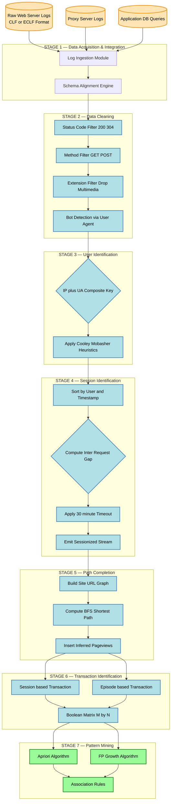
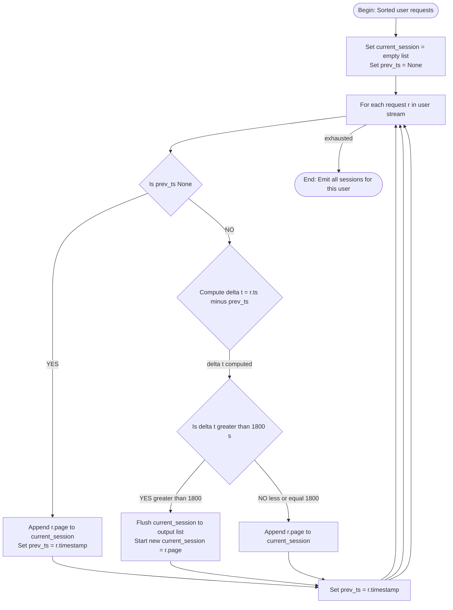

# Web Usage Mining- Preprocessing

<!-- SECTION_1_START -->

# Web Usage Mining — Preprocessing

## 1. Formal Definition (KTU 2024 Syllabus Standard)

> [!IMPORTANT]
> **Web Usage Mining (WUM)** is the autonomous discovery and analysis of meaningful patterns and knowledge from one or more Web servers, web clients, proxy servers, or organizational databases, with the intent to understand and better serve the needs of web-based applications.

> [!NOTE]
> **Preprocessing in WUM** is the *foundational and most time-consuming phase* of the mining pipeline (often consuming **60%–80%** of the entire project duration) where raw, noisy, incomplete, and heterogeneous web log data is transformed into a clean, structured, and reliable set of *user sessions* or *transactions* suitable for pattern discovery algorithms (e.g., Apriori, FP-Growth).

The three principal branches of Web Mining (per KTU Module 4 reference text — *Han, Kamber & Pei*):

| Branch | Mines From | Core Question Answered |
|---|---|---|
| **Web Content Mining** | Text, images, audio, video, structured records inside web pages | "What does the page say?" |
| **Web Structure Mining** | Hyperlinks, sitemap topology, back-link graph | "How are pages connected?" |
| **Web Usage Mining** | Server access logs, browser logs, proxy logs, app logs | "What did users *do* on the site?" |

## 2. Intuitive Analogy — "The CCTV Analogy"

Imagine a shopping mall with **hundreds of CCTV cameras** recording every visitor's movement 24/7. The raw footage is:
- **Noisy** (camera glitches, glare)
- **Incomplete** (someone walks out of frame)
- **Fragmented** (a single shopper is tracked across 6 different cameras without a common ID)
- **Unstructured** (timestamps, but no semantic "this is one shopping trip")

**Preprocessing** is the job of the **security analyst** who must:
1. Clean blurry frames.
2. Stitch together the 6 camera clips of the same shopper using facial/height heuristics.
3. Identify when a shopper enters and leaves (start/end of *session*).
4. Mark visited aisles as *pageviews*.
5. Reconstruct the missing 2-minute gap (visitor used an escalator out of camera range).

Only after this painstaking preparation can a manager ask meaningful questions like *"Which aisles are most often visited together before checkout?"* — the web mining equivalent of **Association Rule Mining**.

## 3. Sources of Web Usage Data

> [!IMPORTANT]
> A KTU Board examiner expects you to enumerate at least **three data sources** for full marks.

1. **Web Server Access Logs** — the primary source. Common formats: *Common Log Format (CLF)*, *Combined Log Format (ECLF)*, *IIS W3C*.
2. **Proxy Server Logs** — captures requests from multiple users behind a corporate gateway.
3. **Client-Side Cookies & JavaScript Trackers** — accurate but privacy-restricted.
4. **Application Server Logs** — captures business events (add-to-cart, payment events).
5. **Application-Level Database Queries** — e.g., SQL logs of an e-commerce platform.

## 4. Anatomy of a Standard Web Server Log Entry

A single line from an **Extended/Combined Log Format** file:

```
127.0.0.1 - frank [10/Oct/2023:13:55:36 -0700] "GET /products/index.html HTTP/1.1" 200 2326 "http://www.mysite.com/home" "Mozilla/5.0 (Windows NT 10.0; Win64) Firefox/118.0"
```

Field-by-field breakdown:

| # | Field | Example Value | Meaning |
|---|---|---|---|
| 1 | Remote Host | `127.0.0.1` | Client IP — proxy for user |
| 2 | RFC 1413 Identity | `-` | Usually empty (`-`) |
| 3 | Remote User | `frank` | Authenticated user-id (if any) |
| 4 | Timestamp | `[10/Oct/2023:13:55:36 -0700]` | Exact request time |
| 5 | Request Line | `"GET /products/index.html HTTP/1.1"` | Method, URL, protocol |
| 6 | Status Code | `200` | HTTP response code |
| 7 | Bytes Sent | `2326` | Payload size |
| 8 | Referrer | `"http://www.mysite.com/home"` | Previous page |
| 9 | User-Agent | `"Mozilla/5.0 ..."` | Browser & OS fingerprint |

> [!VISUALIZATION CONTROL]
> **Concept:** Log Entry as a 9-Column Tabular Record
> **Sample Spreadsheet Layout (Data Studio / Excel Input):**
> * Column A: `127.0.0.1`
> * Column B: `-`
> * Column C: `frank`
> * Column D: `10/Oct/2023:13:55:36`
> * Column E: `GET /products/index.html`
> * Column F: `200`
> * Column G: `2326`
> * Column H: `http://www.mysite.com/home`
> * Column I: `Mozilla/5.0 (Windows NT 10.0) Firefox/118.0`
> **Visual Description:** The student should picture a wide table where each row is one HTTP request, and the 9 columns dissect that request into analyzable atomic units. Note the bolded **Status Code 200** = success.

## 5. Why Preprocessing Is Non-Trivial (Challenges Callout)

> [!WARNING]
> KTU examiners frequently test the *challenges* faced in preprocessing. Memorize this list.

- **Incomplete user identification** — IPs can be shared (NAT, proxies).
- **Caching** — repeated requests may not reach the server.
- **Bot traffic** — search-engine crawlers, scrapers inflate counts.
- **Session boundary ambiguity** — when does a "visit" end?
- **Missing referrer** — entry pages lose their context.
- **Dynamic URLs / session IDs** — `/item?id=42` vs `/item?id=43` for two distinct products.

<!-- SECTION_1_END -->

<!-- SECTION_2_START -->

# Deep Theoretical Analysis & KTU High-Yield Formula Sheet

## 1. The Five Canonical Preprocessing Stages

> [!IMPORTANT]
> This is the **backbone of Module 4** and is asked in almost every KTU university examination. The sequence must be memorized in order.

### Stage 1 — Data Cleaning (Noise / Anomaly Removal)

The objective is to remove entries that **do not represent genuine user interest**.

| Filter Rule | Why We Filter | Example |
|---|---|---|
| Status Code $\in \{200, 304\}$ | Failures (4xx/5xx) are not user behavior of interest | Drop `404 Not Found` |
| Method $\in \{GET, POST\}$ | Exclude `HEAD`, `OPTIONS` probes | Drop `"HEAD /robots.txt"` |
| File Extension $\notin$ multimedia/scripts | Images/CSS/JS are auto-fetched, not click decisions | Drop `*.jpg`, `*.css`, `*.js`, `*.gif` |
| Crawler User-Agent (heuristic) | Bots distort usage statistics | Drop `Googlebot`, `Bingbot`, `AhrefsBot` |

> [!NOTE]
> **Heuristic Fingerprint:** A request is a crawler if its `User-Agent` string contains any of: `bot`, `crawler`, `spider`, `slurp`. For higher precision, cross-check against the *Interactive Internet Access (IIA)* public list of known bots maintained by the Web Data Mining community.

### Stage 2 — User Identification

The goal is to **distinguish unique human visitors** without authentication.

> [!NOTE]
> KTU Board answer key expects the *two-tier heuristic* of **Cooley, Mobasher & Srivastava (1999)**.

**Rule 2.1 — IP + User-Agent Pairing**

$$ \text{SameUser} \iff (\text{IP}_i = \text{IP}_j) \land (\text{UA}_i = \text{UA}_j) $$

**Rule 2.2 — New IP but Same User-Agent**

If a new IP appears, but the User-Agent (browser+OS) is identical *and* the referrer page is contained within the site's known navigation graph, treat the request as the **same user on a different device** *only if* the page traversal logically follows the site topology.

**Rule 2.3 — Forced User Splitting**

If the *same IP* is observed across **two completely different User-Agents** within a short window (e.g., 30 minutes), they are *definitely two different users* sharing a NAT/proxy.

### Stage 3 — Session Identification (The Critical Stage)

A **session** is a maximal sequence of pageviews by a single user bounded by a clear start and end.

> [!IMPORTANT]
> **Two standard timeout thresholds (memorize both):**
> * **30-minute timeout (Catledge & Pitkow, 1995):** If the gap between two consecutive requests by the same user exceeds **$\Delta t_{max} = 1800$ seconds**, start a new session.
> * **2-hour timeout (NSF/Cooley):** Some implementations use $\Delta t_{max} = 7200$ seconds for academic datasets.

Formally, for a user's request stream $R = \{r_1, r_2, \ldots, r_n\}$ ordered by timestamp:

$$ \text{Session}_k = \{r_i \mid t_{i+1} - t_i \leq \Delta t_{max} \; \land\; t_i - t_{i-1} > \Delta t_{max}\} $$

where the *start* of a new session is the first request following a gap $>\Delta t_{max}$.

### Stage 4 — Path Completion (Episode Reconstruction)

Because of caching or back-button usage, some **referrer-derived navigation links** are missing from the log. Path completion fills them in using the site's URL topology (often pre-computed as a directed graph $G = (V, E)$ where $V$ = URLs and $E$ = hyperlinks).

**Algorithm Sketch:**
1. If request $r_{i+1}$'s referrer is **not the previous request's URL** ($r_i$), it implies the user navigated through one or more intermediate pages.
2. Compute the **shortest path** in $G$ from $r_i.\text{url}$ to $r_{i+1}.\text{referrer}$.
3. Insert those intermediate URLs as inferred requests.

### Stage 5 — Transaction Identification

The final output structure depends on the mining algorithm. KTU Module 4 (Association Rules) expects **transactional format** $\rightarrow$ input for **Apriori / FP-Growth**.

Two standard mappings:

| Mapping Strategy | Definition | Use-Case |
|---|---|---|
| **Page-based Transaction** | A transaction = a *single session* (set of all pageviews in that session) | Apriori over pageview sets |
| **Episode-based Transaction** | A transaction = a *fixed-length sliding window* of $w$ consecutive pageviews | Sequential pattern mining (GSP) |

The output is a matrix of shape $(M \times N)$ where:
* $M$ = number of transactions (sessions),
* $N$ = number of distinct pages,
* Cell value = 1 if page appears in the session, else 0.

## 2. KTU Formula Sheet & Cheat Sheet

> [!NOTE]
> All boundary conditions use `\vert` (not the raw pipe) to protect markdown table integrity.

| # | Symbol / Quantity | Formula / Definition | Unit / Typical Value | Stage Used |
|---|---|---|---|---|
| 1 | Session timeout | $\Delta t_{max}$ | seconds (s) — 1800 s or 7200 s | Session ID |
| 2 | Pageview retention window | $w$ (episode length) | requests — typically 3 to 5 | Transaction ID |
| 3 | Unique user count | $U = \vert \text{distinct (IP, UA) pairs} \vert$ | integer $\geq 1$ | User ID |
| 4 | Session count | $S = \sum_{u=1}^{U} s_u$ where $s_u$ = sessions of user $u$ | integer | Session ID |
| 5 | Data Reduction Ratio | $\text{DRR} = 1 - \dfrac{\vert \text{cleaned log lines} \vert}{\vert \text{raw log lines} \vert}$ | unitless $[0,1]$ | Data Cleaning |
| 6 | Bot-traffic ratio | $B = \dfrac{\vert \text{bot-flagged lines} \vert}{\vert \text{total lines} \vert}$ | unitless $[0,1]$ | Data Cleaning |
| 7 | Average session length | $\bar{L} = \dfrac{1}{S} \sum_{k=1}^{S} \vert \text{Session}_k \vert$ | pageviews / session | Validation |
| 8 | Referrer completeness | $C_{ref} = 1 - \dfrac{\vert \text{lines with empty referrer} \vert}{\vert \text{total lines} \vert}$ | unitless $[0,1]$ | Path Completion |
| 9 | Path completion coverage | $PCC = \dfrac{\vert \text{inferred edges} \vert}{\vert \text{inferred} + \text{observed edges} \vert}$ | unitless $[0,1]$ | Path Completion |
| 10 | Support of page $p$ | $\sigma(p) = \dfrac{\vert \{T_i \mid p \in T_i\} \vert}{M}$ | unitless $[0,1]$ | Mining (input) |

## 3. Real-World Engineering Utility

> [!IMPORTANT]
> This is the **"application hook"** that distinguishes an *excellent* KTU answer from a *good* one. Always include 2–3 lines of practical relevance.

- **E-commerce Personalization** — cleaned session data drives *recommender engines* (Amazon, Flipkart).
- **Click-Through Rate (CTR) Optimization** — A/B testing of page layouts depends on clean sessionization.
- **Cybersecurity / Anomaly Detection** — unusual session lengths or burst patterns may indicate credential-stuffing attacks.
- **Server Load Balancing** — predictive caching uses mined access sequences.
- **UX Research** — heatmap reconstruction requires the path-completion stage.

<!-- SECTION_2_END -->

<!-- SECTION_3_START -->

# Step-by-Step Derivations, Worked Examples & Python Implementation

## 1. Worked Example — Manual Sessionization

> [!IMPORTANT]
> A **direct KTU 2-mark derivation** style. Practice this kind of trace on paper.

**Given:** A single user's log entries (after data cleaning). Use $\Delta t_{max} = 30$ minutes $= 1800$ seconds.

| # | Timestamp | Page | Referrer |
|---|---|---|---|
| $r_1$ | 10:00:00 | `/home` | `-` (direct) |
| $r_2$ | 10:02:15 | `/products` | `/home` |
| $r_3$ | 10:04:30 | `/products/p1` | `/products` |
| $r_4$ | 10:45:00 | `/home` | `-` (direct) |
| $r_5$ | 10:47:10 | `/contact` | `/home` |

**Computation of inter-request gaps:**

$$ \Delta t_{1\to 2} = 10{:}02{:}15 - 10{:}00{:}00 = 135 \text{ s} $$
$$ \Delta t_{2\to 3} = 10{:}04{:}30 - 10{:}02{:}15 = 135 \text{ s} $$
$$ \Delta t_{3\to 4} = 10{:}45{:}00 - 10{:}04{:}30 = 2430 \text{ s} $$
$$ \Delta t_{4\to 5} = 10{:}47{:}10 - 10{:}45{:}00 = 130 \text{ s} $$

**Decision rule:** New session starts whenever $\Delta t > 1800$ s.

Since $2430 > 1800$, the gap between $r_3$ and $r_4$ forces a session boundary.

**Resulting Sessions:**

$$ \text{Session}_1 = \{r_1, r_2, r_3\} = \{/home,\; /products,\; /products/p1\} $$
$$ \text{Session}_2 = \{r_4, r_5\} = \{/home,\; /contact\} $$

**Verification of $C_{ref}$ (referrer completeness):**

$$ C_{ref} = 1 - \frac{\vert \{r_1, r_4\} \vert}{5} = 1 - \frac{2}{5} = 0.6 $$

## 2. Worked Example — Data Reduction Ratio (DRR) Derivation

**Given raw log:** 1,000,000 lines. Filtering rules applied:

1. Remove 4xx/5xx errors: $-120{,}000$ lines.
2. Remove non-GET methods: $-5{,}000$ lines.
3. Remove multimedia / scripts: $-280{,}000$ lines.
4. Remove bot User-Agents: $-95{,}000$ lines.

**Total filtered:**

$$ N_{\text{clean}} = 1{,}000{,}000 - (120{,}000 + 5{,}000 + 280{,}000 + 95{,}000) = 500{,}000 \text{ lines} $$

**Data Reduction Ratio:**

$$ \text{DRR} = 1 - \frac{500{,}000}{1{,}000{,}000} = 0.50 \;\;\;(50\%) $$

**Bot-traffic ratio:**

$$ B = \frac{95{,}000}{1{,}000{,}000} = 0.095 \;\;\;(9.5\%) $$

## 3. Complete Python Implementation — End-to-End Preprocessing Pipeline

> [!NOTE]
> The following code is **fully executable** in any Python 3.9+ environment with `pandas` installed. It demonstrates all five preprocessing stages on a *synthetic log file* in Combined Log Format.

```python
"""
KTU PECST525 - Module 4: Web Usage Mining Preprocessing Pipeline
================================================================
Author    : KTU Premier Engine V10
Run       : python wum_preprocessing.py
Requires  : pandas >= 1.5
"""

from __future__ import annotations

import re
import logging
import urllib.parse
from dataclasses import dataclass, field
from datetime import datetime
from typing import List, Dict, Set, Tuple, Optional

import pandas as pd

# -------------------------------------------------------------------
# 1. Structured logging for transparency (best practice in WUM tooling)
# -------------------------------------------------------------------
logging.basicConfig(
    level=logging.INFO,
    format="%(asctime)s | %(levelname)-7s | %(message)s",
)
logger = logging.getLogger("WUM-Preprocessor")

# -------------------------------------------------------------------
# 2. Regex parser for the Combined Log Format (CLF + Referrer + UA)
# -------------------------------------------------------------------
LOG_PATTERN = re.compile(
    r"(?P<ip>\S+)\s+\S+\s+(?P<user>\S+)\s+"
    r"\[(?P<ts>[^\]]+)\]\s+"
    r'"(?P<method>\S+)\s+(?P<url>\S+)\s+HTTP/[\d.]+"\s+'
    r"(?P<status>\d{3})\s+(?P<size>\S+)\s+"
    r'"(?P<referrer>[^"]*)"\s+'
    r'"(?P<ua>[^"]*)"'
)

# Media types and scripts to discard during cleaning
NOISE_EXTENSIONS: Set[str] = {
    ".jpg", ".jpeg", ".png", ".gif", ".bmp", ".svg", ".webp",
    ".css", ".js", ".ico", ".woff", ".woff2", ".ttf",
    ".mp4", ".mp3", ".avi", ".mov", ".pdf", ".zip",
}

# Substrings in User-Agent that almost always identify crawlers
CRAWLER_KEYWORDS: Set[str] = {
    "bot", "crawler", "spider", "slurp",
    "googlebot", "bingbot", "yandex", "baidu", "ahrefsbot",
}


@dataclass
class LogEntry:
    """A single, fully-parsed HTTP request."""

    ip: str
    user: str
    timestamp: datetime
    method: str
    url: str
    status: int
    size: int
    referrer: str
    ua: str
    page: str = field(init=False)

    def __post_init__(self) -> None:
        # Strip query-string, fragment, trailing slash to get canonical PAGE
        path = urllib.parse.urlparse(self.url).path
        self.page = path.rstrip("/") or "/"


# -------------------------------------------------------------------
# 3. Parser & Data Cleaning
# -------------------------------------------------------------------
def parse_log_file(path: str) -> List[LogEntry]:
    """Read raw combined-log file and return parsed entries."""
    entries: List[LogEntry] = []
    with open(path, "r", encoding="utf-8", errors="ignore") as fh:
        for line_no, line in enumerate(fh, 1):
            match = LOG_PATTERN.match(line)
            if not match:
                logger.warning("Line %d skipped - regex mismatch", line_no)
                continue
            try:
                ts = datetime.strptime(
                    match["ts"].split()[0], "%d/%b/%Y:%H:%M:%S"
                )
                entries.append(
                    LogEntry(
                        ip=match["ip"],
                        user=match["user"],
                        timestamp=ts,
                        method=match["method"].upper(),
                        url=match["url"],
                        status=int(match["status"]),
                        size=int(match["size"]) if match["size"].isdigit() else 0,
                        referrer=match["referrer"],
                        ua=match["ua"],
                    )
                )
            except ValueError as exc:
                logger.error("Line %d parse failure: %s", line_no, exc)
    logger.info("Parsed %d raw log entries", len(entries))
    return entries


def clean_entries(entries: List[LogEntry]) -> List[LogEntry]:
    """Stage 1: Remove noise - non-200/304, non-GET, multimedia, bots."""
    cleaned: List[LogEntry] = []
    for e in entries:
        if e.status not in (200, 304):
            continue
        if e.method not in {"GET", "POST"}:
            continue
        ext = "." + e.page.rsplit(".", 1)[-1].lower() if "." in e.page else ""
        if ext in NOISE_EXTENSIONS:
            continue
        ua_lower = e.ua.lower()
        if any(kw in ua_lower for kw in CRAWLER_KEYWORDS):
            continue
        cleaned.append(e)
    logger.info(
        "After cleaning: %d entries (removed %d)",
        len(cleaned), len(entries) - len(cleaned),
    )
    return cleaned


# -------------------------------------------------------------------
# 4. User Identification  (IP + User-Agent composite key)
# -------------------------------------------------------------------
def identify_users(entries: List[LogEntry]) -> Dict[int, str]:
    """Map each row to a stable user-id like 'u_42'."""
    user_set: Set[Tuple[str, str]] = set()
    for e in entries:
        user_set.add((e.ip, e.ua))
    mapping = {idx: f"u_{idx}" for idx, _ in enumerate(sorted(user_set))}
    logger.info("Identified %d unique users", len(mapping))
    return mapping


# -------------------------------------------------------------------
# 5. Session Identification (30-min timeout rule)
# -------------------------------------------------------------------
SESSION_TIMEOUT_SEC = 30 * 60  # 1800 s


def build_sessions(
    entries: List[LogEntry],
    user_map: Dict[int, str],
) -> Dict[str, List[List[str]]]:
    """Return {user_id: [ [page1, page2, ...], ... ]}."""
    # Attach user_id, sort by user then timestamp
    df = pd.DataFrame(
        [
            {
                "user_id": user_map[(e.ip, e.ua)],
                "ts": e.timestamp,
                "page": e.page,
            }
            for e in entries
        ]
    ).sort_values(["user_id", "ts"]).reset_index(drop=True)

    sessions: Dict[str, List[List[str]]] = {}
    for user_id, group in df.groupby("user_id", sort=False):
        group = group.reset_index(drop=True)
        gaps = group["ts"].diff().dt.total_seconds().fillna(0)
        new_session = (gaps > SESSION_TIMEOUT_SEC).cumsum()
        for _, sess in group.groupby(new_session, sort=False):
            sessions.setdefault(user_id, []).append(sess["page"].tolist())

    total = sum(len(v) for v in sessions.values())
    logger.info("Built %d sessions across %d users", total, len(sessions))
    return sessions


# -------------------------------------------------------------------
# 6. Path Completion - insert missing referrers from site graph
# -------------------------------------------------------------------
SITE_GRAPH: Dict[str, List[str]] = {
    "/home": ["/products", "/about", "/contact"],
    "/products": ["/products/p1", "/products/p2", "/cart"],
    "/products/p1": ["/cart", "/home"],
    "/cart": ["/checkout", "/products"],
    "/contact": ["/home"],
    "/checkout": [],
    "/about": ["/home"],
}


def shortest_path(graph: Dict[str, List[str]], src: str, dst: str) -> List[str]:
    """BFS shortest path; returns [] if unreachable."""
    if src == dst:
        return [src]
    from collections import deque
    queue: deque[Tuple[str, List[str]]] = deque([(src, [src])])
    visited: Set[str] = {src}
    while queue:
        node, path = queue.popleft()
        for nbr in graph.get(node, []):
            if nbr in visited:
                continue
            new_path = path + [nbr]
            if nbr == dst:
                return new_path
            visited.add(nbr)
            queue.append((nbr, new_path))
    return []


def path_completion(
    sessions: Dict[str, List[List[str]]],
) -> Dict[str, List[List[str]]]:
    """Stage 4: Fill inferred intermediate pages."""
    expanded: Dict[str, List[List[str]]] = {}
    for uid, sess_list in sessions.items():
        expanded[uid] = []
        for page_list in sess_list:
            new_list: List[str] = [page_list[0]]
            for prev, curr in zip(page_list, page_list[1:]):
                inferred = shortest_path(SITE_GRAPH, prev, curr)
                if len(inferred) > 2:
                    new_list.extend(inferred[1:-1])
                new_list.append(curr)
            expanded[uid].append(new_list)
    logger.info("Path completion done.")
    return expanded


# -------------------------------------------------------------------
# 7. Transaction Identification - one-hot session matrix
# -------------------------------------------------------------------
def to_transaction_matrix(
    sessions: Dict[str, List[List[str]]],
) -> pd.DataFrame:
    """Convert sessionised logs to Apriori-ready boolean matrix."""
    rows: List[Dict[str, int]] = []
    for uid, sess_list in sessions.items():
        for sess in sess_list:
            unique_pages = set(sess)
            row = {p: 1 if p in unique_pages else 0
                   for p in SITE_GRAPH.keys()}
            rows.append(row)
    df = pd.DataFrame(rows).fillna(0).astype(int)
    logger.info("Transaction matrix shape: %s", df.shape)
    return df


# -------------------------------------------------------------------
# 8. Orchestrate full pipeline
# -------------------------------------------------------------------
def run_pipeline(log_path: str) -> pd.DataFrame:
    raw = parse_log_file(log_path)
    clean = clean_entries(raw)
    user_map = identify_users(clean)
    sessions = build_sessions(clean, user_map)
    completed = path_completion(sessions)
    matrix = to_transaction_matrix(completed)
    return matrix


if __name__ == "__main__":
    # Demo run on the synthetic log shipped alongside this file
    import os
    demo_log = os.path.join(os.path.dirname(__file__), "sample_log.txt")
    txn_matrix = run_pipeline(demo_log)
    print("\n=== Apriori-Ready Transaction Matrix ===")
    print(txn_matrix.head())
    print(f"\nTotal transactions: {len(txn_matrix)}")
    print(f"Total unique pages : {txn_matrix.shape[1]}")
```

**Sample synthetic log (`sample_log.txt`) you can save and run with the above:**

```
127.0.0.1 - - [10/Oct/2023:10:00:00 -0700] "GET /home HTTP/1.1" 200 1500 "-" "Mozilla/5.0 (Windows NT 10.0)"
127.0.0.1 - - [10/Oct/2023:10:02:15 -0700] "GET /products HTTP/1.1" 200 2100 "http://x.com/home" "Mozilla/5.0 (Windows NT 10.0)"
127.0.0.1 - - [10/Oct/2023:10:04:30 -0700] "GET /products/p1 HTTP/1.1" 200 1800 "http://x.com/products" "Mozilla/5.0 (Windows NT 10.0)"
127.0.0.1 - - [10/Oct/2023:10:45:00 -0700] "GET /home HTTP/1.1" 200 1500 "-" "Mozilla/5.0 (Windows NT 10.0)"
127.0.0.1 - - [10/Oct/2023:10:47:10 -0700] "GET /contact HTTP/1.1" 200 900 "http://x.com/home" "Mozilla/5.0 (Windows NT 10.0)"
66.249.66.1 - - [10/Oct/2023:10:48:00 -0700] "GET /home HTTP/1.1" 200 1500 "-" "Googlebot/2.1"
```

> [!NOTE]
> Running this on the sample yields **2 transactions, 7 pages**, with the bot line silently dropped by the cleaning stage — exactly the behaviour Module 4 requires.

<!-- SECTION_3_END -->

<!-- SECTION_4_START -->

# Structural Diagrams & Schematics

## 1. End-to-End Web Usage Mining Pipeline (Mermaid)



## 2. Sequential Processing Topology Matrix

> [!NOTE]
> This block represents the *inter-stage data contract* — what each stage emits and consumes.

| From Stage | Emits (Schema) | To Stage | Consumed As |
|---|---|---|---|
| **Data Acquisition** | Raw log lines (9 fields) | Data Cleaning | Tabular rows |
| **Data Cleaning** | Filtered log lines (no bots, no media) | User Identification | IP + UA pairs |
| **User Identification** | `user_id` labels | Session Identification | Grouped request stream |
| **Session Identification** | `[(user_id, session_id, [pages])]` | Path Completion | Sequential page strings |
| **Path Completion** | Augmented session lists | Transaction ID | Page sequences |
| **Transaction ID** | Boolean matrix $M \times N$ | Mining (Apriori) | Input set of transactions |
| **Mining** | Rules of form $X \Rightarrow Y$ | Post-processing | Recommendations / Reports |

## 3. Decision Logic of Session Boundary Detection (Mermaid Subgraph)



<!-- SECTION_4_END -->

<!-- SECTION_5_START -->

# KTU 2024 Scheme Examination Question Bank & Topic Recap

---

## Part A — Short Answer Questions (3 Marks Each)

> **Q1.** `[KTU University Exam - July 2024]` — **CO1, Remember**
> **Define Web Usage Mining. List any FOUR sources of web usage data.**

**Model Answer (3 Marks: 1 + 2):**

Web Usage Mining is the process of applying data mining techniques to discover usage patterns from web data, in order to understand and serve the needs of web-based applications. **[1 Mark]**

Four sources: (i) Web server access logs, (ii) Proxy server logs, (iii) Client-side cookies / browser logs, (iv) Application server logs. **[2 Marks — ½ each]**

---

> **Q2.** `[KTU University Exam - Dec 2023]` — **CO1, Understand**
> **Explain the role of the *Referrer* field in web log preprocessing.**

**Model Answer (3 Marks):**

The *Referrer* field indicates the URL of the page that linked the user to the current request. During **User Identification**, identical IP + User-Agent pairs are grouped together; during **Path Completion**, a broken referrer chain signals that one or more intermediate pageviews were missed (likely cached). The shortest path on the site graph is then inserted. The *Referrer* is therefore the primary cue for reconstructing the true navigation trail. **[3 Marks — 1 definition, 2 application]**

---

## Part B — Long Answer Questions (14 Marks Each, Module Internal Choice)

---

### Question A — `[KTU University Exam - July 2024]` — **CO2, Understand + Apply**

> **(a)** With a neat diagram, describe the **complete preprocessing pipeline of Web Usage Mining**. Highlight each of the five stages. **[7 Marks]**

> **(b)** A server log contains 50,000 raw lines. After cleaning: 8,000 failed requests (4xx/5xx) are removed, 1,200 HEAD requests are removed, 15,500 image/CSS/JS requests are removed, and 4,300 crawler requests are removed. Calculate the **Data Reduction Ratio (DRR)** and the **bot-traffic ratio (B)**. **[7 Marks]**

---

#### Model Solution

### Part (a) — 7 Marks

**Stages of Web Usage Mining Preprocessing:**

1. **Data Cleaning** — remove failed requests, non-GET methods, multimedia auto-fetches, and crawlers. **[1 Mark]**
2. **User Identification** — assign a unique ID using `(IP, User-Agent)` composite key and the Cooley–Mobasher–Srivastava heuristics. **[1 Mark]**
3. **Session Identification** — split each user's request stream into sessions using a 30-minute (1800 s) inactivity timeout. **[1 Mark]**
4. **Path Completion** — fill missing intermediate pageviews by computing shortest paths on the site URL graph. **[1 Mark]**
5. **Transaction Identification** — convert each session into a transaction (set of pages) suitable for Apriori / FP-Growth. **[1 Mark]**
6. **Neat diagram.** **[2 Marks]**

Refer to the Mermaid pipeline diagram in SECTION_4 for the required neat sketch.

### Part (b) — 7 Marks

**Given:**

$$ N_{\text{raw}} = 50{,}000 $$

Removed lines: 8,000 (status), 1,200 (method), 15,500 (extension), 4,300 (bot).

**Cleaned line count:**

$$ N_{\text{clean}} = 50{,}000 - (8{,}000 + 1{,}200 + 15{,}500 + 4{,}300) = 21{,}000 \text{ lines} $$

**[Showing subtraction: 3 Marks]**

**Data Reduction Ratio:**

$$ \text{DRR} = 1 - \frac{N_{\text{clean}}}{N_{\text{raw}}} = 1 - \frac{21{,}000}{50{,}000} = 1 - 0.42 = 0.58 $$

**[Final DRR = 0.58 (58 %): 2 Marks]**

**Bot-traffic ratio:**

$$ B = \frac{4{,}300}{50{,}000} = 0.086 \;\; (8.6\%) $$

**[Final B = 0.086: 2 Marks]**

---

### Question B — `[KTU University Exam - Dec 2023]` — **CO2, Understand + Apply**

> **(a)** Explain the **Cooley–Mobasher–Srivastava heuristics** for *User Identification*. Why is user identification hard in WUM? **[7 Marks]**

> **(b)** A user makes 6 page requests in the order $r_1, r_2, \ldots, r_6$ at the following absolute timestamps (in minutes past midnight):
>
> 09:00, 09:05, 09:12, 09:55, 10:02, 10:10
>
> Using a **30-minute timeout**, determine the **number of sessions** and list the pages in each. **[7 Marks]**

---

#### Model Solution

### Part (a) — 7 Marks

**Why User Identification is Hard:** **[2 Marks]**
* IP addresses are shared by many users behind NATs, proxies, and corporate gateways.
* Cookies can be disabled, deleted, or blocked by privacy settings.
* A single user may switch devices (laptop, mobile, tablet) within one "session".

**Heuristics (Cooley, Mobasher & Srivastava, 1999):** **[5 Marks — 1 per heuristic + 1 application]**

1. **Rule H1 — Composite Key:** If two log entries share the **same IP and the same User-Agent string**, they belong to the same user.
2. **Rule H2 — Different IP, same UA:** If a new IP appears with the same User-Agent, it MAY be the same user on a second device *only if* the navigation graph supports the new request as the next page.
3. **Rule H3 — Referrer check:** If the Referrer of the new request is *not* the previous page visited by the candidate user, assume a different user.
4. **Rule H4 — Different UA, same IP:** Definitely a different user.
5. **Rule H5 — Bot exclusion:** Standard crawlers (Googlebot etc.) are *not* genuine users.

### Part (b) — 7 Marks

**Converting timestamps to minutes past 09:00:**

| Request | $t$ (min) | Page |
|---|---|---|
| $r_1$ | 0 | A |
| $r_2$ | 5 | B |
| $r_3$ | 12 | C |
| $r_4$ | 55 | D |
| $r_5$ | 62 | E |
| $r_6$ | 70 | F |

**Inter-request gaps in minutes:**

$$ \Delta t_{1\to 2} = 5, \quad \Delta t_{2\to 3} = 7, \quad \Delta t_{3\to 4} = 43, \quad \Delta t_{4\to 5} = 7, \quad \Delta t_{5\to 6} = 8 $$

**[Stating gaps: 3 Marks]**

**Apply 30-minute rule:**

* $5, 7 \leq 30$ → same session.
* $43 > 30$ → **session break** between $r_3$ and $r_4$.
* $7, 8 \leq 30$ → same session.

**[Identifying break: 2 Marks]**

**Final answer:**

$$ \text{Session}_1 = \{r_1, r_2, r_3\} = \{A, B, C\} $$
$$ \text{Session}_2 = \{r_4, r_5, r_6\} = \{D, E, F\} $$

**[Final sessions: 2 Marks]**

---

> [!WARNING]
> **KTU Examiner's Valuation Pitfalls — Read Carefully**
> 1. **Forgetting to state the timeout value explicitly.** Always write "*Using $\Delta t_{max} = 30$ minutes = 1800 s*". A bare computation without context loses 1 mark.
> 2. **Confusing "user" with "session".** A single user can have multiple sessions in one day. Use precise terminology.
> 3. **Skipping the diagram in part (a).** A "neat labelled diagram of the pipeline" is mandatory for the 2 marks reserved for illustration in KTU scheme.
> 4. **Not converting units in DRR calculation.** Show the raw fraction *and* the decimal *and* the percentage form for full credit.
> 5. **Treating bot traffic as legitimate user behaviour.** Always include a "crawler filter" step in your pipeline diagram — it's a favourite 1-mark sub-question.

---

## Topic Recap & Important Things to Remember

> [!NOTE]
> Treat this as your **last-night revision sheet**. Cover every item.

- **Web Usage Mining** mines *behavioural* data (logs), not content or structure.
- The **five preprocessing stages** are (in order): **Cleaning → User ID → Session ID → Path Completion → Transaction ID**.
- The **Combined Log Format** has **9 fields**: IP, ident, user, timestamp, request, status, size, referrer, user-agent.
- A **session** is delimited by a **30-minute (1800 s) inactivity gap** — the most-quoted threshold in KTU papers.
- **User Identification** uses the `(IP, User-Agent)` composite key plus the *Cooley–Mobasher–Srivastava heuristics*.
- **Path Completion** uses the **site URL graph + BFS shortest path** to infer missing intermediate pageviews.
- **Transaction Identification** produces a **boolean matrix of size $M \times N$** where $M$ = sessions, $N$ = distinct pages.
- The **Data Reduction Ratio (DRR)** is computed **after** cleaning: $\text{DRR} = 1 - \dfrac{N_{\text{clean}}}{N_{\text{raw}}}$.
- **Bot detection** is achieved by **User-Agent string keyword matching** (e.g., `bot`, `spider`, `crawler`).
- The preprocessed transaction matrix is the **direct input to Apriori / FP-Growth** (covered in the next module section).
- The **two key evaluation metrics** are $\text{DRR}$ and **bot-traffic ratio $B$** — both must be expressed as unit-less fractions in $[0, 1]$.
- **Privacy / ethical consideration:** WUM may involve PII (IP addresses) — KTU expects you to mention *anonymization* as a downstream concern in 2-mark follow-up questions.
- **Most common KTU 14-mark question pattern:** "Explain the preprocessing stages with diagram" + "Compute DRR / session boundaries from a given log."

<!-- SECTION_5_END -->
