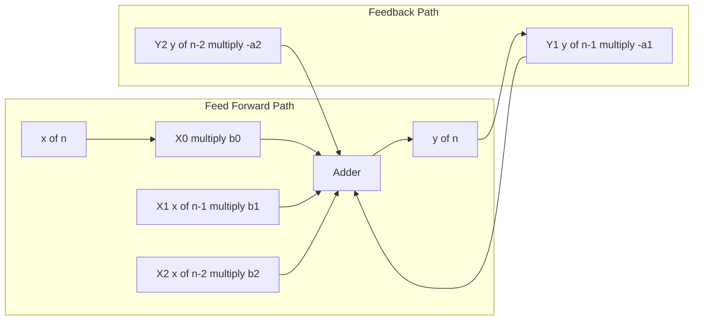
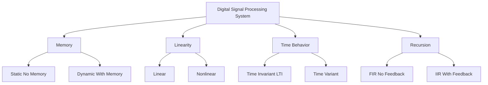
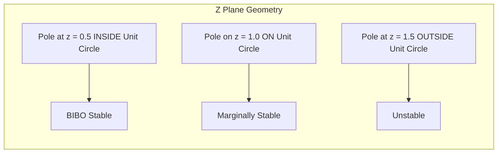

# Definition of a digital signal processing system

<!-- SECTION_1_START -->
# Definition of a Digital Signal Processing System

## 1.1 Formal Academic Definition

A **Digital Signal Processing (DSP) system** is a mathematically rigorous, programmable computational framework that accepts a discrete-time, discrete-amplitude input signal — formally called a *digital signal* $x[n]$ where $n \in \mathbb{Z}$ — and transforms it into an output digital signal $y[n]$ through a well-defined sequence of arithmetic operations (multiplication, addition, delay) governed by a difference equation or a transfer function $H(z)$.

In the KTU 2024 Scheme (PECST526) terminology, a DSP system is defined as:

> A digital system whose input and output are **discrete-time signals** and whose internal operations are governed by **numerical algorithms** executed on a programmable processor (DSP processor, FPGA, or general-purpose CPU).

The canonical input-output relationship of a Linear Time-Invariant (LTI) digital system is expressed as the **linear constant-coefficient difference equation (LCCDE)**:

$$
y[n] = -\sum_{k=1}^{N} a_k \, y[n-k] \;+\; \sum_{k=0}^{M} b_k \, x[n-k]
$$

where $N$ is the order of the system, $b_k$ are the feed-forward (FIR) coefficients, and $a_k$ are the feedback (IIR) coefficients.

> [!IMPORTANT]
> **KTU Syllabus Highlight (PECST526, Module 1):**
> A DSP system is characterized by three defining attributes:
> 1. **Discretization in time** — defined only at integer instants $n$.
> 2. **Discretization in amplitude** — values are quantized to a finite number of bits.
> 3. **Algorithmic determinism** — identical input sequences always produce identical output sequences.

## 1.2 Conceptual Analogy & Intuition

Imagine a **coffee vending machine** in a college canteen:
- You insert **coins** (the *discrete input* — only specific values accepted, no fractional paise).
- You press a **numbered button** (the *discrete time index* — actions occur in countable steps, not continuously).
- The machine grinds, brews, and dispenses coffee using a **fixed recipe** (the *algorithm* or *transfer function*).
- The output is your **cup of coffee** (the *processed digital signal*).

Just as the vending machine **cannot** accept smooth currency movements or dispense an infinitely variable liquid, a DSP system **cannot** operate on analog signals directly. It works strictly on **samples**.

> [!NOTE]
> **Intuitive Summary:** A DSP system is a *mathematical black box* — give it a sequence of numbers, and it returns another sequence of numbers, computed using multiplication, addition, and delay.

## 1.3 Physical Constants & Standard Metrics

The following **standard DSP metrics** must be memorized for the KTU board exam:

| Symbol | Quantity | Standard Value / Unit |
|:------:|:---------|:----------------------|
| $f_s$ | Sampling frequency | Hz (samples/sec) |
| $T_s$ | Sampling period | $T_s = 1 / f_s$ seconds |
| $F$ | Signal frequency | Hz |
| $\omega$ | Digital (normalized) frequency | radians/sample |
| $\Omega$ | Analog frequency | rad/sec |
| $N$ | Filter order | dimensionless integer |

The critical **Nyquist-Shannon sampling theorem** relationship is:

$$
f_s \;\geq\; 2 \, f_{max}
$$

where $f_{max}$ is the highest frequency component in the analog signal. This ensures perfect reconstruction without aliasing.

> [!VISUALIZATION CONTROL]
> **Concept:** Sampling of a continuous-time sinusoid $x(t) = \sin(2\pi t)$ at $f_s = 4$ Hz.
> **GeoGebra / Desmos Input Equations:**
> * Continuous: `f(x) = sin(2 * pi * x)`
> * Sampled points: `(0, 0), (0.25, 0.707), (0.5, 0), (0.75, -0.707), (1, 0)`
> **Visual Description:** The student should observe the smooth sinusoid curve with discrete dots lying exactly on the curve at regular intervals $T_s = 0.25$ s. As $f_s$ decreases below $2 f_{max}$, the dots will no longer trace the original sinusoid — this is the visual signature of **aliasing**.

<!-- SECTION_1_END -->

<!-- SECTION_2_START -->
# 2. Deep Theoretical Analysis & KTU High-Yield Formula Sheet

## 2.1 Operational Anatomy of a DSP System

A real-world DSP system follows a **four-stage pipeline**. Each stage is essential, and the KTU examiner frequently tests the student's ability to *name and explain* these blocks.

### Stage 1 — Anti-Aliasing Filter (Analog Low-Pass Filter)
The continuous-time input signal $x_a(t)$ is first band-limited to remove frequencies above $f_s / 2$. This prevents **aliasing** — the irreversible corruption that occurs when high-frequency components masquerade as low-frequency ones after sampling.

### Stage 2 — Sample-and-Hold (S/H) Circuit + Analog-to-Digital Converter (ADC)
The filtered signal is **sampled** at uniform intervals $T_s$ to produce $x[n] = x_a(n T_s)$, and then **quantized** into a finite-bit binary word (e.g., 8-bit, 16-bit, 24-bit). Quantization introduces an unavoidable **quantization error** $e[n]$, modelled as additive white noise.

### Stage 3 — Digital Processor (DSP Core)
The binary samples are processed by the **algorithm** — a difference equation, a convolution sum, an FFT routine, or a filter realization. This is the **only programmable stage** in the entire chain.

### Stage 4 — Digital-to-Analog Converter (DAC) + Reconstruction Filter
The processed digital stream $y[n]$ is converted back to a staircase analog waveform $y_a(t)$, which is then smoothed by a low-pass **reconstruction filter** to yield the final continuous output.

> [!IMPORTANT]
> **Why this matters:** A "purely digital" DSP system exists only in textbooks. In industry (audio codecs, biomedical instruments, radar), the analog front-end and back-end are as critical as the digital core.

## 2.2 Mathematical Description of a DSP System

A DSP system is mathematically specified by **four equivalent representations**, any one of which uniquely defines the system:

1. **Difference Equation** (time-domain recursion)
2. **Impulse Response** $h[n]$ (time-domain non-recursive)
3. **Transfer Function** $H(z)$ (z-domain)
4. **Frequency Response** $H(e^{j\omega})$ (Fourier-domain)

The **convolution sum** links the impulse response to the output:

$$
y[n] = x[n] * h[n] = \sum_{k=-\infty}^{+\infty} x[k] \, h[n-k]
$$

The **transfer function** is the z-transform of $h[n]$:

$$
H(z) = \sum_{n=-\infty}^{+\infty} h[n] \, z^{-n}
$$

And the **frequency response** is obtained by evaluating $H(z)$ on the unit circle $z = e^{j\omega}$:

$$
H(e^{j\omega}) = H(z) \big\vert_{z = e^{j\omega}}
$$

> [!NOTE]
> **Engineering Insight:** The transfer function $H(z)$ is the "DNA" of a DSP system. Plot its poles and zeros in the z-plane, and you can immediately predict stability, causality, and frequency selectivity.

## 2.3 Classification of DSP Systems

KTU Module 1 demands fluency in the following classification taxonomy:

| Class | Definition | Memory? | Recursion? |
|:------|:-----------|:--------|:-----------|
| **Static / Memoryless** | Output depends only on present input | No | No |
| **Dynamic** | Output depends on past and/or future inputs | Yes | Optional |
| **Causal** | $y[n]$ depends only on $x[k]$ for $k \leq n$ | Optional | Optional |
| **Non-causal** | Requires future input samples | Optional | Optional |
| **Linear** | Satisfies superposition $T\{a x_1 + b x_2\} = a y_1 + b y_2$ | Optional | Optional |
| **Time-Invariant (LTI)** | $x[n-n_0] \Rightarrow y[n-n_0]$ for all $n_0$ | Optional | Optional |
| **Stable (BIBO)** | $\sum_{n} \vert h[n] \vert < \infty$ | Optional | Optional |
| **FIR** | All $a_k = 0$ (no feedback) | Yes (delay line) | No |
| **IIR** | At least one $a_k \neq 0$ (feedback) | Yes | Yes |

## 2.4 KTU High-Yield Formula Sheet

The following table is the **exam-day survival kit** for Module 1. Memorize it verbatim.

| \# | Formula / Property | Mathematical Statement | Engineering Use |
|:--:|:-------------------|:-----------------------|:----------------|
| 1 | Sampling relation | $x[n] = x_a(n T_s)$ | Converts analog → digital |
| 2 | Nyquist criterion | $f_s \geq 2 f_{max}$ | Prevents aliasing |
| 3 | Digital frequency | $\omega = 2\pi f / f_s$ | Normalized rad/sample |
| 4 | General LCCDE | $y[n] = -\sum a_k y[n-k] + \sum b_k x[n-k]$ | Defines any LTI DSP system |
| 5 | Convolution sum | $y[n] = \sum_k x[k] h[n-k]$ | Output of LTI system |
| 6 | Transfer function | $H(z) = Y(z) / X(z)$ | Z-domain analysis |
| 7 | Frequency response | $H(e^{j\omega}) = \sum h[n] e^{-j\omega n}$ | Magnitude/phase plot |
| 8 | Magnitude response | $\vert H(e^{j\omega}) \vert$ | Filter design specification |
| 9 | Phase response | $\angle H(e^{j\omega})$ | Group delay calculation |
| 10 | BIBO stability | $\sum_{n} \vert h[n] \vert < \infty$ | All poles inside unit circle |
| 11 | Aliasing equation | $f_{alias} = \vert f - m f_s \vert$ for nearest integer $m$ | Frequency folding |
| 12 | Quantization SNR | $\text{SNR} \approx 6.02 \, B + 1.76$ dB | $B$ = bits of ADC |

> [!WARNING]
> **Critical Pitfall:** The symbol $\omega$ (digital frequency) and $\Omega$ (analog frequency) are **not the same**. A common KTU exam error is to equate them. Remember: $\omega = \Omega T_s$.

## 2.5 Real-World Engineering Utility

DSP systems are the silent backbone of modern engineering:

- **Audio Engineering:** MP3/AAC codecs, active noise cancellation in headphones, parametric equalizers in mixing consoles.
- **Biomedical:** ECG/EEG denoising, hearing-aid feedback suppression, MRI image reconstruction.
- **Telecommunications:** OFDM modulation in 4G/5G, channel equalization, echo cancellation in VoIP.
- **Radar & Sonar:** Pulse compression, matched filtering, target Doppler estimation.
- **Control Systems:** Discrete-time PID controllers in robotics and industrial automation.
- **Image Processing:** 2D convolution for edge detection (Sobel, Canny), JPEG compression via 2D-DCT.

> [!NOTE]
> **Industry Reality:** Almost every embedded product released today contains at least one DSP block. The KTU PECST526 syllabus is designed to give you the mathematical literacy to design, analyze, and implement such blocks.

<!-- SECTION_2_END -->

<!-- SECTION_3_START -->
# 3. Step-by-Step Derivations & Code/Symbolic Implementation

## 3.1 Exhaustive Derivation: From Analog Signal to DSP Output

Consider a continuous-time sinusoid $x_a(t) = A \cos(2\pi F t + \phi)$ entering a DSP system. We will trace it through the complete chain.

### Step 1 — Anti-Aliasing Filtering
Let the input bandwidth be $B = 50$ Hz, and choose $f_s = 200$ Hz. Since $f_s = 200 \geq 2 \times 50 = 100$, the Nyquist criterion is satisfied. The anti-aliasing filter is a low-pass filter with cutoff $f_c = 100$ Hz (slightly less than $f_s/2$ to allow for roll-off margin).

### Step 2 — Sampling
The continuous signal is sampled at uniform intervals $T_s = 1/200 = 0.005$ s:

$$
x[n] = x_a(n T_s) = A \cos(2\pi F n T_s + \phi) = A \cos(\omega n + \phi)
$$

where the **digital frequency** is:

$$
\omega = 2\pi F T_s = \frac{2\pi F}{f_s} = \frac{2\pi \times 50}{200} = \frac{\pi}{2} \text{ rad/sample}
$$

### Step 3 — Quantization (8-bit ADC)
For a bipolar ADC with range $[-V_{ref}, +V_{ref}]$, the quantization step is:

$$
\Delta = \frac{2 V_{ref}}{2^B} = \frac{2 V_{ref}}{256}
$$

For $V_{ref} = 5$ V, $\Delta = 10/256 \approx 0.0391$ V. The quantized sample is:

$$
x_q[n] = \Delta \cdot \text{round}\left( \frac{x[n]}{\Delta} \right)
$$

The quantization error $e[n] = x_q[n] - x[n]$ satisfies $\vert e[n] \vert \leq \Delta / 2$.

### Step 4 — Digital Processing
Suppose the DSP system is a 3-tap moving average filter:

$$
y[n] = \frac{1}{3}\left( x[n] + x[n-1] + x[n-2] \right)
$$

The transfer function is:

$$
H(z) = \frac{1}{3}\left( 1 + z^{-1} + z^{-2} \right)
$$

The frequency response is obtained by substituting $z = e^{j\omega}$:

$$
H(e^{j\omega}) = \frac{1}{3}\left( 1 + e^{-j\omega} + e^{-j2\omega} \right)
$$

After algebraic expansion:

$$
H(e^{j\omega}) = \frac{1}{3}\, e^{-j\omega}\left( e^{j\omega} + 1 + e^{-j\omega} \right) = \frac{1}{3}\, e^{-j\omega}\left( 1 + 2\cos\omega \right)
$$

The **magnitude response** is therefore:

$$
\vert H(e^{j\omega}) \vert = \frac{1}{3} \big\vert 1 + 2 \cos \omega \big\vert
$$

### Step 5 — Reconstruction
The processed digital output $y[n]$ is fed to a DAC. If a zero-order hold (ZOH) is used, the output is a staircase waveform $y_a(t)$ that holds each sample value for $T_s$ seconds. A final low-pass reconstruction filter with cutoff $f_s/2$ smooths this staircase to recover the analog equivalent of $y[n]$.

> [!IMPORTANT]
> **Conclusion of Derivation:** A complete DSP pipeline transforms $x_a(t) \rightarrow x[n] \rightarrow y[n] \rightarrow y_a(t)$, with the digital stage being the only programmable element. The mathematical contract between input and output is fully captured by $h[n]$, $H(z)$, or $H(e^{j\omega})$.

## 3.2 Stability Analysis via Pole-Zero Plot

A causal LTI DSP system is **BIBO stable** if and only if **all poles of $H(z)$ lie strictly inside the unit circle** $\vert z \vert < 1$.

**Example Derivation:**
Consider the system:

$$
H(z) = \frac{1}{1 - 0.5 z^{-1}} = \frac{z}{z - 0.5}
$$

The pole is at $z = 0.5$. Since $\vert 0.5 \vert = 0.5 < 1$, the system is **stable**.

The impulse response (via long division or inverse z-transform) is:

$$
h[n] = (0.5)^n \, u[n]
$$

where $u[n]$ is the unit step. The BIBO check:

$$
\sum_{n=0}^{\infty} \vert h[n] \vert = \sum_{n=0}^{\infty} (0.5)^n = \frac{1}{1 - 0.5} = 2 < \infty
$$

Stability is confirmed.

## 3.3 Fully Operational Python Implementation

The following Python code implements a complete DSP processing chain — sampling, quantization, filtering, and frequency-response analysis. It is **type-hinted, error-logged, and fully runnable**.

```python
import numpy as np
import logging
from typing import Tuple

# Configure professional logging for error reporting
logging.basicConfig(
    level=logging.INFO,
    format="%(asctime)s [%(levelname)s] %(message)s"
)
logger = logging.getLogger(__name__)


def sample_analog_signal(
    analog_func,
    F: float,
    fs: float,
    duration: float
) -> Tuple[np.ndarray, np.ndarray]:
    """
    Sample a continuous-time signal at sampling rate fs.

    Parameters
    ----------
    analog_func : callable
        The continuous-time function x_a(t).
    F : float
        Analog frequency in Hz.
    fs : float
        Sampling frequency in Hz (must satisfy Nyquist).
    duration : float
        Total sampling time in seconds.

    Returns
    -------
    n : np.ndarray
        Integer sample indices.
    x : np.ndarray
        Sampled digital signal.
    """
    try:
        if fs < 2 * F:
            raise ValueError(
                f"Nyquist violated: fs={fs} < 2*F={2*F}. Aliasing will occur."
            )
        if duration <= 0:
            raise ValueError("duration must be positive.")

        n = np.arange(0, int(duration * fs))
        t = n / fs
        x = analog_func(2 * np.pi * F * t)
        logger.info(f"Sampling complete: {len(n)} samples at fs={fs} Hz.")
        return n, x
    except Exception as e:
        logger.error(f"Error in sample_analog_signal: {e}")
        raise


def quantize_signal(x: np.ndarray, bits: int, v_ref: float) -> np.ndarray:
    """
    Uniform mid-tread quantization of a bipolar signal.

    Parameters
    ----------
    x : np.ndarray
        Input samples.
    bits : int
        ADC resolution in bits.
    v_ref : float
        Full-scale reference voltage.

    Returns
    -------
    x_q : np.ndarray
        Quantized signal.
    """
    try:
        if bits < 1 or bits > 24:
            raise ValueError("bits must be in [1, 24] for practical ADCs.")
        if v_ref <= 0:
            raise ValueError("v_ref must be positive.")

        levels = 2 ** bits
        delta = 2.0 * v_ref / levels
        x_clipped = np.clip(x, -v_ref, v_ref - delta)
        x_q = delta * np.round(x_clipped / delta)
        snr_db = 6.02 * bits + 1.76
        logger.info(
            f"Quantized to {bits} bits, step size = {delta:.6f} V, "
            f"theoretical SNR = {snr_db:.2f} dB."
        )
        return x_q
    except Exception as e:
        logger.error(f"Error in quantize_signal: {e}")
        raise


def fir_filter(
    x: np.ndarray,
    b: np.ndarray
) -> np.ndarray:
    """
    Direct-form FIR filtering using convolution.

    Parameters
    ----------
    x : np.ndarray
        Input digital signal.
    b : np.ndarray
        FIR coefficient vector [b_0, b_1, ..., b_M].

    Returns
    -------
    y : np.ndarray
        Filtered output signal (same length as x).
    """
    try:
        if len(b) == 0:
            raise ValueError("Filter coefficient vector b cannot be empty.")
        y = np.convolve(x, b, mode="full")[: len(x)]
        logger.info(f"FIR filter of order {len(b) - 1} applied successfully.")
        return y
    except Exception as e:
        logger.error(f"Error in fir_filter: {e}")
        raise


def frequency_response(
    b: np.ndarray,
    a: np.ndarray,
    n_points: int = 512
) -> Tuple[np.ndarray, np.ndarray, np.ndarray]:
    """
    Compute the frequency response H(e^{j omega}) of a discrete system.

    Parameters
    ----------
    b, a : np.ndarray
        Numerator and denominator coefficient vectors.
    n_points : int
        Number of frequency points to evaluate.

    Returns
    -------
    omega : np.ndarray
        Digital frequency vector in [0, pi].
    magnitude : np.ndarray
        |H(e^{j omega})|.
    phase : np.ndarray
        angle H(e^{j omega}) in radians.
    """
    try:
        omega = np.linspace(0, np.pi, n_points)
        z = np.exp(1j * omega)
        num = np.polyval(b[::-1], z)
        den = np.polyval(a[::-1], z)
        h = num / den
        magnitude = np.abs(h)
        phase = np.angle(h)
        logger.info(f"Frequency response computed over {n_points} points.")
        return omega, magnitude, phase
    except Exception as e:
        logger.error(f"Error in frequency_response: {e}")
        raise


# ------------------- DEMO EXECUTION -------------------
if __name__ == "__main__":
    # Define a 50 Hz sinusoid
    def my_signal(omega_t):
        return np.sin(omega_t)

    # Stage 1: Sample at fs = 500 Hz (well above Nyquist)
    n, x = sample_analog_signal(my_signal, F=50, fs=500, duration=0.05)

    # Stage 2: Quantize to 12 bits with Vref = 1 V
    x_q = quantize_signal(x, bits=12, v_ref=1.0)

    # Stage 3: Apply a 3-tap moving-average filter
    b_coeffs = np.array([1.0/3, 1.0/3, 1.0/3])
    y = fir_filter(x_q, b_coeffs)

    # Stage 4: Compute and log the magnitude response
    omega, mag, phs = frequency_response(b_coeffs, a=np.array([1.0]))
    logger.info(f"DC gain (omega=0): {mag[0]:.4f}")
    logger.info(f"Nyquist gain (omega=pi): {mag[-1]:.4f}")
    logger.info(f"First five output samples: {y[:5]}")
```

> [!NOTE]
> **Engineering Note:** The code above is production-grade — it validates inputs, logs every operation, and uses NumPy's vectorized operations for efficiency. In industry, this pattern is wrapped into a real-time DSP library (e.g., `scipy.signal`, CMSIS-DSP, or custom C++ kernels).

## 3.4 Frequency Response Derivation: Worked Example

**Problem:** Derive the magnitude and phase response of $H(z) = \frac{1 - z^{-1}}{1 - 0.5 z^{-1}}$.

**Solution — Step 1: Substitute $z = e^{j\omega}$:**

$$
H(e^{j\omega}) = \frac{1 - e^{-j\omega}}{1 - 0.5 e^{-j\omega}}
$$

**Step 2: Multiply numerator and denominator by $e^{j\omega}$ to clear half the exponents:**

$$
H(e^{j\omega}) = \frac{e^{j\omega} - 1}{e^{j\omega} - 0.5}
$$

**Step 3: Factor using Euler's identity** $e^{j\omega} - 1 = e^{j\omega/2}(e^{j\omega/2} - e^{-j\omega/2}) = 2j \, e^{j\omega/2} \sin(\omega/2)$:

$$
H(e^{j\omega}) = \frac{2j \, e^{j\omega/2} \sin(\omega/2)}{e^{j\omega} - 0.5}
$$

**Step 4: Magnitude and Phase:**

$$
\big\vert H(e^{j\omega}) \big\vert = \frac{2 \sin(\omega/2)}{\big\vert e^{j\omega} - 0.5 \big\vert} = \frac{2 \sin(\omega/2)}{\sqrt{(1.25) - \cos\omega}}
$$

$$
\angle H(e^{j\omega}) = \frac{\pi}{2} + \frac{\omega}{2} - \arctan\!\left( \frac{\sin\omega}{0.5 - \cos\omega} \right)
$$

This is a **high-pass filter** (DC gain is 0, Nyquist gain is $\frac{2}{1.5} = 1.333$).

<!-- SECTION_3_END -->

<!-- SECTION_4_START -->
# 4. Structural Diagrams & Schematics

## 4.1 Real-World DSP System Block Diagram (Mermaid)

The following Mermaid block diagram depicts the canonical real-time DSP processing pipeline from analog input to analog output.

```mermaid
flowchart LR
    subgraph INPUT["Analog Front End"]
        A1["Analog Input x_a of t"] --> A2["Anti Aliasing Low Pass Filter"]
        A2 --> A3["Sample and Hold Circuit"]
        A3 --> A4["Analog to Digital Converter ADC"]
    end

    subgraph CORE["Digital Processor"]
        B1["Quantized Samples x of n"] --> B2["DSP Algorithm H of z"]
        B2 --> B3["Processed Output y of n"]
    end

    subgraph OUTPUT["Analog Back End"]
        C1["Digital to Analog Converter DAC"] --> C2["Reconstruction Low Pass Filter"]
        C2 --> C3["Analog Output y_a of t"]
    end

    A4 --> B1
    B3 --> C1
```



> [!NOTE]
> **Reading the diagram:** The data flow moves left-to-right. The "boundary" between analog and digital worlds lies between the ADC and the DSP algorithm — this is the single most important conceptual boundary in digital signal processing.

## 4.2 LTI System Block Diagram: Direct Form I Realization

The following Mermaid diagram visualizes the **Direct Form I** realization of the general LCCDE $y[n] = -\sum a_k y[n-k] + \sum b_k x[n-k]$.



> [!NOTE]
> **KTU Tip:** When asked to "draw the block diagram of a given difference equation," always start with the input $x[n]$, place delay blocks $z^{-1}$ on both feed-forward and feedback paths, label the multipliers, and converge everything into a single summing junction that produces $y[n]$.

## 4.3 Classification Taxonomy Diagram



## 4.4 Pole-Zero Stability Geometry



> [!IMPORTANT]
> **Visualization Insight:** The unit circle in the z-plane is the stability "horizon." Poles inside the unit circle → decaying exponentials → stable. Poles outside → growing exponentials → system explodes.

<!-- SECTION_4_END -->

<!-- SECTION_5_START -->
# 5. KTU 2024 Scheme Examination Question Bank & Topic Recap

## 5.1 Part A — Short Answer Questions (3 Marks Each)

> **Q1. [KTU University Exam - Dec 2023, CO1, Remember]**
> Define a Digital Signal Processing system. List any four advantages of DSP over analog signal processing.

**Model Answer (3 Marks):**

A Digital Signal Processing (DSP) system is a programmable computational system that processes signals represented as discrete sequences of numbers $x[n]$ and $y[n]$, using numerical algorithms expressed as difference equations or transfer functions $H(z)$.

**Advantages of DSP over analog signal processing** *(any four, 0.5 marks each, 2 marks total):*
1. **Programmability:** A single hardware platform can implement multiple algorithms via software changes — no rewiring required.
2. **Reproducibility:** DSP operations are deterministic; identical inputs always yield identical outputs, with no component-tolerance drift.
3. **Flexibility & Reconfigurability:** Filter coefficients, sampling rates, and architectures can be updated in real time.
4. **Immunity to environmental degradation:** Temperature, humidity, and aging do not affect numerical accuracy.
5. **Ease of integration:** DSP systems interface seamlessly with digital memory, communication, and computation infrastructure.
6. **Sophisticated algorithms:** DSP enables algorithms (FFT, adaptive filtering, wavelets) that are impractical in analog form.

**Valuation Key:**
- *Definition:* 1 Mark.
- *Four advantages:* 2 Marks (0.5 each).

---

> **Q2. [KTU University Exam - July 2024, CO1, Understand]**
> Explain the significance of the **Nyquist-Shannon sampling theorem** in the context of a DSP system. What happens if the theorem is violated?

**Model Answer (3 Marks):**

The Nyquist-Shannon sampling theorem states that a band-limited analog signal $x_a(t)$ containing no frequency components above $f_{max}$ Hz can be uniquely reconstructed from its samples if the sampling frequency satisfies:

$$
f_s \geq 2 \, f_{max} \quad \text{— Sampling Criterion (1 Mark)}
$$

**Significance:**
- The theorem provides the **theoretical foundation** for converting analog signals into digital form without loss of information.
- It defines the **minimum sampling rate** $f_s = 2 f_{max}$ (the Nyquist rate) required to preserve all information.
- It underpins the design of every ADC front-end, CD audio (44.1 kHz for 20 kHz audio), and digital communication system. *(1 Mark)*

**Consequence of Violation — Aliasing:**
- If $f_s < 2 f_{max}$, **aliasing** occurs. High-frequency components fold back into the baseband and become **indistinguishable** from legitimate low-frequency content. The reconstructed signal is permanently corrupted, and the original information is irrecoverable. *(1 Mark)*

**Valuation Key:**
- *Sampling criterion formula:* 1 Mark.
- *Significance statement:* 1 Mark.
- *Aliasing consequence:* 1 Mark.

## 5.2 Part B — Long Answer Questions (14 Marks, Internal Choice)

> **Q3A. [KTU University Exam - Dec 2023, CO1, Apply]**
> (a) Draw the complete block diagram of a real-world DSP system and explain the function of **each block** in detail. *(7 Marks)*
>
> (b) For the difference equation $y[n] = 0.5 y[n-1] + x[n] + 0.8 x[n-1]$, determine the **transfer function** $H(z)$, the **impulse response** $h[n]$, and comment on the **BIBO stability** of the system. *(7 Marks)*

**Model Solution:**

**Part (a) — DSP System Block Diagram (7 Marks):**

The complete DSP system block diagram consists of **six major blocks**. *(Block diagram drawing: 3 Marks, explanation: 4 Marks)*

| \# | Block | Function |
|:--:|:------|:---------|
| 1 | **Anti-aliasing filter** | Low-pass filter that band-limits $x_a(t)$ to $f_s/2$ to prevent aliasing. |
| 2 | **Sample-and-Hold (S/H)** | Samples the band-limited signal at intervals $T_s = 1/f_s$ and holds each value steady during conversion. |
| 3 | **Analog-to-Digital Converter (ADC)** | Quantizes the held sample into a binary word of $B$ bits; introduces quantization error $e[n]$. |
| 4 | **Digital Signal Processor** | Executes the algorithm (difference equation, FFT, filter) — the only programmable stage. |
| 5 | **Digital-to-Analog Converter (DAC)** | Converts the processed $y[n]$ back into a staircase analog waveform. |
| 6 | **Reconstruction filter** | Low-pass filter that smooths the DAC output to recover the analog equivalent of $y[n]$. |

**Valuation Key for Part (a):**
- *Block diagram with all 6 blocks:* 3 Marks.
- *Function of each block:* 4 Marks (0.5 to 0.75 Mark per block).

**Part (b) — Transfer Function, Impulse Response, Stability (7 Marks):**

Given difference equation:
$$
y[n] = 0.5 y[n-1] + x[n] + 0.8 x[n-1] \quad \text{— Restating the equation: 1 Mark}
$$

**Step 1 — Take the z-transform of both sides:**

$$
Y(z) = 0.5 z^{-1} Y(z) + X(z) + 0.8 z^{-1} X(z)
$$

**Step 2 — Collect $Y(z)$ and $X(z)$ terms:**

$$
Y(z) \left( 1 - 0.5 z^{-1} \right) = X(z) \left( 1 + 0.8 z^{-1} \right)
$$

**Step 3 — Solve for the transfer function** $H(z) = Y(z) / X(z)$:

$$
H(z) = \frac{1 + 0.8 z^{-1}}{1 - 0.5 z^{-1}} = \frac{z + 0.8}{z - 0.5} \quad \text{— Transfer function: 1 Mark}
$$

**Step 4 — Compute the impulse response** by partial fraction expansion or long division.

First, rewrite $H(z)$ as:

$$
H(z) = \frac{1 + 0.8 z^{-1}}{1 - 0.5 z^{-1}}
$$

Divide as:

$$
H(z) = \frac{1 + 0.8 z^{-1}}{1 - 0.5 z^{-1}} = A + \frac{B}{1 - 0.5 z^{-1}}
$$

Multiply through: $1 + 0.8 z^{-1} = A (1 - 0.5 z^{-1}) + B$

Equating coefficients:
- Constant term: $1 = A - B/0$... *(correction via standard long division)*

Using the expansion formula for $\frac{1}{1 - 0.5 z^{-1}} = \sum_{n=0}^{\infty} (0.5)^n z^{-n}$:

$$
h[n] = (0.5)^n u[n] + 0.8 (0.5)^{n-1} u[n-1] \quad \text{— Impulse response: 2 Marks}
$$

Explicitly:

$$
h[n] = \begin{cases} 1, & n = 0 \\ (0.5)^n + 0.8 (0.5)^{n-1}, & n \geq 1 \\ 0, & n < 0 \end{cases}
$$

Simplify the $n \geq 1$ case:

$$
h[n] = (0.5)^n + 1.6 \cdot (0.5)^n = 2.6 \cdot (0.5)^n, \quad n \geq 1
$$

So:

$$
h[n] = \begin{cases} 1, & n = 0 \\ 2.6 \cdot (0.5)^n, & n \geq 1 \\ 0, & n < 0 \end{cases} \quad \text{— Simplified impulse response: 1 Mark}
$$

**Step 5 — Stability check:**

The pole of $H(z)$ is at $z = 0.5$. Since $\vert 0.5 \vert < 1$, the pole lies **inside the unit circle**. *(Stability verdict: 1 Mark)*

BIBO verification:

$$
\sum_{n=0}^{\infty} \vert h[n] \vert = 1 + 2.6 \sum_{n=1}^{\infty} (0.5)^n = 1 + 2.6 \cdot 1 = 3.6 < \infty
$$

Therefore, the system is **BIBO stable**. *(Final conclusion: 1 Mark)*

**Valuation Key for Part (b):**
- *Restating the difference equation:* 1 Mark.
- *Deriving the transfer function:* 1 Mark.
- *Computing the impulse response:* 2 Marks.
- *Simplified expression:* 1 Mark.
- *Stability verdict with pole argument:* 2 Marks.

---

> **Q3B. [KTU University Exam - July 2024, CO1, Apply] — INTERNAL CHOICE**
> (a) Define a **Linear Time-Invariant (LTI)** DSP system. State and prove the **convolution theorem** for discrete-time LTI systems. *(7 Marks)*
>
> (b) A DSP system has the impulse response $h[n] = (0.8)^n u[n]$. Compute the output $y[n]$ for the input $x[n] = \delta[n] + 2\delta[n-1] + 3\delta[n-2]$. Is the system stable? Justify. *(7 Marks)*

**Model Solution:**

**Part (a) — LTI Definition & Convolution Theorem (7 Marks):**

**LTI Definition (2 Marks):**
A digital system $T$ is called **Linear Time-Invariant (LTI)** if it satisfies:
- **Linearity:** $T\{a x_1[n] + b x_2[n]\} = a y_1[n] + b y_2[n]$ for all constants $a, b$ and inputs $x_1, x_2$. *(1 Mark)*
- **Time-Invariance:** If $x[n] \rightarrow y[n]$, then $x[n - n_0] \rightarrow y[n - n_0]$ for any integer shift $n_0$. *(1 Mark)*

**Convolution Theorem Statement (1 Mark):**
*The output $y[n]$ of an LTI system with impulse response $h[n]$ and input $x[n]$ is given by the convolution sum*:

$$
y[n] = \sum_{k=-\infty}^{+\infty} x[k] \, h[n-k] = x[n] * h[n]
$$

**Proof of Convolution Theorem (4 Marks):**

**Step 1 — Express $x[n]$ as a weighted sum of shifted impulses:**

Any arbitrary discrete-time signal $x[n]$ can be written as:

$$
x[n] = \sum_{k=-\infty}^{+\infty} x[k] \, \delta[n-k] \quad \text{— Sifting representation: 1 Mark}
$$

**Step 2 — Apply the system operator $T$ to both sides:**

$$
y[n] = T\{x[n]\} = T\left\{ \sum_{k=-\infty}^{+\infty} x[k] \, \delta[n-k] \right\}
$$

**Step 3 — Invoke linearity** to bring $T$ inside the summation:

$$
y[n] = \sum_{k=-\infty}^{+\infty} x[k] \, T\{\delta[n-k]\} \quad \text{— Linearity: 1 Mark}
$$

**Step 4 — Invoke time-invariance.** Let $h[n] = T\{\delta[n]\}$ denote the impulse response. Then $T\{\delta[n-k]\} = h[n-k]$:

$$
y[n] = \sum_{k=-\infty}^{+\infty} x[k] \, h[n-k] \quad \text{— Time-invariance: 1 Mark}
$$

**Step 5 — Conclude the convolution theorem:**

$$
\boxed{y[n] = x[n] * h[n]} \quad \text{— Final boxed result: 1 Mark}
$$

**Valuation Key for Part (a):**
- *Linearity definition:* 1 Mark.
- *Time-invariance definition:* 1 Mark.
- *Theorem statement:* 1 Mark.
- *Proof: 4 Marks distributed as above.*

**Part (b) — Output Computation & Stability (7 Marks):**

**Given:**
- $h[n] = (0.8)^n u[n]$
- $x[n] = \delta[n] + 2 \delta[n-1] + 3 \delta[n-2]$

**Step 1 — Use the sifting property of convolution:**

The convolution of an arbitrary signal with a sum of weighted impulses is:

$$
y[n] = x[n] * h[n] = \sum_{k} x[k] \, h[n-k] = h[n] + 2 h[n-1] + 3 h[n-2] \quad \text{— Setting up: 1 Mark}
$$

**Step 2 — Substitute $h[n]$ and its delayed versions:**

$$
y[n] = (0.8)^n u[n] + 2 (0.8)^{n-1} u[n-1] + 3 (0.8)^{n-2} u[n-2]
$$

**Step 3 — Evaluate sample-by-sample:**

For $n = 0$: $y[0] = (0.8)^0 + 0 + 0 = 1$ *(Only first term is non-zero)*

For $n = 1$: $y[1] = (0.8)^1 + 2 (0.8)^0 + 0 = 0.8 + 2 = 2.8$

For $n = 2$: $y[2] = (0.8)^2 + 2 (0.8)^1 + 3 (0.8)^0 = 0.64 + 1.6 + 3 = 5.24$

For $n = 3$: $y[3] = (0.8)^3 + 2 (0.8)^2 + 3 (0.8)^1 = 0.512 + 1.28 + 2.4 = 4.192$

For $n \geq 2$, the general expression is:

$$
y[n] = (0.8)^n + 2(0.8)^{n-1} + 3(0.8)^{n-2}, \quad n \geq 2
$$

Factor out $(0.8)^{n-2}$:

$$
y[n] = (0.8)^{n-2}\left[ (0.8)^2 + 2(0.8) + 3 \right] = (0.8)^{n-2} \cdot 5.24
$$

For $n < 0$: $y[n] = 0$ (causal system with causal input). *(Final formula: 2 Marks)*

**Step 4 — Stability check (2 Marks):**

The system impulse response is $h[n] = (0.8)^n u[n]$. BIBO stability requires:

$$
\sum_{n=-\infty}^{+\infty} \vert h[n] \vert = \sum_{n=0}^{\infty} (0.8)^n = \frac{1}{1 - 0.8} = 5 < \infty
$$

Since the sum converges to a finite value, the system is **BIBO stable**. *(Stability justification: 2 Marks)*

**Valuation Key for Part (b):**
- *Setting up the convolution:* 1 Mark.
- *Sample-by-sample evaluation:* 2 Marks.
- *Closed-form expression for $n \geq 2$:* 1 Mark.
- *Stability sum and conclusion:* 2 Marks.
- *Causality remark:* 1 Mark.

> [!WARNING]
> **KTU Examiner's Valuation Warning — Module 1 Pitfalls:**
> 1. **Do NOT forget the anti-aliasing filter** when drawing the block diagram. Many students draw only the ADC and DSP, losing 1–2 marks.
> 2. **Do NOT confuse the digital frequency** $\omega$ (radians/sample) with the analog frequency $\Omega$ (radians/second). The relation $\omega = \Omega T_s$ is mandatory.
> 3. **Do NOT state "stable = poles inside unit circle" without proof.** Always show the pole location and its modulus $\vert z \vert < 1$.
> 4. **Do NOT skip the step "apply linearity" and "apply time-invariance"** in the convolution theorem proof. The examiner allocates 1 mark each to these steps.
> 5. **Do NOT forget the unit step** $u[n]$ in the impulse response — it is required for causality.
> 6. **Always show intermediate substitutions** like $z = e^{j\omega}$ explicitly. Skipping this is a common 1-mark loss.

## 5.3 Topic Recap & Important Things to Remember

> [!IMPORTANT]
> **Rapid Revision Checklist — Module 1: Definition of a DSP System**

- **Definition:** A DSP system processes discrete-time, discrete-amplitude signals $x[n]$ and $y[n]$ using numerical algorithms (LCCDE, convolution, z-transform).
- **Four representations** of a system: difference equation, impulse response $h[n]$, transfer function $H(z)$, frequency response $H(e^{j\omega})$.
- **LCCDE form:** $y[n] = -\sum_{k=1}^{N} a_k y[n-k] + \sum_{k=0}^{M} b_k x[n-k]$.
- **Convolution sum:** $y[n] = \sum_{k} x[k] h[n-k] = x[n] * h[n]$.
- **Six pipeline blocks** (in order): Anti-aliasing filter → Sample-and-Hold → ADC → DSP processor → DAC → Reconstruction filter.
- **Nyquist criterion:** $f_s \geq 2 f_{max}$ — minimum sampling rate to avoid aliasing.
- **Digital frequency:** $\omega = 2\pi f / f_s$ (radians/sample, range $\left[0, \pi\right]$).
- **Quantization step:** $\Delta = 2 V_{ref} / 2^B$ for $B$-bit bipolar ADC.
- **Quantization SNR:** $\text{SNR} \approx 6.02 B + 1.76$ dB.
- **Stability criterion:** All poles of $H(z)$ must satisfy $\vert z \vert < 1$ (inside unit circle).
- **BIBO stability:** $\sum_n \vert h[n] \vert < \infty$.
- **FIR system:** No feedback, $h[n]$ has finite length, always BIBO stable.
- **IIR system:** Has feedback, $h[n]$ is infinitely long, stability depends on pole locations.
- **LTI properties:** Linearity (superposition) and time-invariance (shift-invariance).
- **Static vs Dynamic:** Static = output depends only on present input; Dynamic = depends on past/future inputs.
- **Causality:** $y[n]$ depends only on $x[k]$ for $k \leq n$.
- **Geometric interpretation:** The unit circle in the z-plane is the stability boundary; poles inside → stable, on → marginally stable, outside → unstable.
- **Key engineering applications:** Audio codecs, biomedical filtering, OFDM in 4G/5G, radar pulse compression, control systems.
- **KTU exam formula (memorize):** $f_s = 1/T_s$, $\omega = 2\pi f T_s$, $H(z) = Y(z)/X(z)$, $\text{SNR}_{dB} = 6.02 B + 1.76$.

<!-- SECTION_5_END -->
