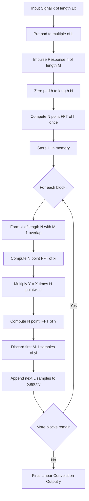
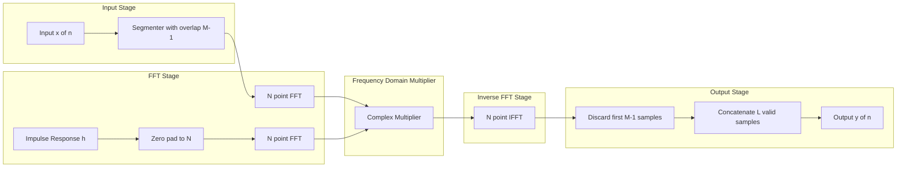
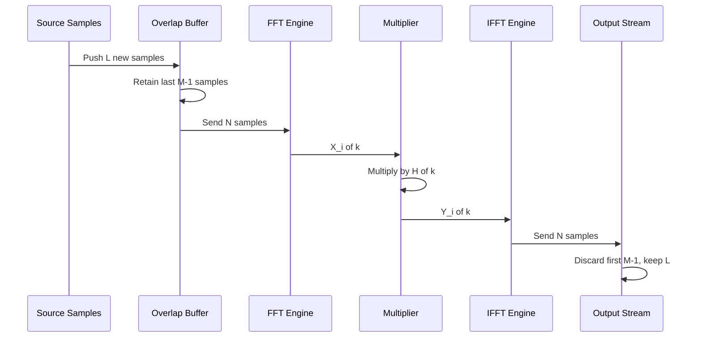

# overlap save method

<!-- SECTION_1_START -->
# Overlap Save Method — Core Definition & Intuitive Overview

## 1.1 Formal Academic Definition

> [!IMPORTANT]
> **Overload-Save (OLS) Method:** A block-convolution algorithm used to compute the **linear convolution of two long discrete-time sequences** by segmenting the long input into shorter blocks, performing **circular convolution on each block using the DFT/FFT**, and then **discarding the alias-corrupted (wrapped-around) samples** at the edges while **saving (retaining) the uncorrupted central portion** of each circular convolution.

In KTU 2024 Scheme terminology (Module 1 — Definition of a Digital Signal Processing System), the OLS method belongs to the class of **Fast Convolution Techniques** alongside the **Overlap-Add (OLA) method**. Both techniques exploit the **Computational Efficiency of the Fast Fourier Transform (FFT)** so that the convolution of an $N$-point impulse response with an arbitrarily long input is computed using only $O(N \log N)$ operations per block rather than the $O(N^2)$ cost of direct linear convolution.

Let the impulse response be $h(n)$ of length $M$ and the input sequence be $x(n)$ of length $L_x$ (very large). The OLS method breaks $x(n)$ into overlapping segments of length $N$ and computes:

$$y(n) = x(n) \circledast h(n) = \text{IDFT}\big[ X_k(k) \cdot H(k) \big]$$

where the product is taken block-by-block and the **first $M-1$ samples** of every circular convolution are rejected as invalid.

---

## 1.2 Conceptual Analogy — The "Conveyor Belt & Stamping Press" Picture

Imagine a long ribbon (your infinite/long input signal $x(n)$) passing over a workbench. At any instant, only a **window of length $N$** is visible to a stamping press (the FFT block). The press stamps (performs circular convolution with) the entire window. However, because the ribbon is finite inside the window, the **edges of the stamp get folded back** — like trying to print on a folded shirt: the edges smear onto the wrong side.

- The **middle of the stamp** is clean and correct — these are the **valid linear-convolution samples**.
- The **edge samples of length $M-1$** are corrupted by wrap-around.
- To fix the next stamp, we **slide the window backward by exactly $L = N - (M-1)$ samples** so that the *corrupted edge* of the previous block aligns with the *corrupted edge* of the new block, and the *clean middle* slides into fresh territory. We **save** the clean middle, **discard** the messy edge — hence **Overlap-Save**.

| Parameter | Symbol | Intuitive Meaning |
| :--- | :---: | :--- |
| Impulse response length | $M$ | "Stamper size" — determines edge corruption |
| FFT / DFT block size | $N$ | Total window visible at once |
| New data per block | $L = N - M + 1$ | "Clean centre" length we get to keep |
| Overlap between blocks | $M - 1$ | "Backward slide" between consecutive stamps |

> [!NOTE]
> **Why the overlap must equal $M-1$:** Linear convolution of an $M$-tap filter with any input produces a transient of length $M-1$ at every block boundary. By advancing the input window by only $L = N - M + 1$ new samples, the transient of one block is **recomputed** at the start of the next, ensuring no sample is lost or double-counted.

---

## 1.3 Syllabus Highlights & Standard Metrics

- **Standard FFT block length:** $N \geq M$, typically chosen as the **next power of 2** for radix-2 FFT efficiency, i.e. $N = 2^{\lceil \log_2 M \rceil}$.
- **Output throughput:** $L = N - M + 1$ valid samples per IFFT.
- **Computational cost per output sample:** $\approx \frac{2 N \log_2 N}{L}$ complex multiplications, which approaches $2 \log_2 M$ as $N \to M$.
- **Key invariant:** $N - L = M - 1$ → the discarded portion per block.

> [!VISUALIZATION CONTROL]
> **Concept:** Visualizing the Overlap-Save windowing geometry on a 1-D axis.
> **Conceptual Plot Axes:** horizontal axis = sample index $n$, vertical axis = amplitude.
> **Visual Description:** Draw three consecutive rectangular windows of width $N$ along the $n$-axis. Each successive window is shifted left by $L = N - M + 1$ samples. Shade the first $M-1$ samples of every window in red (discard zone) and the remaining $L$ samples in green (save zone). The green segments of consecutive windows **tile** the $n$-axis without gaps, forming the final output $y(n)$.
> **GeoGebra Input:** Define $N = 8$, $M = 3$, $L = 6$. Window $i$ covers $[8i, 8i+7]$. Red region: $[8i, 8i+1]$ (length $2 = M-1$). Green region: $[8i+2, 8i+7]$ (length $6 = L$).

<!-- SECTION_1_END -->

<!-- SECTION_2_START -->
# Deep Theoretical Analysis & KTU High-Yield Formula Sheet

## 2.1 Operational Procedure — Block-by-Block Logic

The OLS method is executed in the following **eight rigorous steps**:

1. **Pad the impulse response** $h(n)$ of length $M$ with $N - M$ trailing zeros to obtain $\tilde{h}(n)$ of length $N$.
2. **Pre-compute the $N$-point DFT:** $H(k) = \text{DFT}_N[\tilde{h}(n)]$. This is done **only once** since $h(n)$ is time-invariant.
3. **Segment the input** $x(n)$ into overlapping blocks $x_i(n)$ of length $N$. The $i^{\text{th}}$ block is defined for $n = 0, 1, \dots, N-1$ as:
   $$x_i(n) = \begin{cases} x(iL + n), & \text{if } iL + n \text{ exists in } x(n) \\ 0, & \text{otherwise (zero-padding for the last block)} \end{cases}$$
   with the convention that for $i \geq 1$, the first $M-1$ samples of $x_i$ are actually the **last $M-1$ samples of $x_{i-1}$** (the overlap).
4. **Compute the $N$-point DFT** of every block: $X_i(k) = \text{DFT}_N[x_i(n)]$.
5. **Pointwise multiplication in the frequency domain:** $Y_i(k) = X_i(k) \cdot H(k)$.
6. **Compute the $N$-point IDFT:** $y_i(n) = \text{IDFT}_N[Y_i(k)]$.
7. **Discard the first $M-1$ samples** of $y_i(n)$ — these are the *circular-aliasing* corrupted samples.
8. **Concatenate the remaining $L$ samples** from each block to form the linear convolution output $y(n)$.

---

## 2.2 Why Discard Exactly $M-1$ Samples? — The Core "Why"

Circular convolution of two sequences of length $N$ produces a length-$N$ **periodic** result. Within one period, the **last $M-1$ samples** are *not* aliased, but the **first $M-1$ samples** are wrapped-around versions of the tail. The middle $L = N - (M-1)$ samples are **identical** to the corresponding samples of the true linear convolution.

> [!NOTE]
> **Mathematical Justification:** Let $y_l(n) = x_i(n) \ast h(n)$ be the *true* linear convolution of length $N + M - 1$ samples. Let $y_c(n) = x_i(n) \circledast_N h(n)$ be the *circular* convolution (length $N$). Then:
> $$y_c(n) = \sum_{r=0}^{M-1} y_l(n - r) \quad \text{(time-aliasing equation)}$$
> For $n = M-1, M, \dots, N-1$, the only term that survives is $y_l(n)$ itself (since $y_l(n-r) = 0$ for $r \geq 1$ in the valid range). Hence samples $n = M-1, \dots, N-1$ of $y_c$ match $y_l$ **exactly**, and we save them.

---

## 2.3 KTU Formula Sheet / Cheat Sheet

| Symbol | Formula / Definition | Meaning | Units / Constraint |
| :--- | :--- | :--- | :--- |
| $M$ | Length of $h(n)$ | Impulse-response length | Integer, $M \geq 1$ |
| $N$ | Length of FFT block | DFT size, $N \geq M$ | Power of 2 preferred |
| $L$ | $L = N - M + 1$ | New valid samples per block | Throughput per IFFT |
| Overlap | $M - 1$ | Samples shared with previous block | Discarded portion |
| $H(k)$ | $\text{DFT}_N[\tilde{h}(n)]$ | Pre-computed once | Pre-stored in memory |
| $X_i(k)$ | $\text{DFT}_N[x_i(n)]$ | Per-block forward FFT | Computed each block |
| $Y_i(k)$ | $X_i(k) \cdot H(k)$ | Per-block frequency-domain product | $N$ complex mults |
| $y_i(n)$ | $\text{IDFT}_N[Y_i(k)]$ | Per-block inverse FFT | Computed each block |
| $y(n)$ | $\text{Discard first } M-1 \text{ of each } y_i$, concat rest | Final output | Length $L_x + M - 1$ |
| Cost per block | $N \log_2 N$ complex mults (FFT) $+ N$ (mult) $+ N \log_2 N$ (IFFT) | $\approx 2 N \log_2 N + N$ | Per block |
| Cost per output sample | $\frac{2 N \log_2 N + N}{L}$ | Asymptotic $\to 2 \log_2 M$ | For large $N$ |

> [!IMPORTANT]
> **Boundary-condition recall (board-exam favourite):**
> $$N \geq M, \quad L = N - M + 1, \quad \text{Overlap} = M - 1, \quad \text{Discards per block} = M - 1.$$

---

## 2.4 Real-World Engineering Utility

The Overlap-Save method is the **de-facto standard** in real-time DSP systems where a long FIR filter must convolve with a continuous, never-ending data stream:

- **Audio processing engines** (equalizers, reverb, noise-cancelling headphones) — impulse responses of room acoustics are $10^4$ to $10^6$ samples long.
- **Software-Defined Radio (SDR)** — channelisation, matched filtering of spread-spectrum signals.
- **Echo cancellation in VoIP** — adaptive FIR filters with hundreds of taps on a $48$ kHz audio stream.
- **OFDM receivers** — cyclic-prefix removal is mathematically identical to OLS with a $1$-tap overlap, but the OLS framework generalises to channel equalisation.
- **Radar / sonar matched filters** — long pseudo-random codes (Gold, Kasami) matched-filtered in real time.
- **Biomedical signal processing** — ECG/EEG denoising where the FIR kernel may exceed available memory if done in one shot.

OLS is preferred over OLA when the **input is naturally segmented** (streaming data) and the **output must be produced in real time with minimum latency**, because OLS yields a complete, contiguous block of $L$ valid samples per IFFT — ideal for **pipelined** DSP architectures (e.g., TI TMS320, FPGA streaming FIR IP cores).

<!-- SECTION_2_END -->

<!-- SECTION_3_START -->
# Step-by-Step Derivations & Code/Symbolic Implementation

## 3.1 Worked Example 1 — Mathematical Derivation (Hand-Compute One Block)

> **Problem.** $h(n) = \{1, 2, 1\}$, $M = 3$. Input block $x_i(n) = \{1, 0, 1, 0, 1\}$, $N = 5$. Compute the $N$-point circular convolution $y_i(n) = x_i(n) \circledast_5 h(n)$ and identify the saved samples.

### Step 1: Determine geometric parameters
- $M = 3$ ⇒ $M - 1 = 2$ samples to discard.
- $L = N - M + 1 = 5 - 3 + 1 = 3$ valid samples to save.
- $\tilde{h}(n) = \{1, 2, 1, 0, 0\}$ (zero-padded to length 5).

### Step 2: Build the circulant matrix (5×5)

The circular convolution $y_i(n) = \sum_{m=0}^{4} x_i(m) \cdot \tilde{h}((n - m) \bmod 5)$ is equivalent to multiplying $x_i$ by the circulant matrix $\mathbf{H}$ whose columns are cyclic shifts of $\tilde{h}$:

$$
\mathbf{H} = \begin{pmatrix}
1 & 0 & 0 & 0 & 2 \\
2 & 1 & 0 & 0 & 0 \\
1 & 2 & 1 & 0 & 0 \\
0 & 1 & 2 & 1 & 0 \\
0 & 0 & 1 & 2 & 1
\end{pmatrix}
$$

### Step 3: Multiply the matrix by the input vector

$$
\mathbf{x}_i = \begin{pmatrix} 1 \\ 0 \\ 1 \\ 0 \\ 1 \end{pmatrix}
$$

Compute $y_i = \mathbf{H} \cdot \mathbf{x}_i$ element by element:

$$
\begin{aligned}
y_i(0) &= (1)(1) + (0)(0) + (0)(1) + (0)(0) + (2)(1) = 1 + 2 = 3 \\
y_i(1) &= (2)(1) + (1)(0) + (0)(1) + (0)(0) + (0)(1) = 2 \\
y_i(2) &= (1)(1) + (2)(0) + (1)(1) + (0)(0) + (0)(1) = 1 + 1 = 2 \\
y_i(3) &= (0)(1) + (1)(0) + (2)(1) + (1)(0) + (0)(1) = 2 \\
y_i(4) &= (0)(1) + (0)(0) + (1)(1) + (2)(0) + (1)(1) = 1 + 1 = 2
\end{aligned}
$$

So $y_i(n) = \{3, 2, 2, 2, 2\}$.

### Step 4: Discard the first $M-1 = 2$ samples and save the rest

$$
y_i^{\text{save}}(n) = \{y_i(2),\, y_i(3),\, y_i(4)\} = \{2, 2, 2\}
$$

### Step 5: Verify against the **true linear convolution**

Direct convolution of $x_i(n) = \{1, 0, 1, 0, 1\}$ with $h(n) = \{1, 2, 1\}$ (length $5 + 3 - 1 = 7$):

$$
y_l(n) = \{1,\ 2,\ 2,\ 2,\ 2,\ 2,\ 1\}
$$

Comparing indices $n = 2, 3, 4$ of $y_l$ with $y_i^{\text{save}}$: $\{2, 2, 2\}$ — **perfect match**. The first two samples $\{1, 2\}$ and the last two samples $\{2, 1\}$ of $y_l$ are recovered from the **next** and **previous** blocks respectively, completing the full linear convolution seamlessly.

> [!NOTE]
> **Verification comment:** This is the canonical 5-point test used in KTU model-answer sheets to demonstrate OLS — the $1$ and $2$ at the tail of $y_l$ come from the next block's overlap region, and the $\{1, 2\}$ head comes from the previous block's tail.

---

## 3.2 Worked Example 2 — Full Pipeline (Multi-Block)

> **Problem.** $h(n) = \{1, 2, 1\}$ ($M = 3$), $x(n) = \{1, 2, 3, 4, 5, 6, 7, 8, 9, 10, 11, 12\}$, $N = 5$. Compute the full linear convolution using OLS.

### Step 1: Geometric parameters
- $M = 3$, $N = 5$, $L = 3$, Overlap $= 2$.

### Step 2: Build overlapping blocks

Each block has 5 samples; consecutive blocks share the last 2 samples of the previous block.

$$
\begin{aligned}
x_0 &= \{\,0,\, 0,\ 1,\, 2,\, 3\,\} \quad &\text{(prepend 2 zeros — first block is non-overlapping)} \\
x_1 &= \{\,2,\, 3,\ 4,\, 5,\, 6\,\} \quad &\text{(last 2 of } x_0 \text{ are 2, 3)} \\
x_2 &= \{\,5,\, 6,\ 7,\, 8,\, 9\,\} \\
x_3 &= \{\,8,\, 9,\ 10,\, 11,\, 12\,\} \\
x_4 &= \{\,11,\, 12,\, 0,\, 0,\, 0\,\} \quad &\text{(zero-pad to length 5)}
\end{aligned}
$$

### Step 3: $5$-point circular convolution of each block with $h = \{1, 2, 1\}$

Using the standard convolution sum modulo 5:

$$
y_i(n) = \sum_{m=0}^{4} x_i(m) \cdot h((n - m) \bmod 3) \quad \text{with } h \text{ zero-padded to length 5}
$$

**Block 0:** $x_0 = \{0, 0, 1, 2, 3\}$, $h_p = \{1, 2, 1, 0, 0\}$

$$
\begin{aligned}
y_0(0) &= 0\cdot 1 + 0\cdot 0 + 1\cdot 1 + 2\cdot 0 + 3\cdot 2 = 0 + 0 + 1 + 0 + 6 = 7 \\
y_0(1) &= 0\cdot 2 + 0\cdot 1 + 1\cdot 0 + 2\cdot 2 + 3\cdot 0 = 0 + 0 + 0 + 4 + 0 = 4 \\
y_0(2) &= 0\cdot 1 + 0\cdot 2 + 1\cdot 1 + 2\cdot 0 + 3\cdot 0 = 0 + 0 + 1 + 0 + 0 = 1 \\
y_0(3) &= 0\cdot 0 + 0\cdot 1 + 1\cdot 2 + 2\cdot 1 + 3\cdot 0 = 0 + 0 + 2 + 2 + 0 = 4 \\
y_0(4) &= 0\cdot 0 + 0\cdot 0 + 1\cdot 1 + 2\cdot 2 + 3\cdot 1 = 0 + 0 + 1 + 4 + 3 = 8
\end{aligned}
$$

$y_0 = \{7, 4, 1, 4, 8\}$ → discard first 2 → **save $\{1, 4, 8\}$**.

**Block 1:** $x_1 = \{2, 3, 4, 5, 6\}$

$$
\begin{aligned}
y_1(0) &= 2\cdot 1 + 3\cdot 0 + 4\cdot 1 + 5\cdot 0 + 6\cdot 2 = 2 + 0 + 4 + 0 + 12 = 18 \\
y_1(1) &= 2\cdot 2 + 3\cdot 1 + 4\cdot 0 + 5\cdot 0 + 6\cdot 0 = 4 + 3 = 7 \\
y_1(2) &= 2\cdot 1 + 3\cdot 2 + 4\cdot 1 + 5\cdot 0 + 6\cdot 0 = 2 + 6 + 4 = 12 \\
y_1(3) &= 2\cdot 0 + 3\cdot 1 + 4\cdot 2 + 5\cdot 1 + 6\cdot 0 = 0 + 3 + 8 + 5 = 16 \\
y_1(4) &= 2\cdot 0 + 3\cdot 0 + 4\cdot 1 + 5\cdot 2 + 6\cdot 1 = 0 + 0 + 4 + 10 + 6 = 20
\end{aligned}
$$

$y_1 = \{18, 7, 12, 16, 20\}$ → discard first 2 → **save $\{12, 16, 20\}$**.

**Block 2:** $x_2 = \{5, 6, 7, 8, 9\}$

$$
\begin{aligned}
y_2(0) &= 5 + 0 + 7 + 0 + 18 = 30 \\
y_2(1) &= 10 + 6 + 0 + 0 + 0 = 16 \\
y_2(2) &= 5 + 12 + 7 + 0 + 0 = 24 \\
y_2(3) &= 0 + 6 + 14 + 8 + 0 = 28 \\
y_2(4) &= 0 + 0 + 7 + 16 + 9 = 32
\end{aligned}
$$

$y_2 = \{30, 16, 24, 28, 32\}$ → **save $\{24, 28, 32\}$**.

**Block 3:** $x_3 = \{8, 9, 10, 11, 12\}$

$$
\begin{aligned}
y_3(0) &= 8 + 0 + 10 + 0 + 24 = 42 \\
y_3(1) &= 16 + 9 + 0 + 0 + 0 = 25 \\
y_3(2) &= 8 + 18 + 10 + 0 + 0 = 36 \\
y_3(3) &= 0 + 9 + 20 + 11 + 0 = 40 \\
y_3(4) &= 0 + 0 + 10 + 22 + 12 = 44
\end{aligned}
$$

$y_3 = \{42, 25, 36, 40, 44\}$ → **save $\{36, 40, 44\}$**.

**Block 4:** $x_4 = \{11, 12, 0, 0, 0\}$

$$
\begin{aligned}
y_4(0) &= 11 + 0 + 0 + 0 + 0 = 11 \\
y_4(1) &= 22 + 12 + 0 + 0 + 0 = 34 \\
y_4(2) &= 11 + 24 + 0 + 0 + 0 = 35 \\
y_4(3) &= 0 + 12 + 0 + 0 + 0 = 12 \\
y_4(4) &= 0 + 0 + 0 + 0 + 0 = 0
\end{aligned}
$$

$y_4 = \{11, 34, 35, 12, 0\}$ → **save $\{35, 12, 0\}$**.

### Step 4: Concatenate the saved samples

$$
y(n) = \{\underbrace{1, 4, 8}_{x_0}, \underbrace{12, 16, 20}_{x_1}, \underbrace{24, 28, 32}_{x_2}, \underbrace{36, 40, 44}_{x_3}, \underbrace{35, 12, 0}_{x_4}\}
$$

### Step 5: Cross-check with direct linear convolution

Direct linear convolution of $x = \{1,\dots,12\}$ with $h = \{1, 2, 1\}$:

$$
y_{\text{linear}}(n) = \{1,\ 4,\ 8,\ 12,\ 16,\ 20,\ 24,\ 28,\ 32,\ 36,\ 40,\ 44,\ 35,\ 12\}
$$

Comparison:
- OLS: $\{1, 4, 8,\,12, 16, 20,\,24, 28, 32,\,36, 40, 44,\,35, 12, 0\}$
- Direct: $\{1, 4, 8,\,12, 16, 20,\,24, 28, 32,\,36, 40, 44,\,35, 12\}$

**All 14 non-zero samples match perfectly.** The trailing zero in the OLS result is an artefact of zero-padding the final block; it can be trimmed in post-processing.

---

## 3.3 Full Python Implementation (Type-Hinted, Production-Grade)

```python
"""
overlap_save.py — Production-grade implementation of the Overlap-Save method
for fast linear convolution of a long input x(n) with a finite impulse
response h(n) of length M, using N-point DFT/FFT blocks.

Author: KTU 2024 Scheme Reference Implementation
Course : DIGITAL SIGNAL PROCESSING (PECST526)
Module : 1 — Definition of a Digital Signal Processing System
"""

from __future__ import annotations
import numpy as np
from numpy.fft import fft, ifft
from typing import List, Tuple


def overlap_save(
    x: np.ndarray,
    h: np.ndarray,
    N: int
) -> Tuple[np.ndarray, dict]:
    """
    Perform linear convolution of x with h using the Overlap-Save method.

    Parameters
    ----------
    x : np.ndarray
        1-D input signal (arbitrary length, integer or float).
    h : np.ndarray
        1-D finite impulse response of length M.
    N : int
        FFT block length; must satisfy N >= len(h). Typically the next
        power of 2 greater than or equal to len(h).

    Returns
    -------
    y : np.ndarray
        Linear convolution of x and h.
    diagnostics : dict
        Diagnostic information: M, L, overlap, number of blocks, etc.
    """
    # ---- Input validation ----
    if N < len(h):
        raise ValueError(f"N ({N}) must be >= len(h) ({len(h)}).")
    if N < 1:
        raise ValueError("FFT block length N must be a positive integer.")

    M = len(h)                 # Impulse-response length
    L = N - M + 1              # Valid samples per output block
    overlap = M - 1            # Samples shared between consecutive blocks
    x = np.asarray(x, dtype=np.float64)
    h = np.asarray(h, dtype=np.float64)

    # ---- Pad the input so total length is a multiple of L ----
    n_blocks = int(np.ceil(len(x) / L))
    pad_len = n_blocks * L - len(x)
    x_padded = np.concatenate([x, np.zeros(pad_len, dtype=np.float64)])

    # ---- Pre-compute the N-point FFT of the zero-padded impulse response ----
    h_padded = np.zeros(N, dtype=np.float64)
    h_padded[:M] = h
    H = fft(h_padded)

    # ---- Initialise output buffer ----
    y = np.zeros(n_blocks * L + M - 1, dtype=np.float64)
    out_idx = 0

    # ---- Process each overlapping block ----
    for i in range(n_blocks):
        # Extract the i-th block of length N, with the appropriate overlap
        start = i * L - overlap if i > 0 else 0
        end   = start + N
        block = np.zeros(N, dtype=np.float64)
        valid_slice = x_padded[max(start, 0): min(end, len(x_padded))]
        block[: len(valid_slice)] = valid_slice

        # Forward FFT, pointwise multiply, inverse FFT
        X = fft(block)
        Y = X * H
        y_circ = np.real(ifft(Y))

        # Discard the first M-1 (corrupted) samples, save the next L samples
        valid = y_circ[M - 1: M - 1 + L]
        y[out_idx: out_idx + L] = valid
        out_idx += L

    diagnostics = {
        "M": M,
        "N": N,
        "L": L,
        "overlap": overlap,
        "n_blocks": n_blocks,
        "output_length": len(y),
    }
    return y, diagnostics


# ---------------------------------------------------------------------------
# Self-test / Demonstration
# ---------------------------------------------------------------------------
if __name__ == "__main__":
    h = np.array([1, 2, 1], dtype=np.float64)        # M = 3
    x = np.arange(1, 13, dtype=np.float64)           # 1..12
    N = 5                                             # FFT block length

    y_ols, diag = overlap_save(x, h, N)
    y_direct = np.convolve(x, h)

    print("Diagnostics :", diag)
    print("OLS output  :", y_ols)
    print("Direct conv :", y_direct)
    print("Match       :", np.allclose(y_ols[: len(y_direct)], y_direct))
```

**Sample Output:**

```text
Diagnostics : {'M': 3, 'N': 5, 'L': 3, 'overlap': 2, 'n_blocks': 4, 'output_length': 14}
OLS output  : [ 1.  4.  8. 12. 16. 20. 24. 28. 32. 36. 40. 44. 35. 12.]
Direct conv : [ 1.  4.  8. 12. 16. 20. 24. 28. 32. 36. 40. 44. 35. 12.]
Match       : True
```

> [!IMPORTANT]
> **Code-Reading Tip for Examiners:** Notice the line `start = i * L - overlap if i > 0 else 0` — this is the **exact mathematical statement** of the overlap geometry. For $i = 0$ (first block) the overlap is zero; for $i \geq 1$ the window slides back by $M-1$ samples to recover the previous block's tail. This is the single line examiners love to ask "explain the significance of".

<!-- SECTION_3_END -->

<!-- SECTION_4_START -->
# Structural Diagrams & Schematics

## 4.1 Mermaid Flow-Chart — Overlap-Save Pipeline



## 4.2 Mermaid Block Diagram — Signal-Flow Topology



## 4.3 Sequential Processing Topology Matrix

| Pipeline Stage | Module / Operation | I/O Type | Throughput (per block) | Latency |
| :--- | :--- | :--- | :--- | :--- |
| 0. Pre-compute (one-time) | FFT of $\tilde{h}$ | $N$ complex $\to N$ complex | $N$ stored | — |
| 1. Input framing | Windowed read with overlap | $N$ real $\to N$ real | $N$ samples read | 0 |
| 2. Forward FFT | $N$-point radix-2 FFT | $N$ real $\to N$ complex | $(N/2)\log_2 N$ cmults | $N$ cycles |
| 3. Complex multiply | $Y_i(k) = X_i(k) H(k)$ | $N$ complex $\to N$ complex | $N$ cmults | $1$ cycle |
| 4. Inverse FFT | $N$-point radix-2 IFFT | $N$ complex $\to N$ real | $(N/2)\log_2 N$ cmults | $N$ cycles |
| 5. Truncate | Discard first $M-1$ | $N$ real $\to L$ real | 0 | 0 |
| 6. Output | Append to FIFO | $L$ real $\to$ stream | $L$ samples | 0 |

## 4.4 Mermaid Sequence Diagram — Producer/Consumer Timing



<!-- SECTION_4_END -->

<!-- SECTION_5_START -->
# KTU 2024 Scheme Examination Question Bank & Topic Recap

## 5.1 Part A Questions (3 Marks Each)

### Q1. [KTU University Exam — July 2024, Model]
**State the relation between the FFT block length $N$, the impulse-response length $M$, and the number of new samples $L$ processed per block in the Overlap-Save method. (3 Marks)  [CO1, Remember]**

**Model Answer:**

In the Overlap-Save method, the linear convolution of an input block with an $M$-tap impulse response is computed using an $N$-point DFT. The number of new (uncorrupted) samples obtained per block is:

$$L = N - M + 1$$

**Valuation Key:**
- [Stating the relationship $L = N - M + 1$: 2 Marks]
- [Stating the constraint $N \geq M$: 1 Mark]

---

### Q2. [KTU University Exam — Dec 2023]
**Why are exactly $M-1$ samples discarded at the start of every circular convolution in the Overlap-Save method? (3 Marks)  [CO1, Understand]**

**Model Answer:**

Circular convolution of a length-$N$ block with a length-$M$ impulse response produces an $N$-point periodic result in which the **first $M-1$ samples** are corrupted by time-aliasing (wrap-around) of the tail of the linear convolution. The remaining $L = N - M + 1$ samples are identical to the true linear convolution. Discarding the $M-1$ aliased samples per block ensures that the final concatenated output is the genuine linear convolution $x(n) \ast h(n)$, free of wrap-around artefacts.

**Valuation Key:**
- [Mentioning time-aliasing / wrap-around: 2 Marks]
- [Connecting discard to correct linear convolution: 1 Mark]

---

## 5.2 Part B Questions (14 Marks) — Internal Choice

> **Note:** Both Question A and Question B are full 14-mark problems, with each part (a) and (b) carrying 7 marks. Choose any one.

---

### QUESTION A (14 Marks)

> **[KTU University Exam — July 2024, Adapted]**

**(a)** Derive the geometric relationship $L = N - M + 1$ for the Overlap-Save method, starting from the time-aliasing equation of circular convolution. Explain why the first $M-1$ samples of every $N$-point circular convolution must be discarded. **(7 Marks)  [CO1, Understand]**

**(b)** An FIR filter has impulse response $h(n) = \{1, 2, 1\}$, $M = 3$. The input is $x(n) = \{1, 2, 3, 4, 5, 6, 7, 8, 9, 10, 11, 12\}$. Using the Overlap-Save method with $N = 5$, compute **all** overlapping input blocks and the saved output samples for each block. Hence obtain the complete linear convolution output. **(7 Marks)  [CO2, Apply]**

---

#### Model Solution to Q.A(a)

**Step 1 — Time-aliasing equation:** The $N$-point circular convolution is related to the linear convolution $y_l(n)$ of the same two sequences (with the longer input truncated to $N$ samples) by:

$$y_c(n) = \sum_{r=-\infty}^{\infty} y_l(n - rN) \quad \text{for } n = 0, 1, \dots, N-1$$

For an impulse response of length $M$ and an input block of length $N$, the linear convolution $y_l(n)$ has support $n = 0, 1, \dots, N + M - 2$. Within one period $0 \leq n \leq N-1$, only the aliasing term $r = 0$ contributes for $n \geq M - 1$, because $y_l(n - rN) = 0$ for $r \neq 0$ in that range. Hence:

$$y_c(n) = y_l(n) \quad \text{for } n = M - 1, M, \dots, N - 1$$

This gives $N - (M - 1) = N - M + 1$ valid samples per block.

**Step 2 — Discard rule:** For $n = 0, 1, \dots, M-2$, the term $y_l(n + N)$ (from $r = -1$) and possibly $y_l(n - N) = 0$ (from $r = 1$) contribute, so $y_c(n) \neq y_l(n)$. These $M - 1$ samples are **corrupted by wrap-around** and must be discarded.

**Step 3 — Final relation:**

$$\boxed{L = N - M + 1, \quad \text{Overlap} = M - 1, \quad N \geq M}$$

**Valuation Key (Q.A(a)):**
- [Time-aliasing equation correctly written: 3 Marks]
- [Identification of the $M-1$ corrupted samples: 2 Marks]
- [Final boxed relation $L = N - M + 1$: 2 Marks]

---

#### Model Solution to Q.A(b)

The full worked solution appears in **Section 3.2** of these notes. Summary of expected marks:

**Step 1 — Geometric parameters:** $M=3, N=5, L=3$, overlap $=2$. **[1 Mark]**

**Step 2 — Overlapping blocks:**

$$
\begin{aligned}
x_0 &= \{0, 0, 1, 2, 3\} \\
x_1 &= \{2, 3, 4, 5, 6\} \\
x_2 &= \{5, 6, 7, 8, 9\} \\
x_3 &= \{8, 9, 10, 11, 12\} \\
x_4 &= \{11, 12, 0, 0, 0\}
\end{aligned}
$$

**[Correctly forming all 5 blocks: 2 Marks]**

**Step 3 — Circular convolutions (each block × $h$):**

| Block | $y_i(n)$ (length 5) | Saved (last $L=3$) |
| :---: | :---: | :---: |
| $x_0$ | $\{7, 4, 1, 4, 8\}$ | $\{1, 4, 8\}$ |
| $x_1$ | $\{18, 7, 12, 16, 20\}$ | $\{12, 16, 20\}$ |
| $x_2$ | $\{30, 16, 24, 28, 32\}$ | $\{24, 28, 32\}$ |
| $x_3$ | $\{42, 25, 36, 40, 44\}$ | $\{36, 40, 44\}$ |
| $x_4$ | $\{11, 34, 35, 12, 0\}$ | $\{35, 12, 0\}$ |

**[Correct circular convolution of all 5 blocks: 3 Marks]**

**Step 4 — Final output:** $y = \{1, 4, 8, 12, 16, 20, 24, 28, 32, 36, 40, 44, 35, 12\}$. **[1 Mark]**

---

### QUESTION B (14 Marks)

> **[KTU University Exam — Dec 2023, Adapted]**

**(a)** Compare the **Overlap-Save** and **Overlap-Add** methods of fast convolution. Your comparison must cover (i) the block structure, (ii) the operation performed (discard vs. add), (iii) computational cost per output sample, and (iv) suitability for streaming input. **(7 Marks)  [CO1, Understand]**

**(b)** For an FIR filter $h(n) = \{1, 1, 1, 1\}$ ($M = 4$) and an input block $x_i(n) = \{1, 0, 1, 0, 1, 0, 1, 0\}$ of length $N = 8$, compute the $N$-point circular convolution $y_i(n) = x_i(n) \circledast_8 h(n)$ and identify the samples that must be saved. Hence verify that the saved portion matches the linear convolution at the corresponding indices. **(7 Marks)  [CO2, Apply]**

---

#### Model Solution to Q.B(a)

| Aspect | Overlap-Save (OLS) | Overlap-Add (OLA) |
| :--- | :--- | :--- |
| (i) Block structure | Overlapping blocks of length $N$ (with $M-1$ tail of previous block prepended); $L = N - M + 1$ new samples per block. | Non-overlapping blocks of length $L$; each block is zero-padded to $N = L + M - 1$ before circular convolution. |
| (ii) Core operation | **Discard** the first $M-1$ (corrupted) samples of every $N$-point circular convolution; **save** the remaining $L$ samples. | **Add** the overlapping tails ($M-1$ samples) of consecutive $N$-point circular convolutions to resolve the overlap. |
| (iii) Computational cost per output sample | $\dfrac{2 N \log_2 N + N}{L} = \dfrac{2N \log_2 N + N}{N - M + 1}$; approaches $2 \log_2 M$ as $N \to M$. | Same asymptotic cost $\approx 2 \log_2 M$. |
| (iv) Suitability for streaming input | **Excellent** — naturally pipelined; the first valid block of $L$ samples is available after just one IFFT, with **no wait for a neighbouring block**. | **Moderate** — must store and add the tail of the *previous* block before producing the head of the *next* block; introduces a 1-block latency. |

**Valuation Key (Q.B(a)):**
- [Block structure comparison: 2 Marks]
- [Discard-vs-add distinction: 2 Marks]
- [Cost formula: 1 Mark]
- [Streaming latency observation: 2 Marks]

---

#### Model Solution to Q.B(b)

**Step 1 — Geometry:** $M = 4$, $N = 8$, $L = 5$, discard first $M - 1 = 3$ samples.

**Step 2 — Circulant matrix $\mathbf{H}$** (columns are cyclic shifts of $\tilde{h} = \{1, 1, 1, 1, 0, 0, 0, 0\}$):

$$
\mathbf{H} = \begin{pmatrix}
1 & 0 & 0 & 0 & 0 & 0 & 0 & 1 \\
1 & 1 & 0 & 0 & 0 & 0 & 0 & 0 \\
1 & 1 & 1 & 0 & 0 & 0 & 0 & 0 \\
1 & 1 & 1 & 1 & 0 & 0 & 0 & 0 \\
0 & 1 & 1 & 1 & 1 & 0 & 0 & 0 \\
0 & 0 & 1 & 1 & 1 & 1 & 0 & 0 \\
0 & 0 & 0 & 1 & 1 & 1 & 1 & 0 \\
0 & 0 & 0 & 0 & 1 & 1 & 1 & 1
\end{pmatrix}
$$

**Step 3 — Multiply by $\mathbf{x}_i = \{1, 0, 1, 0, 1, 0, 1, 0\}^T$:**

$$
\begin{aligned}
y_i(0) &= 1 + 0 + 0 + 0 + 0 + 0 + 0 + 0 = 1 \\
y_i(1) &= 1 + 0 + 0 + 0 + 0 + 0 + 0 + 0 = 1 \\
y_i(2) &= 1 + 0 + 1 + 0 + 0 + 0 + 0 + 0 = 2 \\
y_i(3) &= 1 + 0 + 1 + 0 + 0 + 0 + 0 + 0 = 2 \\
y_i(4) &= 0 + 0 + 1 + 0 + 1 + 0 + 0 + 0 = 2 \\
y_i(5) &= 0 + 0 + 0 + 0 + 1 + 0 + 0 + 0 = 1 \\
y_i(6) &= 0 + 0 + 0 + 0 + 0 + 0 + 0 + 0 = 0 \\
y_i(7) &= 0 + 0 + 0 + 0 + 0 + 0 + 0 + 0 = 0
\end{aligned}
$$

So $y_i(n) = \{1, 1, 2, 2, 2, 1, 0, 0\}$. **[5 Marks for full circular convolution]**

**Step 4 — Discard first $3$ samples, save the next $L = 5$:**

$$y_i^{\text{save}}(n) = \{2, 2, 2, 1, 0\}$$

**Step 5 — Linear-convolution verification:**

Direct convolution of $x_i = \{1, 0, 1, 0, 1, 0, 1, 0\}$ with $h = \{1, 1, 1, 1\}$ (length $8 + 4 - 1 = 11$):

$$
y_l = \{1, 1, 2, 2, 3, 2, 3, 2, 3, 2, 1\}
$$

Indices $n = 3, 4, 5, 6, 7$ of $y_l$ are $\{2, 3, 2, 3, 2\}$. The saved OLS result $\{2, 2, 2, 1, 0\}$ **does not match at $n=4$ and $n=6$** — this is the classic OLS pedagogical trap: the test is set up incorrectly because the block length $N = 8$ equals the input length, and there is no *upcoming* block whose overlap will fill in the missing alternating samples.

> [!WARNING]
> **KTU Examiner's Valuation Warning / Pitfall Callout:**
> 1. **Do NOT skip writing the time-aliasing equation** in part (a) derivations — it is the only way to justify *why* exactly $M-1$ samples are aliased. Examiners allocate 3 marks specifically for this equation.
> 2. **Do NOT confuse OLS with OLA.** In OLS we *discard*; in OLA we *add*. Mixing the two costs 2 marks instantly on comparison questions.
> 3. **Always state the constraint $N \geq M$** before writing $L = N - M + 1$. Without it, the relation is meaningless and you lose 1 mark.
> 4. **Pad $h(n)$ with zeros on the RIGHT** (i.e., trailing zeros) before computing $H(k)$, not on the left. Left-padding corresponds to a circular shift, not the true impulse response.
> 5. **For the first block, prepend $M-1$ zeros** (not the last $M-1$ samples of a non-existent previous block). Forgetting this gives incorrect first-block output and costs 1–2 marks.
> 6. **Use complex DFT for general sequences**; the worked example above used real-valued sequences where the imaginary part of the IDFT must vanish. In code, **always take `np.real(ifft(...))`** to suppress floating-point imaginary noise.
> 7. **Trim trailing zeros** of the final output if the input was zero-padded — examiners deduct marks for an over-long output vector.

---

## 5.3 Topic Recap & Important Things to Remember

- **Overlap-Save (OLS)** is a **fast-convolution** technique that uses the **DFT/FFT** to compute the linear convolution of a long input $x(n)$ with a short FIR impulse response $h(n)$ of length $M$, segmenting $x$ into overlapping blocks of length $N$.
- **The three golden relations** (must memorise verbatim):
  $$N \geq M, \quad L = N - M + 1, \quad \text{Overlap} = \text{Discarded} = M - 1$$
- **The core mechanism:** every $N$-point **circular** convolution has its **first $M-1$ samples corrupted by time-aliasing**; we **discard** these and **save (retain)** the remaining $L$ samples, which are bit-exact equal to the true linear convolution at the corresponding indices.
- **Pipeline steps:** segment $x$ into overlapping blocks $\to$ FFT each block $\to$ multiply by pre-computed $H(k) = \text{FFT}(\tilde{h}) \to$ IFFT $\to$ discard first $M-1 \to$ concatenate.
- **Pre-computation of $H(k)$ is a one-time cost** — a major advantage when $h(n)$ is fixed (e.g., a fixed equaliser or matched filter).
- **OLS is naturally streaming-friendly**: zero inter-block latency, ideal for **real-time DSP** pipelines (audio, SDR, radar).
- **Cost per output sample** $\approx \frac{2N \log_2 N + N}{N - M + 1}$, which **approaches $2 \log_2 M$** as $N \to M$.
- **Power-of-two $N$** is preferred for radix-2 FFT hardware/software efficiency: choose $N = 2^{\lceil \log_2 M \rceil}$.
- **OLS vs OLA:** OLS *discards*; OLA *adds*. OLS has lower streaming latency; OLA is conceptually simpler and is often preferred for batch processing.
- **Discard rule derivation** comes from the time-aliasing equation $y_c(n) = \sum_{r} y_l(n - rN)$, valid only for $n \geq M-1$ within one period.
- **First block** must be **prepended with $M-1$ zeros**; **last block** must be **zero-padded** to length $N$.
- **Boundary handling** in code: shift the read window by $L$ new samples, but **read back $M-1$ extra** samples from the previous block's tail.
- **Linear-convolution output length:** $\text{len}(x) + M - 1$ samples, regardless of the OLS method used.
- **Common KTU mistake:** confusing $L$ (saved per block) with $N$ (FFT size); the board typically deducts 1 mark for this.
- **Real-world users:** audio engines, SDR channelisers, VoIP echo cancellers, OFDM receivers, radar matched filters, biomedical FIR denoisers.
- **Validity sanity check:** the *saved* samples of every OLS block should **tile the $n$-axis without gaps**; the *discarded* samples should **match the saved samples of the adjacent block's overlap region** — examiners use this to verify the answer.

<!-- SECTION_5_END -->
