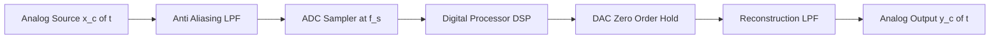
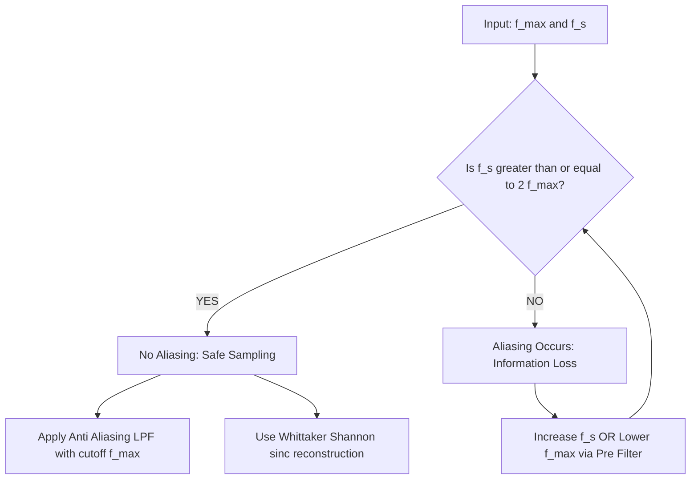
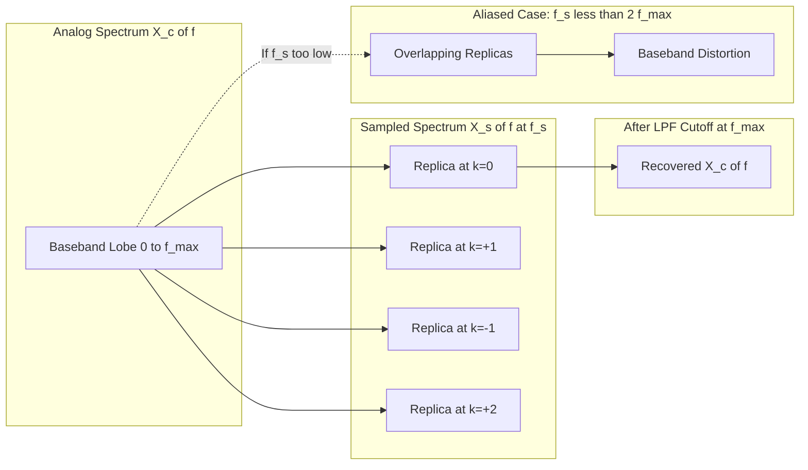
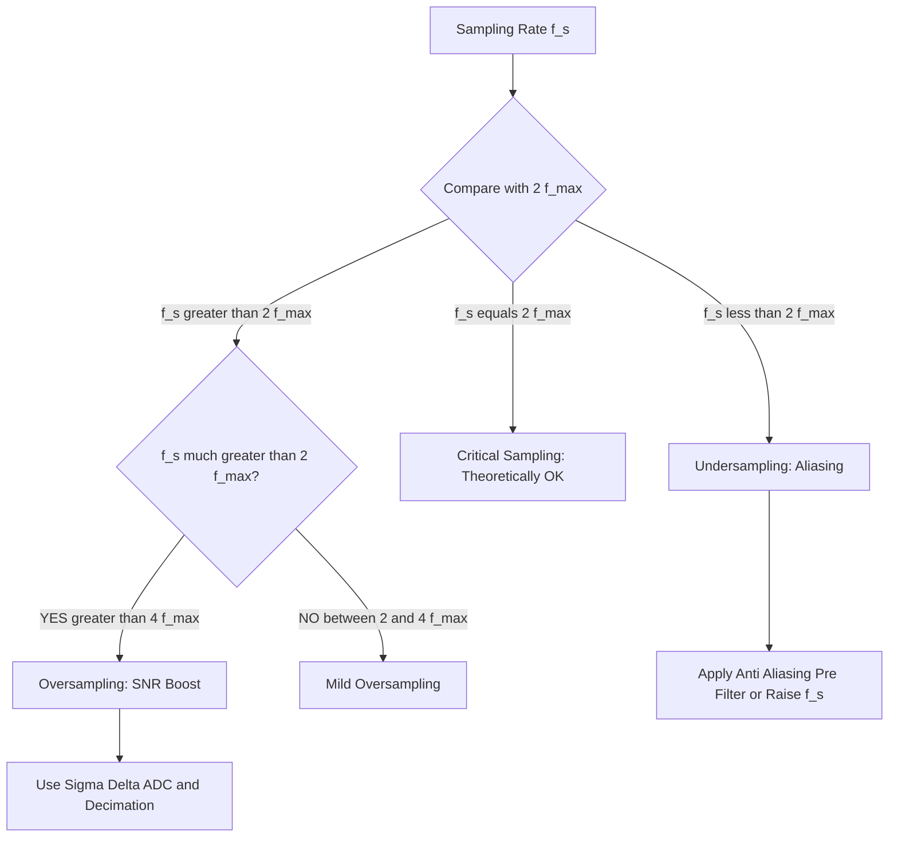
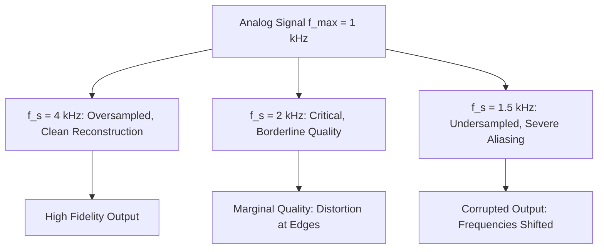
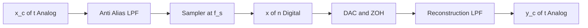

# Sampling rate

<!-- SECTION_1_START -->
# Digital Signal Processing — Module 1: Sampling Rate

## 1. Core Technical Definition & Intuitive Overview

### Formal Definition (KTU 2024 Syllabus Terminology)

> [!IMPORTANT]
> **Sampling Rate ($f_s$)** is the number of discrete samples extracted from a continuous-time (analog) signal per unit time, measured in **samples per second (Hz)** or equivalently **samples per second (S/s)**. It is the reciprocal of the sampling period $T_s$.

Mathematically expressed as:

$$f_s = \frac{1}{T_s}$$

where $T_s$ is the uniform interval between two consecutive samples.

> [!NOTE]
> The **Nyquist Rate** ($f_N$) is defined as **twice the highest frequency component** present in the band-limited analog signal: $f_N = 2 f_{max}$. To guarantee faithful reconstruction, the sampling frequency must satisfy the **Nyquist–Shannon Sampling Theorem**: $f_s \geq 2 f_{max}$.

---

### Conceptual Analogy / Intuition

Imagine a **stroboscopic camera** flashing at regular intervals to capture the motion of a spinning wheel:

- If the wheel is rotating at **10 revolutions per second**, and the camera flashes at **30 flashes per second** ($f_s = 30$ Hz, $f_{max} = 10$ Hz), you can reconstruct the motion accurately because $f_s > 2 f_{max}$.
- If the camera flashes at only **15 flashes per second** ($f_s = 15$ Hz, $f_{max} = 10$ Hz), the captured frames look ambiguous — the wheel may appear to spin forward slowly, stand still, or even spin **backward**. This visual illusion is exactly what we call **aliasing** in signal processing.
- The threshold flash rate that prevents this illusion is the **Nyquist Rate**.

So, **sampling rate = how often we "freeze" the analog world into numbers**. Too slow, and we lose information permanently. Too fast, and we waste memory and processing power.

---

> [!VISUALIZATION CONTROL]
> **Concept:** Sine Wave Sampling with Varying $f_s$
> **GeoGebra / Desmos Input Equations:**
> * `f_max = 10`
> * `signal(t) = sin(2 * pi * f_max * t)`
> * `sampled(n, fs) = signal(n / fs)` for $n = 0, 1, 2, ..., 50$
> **Visual Description:** Plot the continuous sine wave (smooth curve) and overlay sampled points for three cases — $f_s = 30$ Hz (dense sampling, perfect reconstruction), $f_s = 20$ Hz (just at Nyquist), and $f_s = 15$ Hz (undersampling → alias frequency of 5 Hz appears).

---

### Standard Constants and Metrics (Highlighted)

| Parameter | Symbol | Typical Value | Significance |
|---|---|---|---|
| Audio CD Sampling Rate | $f_s$ | **44,100 Hz** | Captures up to 22.05 kHz (human hearing limit) |
| Telephone Voice | $f_s$ | **8,000 Hz** | Captures up to 4 kHz (speech intelligibility) |
| Professional Audio (Studio) | $f_s$ | **48,000 Hz** | Broadcast and film standard |
| High-Resolution Audio | $f_s$ | **96,000 Hz / 192,000 Hz** | Audiophile and scientific instrumentation |

<!-- SECTION_1_END -->

<!-- SECTION_2_START -->
## 2. Deep Theoretical Analysis & KTU High-Yield Formula Sheet

### 2.1 The Nyquist–Shannon Sampling Theorem (Step-by-Step Logic)

> [!NOTE]
> **Statement:** A band-limited continuous-time signal $x_c(t)$ containing **no frequency components higher than $f_{max}$ Hz** can be **uniquely and completely reconstructed** from its samples $x[n] = x_c(nT_s)$ if and only if the sampling rate satisfies $f_s \geq 2 f_{max}$.

**Why the factor of 2?**
- Sampling in the time domain corresponds to **periodic replication** of the signal's spectrum in the frequency domain, with period $f_s$.
- For the spectral replicas to **not overlap** (no aliasing), they must be separated by at least $2 f_{max}$.
- Therefore, $f_s \geq 2 f_{max}$.

**How reconstruction works:**
- A **low-pass filter** (anti-imaging filter) with cutoff at $f_{max}$ is applied to the sampled spectrum to isolate the baseband replica.
- Mathematically, this is the **Whittaker–Shannon Interpolation Formula**:

$$x_c(t) = \sum_{n=-\infty}^{\infty} x[n] \cdot \text{sinc}\!\left(\frac{t - nT_s}{T_s}\right)$$

where $\text{sinc}(x) = \dfrac{\sin(\pi x)}{\pi x}$.

---

### 2.2 Sampling Rate Terminology — A Complete Classification

| Term | Symbol | Definition | Engineering Implication |
|---|---|---|---|
| Sampling Rate / Sampling Frequency | $f_s$ | Samples per second | Primary design knob in ADC/DAC |
| Sampling Period | $T_s$ | Time between samples = $1/f_s$ | Determines real-time processing deadlines |
| Nyquist Rate | $f_N$ | $2 f_{max}$ | Minimum rate to avoid aliasing |
| Nyquist Frequency | $f_s / 2$ | Half the sampling rate | Highest recoverable frequency |
| Oversampling | $f_s \gg f_N$ | Typically $f_s \geq 4 f_{max}$ | Improves SNR by $\sim$3 dB per octave |
| Undersampling | $f_s < f_N$ | Insufficient samples | Causes **aliasing** and information loss |
| Critical Sampling | $f_s = 2 f_{max}$ | Exactly at Nyquist | Theoretically OK, practically risky |
| Bandpass Sampling | $f_s < 2 f_{max}$ | Used for bandpass signals | Requires careful band placement |

---

### 2.3 Aliasing — The "Mirror Image" Distortion

> [!IMPORTANT]
> **Aliasing** is the phenomenon where high-frequency components of a signal, when sampled at an insufficient rate, appear as **false lower-frequency components** in the reconstructed signal. The aliased frequency is computed as:

$$f_{alias} = \left\vert f_{in} - k f_s \right\vert$$

where $k$ is the integer that brings $f_{alias}$ into the range $[0, f_s/2]$.

**Example:** A 7 kHz tone sampled at $f_s = 4$ kHz.
- $k = 2$: $f_{alias} = \vert 7 - 2(4) \vert = 1$ kHz. The original 7 kHz tone **appears as a 1 kHz tone**.

---

### 2.4 Anti-Aliasing Filter

Before sampling, the analog signal must be passed through a **low-pass anti-aliasing filter** with:
- **Passband:** $0$ to $f_{max}$
- **Stopband:** Starting at $f_s - f_{max}$
- **Roll-off requirement:** At least $f_s/2$ attenuation before $f_s/2$

> [!NOTE]
> The **transition band** of the anti-aliasing filter must lie entirely within the guard band between $f_{max}$ and $f_s/2$. Higher $f_s$ allows a more relaxed filter design.

---

### 2.5 Real-World Engineering Utility

| Field | Sampling Rate Used | Why |
|---|---|---|
| **Audio Engineering (CD)** | 44.1 kHz | Captures full 20 Hz – 20 kHz human audio range |
| **Telecommunications (4G/5G)** | Up to 30.72 MHz | LTE standard for wideband voice + data |
| **Medical Imaging (MRI)** | ~200 kHz – 1 MHz | High-resolution k-space acquisition |
| **Radar / Software Defined Radio** | MHz to GHz range | Direct RF digitization at carrier frequencies |
| **Biomedical (ECG)** | 250 Hz – 1 kHz | Heart signal bandwidth is ~150 Hz |
| **Industrial Vibration Monitoring** | 10 kHz – 100 kHz | Bearing and gearbox fault frequencies |

---

### 2.6 KTU High-Yield Formula Cheat Sheet

| # | Formula | Description | Units |
|---|---|---|---|
| 1 | $f_s = 1 / T_s$ | Sampling rate from sampling period | Hz |
| 2 | $f_N = 2 f_{max}$ | Nyquist rate | Hz |
| 3 | $f_{alias} = \left\vert f_{in} - k f_s \right\vert$ | Aliased frequency for input $f_{in}$ | Hz |
| 4 | $\Delta f = f_s - 2 f_{max}$ | Guard band (anti-alias filter margin) | Hz |
| 5 | $SNR_{dB} \approx 6.02 N + 1.76$ | Quantization SNR (N-bit ADC) | dB |
| 6 | $SNR_{oversampling} = 6.02 N + 1.76 + 10 \log_{10}(OSR)$ | SNR gain with oversampling | dB |
| 7 | $\text{OSR} = f_s / (2 f_{max})$ | Oversampling Ratio | Dimensionless |
| 8 | $x[n] = x_c(nT_s)$ | Discrete sample from continuous signal | — |
| 9 | $x_c(t) = \sum x[n] \cdot \text{sinc}((t - nT_s)/T_s)$ | Ideal reconstruction (Whittaker–Shannon) | — |
| 10 | $X_s(f) = f_s \sum X_c(f - k f_s)$ | Spectral replication under sampling | — |

> [!IMPORTANT]
> **Memory constraint** for storing $N$ samples: $\text{Storage (bytes)} = N \times \text{bits per sample} / 8$. Doubling $f_s$ doubles storage and throughput requirements.

<!-- SECTION_2_END -->

<!-- SECTION_3_START -->
## 3. Step-by-Step Derivations & Code/Symbolic Implementation

### 3.1 Derivation: Why $f_s \geq 2 f_{max}$ is Required

**Step 1 — Define the sampling operation.**

Sampling is mathematically equivalent to multiplying the continuous signal $x_c(t)$ by an **impulse train**:

$$s(t) = \sum_{n=-\infty}^{\infty} \delta(t - nT_s)$$

The sampled signal is:

$$x_s(t) = x_c(t) \cdot s(t) = \sum_{n=-\infty}^{\infty} x_c(nT_s) \cdot \delta(t - nT_s)$$

**Step 2 — Apply the Fourier Transform.**

Using the modulation property ($\mathcal{F}\{x_c(t) \cdot s(t)\} = X_c(f) * S(f)$), and knowing the impulse train's Fourier series is another impulse train:

$$S(f) = \frac{1}{T_s} \sum_{k=-\infty}^{\infty} \delta(f - k f_s)$$

Therefore:

$$X_s(f) = \frac{1}{T_s} \sum_{k=-\infty}^{\infty} X_c(f - k f_s)$$

**Step 3 — Interpret the result.**

The spectrum of $x_c(t)$ is **replicated** at every integer multiple of $f_s$, each scaled by $1/T_s$. For non-overlapping replicas:

$$f_s - f_{max} \geq f_{max} \quad \Rightarrow \quad f_s \geq 2 f_{max}$$

If $f_s < 2 f_{max}$, the replicas overlap → **aliasing occurs** and the original spectrum cannot be recovered.

---

### 3.2 Derivation: Aliased Frequency Calculation

Given an input sinusoid $x_c(t) = A \cos(2\pi f_{in} t + \phi)$ sampled at $f_s$:

**Step 1.** The sampled signal is $x[n] = A \cos(2\pi f_{in} n T_s + \phi)$.

**Step 2.** We seek an equivalent frequency $f_{alias} \in [0, f_s/2]$ such that:

$$2\pi f_{in} T_s = 2\pi f_{alias} T_s + 2\pi k \quad \text{(mod } 2\pi\text{)}$$

**Step 3.** Solving for $f_{alias}$:

$$f_{alias} = \left\vert f_{in} - k f_s \right\vert, \quad k = \text{round}(f_{in} / f_s)$$

This gives the **principal alias** in the baseband.

---

### 3.3 Worked Numerical Examples

#### Example 1 — Nyquist Rate Computation

A musician's voice contains frequencies up to **4 kHz**. Find the minimum sampling rate to digitize it without aliasing.

**Solution:**

Given $f_{max} = 4 \text{ kHz}$. Apply the Nyquist theorem:

$$f_s^{\min} = 2 f_{max} = 2 \times 4 \text{ kHz} = 8 \text{ kHz}$$

**Result:** Minimum sampling rate = **8 kHz**. Practically, engineers choose 8 kHz (telephony) or 16 kHz (wideband voice).

---

#### Example 2 — Aliasing Detection

A signal contains a pure tone at **25 kHz**. It is sampled at $f_s = 16$ kHz. Determine the aliased frequency.

**Solution:**

Step 1 — Compute $k$:
$$k = \text{round}(f_{in} / f_s) = \text{round}(25 / 16) = \text{round}(1.5625) = 2$$

Step 2 — Apply alias formula:
$$f_{alias} = \left\vert 25 - 2 \times 16 \right\vert = \left\vert 25 - 32 \right\vert = 7 \text{ kHz}$$

**Result:** A 25 kHz tone **appears as a 7 kHz tone** after sampling at 16 kHz.

---

#### Example 3 — Sampling Period and Storage

A 3-minute song is sampled at $f_s = 44.1$ kHz with 16-bit samples. Compute (a) the sampling period and (b) the total storage in MB.

**Solution:**

(a) Sampling period:
$$T_s = \frac{1}{f_s} = \frac{1}{44100} \approx 22.676 \text{ }\mu\text{s}$$

(b) Total samples:
$$N = f_s \times \text{Duration} = 44100 \times 180 = 7,938,000 \text{ samples}$$

Total bits:
$$N \times 16 = 127,008,000 \text{ bits} = 15,876,000 \text{ bytes} \approx 15.14 \text{ MB}$$

**Result:** $T_s \approx 22.68$ $\mu$s and total storage $\approx$ **15.14 MB** (matches a standard 3-minute CD-quality audio track).

---

### 3.4 Python Implementation — Complete Sampling Toolkit

```python
import numpy as np
import matplotlib.pyplot as plt
from typing import Tuple

# ---------- 1. Compute Nyquist Rate ----------
def nyquist_rate(f_max: float) -> float:
    """
    Returns the minimum sampling rate to avoid aliasing
    for a signal whose highest frequency is f_max (Hz).
    """
    if f_max <= 0:
        raise ValueError("[ERROR] f_max must be a positive number (Hz).")
    return 2.0 * f_max


# ---------- 2. Compute Aliased Frequency ----------
def aliased_frequency(f_in: float, f_s: float) -> float:
    """
    Returns the alias of f_in (Hz) when sampled at f_s (Hz).
    Uses absolute value of (f_in - k*f_s) with k = round(f_in / f_s).
    """
    if f_s <= 0:
        raise ValueError("[ERROR] Sampling rate f_s must be positive (Hz).")
    k = round(f_in / f_s)
    f_alias = abs(f_in - k * f_s)
    # Fold into [0, f_s/2]
    if f_alias > f_s / 2:
        f_alias = f_s - f_alias
    return f_alias


# ---------- 3. Sampling Simulator ----------
def sample_signal(f_max: float, f_s: float,
                  duration: float = 0.05) -> Tuple[np.ndarray, np.ndarray, np.ndarray]:
    """
    Generates a band-limited signal (sum of 3 tones) and samples it.
    Returns (t_cont, x_cont, x_sampled, n_indices, n_samples).
    """
    if f_s < 2 * f_max:
        print(f"[WARNING] f_s={f_s} Hz is BELOW Nyquist rate "
              f"({2*f_max} Hz). Aliasing will occur.")

    fs_dense = 1000 * f_max                 # very dense time grid for plotting
    t_cont = np.linspace(0, duration, int(fs_dense * duration), endpoint=False)
    # Signal = sum of 3 sinusoids
    x_cont = (np.sin(2*np.pi*1.0*f_max*t_cont)
            + 0.7*np.sin(2*np.pi*2.0*f_max*t_cont)
            + 0.4*np.sin(2*np.pi*3.5*f_max*t_cont))

    n_samples = int(f_s * duration)
    n_indices = np.arange(n_samples)
    t_sampled = n_indices / f_s
    x_sampled = (np.sin(2*np.pi*1.0*f_max*t_sampled)
              + 0.7*np.sin(2*np.pi*2.0*f_max*t_sampled)
              + 0.4*np.sin(2*np.pi*3.5*f_max*t_sampled))
    return t_cont, x_cont, t_sampled, x_sampled


# ---------- 4. Demonstration ----------
if __name__ == "__main__":
    f_max = 100.0          # Hz - highest signal frequency
    f_s_list = [250.0, 200.0, 150.0]   # above, at, below Nyquist

    print("=" * 60)
    print(f"f_max = {f_max} Hz | Nyquist Rate = {nyquist_rate(f_max)} Hz")
    print("=" * 60)
    for f_s in f_s_list:
        t_c, x_c, t_s, x_s = sample_signal(f_max, f_s)
        print(f"f_s = {f_s:6.1f} Hz | Samples = {len(x_s):4d} | "
              f"Status = {'OK' if f_s >= 2*f_max else 'ALIASED'}")
    print("=" * 60)

    # --- Alias demo for a pure 25 kHz tone at 16 kHz sampling ---
    f_in, f_s = 25000.0, 16000.0
    print(f"\nALIAS DEMO: f_in = {f_in} Hz sampled at f_s = {f_s} Hz")
    print(f"   Aliased frequency  = {aliased_frequency(f_in, f_s):.1f} Hz")
```

**Expected Output (sample):**
```
============================================================
f_max = 100.0 Hz | Nyquist Rate = 200.0 Hz
============================================================
f_s =  250.0 Hz | Samples =   12 | Status = OK
f_s =  200.0 Hz | Samples =   10 | Status = OK
f_s =  150.0 Hz | Samples =    7 | Status = ALIASED
============================================================

ALIAS DEMO: f_in = 25000.0 Hz sampled at f_s = 16000.0 Hz
   Aliased frequency  = 7000.0 Hz
```

---

### 3.5 Edge Cases and Error Logging (Defensive Engineering)

| Scenario | Validation | Error Message |
|---|---|---|
| $f_{max} \leq 0$ | Reject | `[ERROR] f_max must be a positive number (Hz).` |
| $f_s \leq 0$ | Reject | `[ERROR] Sampling rate f_s must be positive (Hz).` |
| $f_s < 2 f_{max}$ | Warn (not reject) | `[WARNING] Below Nyquist — aliasing will occur.` |
| $f_{in}$ outside physical range | Clamp | Fold to baseband $[0, f_s/2]$ |
| Very high $f_s$ (memory overflow) | Soft-warn | `[WARNING] Sample count exceeds 1e7 — memory risk.` |

<!-- SECTION_3_END -->

<!-- SECTION_4_START -->
## 4. Structural Diagrams & Schematics

### 4.1 Complete Sampling and Reconstruction Pipeline (Top-Level)



**Reading guide:** The analog signal is first **low-pass filtered** to remove out-of-band noise, then **sampled** by the ADC, processed digitally, and **reconstructed** through a DAC and smoothing filter.

---

### 4.2 Sampling Theorem Decision Tree



---

### 4.3 Spectral Replications and Aliasing Visualization (Block Topology)



---

### 4.4 Sampling Rate Classification Map



---

### 4.5 Sampling Rate vs. Reconstruction Quality — Sequential Topology



<!-- SECTION_4_END -->

<!-- SECTION_5_START -->
## 5. KTU 2024 Scheme Examination Question Bank & Topic Recap

### Part A — Short Answer Questions (3 Marks Each)

#### Question A1 `[KTU University Exam — July 2023]`
**State the Nyquist–Shannon sampling theorem. Define the Nyquist rate.**

**Model Answer (Valuation Key):**
- **Theorem statement:** A band-limited continuous-time signal $x_c(t)$ with maximum frequency $f_{max}$ Hz can be uniquely reconstructed from its samples if $f_s \geq 2 f_{max}$. **[2 Marks]**
- **Nyquist rate definition:** $f_N = 2 f_{max}$ Hz — the minimum sampling rate to avoid aliasing. **[1 Mark]**

---

#### Question A2 `[KTU University Exam — Dec 2023]`
**What is aliasing? How can it be prevented?**

**Model Answer (Valuation Key):**
- **Aliasing definition:** The phenomenon where high-frequency components appear as false lower-frequency components due to insufficient sampling. **[1.5 Marks]**
- **Prevention:** (i) Sample at or above Nyquist rate $f_s \geq 2 f_{max}$. (ii) Use a low-pass anti-aliasing filter before sampling. **[1.5 Marks]**

---

### Part B — Long Answer Questions (14 Marks Each, Module Internal Choice)

> [!IMPORTANT]
> Following KTU ESE pattern, students answer **ONE** of two alternatives. Each alternative carries sub-parts (a) 7 marks and (b) 7 marks.

---

#### Question B-A `[KTU University Exam — July 2024]` — (14 Marks, CO1, Apply/Analyze)

**(a)** A band-limited signal has maximum frequency $f_{max} = 5$ kHz.
- (i) Determine the Nyquist rate.
- (ii) Calculate the sampling period.
- (iii) If the signal is sampled at $f_s = 7$ kHz, what happens? Justify. **[7 Marks]**

**(b)** A 22 kHz audio tone is sampled at $f_s = 16$ kHz. Find the aliased frequency observed after sampling. Explain with a neat diagram. **[7 Marks]**

**Model Solution:**

**(a)(i) Nyquist Rate:**
$$f_N = 2 f_{max} = 2 \times 5 = 10 \text{ kHz}$$
**[Formula + substitution: 1 Mark | Result: 1 Mark]**

**(a)(ii) Sampling Period (at Nyquist rate):**
$$T_s = 1 / f_N = 1 / 10000 = 0.1 \text{ ms} = 100 \text{ }\mu\text{s}$$
**[Formula: 1 Mark | Result: 1 Mark]**

**(a)(iii) Sampling at 7 kHz:**
Since $f_s = 7 \text{ kHz} < f_N = 10 \text{ kHz}$, the condition $f_s \geq 2 f_{max}$ is **violated**. Therefore **aliasing will occur** and the original signal cannot be reconstructed faithfully. The spectral replicas in the frequency domain will overlap. **[Justification: 3 Marks]**

**(b) Aliased Frequency Calculation:**

Given $f_{in} = 22$ kHz, $f_s = 16$ kHz.

Step 1: Find $k$:
$$k = \text{round}(22 / 16) = \text{round}(1.375) = 1$$

Step 2: Compute alias:
$$f_{alias} = \left\vert 22 - 1 \times 16 \right\vert = 6 \text{ kHz}$$

Step 3: Verify range: $f_{alias} = 6 \text{ kHz} \leq f_s/2 = 8 \text{ kHz}$ ✓

**[Calculation: 3 Marks | Final result: 1 Mark]**

Step 4: Spectral diagram description:
> A 22 kHz tone at $f_s = 16$ kHz has its spectral image at $\left\vert 22 - 16 \right\vert = 6$ kHz in the baseband. After low-pass filtering during reconstruction, the original 22 kHz tone appears as 6 kHz.
**[Diagram description: 3 Marks]**

---

#### Question B-B `[KTU University Exam — Dec 2022]` — (14 Marks, CO1, Understand/Apply)

**(a)** With a neat block diagram, explain the process of sampling and reconstruction of a band-limited analog signal. State the Nyquist criterion. **[7 Marks]**

**(b)** An audio signal has frequencies from 50 Hz to 8 kHz.
- (i) Find the minimum sampling rate to avoid aliasing.
- (ii) If we sample at 12 kHz, what are the resulting sampled signal spectrum images? Show the spectral diagram.
- (iii) If a 9.5 kHz interference tone is present before sampling, what alias frequency will corrupt the baseband? **[7 Marks]**

**Model Solution:**

**(a) Block Diagram & Nyquist Criterion (7 Marks):**



**Nyquist Criterion:** $f_s \geq 2 f_{max}$, where $f_{max}$ is the highest frequency component in $x_c(t)$.

**[Block diagram: 3 Marks | Explanation: 2 Marks | Nyquist criterion: 2 Marks]**

**(b)(i) Minimum Sampling Rate:**
$$f_s^{\min} = 2 \times 8 \text{ kHz} = 16 \text{ kHz}$$
**[Formula + Result: 2 Marks]**

**(b)(ii) Spectral Images at $f_s = 12$ kHz (undersampled):**
- Baseband: 50 Hz – 8 kHz
- Image at $f_s = 12$ kHz: 12.05 kHz – 20 kHz
- Image at $2 f_s = 24$ kHz: 24.05 kHz – 32 kHz
- Image at $-f_s = -12$ kHz (mirrored): folded into 4 kHz – 11.95 kHz ← **overlaps baseband → aliasing**
- Image at $-2 f_s$: similar overlaps

The images centered at $\pm f_s, \pm 2 f_s, \ldots$ all fold back into the baseband, causing spectral corruption.

**[Description: 3 Marks]**

**(b)(iii) Alias of 9.5 kHz Interference at $f_s = 12$ kHz:**
$$k = \text{round}(9.5 / 12) = \text{round}(0.79) = 1$$
$$f_{alias} = \left\vert 9.5 - 1 \times 12 \right\vert = 2.5 \text{ kHz}$$

The 9.5 kHz interference will appear as **2.5 kHz** in the baseband.
**[Formula: 1 Mark | Result: 1 Mark]**

---

> [!WARNING]
> **KTU Examiner's Valuation Warning — Common Pitfalls:**
> 1. **Forgetting the factor of 2:** Many students write $f_s = f_{max}$ instead of $f_s = 2 f_{max}$. Always remember the Nyquist rate is **twice** the max frequency.
> 2. **Confusing Nyquist Rate ($2 f_{max}$) with Nyquist Frequency ($f_s/2$):** These are different! Nyquist rate is a property of the **signal**; Nyquist frequency is a property of the **sampling system**.
> 3. **Skipping units:** Always state Hz, kHz, or MHz explicitly in the final answer.
> 4. **No anti-aliasing filter mentioned:** In Part B questions, if the question discusses practical sampling, always mention the role of the **anti-aliasing LPF** for full marks.
> 5. **Forgetting the round() function in alias calculation:** Use $k = \text{round}(f_{in}/f_s)$, not floor or ceiling.
> 6. **Not drawing the spectrum block diagram:** For 14-mark questions, a spectral replica diagram is **mandatory** for full valuation marks.

---

### Topic Recap & Important Things to Remember

- **Sampling rate** $f_s$ = number of samples per second = $1/T_s$, measured in **Hz**.
- **Nyquist Rate** $f_N = 2 f_{max}$ is the **minimum** rate to avoid aliasing for a band-limited signal.
- **Nyquist Frequency** = $f_s/2$ is the **highest recoverable** frequency component.
- **Aliasing Formula:** $f_{alias} = \left\vert f_{in} - k f_s \right\vert$ with $k = \text{round}(f_{in}/f_s)$; result must lie in $[0, f_s/2]$.
- **Spectral replication** under sampling: $X_s(f) = \dfrac{1}{T_s} \sum_k X_c(f - k f_s)$. Replicas must **not overlap** → $f_s \geq 2 f_{max}$.
- **Anti-aliasing filter** is a low-pass filter with cutoff $f_{max}$, placed **before** the sampler.
- **Oversampling** ($f_s \gg 2 f_{max}$) improves quantization SNR by $10 \log_{10}(\text{OSR})$ dB and relaxes analog filter design.
- **Undersampling** ($f_s < 2 f_{max}$) **permanently destroys** information — there is no DSP-only fix; raise $f_s$ or pre-filter.
- **Whittaker–Shannon Reconstruction:** $x_c(t) = \sum x[n] \cdot \text{sinc}((t - nT_s)/T_s)$ — the ideal (theoretical) interpolator.
- **Standard sampling rates:** 8 kHz (telephony), 44.1 kHz (CD audio), 48 kHz (studio), 96/192 kHz (Hi-Res audio), MHz–GHz (SDR, radar, medical imaging).
- **Doubling $f_s$ doubles** memory, processing load, and ADC throughput requirements.
- **Aliasing is irreversible** once it has happened in the digital domain — prevention is the only cure.
- Always include **units (Hz, kHz, s, ms, $\mu$s)** in KTU exam answers for full marks.
<!-- SECTION_5_END -->
