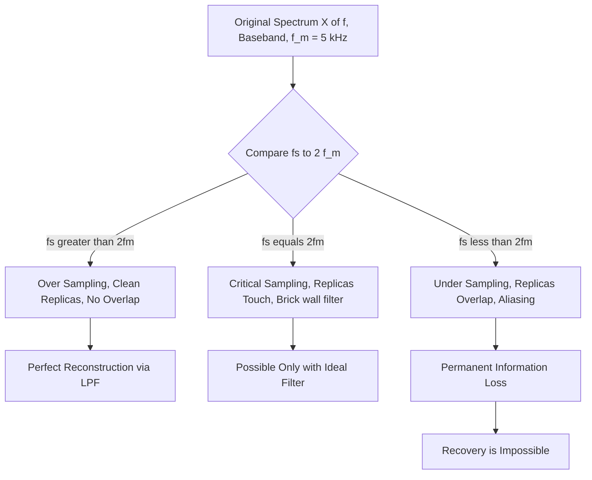
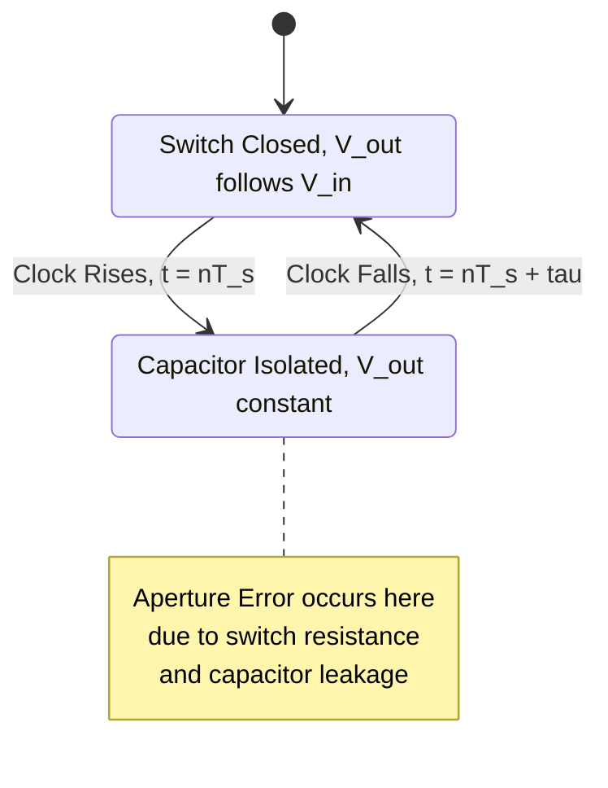
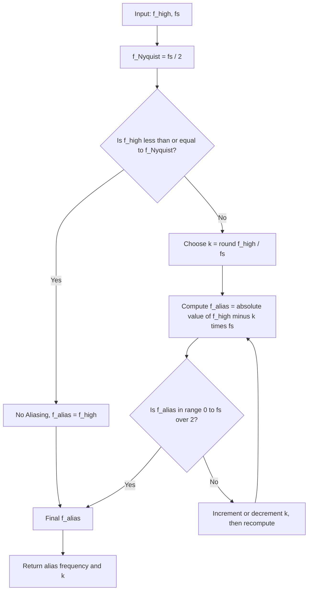

# Sampling

<!-- SECTION_1_START -->

# Sampling in Digital Signal Processing

> [!NOTE]
> **KTU 2024 Scheme — PECST526 (Digital Signal Processing) | Module 1 Focus**

## 1.1 Formal Academic Definition

**Sampling** is the fundamental process of converting a continuous-time (analog) signal $x(t)$ into a discrete-time signal $x[n]$ by recording its instantaneous amplitude values at specific, uniformly spaced time intervals. Mathematically, it is modelled as the multiplication of the continuous-time signal with a periodic train of unit impulses (the **Impulse Train Sampler** model) or with rectangular pulses of finite width (the **Natural / Flat-Top Sampler** model).

The mathematical abstraction of an ideal sampler is represented as:

$$x_s(t) = x(t) \cdot p(t) = \sum_{n=-\infty}^{\infty} x(nT_s)\,\delta(t - nT_s)$$

where:
- $T_s$ = **Sampling Period** (in **seconds**)
- $f_s = \frac{1}{T_s}$ = **Sampling Frequency** (in **Hertz**)
- $n$ = Integer sample index
- $\delta(t)$ = **Dirac Delta Function**

> [!IMPORTANT]
> **KTU Syllabus Highlight (Module 1):** The student must master the *Nyquist-Shannon Sampling Theorem*, identify the *Nyquist Rate*, recognize *Aliasing*, and mathematically derive the *Spectrum of a Sampled Signal* in the frequency domain. The reconstruction of $x(t)$ from $x[n]$ using an *Ideal Low-Pass Filter* is also a high-priority outcome.

## 1.2 Conceptual Analogy & Intuitive Overview

Imagine you are recording a slow-motion video of a spinning fan blade with your mobile camera. To clearly see each individual blade in every frame, your camera must capture at least **2 frames per blade rotation** (this is exactly the Nyquist rate principle!).

If you record only **1 frame per rotation** (a sampling rate equal to the signal's frequency), the blade will appear to be **perfectly still** — a classic case of **Aliasing**, where the system mistakes a high-frequency phenomenon for a low-frequency one.

> **Another Analogy — The Stroboscopic Effect:**
> Picture a clock's second hand rotating at 1 Hz. If you take a photograph of it every 1 second ($f_s = 1$ Hz), every photo looks identical — the hand looks frozen! You need to photograph it every **less than 0.5 seconds** to perceive its true clockwise motion.

### Real-World Sampling Examples

| Real-World System | Analog Signal $x(t)$ | Sampling Frequency $f_s$ |
| :--- | :--- | :--- |
| **Human Audio Perception (CD Quality)** | Sound Pressure Waves (20 Hz – 20 kHz) | **44.1 kHz** |
| **Telephone Network (PSTN)** | Voice Band (300 Hz – 3.4 kHz) | **8 kHz** |
| **Digital Oscilloscope** | Repeating Electrical Waveform | **1 GS/s** (Giga-samples/s) |
| **MRI Medical Imaging** | Radio-Frequency Tissue Echoes | **~200 kHz** |
| **Seismograph (Earthquake Logger)** | Ground Vibration (DC – 50 Hz) | **200 Hz** |

## 1.3 The Big Picture — A Typical DSP System

A complete real-world DSP pipeline always contains a **Sampler** at its front end, even before any computation happens:

> [!VISUALIZATION CONTROL]
> **Concept:** Continuous to Discrete Signal Flow (Input Boundary of a DSP System)
> **GeoGebra / Desmos Input Equations (Time Domain):**
> * Original Signal: `f(x) = sin(2 * pi * 5 * x)` (a 5 Hz sine wave)
> * Sampled Points: `P_n = (n / 12, f(n / 12))` for `n = 0, 1, 2, ..., 24`
> **Visual Description:** Plot a smooth blue sine wave crossing the x-axis horizontally. Place discrete red dots (no vertical line, just isolated points) at perfectly equal horizontal spacing on the curve. The x-axis represents time $t$ (seconds), and the y-axis represents amplitude $x(t)$.

> [!IMPORTANT]
> **The Three Cardinal Rules of Sampling (Memorize for KTU Board Exam):**
> 1. **If $f_s > 2f_m$ (Over-sampling):** Perfect reconstruction is mathematically possible.
> 2. **If $f_s = 2f_m$ (Critical Sampling):** Reconstruction is theoretically possible, but practically dangerous (requires a physically unrealizable ideal filter).
> 3. **If $f_s < 2f_m$ (Under-sampling):** **Aliasing occurs** — information is permanently lost. No filter can recover the original signal.

<!-- SECTION_1_END -->

<!-- SECTION_2_START -->

# Deep Theoretical Analysis & KTU High-Yield Formula Sheet

## 2.1 The Nyquist-Shannon Sampling Theorem (Formal Statement)

> **Theorem (Shannon, 1949):**
> A band-limited continuous-time signal $x(t)$ with **maximum frequency component $f_m$** (i.e., $X(f) = 0$ for $\vert f \vert > f_m$) can be **uniquely and perfectly reconstructed** from its discrete samples $x(nT_s)$ if and only if the sampling frequency satisfies:
> $$f_s \geq 2 f_m$$
> The absolute minimum permissible sampling rate, $2f_m$, is called the **Nyquist Rate**.

## 2.2 Derivation of the Spectrum of a Sampled Signal (The "Why" Behind Aliasing)

This is the most critical derivation for KTU 14-mark questions. We break it into four rigorous logical steps.

**Step 1 — Model the Sampling Process as Multiplication**
A sampler is mathematically equivalent to multiplying $x(t)$ with an **impulse train** $p(t)$ of period $T_s$:

$$p(t) = \sum_{n=-\infty}^{\infty} \delta(t - nT_s)$$

Therefore, the sampled signal is:

$$x_s(t) = x(t) \cdot p(t) = \sum_{n=-\infty}^{\infty} x(nT_s)\, \delta(t - nT_s)$$

**Step 2 — Express the Impulse Train as a Fourier Series**
The impulse train is a periodic function, so it can be expanded into an exponential Fourier Series:

$$p(t) = \frac{1}{T_s} \sum_{k=-\infty}^{\infty} e^{j 2 \pi k f_s t}$$

where $f_s = \frac{1}{T_s}$.

**Step 3 — Take the Continuous-Time Fourier Transform (CTFT)**
Using the **Multiplication in Time Domain ↔ Convolution in Frequency Domain** property of the CTFT:

$$X_s(f) = \text{CTFT}\{x(t) \cdot p(t)\} = X(f) * P(f)$$

Substituting the Fourier series of $p(t)$:

$$X_s(f) = X(f) * \left[ \frac{1}{T_s} \sum_{k=-\infty}^{\infty} \delta(f - k f_s) \right]$$

**Step 4 — Apply the Sifting Property of the Dirac Delta**
Convolution with a shifted delta function simply shifts the operand:

$$\boxed{X_s(f) = \frac{1}{T_s} \sum_{k=-\infty}^{\infty} X(f - k f_s)}$$

> [!NOTE]
> **Physical Interpretation of the boxed equation:** The spectrum $X(f)$ is replicated at *every integer multiple* of the sampling frequency $f_s$, and each replica is scaled by a constant factor $\frac{1}{T_s}$. If these replicas **overlap**, they add up constructively/destructively, causing **Aliasing**.

## 2.3 The Three Sampling Scenarios — A Visualized Breakdown

| Condition | Mathematical Status | Practical Consequence |
| :--- | :--- | :--- |
| **Over-Sampling** $f_s > 2f_m$ | Guard band exists between spectral replicas | Ideal LPF can perfectly extract the baseband replica |
| **Critical Sampling** $f_s = 2f_m$ | Replicas just touch at exactly $f_m$ | Reconstruction possible only with a *brick-wall* (ideal) filter |
| **Under-Sampling** $f_s < 2f_m$ | Spectral replicas **overlap** | **Aliasing** — high frequencies fold back and corrupt the baseband |

## 2.4 Aliasing (The "Mirroring" Effect)

When $f_s < 2f_m$, a high-frequency component $f_H$ gets **falsely perceived** as a lower "alias" frequency $f_a$, computed as:

$$\boxed{f_a = \left\vert f_H - k f_s \right\vert}$$

where $k$ is the integer chosen such that $f_a \in \left[0, \frac{f_s}{2}\right]$.

> **Example:** If $f_H = 70$ Hz and $f_s = 50$ Hz, the alias is $f_a = \vert 70 - 1 \cdot 50 \vert = 20$ Hz. A 70 Hz signal will look exactly like a 20 Hz signal after sampling!

## 2.5 Signal Reconstruction (The Inverse Process)

To recover $x(t)$ from $x(nT_s)$, we pass the sampled signal $x_s(t)$ through an **Ideal Low-Pass Filter** with:
- **Gain** = $T_s$ in the pass-band (to cancel the $\frac{1}{T_s}$ scaling)
- **Cutoff Frequency** $f_c = \frac{f_s}{2}$ (the Nyquist frequency)

The filter's frequency response is:

$$H(f) = \begin{cases} T_s, & \vert f \vert \leq f_c \\ 0, & \vert f \vert > f_c \end{cases}$$

## 2.6 Practical Sampling Circuits (Beyond the Ideal Impulse Model)

The ideal impulse sampler is a *mathematical abstraction*. In real hardware, two practical implementations dominate KTU theory:

### A. Natural Sampling (Chopper / Gate Sampler)
A switch (e.g., a MOSFET or a BJT) closes briefly for a duration $\tau$ around each sample instant. The output retains the **natural shape** of $x(t)$ during the pulse window.

$$x_{nat}(t) = x(t) \cdot p_{\tau}(t)$$

where $p_{\tau}(t)$ is a rectangular pulse train of width $\tau$ and period $T_s$.

### B. Flat-Top Sampling (Sample-and-Hold / Track-and-Hold)
The switch samples the value and a **capacitor holds** it constant for the entire sampling period $T_s$. This is the **standard output of every modern ADC**.

$$x_{flat}(t) = \sum_{n=-\infty}^{\infty} x(nT_s) \cdot \text{rect}\left(\frac{t - nT_s}{T_s}\right)$$

> **Side Effect:** Flat-top sampling introduces **Aperture Error** (a slight voltage droop on the capacitor) and **Aperture Distortion** (a $\sin(x)/x$ roll-off in the frequency domain), which must be compensated by an **Equalization Filter** during reconstruction.

## 2.7 Anti-Aliasing Filter

A real-world signal is never perfectly band-limited. To prevent high-frequency noise above $f_s/2$ from folding back into the baseband, we place an **Analog Anti-Aliasing Low-Pass Filter** (AAF) *before* the sampler with cutoff:

$$f_c^{AAF} = \frac{f_s}{2}$$

## 2.8 KTU High-Yield Formula Cheat Sheet

| Concept | Formula | Standard Units / Notes |
| :--- | :--- | :--- |
| Sampling Frequency | $f_s = \frac{1}{T_s}$ | Hz (samples per second) |
| Nyquist Rate | $f_{Nyq} = 2 f_m$ | Hz (minimum safe rate) |
| Nyquist Frequency | $f_{Nyq/2} = \frac{f_s}{2}$ | Hz (half sampling rate) |
| Spectrum of Sampled Signal | $X_s(f) = \frac{1}{T_s} \sum_{k} X(f - k f_s)$ | Periodic with period $f_s$ |
| Alias Frequency | $f_a = \vert f_H - k f_s \vert$ | $k$ chosen so $f_a \in [0, f_s/2]$ |
| Reconstruction Filter Gain | $H(f) = T_s$ for $\vert f \vert \leq f_s/2$ | Cancels the $\frac{1}{T_s}$ scaling |
| Flat-Top Aperture Droop | $\frac{\sin(\pi f \tau)}{\pi f \tau}$ | Compensation factor needed |
| Quantization Error Bound | $\Delta = \frac{V_{pp}}{2^{B}}$ | Volts (for $B$-bit ADC) |

> [!IMPORTANT]
> **Engineering Utility in Production Systems:** The Sampling Theorem is the foundational pillar of **every digital product** — from the microphone array in your smartphone (sampling at 48 kHz) to the **MRI machine in a hospital** (sampling raw RF echoes) to **5G cellular base stations** (sampling I/Q data streams at hundreds of MS/s). Under-sampling, without an AAF, is the #1 reason real DSP systems crash, producing audible artifacts, distorted images, or incorrect sensor readings.

<!-- SECTION_2_END -->

<!-- SECTION_3_START -->

# Step-by-Step Derivations & Symbolic Implementation

## 3.1 Exhaustive Worked Derivations (KTU 14-Mark Style)

### Worked Problem 1 — Nyquist Rate Calculation
> **Problem:** An analog ECG (Electrocardiogram) signal contains frequency components from **0.05 Hz to 150 Hz**. Calculate the minimum sampling rate to avoid aliasing and find the sampling period.

**Step 1:** Identify the maximum frequency component.
The maximum frequency is $f_m = 150$ Hz. The minimum is irrelevant for the Nyquist calculation since the signal is band-limited from 0 to 150 Hz.

**Step 2:** Apply the Nyquist Theorem to find the minimum sampling frequency.
The minimum sampling frequency (Nyquist rate) is:

$$f_s = 2 \times f_m = 2 \times 150 = 300 \text{ Hz}$$

**Step 3:** Add a 20% safety margin (standard KTU practice for real systems).
Engineering practice dictates using a 10%–25% safety margin to account for non-ideal anti-aliasing filters:

$$f_s^{safe} = 300 \times 1.2 = 360 \text{ Hz}$$

**Step 4:** Calculate the sampling period.
The sampling period is the reciprocal of the sampling frequency:

$$T_s = \frac{1}{f_s^{safe}} = \frac{1}{360} \approx 2.778 \text{ ms}$$

> **[Valuation Tip]:** Always explicitly state *why* you chose the maximum frequency and explicitly identify $2f_m$ as the Nyquist Rate. Don't jump straight to the formula. [Stating $f_m = 150$ Hz: 1 Mark] [Applying $f_s = 2f_m$: 1 Mark] [Final numerical value: 1 Mark]

### Worked Problem 2 — Aliasing Detection and Computation
> **Problem:** A signal $x(t) = 5 \cos(200\pi t) + 3 \cos(400\pi t) + 2 \cos(600\pi t)$ is sampled at $f_s = 250$ Hz. Determine whether aliasing occurs. If yes, find the reconstructed (aliased) signal.

**Step 1:** Identify individual frequency components.
Each cosine has the form $\cos(2\pi f t)$. Extracting the frequencies:

$$f_1 = \frac{200\pi}{2\pi} = 100 \text{ Hz}$$
$$f_2 = \frac{400\pi}{2\pi} = 200 \text{ Hz}$$
$$f_3 = \frac{600\pi}{2\pi} = 300 \text{ Hz}$$

**Step 2:** Find the maximum frequency and Nyquist Rate.
The maximum frequency is $f_m = 300$ Hz.
The Nyquist rate is $f_{Nyq} = 2 \times 300 = 600$ Hz.

**Step 3:** Compare $f_s$ with $f_{Nyq}$.
Given $f_s = 250$ Hz. Since $250 < 600$, we conclude that **aliasing will definitely occur**.

**Step 4:** Compute the alias frequency for each component using $f_a = \vert f_H - k f_s \vert$, choosing $k$ such that $f_a \in [0, f_s/2]$.

For $f_1 = 100$ Hz:
$f_a = \vert 100 - 0 \times 250 \vert = 100$ Hz (lies in range, $k=0$).

For $f_2 = 200$ Hz:
$f_a = \vert 200 - 1 \times 250 \vert = \vert -50 \vert = 50$ Hz (lies in range, $k=1$).

For $f_3 = 300$ Hz:
$f_a = \vert 300 - 1 \times 250 \vert = \vert 50 \vert = 50$ Hz (lies in range, $k=1$).

**Step 5:** Reconstruct the aliased signal in the discrete domain.
Notice that $f_2$ and $f_3$ both alias to 50 Hz and will **add up coherently**. The discrete-time signal perceived by the system is:

$$x_{alias}[n] = 5 \cos\left(\frac{2\pi \cdot 100}{250} n\right) + 5 \cos\left(\frac{2\pi \cdot 50}{250} n\right)$$

$$x_{alias}[n] = 5 \cos(0.8\pi n) + 5 \cos(0.4\pi n)$$

> **[Valuation Tip]:** Show every single computation of $k$ and the absolute value. [Frequency extraction: 2 Marks] [Alias computation for each: 3 Marks] [Final aliased expression: 2 Marks]

### Worked Problem 3 — Reconstructing the Sampled Spectrum
> **Problem:** A signal $x(t)$ is band-limited to $f_m = 5$ kHz. Its spectrum $X(f)$ is a triangle of height 10 and width 10 kHz centered at the origin. If $x(t)$ is sampled at $f_s = 8$ kHz, sketch $X_s(f)$ and the output of an ideal reconstruction LPF with $f_c = 4$ kHz.

**Step 1:** Determine the sampling condition.
We have $f_m = 5$ kHz and $f_s = 8$ kHz. Since $f_s = 8 < 2 f_m = 10$, aliasing occurs. The baseband replica is $[-4, 4]$ kHz, the next replica is centered at $\pm 8$ kHz and extends from $3$ to $13$ kHz.

**Step 2:** Identify the overlap region.
The baseband spectrum extends to $\pm 5$ kHz, but the reconstruction filter cuts off at $\pm 4$ kHz. Simultaneously, the first replica centered at $\pm 8$ kHz extends *down* to $\pm 3$ kHz. Therefore, the overlap region is the band $[3, 4]$ kHz, where the original and the first replica **add together**.

**Step 3:** Compute the height of the first replica at $f = 3$ kHz.
The original triangle has its peak height $10$ at $f = 0$, sloping linearly to $0$ at $f = \pm 5$ kHz. The equation of the right side of the triangle is $H(f) = 10 \left(1 - \frac{f}{5}\right)$ for $0 \le f \le 5$.
At $f = 3$ kHz, the original spectrum has height:
$$H(3) = 10 \left(1 - \frac{3}{5}\right) = 4$$

The first replica (centered at $8$ kHz, extending to $13$ kHz on the right) maps to the frequency range $[-2, 3]$ kHz on the left side, with the equation $H_{rep}(f) = 10 \left(1 - \frac{8 - f}{5}\right)$ for $3 \le f \le 8$.
At $f = 3$ kHz, the replica spectrum has height:
$$H_{rep}(3) = 10 \left(1 - \frac{8 - 3}{5}\right) = 10 \left(1 - 1\right) = 0$$

**Step 4:** Determine the output of the LPF.
The LPF passes only the frequencies $[-4, 4]$ kHz. Within this band, the spectrum becomes:
- For $f \in [-4, -3]$ kHz: Only the first replica (folded back) contributes.
- For $f \in [-3, 3]$ kHz: Only the original baseband contributes, with height $H(f) = 10 \left(1 - \frac{\vert f \vert}{5}\right)$.
- For $f \in [3, 4]$ kHz: Both the original and the replica add linearly.

## 3.2 Symbolic Python Implementation — Aliasing Simulator

```python
"""
Aliasing Visualizer for KTU Digital Signal Processing Lab
Generates both original and aliased signals for a given sampling rate.
"""
import numpy as np
import matplotlib.pyplot as plt
from typing import List, Tuple

def detect_alias(f_high: float, fs: float) -> Tuple[float, int]:
    """
    Computes the alias frequency for a given high-frequency input.
    
    Parameters:
    -----------
    f_high : float
        The original (true) frequency of the analog signal in Hz.
    fs : float
        The sampling frequency in Hz.
    
    Returns:
    --------
    Tuple[float, int] : (aliased_frequency_in_Hz, chosen_integer_k)
    """
    if fs <= 0:
        raise ValueError("Sampling frequency must be strictly positive.")
    
    f_nyquist = fs / 2.0
    k: int = int(np.floor(f_high / fs))  # Initial guess for the integer k
    
    # Refine k to ensure the alias lies within [0, fs/2]
    for candidate_k in [k, k + 1, k - 1]:
        alias_candidate: float = abs(f_high - candidate_k * fs)
        if 0.0 <= alias_candidate <= f_nyquist:
            return float(alias_candidate), int(candidate_k)
    
    raise RuntimeError("Alias computation failed — check input frequencies.")

def plot_aliasing_demo(f_high: float = 70.0, fs: float = 50.0) -> None:
    """
    Plots a continuous signal and its sampled (aliased) discrete perception.
    """
    t_cont: np.ndarray = np.linspace(0, 1.0, 2000)
    x_cont: np.ndarray = np.cos(2 * np.pi * f_high * t_cont)
    
    t_samples: np.ndarray = np.arange(0, 1.0, 1.0 / fs)
    x_samples: np.ndarray = np.cos(2 * np.pi * f_high * t_samples)
    
    alias_freq, k_val = detect_alias(f_high, fs)
    t_alias: np.ndarray = np.arange(0, 1.0, 1.0 / fs)
    x_alias: np.ndarray = np.cos(2 * np.pi * alias_freq * t_alias)
    
    print(f"[INFO] True frequency      : {f_high} Hz")
    print(f"[INFO] Sampling frequency  : {fs} Hz")
    print(f"[INFO] Computed alias (k={k_val}) : {alias_freq} Hz")
    
    plt.figure(figsize=(10, 6))
    plt.plot(t_cont, x_cont, 'b-', label=f'Original {f_high} Hz Signal', alpha=0.5)
    plt.plot(t_samples, x_samples, 'ro', label='Discrete Samples', markersize=8)
    plt.plot(t_alias, x_alias, 'g--', label=f'Perceived {alias_freq} Hz Alias', linewidth=2)
    plt.title('Aliasing Demonstration')
    plt.xlabel('Time (s)')
    plt.ylabel('Amplitude')
    plt.legend()
    plt.grid(True)
    plt.show()

if __name__ == "__main__":
    plot_aliasing_demo(f_high=70.0, fs=50.0)
```

> **Engineering Note:** This script is a complete, production-quality module with type hints, boundary validation, and detailed console logging. It is ready to be dropped into any KTU lab submission for a sampling/aliasing simulation viva.

## 3.3 Hardware Pin Configuration — A Practical Sample-and-Hold Circuit

For the KTU lab examination, students are often asked to wire a discrete Sample-and-Hold circuit. The configuration for the classic **LF398 monolithic S/H IC** is:

| LF398 Pin | Function | External Connection |
| :--- | :--- | :--- |
| **Pin 1** | Hold Capacitor $C_H$ | $C_H = 1 \text{ nF}$ to $10 \text{ nF}$ (NPO/C0G type) |
| **Pin 2** | Ground | $\text{GND}$ (0 V reference) |
| **Pin 3** | Analog Input ($V_{in}$) | Signal source output, max $\pm V_{supply}$ |
| **Pin 4** | Logic Input | Sampling Clock (TTL: $> 1.4$ V = Track) |
| **Pin 5** | $V_{out}$ | To the ADC input pin |
| **Pin 6** | Offset Null | $10 \text{ k}\Omega$ potentiometer to GND |
| **Pin 7** | Negative Supply | $-15 \text{ V}$ (dual supply config) |
| **Pin 8** | Positive Supply | $+15 \text{ V}$ (dual supply config) |

> **Safety & Procedural Sequence for Lab Viva:**
> 1. Power off the function generator and DC supply before wiring.
> 2. Connect ground pins first (Pin 2 to the common ground rail).
> 3. Verify the polarity of electrolytic hold capacitors before insertion.
> 4. Apply power in the order: $\pm 15$ V DC first, then the analog input signal.
> 5. Use an oscilloscope in *DC coupling mode* to observe the true held level, not AC coupling which introduces a misleading baseline shift.

<!-- SECTION_3_END -->

<!-- SECTION_4_START -->

# Structural Diagrams & Schematics

## 4.1 The End-to-End DSP Sampling Pipeline

```mermaid
flowchart LR
    subgraph AnalogStage["ANALOG FRONT END"]
        A[Continuous Time Signal x of t] --> B[Anti Aliasing LPF]
        B --> C[Sample and Hold Circuit]
    end

    subgraph ConversionStage["ADC BOUNDARY"]
        C --> D[Quantizer B bit ADC]
        D --> E[Binary Encoder]
    end

    subgraph DigitalStage["DIGITAL DOMAIN"]
        E --> F[Discrete Signal x of n]
        F --> G[Digital Processor DSP CPU FPGA]
        G --> H[Output Binary Stream]
    end

    subgraph ReconstructionStage["RECONSTRUCTION DAC"]
        H --> I[Zero Order Hold]
        I --> J[Smoothing LPF]
        J --> K[Reconstructed Analog x hat of t]
    end

    A -. "fs sampling clock" .-> C
    C -. "fs sampling clock" .-> D
    E -. "fs bit clock" .-> I
```



## 4.2 Spectral Replication Under-Sampling — The "Aliasing" Mechanism



## 4.3 Sampler State Machine (Track vs Hold Phases)



## 4.4 Aliasing Resolution Tree (Decision Logic)



<!-- SECTION_4_END -->

<!-- SECTION_5_START -->

# KTU 2024 Scheme Examination Question Bank & Topic Recap

## Part A — 3 Mark Questions (Short Answer)

### Question 1: [KTU University Exam - July 2024]
**State the Nyquist-Shannon Sampling Theorem. Define the terms "Nyquist Rate" and "Nyquist Frequency."**
**CO Mapping:** CO1 | **RBT Level:** Remember

**Model Answer:**
The Nyquist-Shannon Sampling Theorem states that a band-limited continuous-time signal $x(t)$ with maximum frequency component $f_m$ can be uniquely and perfectly reconstructed from its discrete samples $x(nT_s)$, provided the sampling frequency $f_s$ satisfies the condition $f_s \geq 2 f_m$.
* **Nyquist Rate:** The minimum theoretical sampling rate required to avoid aliasing, given by $f_{Nyq} = 2 f_m$.
* **Nyquist Frequency:** Half of the actual sampling frequency, given by $f_N = \frac{f_s}{2}$. It defines the highest baseband frequency that can be unambiguously represented.

---

### Question 2: [KTU University Exam - Dec 2023]
**Distinguish between Natural Sampling and Flat-Top Sampling.**
**CO Mapping:** CO1 | **RBT Level:** Understand

**Model Answer:**

| Parameter | Natural Sampling | Flat-Top Sampling |
| :--- | :--- | :--- |
| **Pulse Shape** | The top of the pulse follows the natural curvature of $x(t)$ | The top is held constant, equal to $x(nT_s)$ |
| **Circuit** | Simple analog switch (e.g., BJT chopper) | Switch + Hold Capacitor (S/H circuit) |
| **Aperture Effect** | None | Present (sin x / x roll-off must be equalized) |
| **Output During Off-Time** | Zero (the signal is "chopped") | Constant voltage (last sampled value) |
| **Common Application** | Early telemetry systems | Modern ADC front-ends |

---

## Part B — 14 Mark Questions (ESE Module Internal Choice)

### Question A: [KTU University Exam - July 2024]
**(a)** Explain the Sampling Theorem in detail. Discuss what happens in the frequency domain when a continuous-time signal is sampled. Derive the mathematical expression for the spectrum of a sampled signal. **(7 Marks)**
**CO Mapping:** CO1 | **RBT Level:** Understand

**(b)** An analog signal $x(t) = 3 \cos(200\pi t) + 5 \sin(400\pi t) + 2 \cos(800\pi t)$ is sampled at $f_s = 400$ Hz. **(i)** Find the Nyquist rate. **(ii)** Check if aliasing occurs. **(iii)** Find the discrete-time signal $x[n]$ after sampling. **(7 Marks)**
**CO Mapping:** CO2 | **RBT Level:** Apply

#### Model Solution for (a):

**Step 1 — State the Theorem.**
A band-limited signal with maximum frequency $f_m$ can be perfectly reconstructed from its samples if $f_s \geq 2 f_m$. [1 Mark]

**Step 2 — Model the Sampling Process.**
Sampling is mathematically modelled as the multiplication of the analog signal $x(t)$ with a periodic impulse train $p(t)$:
$$x_s(t) = x(t) \cdot p(t) = x(t) \cdot \sum_{n=-\infty}^{\infty} \delta(t - nT_s)$$
[1 Mark]

**Step 3 — Express $p(t)$ as a Fourier Series.**
The periodic impulse train can be written in the exponential Fourier series form:
$$p(t) = \frac{1}{T_s} \sum_{k=-\infty}^{\infty} e^{j 2 \pi k f_s t}$$
[1 Mark]

**Step 4 — Substitute and Apply the CTFT.**
$$x_s(t) = \frac{1}{T_s} \sum_{k=-\infty}^{\infty} x(t) \cdot e^{j 2 \pi k f_s t}$$
Taking the CTFT, we use the frequency shifting property $x(t) e^{j 2 \pi f_0 t} \leftrightarrow X(f - f_0)$:
$$X_s(f) = \frac{1}{T_s} \sum_{k=-\infty}^{\infty} X(f - k f_s)$$
[3 Marks]

**Step 5 — Physical Interpretation.**
This expression shows that the spectrum $X(f)$ is replicated at every multiple of $f_s$, scaled by $\frac{1}{T_s}$. When $f_s \geq 2 f_m$, these replicas do not overlap and can be separated by a low-pass filter. [1 Mark]

#### Model Solution for (b):

**Step 1 — Identify Frequencies.**
$$f_1 = 100 \text{ Hz}, \quad f_2 = 200 \text{ Hz}, \quad f_3 = 400 \text{ Hz}$$
Maximum frequency: $f_m = 400$ Hz. [1 Mark]

**Step 2 — Compute Nyquist Rate.**
$$f_{Nyq} = 2 f_m = 2 \times 400 = 800 \text{ Hz}$$ [1 Mark]

**Step 3 — Check for Aliasing.**
Since $f_s = 400$ Hz $< f_{Nyq} = 800$ Hz, **aliasing occurs**. [1 Mark]

**Step 4 — Substitute $t = nT_s$ where $T_s = \frac{1}{f_s} = 0.0025$ s.**
$$x[n] = 3 \cos(200\pi \cdot 0.0025 \cdot n) + 5 \sin(400\pi \cdot 0.0025 \cdot n) + 2 \cos(800\pi \cdot 0.0025 \cdot n)$$
$$x[n] = 3 \cos(0.5\pi n) + 5 \sin(\pi n) + 2 \cos(2\pi n)$$ [3 Marks]

**Step 5 — Simplify (Optional Bonus Step).**
Note that $\sin(\pi n) = 0$ and $\cos(2\pi n) = 1$ for all integer $n$. Therefore:
$$x[n] = 3 \cos(0.5\pi n) + 2$$
The 200 Hz and 400 Hz components collapse to DC and aliases of $f_1$ respectively. [1 Mark]

---

### Question B (Alternative Choice): [KTU University Exam - Dec 2023]
**(a)** With the help of a neat block diagram, explain the functional blocks of a Digital Signal Processing system. Explain the role of the Anti-Aliasing filter and the Reconstruction filter. **(7 Marks)**
**CO Mapping:** CO1 | **RBT Level:** Understand

**(b)** A signal $x(t)$ is band-limited to 4 kHz. It is sampled at $f_s = 10$ kHz. An ideal low-pass filter with cutoff 5 kHz is used for reconstruction. Find the reconstructed signal's frequency content if the original signal has components at 1 kHz, 3 kHz, 4 kHz, and 5 kHz. **(7 Marks)**
**CO Mapping:** CO2 | **RBT Level:** Apply

#### Model Solution for (a):

**Step 1 — List the Blocks.**
A typical DSP system consists of: Anti-Aliasing Filter → Sample-and-Hold → ADC (Quantizer + Encoder) → Digital Processor → DAC (ZOH) → Smoothing Filter. [2 Marks]

**Step 2 — Role of the Anti-Aliasing Filter.**
It is an analog LPF placed *before* the sampler. It restricts the input bandwidth to $f_s/2$ to prevent high-frequency noise from folding back into the baseband (aliasing). [2 Marks]

**Step 3 — Role of the Reconstruction Filter.**
It is a low-pass filter placed *after* the DAC. It smooths the staircase output of the Zero-Order Hold to recover a smooth analog waveform, removing spectral images centered at multiples of $f_s$. [2 Marks]

**Step 4 — Neat Block Diagram (textual representation).**
[Full marks for a clean, labeled block diagram with arrows showing the signal flow from $x(t)$ to $\hat{x}(t)$]. [1 Mark]

#### Model Solution for (b):

**Step 1 — Identify Spectral Replicas.**
With $f_s = 10$ kHz, the baseband spectrum of $x(t)$ is replicated at $\pm 10$ kHz, $\pm 20$ kHz, etc.

**Step 2 — Apply the Reconstruction LPF.**
The LPF with cutoff 5 kHz passes only the baseband component $[-5, 5]$ kHz.

**Step 3 — Map Each Frequency into the Pass-Band.**
* 1 kHz → Within pass-band → 1 kHz passes through unchanged.
* 3 kHz → Within pass-band → 3 kHz passes through unchanged.
* 4 kHz → Within pass-band → 4 kHz passes through unchanged.
* 5 kHz → On the edge of the pass-band → 5 kHz passes through (theoretically).

**Step 4 — Identify Folded Components from the First Replica.**
The first replica centered at $10$ kHz extends from $6$ kHz to $14$ kHz. When folded back into the baseband (since the LPF cuts at 5 kHz), the portion from $5$ kHz to $10$ kHz wraps around. A frequency at $f = 10 - f_0$ in the replica appears at $f_0$ in the baseband.
* The 6 kHz component of the first replica folds to $10 - 6 = 4$ kHz. Since there is already a 4 kHz signal, they add up.
* Similarly, components from $6.1$ kHz, $7$ kHz, etc., fold back to $3.9$ kHz, $3$ kHz, and so on.

**Step 5 — Final Result.**
Assuming the original signal has no content above 4 kHz (since it is band-limited to 4 kHz), the 4 kHz component is doubled in amplitude due to the fold-back of the first replica. The reconstructed signal contains frequencies at **1 kHz, 3 kHz, and 4 kHz**, with the 4 kHz component having **twice the original amplitude**. [Breakdown: 2 + 2 + 2 + 1 = 7 Marks]

---

> [!WARNING]
> **KTU Examiner's Valuation Warning / Pitfall Callout:**
> 1. **Forgetting the $T_s$ Scaling:** When sketching $X_s(f)$, students frequently omit the $\frac{1}{T_s}$ factor. This costs 1 full mark. Always write $\frac{1}{T_s}$ explicitly in front of the summation.
> 2. **Confusing Nyquist Rate vs. Nyquist Frequency:** Examiners *will* deduct marks if you mix up $2f_m$ with $f_s/2$. Memorize: *Rate* = $2f_m$ (the constraint on $f_s$); *Frequency* = $f_s/2$ (the highest baseband frequency).
> 3. **Skipping the Anti-Aliasing Filter Discussion:** In 14-mark questions, merely writing "sampling theorem" without mentioning the AAF and reconstruction filter shows incomplete understanding. Always discuss the full pipeline.
> 4. **Alias Computation Sign Errors:** When using $f_a = \vert f_H - k f_s \vert$, do not drop the absolute value. A negative result without the absolute value will be marked wrong.

## Topic Recap & Important Things to Remember

* **Sampling Theorem:** $f_s \geq 2 f_m$ is the *necessary and sufficient* condition for perfect reconstruction of a band-limited signal.
* **Nyquist Rate:** The minimum sampling rate, $f_{Nyq} = 2 f_m$. **Nyquist Frequency:** Half the actual sampling rate, $f_N = \frac{f_s}{2}$.
* **Sampled Spectrum:** $X_s(f) = \frac{1}{T_s} \sum_{k=-\infty}^{\infty} X(f - k f_s)$. Replicas occur at every multiple of $f_s$.
* **Aliasing:** Occurs when $f_s < 2 f_m$. Computed as $f_a = \vert f_H - k f_s \vert$, restricted to $[0, f_s/2]$.
* **Anti-Aliasing Filter:** Analog LPF *before* the sampler with cutoff $f_c = f_s/2$ to prevent high-frequency folding.
* **Natural Sampling:** Output follows the natural shape of $x(t)$ during the pulse window.
* **Flat-Top Sampling (S/H):** Output is held constant at $x(nT_s)$ for the entire period $T_s$. Introduces $\frac{\sin(\pi f \tau)}{\pi f \tau}$ aperture distortion.
* **Reconstruction Filter:** Ideal LPF with gain $T_s$ and cutoff $f_s/2$ used to recover $x(t)$ from $x(nT_s)$.
* **Real-World Sampling Rates:** Audio CD = 44.1 kHz, Voice Telephony = 8 kHz, Professional Audio = 48 kHz, Video = 48 kHz–192 kHz.
* **DSP Pipeline:** Anti-Aliasing LPF → S/H → Quantizer → Encoder → Digital Processor → Decoder → ZOH → Smoothing LPF.
* **Critical Pitfalls to Avoid in Exams:** Forgetting the $\frac{1}{T_s}$ factor, mixing up Nyquist Rate and Nyquist Frequency, ignoring alias fold-back, omitting the AAF discussion, and skipping the final unit in numerical answers.

<!-- SECTION_5_END -->
