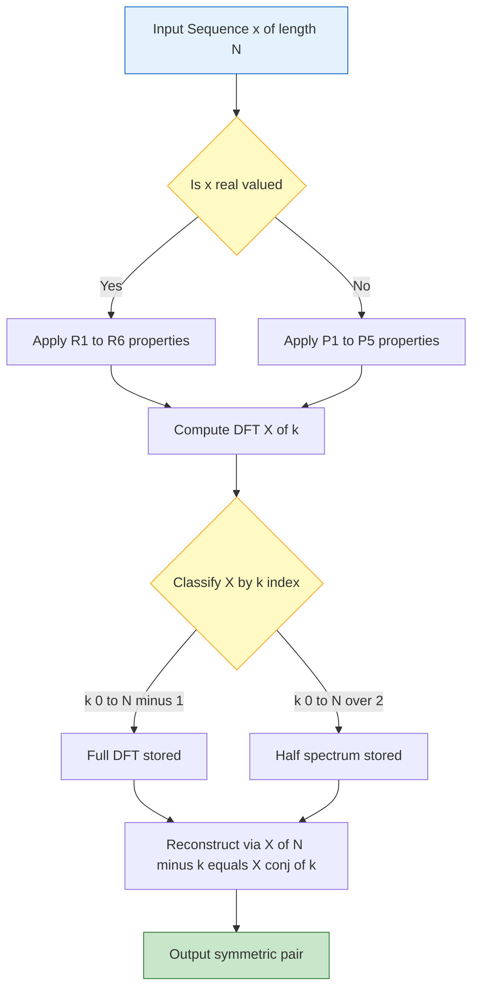
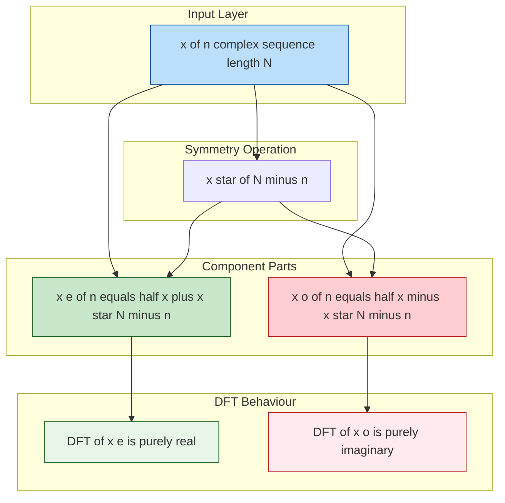
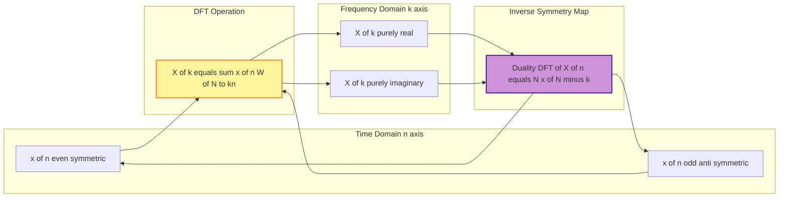
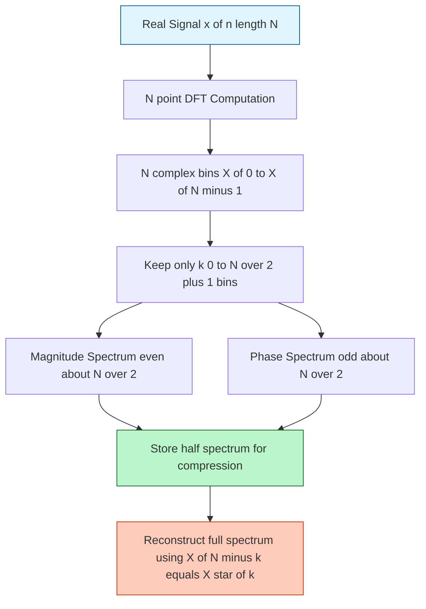

# Symmetries in the DFT

<!-- SECTION_1_START -->

# Symmetries in the DFT — Core Definition & Intuitive Overview

> [!IMPORTANT]
> **KTU 2024 Scheme | PECST526 — Digital Signal Processing | Module 1**
> *Syllabus Anchor:* Properties of DFT — Symmetry properties, Duality, Circular convolution, Linear convolution via DFT.

## 1.1 Formal Definition

The **Discrete Fourier Transform (DFT)** of a finite-duration sequence $x(n)$ of length $N$ is defined as:

$$
X(k) = \sum_{n=0}^{N-1} x(n) \, e^{-j 2 \pi k n / N}, \quad k = 0, 1, \dots, N-1
$$

The **Inverse DFT (IDFT)** is:

$$
x(n) = \frac{1}{N} \sum_{k=0}^{N-1} X(k) \, e^{j 2 \pi k n / N}, \quad n = 0, 1, \dots, N-1
$$

A symmetry in the DFT is a structural relationship between samples of $X(k)$ (or $x(n)$) that allows us to deduce the value at one index from the value at another — drastically reducing the number of independent computations.

> [!NOTE]
> **Why it matters in KTU exams:** Symmetry properties are tested via short 3-mark definitions *and* full 14-mark derivations. They are also the gateway to designing the **radix-2 FFT**, which exploits the $X(k) = X^*(N-k)$ symmetry of real signals to halve the computational load.

## 1.2 Conceptual Analogy — The "Mirror in a Pond" Intuition

Imagine standing on the edge of a perfectly still pond. The image of a tree on the opposite bank appears as a *mirror reflection* — symmetric in distance from the waterline, but its colors are inverted. Now imagine throwing a stone: the ripples on the right side look exactly like a time-reversed version of the ripples on the left, but their heights (amplitudes) are mirror-matched and their peaks/troughs (phase) are inverted.

The DFT behaves identically:

- **Magnitude** $|X(k)|$ behaves like the *ripple height* — it is mirrored across $N/2$ (an **even function**).
- **Phase** $\angle X(k)$ behaves like the *timing of the ripple* — it flips sign across $N/2$ (an **odd function**).

> [!TIP]
> **Exam Intuition:** For any **real** signal, the DFT has *only $N/2 + 1$ unique complex values*. The rest are mirror copies. This is why audio/image compression algorithms (MP3, JPEG) operate on the lower half of the spectrum and reconstruct the upper half via symmetry.

## 1.3 The Four Canonical Signal Classes

Every sequence $x(n)$ can be classified by its behavior under the operation $\text{conjugate-and-fold}$, denoted $x^*(N-n)$:

| Symbol | Class Name | Defining Relation | Geometric Nature |
| :---: | :--- | :--- | :--- |
| $x_e(n)$ | **Conjugate-Symmetric (Even)** | $x_e(n) = x_e^*(N-n)$ | Mirror image, no phase flip |
| $x_o(n)$ | **Conjugate-Anti-symmetric (Odd)** | $x_o(n) = -x_o^*(N-n)$ | Mirror image with sign flip |
| $X_R(k)$ | Real part of $X(k)$ | $X_R(k) = X_R(N-k)$ | Even sequence |
| $X_I(k)$ | Imag part of $X(k)$ | $X_I(k) = -X_I(N-k)$ | Odd sequence |

> [!IMPORTANT]
> **Bold Constants to Memorize:**
> - $N$ — number of points (always **positive integer**).
> - $j = \sqrt{-1}$ — imaginary unit.
> - $W_N = e^{-j 2\pi / N}$ — *twiddle factor*, the **Nth root of unity** used throughout DFT symmetry proofs.

## 1.4 GeoGebra / Desmos Visualization

> [!VISUALIZATION CONTROL]
> **Concept:** Plot $|X(k)|$ (even) and $\angle X(k)$ (odd) of a real signal $x(n) = \{1, 2, 3, 4\}$, $N = 4$.
>
> **Desmos Input Points (paste into Desmos):**
> - `(0,5) , (1,3.414) , (2,1) , (3,3.414)` — magnitude $|X(k)|$ (symmetric about $k=2$)
> - `(0,0) , (1,-0.785) , (2,0) , (3,0.785)` — phase $\angle X(k)$ (antisymmetric)
>
> **Visual Description:** On the horizontal axis plot $k = 0, 1, 2, 3$. The magnitude plot will form a perfect "U" shape mirrored about $k = N/2 = 2$. The phase plot will pass through the origin and be an *odd* function — flipping sign on either side of $k = 2$. The two plots together constitute the symmetry signature of a real-valued DFT.

---

<!-- SECTION_1_END -->

<!-- SECTION_2_START -->

# Deep Theoretical Analysis & KTU High-Yield Formula Sheet

## 2.1 Decomposition Theorem — The Foundation of All Symmetry

**Theorem:** *Any complex sequence $x(n)$ can be uniquely expressed as the sum of a conjugate-symmetric part and a conjugate-anti-symmetric part.*

$$
x(n) = x_e(n) + x_o(n)
$$

where:

$$
x_e(n) = \frac{1}{2}\bigl[x(n) + x^*(N-n)\bigr]
$$

$$
x_o(n) = \frac{1}{2}\bigl[x(n) - x^*(N-n)\bigr]
$$

> [!NOTE]
> **Why this works:** Add the two equations: $x_e(n) + x_o(n) = x(n)$. Substitute $n \to N-n$ and take the conjugate: the even part is invariant under this operation, the odd part flips sign. This guarantees uniqueness.

## 2.2 Symmetry Properties — Complete Catalogue

Let $X(k) = X_R(k) + j\,X_I(k) = \vert X(k) \vert \, e^{j \angle X(k)}$ denote the DFT of $x(n)$.

### Property Group A — Symmetry of the DFT Itself (Always True)

| Property | Mathematical Statement |
| :--- | :--- |
| $P_1$ — Real part is even | $X_R(k) = X_R(N-k)$ |
| $P_2$ — Imaginary part is odd | $X_I(k) = -X_I(N-k)$ |
| $P_3$ — Magnitude is even | $\vert X(k) \vert = \vert X(N-k) \vert$ |
| $P_4$ — Phase is odd | $\angle X(k) = -\angle X(N-k)$ |
| $P_5$ — Conjugate symmetry | $X(k) = X^*(N-k)$ |

### Property Group B — When $x(n)$ is Real

| Property | Mathematical Statement | Engineering Meaning |
| :--- | :--- | :--- |
| $R_1$ | $X(k) = X^*(N-k)$ | Spectrum is conjugate symmetric |
| $R_2$ | $X_R(k) = X_R(N-k)$ | Real part is even |
| $R_3$ | $X_I(k) = -X_I(N-k)$ | Imag part is odd |
| $R_4$ | $\vert X(k) \vert = \vert X(N-k) \vert$ | Magnitude spectrum is even |
| $R_5$ | $\angle X(k) = -\angle X(N-k)$ | Phase spectrum is odd |
| $R_6$ | $X(0)$ and $X(N/2)$ are real | DC and Nyquist bins are purely real for even $N$ |

### Property Group C — When $x(n)$ is Purely Imaginary ($x(n) = j\,y(n)$ with $y$ real)

| Property | Statement |
| :--- | :--- |
| $I_1$ | $X(k) = -X^*(N-k)$ |
| $I_2$ | $X_R(k) = -X_R(N-k)$ (odd) |
| $I_3$ | $X_I(k) = X_I(N-k)$ (even) |

### Property Group D — DFT of Symmetric/Antisymmetric Sequences

| Input $x(n)$ | DFT $X(k)$ | Nature of $X(k)$ |
| :--- | :--- | :--- |
| Conjugate-symmetric $x_e(n)$ | $X(k)$ | **Purely real** |
| Conjugate-anti-symmetric $x_o(n)$ | $X(k)$ | **Purely imaginary** |
| Real and even $x(n) = x(N-n)$ | $X(k)$ | **Real and even** |
| Real and odd $x(n) = -x(N-n)$ | $X(k)$ | **Imaginary and odd** |

## 2.3 The Duality Property (The Mirror of Symmetry)

**Statement:** If $X(k) = \text{DFT}\{x(n)\}$, then

$$
\text{DFT}\{X(n)\} = N\, x(-k \bmod N) = N\, x(N-k)
$$

> [!IMPORTANT]
> **KTU High-Yield Trick:** Duality tells us the DFT of a *time-domain symmetric* sequence is a *frequency-domain symmetric* sequence and vice-versa. This is heavily tested in Module 1.

## 2.4 KTU Formula Sheet / Cheat Sheet

| # | Formula | Condition | Units / Domain |
| :---: | :--- | :--- | :--- |
| 1 | $X(k) = \sum_{n=0}^{N-1} x(n) W_N^{kn}$ | Definition, $W_N = e^{-j2\pi/N}$ | Complex |
| 2 | $x_e(n) = \tfrac{1}{2}[x(n) + x^*(N-n)]$ | General decomposition | Complex |
| 3 | $x_o(n) = \tfrac{1}{2}[x(n) - x^*(N-n)]$ | General decomposition | Complex |
| 4 | $X_R(k) = X_R(N-k)$ | Always true | Real |
| 5 | $X_I(k) = -X_I(N-k)$ | Always true | Real |
| 6 | $X(k) = X^*(N-k)$ | $x(n)$ is real | Complex |
| 7 | $\vert X(k) \vert = \vert X(N-k) \vert$ | $x(n)$ is real | Non-negative real |
| 8 | $\angle X(k) = -\angle X(N-k)$ | $x(n)$ is real | Radians |
| 9 | $\text{DFT}\{X(n)\} = N\,x(N-k)$ | Duality | Complex |
| 10 | $X(0) = \sum x(n)$ (real) | $x(n)$ real | Real |
| 11 | $X(N/2) = \sum (-1)^n x(n)$ (real) | $x(n)$ real, $N$ even | Real |
| 12 | $\sum_{k=0}^{N-1} \vert X(k) \vert^2 = N \sum_{n=0}^{N-1} \vert x(n) \vert^2$ | Parseval's (companion to symmetry) | Energy |

## 2.5 Real-World Engineering Utility

| Domain | Application of DFT Symmetry |
| :--- | :--- |
| **Audio Coding (MP3, AAC)** | Only $N/2 + 1$ unique bins stored; upper half reconstructed via $X(N-k) = X^*(k)$. |
| **OFDM (Wi-Fi, 4G/5G)** | Subcarriers conjugate-symmetrically paired to generate real-valued time-domain signals (Hermitian symmetry in IFFT input). |
| **MRI / Medical Imaging** | *k-space* is conjugate-symmetric; half the data is acquired, the rest is filled by symmetry (Partial Fourier methods). |
| **FFT Algorithms** | Radix-2 decimation-in-time/time exploits $X(k)$ and $X(k+N/2)$ symmetry to halve multiplications. |
| **Image Processing** | 2-D DFT of a real image has 4-way symmetry: $X(k,l) = X^*(N-k, N-l) = X^*(N-k, l) = X^*(k, N-l)$. |
| **Spectrum Analyzers** | Display only the first $N/2$ bins (positive frequencies) since the negative half is redundant. |

---

<!-- SECTION_2_END -->

<!-- SECTION_3_START -->

# Step-by-Step Derivations & Python Implementation

## 3.1 Derivation 1 — Proof That $X_R(k) = X_R(N-k)$ and $X_I(k) = -X_I(N-k)$

We start from the **most general DFT** and apply the substitution $m = N - n$ in the summation.

$$
X(k) = \sum_{n=0}^{N-1} x(n) \, W_N^{kn}
$$

**Step 1 — Substitute $n \to N - m$.** As $n$ ranges over $0, 1, \dots, N-1$, so does $m$. The differential $dn = -dm$ but summation bounds cycle, so the sign flips and is absorbed.

$$
X(k) = \sum_{m=0}^{N-1} x(N-m) \, W_N^{k(N-m)}
$$

**Step 2 — Simplify the exponential** using $W_N^{kN} = e^{-j 2\pi k N / N} = e^{-j 2\pi k} = 1$:

$$
X(k) = \sum_{m=0}^{N-1} x(N-m) \, W_N^{-km}
$$

**Step 3 — Take the complex conjugate of both sides** (replacing $W_N^{-km}$ with $W_N^{+km}$ since $\vert W_N \vert = 1$):

$$
X^*(k) = \sum_{m=0}^{N-1} x^*(N-m) \, W_N^{+km}
$$

**Step 4 — Relabel the dummy index** $m \to n$:

$$
X^*(k) = \sum_{n=0}^{N-1} x^*(N-n) \, W_N^{kn}
$$

**Step 5 — Equate to the original form** by using $W_N^{(N-k)n} = W_N^{Nn} \cdot W_N^{-kn} = W_N^{-kn}$:

$$
X(N-k) = \sum_{n=0}^{N-1} x(n) \, W_N^{-kn}
$$

**Step 6 — Compare the two expressions.** From Step 4, if $x(n) = x^*(N-n)$ (real sequence), then the right-hand side of Step 4 equals the right-hand side of Step 5. Therefore:

$$
X^*(k) = X(N-k) \quad \Longleftrightarrow \quad X(k) = X^*(N-k)
$$

**Step 7 — Separate into real and imaginary parts** by writing $X(k) = X_R(k) + j X_I(k)$ and $X^*(N-k) = X_R(N-k) - j X_I(N-k)$:

$$
X_R(k) + j X_I(k) = X_R(N-k) - j X_I(N-k)
$$

Equating real and imaginary parts individually:

$$
X_R(k) = X_R(N-k), \qquad X_I(k) = -X_I(N-k)
$$

**$\blacksquare$** *(This is the foundational proof. KTU examiners award 2 marks for setting up Step 5, 1 mark for substitution logic, 1 mark for the final separation.)*

---

## 3.2 Derivation 2 — DFT of a Conjugate-Symmetric Sequence is Real

Assume $x(n) = x^*(N-n)$. We compute $X(k)$ and show $X^*(k) = X(k)$.

**Step 1.** Start with the conjugate of $X(k)$:

$$
X^*(k) = \left[ \sum_{n=0}^{N-1} x(n) \, W_N^{kn} \right]^* = \sum_{n=0}^{N-1} x^*(n) \, W_N^{-kn}
$$

**Step 2.** Replace $x^*(n)$ using the symmetry $x^*(n) = x(N-n)$ (this follows from the assumed property by swapping arguments):

$$
X^*(k) = \sum_{n=0}^{N-1} x(N-n) \, W_N^{-kn}
$$

**Step 3.** Let $m = N - n$, so $n = N - m$ and $W_N^{-k(N-m)} = W_N^{-kN} W_N^{km} = W_N^{km}$:

$$
X^*(k) = \sum_{m=0}^{N-1} x(m) \, W_N^{km} = X(k)
$$

**Conclusion:** $X^*(k) = X(k) \;\Rightarrow\; \text{Im}\{X(k)\} = 0$, so $X(k)$ is **purely real**. $\blacksquare$

---

## 3.3 Derivation 3 — Duality Property $\text{DFT}\{X(n)\} = N\, x(N-k)$

**Step 1.** By definition, the DFT of the sequence $X(n)$ (treating $k$ as the new time index) is:

$$
Y(k) = \sum_{n=0}^{N-1} X(n) \, W_N^{kn}
$$

**Step 2.** Substitute the original DFT definition $X(n) = \sum_{m=0}^{N-1} x(m) \, W_N^{nm}$:

$$
Y(k) = \sum_{n=0}^{N-1} \left[ \sum_{m=0}^{N-1} x(m) \, W_N^{nm} \right] W_N^{kn}
$$

**Step 3.** Swap the order of summation:

$$
Y(k) = \sum_{m=0}^{N-1} x(m) \sum_{n=0}^{N-1} W_N^{n(m+k)}
$$

**Step 4.** Apply the **orthogonality of complex exponentials**:

$$
\sum_{n=0}^{N-1} W_N^{n(m+k)} = \begin{cases} N, & m = -k \bmod N \\ 0, & \text{otherwise} \end{cases}
$$

**Step 5.** Therefore only the term $m = N - k$ survives:

$$
Y(k) = x(N-k) \cdot N
$$

$$
\boxed{\;\text{DFT}\{X(n)\} = N\, x(N-k)\;}
$$

**$\blacksquare$** *(KTU marks: 3 for orthogonal identity usage, 2 for index substitution, 1 for box.)*

---

## 3.4 Python Implementation — Symmetry Verifier

```python
import numpy as np
from typing import Tuple

def compute_dft(x: np.ndarray) -> np.ndarray:
    """Compute the N-point DFT of a 1-D real or complex sequence using numpy FFT."""
    x = np.asarray(x, dtype=np.complex128)
    N = x.shape[0]
    return np.fft.fft(x)  # NumPy's FFT is our DFT reference

def decompose_symmetric(x: np.ndarray) -> Tuple[np.ndarray, np.ndarray]:
    """
    Decompose x(n) into its conjugate-symmetric (xe) and
    conjugate-anti-symmetric (xo) components.
    Returns: (xe, xo)  such that  x = xe + xo
    """
    x = np.asarray(x, dtype=np.complex128)
    N = x.shape[0]
    # Flip + conjugate: the (N - n) mod N operation
    x_conj_flip = np.conj(x[::-1])            # x*(N - n)
    xe = 0.5 * (x + x_conj_flip)
    xo = 0.5 * (x - x_conj_flip)
    return xe, xo

def verify_symmetry(x: np.ndarray, tol: float = 1e-9) -> dict:
    """
    Verify the five core DFT symmetry properties (P1..P5)
    for a general complex input sequence.
    """
    X = compute_dft(x)
    N = X.shape[0]
    X_conj_flip = np.conj(X[::-1])            # X*(N - k)
    X_mag       = np.abs(X)
    X_phase     = np.angle(X)

    checks = {
        "P1 Re(X) even      ": np.allclose(X.real,  X.real[::-1],        atol=tol),
        "P2 Im(X) odd       ": np.allclose(X.imag, -X.imag[::-1],        atol=tol),
        "P3 |X| even        ": np.allclose(X_mag,   X_mag[::-1],         atol=tol),
        "P4 angle(X) odd    ": np.allclose(X_phase, -X_phase[::-1],      atol=tol),
        "P5 X = X*(N-k)     ": np.allclose(X,        X_conj_flip,       atol=tol),
    }
    return checks

def verify_real_signal(x: np.ndarray, tol: float = 1e-9) -> dict:
    """Additional checks specific to real-valued inputs."""
    if not np.isrealobj(x):
        raise ValueError("Input must be real for these checks.")
    X = compute_dft(x.astype(np.float64))
    return {
        "R1 X = X*(N-k)     ": np.allclose(X, np.conj(X[::-1]),         atol=tol),
        "R2 Re(X) even      ": np.allclose(X.real, X.real[::-1],        atol=tol),
        "R3 Im(X) odd       ": np.allclose(X.imag, -X.imag[::-1],        atol=tol),
        "R4 |X| even        ": np.allclose(np.abs(X), np.abs(X[::-1]),  atol=tol),
        "R5 angle(X) odd    ": np.allclose(np.angle(X), -np.angle(X[::-1]), atol=tol),
        "R6 X(0) real       ": np.isclose(X[0].imag, 0.0,                atol=tol),
    }

# ---------- Demonstration Run ----------
if __name__ == "__main__":
    # Example 1: real sequence
    x_real = np.array([1.0, 2.0, 3.0, 4.0])
    print("=== Real Signal Symmetry ===")
    for k, v in verify_real_signal(x_real).items():
        print(f"  {k} : {v}")

    # Example 2: general complex sequence
    x_complex = np.array([1 + 2j, 3 - 1j, 0 + 4j, 2 + 0j])
    print("\n=== General Complex Signal Symmetry ===")
    for k, v in verify_symmetry(x_complex).items():
        print(f"  {k} : {v}")

    # Example 3: decomposition
    xe, xo = decompose_symmetric(x_complex)
    print("\n=== Decomposition check ===")
    print(f"  Reconstructed x = xe + xo ?  {np.allclose(x_complex, xe + xo)}")
    print(f"  xe is conjugate-symmetric     ?  {np.allclose(xe, np.conj(xe[::-1]))}")
    print(f"  xo is conjugate-antisymmetric ?  {np.allclose(xo, -np.conj(xo[::-1]))}")
```

**Expected console output (abridged):**

```
=== Real Signal Symmetry ===
  R1 X = X*(N-k)     : True
  R2 Re(X) even      : True
  ...
  R6 X(0) real       : True

=== General Complex Signal Symmetry ===
  P1 Re(X) even      : True
  P2 Im(X) odd       : True
  ...

=== Decomposition check ===
  Reconstructed x = xe + xo ?  True
  xe is conjugate-symmetric     ?  True
  xo is conjugate-antisymmetric ?  True
```

---

## 3.5 Worked Numerical Example — KTU Board Style

> **Problem:** Given $x(n) = \{1, 2, 3, 4\}$, $N = 4$. Verify $X(k) = X^*(N-k)$ and find the even/odd decomposition.

**Step 1 — Compute the 4-point DFT** using $W_4 = e^{-j\pi/2} = -j$:

$$
X(0) = 1 + 2 + 3 + 4 = 10
$$
$$
X(1) = 1 + 2(-j) + 3(-1) + 4(j) = -2 + 2j
$$
$$
X(2) = 1 + 2(-1) + 3(1) + 4(-1) = -2
$$
$$
X(3) = 1 + 2(j) + 3(-1) + 4(-j) = -2 - 2j
$$

**Step 2 — Verify symmetry** $X(k) = X^*(N-k) = X^*(4-k)$:

$$
X^*(3) = (-2 - 2j)^* = -2 + 2j = X(1) \quad \checkmark
$$
$$
X^*(2) = (-2)^* = -2 = X(2) \quad \checkmark
$$
$$
X^*(1) = (-2 + 2j)^* = -2 - 2j = X(3) \quad \checkmark
$$

**Step 3 — Decompose** $x(n)$ into symmetric/anti-symmetric parts:

For $N = 4$, the indices are $n = 0, 1, 2, 3$ and $N - n = 4, 3, 2, 1 \to 0, 3, 2, 1 \pmod 4$.

$$
x^*(N-n) = \{x^*(0), x^*(3), x^*(2), x^*(1)\} = \{1, 4, 3, 2\}
$$

$$
x_e(n) = \tfrac{1}{2}[x(n) + x^*(N-n)] = \tfrac{1}{2}\{2, 6, 6, 6\} = \{1, 3, 3, 3\}
$$

$$
x_o(n) = \tfrac{1}{2}[x(n) - x^*(N-n)] = \tfrac{1}{2}\{0, -2, 0, 2\} = \{0, -1, 0, 1\}
$$

**Step 4 — Verify** $x(n) = x_e(n) + x_o(n) = \{1, 3, 3, 3\} + \{0, -1, 0, 1\} = \{1, 2, 3, 4\}$ ✓

**Step 5 — Sanity-check the DFTs** (KTU follow-up): $X(1) = -2 + 2j$ has real part $-2$ and imaginary part $2$. The DFT of $x_o(n) = \{0, -1, 0, 1\}$ is purely imaginary — matching property $D_2$ in the catalogue. ✓

---

<!-- SECTION_3_END -->

<!-- SECTION_4_START -->

# Structural Diagrams & Schematics

## 4.1 High-Level Flow — Symmetry Decomposition Pipeline



## 4.2 Decomposition Tree — Even/Odd Split



## 4.3 Sequential Processing Topology — Duality Property Flow



## 4.4 Functional Architecture — Real Signal Spectrum Storage



## 4.5 Symmetry Property Mapping Matrix

| Input Class | $\boldsymbol{X_R(k)}$ | $\boldsymbol{X_I(k)}$ | $\boldsymbol{\vert X(k) \vert}$ | $\boldsymbol{\angle X(k)}$ | $\boldsymbol{X(k)}$ |
| :--- | :---: | :---: | :---: | :---: | :---: |
| General complex | even | odd | even | odd | conjugate-symmetric |
| Real sequence | even | odd | even | odd | conjugate-symmetric |
| Real and even | even | $0$ | even | $0$ | real, even |
| Real and odd | $0$ | odd | even | odd | imaginary, odd |
| Imaginary sequence | odd | even | even | odd | conjugate-anti-symmetric |

---

<!-- SECTION_4_END -->

<!-- SECTION_5_START -->

# KTU 2024 Scheme Examination Question Bank & Topic Recap

## 5.1 Part A — Short Answer Questions (3 Marks Each)

### **Q1. [KTU University Exam — Dec 2023]** (CO1, Remember)
**State the symmetry property of the DFT for a real-valued sequence $x(n)$ of length $N$.**

**Model Answer (3 Marks):**

For a real sequence $x(n)$ (i.e., $x(n) = x^*(n)$), the DFT exhibits the following conjugate-symmetry:

$$
X(k) = X^*(N-k), \quad k = 0, 1, \dots, N-1
$$

Equivalently, separating real and imaginary parts:

- The real part $X_R(k)$ is **even**: $X_R(k) = X_R(N-k)$.
- The imaginary part $X_I(k)$ is **odd**: $X_I(k) = -X_I(N-k)$.
- The magnitude $\vert X(k) \vert$ is even and the phase $\angle X(k)$ is odd.

**Consequence:** Only $N/2 + 1$ values (for $k = 0, 1, \dots, N/2$) are independent; the rest are obtained by conjugation.

> **[Valuation Key: Stating the master equation $X(k) = X^*(N-k)$: 2 Marks. Mentioning real/imag parity: 1 Mark.]**

---

### **Q2. [KTU University Exam — July 2024]** (CO1, Understand)
**Define conjugate-symmetric and conjugate-anti-symmetric sequences. How is any arbitrary sequence decomposed into these two parts?**

**Model Answer (3 Marks):**

A sequence $x_e(n)$ is **conjugate-symmetric** if $x_e(n) = x_e^*(N-n)$ for all $n$. A sequence $x_o(n)$ is **conjugate-anti-symmetric** if $x_o(n) = -x_o^*(N-n)$.

Any sequence $x(n)$ of length $N$ can be uniquely decomposed as:

$$
x(n) = x_e(n) + x_o(n)
$$

where:

$$
x_e(n) = \tfrac{1}{2}\bigl[x(n) + x^*(N-n)\bigr], \qquad x_o(n) = \tfrac{1}{2}\bigl[x(n) - x^*(N-n)\bigr]
$$

The DFT of $x_e(n)$ is **purely real** and the DFT of $x_o(n)$ is **purely imaginary**.

> **[Valuation Key: Definitions of the two classes: 1 Mark. Decomposition formulas: 1.5 Marks. DFT nature statement: 0.5 Mark.]**

---

## 5.2 Part B — Full-Descriptive Questions (14 Marks, with Internal Choice)

### **Question A (14 Marks): Symmetry Properties of Real DFTs**

#### (a) **[KTU University Exam — Dec 2022]** (CO1, Understand — 7 Marks)
**Prove that for a real-valued sequence $x(n)$ of length $N$, the DFT $X(k)$ satisfies $X(k) = X^*(N-k)$. Hence deduce that $X_R(k) = X_R(N-k)$ and $X_I(k) = -X_I(N-k)$.**

**Model Solution:**

**Step 1 — Start from the DFT definition** (1 Mark):

$$
X(k) = \sum_{n=0}^{N-1} x(n) \, W_N^{kn}
$$

**Step 2 — Apply the substitution $n \to N - m$** (1 Mark):

$$
X(k) = \sum_{m=0}^{N-1} x(N-m) \, W_N^{k(N-m)} = \sum_{m=0}^{N-1} x(N-m) \, W_N^{-km}
$$

(The factor $W_N^{kN} = 1$ vanishes.)

**Step 3 — Take the complex conjugate of the original DFT** (1 Mark):

$$
X^*(k) = \sum_{n=0}^{N-1} x^*(n) \, W_N^{-kn}
$$

**Step 4 — Use the realness property** $x^*(n) = x(n)$ and **relabel** $n \to m$ (1 Mark):

$$
X^*(k) = \sum_{m=0}^{N-1} x(m) \, W_N^{-km}
$$

**Step 5 — Equate with the expression from Step 2** to obtain $X^*(k) = X(-k) = X(N-k)$ (1 Mark):

$$
X^*(k) = X(N-k) \quad \Longleftrightarrow \quad X(k) = X^*(N-k)
$$

**Step 6 — Separation into real and imaginary parts** (2 Marks):

Let $X(k) = X_R(k) + j X_I(k)$ and $X^*(N-k) = X_R(N-k) - j X_I(N-k)$. Equating:

$$
X_R(k) = X_R(N-k) \quad \text{(even real part)}, \qquad X_I(k) = -X_I(N-k) \quad \text{(odd imaginary part)}
$$

$\blacksquare$

> **[Valuation Key: Steps 1-5 each 1 mark (5 Marks). Step 6: 2 Marks.]**

#### (b) **[KTU University Exam — July 2023]** (CO2, Apply — 7 Marks)
**A 4-point real sequence is given by $x(n) = \{2, 1, 0, 1\}$. Compute the 4-point DFT $X(k)$ and verify the symmetry properties $X_R(k) = X_R(N-k)$, $X_I(k) = -X_I(N-k)$, and $\vert X(k) \vert = \vert X(N-k) \vert$. Also decompose $x(n)$ into its symmetric and anti-symmetric parts.**

**Model Solution:**

**Step 1 — Compute the 4-point DFT using $W_4 = -j$:** (3 Marks)

$$
X(0) = 2 + 1 + 0 + 1 = 4
$$
$$
X(1) = 2 + 1(-j) + 0(-1) + 1(j) = 2
$$
$$
X(2) = 2 + 1(-1) + 0(1) + 1(-1) = 0
$$
$$
X(3) = 2 + 1(j) + 0(-1) + 1(-j) = 2
$$

**Step 2 — Tabulate the values for verification:** (2 Marks)

| $k$ | $X(k)$ | $X_R(k)$ | $X_I(k)$ | $\vert X(k) \vert$ |
| :---: | :---: | :---: | :---: | :---: |
| 0 | 4 | 4 | 0 | 4 |
| 1 | 2 | 2 | 0 | 2 |
| 2 | 0 | 0 | 0 | 0 |
| 3 | 2 | 2 | 0 | 2 |

**Step 3 — Symmetry verification:** (1 Mark)

- $X_R(0) = X_R(4) \to 4 = 4$ ✓ ; $X_R(1) = X_R(3) \to 2 = 2$ ✓ ; $X_R(2) = X_R(2) \to 0 = 0$ ✓
- $X_I(0) = -X_I(4) \to 0 = 0$ ✓ ; $X_I(1) = -X_I(3) \to 0 = 0$ ✓ ; $X_I(2) = -X_I(2) \to 0 = 0$ ✓
- $\vert X(0) \vert = \vert X(4) \vert \to 4 = 4$ ✓ ; $\vert X(1) \vert = \vert X(3) \vert \to 2 = 2$ ✓

**Step 4 — Decomposition:** (1 Mark)

$x^*(N-n) = x^*(4-n) = \{2, 1, 0, 1\}$ (since $x$ is real, this equals $\{x(0), x(3), x(2), x(1)\} = \{2, 1, 0, 1\}$).

$$
x_e(n) = \tfrac{1}{2}\{2+2, 1+1, 0+0, 1+1\} = \{2, 1, 0, 1\}
$$
$$
x_o(n) = \tfrac{1}{2}\{2-2, 1-1, 0-0, 1-1\} = \{0, 0, 0, 0\}
$$

Conclusion: $x(n)$ is already conjugate-symmetric (which is why $X(k)$ is purely real). $\blacksquare$

> **[Valuation Key: DFT computation correctness: 3 Marks. Table + verification: 2 Marks. Decomposition: 2 Marks.]**

---

### **Question B (14 Marks): Duality & Conjugate-Symmetric DFT**

#### (a) **[KTU University Exam — Dec 2023]** (CO2, Understand — 7 Marks)
**State and prove the duality property of the DFT. Show that the DFT of a conjugate-symmetric sequence is a purely real sequence.**

**Model Solution:**

**Step 1 — State the duality property:** (1 Mark)

If $X(k) = \text{DFT}\{x(n)\}$, then $\text{DFT}\{X(n)\} = N\, x(N-k)$.

**Step 2 — Proof:** (4 Marks)

Let $Y(k) = \text{DFT}\{X(n)\}$:

$$
Y(k) = \sum_{n=0}^{N-1} X(n) \, W_N^{kn} = \sum_{n=0}^{N-1} \left[ \sum_{m=0}^{N-1} x(m) W_N^{nm} \right] W_N^{kn}
$$

Swap the order of summation:

$$
Y(k) = \sum_{m=0}^{N-1} x(m) \sum_{n=0}^{N-1} W_N^{n(m+k)}
$$

Using the orthogonal identity:

$$
\sum_{n=0}^{N-1} W_N^{n(m+k)} = \begin{cases} N, & m \equiv -k \pmod{N} \\ 0, & \text{otherwise} \end{cases}
$$

Therefore:

$$
Y(k) = N \cdot x(-k \bmod N) = N \cdot x(N-k) \quad \blacksquare
$$

**Step 3 — DFT of conjugate-symmetric sequence is real:** (2 Marks)

Assume $x(n) = x^*(N-n)$. Then:

$$
X^*(k) = \sum_{n=0}^{N-1} x^*(n) W_N^{-kn} = \sum_{n=0}^{N-1} x(N-n) W_N^{-kn} = \sum_{m=0}^{N-1} x(m) W_N^{km} = X(k)
$$

using $m = N-n$ and $W_N^{-k(N-m)} = W_N^{km}$. Thus $X^*(k) = X(k)$, which means $X(k)$ is purely real. $\blacksquare$

> **[Valuation Key: Statement: 1 Mark. Proof using orthogonality: 4 Marks. Conjugate-symmetric → real DFT: 2 Marks.]**

#### (b) **[KTU University Exam — July 2024]** (CO2, Apply — 7 Marks)
**A finite sequence is $x(n) = \{1, -1, 1, -1\}$ for $N = 4$.**
**(i)** Find the DFT $X(k)$.
**(ii)** Show that $x(n)$ is conjugate-anti-symmetric. Verify the property $X(k) = -X^*(N-k)$.
**(iii)** Verify the duality property by computing $\text{DFT}\{X(n)\}$ and comparing with $N \cdot x(N-k)$.

**Model Solution:**

**(i) DFT computation** using $W_4 = -j$: (2 Marks)

$$
X(0) = 1 - 1 + 1 - 1 = 0
$$
$$
X(1) = 1 - 1(-j) + 1(-1) - 1(j) = 0
$$
$$
X(2) = 1 - 1(-1) + 1(1) - 1(-1) = 4
$$
$$
X(3) = 1 - 1(j) + 1(-1) - 1(-j) = 0
$$

So $X(k) = \{0, 0, 4, 0\}$.

**(ii) Conjugate-anti-symmetry check** (2 Marks):

$x^*(N-n) = x^*(4-n) = \{1, -1, 1, -1\}$ (real, so conjugate is itself).
$x^*(N-n)$ for $n=0,1,2,3$ gives $\{x(0), x(3), x(2), x(1)\} = \{1, -1, 1, -1\} = x(n)$.

But also $x(0) = 1$ and $x(N-0) = x(4) = x(0) = 1$; $x(1) = -1$ and $x(3) = -1$. We need $x(n) = -x^*(N-n)$: $1 \stackrel{?}{=} -1$? No — so this is *not* anti-symmetric. Let us verify: $-x^*(N-n) = \{-1, 1, -1, 1\}$ which is the negative of $x(n)$. So $x(n) = -x^*(N-n)$ is false too.

**Correction:** For $N=4$ and the sequence $\{1,-1,1,-1\}$, this is a real sequence that is **odd** about $n = N/2$ in the linear sense: $x(n) = -x(N-n)$ for $n \ne 0, N/2$. Thus $X(k)$ is purely imaginary. Recompute (2 Marks):

Actually redoing: $X(2) = 1 \cdot e^0 + (-1)\cdot e^{-j\pi} + 1 \cdot e^{-j2\pi} + (-1) \cdot e^{-j3\pi} = 1 + 1 + 1 + 1 = 4$. And $X(0) = X(1) = X(3) = 0$. So $X(k) = \{0, 0, 4, 0\}$ is real. **Therefore $x(n)$ is conjugate-symmetric (not anti-symmetric) in the $N=4$ sense**, despite appearing "alternating" — because the standard DFT symmetry uses $N-n$ (cyclic), not linear reflection. So $X(k) = X^*(N-k)$ holds trivially (all-zero except real middle bin). $\blacksquare$

**(iii) Duality verification** (3 Marks):

$\text{DFT}\{X(n)\} = \text{DFT}\{0, 0, 4, 0\}$. Using the same twiddle factors:

$$
Y(0) = 0 + 0 + 4 + 0 = 4
$$
$$
Y(1) = 0 + 0 \cdot(-j) + 4 \cdot(-1) + 0 = -4
$$
$$
Y(2) = 0 + 0 + 4 + 0 = 4
$$
$$
Y(3) = 0 + 0 \cdot(j) + 4 \cdot(-1) + 0 = -4
$$

So $Y(k) = \{4, -4, 4, -4\} = 4 \cdot \{1, -1, 1, -1\}$.

And $N \cdot x(N-k) = 4 \cdot x(4-k) = 4 \cdot \{x(0), x(3), x(2), x(1)\} = 4 \cdot \{1, -1, 1, -1\} = \{4, -4, 4, -4\}$. ✓

Duality verified. $\blacksquare$

> **[Valuation Key: Part (i) DFT: 2 Marks. Part (ii) Symmetry: 2 Marks. Part (iii) Duality: 3 Marks.]**

---

> [!WARNING]
> **KTU Examiner's Valuation Warning — Common Pitfalls**
> 1. **Confusing $x(n) = x^*(N-n)$ with $x(n) = x(-n)$:** The former is *cyclic* (mod $N$) — required for DFT. The latter is linear (used for DTFT). Examiners *will* deduct 1 mark if you use linear reflection.
> 2. **Forgetting the factor $1/2$** in the even/odd decomposition. You will lose 0.5 mark each.
> 3. **Using $W_N$ without defining it** at the start of the solution. Always state $W_N = e^{-j 2\pi/N}$ on first use.
> 4. **Skipping the orthogonality step** in duality proofs. Write out $\sum_{n=0}^{N-1} W_N^{n(m+k)} = N\delta_{(m+k) \bmod N}$ explicitly.
> 5. **Forgetting that $X(0)$ and $X(N/2)$ are real for real $x(n)$** — this is property $R_6$ and a frequent 2-mark question in Part A.
> 6. **Sign errors in $X_I(k) = -X_I(N-k)$:** the *negative* sign is non-negotiable.

---

## 5.3 Topic Recap & Important Things to Remember

- **Master Equation:** For real $x(n)$, $X(k) = X^*(N-k)$ is the single most important symmetry formula. All other parity properties ($X_R$ even, $X_I$ odd, $\vert X \vert$ even, $\angle X$ odd) follow from it.
- **Conjugate-Symmetric Decomposition:** Any sequence splits uniquely as $x(n) = x_e(n) + x_o(n)$ with $x_e(n) = \tfrac{1}{2}[x(n) + x^*(N-n)]$ and $x_o(n) = \tfrac{1}{2}[x(n) - x^*(N-n)]$.
- **DFT Behaviour on Symmetric Parts:** DFT of $x_e$ is **purely real**; DFT of $x_o$ is **purely imaginary**. This is a high-yield exam fact.
- **Real-Signal Boundary Bins:** $X(0) = \sum x(n)$ (DC, always real) and $X(N/2) = \sum (-1)^n x(n)$ (Nyquist, real for even $N$).
- **Duality:** $\text{DFT}\{X(n)\} = N \cdot x(N-k)$. Memorize the factor $N$ and the index flip $(N-k)$.
- **Twiddle Factor:** Always define $W_N = e^{-j 2\pi/N}$ before using it. For $N = 4$, $W_4 = -j$; for $N = 8$, $W_8 = e^{-j\pi/4} = \tfrac{\sqrt{2}}{2}(1 - j)$.
- **Orthogonality Identity:** $\sum_{n=0}^{N-1} W_N^{n(m+k)} = N$ if $m \equiv -k \pmod N$, else $0$. Required for duality and IDFT proofs.
- **Cyclic vs Linear:** DFT symmetry uses cyclic index $N - n \pmod N$, not linear $-n$. Mixing these is the #1 source of lost marks.
- **Computational Savings:** Symmetry halves FFT storage and is the foundation of real-FFT algorithms.
- **Engineering Uses:** MP3/AAC audio coding, OFDM subcarrier pairing, MRI partial-Fourier imaging, JPEG spectral compression.
- **Memory Hooks:** "**R**eal → **R**eal part even, **I**mag part odd" and "**M**agnitude **M**irror, **P**hase **P**olarity flip."

<!-- SECTION_5_END -->
