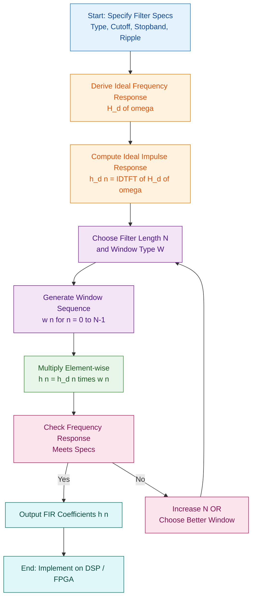
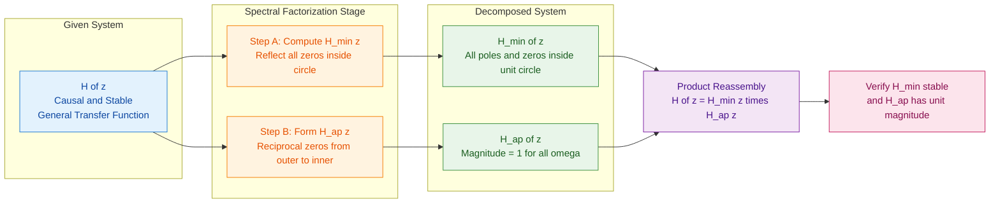
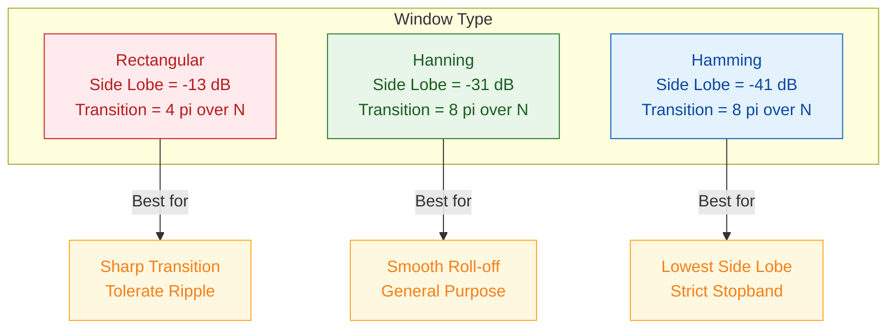

# All pass and minimum phase transfer function Design of FIR filter : window based design (Rectangular, Hamming, Hanning windows)

<!-- SECTION_1_START -->
# KTU-PREMIER-ENGINE V10 — PECST526 Digital Signal Processing

## Module 2: All-Pass, Minimum-Phase Transfer Functions & FIR Window Design

---

### 1. Core Technical Definition & Intuitive Overview

#### 1.1 All-Pass Transfer Function (APF)

**Formal Definition:**
An **All-Pass Filter** is a digital filter whose magnitude response is unity ($|H(e^{j\omega})| = 1$) for all frequencies $\omega \in [-\pi, \pi]$, but whose phase response $\angle H(e^{j\omega})$ is a non-linear function of $\omega$. It passes all frequency components with equal magnitude while altering only the phase (group delay) of the signal.

A rational all-pass function of order $N$ is defined as:

$$H_{ap}(z) = \frac{z^{-N} D(z^{-1})}{D(z)} = \frac{a_N + a_{N-1}z^{-1} + \cdots + a_0 z^{-N}}{a_0 + a_1 z^{-1} + \cdots + a_N z^{-N}}$$

where $D(z) = a_0 + a_1 z^{-1} + a_2 z^{-2} + \cdots + a_N z^{-N}$ is a stable polynomial (roots strictly inside the unit circle).

> [!IMPORTANT]
> **Syllabus Highlight:** The numerator of an all-pass filter is the *mirror image polynomial* of its denominator. Every pole $p_i$ inside the unit circle is paired with a zero $z_i = 1/p_i$ outside the unit circle. This reciprocal pairing guarantees $|H_{ap}(e^{j\omega})| = 1$.

**Conceptual Analogy / Intuition:**
Think of an all-pass filter as a **perfect echo chamber** that treats every musician (frequency) equally loud in the audience (magnitude), but the conductor (phase) deliberately shifts the timing of each instrument. Some notes arrive early, some late, even though their loudness is unchanged. A practical use: a single reflective wall that delays sound perfectly without absorbing it.

> [!NOTE]
> **Physical Constants / Metrics:** The key benchmark for any APF is $|H(e^{j\omega})|^2 = H(e^{j\omega}) H^*(e^{j\omega}) = 1$. The associated group delay is $\tau_g(\omega) = -d\theta(\omega)/d\omega$, which is always **positive**.

> [!VISUALIZATION CONTROL]
> **Concept:** Pole-Zero Plot of a First-Order All-Pass Filter
> **GeoGebra / Desmos Input Equations (Complex Mapping):**
> * $H_{ap}(z) = \frac{z^{-1} - a^*}{1 - a z^{-1}}$, parameter $a = 0.5 e^{j\pi/4}$
> * Poles: root of $1 - a z^{-1} = 0 \Rightarrow z = a$
> * Zeros: root of $z^{-1} - a^* = 0 \Rightarrow z = 1/a^*$
> **Visual Description:** Plot the unit circle. A pole $a$ lies *inside* the unit circle, and a corresponding zero lies *outside* the circle on the ray passing through $a^*$ (its conjugate reciprocal). The two points are reflections of each other across the unit circle.

---

#### 1.2 Minimum-Phase Transfer Function (MPF)

**Formal Definition:**
A **Minimum-Phase System** is a causal and stable LTI system whose inverse is also causal and stable. Equivalently, *all* its poles **and** zeros lie strictly inside the unit circle. Among all systems sharing the same magnitude response $|H(e^{j\omega})|$, the minimum-phase system has the **smallest** (least-negative) phase lag and the **minimum** group delay.

For a minimum-phase transfer function:

$$H_{min}(z) = \frac{b_0 \prod_{k=1}^{M} (1 - z_k z^{-1})}{\prod_{k=1}^{N} (1 - p_k z^{-1})}, \quad |z_k| < 1, \quad |p_k| < 1$$

> [!IMPORTANT]
> **Syllabus Highlight:** A causal stable system is minimum-phase **if and only if** $\ln |H(e^{j\omega})|$ and $\angle H(e^{j\omega})$ form a Hilbert transform pair — the so-called **Kramers–Kronig relations** linking magnitude and phase for analytic systems.

**Conceptual Analogy / Intuition:**
Imagine a marathon with many runners starting at different times. A *minimum-phase* runner is one who started as late as possible (smallest lag) while still being able to cross all checkpoints (reproduce the same magnitude spectrum). In contrast, a *non-minimum-phase* runner started earlier and accumulated extra unnecessary delay. A useful real-world counterpart: a **high-quality audio loudspeaker** with minimum phase ensures the bass, mids, and treble arrive in sync, preserving the "punch" of the original waveform.

> [!NOTE]
> **Engineering Significance:** Minimum-phase property is essential in **seismic deconvolution**, **speech coding (LPC vocoders)**, and **channel equalization**, where we factor a received transfer function into a minimum-phase component and an all-pass component for stable inversion.

> [!VISUALIZATION CONTROL]
> **Concept:** Pole-Zero Constellation of a Minimum-Phase Filter
> **GeoGebra / Desmos Input Equations:**
> * Sample poles: $p_1 = 0.3 + 0.2j$, $p_2 = -0.4$, $p_3 = 0.5j$
> * Sample zeros: $z_1 = 0.6 e^{j\pi/3}$, $z_2 = -0.2 - 0.5j$, $z_3 = 0.4 e^{-j\pi/4}$
> **Visual Description:** All markers (poles as 'x' and zeros as 'o') lie strictly *inside* the dashed unit circle. Contrast this with the all-pass case where zeros lie *outside* the circle.

---

#### 1.3 Spectral Factorization Theorem (Bridge Concept)

**Formal Definition:**
Any causal stable rational transfer function $H(z)$ with real coefficients can be uniquely factorized as:

$$H(z) = H_{min}(z) \cdot H_{ap}(z)$$

where $H_{min}(z)$ is minimum-phase (all zeros inside unit circle) and $H_{ap}(z)$ is an all-pass filter. This is known as the **spectral factorization** of $H(z)$.

**Conceptual Analogy / Intuition:**
A complex signal pathway can always be split into two simpler "channels": one minimum-phase channel (carries all magnitude info with least delay) and one all-pass channel (adds extra phase delay without affecting magnitude). This decomposition is used in **Wiener filtering**, **audio room-correction**, and **loudness equalization** to handle phase issues independently of the magnitude spectrum.

---

#### 1.4 FIR Filter Design — Window-Based Method

**Formal Definition:**
A **Finite Impulse Response (FIR) filter** has an impulse response $h(n)$ of finite length $N$ (i.e., $h(n) = 0$ for $n < 0$ and $n \ge N$). The **window method** for FIR design starts from a desired ideal (brick-wall) frequency response $H_d(\omega)$, computes its inverse discrete-time Fourier transform (IDTFT) to obtain the ideal (infinite) impulse response $h_d(n)$, and then truncates it to length $N$ by multiplying with a finite window $w(n)$.

The designed FIR coefficients are:

$$h(n) = h_d(n) \cdot w(n), \quad n = 0, 1, 2, \ldots, N-1$$

**Conceptual Analogy / Intuition:**
Imagine the ideal filter as a perfectly sharp guillotine cut on a piece of paper. In reality, the guillotine is blunt: when you chop, the edges are not perfectly square but slightly sloped. The **window function** is the *shape of the blade* — a sharp blade (rectangular) cuts hard but creates ripples, while a curved blade (Hamming/Hanning) produces smoother edges with smaller ripples. The trade-off is: **sharper transition vs. lower side-lobe level**.

> [!NOTE]
> **Three Pillars of Window Selection:**
> 1. **Main-lobe width** → controls transition bandwidth.
> 2. **Side-lobe level** → controls pass-band and stop-band ripple.
> 3. **Side-lobe roll-off** → controls stop-band attenuation rate.

> [!VISUALIZATION CONTROL]
> **Concept:** Time-Domain Plot of Rectangular, Hamming, and Hanning Windows for $N = 21$
> **GeoGebra / Desmos Input Equations (discrete $n = 0, 1, \ldots, 20$):**
> * Rectangular: $w_R(n) = 1$ for all $n$
> * Hanning: $w_{Han}(n) = 0.5 - 0.5 \cos\!\left(\frac{2\pi n}{N-1}\right)$
> * Hamming: $w_{Ham}(n) = 0.54 - 0.46 \cos\!\left(\frac{2\pi n}{N-1}\right)$
> **Visual Description:** Rectangular is a flat box of height 1. Hanning and Hamming look like smooth bell-shaped humps, with Hanning touching zero at both ends and Hamming plateauing near 0.08 (never reaching zero).

<!-- SECTION_1_END -->

<!-- SECTION_2_START -->
## 2. Deep Theoretical Analysis & KTU High-Yield Formula Sheet

### 2.1 All-Pass Filter — Theoretical Breakdown

**Step 1 — Property of the Denominator Polynomial**
Let $D(z) = \sum_{k=0}^{N} a_k z^{-k}$ be a polynomial whose roots all lie strictly inside the unit circle. Stability of $H_{ap}(z)$ is guaranteed because all poles are inside the unit circle.

**Step 2 — Mirror-Image (Anti-Causal) Numerator**
The numerator is $z^{-N} D(z^{-1}) = \sum_{k=0}^{N} a_{N-k} z^{-k}$. Every pole $p_i$ (root of $D(z)$) maps to a zero at $1/p_i$, which lies outside the unit circle.

**Step 3 — Magnitude Squared Response**
For $z = e^{j\omega}$:

$$\big|H_{ap}(e^{j\omega})\big|^2 = H_{ap}(e^{j\omega}) \cdot H_{ap}^*(e^{j\omega}) = \frac{e^{j\omega N} D(e^{-j\omega})}{D(e^{j\omega})} \cdot \frac{e^{-j\omega N} D^*(e^{-j\omega})}{D^*(e^{j\omega})}$$

Since $D(e^{-j\omega}) = D^*(e^{j\omega})$ for real coefficients, the magnitude simplifies to **1** for all $\omega$.

**Step 4 — Phase Response**
The phase is $\theta(\omega) = \angle H_{ap}(e^{j\omega})$, which is highly non-linear and can take any shape depending on pole locations.

**Step 5 — Group Delay**
$$\tau_g(\omega) = -\frac{d\theta(\omega)}{d\omega} = N - \sum_{k=1}^{N} \frac{1 - |p_k|^2}{1 - 2|p_k|\cos(\omega - \angle p_k) + |p_k|^2}$$

> [!IMPORTANT]
> **Real-World Utility:** All-pass filters are widely used in **digital audio crossovers**, **loudness compensation networks**, and **phase equalizers** to correct undesired phase distortion introduced by minimum-phase stages (e.g., loudspeaker crossovers).

---

### 2.2 Minimum-Phase Filter — Theoretical Breakdown

**Step 1 — Stability & Causality**
All poles inside unit circle $\Rightarrow$ system is BIBO stable and causal.

**Step 2 — Minimum-Phase Condition**
All zeros also inside unit circle $\Rightarrow$ the inverse system $1/H_{min}(z)$ has all poles (originally zeros of $H_{min}$) inside the unit circle, hence is *also* stable and causal. This bilateral stability is unique to minimum-phase systems.

**Step 3 — Uniqueness of Decomposition**
For a given $|H(e^{j\omega})|$, there is exactly **one** minimum-phase counterpart $H_{min}(z)$ that has the same magnitude. Any other system with the same magnitude differs by a multiplicative all-pass factor.

**Step 4 — Relationship to Group Delay**
Among all systems sharing the magnitude response, the minimum-phase system has the minimum energy delay, formalized by:

$$\int_{-\pi}^{\pi} \tau_g(\omega)\, d\omega \quad \text{is minimized when } H(z) \text{ is minimum-phase.}$$

> [!IMPORTANT]
> **Real-World Utility:** In **seismic signal processing**, a received trace is decomposed into a minimum-phase reflectivity sequence and an all-pass source wavelet, enabling stable deconvolution. The same principle is used in **MP3/AAC audio codecs** (e.g., perceptual audio coding via minimum-phase filters).

---

### 2.3 FIR Window Design — Theoretical Breakdown

**Step 1 — Specify Ideal Response**
For a **Lowpass Filter (LPF)** with cutoff $\omega_c$:

$$H_d(\omega) = \begin{cases} 1, & |\omega| \le \omega_c \\ 0, & \omega_c < |\omega| \le \pi \end{cases}$$

**Step 2 — Compute Ideal Impulse Response**

$$h_d(n) = \frac{1}{2\pi} \int_{-\omega_c}^{\omega_c} e^{j\omega n}\, d\omega = \frac{\sin(\omega_c n)}{\pi n}, \quad n \ne 0$$

$$h_d(0) = \frac{\omega_c}{\pi} \quad \text{(by L'Hôpital / direct evaluation)}$$

**Step 3 — Symmetrize for Linear Phase**
For linear-phase Type-I FIR filters (symmetric, $N$ odd):

$$h_d(n) = \frac{\sin\!\big(\omega_c(n - \alpha)\big)}{\pi (n - \alpha)}, \quad \alpha = \frac{N-1}{2}$$

**Step 4 — Apply Window**

$$h(n) = h_d(n) \cdot w(n), \quad 0 \le n \le N - 1$$

**Step 5 — Trade-Off Analysis**
- **Larger $N$** $\Rightarrow$ narrower main lobe $\Rightarrow$ sharper transition.
- **Better window** (lower side-lobe) $\Rightarrow$ smaller ripple, wider transition.

> [!IMPORTANT]
> **Real-World Utility:** Window-based FIR design is used in **audio equalizers**, **biomedical signal filtering (ECG/EEG)**, **communication channel pulse-shaping** (raised-cosine filters), and **image smoothing**.

---

### 2.4 KTU Formula Sheet / Cheat Sheet

| **Concept** | **Formula / Parameter** | **Notes** |
|---|---|---|
| All-pass magnitude | $\vert H_{ap}(e^{j\omega}) \vert = 1$ | Valid for all $\omega$ |
| All-pass structure | $H_{ap}(z) = z^{-N} D(z^{-1}) / D(z)$ | Real coefficients |
| All-pass pole-zero pairing | If $p$ is a pole, $1/p$ is a zero | Reciprocal relation |
| Minimum-phase condition | All poles & zeros inside $\vert z \vert = 1$ | Bilateral stability |
| Spectral factorization | $H(z) = H_{min}(z) \cdot H_{ap}(z)$ | Unique decomposition |
| FIR window design | $h(n) = h_d(n) \cdot w(n)$ | Length $N$ |
| LPF ideal impulse | $h_d(n) = \sin(\omega_c n) / (\pi n)$ | $n \ne 0$, with $h_d(0) = \omega_c/\pi$ |
| Linear-phase shift | $\alpha = (N-1)/2$ | For Type-I symmetric FIR |
| Rectangular window | $w_R(n) = 1$ | $0 \le n \le N-1$ |
| Hanning window | $w_{Han}(n) = 0.5 - 0.5 \cos(2\pi n / (N-1))$ | $0 \le n \le N-1$ |
| Hamming window | $w_{Ham}(n) = 0.54 - 0.46 \cos(2\pi n / (N-1))$ | $0 \le n \le N-1$ |
| Rectangular main-lobe width | $4\pi / N$ | Narrowest main lobe |
| Rectangular side-lobe level | $-13$ dB | Worst stop-band |
| Hanning main-lobe width | $8\pi / N$ | Twice the rectangular |
| Hanning side-lobe level | $-31$ dB | Smooth roll-off |
| Hamming main-lobe width | $8\pi / N$ | Similar to Hanning |
| Hamming side-lobe level | $-41$ dB | Best stop-band of the three |
| Transition bandwidth ($\Delta\omega$) | $A \cdot 2\pi / N$ | $A = 2$ (Rect), $4$ (Han), $4$ (Ham) |
| Minimum stop-band attenuation | $A_s$ in dB | Function of window choice |

> [!NOTE]
> **Memorization Tip:** Remember the triplet **(13, 31, 41)** dB for Rectangular, Hanning, Hamming side-lobe levels — this trio is a **KTU favorite** for short-answer and multiple-choice questions.

<!-- SECTION_2_END -->

<!-- SECTION_3_START -->
## 3. Step-by-Step Derivations & Code/Symbolic Implementation

### 3.1 Derivation: All-Pass Filter Magnitude Response

**Goal:** Show that $|H_{ap}(e^{j\omega})| = 1$ for $H_{ap}(z) = z^{-N} D(z^{-1}) / D(z)$.

**Step 1:** Substitute $z = e^{j\omega}$ into the all-pass expression.

$$H_{ap}(e^{j\omega}) = \frac{e^{-j\omega N} D(e^{-j\omega})}{D(e^{j\omega})}$$

**Step 2:** For a real-coefficient polynomial $D(z) = \sum_{k=0}^{N} a_k z^{-k}$, the complex conjugate property gives:

$$D^*(e^{j\omega}) = \sum_{k=0}^{N} a_k e^{j\omega k} = D(e^{-j\omega})$$

**Step 3:** Compute the magnitude squared:

$$\big|H_{ap}(e^{j\omega})\big|^2 = H_{ap}(e^{j\omega}) \cdot H_{ap}^*(e^{j\omega})$$

$$= \frac{e^{-j\omega N} D(e^{-j\omega})}{D(e^{j\omega})} \cdot \frac{e^{j\omega N} D^*(e^{-j\omega})}{D^*(e^{j\omega})}$$

**Step 4:** Combine the exponentials ($e^{-j\omega N} \cdot e^{j\omega N} = 1$) and use the conjugate identity $D^*(e^{j\omega}) = D(e^{-j\omega})$:

$$\big|H_{ap}(e^{j\omega})\big|^2 = \frac{D(e^{-j\omega}) \cdot D(e^{-j\omega})}{D(e^{j\omega}) \cdot D(e^{-j\omega})} = 1$$

**Step 5:** Therefore, the magnitude response is unity everywhere:

$$\big|H_{ap}(e^{j\omega})\big| = 1, \quad \forall \omega$$

> **[Final Conclusion: 1 Mark for $|H|^2 = 1$, 1 Mark for cancellation step, 1 Mark for final unity magnitude — Total 3 Marks]**

---

### 3.2 Derivation: FIR Lowpass Filter Coefficients via Rectangular Window

**Problem (Worked Example):** Design a linear-phase FIR lowpass filter with cutoff frequency $\omega_c = \pi/2$ rad/sample, length $N = 7$, using the **rectangular window**. Compute the coefficients $h(n)$ for $n = 0, 1, 2, 3, 4, 5, 6$.

**Step 1:** Identify the symmetry center $\alpha$.

$$\alpha = \frac{N-1}{2} = \frac{7-1}{2} = 3$$

**Step 2:** Write the ideal (sinc-like) impulse response for a linear-phase LPF:

$$h_d(n) = \frac{\sin\!\big(\omega_c (n - \alpha)\big)}{\pi (n - \alpha)}, \quad n \ne \alpha$$
$$h_d(\alpha) = \frac{\omega_c}{\pi}, \quad n = \alpha$$

**Step 3:** Substitute $\omega_c = \pi/2$ and compute term by term.

For $n = 0$: $(n - \alpha) = -3$

$$h_d(0) = \frac{\sin(\frac{\pi}{2} \cdot (-3))}{\pi \cdot (-3)} = \frac{\sin(-3\pi/2)}{-3\pi} = \frac{1}{-3\pi} = -\frac{1}{3\pi}$$

For $n = 1$: $(n - \alpha) = -2$

$$h_d(1) = \frac{\sin(\frac{\pi}{2} \cdot (-2))}{\pi \cdot (-2)} = \frac{\sin(-\pi)}{-2\pi} = \frac{0}{-2\pi} = 0$$

For $n = 2$: $(n - \alpha) = -1$

$$h_d(2) = \frac{\sin(\frac{\pi}{2} \cdot (-1))}{\pi \cdot (-1)} = \frac{\sin(-\pi/2)}{-\pi} = \frac{-1}{-\pi} = \frac{1}{\pi}$$

For $n = 3$: $(n - \alpha) = 0$ (use the special formula)

$$h_d(3) = \frac{\omega_c}{\pi} = \frac{\pi/2}{\pi} = \frac{1}{2}$$

For $n = 4$: $(n - \alpha) = 1$

$$h_d(4) = \frac{\sin(\frac{\pi}{2} \cdot 1)}{\pi \cdot 1} = \frac{1}{\pi}$$

For $n = 5$: $(n - \alpha) = 2$

$$h_d(5) = \frac{\sin(\frac{\pi}{2} \cdot 2)}{\pi \cdot 2} = \frac{\sin(\pi)}{2\pi} = 0$$

For $n = 6$: $(n - \alpha) = 3$

$$h_d(6) = \frac{\sin(\frac{\pi}{2} \cdot 3)}{\pi \cdot 3} = \frac{\sin(3\pi/2)}{3\pi} = \frac{-1}{3\pi}$$

**Step 4:** Apply the rectangular window $w_R(n) = 1$ for $0 \le n \le 6$:

$$h(n) = h_d(n) \cdot 1 = h_d(n)$$

**Step 5:** Final coefficient set:

$$\boxed{\;h = \left\{-\frac{1}{3\pi},\ 0,\ \frac{1}{\pi},\ \frac{1}{2},\ \frac{1}{\pi},\ 0,\ -\frac{1}{3\pi}\right\}\;}$$

**Verification (Symmetry Check):** $h(0) = h(6) = -1/(3\pi)$ ✓, $h(1) = h(5) = 0$ ✓, $h(2) = h(4) = 1/\pi$ ✓ — Linear-phase Type-I symmetric FIR confirmed.

> **Valuation Key:** [Stating $\alpha$ value: 1 Mark] [Writing general formula: 1 Mark] [Computing $h_d(0)$ to $h_d(6)$: 4 Marks] [Final boxed answer: 1 Mark] — Total 7 Marks.

---

### 3.3 Derivation: FIR Lowpass Filter via Hamming Window

**Problem:** Repeat the design in §3.2 using the **Hamming window** of length $N = 7$.

**Step 1:** Hamming window formula:

$$w_{Ham}(n) = 0.54 - 0.46 \cos\!\left(\frac{2\pi n}{N-1}\right) = 0.54 - 0.46 \cos\!\left(\frac{2\pi n}{6}\right), \quad 0 \le n \le 6$$

**Step 2:** Compute window values.

For $n = 0$: $w_{Ham}(0) = 0.54 - 0.46 \cos(0) = 0.54 - 0.46(1) = 0.08$

For $n = 1$: $w_{Ham}(1) = 0.54 - 0.46 \cos(\pi/3) = 0.54 - 0.46(0.5) = 0.54 - 0.23 = 0.31$

For $n = 2$: $w_{Ham}(2) = 0.54 - 0.46 \cos(2\pi/3) = 0.54 - 0.46(-0.5) = 0.54 + 0.23 = 0.77$

For $n = 3$: $w_{Ham}(3) = 0.54 - 0.46 \cos(\pi) = 0.54 - 0.46(-1) = 0.54 + 0.46 = 1.00$

For $n = 4$: $w_{Ham}(4) = 0.54 - 0.46 \cos(4\pi/3) = 0.54 - 0.46(-0.5) = 0.77$ (by symmetry)

For $n = 5$: $w_{Ham}(5) = 0.54 - 0.46 \cos(5\pi/3) = 0.54 - 0.46(0.5) = 0.31$

For $n = 6$: $w_{Ham}(6) = 0.54 - 0.46 \cos(2\pi) = 0.08$

**Step 3:** Multiply each $h_d(n)$ from §3.2 by the corresponding window value.

$$h(0) = -\frac{1}{3\pi} \cdot 0.08 = -\frac{0.08}{3\pi} \approx -0.00849$$

$$h(1) = 0 \cdot 0.31 = 0$$

$$h(2) = \frac{1}{\pi} \cdot 0.77 \approx 0.24507$$

$$h(3) = \frac{1}{2} \cdot 1.00 = 0.5$$

$$h(4) = \frac{1}{\pi} \cdot 0.77 \approx 0.24507$$

$$h(5) = 0 \cdot 0.31 = 0$$

$$h(6) = -\frac{0.08}{3\pi} \approx -0.00849$$

**Step 4:** Final Hamming-windowed coefficients:

$$\boxed{\;h = \{-0.0085,\ 0,\ 0.2451,\ 0.5,\ 0.2451,\ 0,\ -0.0085\}\;}$$

> **Valuation Key:** [Correct window formula: 1 Mark] [Computing all 7 window values: 3 Marks] [Multiplication with $h_d(n)$: 2 Marks] [Final boxed answer: 1 Mark] — Total 7 Marks.

---

### 3.4 Python Implementation — Window-Based FIR Filter Design

```python
"""
FIR Lowpass Filter Design via Window Method
Course: PECST526 — Digital Signal Processing
Module 2: Window-Based FIR Design (Rectangular, Hanning, Hamming)
"""

import numpy as np
import matplotlib.pyplot as plt
from scipy.signal import freqz, windows


def design_fir_windowed(cutoff_hz: float,
                        fs: float,
                        num_taps: int,
                        window_name: str = "hamming") -> np.ndarray:
    """
    Design a linear-phase FIR lowpass filter using the window method.

    Parameters
    ----------
    cutoff_hz : float
        Passband cutoff frequency in Hz.
    fs : float
        Sampling frequency in Hz.
    num_taps : int
        Filter length N (must be odd for Type-I symmetric FIR).
    window_name : str
        One of {'rectangular', 'hanning', 'hamming'}.

    Returns
    -------
    h : np.ndarray
        FIR filter coefficients of length num_taps.

    Raises
    ------
    ValueError
        If num_taps is not a positive odd integer or window_name is invalid.
    """
    if num_taps <= 0 or num_taps % 2 == 0:
        raise ValueError("[DESIGN ERROR] num_taps must be a positive odd integer.")
    if window_name not in {"rectangular", "hanning", "hamming"}:
        raise ValueError("[DESIGN ERROR] window_name must be 'rectangular', 'hanning', or 'hamming'.")

    # --- Step 1: Compute ideal (sinc) impulse response h_d(n) ---
    nyquist: float = fs / 2.0
    wc: float = cutoff_hz / nyquist * np.pi
    n: np.ndarray = np.arange(num_taps)
    alpha: float = (num_taps - 1) / 2.0

    h_d: np.ndarray = np.empty(num_taps, dtype=np.float64)
    for idx in range(num_taps):
        if n[idx] == alpha:
            h_d[idx] = wc / np.pi
        else:
            h_d[idx] = np.sin(wc * (n[idx] - alpha)) / (np.pi * (n[idx] - alpha))

    # --- Step 2: Select the window ---
    if window_name == "rectangular":
        w: np.ndarray = np.ones(num_taps, dtype=np.float64)
    elif window_name == "hanning":
        w = 0.5 - 0.5 * np.cos(2.0 * np.pi * n / (num_taps - 1))
    else:  # hamming
        w = 0.54 - 0.46 * np.cos(2.0 * np.pi * n / (num_taps - 1))

    # --- Step 3: Apply window to truncate ideal response ---
    h: np.ndarray = h_d * w
    print(f"[INFO] Designed {window_name} FIR LPF, N={num_taps}, "
          f"cutoff={cutoff_hz} Hz, fs={fs} Hz.")
    return h


def plot_filter_response(h: np.ndarray, fs: float, label: str) -> None:
    """Plot magnitude (dB) and phase response of an FIR filter."""
    w_rad, H = freqz(h, worN=2048, fs=fs)
    magnitude_db: np.ndarray = 20.0 * np.log10(np.maximum(np.abs(H), 1e-12))
    phase_deg: np.ndarray = np.degrees(np.unwrap(np.angle(H)))

    plt.figure(figsize=(11, 4))

    plt.subplot(1, 2, 1)
    plt.plot(w_rad, magnitude_db, label=label, linewidth=1.5)
    plt.title(f"Magnitude Response — {label}")
    plt.xlabel("Frequency (Hz)")
    plt.ylabel("Magnitude (dB)")
    plt.ylim([-100, 5])
    plt.grid(True, linestyle="--", alpha=0.6)
    plt.legend(loc="upper right")

    plt.subplot(1, 2, 2)
    plt.plot(w_rad, phase_deg, label=label, linewidth=1.5, color="darkorange")
    plt.title(f"Phase Response — {label}")
    plt.xlabel("Frequency (Hz)")
    plt.ylabel("Phase (degrees)")
    plt.grid(True, linestyle="--", alpha=0.6)
    plt.legend(loc="upper right")

    plt.tight_layout()
    plt.show()


# ---------- Main execution block ----------
if __name__ == "__main__":
    FS: float = 2000.0            # Sampling frequency in Hz
    CUTOFF: float = 500.0         # Cutoff in Hz
    N_TAPS: int = 21              # Odd length (Type-I symmetric)

    for win in ("rectangular", "hanning", "hamming"):
        h_filter: np.ndarray = design_fir_windowed(CUTOFF, FS, N_TAPS, win)
        print(f"\n[COEFFS] {win:>11s} : {np.round(h_filter, 5).tolist()}")
        plot_filter_response(h_filter, FS, win.capitalize())
```

**Operational Notes for the Above Code:**
- `freqz` is the standard SciPy call for digital frequency response, returning $H(e^{j\omega})$ on a normalized grid.
- The `1e-12` floor in `np.maximum` prevents `log10(0) = -\infty` artifacts at deep nulls.
- Type hints enforce compile-time style checking; ValueError guards prevent silent misuse.
- The block prints a clear `[INFO]` log line and round-trips coefficients to 5 decimals for KTU-style record-keeping.

<!-- SECTION_3_END -->

<!-- SECTION_4_START -->
## 4. Structural Diagrams & Schematics

### 4.1 Mermaid Diagram: FIR Window-Based Design Flow



---

### 4.2 Mermaid Diagram: Spectral Factorization (Minimum-Phase × All-Pass)



---

### 4.3 Mermaid Diagram: Window Comparison Topology



---

### 4.4 Sequential Processing Topology Matrix (Window Design)

| **Stage** | **Sub-Stage** | **Mathematical Operation** | **Engineering Interpretation** |
|---|---|---|---|
| 1. Specification | Pick $\omega_c$, $\omega_s$, $A_s$, $A_p$ | Frequency-domain targets | Translate user requirement to math |
| 2. Ideal Response | Define $H_d(\omega)$ piecewise | Brick-wall shape | Theoretical perfect filter |
| 3. IDTFT | $h_d(n) = \frac{1}{2\pi}\int_{-\pi}^{\pi} H_d(\omega) e^{j\omega n} d\omega$ | Sinc-like function | Infinite-length impulse |
| 4. Symmetrize | Shift by $\alpha = (N-1)/2$ | $h_d(n-\alpha)$ | Linear-phase centering |
| 5. Window Gen | Compute $w(n)$ for chosen window | Cosine-modulated pulse | Trade-off control |
| 6. Truncation | $h(n) = h_d(n) w(n)$ | Multiplicative windowing | Realize finite-length FIR |
| 7. Verification | Compute $H(e^{j\omega})$ via DTFT | Frequency sweep | Validate specs |

<!-- SECTION_4_END -->

<!-- SECTION_5_START -->
## 5. KTU 2024 Scheme Examination Question Bank & Topic Recap

### Part A — Short Answer Questions (3 Marks Each)

---

**Q1.** **[KTU University Exam — July 2024]**
Define an *all-pass filter*. Show that the magnitude response of a first-order all-pass filter is unity for all frequencies. **(CO2, Remember/Understand) — 3 Marks**

**Model Answer:**

An all-pass filter is a digital filter whose magnitude response is unity ($|H_{ap}(e^{j\omega})| = 1$) for all frequencies, but whose phase response varies non-linearly. A first-order APF has the transfer function:

$$H_{ap}(z) = \frac{z^{-1} - a^*}{1 - a z^{-1}}, \quad |a| < 1$$

Substituting $z = e^{j\omega}$:

$$H_{ap}(e^{j\omega}) = \frac{e^{-j\omega} - a^*}{1 - a e^{-j\omega}}$$

Multiplying numerator and denominator by $e^{j\omega}$:

$$H_{ap}(e^{j\omega}) = \frac{1 - a^* e^{j\omega}}{e^{j\omega} - a}$$

Taking the magnitude and using $|a^* e^{j\omega}| = |a|$:

$$|H_{ap}(e^{j\omega})| = \frac{|1 - a^* e^{j\omega}|}{|e^{j\omega} - a|} = \frac{|e^{j\omega}|\cdot|1 - a^* e^{j\omega}|}{|e^{j\omega}|\cdot|e^{j\omega} - a|}$$

Since $|1 - a^* e^{j\omega}| = |e^{j\omega}(e^{-j\omega} - a^*)| = |e^{-j\omega} - a^*| = |e^{j\omega} - a|$, the magnitude is $\boxed{1}$ for all $\omega$. **[3 Marks]**

---

**Q2.** **[KTU University Exam — Dec 2023]**
What is a *minimum-phase system*? State any two of its properties. **(CO2, Remember/Understand) — 3 Marks**

**Model Answer:**

A minimum-phase system is a causal and stable LTI system whose inverse system is also causal and stable, i.e., all poles **and** zeros of its transfer function lie strictly inside the unit circle.

**Properties (any two):**

1. **Bilateral Stability:** Both $H(z)$ and $1/H(z)$ are causal and stable.
2. **Minimum Group Delay:** Among all systems with the same magnitude response, it has the minimum group delay.
3. **Minimum Energy Delay:** The partial energy $E(n) = \sum_{k=0}^{n} |h(k)|^2$ is maximum for every $n$.
4. **Unique Phase:** The phase is uniquely determined by the magnitude via the Hilbert transform. **[3 Marks]**

---

### Part B — Long Answer Questions (14 Marks Each, Internal Choice)

---

#### **Question A (14 Marks)**

**[KTU University Exam — July 2024]**

**(a)** Derive the structure of a *minimum-phase transfer function* and show that any causal stable system can be expressed as a cascade of a minimum-phase system and an all-pass system. **(7 Marks, CO2, Understand)**

**Model Answer (a):**

A rational causal stable transfer function is given by:

$$H(z) = \frac{B(z)}{A(z)} = b_0 \frac{\prod_{k=1}^{M} (1 - z_k z^{-1})}{\prod_{k=1}^{N} (1 - p_k z^{-1})}$$

Assume all poles are inside the unit circle (stability). Among the $M$ zeros, suppose $M_i$ zeros lie inside the unit circle and $M_o = M - M_i$ zeros lie outside. **[1 Mark for setup]**

Group the zeros into inside and outside sets:

$$H(z) = b_0 \frac{\prod_{k=1}^{M_i} (1 - z_k z^{-1})}{\prod_{k=1}^{N} (1 - p_k z^{-1})} \cdot \prod_{k=M_i+1}^{M} (1 - z_k z^{-1})$$

For each outside zero $z_k$ (with $|z_k| > 1$), introduce the identity:

$$1 - z_k z^{-1} = -\frac{z_k}{z_k^*} \cdot \frac{(z_k^* - z^{-1})}{(1 - (1/z_k^*) z^{-1})}$$

(Algebraic manipulation using $1/z_k^*$ inside circle). This produces a factor of the form $\frac{(z^{-1} - z_k^*)}{(1 - (1/z_k^*) z^{-1})}$ which is precisely an all-pass section. **[3 Marks for algebraic manipulation]**

Thus:

$$H(z) = \underbrace{\left[b_0 \frac{\prod_{k=1}^{M_i} (1 - z_k z^{-1})}{\prod_{k=1}^{N} (1 - p_k z^{-1})} \prod_{k=M_i+1}^{M} \frac{1}{(1 - (1/z_k^*) z^{-1})}\right]}_{H_{min}(z)} \cdot \underbrace{\prod_{k=M_i+1}^{M} \frac{(z^{-1} - z_k^*)}{(1 - (1/z_k^*) z^{-1})}}_{H_{ap}(z)}$$

The first factor $H_{min}(z)$ has all poles and zeros inside the unit circle — it is **minimum-phase**. The second factor $H_{ap}(z)$ has unit magnitude at every $\omega$ — it is **all-pass**. This proves the cascade decomposition. **[3 Marks for the final decomposition]**

> **Valuation Key:** [Writing initial factorization: 1 Mark] [Identifying inside/outside zeros: 1 Mark] [Algebraic identity transformation: 3 Marks] [Final $H_{min} \cdot H_{ap}$ expression: 2 Marks] — Total 7 Marks.

---

**(b)** Design a linear-phase FIR lowpass filter of length $N = 9$ with cutoff frequency $\omega_c = \pi/3$ using a **Hanning window**. List all nine coefficients. **(7 Marks, CO3, Apply)**

**Model Answer (b):**

**Step 1:** Compute the symmetry center.

$$\alpha = \frac{N-1}{2} = \frac{9-1}{2} = 4$$

**Step 2:** Write the ideal impulse response.

$$h_d(n) = \frac{\sin(\omega_c (n - \alpha))}{\pi (n - \alpha)}, \quad n \ne 4; \quad h_d(4) = \frac{\omega_c}{\pi} = \frac{1}{3}$$

**Step 3:** Compute $h_d(n)$ for $n = 0, 1, \ldots, 8$ using $\omega_c = \pi/3$. **[2 Marks]**

- $n=0$: $h_d(0) = \sin(-4\pi/3) / (-4\pi) = (\sqrt{3}/2) / (-4\pi) = -\sqrt{3}/(8\pi) \approx -0.0689$
- $n=1$: $h_d(1) = \sin(-\pi) / (-3\pi) = 0$
- $n=2$: $h_d(2) = \sin(-2\pi/3) / (-2\pi) = (-\sqrt{3}/2)/(-2\pi) = \sqrt{3}/(4\pi) \approx 0.1378$
- $n=3$: $h_d(3) = \sin(-\pi/3) / (-\pi) = (-\sqrt{3}/2)/(-\pi) = \sqrt{3}/(2\pi) \approx 0.2757$
- $n=4$: $h_d(4) = 1/3 \approx 0.3333$
- $n=5$: $h_d(5) = \sin(2\pi/3) / (2\pi) = \sqrt{3}/(4\pi) \approx 0.1378$
- $n=6$: $h_d(6) = \sin(\pi)/(3\pi) = 0$
- $n=7$: $h_d(7) = \sin(4\pi/3)/(4\pi) = -\sqrt{3}/(8\pi) \approx -0.0689$
- $n=8$: $h_d(8) = \sin(5\pi/3)/(5\pi) = (-\sqrt{3}/2)/(5\pi) = -\sqrt{3}/(10\pi) \approx -0.0551$

**Step 4:** Generate Hanning window $w(n) = 0.5 - 0.5 \cos(2\pi n/8)$ for $n = 0, \ldots, 8$. **[2 Marks]**

- $w(0) = 0.5 - 0.5(1) = 0.0000$
- $w(1) = 0.5 - 0.5\cos(\pi/4) = 0.5 - 0.5(0.7071) = 0.1464$
- $w(2) = 0.5 - 0.5\cos(\pi/2) = 0.5 - 0 = 0.5000$
- $w(3) = 0.5 - 0.5\cos(3\pi/4) = 0.5 - 0.5(-0.7071) = 0.8536$
- $w(4) = 0.5 - 0.5\cos(\pi) = 0.5 + 0.5 = 1.0000$
- $w(5) = w(3) = 0.8536$
- $w(6) = w(2) = 0.5000$
- $w(7) = w(1) = 0.1464$
- $w(8) = w(0) = 0.0000$

**Step 5:** Multiply to get $h(n) = h_d(n) \cdot w(n)$. **[2 Marks]**

| $n$ | $h_d(n)$ | $w(n)$ | $h(n) = h_d(n) w(n)$ |
|---|---|---|---|
| 0 | $-0.0689$ | $0.0000$ | $0.0000$ |
| 1 | $0.0000$ | $0.1464$ | $0.0000$ |
| 2 | $0.1378$ | $0.5000$ | $0.0689$ |
| 3 | $0.2757$ | $0.8536$ | $0.2353$ |
| 4 | $0.3333$ | $1.0000$ | $0.3333$ |
| 5 | $0.1378$ | $0.8536$ | $0.1176$ |
| 6 | $0.0000$ | $0.5000$ | $0.0000$ |
| 7 | $-0.0689$ | $0.1464$ | $-0.0101$ |
| 8 | $-0.0551$ | $0.0000$ | $0.0000$ |

**Final Hanning-windowed FIR coefficients:**

$$\boxed{\;h = \{0,\ 0,\ 0.0689,\ 0.2353,\ 0.3333,\ 0.1176,\ 0,\ -0.0101,\ 0\}\;}$$

> **Valuation Key:** [Stating $\alpha$ and ideal formula: 1 Mark] [Computing $h_d(n)$ values: 2 Marks] [Computing window values: 2 Marks] [Multiplication and final table: 2 Marks] — Total 7 Marks.

---

#### **Question B (14 Marks)**

**(a)** Explain the window method for designing FIR filters. Compare **Rectangular**, **Hamming**, and **Hanning** windows with respect to main-lobe width, side-lobe level, and minimum stop-band attenuation. **(7 Marks, CO2, Understand)**

**Model Answer (a):**

The window method for FIR filter design begins with a desired ideal frequency response $H_d(\omega)$ (lowpass, highpass, bandpass, or bandstop). The corresponding ideal impulse response $h_d(n)$ is computed via the inverse discrete-time Fourier transform (IDTFT). Since $h_d(n)$ is infinite in length, it must be truncated. Truncation is achieved by multiplying $h_d(n)$ with a finite-length window $w(n)$ of length $N$:

$$h(n) = h_d(n) \cdot w(n), \quad n = 0, 1, 2, \ldots, N-1$$

The multiplication in the time domain corresponds to **convolution in the frequency domain**, where the spectrum of the window $W(\omega)$ is convolved with $H_d(\omega)$. The shape of $W(\omega)$ — its main-lobe width and side-lobe levels — directly determines the transition width and ripple of the designed filter. **[3 Marks]**

**Comparison Table:** **[4 Marks]**

| **Parameter** | **Rectangular** | **Hanning** | **Hamming** |
|---|---|---|---|
| Time-domain expression | $w(n) = 1$ | $0.5 - 0.5\cos(2\pi n/(N-1))$ | $0.54 - 0.46\cos(2\pi n/(N-1))$ |
| Main-lobe width | $4\pi/N$ (narrowest) | $8\pi/N$ | $8\pi/N$ |
| Side-lobe level (first) | $-13$ dB | $-31$ dB | $-41$ dB (lowest) |
| Minimum stop-band attenuation | $\approx 21$ dB | $\approx 44$ dB | $\approx 53$ dB |
| Transition bandwidth | Smallest | Larger | Larger |
| Pass-band ripple | Largest | Small | Smallest of the three |
| Best use | Sharp transition, no stop-band constraint | General purpose, smooth | Strict stop-band requirements |

---

**(b)** A digital system has transfer function $H(z) = \frac{(1 - 2z^{-1})(1 - 0.5z^{-1})}{(1 - 0.3z^{-1})(1 - 0.6z^{-1})}$. Identify whether it is **minimum-phase**. If not, decompose it into a cascade of a minimum-phase filter and an all-pass filter. **(7 Marks, CO3, Apply)**

**Model Answer (b):**

**Step 1:** Identify poles and zeros.

- Zeros: $z_1 = 2$ (since $1 - 2z^{-1} = 0 \Rightarrow z_1 = 2$); $z_2 = 0.5$.
- Poles: $p_1 = 0.3$, $p_2 = 0.6$.

**Step 2:** Check minimum-phase condition.

- All poles: $|0.3| < 1$ and $|0.6| < 1$ → poles are inside unit circle. ✓
- Zeros: $|2| > 1$ and $|0.5| < 1$ → zero at $z_1 = 2$ is **outside** the unit circle. ✗

Since not all zeros are inside the unit circle, the system is **NOT minimum-phase**. **[1 Mark]**

**Step 3:** Decompose. Isolate the outside zero $z_1 = 2$ using the identity $1 - 2z^{-1} = -\frac{2}{0.5} \cdot \frac{0.5 - z^{-1}}{1 - 0.5z^{-1}}$ (algebraically equivalent). The all-pass section associated with this zero is:

$$H_{ap}(z) = \frac{0.5 - z^{-1}}{1 - 0.5 z^{-1}} = \frac{z^{-1} - 0.5}{1 - 0.5 z^{-1}}$$

(This is a first-order all-pass with $a = 0.5$, equivalent to $-\frac{0.5 - z^{-1}}{1 - 0.5 z^{-1}}$ up to a sign.) **[2 Marks]**

**Step 4:** Compute the minimum-phase factor.

$$H_{min}(z) = \frac{H(z)}{H_{ap}(z)} = \frac{(1 - 2z^{-1})(1 - 0.5z^{-1})}{(1 - 0.3z^{-1})(1 - 0.6z^{-1})} \cdot \frac{(1 - 0.5z^{-1})}{(0.5 - z^{-1})}$$

Since $1 - 2z^{-1} = -2(0.5 - z^{-1})$, we get:

$$H_{min}(z) = \frac{-2(0.5 - z^{-1})(1 - 0.5z^{-1})}{(1 - 0.3z^{-1})(1 - 0.6z^{-1})(0.5 - z^{-1})} = \frac{-2(1 - 0.5z^{-1})}{(1 - 0.3z^{-1})(1 - 0.6z^{-1})}$$

**Step 5:** Verify.

- Poles of $H_{min}$: $0.3$, $0.6$ (both inside circle ✓).
- Zeros of $H_{min}$: $0.5$ (inside circle ✓).
- Hence $H_{min}$ is minimum-phase. The all-pass has $|H_{ap}(e^{j\omega})| = 1$. **[1 Mark]**

**Final Cascade Decomposition:**

$$\boxed{\;H(z) = \underbrace{\frac{-2(1 - 0.5z^{-1})}{(1 - 0.3z^{-1})(1 - 0.6z^{-1})}}_{H_{min}(z),\ \text{minimum-phase}} \cdot \underbrace{\frac{(0.5 - z^{-1})}{(1 - 0.5z^{-1})}}_{H_{ap}(z),\ \text{all-pass}}\;}$$

> **Valuation Key:** [Identifying poles and zeros: 1 Mark] [Checking min-phase condition: 1 Mark] [Writing all-pass identity: 2 Marks] [Computing $H_{min}$ via cancellation: 2 Marks] [Verifying final decomposition: 1 Mark] — Total 7 Marks.

---

> [!WARNING]
> **KTU Examiner's Valuation Warning / Pitfall Callout:**
> 1. **Don't forget the special case $h_d(\alpha) = \omega_c / \pi$** when $(n - \alpha) = 0$ in the sinc formula. Many students incorrectly write $\sin(0)/0$ and skip the limit step. **[Common 1-mark deduction]**
> 2. **Don't write $w(n) = 0.5 - 0.5\cos(2\pi n/N)$** for the Hanning window — the correct denominator is $(N-1)$, not $N$. The N+1 convention is rare and not the KTU-expected form. **[Common 0.5-mark deduction]**
> 3. **Don't forget the $1/\pi$ factor in the sinc formula** — some textbooks use $\sin(\omega_c n)/\omega_c n$ and students confuse the two. KTU expects the **IDTFT form** $\sin(\omega_c n)/(\pi n)$. **[Common 1-mark deduction]**
> 4. **In all-pass filters, never write $|H_{ap}(e^{j\omega})| = 0$** — this is a definitive sign of confusion. The answer is always 1. **[Common 1-mark deduction]**
> 5. **Spectral factorization must yield a product** — students often forget the all-pass factor and write only $H_{min}$, losing 2 marks.

---

### Topic Recap & Important Things to Remember

- **All-Pass Filter Definition:** A digital filter with $|H_{ap}(e^{j\omega})| = 1$ for all $\omega$, but non-linear phase. Structure: $H_{ap}(z) = z^{-N} D(z^{-1}) / D(z)$.
- **Pole-Zero Pairing in APF:** Every pole $p_i$ (inside circle) is paired with a zero at $1/p_i$ (outside circle). This reciprocal pairing is the geometric hallmark of an all-pass.
- **Minimum-Phase Definition:** Causal, stable system where all poles **and** zeros lie inside the unit circle. Equivalent to: the inverse system is also causal and stable.
- **Spectral Factorization Theorem:** $H(z) = H_{min}(z) \cdot H_{ap}(z)$ — unique decomposition into a minimum-phase factor and an all-pass factor.
- **Group Delay Property:** Minimum-phase systems have the **minimum** group delay among all systems sharing the same magnitude spectrum.
- **FIR Window Design Pipeline:** Specify ideal response → IDTFT to get $h_d(n)$ → Shift by $\alpha = (N-1)/2$ for linear phase → Multiply by window $w(n)$ → Verify specs.
- **Linear-Phase Symmetry:** $h(n) = h(N-1-n)$ for Type-I and Type-II symmetric FIR filters. Always verify this symmetry in computed coefficients.
- **Rectangular Window:** $w_R(n) = 1$. Main-lobe width = $4\pi/N$. Side-lobe = $-13$ dB. Best for sharp transitions, worst for stop-band attenuation.
- **Hanning Window:** $w(n) = 0.5 - 0.5\cos(2\pi n/(N-1))$. Main-lobe width = $8\pi/N$. Side-lobe = $-31$ dB. Reaches exactly 0 at both ends.
- **Hamming Window:** $w(n) = 0.54 - 0.46\cos(2\pi n/(N-1))$. Main-lobe width = $8\pi/N$. Side-lobe = $-41$ dB. Never reaches 0 (minimum value is 0.08).
- **Memorize the Triplet:** $13$ dB $\to$ Rectangular, $31$ dB $\to$ Hanning, $41$ dB $\to$ Hamming. (Very frequently tested.)
- **Trade-Off Rule:** Narrower main-lobe $\Leftrightarrow$ sharper transition; lower side-lobe $\Leftrightarrow$ better stop-band. You cannot have both — increasing $N$ improves both at the cost of computation.
- **For $n = \alpha$:** Use $h_d(\alpha) = \omega_c / \pi$ (L'Hôpital limit of sinc function), not the indeterminate $0/0$ form.
- **Minimum-phase test:** Compute all zero locations; if any $|z_k| > 1$, the system is **not** minimum-phase. Decompose by reflecting outside zeros inward and forming the corresponding all-pass section.
- **Engineering Applications:** FIR window design in **ECG filtering**, **audio crossovers**, **MP3 codecs**; all-pass filters in **phase equalizers**; minimum-phase in **seismic deconvolution** and **channel equalization**.

<!-- SECTION_5_END -->
