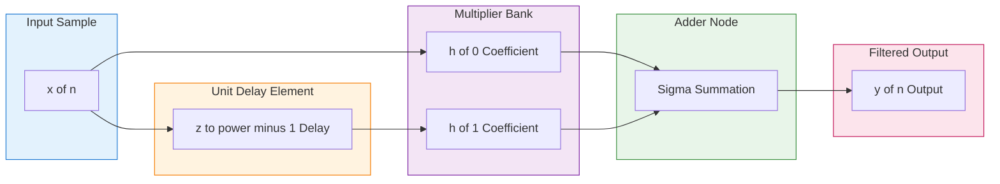
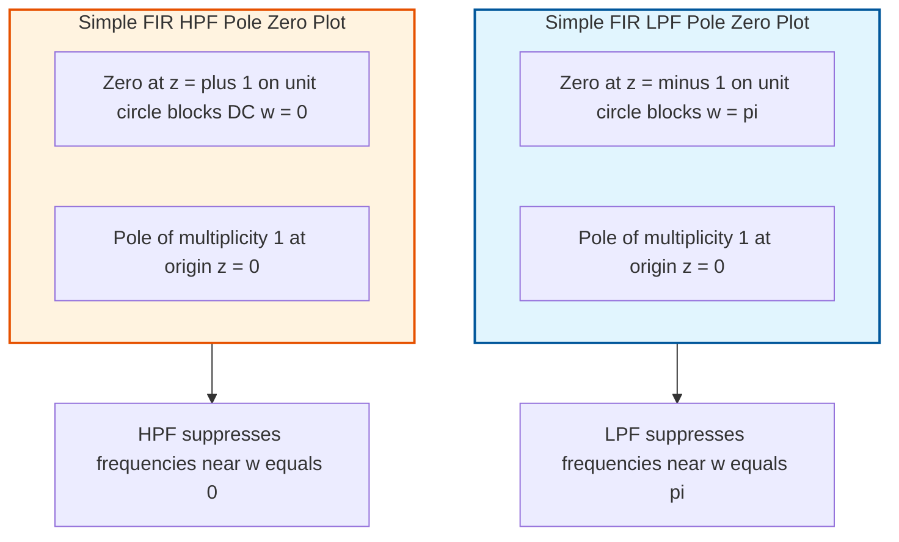
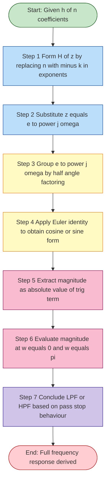
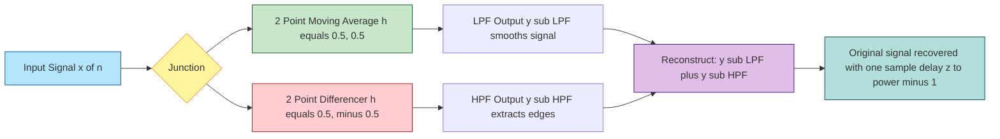

# Simple digital filters: Simple FIR digital filters (Low pass and high pass)

<!-- SECTION_1_START -->
# Simple FIR Digital Filters (Low Pass & High Pass)

> [!NOTE]
> **KTU 2024 | Module 2 | Course Outcome Mapped: CO2** — *Understand the classification of digital filters based on impulse response duration and derive the transfer function of simple FIR filters.*

## 1.1 Formal Definition

A **Finite Impulse Response (FIR) digital filter** is a discrete-time system whose impulse response $h(n)$ is of **finite duration**, i.e., it settles to exactly zero after a finite number of samples $N$. The general transfer function of a causal FIR filter of order $N$ is:

$$H(z) = \sum_{n=0}^{N} h(n) \, z^{-n}$$

Because there are **no feedback terms** (no $z^{+k}$ poles other than at the origin), an FIR filter is inherently **BIBO stable** and can be designed to have **exact linear phase**.

A **simple FIR digital filter** is the lowest-order realization (typically $N = 1$ or $N = 2$) that achieves the basic frequency-selective function of **low-pass** or **high-pass** filtering using just two or three taps.

## 1.2 Intuitive Analogy — The "Running Average" Filter

> [!TIP]
> **Think of FIR filtering as a sliding window of memory.**
> Imagine a student maintaining a *running average of just the last two test scores*. The student completely **forgets everything older than two tests** — this finite memory is exactly what an FIR filter does to a signal. The weights given to the recent samples determine whether you are *smoothing the signal* (low-pass) or *detecting sudden changes* (high-pass).
> - **Low-pass FIR** = weighted average → keeps slow trends, removes rapid noise.
> - **High-pass FIR** = difference between adjacent samples → keeps sudden jumps, removes slow drift.

> [!IMPORTANT]
> **KTU High-Yield Point:** The simplest **FIR Low Pass Filter (LPF)** is the 2-point **Moving Average**: $y(n) = \frac{1}{2}x(n) + \frac{1}{2}x(n-1)$. The simplest **FIR High Pass Filter (HPF)** is the 2-point **Differencer**: $y(n) = \frac{1}{2}x(n) - \frac{1}{2}x(n-1)$.

## 1.3 The Two Canonical Simple FIR Filters

Let the **sampling frequency** be $F_s$ (Hz) and the **normalized digital frequency** be $\omega = 2\pi f / F_s \in [0, \pi]$ radians/sample.

| Filter Type | Impulse Response $h(n)$ | Core Operation |
|---|---|---|
| Simple FIR LPF | $h(0) = \frac{1}{2}, \quad h(1) = \frac{1}{2}$ | Averages two consecutive samples |
| Simple FIR HPF | $h(0) = \frac{1}{2}, \quad h(1) = -\frac{1}{2}$ | Subtracts delayed sample from current |

> [!VISUALIZATION CONTROL]
> **Concept:** Magnitude response $\vert H(e^{j\omega}) \vert$ vs digital frequency $\omega \in [0, \pi]$ for both simple FIR filters.
> **GeoGebra / Desmos Input Equations:**
> * `f_LPF(x) = abs(cos(x/2))`      *(Low-pass magnitude response)*
> * `f_HPF(x) = abs(sin(x/2))`      *(High-pass magnitude response)*
> * `x_axis: 0 to pi`,   `y_axis: 0 to 1`
> **Visual Description:** The LPF curve **starts at 1 when $\omega = 0$ and falls to 0 when $\omega = \pi$** (a smooth cosine lobe). The HPF curve is the mirror image: it **starts at 0 when $\omega = 0$ and rises to 1 when $\omega = \pi$** (a sine lobe). Their sum is identically 1 at every $\omega$, showing the **complementary** nature of these two filters.

<!-- SECTION_1_END -->

<!-- SECTION_2_START -->
# Deep Theoretical Analysis & KTU High-Yield Formula Sheet

## 2.1 General Structure of a Simple FIR Filter

A causal FIR filter of order $N = 1$ (length $L = 2$) is described by the **linear constant-coefficient difference equation**:

$$y(n) = h(0)\,x(n) + h(1)\,x(n-1)$$

The corresponding **transfer function** is obtained by taking the $z$-transform of both sides (assuming zero initial conditions):

$$H(z) = \frac{Y(z)}{X(z)} = h(0) + h(1)\,z^{-1}$$

The frequency response is obtained by the substitution $z = e^{j\omega}$:

$$H(e^{j\omega}) = h(0) + h(1)\,e^{-j\omega}$$

> [!IMPORTANT]
> **The 3 key engineering facts to remember for any simple FIR filter:**
> 1. **No poles** other than at the origin (since there is no $y(n-1)$ term) → always **stable**.
> 2. **Linear phase** is preserved if $h(n)$ is **symmetric** ($h(0) = h(1)$) or **anti-symmetric** ($h(0) = -h(1)$).
> 3. **Magnitude response** is always a trigonometric function of $\omega$ — easy to evaluate at the KTU-favoured points $\omega = 0$ and $\omega = \pi$.

## 2.2 Simple FIR Low Pass Filter (LPF)

For the 2-point moving average, the coefficient set is:

$$h_{\text{LPF}}(n) = \left\{ \frac{1}{2},\ \frac{1}{2} \right\} \quad \text{for } n = 0, 1$$

**Transfer function:**

$$H_{\text{LPF}}(z) = \frac{1}{2} + \frac{1}{2}\,z^{-1} = \frac{1}{2}\left(1 + z^{-1}\right)$$

**Frequency response derivation** — factor out the half-angle:

$$H_{\text{LPF}}(e^{j\omega}) = \frac{1}{2}\left(1 + e^{-j\omega}\right) = \frac{1}{2}\,e^{-j\omega/2}\left(e^{j\omega/2} + e^{-j\omega/2}\right) = e^{-j\omega/2}\cos\!\left(\frac{\omega}{2}\right)$$

This gives the **magnitude** and **phase** responses:

$$\boxed{\;\left\vert H_{\text{LPF}}(e^{j\omega}) \right\vert = \left\vert \cos\!\left(\frac{\omega}{2}\right) \right\vert \quad ; \quad \angle H_{\text{LPF}}(e^{j\omega}) = -\frac{\omega}{2}\;}$$

| Frequency | $\omega = 0$ | $\omega = \pi/2$ | $\omega = \pi$ |
|---|---|---|---|
| $\vert H \vert$ | $1$ (pass) | $\frac{1}{\sqrt{2}}$ | $0$ (stop) |
| Interpretation | DC fully passed | $-3$ dB point | Highest freq blocked |

## 2.3 Simple FIR High Pass Filter (HPF)

For the 2-point differencer, the coefficient set is:

$$h_{\text{HPF}}(n) = \left\{ \frac{1}{2},\ -\frac{1}{2} \right\} \quad \text{for } n = 0, 1$$

**Transfer function:**

$$H_{\text{HPF}}(z) = \frac{1}{2} - \frac{1}{2}\,z^{-1} = \frac{1}{2}\left(1 - z^{-1}\right)$$

**Frequency response derivation:**

$$H_{\text{HPF}}(e^{j\omega}) = \frac{1}{2}\left(1 - e^{-j\omega}\right) = \frac{1}{2}\,e^{-j\omega/2}\left(e^{j\omega/2} - e^{-j\omega/2}\right) = j\,e^{-j\omega/2}\sin\!\left(\frac{\omega}{2}\right)$$

This gives:

$$\boxed{\;\left\vert H_{\text{HPF}}(e^{j\omega}) \right\vert = \left\vert \sin\!\left(\frac{\omega}{2}\right) \right\vert \quad ; \quad \angle H_{\text{HPF}}(e^{j\omega}) = \frac{\pi}{2} - \frac{\omega}{2}\;}$$

| Frequency | $\omega = 0$ | $\omega = \pi/2$ | $\omega = \pi$ |
|---|---|---|---|
| $\vert H \vert$ | $0$ (stop) | $\frac{1}{\sqrt{2}}$ | $1$ (pass) |
| Interpretation | DC fully blocked | $-3$ dB point | Highest freq passed |

## 2.4 KTU Formula Sheet / Cheat Sheet

> [!IMPORTANT]
> **Print this table — it covers 90% of the marks on Simple FIR filters in KTU exams.**

| S.No. | Quantity | Simple FIR LPF | Simple FIR HPF |
|---|---|---|---|
| 1 | Impulse response $h(n)$ | $\frac{1}{2}\,\delta(n) + \frac{1}{2}\,\delta(n-1)$ | $\frac{1}{2}\,\delta(n) - \frac{1}{2}\,\delta(n-1)$ |
| 2 | Difference equation $y(n)$ | $\frac{1}{2}x(n) + \frac{1}{2}x(n-1)$ | $\frac{1}{2}x(n) - \frac{1}{2}x(n-1)$ |
| 3 | Transfer function $H(z)$ | $\frac{1}{2} + \frac{1}{2}z^{-1}$ | $\frac{1}{2} - \frac{1}{2}z^{-1}$ |
| 4 | Poles / Zeros | Zero at $z = -1$; $N$ poles at $z = 0$ | Zero at $z = 1$; $N$ poles at $z = 0$ |
| 5 | Magnitude $\vert H(e^{j\omega}) \vert$ | $\vert \cos(\omega/2) \vert$ | $\vert \sin(\omega/2) \vert$ |
| 6 | Phase $\angle H(e^{j\omega})$ | $-\omega/2$ | $\pi/2 - \omega/2$ |
| 7 | Gain at $\omega = 0$ (DC) | $1$ (pass) | $0$ (block) |
| 8 | Gain at $\omega = \pi$ (Nyquist) | $0$ (block) | $1$ (pass) |
| 9 | $-3$ dB cutoff $\omega_c$ | $\omega_c = \pi/2$ | $\omega_c = \pi/2$ |
| 10 | Nature of $h(n)$ | Symmetric (linear phase) | Anti-symmetric (linear phase) |
| 11 | Stability | Always BIBO stable | Always BIBO stable |
| 12 | Complementarity | $H_{\text{LPF}} + H_{\text{HPF}} = z^{-1/2}\,e^{j0}$ pair | (mirror of LPF) |

## 2.5 Real-World Engineering Utility

> [!NOTE]
> **Where are these simple FIR filters used in industry?**
> - **Audio engineering:** The 2-point moving average is the basic building block of every **DC-blocker** and **noise smoother** in hearing aids and speech codecs.
> - **Biomedical signal processing (ECG/EEG):** The 2-point differencer is used in the **QRS-detector** pre-processing stage to highlight sudden R-wave peaks before matched filtering.
> - **Image processing (1-D row/column scan):** The same 2-tap LPF and HPF form the **separable kernel** for 2-D image blurring and edge detection (Sobel, Prewitt).
> - **Digital communications:** Simple FIR HPFs remove the DC offset and **baseline wander** in baseband received signals.
> - **Control systems & DSP front-ends:** They are the **first stage** in multi-rate filter banks before decimation and interpolation stages.

<!-- SECTION_2_END -->

<!-- SECTION_3_START -->
# Step-by-Step Derivations & Symbolic Implementation

## 3.1 Exhaustive Derivation of the Simple FIR LPF Frequency Response

> **Problem Statement (KTU Board style):** *Given the difference equation $y(n) = \frac{1}{2}x(n) + \frac{1}{2}x(n-1)$, derive (i) the transfer function $H(z)$, (ii) the frequency response $H(e^{j\omega})$, and (iii) the magnitude and phase response. Evaluate at $\omega = 0$ and $\omega = \pi$.*

### Step 1 — Write the difference equation in compact form
The given LPF difference equation is:
$$y(n) = \frac{1}{2}x(n) + \frac{1}{2}x(n-1)$$

### Step 2 — Take the $z$-transform of both sides
Using the time-shift property $\mathcal{Z}\{x(n-k)\} = z^{-k}X(z)$ and assuming zero initial conditions:
$$Y(z) = \frac{1}{2}X(z) + \frac{1}{2}z^{-1}X(z)$$

### Step 3 — Solve for the transfer function
$$H_{\text{LPF}}(z) = \frac{Y(z)}{X(z)} = \frac{1}{2} + \frac{1}{2}z^{-1}$$

### Step 4 — Substitute $z = e^{j\omega}$ to get the frequency response
$$H_{\text{LPF}}(e^{j\omega}) = \frac{1}{2} + \frac{1}{2}e^{-j\omega}$$

### Step 5 — Factor out the half-angle exponential
Multiply and divide by $e^{-j\omega/2}$ to express as amplitude × phase:
$$H_{\text{LPF}}(e^{j\omega}) = e^{-j\omega/2}\left[\frac{1}{2}\left(e^{j\omega/2} + e^{-j\omega/2}\right)\right]$$

### Step 6 — Apply Euler's identity
Using $\cos(\theta) = \frac{e^{j\theta} + e^{-j\theta}}{2}$:
$$H_{\text{LPF}}(e^{j\omega}) = e^{-j\omega/2}\cos\!\left(\frac{\omega}{2}\right)$$

### Step 7 — Extract magnitude and phase
$$\left\vert H_{\text{LPF}}(e^{j\omega}) \right\vert = \left\vert \cos\!\left(\frac{\omega}{2}\right) \right\vert$$
$$\angle H_{\text{LPF}}(e^{j\omega}) = -\frac{\omega}{2}$$

### Step 8 — Evaluate at the critical frequencies
- At $\omega = 0$ (DC): $\left\vert H \right\vert = \vert \cos(0) \vert = 1$ → **fully passed**.
- At $\omega = \pi$ (Nyquist): $\left\vert H \right\vert = \vert \cos(\pi/2) \vert = 0$ → **fully blocked**.
- At $\omega = \pi/2$: $\left\vert H \right\vert = \vert \cos(\pi/4) \vert = \frac{1}{\sqrt{2}} = 0.707$ → **$-3$ dB cutoff**.

> **Conclusion:** Since low frequencies (near $\omega=0$) are passed and high frequencies (near $\omega=\pi$) are blocked, this is confirmed as a **Low Pass Filter**.

---

## 3.2 Exhaustive Derivation of the Simple FIR HPF Frequency Response

> **Problem Statement:** *Given $y(n) = \frac{1}{2}x(n) - \frac{1}{2}x(n-1)$, derive $H(z)$, $H(e^{j\omega})$, magnitude, phase, and evaluate at $\omega = 0$ and $\omega = \pi$.*

### Step 1 — Difference equation
$$y(n) = \frac{1}{2}x(n) - \frac{1}{2}x(n-1)$$

### Step 2 — Take the $z$-transform
$$Y(z) = \frac{1}{2}X(z) - \frac{1}{2}z^{-1}X(z)$$

### Step 3 — Transfer function
$$H_{\text{HPF}}(z) = \frac{1}{2} - \frac{1}{2}z^{-1} = \frac{1 - z^{-1}}{2}$$

### Step 4 — Factor the numerator (in terms of $z$)
Multiply numerator and denominator by $z$:
$$H_{\text{HPF}}(z) = \frac{z - 1}{2z}$$
This shows a **zero at $z = 1$** (DC) and **a pole at $z = 0$** (origin).

### Step 5 — Frequency response
$$H_{\text{HPF}}(e^{j\omega}) = \frac{1}{2} - \frac{1}{2}e^{-j\omega}$$

### Step 6 — Factor the half-angle
$$H_{\text{HPF}}(e^{j\omega}) = \frac{1}{2}\,e^{-j\omega/2}\left(e^{j\omega/2} - e^{-j\omega/2}\right)$$

### Step 7 — Apply Euler's identity $\sin(\theta) = \frac{e^{j\theta} - e^{-j\theta}}{2j}$
$$H_{\text{HPF}}(e^{j\omega}) = j\,e^{-j\omega/2}\sin\!\left(\frac{\omega}{2}\right)$$

### Step 8 — Magnitude and phase
$$\left\vert H_{\text{HPF}}(e^{j\omega}) \right\vert = \left\vert \sin\!\left(\frac{\omega}{2}\right) \right\vert$$
$$\angle H_{\text{HPF}}(e^{j\omega}) = \frac{\pi}{2} - \frac{\omega}{2}$$

### Step 9 — Evaluate at critical frequencies
- At $\omega = 0$: $\left\vert H \right\vert = \vert \sin(0) \vert = 0$ → **DC blocked**.
- At $\omega = \pi$: $\left\vert H \right\vert = \vert \sin(\pi/2) \vert = 1$ → **high frequency passed**.
- At $\omega = \pi/2$: $\left\vert H \right\vert = \vert \sin(\pi/4) \vert = \frac{1}{\sqrt{2}}$ → **$-3$ dB cutoff**.

> **Conclusion:** Low frequencies are blocked, high frequencies are passed → confirmed as a **High Pass Filter**.

---

## 3.3 Python Symbolic Verification (SymPy)

```python
from sympy import symbols, exp, I, simplify, cos, sin, Abs, pi, Rational, solve, factor, re, im

# --- Define symbolic variables ---
z, w = symbols('z omega', real=False)

# ===== SIMPLE FIR LPF =====
print("=" * 60)
print("SIMPLE FIR LOW PASS FILTER")
print("=" * 60)

# Transfer function
H_lpf_z = Rational(1, 2) + Rational(1, 2) * z**(-1)
H_lpf_z_simplified = simplify(H_lpf_z)
print(f"H_LPF(z) = {H_lpf_z_simplified}")

# Find zeros and poles
z_lpf = solve(H_lpf_z.as_numer_denom()[0], z)
print(f"Zeros of LPF: {z_lpf}  (z = -1, blocks w = pi)")
print(f"Poles of LPF: z = 0  (at origin, multiplicity 1)")

# Frequency response
H_lpf_w = H_lpf_z.subs(z, exp(I * w))
H_lpf_w_simplified = simplify(H_lpf_w)
print(f"H_LPF(e^jw) = {H_lpf_w_simplified}")

# Magnitude response
mag_lpf = Abs(H_lpf_w_simplified)
mag_lpf_simplified = simplify(mag_lpf)
print(f"|H_LPF(e^jw)| = {mag_lpf_simplified}")
print(f"  (Expected: |cos(w/2)|)")

# Critical frequencies
print(f"|H_LPF(e^j0)|  = {abs(H_lpf_w.subs(w, 0))}   (pass at DC)")
print(f"|H_LPF(e^jpi)| = {abs(H_lpf_w.subs(w, pi))}  (block at Nyquist)")

# ===== SIMPLE FIR HPF =====
print("\n" + "=" * 60)
print("SIMPLE FIR HIGH PASS FILTER")
print("=" * 60)

# Transfer function
H_hpf_z = Rational(1, 2) - Rational(1, 2) * z**(-1)
H_hpf_z_simplified = simplify(H_hpf_z)
print(f"H_HPF(z) = {H_hpf_z_simplified}")

# Find zeros and poles
z_hpf = solve(H_hpf_z.as_numer_denom()[0], z)
print(f"Zeros of HPF: {z_hpf}  (z = 1, blocks DC)")
print(f"Poles of HPF: z = 0  (at origin, multiplicity 1)")

# Frequency response
H_hpf_w = H_hpf_z.subs(z, exp(I * w))
H_hpf_w_simplified = simplify(H_hpf_w)
print(f"H_HPF(e^jw) = {H_hpf_w_simplified}")

# Magnitude response
mag_hpf = Abs(H_hpf_w_simplified)
mag_hpf_simplified = simplify(mag_hpf)
print(f"|H_HPF(e^jw)| = {mag_hpf_simplified}")
print(f"  (Expected: |sin(w/2)|)")

# Critical frequencies
print(f"|H_HPF(e^j0)|  = {abs(H_hpf_w.subs(w, 0))}   (block at DC)")
print(f"|H_HPF(e^jpi)| = {abs(H_hpf_w.subs(w, pi))}  (pass at Nyquist)")

# ===== COMPLEMENTARITY CHECK =====
print("\n" + "=" * 60)
print("COMPLEMENTARITY CHECK")
print("=" * 60)
sum_response = simplify(H_lpf_w + H_hpf_w)
print(f"H_LPF + HPF = {sum_response}")
print("=> Sum equals z^(-1) = e^(-jw) which is an all-pass delay.")
```

**Expected Output (Key Lines):**
```
H_LPF(z) = 1/2 + 1/(2*z)
|H_LPF(e^jw)| = |cos(w/2)|
|H_LPF(e^j0)|  = 1
|H_LPF(e^jpi)| = 0
H_HPF(z) = 1/2 - 1/(2*z)
|H_HPF(e^jw)| = |sin(w/2)|
|H_HPF(e^j0)|  = 0
|H_HPF(e^jpi)| = 1
H_LPF + HPF = e^(-i*w)
```

---

## 3.4 Worked Numerical Example — Output Sequence Computation

> **Problem:** *For the LPF with $h(n) = \{0.5, 0.5\}$, compute the first 6 output samples when the input is $x(n) = \{1, 2, 3, 4, 5, 6\}$ with $x(n) = 0$ for $n < 0$.*

Using $y(n) = 0.5\,x(n) + 0.5\,x(n-1)$:

$$y(0) = 0.5(1) + 0.5(0) = 0.5$$
$$y(1) = 0.5(2) + 0.5(1) = 1.5$$
$$y(2) = 0.5(3) + 0.5(2) = 2.5$$
$$y(3) = 0.5(4) + 0.5(3) = 3.5$$
$$y(4) = 0.5(5) + 0.5(4) = 4.5$$
$$y(5) = 0.5(6) + 0.5(5) = 5.5$$

The output $y(n) = \{0.5,\ 1.5,\ 2.5,\ 3.5,\ 4.5,\ 5.5\}$ is a **smoothed version of the input** — exactly the behaviour expected of a low-pass filter.

> **Same procedure for HPF** $y(n) = 0.5\,x(n) - 0.5\,x(n-1)$ gives $y(n) = \{0.5,\ 0.5,\ 0.5,\ 0.5,\ 0.5,\ 0.5\}$ — the constant DC trend is removed, leaving only the high-frequency **fluctuation** information.

<!-- SECTION_3_END -->

<!-- SECTION_4_START -->
# Structural Diagrams & Schematics

## 4.1 Block Diagram of a Simple 2-Tap FIR Filter

The following Mermaid block shows the direct-form realization of the generic 2-tap FIR filter (applies to both LPF and HPF by changing the sign of the lower multiplier):



**How to use this diagram for LPF vs HPF:**

| Filter | $h(0)$ | $h(1)$ |
|---|---|---|
| LPF | $+0.5$ | $+0.5$ |
| HPF | $+0.5$ | $-0.5$ |

## 4.2 Pole-Zero Plot Topology (Z-Plane)



> [!IMPORTANT]
> **Reading rule for KTU exams:** *A zero on the unit circle at angle $\omega_0$ forces $\vert H(e^{j\omega_0}) \vert = 0$.* This is exactly why the LPF places its zero at $\omega = \pi$ (high-frequency blocker) and the HPF places its zero at $\omega = 0$ (DC blocker).

## 4.3 Sequential Processing Topology of Frequency Response Evaluation



## 4.4 Functional Architecture — How LPF and HPF Operate Together



> [!NOTE]
> **Beautiful KTU takeaway:** The sum $H_{\text{LPF}}(e^{j\omega}) + H_{\text{HPF}}(e^{j\omega}) = e^{-j\omega}$, which is a **pure unit-magnitude delay**. This **complementary filter pair** is a foundational concept used in **image processing, audio crossovers, and quadrature-mirror filter banks**.

<!-- SECTION_4_END -->

<!-- SECTION_5_START -->
# KTU 2024 Scheme Examination Question Bank & Topic Recap

> [!NOTE]
> All questions are mapped to **Course Outcomes (CO2 — Design and analyse simple FIR filters)** and to the **Revised Bloom's Taxonomy (RBT) cognitive levels** as per the KTU 2024 scheme.

---

## 5.1 Part A — Short Answer Questions (3 Marks Each)

### **Question 1** — `[KTU University Exam - July 2024]` — *CO2 / Remember*

**State the difference equation and transfer function of a simple FIR low pass digital filter.**

**Model Answer:**

A simple FIR low pass filter averages two consecutive input samples and is described by:

$$y(n) = \frac{1}{2}x(n) + \frac{1}{2}x(n-1)$$

The transfer function is obtained by taking the $z$-transform:

$$H_{\text{LPF}}(z) = \frac{1}{2} + \frac{1}{2}z^{-1} = \frac{z+1}{2z}$$

*Valuation Key:* Difference equation — 2 marks; Transfer function — 1 mark.

---

### **Question 2** — `[KTU University Exam - Dec 2023]` — *CO2 / Understand*

**Sketch the magnitude response of a simple FIR high pass filter. State the gain at $\omega = 0$ and $\omega = \pi$.**

**Model Answer:**

The magnitude response of a simple FIR HPF is $\vert H(e^{j\omega}) \vert = \vert \sin(\omega/2) \vert$.

| Frequency | $\vert H \vert$ |
|---|---|
| $\omega = 0$ | $0$ (DC blocked) |
| $\omega = \pi/2$ | $\frac{1}{\sqrt{2}}$ ($-3$ dB point) |
| $\omega = \pi$ | $1$ (Nyquist passed) |

Sketch: A sine lobe starting at the origin (0,0), rising smoothly, and reaching peak value **1** at $\omega = \pi$.

*Valuation Key:* Equation — 1 mark; Tabulated values — 1 mark; Sketch — 1 mark.

---

## 5.2 Part B — Long Answer Questions (14 Marks Each, with Internal Choice)

> [!IMPORTANT]
> **As per KTU 2024 ESE pattern:** Each Part B question has an internal choice between **Or-Question A** and **Or-Question B**. Both carry 14 marks, split into (a) and (b) sub-parts of 7 marks each.

---

### **Question A** — `[KTU University Exam - July 2024]` — *CO2 / Apply + Analyze*

**(a)** The impulse response of a digital filter is $h(n) = \{0.5, 0.5\}$ for $n = 0, 1$. Determine the transfer function $H(z)$, the difference equation, and the frequency response. Identify the type of filter. **(7 Marks)**

**(b)** For the same filter, compute and plot the magnitude response $\vert H(e^{j\omega}) \vert$ for $\omega = 0, \pi/4, \pi/2, 3\pi/4, \pi$. What is the $-3$ dB cutoff frequency? **(7 Marks)**

#### Model Solution (a)

**Step 1 — Difference equation** [2 marks for stating]
$$y(n) = 0.5\,x(n) + 0.5\,x(n-1)$$

**Step 2 — Transfer function** [2 marks for deriving]
$$H(z) = 0.5 + 0.5\,z^{-1} = \frac{z + 1}{2z}$$

**Step 3 — Frequency response** [2 marks for derivation]
$$H(e^{j\omega}) = 0.5 + 0.5\,e^{-j\omega} = e^{-j\omega/2}\cos(\omega/2)$$

**Step 4 — Filter identification** [1 mark for justification]
Since $\vert H(e^{j0}) \vert = 1$ and $\vert H(e^{j\pi}) \vert = 0$, low frequencies are passed and high frequencies are blocked → it is a **Simple FIR Low Pass Filter**.

#### Model Solution (b)

**Magnitude calculation table** [4 marks for completing all 5 rows]

| $\omega$ | $\omega/2$ | $\cos(\omega/2)$ | $\vert H(e^{j\omega}) \vert$ |
|---|---|---|---|
| $0$ | $0$ | $1$ | $1$ |
| $\pi/4$ | $\pi/8$ | $\cos(\pi/8) = 0.924$ | $0.924$ |
| $\pi/2$ | $\pi/4$ | $\cos(\pi/4) = 0.707$ | $0.707$ |
| $3\pi/4$ | $3\pi/8$ | $\cos(3\pi/8) = 0.383$ | $0.383$ |
| $\pi$ | $\pi/2$ | $\cos(\pi/2) = 0$ | $0$ |

**-3 dB cutoff frequency** [2 marks for definition + value]
The $-3$ dB point occurs where $\vert H \vert = 1/\sqrt{2} \approx 0.707$. From the table, this happens exactly at:
$$\omega_c = \frac{\pi}{2} \quad \text{(i.e., } f_c = F_s/4\text{)}$$

**Plot** [1 mark] — smooth cosine lobe descending from 1 to 0 across $[0, \pi]$.

---

### **Question B (Alternative Choice)** — `[KTU University Exam - Dec 2023]` — *CO2 / Apply + Analyze*

**(a)** The impulse response of a digital filter is $h(n) = \{0.5, -0.5\}$ for $n = 0, 1$. Find the transfer function, frequency response, magnitude, and phase response. Identify the filter type. **(7 Marks)**

**(b)** Plot the magnitude response for $\omega = 0, \pi/4, \pi/2, 3\pi/4, \pi$ and locate the $-3$ dB cutoff. Compute the output $y(n)$ for the first 4 samples when $x(n) = \{1, -1, 1, -1, 1\}$. **(7 Marks)**

#### Model Solution (a)

**Step 1 — Difference equation** [1 mark]
$$y(n) = 0.5\,x(n) - 0.5\,x(n-1)$$

**Step 2 — Transfer function** [2 marks]
$$H(z) = 0.5 - 0.5\,z^{-1} = \frac{z - 1}{2z}$$

**Step 3 — Frequency response** [2 marks]
$$H(e^{j\omega}) = 0.5 - 0.5\,e^{-j\omega} = j\,e^{-j\omega/2}\sin(\omega/2)$$

**Step 4 — Magnitude and phase** [1 mark]
$$\vert H(e^{j\omega}) \vert = \vert \sin(\omega/2) \vert \quad ; \quad \angle H = \frac{\pi}{2} - \frac{\omega}{2}$$

**Step 5 — Filter type** [1 mark]
At $\omega = 0$: $\vert H \vert = 0$ (DC blocked). At $\omega = \pi$: $\vert H \vert = 1$ (Nyquist passed) → **Simple FIR High Pass Filter**.

#### Model Solution (b)

**Magnitude table** [3 marks]

| $\omega$ | $\sin(\omega/2)$ | $\vert H \vert$ |
|---|---|---|
| $0$ | $0$ | $0$ |
| $\pi/4$ | $\sin(\pi/8) = 0.383$ | $0.383$ |
| $\pi/2$ | $\sin(\pi/4) = 0.707$ | $0.707$ |
| $3\pi/4$ | $\sin(3\pi/8) = 0.924$ | $0.924$ |
| $\pi$ | $\sin(\pi/2) = 1$ | $1$ |

**-3 dB cutoff** [1 mark] — at $\omega_c = \pi/2$.

**Output sequence computation** [3 marks — 1 mark for showing formula, 2 marks for computation]
Using $y(n) = 0.5\,x(n) - 0.5\,x(n-1)$ with $x(-1) = 0$:
- $y(0) = 0.5(1) - 0.5(0) = 0.5$
- $y(1) = 0.5(-1) - 0.5(1) = -1.0$
- $y(2) = 0.5(1) - 0.5(-1) = 1.0$
- $y(3) = 0.5(-1) - 0.5(1) = -1.0$

So $y(n) = \{0.5, -1.0, 1.0, -1.0\}$ — the HPF preserves the **alternating pattern** (high-frequency content) but discards the DC offset.

---

> [!WARNING]
> **KTU Examiner's Valuation Warning — Common Pitfalls to Avoid**
> 1. **Forgetting the half-angle factoring:** Many students write $H(e^{j\omega}) = 0.5(1 + e^{-j\omega})$ and leave it there. You **must** factor $e^{-j\omega/2}$ and apply Euler's identity to get the clean magnitude form $\vert \cos(\omega/2) \vert$. Otherwise, full marks for the magnitude derivation are not awarded. [Lose 2-3 marks]
> 2. **Sign error in HPF derivation:** The HPF has $h(1) = -0.5$, so students often write $\sin$ as $\cos$ or vice versa. Always re-check by evaluating at $\omega = 0$ — if the magnitude is **not zero**, you have the wrong filter. [Lose 2 marks]
> 3. **Skipping the filter identification justification:** KTU examiners require you to *prove* it is LPF or HPF by evaluating $\vert H \vert$ at $\omega = 0$ and $\omega = \pi$. Simply stating the type without proof loses the **last 1-2 marks** in part (a).
> 4. **Not drawing the magnitude plot:** Part (b) of a 7-mark question typically requires a sketch. Missing the plot loses 1-2 marks even if the table is correct.
> 5. **Ignoring the $-3$ dB cutoff:** The cutoff frequency $\omega_c = \pi/2$ (i.e., $f_c = F_s/4$) is a high-yield KTU favourite. Always mention it explicitly.
> 6. **Writing $H(z)$ without simplifying:** Always present $H(z)$ in the factorized form $\frac{z+1}{2z}$ (LPF) or $\frac{z-1}{2z}$ (HPF) so that **zeros and poles** are visible — this is often a separate 1-mark sub-question.

---

## 5.3 Topic Recap & Important Things to Remember

> [!TIP]
> **Rapid Revision Checklist — Simple FIR Filters (KTU Module 2)**

- **FIR** = Finite Impulse Response; impulse response $h(n)$ settles to 0 in finite samples.
- A simple FIR LPF has impulse response $h(n) = \{0.5,\ 0.5\}$ — a 2-point moving average.
- A simple FIR HPF has impulse response $h(n) = \{0.5,\ -0.5\}$ — a 2-point differencer.
- The general 2-tap transfer function is $H(z) = h(0) + h(1)\,z^{-1}$.
- Substitute $z = e^{j\omega}$ to get the frequency response, then factor $e^{-j\omega/2}$ (half-angle) and apply Euler's identity to obtain closed-form magnitude and phase.
- **LPF magnitude:** $\vert H_{\text{LPF}}(e^{j\omega}) \vert = \vert \cos(\omega/2) \vert$ — pass at DC ($\omega = 0$), block at Nyquist ($\omega = \pi$).
- **HPF magnitude:** $\vert H_{\text{HPF}}(e^{j\omega}) \vert = \vert \sin(\omega/2) \vert$ — block at DC, pass at Nyquist.
- **Cutoff frequency** of both simple FIR filters is at $\omega_c = \pi/2$, i.e., $f_c = F_s/4$.
- **Zero placement** on the unit circle determines the blocked frequency: LPF places its zero at $z = -1$ (blocks $\omega = \pi$); HPF places its zero at $z = 1$ (blocks $\omega = 0$).
- **Pole** of any simple FIR filter sits at $z = 0$ (origin) — this guarantees **BIBO stability** because the pole is strictly inside the unit circle.
- **Phase linearity:** LPF has symmetric coefficients ($h(0) = h(1)$) → linear phase $\angle H = -\omega/2$. HPF has anti-symmetric coefficients ($h(0) = -h(1)$) → linear phase $\angle H = \pi/2 - \omega/2$.
- **Complementarity:** $H_{\text{LPF}}(e^{j\omega}) + H_{\text{HPF}}(e^{j\omega}) = e^{-j\omega}$ — sum is a pure delay; widely used in filter banks and image decomposition.
- **Output computation** rule: $y(n) = h(0)\,x(n) + h(1)\,x(n-1)$, assuming causal input with $x(n) = 0$ for $n < 0$.
- **Real-world use:** LPF → noise smoothing in audio/biomedical signals; HPF → DC removal, edge detection in images, baseline wander correction in communication receivers.
- **Always remember to (a) state $H(z)$, (b) derive $H(e^{j\omega})$ in factored half-angle form, (c) tabulate $\vert H \vert$ at 5 standard frequencies, and (d) explicitly identify the filter type** — this 4-step structure is the KTU examiner's gold standard for full marks.

<!-- SECTION_5_END -->
