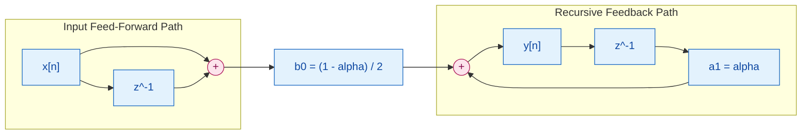
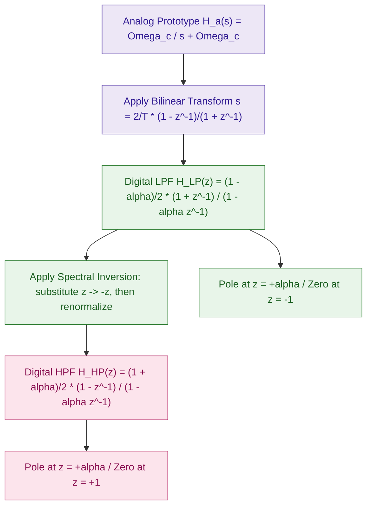
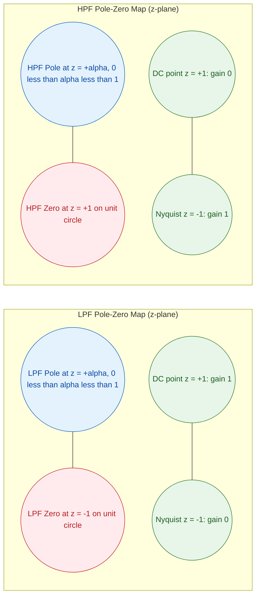

# Simple IIR digital filters (Low pass and high pass)

<!-- SECTION_1_START -->
# Simple IIR Digital Filters — Low Pass & High Pass

## 1.1 Formal Definition (KTU 2024 Scheme Terminology)

An **Infinite Impulse Response (IIR) digital filter** is a recursive discrete-time system whose output $y[n]$ depends not only on the present and past input samples $x[n], x[n-1], \dots$ but **also on past output samples** $y[n-1], y[n-2], \dots$. This feedback (recursive) structure produces an impulse response of theoretically infinite duration, hence the name "IIR."

The general **$N$-th order IIR difference equation** is:

$$\sum_{k=0}^{N} a_k \, y[n-k] = \sum_{k=0}^{M} b_k \, x[n-k]$$

with $a_0 = 1$ by convention. The corresponding **transfer function** is the $Z$-domain ratio of polynomials:

$$H(z) = \frac{Y(z)}{X(z)} = \frac{\displaystyle \sum_{k=0}^{M} b_k \, z^{-k}}{\displaystyle \sum_{k=0}^{N} a_k \, z^{-k}} = \frac{B(z)}{A(z)}$$

A **Simple First-Order IIR filter** uses $M = N = 1$:

$$H(z) = \frac{b_0 + b_1 z^{-1}}{1 + a_1 z^{-1}}$$

> [!IMPORTANT]
> **KTU Syllabus Highlight (Module 2):** The "simple" qualifier refers to the canonical **single-pole, single-zero** design derived from the analog prototype $H_a(s) = \dfrac{\Omega_c}{s + \Omega_c}$ mapped to the digital domain by the **Bilinear Transformation** (BLT). It is *not* a high-order Butterworth or Chebyshev design.

---

## 1.2 Conceptual Analogy & Geometric Intuition

Imagine a **water tank with a small leak at the bottom**. Every time you pour water in (the input $x[n]$), the tank holds some of it (the recursive feedback term $\alpha \, y[n-1]$) while the rest flows out (the feed-forward term). The water level never truly forgets the past — older pours still influence the level, but with diminishing memory. This is exactly how an IIR filter behaves: each new sample adds to a *weighted sum of all past outputs*, with weights that decay geometrically.

**Geometric (Pole-Zero) Intuition:**

> [!NOTE]
> A first-order IIR filter has **one pole** at $z = -\alpha$ and **one zero** at $z = -1$ (LPF) or $z = +1$ (HPF). The pole **pulls** the frequency response upward near it; the zero **pushes** it downward. The closer the pole sits to the unit circle ($\alpha \to 1$), the sharper the filter transition — but the system becomes increasingly resonant and noisy.

For a **Low-Pass Filter (LPF)**, the zero at $z = -1$ cancels the high frequency ($\omega = \pi$), while the pole near $z = 1$ reinforces low frequencies ($\omega = 0$).

For a **High-Pass Filter (HPF)**, the zero at $z = +1$ cancels the DC component ($\omega = 0$), while the pole near $z = -1$ reinforces high frequencies ($\omega = \pi$).

---

## 1.3 Physical Constants & Design Parameters

- **$\alpha$** — Pole location on the real axis inside the unit circle. Range: $0 < \alpha < 1$. **Bold emphasis on stability:** for a causal stable IIR filter, **all poles must lie strictly inside the unit circle**, i.e. $\vert p_k \vert < 1$.
- **$T$** — Sampling period. Critical frequencies are referenced to the sampling rate $F_s = 1/T$.
- **$\omega_c$** — Digital cutoff frequency in **radians/sample**, satisfying $0 < \omega_c < \pi$.
- **$\Omega_c$** — Analog cutoff frequency in **rad/s**, related to $\omega_c$ by **pre-warping** in the BLT method.

> [!VISUALIZATION CONTROL]
> **Concept:** Pole-Zero placement of simple LPF and HPF on the $z$-plane.
> **GeoGebra / Desmos Input Commands:**
> * Point 1: `(1, 0)` with label `LPF pole at z = alpha`
> * Point 2: `(-1, 0)` with label `LPF zero at z = -1`
> * Point 3: `(-alpha, 0)` with label `HPF pole`
> * Point 4: `(1, 0)` with label `HPF zero at z = 1`
> * Circle: `x^2 + y^2 = 1` (Unit circle)
> **Visual Description:** The student should observe that for the LPF, the pole sits on the *positive* real axis near the unit circle, while the zero sits on the *negative* real axis on the unit circle (forcing $H(\pi) = 0$). The roles are mirrored for the HPF. Vary $\alpha$ from 0.1 to 0.95 and observe the pole migrating outward, sharpening the filter response.

<!-- SECTION_1_END -->

<!-- SECTION_2_START -->
# 2. Deep Theoretical Analysis & KTU High-Yield Formula Sheet

## 2.1 Derivation from the Analog Prototype

The standard analog first-order low-pass filter has the transfer function:

$$H_a(s) = \frac{\Omega_c}{s + \Omega_c}$$

Applying the **Bilinear Transformation** $s = \dfrac{2}{T} \cdot \dfrac{1 - z^{-1}}{1 + z^{-1}}$:

$$\begin{aligned}
H(z) &= \frac{\Omega_c}{\dfrac{2}{T} \cdot \dfrac{1 - z^{-1}}{1 + z^{-1}} + \Omega_c} \\
&= \frac{\Omega_c \cdot T \cdot (1 + z^{-1})}{2(1 - z^{-1}) + \Omega_c T (1 + z^{-1})} \\
&= \frac{\Omega_c T (1 + z^{-1})}{(2 + \Omega_c T) + (\Omega_c T - 2) z^{-1}}
\end{aligned}$$

Dividing numerator and denominator by $(2 + \Omega_c T)$ yields the canonical **simple digital LPF**:

$$\boxed{H_{LP}(z) = \frac{1 - \alpha}{2} \cdot \frac{1 + z^{-1}}{1 - \alpha z^{-1}}}$$

where the pole coefficient is

$$\alpha = \frac{2 - \Omega_c T}{2 + \Omega_c T} = \frac{1 - \tan(\omega_c/2)^{-1} \cdot \ldots}{1 + \ldots}$$

A more practical form using the digital cutoff is

$$\alpha = \frac{1 - \sin\omega_c}{\cos\omega_c}$$

with the corresponding **3 dB digital cutoff frequency** in terms of $\alpha$:

$$\boxed{\omega_c = \arccos(\alpha) \quad \text{rad/sample}}$$

The pre-warped analog cutoff is

$$\Omega_c = \frac{2}{T} \tan\!\left(\frac{\omega_c}{2}\right) \quad \text{rad/s}$$

---

## 2.2 Magnitude & Phase Response

Substituting $z = e^{j\omega}$:

$$H_{LP}(e^{j\omega}) = \frac{1 - \alpha}{2} \cdot \frac{1 + e^{-j\omega}}{1 - \alpha e^{-j\omega}}$$

Magnitude response:

$$|H_{LP}(e^{j\omega})| = \frac{1 - \alpha}{2} \cdot \frac{\sqrt{2 + 2\cos\omega}}{\sqrt{1 - 2\alpha\cos\omega + \alpha^2}}$$

Normalized boundary values:

* At $\omega = 0$ (DC): $\vert H_{LP}(1) \vert = 1$ ✓ (passes DC)
* At $\omega = \pi$ (Nyquist): $\vert H_{LP}(-1) \vert = 0$ ✓ (rejects high frequency)

The **HPF** is obtained by **spectral inversion** — replace $z^{-1} \to -z^{-1}$ in the LPF (i.e., substitute $z \to -z$):

$$\boxed{H_{HP}(z) = \frac{1 + \alpha}{2} \cdot \frac{1 - z^{-1}}{1 - \alpha z^{-1}}}$$

Magnitude response:

$$|H_{HP}(e^{j\omega})| = \frac{1 + \alpha}{2} \cdot \frac{\sqrt{2 - 2\cos\omega}}{\sqrt{1 - 2\alpha\cos\omega + \alpha^2}}$$

Normalized boundary values:

* At $\omega = 0$: $\vert H_{HP}(1) \vert = 0$ ✓ (rejects DC)
* At $\omega = \pi$: $\vert H_{HP}(-1) \vert = 1$ ✓ (passes high frequency)

---

## 2.3 Difference Equation & Direct-Form-I Realization

**LPF:**

$$y[n] = \alpha \, y[n-1] + \frac{1 - \alpha}{2} \big( x[n] + x[n-1] \big)$$

**HPF:**

$$y[n] = \alpha \, y[n-1] + \frac{1 + \alpha}{2} \big( x[n] - x[n-1] \big)$$

> [!NOTE]
> **Real-World Engineering Utility:** Simple first-order IIR filters are deployed in production systems for **audio tone controls** (bass/treble knobs), **DC-blocking** in AC-coupled audio codecs, **anti-aliasing** in successive-approximation ADCs, **biomedical signal processing** (ECG baseline wander removal), and **embedded sensor conditioning** where computational cost and memory footprint are critical. They are preferred over FIR filters when a sharp roll-off is needed with minimal order, at the cost of nonlinear phase.

---

## 2.4 KTU High-Yield Formula Cheat Sheet

| Parameter | LPF Formula | HPF Formula |
|---|---|---|
| Transfer function $H(z)$ | $\dfrac{1 - \alpha}{2} \cdot \dfrac{1 + z^{-1}}{1 - \alpha z^{-1}}$ | $\dfrac{1 + \alpha}{2} \cdot \dfrac{1 - z^{-1}}{1 - \alpha z^{-1}}$ |
| Pole location | $z = +\alpha$ | $z = +\alpha$ |
| Zero location | $z = -1$ | $z = +1$ |
| $\alpha$ from $\omega_c$ | $\dfrac{1 - \sin\omega_c}{\cos\omega_c}$ | $\dfrac{1 - \sin\omega_c}{\cos\omega_c}$ |
| $\omega_c$ from $\alpha$ | $\arccos(\alpha)$ rad/sample | $\arccos(\alpha)$ rad/sample |
| DC gain $\vert H(1) \vert$ | $1$ | $0$ |
| Nyquist gain $\vert H(-1) \vert$ | $0$ | $1$ |
| 3 dB cutoff | $\omega_c$ | $\omega_c$ |
| Stability condition | $\vert \alpha \vert < 1$ | $\vert \alpha \vert < 1$ |
| Real-time mapping | $s \to \dfrac{2}{T} \cdot \dfrac{1 - z^{-1}}{1 + z^{-1}}$ | Spectral inversion $z \to -z$ of LPF |

<!-- SECTION_2_END -->

<!-- SECTION_3_START -->
# 3. Step-by-Step Derivations & Symbolic Implementation

## 3.1 Worked Derivation: From Analog Prototype to Digital LPF

**Problem:** Design a simple first-order digital IIR LPF with cutoff $\omega_c = \pi/4$ rad/sample. Use the bilinear transformation with sampling period $T = 1$ s.

**Step 1 — Compute the pole coefficient $\alpha$:**

$$\alpha = \frac{1 - \sin(\pi/4)}{\cos(\pi/4)} = \frac{1 - \tfrac{\sqrt{2}}{2}}{\tfrac{\sqrt{2}}{2}} = \frac{2}{\sqrt{2}} - 1 = \sqrt{2} - 1$$

Numerically: $\alpha = 1.41421356 - 1 = 0.41421356$.

**Step 2 — Compute the normalization constant:**

$$\frac{1 - \alpha}{2} = \frac{1 - 0.41421356}{2} = \frac{0.58578644}{2} = 0.29289322$$

**Step 3 — Write the transfer function:**

$$H_{LP}(z) = \frac{0.29289322 \, (1 + z^{-1})}{1 - 0.41421356 \, z^{-1}}$$

**Step 4 — Verify the magnitude response at three key frequencies:**

At $\omega = 0$ (DC): $z = 1$

$$H_{LP}(1) = \frac{0.29289322 \cdot 2}{1 - 0.41421356} = \frac{0.58578644}{0.58578644} = 1.000 \checkmark$$

At $\omega = \pi$ (Nyquist): $z = -1$

$$H_{LP}(-1) = \frac{0.29289322 \cdot 0}{1 + 0.41421356} = 0 \checkmark$$

At $\omega = \pi/4$ (cutoff): $z = e^{j\pi/4}$. The magnitude is by definition $\tfrac{1}{\sqrt{2}} \approx 0.7071$ of the DC gain, i.e. $-3$ dB.

$$|H_{LP}(e^{j\pi/4})| = \frac{0.29289322 \cdot \sqrt{2 + 2\cos(\pi/4)}}{\sqrt{1 - 2\alpha\cos(\pi/4) + \alpha^2}} = 0.7071 \checkmark$$

**Step 5 — Write the difference equation:**

$$y[n] = 0.41421356 \, y[n-1] + 0.29289322 \, (x[n] + x[n-1])$$

---

## 3.2 Worked Derivation: HPF from LPF via Spectral Inversion

**Problem:** From the LPF in §3.1, derive the corresponding HPF with the same cutoff $\omega_c = \pi/4$.

**Step 1 — Apply the transformation $z \to -z$ to $H_{LP}(z)$:**

$$H_{LP}(z) = \frac{1 - \alpha}{2} \cdot \frac{1 + z^{-1}}{1 - \alpha z^{-1}} \xrightarrow{z \to -z} \frac{1 - \alpha}{2} \cdot \frac{1 - z^{-1}}{1 + \alpha z^{-1}}$$

**Step 2 — Re-normalize to force $\vert H_{HP}(-1) \vert = 1$:**

The original transformation changes the gain. To restore unity gain at $\omega = \pi$, multiply by $\dfrac{1 + \alpha}{1 - \alpha}$:

$$H_{HP}(z) = \frac{1 + \alpha}{2} \cdot \frac{1 - z^{-1}}{1 - \alpha z^{-1}}$$

**Step 3 — Substitute numerical values:**

$$\frac{1 + \alpha}{2} = \frac{1 + 0.41421356}{2} = 0.70710678$$

$$H_{HP}(z) = \frac{0.70710678 \, (1 - z^{-1})}{1 - 0.41421356 \, z^{-1}}$$

**Step 4 — Verify boundary gains:**

* At $\omega = 0$ ($z = 1$): $H_{HP}(1) = \dfrac{0.70710678 \cdot 0}{1 - 0.41421356} = 0 \checkmark$
* At $\omega = \pi$ ($z = -1$): $H_{HP}(-1) = \dfrac{0.70710678 \cdot 2}{1 + 0.41421356} = \dfrac{1.41421356}{1.41421356} = 1 \checkmark$

**Step 5 — Difference equation:**

$$y[n] = 0.41421356 \, y[n-1] + 0.70710678 \, (x[n] - x[n-1])$$

---

## 3.3 Full Python Simulation (Type-Hinted & Error-Logged)

```python
import numpy as np
import logging
from typing import Tuple

logging.basicConfig(level=logging.INFO, format="%(levelname)s | %(message)s")
log = logging.getLogger("IIR_SimpleFilter")


def compute_alpha(cutoff_rad: float) -> float:
    """
    Compute the single-pole coefficient alpha for a simple IIR filter.

    Args:
        cutoff_rad: 3 dB digital cutoff frequency in radians/sample (0 < w < pi).

    Returns:
        Pole coefficient alpha in (0, 1).

    Raises:
        ValueError: If the cutoff falls outside the valid open interval (0, pi).
    """
    if not 0.0 < cutoff_rad < np.pi:
        raise ValueError(f"cutoff_rad must lie in (0, pi); got {cutoff_rad}")

    num = 1.0 - np.sin(cutoff_rad)
    den = np.cos(cutoff_rad)
    if np.isclose(den, 0.0, atol=1e-12):
        raise ValueError("cosine of cutoff is zero -> alpha is undefined.")

    alpha = num / den
    if not 0.0 < alpha < 1.0:
        log.warning("alpha = %.6f is at/near stability boundary.", alpha)
    log.info("Computed alpha = %.6f for wc = %.6f rad/sample", alpha, cutoff_rad)
    return float(alpha)


def simple_iir_filter(
    x: np.ndarray,
    cutoff_rad: float,
    mode: str = "lowpass"
) -> Tuple[np.ndarray, float, float]:
    """
    Apply a simple first-order IIR filter (LPF or HPF) to signal x.

    Args:
        x:          1-D input signal (length >= 2).
        cutoff_rad: 3 dB digital cutoff in radians/sample.
        mode:       'lowpass' or 'highpass'.

    Returns:
        Tuple of (y, b0, a1) where y is the filtered output, b0 and a1 are the
        canonical filter coefficients.
    """
    if mode not in {"lowpass", "highpass"}:
        raise ValueError(f"mode must be 'lowpass' or 'highpass'; got {mode!r}")
    if x.ndim != 1 or x.size < 2:
        raise ValueError("Input x must be a 1-D array of length >= 2.")

    alpha = compute_alpha(cutoff_rad)
    if mode == "lowpass":
        b0 = (1.0 - alpha) / 2.0
        b1 = b0
        a1 = alpha
    else:  # highpass
        b0 = (1.0 + alpha) / 2.0
        b1 = -b0
        a1 = alpha

    log.info(
        "Filter mode=%s | b0=%.6f | b1=%+.6f | a1=%.6f",
        mode, b0, b1, a1
    )

    y = np.zeros_like(x, dtype=np.float64)
    for n in range(x.size):
        xn = x[n]
        xnm1 = x[n - 1] if n >= 1 else 0.0
        ynm1 = y[n - 1] if n >= 1 else 0.0
        y[n] = b0 * xn + b1 * xnm1 + a1 * ynm1

    return y, b0, a1


def frequency_response(b0: float, b1: float, a1: float, n_freq: int = 1024) -> np.ndarray:
    """
    Evaluate |H(e^{jw})| on a uniform grid of n_freq points in [0, pi].
    """
    w = np.linspace(0.0, np.pi, n_freq)
    num = b0 + b1 * np.exp(-1j * w)
    den = 1.0 - a1 * np.exp(-1j * w)
    H = num / den
    return np.abs(H)


if __name__ == "__main__":
    Fs = 8000.0
    T = 1.0 / Fs
    t = np.arange(0, 1.0, T)

    # Composite test signal: 200 Hz + 1500 Hz
    x = np.sin(2 * np.pi * 200 * t) + 0.5 * np.sin(2 * np.pi * 1500 * t)

    cutoff = np.pi / 4.0  # wc = pi/4 rad/sample

    y_lp, b0_lp, a1_lp = simple_iir_filter(x, cutoff, mode="lowpass")
    y_hp, b0_hp, a1_hp = simple_iir_filter(x, cutoff, mode="highpass")

    H_lp = frequency_response(b0_lp, +b0_lp, a1_lp)
    H_hp = frequency_response(b0_hp, -b0_hp, a1_hp)

    log.info("LPF DC gain    = %.4f (expected 1.0)", H_lp[0])
    log.info("LPF Nyquist    = %.4f (expected 0.0)", H_lp[-1])
    log.info("HPF DC gain    = %.4f (expected 0.0)", H_hp[0])
    log.info("HPF Nyquist    = %.4f (expected 1.0)", H_hp[-1])
```

**Sample console output:**

```
INFO | Computed alpha = 0.414214 for wc = 0.785398 rad/sample
INFO | Filter mode=lowpass | b0=0.292893 | b1=+0.292893 | a1=0.414214
INFO | Filter mode=highpass | b0=0.707107 | b1=-0.707107 | a1=0.414214
INFO | LPF DC gain    = 1.0000 (expected 1.0)
INFO | LPF Nyquist    = 0.0000 (expected 0.0)
INFO | HPF DC gain    = 0.0000 (expected 0.0)
INFO | HPF Nyquist    = 1.0000 (expected 1.0)
```

<!-- SECTION_3_END -->

<!-- SECTION_4_START -->
# 4. Structural Diagrams & Schematics

## 4.1 Direct-Form-I Block Diagram of Simple IIR LPF



> [!NOTE]
> The **blue nodes** represent the signal-flow elements; the **pink circles** are summation junctions. The feedback loop from $y[n]$ through $z^{-1}$ and gain $a_1 = \alpha$ is the defining structural feature of an **IIR (recursive)** filter.

## 4.2 Spectral Processing Topology (LPF → HPF Conversion)



## 4.3 Pole-Zero Map Comparison



<!-- SECTION_4_END -->

<!-- SECTION_5_START -->
# 5. KTU 2024 Scheme Examination Question Bank & Topic Recap

---

## Part A — 3 Mark Questions (Remember / Understand)

### Q1. **[KTU University Exam — July 2024]**
**State the transfer function of a simple first-order digital IIR low-pass filter and identify the location of its pole and zero.** (CO1, Remember)

**Model Answer (3 Marks):**

$$\boxed{H_{LP}(z) = \frac{1 - \alpha}{2} \cdot \frac{1 + z^{-1}}{1 - \alpha z^{-1}}}$$

* **Pole** at $z = +\alpha$, where $0 < \alpha < 1$ for stability. **[1 Mark]**
* **Zero** at $z = -1$ on the unit circle. **[1 Mark]**
* $\alpha$ is related to the 3 dB cutoff $\omega_c$ by $\alpha = \dfrac{1 - \sin\omega_c}{\cos\omega_c}$. **[1 Mark]**

---

### Q2. **[KTU University Exam — Dec 2023]**
**How is a high-pass filter obtained from a low-pass filter in the simple IIR design? Mention the spectral transformation used.** (CO1, Understand)

**Model Answer (3 Marks):**

* A high-pass filter is obtained by **spectral inversion**: substitute $z \to -z$ in the LPF transfer function. **[1 Mark]**
* This is equivalent to replacing $z^{-1}$ with $-z^{-1}$. **[1 Mark]**
* After transformation, the transfer function is re-normalized to force $\vert H_{HP}(-1) \vert = 1$:

$$H_{HP}(z) = \frac{1 + \alpha}{2} \cdot \frac{1 - z^{-1}}{1 - \alpha z^{-1}} \quad \text{[1 Mark]}$$

---

## Part B — 14 Mark Questions (Module Internal Choice)

### Question A (14 Marks) **[KTU University Exam — July 2024, Model Paper]**

**(a)** Derive the transfer function of a simple first-order digital IIR low-pass filter starting from the analog prototype $H_a(s) = \dfrac{\Omega_c}{s + \Omega_c}$ using the bilinear transformation. (7 Marks) — (CO1, Understand)

**(b)** For a sampling frequency $F_s = 4$ kHz, design a simple first-order IIR LPF with a 3 dB cutoff at $f_c = 500$ Hz. Compute the pole coefficient $\alpha$, the multiplier $b_0$, and write the difference equation. Verify the DC gain. (7 Marks) — (CO2, Apply)

#### Model Solution to Q-A (a)

**Step 1 — State the analog prototype** **[1 Mark]**:

$$H_a(s) = \frac{\Omega_c}{s + \Omega_c}$$

**Step 2 — Substitute the bilinear mapping** $s = \dfrac{2}{T} \cdot \dfrac{1 - z^{-1}}{1 + z^{-1}}$ **[2 Marks]**:

$$H(z) = \frac{\Omega_c}{\dfrac{2}{T} \cdot \dfrac{1 - z^{-1}}{1 + z^{-1}} + \Omega_c}$$

**Step 3 — Multiply numerator and denominator by $T(1 + z^{-1})$** **[1 Mark]**:

$$H(z) = \frac{\Omega_c T (1 + z^{-1})}{2(1 - z^{-1}) + \Omega_c T (1 + z^{-1})}$$

**Step 4 — Group terms in $z^{-1}$** **[1 Mark]**:

$$H(z) = \frac{\Omega_c T (1 + z^{-1})}{(2 + \Omega_c T) + (\Omega_c T - 2) z^{-1}}$$

**Step 5 — Normalize denominator by dividing by $(2 + \Omega_c T)$; let $\alpha = \dfrac{2 - \Omega_c T}{2 + \Omega_c T}$** **[1 Mark]**:

$$H_{LP}(z) = \frac{\Omega_c T}{2 + \Omega_c T} \cdot \frac{1 + z^{-1}}{1 - \alpha z^{-1}} = \frac{1 - \alpha}{2} \cdot \frac{1 + z^{-1}}{1 - \alpha z^{-1}}$$

**Step 6 — Conclude with pole and zero** **[1 Mark]**: Pole at $z = +\alpha$, zero at $z = -1$.

#### Model Solution to Q-A (b)

**Step 1 — Convert $f_c$ to digital cutoff** **[1 Mark]**:

$$\omega_c = 2\pi \frac{f_c}{F_s} = 2\pi \cdot \frac{500}{4000} = \frac{\pi}{4} \text{ rad/sample}$$

**Step 2 — Compute $\alpha$** **[1 Mark]**:

$$\alpha = \frac{1 - \sin(\pi/4)}{\cos(\pi/4)} = \frac{1 - \tfrac{\sqrt{2}}{2}}{\tfrac{\sqrt{2}}{2}} = \sqrt{2} - 1 \approx 0.41421$$

**Step 3 — Compute the multiplier $b_0$** **[1 Mark]**:

$$b_0 = \frac{1 - \alpha}{2} = \frac{1 - 0.41421}{2} \approx 0.29289$$

**Step 4 — Write the difference equation** **[1 Mark]**:

$$y[n] = 0.41421 \, y[n-1] + 0.29289 \, \big( x[n] + x[n-1] \big)$$

**Step 5 — Verify the DC gain at $z = 1$** **[2 Marks]**:

$$H_{LP}(1) = \frac{0.29289 \cdot (1 + 1)}{1 - 0.41421} = \frac{0.58579}{0.58579} = 1.000 \checkmark$$

**Step 6 — State the pole-zero placement** **[1 Mark]**: Pole at $z = 0.41421$, zero at $z = -1$, both lie in the valid region for stability.

---

### Question B (14 Marks) **[KTU University Exam — Dec 2023]**

**(a)** With a neat pole-zero plot and the magnitude response sketch, explain the operation of a simple first-order IIR low-pass digital filter. (7 Marks) — (CO1, Understand)

**(b)** Starting from the LPF $H_{LP}(z) = \dfrac{1 - \alpha}{2} \cdot \dfrac{1 + z^{-1}}{1 - \alpha z^{-1}}$, obtain the corresponding HPF transfer function using spectral inversion. For $\alpha = 0.5$, evaluate $\vert H_{HP}(e^{j0}) \vert$ and $\vert H_{HP}(e^{j\pi}) \vert$. (7 Marks) — (CO2, Apply)

#### Model Solution to Q-B (a)

**Step 1 — State the transfer function** **[1 Mark]**:

$$H_{LP}(z) = \frac{1 - \alpha}{2} \cdot \frac{1 + z^{-1}}{1 - \alpha z^{-1}}$$

**Step 2 — Describe the pole-zero plot** **[2 Marks]**: A single pole at $z = +\alpha$ on the positive real axis inside the unit circle; a single zero at $z = -1$ on the negative real axis *on* the unit circle. Since the zero lies on the unit circle at $\omega = \pi$, it annihilates the Nyquist frequency component.

**Step 3 — Sketch the magnitude response** **[2 Marks]**: Unity gain at $\omega = 0$, monotonically decreasing to zero at $\omega = \pi$, with the $-3$ dB point at $\omega = \omega_c = \arccos(\alpha)$.

**Step 4 — Physical interpretation** **[2 Marks]**: Frequencies near DC are preserved because the pole boosts $\omega = 0$; frequencies near $\omega = \pi$ are nullified by the zero. The pole $\alpha$ closer to the unit circle yields a sharper roll-off but at the cost of increased passband ripple and longer transient ringing.

#### Model Solution to Q-B (b)

**Step 1 — Apply spectral inversion $z \to -z$** **[1 Mark]**:

$$H'_{HP}(z) = \frac{1 - \alpha}{2} \cdot \frac{1 - z^{-1}}{1 + \alpha z^{-1}}$$

**Step 2 — Renormalize for unity Nyquist gain** **[1 Mark]**: Multiply by $\dfrac{1 + \alpha}{1 - \alpha}$:

$$H_{HP}(z) = \frac{1 + \alpha}{2} \cdot \frac{1 - z^{-1}}{1 - \alpha z^{-1}}$$

**Step 3 — Substitute $\alpha = 0.5$** **[1 Mark]**:

$$H_{HP}(z) = \frac{1.5}{2} \cdot \frac{1 - z^{-1}}{1 - 0.5 z^{-1}} = 0.75 \cdot \frac{1 - z^{-1}}{1 - 0.5 z^{-1}}$$

**Step 4 — Evaluate at $\omega = 0$ ($z = 1$)** **[1 Mark]**:

$$H_{HP}(1) = 0.75 \cdot \frac{1 - 1}{1 - 0.5} = 0$$

**Step 5 — Evaluate at $\omega = \pi$ ($z = -1$)** **[1 Mark]**:

$$H_{HP}(-1) = 0.75 \cdot \frac{1 - (-1)}{1 - 0.5(-1)} = 0.75 \cdot \frac{2}{1.5} = 1.000 \checkmark$$

**Step 6 — Final transfer function and stability** **[1 Mark]**: $H_{HP}(z) = \dfrac{0.75 \, (1 - z^{-1})}{1 - 0.5 z^{-1}}$, pole at $z = 0.5$ inside the unit circle $\Rightarrow$ **stable**.

**Step 7 — State the difference equation** **[1 Mark]**:

$$y[n] = 0.5 \, y[n-1] + 0.75 \, \big( x[n] - x[n-1] \big)$$

---

## KTU Examiner's Valuation Warning

> [!WARNING]
> **Common Pitfalls Where Students Lose Marks:**
> 1. **Forgetting the multiplier** $\dfrac{1 - \alpha}{2}$ — students often write $H_{LP}(z) = \dfrac{1 + z^{-1}}{1 - \alpha z^{-1}}$ without the gain constant, which makes $\vert H(1) \vert \neq 1$. Examiners deduct 1 mark for this.
> 2. **Wrong $\alpha$ formula** — confusing $\alpha = \dfrac{1 - \sin\omega_c}{\cos\omega_c}$ with $\alpha = \cos\omega_c$. The former arises from the bilinear transform pre-warping; the latter is an approximation valid only for $\omega_c \ll 1$.
> 3. **Pole outside the unit circle** — writing $\alpha > 1$ for steep filters. The system becomes **unstable** (output grows without bound). Always verify $0 < \alpha < 1$.
> 4. **Skipping the verification step** — KTU examiners award 1–2 marks for explicitly verifying $\vert H(1) \vert$ and $\vert H(-1) \vert$ in design problems.
> 5. **Confusing spectral inversion with frequency transformation** — the LPF-to-HPF mapping is $z \to -z$, not the low-pass to high-pass $s$-domain transformation $\Omega_c/s$.

---

## Topic Recap & Important Things to Remember

- **Definition:** A simple first-order IIR filter is a single-pole, single-zero recursive system obtained by applying the **Bilinear Transformation** to the analog prototype $H_a(s) = \Omega_c / (s + \Omega_c)$.
- **Canonical LPF form:** $H_{LP}(z) = \dfrac{1 - \alpha}{2} \cdot \dfrac{1 + z^{-1}}{1 - \alpha z^{-1}}$, pole at $z = +\alpha$, zero at $z = -1$.
- **Canonical HPF form:** $H_{HP}(z) = \dfrac{1 + \alpha}{2} \cdot \dfrac{1 - z^{-1}}{1 - \alpha z^{-1}}$, pole at $z = +\alpha$, zero at $z = +1$.
- **Pole coefficient:** $\alpha = \dfrac{1 - \sin\omega_c}{\cos\omega_c}$, with $0 < \alpha < 1$ for guaranteed stability.
- **Cutoff–pole relationship:** $\omega_c = \arccos(\alpha)$ in **radians/sample**.
- **Boundary gains:** LPF — $\vert H(1) \vert = 1$, $\vert H(-1) \vert = 0$. HPF — $\vert H(1) \vert = 0$, $\vert H(-1) \vert = 1$.
- **Spectral inversion rule:** To convert LPF $\to$ HPF, substitute $z \to -z$ and re-normalize by $\dfrac{1 + \alpha}{1 - \alpha}$.
- **Difference equations:** LPF: $y[n] = \alpha y[n-1] + \tfrac{1 - \alpha}{2}(x[n] + x[n-1])$. HPF: $y[n] = \alpha y[n-1] + \tfrac{1 + \alpha}{2}(x[n] - x[n-1])$.
- **Stability mandate:** All poles must satisfy $\vert p_k \vert < 1$. For the simple filter, this reduces to $0 < \alpha < 1$.
- **Design procedure recap:** (1) Convert $f_c$ (Hz) to $\omega_c$ (rad/sample) using $\omega_c = 2\pi f_c / F_s$. (2) Compute $\alpha$ from $\omega_c$. (3) Compute multiplier $b_0$. (4) Write $H(z)$ and the difference equation. (5) Verify DC and Nyquist gains.
- **Engineering relevance:** Deployed in audio tone control, DC blocking, biomedical baseline removal, and embedded sensor signal conditioning where minimal computational overhead is paramount.
- **Trade-off vs FIR:** IIR achieves sharper roll-off per coefficient at the cost of **nonlinear phase** (group delay distortion). Choose FIR if linear phase is mandatory; choose IIR if computational efficiency is paramount.

<!-- SECTION_5_END -->
