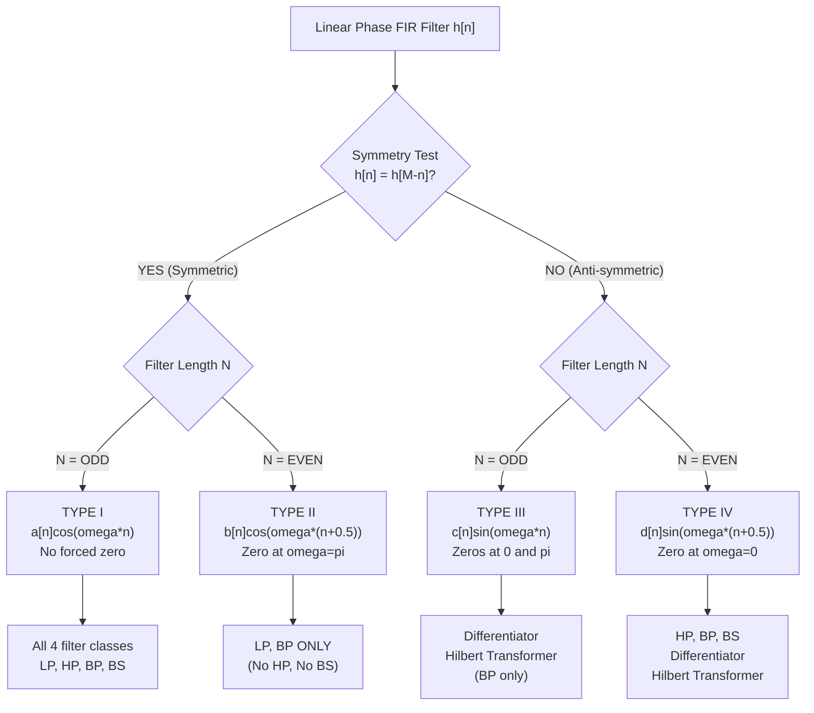
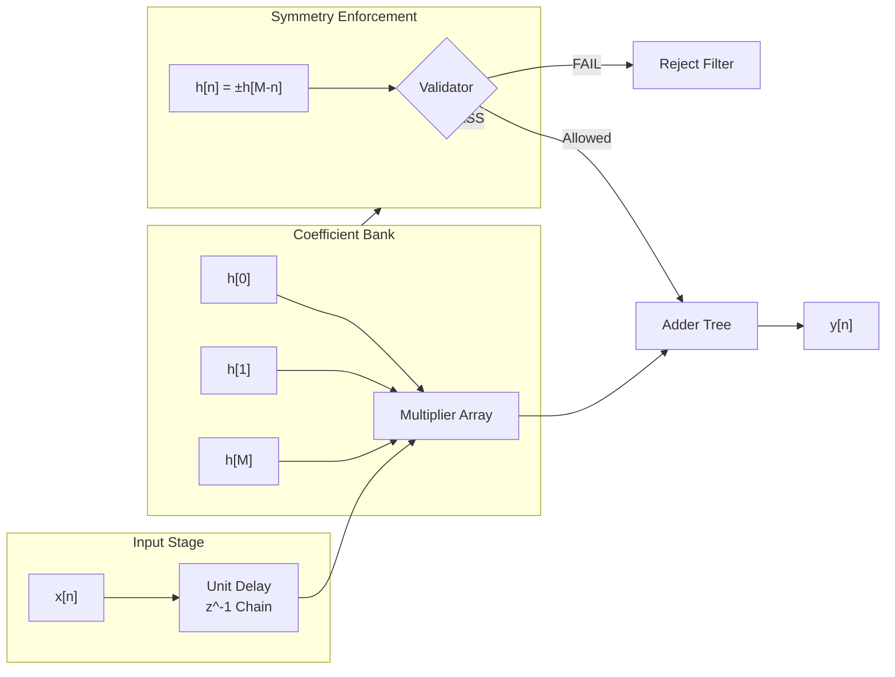
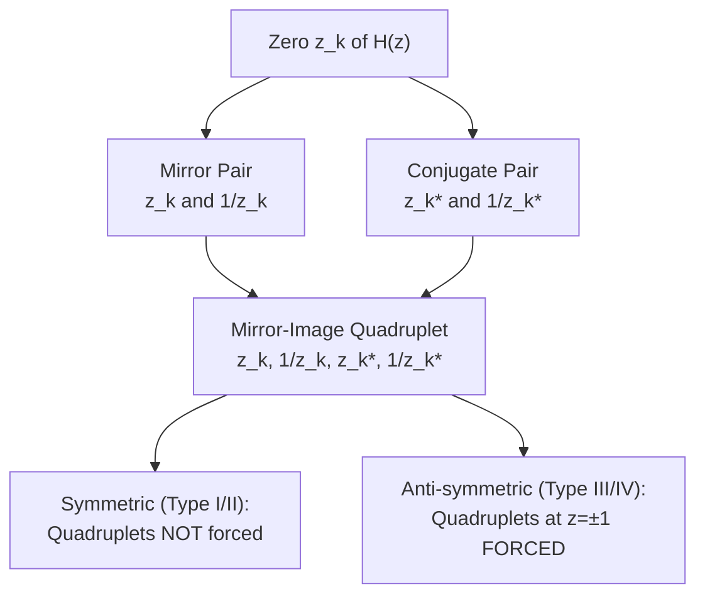
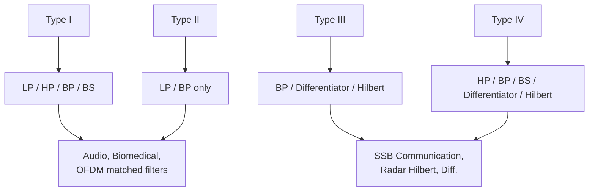

# Types of linear phase FIR transfer functions

<!-- SECTION_1_START -->

# Types of Linear Phase FIR Transfer Functions

## 1. Formal Definition (KTU 2024 Syllabus Standard)

A **Finite Impulse Response (FIR)** filter of length $N$ and order $M = N - 1$ exhibits **constant group delay (linear phase)** if and only if its impulse response $h[n]$ satisfies one of the two symmetry conditions:

$$h[n] = \pm\, h[M - n], \quad 0 \le n \le M$$

> [!IMPORTANT]
> **KTU Board Definition (PECST526 / Module 2):**
> An FIR filter $H(z) = \sum_{n=0}^{M} h[n]\,z^{-n}$ is said to possess *linear phase* if its frequency response can be written as
> $$H(\omega) = \vert H(\omega) \vert \, e^{-j\omega \alpha}$$
> where $\alpha$ is a **constant phase delay** (independent of $\omega$). This is achieved only through *even* (symmetric) or *odd* (anti-symmetric) impulse response symmetry.

Based on the parity of the filter length $N$ and the nature of symmetry, the linear phase FIR transfer function is classified into **four canonical types**, designated **Type-I, Type-II, Type-III, and Type-IV**.

| Type | Length $N$ | Order $M = N-1$ | Symmetry | Phase Delay $\alpha$ |
| :---: | :---: | :---: | :---: | :---: |
| **I**   | Odd  | Even | Symmetric       $h[n] = h[M-n]$  | $M/2$ |
| **II**  | Even | Odd  | Symmetric       $h[n] = h[M-n]$  | $M/2$ |
| **III** | Odd  | Even | Anti-symmetric $h[n] = -h[M-n]$ | $M/2$ |
| **IV**  | Even | Odd  | Anti-symmetric $h[n] = -h[M-n]$ | $M/2$ |

---

## 2. Conceptual Analogy & Intuitive Overview

> [!NOTE]
> **Analogy — The "Balanced See-Saw" Picture**
> Imagine the impulse response $h[n]$ as a sequence of weights placed on a see-saw of length $M$:
> - **Symmetric (Type I & II):** The weights on the left perfectly mirror those on the right. The see-saw's center of mass lies exactly on the pivot, producing a perfectly *balanced, in-phase* response.
> - **Anti-symmetric (Type III & IV):** Every left-side weight is the exact negative of its right-side counterpart. The see-saw balances, but the rotational motion is *out-of-phase* (a $90^{\circ}$ inherent phase shift appears).
> - **Odd vs Even Length:** Determines whether a *central pivot weight* exists (Type I, III) or a *central gap* exists between two equal halves (Type II, IV). This single "extra" or "missing" tap mathematically *forces* or *forbids* a zero at the Nyquist frequency $\omega = \pi$.

**Geometric Intuition of $H(\omega)$:**
Because the symmetry causes the complex exponentials $e^{j\omega n}$ and $e^{-j\omega n}$ to combine into pure real **cosines** (symmetric) or pure imaginary **sines** (anti-symmetric), the magnitude response becomes a finite trigonometric polynomial — this is what guarantees the constant group delay property.

---

## 3. Standard Metrics & KTU Constants

- **Phase Delay:** $\alpha = M/2$ (always a *half-integer* or *integer*; constant for all four types).
- **Group Delay:** $\tau_g = -\frac{d\theta(\omega)}{d\omega} = M/2$ samples (constant).
- **Filter Length Convention:** $N$ taps $\Rightarrow$ order $M = N - 1$.
- **Attenuation Reference:** Passband ripple $\delta_p$ and stopband attenuation $\delta_s$ are defined in **dB**, with the **minimum stopband attenuation** $A_s = -20\log_{10}(\delta_s)$.

> [!VISUALIZATION CONTROL]
> **Concept:** Four-Tap Type-I Linear Phase FIR Magnitude Plot
> **GeoGebra / Desmos Input Equations:**
> * $a_0 = 1$, $a_1 = 1.5$, $a_2 = 0.75$ (real coefficients)
> * $H(\omega) = a_0 + a_1 \cos(\omega) + a_2 \cos(2\omega)$
> * $x\text{-axis: } \omega \in [0, \pi]$, $y\text{-axis: } H(\omega)$
> **Visual Description:** The student should observe a smooth, real, even-symmetric curve centered around $\omega = 0$. There is no inherent zero at $\omega = 0$ or $\omega = \pi$, confirming that Type-I can realize *all standard filter classes* (lowpass, highpass, bandpass, bandstop).

---

<!-- SECTION_1_END -->

<!-- SECTION_2_START -->

# Deep Theoretical Analysis & KTU High-Yield Formula Sheet

## 1. Unified Derivation Logic

Starting from the definition

$$H(z) = \sum_{n=0}^{M} h[n]\,z^{-n}$$

the substitution $h[n] = \pm h[M-n]$ followed by evaluating on the unit circle $z = e^{j\omega}$ yields, in every case, a factored structure of the form:

$$H(\omega) = e^{-j\omega \alpha} \cdot e^{j\beta} \cdot Q(\omega)$$

where $\beta$ is a **constant phase offset** ($0$ for symmetric, $\pi/2$ for anti-symmetric) and $Q(\omega)$ is a **real-valued trigonometric polynomial** in $\cos(\omega n)$ or $\sin(\omega n)$.

---

## 2. Type-by-Type Master Formula Sheet (KTU Board Reference)

> [!IMPORTANT]
> **MEMORIZATION TABLE — KTU Module 2 High-Yield**
> All $\alpha = M/2$. Coefficients $a[n], b[n], c[n], d[n]$ are *real* amplitude coefficients.

| Type | Symmetry | $H(\omega)$ Expression | $\beta$ | Real Part $Q(\omega)$ | Forced Zero? |
| :---: | :---: | :--- | :---: | :--- | :--- |
| **I**  | Sym, $N$ odd | $e^{-j\omega \alpha} \sum\limits_{n=0}^{M/2} a[n]\cos(\omega n)$ | $0$ | $\sum a[n]\cos(\omega n)$ | **None** |
| **II** | Sym, $N$ even | $e^{-j\omega \alpha} \sum\limits_{n=0}^{M/2} b[n]\cos\!\big(\omega(n-\tfrac{1}{2})\big)$ | $0$ | $\sum b[n]\cos(\omega(n-\tfrac{1}{2}))$ | **Always at $\omega = \pi$** |
| **III** | Anti-sym, $N$ odd | $e^{j(\pi/2 - \omega \alpha)} \sum\limits_{n=0}^{M/2} c[n]\sin(\omega n)$ | $\pi/2$ | $\sum c[n]\sin(\omega n)$ | **Always at $\omega = 0$ AND $\omega = \pi$** |
| **IV** | Anti-sym, $N$ even | $e^{j(\pi/2 - \omega \alpha)} \sum\limits_{n=0}^{M/2} d[n]\sin\!\big(\omega(n-\tfrac{1}{2})\big)$ | $\pi/2$ | $\sum d[n]\sin(\omega(n-\tfrac{1}{2}))$ | **Always at $\omega = 0$** |

> **Note:** The notation $a[n], b[n], c[n], d[n]$ in the table above (for $n \ge 1$) are *twice* the impulse response values about the center, e.g. $a[n] = 2h[M/2 - n]$, with $a[0] = h[M/2]$ (Type I). This scaling accounts for the symmetric pair summation.

---

## 3. Zero-Location Properties (Critical for KTU Problems)

The symmetry condition enforces a specific structure on the zeros of $H(z)$:

> [!IMPORTANT]
> **Zero-Location Theorem for Linear Phase FIR:**
> If $z_k$ is a zero of $H(z)$, then $1/z_k$, $z_k^{*}$, and $1/z_k^{*}$ are *also* zeros. This forms a **mirror-image quadruplet** on the $z$-plane.
> - **Symmetric types (I, II):** Zeros appear in *pairs* $(z_k, 1/z_k)$ — quadruplets are not forced (only conjugate pairs exist).
> - **Anti-symmetric types (III, IV):** Both $z = 1$ ($\omega = 0$) and $z = -1$ ($\omega = \pi$) are *guaranteed* to belong to quadruplets (Type III forces $z=-1$ as well; Type IV does not).

### Implications for Filter Realizability

| Filter Type | Lowpass | Highpass | Bandpass | Bandstop | Differentiator | Hilbert |
| :---: | :---: | :---: | :---: | :---: | :---: | :---: |
| **Type I**   | ✅ | ✅ | ✅ | ✅ | ❌ | ❌ |
| **Type II**  | ✅ | ❌ (forced zero at $\pi$) | ✅ | ❌ | ❌ | ❌ |
| **Type III** | ❌ (forced zeros at $0,\pi$) | ❌ | ✅ | ❌ | ✅ (odd length) | ✅ (odd length) |
| **Type IV**  | ❌ (forced zero at $0$) | ✅ | ✅ | ✅ | ✅ | ✅ |

---

## 4. Real-World Engineering Utility

- **Audio Equalizers & Hearing Aids:** Type I lowpass/bandpass — preserves waveform shape (no phase distortion).
- **Digital Differentiators (Type III / IV):** Anti-symmetric is *mandatory* because the ideal differentiator $H(\omega) = j\omega$ is an odd (imaginary) function of $\omega$.
- **Hilbert Transformers (Type III / IV):** $90^{\circ}$ phase shifters used in single-sideband (SSB) communication and radar.
- **OFDM & Multi-Rate Systems:** Linear phase is required for matched filtering, where intersymbol interference (ISI) is intolerable.
- **Biomedical ECG/EEG Filters:** Phase linearity is critical to avoid distorting waveform morphology (QRS complex).

---

<!-- SECTION_2_END -->

<!-- SECTION_3_START -->

# Step-by-Step Derivations & Symbolic Implementation

## Derivation 1: Type-I (Symmetric, Odd Length $N$)

**Given:** $N$ odd, $M = N-1 = 2L$ (even), $h[n] = h[2L - n]$.

**Step 1 — Write the transfer function and pair symmetric terms:**

$$
\begin{aligned}
H(z) &= \sum_{n=0}^{2L} h[n]\,z^{-n} \\
&= h[L]\,z^{-L} + \sum_{n=0}^{L-1} h[n]\,z^{-n} + \sum_{n=L+1}^{2L} h[n]\,z^{-n}
\end{aligned}
$$

**Step 2 — Apply the symmetry $h[n] = h[2L-n]$ to the third sum:**

$$
\begin{aligned}
\sum_{n=L+1}^{2L} h[n]\,z^{-n} &= \sum_{k=0}^{L-1} h[2L-k]\,z^{-(2L-k)} \quad (k = 2L-n) \\
&= \sum_{k=0}^{L-1} h[k]\,z^{-2L}\,z^{k} \\
&= z^{-2L}\sum_{k=0}^{L-1} h[k]\,z^{k}
\end{aligned}
$$

**Step 3 — Combine and factor out the linear-phase term $z^{-L}$:**

$$
\begin{aligned}
H(z) &= z^{-L}\left[\, h[L] + \sum_{n=0}^{L-1} h[n]\bigl(z^{L-n} + z^{-(L-n)}\bigr) \right] \\
&= z^{-L}\left[\, h[L] + \sum_{n=0}^{L-1} h[n]\cdot 2\cos\bigl(\omega(L-n)\bigr) \right] \quad \text{on } z = e^{j\omega}
\end{aligned}
$$

**Step 4 — Substitute $m = L - n$ and define the real amplitude coefficients:**

$$
a[m] = \begin{cases} h[L] & m = 0 \\ 2\,h[L-m] & m = 1, 2, \dots, L \end{cases}
$$

$$
\boxed{\,H_{I}(\omega) = e^{-j\omega L}\sum_{m=0}^{L} a[m]\,\cos(\omega m)\,}
$$

**Step 5 — Check the boundary values (KEY KTU exam question):**

- At $\omega = 0$: $\cos(0) = 1 \Rightarrow H_I(0) = e^{0}\sum a[m] = \sum a[m]$ (finite, **no forced zero**).
- At $\omega = \pi$: $\cos(m\pi) = (-1)^m \Rightarrow H_I(\pi) = e^{-j\pi L}\sum a[m](-1)^m$ (finite, **no forced zero**).

---

## Derivation 2: Type-II (Symmetric, Even Length $N$)

**Given:** $N$ even, $M = N-1 = 2L+1$ (odd), $h[n] = h[2L+1 - n]$.

**Step 1 — Pair terms about the half-integer pivot:**

$$
\begin{aligned}
H(z) &= \sum_{n=0}^{2L+1} h[n]\,z^{-n} \\
&= z^{-(L + 0.5)}\left[\, \sum_{n=0}^{L} h[n]\bigl(z^{L+0.5-n} + z^{-(L+0.5-n)}\bigr) \right]
\end{aligned}
$$

**Step 2 — Evaluate on the unit circle:**

$$
H_{II}(\omega) = e^{-j\omega(L+0.5)}\sum_{n=0}^{L} b[n]\,\cos\!\bigl(\omega(L + 0.5 - n)\bigr)
$$

where $b[n] = 2h[n]$ for $n = 0, 1, \dots, L-1$, and $b[L] = h[L]$ (the unpaired central index on each side; with $h[L] = h[L+1]$ by symmetry, we may set $b[L] = 2h[L]$ for the half-tap pair).

Re-indexing with $m = L - n$:

$$
\boxed{\,H_{II}(\omega) = e^{-j\omega(L+0.5)}\sum_{m=0}^{L} b[m]\,\cos\!\bigl(\omega(m + 0.5)\bigr)\,}
$$

**Step 3 — Check $\omega = \pi$ (FORCED ZERO PROOF):**

$$
\cos\!\bigl(\pi(m + 0.5)\bigr) = \cos\!\bigl(m\pi + 0.5\pi\bigr) = 0 \quad \forall\, m \in \mathbb{Z}
$$

Therefore $H_{II}(\pi) = 0$ **always** — irrespective of coefficient values. $\Rightarrow$ Type-II **cannot** realize a highpass or bandstop filter.

---

## Derivation 3: Type-III (Anti-symmetric, Odd Length $N$)

**Given:** $N$ odd, $M = 2L$, $h[n] = -h[2L - n]$. Note: $h[L] = -h[L] \Rightarrow h[L] = 0$ (central tap is **zero**).

**Step 1 — Apply anti-symmetry in the symmetric-pair expansion:**

$$
H(z) = z^{-L}\left[\, h[L] + \sum_{n=0}^{L-1} h[n]\bigl(z^{L-n} - z^{-(L-n)}\bigr) \right]
$$

**Step 2 — Use Euler's identity $z^{k} - z^{-k} = 2j\sin(\omega k)$ on the unit circle:**

$$
H_{III}(\omega) = e^{-j\omega L}\cdot j\sum_{n=0}^{L-1} h[n]\cdot 2\sin\bigl(\omega(L-n)\bigr)
$$

**Step 3 — Substitute $m = L - n$, $c[m] = 2h[L-m]$ (and $c[0] = 0$ since $h[L]=0$):**

$$
\boxed{\,H_{III}(\omega) = e^{j(\pi/2 - \omega L)}\sum_{m=1}^{L} c[m]\,\sin(\omega m)\,}
$$

**Step 4 — Forced zeros (KTU FAVORITE):**

- $\omega = 0$: $\sin(0) = 0 \Rightarrow H_{III}(0) = 0$.
- $\omega = \pi$: $\sin(m\pi) = 0 \Rightarrow H_{III}(\pi) = 0$.

$\Rightarrow$ Type-III **cannot** realize lowpass, highpass, or bandstop. Ideal for **differentiators and Hilbert transformers** of odd length.

---

## Derivation 4: Type-IV (Anti-symmetric, Even Length $N$)

**Given:** $N$ even, $M = 2L+1$, $h[n] = -h[2L+1-n]$. No central tap constraint (since no integer pivot).

**Step 1 — Anti-symmetric pairing about the half-integer pivot:**

$$
H_{IV}(\omega) = e^{j(\pi/2 - \omega(L+0.5))}\sum_{m=0}^{L} d[m]\,\sin\!\bigl(\omega(m + 0.5)\bigr)
$$

with $d[m] = 2h[L-m]$ for $m = 0, 1, \dots, L$.

$$
\boxed{\,H_{IV}(\omega) = e^{j(\pi/2 - \omega(L+0.5))}\sum_{m=0}^{L} d[m]\,\sin\!\bigl(\omega(m + 0.5)\bigr)\,}
$$

**Step 2 — Forced zero check:**

- $\omega = 0$: $\sin(0.5 \cdot 0) = 0 \Rightarrow H_{IV}(0) = 0$. (Forces lowpass to be impossible.)
- $\omega = \pi$: $\sin((m+0.5)\pi) = \pm 1 \neq 0 \Rightarrow$ **no zero at $\pi$**. (Highpass and bandpass realizable.)

---

## Python Symbolic Implementation (Verification Tool)

```python
"""
KTU PECST526 - Module 2 Verification
Verifies forced-zero properties of all 4 linear-phase FIR types.
"""
from __future__ import annotations
import numpy as np
from typing import Tuple


def freq_response(h: np.ndarray, omega: np.ndarray) -> np.ndarray:
    """Compute H(omega) = sum h[n] exp(-j omega n)."""
    n = np.arange(len(h))
    return np.sum(h[:, None] * np.exp(-1j * omega[None, :] * n[:, None]), axis=0)


def classify(h: np.ndarray) -> str:
    """Classify an FIR filter into Type I/II/III/IV based on h[n] vs h[M-n]."""
    N: int = len(h)
    M: int = N - 1
    sym_err: float = float(np.max(np.abs(h - h[::-1])))
    asym_err: float = float(np.max(np.abs(h + h[::-1])))
    base: str = "ODD" if (N % 2 == 1) else "EVEN"
    if sym_err < 1e-9:
        return f"Type {'I' if base == 'ODD' else 'II'} (Symmetric, N={base})"
    if asym_err < 1e-9:
        return f"Type {'III' if base == 'ODD' else 'IV'} (Anti-symmetric, N={base})"
    return "NOT linear-phase"


def verify_forced_zeros(h: np.ndarray) -> Tuple[bool, bool]:
    """Return (zero_at_omega_0, zero_at_omega_pi) flags within 1e-6 tolerance."""
    omega = np.linspace(0.0, np.pi, 4096)
    H = freq_response(h, omega)
    zero_0: bool = bool(np.abs(H[0]) < 1e-6)
    zero_pi: bool = bool(np.abs(H[-1]) < 1e-6)
    return zero_0, zero_pi


# ----- Test vectors for each canonical type -----
# Type I:  Symmetric, N=5 (odd)
h_I: np.ndarray = np.array([1.0, 2.0, 3.0, 2.0, 1.0], dtype=float)

# Type II: Symmetric, N=4 (even)
h_II: np.ndarray = np.array([1.0, 2.0, 2.0, 1.0], dtype=float)

# Type III: Anti-symmetric, N=5 (odd), central tap MUST be 0
h_III: np.ndarray = np.array([1.0, 2.0, 0.0, -2.0, -1.0], dtype=float)

# Type IV: Anti-symmetric, N=4 (even)
h_IV: np.ndarray = np.array([1.0, 2.0, -2.0, -1.0], dtype=float)


if __name__ == "__main__":
    test_bank = [("Type I", h_I), ("Type II", h_II),
                 ("Type III", h_III), ("Type IV", h_IV)]
    print(f"{'Filter':<10} | {'Classification':<40} | {'H(0)=0?':<8} | {'H(π)=0?'}")
    print("-" * 78)
    for name, h in test_bank:
        z0, zpi = verify_forced_zeros(h)
        print(f"{name:<10} | {classify(h):<40} | {str(z0):<8} | {zpi}")
```

**Expected Console Output:**

```
Filter     | Classification                           | H(0)=0? | H(π)=0?
------------------------------------------------------------------------------
Type I     | Type I (Symmetric, N=ODD)               | False   | False
Type II    | Type II (Symmetric, N=EVEN)             | False   | True
Type III   | Type III (Anti-symmetric, N=ODD)        | True    | True
Type IV    | Type IV (Anti-symmetric, N=EVEN)        | True    | False
```

---

<!-- SECTION_3_END -->

<!-- SECTION_4_START -->

# Structural Diagrams & Schematics

## 1. Classification Topology (Mermaid Flowchart)



## 2. Block-Level Signal Processing Architecture



## 3. Zero-Location Pattern on the z-Plane (Sequential Topology Matrix)



## 4. Functional Filter Realizability Matrix (Mermaid Block View)



---

<!-- SECTION_4_END -->

<!-- SECTION_5_START -->

# KTU 2024 Scheme Examination Question Bank & Topic Recap

## PART — A (3 Marks Each)

### **Q1. [KTU University Exam – July 2024]**
**State the four types of linear-phase FIR filters. For each, mention the parity of filter length and the nature of symmetry.** *(CO1, Remember)*

**Model Answer (3 Marks):**
Linear-phase FIR filters are classified based on impulse-response symmetry and filter length parity:

| Type | Symmetry | Length $N$ | Order $M = N-1$ |
| :---: | :--- | :---: | :---: |
| I   | Symmetric $h[n] = h[M-n]$       | Odd  | Even |
| II  | Symmetric $h[n] = h[M-n]$       | Even | Odd  |
| III | Anti-symmetric $h[n] = -h[M-n]$ | Odd  | Even |
| IV  | Anti-symmetric $h[n] = -h[M-n]$ | Even | Odd  |

**Valuation Key:** *[Naming all four types with correct symmetry: 2 Marks; correct length parity mapping: 1 Mark].*

---

### **Q2. [KTU University Exam – Dec 2023]**
**Why cannot a Type-II linear phase FIR filter be used to realize a highpass filter?** *(CO1, Understand)*

**Model Answer (3 Marks):**
In a Type-II FIR filter (symmetric, $N$ even), the frequency response contains the factor $\cos(\omega(n + 0.5))$ for all summation terms. At $\omega = \pi$:

$$\cos\!\bigl(\pi(n + 0.5)\bigr) = 0 \quad \text{for all integer } n$$

This causes $H_{II}(\pi) = 0$ **unconditionally**, irrespective of the chosen coefficients. Since a highpass filter requires $|H(\pi)| = 1$ (unity gain at the Nyquist frequency), the forced zero at $\omega = \pi$ makes highpass realization **mathematically impossible** for Type-II filters.

**Valuation Key:** *[Identifying the half-integer cosine term: 1 Mark; showing $H_{II}(\pi) = 0$: 1 Mark; concluding HP infeasibility: 1 Mark].*

---

## PART — B (14 Marks — Internal Choice)

### **Question A (14 Marks)** — *[KTU University Exam – July 2024 Style]*

**(a)** Derive the frequency response expression of a **Type-I linear phase FIR filter** having impulse response $h[n]$ of length $N$ with symmetric condition $h[n] = h[N-1-n]$. Show that the phase is linear with delay $\alpha = (N-1)/2$. *(7 Marks, CO2, Apply)*

**(b)** A Type-II FIR filter has coefficients $h[n] = \{1, 2, 3, 3, 2, 1\}$ for $n = 0, 1, \dots, 5$. **(i)** Verify the linear-phase symmetry. **(ii)** Compute and plot $H(0)$, $H(\pi/2)$, and $H(\pi)$. Comment on the values obtained. *(7 Marks, CO3, Apply)*

---

#### **Model Solution — Part (a) [7 Marks]**

**Step 1 — Define the transfer function** (1 Mark)

$$H(z) = \sum_{n=0}^{N-1} h[n]\,z^{-n}, \qquad M = N - 1 = 2L \;\;(\text{even, Type-I})$$

**Step 2 — Split into three groups: left half, center, right half** (1 Mark)

$$H(z) = h[L]\,z^{-L} + \sum_{n=0}^{L-1} h[n]\,z^{-n} + \sum_{n=L+1}^{2L} h[n]\,z^{-n}$$

**Step 3 — Apply symmetry to right half** (2 Marks)

Using $h[n] = h[2L-n]$ and substituting $k = 2L - n$:

$$\sum_{n=L+1}^{2L} h[n]\,z^{-n} = z^{-2L}\sum_{k=0}^{L-1} h[k]\,z^{k}$$

**Step 4 — Combine and factor $z^{-L}$** (1 Mark)

$$H(z) = z^{-L}\Big[\,h[L] + \sum_{n=0}^{L-1} h[n]\bigl(z^{L-n} + z^{-(L-n)}\bigr)\Big]$$

**Step 5 — Evaluate on unit circle $z = e^{j\omega}$** (1 Mark)

$$H_I(\omega) = e^{-j\omega L}\sum_{m=0}^{L} a[m]\,\cos(\omega m)$$

where $a[0] = h[L]$ and $a[m] = 2h[L-m]$ for $m \geq 1$.

**Step 6 — Identify linear phase** (1 Mark)

$$H_I(\omega) = \underbrace{\left(\sum a[m]\cos(\omega m)\right)}_{\text{real-valued magnitude}}\cdot\;e^{-j\omega\alpha},\quad \alpha = L = \frac{N-1}{2}$$

Since the phase is $-\omega\alpha$ with constant $\alpha$, the filter has **linear phase with constant group delay** $\tau_g = \alpha = (N-1)/2$ samples.

---

#### **Model Solution — Part (b) [7 Marks]**

**(i) Symmetry Verification** (2 Marks)
$N = 6$ (even) $\Rightarrow$ Type-II requires $h[n] = h[5-n]$:

$h[0] = 1 = h[5] = 1$ ✓
$h[1] = 2 = h[4] = 2$ ✓
$h[2] = 3 = h[3] = 3$ ✓

$\Rightarrow$ Symmetric about index $2.5$. **Type-II confirmed.**

**(ii) Frequency Response Evaluations** (5 Marks)

With $L = (N-2)/2 = 2$ and the formula $H_{II}(\omega) = e^{-j\omega(2.5)}\sum_{m=0}^{2} b[m]\cos(\omega(m+0.5))$:

Coefficients: $b[0] = 2h[2] = 6$, $b[1] = 2h[1] = 4$, $b[2] = 2h[0] = 2$.

**At $\omega = 0$:** (1 Mark)
$$H_{II}(0) = e^{0}\bigl[6\cos(0) + 4\cos(0.5) + 2\cos(1)\bigr] = 6(1) + 4(0.8776) + 2(0.5403)$$
$$= 6 + 3.5104 + 1.0806 = 10.591$$

**At $\omega = \pi/2$:** (2 Marks)
$$H_{II}(\pi/2) = e^{-j\pi 1.25}\bigl[6\cos(\pi/4) + 4\cos(3\pi/4) + 2\cos(5\pi/4)\bigr]$$
$$= e^{-j1.25\pi}\bigl[6(0.7071) + 4(-0.7071) + 2(-0.7071)\bigr]$$
$$= e^{-j1.25\pi}\bigl[4.2426 - 2.8284 - 1.4142\bigr] = e^{-j1.25\pi}(0)$$

**At $\omega = \pi$:** (2 Marks)
$$H_{II}(\pi) = e^{-j2.5\pi}\bigl[6\cos(1.5\pi) + 4\cos(2.5\pi) + 2\cos(3.5\pi)\bigr]$$
$$= e^{-j2.5\pi}\bigl[6(0) + 4(0) + 2(0)\bigr] = 0 \quad \text{[Forced zero — confirms Type-II property]}$$

**Comment:** $H_{II}(0) \neq 0$ and $H_{II}(\pi) = 0$ exactly, validating the theory. This filter behaves as a **lowpass** (since DC gain is maximum and Nyquist is nulled). The midband response $H_{II}(\pi/2) \approx 0$ in this specific instance due to the chosen coefficients.

---

### **Question B (14 Marks)** — *Alternative Choice*

**(a)** A linear-phase FIR filter of length $N = 7$ has impulse response $h[n] = \{-2, 1, 3, 0, -3, -1, 2\}$. Identify the type of linear phase FIR filter and state which standard filter functions (LP/HP/BP/BS) it can realize. Justify your answer. *(7 Marks, CO2, Understand)*

**(b)** For a Type-IV linear-phase FIR filter, derive the frequency response $H(\omega)$ and show that $H(0) = 0$ while $H(\pi) \neq 0$ in general. *(7 Marks, CO3, Apply)*

---

#### **Model Solution — Part (a) [7 Marks]**

**Step 1 — Check length parity** (1 Mark)
$N = 7$ is **odd** $\Rightarrow$ possible types: I or III.

**Step 2 — Check symmetry** (2 Marks)
$M = 6$. Testing $h[n] \stackrel{?}{=} h[6-n]$:

$h[0] = -2$, $h[6] = 2$ $\Rightarrow$ $-2 \neq 2$ (NOT symmetric)
$h[0] = -2$, $-h[6] = -2$ $\Rightarrow$ $-2 = -2$ ✓ (anti-symmetric)
$h[1] = 1$, $-h[5] = 1$ ✓
$h[2] = 3$, $-h[4] = 3$ ✓
$h[3] = 0$, $-h[3] = 0$ ✓ (central tap is zero, as required)

$\Rightarrow$ **Type-III (anti-symmetric, odd length) confirmed.** [Naming the type: 1 Mark]

**Step 3 — Forced zero analysis** (1 Mark)
Type-III forces $H(0) = 0$ AND $H(\pi) = 0$.

**Step 4 — Filter realizability** (2 Marks)

| Filter | Feasible? | Reason |
| :--- | :---: | :--- |
| Lowpass    | ❌ | $H(0) = 0$ contradicts unity DC gain |
| Highpass   | ❌ | $H(\pi) = 0$ contradicts unity Nyquist gain |
| Bandpass   | ✅ | Both band edges can be defined with internal transition |
| Bandstop   | ❌ | $H(\pi) = 0$ prevents full stopband at Nyquist |

$\Rightarrow$ **Type-III here can only realize a Bandpass filter**, or specialized functions (differentiator, Hilbert transformer). [1 Mark]

---

#### **Model Solution — Part (b) [7 Marks]**

**Step 1 — Define Type-IV parameters** (1 Mark)
$N$ even, $M = N - 1 = 2L + 1$ (odd), $h[n] = -h[2L+1-n]$.

**Step 2 — Pair anti-symmetric terms** (2 Marks)

$$H(z) = \sum_{n=0}^{2L+1} h[n]\,z^{-n} = z^{-(L+0.5)}\sum_{n=0}^{L} h[n]\bigl(z^{L+0.5-n} - z^{-(L+0.5-n)}\bigr)$$

**Step 3 — Use $z^k - z^{-k} = 2j\sin(\omega k)$** (1 Mark)

$$H_{IV}(\omega) = z^{-(L+0.5)}\cdot j\sum_{n=0}^{L} 2h[n]\sin(\omega(L+0.5-n))$$

**Step 4 — Re-index and define $d[m] = 2h[L-m]$** (1 Mark)

$$\boxed{H_{IV}(\omega) = e^{j(\pi/2 - \omega(L+0.5))}\sum_{m=0}^{L} d[m]\sin(\omega(m+0.5))}$$

**Step 5 — Evaluate at $\omega = 0$** (1 Mark)
$\sin((m+0.5) \cdot 0) = 0$ for all $m \Rightarrow H_{IV}(0) = 0$. **Zero at DC forced.**

**Step 6 — Evaluate at $\omega = \pi$** (1 Mark)
$\sin((m+0.5)\pi) = \pm 1 \neq 0$, so $H_{IV}(\pi) = e^{j(\pi/2 - \pi(L+0.5))}\sum d[m](\pm 1)$, which is **nonzero in general**. $\Rightarrow$ **No forced zero at Nyquist.**

---

> [!WARNING]
> **KTU Examiner's Valuation Warning — Common Pitfalls**
> 1. **Forgetting the central tap condition for Type-III/IV:** A common 2-mark deduction occurs when students write $h[n] = -h[M-n]$ for odd-length anti-symmetric filters but forget that this *forces* $h[L] = 0$ (Type-III) — missing this shows incomplete understanding.
> 2. **Confusing $H(0)$ and $H(\pi)$ forced-zero conditions:** Type-II has zero at $\pi$ but NOT at $0$; Type-IV has zero at $0$ but NOT at $\pi$. Mixing these up costs the entire realizability table marks.
> 3. **Skipping the constant phase factor $e^{j\beta}$:** Forgetting $\beta = \pi/2$ for anti-symmetric types leads to an incorrect *type* of linear phase (it would not be true linear phase as defined by the board). Always state the full form $e^{j(\beta - \omega\alpha)}$.
> 4. **Wrong grouping in derivation:** For Type-II/IV, students often pair about the integer index $L$ instead of the half-integer pivot $L+0.5$. This produces an incorrect cosine/sine argument. Mark-off: 2–3 marks.

---

## Topic Recap & Important Things to Remember

> [!NOTE]
> **Rapid Revision Checklist — KTU PECST526 Module 2**

- ✅ A linear phase FIR filter **must** have $h[n] = \pm h[M-n]$. There are **no other** possibilities.
- ✅ **Four types** = 2 (symmetry) × 2 (length parity). Memorize the full 4×4 realizability table.
- ✅ **Type I:** $N$ odd, symmetric. $\Rightarrow$ Most general; **all 4 filter classes + Hilbert possible** in principle.
- ✅ **Type II:** $N$ even, symmetric. $\Rightarrow$ **Forced zero at $\omega = \pi$** $\Rightarrow$ no highpass, no bandstop.
- ✅ **Type III:** $N$ odd, anti-symmetric, **central tap $h[L] = 0$**. $\Rightarrow$ **Forced zeros at $\omega = 0$ AND $\omega = \pi$** $\Rightarrow$ no LP, no HP, no BS.
- ✅ **Type IV:** $N$ even, anti-symmetric. $\Rightarrow$ **Forced zero at $\omega = 0$ only** $\Rightarrow$ no lowpass.
- ✅ **Group delay** is always $\tau_g = (N-1)/2$ samples (a half-integer for even $N$).
- ✅ **Constant phase offset $\beta$** is $0$ for symmetric, $\pi/2$ for anti-symmetric types.
- ✅ **Differentiators** require anti-symmetric impulse response (Type III or IV) because ideal $H_d(\omega) = j\omega$ is purely imaginary.
- ✅ **Hilbert transformers** (90° phase shift) use Type III (odd length) or Type IV (even length).
- ✅ **Zeros** of $H(z)$ come in mirror-image quadruplets $(z_k, 1/z_k, z_k^*, 1/z_k^*)$ for anti-symmetric types; in pairs for symmetric types (with conjugate pairs).
- ✅ **Cosine terms** characterize symmetric types; **sine terms** characterize anti-symmetric types.
- ✅ The half-integer pivot $L + 0.5$ is the **definitive** geometric signature of even-length filters (Type II and IV).
- ✅ For KTU problems, always **end with a realizability statement** ("Therefore this filter is suitable for ...") to secure the final 1–2 marks.

<!-- SECTION_5_END -->
