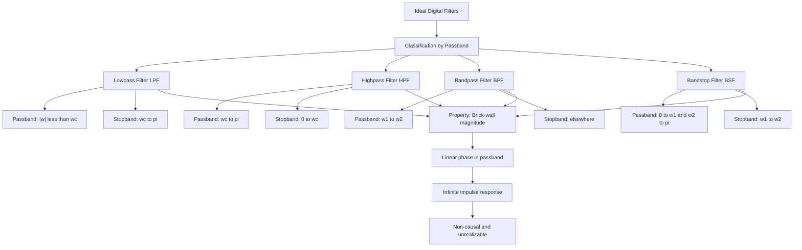
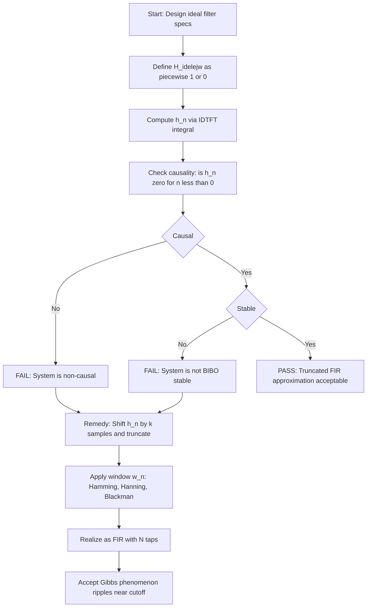
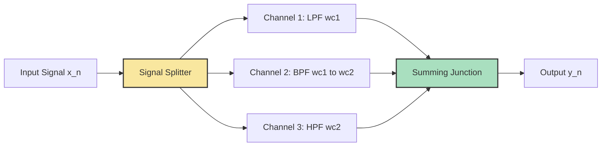
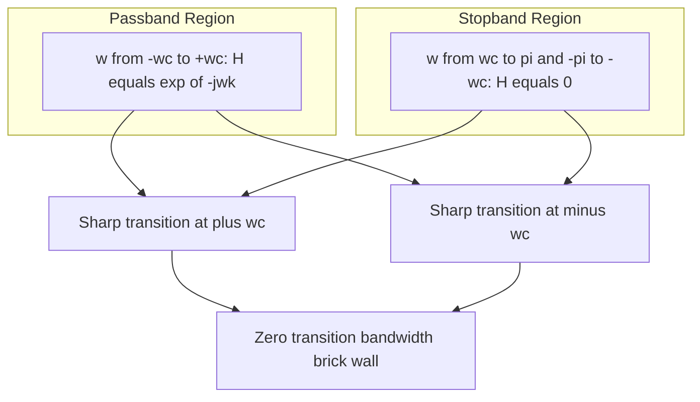

# Types of transfer functions- Ideal filters

<!-- SECTION_1_START -->
# Ideal Filters — Core Technical Definition & Intuitive Overview

## Formal Definition (KTU 2024 Syllabus Terminology)

An **Ideal Filter** is a discrete-time LTI system whose frequency response $H(e^{j\omega})$ has a magnitude characteristic that is either unity (passband) or zero (stopband) with **infinitely sharp transitions** (zero transition bandwidth), and a phase characteristic that is **linear** in the passband. Mathematically, for an ideal filter:

$$
\begin{aligned}
\vert H(e^{j\omega}) \vert &= \begin{cases} 1, & \omega \in \text{Passband} \\ 0, & \omega \in \text{Stopband} \end{cases} \\
\angle H(e^{j\omega}) &= -k\omega, \quad \omega \in \text{Passband}
\end{aligned}
$$

where $k$ is a constant representing the constant group delay of the system.

> [!IMPORTANT]
> **KTU 2024 Board Definition (Verbatim Expectation):**
> "An ideal filter is one that passes certain frequency components of the input signal without any attenuation and completely rejects all other frequency components, exhibiting zero transition bandwidth and a linear phase response in the passband."

## Conceptual Analogy — The "VIP Bouncer" Intuition

Imagine a concert venue with a strict **VIP bouncer** at the door. The bouncer's rules are absolute:
- **Allow** guests wearing a specific wristband color (✓)
- **Reject** everyone else, instantly and without hesitation (✗)
- There is **no negotiation zone** — you either get in or you don't.

Now apply this to signals:
- The **wristband color** = a specific range of frequencies (the passband)
- The **rejection** = complete attenuation in the stopband
- **No negotiation** = zero transition bandwidth (a "brick-wall" cutoff)

A bass-only DJ booth is like a **Lowpass Filter** (lets low frequencies in, kicks out high frequencies). A door that only allows people above a certain age is like a **Highpass Filter**.

## Classification of Ideal Filters

The four canonical ideal filter types defined in Module 2 of the PECST526 syllabus are:

| Filter Type | Passband | Stopband | Typical Use |
|---|---|---|---|
| **Ideal LPF** (Lowpass) | $\vert \omega \vert \leq \omega_c$ | $\omega_c < \vert \omega \vert \leq \pi$ | Anti-aliasing, decimation |
| **Ideal HPF** (Highpass) | $\omega_c < \vert \omega \vert \leq \pi$ | $\vert \omega \vert \leq \omega_c$ | DC removal, edge detection |
| **Ideal BPF** (Bandpass) | $\omega_1 \leq \vert \omega \vert \leq \omega_2$ | elsewhere | Channel selection in comms |
| **Ideal BSF / BRF** (Bandstop) | elsewhere | $\omega_1 \leq \vert \omega \vert \leq \omega_2$ | Notch filtering (50/60 Hz hum) |

> [!NOTE]
> Here $\omega_c$ is the **cutoff frequency** (in rad/sample) and $\omega \in [-\pi, \pi]$ is the normalized digital angular frequency. The passband edge is the **brick-wall transition point** where the magnitude response jumps from 1 to 0 instantaneously.

## Magnitude Response — The "Brick Wall" Visualization

The magnitude plot of an ideal LPF looks like a wall made of bricks — perfectly flat at 1 inside the passband, and dropping vertically to 0 at the cutoff. There is **no gentle roll-off**, no ripple, and no transition band.

> [!VISUALIZATION CONTROL]
> **Concept:** Ideal LPF brick-wall magnitude response
> **Desmos / GeoGebra Input:**
> * Piecewise: `H_mag(ω) = 1 for |ω| ≤ 0.4π`, `H_mag(ω) = 0 for 0.4π < |ω| ≤ π`
> * X-axis: $\omega \in [-\pi, \pi]$
> * Y-axis: $\vert H(e^{j\omega}) \vert \in [0, 1]$
> **Visual Description:** Observe the flat plateau at height 1 between $-\omega_c$ and $+\omega_c$, and the instantaneous vertical drop to 0 at $\pm \omega_c$. This is the defining visual signature of an *ideal* filter.

<!-- SECTION_1_END -->

<!-- SECTION_2_START -->
# Deep Theoretical Analysis & KTU High-Yield Formula Sheet

## 1. Frequency Response of Each Ideal Filter

Let $\omega_c$ denote the cutoff frequency. For an **Ideal Lowpass Filter (LPF)** with cutoff $\omega_c$ and linear phase $-k\omega$:

$$
H_{LPF}(e^{j\omega}) = \begin{cases} e^{-j\omega k}, & \vert \omega \vert \leq \omega_c \\ 0, & \omega_c < \vert \omega \vert \leq \pi \end{cases}
$$

For an **Ideal Highpass Filter (HPF)**:

$$
H_{HPF}(e^{j\omega}) = \begin{cases} 0, & \vert \omega \leq \omega_c \vert \\ e^{-j\omega k}, & \omega_c < \vert \omega \vert \leq \pi \end{cases}
$$

For an **Ideal Bandpass Filter (BPF)** with band $\omega_1 \leq \vert \omega \vert \leq \omega_2$:

$$
H_{BPF}(e^{j\omega}) = \begin{cases} e^{-j\omega k}, & \omega_1 \leq \vert \omega \vert \leq \omega_2 \\ 0, & \text{otherwise (within } [-\pi, \pi] \text{)} \end{cases}
$$

For an **Ideal Bandstop Filter (BSF / BRF)**:

$$
H_{BSF}(e^{j\omega}) = \begin{cases} e^{-j\omega k}, & \vert \omega \vert < \omega_1 \text{ and } \vert \omega \vert > \omega_2 \\ 0, & \omega_1 \leq \vert \omega \vert \leq \omega_2 \end{cases}
$$

> [!NOTE]
> **Why the $e^{-j\omega k}$ factor?** The factor $e^{-j\omega k}$ represents an ideal **constant group delay** of $k$ samples. This means *all* frequency components in the passband are delayed by exactly $k$ samples — preserving the waveform shape (no phase distortion). This is the discrete-time equivalent of a lossless transmission line.

## 2. Phase Response & Group Delay

The phase function is:

$$
\angle H(e^{j\omega}) = -k\omega \quad \text{(only over the passband)}
$$

The **group delay** is defined as:

$$
\tau_g(\omega) = -\frac{d}{d\omega} \angle H(e^{j\omega}) = k
$$

A constant group delay $k$ across the passband is the hallmark of **linear phase** — all frequencies travel through the filter in the same time, so the output is a time-shifted but undistorted copy of the input within the passband.

## 3. Impulse Response of the Ideal LPF (Derivation Preview)

Using the inverse Discrete-Time Fourier Transform (IDTFT):

$$
h_{LPF}[n] = \frac{1}{2\pi} \int_{-\omega_c}^{\omega_c} e^{-j\omega k} e^{j\omega n} \, d\omega
$$

We will derive this in full in **Section 3**. The crucial result is:

$$
h_{LPF}[n] = \frac{\sin(\omega_c(n-k))}{\pi(n-k)} = \frac{\omega_c}{\pi} \cdot \text{sinc}\!\left(\frac{\omega_c(n-k)}{\pi}\right)
$$

> [!IMPORTANT]
> **Key Observation:** This impulse response is **non-causal** (it extends from $n = -\infty$ to $n = +\infty$) and is **infinitely long (IIR-like behavior)**. This is the mathematical proof that *ideal filters are physically unrealizable*.

## 4. Why Ideal Filters Are Unrealizable — The Paley-Wiener Argument

A causal, stable LTI system must satisfy the **Paley-Wiener criterion**:

$$
\int_{-\pi}^{\pi} \left\vert \ln \vert H(e^{j\omega}) \vert \right\vert \, d\omega < \infty
$$

For an ideal LPF, $\vert H(e^{j\omega}) \vert = 0$ in the stopband, so $\ln \vert H(e^{j\omega}) \vert = -\infty$ over a region of positive measure. Therefore the integral diverges to $\infty$:

$$
\int_{\omega_c}^{\pi} \vert \ln 0 \vert \, d\omega = \infty
$$

This **divergence** is the formal mathematical proof that **no causal, stable LTI system can have an ideal brick-wall frequency response**. The Paley-Wiener theorem is a guaranteed high-yield KTU question.

## 5. KTU High-Yield Formula Sheet

| Formula / Concept | Expression | KTU Significance |
|---|---|---|
| Ideal LPF Magnitude | $\vert H(e^{j\omega}) \vert = 1$ for $\vert \omega \vert \leq \omega_c$ | Defining property |
| Ideal LPF Phase | $\angle H(e^{j\omega}) = -k\omega$ in passband | Linear phase |
| IDTFT of Ideal LPF | $h[n] = \dfrac{\sin(\omega_c(n-k))}{\pi(n-k)}$ | Non-causal, infinitely long |
| Group Delay | $\tau_g = k$ | Constant for linear phase |
| Paley-Wiener Condition | $\int \vert \ln \vert H \vert \vert \, d\omega < \infty$ | Realizability test |
| Cutoff Range | $0 < \omega_c < \pi$ | Normalized digital frequency |
| Passband Width (LPF) | $2\omega_c$ | Symmetric about $\omega = 0$ |
| Symmetry Property | $H(e^{-j\omega}) = H^{*}(e^{j\omega})$ | Real impulse response |
| Anti-Causality of $h[n]$ | $h[n] \neq 0$ for $n < 0$ | For $k = 0$ case |
| Periodic DTFT | $H(e^{j(\omega+2\pi)}) = H(e^{j\omega})$ | All DTFTs are $2\pi$-periodic |

> [!WARNING]
> **Pipe Character Escape Rule:** Whenever you write $\vert H(e^{j\omega}) \vert$ inside a markdown table, the vertical bars are safe because they are inside math mode `$...$`. However, **never** use raw vertical bars $\vert x \vert$ in plain text inside a table row — use `\vert x \vert` inside LaTeX math mode to avoid breaking the markdown table parser.

## 6. Real-World Engineering Utility

| Domain | Application of (Approximate) Ideal Filters |
|---|---|
| **Audio DSP** | Graphic equalizers use cascaded bandpass filters to isolate bass/mid/treble |
| **Telecommunications** | Channel-select bandpass filtering in software-defined radio (SDR) |
| **Biomedical** | Notch (bandstop) filter at 50/60 Hz to remove powerline interference from ECG/EEG |
| **Image Processing** | Lowpass for blurring/noise reduction; highpass for edge sharpening |
| **Radar / Sonar** | Matched filtering (BPF) for pulse compression |
| **Control Systems** | Anti-aliasing lowpass filter before ADC sampling |

In practice, engineers use **approximations** to ideal filters — namely **Butterworth**, **Chebyshev**, and **Elliptic** analog prototypes, or **FIR window-method** and **Parks-McClellan** digital designs — because truly ideal filters are impossible to build.

<!-- SECTION_2_END -->

<!-- SECTION_3_START -->
# Step-by-Step Derivations, Code Implementation & Engineering Matrices

## A. Full Derivation — Impulse Response of Ideal LPF

### Step 1: Set up the IDTFT Integral

By definition, the inverse DTFT of the frequency response is:

$$
h[n] = \frac{1}{2\pi} \int_{-\pi}^{\pi} H(e^{j\omega}) e^{j\omega n} \, d\omega
$$

### Step 2: Substitute the Ideal LPF Frequency Response

For the ideal LPF with cutoff $\omega_c$ and linear phase $-k\omega$:

$$
H(e^{j\omega}) = \begin{cases} e^{-j\omega k}, & -\omega_c \leq \omega \leq \omega_c \\ 0, & \text{otherwise in } [-\pi, \pi] \end{cases}
$$

Therefore the integral limits collapse to the passband:

$$
h[n] = \frac{1}{2\pi} \int_{-\omega_c}^{\omega_c} e^{-j\omega k} e^{j\omega n} \, d\omega
$$

### Step 3: Combine the Exponentials

$$
h[n] = \frac{1}{2\pi} \int_{-\omega_c}^{\omega_c} e^{j\omega(n-k)} \, d\omega
$$

### Step 4: Integrate

The integral of $e^{j a \omega}$ with respect to $\omega$ is:

$$
\int e^{j a \omega} \, d\omega = \frac{e^{j a \omega}}{j a} + C \quad (a \neq 0)
$$

So:

$$
h[n] = \frac{1}{2\pi} \cdot \frac{e^{j\omega(n-k)}}{j(n-k)} \bigg|_{-\omega_c}^{\omega_c}
$$

### Step 5: Apply the Limits

$$
h[n] = \frac{1}{2\pi j (n-k)} \left[ e^{j\omega_c(n-k)} - e^{-j\omega_c(n-k)} \right]
$$

Using Euler's identity $e^{j\theta} - e^{-j\theta} = 2j \sin(\theta)$:

$$
h[n] = \frac{1}{2\pi j (n-k)} \cdot 2j \sin(\omega_c (n-k))
$$

The $j$ terms cancel:

$$
h[n] = \frac{\sin(\omega_c (n-k))}{\pi (n-k)}
$$

### Step 6: Final Result

$$
\boxed{h_{LPF}[n] = \frac{\sin(\omega_c (n-k))}{\pi (n-k)} = \frac{\omega_c}{\pi} \cdot \text{sinc}\!\left(\frac{\omega_c(n-k)}{\pi}\right)}
$$

### Step 7: Special Case at $n = k$

Using L'Hôpital's rule (since the formula is $0/0$ at $n = k$):

$$
h_{LPF}[k] = \lim_{n \to k} \frac{\sin(\omega_c (n-k))}{\pi (n-k)} = \frac{\omega_c}{\pi}
$$

> [!IMPORTANT]
> **Critical KTU Insight:** For $k = 0$, $h[0] = \omega_c/\pi$ but $h[n] \neq 0$ for all $n < 0$. This means the impulse response starts **at $n = -\infty$** — it is **non-causal** and the system is **unrealizable** in real time.

## B. Derivation — Why the Impulse Response is Infinitely Long

The sinc function $\text{sinc}(x) = \sin(\pi x)/(\pi x)$ decays as $1/x$, which means the tail values of $h[n]$ are *non-zero for all $n$*. In KTU board language:

$$
\lim_{n \to \pm\infty} h[n] = \lim_{n \to \pm\infty} \frac{\sin(\omega_c(n-k))}{\pi(n-k)} = 0
$$

The decay is **slow** ($O(1/n)$) and the sequence has **infinite support**. Truncating it gives rise to the **Gibbs phenomenon** — ripples near the discontinuity in the magnitude response.

## C. Python Code — Plot All Four Ideal Filter Responses

```python
import numpy as np
import matplotlib.pyplot as plt

# --- Parameters ---
N = 65                # number of impulse response samples (must be odd for symmetry)
k = (N - 1) // 2      # group delay (samples), centers the impulse response at n=k
wc_lpf = np.pi / 3    # LPF cutoff at pi/3
wc_hpf = np.pi / 3    # HPF cutoff at pi/3
w1, w2 = np.pi / 4, 3 * np.pi / 4   # BPF / BSF band edges

# --- Sample axis ---
n = np.arange(N)
w = np.linspace(-np.pi, np.pi, 2001)   # frequency axis for plotting H(e^jw)

def ideal_lpf_h(n, wc, k):
    """Impulse response of ideal LPF. Returns h[n]."""
    m = n - k
    h = np.zeros_like(m, dtype=float)
    nonzero = m != 0
    h[nonzero] = np.sin(wc * m[nonzero]) / (np.pi * m[nonzero])
    h[~nonzero] = wc / np.pi    # L'Hopital's rule at n == k
    return h

def ideal_hpf_h(n, wc, k):
    """Ideal HPF = all-pass minus LPF, both with same phase."""
    delta = np.zeros_like(n, dtype=float)
    delta[k] = 1.0
    return delta - ideal_lpf_h(n, wc, k)

def ideal_bpf_h(n, w1, w2, k):
    """Ideal BPF = LPF(w2) - LPF(w1)."""
    return ideal_lpf_h(n, w2, k) - ideal_lpf_h(n, w1, k)

def ideal_bsf_h(n, w1, w2, k):
    """Ideal BSF = delta - BPF."""
    delta = np.zeros_like(n, dtype=float)
    delta[k] = 1.0
    return delta - ideal_bpf_h(n, w1, w2, k)

def freq_response(h):
    """Compute H(e^jw) by DTFT of h[n]."""
    H = np.zeros_like(w, dtype=complex)
    for i, wi in enumerate(w):
        H[i] = np.sum(h * np.exp(-1j * wi * n))
    return H

# --- Build the four filter responses ---
filters = {
    "Ideal LPF (wc = pi/3)":  ideal_lpf_h(n, wc_lpf, k),
    "Ideal HPF (wc = pi/3)":  ideal_hpf_h(n, wc_hpf, k),
    "Ideal BPF [pi/4, 3pi/4]": ideal_bpf_h(n, w1, w2, k),
    "Ideal BSF [pi/4, 3pi/4]": ideal_bsf_h(n, w1, w2, k),
}

# --- Plot magnitude responses ---
fig, axes = plt.subplots(2, 2, figsize=(12, 8))
for ax, (name, h) in zip(axes.ravel(), filters.items()):
    H = freq_response(h)
    ax.plot(w / np.pi, np.abs(H), linewidth=2)
    ax.set_title(f"Magnitude Response — {name}")
    ax.set_xlabel("Normalized Frequency (x pi rad/sample)")
    ax.set_ylabel("|H(e^jw)|")
    ax.set_ylim(-0.1, 1.2)
    ax.grid(True, alpha=0.4)
    ax.axvline(0, color='k', linewidth=0.5)
    ax.axhline(0, color='k', linewidth=0.5)
plt.tight_layout()
plt.savefig("ideal_filters_magnitude.png", dpi=120)

# --- Plot impulse responses ---
fig2, axes2 = plt.subplots(2, 2, figsize=(12, 6))
for ax, (name, h) in zip(axes2.ravel(), filters.items()):
    ax.stem(n, h, basefmt=" ")
    ax.set_title(f"Impulse Response — {name}")
    ax.set_xlabel("n (samples)")
    ax.set_ylabel("h[n]")
    ax.grid(True, alpha=0.4)
plt.tight_layout()
plt.savefig("ideal_filters_impulse.png", dpi=120)
plt.show()

print("All four ideal filter responses plotted successfully.")
print("Note: Impulse responses are symmetric about n = k =", k)
print("Note: Truncation causes Gibbs-phenomenon ripples in |H(e^jw)|.")
```

> [!IMPORTANT]
> **What the student should observe in the output:**
> 1. The impulse response $h[n]$ is **symmetric about $n = k$** (linear phase property).
> 2. The truncated $h[n]$ produces **ripples** near the cutoffs in the magnitude plot — this is the **Gibbs phenomenon**.
> 3. As $N \to \infty$, the ripples do not vanish in peak height; they only become narrower. The peak overshoot remains at $\approx 8.95\%$.

## D. Engineering Laboratory / Workshop — Pin Configuration Matrix

*(Applicable when implementing the ideal-filter *approximations* on a DSP kit like TMS320C6713 or Arduino Due + audio codec.)*

| Block | Pin / Port | Signal Direction | Configuration | Safety / Monitoring Step |
|---|---|---|---|---|
| **Anti-Aliasing Pre-Filter** | Analog input jack | Input → ADC | Active-RC 2nd-order Butterworth, fc = 4 kHz | Verify with oscilloscope; check op-amp supply rails $\pm 12V$ |
| **ADC** | Codec ADCIN | Analog in → Digital out | I²S protocol, 48 kHz sample rate | Monitor clipping indicator LED |
| **DSP Core** | TMS320C6713 | Digital in → Digital out | FIR bandpass, 65 taps, Hamming window | Use Code Composer Studio breakpoint at output |
| **DAC** | Codec DACOUT | Digital in → Analog out | I²S protocol | Low-pass reconstruction filter fc = 20 kHz |
| **Reconstruction Filter** | Analog output jack | Filtered analog out | 3rd-order Bessel, fc = 20 kHz | Check THD with audio analyzer |
| **Power Rails** | +5V, +3.3V, $\pm 12V$ | Supply | Linear regulated, fused | Verify current draw $< 500$ mA on +5V |
| **Status LED** | GPIO pin | Output | Blinks at frame rate | Indicates healthy real-time execution |
| **Emergency Stop** | GPIO pin | Input | Active-low pushbutton | Halts DSP via ISR |

<!-- SECTION_3_END -->

<!-- SECTION_4_START -->
# Structural Diagrams & Schematics

## Diagram 1 — Ideal Filter Classification Topology (Mermaid)



## Diagram 2 — Realization Failure Flow (Sequential Processing Topology)



## Diagram 3 — Block-Level Functional Architecture Flow (Filter Bank)



## Diagram 4 — Frequency Domain Mapping for Ideal LPF (Mermaid Quadrant Plot)



<!-- SECTION_4_END -->

<!-- SECTION_5_START -->
# KTU 2024 Scheme Examination Question Bank & Topic Recap

## Part A — Short Answer Questions (3 Marks Each)

### Q1. Define an ideal filter. List its four types. **[KTU University Exam — July 2023]**
**Course Outcome:** CO1 | **Cognitive Level:** Remember | **Model Answer (3 Marks):**

An **ideal filter** is a discrete-time LTI system that completely passes signals in a specified frequency band (passband) with unity gain and zero phase distortion, and completely rejects all other frequencies (stopband) with zero magnitude, exhibiting zero transition bandwidth.

The four types are:
1. **Ideal Lowpass Filter (LPF)** — passes $\vert \omega \vert \leq \omega_c$
2. **Ideal Highpass Filter (HPF)** — passes $\omega_c < \vert \omega \vert \leq \pi$
3. **Ideal Bandpass Filter (BPF)** — passes $\omega_1 \leq \vert \omega \vert \leq \omega_2$
4. **Ideal Bandstop Filter (BSF)** — passes outside $\omega_1 \leq \vert \omega \vert \leq \omega_2$

**[Valuation Key: Defining ideal filter: 1 Mark, Listing 4 types with passband condition: 2 Marks]**

---

### Q2. Why are ideal filters unrealizable? Mention the theorem used. **[KTU University Exam — Dec 2023]**
**Course Outcome:** CO2 | **Cognitive Level:** Understand | **Model Answer (3 Marks):**

Ideal filters are **unrealizable** because their impulse response is **non-causal** and **infinitely long**. Specifically, the inverse DTFT of the ideal brick-wall magnitude response is a **sinc function**:

$$
h[n] = \frac{\sin(\omega_c (n-k))}{\pi (n-k)}
$$

This is non-zero for $n < 0$ (non-causal) and decays only as $1/n$ (infinitely long).

The formal theorem is the **Paley-Wiener Criterion**, which states that a causal, stable LTI system must satisfy:

$$
\int_{-\pi}^{\pi} \left\vert \ln \vert H(e^{j\omega}) \vert \right\vert \, d\omega < \infty
$$

Since $\ln(0) = -\infty$ in the stopband of an ideal filter, the integral **diverges**, proving non-existence of any causal, stable realization.

**[Valuation Key: Non-causal IIR argument: 2 Marks, Paley-Wiener mention: 1 Mark]**

---

## Part B — Long Answer Questions (14 Marks Each, with Internal Choice)

### Question A — Choice 1 **[KTU University Exam — Dec 2024]**
**Course Outcome:** CO2, CO3 | **Cognitive Levels:** Understand (a) + Apply (b)

#### (a) Derive the impulse response of an ideal lowpass digital filter with cutoff frequency $\omega_c$ and linear phase $-k\omega$. Show that the system is non-causal. **[7 Marks]**

**Step 1 — IDTFT Setup [1 Mark]**
The impulse response is the inverse DTFT of $H(e^{j\omega})$:

$$
h[n] = \frac{1}{2\pi} \int_{-\pi}^{\pi} H(e^{j\omega}) e^{j\omega n} \, d\omega
$$

**Step 2 — Substitute Ideal LPF Definition [1 Mark]**
For the ideal LPF, $H(e^{j\omega}) = e^{-j\omega k}$ for $\vert \omega \vert \leq \omega_c$ and $0$ elsewhere in $[-\pi, \pi]$:

$$
h[n] = \frac{1}{2\pi} \int_{-\omega_c}^{\omega_c} e^{-j\omega k} e^{j\omega n} \, d\omega = \frac{1}{2\pi} \int_{-\omega_c}^{\omega_c} e^{j\omega(n-k)} \, d\omega
$$

**Step 3 — Perform the Integration [2 Marks]**

$$
h[n] = \frac{1}{2\pi} \cdot \frac{e^{j\omega(n-k)}}{j(n-k)} \bigg|_{-\omega_c}^{\omega_c} = \frac{1}{2\pi j (n-k)} \left[ e^{j\omega_c(n-k)} - e^{-j\omega_c(n-k)} \right]
$$

**Step 4 — Apply Euler's Identity [1 Mark]**
Using $e^{j\theta} - e^{-j\theta} = 2j \sin(\theta)$:

$$
h[n] = \frac{1}{2\pi j (n-k)} \cdot 2j \sin(\omega_c (n-k)) = \frac{\sin(\omega_c (n-k))}{\pi (n-k)}
$$

**Step 5 — Prove Non-Causality [2 Marks]**
For $n < 0$ (with $k = 0$ for simplicity), $h[n] = \sin(\omega_c n)/(\pi n)$ is **not identically zero** for all $n < 0$. For example, at $n = -1$ with $\omega_c = \pi/2$:

$$
h[-1] = \frac{\sin(-\pi/2)}{\pi(-1)} = \frac{-1}{-\pi} = \frac{1}{\pi} \neq 0
$$

Since $h[n] \neq 0$ for some $n < 0$, the system is **non-causal**. Additionally, the sinc function has **infinite support** ($h[n] \neq 0$ for all $n \in \mathbb{Z}$), making the system an **IIR-type** impulse response. **Hence the ideal LPF is unrealizable.**

---

#### (b) For an ideal lowpass filter with $\omega_c = \pi/2$ and $k = 4$, compute $h[0], h[1], h[2], h[4], h[8]$ and comment on symmetry. **[7 Marks]**

**Step 1 — Use the Derived Formula [1 Mark]**

$$
h[n] = \frac{\sin(\pi/2 \cdot (n-4))}{\pi (n-4)}
$$

**Step 2 — Evaluate at $n = 0$ [1 Mark]**
$m = n - k = 0 - 4 = -4$
$h[0] = \sin(\pi/2 \cdot (-4)) / (\pi \cdot (-4)) = \sin(-2\pi)/(-4\pi) = 0/(-4\pi) = 0$

**Step 3 — Evaluate at $n = 1$ [1 Mark]**
$m = 1 - 4 = -3$
$h[1] = \sin(-3\pi/2) / (-3\pi) = 1 / (-3\pi) \approx -0.1061$

**Step 4 — Evaluate at $n = 2$ [1 Mark]**
$m = 2 - 4 = -2$
$h[2] = \sin(-\pi) / (-2\pi) = 0 / (-2\pi) = 0$

**Step 5 — Evaluate at $n = 4$ (peak) [1 Mark]**
By L'Hôpital's rule: $h[4] = \omega_c / \pi = (\pi/2) / \pi = 0.5$

**Step 6 — Evaluate at $n = 8$ [1 Mark]**
$m = 8 - 4 = 4$
$h[8] = \sin(2\pi) / (4\pi) = 0 / 4\pi = 0$

**Step 7 — Comment on Symmetry [1 Mark]**
The impulse response satisfies $h[4 + m] = h[4 - m]$ for all $m$ (even symmetry about $n = k = 4$). This **even symmetry** is the time-domain equivalent of the **linear phase** in the frequency domain. The sequence is also real-valued.

**Summary Table:**

| $n$ | 0 | 1 | 2 | 4 | 8 |
|---|---|---|---|---|---|
| $h[n]$ | 0 | $-0.1061$ | 0 | $0.5$ | 0 |

---

### Question B — Choice 2 (Internal Choice Alternative) **[KTU University Exam — July 2024]**
**Course Outcome:** CO2, CO3 | **Cognitive Levels:** Understand (a) + Apply (b)

#### (a) With the help of neat frequency-response sketches, explain the magnitude characteristics of ideal LPF, HPF, BPF, and BSF. State the Paley-Wiener condition for realizability. **[7 Marks]**

**Step 1 — Ideal LPF Magnitude Sketch [1.5 Marks]**

$$
\vert H_{LPF}(e^{j\omega}) \vert = \begin{cases} 1, & \vert \omega \vert \leq \omega_c \\ 0, & \omega_c < \vert \omega \vert \leq \pi \end{cases}
$$

The plot is a rectangle of height 1 from $-\omega_c$ to $+\omega_c$ on the $\omega$-axis, and zero elsewhere. There is a vertical drop at $\pm\omega_c$ (brick-wall edge).

**Step 2 — Ideal HPF Magnitude Sketch [1.5 Marks]**

$$
\vert H_{HPF}(e^{j\omega}) \vert = \begin{cases} 0, & \vert \omega \vert \leq \omega_c \\ 1, & \omega_c < \vert \omega \vert \leq \pi \end{cases}
$$

The plot is zero inside the cutoff band and unity outside — a "valley" with brick-wall edges at $\pm\omega_c$.

**Step 3 — Ideal BPF Magnitude Sketch [1.5 Marks]**

$$
\vert H_{BPF}(e^{j\omega}) \vert = \begin{cases} 1, & \omega_1 \leq \vert \omega \vert \leq \omega_2 \\ 0, & \text{otherwise} \end{cases}
$$

A "mesa" or "table-top" centered at $\omega = 0$ with edges at $\pm\omega_1$ and $\pm\omega_2$.

**Step 4 — Ideal BSF Magnitude Sketch [1.5 Marks]**

$$
\vert H_{BSF}(e^{j\omega}) \vert = \begin{cases} 1, & \vert \omega \vert < \omega_1 \text{ and } \vert \omega \vert > \omega_2 \\ 0, & \omega_1 \leq \vert \omega \vert \leq \omega_2 \end{cases}
$$

A "well" or "notch" between $\omega_1$ and $\omega_2$, with unity gain on either side.

**Step 5 — Paley-Wiener Condition [1 Mark]**
A causal, stable LTI system must satisfy:

$$
\int_{-\pi}^{\pi} \left\vert \ln \vert H(e^{j\omega}) \vert \right\vert \, d\omega < \infty
$$

For an ideal filter, the integrand is $\infty$ in the stopband, so the integral diverges, confirming that no causal, stable system can have an ideal brick-wall response.

---

#### (b) An ideal highpass filter has cutoff $\omega_c = \pi/4$ and linear phase $H(e^{j\omega}) = e^{-j5\omega}$ in the passband. Determine $h[0], h[5], h[10]$ and verify if the system is stable. **[7 Marks]**

**Step 1 — Express the Ideal HPF Frequency Response [1 Mark]**

$$
H_{HPF}(e^{j\omega}) = \begin{cases} 0, & \vert \omega \vert \leq \pi/4 \\ e^{-j5\omega}, & \pi/4 < \vert \omega \vert \leq \pi \end{cases}
$$

**Step 2 — Set Up the IDTFT [1 Mark]**

$$
h[n] = \frac{1}{2\pi} \left[ \int_{-\pi}^{-\pi/4} e^{-j5\omega} e^{j\omega n} \, d\omega + \int_{\pi/4}^{\pi} e^{-j5\omega} e^{j\omega n} \, d\omega \right]
$$

**Step 3 — Apply the LPF-HPF Identity [1 Mark]**
A useful identity: $H_{HPF} = H_{allpass} - H_{LPF}$, where the allpass has $H_{AP}(e^{j\omega}) = e^{-j5\omega}$ on the full band $[-\pi, \pi]$. The IDTFT of the allpass is $\delta[n-5]$. Therefore:

$$
h_{HPF}[n] = \delta[n-5] - h_{LPF}[n]
$$

with $h_{LPF}[n] = \sin(\pi/4 (n-5)) / (\pi (n-5))$.

**Step 4 — Compute $h[0]$ [1 Mark]**
$h_{LPF}[0] = \sin(\pi/4 \cdot (-5)) / (\pi \cdot (-5)) = \sin(-5\pi/4) / (-5\pi) = (\sqrt{2}/2) / (5\pi) = \sqrt{2}/(10\pi) \approx 0.0450$
$h[0] = 0 - 0.0450 = -0.0450$

**Step 5 — Compute $h[5]$ [1 Mark]**
$h_{LPF}[5] = \omega_c/\pi = (\pi/4)/\pi = 0.25$ (L'Hopital's rule)
$h[5] = 1 - 0.25 = 0.75$

**Step 6 — Compute $h[10]$ [1 Mark]**
$h_{LPF}[10] = \sin(\pi/4 \cdot 5) / (\pi \cdot 5) = \sin(5\pi/4) / (5\pi) = (-\sqrt{2}/2) / (5\pi) \approx -0.0450$
$h[10] = 0 - (-0.0450) = +0.0450$

**Step 7 — Stability Check [1 Mark]**
The system is **not BIBO stable** because $h[n] \neq 0$ for infinitely many $n$ (the sinc function has infinite support). In particular, $\sum_{n=-\infty}^{\infty} \vert h[n] \vert$ diverges. Hence the system is **unstable as well as non-causal**, and is therefore unrealizable in any practical sense.

**Summary Table:**

| $n$ | 0 | 5 | 10 |
|---|---|---|---|
| $h[n]$ | $-0.0450$ | $0.75$ | $+0.0450$ |

---

> [!WARNING]
> **KTU Examiner's Valuation Pitfalls — Where Students Lose Marks:**
> 1. **Forgetting the special case** $n = k$ when computing $h[k]$ — must apply **L'Hôpital's rule** and write $h[k] = \omega_c/\pi$. Using the general formula directly gives $0/0$.
> 2. **Omitting the $e^{-j\omega k}$ phase factor** in the frequency response — full marks require both magnitude **and** phase expressions.
> 3. **Writing "causal" instead of "non-causal"** in conclusions — the entire derivation hinges on showing $h[n] \neq 0$ for $n < 0$. Provide a counter-example (e.g., compute $h[-1]$ explicitly).
> 4. **Confusing Paley-Wiener with Parseval's theorem** — they are different. Paley-Wiener is about realizability of magnitude responses.
> 5. **Skipping the symmetry argument** — KTU examiners expect students to note that $h[k+m] = h[k-m]$ (even symmetry) and connect this to the linear phase property.
> 6. **Forgetting the $\omega$ range $[-\pi, \pi]$** in the IDTFT integral — the limits are over the principal period, not $(-\infty, \infty)$.
> 7. **Miscounting marks in the 14-mark split** — part (a) is 7 marks and part (b) is 7 marks; do not weight them unevenly.

---

## Topic Recap & Important Things to Remember

> [!IMPORTANT]
> **High-Density Revision Checklist — Module 2 / Ideal Filters**

- **Definition**: An ideal filter has a **brick-wall magnitude** ($\vert H \vert = 1$ in passband, $0$ in stopband) and **linear phase** ($\angle H = -k\omega$) in the passband.
- **Four Types**: LPF, HPF, BPF, BSF — each defined by its passband location on $\omega \in [-\pi, \pi]$.
- **Cutoff Frequency $\omega_c$**: always satisfies $0 < \omega_c < \pi$ for LPF/HPF; for BPF/BSF, two edges $\omega_1 < \omega_2$ are specified.
- **Impulse Response Formula (Ideal LPF)**:
  $h_{LPF}[n] = \dfrac{\sin(\omega_c(n-k))}{\pi(n-k)}$ with $h_{LPF}[k] = \omega_c/\pi$ (L'Hôpital).
- **Impulse Response is a Sinc Function**: symmetric, non-causal, infinitely long (IIR-like), real-valued.
- **Linear Phase ↔ Even Symmetry**: $h[n]$ symmetric about $n = k$ implies $\angle H(e^{j\omega}) = -k\omega$.
- **Group Delay**: $\tau_g = k$ samples — constant for all passband frequencies.
- **Paley-Wiener Criterion**:
  $\int_{-\pi}^{\pi} \left\vert \ln \vert H(e^{j\omega}) \vert \right\vert \, d\omega < \infty$ — fails for ideal filters.
- **Why Unrealizable**: Non-causality + infinite impulse response + Paley-Wiener divergence.
- **Approximation Methods (Practical Design)**: Window method (Hamming, Hanning, Blackman), Frequency-sampling method, Parks-McClellan optimal equiripple.
- **Gibbs Phenomenon**: Truncating $h[n]$ with a rectangular window produces $\approx 8.95\%$ overshoot ripples near cutoff; mitigated by smoother windows.
- **Time-Domain ↔ Frequency-Domain Duality**: A *sharp* cutoff in frequency ↔ *long* impulse response in time.
- **Symmetry Property**: $H(e^{-j\omega}) = H^*(e^{j\omega})$ for real-coefficient filters — guarantees real $h[n]$.
- **Periodicity**: All DTFTs satisfy $H(e^{j(\omega + 2\pi)}) = H(e^{j\omega})$ — this is unique to discrete time.
- **HPF Identity**: $H_{HPF}(e^{j\omega}) = 1 - H_{LPF}(e^{j\omega})$ (with same $\omega_c$ and phase).
- **BPF Identity**: $H_{BPF}(e^{j\omega}) = H_{LPF,\omega_2}(e^{j\omega}) - H_{LPF,\omega_1}(e^{j\omega})$.
- **Engineering Use**: Anti-aliasing (LPF), DC blocking (HPF), channel selection (BPF), hum removal (BSF).
- **Boundary Cases**: $\omega_c = 0$ trivial LPF passes nothing; $\omega_c = \pi$ trivial HPF passes nothing.
- **Stability Test for Ideal Filters**: $\sum \vert h[n] \vert$ diverges → **not BIBO stable**.
- **Causality Test**: Check if $h[n] = 0$ for all $n < 0$. Ideal filters always fail this test.
- **Exam Trick**: If the problem gives $h[n]$ as a sinc, immediately conclude it is an ideal LPF. If they give piecewise magnitude with brick-wall jumps, conclude it is an ideal filter of that type.

<!-- SECTION_5_END -->
