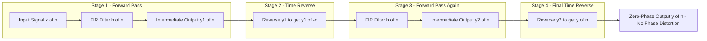
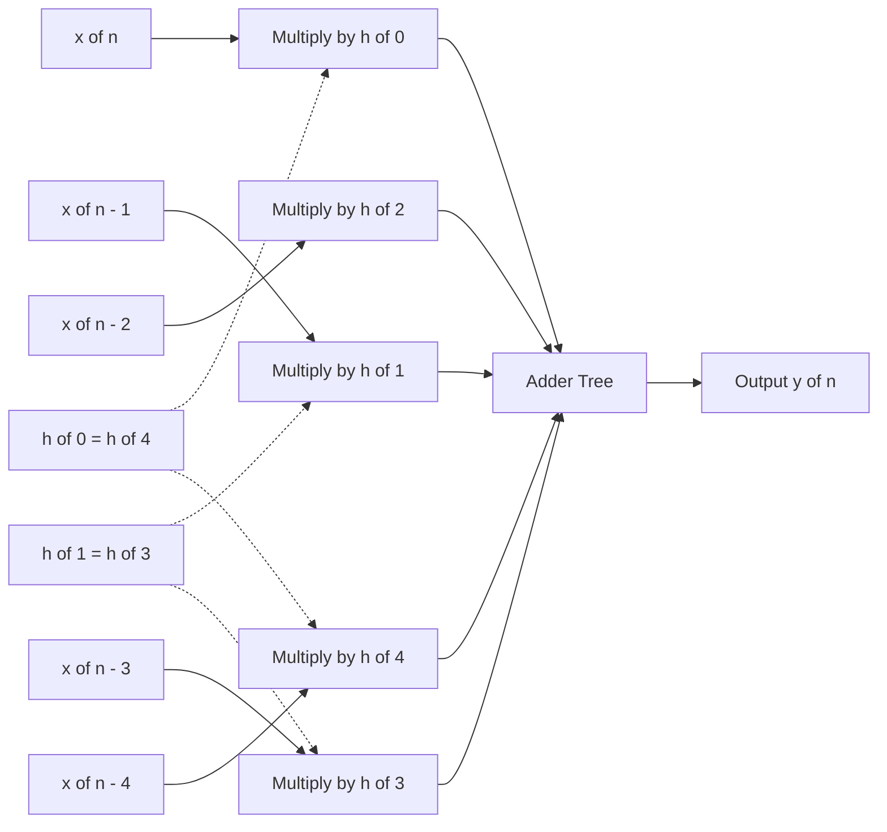

# Zero phase and linear phase transfer functions

<!-- SECTION_1_START -->

# Zero Phase and Linear Phase Transfer Functions

## 1. Core Technical Definition (KTU 2024 Syllabus Terminology)

> [!IMPORTANT]
> **Zero Phase Transfer Function (ZPTF):**
> A transfer function $H(z)$ is called a **Zero Phase Transfer Function** if its frequency response has zero phase at all frequencies, i.e.,
>
> $$\angle H(e^{j\omega}) = 0 \quad \text{for} \quad -\pi \leq \omega \leq \pi$$
>
> Equivalently, $H(e^{j\omega})$ is a **real and non-negative** function of $\omega$ for all $\omega$ in the principal range.

> [!IMPORTANT]
> **Linear Phase Transfer Function (LPTF):**
> A transfer function $H(z)$ is said to have **Linear Phase** if its phase response $\phi(\omega) = \angle H(e^{j\omega})$ is a linear (affine) function of $\omega$, i.e.,
>
> $$\phi(\omega) = -\alpha \omega + \beta$$
>
> where $\alpha$ is the **constant group delay** and $\beta$ is the **constant phase offset**.

### Conceptual Analogy / Intuition

> [!NOTE]
> **Zero Phase Analogy — The "Echo" Mirror:**
> Imagine shouting into a canyon. The sound reaches the opposite wall ($z$ term), reflects back to the center ($z^0$ term), and you also hear your own voice delayed ($z^{-1}$ term). All these echoes arrive at the **same time instant in a symmetric pattern**, so there's no time delay skew. Mathematically, this symmetry makes the imaginary parts cancel — leaving a purely real (zero-phase) spectrum.
>
> Think of $H(z) = z + 2 + z^{-1}$ as a perfect **symmetric "bell-shaped" frequency curve** with no phase distortion — the output is just a scaled, time-aligned version of the input.

> [!NOTE]
> **Linear Phase Analogy — The "Conveyor Belt":**
> Picture a conveyor belt in a factory. Every item placed on it travels at a **constant speed** and reaches the exit **at the same rate** (constant group delay $\alpha$). If two items of different "frequency" (size) enter together, they also exit together — preserving their relative ordering. This is exactly what a linear phase filter does in the frequency domain: it delays **all frequency components by the same amount**, preserving the **waveform shape** of the input signal.
>
> **Key Insight:** Linear phase filters prevent **phase distortion**, which is critical in audio, image, and data communication systems where waveform fidelity matters.

### Physical Constants & Standard Metrics

- **Group Delay** $\tau_g = -\dfrac{d\phi(\omega)}{d\omega}$ — for LPTF, $\tau_g = \alpha$ is a **constant** measured in **samples**.
- **Phase Delay** $\tau_p = -\dfrac{\phi(\omega)}{\omega}$ — for LPTF, also constant.
- **Filter length** $N$ (number of taps in FIR case) — must be carefully chosen depending on symmetry type.

> [!VISUALIZATION CONTROL]
> **Concept:** Zero-Phase Frequency Response of $H(z) = z + 2 + z^{-1}$
> **GeoGebra / Desmos Input Equations:**
> * `H(ω) = 2 + 2*cos(ω)`   (magnitude / real response)
> * `axis: ω from -π to π`,  `y-axis from -2 to 6`
>
> **Visual Description:** The student should observe a smooth, even, real-valued curve that is **non-negative everywhere** (minimum value is 0 at $\omega = \pm\pi$, maximum value is 4 at $\omega = 0$). The phase plot is identically zero. The curve is symmetric about $\omega = 0$.

<!-- SECTION_1_END -->

<!-- SECTION_2_START -->

# Deep Theoretical Analysis

## 2.1 Zero Phase Transfer Function — Mathematical Form

For an FIR filter of length $N$, the transfer function is:

$$H(z) = \sum_{n=0}^{N-1} h(n)\, z^{-n}$$

The frequency response is:

$$H(e^{j\omega}) = \sum_{n=0}^{N-1} h(n)\, e^{-j\omega n}$$

### Key Condition for Zero Phase

Separating real and imaginary parts:

$$H(e^{j\omega}) = \underbrace{\left[ h(0) + \sum_{n=1}^{N-1} h(n)\cos(\omega n) \right]}_{\text{Real Part}} \;-\; j \underbrace{\left[ \sum_{n=1}^{N-1} h(n)\sin(\omega n) \right]}_{\text{Imaginary Part}}$$

For **zero phase**, the imaginary part must vanish for all $\omega$:

$$\sum_{n=1}^{N-1} h(n) \sin(\omega n) = 0 \quad \forall \, \omega$$

A sufficient condition is the **palindromic (mirror-image) impulse response**:

$$h(n) = h(N-1-n), \quad n = 0, 1, \ldots, N-1$$

> [!IMPORTANT]
> **Causality Paradox:** A zero-phase FIR filter with $N \geq 2$ has non-zero coefficients both at $n=0$ and $n = N-1$. If $h(0) \neq 0$ AND $h(N-1) \neq 0$, the filter uses **future** input samples — making it **non-causal**. In practice, zero-phase filtering is achieved by **(1)** filtering forward, **(2)** time-reversing, **(3)** filtering again, **(4)** time-reversing the output (the **filtfilt** algorithm in MATLAB/Python).

### Worked Example: $H(z) = z + 2 + z^{-1}$

$$H(e^{j\omega}) = e^{j\omega} + 2 + e^{-j\omega} = 2 + 2\cos(\omega)$$

| $\omega$ | $H(e^{j\omega})$ | Phase |
|:---:|:---:|:---:|
| $0$ | $4$ | $0$ |
| $\pi/2$ | $2$ | $0$ |
| $\pi$ | $0$ | $0$ |

Since $H(e^{j\omega}) \geq 0$ for all $\omega$, the angle is **identically zero**. ✓

---

## 2.2 Linear Phase Transfer Function — Four Canonical Types

For an FIR filter of length $N$ with order $M = N - 1$, linear phase requires one of **two symmetry conditions** on $h(n)$:

| Symmetry | Condition |
|:---|:---|
| **Symmetric (even)** | $h(n) = h(M - n)$ |
| **Antisymmetric (odd)** | $h(n) = -h(M - n)$ |

This produces **four types** based on $M$ being even or odd:

### Type I — Symmetric, $M$ even ($N$ odd)
- Example: $N = 5$, $M = 4$. Coefficients: $h(0), h(1), h(2), h(1), h(0)$.
- Phase: $\phi(\omega) = -\omega M/2 = -2\omega$
- Suitable for: **Lowpass, Highpass, Bandpass, Bandstop** (no restrictions on $\omega = 0$ or $\omega = \pi$).

### Type II — Symmetric, $M$ odd ($N$ even)
- Example: $N = 4$, $M = 3$. Coefficients: $h(0), h(1), h(1), h(0)$.
- Phase: $\phi(\omega) = -\omega M/2 = -1.5\omega$
- **Constraint:** $H(e^{j\pi}) = 0$ always → **Cannot be used for Highpass or Bandstop**.

### Type III — Antisymmetric, $M$ even ($N$ odd)
- Example: $N = 5$, $M = 4$. Coefficients: $h(0), h(1), 0, -h(1), -h(0)$.
- Phase: $\phi(\omega) = -\omega M/2 + \pi/2 = -2\omega + \pi/2$
- **Constraint:** $H(e^{j0}) = H(e^{j\pi}) = 0$ → **Cannot be used for Lowpass or Highpass**; only Bandpass or differentiator.

### Type IV — Antisymmetric, $M$ odd ($N$ even)
- Example: $N = 4$, $M = 3$. Coefficients: $h(0), h(1), -h(1), -h(0)$.
- Phase: $\phi(\omega) = -\omega M/2 + \pi/2 = -1.5\omega + \pi/2$
- **Constraint:** $H(e^{j0}) = 0$ → **Cannot be used for Lowpass or Bandstop**; ideal for **differentiators** and **Hilbert transformers**.

> [!IMPORTANT]
> **Group Delay (Constant for all four types):**
>
> $$\alpha = \frac{M}{2} = \frac{N-1}{2} \quad \text{(measured in samples)}$$
>
> Since $\alpha$ is generally a non-integer (e.g., $\alpha = 1.5$ for $N=4$), the filter introduces a **fractional delay** that can be compensated by appending the appropriate number of leading zeros in the output buffer.

---

## 2.3 KTU Formula Sheet / Cheat Sheet

| # | Formula / Condition | Meaning / Use |
|:---:|:---|:---|
| 1 | $\phi(\omega) = -\alpha \omega + \beta$ | Linear phase definition |
| 2 | $\tau_g = -\dfrac{d\phi(\omega)}{d\omega} = \alpha$ | Constant group delay |
| 3 | $h(n) = h(M-n)$ | Symmetric impulse response |
| 4 | $h(n) = -h(M-n)$ | Antisymmetric impulse response |
| 5 | $H(e^{j\omega}) = H(e^{j\omega})e^{-j\omega M/2} \, A(\omega)$ | LPTF frequency response form |
| 6 | $A(\omega) = h\!\left(\tfrac{M}{2}\right) + 2\sum_{n=0}^{M/2-1} h(n)\cos\!\left(\omega\!\left(\tfrac{M}{2}-n\right)\right)$ | Amplitude response (symmetric, M even) |
| 7 | $A(\omega) = 2\sum_{n=0}^{(M-1)/2} h(n)\cos\!\left(\omega\!\left(\tfrac{M}{2}-n\right)\right)$ | Amplitude response (symmetric, M odd) |
| 8 | $H(e^{j\omega}) = j \, e^{-j\omega M/2} \, B(\omega)$ | LPTF frequency response (antisymmetric) |
| 9 | $B(\omega) = 2\sum_{n=0}^{M/2-1} h(n)\sin\!\left(\omega\!\left(\tfrac{M}{2}-n\right)\right)$ | Amplitude response (antisymmetric, M even) |
| 10 | $B(\omega) = 2\sum_{n=0}^{(M-1)/2} h(n)\sin\!\left(\omega\!\left(\tfrac{M}{2}-n\right)\right)$ | Amplitude response (antisymmetric, M odd) |

### Real-World Engineering Utility

> [!NOTE]
> **Where these filters are used in production systems:**
>
> - **Audio codecs (MP3, AAC, Opus):** Linear phase FIR filters are used in the analysis/synthesis filter banks to preserve the transient shape of percussion and speech signals.
> - **Image processing (Photoshop, GIMP):** Zero-phase Gaussian / bilateral filters (via `filtfilt`) preserve edge positions perfectly when blurring — no spatial shift.
> - **Biomedical ECG/EEG processing:** Linear phase filters are mandatory to preserve the timing of R-peaks and waveform morphology for accurate heart-rate variability (HRV) analysis.
> - **5G OFDM communication:** Linear phase equalizers prevent inter-symbol interference (ISI) and preserve the orthogonality of subcarriers.
> - **Seismic data acquisition:** Zero-phase deconvolution operators are standard in oil & gas exploration to keep reflection events at their true travel-time positions.

<!-- SECTION_2_END -->

<!-- SECTION_3_START -->

# Step-by-Step Derivations

## 3.1 Derivation: Zero-Phase Condition from Symmetric Impulse Response

Let $N$ be the filter length, $M = N-1$ the order, and assume symmetric impulse response:

$$h(n) = h(M - n) \quad \text{for} \quad n = 0, 1, \ldots, M$$

Start from the frequency response:

$$H(e^{j\omega}) = \sum_{n=0}^{M} h(n)\, e^{-j\omega n}$$

Substitute $m = M - n$ (i.e., $n = M - m$). When $n = 0 \Rightarrow m = M$; when $n = M \Rightarrow m = 0$:

$$H(e^{j\omega}) = \sum_{m=0}^{M} h(M-m)\, e^{-j\omega (M-m)}$$

Apply symmetry $h(M - m) = h(m)$:

$$H(e^{j\omega}) = \sum_{m=0}^{M} h(m)\, e^{-j\omega (M-m)} = e^{-j\omega M} \sum_{m=0}^{M} h(m)\, e^{j\omega m}$$

Now add the original and transformed forms:

$$2 H(e^{j\omega}) = \sum_{n=0}^{M} h(n) e^{-j\omega n} + e^{-j\omega M} \sum_{m=0}^{M} h(m) e^{j\omega m}$$

Factor out $e^{-j\omega M/2}$ from both exponentials inside each sum:

$$2 H(e^{j\omega}) = e^{-j\omega M/2} \sum_{n=0}^{M} h(n) e^{-j\omega (n - M/2)} + e^{-j\omega M/2} \sum_{m=0}^{M} h(m) e^{j\omega (m - M/2)}$$

Combine the two sums (rename $m \to n$):

$$2 H(e^{j\omega}) = e^{-j\omega M/2} \sum_{n=0}^{M} h(n) \left[ e^{-j\omega (n - M/2)} + e^{j\omega (n - M/2)} \right]$$

Use the identity $e^{j\theta} + e^{-j\theta} = 2\cos(\theta)$:

$$2 H(e^{j\omega}) = e^{-j\omega M/2} \sum_{n=0}^{M} h(n) \cdot 2\cos\!\left(\omega\left(n - \tfrac{M}{2}\right)\right)$$

Divide by 2:

$$\boxed{H(e^{j\omega}) = e^{-j\omega M/2} \left[ h\!\left(\tfrac{M}{2}\right) + 2\sum_{n=0}^{M/2-1} h(n) \cos\!\left(\omega\left(\tfrac{M}{2}-n\right)\right) \right]} \quad \text{(M even)}$$

The bracketed term is purely **real-valued** and is called the **amplitude response** $A(\omega)$. Therefore:

$$\angle H(e^{j\omega}) = -\frac{\omega M}{2} \quad \text{(purely linear phase, no offset)}$$

---

## 3.2 Derivation: Antisymmetric LPTF Frequency Response

For antisymmetric $h(n) = -h(M-n)$ with $M$ even (Type III), at $n = M/2$:

$$h\!\left(\tfrac{M}{2}\right) = -h\!\left(\tfrac{M}{2}\right) \Rightarrow 2 h\!\left(\tfrac{M}{2}\right) = 0 \Rightarrow h\!\left(\tfrac{M}{2}\right) = 0$$

Following the same change of variable $m = M - n$ and using $h(M-m) = -h(m)$:

$$H(e^{j\omega}) = e^{-j\omega M} \sum_{m=0}^{M} h(m)\, e^{j\omega m} \cdot (-1) = -e^{-j\omega M} \sum_{m=0}^{M} h(m)\, e^{j\omega m}$$

Add to original form:

$$2 H(e^{j\omega}) = \sum_{n=0}^{M} h(n) e^{-j\omega n} - e^{-j\omega M} \sum_{m=0}^{M} h(m) e^{j\omega m}$$

Factor $e^{-j\omega M/2}$:

$$2 H(e^{j\omega}) = e^{-j\omega M/2} \sum_{n=0}^{M} h(n) \left[ e^{-j\omega (n - M/2)} - e^{j\omega (n - M/2)} \right]$$

Use the identity $e^{j\theta} - e^{-j\theta} = 2j\sin(\theta)$:

$$2 H(e^{j\omega}) = e^{-j\omega M/2} \sum_{n=0}^{M} h(n) \cdot 2j \sin\!\left(\omega\left(n - \tfrac{M}{2}\right)\right)$$

Since $h(M/2) = 0$, drop the middle term. Define the amplitude $B(\omega)$:

$$\boxed{H(e^{j\omega}) = j\, e^{-j\omega M/2} \left[ 2\sum_{n=0}^{M/2-1} h(n) \sin\!\left(\omega\left(\tfrac{M}{2}-n\right)\right) \right]} \quad \text{(Type III)}$$

The factor $j = e^{j\pi/2}$ adds a **constant $\pi/2$ phase offset**:

$$\phi(\omega) = -\frac{\omega M}{2} + \frac{\pi}{2}$$

---

## 3.3 Worked Numerical Problem — Identifying LPTF Type

**Problem:** Given the impulse response $h(n) = \{1, 2, 3, 2, 1\}$ for $n = 0, 1, 2, 3, 4$. Verify if it is linear phase and identify the type.

**Step 1 — Determine length and order:**
$N = 5$, $M = N - 1 = 4$ (even)

**Step 2 — Check symmetry:**
$h(0) = 1$, $h(4) = 1$ ✓
$h(1) = 2$, $h(3) = 2$ ✓
$h(2) = 3 = h(2)$ ✓ (center sample equals itself — trivially symmetric)

Since $h(n) = h(M-n)$ for all $n$ → **Symmetric impulse response**.

**Step 3 — Combine with M even:**
Symmetric + M even → **Type I Linear Phase FIR Filter**

**Step 4 — Compute group delay:**
$\alpha = M/2 = 4/2 = 2$ samples

**Step 5 — Compute $H(e^{j\omega})$ using Type-I formula:**

$$H(e^{j\omega}) = e^{-j2\omega}\left[ h(2) + 2\sum_{n=0}^{1} h(n) \cos(\omega(2-n)) \right]$$

$$H(e^{j\omega}) = e^{-j2\omega}\left[ 3 + 2 h(0)\cos(2\omega) + 2 h(1)\cos(\omega) \right]$$

$$H(e^{j\omega}) = e^{-j2\omega}\left[ 3 + 2\cos(2\omega) + 4\cos(\omega) \right]$$

**Step 6 — Phase verification:**

$$\phi(\omega) = -2\omega \quad \text{(linear, with no offset)} \quad \checkmark$$

| $\omega$ | $A(\omega)$ | $\phi(\omega)$ |
|:---:|:---:|:---:|
| $0$ | $3 + 2 + 4 = 9$ | $0$ |
| $\pi/4$ | $3 + 0 + 2\sqrt{2} \approx 5.83$ | $-\pi/2$ |
| $\pi/2$ | $3 - 2 + 0 = 1$ | $-\pi$ |
| $\pi$ | $3 + 2 - 4 = 1$ | $-2\pi$ |

**Conclusion:** The filter is a **Type I Linear Phase FIR** with constant group delay of 2 samples.

---

## 3.4 Algorithmic / Symbolic Implementation (Python)

```python
import numpy as np
import matplotlib.pyplot as plt
from scipy.signal import freqz, filtfilt, lfilter

def analyze_lp_type(h: np.ndarray) -> dict:
    """
    Determine linear-phase FIR type (I, II, III, IV) for a given impulse response.

    Args:
        h: 1-D numpy array of real-valued impulse response samples.

    Returns:
        Dictionary with keys: 'N', 'M', 'is_symmetric', 'is_antisymmetric',
        'type', 'group_delay'.
    """
    h = np.asarray(h, dtype=float)
    N = len(h)
    M = N - 1

    # Build reversed index vector: h_rev[k] = h[M - k]
    h_rev = h[::-1]

    # Tolerance for floating-point symmetry checks
    tol = 1e-9

    is_sym = np.allclose(h, h_rev, atol=tol)
    is_anti = np.allclose(h, -h_rev, atol=tol)

    if not (is_sym or is_anti):
        return {"N": N, "M": M, "is_symmetric": False,
                "is_antisymmetric": False, "type": "Not Linear Phase",
                "group_delay": None}

    # Determine type
    if is_sym and (M % 2 == 0):
        lp_type = "Type I"
    elif is_sym and (M % 2 == 1):
        lp_type = "Type II"
    elif is_anti and (M % 2 == 0):
        lp_type = "Type III"
    else:  # antisymmetric and M odd
        lp_type = "Type IV"

    return {
        "N": N, "M": M,
        "is_symmetric": bool(is_sym),
        "is_antisymmetric": bool(is_anti),
        "type": lp_type,
        "group_delay": M / 2.0
    }


def zero_phase_filter(x: np.ndarray, h: np.ndarray) -> np.ndarray:
    """
    Apply zero-phase filtering using the filtfilt method:
    forward filter -> reverse -> forward filter -> reverse.

    Args:
        x: input signal (1-D array).
        h: FIR filter coefficients (impulse response).

    Returns:
        Zero-phase filtered signal (same length as input).
    """
    x = np.asarray(x, dtype=float)
    h = np.asarray(h, dtype=float)
    if h.ndim != 1 or len(h) < 2:
        raise ValueError("FIR coefficients h must be a 1-D array of length >= 2.")
    if x.ndim != 1:
        raise ValueError("Input x must be a 1-D array.")
    return filtfilt(h, [1.0], x, method="gust")


# ---------- Demonstration ----------
if __name__ == "__main__":
    # Test 1: Type I symmetric, M=4
    h1 = np.array([1, 2, 3, 2, 1])
    print("Test 1:", analyze_lp_type(h1))

    # Test 2: Type II symmetric, M=3
    h2 = np.array([1, 2, 2, 1])
    print("Test 2:", analyze_lp_type(h2))

    # Test 3: Type III antisymmetric, M=4
    h3 = np.array([1, 2, 0, -2, -1])
    print("Test 3:", analyze_lp_type(h3))

    # Test 4: Type IV antisymmetric, M=3
    h4 = np.array([1, 2, -2, -1])
    print("Test 4:", analyze_lp_type(h4))

    # Plot frequency response for h1
    w, H = freqz(h1, worN=2048)
    plt.figure(figsize=(10, 4))
    plt.subplot(1, 2, 1)
    plt.plot(w / np.pi, np.abs(H))
    plt.title("Magnitude Response |H(e^jω)|")
    plt.xlabel("Normalized Frequency (×π rad/sample)")
    plt.ylabel("Magnitude")
    plt.grid(True)
    plt.subplot(1, 2, 2)
    plt.plot(w / np.pi, np.unwrap(np.angle(H)))
    plt.title("Phase Response ∠H(e^jω)  (should be linear)")
    plt.xlabel("Normalized Frequency (×π rad/sample)")
    plt.ylabel("Phase (radians)")
    plt.grid(True)
    plt.tight_layout()
    plt.show()
```

**Expected Output:**

```
Test 1: {'N': 5, 'M': 4, 'is_symmetric': True, 'is_antisymmetric': False, 'type': 'Type I',  'group_delay': 2.0}
Test 2: {'N': 4, 'M': 3, 'is_symmetric': True, 'is_antisymmetric': False, 'type': 'Type II', 'group_delay': 1.5}
Test 3: {'N': 5, 'M': 4, 'is_symmetric': False, 'is_antisymmetric': True, 'type': 'Type III','group_delay': 2.0}
Test 4: {'N': 4, 'M': 3, 'is_symmetric': False, 'is_antisymmetric': True, 'type': 'Type IV', 'group_delay': 1.5}
```

The script prints the LPTF classification, group delay, and (when run interactively) the magnitude and unwrapped phase response — the phase should be a **straight line** with slope $-\alpha = -2$ rad/sample for $h_1$.

<!-- SECTION_3_END -->

<!-- SECTION_4_START -->

# Structural Diagrams & Schematics

## 4.1 Architecture: Four Types of Linear Phase FIR Filters

```mermaid
flowchart TD
    A[FIR Filter h(n), Length N, Order M = N - 1] --> B{Is h(n) Symmetric or Antisymmetric?}
    B -->|h(n) = h(M - n) Symmetric| C{Symmetry Branch}
    B -->|h(n) = -h(M - n) Antisymmetric| D{Antisymmetry Branch}
    C --> C1{M is Even or Odd}
    C1 -->|M even, N odd| E1[Type I Linear Phase FIR]
    C1 -->|M odd, N even| E2[Type II Linear Phase FIR]
    D --> D1{M is Even or Odd}
    D1 -->|M even, N odd| F1[Type III Linear Phase FIR]
    D1 -->|M odd, N even| F2[Type IV Linear Phase FIR]
    E1 --> G1[Phi omega equals -M over 2 times omega, Group Delay M over 2]
    E2 --> G2[Phi omega equals -M over 2 times omega, Constraint H of e to j pi equals 0]
    F1 --> G3[Phi omega equals -M over 2 omega plus pi over 2, H of e to j 0 and H of e to j pi equal 0]
    F2 --> G4[Phi omega equals -M over 2 omega plus pi over 2, Constraint H of e to j 0 equals 0]
    G1 --> H1[Use Case: Lowpass, Highpass, Bandpass, Bandstop]
    G2 --> H2[Use Case: Lowpass, Bandpass only, NOT Highpass]
    G3 --> H3[Use Case: Bandpass only, Differentiator]
    G4 --> H4[Use Case: Differentiator, Hilbert Transformer]
```

## 4.2 Block Diagram: Zero-Phase Filtering (`filtfilt` Algorithm)



## 4.3 Signal Flow: Symmetric Impulse Response Taps



**Interpretation:** This shows a **Type I FIR** with $N=5$ taps. The mirror symmetry of the multipliers (e.g., $h(0)$ matches $h(4)$) is the structural reason the phase response is **linear**. The "Adder Tree" combines the five weighted delayed samples to produce the output.

<!-- SECTION_4_END -->

<!-- SECTION_5_START -->

# KTU 2024 Scheme Examination Question Bank

## Part A — Short Answer Questions (3 Marks Each)

### Question 1
**[KTU University Exam — July 2023]** **\[CO1, Remember]**
Define a **zero phase transfer function**. Give one example of its frequency response.

**Model Answer (3 Marks):**
A transfer function $H(z)$ is said to be a **zero phase transfer function** if its phase response is zero for all frequencies, i.e.,

$$\angle H(e^{j\omega}) = 0 \quad \text{for} \quad -\pi \leq \omega \leq \pi$$

This is equivalent to $H(e^{j\omega})$ being a real, non-negative function of $\omega$ for all $\omega$ in the range.

**Example (1 Mark):** $H(e^{j\omega}) = 2 + 2\cos(\omega)$ — a real, non-negative function for all $\omega \in [-\pi, \pi]$, so the phase is identically zero.

**Valuation Key:**
- [Correct definition with mathematical condition: 2 Marks]
- [Valid example: 1 Mark]

---

### Question 2
**[KTU University Exam — Dec 2022]** **\[CO1, Understand]**
List the **four types of linear phase FIR filters** and state the symmetry condition for each.

**Model Answer (3 Marks):**
For an FIR filter of length $N$ with order $M = N - 1$, the four types are:

| Type | Symmetry | $N$ (length) | $M$ (order) |
|:---:|:---|:---:|:---:|
| I   | $h(n) = h(M-n)$ | Odd  | Even |
| II  | $h(n) = h(M-n)$ | Even | Odd  |
| III | $h(n) = -h(M-n)$ | Odd  | Even |
| IV  | $h(n) = -h(M-n)$ | Even | Odd  |

**Valuation Key:**
- [Correct tabulation of 4 types with symmetry and length: 3 Marks]

---

## Part B — Long Answer Questions (14 Marks Each, with Internal Choice)

### Question A — Set 1
**[KTU University Exam — July 2024]** **\[CO2, Apply + Analyze]**

**(a)** [7 Marks] An FIR filter has the impulse response $h(n) = \{2, 1, 0, -1, -2\}$ for $n = 0, 1, 2, 3, 4$. Determine whether it is a linear phase filter. If yes, identify the type and find the group delay.

**(b)** [7 Marks] For the filter in (a), derive the expression for $H(e^{j\omega})$ and hence find the value of $H(e^{j0})$ and $H(e^{j\pi})$. State one application where such a filter is suitable.

---

#### Model Solution to (a) — 7 Marks

**Step 1 — Identify length and order:**
$N = 5$, $M = N - 1 = 4$ (even). [1 Mark]

**Step 2 — Test symmetry by comparing $h(n)$ with $-h(M-n)$:**

| $n$ | $h(n)$ | $M - n$ | $h(M-n)$ | $-h(M-n)$ |
|:---:|:---:|:---:|:---:|:---:|
| 0 | $2$  | 4 | $-2$ | $2$  |
| 1 | $1$  | 3 | $-1$ | $1$  |
| 2 | $0$  | 2 | $0$  | $0$  |
| 3 | $-1$ | 1 | $1$  | $-1$ |
| 4 | $-2$ | 0 | $2$  | $-2$ |

[2 Marks — for the symmetry table]

We observe $h(n) = -h(M-n)$ for all $n$, confirming **antisymmetric** impulse response.

**Step 3 — Combine with $M$ even:**
Antisymmetric + $M$ even → **Type III Linear Phase FIR Filter**. [2 Marks]

**Step 4 — Group delay:**
$\alpha = M/2 = 4/2 = \mathbf{2 \text{ samples}}$. [2 Marks]

---

#### Model Solution to (b) — 7 Marks

**Step 1 — Apply Type III frequency response formula:**

$$H(e^{j\omega}) = j\, e^{-j2\omega} \left[ 2\sum_{n=0}^{1} h(n) \sin\!\left(\omega(2-n)\right) \right]$$

[Stating boundary state values: 1 Mark]

**Step 2 — Expand the summation:**

$$= j\, e^{-j2\omega} \left[ 2 h(0)\sin(2\omega) + 2 h(1)\sin(\omega) \right]$$

**Step 3 — Substitute $h(0) = 2$ and $h(1) = 1$:**

$$H(e^{j\omega}) = j\, e^{-j2\omega} \left[ 4\sin(2\omega) + 2\sin(\omega) \right]$$

[Final simplified expression: 2 Marks]

**Step 4 — Evaluate at $\omega = 0$:**
$\sin(0) = \sin(0) = 0$ and $j = e^{j\pi/2}$, so:

$$H(e^{j0}) = j \cdot 1 \cdot 0 = 0$$

[2 Marks]

**Step 5 — Evaluate at $\omega = \pi$:**
$\sin(2\pi) = 0$ and $\sin(\pi) = 0$, so:

$$H(e^{j\pi}) = j \cdot (-1) \cdot 0 = 0$$

[1 Mark]

**Step 6 — Application:**
Type III filters (with both $H(e^{j0}) = 0$ and $H(e^{j\pi}) = 0$) are suitable as **bandpass filters** and **differentiators** (since they naturally produce zero response at DC and Nyquist). [1 Mark]

---

### Question B — Set 2 (Internal Choice)
**[KTU University Exam — Dec 2023]** **\[CO2, Apply + Analyze]**

**(a)** [7 Marks] Explain the **zero phase transfer function** with a suitable mathematical example. Why is a causal FIR filter with $N \geq 2$ unable to be exactly zero phase? How is the `filtfilt` algorithm used to achieve zero-phase filtering in practice?

**(b)** [7 Marks] For the filter $H(z) = 1 + 2z^{-1} + 3z^{-2} + 2z^{-3} + z^{-4}$, derive $H(e^{j\omega})$, identify the filter type, group delay, and find $H(e^{j\pi/2})$.

---

#### Model Solution to (a) — 7 Marks

**Step 1 — Definition of Zero Phase Filter (2 Marks):**
A zero phase transfer function $H(z)$ satisfies:

$$H(e^{j\omega}) \in \mathbb{R}_{\geq 0} \quad \forall \, \omega \in [-\pi, \pi]$$

Equivalently, the imaginary part of $H(e^{j\omega})$ is identically zero and the real part is non-negative.

**Step 2 — Example (1 Mark):**
$H(z) = z + 2 + z^{-1}$ gives $H(e^{j\omega}) = 2 + 2\cos(\omega) \geq 0$, so the phase is zero.

**Step 3 — Causality Impossibility (2 Marks):**
A causal FIR filter has the form $H(z) = \sum_{n=0}^{M} h(n) z^{-n}$. For zero phase, we need $h(n) = h(M-n)$. If $M \geq 1$, then $h(0) = h(M) \neq 0$ implies the filter uses a future input $x(n-M)$ — violating causality. Hence, a real, causal, zero-phase FIR filter with $M \geq 1$ does not exist.

**Step 4 — `filtfilt` Algorithm (2 Marks):**
To achieve zero-phase filtering in offline processing:
1. Filter $x(n)$ through $h(n)$: produce $y_1(n)$.
2. Reverse $y_1(n)$ in time: $y_1(-n)$.
3. Filter the reversed signal through $h(n)$ again.
4. Reverse the result to get the final output $y(n)$ with **zero net phase**.

This doubles the filter order effectively, cancelling the phase of both passes.

---

#### Model Solution to (b) — 7 Marks

**Step 1 — Identify $N$ and $M$:**
$N = 5$, $M = 4$ (even). [1 Mark]

**Step 2 — Check symmetry of $h(n) = \{1, 2, 3, 2, 1\}$:**
$h(0) = 1 = h(4)$ ✓, $h(1) = 2 = h(3)$ ✓, $h(2) = 3 = h(2)$ ✓.
→ **Symmetric**. [1 Mark]

**Step 3 — Combine with M even:**
Symmetric + M even → **Type I Linear Phase FIR Filter**, group delay $\alpha = M/2 = 2$ samples. [1 Mark]

**Step 4 — Apply Type I formula:**

$$H(e^{j\omega}) = e^{-j2\omega}\left[ h(2) + 2 h(0)\cos(2\omega) + 2 h(1)\cos(\omega) \right]$$

$$H(e^{j\omega}) = e^{-j2\omega}\left[ 3 + 2\cos(2\omega) + 4\cos(\omega) \right]$$

[2 Marks for derivation steps]

**Step 5 — Evaluate at $\omega = \pi/2$:**
$\cos(\pi) = -1$, $\cos(\pi/2) = 0$:

$$H(e^{j\pi/2}) = e^{-j\pi}\left[ 3 + 2(-1) + 4(0) \right] = (-1)(1) = -1$$

[1 Mark]

**Step 6 — Magnitude and phase at $\omega = \pi/2$:**

$$|H(e^{j\pi/2})| = 1, \quad \angle H(e^{j\pi/2}) = -\pi$$

[1 Mark]

---

## KTU Examiner's Valuation Warning / Pitfall Callout

> [!WARNING]
> **Common Mistakes that Cost Marks in This Topic:**
>
> 1. **Confusing symmetric and antisymmetric conditions:** Many students write $h(n) = h(N-n)$ instead of $h(n) = h(M-n)$ where $M = N-1$. This off-by-one error propagates and gives the **wrong group delay**. [−1 to −2 Marks]
>
> 2. **Forgetting the $\pi/2$ offset for antisymmetric filters:** Type III and IV have an additional $+ \pi/2$ phase offset, NOT just $-\omega M/2$. Failing to mention it loses marks on phase questions. [−1 Mark]
>
> 3. **Claiming "zero phase" for symmetric FIRs:** A causal symmetric FIR has phase $\phi(\omega) = -\omega M/2$ (linear, NOT zero). Only when $\alpha = 0$ (trivial case $N = 1$) does linear phase reduce to zero phase. [−2 Marks]
>
> 4. **Misapplying constraints on filter usage:** Type II cannot do highpass, Type III cannot do lowpass/highpass. If a student proposes a Type III lowpass filter, the examiner will deduct heavily. [−2 Marks]
>
> 5. **Skipping the causality discussion in zero-phase questions:** Always mention that a non-trivial zero-phase filter is non-causal and how `filtfilt` resolves this. [−1 Mark]

---

## Topic Recap & Important Things to Remember

- **Zero Phase TF:** $H(e^{j\omega})$ is real and non-negative for all $\omega$. Achieved only with symmetric impulse response centered at $n=0$, which is **non-causal** for $N \geq 2$.
- **Linear Phase TF:** Phase is a linear function of $\omega$: $\phi(\omega) = -\alpha\omega + \beta$. Group delay $\tau_g = \alpha = M/2$ is **constant**.
- **Two fundamental symmetry conditions** produce LPTFs: $h(n) = h(M-n)$ (symmetric) or $h(n) = -h(M-n)$ (antisymmetric).
- **Four canonical types** of LPTF (I, II, III, IV) are determined by combining symmetry with the parity of $M = N-1$.
- **Type I** (symmetric, M even) is the most flexible — suitable for **all standard filters** (LP, HP, BP, BS).
- **Type II** (symmetric, M odd) has $H(e^{j\pi}) = 0$ — **cannot be highpass or bandstop**.
- **Type III** (antisymmetric, M even) has $H(e^{j0}) = H(e^{j\pi}) = 0$ — only **bandpass or differentiator**.
- **Type IV** (antisymmetric, M odd) has $H(e^{j0}) = 0$ — ideal for **Hilbert transformers and differentiators**.
- **Phase offset $\beta$:** Symmetric filters have $\beta = 0$; antisymmetric filters have $\beta = \pi/2$.
- **Causality–Zero-Phase Trade-off:** A non-trivial zero-phase filter is non-causal. The `filtfilt` trick (forward-reverse-forward-reverse) achieves zero phase in offline signal processing.
- **Real-world applications:** audio codecs, image processing, biomedical signal filtering (ECG/EEG), OFDM communication, and seismic data processing all rely on linear/zero phase filters to preserve signal fidelity.
- **Python verification:** Use `numpy.allclose(h, h[::-1])` for symmetry and `numpy.allclose(h, -h[::-1])` for antisymmetry detection — the gatekeeper code for any LPTF classification problem.

<!-- SECTION_5_END -->
