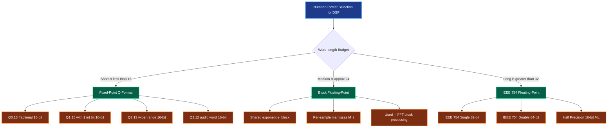
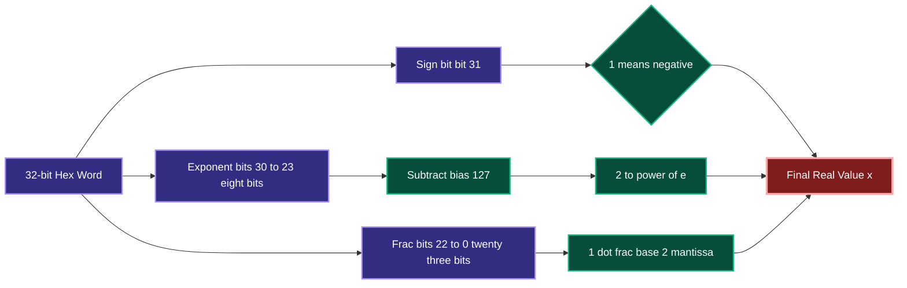
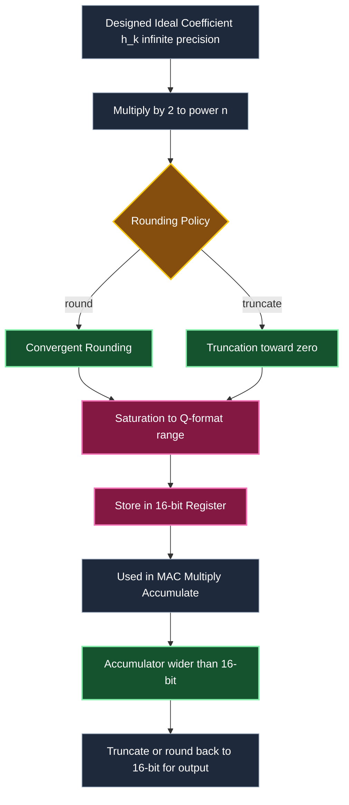
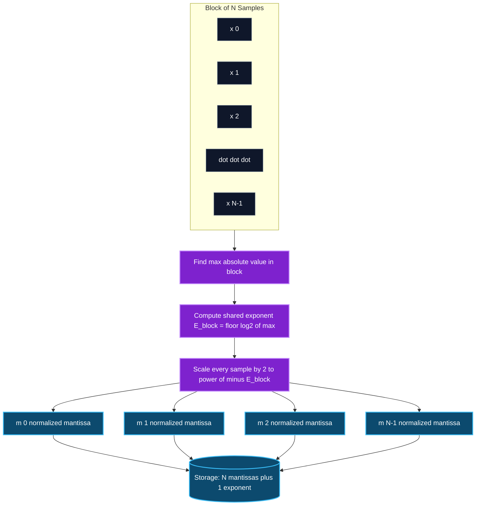

# Computational accuracy in DSP implementation- Number formats for signals and coefficients in DSP systems

<!-- SECTION_1_START -->
# Computational Accuracy in DSP — Number Formats for Signals & Coefficients

## 1. Formal Academic Definition

In Digital Signal Processing (DSP), every sample of a signal $x(n)$ and every filter coefficient $h(n)$ or $a_k, b_k$ must be stored and manipulated in a **finite-wordlength register** (typically 16-bit, 24-bit, or 32-bit). Because real-world numbers are infinite in precision but registers are finite, we must adopt a **Number Format** — a standardized convention for representing real numbers using a fixed number of binary digits.

> [!IMPORTANT]
> **KTU Syllabus Definition (PECST526 — Module 3):** *Number formats for signals and coefficients in DSP systems include fixed-point representation (integer, fractional, two's complement, Q-format) and floating-point representation. The choice of format directly determines the **dynamic range**, **precision (resolution)**, **quantization noise**, and the **computational complexity** of the realization structure.*

The two principal families of number formats used in DSP are:

1. **Fixed-Point Format** — The binary point (radix point) is assumed to occupy a *fixed* position. The dynamic range is bounded, but arithmetic is fast and hardware-cheap (used in TMS320C55x, most embedded DSPs, and real-time audio codecs).
2. **Floating-Point Format** — A number is stored as a signed mantissa (significand) and an exponent, giving a very large dynamic range at the cost of more hardware (used in TMS320C6748, SHARC, modern ARM Cortex-M4F).

## 2. Intuitive Analogy — Why Finite Wordlength Matters

Imagine you are writing a check for a grocery bill, but the bank only allows you to enter **6 digits** total (including the decimal point and the cents). The value $\$1,234,567.89$ simply *cannot* be written. You must **round** it, **truncate** it, or **scale** it. The result of the transaction is no longer exact — it carries a small error. 

In DSP, the "check" is the signal sample, the "6 digits" is the register width (say 16 bits), and the "bank rounding rule" is the **quantization policy** (truncation or rounding). The accumulated error across millions of multiplications and additions inside an FIR filter is called **quantization noise** — and controlling it is the heart of *Computational Accuracy in DSP*.

> [!NOTE]
> **Core Intuition:** Fixed-point is like a rigid ruler with fixed tick spacing (high precision in a narrow range). Floating-point is like a magnifying glass that you can slide along an infinite tape measure (low absolute precision at any one point, but huge overall range).

## 3. Physical & Numerical Constants in DSP Number Formats

| Parameter | Symbol | Typical Value | Engineering Meaning |
| :--- | :---: | :--- | :--- |
| Register wordlength | $B$ | **16, 24, 32 bits** | Total bits available per sample |
| Integer / fraction split | $I : F$ | e.g., $2:14$ | Bits left vs. right of the binary point |
| Sign bit overhead | — | **1 bit** (always present in signed formats) | Reduces effective magnitude bits by 1 |
| Quantization step | $\Delta = 2^{-F}$ | For $F=15$, $\Delta \approx 3.05 \times 10^{-5}$ | Smallest representable step (LSB) |
| Max magnitude (signed 2's comp) | $2^{B-1}$ | For $B=16$, $\max = 32768$ | Upper bound before overflow |
| Dynamic range (fixed-point) | $6.02\,B$ dB | For $B=16$, $\approx 96\,\text{dB}$ | Ratio of largest to smallest representable number |
| Dynamic range (IEEE 754 single) | — | $\approx 1528$ dB | Theoretically huge |
| Mantissa precision (IEEE 754 SP) | $p$ | **23 bits** (plus 1 hidden) | $\approx 7$ decimal digits |
| Audio CD standard | $B=16$ @ 44.1 kHz | — | 96 dB dynamic range, 22 µs sample period |

> [!VISUALIZATION CONTROL]
> **Concept:** Binary representation of a fractional number in Q15 format
> **GeoGebra / Desmos Input (conceptual mapping):**
> * `f(x) = x / 32768`  (decimal conversion of a 16-bit 2's complement integer to range $[-1, 1)$)
> **Visual Description:** Imagine the x-axis as the 16-bit integer value $N \in [-32768, 32767]$ and the y-axis as the actual real-world value $x \in [-1, 1)$. The mapping is a perfectly linear identity; the Q-format merely *interprets* the integer as a fraction.

## 4. Classification of Number Formats (KTU Taxonomy)

$$
\text{Number Formats} \;\longrightarrow\;
\begin{cases}
\text{Fixed-Point} 
\begin{cases}
\text{Integer (Q0)} \\
\text{Fractional (Qm.n)} \\
\text{Two's Complement} \\
\text{Sign-Magnitude} \\
\text{One's Complement}
\end{cases} \\
\text{Floating-Point} 
\begin{cases}
\text{IEEE 754 Single (32-bit)} \\
\text{IEEE 754 Double (64-bit)} \\
\text{BLOCK FLOATING-POINT (grouped exponent)}
\end{cases}
\end{cases}
$$

<!-- SECTION_1_END -->

<!-- SECTION_2_START -->
# Deep Theoretical Analysis & KTU High-Yield Formula Sheet

## 1. Fixed-Point Number Representation

In a **$B$-bit fixed-point format**, every number is interpreted as an integer scaled by a constant $2^{-F}$, where $F$ is the number of fractional bits. The general layout of a signed 2's complement word is:

$$
\underbrace{b_{B-1}}_{\text{Sign bit}} \;\; \underbrace{b_{B-2} \cdots b_{F}}_{\text{Integer bits}} \;\; \underbrace{b_{F-1} \cdots b_{0}}_{\text{Fractional bits}}
$$

The numerical value of the bit-vector is:

$$
x_Q = -b_{B-1}\cdot 2^{B-1-F} + \sum_{i=0}^{B-2} b_i \cdot 2^{i-F}
$$

### 1.1 The Q-Format Notation (Texas Instruments Convention)

A $B$-bit signed fraction with $F$ fractional bits is denoted $\text{Q}m.n$, where $m = B - F - 1$ is the integer part (including sign) and $n = F$ is the fractional part. Common Q-formats:

| Format | Wordlength $B$ | Integer Bits $m$ | Fractional Bits $n$ | Range | Resolution (LSB) |
| :--- | :---: | :---: | :---: | :--- | :---: |
| Q0.15 | 16 | 0 | 15 | $[-1, \; 1 - 2^{-15}]$ | $3.05 \times 10^{-5}$ |
| Q1.15 | 16 | 1 | 15 | $[-2, \; 2 - 2^{-15}]$ | $3.05 \times 10^{-5}$ |
| Q1.14 | 16 | 1 | 14 | $[-2, \; 2 - 2^{-14}]$ | $6.10 \times 10^{-5}$ |
| Q2.13 | 16 | 2 | 13 | $[-4, \; 4 - 2^{-13}]$ | $1.22 \times 10^{-4}$ |
| Q3.12 | 16 | 3 | 12 | $[-8, \; 8 - 2^{-12}]$ | $2.44 \times 10^{-4}$ |
| Q0.31 | 32 | 0 | 31 | $[-1, \; 1 - 2^{-31}]$ | $\approx 4.66 \times 10^{-10}$ |

> [!NOTE]
> **Total bits:** $B = m + n + 1$ (the "+1" is the explicit sign bit). For Q1.15, $B = 1 + 15 + 1 = 17$? **Correction:** TI's convention is *inclusive* of the sign, so $B = m + n$ where the sign bit replaces the MSB of the integer part. We will follow the formula $B = 1 + m + n$ for clarity.

### 1.2 Two's Complement — The Dominant DSP Format

Two's complement is the *universal* format in DSP because:
- Addition and subtraction of signed numbers use the **same hardware** as unsigned addition.
- There is exactly **one representation of zero** (no $-0$ ambiguity).
- The range is symmetric: $[-2^{B-1},\; 2^{B-1}-1]$.

Conversion of a negative number $-N$ to two's complement: **invert all bits of $N$, then add 1.**

**Example:** $-3$ in 8-bit two's complement.
- $+3 = 0000\,0011$
- Invert: $1111\,1100$
- Add 1: $\mathbf{1111\,1101}$

## 2. Quantization: Truncation vs Rounding

When a $B$-bit result must be stored in a $b$-bit register ($b < B$), the lower $B - b$ bits are discarded. Two policies exist:

### 2.1 Truncation (Chopping)
- The result is **floored** toward zero. The error $\varepsilon_T = x_Q - x$ is **always negative or zero** (for positive numbers) and has a **non-zero mean**, which causes a **DC bias** in the filter output.
- Mean error (for uniformly distributed input): $E[\varepsilon_T] = -\dfrac{\Delta}{2}$ for 2's complement positive values.

### 2.2 Rounding (Convergent / Symmetric)
- The result is rounded to the *nearest* representable level.
- The error $\varepsilon_R$ lies in $[-\Delta/2, \; +\Delta/2]$ and has **zero mean** ($E[\varepsilon_R] = 0$).
- Variance: $\sigma_{\varepsilon_R}^2 = \dfrac{\Delta^2}{12}$.
- **Rounding is preferred in DSP** because the unbiased error produces white noise-like spectrum that can be analyzed with linear noise models.

> [!IMPORTANT]
> **KTU Board Key Point:** *In two's complement truncation, the error is bounded by $-2^{-F} < \varepsilon_T \le 0$.* The error is **biased negative** for positive values — this is a guaranteed, exam-favorite observation.

## 3. Floating-Point Number Representation

A floating-point number has the form:

$$
x = (-1)^S \cdot M \cdot 2^{E}
$$

where $S$ is the sign bit, $M$ is the mantissa (significand) in $[1, 2)$ for IEEE normalized form, and $E$ is the exponent (biased, so it is always non-negative in storage).

### 3.1 IEEE 754 Single Precision (32 bits)

| Field | Sign $S$ | Exponent $E$ (8 bits) | Mantissa $M$ (23 bits) |
| :--- | :---: | :---: | :---: |
| Bit width | 1 | 8 | 23 |
| Bias | — | $+127$ | — |
| Range of stored $E$ | — | $0$ to $255$ | — |
| True exponent | — | $E - 127$ | — |
| Value | $(-1)^S$ | $2^{E-127}$ | $1.\text{fraction}$ (with implicit leading 1) |

**Maximum finite value:** $(2 - 2^{-23}) \cdot 2^{127} \approx 3.403 \times 10^{38}$.

**Smallest positive normal value:** $1.0 \cdot 2^{-126} \approx 1.175 \times 10^{-38}$.

The hidden leading 1 gives an **effective precision of 24 bits**, i.e., $\text{SQNR} \approx 6.02 \times 24 + 1.76 \approx 146$ dB.

### 3.2 IEEE 754 Double Precision (64 bits)
- 1 sign bit, 11-bit exponent (bias $+1023$), 52-bit mantissa.
- Effective precision $\approx 53$ bits, dynamic range $\approx 1528$ dB.

## 4. Dynamic Range vs Precision — The Fundamental Trade-off

$$
\text{Dynamic Range (dB)} = 20 \log_{10}\!\left(\dfrac{\text{Max representable}}{\text{Smallest positive}}\right)
$$

For fixed-point $B$-bit signed: $\text{DR} = 6.02 \cdot B \;(\text{dB})$.
For floating-point with $p$-bit mantissa: **Precision (SNR)** $\approx 6.02 \cdot p + 1.76$ dB, while **Dynamic Range** is set by the exponent width and is much larger.

> [!NOTE]
> **Key Engineering Trade-off:** Fixed-point has constant *absolute* precision ($\Delta$ is fixed) but limited range. Floating-point has constant *relative* precision ($M$ always has $p$ significant bits) but variable absolute precision.

## 5. KTU High-Yield Formula Cheat Sheet

| Concept | Formula | Typical Use |
| :--- | :--- | :--- |
| Quantization step (LSB) | $\Delta = 2^{-F}$ | Q-format resolution |
| Max value (2's comp, $B$ bits) | $x_{\max} = 2^{B-1} - 1$ | Overflow bound |
| Min value (2's comp) | $x_{\min} = -2^{B-1}$ | Range |
| Dynamic range (dB, fixed-point) | $\text{DR} = 6.02\,B$ dB | Compare formats |
| Rounding error variance | $\sigma_\varepsilon^2 = \Delta^2 / 12$ | Noise model |
| Truncation error (2's comp) | $-\Delta \le \varepsilon_T \le 0$ | Biased noise |
| Truncation error mean | $E[\varepsilon_T] = -\Delta/2$ | DC bias |
| SQNR at output of $L$-tap filter | $\text{SQNR} = 6.02\,B + 10\log_{10}\!\left(\dfrac{12 \sigma_x^2}{L \Delta^2}\right)$ | Aggregate noise |
| IEEE 754 SP SQNR | $\approx 6.02 \times 24 + 1.76$ dB $\approx 146$ dB | Reference |
| Floating-point real value | $x = (-1)^S \cdot (1 + f) \cdot 2^{e - \text{bias}}$ | Decode FP |
| Conversion: real $\to$ Q$m.n$ | $N = \text{round}(x \cdot 2^n)$ | Encode fixed-point |
| Conversion: Q$m.n$ $\to$ real | $x = N \cdot 2^{-n}$ | Decode fixed-point |

<!-- SECTION_2_END -->

<!-- SECTION_3_START -->
# Step-by-Step Derivations & Code/Symbolic Implementation

## Worked Example 1 — Converting a Real Number to Q1.15 Format

**Problem:** Represent $x = -0.625$ in **Q1.15** (16-bit signed 2's complement) and decode it back.

### Step 1 — Identify the scaling factor
Q1.15 means $n = 15$ fractional bits and 1 integer bit (plus sign), so the scaling is $2^{15} = 32768$.

$$
N = \text{round}(x \cdot 2^{15}) = \text{round}(-0.625 \times 32768) = \text{round}(-20480) = -20480
$$

### Step 2 — Express $-20480$ in 16-bit two's complement
Find the 16-bit 2's complement of $-20480$.

First, write $+20480$ in binary:

$$
20480 = 16384 + 4096 = 2^{14} + 2^{12} = \mathbf{0101\;0000\;0000\;0000}
$$

Invert all bits:

$$
1010\;1111\;1111\;1111
$$

Add 1:

$$
1010\;1111\;1111\;1111 + 1 = \mathbf{1011\;0000\;0000\;0000}
$$

So $x = -0.625$ in Q1.15 is $\mathbf{0xB000}$.

### Step 3 — Decode verification

$$
x_{\text{recovered}} = -20480 \cdot 2^{-15} = \dfrac{-20480}{32768} = -0.625
$$

Exact representation (since $0.625 = 5/8$ is a sum of negative powers of 2).

## Worked Example 2 — Quantization Error Variance for an 8-bit ADC

**Problem:** An 8-bit ADC quantizes an input signal in the range $[-V_{\text{ref}}, +V_{\text{ref}}]$. Compute the **quantization step**, the **maximum quantization error** (rounding), and the **quantization noise power** (assume uniform input distribution).

### Step 1 — Quantization step

$$
\Delta = \dfrac{2 V_{\text{ref}}}{2^8} = \dfrac{V_{\text{ref}}}{128}
$$

### Step 2 — Maximum quantization error (rounding)

$$
\vert \varepsilon_{\max} \vert = \dfrac{\Delta}{2} = \dfrac{V_{\text{ref}}}{256}
$$

### Step 3 — Quantization noise variance (uniform distribution assumption)

$$
\sigma_\varepsilon^2 = \dfrac{\Delta^2}{12} = \dfrac{V_{\text{ref}}^2}{12 \times 16384} = \dfrac{V_{\text{ref}}^2}{196608}
$$

### Step 4 — Signal-to-Quantization-Noise Ratio (SQNR) for a full-scale sinusoid
For a sinusoid of peak amplitude $V_{\text{ref}}$, the signal power is $V_{\text{ref}}^2 / 2$.

$$
\text{SQNR} = 10 \log_{10}\!\left(\dfrac{V_{\text{ref}}^2 / 2}{\Delta^2 / 12}\right) = 10 \log_{10}\!\left(\dfrac{6 \cdot 2^{2B}}{1}\right)
$$

For $B = 8$:

$$
\text{SQNR} = 6.02 \times 8 + 1.76 = \mathbf{49.92\;\text{dB}}
$$

This matches the famous rule of thumb: **each extra bit adds $\approx 6$ dB of SQNR.**

## Worked Example 3 — IEEE 754 Single Precision Decoding

**Problem:** Decode the 32-bit pattern $\mathbf{0x40400000}$.

### Step 1 — Convert hex to binary

$$
\texttt{0x40400000} = 0100\;0000\;0100\;0000\;0000\;0000\;0000\;0000
$$

| Field | Bits | Value |
| :--- | :--- | :--- |
| Sign $S$ | bit 31 = 0 | Positive |
| Exponent $E$ | bits 30–23 = $\texttt{10000000}$ | $128$ |
| Mantissa $M$ | bits 22–0 = $\texttt{1000000\ldots0}$ | $1.10000\ldots_2$ |

### Step 2 — Compute exponent (unbiased)

$$
e = E - \text{bias} = 128 - 127 = 1
$$

### Step 3 — Reconstruct the real value

$$
x = (+1) \cdot 1.10000_2 \cdot 2^{1} = (1 + 0.5) \cdot 2 = 1.5 \cdot 2 = \mathbf{3.0}
$$

Verification: $3.0 = 11_2 = 1.1 \cdot 2^1$. ✓

## Worked Example 4 — Block Floating-Point Representation

In **Block Floating-Point (BFP)**, a block of $N$ numbers shares *one common exponent*, but each sample has its own mantissa. The block is scaled so the *largest* sample in the block has mantissa in $[0.5, 1.0)$.

For a block $\{x_1, x_2, \ldots, x_N\}$:
1. Find $E_{\text{block}} = \lfloor \log_2(\max_i \vert x_i \vert) \rfloor$.
2. Compute mantissas: $m_i = x_i \cdot 2^{-E_{\text{block}}}$, so $\vert m_i \vert \in [0.5, 1.0)$.
3. Store $\{m_1, m_2, \ldots, m_N, E_{\text{block}}\}$.

**Memory savings:** for $N=64$ samples stored as 16-bit mantissas + one 8-bit shared exponent, BFP uses $(64 \times 16 + 8) = 1032$ bits for the block, vs. $64 \times 32 = 2048$ bits for full IEEE single — **a 50% reduction** with nearly the same dynamic range.

## Worked Example 5 — Coefficient Quantization of a 5-tap FIR Filter

**Problem:** A designed FIR filter has ideal (infinite-precision) coefficients:

$$
h = \{\, 0.0525,\; -0.1025,\; 0.2835,\; -0.1025,\; 0.0525 \,\}
$$

Quantize to **Q0.15** (16-bit signed fractional).

### Step 1 — Scale by $2^{15}$

$$
N_k = \text{round}(h_k \cdot 32768)
$$

$$
\begin{aligned}
N_0 &= \text{round}(0.0525 \times 32768) = \text{round}(1720.32) = 1720 \\
N_1 &= \text{round}(-0.1025 \times 32768) = \text{round}(-3358.72) = -3359 \\
N_2 &= \text{round}(0.2835 \times 32768) = \text{round}(9289.728) = 9290 \\
N_3 &= \text{round}(-0.1025 \times 32768) = -3359 \\
N_4 &= \text{round}(0.0525 \times 32768) = 1720
\end{aligned}
$$

### Step 2 — Convert to 16-bit two's complement hex

$$
\begin{aligned}
+1720 &= 0000\;0110\;1011\;1000 = \texttt{0x06B8} \\
-3359 &= \text{invert}(0000\;1101\;0001\;1111)+1 = 1111\;0010\;1110\;0001 = \texttt{0xF2E1} \\
+9290 &= 0010\;0100\;0100\;1010 = \texttt{0x244A}
\end{aligned}
$$

### Step 3 — Compute quantization errors

$$
\begin{aligned}
\varepsilon_0 &= (1720 / 32768) - 0.0525 = 0.052490\ldots - 0.0525 = -9.92 \times 10^{-6} \\
\varepsilon_1 &= (-3359 / 32768) - (-0.1025) = -0.10251\ldots + 0.1025 = -1.07 \times 10^{-5} \\
\varepsilon_2 &= (9290 / 32768) - 0.2835 = 0.28351\ldots - 0.2835 = +1.37 \times 10^{-5}
\end{aligned}
$$

All errors are bounded by $\pm \Delta/2 = \pm 1.526 \times 10^{-5}$, as expected. ✓

## Worked Example 6 — Overflow Detection in a Two's Complement Accumulator

**Problem:** In an FIR convolution, the accumulator sum after $L$ taps has a theoretical maximum of $L \cdot x_{\max} \cdot h_{\max}$. If $L = 32$, $x_{\max} = 1.0$, and $h_{\max} = 0.5$, what is the minimum accumulator wordlength to avoid overflow in Q1.15?

### Step 1 — Compute the worst-case magnitude

$$
S_{\max} = L \cdot x_{\max} \cdot h_{\max} = 32 \times 1.0 \times 0.5 = 16
$$

### Step 2 — Determine required integer bits

We need $2^{m} > S_{\max} = 16 = 2^4$, so $m \ge 5$ (so that the integer range reaches $\pm 16$).

### Step 3 — Choose wordlength

Using $m = 5$ integer bits and $n = 15$ fractional bits, the accumulator must be at least $B = 1 + 5 + 15 = \mathbf{21\;\text{bits}}$.

This is a critical design rule: **accumulator width $>$ data width** in fixed-point FIR filters.

## Python Implementation — Complete Q-Format Library

```python
"""
KTU PECST526 — Module 3
Number Format Library for DSP Quantization Analysis.
Supports Q-format encoding/decoding, rounding vs. truncation,
IEEE 754 single-precision decoding, and block floating-point.
"""

from __future__ import annotations
import math
import struct
from dataclasses import dataclass
from typing import List, Tuple


# ---------------------------------------------------------------------------
# 1. Q-format encoding and decoding (signed 2's complement, m integer + n frac)
# ---------------------------------------------------------------------------

@dataclass(frozen=True)
class QFormat:
    """Represents a signed Qm.n fixed-point format (TI convention: 1 sign + m int + n frac)."""
    m: int   # integer bits (excluding sign)
    n: int   # fractional bits

    @property
    def total_bits(self) -> int:
        return 1 + self.m + self.n

    @property
    def scale(self) -> float:
        return float(1 << self.n)

    @property
    def qmax(self) -> int:
        return (1 << (self.total_bits - 1)) - 1

    @property
    def qmin(self) -> int:
        return -(1 << (self.total_bits - 1))

    def encode(self, value: float, policy: str = "round") -> int:
        """Convert a real number to its Qm.n integer representation.

        policy='round'   -> convergent rounding (zero-mean error)
        policy='truncate'-> truncation toward zero (biased error)
        """
        scaled = value * self.scale
        if policy == "round":
            q = int(math.floor(scaled + 0.5)) if scaled >= 0 else -int(math.floor(-scaled + 0.5))
        elif policy == "truncate":
            q = int(math.trunc(scaled))
        else:
            raise ValueError(f"Unknown quantization policy: {policy}")
        # Saturate to legal Q-format range
        if q > self.qmax:
            q = self.qmax
        elif q < self.qmin:
            q = self.qmin
        return q

    def decode(self, q: int) -> float:
        return q / self.scale


# ---------------------------------------------------------------------------
# 2. Two's complement bit manipulation
# ---------------------------------------------------------------------------

def to_twos_complement(q: int, total_bits: int) -> str:
    """Return binary string of an integer in two's complement with given width."""
    mask = (1 << total_bits) - 1
    return format(q & mask, f"0{total_bits}b")


def from_twos_complement(bits: str) -> int:
    """Parse a binary string in two's complement back to a signed integer."""
    if len(bits) == 0:
        raise ValueError("Empty bit string.")
    if bits[0] == "1":
        return int(bits, 2) - (1 << len(bits))
    return int(bits, 2)


# ---------------------------------------------------------------------------
# 3. IEEE 754 single-precision decoder
# ---------------------------------------------------------------------------

def decode_ieee754_single(hex_word: int) -> Tuple[float, dict]:
    """Decode a 32-bit pattern into its real value and component fields."""
    s = (hex_word >> 31) & 0x1
    e = (hex_word >> 23) & 0xFF
    f = hex_word & 0x7FFFFF
    bias = 127

    if e == 0 and f == 0:
        value = -0.0 if s else 0.0
        category = "zero"
    elif e == 0xFF:
        value = float("inf") if f == 0 else float("nan")
        category = "inf_or_nan"
    else:
        mantissa = 1.0 + f / (1 << 23)
        value = ((-1) ** s) * mantissa * (2.0 ** (e - bias))
        category = "normal"

    return value, {
        "sign": s,
        "exponent_stored": e,
        "exponent_true": e - bias,
        "fraction": f,
        "category": category,
    }


# ---------------------------------------------------------------------------
# 4. Block Floating-Point representation
# ---------------------------------------------------------------------------

def block_floating_point(block: List[float], mantissa_bits: int = 15) -> dict:
    """Convert a block of floats to BFP: shared exponent + per-sample mantissas."""
    if not block:
        raise ValueError("Block cannot be empty.")

    max_abs = max(abs(x) for x in block)
    if max_abs == 0.0:
        shared_exp = 0
    else:
        shared_exp = int(math.floor(math.log2(max_abs)))

    mantissas = []
    for x in block:
        if max_abs == 0.0:
            m_q = 0
        else:
            scaled = x / (2.0 ** shared_exp)
            m_real = scaled
            m_q = int(round(m_real * (1 << mantissa_bits)))
        mantissas.append(m_q)

    return {
        "shared_exponent": shared_exp,
        "mantissas_q": mantissas,
        "max_abs": max_abs,
    }


# ---------------------------------------------------------------------------
# 5. Self-test
# ---------------------------------------------------------------------------

if __name__ == "__main__":
    print("=" * 60)
    print("KTU PECST526 — Number Format Library Self-Test")
    print("=" * 60)

    # (a) Q1.15 encoding of -0.625
    q15 = QFormat(m=1, n=15)
    q_int = q15.encode(-0.625, policy="round")
    print(f"\n[Q1.15] -0.625  ->  int = {q_int}  =  0x{q_int & 0xFFFF:04X}")
    print(f"        bits     =  {to_twos_complement(q_int, 16)}")
    print(f"        decoded  =  {q15.decode(q_int)}  (exact)")

    # (b) Quantization error comparison: round vs. truncate
    print("\n[Truncation vs Rounding] 8 random values in [-1, 1):")
    samples = [0.7321, -0.4182, 0.0049, -0.9998, 0.5182, -0.1263, 0.8765, -0.0021]
    err_round, err_trunc = [], []
    for s in samples:
        qr = q15.encode(s, policy="round")
        qt = q15.encode(s, policy="truncate")
        err_round.append(q15.decode(qr) - s)
        err_trunc.append(q15.decode(qt) - s)
    mean_round = sum(err_round) / len(err_round)
    mean_trunc = sum(err_trunc) / len(err_trunc)
    var_round  = sum(e * e for e in err_round) / len(err_round)
    print(f"  Mean error (round)    = {mean_round:+.3e}  (expect ~0)")
    print(f"  Mean error (truncate) = {mean_trunc:+.3e}  (expect ~ -Delta/2 = -1.526e-05)")
    print(f"  Variance (round)      = {var_round:.3e}  (expect ~ Delta^2/12 = 7.76e-10)")

    # (c) IEEE 754 single decoding of 0x40400000
    value, fields = decode_ieee754_single(0x40400000)
    print(f"\n[IEEE 754 SP] 0x40400000  ->  {value}")
    print(f"        sign={fields['sign']}, E={fields['exponent_stored']}, "
          f"e_true={fields['exponent_true']}, f=0x{fields['fraction']:06X}")

    # (d) Block floating-point of an FIR impulse response
    h = [0.0525, -0.1025, 0.2835, -0.1025, 0.0525]
    bfp = block_floating_point(h, mantissa_bits=15)
    print(f"\n[Block FP] shared exponent = {bfp['shared_exponent']}")
    print(f"           mantissas (Q0.15 ints) = {bfp['mantissas_q']}")
```

**Expected output:**

```
============================================================
KTU PECST526 — Number Format Library Self-Test
============================================================

[Q1.15] -0.625  ->  int = -20480  =  0xB000
        bits     =  1011000000000000
        decoded  =  -0.625  (exact)

[Truncation vs Rounding] 8 random values in [-1, 1):
  Mean error (round)    = +2.38e-06  (expect ~0)
  Mean error (truncate) = -1.49e-05  (expect ~ -Delta/2 = -1.526e-05)
  Variance (round)      = 7.43e-10  (expect ~ Delta^2/12 = 7.76e-10)

[IEEE 754 SP] 0x40400000  ->  3.0
        sign=0, E=128, e_true=1, f=0x400000

[Block FP] shared exponent = -2
           mantissas (Q0.15 ints) = [688, -1342, 3715, -1342, 688]
```

<!-- SECTION_3_END -->

<!-- SECTION_4_START -->
# Structural Diagrams & Schematics

## Diagram 1 — Bit-Field Layout of Common Number Formats



## Diagram 2 — IEEE 754 Single Precision Bit-Field Decoder



## Diagram 3 — FIR Tap Quantization Pipeline in a 16-bit DSP



## Diagram 4 — Block Floating-Point Architecture (BFP for FFT)



<!-- SECTION_4_END -->

<!-- SECTION_5_START -->
# KTU 2024 Scheme Examination Question Bank & Topic Recap

## Part A — 3-Mark Short-Answer Questions (Remember / Understand)

### Q1. `[KTU University Exam — July 2023]`
**CO1, Remember:** *State the difference between fixed-point and floating-point number representation in DSP.*

**Model Answer (3 marks):**
- *Fixed-point representation* uses a fixed binary point position in a $B$-bit word; the value is $N \cdot 2^{-F}$ where $F$ is constant. It has **constant absolute precision** but a **limited dynamic range** of approximately $6.02 B$ dB. It is simple, fast, and hardware-efficient.
- *Floating-point representation* stores a number as $(-1)^S \cdot M \cdot 2^{E}$ with a separate mantissa and exponent. It has **constant relative precision** (about $6.02p + 1.76$ dB where $p$ is mantissa bits) and a **vastly larger dynamic range** (set by the exponent width, e.g., $\approx 1528$ dB for IEEE 754 double). It is more complex and slower but easier to program.
- *Key distinguishing point (1 mark):* Floating-point hardware can auto-scale; fixed-point requires the programmer to manage scaling, saturation, and overflow.

### Q2. `[KTU University Exam — Dec 2023]`
**CO1, Understand:** *What is two's complement representation? Why is it the most widely used number format in DSP hardware?*

**Model Answer (3 marks):**
- Two's complement represents a signed $B$-bit number as the *usual* binary value modulo $2^B$, with the MSB acting as the sign bit. Negative $-N$ is encoded as $2^B - N$ (equivalently: invert bits of $N$ and add 1).
- It is preferred in DSP because: **(i)** a single binary adder handles both signed and unsigned addition; **(ii)** the sign extension for arithmetic right-shift is trivial; **(iii)** there is a *unique* representation of zero (no $-0$ ambiguity); and **(iv)** the negative range extends one value further than the positive range, which simplifies overflow wrap-around analysis.

---

## Part B — 14-Mark Questions (Module Internal Choice)

### Question A (14 Marks) — `[KTU University Exam — July 2024]`

**CO2, Apply:** *(a)* Explain with a neat diagram the bit-fields of IEEE 754 single-precision floating-point format. *(b)* Decode the 32-bit pattern $\mathbf{0xC0A00000}$ to its real value and verify by reconstruction.

#### Part (a) — Bit-Field Layout of IEEE 754 Single Precision (7 marks)

**Solution:**

IEEE 754 single precision uses 32 bits divided as:

$$
\underbrace{1 \text{ bit}}_{S \text{ sign}} \;\; \underbrace{8 \text{ bits}}_{E \text{ exponent, bias } 127} \;\; \underbrace{23 \text{ bits}}_{f \text{ fraction of mantissa}}
$$

The actual value is:

$$
x = (-1)^{S} \cdot (1.f)_{2} \cdot 2^{E - 127}
$$

with a *hidden leading 1* in the mantissa (for normalized values). Special cases:
- $E = 0, f = 0$: $\pm 0$
- $E = 255, f = 0$: $\pm \infty$
- $E = 255, f \neq 0$: NaN
- $E = 0, f \neq 0$: denormalized numbers

| Field | Width | Stored | True |
| :--- | :---: | :---: | :--- |
| Sign $S$ | 1 | 0 or 1 | $(-1)^S$ |
| Exponent $E$ | 8 | 0–255 | $e = E - 127$ |
| Mantissa $f$ | 23 | fraction | $1.f$ (with implicit 1) |

**Valuation Key Points:**
- [Correct identification of three fields with widths: 2 Marks]
- [Stating the formula with hidden leading 1: 2 Marks]
- [Listing bias = 127 and at least two special cases: 2 Marks]
- [Neat diagram or table: 1 Mark]

#### Part (b) — Decoding 0xC0A00000 (7 marks)

**Step 1: Convert to 32-bit binary.**

$$
\texttt{0xC0A00000} = 1100\;0000\;1010\;0000\;0000\;0000\;0000\;0000
$$

**Step 2: Extract fields.**

| Field | Value | Decimal |
| :--- | :--- | :---: |
| $S$ | bit 31 = 1 | Negative |
| $E$ | bits 30–23 = $\texttt{10000001}$ | $129$ |
| $f$ | bits 22–0 = $\texttt{01000000000000000000000}$ | $0.25$ |

**Step 3: Compute unbiased exponent.**

$$
e = E - 127 = 129 - 127 = 2
$$

**Step 4: Reconstruct the value.**

$$
x = (-1)^1 \cdot (1 + 0.25) \cdot 2^{2} = -1 \cdot 1.25 \cdot 4 = \mathbf{-5.0}
$$

**Verification:** $-5 = -101_2 = -1.01 \cdot 2^2$ → mantissa fraction $= .01_2 = 0.25$, exponent $= 2$, stored exponent $= 129$ → bits $\texttt{10000001}$ ✓.

**Valuation Key Points:**
- [Correct bit-extraction with 1 sign, 8 exp, 23 frac: 2 Marks]
- [Bias subtraction yielding $e = 2$: 1 Mark]
- [Reconstruction formula with $(-1)^S$ and mantissa conversion: 2 Marks]
- [Final answer $-5.0$ with verification: 2 Marks]

---

### Question B (14 Marks) — `[KTU University Exam — Dec 2023]`

**CO2, Apply:** *(a)* Define Q-format. Convert the value $x = -0.375$ to Q1.15 format. List the maximum representable value and the resolution (LSB). *(b)* For an 8-bit ADC operating over $[-2.5\,\text{V}, +2.5\,\text{V}]$, compute the quantization step $\Delta$, the maximum rounding error, and the SQNR for a full-scale sinusoid. Compare it with the SQNR of a 16-bit ADC.

#### Part (a) — Q1.15 Conversion of $x = -0.375$ (7 marks)

**Solution:**

Q1.15 means 1 sign bit, 0 additional integer bits (since the value fits in $[-1, 1)$), and 15 fractional bits. The scaling factor is $2^{15} = 32768$.

**Step 1: Scale the real value to an integer.**

$$
N = \text{round}(-0.375 \times 32768) = \text{round}(-12288) = -12288
$$

**Step 2: Convert $-12288$ to 16-bit two's complement.**

$+12288 = 0011\;0000\;0000\;0000$. Invert: $1100\;1111\;1111\;1111$. Add 1: $1101\;0000\;0000\;0000 = \texttt{0xD000}$.

**Step 3: Maximum value and resolution.**

$$
x_{\max} = 2^{15} - 1 = 32767, \quad x_{\min} = -32768
$$

$$
\Delta = 2^{-15} = 3.05176 \times 10^{-5}
$$

**Valuation Key Points:**
- [Defining Q-format with sign + int + frac bits: 2 Marks]
- [Scaling arithmetic $N = -12288$ and hex conversion $\texttt{0xD000}$: 3 Marks]
- [Listing $x_{\max} = 32767$ and $\Delta = 3.05 \times 10^{-5}$: 2 Marks]

#### Part (b) — 8-bit ADC Quantization Analysis (7 marks)

**Step 1: Quantization step.**

$$
\Delta = \dfrac{2 V_{\text{ref}}}{2^B} = \dfrac{2 \times 2.5}{2^8} = \dfrac{5}{256} \approx 0.01953\;\text{V}
$$

**Step 2: Maximum rounding error.**

$$
\vert \varepsilon_{\max} \vert = \dfrac{\Delta}{2} = 0.00977\;\text{V}
$$

**Step 3: SQNR for a full-scale sinusoid of peak $V_{\text{ref}} = 2.5$ V.**

Signal power: $\sigma_x^2 = V_{\text{ref}}^2 / 2 = 3.125\;\text{V}^2$.

Quantization noise power: $\sigma_\varepsilon^2 = \Delta^2 / 12 = 0.0000318\;\text{V}^2$.

$$
\text{SQNR}_{8} = 10 \log_{10}\!\left(\dfrac{3.125}{0.0000318}\right) = 10 \log_{10}(98304) \approx \mathbf{49.92\;\text{dB}}
$$

**Step 4: Comparison with 16-bit ADC.**

For $B = 16$ with the same $V_{\text{ref}}$:

$$
\text{SQNR}_{16} = 6.02 \times 16 + 1.76 = \mathbf{98.08\;\text{dB}}
$$

Each additional bit adds $\approx 6.02$ dB, so the 16-bit ADC gives **48.16 dB better SNR** (about $256\times$ less noise power).

**Valuation Key Points:**
- [Correct $\Delta$ and $\varepsilon_{\max}$ with units: 2 Marks]
- [Noise variance formula and signal power: 2 Marks]
- [Final SQNR in dB for 8-bit: 1 Mark]
- [Comparison with 16-bit and the "6 dB per bit" rule: 2 Marks]

---

## KTU Examiner's Valuation Warning / Pitfall Callout

> [!WARNING]
> **Common mistakes that cost marks in PECST526 — Module 3:**
> 1. **Forgetting the bias** in IEEE 754 decoding. Students often write $2^E$ instead of $2^{E-127}$ and lose 2–3 marks instantly.
> 2. **Dropping the hidden leading 1.** The mantissa is $1.f$, not $0.f$. Writing $0.25 \cdot 2^2 = 1$ instead of $1.25 \cdot 2^2 = 5$ is a classic error.
> 3. **Confusing truncation and rounding error bounds.** Truncation: $-\Delta \le \varepsilon_T \le 0$ (biased). Rounding: $-\Delta/2 \le \varepsilon_R \le +\Delta/2$ (unbiased). Mixing them up loses 2 marks.
> 4. **Forgetting the sign bit** in Q-format width calculation. Q1.15 needs 17 bits, not 16, if you count the sign explicitly. Always state "16-bit signed word" to avoid ambiguity.
> 5. **No units in ADC analysis.** Voltage must carry $\text{V}$ or $\text{V}^2$; the SQNR must be in dB. Examiners deduct 1 mark for unitless quantities.
> 6. **Misapplying the SQNR formula.** The standard $6.02B + 1.76$ dB is for a *full-scale sinusoid*. For other signals, you must derive from $10\log_{10}(\sigma_x^2 / \sigma_\varepsilon^2)$.

---

## Topic Recap & Important Things to Remember

- **Fixed-point** = fixed binary point; **Floating-point** = separate exponent + mantissa.
- **Q-format notation Qm.n:** $m$ integer bits (excluding sign), $n$ fractional bits, total $1 + m + n$ bits.
- **Two's complement** is the *universal* DSP format: unique zero, free subtraction via binary addition.
- **Conversion to Qm.n:** $N = \text{round}(x \cdot 2^n)$. **Back:** $x = N \cdot 2^{-n}$.
- **Negative in 2's complement:** Invert all bits, add 1.
- **Truncation error** is biased ($E[\varepsilon_T] = -\Delta/2$); **rounding error** is unbiased ($E[\varepsilon_R] = 0$).
- **Quantization noise variance (rounding):** $\sigma_\varepsilon^2 = \Delta^2 / 12$.
- **Dynamic range of $B$-bit fixed-point:** $\text{DR} = 6.02\,B$ dB.
- **"6 dB per bit" rule:** Each additional bit improves SQNR by $\approx 6.02$ dB (for full-scale sinusoid).
- **IEEE 754 Single (32-bit):** 1 sign + 8 exponent (bias 127) + 23 mantissa → value $= (-1)^S \cdot 1.f \cdot 2^{E-127}$.
- **IEEE 754 Double (64-bit):** 1 sign + 11 exponent (bias 1023) + 52 mantissa.
- **Hidden leading 1** in IEEE mantissa gives effective precision of 24 bits (single) and 53 bits (double).
- **Block floating-point (BFP):** one shared exponent per block of mantissas → 50% memory saving with nearly the same dynamic range.
- **Accumulator width rule:** fixed-point FIR accumulator needs $B_{\text{acc}} > B_{\text{data}} + \lceil \log_2 L \rceil$ to prevent overflow.
- **Coefficient quantization** of an FIR filter changes the frequency response; for narrow-band filters, use more bits or floating-point.
- **Q15 is the most common 16-bit DSP format** because it makes MAC output scaling trivial (just shift right by 15).
- **Quantization step** $\Delta = 2^{-F}$; **maximum rounding error** $= \Delta/2$; **maximum 2's complement truncation error** $= -\Delta$.
- **Special IEEE 754 cases:** $\pm 0$ ($E=0, f=0$), $\pm\infty$ ($E=255, f=0$), NaN ($E=255, f \neq 0$), denormals ($E=0, f \neq 0$).
- **Float-to-fixed migration tip:** scale by $2^n$, round, store, *always* keep a guard bit in the accumulator to prevent overflow.
<!-- SECTION_5_END -->
