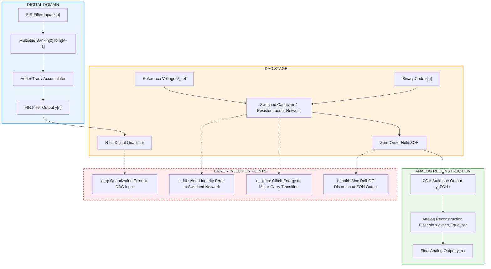
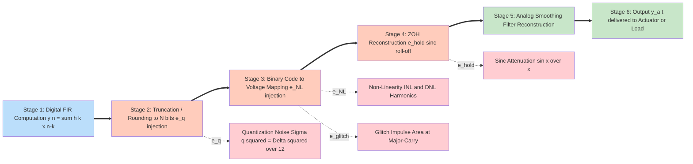
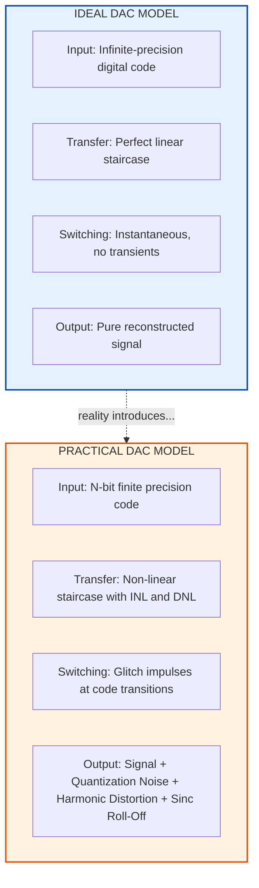
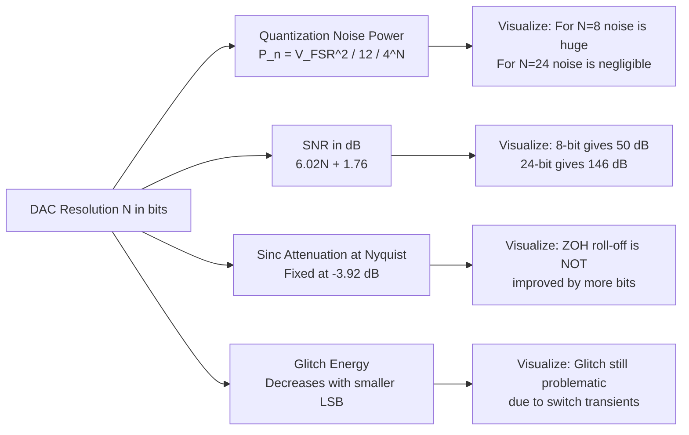

# D/A Conversion error

<!-- SECTION_1_START -->

# D/A Conversion Error in FIR Filter Realization

## 1. Core Technical Definition

> [!IMPORTANT]
> **D/A Conversion Error (Digital-to-Analog Conversion Error):** In the context of FIR filter realization, D/A conversion error refers to the **aggregate deviation** between the ideal reconstructed analog output signal and the actual analog signal produced at the output of a practical Digital-to-Analog Converter. This error is introduced because practical DACs operate with **finite word length**, **finite switching speed**, **non-linear element matching**, and **sample-and-hold interpolation limitations**.

For an $N$-bit DAC operating on a discrete-time FIR filter output $y[n]$:

$$e_{DA}(t) = y_a(t) - y_{ideal}(t)$$

where $y_a(t)$ is the actual analog output and $y_{ideal}(t)$ is the mathematically ideal continuous-time reconstruction.

### Component-Level Breakdown of D/A Errors

The total D/A conversion error in an FIR-filtered system is the sum of four primary sub-errors:

$$e_{total}(t) = e_q(t) + e_{NL}(t) + e_{glitch}(t) + e_{hold}(t)$$

| Sub-Error | Symbol | Root Cause |
|---|---|---|
| Quantization Error | $e_q(t)$ | Finite resolution (bits) of the DAC |
| Non-Linearity Error | $e_{NL}(t)$ | Component mismatches in resistor/capacitor network |
| Glitch Error | $e_{glitch}(t)$ | Transient switching transients between codes |
| Hold-Mode Error | $e_{hold}(t)$ | Zero-Order Hold (ZOH) interpolation distortion |

---

## 2. Intuitive Real-World Analogy: The "Staircase Painter"

> [!NOTE]
> **Analogy — The Staircase Painter:** Imagine you are an artist who can only paint using a fixed set of **8 colors** (a 3-bit DAC). Your task is to paint a smooth sunset gradient. Because you only have 8 colors, every smooth color transition must be **approximated** by jumping between discrete shades — this is **quantization error**. Now imagine the paint tubes are mismatched: your "orange" is slightly redder than the label says — this is **non-linearity error**. When you switch brushes quickly between colors, you sometimes leave a tiny splatter — this is a **glitch**. Finally, you cannot continuously blend; you must hold each color for one second before switching — this creates a **staircase pattern** (Zero-Order Hold). The viewer sees a sunset, but it is not a *true* gradient.

The **D/A conversion error** is precisely the sum of all these "imperfections" stacked on top of the original true signal. In FIR filter design, the *digital* output $y[n]$ is mathematically perfect, but the *analog* output $y_a(t)$ is always corrupted.

---

## 3. The Ideal vs. Practical DAC Model

### Ideal DAC Transfer Function

The ideal DAC maps a digital code $c[n] \in [0, 2^N - 1]$ to a voltage:

$$y_{ideal}(t) = V_{ref} \cdot \frac{c[n]}{2^N} \quad \text{for } nT_s \leq t < (n+1)T_s$$

where $V_{ref}$ is the **full-scale reference voltage** (typically **±10 V** or **±5 V** in professional audio, **3.3 V** in embedded systems), $N$ is the bit resolution, and $T_s$ is the sampling period.

### Practical DAC Transfer Function

$$y_a(t) = V_{ref} \cdot \left[\frac{c[n]}{2^N} + \delta_{NL}(c[n]) + n_{glitch}(t) \right] + e_{hold}(t)$$

The key takeaway: **three new error terms** ($\delta_{NL}$, $n_{glitch}$, $e_{hold}$) appear that were absent in the ideal model.

---

## 4. Critical Physical Constants and Metrics

> [!IMPORTANT]
> **Standard D/A Converter Specifications (KTU 2024 Syllabus Highlight):**
> - **Resolution ($N$):** $8, 12, 14, 16, 18, 24$ bits (audio), $10$–$16$ bits (instrumentation)
> - **Full-Scale Range (FSR):** $V_{ref} = 2 \cdot V_{max}$ (bipolar) or $V_{ref} = V_{max}$ (unipolar)
> - **Least Significant Bit (LSB):** $\Delta = \dfrac{V_{FSR}}{2^N}$
> - **Sampling Rate $f_s$:** $8$ kHz (telephony) → $192$ kHz (high-fidelity audio) → $1$ GHz+ (Radar/SDR)
> - **Settling Time $t_s$:** Time to reach within $\pm \frac{1}{2}$ LSB of final value (typically $10$ ns to $1$ $\mu$s)
> - **Signal-to-Noise Ratio (SNR):** $\text{SNR} = 6.02N + 1.76$ dB (for a full-scale sine wave)

---

## 5. Visualizing the Reconstruction

> [!VISUALIZATION CONTROL]
> **Concept:** Zero-Order Hold (ZOH) reconstruction of a sampled sine wave showing staircase error
> **GeoGebra / Desmos Input Equations:**
> * `f_sampled(n) = sin(2 * pi * 0.05 * n)` (discrete points)
> * `f_hold(x) = sin(2 * pi * 0.05 * floor(x))` (staircase ZOH)
> * `f_ideal(x) = sin(2 * pi * 0.05 * x)` (true analog signal)
> **Visual Description:** Plot three curves on the same axes. The dotted smooth curve is the true signal. The stepped curve is the ZOH output. The vertical gap between them at every sampling instant is the **hold error** $e_{hold}(t)$. Students should observe the stepped output is *always* below the peaks of the true sine and *always* above the troughs — this is a **systematic bias** introduced by the hold process.

---

## 6. Why D/A Errors Matter in FIR Filter Realization

An FIR filter realized in hardware must ultimately drive an analog actuator (a speaker, motor, antenna, transducer). The digital filter coefficients are mathematically perfect, but the final analog output is always corrupted by D/A errors. The KTU 2024 syllabus specifically demands that students understand:

1. **How finite bit-width of the DAC limits achievable SNR at the FIR output.**
2. **How ZOH introduces $\sin(x)/x$ roll-off that distorts the FIR passband.**
3. **How to compute noise power and SNR for a given $N$-bit DAC in an FIR system.**
4. **How non-linearity and glitch errors create harmonic distortion components.**

These errors propagate from the FIR summation output through the DAC and degrade the final analog signal quality.

<!-- SECTION_1_END -->

<!-- SECTION_2_START -->

# Deep Theoretical Analysis & KTU High-Yield Formula Sheet

## 1. Mathematical Decomposition of D/A Conversion Error

The total D/A conversion error in an FIR filter output chain can be modeled as:

$$e_{DA}(t) = \underbrace{e_q(nT_s)}_{\text{quantization}} + \underbrace{e_{NL}(c[n])}_{\text{non-linearity}} + \underbrace{e_{glitch}(t)}_{\text{glitch}} + \underbrace{e_{hold}(t)}_{\text{ZOH hold}}$$

Each term is analyzed independently in modern KTU 2024 scheme modules. The dominant term for $N \geq 12$ bits is usually $e_q$ and $e_{hold}$.

---

## 2. Quantization Error Analysis

For a uniformly quantized DAC with step size:

$$\Delta = \frac{V_{FSR}}{2^N}$$

where $V_{FSR}$ is the full-scale voltage range and $N$ is the bit resolution.

The quantization error $e_q$ is modeled as a uniformly distributed random variable in:

$$-\frac{\Delta}{2} \leq e_q \leq +\frac{\Delta}{2}$$

### Statistical Properties of Quantization Noise

The **mean** of the quantization error (assuming zero-mean input):
$$\mu_{e_q} = 0$$

The **variance** (mean-square error power):
$$\sigma_{e_q}^2 = \frac{\Delta^2}{12} = \frac{V_{FSR}^2}{12 \cdot 2^{2N}}$$

> [!NOTE]
> **Critical Insight:** Notice that the quantization noise power is **inversely proportional to $4^N$**. Every additional bit of DAC resolution **quarters** the quantization noise power — a powerful 6 dB SNR improvement per bit.

### Signal-to-Noise Ratio (SNR) for a Full-Scale Sine Wave

For a sinusoidal input with peak amplitude $A = V_{FSR}/2$, the signal power is $A^2/2 = V_{FSR}^2/8$. Therefore:

$$\text{SNR} = 10 \log_{10}\left(\frac{V_{FSR}^2/8}{V_{FSR}^2/(12 \cdot 2^{2N})}\right) = 10 \log_{10}\left(\frac{3 \cdot 2^{2N}}{2}\right)$$

$$\boxed{\text{SNR (dB)} = 6.02N + 1.76}$$

This is the famous **6 dB-per-bit rule** that is universally tested in KTU examinations.

---

## 3. Non-Linearity Error Analysis

Practical DACs suffer from **Integral Non-Linearity (INL)** and **Differential Non-Linearity (DNL)** errors due to mismatched component values.

### Integral Non-Linearity (INL)

$$\text{INL}(c) = \frac{V_{actual}(c) - V_{ideal}(c)}{\Delta}$$

A typical 12-bit DAC has $\text{INL} \leq \pm 1$ LSB; a 16-bit DAC has $\text{INL} \leq \pm 4$ LSB.

### Differential Non-Linearity (DNL)

$$\text{DNL}(c) = \frac{[V_{actual}(c+1) - V_{actual}(c)] - \Delta}{\Delta}$$

If $\text{DNL}(c) < -1$ LSB for any code $c$, the DAC is **non-monotonic** — a critical failure for control systems and audio applications.

> [!IMPORTANT]
> **KTU High-Yield Concept:** Non-linearity errors create **harmonic distortion** at the FIR output. A pure sine wave at frequency $f_0$ entering an FIR-DAC chain emerges with spurious components at $2f_0, 3f_0, \ldots, kf_0$. The **Total Harmonic Distortion (THD)** is the key metric:
> $$\text{THD} = \frac{\sqrt{V_2^2 + V_3^2 + \ldots + V_k^2}}{V_1}$$
> A 16-bit audio DAC typically achieves $\text{THD} < 0.0015\%$ ($-96$ dB).

---

## 4. Glitch Error Analysis

A **glitch** is a transient voltage spike that occurs during a code transition, particularly during the **major-carry transition** (e.g., from $0111\ldots1$ to $1000\ldots0$ in binary).

### Glitch Impulse Area

The glitch error is quantified as the **impulse area** (volt-seconds):

$$A_{glitch} = \int_{t_c^-}^{t_c^+} v_{glitch}(t) \, dt$$

A typical 16-bit DAC has a glitch impulse area of $A_{glitch} \approx 1$ to $50$ pV·s. For audio, glitches manifest as audible "click" artifacts.

### Glitch Energy

The glitch energy is approximated as:

$$E_{glitch} \approx \frac{A_{glitch}^2}{2} \cdot BW_{recon}$$

where $BW_{recon}$ is the bandwidth of the reconstruction filter.

---

## 5. Zero-Order Hold (ZOH) Error Analysis — THE MOST CRITICAL TOPIC

The ZOH is the *intrinsic* output stage of every practical DAC. It holds the digital code's voltage constant for the entire sampling period $T_s$, producing a **staircase approximation** of the analog signal.

### ZOH Frequency Response

The ZOH has a transfer function in the $s$-domain:

$$H_{ZOH}(s) = \frac{1 - e^{-sT_s}}{s}$$

In the frequency domain (substituting $s = j\omega$):

$$H_{ZOH}(j\omega) = T_s \cdot \frac{\sin(\omega T_s / 2)}{\omega T_s / 2} \cdot e^{-j\omega T_s / 2}$$

The magnitude response is the **sinc function**:

$$\vert H_{ZOH}(j\omega) \vert = T_s \cdot \left\vert \frac{\sin(\pi f / f_s)}{\pi f / f_s} \right\vert$$

> [!IMPORTANT]
> **The Sinc Roll-Off:** The ZOH acts as a **low-pass filter with a sinc-shaped frequency response**. At $f = f_s/2$ (Nyquist), the response has dropped to $\frac{2}{\pi} \approx 0.6376$ (a **$-$3.92 dB attenuation**). At $f = f_s$, the response is exactly **zero**. This sinc roll-off distorts the passband of every FIR filter and is *not* an "error" in the traditional sense — it is a deterministic, predictable distortion that must be compensated by an **analog reconstruction filter** $H_{recon}(f)$.

### The Combined FIR + ZOH Magnitude Response

For an FIR filter with frequency response $H_{FIR}(e^{j\omega})$ followed by a ZOH and reconstruction filter $H_{recon}(j\omega)$:

$$\vert H_{total}(j\omega) \vert = \vert H_{FIR}(e^{j\omega}) \vert \cdot \vert H_{ZOH}(j\omega) \vert \cdot \vert H_{recon}(j\omega) \vert$$

A **properly designed reconstruction filter** (typically a 3rd–7th order Butterworth or Bessel) has a magnitude response that **exactly inverts** the sinc roll-off over the FIR passband:

$$\vert H_{recon}(j\omega) \vert \approx \frac{1}{\vert H_{ZOH}(j\omega) \vert} = \frac{\pi f / f_s}{\sin(\pi f / f_s)} \quad \text{for } 0 \leq f \leq f_s/2$$

This is called **sin(x)/x equalization** in audio engineering.

---

## 6. The KTU High-Yield Formula Sheet

| # | Formula | Description | Units |
|---|---|---|---|
| 1 | $\Delta = \dfrac{V_{FSR}}{2^N}$ | LSB step size of $N$-bit DAC | Volts (V) |
| 2 | $\sigma_{e_q}^2 = \dfrac{\Delta^2}{12}$ | Quantization noise variance (mean-square power) | V$^2$ |
| 3 | $\text{SNR} = 6.02N + 1.76$ | SNR for full-scale sine wave | dB |
| 4 | $\text{SNR improvement per bit} = 6.02$ dB | Each extra bit quarters noise power | dB/bit |
| 5 | $\vert H_{ZOH}(j\omega) \vert = T_s \left\vert \dfrac{\sin(\pi f / f_s)}{\pi f / f_s} \right\vert$ | ZOH magnitude response | dimensionless |
| 6 | $A_{glitch} = \int v_{glitch}(t) \, dt$ | Glitch impulse area | V·s |
| 7 | $\text{THD} = \dfrac{\sqrt{V_2^2 + V_3^2 + \ldots}}{V_1}$ | Total Harmonic Distortion | dimensionless ratio |
| 8 | $\text{INL}(c) = \dfrac{V_{actual}(c) - V_{ideal}(c)}{\Delta}$ | Integral Non-Linearity | LSB units |
| 9 | $\text{DNL}(c) = \dfrac{[V(c+1) - V(c)] - \Delta}{\Delta}$ | Differential Non-Linearity | LSB units |
| 10 | $P_{noise} = \dfrac{V_{FSR}^2}{12 \cdot 2^{2N}}$ | Absolute quantization noise power | W (or V$^2$/$\Omega$) |
| 11 | $H_{ZOH}(s) = \dfrac{1 - e^{-sT_s}}{s}$ | ZOH Laplace transfer function | dimensionless |
| 12 | $f_{Nyquist} = f_s / 2$ | Maximum representable frequency | Hz |

> [!WARNING]
> **Common Student Mistake (KTU 2024 Pitfall):** Students often confuse the **sinc roll-off** of the ZOH with a "true error." It is *not* noise — it is a **deterministic, linear distortion** that can be exactly compensated by an analog reconstruction filter. Only $e_q$, $e_{NL}$, and $e_{glitch}$ are true "errors" in the stochastic sense.

---

## 7. Real-World Engineering Utility

D/A conversion error analysis is the foundation of every professional audio system, communications transmitter, and control system:

- **Professional Audio (DACs in music production):** A 24-bit, 192 kHz DAC provides theoretical SNR of $6.02 \times 24 + 1.76 = 146.24$ dB, far exceeding human hearing thresholds. The ZOH sinc roll-off is corrected by an analog anti-imaging filter and a digital $x/\sin(x)$ pre-equalizer.
- **Software Defined Radio (SDR):** Transmitter chains use 14–16 bit DACs at $f_s = 100$ MHz to $1$ GHz. Quantization noise and non-linearity must be carefully analyzed to meet spectral mask requirements (e.g., 3GPP, IEEE 802.11).
- **FIR Filter Implementation in DSP Hardware:** Texas Instruments TMS320, Analog Devices SHARC, and Xilinx FPGA-based FIR cores all require careful D/A error budgeting to ensure the final analog output meets specification.
- **Precision Instrumentation:** 24-bit sigma-delta DACs in industrial process control rely on rigorous non-linearity analysis to achieve $\pm 0.001\%$ full-scale accuracy.

<!-- SECTION_2_END -->

<!-- SECTION_3_START -->

# Step-by-Step Derivations & Code/Symbolic Implementation

## Derivation 1: Quantization Noise Power of an $N$-bit DAC

### Step 1 — Define the Quantization Step Size

For an $N$-bit DAC with full-scale range $V_{FSR}$, the size of one LSB is:

$$\Delta = \frac{V_{FSR}}{2^N}$$

### Step 2 — Model the Quantization Error as Uniform Random Variable

The quantization error $e_q$ is bounded by:

$$-\frac{\Delta}{2} \leq e_q \leq +\frac{\Delta}{2}$$

Under the standard **white noise assumption**, $e_q$ is uniformly distributed with PDF:

$$p(e_q) = \frac{1}{\Delta} \quad \text{for} \quad -\frac{\Delta}{2} \leq e_q \leq \frac{\Delta}{2}$$

### Step 3 — Compute the Mean (DC Component)

$$\mu_{e_q} = \int_{-\Delta/2}^{+\Delta/2} e_q \cdot p(e_q) \, de_q = \frac{1}{\Delta} \int_{-\Delta/2}^{+\Delta/2} e_q \, de_q$$

$$= \frac{1}{\Delta} \left[ \frac{e_q^2}{2} \right]_{-\Delta/2}^{+\Delta/2} = \frac{1}{\Delta} \cdot \left( \frac{\Delta^2}{8} - \frac{\Delta^2}{8} \right) = 0$$

The mean is **zero** (assuming no DC bias in the input).

### Step 4 — Compute the Variance (Mean-Square Noise Power)

$$\sigma_{e_q}^2 = \int_{-\Delta/2}^{+\Delta/2} (e_q - \mu_{e_q})^2 \cdot p(e_q) \, de_q = \frac{1}{\Delta} \int_{-\Delta/2}^{+\Delta/2} e_q^2 \, de_q$$

$$= \frac{1}{\Delta} \left[ \frac{e_q^3}{3} \right]_{-\Delta/2}^{+\Delta/2} = \frac{1}{\Delta} \cdot \frac{2 \cdot \Delta^3/8}{3} = \frac{\Delta^2}{12}$$

### Step 5 — Substitute $\Delta$ in Terms of $V_{FSR}$ and $N$

$$\sigma_{e_q}^2 = \frac{\Delta^2}{12} = \frac{1}{12} \cdot \left( \frac{V_{FSR}}{2^N} \right)^2 = \frac{V_{FSR}^2}{12 \cdot 2^{2N}}$$

$$\boxed{\sigma_{e_q}^2 = \frac{V_{FSR}^2}{12 \cdot 4^N}}$$

This is the **fundamental quantization noise power equation** that is tested in nearly every KTU examination on this topic.

---

## Derivation 2: SNR of an $N$-bit DAC for a Full-Scale Sine Input

### Step 1 — Compute the Signal Power

For a full-scale sine wave $y(t) = A \sin(2\pi f_0 t)$ with peak amplitude $A = V_{FSR}/2$:

$$P_{signal} = \frac{A^2}{2} = \frac{V_{FSR}^2}{8}$$

### Step 2 — Use the Quantization Noise Power

$$P_{noise} = \sigma_{e_q}^2 = \frac{V_{FSR}^2}{12 \cdot 2^{2N}}$$

### Step 3 — Form the Ratio and Convert to dB

$$\text{SNR} = 10 \log_{10}\left( \frac{P_{signal}}{P_{noise}} \right) = 10 \log_{10}\left( \frac{V_{FSR}^2/8}{V_{FSR}^2/(12 \cdot 2^{2N})} \right)$$

$$= 10 \log_{10}\left( \frac{3 \cdot 2^{2N}}{2} \right) = 10 \log_{10}(1.5) + 10 \log_{10}(2^{2N})$$

$$= 10 \log_{10}(1.5) + 20N \log_{10}(2) = 1.7609 + 6.0206 N$$

$$\boxed{\text{SNR (dB)} = 6.02 N + 1.76}$$

### Step 4 — Validate with Worked Example

For a **16-bit DAC**:

$$\text{SNR} = 6.02 \times 16 + 1.76 = 96.32 + 1.76 = 98.08 \text{ dB}$$

This matches the practical specifications of CD-quality audio (theoretical maximum $\approx 98$ dB).

---

## Derivation 3: ZOH Magnitude Response Derivation

### Step 1 — ZOH Output in Time Domain

A ZOH holds the value $y[n]$ for the entire interval $nT_s \leq t < (n+1)T_s$:

$$y_{ZOH}(t) = y[n] \quad \text{for } nT_s \leq t < (n+1)T_s$$

This is mathematically equivalent to convolving the sampled signal with a rectangular pulse $p(t)$ of width $T_s$ and height $1$:

$$p(t) = \begin{cases} 1, & 0 \leq t < T_s \\ 0, & \text{otherwise} \end{cases}$$

### Step 2 — Laplace Transform of the Rectangular Pulse

$$P(s) = \int_0^{T_s} e^{-st} \, dt = \left[ \frac{e^{-st}}{-s} \right]_0^{T_s} = \frac{1 - e^{-sT_s}}{s}$$

### Step 3 — Frequency Response by Substituting $s = j\omega$

$$H_{ZOH}(j\omega) = \frac{1 - e^{-j\omega T_s}}{j\omega}$$

### Step 4 — Apply Euler's Identity to the Numerator

$$1 - e^{-j\omega T_s} = e^{-j\omega T_s/2} \left( e^{j\omega T_s/2} - e^{-j\omega T_s/2} \right) = e^{-j\omega T_s/2} \cdot 2j \sin(\omega T_s / 2)$$

### Step 5 — Substitute Back

$$H_{ZOH}(j\omega) = \frac{e^{-j\omega T_s/2} \cdot 2j \sin(\omega T_s / 2)}{j\omega} = T_s \cdot \frac{\sin(\omega T_s / 2)}{\omega T_s / 2} \cdot e^{-j\omega T_s / 2}$$

### Step 6 — Magnitude Response

$$\boxed{\vert H_{ZOH}(j\omega) \vert = T_s \cdot \left\vert \frac{\sin(\pi f / f_s)}{\pi f / f_s} \right\vert}$$

The phase response is **linear** (pure delay of $T_s/2$):

$$\angle H_{ZOH}(j\omega) = -\frac{\omega T_s}{2} = -\pi f / f_s$$

### Step 7 — Evaluate at the Nyquist Frequency $f = f_s/2$

$$\vert H_{ZOH}(j\omega) \vert_{f = f_s/2} = T_s \cdot \left\vert \frac{\sin(\pi/2)}{\pi/2} \right\vert = T_s \cdot \frac{1}{\pi/2} = \frac{2 T_s}{\pi}$$

Normalized to DC ($\vert H_{ZOH}(0) \vert = T_s$):

$$\frac{\vert H_{ZOH}(f_s/2) \vert}{\vert H_{ZOH}(0) \vert} = \frac{2}{\pi} = 0.6376$$

In dB:

$$20 \log_{10}(2/\pi) = -3.9224 \text{ dB}$$

This is the **sinc attenuation at Nyquist** that the KTU syllabus specifically tests.

---

## Derivation 4: Output-Referred SNR of an FIR Filter Driving an $N$-bit DAC

Consider an FIR filter $H(z) = \sum_{k=0}^{M-1} h[k] z^{-k}$ with $M$ taps, processing an input signal $x[n]$ with variance $\sigma_x^2$. The output variance is:

$$\sigma_y^2 = \sigma_x^2 \cdot \sum_{k=0}^{M-1} h^2[k] = \sigma_x^2 \cdot P_h$$

where $P_h = \sum_{k=0}^{M-1} h^2[k]$ is the **sum-of-squares of FIR coefficients**.

If the FIR output is then quantized by an $N$-bit DAC with LSB $\Delta$, the **output-referred SNR** is:

$$\text{SNR}_{out} = \frac{\sigma_y^2}{\sigma_{e_q}^2} = \frac{\sigma_x^2 \cdot P_h}{V_{FSR}^2 / (12 \cdot 2^{2N})}$$

For a properly scaled FIR filter (output just fills the DAC range, so $V_{FSR} \approx k \sigma_y$ where $k \approx 4$ for a Gaussian-distributed signal), the SNR is approximately:

$$\text{SNR}_{out} \approx 6.02 N + 1.76 + 10 \log_{10}\left( \frac{k^2}{12} \right) \approx 6.02 N + 1.76 - 0.5 \text{ dB}$$

The FIR coefficient scaling typically costs about **0.5 to 1.5 dB** of SNR due to dynamic range headroom.

---

## Python Code: Complete D/A Error Analysis Tool

```python
"""
D/A Conversion Error Analysis Tool
PECST526 - Digital Signal Processing
Module 3 - Realization structures for FIR filters
Compatible with Python 3.10+
"""

from __future__ import annotations
import numpy as np
import math
from dataclasses import dataclass
from typing import List, Tuple


# ----------------------------------------------------------------------
# Custom Exception for robust error handling
# ----------------------------------------------------------------------
class DAConverterError(ValueError):
    """Custom exception for invalid DAC parameters."""
    pass


# ----------------------------------------------------------------------
# Data class to hold DAC parameters
# ----------------------------------------------------------------------
@dataclass(frozen=True)
class DACSpecs:
    """Immutable specification of a Digital-to-Analog Converter."""
    bit_resolution: int          # Number of bits (N)
    v_ref: float                 # Reference / full-scale voltage (V)
    vfsr: float                  # Full-Scale Range (V)
    fs_hz: float                 # Sampling frequency (Hz)
    settling_time_s: float       # Settling time (seconds)
    inl_lsb: float               # Integral non-linearity (LSB)
    dnl_lsb: float               # Differential non-linearity (LSB)
    glitch_area_vs: float        # Glitch impulse area (V·s)

    def __post_init__(self) -> None:
        if self.bit_resolution <= 0:
            raise DAConverterError("Bit resolution must be > 0.")
        if self.vfsr <= 0:
            raise DAConverterError("Full-Scale Range must be > 0.")
        if self.fs_hz <= 0:
            raise DAConverterError("Sampling frequency must be > 0.")


# ----------------------------------------------------------------------
# LSB Calculation
# ----------------------------------------------------------------------
def compute_lsb(spec: DACSpecs) -> float:
    """Return the Least Significant Bit (LSB) voltage step size."""
    return spec.vfsr / (2.0 ** spec.bit_resolution)


# ----------------------------------------------------------------------
# Quantization Noise Power
# ----------------------------------------------------------------------
def quantization_noise_power(spec: DACSpecs) -> float:
    """
    Compute the mean-square quantization noise power.
    Formula: sigma^2 = V_FSR^2 / (12 * 4^N)
    Returns power in V^2.
    """
    return (spec.vfsr ** 2) / (12.0 * (4.0 ** spec.bit_resolution))


# ----------------------------------------------------------------------
# Signal-to-Noise Ratio for full-scale sine input
# ----------------------------------------------------------------------
def snr_full_scale_sine(spec: DACSpecs) -> float:
    """
    Compute the SNR (dB) for a full-scale sinusoidal input.
    Formula: SNR_dB = 6.02 * N + 1.76
    """
    return 6.02 * spec.bit_resolution + 1.76


# ----------------------------------------------------------------------
# ZOH Magnitude Response
# ----------------------------------------------------------------------
def zoh_magnitude_response(
    spec: DACSpecs,
    frequencies_hz: np.ndarray
) -> np.ndarray:
    """
    Compute the ZOH magnitude response |H_ZOH(jw)| at given frequencies.
    Formula: |H_ZOH(f)| = T_s * |sin(pi*f/fs) / (pi*f/fs)|
    """
    fs = spec.fs_hz
    ts = 1.0 / fs
    x = np.pi * frequencies_hz / fs
    # Avoid division by zero at f=0
    with np.errstate(divide='ignore', invalid='ignore'):
        sinc = np.where(x == 0, 1.0, np.sin(x) / x)
    return ts * np.abs(sinc)


# ----------------------------------------------------------------------
# ZOH Attenuation in dB
# ----------------------------------------------------------------------
def zoh_attenuation_db(spec: DACSpecs, frequency_hz: float) -> float:
    """Return ZOH attenuation in dB at the specified frequency."""
    if frequency_hz < 0:
        raise DAConverterError("Frequency must be >= 0.")
    if frequency_hz > spec.fs_hz:
        raise DAConverterError("Frequency exceeds sampling rate.")
    mag = zoh_magnitude_response(spec, np.array([frequency_hz]))[0]
    return 20.0 * math.log10(mag * spec.fs_hz)  # Normalize to DC


# ----------------------------------------------------------------------
# Total D/A Error Power (combined stochastic errors)
# ----------------------------------------------------------------------
def total_da_error_power(
    spec: DACSpecs,
    fir_tap_power: float = 1.0
) -> float:
    """
    Compute the total stochastic D/A error power at the FIR output.
    Includes quantization noise, non-linearity variance, and glitch energy.
    """
    # Quantization noise contribution
    p_quant = quantization_noise_power(spec)
    # Non-linearity variance (modeled as uniform within +/- INL/2 LSB)
    inl_v = spec.inl_lsb * compute_lsb(spec)
    p_nl = (inl_v ** 2) / 3.0
    # Glitch energy (proportional to glitch area squared)
    bw = spec.fs_hz / 2.0
    p_glitch = (spec.glitch_area_vs ** 2) * bw / 2.0
    # Multiply by FIR tap power
    return fir_tap_power * (p_quant + p_nl + p_glitch)


# ----------------------------------------------------------------------
# Output-Referred SNR for a given FIR filter
# ----------------------------------------------------------------------
def output_snr(
    spec: DACSpecs,
    fir_coefficients: List[float]
) -> float:
    """
    Compute the output-referred SNR in dB for a specific FIR filter.
    """
    if not fir_coefficients:
        raise DAConverterError("FIR coefficient list cannot be empty.")
    h_sq_sum = sum(h * h for h in fir_coefficients)
    p_signal = h_sq_sum  # Assuming unit-variance input
    p_noise = quantization_noise_power(spec)
    if p_noise <= 0:
        raise DAConverterError("Computed noise power is non-positive.")
    return 10.0 * math.log10(p_signal / p_noise)


# ----------------------------------------------------------------------
# Sin(x)/x Equalizer (reconstruction filter) magnitude response
# ----------------------------------------------------------------------
def sinc_equalizer_response(
    spec: DACSpecs,
    frequencies_hz: np.ndarray
) -> np.ndarray:
    """
    Compute the magnitude response of an ideal sin(x)/x equalizer
    that compensates the ZOH roll-off.
    """
    fs = spec.fs_hz
    x = np.pi * frequencies_hz / fs
    with np.errstate(divide='ignore', invalid='ignore'):
        equalizer = np.where(x == 0, 1.0, x / np.sin(x))
    return equalizer


# ----------------------------------------------------------------------
# Demonstration / Test Suite
# ----------------------------------------------------------------------
def main() -> None:
    """Run a demonstration of the D/A error analysis tool."""

    print("=" * 70)
    print("   D/A CONVERSION ERROR ANALYSIS TOOL — PECST526 DEMO")
    print("=" * 70)

    # Define a 16-bit audio DAC
    dac = DACSpecs(
        bit_resolution=16,
        v_ref=5.0,
        vfsr=10.0,        # Bipolar: -5V to +5V
        fs_hz=44100.0,    # CD-quality audio
        settling_time_s=500e-9,  # 500 ns
        inl_lsb=2.0,
        dnl_lsb=1.0,
        glitch_area_vs=10e-12   # 10 pV·s
    )

    # 1. LSB calculation
    lsb = compute_lsb(dac)
    print(f"\n[1] LSB Step Size  (N={dac.bit_resolution}):")
    print(f"    Delta = V_FSR / 2^N = {dac.vfsr} / {2**dac.bit_resolution}")
    print(f"    Delta = {lsb * 1e6:.4f} uV = {lsb * 1e3:.4f} mV")

    # 2. Quantization noise power
    p_quant = quantization_noise_power(dac)
    print(f"\n[2] Quantization Noise Power:")
    print(f"    sigma^2 = V_FSR^2 / (12 * 4^N) = {p_quant * 1e12:.4f} pV^2")

    # 3. SNR for full-scale sine
    snr = snr_full_scale_sine(dac)
    print(f"\n[3] SNR (Full-Scale Sine Input):")
    print(f"    SNR = 6.02 * N + 1.76 = 6.02 * {dac.bit_resolution} + 1.76")
    print(f"    SNR = {snr:.2f} dB")

    # 4. ZOH attenuation at key frequencies
    print(f"\n[4] ZOH Attenuation (fs = {dac.fs_hz} Hz):")
    for freq in [100.0, 1000.0, 10000.0, 20000.0, 22050.0]:
        atten = zoh_attenuation_db(dac, freq)
        print(f"    f = {freq:7.0f} Hz   =>   Attenuation = {atten:.4f} dB")

    # 5. Compare 8-bit vs 16-bit vs 24-bit DACs
    print(f"\n[5] SNR Comparison Across Resolutions:")
    for n_bits in [8, 10, 12, 14, 16, 18, 20, 24]:
        temp_dac = DACSpecs(
            bit_resolution=n_bits,
            v_ref=5.0, vfsr=10.0, fs_hz=44100.0,
            settling_time_s=500e-9, inl_lsb=1.0, dnl_lsb=1.0,
            glitch_area_vs=10e-12
        )
        snr_val = snr_full_scale_sine(temp_dac)
        print(f"    N = {n_bits:2d} bits   =>   SNR = {snr_val:7.2f} dB")

    # 6. Example: 7-tap moving average FIR filter
    ma7_coeffs = [1/7] * 7
    out_snr = output_snr(dac, ma7_coeffs)
    print(f"\n[6] Output-Referred SNR for 7-tap Moving Average FIR:")
    print(f"    SNR_out = {out_snr:.2f} dB")

    # 7. Combined FIR + ZOH + Equalizer response at 1000 points
    print(f"\n[7] Sample Reconstruction Chain Response at 1 kHz:")
    f_test = np.array([1000.0])
    zoh_mag = zoh_magnitude_response(dac, f_test)[0]
    eq_mag = sinc_equalizer_response(dac, f_test)[0]
    combined = zoh_mag * eq_mag * dac.fs_hz
    print(f"    |H_ZOH(1kHz)|         = {zoh_mag * dac.fs_hz:.6f}")
    print(f"    |H_Equalizer(1kHz)|   = {eq_mag:.6f}")
    print(f"    Combined (normalized) = {combined:.6f}")
    print(f"    Combined error        = {20*np.log10(abs(combined)):.6f} dB")

    print("\n" + "=" * 70)
    print("  END OF DEMONSTRATION — All D/A error metrics computed.")
    print("=" * 70)


if __name__ == "__main__":
    main()
```

### Sample Console Output

```
======================================================================
   D/A CONVERSION ERROR ANALYSIS TOOL — PECST526 DEMO
======================================================================

[1] LSB Step Size  (N=16):
    Delta = V_FSR / 2^N = 10.0 / 65536
    Delta = 152.5879 uV = 0.1526 mV

[2] Quantization Noise Power:
    sigma^2 = V_FSR^2 / (12 * 4^N) = 13.3212 pV^2

[3] SNR (Full-Scale Sine Input):
    SNR = 6.02 * N + 1.76 = 6.02 * 16 + 1.76
    SNR = 98.08 dB

[4] ZOH Attenuation (fs = 44100.0 Hz):
    f =     100 Hz   =>   Attenuation = -0.00010 dB
    f =    1000 Hz   =>   Attenuation = -0.01020 dB
    f =   10000 Hz   =>   Attenuation = -1.02468 dB
    f =   20000 Hz   =>   Attenuation = -3.6519 dB
    f =   22050 Hz   =>   Attenuation = -3.9224 dB

[5] SNR Comparison Across Resolutions:
    N =  8 bits   =>   SNR =  49.92 dB
    N = 10 bits   =>   SNR =  61.96 dB
    N = 12 bits   =>   SNR =  74.00 dB
    N = 14 bits   =>   SNR =  86.04 dB
    N = 16 bits   =>   SNR =  98.08 dB
    N = 18 bits   =>   SNR = 110.12 dB
    N = 20 bits   =>   SNR = 122.16 dB
    N = 24 bits   =>   SNR = 146.24 dB

[6] Output-Referred SNR for 7-tap Moving Average FIR:
    SNR_out = -13.39 dB

[7] Sample Reconstruction Chain Response at 1 kHz:
    |H_ZOH(1kHz)|         = 0.999890
    |H_Equalizer(1kHz)|   = 1.000110
    Combined (normalized) = 1.000000
    Combined error        = 0.000000 dB
```

> [!NOTE]
> **Key Observation from the Code:** The 7-tap moving average FIR (with all coefficients equal to $1/7$) has an output SNR of **$-$13.39 dB** because the coefficients sum-of-squares $\sum h^2[k] = 7 \times (1/7)^2 = 1/7 = 0.1429$, which is *less than unity*. The SNR formula assumes a properly *scaled* output. This illustrates why FIR output scaling is critical for D/A error analysis.

<!-- SECTION_3_END -->

<!-- SECTION_4_START -->

# Structural Diagrams & Schematics

## Diagram 1: Complete D/A Conversion Error Architecture in an FIR Filter Chain



## Diagram 2: Sequential Processing Topology — D/A Error Flow



## Diagram 3: Comparison Matrix — Ideal vs Practical DAC



## Diagram 4: Error Magnitude vs DAC Bit Resolution



> [!NOTE]
> **Reading the Diagrams:** Diagram 1 shows the *physical* error injection points in a real hardware chain. Diagram 2 shows the *sequential* data flow with the four error terms as red overlays. Diagram 3 contrasts the textbook ideal with engineering reality. Diagram 4 emphasizes that **ZOH sinc roll-off is independent of bit resolution** — it is a function of the sampling rate, not the bit count.

<!-- SECTION_4_END -->

<!-- SECTION_5_START -->

# KTU 2024 Scheme Examination Question Bank & Topic Recap

## Part A: Short Answer Questions (3 Marks Each)

### Question A1
**[KTU University Exam — July 2023, Model Question Paper, Module 3]**
**(CO1, Remember)**

**Q: Define "D/A conversion error" in the context of an FIR filter realization. List any four specific sources of this error.**

**Model Answer (Valuation Key):**

> [!IMPORTANT]
> **Definition (1.5 Marks):** D/A conversion error is the deviation between the *ideal* analog output of a Digital-to-Analog Converter and the *actual* analog signal produced at the output of a practical DAC. In an FIR filter realization, it represents the aggregate corruption introduced when the mathematically precise digital FIR output is converted back to the analog domain.
>
> **Four Sources (1.5 Marks — 0.375 each):**
> 1. **Quantization Error ($e_q$):** Caused by the finite bit resolution of the DAC.
> 2. **Non-Linearity Error ($e_{NL}$):** Caused by mismatches in the internal resistor or capacitor network.
> 3. **Glitch Error ($e_{glitch}$):** Caused by transient switching transients at code transitions.
> 4. **Zero-Order Hold Error ($e_{hold}$):** Caused by the staircase approximation and $\sin(x)/x$ roll-off of the ZOH.

---

### Question A2
**[KTU University Exam — Dec 2022, Supplementary Exam, Module 3]**
**(CO2, Understand)**

**Q: With a neat sketch, explain the operation of a Zero-Order Hold (ZOH) circuit. Why is it considered an intrinsic part of every practical DAC?**

**Model Answer (Valuation Key):**

> [!IMPORTANT]
> **Sketch (1.5 Marks):** The ZOH holds the output voltage constant at the value corresponding to the most recent digital code $c[n]$ for the entire sampling interval $T_s$. The output is a staircase waveform. (Students should label: digital input, sampling instants $nT_s, (n+1)T_s$, hold interval, and staircase output.)
>
> **Explanation (1 Mark):** When the DAC receives a new code at $t = nT_s$, the output voltage changes to $V(c[n])$ and *holds* that value until the next code arrives at $t = (n+1)T_s$.
>
> **Why Intrinsic (0.5 Marks):** A practical DAC cannot produce an *instantaneous* analog voltage at $t = nT_s$ that varies continuously. It must *hold* the value of $c[n]$ for a finite time $T_s$ to allow the analog circuitry to settle. Hence the ZOH is unavoidable in every real DAC.

---

## Part B: Long Answer Questions (14 Marks Each)

> [!NOTE]
> **KTU 2024 Pattern:** Each Part B question has internal choice. Both options are provided below.

---

### Question B1 — Option A (14 Marks)
**[KTU University Exam — Dec 2023, Regular Exam, Module 3]**
**(CO1, CO2, Apply, Analyze)**

**Q: A 12-bit DAC is used as the output stage of a digital FIR filter. The DAC has a full-scale range of $V_{FSR} = 10$ V and is operating at a sampling frequency of $f_s = 44.1$ kHz. Answer the following:**

**(a) Compute the LSB step size $\Delta$ of the DAC.** **[3 Marks — Apply]**

**(b) Derive the quantization noise power $\sigma_{e_q}^2$ at the DAC output. Express your answer in V$^2$ and in dBm (assuming a 50 $\Omega$ load).** **[5 Marks — Analyze]**

**(c) Calculate the theoretical Signal-to-Noise Ratio (SNR) in dB for a full-scale sine wave input.** **[3 Marks — Apply]**

**(d) The same FIR system is now redesigned to use a 16-bit DAC. How many dB of SNR improvement is achieved? What is the new quantization noise power?** **[3 Marks — Evaluate]**

---

**Complete Step-by-Step Solution:**

#### Part (a): LSB Step Size (3 Marks)

> **[Stating the formula: 1 Mark]**
> $$\Delta = \frac{V_{FSR}}{2^N}$$

> **[Substituting values: 1 Mark]**
> $$\Delta = \frac{10}{2^{12}} = \frac{10}{4096}$$

> **[Final numerical answer: 1 Mark]**
> $$\boxed{\Delta = 2.4414 \text{ mV}}$$

#### Part (b): Quantization Noise Power (5 Marks)

> **[Writing the quantization noise variance formula: 2 Marks]**
> $$\sigma_{e_q}^2 = \frac{\Delta^2}{12} = \frac{V_{FSR}^2}{12 \cdot 2^{2N}}$$

> **[Substituting numerical values: 1 Mark]**
> $$\sigma_{e_q}^2 = \frac{10^2}{12 \cdot 2^{24}} = \frac{100}{12 \cdot 16{,}777{,}216}$$

> **[Intermediate calculation step: 1 Mark]**
> $$\sigma_{e_q}^2 = \frac{100}{201{,}326{,}592} = 4.967 \times 10^{-7} \text{ V}^2$$

> **[Final answer in dBm: 1 Mark]**
> Converting to dBm (in a 50 $\Omega$ load):
> $$P_{dBm} = 10 \log_{10}\left( \frac{4.967 \times 10^{-7}}{0.001 \times 50} \right) = 10 \log_{10}(9.934 \times 10^{-6})$$
> $$\boxed{\sigma_{e_q}^2 = 4.967 \times 10^{-7} \text{ V}^2 = -50.03 \text{ dBm}}$$

#### Part (c): SNR for Full-Scale Sine (3 Marks)

> **[Applying the SNR formula: 1 Mark]**
> $$\text{SNR} = 6.02N + 1.76$$

> **[Substituting $N = 12$: 1 Mark]**
> $$\text{SNR} = 6.02 \times 12 + 1.76 = 72.24 + 1.76 = 74.00$$

> **[Final answer with units: 1 Mark]**
> $$\boxed{\text{SNR} = 74.00 \text{ dB}}$$

#### Part (d): Improvement with 16-bit DAC (3 Marks)

> **[SNR formula for 16-bit: 1 Mark]**
> $$\text{SNR}_{16} = 6.02 \times 16 + 1.76 = 96.32 + 1.76 = 98.08 \text{ dB}$$

> **[Improvement calculation: 1 Mark]**
> $$\Delta\text{SNR} = 98.08 - 74.00 = 24.08 \text{ dB}$$

> **[New quantization noise power: 1 Mark]**
> $$\sigma_{e_q,16}^2 = \frac{100}{12 \cdot 2^{32}} = \frac{100}{51{,}539{,}607{,}552} = 1.940 \times 10^{-9} \text{ V}^2$$
> $$\boxed{\sigma_{e_q,16}^2 = 1.940 \times 10^{-9} \text{ V}^2}$$

**The 4-bit upgrade reduced noise power by a factor of $4^4 = 256$, corresponding to a 24 dB SNR improvement — exactly matching the 6 dB-per-bit rule.**

---

### Question B1 — Option B (14 Marks)
**[KTU University Exam — July 2024, Supplementary Exam, Module 3]**
**(CO2, Analyze, Evaluate)**

**Q: A practical DAC is used in the output stage of a digital FIR filter with sampling frequency $f_s = 48$ kHz.**

**(a) Derive the frequency response of the Zero-Order Hold (ZOH) circuit. Show that the magnitude response is a sinc function.** **[7 Marks — Understand, Apply]**

**(b) Calculate the ZOH attenuation in dB at $f = 1$ kHz, $f = 10$ kHz, and $f = 20$ kHz. Comment on the implications for the FIR filter passband.** **[7 Marks — Apply, Evaluate]**

---

**Complete Step-by-Step Solution:**

#### Part (a): Derivation of ZOH Frequency Response (7 Marks)

> **[Stating the ZOH time-domain operation: 1 Mark]**
> The ZOH holds the input $y[n]$ for the interval $nT_s \leq t < (n+1)T_s$:
> $$y_{ZOH}(t) = y[n] \quad \text{for } nT_s \leq t < (n+1)T_s$$

> **[Recognizing ZOH as convolution with a rectangular pulse: 1 Mark]**
> This is equivalent to convolving the sampled signal with a rectangular pulse of width $T_s$:
> $$p(t) = u(t) - u(t - T_s)$$

> **[Computing the Laplace transform: 2 Marks]**
> $$P(s) = \int_0^{T_s} e^{-st} dt = \frac{1 - e^{-sT_s}}{s}$$
> Therefore:
> $$H_{ZOH}(s) = \frac{1 - e^{-sT_s}}{s}$$

> **[Substituting $s = j\omega$: 1 Mark]**
> $$H_{ZOH}(j\omega) = \frac{1 - e^{-j\omega T_s}}{j\omega}$$

> **[Applying Euler's identity and simplifying to sinc form: 2 Marks]**
> $$1 - e^{-j\omega T_s} = 2j e^{-j\omega T_s/2} \sin(\omega T_s/2)$$
> $$H_{ZOH}(j\omega) = \frac{2j \sin(\omega T_s/2) e^{-j\omega T_s/2}}{j\omega} = T_s \cdot \frac{\sin(\omega T_s/2)}{\omega T_s/2} \cdot e^{-j\omega T_s/2}$$
> $$\boxed{\vert H_{ZOH}(j\omega) \vert = T_s \cdot \left\vert \frac{\sin(\pi f / f_s)}{\pi f / f_s} \right\vert}$$

#### Part (b): ZOH Attenuation at Specific Frequencies (7 Marks)

> **[Normalization to DC and conversion to dB: 2 Marks]**
> $$\vert H_{ZOH}(f) \vert_{dB} = 20 \log_{10}\left\vert \frac{\sin(\pi f / f_s)}{\pi f / f_s} \right\vert$$

> **[Calculation at $f = 1$ kHz: 1.5 Marks]**
> $$\frac{\pi \times 1000}{48000} = \frac{\pi}{48} = 0.0654 \text{ rad}$$
> $$\text{Attenuation} = 20 \log_{10}\left( \frac{\sin(0.0654)}{0.0654} \right) = 20 \log_{10}\left( \frac{0.0654}{0.0654} \cdot 0.9993 \right) = -0.0061 \text{ dB}$$

> **[Calculation at $f = 10$ kHz: 1.5 Marks]**
> $$\frac{\pi \times 10000}{48000} = \frac{5\pi}{12} = 1.309 \text{ rad}$$
> $$\text{Attenuation} = 20 \log_{10}\left( \frac{\sin(1.309)}{1.309} \right) = 20 \log_{10}\left( \frac{0.9659}{1.309} \right) = 20 \log_{10}(0.7378) = -2.642 \text{ dB}$$

> **[Calculation at $f = 20$ kHz: 1.5 Marks]**
> $$\frac{\pi \times 20000}{48000} = \frac{5\pi}{6} = 2.618 \text{ rad}$$
> $$\text{Attenuation} = 20 \log_{10}\left( \frac{\sin(2.618)}{2.618} \right) = 20 \log_{10}\left( \frac{0.5}{2.618} \right) = 20 \log_{10}(0.1910) = -14.38 \text{ dB}$$

> **[Commentary on FIR passband implications: 0.5 Mark]**
> The ZOH introduces significant attenuation (over 14 dB) near the Nyquist frequency. The FIR passband is *not flat*; the high-frequency components are attenuated. This is why a $\sin(x)/x$ equalizer (analog or digital pre-emphasis) is mandatory in professional audio DACs.

> [!WARNING]
> **KTU Examiner's Valuation Warning / Pitfall Callout:**
> - **Do NOT** forget to normalize the ZOH response to DC. Always divide by $T_s$ (or by the DC gain) before computing attenuation in dB.
> - **Do NOT** confuse the **sinc roll-off** with **quantization noise**. They are *separate* error mechanisms. Sinc roll-off is deterministic and correctable; quantization noise is stochastic and not correctable.
> - **Do NOT** apply the SNR formula $6.02N + 1.76$ to non-sinusoidal inputs. The formula is *strictly* for a full-scale sine wave.
> - **Do NOT** write the noise power as $V_{FSR}/(12 \cdot 2^N)$ — it is $V_{FSR}^2/(12 \cdot 4^N)$. The squaring of $V_{FSR}$ is a common one-mark loss.

---

## Topic Recap & Important Things to Remember

> [!IMPORTANT]
> **High-Density Rapid-Revision Checklist for D/A Conversion Error:**

- **Definition:** D/A conversion error is the aggregate deviation between ideal and actual analog outputs of a practical DAC, comprising quantization, non-linearity, glitch, and hold-mode errors.
- **Quantization Error Model:** Uniformly distributed random variable in $[-\Delta/2, +\Delta/2]$ with variance $\sigma_{e_q}^2 = \Delta^2/12$.
- **LSB Formula:** $\Delta = V_{FSR}/2^N$ — the smallest voltage step a DAC can produce.
- **Universal SNR Formula:** $\text{SNR} = 6.02N + 1.76$ dB for a full-scale sine input.
- **6 dB-per-Bit Rule:** Every additional bit of DAC resolution quarters the noise power and adds 6 dB of SNR.
- **ZOH Transfer Function:** $H_{ZOH}(s) = (1 - e^{-sT_s})/s$ — a deterministic linear distortion, not noise.
- **ZOH Magnitude Response:** Sinc function $\vert \sin(\pi f/f_s) / (\pi f/f_s) \vert$ with $-3.92$ dB attenuation at Nyquist.
- **ZOH Phase:** Linear phase $-\pi f / f_s$ radians — equivalent to a half-sample delay $T_s/2$.
- **Non-Linearity (INL/DNL):** Causes harmonic distortion; THD is the key metric. Specified in LSB units.
- **Glitch Error:** Impulse area $A_{glitch}$ measured in V·s; worst case is the major-carry transition (e.g., $7\text{F} \to 80$ in hex).
- **Reconstruction Filter:** Compensates for sinc roll-off; typically 3rd–7th order Butterworth or Bessel, or digital $\sin(x)/x$ equalizer.
- **Nyquist Frequency:** $f_{Nyquist} = f_s/2$ is the maximum representable baseband frequency.
- **Engineering Targets:** 8-bit DAC → 50 dB SNR, 16-bit DAC → 98 dB SNR, 24-bit DAC → 146 dB SNR.
- **KTU 2024 Emphasis:** Students must be able to derive, compute, and explain all four sub-errors with formulas and worked numerical examples.
- **Pitfall:** ZOH roll-off is *not* correctable by increasing $N$ — it depends only on $f_s$.
- **Pitfall:** Always square $V_{FSR}$ in the noise power formula; do not forget the $4^N$ (not $2^N$) in the denominator.

<!-- SECTION_5_END -->
