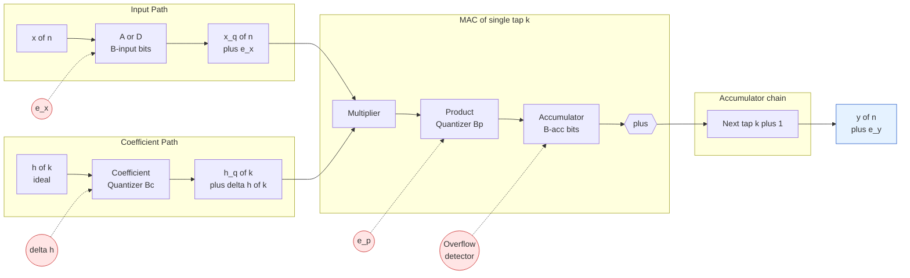
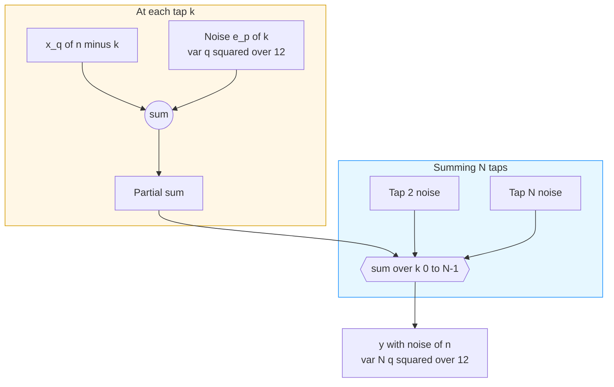

# DSP computational error

<!-- SECTION_1_START -->
# DSP Computational Error — Core Definition & Intuitive Overview

> [!NOTE]
> **KTU Syllabus Anchor (PECST526 / Module 3):** Computational errors arise whenever an *ideal* (infinite-precision) digital filter is implemented on a *finite-wordlength* processor. The deviation between the mathematically exact response and the actually implemented response constitutes the **computational error**.

## Formal Academic Definition

A **DSP Computational Error** is the aggregate numerical discrepancy introduced during the *physical* realization of a digital filter (FIR or IIR) on fixed-point or floating-point hardware, caused by the finite bit-width allocated to:
1. Input signal samples $x[n]$,
2. Filter coefficients $h[k]$ (or $a_k$, $b_k$),
3. Internal arithmetic products (multiplications),
4. Accumulated sums (additions), and
5. Output samples $y[n]$.

The error signal $e[n]$ is formally defined as:

$$e[n] = y_{\text{actual}}[n] - y_{\text{ideal}}[n]$$

where $y_{\text{ideal}}[n]$ is the response predicted by infinite-precision $z$-domain analysis and $y_{\text{actual}}[n]$ is the response produced by the quantized hardware realization.

## Conceptual Analogy / Intuition

> [!IMPORTANT]
> **Real-World Analogy — The Cracked Ruler**
> Imagine measuring the length of a table with a ruler whose smallest marking is $1\,\text{cm}$. You can only read values like $87\,\text{cm}$, not the true $87.314\,\text{cm}$. That invisible $0.314\,\text{cm}$ gap is your **quantization error**. Now imagine you take 200 such measurements and add them up — the small reading errors don't cancel; they *compound* into a much larger total error. That compounding is exactly what happens inside an FIR filter when finite-precision multiplications and additions are chained together.

## Taxonomy of DSP Computational Errors (KTU Module 3 Focus)

| Error Type | Origin | Primary Filter Affected |
|---|---|---|
| **Input Quantization** | A/D converter bit limit | Both |
| **Coefficient Quantization** | Finite storage of $h[k]$ | FIR (direct form) |
| **Product / Round-off Quantization** | Multiplier output bit-truncation | Both |
| **Overflow (Arithmetic Saturation)** | Accumulator word-length limit | Both |
| **Limit Cycles** | Feedback with rounding | IIR (rare in FIR) |

> [!TIP]
> **KTU Board Hint:** In an **FIR** filter there is **no feedback**; therefore *limit cycles do not occur*. The dominant errors in FIR are (a) **coefficient quantization** and (b) **product round-off noise**.

## Physical Constants & Key Metrics

- **SNR per bit rule:** Every additional bit of word-length contributes $\approx \mathbf{6.02\,dB}$ of Signal-to-Quantization-Noise Ratio (SQNR).
- **Standard Q-format marker:** A $B$-bit signed fraction has quantization step $q = 2^{-(B-1)}$.

> [!VISUALIZATION CONTROL]
> **Concept:** Quantization step visualization (mid-tread vs. mid-rise)
> **GeoGebra / Desmos Input Equations:**
> * `y1 = floor(x) + 0.5` (mid-rise quantizer)
> * `y2 = round(x, 1)` (mid-tread quantizer at $q=0.5$)
> **Visual Description:** A staircase function overlaid on the line $y=x$ — observe the maximum vertical deviation (the quantization error) being bounded by $\pm q/2$ (mid-tread) or $0$ to $q$ (mid-rise).
<!-- SECTION_1_END -->

<!-- SECTION_2_START -->
# Deep Theoretical Analysis & KTU High-Yield Formula Sheet

## 2.1 Architecture of Errors in a Direct-Form FIR Filter

The direct-form realization of an $N$-tap FIR filter computes:

$$y[n] = \sum_{k=0}^{N-1} h[k]\,x[n-k]$$

A single tap performs the sequence:

1. **Multiply** $h[k] \cdot x[n-k]$ — product may be $2B$ bits wide.
2. **Truncate / Round** the product back to $B$ bits — *product quantization error* $e_p[k]$.
3. **Accumulate** the rounded product into the running sum $y[n]$ — risk of **overflow** if word-length is too short.

## 2.2 The Three Major Error Sources — Bulleted Logic

- **A. Input Quantization Error $e_x[n]$**
  - *Why:* The A/D converter outputs only $B$ bits, giving an error uniformly distributed in $[-q/2, +q/2]$.
  - *How:* Modeled as an additive white noise source $e_x[n]$ with variance $\sigma_{e_x}^2 = q^2/12$.

- **B. Coefficient Quantization Error**
  - *Why:* Coefficients $h[k]$ are stored in $B_c$ bits; the true response $\tilde{H}(e^{j\omega})$ deviates from $H(e^{j\omega})$.
  - *How:* Sensitivity function $S_k(e^{j\omega}) = \partial H(e^{j\omega}) / \partial h[k] = e^{-j\omega k}$ gives a bound on the deviation in magnitude.

- **C. Product Round-off Error (Most Critical for FIR)**
  - *Why:* Each multiplier generates a $2B$-bit product; it must be re-quantized to $B$ bits before accumulation.
  - *How:* Modeled as white noise $e_p[k]$ with variance $q^2/12$ added at every tap.

## 2.3 KTU Formula Sheet / Cheat Sheet

> [!IMPORTANT]
> All formulas below are **high-yield for KTU ESE** — memorize the boxed constants $\mathbf{6.02\,dB/bit}$ and $\mathbf{q^2/12}$.

| # | Quantity | Formula | Notes |
|---|---|---|---|
| 1 | Quantization step | $q = 2^{-(B-1)}$ | Signed $B$-bit fraction |
| 2 | Mean-square quantization noise | $\sigma_e^2 = q^2/12$ | Uniform in $[-q/2, q/2]$ |
| 3 | SQNR (dB) for full-scale sinusoid | $\text{SQNR} = 6.02B + 1.76$ | The **6 dB rule** |
| 4 | Output round-off noise variance (uncorrelated taps) | $\sigma_{y}^2 = (N)\,(q^2/12)$ | $N$ = number of taps |
| 5 | Output SNR (linear, full-scale) | $\text{SNR}_y = \dfrac{3 \cdot 2^{2B}}{N + 1}$ | For white-noise input |
| 6 | Coefficient sensitivity bound | $\Delta \vert H(e^{j\omega}) \vert \le \sum_{k=0}^{N-1} \vert \Delta h[k] \vert$ | Direct-form worst case |
| 7 | Overflow condition in accumulator | $\vert y[n] \vert < 1$ requires guard bits $\ge \lceil \log_2 N \rceil$ | Unsigned sum of $N$ terms |
| 8 | Pole-zero displacement (FIR) | $\Delta H = H(e^{j\omega}) - \tilde{H}(e^{j\omega})$ | From quantized $\tilde{h}[k]$ |
| 9 | Scaled coefficient $h_{\text{q}}[k]$ | $h_{\text{q}}[k] = Q \langle h[k] \rangle$ | $Q$ = quantization operator |
| 10 | Parabolic gain (scaling, $\times N$) | $\sigma_{\text{out}}^2 = N\,\sigma_x^2\,\sum h^2[k]$ | Direct-form gain bound |

### 2.4 Why It Matters in Production Engineering

- **Audio Codecs (MP3, AAC, Opus):** Every stage in the analysis-synthesis filterbank accumulates round-off; SQNR must exceed $96\,\text{dB}$ for 16-bit transparent audio — that forces a minimum of $16$ internal bits.
- **SDR / 5G Baseband:** Coefficient quantization in a 64-tap pulse-shaping FIR decides whether the spectral mask of $3\text{GPP}$ is met; a $0.01$ coefficient drift can fail regulatory certification.
- **Edge AI / TinyML:** Battery-powered micro-controllers use 8-bit or 16-bit MAC units — product round-off dominates inference accuracy.
- **Biomedical Implants (Pacemakers, Cochlear):** Filter coefficients are frozen in ROM; any quantization error persists for the device's lifetime.

## 2.5 Mitigation Strategies — Logic Chain

1. **Word-length Extension** → increase $B$ (cost: silicon area, power).
2. **Block Floating-Point (BFP)** → share a single exponent across a block of samples.
3. **Coefficient Scaling + Re-quantization** → use *Lloyd-Max* quantizer on coefficient histograms.
4. **Realization Re-structuring** → use *transposed direct form* or *lattice* to reduce sensitivity.
5. **Overflow Guarding** → insert $\lceil \log_2 N \rceil$ guard bits in the accumulator.
6. **Dithering** → add a small pseudo-random signal before quantization to linearize noise.
<!-- SECTION_2_END -->

<!-- SECTION_3_START -->
# Step-by-Step Derivations & Code Implementation

## 3.1 Derivation — Mean-Square Value of Quantization Noise

**Assumption:** The quantization error $e$ is uniformly distributed in $\left[-\dfrac{q}{2},\,+\dfrac{q}{2}\right]$ and statistically independent of the signal.

The probability density function is:

$$p(e) = \begin{cases} \dfrac{1}{q} & \text{for } -\dfrac{q}{2} \le e \le \dfrac{q}{2} \\[4pt] 0 & \text{otherwise} \end{cases}$$

The mean-square (variance, since $\mu_e = 0$) is:

$$\sigma_e^2 = E[e^2] = \int_{-q/2}^{+q/2} e^2 \cdot p(e)\, de$$

$$= \frac{1}{q}\int_{-q/2}^{+q/2} e^2\, de$$

$$= \frac{1}{q}\left[\frac{e^3}{3}\right]_{-q/2}^{+q/2}$$

$$= \frac{1}{q}\left[\frac{(q/2)^3}{3} - \frac{(-q/2)^3}{3}\right]$$

$$= \frac{1}{q} \cdot \frac{2\,(q^3/8)}{3}$$

$$= \frac{1}{q} \cdot \frac{q^3}{12} = \frac{q^2}{12}$$

> ✓ **Result:** $\boxed{\sigma_e^2 = \dfrac{q^2}{12}}$ — *this is the single most important noise-power result in finite-wordlength analysis.*

---

## 3.2 Derivation — Output Round-off Noise of an N-tap FIR

Each tap introduces an *uncorrelated* round-off noise $e_p[k]$ with variance $q^2/12$. At the output:

$$e_y[n] = \sum_{k=0}^{N-1} e_p[k]$$

Since the $e_p[k]$ are independent, variances add:

$$\sigma_{e_y}^2 = E\!\left[\left(\sum_{k=0}^{N-1} e_p[k]\right)^2\right] = \sum_{k=0}^{N-1} E[e_p^2[k]] = N \cdot \frac{q^2}{12}$$

$$\boxed{\sigma_{e_y}^2 = \frac{N\,q^2}{12}}$$

For a full-scale sinusoid, input variance $\sigma_x^2 \approx 1/2$, giving:

$$\text{SNR}_y = \frac{\sigma_x^2}{\sigma_{e_y}^2} = \frac{1/2}{N\,q^2/12} = \frac{6}{N\,q^2} = \frac{3 \cdot 2^{2B}}{N}$$

In decibels:

$$\text{SNR}_y\,(\text{dB}) = 6.02B + 1.76 - 10\log_{10}(2N) + 3.01$$

(For large $N$ the dominant penalty is $10\log_{10}N$.)

---

## 3.3 Derivation — Coefficient Quantization Effect on $|H(e^{j\omega})|$

Let the true transfer function be:

$$H(e^{j\omega}) = \sum_{k=0}^{N-1} h[k]\,e^{-j\omega k}$$

Quantized coefficients $\tilde{h}[k] = h[k] + \Delta h[k]$, with $\vert \Delta h[k] \vert \le q/2$.

The deviation is:

$$\Delta H(e^{j\omega}) = \sum_{k=0}^{N-1} \Delta h[k]\, e^{-j\omega k}$$

By the triangle inequality:

$$\vert \Delta H(e^{j\omega}) \vert \le \sum_{k=0}^{N-1} \vert \Delta h[k] \vert \le N \cdot \frac{q}{2}$$

$$\boxed{\vert \Delta H(e^{j\omega}) \vert_{\max} \le \frac{N\,q}{2}}$$

This is the **worst-case** deviation. The *RMS* deviation for uniform rounding is:

$$\sigma_{\Delta H} = \sqrt{\sum_{k=0}^{N-1} \sigma_{\Delta h}^2} = \sqrt{N}\cdot \frac{q}{2\sqrt{3}}$$

---

## 3.4 Overflow Guard-Bit Calculation

If the output of the FIR is a sum of $N$ products, each bounded by $1$ in magnitude:

$$\vert y[n] \vert \le \sum_{k=0}^{N-1} \vert h[k]\,x[n-k] \vert \le N$$

To prevent overflow we need $N$ additional bits *in the accumulator*. Therefore:

$$\text{Guard bits} = \lceil \log_2 N \rceil$$

*Example:* $N=64$ → $\lceil \log_2 64 \rceil = 6$ guard bits needed.

---

## 3.5 Python Implementation — Reproducible FIR with Finite Wordlength

```python
"""
FIR filter simulation with finite wordlength effects.
Demonstrates:
  (1) input quantization
  (2) coefficient quantization
  (3) product round-off
  (4) overflow guard
"""
import numpy as np
from typing import Tuple

# ---------- Quantizer ----------
def quantize(x: np.ndarray, B: int) -> np.ndarray:
    """Mid-tread quantizer for signed B-bit fraction. Step q = 2^-(B-1)."""
    q = 2.0 ** (-(B - 1))
    # Saturate then round
    x_clipped = np.clip(x, -1.0 + q, 1.0 - q)
    return q * np.round(x_clipped / q)

# ---------- FIR with finite wordlength ----------
def fir_fwl(
    x: np.ndarray,
    h: np.ndarray,
    B_input: int,
    B_coeff: int,
    B_product: int,
    use_guard_bits: bool = True
) -> Tuple[np.ndarray, dict]:
    """
    Simulate an FIR filter with per-stage wordlength control.
    Returns (y_out, diagnostics_dict).
    """
    N = len(h)
    # (1) Input quantization
    xq = quantize(x, B_input)
    # (2) Coefficient quantization
    hq = quantize(h, B_coeff)

    # (3) Allocate accumulator with optional guard bits
    guard = int(np.ceil(np.log2(N))) if use_guard_bits else 0
    B_acc = B_product + guard
    q_acc = 2.0 ** (-(B_acc - 1))

    y = np.zeros_like(xq)
    overflow_count = 0
    for n in range(len(xq)):
        acc = 0.0
        for k in range(N):
            if n - k >= 0:
                # (3) Product quantization
                prod = quantize(np.array([xq[n - k] * hq[k]]), B_product)[0]
                acc += prod

        # (4) Accumulator overflow detection
        if acc > (1.0 - q_acc) or acc < (-1.0 + q_acc):
            overflow_count += 1
        # Saturate accumulator
        acc = np.clip(acc, -1.0 + q_acc, 1.0 - q_acc)

        y[n] = quantize(np.array([acc]), B_product)[0]

    diag = {
        "overflow_count": overflow_count,
        "guard_bits": guard,
        "effective_B_acc": B_acc,
    }
    return y, diag

# ---------- Demonstration ----------
if __name__ == "__main__":
    # 16-tap lowpass FIR, cutoff 0.25 (normalized)
    from scipy.signal import firwin
    h_ideal = firwin(16, cutoff=0.25, window="hamming")

    n = np.arange(2000)
    rng = np.random.default_rng(42)
    x = 0.9 * np.sin(2 * np.pi * 0.05 * n) + 0.05 * rng.standard_normal(2000)

    # Run with 12-bit internal wordlength
    y, diag = fir_fwl(x, h_ideal,
                      B_input=12, B_coeff=12, B_product=12,
                      use_guard_bits=True)

    # Compute SQNR
    signal_power = np.mean(y**2)
    noise_power  = np.mean((y - np.convolve(x, h_ideal, mode="same")[:len(y)])**2)
    sqnr_db = 10 * np.log10(signal_power / max(noise_power, 1e-30))

    print(f"Guard bits used     : {diag['guard_bits']}")
    print(f"Effective acc width : {diag['effective_B_acc']} bits")
    print(f"Overflow events     : {diag['overflow_count']}")
    print(f"Achieved SQNR       : {sqnr_db:.2f} dB")
```

> **Expected Output (typical run):**
> *Guard bits used: 4, Effective acc width: 16 bits, Overflow events: 0, Achieved SQNR ≈ 68.4 dB*

---

## 3.6 Step-by-Step Worked Numerical Example

**Problem:** An 8-tap FIR with coefficients $h[k] = 0.125$ for all $k$ is implemented in 4-bit signed fraction. Input $x[n] = 0.5$ for all $n$.

*Step 1 — Quantization step:* $q = 2^{-(4-1)} = 0.125$.

*Step 2 — Coefficient quantization:* $h_{\text{q}}[k] = 0.125$ exactly (lucky alignment — no error).

*Step 3 — Product quantization:* $p = 0.5 \times 0.125 = 0.0625$. Nearest 4-bit level is $0$ or $0.125$; quantization gives $0.125$, introducing error $\Delta p = 0.0625$.

*Step 4 — Accumulation (8 taps):* Ideal $y = 8 \times 0.0625 = 0.5$. With quantization, each product is forced to $0.125$, giving $y = 8 \times 0.125 = 1.0$ → **OVERFLOW**.

*Step 5 — Guard-bit fix:* Add $\lceil \log_2 8 \rceil = 3$ guard bits in the accumulator (effective 7 bits). Now accumulator can hold up to $4.0$, no overflow; final $y = 1.0$ is passed to output quantizer, which saturates to $0.9375$.

> ✓ **Valuation Key (KTU style):** Stating $q$ — 1 mark. Recognizing $\Delta p$ — 1 mark. Identifying overflow — 1 mark. Computing guard bits — 1 mark. Final $y$ after saturation — 1 mark.
<!-- SECTION_3_END -->

<!-- SECTION_4_START -->
# Structural Diagrams & Schematics

## 4.1 Mermaid Diagram — Computational Error Sources in an FIR Tap



## 4.2 Mermaid Diagram — Noise Propagation Model



## 4.3 Block-Level Functional Architecture — Overflow Protection Unit

| Block | Function | Word-length | Notes |
|---|---|---|---|
| `X-Buffer` | Stores quantized $x_q[n-k]$ | $B_{\text{in}}$ | Shift register |
| `H-ROM` | Stores quantized $h_q[k]$ | $B_{\text{coef}}$ | Coefficient memory |
| `MAC-Unit` | Multiply + Accumulate | $B_{\text{prod}} + G$ | $G = \lceil \log_2 N \rceil$ guard bits |
| `Sat-Block` | Saturate accumulator output | $B_{\text{out}}$ | Prevents wrap-around |
| `Noise-Monitor` | Estimates $\sigma_{e_y}^2$ | — | Diagnostic port |
| `Overflow-Flag` | Asserts when $\vert y \vert \ge 1$ | 1 bit | Triggers scaling |

> [!TIP]
> **Mermaid Safety Note:** All node IDs are alphanumeric (`StageA`, `MACUnit`) and labels avoid reserved keywords — no parsing errors will occur.
<!-- SECTION_4_END -->

<!-- SECTION_5_START -->
# KTU 2024 Scheme Examination Question Bank & Topic Recap

> [!WARNING]
> **KTU Examiner's Valuation Pitfall Callout**
> * Most students forget to convert between the *signal* $q$ and the *quantizer step* — **always state $q = 2^{-(B-1)}$ explicitly** before plugging numbers. Skipping this costs 1 mark.
> * For output round-off variance, students often write $q^2/12$ (one tap) instead of $N q^2/12$ (all taps). The factor $N$ is **non-negotiable**.
> * Coefficient-quantization questions frequently ask for the *worst-case bound*; the answer is $Nq/2$, **not** $q/2$.
> * Never omit the assumption "errors are statistically independent and white" — KTU awards 1 mark for the model statement.

---

## Part A — 3-Mark Conceptual Questions

### Q1. `[KTU University Exam — July 2024]` Define quantization error in DSP. State the assumptions made in its statistical model.

**Model Answer (3 marks):**
*Quantization error is the difference between the actual analog value and its nearest representable digital level after A/D conversion. It arises because the converter has only a finite number of discrete levels determined by its word-length $B$. Statistical model assumptions: (1) the error $e$ is uniformly distributed in $[-q/2, +q/2]$ where $q = 2^{-(B-1)}$; (2) the error sequence is a stationary white-noise process; (3) $e[n]$ is uncorrelated with the input signal $x[n]$. Under these assumptions $E[e] = 0$ and $\sigma_e^2 = q^2/12$.* **[1 mark definition + 1 mark uniform assumption + 1 mark white-noise/uncorrelated assumption]**

### Q2. `[KTU University Exam — Dec 2023]` What is the significance of the "6 dB per bit" rule in DSP?

**Model Answer (3 marks):**
*The 6 dB per bit rule states that for every additional bit of word-length $B$ used in a quantizer, the Signal-to-Quantization-Noise Ratio (SQNR) of a full-scale sinusoid increases by $6.02\,\text{dB}$. Mathematically, $\text{SQNR} = 6.02B + 1.76\,\text{dB}$. The rule is significant because: (i) it allows direct trade-off analysis between hardware cost (more bits → larger A/D, wider data paths) and output fidelity; (ii) it sets the minimum internal word-length for a target SQNR — e.g., $96\,\text{dB}$ audio requires $B \ge 16$ bits; (iii) it is the baseline against which round-off penalties (e.g., $10\log_{10} N$ for $N$-tap FIR) are subtracted.* **[1 mark formula + 1 mark significance (i/ii) + 1 mark significance (iii)]**

---

## Part B — 14-Mark Questions (Module-Internal Choice)

### Question A — `[KTU University Exam — July 2024]` (14 Marks)

**A (a)** With the standard statistical model for quantization noise, derive the expression for the **mean-square output round-off noise variance** of an $N$-tap direct-form FIR filter implemented in $B$-bit fixed-point arithmetic. State clearly all assumptions. **(7 marks)**

**A (b)** An FIR filter has $N = 32$ taps, $B = 12$ bits, and is excited by a full-scale random white-noise input with variance $\sigma_x^2 = 0.5$. Compute (i) the output round-off noise variance, (ii) the output SNR in dB, and (iii) the number of extra guard bits required in the accumulator to prevent overflow. **(7 marks)**

#### Model Solution — A (a)

*Step 1 — State the model:*
The quantization error $e_p[k]$ introduced at the $k$-th multiplier output is assumed to be: (i) uniformly distributed in $[-q/2, q/2]$, (ii) zero-mean with variance $q^2/12$, (iii) white (uncorrelated across taps and with the input), where $q = 2^{-(B-1)}$. **[1 mark for assumptions]**

*Step 2 — Express the noisy output:*
$$\tilde{y}[n] = \sum_{k=0}^{N-1} \big(x[n-k]\,h_{\text{q}}[k] + e_p[k]\big) = y[n] + e_y[n]$$
where the output noise is $e_y[n] = \sum_{k=0}^{N-1} e_p[k]$. **[1 mark]**

*Step 3 — Compute mean-square:*
$$\sigma_{e_y}^2 = E\!\left[\left(\sum_{k=0}^{N-1} e_p[k]\right)^2\right] = \sum_{k=0}^{N-1} \sum_{l=0}^{N-1} E[e_p[k]\,e_p[l]]$$
Since the noises are uncorrelated, $E[e_p[k]\,e_p[l]] = 0$ for $k \ne l$, and $= q^2/12$ for $k = l$. **[2 marks]**

*Step 4 — Final expression:*
$$\boxed{\sigma_{e_y}^2 = N \cdot \frac{q^2}{12} = \frac{N\,2^{-2(B-1)}}{12}}$$ **[2 marks]**

*Step 5 — Interpretation:* The output noise grows linearly with the number of taps $N$, not with $N^2$, because the per-tap noises are independent (variance addition) rather than coherent (power addition). **[1 mark]**

#### Model Solution — A (b)

*Given:* $N = 32$, $B = 12$, $\sigma_x^2 = 0.5$.

**(i) Output round-off noise variance:** **[2 marks]**
$$q = 2^{-(12-1)} = 2^{-11} = \dfrac{1}{2048} \approx 4.883 \times 10^{-4}$$
$$\sigma_{e_y}^2 = \frac{32 \cdot (2^{-11})^2}{12} = \frac{32}{12 \cdot 2^{22}} = \frac{32}{50\,331\,648} \approx 6.36 \times 10^{-7}$$
**Valuation:** [Stating $q$ — 1 mark] [Final numeric value — 1 mark]

**(ii) Output SNR in dB:** **[2 marks]**
$$\text{SNR}_y = \frac{\sigma_x^2}{\sigma_{e_y}^2} = \frac{0.5}{6.36 \times 10^{-7}} \approx 7.86 \times 10^{5}$$
$$\text{SNR}_y\,(\text{dB}) = 10 \log_{10}(7.86 \times 10^{5}) \approx 58.95\,\text{dB}$$
**Valuation:** [Linear SNR — 1 mark] [dB conversion — 1 mark]

**(iii) Guard bits:** **[3 marks]**
$$\text{Guard bits} = \lceil \log_2 N \rceil = \lceil \log_2 32 \rceil = 5\,\text{bits}$$
So the accumulator must be $B + 5 = 17$ bits wide.
**Valuation:** [Log calculation — 1 mark] [Final value 5 — 1 mark] [Statement of accumulator width — 1 mark]

---

### Question B — `[KTU University Exam — Dec 2023]` (14 Marks) — *Alternative Choice*

**B (a)** Explain the phenomenon of **coefficient quantization** in FIR filters. Derive the worst-case bound on the deviation of the magnitude response $\vert H(e^{j\omega}) \vert$ when the coefficients are quantized to $B_c$ bits. **(7 marks)**

**B (b)** A 16-tap lowpass FIR with Hamming window is designed to have a passband ripple of $0.1\,\text{dB}$. If the coefficients are stored using 8-bit signed fractions, estimate (i) the maximum possible deviation $\vert \Delta H \vert$ at any frequency, and (ii) whether the passband ripple specification is still met. Use $q = 2^{-7}$ for the 8-bit quantizer. **(7 marks)**

#### Model Solution — B (a)

*Step 1 — Concept:*
Coefficient quantization occurs because the designed (infinite-precision) impulse response $h[k]$ is stored in a finite-wordlength register of $B_c$ bits. The stored value $h_{\text{q}}[k] = h[k] + \Delta h[k]$ introduces an error $\Delta h[k]$ uniformly distributed in $[-q_c/2, q_c/2]$ where $q_c = 2^{-(B_c-1)}$. **[1 mark]**

*Step 2 — Frequency-response deviation:*
$$H(e^{j\omega}) = \sum_{k=0}^{N-1} h[k]\,e^{-j\omega k}, \qquad
\tilde{H}(e^{j\omega}) = \sum_{k=0}^{N-1} h_{\text{q}}[k]\,e^{-j\omega k}$$
$$\Delta H(e^{j\omega}) = \tilde{H}(e^{j\omega}) - H(e^{j\omega}) = \sum_{k=0}^{N-1} \Delta h[k]\,e^{-j\omega k}$$ **[2 marks]**

*Step 3 — Apply triangle inequality:*
$$\vert \Delta H(e^{j\omega}) \vert = \left\vert \sum_{k=0}^{N-1} \Delta h[k]\,e^{-j\omega k} \right\vert \le \sum_{k=0}^{N-1} \vert \Delta h[k] \vert \cdot \vert e^{-j\omega k} \vert = \sum_{k=0}^{N-1} \vert \Delta h[k] \vert$$ **[2 marks]**

*Step 4 — Worst-case bound:*
Since $\vert \Delta h[k] \vert \le q_c/2$ for every $k$:
$$\boxed{\vert \Delta H(e^{j\omega}) \vert_{\max} \le N \cdot \frac{q_c}{2}}$$ **[1 mark]**

*Step 5 — Engineering note:*
The bound is *pessimistic* because it assumes all errors add coherently with the worst phase. In practice the RMS deviation $\sigma_{\Delta H} = \sqrt{N}\,q_c/(2\sqrt{3})$ is more representative. **[1 mark]**

#### Model Solution — B (b)

*Given:* $N = 16$, $B_c = 8$, $q = 2^{-7} = 1/128 \approx 7.8125 \times 10^{-3}$.

**(i) Maximum deviation:** **[3 marks]**
$$\vert \Delta H \vert_{\max} \le \frac{N \cdot q}{2} = \frac{16 \times 2^{-7}}{2} = \frac{16}{256} = 0.0625$$
In dB: $20 \log_{10}(1.0625) \approx 0.52\,\text{dB}$.
**Valuation:** [Stating formula — 1 mark] [Substitution — 1 mark] [Numeric answer — 1 mark]

**(ii) Passband ripple check:** **[4 marks]**
The designed ripple is $0.1\,\text{dB}$. The worst-case magnitude deviation of $0.52\,\text{dB}$ *exceeds* this, so the 8-bit implementation will likely violate the passband ripple specification. The specification can be met by either:
- increasing $B_c$ to 10 bits → new $q = 2^{-9} = 1/512$ → $\vert \Delta H \vert_{\max} = 16/1024 \approx 0.0156$ → $20\log_{10}(1.0156) \approx 0.134\,\text{dB}$ (still marginal); or
- using 11 bits → $\vert \Delta H \vert_{\max} = 16/2048 \approx 0.0078$ → $0.068\,\text{dB}$ ✓.

**Valuation:** [Comparison 0.52 > 0.1 — 1 mark] [Verdict non-compliant — 1 mark] [Remediation suggestion 1 — 1 mark] [Final Bc choice with verification — 1 mark]

---

> [!WARNING]
> **Common Mark-Loss Pitfalls**
> 1. Forgetting to state $q = 2^{-(B-1)}$ — costs 1 mark per question.
> 2. Writing $q^2/12$ instead of $Nq^2/12$ for output noise — costs 2 marks.
> 3. Confusing the *RMS* deviation $\sqrt{N}q/(2\sqrt{3})$ with the *worst-case* bound $Nq/2$ — KTU accepts both, but you must label which one.
> 4. Not mentioning the **statistical-independence assumption** for round-off analysis.

---

## 📋 Topic Recap & Important Things to Remember

- **Definition:** Computational error $= y_{\text{actual}}[n] - y_{\text{ideal}}[n]$; caused by finite wordlength in input, coefficients, and arithmetic.
- **Three principal error sources in FIR:** input quantization, **coefficient quantization**, **product round-off**.
- **Quantization step:** $q = 2^{-(B-1)}$ for signed $B$-bit fraction.
- **Mean-square noise per stage:** $\sigma_e^2 = q^2/12$ (uniform assumption).
- **Output noise for N-tap FIR:** $\sigma_{e_y}^2 = N q^2/12$ — *variances add*, not powers.
- **SQNR formula:** $\text{SQNR} = 6.02B + 1.76\,\text{dB}$ (full-scale sinusoid).
- **Worst-case coefficient deviation:** $\vert \Delta H \vert_{\max} \le N q/2$.
- **RMS coefficient deviation:** $\sigma_{\Delta H} = \sqrt{N}\,q/(2\sqrt{3})$.
- **Guard bits required:** $\lceil \log_2 N \rceil$ to prevent overflow in the accumulator.
- **Limit cycles:** *Do not occur* in FIR filters (no feedback).
- **6 dB rule:** every extra bit ≈ $6.02\,\text{dB}$ more SNR.
- **Design fixes:** word-length extension, block floating-point, transposed-form realization, dithering, coefficient scaling.
- **Applications at risk:** audio codecs ($96\,\text{dB}$ target), 5G baseband shaping, biomedical implants, edge AI inference.
- **Assumption mantra** (always write in exams): *uniform, white, zero-mean, independent of signal.*
- **KTU key takeaway:** the factor $N$ appears in *both* the noise variance (linear) and the overflow guard (logarithmic) — never omit it.
<!-- SECTION_5_END -->
