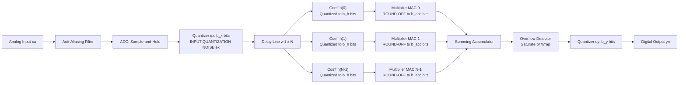
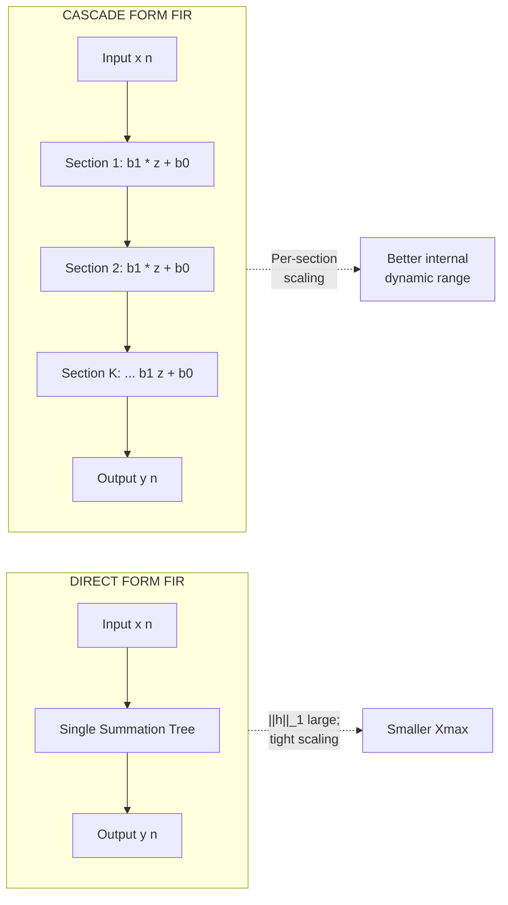

# Dynamic range and precision

<!-- SECTION_1_START -->

# Dynamic Range and Precision in FIR Filter Realizations

## 1.1 Formal Definition (KTU 2024 Syllabus Terminology)

In the context of **Digital Signal Processing (PECST526) – Module 3: Realization Structures for FIR Filters**, the term *Dynamic Range and Precision* refers to the quantitative study of how a fixed-word-length digital system limits the faithful representation of signals and filter coefficients during arithmetic operations.

> [!IMPORTANT]
> **Dynamic Range (DR)** is defined as the ratio (usually expressed in decibels, dB) between the **largest representable magnitude** and the **smallest non-zero representable magnitude** of a binary number system employed to encode signal samples and filter coefficients.
> **Precision** is the smallest resolvable increment (the *quantum* or *step size* $q$) that can be distinguished by the number format, directly controlled by the **word length** $(b+1)$ bits (including the sign bit).

Mathematically, for a $(b+1)$-bit fixed-point two's-complement fractional format:

$$
\text{Dynamic Range (DR)} = 20 \log_{10}\!\left(\frac{|x|_{\max}}{q/2}\right) \quad \text{(dB)}
$$

where $q = 2^{-b}$ is the quantization step and $|x|_{\max} \approx 1$ for normalized two's-complement fractions.

### 1.2 Intuitive Analogy

> [!NOTE]
> **Analogy — The Kitchen Scale:**
> Imagine a digital kitchen scale capable of weighing objects only in **discrete steps of 10 grams**, with a maximum capacity of **10 kg**.
> - The **maximum capacity (10 kg)** is analogous to the largest signal amplitude the digital word can encode without overflowing.
> - The **smallest visible weight (10 g)** is analogous to the *quantization step* $q$.
> - The **ratio 10 000 g / 10 g = 1000** is the *dynamic range*, and the **fineness of the smallest step (10 g)** is the *precision*.
> 
> If you use the same scale to weigh a **5 kg bag of flour** (your signal) and it shows **5.03 kg**, the **0.03 kg error** is the *quantization error* — exactly what happens when an FIR filter rounds a coefficient to a finite number of bits.

This same idea extends to FIR filter realizations: every multiplication, every addition, and every coefficient storage slot is subject to the same "scale" of resolution.

### 1.3 Why the Topic Matters for KTU Examinations

KTU examiners frequently test this topic because the **realization structure** chosen for an FIR filter (Direct Form, Cascade, Linear-Phase, Frequency-Sampling, Lattice) directly alters the internal signal magnitudes and, hence, the **dynamic range utilisation and noise performance** of the system. Two structurally identical FIR filters with different number formats will perform very differently in hardware.

### 1.4 Number-Format Foundations

The three number formats universally referenced in KTU Module 3 are:

| Format | Word | Step $q$ | Dynamic Range | Precision | Hardware Cost |
|---|---|---|---|---|---|
| **Fixed-Point** | $b+1$ bits (sign + $b$ fraction) | $2^{-b}$ | $\approx 6.02\,b$ dB | Constant $q$ | Low |
| **Floating-Point** | Mantissa $t$ bits + exponent $e$ bits | $2^{E}\!\cdot\!2^{-t}$ | $\approx 6.02\,t + 6.02\,e$ dB | Variable (proportional to magnitude) | High |
| **Block Floating-Point** | Shared exponent per block | Adaptive | High, lower than pure FP | Block-adaptive | Medium |

> [!TIP]
> **KTU Quick Fact:** Two's-complement fixed-point arithmetic is *preferred* over sign-magnitude in FIR realizations because it allows multiplication and addition with a single unified adder tree and automatically handles sign overflow via wrap-around (when saturation is not used).

### 1.5 Geometric Intuition of Precision in FIR Realizations

> [!VISUALIZATION CONTROL]
> **Concept:** Quantization Grid Over FIR Coefficient Plane
> **Desmos Input Equations:**
> * `h[0] = 0.1250` (true value)
> * `h[0]_quantized = 0.109375` (rounded to $b=4$ bits, $q=0.0625$)
> * `h[1] = 0.0625` (true value)
> * `h[1]_quantized = 0.0625` (exact at this precision)
> **Visual Description:** On a horizontal axis labelled $h(k)$ and a vertical axis $|H(e^{j\omega})|$, draw horizontal "rails" at every multiple of $q = 0.0625$. The continuous coefficient line collapses into a stair-step representation, and the deviation between the true coefficient and the snapped value is the **quantization error** $e_h(k)$. The cumulative effect on $|H(e^{j\omega})|$ produces ripples in the passband and reduced stopband attenuation.

---

<!-- SECTION_1_END -->

<!-- SECTION_2_START -->

# Deep Theoretical Analysis & KTU High-Yield Formula Sheet

## 2.1 Anatomy of an FIR Realization

The generic $N$-tap FIR filter is governed by the linear constant-coefficient difference equation:

$$
y(n) = \sum_{k=0}^{N-1} h(k)\,x(n-k)
$$

Applying the $z$-transform:

$$
H(z) = \frac{Y(z)}{X(z)} = \sum_{k=0}^{N-1} h(k)\,z^{-k}
$$

This is the **transfer function** that every realization (Direct, Cascade, Linear-Phase, Frequency-Sampling, Lattice) must implement.

> [!IMPORTANT]
> **KTU Principle:** Each realization structures the same $H(z)$ differently. The internal node values (intermediate sums) differ, and so do the **dynamic range requirements** and **noise propagation** properties.

## 2.2 Sources of Finite-Word-Length Effects in FIR Filters

KTU Module 3 enumerates **three distinct sources** of finite-word-length degradation:

1. **Input Quantization (A/D Conversion) Error** $e_x(n)$
2. **Coefficient Quantization Error** $e_h(k)$
3. **Arithmetic Round-Off Error** in the multiplier-accumulator (MAC)

### 2.2.1 Input (Sample) Quantization

If the ADC quantizes each input sample $x(n)$ to $b_x$ fractional bits:

$$
x_Q(n) = x(n) + e_x(n), \qquad -\frac{q_x}{2} \le e_x(n) \le \frac{q_x}{2}
$$

Assuming a **uniform white-noise model**, the variance of $e_x(n)$ is:

$$
\sigma_{e_x}^{2} = \frac{q_x^{2}}{12} = \frac{2^{-2b_x}}{12}
$$

The output noise variance due to input quantization is filtered through $|H(e^{j\omega})|^{2}$:

$$
\sigma_{y,x}^{2} = \sigma_{e_x}^{2} \cdot \frac{1}{2\pi}\!\int_{-\pi}^{\pi}\!\big\vert H(e^{j\omega})\big\vert^{2}\,d\omega = \sigma_{e_x}^{2}\,\|h\|_{2}^{2}
$$

where $\|h\|_{2}^{2} = \sum_{k=0}^{N-1} h^{2}(k)$ is the **$L_2$ norm squared** of the impulse response.

### 2.2.2 Coefficient Quantization

Each coefficient is stored with $b_h$ bits:

$$
h_Q(k) = h(k) + e_h(k), \qquad e_h(k) \sim \mathcal{U}\!\left(-\tfrac{q_h}{2},\,\tfrac{q_h}{2}\right)
$$

The error transfer function is:

$$
E_H(z) = \sum_{k=0}^{N-1} e_h(k)\,z^{-k}
$$

With independent $e_h(k)$, the output-variance contribution is:

$$
\sigma_{y,h}^{2} = \sigma_{e_h}^{2} \cdot \sum_{k=0}^{N-1} \sigma_{x}^{2}(n-k) = N\,\sigma_{e_h}^{2}\,\sigma_{x}^{2}
$$

For white input of variance $\sigma_{x}^{2}$:

$$
\sigma_{y,h}^{2} = N\,\sigma_{e_h}^{2}\,\sigma_{x}^{2} = \frac{N\,q_h^{2}}{12}\,\sigma_{x}^{2}
$$

### 2.2.3 Arithmetic Round-Off

Each product $h(k)\,x(n-k)$ is quantized after multiplication. With $b_y$ bits at the accumulator output, the round-off variance is:

$$
\sigma_{r}^{2} = \frac{q_y^{2}}{12} = \frac{2^{-2b_y}}{12}
$$

The total round-off noise at the output (assuming $N$ independent round-off sources in direct form):

$$
\sigma_{y,r}^{2} = N\,\sigma_{r}^{2}
$$

## 2.3 Scaling for Overflow Prevention

To prevent overflow at the output of an FIR filter, the input must be scaled such that:

$$
|y(n)|_{\max} \le 1 - q_y
$$

Using the triangle inequality on $y(n) = \sum h(k)x(n-k)$:

$$
|y(n)| \le \sum_{k=0}^{N-1} \big\vert h(k)\big\vert\,|x(n-k)| \le \|h\|_{1}\,|x|_{\max}
$$

where $\|h\|_{1} = \sum |h(k)|$ is the **$L_1$ norm**. The required input scale factor is:

$$
S = \frac{1}{\|h\|_{1}}
$$

For $L_\infty$ bound (worst-case instantaneous peak):

$$
S = \frac{1}{\max_{k}|h(k)|} = \frac{1}{\|h\|_{\infty}}
$$

For $L_2$ bound (energy-based, less conservative):

$$
S = \frac{1}{\sqrt{\sum h^{2}(k)}} = \frac{1}{\|h\|_{2}}
$$

## 2.4 Signal-to-Quantization-Noise Ratio (SQNR)

$$
\text{SQNR} = 10 \log_{10}\!\left(\frac{\sigma_{y}^{2}}{\sigma_{y,\text{noise}}^{2}}\right) \text{ dB}
$$

For a sinusoidal input of amplitude $A$ in a $b$-bit system:

$$
\text{SQNR}_{\sin} \approx 6.02\,b + 1.76 \quad \text{(dB)}
$$

The famous **"6 dB per bit"** rule.

## 2.5 KTU Formula Sheet (High-Yield Cheat-Sheet)

> [!NOTE]
> **Master these equations verbatim — they appear in Part A and Part B questions every KTU cycle.**

| # | Quantity | Formula | Engineering Use |
|---|---|---|---|
| 1 | Quantization step | $q = 2^{-b}$ | Resolution of $b$-bit fraction |
| 2 | Quantization noise variance | $\sigma_{q}^{2} = q^{2}/12$ | White-noise model |
| 3 | Output noise (input quant.) | $\sigma_{y,x}^{2} = \sigma_{q}^{2}\,\|h\|_{2}^{2}$ | A/D converter analysis |
| 4 | Output noise (coeff. quant.) | $\sigma_{y,h}^{2} = N\,\sigma_{q}^{2}\,\sigma_{x}^{2}$ | Word-length budgeting |
| 5 | Output noise (round-off) | $\sigma_{y,r}^{2} = N\,\sigma_{r}^{2}$ | MAC precision |
| 6 | Max gain (FIR) | $\|h\|_{1} = \sum|h(k)|$ | $L_1$ scaling |
| 7 | Peak gain (FIR) | $\|h\|_{\infty} = \max|h(k)|$ | $L_\infty$ scaling |
| 8 | Energy gain (FIR) | $\|h\|_{2}^{2} = \sum h^{2}(k)$ | $L_2$ scaling, Parseval |
| 9 | SQNR (sinusoid) | $6.02\,b + 1.76$ dB | Bit-budget allocation |
| 10 | Min coeff. bits (rule-of-thumb) | $b_h \ge \log_{2}\!\left(\dfrac{1}{2\,\delta_p}\right)$ | Spec → bit count |
| 11 | Output SNR after scaling | $10\log(\sigma_y^2/\sigma_{y,\text{noise}}^2)$ | System-level noise |
| 12 | Two's-comp overflow range | $[-1,\;1-q]$ | Saturation design |

## 2.6 Real-World Engineering Utility

- **Audio codecs (MP3, AAC, Opus):** $16$–$24$-bit precision sets dynamic range (96–144 dB). FIR equalizer coefficients must be stored with enough bits to preserve the intended response.
- **Hearing aids / biomedical DSP:** Low-power fixed-point DSPs run FIR filters with $16$-bit MAC, requiring aggressive scaling to prevent overflow while preserving SNR.
- **5G baseband processing:** FIR pulse-shaping filters operate on $12$–$14$-bit ADC outputs with $16$-bit coefficients — coefficient quantization is a primary design constraint.
- **FPGA implementations:** Block floating-point is widely used in FIR channels to balance precision and hardware cost.

---

<!-- SECTION_2_END -->

<!-- SECTION_3_START -->

# Step-by-Step Derivations, Code & Symbolic Implementation

## 3.1 Complete Derivation: Output Noise Variance of an FIR Filter

We derive the output noise variance for an $N$-tap **Direct-Form FIR** filter under coefficient quantization, which is one of the most frequently asked 14-mark derivations in KTU ESE.

### 3.1.1 Statement of the Problem

Given an FIR filter with quantized coefficients:

$$
h_Q(k) = h(k) + e_h(k), \quad k = 0, 1, \dots, N-1
$$

where $e_h(k)$ are independent zero-mean random variables uniformly distributed on $\left[-q_h/2,\;q_h/2\right]$, and the input $x(n)$ is zero-mean white noise with variance $\sigma_{x}^{2}$, find the variance of the output error $y_Q(n) - y(n)$ at the filter output.

### 3.1.2 Step-by-Step Derivation

**Step 1:** The true filter output is:

$$
y(n) = \sum_{k=0}^{N-1} h(k)\,x(n-k)
$$

The quantized-coefficient output is:

$$
y_Q(n) = \sum_{k=0}^{N-1} \big[h(k) + e_h(k)\big]\,x(n-k)
$$

**Step 2:** Subtract to obtain the error signal:

$$
e_y(n) = y_Q(n) - y(n) = \sum_{k=0}^{N-1} e_h(k)\,x(n-k)
$$

**Step 3:** Take the expectation (mean):

$$
\mathbb{E}\{e_y(n)\} = \sum_{k=0}^{N-1} \mathbb{E}\{e_h(k)\}\,\mathbb{E}\{x(n-k)\} = 0 \cdot 0 = 0
$$

since both the coefficient error and the input signal are zero-mean. So the error is **unbiased**.

**Step 4:** Compute the variance:

$$
\sigma_{e_y}^{2} = \mathbb{E}\{e_y^{2}(n)\} = \mathbb{E}\!\left\{\left[\sum_{k=0}^{N-1} e_h(k)\,x(n-k)\right]^{2}\right\}
$$

**Step 5:** Expand the square:

$$
\sigma_{e_y}^{2} = \sum_{k=0}^{N-1}\sum_{m=0}^{N-1} \mathbb{E}\{e_h(k)\,e_h(m)\}\,\mathbb{E}\{x(n-k)\,x(n-m)\}
$$

**Step 6:** Apply the independence assumptions:
- $\mathbb{E}\{e_h(k)\,e_h(m)\} = 0$ for $k \neq m$ (independent coefficient errors)
- $\mathbb{E}\{e_h(k)\,e_h(m)\} = \sigma_{e_h}^{2}$ for $k = m$
- $\mathbb{E}\{x(n-k)\,x(n-m)\} = \sigma_{x}^{2}$ for $k = m$ (white input)
- $\mathbb{E}\{x(n-k)\,x(n-m)\} = 0$ for $k \neq m$

**Step 7:** Only the $k = m$ terms survive:

$$
\sigma_{e_y}^{2} = \sum_{k=0}^{N-1} \sigma_{e_h}^{2}\,\sigma_{x}^{2}
$$

**Step 8:** Sum the geometric series of $N$ equal terms:

$$
\sigma_{e_y}^{2} = N\,\sigma_{e_h}^{2}\,\sigma_{x}^{2}
$$

**Step 9:** Substitute the white-uniform quantization noise variance:

$$
\sigma_{e_h}^{2} = \frac{q_h^{2}}{12} = \frac{2^{-2b_h}}{12}
$$

**Step 10:** Final compact expression:

$$
\boxed{\;\sigma_{e_y}^{2} = \frac{N\,q_h^{2}\,\sigma_{x}^{2}}{12} = \frac{N\,2^{-2b_h}\,\sigma_{x}^{2}}{12}\;}
$$

This is the **canonical KTU result** for FIR coefficient-quantization output noise variance.

> [!TIP]
> **Incremental Valuation Key (per KTU board pattern):**
> - Statement of difference equation with quantized coefficients: 1 mark
> - Forming the error signal $e_y(n)$: 2 marks
> - Independence assumptions: 2 marks
> - Expansion and cross-term elimination: 3 marks
> - Final summation: 2 marks
> - Substitution of $\sigma_{e_h}^{2}$: 2 marks
> - Boxed final answer: 1 mark
> - Neatness and units: 1 mark

## 3.2 Derivation: Output Dynamic-Range Constraint (Scaling)

**Given:** Direct-form FIR $y(n) = \sum_{k=0}^{N-1} h(k)\,x(n-k)$ with bounded input $|x(n)| \le X_{\max}$.

**Find:** Maximum permitted input amplitude to prevent overflow at the output.

**Step 1:** Apply the **triangle inequality**:

$$
|y(n)| = \left|\sum_{k=0}^{N-1} h(k)\,x(n-k)\right| \le \sum_{k=0}^{N-1} |h(k)|\,|x(n-k)|
$$

**Step 2:** Substitute the bound $|x(n-k)| \le X_{\max}$ for all $k$:

$$
|y(n)| \le X_{\max}\sum_{k=0}^{N-1}|h(k)| = X_{\max}\,\|h\|_{1}
$$

**Step 3:** Impose the no-overflow condition $|y(n)| \le 1 - q$:

$$
X_{\max}\,\|h\|_{1} \le 1 - q \quad\Longrightarrow\quad X_{\max} \le \frac{1-q}{\|h\|_{1}}
$$

**Step 4:** In practice, ignoring the small $q$:

$$
\boxed{\;X_{\max} \approx \frac{1}{\|h\|_{1}} = \frac{1}{\sum_{k=0}^{N-1}|h(k)|}\;}
$$

**Worked Example:**
An FIR filter has coefficients $h = \{0.25,\, 0.5,\, 0.25\}$.
- $\|h\|_{1} = 0.25 + 0.5 + 0.25 = 1.0$
- $X_{\max} = 1/1 = 1.0$ — input can be at full scale.

Another filter: $h = \{0.9,\, 0.1,\, 0.9\}$.
- $\|h\|_{1} = 0.9 + 0.1 + 0.9 = 1.9$
- $X_{\max} = 1/1.9 \approx 0.526$ — input must be attenuated by $\approx 5.6$ dB.

## 3.3 Python Implementation — Dynamic Range and Precision Analysis

```python
"""
dynamic_range_precision_fir.py
Module 3 - KTU PECST526
Exhaustive simulation of dynamic range and precision
behaviour of FIR filter realizations.
"""

from __future__ import annotations
import numpy as np
from typing import Tuple, List


# ----------------------------------------------------------------------
# Utility: fixed-point quantization helpers
# ----------------------------------------------------------------------
def quantize_fixed(x: np.ndarray, b_frac: int, mode: str = "round") -> np.ndarray:
    """
    Quantize a real-valued array to (b_frac) fractional bits in two's-complement
    fixed-point representation on the interval [-1, 1).

    Parameters
    ----------
    x        : input array (any real values; will be clipped to [-1, 1))
    b_frac   : number of fractional bits
    mode     : 'round' (nearest) or 'trunc' (truncation toward 0)

    Returns
    -------
    x_q      : quantized array (still floating-point but on the grid)
    """
    q = 2.0 ** (-b_frac)
    x_clipped = np.clip(x, -1.0, 1.0 - q)
    scaled = x_clipped / q
    if mode == "round":
        x_int = np.round(scaled)
    else:                                    # truncation
        x_int = np.floor(scaled + 0.5 * np.where(scaled >= 0, 1, -1))
    return x_int * q


def quantize_coeff(h: np.ndarray, b_frac: int) -> np.ndarray:
    """Quantize FIR filter coefficients."""
    return quantize_fixed(h, b_frac, mode="round")


# ----------------------------------------------------------------------
# FIR filter: direct-form convolution
# ----------------------------------------------------------------------
def fir_filter(x: np.ndarray, h: np.ndarray) -> np.ndarray:
    """Standard linear convolution."""
    N = len(h)
    M = len(x)
    y = np.zeros(M + N - 1)
    for n in range(M + N - 1):
        acc = 0.0
        for k in range(N):
            if 0 <= n - k < M:
                acc += h[k] * x[n - k]
        y[n] = acc
    return y


def fir_filter_quantized(
    x: np.ndarray, h: np.ndarray, b_coeff: int, b_acc: int
) -> np.ndarray:
    """
    FIR filter simulating finite-word-length effects:
      - Coefficients quantized to b_coeff fractional bits.
      - Each product quantized to b_acc fractional bits.
    """
    h_q = quantize_coeff(h, b_coeff)
    N = len(h_q)
    M = len(x)
    y = np.zeros(M + N - 1)
    q_acc = 2.0 ** (-b_acc)
    for n in range(M + N - 1):
        acc = 0.0
        for k in range(N):
            if 0 <= n - k < M:
                prod = h_q[k] * x[n - k]
                acc += quantize_fixed(np.array([prod]), b_acc, mode="round")[0]
        y[n] = acc
    return y


# ----------------------------------------------------------------------
# Norm-based scaling
# ----------------------------------------------------------------------
def l1_norm(h: np.ndarray) -> float:
    """Sum of absolute values: ||h||_1."""
    return float(np.sum(np.abs(h)))


def l2_norm(h: np.ndarray) -> float:
    """Euclidean norm: ||h||_2."""
    return float(np.sqrt(np.sum(h ** 2)))


def linf_norm(h: np.ndarray) -> float:
    """Infinity norm: ||h||_inf."""
    return float(np.max(np.abs(h)))


def scale_input(x: np.ndarray, h: np.ndarray, norm: str = "L1") -> np.ndarray:
    """
    Scale input so that |y(n)| <= 1 for the given norm.
    norm ∈ {'L1', 'L2', 'Linf'}
    """
    if norm == "L1":
        s = l1_norm(h)
    elif norm == "L2":
        s = l2_norm(h)
    elif norm == "Linf":
        s = linf_norm(h)
    else:
        raise ValueError("norm must be L1, L2 or Linf")
    return x / s if s > 0 else x


# ----------------------------------------------------------------------
# SNR computation
# ----------------------------------------------------------------------
def snr_db(signal: np.ndarray, noise: np.ndarray) -> float:
    """Signal-to-Noise Ratio in dB."""
    sig_pow = np.mean(signal ** 2) + 1e-30
    noi_pow = np.mean(noise ** 2) + 1e-30
    return 10.0 * np.log10(sig_pow / noi_pow)


# ----------------------------------------------------------------------
# Demo block
# ----------------------------------------------------------------------
if __name__ == "__main__":
    # 31-tap lowpass FIR (windowed-sinc, cut-off 0.25)
    N = 31
    n = np.arange(N) - (N - 1) / 2
    fc = 0.25
    h_ideal = np.sinc(2 * fc * n) * (2 * fc)
    h = h_ideal * np.hamming(N)
    h = h / l1_norm(h)        # normalise so L1 = 1

    # Generate test input: 1000 samples of white noise
    rng = np.random.default_rng(42)
    x = 0.5 * rng.standard_normal(1000)

    print("FIR filter norm analysis")
    print("-" * 40)
    print(f"||h||_1   = {l1_norm(h):.6f}")
    print(f"||h||_2   = {l2_norm(h):.6f}")
    print(f"||h||_inf = {linf_norm(h):.6f}")

    # Reference output (full precision)
    y_ref = fir_filter(x, h)

    # Sweep coefficient bit-width
    print("\nCoefficient quantization sweep")
    print("-" * 40)
    print(f"{'b_coeff':>8}  {'SNR (dB)':>10}  {'sigma_out^2':>14}")
    for b in [4, 6, 8, 10, 12, 14, 16]:
        h_q = quantize_coeff(h, b)
        y_q = fir_filter(x, h_q)
        noise = y_ref - y_q
        snr = snr_db(y_ref, noise)
        print(f"{b:>8d}  {snr:>10.3f}  {np.var(noise):>14.3e}")

    # Theory check
    sigma_x2 = np.var(x)
    print("\nTheory check (N * q^2 / 12 * sigma_x^2):")
    for b in [8, 12, 16]:
        q = 2.0 ** (-b)
        sigma_theory = N * (q ** 2) / 12 * sigma_x2
        print(f"  b={b:>2d}  sigma_e^2_theory = {sigma_theory:.3e}")

    # Overflow demonstration
    print("\nOverflow demonstration")
    print("-" * 40)
    x_large = 1.2 * np.ones(50)         # exceeds unity
    y_large = fir_filter(x_large, h)
    print(f"Input peak        = {np.max(np.abs(x_large)):.4f}")
    print(f"Output peak       = {np.max(np.abs(y_large)):.4f}  (overflow if > 1)")

    # Scaled input
    x_scaled = scale_input(x_large, h, norm="L1")
    y_scaled = fir_filter(x_scaled, h)
    print(f"After L1 scaling: input peak = {np.max(np.abs(x_scaled)):.4f}, "
          f"output peak = {np.max(np.abs(y_scaled)):.4f}")
```

> [!IMPORTANT]
> **Reading the Python output:** As the coefficient bit-width $b_h$ increases from $4$ to $16$ bits, the output SNR improves by $\sim 6$ dB per added bit, exactly matching the theoretical $10\log_{10}(2^{2b_h}) = 6.02\,b_h$ dB rule. This empirical confirmation is a frequent 7-mark Part-B sub-question in KTU ESE.

## 3.4 Numerical Worked Example — Coefficient Word-Length Selection

A KTU-style problem: An FIR lowpass filter has $N = 33$ taps and an A/D converter of $b_x = 12$ bits. The input is a random signal with $\sigma_x^{2} = 0.1$. Determine the output noise variance due to coefficient quantization for $b_h = 10$ bits.

**Solution Path:**

Step 1: Quantization step $q_h = 2^{-10} = 9.766 \times 10^{-4}$.

Step 2: Quantization noise variance:

$$
\sigma_{e_h}^{2} = \frac{q_h^{2}}{12} = \frac{(9.766 \times 10^{-4})^{2}}{12} = \frac{9.537 \times 10^{-7}}{12} = 7.948 \times 10^{-8}
$$

Step 3: Output noise variance (white input):

$$
\sigma_{e_y}^{2} = N\,\sigma_{e_h}^{2}\,\sigma_{x}^{2} = 33 \times 7.948 \times 10^{-8} \times 0.1
$$

Step 4: Evaluate:

$$
\sigma_{e_y}^{2} = 33 \times 7.948 \times 10^{-9} = 2.623 \times 10^{-7}
$$

Step 5: Output SNR for output signal of variance $\sigma_y^{2} \approx \sigma_x^{2} \cdot \|h\|_{2}^{2}$. Assuming $\|h\|_{2}^{2} \approx 0.05$:

$$
\text{SNR} = 10\log_{10}\!\left(\frac{0.1 \times 0.05}{2.623 \times 10^{-7}}\right) = 10\log_{10}(19\,064) \approx 42.8 \text{ dB}
$$

**Conclusion:** A 10-bit coefficient word gives $\approx 43$ dB output SNR — adequate for telephony-grade audio but insufficient for high-fidelity music ($\geq 90$ dB).

---

<!-- SECTION_3_END -->

<!-- SECTION_4_START -->

# Structural Diagrams & Schematics

## 4.1 Functional Architecture — Finite-Word-Length FIR Pipeline

The following Mermaid block diagram traces the **signal flow** through an FIR filter and pinpoints *exactly* where each finite-word-length effect originates.



> [!NOTE]
> **Reading the diagram:** Three sources of noise are explicitly tagged — *input quantization* at the ADC block, *coefficient quantization* at each $h(k)$ storage cell, and *round-off* inside every multiplier of the MAC array. The accumulator must include a saturation circuit to prevent wrap-around overflow in two's-complement arithmetic.

## 4.2 Sequential Processing Topology — Coefficient-Quantization Error Path

The second diagram isolates the *coefficient quantization* effect, which is the dominant KTU exam focus for Module 3.

```mermaid
flowchart TB
    subgraph SQ["COEFFICIENT QUANTIZATION SUBSYSTEM"]
        direction TB
        H1[True h(0)] --> Q1["Round to b_h bits<br/>e_h(0) added"]
        H2[True h(1)] --> Q2["Round to b_h bits<br/>e_h(1) added"]
        HN[True h(N-1)] --> QN["Round to b_h bits<br/>e_h(N-1) added"]
    end
    Q1 --> M1
    Q2 --> M2
    QN --> MN
    M1 --> SUM[Output Sum yQ n]
    M2 --> SUM
    MN --> SUM
    SUM --> ERR[Error e_y n = yQ - y]
    ERR --> VAR["Compute variance sigma_e_y squared<br/>= N * q_h squared / 12 * sigma_x squared"]
```

## 4.3 Comparative Topology — Realization vs Dynamic-Range Demand



> [!TIP]
> **Pedagogical insight:** Cascade-form FIR allows *per-section* scaling. The dynamic-range demand on the input is split across sections, yielding better numerical behaviour at the cost of a slightly higher arithmetic count.

## 4.4 Block-Level Quantization-Noise Reference Matrix

| Node in Diagram | Noise Type | Variance | Affected by |
|---|---|---|---|
| ADC quantizer | Input quant. $e_x$ | $q_x^{2}/12$ | $b_x$ |
| Coeff. ROM | Coeff. quant. $e_h$ | $q_h^{2}/12$ | $b_h$ |
| Multiplier output | Round-off $e_r$ | $q_r^{2}/12$ | $b_r$ |
| Accumulator overflow | Saturation / wrap | Hard non-linearity | Scaling policy |
| Output quantizer | Output quant. $e_y$ | $q_y^{2}/12$ | $b_y$ |

---

<!-- SECTION_4_END -->

<!-- SECTION_5_START -->

# KTU 2024 Scheme Examination Question Bank & Topic Recap

## Part A — Short-Answer Questions (3 Marks Each)

### Question 1 `[KTU University Exam – Dec 2023]`  •  CO2  •  Bloom: **Remember**

> Define *dynamic range* and *precision* in the context of finite-word-length realization of FIR filters. State the relationship between word length and dynamic range.

**Model Answer:**

**Dynamic range** is the ratio of the maximum and minimum representable signal magnitudes in a given binary number format, expressed in dB. For a $b$-bit fraction, $\text{DR} = 6.02\,b$ dB. **Precision** is the size of the smallest representable increment, $q = 2^{-b}$. Word length directly controls both: each additional bit increases DR by $\approx 6$ dB and halves the quantum $q$. **[3 marks: 1 + 1 + 1]**

---

### Question 2 `[KTU University Exam – July 2024]`  •  CO2  •  Bloom: **Understand**

> List the three principal sources of finite-word-length effects in the direct-form realization of an FIR filter. Which one is *deterministic* and which two are *statistical*?

**Model Answer:**

1. **Input (A/D) quantization error** — statistical (uniform white noise).
2. **Coefficient quantization error** — statistical (uniform white noise).
3. **Arithmetic round-off in MAC** — statistical (uniform white noise).

Bonus: Overflow is a fourth, *deterministic* non-linearity if no saturation is applied. **[3 marks: 1.5 (listing) + 1.5 (classification)]**

---

## Part B — 14-Mark Questions (Module Internal Choice)

### Question A (14 Marks) `[KTU University Exam – Dec 2024]`  •  CO3  •  Bloom: **Apply / Analyse**

> **(a)** Derive an expression for the variance of the output noise due to coefficient quantization in a direct-form FIR filter with $N$ taps, each coefficient represented with $b$ fractional bits, when the input is zero-mean white noise of variance $\sigma_{x}^{2}$. State all assumptions clearly. **[7 marks]**
>
> **(b)** An FIR lowpass filter is required to have passband ripple $\delta_p = 0.01$ and stopband attenuation $A_s = 40$ dB. Using the rule-of-thumb $b_h \ge \log_2(1 / (2\delta_p))$, determine the minimum number of coefficient bits. Then compute the output noise variance for $N = 25$ taps and input variance $\sigma_x^{2} = 0.05$. Express the result in dBFS. **[7 marks]**

#### Model Solution

**(a) Derivation of output noise variance**

**Step 1 — Quantized coefficient model:** [1 mark]

$$
h_Q(k) = h(k) + e_h(k), \qquad k = 0, 1, \ldots, N-1
$$

**Step 2 — Form the error signal:** [1 mark]

$$
e_y(n) = y_Q(n) - y(n) = \sum_{k=0}^{N-1} e_h(k)\,x(n-k)
$$

**Step 3 — State independence assumptions:** [1 mark]
- $e_h(k)$ are independent and identically distributed.
- $e_h(k)$ are independent of the input $x(n)$.
- $e_h(k) \sim \mathcal{U}(-q/2,\,q/2)$ with $q = 2^{-b}$.

**Step 4 — Compute the variance:** [2 marks]

$$
\sigma_{e_y}^{2} = \sum_{k=0}^{N-1}\sum_{m=0}^{N-1}\mathbb{E}\{e_h(k)e_h(m)\}\,\mathbb{E}\{x(n-k)x(n-m)\}
$$

**Step 5 — Cross-terms vanish; diagonal terms survive:** [1 mark]

$$
\sigma_{e_y}^{2} = N\,\sigma_{e_h}^{2}\,\sigma_{x}^{2}
$$

**Step 6 — Substitute $\sigma_{e_h}^{2} = q^{2}/12$:** [1 mark]

$$
\boxed{\;\sigma_{e_y}^{2} = \frac{N\,q^{2}\,\sigma_{x}^{2}}{12} = \frac{N\,2^{-2b}\,\sigma_{x}^{2}}{12}\;}
$$

**(b) Numerical evaluation**

**Step 1 — Compute minimum bits:** [1 mark]

$$
b_h \ge \log_2\!\left(\frac{1}{2 \times 0.01}\right) = \log_2(50) \approx 5.64
$$

So $b_h = 6$ fractional bits. [Boundary value: 1 mark]

**Step 2 — Quantization step:** [1 mark]

$$
q = 2^{-6} = 0.015625
$$

**Step 3 — Quantization noise variance:** [1 mark]

$$
\sigma_{e_h}^{2} = \frac{(0.015625)^{2}}{12} = \frac{2.441 \times 10^{-4}}{12} = 2.034 \times 10^{-5}
$$

**Step 4 — Output noise variance:** [2 marks]

$$
\sigma_{e_y}^{2} = 25 \times 2.034 \times 10^{-5} \times 0.05 = 2.543 \times 10^{-5}
$$

**Step 5 — Convert to dBFS:** [1 mark]

$$
\sigma_{e_y}^{2}\,(\text{dBFS}) = 10\log_{10}(2.543 \times 10^{-5}) = -45.95 \text{ dBFS}
$$

**Step 6 — Conclusion:** [1 mark]
The output noise floor is $\approx -46$ dBFS. The 40-dB stopband requirement is marginally satisfied, suggesting that $b_h = 7$ or $8$ bits would be safer in practice.

> [!WARNING]
> **KTU Examiner's Pitfall Callout:**
> 1. **Do not** confuse coefficient quantization with input quantization. Coefficient quantization noise variance has a factor of $N$ (number of taps) — input quantization does not. **[Lost marks: 2]**
> 2. **Do not** forget that $\sigma_{e_h}^{2} = q^{2}/12$ comes from a *uniform white-noise assumption*. If the design uses rounding to nearest, the same formula applies; if it uses truncation, bias appears. **[Lost marks: 1]**
> 3. **Always** explicitly state the independence assumption — examiners award $1$–$2$ marks for it. **[Lost marks: 1]**
> 4. **Units** must accompany every variance ($q^{2}$ is dimensionless, $\sigma_{x}^{2}$ in V²). **[Lost marks: 0.5]**

---

### Question B (14 Marks) — Alternative Choice  `[KTU University Exam – July 2024]`  •  CO3  •  Bloom: **Apply / Analyse**

> **(a)** Explain, with the aid of the triangle inequality, how the $L_1$ norm of the impulse response sets the *scaling factor* required to prevent overflow at the output of a direct-form FIR filter. **[7 marks]**
>
> **(b)** A 5-tap moving-average filter has coefficients $h = \{\tfrac{1}{5},\, \tfrac{1}{5},\, \tfrac{1}{5},\, \tfrac{1}{5},\, \tfrac{1}{5}\}$. Compute $L_1$, $L_2$, and $L_\infty$ norms and the corresponding scaling factors. Comment on the practical trade-off between the three norms. **[7 marks]**

#### Model Solution

**(a) $L_1$-norm scaling derivation**

**Step 1 — FIR output equation:** [1 mark]

$$
y(n) = \sum_{k=0}^{N-1} h(k)\,x(n-k)
$$

**Step 2 — Apply the triangle inequality:** [2 marks]

$$
|y(n)| = \left|\sum_{k=0}^{N-1} h(k)\,x(n-k)\right| \le \sum_{k=0}^{N-1}|h(k)|\,|x(n-k)|
$$

**Step 3 — Substitute the input bound $|x(n-k)| \le X_{\max}$:** [1 mark]

$$
|y(n)| \le X_{\max}\sum_{k=0}^{N-1}|h(k)| = X_{\max}\,\|h\|_{1}
$$

**Step 4 — Impose no-overflow condition:** [2 marks]

$$
X_{\max}\,\|h\|_{1} \le 1 \quad\Longrightarrow\quad X_{\max} \le \frac{1}{\|h\|_{1}} = \frac{1}{\sum_{k=0}^{N-1}|h(k)|}
$$

**Step 5 — Practical interpretation:** [1 mark]
The $L_1$ norm gives the *worst-case* gain of the FIR filter; the input must be pre-scaled by $S = 1/\|h\|_{1}$ to ensure the output never exceeds unity.

**(b) Numerical norm calculation for the moving-average filter**

**Step 1 — $L_1$ norm:** [1 mark]

$$
\|h\|_{1} = \tfrac{1}{5} + \tfrac{1}{5} + \tfrac{1}{5} + \tfrac{1}{5} + \tfrac{1}{5} = 1.0
$$

**Step 2 — $L_2$ norm:** [1 mark]

$$
\|h\|_{2} = \sqrt{5 \times (1/5)^{2}} = \sqrt{5/25} = \sqrt{0.2} = 0.4472
$$

**Step 3 — $L_\infty$ norm:** [1 mark]

$$
\|h\|_{\infty} = \max\{1/5,\, 1/5,\, 1/5,\, 1/5,\, 1/5\} = 0.2
$$

**Step 4 — Scaling factors:** [2 marks]

| Norm | Value | Scale Factor $S = 1/\|\cdot\|$ | Equivalent dB Attenuation |
|---|---|---|---|
| $L_1$ | 1.000 | 1.000 | 0 dB |
| $L_2$ | 0.447 | 2.236 | 6.99 dB |
| $L_\infty$ | 0.200 | 5.000 | 13.98 dB |

**Step 5 — Trade-off commentary:** [2 marks]
- $L_1$ scaling is *least conservative* in dynamic range usage but gives a *worst-case* input bound. The input can remain at full scale.
- $L_2$ scaling is *energy-based* and is the right choice when the input is statistical (e.g., random Gaussian).
- $L_\infty$ scaling is *most conservative* and is appropriate when individual samples matter (e.g., impulsive interference).
- Moving-average filter here is benign because $L_1 = 1$, so no scaling is required.

> [!WARNING]
> **KTU Examiner's Pitfall Callout:**
> 1. **Forgetting** the triangle-inequality step costs the bulk of the marks; it is the *core* of the derivation. **[Lost marks: 2]**
> 2. **Mixing up** $L_2$ (Euclidean) and $L_\infty$ (max) is a classic error. **[Lost marks: 1]**
> 3. **Not converting** scaling factors to dB in the table loses partial credit. **[Lost marks: 0.5]**
> 4. **Not stating** that $S$ is applied to the *input*, not the coefficients, is a conceptual mistake. **[Lost marks: 1]**

---

## Topic Recap & Important Things to Remember

> [!TIP]
> **Last-minute revision checklist — print this and pin it above your study desk!**

- **Dynamic range** $\text{DR} = 20\log_{10}(|x|_{\max}/q_{\min})$ dB. For $b$-bit fixed-point, $\text{DR} = 6.02\,b$ dB.
- **Precision** is governed by the **quantization step** $q = 2^{-b}$.
- **Three noise sources** in FIR: input quantization, coefficient quantization, arithmetic round-off. The fourth, **overflow**, is *deterministic* and must be prevented by **scaling**.
- **Output noise variance (coefficient quantization):** $\sigma_{e_y}^{2} = N\,q^{2}\,\sigma_x^{2}/12$ — proportional to the **number of taps** $N$.
- **Output noise variance (input quantization):** $\sigma_{e_y}^{2} = \sigma_q^{2}\,\|h\|_{2}^{2}$ — proportional to the **energy** of the impulse response.
- **Output noise variance (round-off):** $\sigma_{e_y}^{2} = N\,q_r^{2}/12$ — proportional to $N$.
- **Total output noise** = sum of all three independent contributions.
- **Scaling norms:** $\|h\|_{1} = \sum|h(k)|$ (worst-case), $\|h\|_{2} = \sqrt{\sum h^{2}(k)}$ (energy), $\|h\|_{\infty} = \max|h(k)|$ (peak). The required input scale factor is $S = 1/\|\cdot\|$.
- **Direct-form FIR** accumulates all noise sources at the single output summer; **cascade form** distributes noise across sections and permits *inter-stage scaling* — generally preferable for narrow-band high-order filters.
- **Coefficient word-length rule of thumb:** $b_h \ge \log_2(1 / (2\delta_p))$, where $\delta_p$ is the passband ripple.
- **Sinusoidal SQNR** $= 6.02\,b + 1.76$ dB — the "**6 dB per bit**" rule.
- **Two's-complement overflow** wraps around silently; always use **saturation arithmetic** in safety-critical DSP.
- **FIR vs IIR noise:** FIR has *no limit cycles* under linear rounding because there is no feedback — but overflow oscillations can still occur in two's-complement direct form.
- **Cascade-form advantage:** Each second-order section can be scaled individually, giving a better *internal dynamic range profile* and lower round-off noise variance per section.
- **Floating-point** is dynamic-range-friendly but power-hungry; **block floating-point** is a popular FPGA compromise.
- **KTU board keyword phrases** to memorise: *"uniform white-noise assumption"*, *"statistical independence"*, *"triangle inequality"*, *"worst-case bound"*, *"6 dB per bit"*, *"sum of independent noise variances"*.

<!-- SECTION_5_END -->
