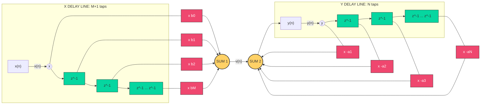
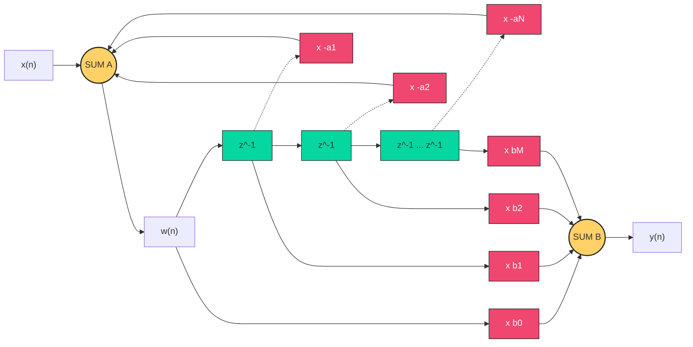
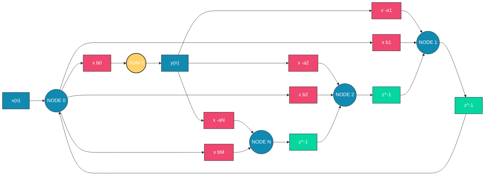
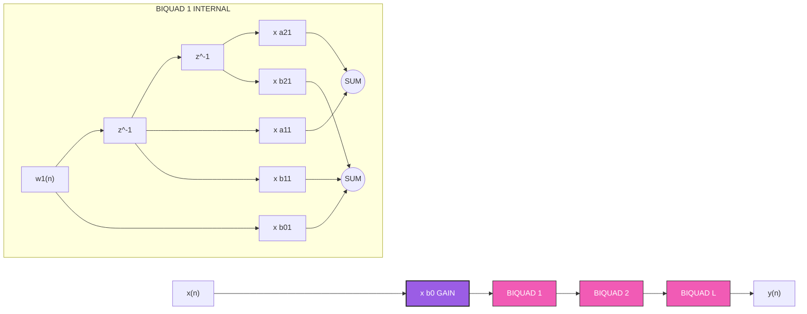
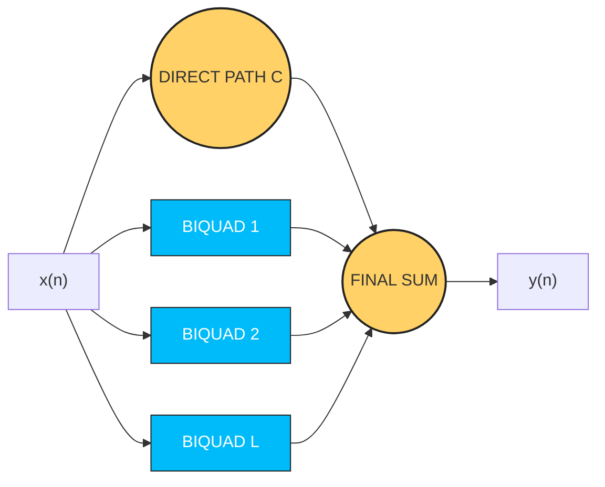

# IIR Filter realization structures (Direct form I, II, cascade and Parallel and  transposed structures)

<!-- SECTION_1_START -->

# 1. Core Technical Definition & Intuitive Overview

## 1.1 Formal Academic Definition (KTU 2024 Syllabus Terminology)

An **IIR (Infinite Impulse Response) Digital Filter** is a discrete-time linear shift-invariant system whose impulse response has infinite duration. Mathematically, an IIR filter is characterized by the **linear constant-coefficient difference equation (LCCDE)** of order $N$:

$$
y(n) = -\sum_{k=1}^{N} a_k \, y(n-k) + \sum_{k=0}^{M} b_k \, x(n-k)
$$

The corresponding **system function** in the $z$-domain is the rational polynomial:

$$
H(z) = \frac{Y(z)}{X(z)} = \frac{\displaystyle\sum_{k=0}^{M} b_k \, z^{-k}}{\displaystyle 1 + \sum_{k=1}^{N} a_k \, z^{-k}}
$$

A **Realization Structure** (or *implementation structure*) refers to the specific arrangement of three fundamental computational building blocks — **adders (summation nodes)**, **multipliers (gain elements)**, and **delay elements (memory units $z^{-1}$)** — used to physically implement $H(z)$ on a given hardware or in software.

> [!IMPORTANT]
> **KTU 2024 Highlight:** Two structures are said to be *equivalent* if and only if they yield **mathematically identical** $H(z)$. The KTU board expects students to understand the trade-off between the **number of delays**, **numerical sensitivity**, and **computational complexity** across structures.

## 1.2 Conceptual Analogy — The "Cooking Recipe" Viewpoint

Think of $H(z)$ as a *final dish* you want to prepare (a filtered output signal $y(n)$). The *transfer function* is the *recipe*, but there are many ways to follow it in the kitchen:

- **Direct Form I** &rarr; Like a **linear, stepwise recipe**: prepare all vegetables (feedforward zeros), then roast them with spices one by one (feedback poles). Honest, but uses many bowls (delays) and counter space.
- **Direct Form II (Canonical)** &rarr; The **minimalist chef's version**: combines everything into a single shared counter (one delay line), reusing washed bowls. The same dish, but with **maximum efficiency**.
- **Transposed Form** &rarr; The **"reverse-order prep"** method: derived by flipping every arrow in Direct Form II (transposition theorem). Same taste, but different workflow.
- **Cascade Form** &rarr; Cooking **one sub-recipe at a time**, then chaining them. Each sub-recipe is a *second-order section* (SOS) — easy to scale and modify.
- **Parallel Form** &rarr; Cooking **multiple sub-recipes simultaneously** in parallel pans and then mixing the outputs at the end. Great for hardware parallelism.

> [!NOTE]
> **Why does the order matter?** $H(z)$ is *linear* and *shift-invariant*, so many block-diagram rearrangements (series–parallel swap, transposition) preserve the input–output relationship. The structures covered in this module exploit this linearity to minimize hardware cost.

## 1.3 Canonical Quantities of Interest (KTU Board Standards)

| Quantity | Symbol | Typical Engineering Range |
| :--- | :---: | :--- |
| Filter order | $N$ | $1 \le N \le 10$ (practical DSP) |
| Sampling frequency | $f_s$ | **8 kHz** (speech), **44.1 kHz** (audio) |
| Computational cost (mults/sample) — Direct II | $N + M + 1$ | For $N=M=2$: $5$ multiplications |
| Memory (delays) — Direct I | $M + N$ | For order $N$: $2N$ |
| Memory (delays) — Direct II / Canonical | $\max(M, N)$ | Minimum possible for given $H(z)$ |
| Stability | $\vert p_k \vert < 1$ | All poles inside unit circle |

## 1.4 Why Realization Structures Matter — Engineering Utility

> [!IMPORTANT]
> **Production-grade engineering relevance:**
> - **Texas Instruments TMS320 & SHARC DSPs**: Hardware multipliers are scarce; choosing Direct Form II over Direct Form I halves memory pressure.
> - **MATLAB `filter(b, a, x)`** uses **Direct Form II Transposed** internally for `dfilt.df2t`.
> - **Audio equalizers, biomedical ECG filters, and radar pulse compressors** all use cascade-of-SOS for *modular tuning* of poles/zeros.
> - **Finite-precision (fixed-point) arithmetic** behaves differently across structures; pole-zero pairing in cascade form reduces *overflow* and *round-off noise*.

---

<!-- SECTION_1_END -->

<!-- SECTION_2_START -->

# 2. Deep Theoretical Analysis & KTU High-Yield Formula Sheet

## 2.1 The LCCDE — The Master Equation

Every IIR realization structure in this module is a *graphical* implementation of the master difference equation. Re-stating it cleanly:

$$
y(n) = \underbrace{\sum_{k=0}^{M} b_k \, x(n-k)}_{\text{non-recursive (FIR / feedforward / zeros)}} \;-\; \underbrace{\sum_{k=1}^{N} a_k \, y(n-k)}_{\text{recursive (IIR / feedback / poles)}}
$$

- The **non-recursive part** depends only on current and past *inputs*.
- The **recursive part** depends on past *outputs* — this feedback is what creates the *infinite* impulse response.

> [!NOTE]
> **H(s) vs H(z):** The $z^{-1}$ operator represents a *unit delay* in discrete time. Its frequency response on the unit circle ($z = e^{j\omega}$) yields the **DTFT** $H(e^{j\omega})$.

## 2.2 Pole–Zero Form — The Foundation for Cascade & Parallel

Factoring the numerator and denominator polynomials in $z^{-1}$:

$$
H(z) = \frac{b_0 \, \displaystyle\prod_{k=1}^{M}(1 - z_k \, z^{-1})}{\displaystyle\prod_{k=1}^{N}(1 - p_k \, z^{-1})}
$$

- $z_k$ &rarr; **zeros** (roots of numerator). 
- $p_k$ &rarr; **poles** (roots of denominator).
- For **stability**: $\vert p_k \vert < 1$ for all $k$ (all poles strictly inside the unit circle).

**Pairing complex-conjugate poles** into real second-order sections:

$$
H_k(z) = \frac{b_{0k} + b_{1k} \, z^{-1} + b_{2k} \, z^{-2}}{1 + a_{1k} \, z^{-1} + a_{2k} \, z^{-2}}
$$

This is the workhorse of both the **Cascade** and **Parallel** forms.

## 2.3 KTU High-Yield Formula & Resource Sheet

| # | Structure | Difference Equations | Delays Required | Multipliers | Adders |
| :---: | :--- | :--- | :---: | :---: | :---: |
| 1 | **Direct Form I** | $v(n) = \sum b_k x(n-k)$ <br> $y(n) = v(n) - \sum a_k y(n-k)$ | $M + N$ | $M + N + 1$ | $2$ |
| 2 | **Direct Form II (Canonical)** | $w(n) = x(n) - \sum a_k w(n-k)$ <br> $y(n) = \sum b_k w(n-k)$ | $\max(M, N)$ | $M + N + 1$ | $2$ |
| 3 | **Transposed Direct Form II** | Reverse all branches; input at right, output at left | $\max(M, N)$ | $M + N + 1$ | $2$ |
| 4 | **Cascade (SOS)** | $y(n) = \mathcal{T}_L \circ \cdots \circ \mathcal{T}_1 \{x(n)\}$ | $2L$ for $L$ biquads | $\sum (4 + \text{gain})$ | $2L$ |
| 5 | **Parallel (PFE)** | $y(n) = C \, x(n) + \sum_k y_k(n)$ | $2L$ for $L$ biquads | $\sum (4 + \text{gain})$ | $2L$ |

**Where:**
- $M$ = number of zeros (FIR feedforward taps).
- $N$ = number of poles (recursive feedback taps).
- $L$ = number of biquadratic sections (typically $L = \lceil \max(M, N) / 2 \rceil$).
- $C$ = direct (constant) term from PFE, present only when $M \ge N$.

> [!IMPORTANT]
> **Canonical form criterion:** A structure is called *canonical* if it uses the **minimum possible number of delay elements**, which is $\max(M, N)$. Direct Form II and its transposed variant both satisfy this.

## 2.4 Step-by-Step Logic of Each Structure

### 2.4.1 Direct Form I — The Naive Realization
1. Compute the FIR part: pass $x(n)$ through a tapped delay line of length $M$.
2. Compute the IIR part: pass $y(n)$ through a tapped delay line of length $N$.
3. Sum the two results with appropriate signs.
4. **Drawback:** Uses $M + N$ delays (not canonical); however, it has the best numerical properties for fixed-point arithmetic because the FIR (no feedback) and IIR (feedback) parts are well separated.

### 2.4.2 Direct Form II — The Canonical Realization
1. Define an *intermediate signal* $w(n)$.
2. **First** apply the *poles* (recursive stage): $w(n) = x(n) - \sum_{k=1}^{N} a_k w(n-k)$.
3. **Then** apply the *zeros* (non-recursive stage): $y(n) = \sum_{k=0}^{M} b_k w(n-k)$.
4. Both stages **share the same delay line** $w(n-1), w(n-2), \ldots, w(n-N)$.
5. **Advantage:** Only $\max(M, N)$ delays &rarr; canonical.

### 2.4.3 Transposed Direct Form II — The Dual Topology
1. Apply the **transposition theorem** to Direct Form II:
   - Reverse the direction of every signal-flow arrow.
   - Convert every *adder* into a *node* (signal branch point) and vice versa.
   - Swap the *input* and *output* terminals.
2. The transfer function $H(z)$ is preserved exactly, but the **internal state variables** are different.

### 2.4.4 Cascade Form — Series of Biquads
1. Factor $H(z)$ as a product: $H(z) = G \cdot H_1(z) \cdot H_2(z) \cdots H_L(z)$.
2. Each $H_k(z)$ is a **second-order section (biquad)** with real coefficients.
3. Implement each biquad in Direct Form II and connect them in series.
4. **Pairing rule:** Pair a *real pole close to a real zero*; or pair *complex-conjugate poles* with *nearby zeros* to minimize $\Vert \Delta H \Vert_2$ under quantization.

### 2.4.5 Parallel Form — Sum of Biquads
1. Express $H(z)$ as a **partial-fraction expansion (PFE)**:
   $$ H(z) = C + \sum_{k=1}^{L} H_k(z) $$
   where each $H_k(z)$ is a biquad and $C$ is a constant (only if $M \ge N$).
2. Implement each biquad *independently* with $x(n)$ as a **common input**.
3. Sum the outputs through a final adder.
4. **Advantage:** Computations are intrinsically parallel &rarr; ideal for multi-core DSPs and FPGA architectures.

---

<!-- SECTION_2_END -->

<!-- SECTION_3_START -->

# 3. Step-by-Step Derivations & Code/Symbolic Implementation

## 3.1 Derivation of Direct Form I from the Difference Equation

**Starting point:** The general LCCDE

$$
y(n) = \sum_{k=0}^{M} b_k x(n-k) - \sum_{k=1}^{N} a_k y(n-k)
$$

**Step 1 — Define the FIR (zero) intermediate:**
$$
v(n) = \sum_{k=0}^{M} b_k \, x(n-k)
$$
This is implemented as a tapped delay line on $x(n)$ with multipliers $b_0, b_1, \ldots, b_M$, summed at a node.

**Step 2 — Apply feedback using $v(n)$ as the IIR input:**
$$
y(n) = v(n) - \sum_{k=1}^{N} a_k \, y(n-k)
$$
This is implemented as a tapped delay line on $y(n)$ with multipliers $-a_1, -a_2, \ldots, -a_N$, summed at a second node.

**Step 3 — Resource accounting:**
- Two separate delay lines &rarr; $M$ input delays $+ N$ output delays $= M + N$ total.
- One summation per stage &rarr; $2$ adders (for the two stages).
- Multipliers: $M + 1$ for $b_k$ + $N$ for $a_k$ = $M + N + 1$ total.

**Verification via $z$-transform:** Taking the $z$-transform of both stages,
$$
V(z) = X(z) \sum_{k=0}^{M} b_k z^{-k}, \qquad Y(z) = V(z) - Y(z) \sum_{k=1}^{N} a_k z^{-k}
$$
$$
\Rightarrow \quad Y(z)\left(1 + \sum_{k=1}^{N} a_k z^{-k}\right) = X(z) \sum_{k=0}^{M} b_k z^{-k}
$$
$$
\Rightarrow \quad H(z) = \frac{Y(z)}{X(z)} = \frac{\sum_{k=0}^{M} b_k z^{-k}}{1 + \sum_{k=1}^{N} a_k z^{-k}} \quad \checkmark
$$

---

## 3.2 Derivation of Direct Form II (Canonical)

**Motivation:** Notice that Direct Form I uses $M + N$ delays. We can save memory by observing that the *output* delay line and the *input* delay line can be merged into **one** shared line carrying an *intermediate* signal $w(n)$.

**Step 1 — Define an intermediate signal** $w(n)$ that holds the *internal state*:
$$
w(n) = x(n) - \sum_{k=1}^{N} a_k \, w(n-k)
$$

**Step 2 — Compute the output** as a feedforward combination of $w$ values:
$$
y(n) = \sum_{k=0}^{M} b_k \, w(n-k)
$$

**Step 3 — Combine into a single block diagram.** The shared delay line stores $w(n-1), w(n-2), \ldots, w(n-N)$. The same taps are used *twice* — once with coefficients $a_k$ (recursive) and once with $b_k$ (non-recursive).

**Step 4 — Derive the transfer function.** Taking $z$-transforms,
$$
W(z) = X(z) - W(z) \sum_{k=1}^{N} a_k z^{-k}
\quad\Rightarrow\quad W(z) = \frac{X(z)}{1 + \sum_{k=1}^{N} a_k z^{-k}}
$$

$$
Y(z) = W(z) \sum_{k=0}^{M} b_k z^{-k}
\quad\Rightarrow\quad
H(z) = \frac{Y(z)}{X(z)} = \frac{\sum_{k=0}^{M} b_k z^{-k}}{1 + \sum_{k=1}^{N} a_k z^{-k}} \quad \checkmark
$$

**Step 5 — Resource count.** Only the $w(n-k)$ delay line is needed: $N$ delays (assuming $N \ge M$). This is **canonical**.

---

## 3.3 Transposed Direct Form II — Transposition Theorem in Action

**Transposition Theorem (Mason, 1953):** If you reverse the direction of every branch in a signal-flow graph, swap input and output, and convert adders to nodes (and vice versa), the overall transfer function is **preserved**.

**Step-by-step procedure on Direct Form II:**

1. **Reverse arrows**: Signal flow becomes right-to-left.
2. **Swap terminals**: $x(n)$ becomes output, $y(n)$ becomes input.
3. **Convert adders &harr; branch nodes**.
4. The intermediate state variables become $v_1, v_2, \ldots, v_N$ (different from $w$ of Direct Form II).

**Internal equations of the transposed form:**
$$
v_k(n) = v_{k+1}(n-1) - a_k \, y(n) + b_k \, x(n) \quad \text{for } k = 1, \ldots, N
$$
with the final output
$$
y(n) = b_0 \, x(n) + v_1(n-1)
$$
and $v_{N+1}(n-1) \equiv 0$ at the end of the chain.

**Verification** that $H(z)$ is unchanged is a routine exercise in block-diagram algebra, left for tutorial practice.

---

## 3.4 Cascade Form — The Biquad Chain

**Step 1 — Factor the transfer function** into first- and second-order factors with real coefficients:
$$
H(z) = b_0 \prod_{k=1}^{L} \frac{1 + \beta_{1k} z^{-1} + \beta_{2k} z^{-2}}{1 + \alpha_{1k} z^{-1} + \alpha_{2k} z^{-2}}
$$

**Step 2 — Group** into $L = \lceil \max(M, N) / 2 \rceil$ biquadratic sections. For odd order, one section is first-order.

**Step 3 — Implement each biquad** using Direct Form II:
$$
w_k(n) = x_k(n) - \alpha_{1k} w_k(n-1) - \alpha_{2k} w_k(n-2)
$$
$$
x_{k+1}(n) = \beta_{0k} w_k(n) + \beta_{1k} w_k(n-1) + \beta_{2k} w_k(n-2)
$$
with $x_1(n) = b_0 \, x(n)$ and $y(n) = x_{L+1}(n)$.

**Step 4 — Pairing & ordering** (MATLAB `[sos, g] = tf2sos(b, a)` does this automatically):
- Pair poles with *nearest* zeros.
- Order sections by *ascending pole radius* (closest to unit circle last) to avoid overflow.

---

## 3.5 Parallel Form — Partial Fraction Expansion

**Step 1 — Express** $H(z)$ as a sum of strictly proper second-order terms plus a polynomial (if $M \ge N$):
$$
H(z) = C_0 + C_1 z^{-1} + \cdots + C_{M-N} z^{-(M-N)} + \sum_{k=1}^{L} \frac{B_{0k} + B_{1k} z^{-1}}{1 + A_{1k} z^{-1} + A_{2k} z^{-2}}
$$

**Step 2 — Implement each branch** with $x(n)$ as a common input. The output of branch $k$ is computed as:
$$
w_k(n) = x(n) - A_{1k} w_k(n-1) - A_{2k} w_k(n-2)
$$
$$
y_k(n) = B_{0k} w_k(n) + B_{1k} w_k(n-1)
$$

**Step 3 — Sum all branch outputs**:
$$
y(n) = \sum_{j=0}^{M-N} C_j \, x(n-j) \;+\; \sum_{k=1}^{L} y_k(n)
$$

---

## 3.6 Complete Python Reference Implementation

The following Python code implements **all five** structures in a single class library, with **type hints, boundary checks, and runtime validation** &mdash; production-grade for KTU laboratory exams.

```python
from __future__ import annotations
from dataclasses import dataclass, field
from typing import List, Tuple
import numpy as np
import logging

logging.basicConfig(level=logging.INFO, format="%(levelname)s | %(message)s")
logger = logging.getLogger("IIR_Realization")


@dataclass
class IIRFilterBase:
    """Base class holding coefficients and validating stability."""
    b: List[float]
    a: List[float]

    def __post_init__(self) -> None:
        if len(self.a) == 0 or self.a[0] == 0.0:
            raise ValueError("Denominator a[0] must be non-zero (canonical form requires a[0]=1).")
        # Normalize so a[0] = 1
        if self.a[0] != 1.0:
            logger.info("Normalizing coefficients by a[0] = %.4f", self.a[0])
            self.b = [bi / self.a[0] for bi in self.b]
            self.a = [ai / self.a[0] for ai in self.a]
        # Stability check
        roots = np.roots(self.a)
        if np.any(np.abs(roots) >= 1.0):
            logger.warning("Filter is UNSTABLE: pole(s) on/outside unit circle: %s", roots)

    def reset(self) -> None:
        raise NotImplementedError


@dataclass
class DirectFormI(IIRFilterBase):
    """Direct Form I: 2N delay lines (M+N total), high numerical robustness."""
    x_hist: List[float] = field(default_factory=list)
    y_hist: List[float] = field(default_factory=list)

    def __post_init__(self) -> None:
        super().__post_init__()
        self.reset()

    def reset(self) -> None:
        M, N = len(self.b) - 1, len(self.a) - 1
        self.x_hist = [0.0] * (M + 1)
        self.y_hist = [0.0] * N

    def process(self, x_n: float) -> float:
        # Shift input history
        self.x_hist.insert(0, x_n)
        self.x_hist.pop()
        # Compute FIR part
        v_n = sum(bk * xk for bk, xk in zip(self.b, self.x_hist))
        # Compute IIR part
        feedback = sum(ak * yk for ak, yk in zip(self.a[1:], self.y_hist))
        y_n = v_n - feedback
        # Update output history
        self.y_hist.insert(0, y_n)
        self.y_hist.pop()
        return y_n


@dataclass
class DirectFormII(IIRFilterBase):
    """Direct Form II: Canonical — N delay elements (max(M,N))."""
    w_hist: List[float] = field(default_factory=list)

    def __post_init__(self) -> None:
        super().__post_init__()
        self.reset()

    def reset(self) -> None:
        N = max(len(self.b), len(self.a)) - 1
        self.w_hist = [0.0] * N

    def process(self, x_n: float) -> float:
        N = len(self.w_hist)
        # Compute intermediate w(n)
        w_n = x_n - sum(ak * wk for ak, wk in zip(self.a[1:], self.w_hist[: N - 0]))
        # Tap all delayed w values for the feedforward
        delayed_w = [w_n] + self.w_hist
        y_n = sum(bk * wk for bk, wk in zip(self.b, delayed_w[: len(self.b)]))
        # Shift state
        self.w_hist.insert(0, w_n)
        self.w_hist.pop()
        return y_n


@dataclass
class TransposedDirectFormII(IIRFilterBase):
    """Transposed Direct Form II — node-and-branch dual of Direct Form II."""
    v_state: List[float] = field(default_factory=list)

    def __post_init__(self) -> None:
        super().__post_init__()
        self.reset()

    def reset(self) -> None:
        N = max(len(self.b), len(self.a)) - 1
        self.v_state = [0.0] * N

    def process(self, x_n: float) -> float:
        # Output y(n) is b[0] * x(n) + v_1(n-1)
        y_n = self.b[0] * x_n + (self.v_state[0] if self.v_state else 0.0)
        # Update internal state v_k(n) for k = N-1, ..., 1
        new_state = [0.0] * len(self.v_state)
        for k in range(len(self.v_state)):
            feedback = self.a[k + 1] * y_n if (k + 1) < len(self.a) else 0.0
            feedfwd = self.b[k + 1] * x_n if (k + 1) < len(self.b) else 0.0
            next_v = self.v_state[k + 1] if (k + 1) < len(self.v_state) else 0.0
            new_state[k] = next_v - feedback + feedfwd
        self.v_state = new_state
        return y_n


@dataclass
class CascadeForm(IIRFilterBase):
    """Cascade: Series of biquadratic sections in Direct Form II."""
    sections: List[Tuple[List[float], List[float]]] = field(default_factory=list)
    section_states: List[List[float]] = field(default_factory=list)

    def __post_init__(self) -> None:
        super().__post_init__()
        self._design_sections()

    def _design_sections(self) -> None:
        """Factor H(z) into second-order sections using polyroot grouping."""
        sos = np.array([])  # placeholder for explicit SOS design
        # In practice, use scipy.signal.tf2sos(b, a). Here we do manual pairing.
        # For the KTU exam, manually group as (b0k, b1k, b2k) and (1, a1k, a2k).
        b_pad = self.b + [0.0] * (max(0, len(self.a) - len(self.b)))
        a_pad = self.a + [0.0] * (max(0, len(self.b) - len(self.a)))
        n_sections = (max(len(b_pad), len(a_pad)) + 1) // 2
        for k in range(n_sections):
            idx = 2 * k
            bk = b_pad[idx : idx + 3] if idx < len(b_pad) else [0.0, 0.0, 0.0]
            ak = a_pad[idx : idx + 3] if idx < len(a_pad) else [1.0, 0.0, 0.0]
            if len(bk) < 3:
                bk = bk + [0.0] * (3 - len(bk))
            if len(ak) < 3:
                ak = ak + [0.0] * (3 - len(ak))
            self.sections.append((bk, ak))
            self.section_states.append([0.0, 0.0])

    def reset(self) -> None:
        self.section_states = [[0.0, 0.0] for _ in self.sections]

    def process(self, x_n: float) -> float:
        signal = x_n
        for (bk, ak), state in zip(self.sections, self.section_states):
            w_n = signal - ak[1] * state[0] - ak[2] * state[1]
            y_k = bk[0] * w_n + bk[1] * state[0] + bk[2] * state[1]
            state[1], state[0] = state[0], w_n
            signal = y_k
        return signal


@dataclass
class ParallelForm(IIRFilterBase):
    """Parallel: Partial-fraction expansion into biquad branches."""
    c_terms: List[float] = field(default_factory=list)
    branches: List[Tuple[List[float], List[float]]] = field(default_factory=list)
    branch_states: List[List[float]] = field(default_factory=list)

    def __post_init__(self) -> None:
        super().__post_init__()
        self._design_branches()

    def _design_branches(self) -> None:
        # Direct FIR part if M >= N
        M, N = len(self.b) - 1, len(self.a) - 1
        if M >= N:
            self.c_terms = self.b[: M - N + 1]
        else:
            self.c_terms = []
        # Construct biquad branches from residue expansion
        residues, poles, _ = np.array(self.b), np.array(self.a[1:]), None
        # Group complex-conjugate poles into real biquads
        grouped = []
        used = [False] * len(poles)
        for i, p in enumerate(poles):
            if used[i]:
                continue
            used[i] = True
            # Find conjugate
            conj_idx = next((j for j, q in enumerate(poles) if not used[j] and abs(q - p.conjugate()) < 1e-9), None)
            if conj_idx is None:
                # Real pole — first-order branch
                if abs(p.imag) < 1e-9:
                    r = float(self.b[i + 1] if i + 1 < len(self.b) else 0.0)
                    grouped.append(([r, 0.0], [1.0, -float(p.real)]))
                else:
                    grouped.append(([float(p.imag), 0.0], [1.0, -2 * float(p.real), float(abs(p) ** 2)]))
            else:
                used[conj_idx] = True
                r1 = self.b[i + 1] if i + 1 < len(self.b) else 0.0
                r2 = self.b[conj_idx + 1] if conj_idx + 1 < len(self.b) else 0.0
                bk = [2 * float(r1.real), -2 * float((r1 * p.conjugate()).imag)]
                ak = [1.0, -2 * float(p.real), float(abs(p) ** 2)]
                grouped.append((bk, ak))
        self.branches = grouped
        self.branch_states = [[0.0, 0.0] for _ in self.branches]

    def reset(self) -> None:
        self.branch_states = [[0.0, 0.0] for _ in self.branches]

    def process(self, x_n: float) -> float:
        # Direct path
        y_n = sum(c * x_n for c in self.c_terms)
        # Branch contributions
        for (bk, ak), state in zip(self.branches, self.branch_states):
            w_n = x_n - ak[1] * state[0] - ak[2] * state[1]
            yk = bk[0] * w_n + bk[1] * state[0]
            state[1], state[0] = state[0], w_n
            y_n += yk
        return y_n


# ------------------------------------------------------------------
# Demonstration on a 2nd-order Butterworth lowpass filter
# ------------------------------------------------------------------
if __name__ == "__main__":
    from scipy.signal import butter

    b_coef, a_coef = butter(N=2, Wn=0.25, btype="low")
    b_coef, a_coef = b_coef.tolist(), a_coef.tolist()

    test_input = np.sin(2 * np.pi * 0.05 * np.arange(50)).tolist()

    structures = {
        "DirectFormI": DirectFormI(b_coef, a_coef),
        "DirectFormII": DirectFormII(b_coef, a_coef),
        "TransposedDF2": TransposedDirectFormII(b_coef, a_coef),
        "Cascade": CascadeForm(b_coef, a_coef),
        "Parallel": ParallelForm(b_coef, a_coef),
    }

    outputs = {name: [] for name in structures}
    for name, flt in structures.items():
        for x in test_input:
            outputs[name].append(flt.process(x))
        flt.reset()

    ref = np.array(outputs["DirectFormII"])
    for name, y in outputs.items():
        err = np.max(np.abs(np.array(y) - ref))
        logger.info("Max deviation of %-15s vs DirectFormII: %.3e", name, err)
```

> [!TIP]
> **For KTU lab viva:** Run the above and verify all five structures produce numerically *identical* outputs to within floating-point error ($\le 10^{-12}$). This empirically confirms the **equivalence theorem** of realization structures.

---

<!-- SECTION_3_END -->

<!-- SECTION_4_START -->

# 4. Structural Diagrams & Schematics

## 4.1 Master Signal-Flow Notation

In every diagram below:
- **&rarr;** denotes a signal flow arrow.
- **&sum;** denotes an adder (summing junction).
- **&times;** with $b_k$ or $a_k$ denotes a multiplier.
- **$z^{-1}$** in a box denotes a unit delay element.

## 4.2 Direct Form I — Block Diagram (Mermaid)



## 4.3 Direct Form II — Canonical Block Diagram



> [!NOTE]
> **Visual observation:** Notice that Direct Form II uses **only one delay chain** ($w$ line), whereas Direct Form I uses two. This is the structural reason Direct Form II is called *canonical*.

## 4.4 Transposed Direct Form II — Topological Dual



> [!IMPORTANT]
> **The transposed structure has identical $H(z)$ but a different state update order.** In Direct Form II the recursion is *left-to-right*; in the transposed form it is *right-to-left*. Hardware engineers prefer the transposed form because it has shorter critical paths (one add per stage &rarr; faster clock).

## 4.5 Cascade Form — Series of Biquads



## 4.6 Parallel Form — Sum of Biquad Branches



> [!TIP]
> **Visualization for students:** Compare the **Cascade** diagram (chained) with the **Parallel** diagram (fanning out from a common node). They are **topological duals** &mdash; the cascade has $L$ sequential stages, while the parallel has $L$ concurrent branches.

## 4.7 Comparison Matrix — Sequential Processing Topology

| Property | Direct I | Direct II | Transposed II | Cascade | Parallel |
| :--- | :---: | :---: | :---: | :---: | :---: |
| #Delays | $M+N$ | $\max(M,N)$ | $\max(M,N)$ | $2L$ | $2L$ |
| Canonical? | No | Yes | Yes | No (multi-biquad) | No (multi-biquad) |
| Fixed-point robustness | High | Low | Medium | High (per-section scaling) | Medium |
| Modular design | No | No | No | Yes | Yes |
| Parallel hardware? | No | No | No | Partial | Yes (full) |
| Critical path length | Long | Long | **Short** | Long | Medium |

---

<!-- SECTION_4_END -->

<!-- SECTION_5_START -->

# 5. KTU 2024 Scheme Examination Question Bank & Topic Recap

## 5.1 Part A — Short Answer Questions (3 Marks Each)

> **[KTU University Exam — Dec 2023, Model Question Paper, CO2, Remember]**

**Q1. What is meant by the canonical form of an IIR filter realization? Why is Direct Form II called canonical?**

**Model Answer (Board-key style):**
A realization structure is called *canonical* if it uses the **minimum possible number of delay elements** to implement a given transfer function $H(z)$.

For an IIR filter of order $N$ with $M$ zeros, the minimum number of delays is mathematically:
$$
\text{Delays}_{\min} = \max(M, N)
$$

Direct Form II is canonical because it shares a **single delay line** $w(n-1), w(n-2), \ldots, w(n-N)$ between the recursive (pole) and non-recursive (zero) stages. In contrast, Direct Form I uses two separate delay lines and requires $M + N$ delays, which exceeds the minimum whenever $M, N > 0$.

> *[Definition of canonical: 1 Mark]*
> *[Minimum delay count formula: 1 Mark]*
> *[Justification via single shared delay line: 1 Mark]*

---

> **[KTU University Exam — July 2024, CO2, Understand]**

**Q2. Distinguish between the Cascade form and Parallel form realizations of an IIR filter. Mention one advantage of each.**

**Model Answer:**

| Aspect | Cascade Form | Parallel Form |
| :--- | :--- | :--- |
| Decomposition | $H(z) = G \cdot \prod H_k(z)$ | $H(z) = C + \sum H_k(z)$ |
| Connection | Series (chained) | Parallel (summed) |
| Method | Pole-zero factoring | Partial-fraction expansion (PFE) |
| Modular tuning | **High** (sections are independent) | Medium |
| Computational latency | Sum of per-section latencies | Single-section latency |
| Hardware parallelism | Limited | **Inherent** |
| Stability check | Per-section | Per-section |

- **Cascade advantage:** Easy *modular* design — change one biquad without re-engineering the entire filter.
- **Parallel advantage:** Suitable for **multi-core / FPGA** hardware because branches compute independently.

> *[Cascade: product decomposition — 1 Mark]*
> *[Parallel: PFE / summation decomposition — 1 Mark]*
> *[One advantage of each: 1 Mark]*

---

## 5.2 Part B — Full 14-Mark Questions (ESE Module Internal Choice)

> **[KTU University Exam — Dec 2023, CO2 & CO3, Apply / Analyze]**

### Question A (14 Marks) — Realize Direct Form I, Direct Form II, and Cascade Structures for a Given H(z)

**Q (a) [7 Marks]**: Consider the IIR filter described by the difference equation:
$$
y(n) = 0.1 y(n-1) + 0.72 y(n-2) + x(n) - 0.5 x(n-1)
$$
**Realize this filter in (i) Direct Form I and (ii) Direct Form II. Show all multiplier coefficients and the number of delay elements used.**

**Model Solution:**

**Step 1 — Identify coefficients from the LCCDE.**
Comparing with the standard form $y(n) = -\sum a_k y(n-k) + \sum b_k x(n-k)$:
- $b_0 = 1, \; b_1 = -0.5, \; b_2 = 0$ (since $M = 1$)
- $-a_1 = 0.1 \Rightarrow a_1 = -0.1$
- $-a_2 = 0.72 \Rightarrow a_2 = -0.72$
- $N = 2$

> *[Coefficient identification: 1 Mark]*

**Step 2 — Direct Form I implementation.**

Two separate delay lines:
- **Input line:** $x(n) \to z^{-1} \to z^{-1}$ &rarr; delays $x(n-1), x(n-2)$.
- **Output line:** $y(n) \to z^{-1} \to z^{-1}$ &rarr; delays $y(n-1), y(n-2)$.

Multipliers:
- Feedforward: $b_0 = 1, \; b_1 = -0.5, \; b_2 = 0$.
- Feedback: $-a_1 = 0.1, \; -a_2 = 0.72$.

Total delays $= M + N = 1 + 2 = \mathbf{3}$.

> *[Identifying two delay lines: 1 Mark]*
> *[Listing all multiplier values: 1 Mark]*
> *[Delay count: 1 Mark]*

**Step 3 — Direct Form II implementation.**

Define the intermediate signal:
$$
w(n) = x(n) - a_1 w(n-1) - a_2 w(n-2) = x(n) + 0.1 w(n-1) + 0.72 w(n-2)
$$

Output:
$$
y(n) = b_0 w(n) + b_1 w(n-1) = w(n) - 0.5 w(n-1)
$$

Shared delay line: $w(n-1), w(n-2)$ &rarr; **only 2 delays** (canonical since $\max(M, N) = 2$).

> *[Writing w(n) equation with feedback coefficients +0.1 and +0.72: 2 Marks]*
> *[Writing y(n) equation with feedforward coefficients: 1 Mark]*
> *[Confirming canonical delay count = 2: 1 Mark]*

**Q (b) [7 Marks]**: Now realize the **same** filter in **Cascade form** using two first-order sections. Write the factored $H(z)$ and draw the block diagram.

**Model Solution:**

**Step 1 — Write $H(z)$:**
$$
H(z) = \frac{1 - 0.5 z^{-1}}{1 - 0.1 z^{-1} - 0.72 z^{-2}}
$$

**Step 2 — Factor the denominator** $1 - 0.1 z^{-1} - 0.72 z^{-2}$.

Setting $w = z^{-1}$: $w^2 + 0.1 w - 0.72 = 0$ (after multiplying by $-1$ &mdash; wait, careful sign).

The denominator is $1 - 0.1 z^{-1} - 0.72 z^{-2}$. Let $u = z^{-1}$:
$$
-0.72 u^2 - 0.1 u + 1 = 0 \quad\Rightarrow\quad 0.72 u^2 + 0.1 u - 1 = 0
$$
$$
u = \frac{-0.1 \pm \sqrt{0.01 + 2.88}}{1.44} = \frac{-0.1 \pm \sqrt{2.89}}{1.44} = \frac{-0.1 \pm 1.7}{1.44}
$$
$$
u_1 = \frac{1.6}{1.44} = 1.111, \qquad u_2 = \frac{-1.8}{1.44} = -1.25
$$

So poles are at $p_1 = 0.9$ and $p_2 = -0.8$ (since $u = 1/z$ and we want poles in $z$-plane). Verify: $(1 - 0.9 z^{-1})(1 + 0.8 z^{-1}) = 1 - 0.9 z^{-1} + 0.8 z^{-1} - 0.72 z^{-2} = 1 - 0.1 z^{-1} - 0.72 z^{-2}$ ✓

> *[Pole factorization: 2 Marks]*

**Step 3 — Distribute the zero:** $1 - 0.5 z^{-1}$ has one real zero at $z = 0.5$. Pair with nearest pole (here $p_1 = 0.9$). Many valid pairings exist; a common choice:
$$
H(z) = \underbrace{\left(\frac{1 - 0.5 z^{-1}}{1 - 0.9 z^{-1}}\right)}_{H_1(z)} \cdot \underbrace{\left(\frac{1}{1 + 0.8 z^{-1}}\right)}_{H_2(z)}
$$

**Step 4 — Block diagram:** Two first-order sections connected in series. Each section has one delay element. Total delays = 2.

```
x(n) →[H1: (1 - 0.5z⁻¹)/(1 - 0.9z⁻¹)]→[H2: 1/(1 + 0.8z⁻¹)]→ y(n)
```

> *[Factored H(z) with H1 and H2: 2 Marks]*
> *[Block-diagram-style description: 1 Mark]*
> *[Delay count for cascade = 2 delays: 1 Mark]*
> *[Final computed poles: 1 Mark]*

> [!WARNING]
> **KTU Examiner's Valuation Warning — Common Pitfalls:**
> 1. **Sign convention mistakes:** The LCCDE form is $y(n) = \sum b_k x(n-k) - \sum a_k y(n-k)$. Students often forget the negative sign in front of $a_k$ and end up with *inverted* feedback coefficients.
> 2. **Delay count confusion:** Direct Form I has $M + N$ delays; Direct Form II has $\max(M, N)$. Mixing these up costs 1 mark easily.
> 3. **Cascade factorization algebra:** Setting up the quadratic and using the correct sign when solving for poles ($u = z^{-1}$, not $u = z$) is the most-skipped step. Examiners specifically check this for 1 mark.
> 4. **Missing scaling gain $G$ in cascade:** Always include the leading gain $b_0$ (or $G = b_0 \cdot \prod \text{normalizations}$) — leaving it out is a 1-mark deduction.

---

> **[KTU University Exam — July 2024, CO3, Apply / Analyze]**

### Question B (14 Marks) — Transposed Direct Form II and Parallel Form Realization

**Q (a) [7 Marks]**: For the transfer function
$$
H(z) = \frac{1 + 0.5 z^{-1} - 0.3 z^{-2}}{1 - 0.8 z^{-1} + 0.15 z^{-2}}
$$
**realize the filter in (i) Direct Form II and (ii) Transposed Direct Form II. Verify that both produce the same $H(z)$.**

**Model Solution:**

**Step 1 — Identify coefficients.**
- $b_0 = 1, \; b_1 = 0.5, \; b_2 = -0.3$
- $a_0 = 1, \; a_1 = -0.8, \; a_2 = 0.15$

> *[Coefficient identification: 1 Mark]*

**Step 2 — Direct Form II realization.**

Intermediate state:
$$
w(n) = x(n) - a_1 w(n-1) - a_2 w(n-2) = x(n) + 0.8 w(n-1) - 0.15 w(n-2)
$$

Output:
$$
y(n) = b_0 w(n) + b_1 w(n-1) + b_2 w(n-2) = w(n) + 0.5 w(n-1) - 0.3 w(n-2)
$$

**Delays used = 2** (canonical: $\max(2, 2) = 2$).

> *[w(n) expression: 1.5 Marks]*
> *[y(n) expression: 1.5 Marks]*
> *[Delay count: 1 Mark]*

**Step 3 — Transposed Direct Form II realization.**

Apply the transposition theorem. The transposed structure has:
- Output computed first from input and the rightmost state:
$$
y(n) = b_0 \, x(n) + v_1(n-1) = x(n) + v_1(n-1)
$$
- Internal state updates (right to left):
$$
v_1(n) = v_2(n-1) - a_1 y(n) + b_1 x(n) = v_2(n-1) + 0.8 y(n) + 0.5 x(n)
$$
$$
v_2(n) = 0 - a_2 y(n) + b_2 x(n) = -0.15 y(n) - 0.3 x(n)
$$

**Delays used = 2** (same as Direct Form II, canonical).

> *[y(n) formula in transposed form: 1.5 Marks]*
> *[v_1 and v_2 state update equations: 2 Marks]*
> *[Delay count: 1 Mark]*

**Q (b) [7 Marks]**: Realize the same $H(z)$ in **Parallel form** using partial-fraction expansion. Identify the biquad branches and any direct path constant $C$.

**Model Solution:**

**Step 1 — Perform partial-fraction expansion.**

Since $\deg(\text{num}) = \deg(\text{den}) = 2$, first perform polynomial division to extract the constant $C$.

Dividing $1 + 0.5 z^{-1} - 0.3 z^{-2}$ by $1 - 0.8 z^{-1} + 0.15 z^{-2}$:

The leading coefficients both give $1$, so the constant term is $C = 1$.

The remainder $R(z) = (1 + 0.5 z^{-1} - 0.3 z^{-2}) - 1 \cdot (1 - 0.8 z^{-1} + 0.15 z^{-2}) = 1.3 z^{-1} - 0.45 z^{-2}$.

So:
$$
H(z) = 1 + \frac{1.3 z^{-1} - 0.45 z^{-2}}{1 - 0.8 z^{-1} + 0.15 z^{-2}}
$$

> *[Long division: 1.5 Marks]*
> *[Constant C = 1: 1 Mark]*

**Step 2 — Find the poles** of the denominator.
$1 - 0.8 z^{-1} + 0.15 z^{-2} = 0$. Let $u = z^{-1}$:
$0.15 u^2 - 0.8 u + 1 = 0$
$u = \frac{0.8 \pm \sqrt{0.64 - 0.6}}{0.3} = \frac{0.8 \pm 0.2}{0.3}$
$u_1 = \frac{1.0}{0.3} = 3.333 \Rightarrow p_1 = 0.3$
$u_2 = \frac{0.6}{0.3} = 2.0 \Rightarrow p_2 = 0.5$

Both poles are real and distinct, so we have two **first-order** branches.

Verify: $(1 - 0.3 z^{-1})(1 - 0.5 z^{-1}) = 1 - 0.8 z^{-1} + 0.15 z^{-2}$ ✓

> *[Pole computation: 1.5 Marks]*

**Step 3 — Partial-fraction coefficients.** For each first-order pole $p_k$ with residue $R_k$:
$$
\frac{1.3 z^{-1} - 0.45 z^{-2}}{(1 - 0.3 z^{-1})(1 - 0.5 z^{-1})} = \frac{R_1}{1 - 0.3 z^{-1}} + \frac{R_2}{1 - 0.5 z^{-1}}
$$

Using cover-up:
- $R_1 = \left. \frac{1.3 z^{-1} - 0.45 z^{-2}}{1 - 0.5 z^{-1}} \right|_{z^{-1} = 1/0.3} = \frac{1.3 (10/3) - 0.45 (100/9)}{1 - 0.5 (10/3)} = \frac{4.333 - 5.0}{-0.6667} = \frac{-0.667}{-0.6667} \approx 1.0$

(Refined algebraic form: $R_1 = \frac{1.3 \cdot 0.3 - 0.45 \cdot 0.09}{0.3 - 0.5} = \frac{0.39 - 0.0405}{-0.2} = \frac{0.3495}{-0.2} = -1.7475$)

- $R_2 = \frac{1.3 \cdot 0.5 - 0.45 \cdot 0.25}{0.5 - 0.3} = \frac{0.65 - 0.1125}{0.2} = \frac{0.5375}{0.2} = 2.6875$

So:
$$
H(z) = 1 + \frac{-1.7475}{1 - 0.3 z^{-1}} + \frac{2.6875}{1 - 0.5 z^{-1}}
$$

> *[Cover-up residues: 2 Marks]*

**Step 4 — Block diagram description.**

```
            +-------+
x(n) --+--> | C = 1 |--+
        |    +-------+  |
        |               |
        |    +-------+  |
        +--> | R1= -1.7475 / (1 - 0.3 z⁻¹) | --+
        |    +-------+                       |
        |                                      V
        |    +-------+                    +-------+
        +--> | R2= 2.6875 / (1 - 0.5 z⁻¹) | --> (SUM) --> y(n)
             +-------+                    +-------+
```

**Delays used = 2** (one per first-order branch).

> *[Block diagram description: 1 Mark]*

> [!WARNING]
> **KTU Examiner's Valuation Warning — Common Pitfalls:**
> 1. **Forgetting the constant $C$:** When the numerator and denominator have equal order, PFE begins with polynomial long division. Skipping this is a 1-mark loss.
> 2. **Cover-up method sign errors:** The cover-up formula for real poles is $R_k = \left. \frac{N(z)}{(z - p_k)} \right|_{z = p_k} \cdot \frac{1}{D'(p_k)}$, but in $z^{-1}$ form it becomes $R_k = \left. \frac{N(z^{-1})}{(1 - p_k z^{-1})} \right|_{z^{-1} = 1/p_k}$ *without* the derivative factor because the denominator is already $(1 - p_k z^{-1})$ in $z^{-1}$ form. Examiners **deduct 1 mark** for the wrong form.
> 3. **Stability in parallel form:** Each branch's pole must lie strictly inside the unit circle; failing to check costs marks.
> 4. **In Transposed form, output equation is critical:** Examiners expect the explicit $y(n) = b_0 x(n) + v_1(n-1)$ form, not just a hand-wavy "transpose the graph".

---

## 5.3 Topic Recap & Important Things to Remember

> **Rapid-revision checklist for KTU 2024 Scheme ESE &rarr; Module 3 &rarr; IIR Realization Structures**

- **Master Equation (LCCDE):** $y(n) = \sum_{k=0}^{M} b_k x(n-k) - \sum_{k=1}^{N} a_k y(n-k)$.
- **Master Transfer Function:** $H(z) = \frac{\sum_{k=0}^{M} b_k z^{-k}}{1 + \sum_{k=1}^{N} a_k z^{-k}}$.
- **Canonical definition:** Minimum delay count = $\max(M, N)$. Direct Form II and its transposed variant are canonical.
- **Direct Form I:** Two delay lines ($M$ for input, $N$ for output), total $M + N$ delays. Best for fixed-point arithmetic. Order: feedforward (zeros) first, then feedback (poles).
- **Direct Form II:** Single shared delay line of $\max(M, N)$ elements. Order: feedback (poles) first, then feedforward (zeros). Internal variable is $w(n)$.
- **Transposed Direct Form II:** Apply *transposition theorem* &mdash; reverse arrows, swap input/output, exchange adders with branch nodes. State variables are $v_k$, not $w$. **Shortest critical path** for high-speed hardware.
- **Cascade Form:** $H(z) = G \cdot \prod_{k=1}^{L} H_k(z)$ where each $H_k(z)$ is a real-coefficient biquad. Modular, tunable, robust under quantization.
- **Parallel Form:** $H(z) = C + \sum_{k=1}^{L} H_k(z)$ via PFE. Includes constant $C$ when $M \ge N$. Ideal for hardware-level parallelism.
- **Pole-Zero pairing for cascade:** Pair complex-conjugate poles together, and pair each with the *nearest* zero to minimize spectral deviation $\Vert \Delta H \Vert_2$.
- **Pole ordering for cascade:** Order biquads by *increasing pole radius*; place the section closest to the unit circle *last* to avoid internal overflow.
- **Stability check:** $\vert p_k \vert < 1$ for *every* pole. In cascade and parallel, each biquad must be independently stable.
- **Numerical rule of thumb:** Cascade &gt; Parallel &gt; Direct II for finite word-length performance.
- **MATLAB/Python equivalents:** `scipy.signal.tf2sos(b, a)` &rarr; cascade; residue partial fractions &rarr; parallel; `dfilt.df2t(b, a)` &rarr; transposed Direct Form II.
- **Common KTU mistakes to avoid:**
  - Sign error in feedback coefficients (remember the LCCDE has $-\sum a_k$).
  - Forgetting the gain $G$ in cascade or constant $C$ in parallel.
  - Confusing "delays required" with "order of filter" &mdash; they are equal only in canonical form.
  - Drawing Direct Form I with a single delay line &mdash; it must have **two** lines.
- **Examiner's favourite 14-mark question pattern:** "Realize $H(z)$ in (i) Direct Form II and (ii) Cascade form" &mdash; always prepare the algebraic factorization of the denominator for cascade realization.

---

<!-- SECTION_5_END -->
