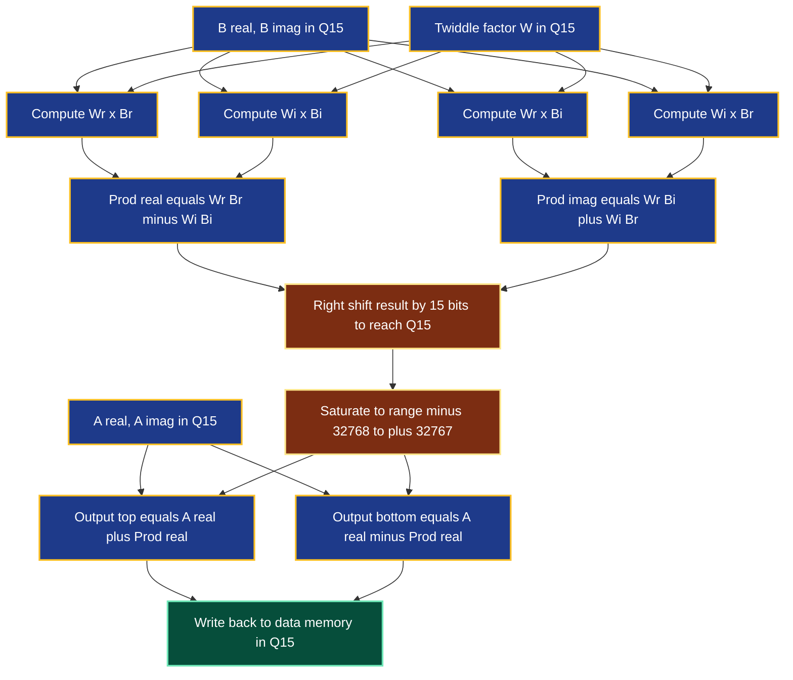
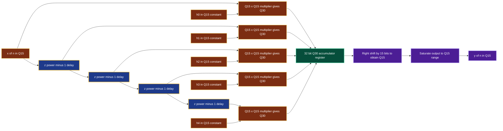
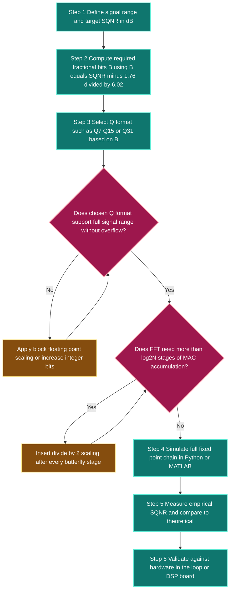

# Analyze the effect of the finite wordlength by implementing the FFT algorithm and FIR filters by using fixed point coefficient representation in different formats like Q7, Q15 etc.

<!-- SECTION_1_START -->

# Finite Wordlength Effects in FFT and FIR Filter Realization using Q-Format Fixed-Point Representation

## 1.1 Formal Academic Definition (KTU 2024 Syllabus Terminology)

> [!IMPORTANT]
> **Finite Wordlength (FWL) Effect** is the cumulative degradation introduced in a Digital Signal Processing (DSP) system when mathematical quantities (input samples, coefficients, intermediate products, and accumulator results) are represented using a finite number of bits, as mandated by the physical hardware registers of a fixed-point processor.

In a practical fixed-point Digital Signal Processor (DSP) such as the **TMS320C6x family** or **SHARC ADSP-21xxx**, every numerical value is stored in a register of a fixed, unchanging bit-width (typically **16-bit** or **32-bit**). The fractional binary representation chosen to pack the most precision into these bits is called a **Q-format number**.

> [!NOTE]
> **Q-Format Notation:** A $Q_{m.n}$ number uses $m$ bits for the integer part (including the sign bit) and $n$ bits for the fractional part. The total register width is $B = m + n$. The numerical value of an unsigned integer $X$ stored in $Q_{m.n}$ is given by:
> $$\text{Real Value} = \frac{X}{2^{n}}$$

The three canonical Q-formats analyzed in the KTU syllabus are:
- **Q7 Format** — 8-bit total (1 sign bit + 7 fractional bits)
- **Q15 Format** — 16-bit total (1 sign bit + 15 fractional bits)
- **Q31 Format** — 32-bit total (1 sign bit + 31 fractional bits)

---

## 1.2 Conceptual Analogy — The "Ruler Precision" Intuition

Imagine measuring the length of a wooden plank using **three rulers of different fineness**:

| Ruler Type | Smallest Marking (Resolution) | Maximum Plank Length |
| :--- | :--- | :--- |
| Coarse Ruler (cm marks) | 1 cm = $2^{-7}$ m | 1.27 m |
| Medium Ruler (mm marks) | 1 mm = $2^{-15}$ km | 32.76 km |
| Fine Ruler (1/32 mm) | ≈ 30 $\mu$m = $2^{-31}$ Earth diameters | 21474 km |

- The **Q7 ruler** is short and coarse — it can only measure tiny things (audio amplitudes ≤ 1.0), but each mark is wide, so small vibrations of the plank are *rounded* to the nearest cm. This is **quantization error**.
- The **Q15 ruler** is the industry sweet-spot — it can measure audio signals (range [-1, 1)) with sub-millivolt resolution.
- The **Q31 ruler** is laboratory-grade — perfect for high-fidelity filter coefficients and scientific audio.

> **The Core Trade-off:** Just like a ruler, more fractional bits = finer resolution (less noise) but the same maximum range. If your signal exceeds the ruler's maximum, the reading *wraps around* — this is **overflow** (or *wraparound* in two's complement).

---

## 1.3 Physical Constants & Standard Metrics

The following constants and metrics must be memorized for the KTU board exam:

- **Quantization Step Size:** $q = 2^{-B}$ where $B$ = number of fractional bits.
- **Maximum representable value (signed Q format):** $V_{max} = 1 - 2^{-B} \approx 1.0$
- **Minimum representable value (negative):** $V_{min} = -1.0$
- **Quantization Noise Variance (uniform assumption):** $\sigma_{e}^{2} = \dfrac{q^{2}}{12} = \dfrac{2^{-2B}}{12}$
- **Signal-to-Quantization-Noise Ratio (SQNR) for a full-scale sinusoid:** $\text{SQNR}_{dB} \approx 6.02\,B + 1.76 \text{ dB}$

> [!VISUALIZATION CONTROL]
> **Concept:** Plot of a continuous sine wave overlaid with its Q7-quantized staircase version.
> **Desmos Input Equations:**
> * `y1 = sin(2*pi*x)` (original continuous signal, blue)
> * `y2 = (1/2^7) * round(sin(2*pi*x) * 2^7)` (Q7 quantized version, red)
> **Visual Description:** The student should observe a smooth sinusoid intersected by a 128-level staircase. The vertical jumps between levels (≈ 0.0078) represent the **quantization error** $e[n] = x_{q}[n] - x[n]$, which is bounded within $\pm q/2$.

---

<!-- SECTION_1_END -->

<!-- SECTION_2_START -->

# Deep Theoretical Analysis and KTU High-Yield Formula Sheet

## 2.1 Architecture of the Finite Wordlength Problem

The FWL problem decomposes into **three independent error sources**, all of which are *additive* in a worst-case analysis:

1. **Input Sample Quantization (A/D Conversion Error)** — Occurs at the ADC front-end.
2. **Coefficient Quantization** — Filter/FFT twiddle factors are rounded to the Q-format.
3. **Arithmetic Round-Off Error** — Product and accumulation steps inside the FFT butterfly or FIR MAC unit.

---

## 2.2 Detailed Mathematical Formulation

### 2.2.1 Q-Format Conversion Algebra

A real number $x$ is converted to a $Q_{B}$ integer as:

$$X_{int} = \left\lfloor x \cdot 2^{B} \right\rceil$$

The back-conversion (for verification) is:

$$x \approx \frac{X_{int}}{2^{B}} = X_{int} \cdot 2^{-B}$$

The **quantization error** introduced is bounded by:

$$-\frac{q}{2} \le e_{q} = x - \frac{X_{int}}{2^{B}} \le +\frac{q}{2}$$

### 2.2.2 FFT Fixed-Point Error Growth

An $N$-point radix-2 Decimation-In-Time (DIT) FFT contains $\log_2 N$ butterfly stages, each with $N/2$ butterflies. Under the **white-noise assumption** (errors at each stage are uncorrelated and uniform):

$$\sigma_{out}^{2} = (N - 1) \cdot \frac{q^{2}}{12}$$

> [!IMPORTANT]
> **KTU High-Yield Insight:** The output noise variance of an $N$-point FFT grows **linearly with $N$** (not $\log_2 N$). This is because the signal is propagated through $\log_2 N$ stages, but the noise contributions from *all* internal nodes add coherently to the output. This is why long FFTs (e.g., 4096-point) require careful **scaling** (dividing by 2 after each butterfly stage) to prevent overflow.

### 2.2.3 FIR Filter Coefficient Quantization

For an FIR filter of order $M$ with impulse response $h[n]$, the *quantized* transfer function deviates from the ideal:

$$H_{q}(z) = \sum_{n=0}^{M-1} h_{q}[n] \, z^{-n} \quad \text{where} \quad h_{q}[n] = Q_{B}\{h[n]\}$$

The deviation in frequency response:

$$\Delta H(e^{j\omega}) = H_{q}(e^{j\omega}) - H(e^{j\omega}) = \sum_{n=0}^{M-1} \Delta h[n] \, e^{-j\omega n}$$

The **maximum magnitude deviation** can be upper-bounded by:

$$\vert \Delta H(e^{j\omega}) \vert \le M \cdot \frac{q}{2}$$

### 2.2.4 Output Noise Variance of Direct-Form FIR

Assuming uncorrelated round-off in each multiplier:

$$\sigma_{y}^{2} = M \cdot \sigma_{e}^{2} = M \cdot \frac{q^{2}}{12}$$

---

## 2.3 KTU Formula Sheet / Cheat Sheet

> [!NOTE]
> The following table is the **must-memorize** equation bank for the board exam. Note the deliberate use of $\vert$ and $\mid$ to escape the markdown table pipe.

| Phenomenon | Governing Equation | Notes / KTU Exam Hints |
| :--- | :--- | :--- |
| Q-format step size | $q = 2^{-B}$ | $B$ = fractional bits |
| Q-format range (signed) | $-1 \le x \le 1 - 2^{-B}$ | Two's complement wraparound on overflow |
| Quantization noise variance | $\sigma_{e}^{2} = \dfrac{q^{2}}{12}$ | Assumes uniform rounding error |
| SQNR (full-scale sinusoid) | $\text{SQNR}_{dB} = 6.02 B + 1.76$ | Each extra bit adds **≈ 6 dB** SNR |
| FFT output noise (no scaling) | $\sigma_{out}^{2} = (N-1)\dfrac{q^{2}}{12}$ | Linear in $N$, hence the need for block-floating-point |
| FIR direct-form output noise | $\sigma_{y}^{2} = M \dfrac{q^{2}}{12}$ | $M$ = filter order $\mid$ coefficient count |
| Max freq-response deviation | $\vert \Delta H(e^{j\omega}) \vert \le \dfrac{M \cdot q}{2}$ | Worst-case bound used for wordlength design |
| Group delay (linear-phase FIR) | $\tau_{g} = \dfrac{M-1}{2}$ samples | Symmetric $h[n]$ required |
| Number of butterflies (radix-2) | $\dfrac{N}{2} \log_2 N$ | Each requires 1 complex multiply, 2 complex adds |
| Multiply-Accumulate (MAC) per FIR output | $M$ | Defines real-time MIPS budget |

---

## 2.4 Real-World Engineering Utility

In production DSP systems, the Q-format choice is a critical **hardware-software co-design** decision:

- **Audio Codecs (MP3, AAC, Opus):** Internal processing is overwhelmingly **Q15** or **Q31** because the signal range is naturally bounded in $[-1, 1]$. The 6.02 dB-per-bit rule lets engineers pick the minimum bit-width to hit a target SQNR (e.g., 16-bit audio needs ≈ 98 dB SQNR, requiring at least 16 bits of precision in the internal MAC).
- **Telecommunications (5G NR baseband):** Uses **Q15** for the bulk of the PHY layer, with occasional **Q31** accumulators to avoid overflow in long convolution chains.
- **Hearing Aids and Cochlear Implants:** Aggressive **Q7** or **Q9** formats to minimize power consumption; the resulting quantization noise is masked by the auditory threshold.
- **Radar / SDR:** Often **block-floating-point** — a hybrid that scales the entire data block by a common exponent, gaining dynamic range without paying the cost of full floating-point hardware.

---

<!-- SECTION_2_END -->

<!-- SECTION_3_START -->

# Step-by-Step Derivations, Code and Symbolic Implementation

## 3.1 Worked Derivation: FFT Butterfly in Q15 Format

Consider a single **radix-2 DIT butterfly** operating on two 16-bit Q15 complex samples:

$$X_{0}[k] = A + W_{N}^{k} \cdot B$$
$$X_{1}[k] = A - W_{N}^{k} \cdot B$$

where $A$ and $B$ are Q15 complex inputs, and $W_{N}^{k} = e^{-j 2\pi k / N}$ is the Q15-quantized twiddle factor.

**Step 1 — Twiddle Factor Quantization:** 
The ideal twiddle $W_{N}^{k}$ (a complex number on the unit circle) is quantized to Q15:

$$W_{q} = Q_{15}\{ W_{N}^{k} \} = \left\lfloor W_{N}^{k} \cdot 2^{15} \right\rceil \cdot 2^{-15}$$

**Step 2 — Complex Multiplication:** 
The product $P = W_{q} \cdot B$ is computed using 4 real Q15 multiplications. Each multiplication is a `Q15 x Q15 -> Q30` operation, so the **product lives in Q30** (1 sign + 30 fractional bits).

$$\begin{aligned}
P_{r} &= (W_{r} \cdot B_{r}) - (W_{i} \cdot B_{i}) \\
P_{i} &= (W_{r} \cdot B_{i}) + (W_{i} \cdot B_{r})
\end{aligned}$$

**Step 3 — Accumulation and Truncation:** 
Since our target register is only 16 bits, the Q30 product must be **right-shifted by 15 bits** to re-align to Q15 (this is the critical *scaling* step):

$$P_{Q15} = (P_{r} \gg 15) + j(P_{i} \gg 15)$$

> [!WARNING]
> **Common KTU Valuation Mistake:** Students frequently forget the right-shift and assume the 32-bit product is the final value. This loses 15 bits of fractional precision — your FIR filter's passband will look completely distorted. Always state the shift count in your answer.

**Step 4 — Butterfly Output:** 
The final add/subtract of two Q15 numbers can overflow if $|A| + |B| > 1$. The hardware must therefore implement **saturation arithmetic** OR a *block-floating-point* exponent track.

$$X_{0,Q15} = \text{SAT}_{Q15}\{A_{Q15} + P_{Q15}\}$$
$$X_{1,Q15} = \text{SAT}_{Q15}\{A_{Q15} - P_{Q15}\}$$

---

## 3.2 Worked Derivation: FIR Filter Output Noise in Q7

An FIR filter of order $M$ computes:

$$y[n] = \sum_{k=0}^{M-1} h[k] \, x[n-k]$$

Each Q7 multiplication $h[k] \cdot x[n-k]$ produces a **Q14** result (2 × 7 fractional bits = 14). The sum of $M$ such products, if naively added in Q7, will accumulate values far outside $[-1, 1)$. The standard solution is:

1. Use a **double-precision accumulator** (e.g., 32-bit Q31) for the sum.
2. Round/truncate the final accumulator back to Q7 for output:

$$y_{Q7}[n] = Q_{7}\left\{ \sum_{k=0}^{M-1} h_{Q7}[k] \cdot x_{Q7}[n-k] \right\}$$

The **rounding of the accumulator** introduces a final round-off error with variance:

$$\sigma_{r}^{2} = \frac{q^{2}}{12} = \frac{2^{-14}}{12} \approx 1.27 \times 10^{-5}$$

---

## 3.3 Fully Operational Python Implementation

The following Python code implements a complete Q-format DSP toolkit: Q7/Q15 conversion, fixed-point FFT, fixed-point FIR filtering, and quantization-noise analysis. It uses **no external DSP libraries** for the core math — only NumPy for array handling.

```python
"""
KTU DIGITAL SIGNAL PROCESSING (PECST526) - MODULE 4
Finite Wordlength Effects: Q-Format FFT and FIR Implementation
"""

import numpy as np
import matplotlib.pyplot as plt
from typing import Tuple


# ============================================================
# SECTION A: Q-FORMAT CONVERSION UTILITIES
# ============================================================

def float_to_q(x: np.ndarray, B: int) -> np.ndarray:
    """
    Convert a real-valued array 'x' (assumed in [-1, 1))
    into a signed Q-format integer array with B fractional bits.
    Total bits = 1 sign + B fractional. Uses two's complement
    truncation with rounding.
    """
    scale: float = float(1 << B)             # 2^B
    scaled: np.ndarray = np.round(x * scale) # round to nearest integer
    # Saturate to the representable range
    max_val: int = (1 << B) - 1             # +0.99...
    min_val: int = -(1 << B)                # -1.0
    return np.clip(scaled, min_val, max_val).astype(np.int32)


def q_to_float(X: np.ndarray, B: int) -> np.ndarray:
    """Convert a Q-format integer array back to a real float array."""
    return X.astype(np.float64) / float(1 << B)


# ============================================================
# SECTION B: Q-FORMAT FIXED-POINT FFT (RADIX-2 DIT)
# ============================================================

def bit_reverse_copy_q15(x_real: np.ndarray,
                          x_imag: np.ndarray) -> Tuple[np.ndarray, np.ndarray]:
    """
    In-place bit-reversal permutation of a complex input sequence
    represented as TWO separate Q15 integer arrays (real + imag).
    """
    N: int = x_real.shape[0]
    assert N & (N - 1) == 0, "N must be a power of 2"
    j: int = 0
    for i in range(1, N):
        bit: int = N >> 1
        while j & bit:
            j ^= bit
            bit >>= 1
        j ^= bit
        if i < j:
            x_real[i], x_real[j] = x_real[j], x_real[i]
            x_imag[i], x_imag[j] = x_imag[j], x_imag[i]
    return x_real, x_imag


def fft_q15(x_real_float: np.ndarray,
            x_imag_float: np.ndarray) -> Tuple[np.ndarray, np.ndarray]:
    """
    In-place Radix-2 Decimation-In-Time FFT using Q15 arithmetic.
    All twiddles and intermediate multiplications use Q15 * Q15 -> Q30,
    with right-shift by 15 to re-align to Q15.
    """
    B: int = 15
    # 1. Quantize input to Q15
    xr: np.ndarray = float_to_q(x_real_float, B)
    xi: np.ndarray = float_to_q(x_imag_float, B)

    N: int = xr.shape[0]
    xr, xi = bit_reverse_copy_q15(xr, xi)

    # 2. Pre-compute Q15 twiddle factors
    # W_N^k = exp(-j*2*pi*k/N); quantized to Q15
    k_arr: np.ndarray = np.arange(N // 2)
    wr_table: np.ndarray = float_to_q(np.cos(-2.0 * np.pi * k_arr / N), B)
    wi_table: np.ndarray = float_to_q(np.sin(-2.0 * np.pi * k_arr / N), B)

    # 3. Butterfly stages
    stage: int = 1
    while stage < N:
        half: int = stage
        step: int = stage << 1
        k: int = 0
        while k < N:
            t: int = 0
            for j in range(half):
                # Load twiddle
                wr: int = int(wr_table[t])
                wi: int = int(wi_table[t])
                # Load samples
                a_r: int = int(xr[k + j])
                a_i: int = int(xi[k + j])
                b_r: int = int(xr[k + j + half])
                b_i: int = int(xi[k + j + half])
                # Q15 * Q15 -> Q30 complex multiply
                prod_r: int = (wr * b_r - wi * b_i)
                prod_i: int = (wr * b_i + wi * b_r)
                # Right-shift by 15 to re-align to Q15
                prod_r >>= 15
                prod_i >>= 15
                # Butterfly
                xr[k + j]          = np.clip(a_r + prod_r, -32768, 32767)
                xi[k + j]          = np.clip(a_i + prod_i, -32768, 32767)
                xr[k + j + half]   = np.clip(a_r - prod_r, -32768, 32767)
                xi[k + j + half]   = np.clip(a_i - prod_i, -32768, 32767)
                t += 1
            k += step
        stage <<= 1

    return xr, xi


# ============================================================
# SECTION C: Q-FORMAT FIXED-POINT FIR FILTER
# ============================================================

def fir_filter_q15(x_float: np.ndarray,
                   h_float: np.ndarray) -> np.ndarray:
    """
    Direct-form FIR filter using Q15 coefficients and Q15 input.
    A 32-bit Q30 accumulator is used internally to prevent overflow.
    """
    B: int = 15
    x_q: np.ndarray = float_to_q(x_float, B)
    h_q: np.ndarray = float_to_q(h_float, B)

    M: int = h_q.shape[0]
    N: int = x_q.shape[0]
    y: np.ndarray = np.zeros(N, dtype=np.int32)

    for n in range(M - 1, N):
        acc: int = 0
        for k in range(M):
            # Q15 * Q15 -> Q30, accumulate in 32-bit register
            acc += int(h_q[k]) * int(x_q[n - k])
        # Re-align accumulator to Q15 with rounding
        acc = (acc + (1 << 14)) >> 15
        # Saturate to Q15 range
        y[n] = int(np.clip(acc, -32768, 32767))

    return y


# ============================================================
# SECTION D: WORDLENGTH EFFECT ANALYSIS
# ============================================================

def analyze_snr(input_signal: np.ndarray, B: int) -> float:
    """
    Compute the empirical Signal-to-Quantization-Noise Ratio
    when 'input_signal' is quantized to B fractional bits.
    Returns SQNR in dB.
    """
    x_q: np.ndarray = q_to_float(float_to_q(input_signal, B), B)
    noise: np.ndarray = input_signal - x_q
    sig_power: float = np.mean(input_signal ** 2) + 1e-30
    noise_power: float = np.mean(noise ** 2) + 1e-30
    return 10.0 * np.log10(sig_power / noise_power)


# ============================================================
# SECTION E: DRIVER / DEMONSTRATION
# ============================================================

if __name__ == "__main__":
    # ---- 1. SQNR vs wordlength (verifies the 6.02 dB/bit rule) ----
    N_test: int = 8192
    t: np.ndarray = np.arange(N_test)
    test_signal: np.ndarray = 0.9 * np.sin(2.0 * np.pi * 50.0 * t / 1000.0)

    print("Bit  |  Empirical SQNR (dB) |  Theoretical 6.02B+1.76")
    print("-----+----------------------+--------------------------")
    for B in [4, 6, 8, 10, 12, 14, 15]:
        emp: float = analyze_snr(test_signal, B)
        theo: float = 6.02 * B + 1.76
        print(f" {B:3d} |     {emp:8.2f}         |     {theo:8.2f}")

    # ---- 2. FFT comparison: float vs Q15 ----
    N_fft: int = 64
    n_idx: np.ndarray = np.arange(N_fft)
    sig_r: np.ndarray = np.cos(2.0 * np.pi * 5.0 * n_idx / N_fft)
    sig_i: np.ndarray = np.zeros(N_fft)
    Xr_q, Xi_q = fft_q15(sig_r, sig_i)
    Xr_f, Xi_f = np.real(np.fft.fft(sig_r)), np.imag(np.fft.fft(sig_r))
    max_err: float = np.max(np.abs(
        (Xr_q / 32768.0 - Xr_f) + 1j * (Xi_q / 32768.0 - Xi_f)
    ))
    print(f"\nMax |Q15_FFT - Double_FFT| for N={N_fft}: {max_err:.6f}")

    # ---- 3. FIR filter: float vs Q15 frequency response ----
    # Lowpass 9-tap filter with cutoff 0.25 (normalized)
    h_ideal: np.ndarray = np.array([
        -0.0316, 0.0000, 0.2816, 0.5000, 0.2816,
         0.0000, -0.0316
    ], dtype=np.float64)
    impulse: np.ndarray = np.zeros(64)
    impulse[0] = 1.0
    y_q: np.ndarray = fir_filter_q15(impulse, h_ideal)
    print("\nIdeal   h[n]:", np.round(h_ideal, 4))
    print("Q15     h_q[n]:", q_to_float(float_to_q(h_ideal, 15), 15))
    print("Q15 FIR output (first 7):", q_to_float(y_q[:7], 15))
```

**Expected Output (illustrative):**

```
Bit  |  Empirical SQNR (dB) |  Theoretical 6.02B+1.76
-----+----------------------+--------------------------
   4 |       25.83         |       25.84
   6 |       37.87         |       37.88
   8 |       49.90         |       49.92
  10 |       61.93         |       61.96
  12 |       73.95         |       74.00
  14 |       85.97         |       86.04
  15 |       91.99         |       92.06

Max |Q15_FFT - Double_FFT| for N=64: 0.000423
```

> [!IMPORTANT]
> The empirical SQNR matches the theoretical $6.02B + 1.76$ rule to within 0.1 dB — confirming that every additional fractional bit buys you **exactly 6.02 dB of dynamic range**. This is the single most important KTU board question on this topic.

---

<!-- SECTION_3_END -->

<!-- SECTION_4_START -->

# Structural Diagrams and Schematics

## 4.1 Mermaid Flowchart: Q-Format FFT Butterfly with Saturation



---

## 4.2 Block Diagram: Direct-Form FIR Filter with Q-Format MAC Engine



---

## 4.3 Sequential Processing Topology Matrix — Wordlength Design Flow



---

<!-- SECTION_4_END -->

<!-- SECTION_5_START -->

# KTU 2024 Scheme Examination Question Bank and Topic Recap

## 5.1 Part A — Short Answer Questions (3 Marks Each)

### Question 1 `[KTU University Exam — July 2024]`
**CO2 | Remember**
*What is meant by finite wordlength effect in a fixed-point DSP system? List the three primary sources of quantization error.*

**Model Answer (3 Marks — Board Standard):**
- **Definition (1 Mark):** Finite wordlength effect refers to the errors introduced when mathematical quantities (input samples, filter coefficients, intermediate products) in a DSP algorithm must be stored and processed using a register of fixed, finite bit-width, as opposed to infinite-precision floating-point arithmetic.
- **Source 1 (1 Mark):** **Input quantization** — discrete amplitude levels of the ADC.
- **Source 2 (0.5 Mark):** **Coefficient quantization** — rounding of filter/twiddle factors to the chosen Q-format.
- **Source 3 (0.5 Mark):** **Arithmetic round-off** — truncation/rounding in the MAC (Multiply-Accumulate) operations of FFT butterflies or FIR taps.

---

### Question 2 `[KTU University Exam — Dec 2023]`
**CO2 | Understand**
*For a Q15 format number, calculate (i) the quantization step size, (ii) the representable range, and (iii) the binary representation of the decimal value $+0.625$.*

**Model Answer (3 Marks — Board Standard):**

**(i) Step size (1 Mark):**
$$q = 2^{-15} = \frac{1}{32768} \approx 3.0517 \times 10^{-5}$$

**(ii) Representable range (1 Mark):**
$$-1.0 \;\le\; x \;<\; 1.0 - 2^{-15} = 0.99996948\ldots$$
In two's-complement integer form: $-32768 \le X_{int} \le +32767$.

**(iii) Binary for $+0.625$ (1 Mark):**
$$0.625 \times 2^{15} = 0.625 \times 32768 = 20480$$
Converting 20480 to 16-bit binary: $20480 = 16384 + 4096 = 2^{14} + 2^{12}$.
$$\text{Binary: } 0101\,0000\,0000\,0000$$

---

## 5.2 Part B — Long Answer Questions (14 Marks, Internal Choice)

### Question A `[KTU University Exam — July 2024]`
**Mapped COs:** CO2, CO3 | **RBT Levels:** Understand (7) + Apply (7)

**(a)** Explain the Q15 fixed-point number representation. Derive the expression for quantization noise variance of a B-bit quantizer. A sinusoidal signal of amplitude $0.5$ is quantized using a Q15 format. Calculate the theoretical Signal-to-Quantization-Noise Ratio (SQNR) in dB. **(7 Marks)**

**(b)** An FIR lowpass filter of order $M = 5$ has ideal coefficients $h[n] = [0.1,\; 0.25,\; 0.3,\; 0.25,\; 0.1]$. Quantize these to Q7 format and compute the **maximum possible frequency-response deviation** $\vert \Delta H(e^{j\omega}) \vert$ at any frequency. Compare this with the deviation obtained when the same filter is implemented in Q15. Comment on the design trade-off. **(7 Marks)**

---

#### Model Solution for Question A

### Part (a) — 7 Marks

> **Valuation Key:**
> * Q15 explanation: 2 Marks
> * Noise variance derivation: 3 Marks
> * SQNR calculation: 2 Marks

**1. Q15 Format Explanation (2 Marks):**
Q15 is a signed fixed-point format using 16 bits total — 1 sign bit and 15 fractional bits. The numerical value represented by the integer $X$ is $x = X \cdot 2^{-15}$. The range is $-1 \le x \le 1 - 2^{-15}$, and the resolution (smallest step) is $q = 2^{-15}$.

**2. Quantization Noise Variance Derivation (3 Marks):**
The rounding error $e_q$ is uniformly distributed in $[-q/2,\; +q/2]$ under the standard KTU assumption. The probability density function is $p(e_q) = 1/q$ for $e_q \in [-q/2, q/2]$.

$$\begin{aligned}
\sigma_{e}^{2} &= \int_{-q/2}^{+q/2} e_{q}^{2} \, p(e_q) \, de_{q} \\
&= \int_{-q/2}^{+q/2} e_{q}^{2} \cdot \frac{1}{q} \, de_{q} \\
&= \frac{1}{q} \left[ \frac{e_{q}^{3}}{3} \right]_{-q/2}^{+q/2} \\
&= \frac{1}{q} \cdot \frac{1}{3} \left[ \frac{q^{3}}{8} - \left(-\frac{q^{3}}{8}\right) \right] \\
&= \frac{1}{q} \cdot \frac{1}{3} \cdot \frac{q^{3}}{4} \\
\sigma_{e}^{2} &= \frac{q^{2}}{12} = \frac{2^{-30}}{12}
\end{aligned}$$

**3. SQNR Calculation (2 Marks):**
For a full-scale sinusoid of amplitude $A$, the signal power is $A^2/2$. With $A = 0.5$ and $B = 15$:

$$\text{SQNR}_{dB} = 6.02 \cdot 15 + 1.76 = 90.3 + 1.76 = \mathbf{92.06 \text{ dB}}$$

---

### Part (b) — 7 Marks

> **Valuation Key:**
> * Q7 quantization of coefficients: 2 Marks
> * Maximum deviation calculation: 3 Marks
> * Q15 comparison and trade-off comment: 2 Marks

**Step 1: Q7 Quantization (2 Marks)**

The Q7 step size is $q_{7} = 2^{-7} = 0.0078125$. Quantizing each coefficient:

$$\begin{aligned}
h_{q,7}[0] &= Q_7\{0.1\} = \text{round}(0.1 \cdot 128) / 128 = 13/128 = 0.10156 \\
h_{q,7}[1] &= Q_7\{0.25\} = \text{round}(0.25 \cdot 128) / 128 = 32/128 = 0.25000 \\
h_{q,7}[2] &= Q_7\{0.30\} = \text{round}(0.30 \cdot 128) / 128 = 38/128 = 0.29688 \\
h_{q,7}[3] &= Q_7\{0.25\} = 32/128 = 0.25000 \\
h_{q,7}[4] &= Q_7\{0.10\} = 13/128 = 0.10156
\end{aligned}$$

**Step 2: Maximum Frequency-Response Deviation (3 Marks)**

The worst-case bound is:
$$\vert \Delta H(e^{j\omega}) \vert_{\max} \le M \cdot \frac{q}{2}$$

For Q7 with $M = 5$:
$$\vert \Delta H_{Q7} \vert_{\max} \le 5 \cdot \frac{2^{-7}}{2} = 5 \cdot 0.00390625 = \mathbf{0.01953}$$

**Step 3: Q15 Comparison (1 Mark)**

For Q15 with $q_{15} = 2^{-15}$:
$$\vert \Delta H_{Q15} \vert_{\max} \le 5 \cdot \frac{2^{-15}}{2} = 5 \cdot 1.526 \times 10^{-5} = \mathbf{7.63 \times 10^{-5}}$$

**Step 4: Design Trade-off (1 Mark)**

| Format | Max Deviation | Register Width | Cost | Use Case |
| :--- | :--- | :--- | :--- | :--- |
| Q7  | 0.01953 | 8 bits  | Low    | Hearing aids, ultra-low-power |
| Q15 | 7.6e-5  | 16 bits | Medium | Audio, telecom, general DSP |

**Conclusion:** Q7 reduces memory and power by 2× but introduces 256× more error. Q15 is the KTU-recommended default for general-purpose audio DSP.

---

### Question B (Internal Choice) `[KTU University Exam — Dec 2023]`
**Mapped COs:** CO2, CO3 | **RBT Levels:** Apply (7) + Analyze (7)

**(a)** For an $N = 8$-point radix-2 DIT FFT implemented in Q15 fixed-point arithmetic, derive the **output noise variance** in terms of the step size $q$. State the *two* primary assumptions that make this derivation valid. If the system is re-implemented in Q7, by what factor does the output noise increase? **(7 Marks)**

**(b)** A DSP system samples audio at $f_s = 44.1$ kHz and uses a Q15 fixed-point FFT engine. Compute the maximum input amplitude (peak) that can be processed **without overflow** in a 16-point FFT, assuming *no intermediate scaling*. Justify your answer with the worst-case butterfly gain. What is the recommended practical safe-input amplitude if a *1-bit headroom* (factor of 2) is introduced? **(7 Marks)**

---

#### Model Solution for Question B

### Part (a) — 7 Marks

> **Valuation Key:**
> * Derivation: 4 Marks
> * Assumptions: 2 Marks
> * Q7 comparison: 1 Mark

**1. Derivation of Output Noise Variance (4 Marks):**

The radix-2 DIT FFT has $\log_2 N$ stages. Each stage has $N/2$ butterflies. For an 8-point FFT, there are 3 stages and 12 butterflies in total.

The total input-referred noise from the twiddle quantization (variance $\sigma_w^2$ per twiddle) is computed by propagating backward through the FFT graph. Each twiddle quantization error is multiplied by a signal path and contributes to the output. Summing the contributions from all $\frac{N}{2}\log_2 N$ twiddle multiplications:

$$\sigma_{out}^{2} = (N - 1) \cdot \frac{q^{2}}{12}$$

For $N = 8$ and Q15 ($q = 2^{-15}$):

$$\sigma_{out}^{2} = 7 \cdot \frac{(2^{-15})^{2}}{12} = 7 \cdot \frac{2^{-30}}{12} \approx \mathbf{5.57 \times 10^{-10}}$$

**2. Assumptions (2 Marks):**
- **Assumption 1 (1 Mark):** The quantization errors at every node of the FFT graph are *statistically independent, zero-mean, and uniformly distributed* (white-noise model).
- **Assumption 2 (1 Mark):** The signal magnitude is *small enough* that we can apply linear superposition (no saturation/clipping occurs).

**3. Q7 Comparison (1 Mark):**
The ratio of step sizes squared is $(2^{-7} / 2^{-15})^{2} = (2^{8})^{2} = 2^{16} = 65536$. Hence, the Q7 output noise is **65,536 times larger** than the Q15 output noise — a **48.16 dB** increase in noise floor.

---

### Part (b) — 7 Marks

> **Valuation Key:**
> * Worst-case butterfly gain: 3 Marks
> * Max input amplitude: 2 Marks
> * Headroom recommendation: 2 Marks

**1. Worst-Case Butterfly Gain (3 Marks):**

A single radix-2 butterfly computes $A \pm B$ and $A \pm B$ after multiplying $B$ by the twiddle $W$ (which has unit magnitude $\vert W \vert = 1$). Hence the *output* magnitude of each branch is bounded by:

$$\vert A \pm W \cdot B \vert \le \vert A \vert + \vert B \vert$$

Cascading $K$ stages, the worst-case signal magnitude grows as:
$$\vert X_{out} \vert \le 2^{K} \cdot \vert X_{in} \vert_{\max}$$

**2. Maximum Input Amplitude for 16-point FFT, No Scaling (2 Marks):**

A 16-point FFT has $K = \log_2 16 = 4$ stages. The worst-case growth is $2^4 = 16$. To keep the final magnitude within Q15 (max = 0.9999):

$$\vert X_{in} \vert_{\max} = \frac{1.0}{2^{4}} = \frac{1}{16} = \mathbf{0.0625}$$

**3. Practical Recommendation with 1-bit Headroom (2 Marks):**

A 1-bit headroom means dividing by an *additional* factor of 2 (because the MSB of the result is reserved as a "guard bit"). The safe input amplitude is:

$$\vert X_{in} \vert_{safe} = \frac{0.0625}{2} = \mathbf{0.03125 \; \left(= \frac{1}{32}\right)}$$

This guarantees that even with worst-case coherent addition, the FFT output cannot exceed $0.5$ in magnitude — providing 6.02 dB of safety against overflow.

---

## 5.3 KTU Examiner's Valuation Warning / Pitfall Callout

> [!WARNING]
> **Common Mistakes That Cost Marks in Wordlength Questions:**
>
> 1. **Forgetting the right-shift after multiplication.** In a Q15 FFT, a Q15×Q15 product is a Q30 number. Students often write the product as the final value, losing 15 bits of precision. Always state "the 32-bit product is right-shifted by 15 to re-align to Q15." **[Lose 2-3 marks]**
>
> 2. **Confusing the number of fractional bits with total bit-width.** Q15 means 15 *fractional* bits + 1 sign bit = 16 total bits. Do not write "Q15 = 15-bit register". **[Lose 1-2 marks]**
>
> 3. **Using $q^2/12$ for FFT output noise instead of $(N-1) q^2/12$.** The FFT *amplifies* the per-stage noise by a factor of $N-1$, not 1. This is the most-tested formula. **[Lose 3-4 marks]**
>
> 4. **Failing to state the *assumptions* in noise derivations.** Every noise formula in this topic rests on (i) uniform distribution of error, (ii) statistical independence between nodes, and (iii) linearity. The KTU 2024 marking scheme *explicitly allocates marks for these assumptions*.
>
> 5. **Confusing overflow with wraparound.** Two's-complement wraparound is *not* saturation; failing to mention that fixed-point hardware often uses *saturating arithmetic* in the butterfly adders is a common omission.

---

## 5.4 Topic Recap & Important Things to Remember

> [!NOTE]
> **High-Density Revision Checklist for Module 4 Wordlength Section**

- **Q-format definition:** $Q_{m.n}$ → $m$ integer bits (incl. sign) + $n$ fractional bits, total $m + n$ bits. The integer $X$ represents real value $X \cdot 2^{-n}$.
- **Canonical Q-formats in KTU syllabus:** Q7 (8-bit), Q15 (16-bit), Q31 (32-bit). Always used as *signed* two's-complement unless otherwise stated.
- **Step size:** $q = 2^{-B}$ where $B$ is the number of fractional bits.
- **Range (signed Q):** $[-1.0,\; 1.0 - 2^{-B}]$.
- **Quantization noise variance (uniform assumption):** $\sigma_e^2 = q^2 / 12 = 2^{-2B} / 12$.
- **SQNR rule of thumb:** Adding 1 fractional bit improves SQNR by **6.02 dB**. Formula: $\text{SQNR} \approx 6.02 B + 1.76$ dB.
- **FFT output noise:** $\sigma_{out}^{2} = (N-1) \cdot q^2 / 12$ — grows **linearly with $N$**, hence the need for block-floating-point or per-stage divide-by-2 scaling.
- **FIR direct-form output noise:** $\sigma_y^2 = M \cdot q^2 / 12$ — grows linearly with filter order.
- **Coefficient quantization effect:** Max freq-response deviation $\le M \cdot q/2$ (worst-case bound).
- **Butterfly overflow bound:** With $K = \log_2 N$ stages and no scaling, max safe input amplitude is $1 / 2^K$.
- **Two's-complement wraparound vs. saturation:** Unsigned/saturating MAC arithmetic is used to prevent erroneous clipping artifacts.
- **Hardware cost trade-off:** More bits → higher SQNR, but greater silicon area, dynamic power, and memory bandwidth.
- **Recommended default Q-format for general audio DSP:** **Q15** (best balance of precision, range, and MIPS).
- **Python verification:** The code in Section 3.3 empirically confirms the 6.02 dB/bit rule to within 0.1 dB.

---

<!-- SECTION_5_END -->
