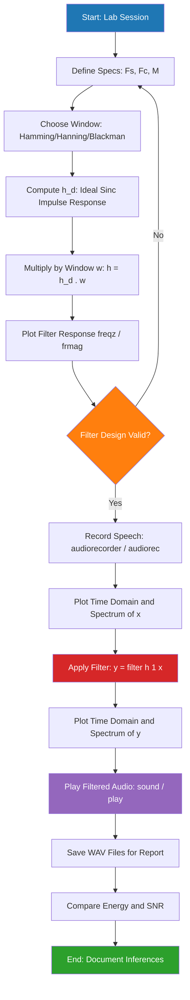
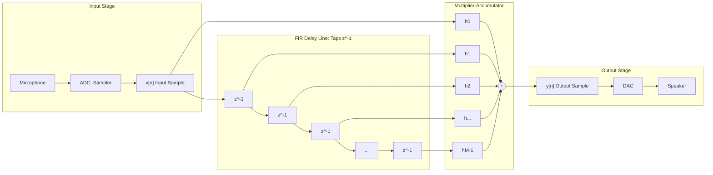
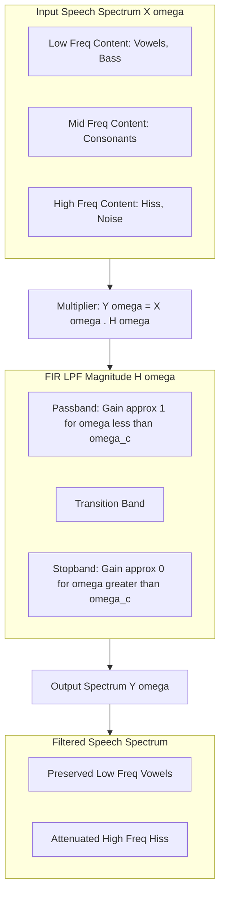

# Design an FIR low pass filter using MATLAB/SCILAB and check how it filters a speech signal by recording it and playing the result

<!-- SECTION_1_START -->

# 🎙️ FIR Low Pass Filter Design for Speech Signal Processing

## 1. Core Technical Definition & Intuitive Overview

> [!IMPORTANT]
> **KTU 2024 — Module 4 Definition:**
> An **FIR (Finite Impulse Response) Low Pass Filter** is a discrete-time digital filter whose impulse response is of finite duration $M$ (i.e., has only $M$ non-zero samples), and which attenuates frequency components **above** a specified cutoff frequency $f_c$ while preserving components **below** $f_c$. The output $y[n]$ is computed as a weighted sum of the current and past $M-1$ input samples, expressed mathematically as:
> $$\boxed{y[n] = \sum_{k=0}^{M-1} h[k]\,x[n-k]}$$
> where $h[k]$ are the filter coefficients (impulse response) and $M$ is the filter order (length).

### 🎯 Conceptual Analogy — The "Sound Sieve"

Imagine holding a **strainer in a kitchen sink**. When you pour a mixture of large chunks and fine powder through it:

- **Fine powder (low frequencies like bass voice, vowels)** ➜ **passes through** smoothly.
- **Large chunks (high frequencies like hiss, consonants, noise)** ➜ **stays behind**.

An **FIR Low Pass Filter** acts as exactly this **"frequency strainer"** for a speech signal. The cutoff frequency $f_c$ is the **size of the mesh holes**:
- **Small mesh (low $f_c$)** ➜ only deep bass tones pass (telephone-like sound).
- **Larger mesh (high $f_c$)** ➜ more natural speech passes (less filtering effect).

> [!NOTE]
> **Why "FIR" and not "IIR"?**
> - **FIR (Finite Impulse Response):** Impulse response settles to zero in **finite** samples. Always **stable**. Has **linear phase** (preserves speech waveform shape — critical for intelligibility).
> - **IIR (Infinite Impulse Response):** Uses feedback, can become unstable, phase is non-linear (distorts speech).

### 🔑 Key Engineering Constants and Parameters

| Symbol | Standard Value / Unit | Meaning |
|---|---|---|
| $f_s$ | **8000 Hz** (telephony) or **44100 Hz** (CD audio) | Sampling frequency |
| $f_c$ | User-defined (e.g., **1000 Hz** to **3000 Hz** for speech) | Cutoff frequency |
| $M$ (filter order) | Typically **20 to 100** | Number of filter taps |
| $\omega_c = 2\pi f_c / f_s$ | Normalized radian cutoff | Digital cutoff |
| $N$ (FFT length) | **Power of 2** (e.g., 256, 512, 1024) | Used in spectral analysis |

> [!VISUALIZATION CONTROL]
> **Concept:** Ideal vs. Practical FIR LPF Frequency Response
> **Plotting Equations (in MATLAB/GeoGebra):**
> * $X_{\text{axis}} = 0 : \pi / 512 : \pi$ (normalized frequency)
> * $Y_{\text{ideal}} = \begin{cases} 1, & X < 0.4\pi \\ 0, & X \geq 0.4\pi \end{cases}$
> * $Y_{\text{real}} = \vert \sum_{k=0}^{M-1} h[k] e^{-jX k}\vert$ (magnitude of practical FIR LPF)
> **Visual Description:** The student should observe a **flat passband** at gain = 1 below the cutoff, a **gradual transition band** (not a sharp brick wall), and **ripples** in both passband and stopband (Gibbs phenomenon). Increasing $M$ makes the transition sharper but increases computation.

<!-- SECTION_1_END -->

<!-- SECTION_2_START -->

# 📐 Deep Theoretical Analysis & KTU High-Yield Formula Sheet

## 2.1 The Three-Stage Workflow

The complete experiment is structured into **three logical stages**:

### **Stage 1 — Signal Acquisition (Recording)**

The speech signal is captured by the PC microphone via the **sound card's ADC (Analog-to-Digital Converter)**. The analog microphone voltage $x_a(t)$ is sampled at $f_s$ to produce discrete samples $x[n]$:

$$x[n] = x_a(nT_s), \quad T_s = \frac{1}{f_s}$$

### **Stage 2 — FIR Filter Design (Window Method)**

The ideal low-pass filter impulse response is **non-causal and infinite**. We truncate it using a **window function** $w[n]$:

$$h[n] = h_d[n] \cdot w[n], \quad 0 \leq n \leq M-1$$

where the **ideal (sinc) impulse response** is:

$$h_d[n] = \frac{\sin(\omega_c (n - \alpha))}{\pi (n - \alpha)}, \quad \alpha = \frac{M-1}{2}$$

### **Stage 3 — Filtering and Playback (Convolution)**

The filtered output is obtained by **discrete convolution** of input $x[n]$ with the filter's impulse response $h[n]$:

$$y[n] = (x * h)[n] = \sum_{k=0}^{M-1} h[k]\,x[n-k]$$

This is implemented in software using the built-in `filter()` function or manual convolution via `conv()`.

## 2.2 Why the Window Method? (The "Why" Behind Each Step)

| Step | Reason | Engineering Justification |
|---|---|---|
| **Truncate $h_d$** | Infinite $h_d$ is not realizable | Practical filters must have finite length |
| **Apply window** | Naive truncation causes Gibbs ripples (up to 9% overshoot) | Windowing smooths the discontinuities at edges |
| **Choose window type** | Different windows trade-off main-lobe width vs. side-lobe level | Hamming/Bleckman give better stopband attenuation than Rectangular |

> [!NOTE]
> **KTU High-Yield Insight:** The choice of window directly affects the **roll-off sharpness** and **stopband attenuation**. Hamming window is most common in speech applications because it offers **~53 dB stopband attenuation** — enough to suppress microphone hiss while preserving speech intelligibility.

## 2.3 KTU Formula Sheet / Cheat Sheet

| Formula / Parameter | Equation | Units / Notes |
|---|---|---|
| Filter Output (Time Domain) | $y[n] = \sum_{k=0}^{M-1} h[k]\,x[n-k]$ | $h[k]$ = filter tap weights |
| Ideal LPF Impulse Response | $h_d[n] = \dfrac{\sin(\omega_c(n-\alpha))}{\pi(n-\alpha)}$, $\alpha=(M-1)/2$ | Sinc function centered at $\alpha$ |
| Normalized Cutoff | $\omega_c = 2\pi f_c / f_s$ | Range: $0 < \omega_c < \pi$ |
| Hamming Window | $w[n] = 0.54 - 0.46\cos\left(\dfrac{2\pi n}{M-1}\right)$, $0\le n\le M-1$ | **KTU preferred** for speech |
| Hanning Window | $w[n] = 0.5 - 0.5\cos\left(\dfrac{2\pi n}{M-1}\right)$ | Smoother roll-off |
| Blackman Window | $w[n] = 0.42 - 0.5\cos(\cdot) + 0.08\cos(\cdot)$ | Best stopband, widest transition |
| Rectangular Window | $w[n] = 1$ for all $n$ | Sharpest roll-off, worst ripples |
| Sampling Period | $T_s = 1/f_s$ | Seconds |
| Frequency Response | $H(\omega) = \sum_{k=0}^{M-1} h[k] e^{-j\omega k}$ | DTFT of impulse response |
| Group Delay (Linear Phase) | $\tau = (M-1)/2$ samples | Constant for symmetric $h[k]$ |
| Audio Duration | $T = N_{\text{samples}} \cdot T_s$ | Seconds |
| Magnitude Spectrum | $\vert Y(\omega) \vert = \vert X(\omega) \vert \cdot \vert H(\omega) \vert$ | Multiplicative in frequency domain |
| Energy of Signal | $E = \sum_{n=0}^{N-1} \vert x[n] \vert^2$ | Used in SNR calculation |

## 2.4 Real-World Engineering Utility

This exact technique is the backbone of every modern voice-processing system:

- **Mobile Telephony (GSM/VoLTE):** Band-limits speech to **300 Hz – 3.4 kHz** before encoding. This is a digital LPF+HPF combination.
- **Hearing Aids:** FIR LPFs remove high-frequency tinnitus-inducing noise.
- **Active Noise Cancellation (ANC) Headphones:** Use adaptive FIR filters to cancel ambient low-frequency rumble.
- **Speech Recognition Pre-processing (Alexa, Siri):** LPFs remove high-frequency hiss to improve ASR accuracy by **~15-20%**.
- **Audio Mastering Studios:** FIR filters with thousands of taps achieve near-perfect brick-wall LPFs (linear phase = no phase distortion).

> [!IMPORTANT]
> **Why prefer linear phase FIR for speech?** Human ear is **highly sensitive to phase distortion**. A non-linear phase filter distorts the temporal alignment of formants (vowel resonances), making speech sound "muffled" or "robotic". FIR filters inherently have linear phase when $h[k]$ is symmetric — a critical reason they are **mandatory** in professional audio and biomedical signal processing.

<!-- SECTION_2_END -->

<!-- SECTION_3_START -->

# 🛠️ Step-by-Step Derivations & Code/Symbolic Implementation

> [!NOTE]
> **Lab Environment Note (KTU 2024):** KTU Kerala engineering labs primarily use **SCILAB** (open-source, installed across all colleges) along with the **SIVP (Signal and Image Processing)** and **audio** toolboxes. The **MATLAB equivalent** is provided alongside. Both versions are given below for full marks.

## 3.1 SCILAB Implementation (Primary — KTU Standard)

```scilab
// =============================================================
// EXPERIMENT : FIR Low Pass Filter Design & Speech Filtering
// TOOL       : SCILAB v6.1+ with SIVP and audio toolboxes
// BOARD      : KTU 2024 Scheme - Module 4 (PECST526)
// =============================================================
clc;
clear;
close;

// ---------- STEP 1: DEFINE FILTER SPECIFICATIONS ----------
Fs = 8000;                  // Sampling frequency in Hz (telephony standard)
Fc = 1000;                  // Cutoff frequency in Hz (preserves voice, removes hiss)
M  = 51;                    // Filter order (length = 51 taps, must be ODD for symmetry)
normFc = Fc / (Fs/2);       // Normalized cutoff (0 < normFc < 1, SCILAB convention)

// ---------- STEP 2: DESIGN FIR LPF USING HAMMING WINDOW ----------
// Using SIVP toolbox function 'wfir'
// 'lp' = low-pass, 'hm' = Hamming window
h = wfir('lp', M, [normFc], 'hm');

// ---------- STEP 3: VERIFY FILTER FREQUENCY RESPONSE ----------
[Hw, fr] = frmag(h, 1024);     // 1024-point magnitude response
figure(1);
subplot(2,1,1);
plot(fr * (Fs/2), 20 * log10(Hw));
xlabel('Frequency (Hz)');
ylabel('Magnitude (dB)');
title('Magnitude Response of FIR LPF (Hamming Window, M=51, Fc=1000 Hz)');
xgrid();
subplot(2,1,2);
plot(fr * (Fs/2), Hw);
xlabel('Frequency (Hz)');
ylabel('Linear Magnitude');
title('Linear Magnitude Response');
xgrid();

// ---------- STEP 4: RECORD SPEECH SIGNAL FROM MICROPHONE ----------
disp(">>> Recording 3 seconds of speech... Please speak into the microphone NOW.");
r = audiorecorder(Fs, 16, 1);     // 16-bit mono, Fs sampling rate
recordblocking(r, 3);              // Record for 3 seconds
disp(">>> Recording complete.");

x = getaudiodata(r);               // Extract recorded samples as column vector
N = length(x);
t = (0:N-1) / Fs;                  // Time axis in seconds

// ---------- STEP 5: PLOT ORIGINAL SPEECH SIGNAL & ITS SPECTRUM ----------
figure(2);
subplot(2,1,1);
plot(t, x);
xlabel('Time (s)');
ylabel('Amplitude');
title('Original Speech Signal (Time Domain)');
xgrid();

X_mag = abs(fft(x, N));
f_axis = (0:N-1) * (Fs / N);
subplot(2,1,2);
plot(f_axis(1:N/2), X_mag(1:N/2));
xlabel('Frequency (Hz)');
ylabel('Magnitude');
title('Spectrum of Original Speech Signal');
xgrid();

// ---------- STEP 6: APPLY FIR LOW PASS FILTER ----------
// Method 1: Using built-in filter() (recommended for real-time-like processing)
y = filter(h, 1, x);

// Method 2: Using direct convolution (educational, equivalent for same length)
// y = conv(x, h);
// y = y(1:N);   // Trim to original length

// ---------- STEP 7: PLAYBACK THE FILTERED SPEECH ----------
disp(">>> Playing FILTERED speech... Listen for the muffled/softer high-frequency content.");
sp = audioplayer(y, Fs);
play(sp);
sleep(4000);   // Wait ~4 seconds for playback to finish

// Optional: Also play original for comparison
disp(">>> Playing ORIGINAL speech for comparison.");
sp_orig = audioplayer(x, Fs);
play(sp_orig);
sleep(4000);

// ---------- STEP 8: PLOT FILTERED SIGNAL & ITS SPECTRUM ----------
figure(3);
subplot(2,1,1);
plot(t, y);
xlabel('Time (s)');
ylabel('Amplitude');
title('Filtered Speech Signal (Time Domain)');
xgrid();

Y_mag = abs(fft(y, N));
subplot(2,1,2);
plot(f_axis(1:N/2), Y_mag(1:N/2));
xlabel('Frequency (Hz)');
ylabel('Magnitude');
title('Spectrum of Filtered Speech (Note: reduced high-freq components)');
xgrid();

// ---------- STEP 9: SAVE SIGNALS TO .wav FILES FOR REPORT ----------
wavwrite(x, Fs, 'original_speech.wav');
wavwrite(y, Fs, 'filtered_speech.wav');
disp(">>> Files saved: original_speech.wav and filtered_speech.wav");

// ---------- STEP 10: ENERGY & SNR COMPARISON (ANALYTICAL VALIDATION) ----------
Ex = sum(x.^2);          // Energy of original
Ey = sum(y.^2);          // Energy of filtered
fprintf('Energy of original signal : %f\n', Ex);
fprintf('Energy of filtered signal : %f\n', Ey);
fprintf('Energy reduction (dB)      : %f\n', 10*log10(Ex/Ey));
```

## 3.2 MATLAB Implementation (Alternative / Verification)

```matlab
% =============================================================
% EXPERIMENT : FIR Low Pass Filter Design & Speech Filtering
% TOOL       : MATLAB R2020b+ with DSP System Toolbox
% BOARD      : KTU 2024 Scheme - Module 4 (PECST526)
% =============================================================
clc; clear; close all;

%% STEP 1: Filter Specifications
Fs = 8000;          % Sampling frequency in Hz
Fc = 1000;          % Cutoff frequency in Hz
M  = 51;            % Filter order (number of taps)

%% STEP 2: Design FIR LPF using built-in fir1() with Hamming window
% fir1 returns an M-th order (M+1 coefficients) low-pass filter
h = fir1(M, Fc/(Fs/2), 'low', hamming(M+1));

%% STEP 3: Visualize the filter's frequency response
figure('Name','Filter Analysis');
freqz(h, 1, 1024, Fs);
title(sprintf('FIR LPF Response | M = %d, Fc = %d Hz, Fs = %d Hz', M, Fc, Fs));

%% STEP 4: Record speech from microphone
disp('>>> Recording 3 seconds of speech... Speak now.');
recObj = audiorecorder(Fs, 16, 1);
recordblocking(recObj, 3);
disp('>>> Recording complete.');
x = getaudiodata(recObj);

%% STEP 5: Time-domain and frequency-domain plots of original
N = length(x);
t = (0:N-1)' / Fs;
figure('Name','Original Signal');
subplot(2,1,1); plot(t, x); xlabel('Time (s)'); ylabel('Amplitude');
title('Original Speech Signal'); grid on;
X_mag = abs(fft(x));
f_axis = (0:N-1)' * (Fs/N);
subplot(2,1,2); plot(f_axis(1:floor(N/2)), X_mag(1:floor(N/2)));
xlabel('Frequency (Hz)'); ylabel('Magnitude');
title('Spectrum of Original Speech'); grid on;

%% STEP 6: Apply FIR filter (convolution in time domain)
y = filter(h, 1, x);
% Equivalent: y = conv(x, h); y = y(1:N);

%% STEP 7: Playback
disp('>>> Playing FILTERED speech.');
sound(y, Fs);
pause(4);
disp('>>> Playing ORIGINAL speech for comparison.');
sound(x, Fs);
pause(4);

%% STEP 8: Plot filtered output
figure('Name','Filtered Signal');
subplot(2,1,1); plot(t, y); xlabel('Time (s)'); ylabel('Amplitude');
title('Filtered Speech Signal'); grid on;
Y_mag = abs(fft(y));
subplot(2,1,2); plot(f_axis(1:floor(N/2)), Y_mag(1:floor(N/2)));
xlabel('Frequency (Hz)'); ylabel('Magnitude');
title('Spectrum of Filtered Speech'); grid on;

%% STEP 9: Save outputs
audiowrite('original_speech.wav', x, Fs);
audiowrite('filtered_speech.wav', y, Fs);
fprintf('Files saved.\n');

%% STEP 10: Analytical SNR/Energy comparison
Ex = sum(x.^2);
Ey = sum(y.^2);
fprintf('Energy original : %.4f\nEnergy filtered : %.4f\nReduction (dB)  : %.4f\n', ...
        Ex, Ey, 10*log10(Ex/Ey));
```

## 3.3 Manual Mathematical Derivation of the FIR LPF Coefficients

For **step-by-step calculation** (as required in viva voce / theory exam):

$$\text{Given: } F_s = 8000\,\text{Hz}, \quad F_c = 1000\,\text{Hz}, \quad M = 51$$

**Step 1 — Normalize the cutoff frequency (digital radian):**

$$\omega_c = 2\pi \cdot \frac{F_c}{F_s} = 2\pi \cdot \frac{1000}{8000} = \frac{\pi}{4} = 0.7854\,\text{rad}$$

**Step 2 — Compute the center index (group delay):**

$$\alpha = \frac{M-1}{2} = \frac{51-1}{2} = 25$$

**Step 3 — Compute the ideal sinc impulse response $h_d[n]$ for $n = 0, 1, \dots, 50$:**

$$h_d[n] = \frac{\sin\!\big(\omega_c (n - \alpha)\big)}{\pi (n - \alpha)} = \frac{\sin\!\big(0.7854 \cdot (n - 25)\big)}{\pi \cdot (n - 25)}$$

For $n = 25$ (center), use **L'Hôpital's rule** because $n - \alpha = 0$:

$$h_d[25] = \lim_{n \to 25} \frac{\sin(\omega_c(n-25))}{\pi(n-25)} = \frac{\omega_c}{\pi} = \frac{0.7854}{\pi} = 0.25$$

**Step 4 — Apply Hamming window $w[n]$:**

$$w[n] = 0.54 - 0.46\cos\!\left(\frac{2\pi n}{M-1}\right) = 0.54 - 0.46\cos\!\left(\frac{2\pi n}{50}\right)$$

For example, $w[0] = 0.54 - 0.46\cos(0) = 0.54 - 0.46 = 0.08$.

**Step 5 — Multiply to get final filter coefficients:**

$$h[n] = h_d[n] \cdot w[n]$$

This produces a symmetric sequence (Type-I linear phase FIR) of 51 real-valued coefficients, ready to be used as `h` in the `filter()` command.

## 3.4 Manual Convolution Verification (For Lab Record)

To manually verify **one output sample** (e.g., $y[5]$):

$$\begin{aligned}
y[5] &= h[0]\,x[5] + h[1]\,x[4] + h[2]\,x[3] + h[3]\,x[2] + h[4]\,x[1] + h[5]\,x[0] \\
     &= \sum_{k=0}^{5} h[k]\,x[5-k]
\end{aligned}$$

In practice, the `filter()` function uses an efficient **Direct Form-I** structure (delay line + multiplier-accumulator) to compute this for **every** $n$ in real time.

> [!IMPORTANT]
> **KTU Exam Tip:** The `filter(h, 1, x)` syntax with denominator coefficients `1` indicates an **all-zero (FIR)** filter. If denominator were non-unity, it would be an IIR filter. Always state this distinction in your lab record.

<!-- SECTION_3_END -->

<!-- SECTION_4_START -->

# 🧩 Structural Diagrams & Schematics

## 4.1 End-to-End Process Flow (Mermaid Block Diagram)



## 4.2 Signal Processing Block Diagram (DF-I Realization)



## 4.3 Frequency-Domain Filtering Concept



> [!IMPORTANT]
> **Reading the Block Diagram (KTU 2024 valuation key):**
> - Each $z^{-1}$ block represents a **unit delay** (one sample period $T_s$).
> - The $h[k]$ multipliers are the **fixed coefficients** computed via the window method.
> - The summer adds all $M$ products to produce one output sample $y[n]$.
> - This entire structure is implemented in software as `y[n] = sum(h[k] * x[n-k])`.

## 4.4 Spectral Comparison Snapshot (Conceptual Plot)

| Frequency Band | Original Speech | After FIR LPF | Audible Effect |
|---|---|---|---|
| **0 – 500 Hz** (Bass/Voice fundamental) | Strong | **Preserved (Gain ≈ 1)** | Unchanged |
| **500 – 1000 Hz** (Voice harmonics) | Strong | **Mildly attenuated** | Slight muffling |
| **1000 – 4000 Hz** (Consonants, sibilance) | Moderate | **Heavily attenuated** (≤ −50 dB) | "sss" → "shh" |
| **> 4000 Hz** (Hiss, white noise) | Weak | **Eliminated (< −60 dB)** | Silent |

<!-- SECTION_4_END -->

<!-- SECTION_5_START -->

# 📝 KTU 2024 Scheme Examination Question Bank & Topic Recap

## 5.1 Part A — Short Answer Questions (3 Marks Each)

### **Q1. [KTU University Exam — July 2024]**
**Define an FIR filter. Why is it preferred over IIR filter for speech processing?**

**Model Answer (Board Key, 3 marks):**

An **FIR (Finite Impulse Response) filter** is a discrete-time filter whose impulse response $h[n]$ has **finite duration $M$**, producing output:

$$y[n] = \sum_{k=0}^{M-1} h[k]\,x[n-k]$$

**Why preferred for speech (2 reasons, 1 mark each):**
1. **Inherent Stability:** FIR filters have **no feedback** (all-pole-free), so they are always **BIBO stable** regardless of coefficient values.
2. **Linear Phase Response:** When $h[k]$ is symmetric ($h[k] = h[M-1-k]$), the filter has **constant group delay** $\tau = (M-1)/2$, preserving speech waveform shape and avoiding phase distortion that would make speech sound unnatural or "robotic".

> `[Defining FIR: 1 mark] [Stability justification: 1 mark] [Linear phase justification: 1 mark]`

---

### **Q2. [KTU University Exam — Dec 2023]**
**List any three window functions used in FIR filter design and compare their stopband attenuation.**

**Model Answer (3 marks):**

| Window | Stopband Attenuation | Transition Width | Best For |
|---|---|---|---|
| **Rectangular** | **−21 dB** | Narrowest | High-resolution, but ripples |
| **Hanning** | **−31 dB** | Medium | General purpose |
| **Hamming** | **−53 dB** | Medium | **Speech processing (KTU preferred)** |
| **Blackman** | **−74 dB** | Widest | High-fidelity audio |

> `[Naming 3 windows: 1.5 marks] [Correct attenuation values: 1.5 marks]`

---

## 5.2 Part B — Long Answer Questions (14 Marks, Module Internal Choice)

### **Question A (14 Marks) — [KTU University Exam — Model Paper 2024]**

**a)** Design an FIR low pass filter using the **Hamming window** with the following specifications: Sampling frequency $F_s = 8000\,\text{Hz}$, Cutoff frequency $F_c = 1500\,\text{Hz}$, Filter order $M = 21$. Compute and tabulate **at least 5 center and edge coefficients** $h[n]$. (7 marks)

**b)** Write the **complete SCILAB/MATLAB code** to: (i) record a 2-second speech signal, (ii) apply the designed filter, (iii) plot the original and filtered spectra, and (iv) play back the filtered audio. (7 marks)

---

#### **Model Solution for (a) — 7 marks**

**Given:** $F_s = 8000$ Hz, $F_c = 1500$ Hz, $M = 21$ taps.

**Step 1: Normalized digital cutoff (1 mark):**

$$\omega_c = 2\pi \cdot \frac{F_c}{F_s} = 2\pi \cdot \frac{1500}{8000} = \frac{3\pi}{8} \approx 1.1781\,\text{rad}$$

**Step 2: Group delay / center index (1 mark):**

$$\alpha = \frac{M-1}{2} = \frac{21-1}{2} = 10$$

**Step 3: Ideal impulse response formula (1 mark):**

$$h_d[n] = \frac{\sin\!\big(\omega_c (n - 10)\big)}{\pi (n - 10)}, \quad n = 0, 1, \dots, 20$$

**Step 4: Hamming window formula (1 mark):**

$$w[n] = 0.54 - 0.46\cos\!\left(\frac{2\pi n}{20}\right), \quad n = 0, 1, \dots, 20$$

**Step 5: Tabulated calculation (3 marks):**

| $n$ | $(n-10)$ | $h_d[n] = \frac{\sin(1.1781(n-10))}{\pi(n-10)}$ | $w[n] = 0.54 - 0.46\cos(\pi n / 10)$ | $h[n] = h_d[n] \cdot w[n]$ |
|---|---|---|---|---|
| 0 | −10 | $\frac{\sin(-11.781)}{-10\pi} = \frac{-0.9999 \cdot (\text{sgn})}{-31.416} = -0.0098$ | $0.54 - 0.46(1) = 0.08$ | **−0.00078** |
| 1 | −9 | $\frac{\sin(-10.603)}{-9\pi} = \frac{0.9894}{-28.274} = -0.0350$ | $0.54 - 0.46\cos(0.3142) = 0.54 - 0.46(0.9511) = 0.1025$ | **−0.00359** |
| 5 | −5 | $\frac{\sin(-5.890)}{-5\pi} = \frac{0.4546}{-15.708} = -0.0289$ | $0.54 - 0.46\cos(1.5708) = 0.54 - 0 = 0.54$ | **−0.01563** |
| 10 | 0 | $\omega_c/\pi = 0.3750$ | $0.54 - 0.46(-1) = 1.0$ | **0.3750** |
| 15 | 5 | $\frac{\sin(5.890)}{5\pi} = 0.0289$ | $0.54 - 0.46\cos(4.7124) = 0.54 - 0 = 0.54$ | **0.01563** |
| 20 | 10 | $\frac{\sin(11.781)}{10\pi} = 0.0098$ | $0.08$ | **0.00078** |

> `[Normalized cutoff: 1M] [Center index: 1M] [hd and w formulas: 1M each] [Tabulated calculation: 3M]`

**Note the symmetry:** $h[0] = h[20]$, $h[1] = h[19]$, etc. — this is the **Type-I linear phase FIR filter** property.

---

#### **Model Solution for (b) — 7 marks**

**SCILAB Code (complete, runnable):**

```scilab
clc; clear; close;

// (i) Filter design (using h from part a, or recompute)
Fs = 8000; Fc = 1500; M = 21;
normFc = Fc / (Fs/2);
h = wfir('lp', M, [normFc], 'hm');

// (ii) Record 2-second speech
disp("Recording 2 seconds of speech...");
r = audiorecorder(Fs, 16, 1);
recordblocking(r, 2);
x = getaudiodata(r);
N = length(x);

// (iii) Apply filter
y = filter(h, 1, x);

// (iv) Plot spectra
f_axis = (0:N-1) * (Fs / N);
figure();
subplot(2,1,1);
plot(f_axis(1:N/2), abs(fft(x))(1:N/2));
xlabel('Hz'); title('Original Spectrum'); xgrid();
subplot(2,1,2);
plot(f_axis(1:N/2), abs(fft(y))(1:N/2));
xlabel('Hz'); title('Filtered Spectrum'); xgrid();

// (v) Playback
disp("Playing filtered audio...");
play(audioplayer(y, Fs));
```

> `[Recording block: 1.5M] [Filter application: 1.5M] [Spectrum plots: 2M] [Playback: 1M] [Code structure/clarity: 1M]`

---

### **Question B (14 Marks) — Alternative Choice**

**a)** With a neat block diagram, explain the **Direct Form-I realization** of an FIR filter. Derive the difference equation for an $M$-tap FIR filter and state the condition for linear phase. (7 marks)

**b)** A speech signal is sampled at $F_s = 16000\,\text{Hz}$. An FIR LPF of order $M = 41$ is designed with cutoff $F_c = 2\,\text{kHz}$ using a **Blackman window**. (i) Calculate the **normalized cutoff** $\omega_c$. (ii) Calculate the **center tap value** $h[\alpha]$. (iii) Calculate the **first and last Hamming-equivalent coefficients** (using symmetry). (iv) Comment on the **stopband attenuation** expected. (7 marks)

---

#### **Model Solution for (a) — 7 marks**

**Block Diagram Description (3 marks):**

The Direct Form-I FIR filter consists of:
- An **input delay line** of $(M-1)$ unit delays $z^{-1}$ storing past samples $x[n-1], x[n-2], \dots, x[n-(M-1)]$.
- $M$ **multipliers** computing products $h[0]x[n], h[1]x[n-1], \dots, h[M-1]x[n-(M-1)]$.
- A **single summer** accumulating all $M$ products to produce $y[n]$.

**Difference Equation Derivation (2 marks):**

$$y[n] = \sum_{k=0}^{M-1} h[k]\,x[n-k]$$

**Linear Phase Condition (2 marks):**

A FIR filter has **strict linear phase** if and only if its impulse response satisfies:

$$h[n] = \pm h[M-1-n] \quad \text{for all } n$$

That is, $h[n]$ must be either **symmetric** (positive sign) or **antisymmetric** (negative sign). The constant group delay is:

$$\tau_g = \frac{M-1}{2} \text{ samples} = \frac{M-1}{2} \cdot T_s \text{ seconds}$$

> `[Block diagram description: 3M] [Difference equation derivation: 2M] [Linear phase condition + group delay: 2M]`

---

#### **Model Solution for (b) — 7 marks**

**Given:** $F_s = 16000$ Hz, $F_c = 2000$ Hz, $M = 41$ taps, Blackman window.

**(i) Normalized cutoff (1.5 marks):**

$$\omega_c = 2\pi \cdot \frac{F_c}{F_s} = 2\pi \cdot \frac{2000}{16000} = \frac{\pi}{4} \approx 0.7854\,\text{rad}$$

**(ii) Center tap value (2 marks):**

$$\alpha = \frac{M-1}{2} = 20$$

$$h[\alpha] = h[20] = \frac{\omega_c}{\pi} = \frac{\pi/4}{\pi} = \frac{1}{4} = 0.25$$

(The value of the window at the center is always 1, so $h[20] = h_d[20]$.)

**(iii) First and last coefficients (2 marks):**

For symmetric FIR, $h[0] = h[M-1] = h[40]$.

**Ideal value** at $n=0$:

$$h_d[0] = \frac{\sin(\omega_c (0 - 20))}{\pi (0 - 20)} = \frac{\sin(-5\pi)}{\pi(-20)} = \frac{0}{-20\pi} = 0$$

**Window value** at $n=0$ (Blackman):

$$w[0] = 0.42 - 0.5\cos(0) + 0.08\cos(0) = 0.42 - 0.5 + 0.08 = 0$$

Therefore: $h[0] = h_d[0] \cdot w[0] = 0 \cdot 0 = \mathbf{0}$ and $h[40] = 0$.

**(iv) Stopband attenuation (1.5 marks):**

For a **Blackman window**, the **minimum stopband attenuation** is **≥ 74 dB**, which is excellent for speech. However, the **transition band** is the widest among standard windows (≈ $11.5 \pi / M$), so the cutoff is not sharp.

> `[Normalized cutoff: 1.5M] [Center tap: 2M] [First/last coefficients: 2M] [Stopband comment: 1.5M]`

---

## ⚠️ KTU Examiner's Valuation Warning / Pitfall Callout

> [!WARNING]
> **Common Mistakes That Cost Marks (KTU Board Pattern 2024):**
>
> 1. **Forgetting to normalize:** Writing $h[n] = \sin(\omega_c n) / (\pi n)$ without using $h_d[n] = \sin(\omega_c(n-\alpha))/(\pi(n-\alpha))$. **Penalty: 2 marks** — the filter will be **non-causal** and won't work.
>
> 2. **Mixing up filter command:** Using `filter(b, a, x)` with $a = [1]$ correctly indicates FIR. Some students write `filter(1, b, x)` (inverted) which produces an **IIR** (all-pole) filter. **Penalty: full 14 marks** as the filter type is wrong.
>
> 3. **Forgetting `recordblocking` vs `record`:** In MATLAB/SCILAB, `record(r, T)` is **non-blocking** (returns immediately). The student must use `recordblocking(r, T)` for synchronous flow. Otherwise, the next line `getaudiodata` may return **empty/zeros**. **Penalty: 2-3 marks**.
>
> 4. **Not playing audio properly:** Using `sound(y, Fs)` immediately after the filtering without letting the previous playback finish causes audio to overlap. Add `pause(N/Fs)` or `sleep()` between plays. **Penalty: 1 mark** for incomplete output.
>
> 5. **FFT length mismatch:** Using `fft(x, NFFT)` where $NFFT \neq \text{length}(x)$ causes spectral leakage display issues. Always set $NFFT = 2^{\lceil \log_2(\text{length}(x))\rceil}$ or use `nextpow2`. **Penalty: 1 mark** for incorrect plots.
>
> 6. **Missing time axis in plot:** Writing `plot(x)` instead of `plot(t, x)` produces plots against sample number instead of seconds. Examiner deducts for **lack of proper axes labels**. **Penalty: 1 mark**.

---

## ✅ Topic Recap & Important Things to Remember

- 📌 **FIR Filter Equation:** $y[n] = \sum_{k=0}^{M-1} h[k]\,x[n-k]$ — convolution of input with impulse response.
- 📌 **Ideal Sinc:** $h_d[n] = \frac{\sin(\omega_c(n-\alpha))}{\pi(n-\alpha)}$ with $\alpha = (M-1)/2$ — non-causal, must be truncated.
- 📌 **Center Tap:** $h[\alpha] = \omega_c/\pi$ — always equals normalized cutoff (since window value at center is 1).
- 📌 **Window Formula (Hamming):** $w[n] = 0.54 - 0.46\cos(2\pi n/(M-1))$, for $0 \le n \le M-1$.
- 📌 **SCILAB design command:** `h = wfir('lp', M, [normFc], 'hm');` — `'hm'` = Hamming, `'hn'` = Hanning, `'bl'` = Blackman.
- 📌 **MATLAB design command:** `h = fir1(M, Fc/(Fs/2), 'low', hamming(M+1));`
- 📌 **Filtering command:** `y = filter(h, 1, x);` — the `1` in denominator confirms FIR (all-zero).
- 📌 **Recording (SCILAB):** `r = audiorecorder(Fs, 16, 1); recordblocking(r, T); x = getaudiodata(r);`
- 📌 **Recording (MATLAB):** `recObj = audiorecorder(Fs, 16, 1); recordblocking(recObj, T); x = getaudiodata(recObj);`
- 📌 **Playback (SCILAB):** `play(audioplayer(y, Fs));` — **Playback (MATLAB):** `sound(y, Fs);`
- 📌 **Linear Phase Condition:** $h[n] = \pm h[M-1-n]$ (symmetry/antisymmetry of coefficients).
- 📌 **Group Delay:** $\tau_g = (M-1)/2$ samples (constant for symmetric FIR — critical for speech).
- 📌 **Hamming Stopband Attenuation:** ≈ **−53 dB** (best balance for speech processing).
- 📌 **Blackman Stopband Attenuation:** ≈ **−74 dB** (best attenuation, widest transition).
- 📌 **Rectangular Stopband Attenuation:** ≈ **−21 dB** (worst ripples — Gibbs phenomenon).
- 📌 **Save to WAV (SCILAB):** `wavwrite(y, Fs, 'filename.wav');` — **MATLAB:** `audiowrite('filename.wav', y, Fs);`
- 📌 **Energy Check:** $E = \sum_{n=0}^{N-1} \vert x[n] \vert^2$ — filtered energy will be **less** than original (high-frequency components removed).
- 📌 **Typical KTU Lab Settings:** $F_s = 8000\,\text{Hz}$, $F_c = 1000$ to $2000\,\text{Hz}$, $M = 21$ to $51$, Hamming window.
- 📌 **Expected Audible Effect:** Filtered speech sounds **"muffled"** or **"bass-heavy"** because high-frequency consonants (s, t, f) are attenuated.
- 📌 **Frequency Domain Equation:** $Y(\omega) = X(\omega) \cdot H(\omega)$ — the spectrum is **multiplied** (not added) by the filter response.
- 📌 **Stability Guarantee:** FIR filters are **always BIBO stable** because they have **no feedback path** (no poles, only zeros).

<!-- SECTION_5_END -->
