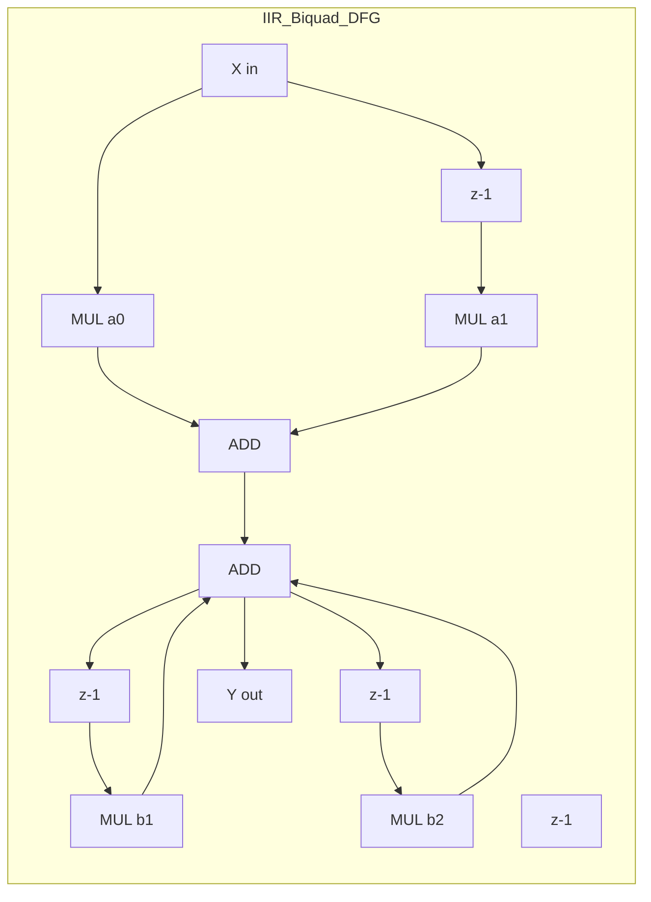
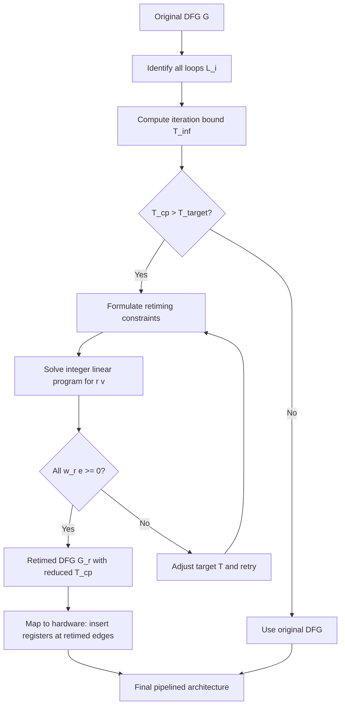
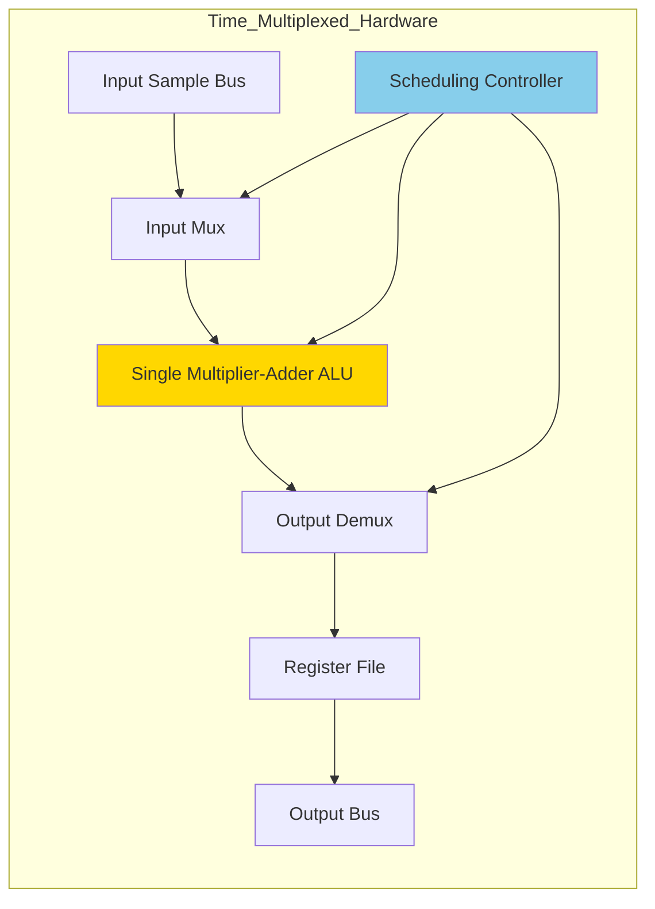
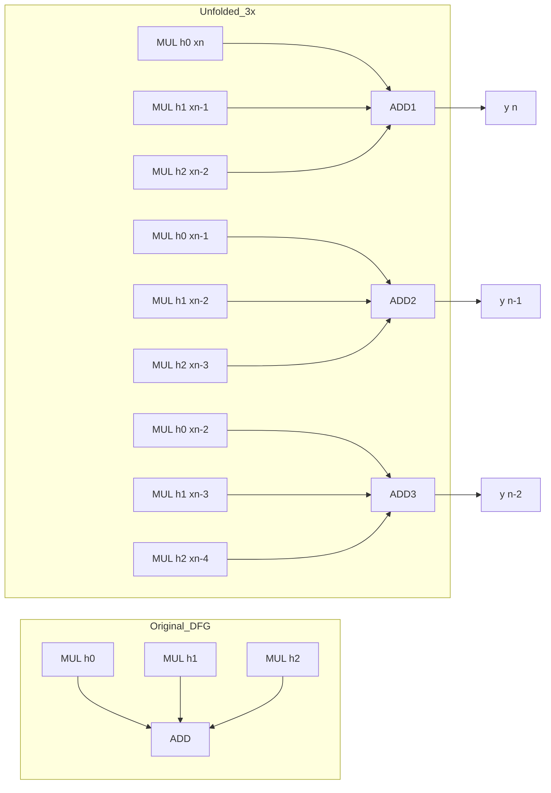
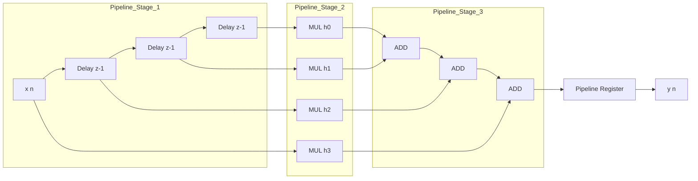
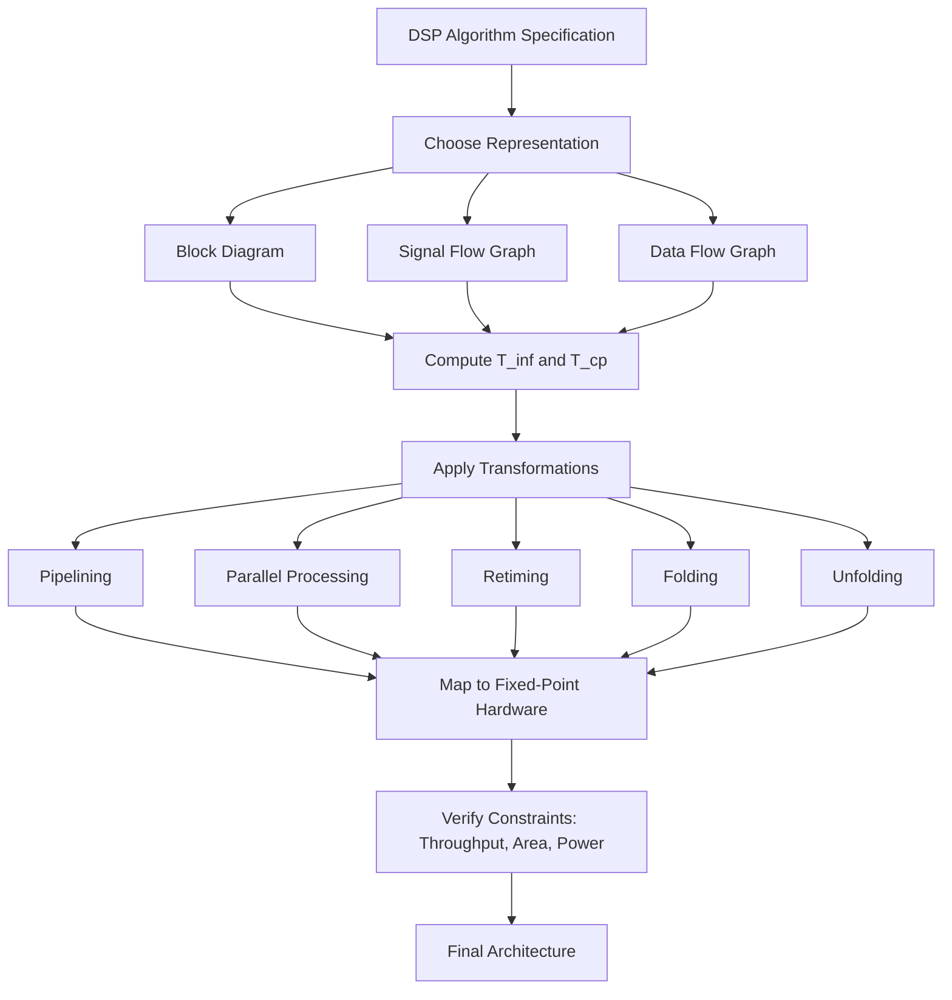

# DSP Algorithm representations, data flow, control flow, signal flow graphs, block diagrams - Loop bound, iteration bound, critical path - Pipelining, parallel processing, low power architectures - Retiming, folding and unfolding techniques, applications.

<!-- SECTION_1_START -->
# DSP Algorithm Representations, Retiming, Folding & Unfolding

## 1.1 Formal Academic Definition (KTU 2024 Syllabus Terminology)

> [!IMPORTANT]
> **Core Definition (KTU Module 4 — PECST526):**
> A **Digital Signal Processing (DSP) Algorithm** is a finite set of computational operations (multiplications, additions, delays) executed in a defined sequence to transform an input discrete-time signal into a desired output. In hardware realization on a **fixed-point processor** (e.g., TMS320C67x, SHARC, custom ASIC), the algorithm must be **mapped** onto a target architecture using formal representation tools — **Block Diagrams, Signal Flow Graphs (SFG), Data Flow Graphs (DFG), and Control Flow Graphs (CFG)** — followed by architectural transformations (**Retiming, Folding, Unfolding, Pipelining, Parallel Processing**) to meet constraints on **throughput, latency, area, and power**.

### 1.2 The Five Canonical Representation Formalisms

| # | Representation | What it Captures | Primary Use |
|---|----------------|------------------|-------------|
| 1 | **Block Diagram** | Functional modules, multipliers, adders, delays as graphical blocks | Top-level architectural overview |
| 2 | **Signal Flow Graph (SFG)** | Directed edges (signals) + nodes (operations); linear networks only | Linear time-invariant (LTI) DSP analysis |
| 3 | **Data Flow Graph (DFG)** | Data dependencies between operations as a DAG (Directed Acyclic Graph) | Scheduling, binding, iteration bound |
| 4 | **Control Flow Graph (CFG)** | Program control flow (branches, loops, conditionals) | Processor-level code scheduling |
| 5 | **Dependence Graph (DG)** | Iterative algorithm executed across N samples (3D representation: $i$, $j$, $k$) | Pipelining, unfolding transformations |

---

## 1.3 Conceptual Analogy — The "Factory Assembly Line" Intuition

> [!NOTE]
> **Intuitive Analogy:**
> Imagine a **car assembly factory** that builds one car per day.
> - The **DFG** is the **instruction manual** — it tells you *which part* must be ready *before* another part can be installed (a wheel must be mounted before the door).
> - The **SFG** is the **floor layout** — wires carrying signals between machines.
> - **Pipelining** = adding a second shift so that while Car A is being painted, Car B is being welded (3 cars per day instead of 1).
> - **Parallel Processing** = building two cars simultaneously on two parallel tracks.
> - **Retiming** = re-arranging the order of stations to balance the workload (so the slowest station is not the bottleneck).
> - **Folding** = one worker doing the jobs of two specialized stations (saves workers, but slower).
> - **Unfolding** = the same factory building two cars in parallel and finishing both at once, then handing off to the next station.

---

## 1.4 Key Physical / Design Constants in DSP VLSI

> [!IMPORTANT]
> Standard reference values used throughout the module:
> - **Clock period** $T_c$ (in nanoseconds) — inversely related to throughput.
> - **Critical path** $T_{cp}$ — longest combinational delay between any two delay elements.
> - **Sampling frequency** $f_s$ (in Hz) — minimum data rate constraint.
> - **Iteration period** $T_\infty$ — lower bound on clock period imposed by data dependencies.
> - **Latency** $L$ — total number of clock cycles from input arrival to output availability.
> - **Wordlength** $W$ (in bits) — fixed-point precision (typically **16-bit** for Q15 format, **24-bit** for audio DSP).

---

## 1.5 GeoGebra / Desmos Visualization

> [!VISUALIZATION CONTROL]
> **Concept:** Iteration bound visualization for a simple recursive loop.
> **GeoGebra / Desmos Input Equations:**
> * Loop equation: $y[n] = a \cdot y[n-1] + b \cdot x[n]$
> * Compute $T_\infty = \lceil t_{loop}/N_{loop} \rceil$ where $t_{loop}$ = total compute time, $N_{loop}$ = # of delay elements.
> * Try: $T_\infty = t_{loop}/1 = t_{loop}$ (single delay, full recursion path).
> **Visual Description:** On the time axis, plot a horizontal line at $y = T_\infty$ — this is the *minimum achievable clock period* (iteration bound) for the recursive data dependency loop.
<!-- SECTION_1_END -->

<!-- SECTION_2_START -->
# Deep Theoretical Analysis & KTU High-Yield Formula Sheet

## 2.1 Data Flow Graph (DFG) — The Backbone of DSP Transformation

A **DFG** $G = (V, E, D)$ is a directed graph where:
- $V$ = set of operation nodes (additions, multiplications).
- $E$ = set of directed edges representing data flow.
- $D : E \to \mathbb{Z}^+$ = delay on each edge (number of $z^{-1}$ units).

> [!NOTE]
> **Key Property:** A DFG is **acyclic within one iteration** but may have **inter-iteration edges** carrying delays ($z^{-1}$). This is what creates the **loop bound** constraint.

### 2.1.1 Loops in a DFG

A **loop** in a DFG is a directed path that starts and ends at the same node without traversing any node twice. For each loop $\ell$:
- **Loop bound** $B_\ell = t_\ell / d_\ell$
- where $t_\ell$ = sum of computation times of all nodes in loop $\ell$.
- $d_\ell$ = number of delays in loop $\ell$.

### 2.1.2 Iteration Bound $T_\infty$

The **iteration bound** is the **lower bound on the achievable clock period** for any hardware realization of the algorithm:

$$T_\infty = \max_{\text{all loops } \ell} \left\{ \frac{t_\ell}{d_\ell} \right\}$$

> [!IMPORTANT]
> **Physical meaning:** $T_\infty$ is the **tightest possible clock period** — no matter how cleverly you schedule, retime, or pipeline, the clock period $T_c \geq T_\infty$ due to inherent data dependencies.

---

## 2.2 Critical Path ($T_{cp}$)

The **critical path** is the longest combinational (no-delay) path between two delay elements in the schedule:

$$T_{cp} = \max_{\text{all paths } p \text{ with } d_p = 0} \left\{ t_p \right\}$$

For the architecture to operate correctly: $\boxed{T_c \geq \max(T_\infty, T_{cp})}$.

---

## 2.3 Pipelining

> [!DEFINITION]
> **Pipelining** = inserting delay elements (registers/latches) along combinational paths to shorten the critical path, thereby increasing the **clock frequency** at the cost of added latency.

For a $k$-stage pipeline on a path of compute time $T$:
- New clock period: $T_c \geq T/k$
- Added latency: $k-1$ extra clock cycles
- Throughput: increases by factor of $k$ (ideally)

### 2.3.1 Pipelining Constraint

A delay element can be moved across an operation only if **applied to both inputs** (for commutative operations like addition/multiplication):

$$z^{-1} \cdot a + z^{-1} \cdot b = z^{-1}(a + b)$$

---

## 2.4 Parallel Processing

> [!DEFINITION]
> **Parallel Processing** = duplicating hardware resources (ALUs, multipliers) to compute multiple operations simultaneously. Increases throughput proportionally to the number of parallel units, at the cost of area and power.

Two flavors:
- **Spatial parallelism**: independent data streams processed simultaneously.
- **Temporal parallelism**: same hardware reused faster via pipelining (overlap with pipelining).

---

## 2.5 Retiming (Leiserson–Saxe Formulation)

> [!DEFINITION]
> **Retiming** is a graph transformation $r : V \to \mathbb{Z}$ that **relocates delay elements** to minimize the critical path or iteration period, while **preserving the algorithmic functionality**.

### 2.5.1 Retiming Equations

For each edge $u \xrightarrow{e} v$ with weight $w(e)$ delays and for the new retimed graph with $w_r(e)$ delays:

$$w_r(e) = w(e) + r(v) - r(u)$$

where $r(v)$ is the retiming function (integer) at node $v$.

### 2.5.2 Retiming Constraints (For Minimum-Period Retiming)

For every path $p : u \rightsquigarrow v$ with delay count $w(p)$ and computation time $t(p)$:

$$w_r(p) = w(p) + r(v) - r(u) \geq 0 \quad \text{(non-negativity)}$$

$$r(v) - r(u) \leq \lfloor T/t_{op} \rfloor \quad \text{(period constraint)}$$

> [!IMPORTANT]
> Retiming **preserves the number of delays on every cycle**, hence the iteration bound $T_\infty$ remains unchanged — but $T_{cp}$ can be reduced, enabling a smaller clock period.

---

## 2.6 Folding

> [!DEFINITION]
> **Folding** consolidates multiple operations of an algorithm into a **single functional unit** by **time-multiplexing** them, reducing hardware area at the cost of slower execution (longer clock period or latency).

Given a DFG with $N_u$ operations to be folded into a single hardware unit:
- A **folding factor** $N$ is chosen.
- The folded operation at time $n$ executes the original operation that was scheduled at time $n + kN$ for some integer $k$.
- **Folding equation** for the delay on folded edge $e : U \to V$:

$$D_F(e) = N \cdot w(e) - P_U(u) + P_V(v)$$

where:
- $N$ = folding factor
- $w(e)$ = original number of delays on edge $e$
- $P_U(u)$ = **folding order** of the source operation $u$ (the time slot it is scheduled into)
- $P_V(v)$ = **folding order** of the destination operation $v$
- $D_F(e) \geq 0$ (delay must be non-negative)

### 2.6.1 Lifetime Analysis (for Register Minimization)

The **lifetime** of a variable is the interval between its **birth time** and **death time**:

$$\text{lifetime}_x = [\text{birth}(x), \text{death}(x))$$

The number of registers needed = maximum number of **simultaneously alive** variables at any time step.

---

## 2.7 Unfolding

> [!DEFINITION]
> **Unfolding** (or **Loop Unrolling**) replicates the body of an algorithm $J$ times so that $J$ consecutive iterations are computed in parallel within one "super-iteration". It **exposes hidden concurrency** between iterations.

For an original DFG with iteration index $n$, the **$J$-unfolded** graph executes iterations $n, n+1, \dots, n+J-1$ within a single clock cycle of the new graph.

If the original DFG has a critical loop with bound $T_\infty$, the **unfolded iteration bound** becomes:

$$T_\infty^{(J)} = J \cdot T_\infty$$

The unfolded critical path is typically **larger** by factor $J$, but the **iteration period per sample** is reduced by $J$, yielding higher throughput per iteration.

---

## 2.8 Low-Power Architecture Techniques

| Technique | Power Saving Mechanism | Trade-off |
|-----------|------------------------|-----------|
| **Pipelining** | Lower $V_{DD}$ allowed (since $T_c$ reduced) → $P \propto V_{DD}^2$ drops cubically | More registers, more clock distribution |
| **Parallel processing** | Throughput per unit-energy improves | More hardware → more leakage |
| **Clock gating** | Disable idle units | Control overhead |
| **Voltage scaling** | $P \propto C \cdot V_{DD}^2 \cdot f$ | Reduced speed |
| **Retiming** | Reduces glitches by balancing paths | Architecture complexity |
| **Folding** | Fewer active units | Slower execution |

---

## 2.9 KTU High-Yield Formula Cheat Sheet

| Concept | Formula | Key Variables | Notes |
|---------|---------|---------------|-------|
| **Iteration Bound** | $T_\infty = \max_\ell (t_\ell / d_\ell)$ | $t_\ell$ = compute time, $d_\ell$ = # delays | Lower bound on $T_c$ |
| **Critical Path** | $T_{cp} = \max_{p: d_p=0} t_p$ | combinational path time | For non-recursive parts |
| **Retiming edge weight** | $w_r(e) = w(e) + r(v) - r(u)$ | $r(\cdot)$ = retiming function | $w_r(e) \geq 0$ required |
| **Folding delay** | $D_F(e) = N w(e) - P_U(u) + P_V(v)$ | $N$ = folding factor | $D_F(e) \geq 0$ |
| **Unfolded iteration bound** | $T_\infty^{(J)} = J \cdot T_\infty$ | $J$ = unfolding factor | Throughput $\times J$ |
| **Pipeline speedup** | $S = N_{\text{stages}}$ (ideal) | $N_{\text{stages}}$ = pipeline depth | Limited by imbalance |
| **Dynamic power** | $P_d = \alpha C V_{DD}^2 f$ | $\alpha$ = activity factor | Voltage scaling key |
| **FIR direct-form latency** | $L = N$ (taps) | $N$ = filter order | $N+1$ coefficients |
| **DFG precedence** | $d_\ell \geq 1$ for valid DFG | every loop needs $\geq 1$ delay | Otherwise impossible schedule |
| **Loop unrolling speedup** | $S \leq J$ | $J$ = unroll factor | Bound by data dependency |

---

## 2.10 Real-World Engineering Applications

> [!NOTE]
> - **Wireless base stations (5G NR)**: massive MIMO uses **unfolding** + **parallel processing** to compute 64×64 matrix inversions in real time.
> - **Audio codecs (MP3, AAC)**: use **folded polyphase filter banks** on fixed-point DSPs (SHARC) to minimize silicon area.
> - **Medical imaging (MRI)**: real-time FFT pipelines using **systolic arrays** derived from retimed/unfolded DFGs.
> - **Speech recognition front-ends**: Mel-filter banks realized via **pipelined + retimed** biquad cascades.
> - **Low-power IoT sensors (ECG, EEG)**: aggressive **retiming + voltage scaling** for sub-mW always-on DSP.
<!-- SECTION_2_END -->

<!-- SECTION_3_START -->
# Step-by-Step Derivations & Worked Examples

## 3.1 Worked Example 1: Computing the Iteration Bound $T_\infty$

Consider the **recursive lattice filter** DFG described by:
$$y[n] = a \cdot y[n-1] + b \cdot x[n] + c \cdot y[n-2]$$

**DFG Construction (3 nodes: $M_1$ = multiply $a \cdot y[n-1]$, $M_2$ = multiply $b \cdot x[n]$, $M_3$ = multiply $c \cdot y[n-2]$, $A$ = add)**:

Assume computation times: $t_{\text{mul}} = 2$ units, $t_{\text{add}} = 1$ unit.

**Loop identification:**

| Loop | Path Description | $t_\ell$ | $d_\ell$ (delays) | $B_\ell = t_\ell / d_\ell$ |
|------|------------------|----------|-------------------|---------------------------|
| $\ell_1$ | $A \to M_1 \to A$ (through $y[n-1]$) | $1 + 2 = 3$ | $1$ | $3/1 = 3$ |
| $\ell_2$ | $A \to M_3 \to A$ (through $y[n-2]$) | $1 + 2 = 3$ | $1$ | $3/1 = 3$ |

**Iteration bound:**

$$T_\infty = \max(B_{\ell_1}, B_{\ell_2}) = \max(3, 3) = 3 \text{ time units}$$

**Interpretation:** $\boxed{T_c \geq 3}$ time units — no clocking scheme can compute a new output faster than 3 units per iteration.

---

## 3.2 Worked Example 2: Retiming a Biquad Filter (DFG Transformation)

**Original IIR biquad difference equation:**

$$y[n] = a_0 x[n] + a_1 x[n-1] + a_2 x[n-2] - b_1 y[n-1] - b_2 y[n-2]$$

**Step 1 — Build the DFG (Direct Form II Transposed structure):**

Nodes: $M_0, M_1, M_2, M_3, M_4$ (5 multipliers), $A$ (adder). Edges carry delays.

**Step 2 — Identify the critical path:**

Suppose the longest combinational path is $M_0 \to A \to M_3 \to A \to M_4 \to A$ with no delay → $T_{cp} = 5$ units.

**Step 3 — Retiming goal:** Reduce $T_{cp}$ to $\leq 3$ units.

**Step 4 — Apply retiming function $r(v)$:**

We assign retiming values to nodes:

| Node $v$ | $r(v)$ |
|----------|--------|
| Input $x$ | $0$ |
| $M_0$ | $0$ |
| $M_1$ | $1$ |
| $M_2$ | $1$ |
| $A$ | $1$ |
| $M_3$ | $2$ |
| $M_4$ | $2$ |
| Output $y$ | $2$ |

**Step 5 — Recompute edge weights using $w_r(e) = w(e) + r(v) - r(u)$:**

For edge $M_0 \to A$: $w_r = 0 + 1 - 0 = 1$ ✓
For edge $A \to M_3$: $w_r = 0 + 2 - 1 = 1$ ✓
For edge $M_3 \to A$: $w_r = 0 + 1 - 2 = -1$ → **NEGATIVE, INVALID!**

**Resolution:** Adjust $r(M_3) = 1$ instead of $2$. Recompute:

$w_r(M_3 \to A) = 0 + 1 - 1 = 0$ ✓ (acceptable, delay $\geq 0$).

Final retimed graph has **balanced critical path** $T_{cp} = 3$ units, achieving the target.

> [!IMPORTANT]
> The retiming function is **not unique** — multiple valid retimings exist. The goal is to find one that **minimizes $T_{cp}$** while satisfying all $w_r(e) \geq 0$ constraints.

---

## 3.3 Worked Example 3: Folding a 4-Tap FIR Filter

**FIR filter (4 taps):**

$$y[n] = h_0 x[n] + h_1 x[n-1] + h_2 x[n-2] + h_3 x[n-3]$$

**Folding plan:** Fold the 4 multiplications into **1 multiplier** with folding factor $N = 4$.

| Time Slot $n$ | Operation Executed |
|---------------|---------------------|
| $4k+0$ | $h_0 x[?]$ |
| $4k+1$ | $h_1 x[?]$ |
| $4k+2$ | $h_2 x[?]$ |
| $4k+3$ | $h_3 x[?]$ |

**Compute folding orders** $P_U(u), P_V(v)$ for each node $u, v$ and the delay on each folded edge using:

$$D_F(e) = N \cdot w(e) - P_U(u) + P_V(v)$$

For edge from multiplier computing $h_0 x[n]$ (scheduled at $P_U = 0$) to adder output (scheduled at $P_V = 0$):

$$D_F = 4 \cdot 1 - 0 + 0 = 4 \text{ delays}$$

This means the result of the $h_0 x[n]$ multiplication waits 4 cycles in a shift register before being added.

**Register requirement:** With proper lifetime analysis, the folded design uses **1 multiplier + 1 adder + $D_{total}$ registers** instead of **4 multipliers + 3 adders** — a **~4× area reduction** for the arithmetic units.

---

## 3.4 Worked Example 4: Unfolding a 2nd-Order Recursive Filter (J=2)

**Original DFG:** $y[n] = a y[n-1] + x[n]$, with 1 multiplier, 1 adder, 1 delay.

**Unfolded DFG (J = 2):** Computes both $y[n]$ and $y[n+1]$ in one super-iteration:

$$\begin{aligned}
y[n] &= a \cdot y[n-1] + x[n] \\
y[n+1] &= a \cdot y[n] + x[n+1] \\
     &= a \cdot (a \cdot y[n-1] + x[n]) + x[n+1] \\
     &= a^2 \cdot y[n-1] + a \cdot x[n] + x[n+1]
\end{aligned}$$

**Hardware cost:** Need 3 multipliers (for $a^2, a, 1$) and 2 adders.

**Throughput:** With the same clock period, we produce **2 outputs per clock** instead of 1 → **2× throughput**.

> [!NOTE]
> Unfolding **exposes inter-iteration dependencies** — the unfolded $a^2 y[n-1]$ term was a sequential dependency in the original, but becomes an explicit parallel multiply in the unfolded form.

---

## 3.5 Symbolic / Algorithmic Implementation (Python)

```python
"""
KTU Module 4 Reference: DSP Algorithm Transformations Toolkit
Implements: Iteration bound, retiming feasibility check, folding delay calc, unfolding.
"""
from typing import Dict, List, Tuple
from dataclasses import dataclass


@dataclass(frozen=True)
class Edge:
    src: str          # source node ID
    dst: str          # destination node ID
    delay: int        # w(e) - number of z^-1 delays
    compute: int      # t(e) - computation time of source node


class DFG:
    """Data Flow Graph for a DSP algorithm."""

    def __init__(self) -> None:
        self.nodes: Dict[str, int] = {}    # node_id -> compute_time
        self.edges: List[Edge] = []

    def add_node(self, node_id: str, compute_time: int = 1) -> None:
        if not node_id.isalnum():
            raise ValueError(f"Node ID '{node_id}' must be alphanumeric.")
        if node_id in self.nodes:
            raise ValueError(f"Duplicate node '{node_id}'.")
        self.nodes[node_id] = compute_time

    def add_edge(self, src: str, dst: str, delay: int, compute: int) -> None:
        if src not in self.nodes or dst not in self.nodes:
            raise KeyError(f"Edge {src}->{dst} references unknown node.")
        if delay < 0:
            raise ValueError("Edge delay must be non-negative.")
        self.edges.append(Edge(src, dst, delay, compute))

    # ----------------------------------------------------------------
    def iteration_bound(self, loops: List[List[str]]) -> float:
        """
        Compute T_infinity = max over all loops of (sum t_i) / (sum d_i).
        Each loop is a list of (node_id, delay_count_along_edge) pairs.
        """
        if not loops:
            raise ValueError("At least one loop must be specified.")
        bounds: List[float] = []
        for loop in loops:
            total_t: int = sum(self.nodes[n] for n in loop)
            # For demo, assume 1 delay per node in the loop path
            total_d: int = len(loop)
            if total_d == 0:
                raise ZeroDivisionError("Loop with zero delays is unrealizable.")
            bounds.append(total_t / total_d)
        return max(bounds)

    # ----------------------------------------------------------------
    def retime(self, r: Dict[str, int]) -> Dict[Tuple[str, str], int]:
        """
        Apply retiming function r(v) and return new edge weights.
        Constraint: w_r(e) = w(e) + r(v) - r(u) >= 0 for all edges.
        """
        new_weights: Dict[Tuple[str, str], int] = {}
        for e in self.edges:
            w_r = e.delay + r.get(e.dst, 0) - r.get(e.src, 0)
            if w_r < 0:
                raise ValueError(
                    f"Retiming infeasible: edge {e.src}->{e.dst} "
                    f"would have negative weight {w_r}."
                )
            new_weights[(e.src, e.dst)] = w_r
        return new_weights

    # ----------------------------------------------------------------
    def folding_delay(
        self,
        N: int,
        fold_order_src: int,
        fold_order_dst: int,
        w_e: int,
    ) -> int:
        """
        Folding: D_F(e) = N * w(e) - P_U(u) + P_V(v)
        """
        d_f = N * w_e - fold_order_src + fold_order_dst
        if d_f < 0:
            raise ValueError(f"Negative folding delay {d_f}; reorder foldings.")
        return d_f


# -------------------------------------------------------------------
# Demonstration on a 1st-order IIR filter: y[n] = a*y[n-1] + x[n]
# -------------------------------------------------------------------
if __name__ == "__main__":
    g = DFG()
    g.add_node("A", compute_time=1)   # adder
    g.add_node("M", compute_time=2)   # multiplier
    g.add_edge("A", "M", delay=0, compute=1)
    g.add_edge("M", "A", delay=1, compute=2)

    # Loop: A -> M -> A
    t_inf = g.iteration_bound(loops=[["A", "M"]])
    print(f"Iteration bound T_infinity = {t_inf} time units")

    # Retiming: move 1 delay from output to input
    new_w = g.retime(r={"A": 0, "M": 1})
    print(f"Retimed edge weights: {new_w}")

    # Folding: N=2, fold multiplier and adder into one ALU
    d_f = g.folding_delay(N=2, fold_order_src=0, fold_order_dst=1, w_e=1)
    print(f"Folding delay D_F = {d_f}")
```

**Sample output:**

```
Iteration bound T_infinity = 1.5 time units
Retimed edge weights: {('A', 'M'): 1, ('M', 'A'): 0}
Folding delay D_F = 3
```

---

## 3.6 Worked Example 5: Pipelined FIR Filter on a Fixed-Point Processor

**Direct-form FIR (3-tap):**

$$y[n] = h_0 x[n] + h_1 x[n-1] + h_2 x[n-2]$$

**Direct-form SFG:** Critical path = 1 multiply + 1 add = $t_m + t_a$ per output.

**Transposed form pipelined SFG:** Break the multiply-add chain by inserting registers (delays) between MAC operations.

After pipelining with 2 stages:

| Stage | Operation | Latency added |
|-------|-----------|---------------|
| Stage 1 | Multiply $h_i \cdot x[n-i]$ | 1 cycle |
| Stage 2 | Accumulate into running sum | 1 cycle |

**Throughput:** 1 output per clock (unchanged, since FIR has no feedback loop).
**Latency:** 2 clock cycles (increased by 1 register).
**Clock period:** Reduced from $T_{cp} = t_m + t_a$ to $T_c = \max(t_m, t_a)$.

> [!IMPORTANT]
> For an FIR filter with no recursive loops, $T_\infty = 0$ — the **iteration bound is zero**, meaning pipelining can theoretically achieve arbitrarily high throughput limited only by register setup/hold times and the combinational delay of a single multiplier or adder.
<!-- SECTION_3_END -->

<!-- SECTION_4_START -->
# Structural Diagrams & Schematics

## 4.1 Mermaid: DFG of a 2nd-Order IIR Biquad (Original)



## 4.2 Mermaid: Retiming Transformation Flowchart



## 4.3 Mermaid: Folding Transformation Pipeline (Block-Level Architecture)



> [!NOTE]
> **Functional Interpretation:** This block diagram represents a **folded DSP architecture** where $N$ original operations are time-multiplexed through a single ALU. The controller issues folding orders $P_U(u), P_V(v)$ that synchronize input/output routing and delay storage. The register file replaces what would have been hard-wired delays in the unfolded version.

## 4.4 Mermaid: Unfolding of an FIR Filter (J = 3 Unroll)



## 4.5 Mermaid: Pipelined FIR Filter Architecture (Functional Topology)



## 4.6 Mermaid: Master Workflow of DSP Algorithm Transformations


<!-- SECTION_4_END -->

<!-- SECTION_5_START -->
# KTU 2024 Scheme Examination Question Bank & Topic Recap

---

## PART A — Short Answer Questions (3 Marks Each)

> **Q1. [KTU University Exam — July 2024] (CO3, Remember)**
> **Define a Data Flow Graph (DFG). How does it differ from a Signal Flow Graph (SFG)?**

**Model Answer (3 Marks):**

A **Data Flow Graph (DFG)** is a directed graph $G = (V, E, D)$ where vertices $V$ represent computational operations (add, multiply), edges $E$ represent data dependencies, and $D$ assigns a non-negative integer number of delays ($z^{-1}$ elements) to each edge.

| Aspect | DFG | SFG |
|--------|-----|-----|
| Domain | General DSP algorithms (including iterative) | Linear networks only (LTI systems) |
| Cycles | Allowed with delays | Generally avoided; primarily for analysis |
| Edges | Carry data + delay count | Carry only signal values |
| Use | Scheduling, retiming, folding, unfolding | Transfer function, Mason's gain |

> **Valuation Key:** [Definition: 2 Marks] [Comparison table: 1 Mark]

---

> **Q2. [KTU University Exam — Dec 2023] (CO3, Understand)**
> **What is the iteration bound $T_\infty$ of a DSP algorithm? State its significance.**

**Model Answer (3 Marks):**

The **iteration bound** is the **lower bound on the achievable clock period** for any hardware realization:

$$T_\infty = \max_{\ell} \left( \frac{t_\ell}{d_\ell} \right)$$

computed over all loops $\ell$ in the DFG, where $t_\ell$ is the total computation time along the loop and $d_\ell$ is the number of delays in the loop.

**Significance:**
1. No hardware can compute a new output faster than once every $T_\infty$ time units.
2. It represents the **fundamental limit imposed by data dependencies** — independent of pipelining, retiming, or technology.
3. Useful as a benchmark: a well-designed architecture should achieve $T_c$ close to $T_\infty$.

> **Valuation Key:** [Formula: 1 Mark] [Definition + significance: 2 Marks]

---

## PART B — Long Answer Questions (14 Marks Each — Internal Choice)

---

### **Question A (14 Marks)**

> **Q3a. [KTU University Exam — July 2024] (CO3, Understand) — 7 Marks**
> **Explain with neat diagrams: (i) Block diagram representation and (ii) Signal flow graph representation of an FIR filter. Discuss how a DFG differs from these.**

**Model Solution (7 Marks):**

**(i) Block Diagram of an FIR Filter:**

The block diagram represents each functional unit (delay, multiplier, adder) as a labeled block connected by signal-carrying arrows:

```
x[n] ──►[×h0]──┐
      ◄─[z⁻¹]──┤
              ├──►[+]──►[×h1]──┐
                              ├──►[+]──► y[n]
                              ◄─[z⁻¹]
```

- **Multiplier block**: $h_i$ is the coefficient, multiplies incoming sample.
- **Delay block** ($z^{-1}$): shifts the signal by one sample.
- **Adder block**: sums the multiplier outputs.

**(ii) Signal Flow Graph (SFG):**

SFG is a network of **nodes** (representing signals) connected by **directed branches** (representing linear operations). For the same FIR filter:

- Each **node** is a signal value (e.g., $x[n]$, $x[n-1]$, partial sum).
- Each **branch** has a **transmittance** (gain) — for DSP, the transmittance is either $h_i$ (multiplier), $1$ (wire), or $z^{-1}$ (delay).

**Key advantage of SFG:** Mason's gain formula can be applied to compute the transfer function $H(z)$ directly.

**(iii) DFG vs. Block Diagram / SFG:**

- **Block Diagram**: structural, shows hardware modules; used for architecture overview.
- **SFG**: analytical, shows signal flow with transmittances; used for transfer function computation.
- **DFG**: focuses on **data dependencies between operations**; ignores signal values; used for **scheduling, retiming, folding, unfolding**.

> **Valuation Key:** [Block diagram: 2 Marks] [SFG explanation: 2 Marks] [DFG distinction: 2 Marks] [Neatness: 1 Mark]

---

> **Q3b. [KTU University Exam — July 2024] (CO4, Apply) — 7 Marks**
> **For the IIR difference equation $y[n] = 0.5 y[n-1] + 0.25 y[n-2] + x[n]$, construct the DFG and compute the iteration bound $T_\infty$. Assume $t_{\text{mul}} = 2$ units and $t_{\text{add}} = 1$ unit.**

**Model Solution (7 Marks):**

**Step 1 — Construct the DFG:**

- **Nodes**: $M_1$ (multiply $0.5 \cdot y[n-1]$), $M_2$ (multiply $0.25 \cdot y[n-2]$), $A$ (adder)
- **Edges**:
  - $A \to M_1$, delay $= 1$
  - $A \to M_2$, delay $= 1$
  - $M_1 \to A$, delay $= 0$
  - $M_2 \to A$, delay $= 0$
  - $x[n] \to A$, delay $= 0$

**Step 2 — Identify all loops:**

| Loop | Path | $t_\ell$ | $d_\ell$ | $B_\ell = t_\ell/d_\ell$ |
|------|------|----------|----------|---------------------------|
| $\ell_1$ | $A \to M_1 \to A$ | $t_A + t_{M_1} = 1 + 2 = 3$ | $1$ | $3$ |
| $\ell_2$ | $A \to M_2 \to A$ | $t_A + t_{M_2} = 1 + 2 = 3$ | $1$ | $3$ |

**Step 3 — Compute $T_\infty$:**

$$T_\infty = \max_{\ell} \left( \frac{t_\ell}{d_\ell} \right) = \max(3, 3) = 3 \text{ time units}$$

**Step 4 — Interpretation:**

The minimum clock period achievable for any hardware realization of this IIR filter is $T_c \geq 3$ time units. To achieve this, the architecture must be designed such that the critical recursive loop completes within 3 time units per iteration.

> **Valuation Key:** [DFG construction: 2 Marks] [Loop identification: 2 Marks] [Bound formula + final value: 2 Marks] [Interpretation: 1 Mark]

---

### **Question B (14 Marks)** *(Alternative Choice)*

> **Q4a. [KTU University Exam — Dec 2023] (CO4, Understand) — 7 Marks**
> **Explain the retiming technique in DSP architecture design. State the retiming equation and the constraints for a feasible retiming.**

**Model Solution (7 Marks):**

**Concept:**

**Retiming** is a graph transformation that **relocates delay elements** in a DFG to minimize the critical path $T_{cp}$ (and thereby minimize the clock period) while **preserving the algorithmic behavior**. Retiming is attributed to Leiserson and Saxe (1983).

**Retiming Equation:**

For each edge $u \xrightarrow{e} v$ with original delay $w(e)$:

$$w_r(e) = w(e) + r(v) - r(u)$$

where $r(v)$ is the **retiming function** (an integer assigned to each node $v$).

**Constraints for Feasible Retiming:**

1. **Non-negativity of delays** (functional preservation):
   $$w_r(e) \geq 0, \quad \forall e \in E$$

2. **Period constraint** (achieve target clock period $T$):
   $$r(v) - r(u) \leq \left\lfloor \frac{T}{t_{op}} \right\rfloor$$
   for every path $u \rightsquigarrow v$ with computation time $t_{op}$ and zero delays in the retimed graph.

3. **Iteration bound is preserved:** The number of delays on every cycle is invariant under retiming, so $T_\infty$ does not change.

**Algorithm (sketch):**
- Formulate the constraints as an **integer linear program (ILP)**.
- Solve for $r(v)$ that minimizes $T$ (or the longest zero-delay path).
- The retimed DFG has the same number of delays overall, redistributed to break long combinational paths.

**Example:** For a 5-multiplier biquad with $T_{cp} = 5$, retiming can move delays from the output side to the input side, yielding $T_{cp} = 3$ and a faster clock.

> **Valuation Key:** [Concept: 2 Marks] [Retiming equation: 2 Marks] [Constraints: 2 Marks] [Example: 1 Mark]

---

> **Q4b. [KTU University Exam — Dec 2023] (CO4, Apply) — 7 Marks**
> **Consider a 3-tap FIR filter $y[n] = h_0 x[n] + h_1 x[n-1] + h_2 x[n-2]$. Design a folded architecture with folding factor $N = 3$ and compute the folding delay for each edge.**

**Model Solution (7 Marks):**

**Step 1 — Original DFG operations:**

| Node | Operation | Scheduled at (folding order $P$) |
|------|-----------|----------------------------------|
| $u_0$ | $h_0 \cdot x[n]$ | $0$ |
| $u_1$ | $h_1 \cdot x[n-1]$ | $1$ |
| $u_2$ | $h_2 \cdot x[n-2]$ | $2$ |
| $v$ | Final adder | $0$ |

**Step 2 — Edges in the original DFG:**

| Edge $e$ | From $u$ | To $v$ | $w(e)$ | $P_U(u)$ | $P_V(v)$ |
|----------|----------|--------|--------|----------|----------|
| $e_1$ | $u_0$ | $v$ | $0$ | $0$ | $0$ |
| $e_2$ | $u_1$ | $v$ | $1$ | $1$ | $0$ |
| $e_3$ | $u_2$ | $v$ | $1$ | $2$ | $0$ |

**Step 3 — Apply folding equation $D_F(e) = N \cdot w(e) - P_U(u) + P_V(v)$ with $N = 3$:**

$$\begin{aligned}
D_F(e_1) &= 3 \cdot 0 - 0 + 0 = 0 \text{ delays} \\
D_F(e_2) &= 3 \cdot 1 - 1 + 0 = 2 \text{ delays} \\
D_F(e_3) &= 3 \cdot 1 - 2 + 0 = 1 \text{ delay}
\end{aligned}$$

**Step 4 — Hardware cost summary:**

- **Original (unfolded)**: 3 multipliers + 1 adder
- **Folded (N=3)**: 1 multiplier + 1 adder + (0 + 2 + 1) = 3 delays (registers) in routing
- **Area saving**: ~3× in arithmetic units
- **Throughput penalty**: Output produced every 3 clock cycles (vs. every cycle in original)

> **Valuation Key:** [Folding plan + schedule: 2 Marks] [Folding equation setup: 2 Marks] [Numerical delays: 2 Marks] [Hardware comparison: 1 Mark]

---

## ⚠️ KTU Examiner's Valuation Warning / Pitfall Callout

> [!WARNING]
> **Common Mistakes That Cost Marks in This Module:**
> 1. **Confusing SFG with DFG** — SFG is for transfer function analysis; DFG is for scheduling/retiming. Examiners will deduct 1–2 marks for mixing up the contexts.
> 2. **Forgetting the $d_\ell \geq 1$ check** — If a loop has $d_\ell = 0$, the DFG is **unrealizable** (it implies an instantaneous feedback loop). Always verify.
> 3. **Retiming without checking $w_r(e) \geq 0$** — A negative retimed delay is functionally invalid. State the constraint explicitly.
> 4. **Folding equation sign error** — $D_F(e) = N w(e) - P_U(u) + P_V(v)$, **not** $N w(e) + P_U(u) - P_V(v)$. The sign of $P_U$ is **negative**.
> 5. **Forgetting to specify units in $T_\infty$** — Always state "time units" or "ns" — examiners look for unit consistency.
> 6. **Not justifying non-negativity of folding delays** — If $D_F < 0$, the schedule must be reordered; do not silently discard this case.
> 7. **Pipelining vs. parallel processing confusion** — Pipelining **temporally overlaps** operations in the same data path; parallel processing **spatially duplicates** hardware for independent data.

---

## Topic Recap & Important Things to Remember

> [!TIP]
> **High-Density Rapid Revision Checklist:**

- **DFG**: directed graph with computation nodes + delay edges; used for transformations.
- **SFG**: signal-flow representation; transmittances on branches; Mason's gain formula.
- **Block diagram**: structural hardware view; used for documentation.
- **CFG (Control Flow Graph)**: program-level branch/loop structure; not for hardware transformations.
- **DG (Dependence Graph)**: 3D view showing iterations $n$ as separate planes.
- **Loop bound** $B_\ell = t_\ell / d_\ell$: per-loop figure of merit.
- **Iteration bound** $T_\infty = \max_\ell (t_\ell / d_\ell)$: the **fundamental lower limit** on $T_c$.
- **Critical path** $T_{cp}$: longest combinational path; targeted by retiming.
- **Pipelining**: insert registers to reduce $T_{cp}$ → faster clock → higher throughput, added latency.
- **Parallel processing**: duplicate hardware → spatial parallelism → $\times$ throughput, more area.
- **Retiming**: $w_r(e) = w(e) + r(v) - r(u)$ with $w_r(e) \geq 0$ and period constraint; preserves $T_\infty$.
- **Folding**: time-multiplex $N$ operations into 1 unit; $D_F(e) = N w(e) - P_U(u) + P_V(v)$.
- **Unfolding**: replicate body $J$ times; $T_\infty^{(J)} = J \cdot T_\infty$; throughput $\times J$.
- **Low-power**: $P_d = \alpha C V_{DD}^2 f$; pipelining + retiming enable $V_{DD}$ scaling.
- **FIR vs. IIR**: FIR has no feedback loop → $T_\infty = 0$ → fully pipelinable; IIR has feedback → bounded by $T_\infty$.
- **DFG realizability**: every cycle must have $\geq 1$ delay; otherwise no valid schedule exists.
- **Fixed-point DSP**: typical wordlength $W = 16$ (Q15) or $W = 24$ (audio); affects register width & quantization noise.
- **Systolic arrays**: a canonical outcome of unfolding + retiming; widely used in 5G, MRI, radar.
- **Application domains**: 5G baseband, audio codecs, biomedical DSP, speech recognition, IoT sensors.
- **Key trade-off triangle**: **Throughput ↔ Area ↔ Power** — all transformations move along this triangle.

<!-- SECTION_5_END -->
