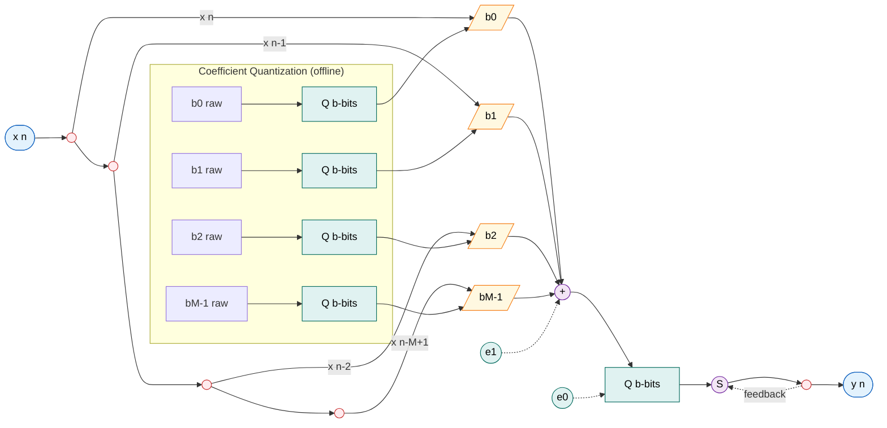
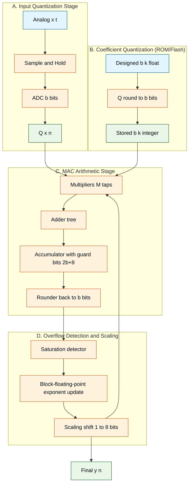
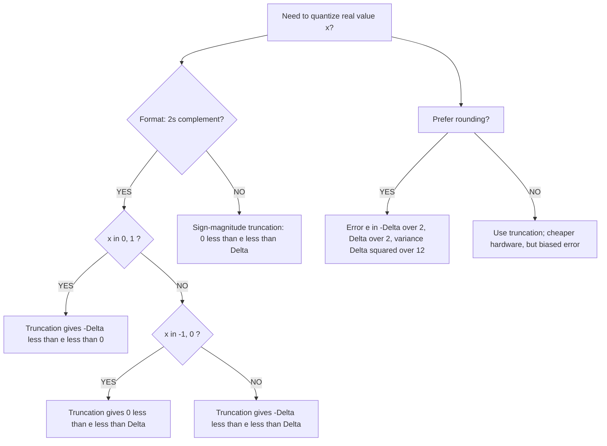

# FFT and FIR Filter realization on a fixed point processor -finite wordlength effects - Qu antization, rounding and truncation, overflow and scaling

<!-- SECTION_1_START -->
# FFT & FIR Filter Realization on a Fixed-Point Processor
## Module 4 — Finite Word-Length Effects, Quantization, Rounding, Truncation, Overflow & Scaling

---

### 1.1 Core Technical Definition (KTU 2024 Syllabus Aligned)

> [!IMPORTANT]
> **Fixed-Point Processor:** A digital signal processing arithmetic unit that represents every numerical sample using a **finite, fixed number of bits** (e.g., **16-bit**, **24-bit**, or **32-bit** integer format), where the binary point position is **static** (e.g., Q15 format → 1 sign bit + 15 fractional bits). All arithmetic is performed on integers with an implicit scaling factor $2^{-15}$.

> [!IMPORTANT]
> **Finite Word-Length Effect (FWLE):** The cumulative deviation between the theoretical continuous-amplitude (infinite-precision) behavior of a digital system and its actual discrete-amplitude (finite-precision) hardware implementation. FWLE manifests in three forms: **input quantization (A/D)**, **coefficient quantization**, and **arithmetic round-off** (in MAC units, multipliers, adders).

> [!IMPORTANT]
> **Fast Fourier Transform (FFT):** An algorithm class that computes the Discrete Fourier Transform of length $N$ in $\mathcal{O}(N \log_2 N)$ arithmetic operations (vs. $\mathcal{O}(N^2)$ for the DFT), exploiting the **symmetry** $W_N^{k+N/2} = -W_N^k$ and **periodicity** $W_N^{k+N} = W_N^k$ of the twiddle factor $W_N = e^{-j2\pi/N}$.

> [!IMPORTANT]
> **FIR Filter Realization:** The mapping of the theoretical difference equation $y[n] = \sum_{k=0}^{M-1} b_k x[n-k]$ onto a specific hardware topology — **Direct Form, Cascade (Second-Order Sections), Lattice, or Frequency Sampling** — each imposing a distinct word-length burden on registers and accumulators.

---

### 1.2 Intuitive Analogies

> [!NOTE]
> **Analogy 1 — Fixed-Point as a Ruler:** Imagine measuring the length of a football field using a **wooden ruler marked only in whole centimeters**. A blade of grass ($\sim$ 0.1 cm) is too small to register — it gets "rounded" to 0 cm. A fixed-point processor behaves identically: signals smaller than $2^{-b}$ (where $b$ = fractional bits) are irreversibly lost to **quantization noise**. Adding more fractional bits is like using a ruler marked in millimeters — finer resolution, lower noise.

> [!NOTE]
> **Analogy 2 — FFT as a Recursive Tournament:** A direct DFT computation of $N = 8$ points requires comparing every input with every frequency basis vector ($8 \times 8 = 64$ multiplications). The FFT is like a **single-elimination tournament**: it first computes 4-point mini-DFTs, then 2-point, then 1-point, halving the work at every stage — yielding only $8 \log_2 8 = 24$ multiplications. A 75% reduction in effort.

> [!NOTE]
> **Analogy 3 — Overflow as a Bucket:** A 16-bit signed register can hold values in $[-32768, +32767]$. Adding two positive numbers whose true sum is $+40000$ is like pouring water into a bucket already 95% full — it **spills over** and either *wraps around* (modulo $2^{16}$, producing a large negative value) or *saturates* (clamps to $+32767$). Both are catastrophic; **scaling** is the engineering art of pre-shrinking signals so they never fill the bucket completely.

---

### 1.3 Standard Numerical Constants Used Throughout DSP

| Symbol | Value / Definition |
| :--- | :--- |
| $W_N$ | Twiddle factor $= e^{-j2\pi/N}$ |
| $\Delta$ | Quantization step $= 2^{-(b-1)}$ for Q-format |
| $b$ | Total word length in bits |
| $Q_m$ | Number format with $m$ fractional bits |
| $b_{int}$ | Number of integer/guard bits |
| $\sigma_e^2$ | Variance of quantization noise |
| $2\pi$ | $6.283185307\ldots$ |

---

### 1.4 Visualization Cue

> [!VISUALIZATION CONTROL]
> **Concept:** Butterfly Operation of DIT Radix-2 FFT
> **GeoGebra / Desmos Input Equations (Complex plane):**
> * Point A = $(1, 0)$  → input $x[0]$ tip
> * Point B = $(0.707, -0.707)$ → $W_4^1 = e^{-j\pi/2}$ tip
> * Point C = $(0, -1)$ → $W_4^2 = -1$ tip
> * Vector additions: $A + B$, $A - B$
> **Visual Description:** Two arrows (input samples) enter a node, are scaled by twiddle factors, and emerge as symmetric sum/difference arrows — the "butterfly." On the complex plane, the twiddles rotate around the origin, and the butterflies form a recursive lattice.

---
<!-- SECTION_1_END -->

<!-- SECTION_2_START -->
# Deep Theoretical Analysis & KTU High-Yield Formula Sheet

---

## 2.1 The DFT and Its FFT Decomposition

The $N$-point DFT of $x[n]$ is defined as

$$
X[k] = \sum_{n=0}^{N-1} x[n]\, W_N^{kn}, \qquad W_N = e^{-j2\pi/N}
$$

Using the **index-splitting technique** for Decimation-In-Time (DIT), we write $n = 2r$ (even) and $n = 2r+1$ (odd), separating the $N$-point DFT into two $N/2$-point sub-DFTs:

$$
X[k] = \underbrace{\sum_{r=0}^{N/2-1} x[2r]\, W_{N/2}^{kr}}_{G[k] \;\text{(even part)}} \;+\; W_N^k \underbrace{\sum_{r=0}^{N/2-1} x[2r+1]\, W_{N/2}^{kr}}_{H[k] \;\text{(odd part)}}
$$

- $G[k]$ → $N/2$-point DFT of even-indexed samples.
- $H[k]$ → $N/2$-point DFT of odd-indexed samples.
- The factor $W_N^k$ is the **twiddle factor** that bridges the two halves.

Because of periodicity ($W_{N/2}^{k+N/2} = W_{N/2}^{k}$), $G[k]$ and $H[k]$ are periodic with period $N/2$, so the upper-half outputs are obtained as

$$
X[k+N/2] = G[k] - W_N^k\, H[k], \qquad k = 0, 1, \dots, N/2 - 1
$$

This yields the **canonical butterfly**:

$$
\boxed{
\begin{aligned}
X[k] &= G[k] + W_N^k\, H[k] \\
X[k+N/2] &= G[k] - W_N^k\, H[k]
\end{aligned}}
$$

---

## 2.2 FIR Filter Realization Structures

| Structure | Difference Equation Form | Hardware Multipliers | Word-Length Sensitivity |
| :--- | :--- | :--- | :--- |
| **Direct Form** | $y[n] = \sum b_k x[n-k]$ | $M$ (parallel) | High (coefficient sensitivity grows with order) |
| **Cascade (SOS)** | $\prod_{k=1}^{N_s} (b_{0k} + b_{1k}z^{-1} + b_{2k}z^{-2})$ | 3 per section | Low (well-conditioned) |
| **Lattice** | Recursive reflection coefficients $K_m$ | $m+1$ per stage | Very low (orthogonal) |
| **Frequency Sampling** | $H(z) = \sum_{k=0}^{N-1} H[k]\, \frac{1 - z^{-N}}{N(1 - W_N^{-k} z^{-1})}$ | $N$ | High (resonator pole placement critical) |

---

## 2.3 Number Representation in Fixed-Point DSP

| Format | Range (b-bit) | Step Size | Use Case |
| :--- | :--- | :--- | :--- |
| **Sign-Magnitude** | $[-(2^{b-1}-1)\cdot 2^m,\; +(2^{b-1}-1)\cdot 2^m]$ | $2^m$ | Rare (two zero representations) |
| **1's Complement** | $[-2^{b-1}\cdot 2^m,\; 2^{b-1}\cdot 2^m - 2^m]$ | $2^m$ | Historical |
| **2's Complement** | $[-2^{b-1}\cdot 2^m,\; 2^{b-1}\cdot 2^m - 2^m]$ | $2^m$ | **Universal standard** |

> The $b$-bit 2's complement integer $Q_b$ format value of bit pattern $B$ is
> $$ \mathrm{val}(B) = -B_{b-1} \cdot 2^{b-1} + \sum_{i=0}^{b-2} B_i \cdot 2^{i-m} \quad \text{for} \; Q_{b,m} \;\text{format} $$

---

## 2.4 Quantization Error Model

A real value $x$ quantized to $b$ bits produces a quantized value $Q(x)$ and error

$$
e = Q(x) - x
$$

### Rounding (Convergent Quantization)
$$ -\frac{\Delta}{2} < e \le \frac{\Delta}{2}, \quad \Delta = 2^{-(b-1)} $$
$$ \sigma_e^2 = \frac{\Delta^2}{12} = \frac{2^{-2(b-1)}}{12} = \frac{1}{12 \cdot 2^{2b-2}} $$

### Truncation
| Format | Range of $e$ | $\sigma_e^2$ |
| :--- | :--- | :--- |
| 2's complement, positive $x$ | $-\Delta < e \le 0$ | $\Delta^2 / 12$ |
| 2's complement, negative $x$ | $0 \le e < \Delta$ | $\Delta^2 / 12$ |
| 2's complement (any sign) | $-\Delta < e < \Delta$ | $\Delta^2 / 12$ |
| Sign-magnitude (any sign) | $-\Delta < e \le \Delta$ | $\Delta^2 / 12$ |

> The variance is **identical** across all formats and equals $\Delta^2/12$ under the uniform white-noise assumption.

---

## 2.5 Fixed-Point FIR Output Noise Variance

For a direct-form FIR with coefficients $b_k$, the output noise at sample $n$ accumulates from $M$ multiplier round-offs:

$$
\sigma_y^2 = M \cdot \sigma_e^2 \cdot \sum_{k=0}^{M-1} b_k^2
$$

For **unit-variance white noise input** the signal power at output is

$$
\sigma_{x,\text{out}}^2 = \sigma_x^2 \cdot \sum_{k=0}^{M-1} b_k^2
$$

Hence the **Signal-to-Quantization Noise Ratio** in dB is

$$
\boxed{\;\mathrm{SQNR}_{\text{dB}} = 10 \log_{10}\!\left( \frac{12 \cdot 2^{2(b-1)}}{M} \right) \approx 6.02\,b \;-\; 10\log_{10}(M) \;-\; 10\log_{10}(\sigma_x^2)\;}
$$

For 2's complement rounding, the well-known rule of thumb is that **every additional bit adds 6 dB of SQNR**.

---

## 2.6 Overflow and Scaling in Fixed-Point FIR

### Overflow Modes
| Mode | Behaviour on $b$-bit signed overflow | Engineering Use |
| :--- | :--- | :--- |
| **Wrap-around (modular)** | Result $\equiv \text{true sum} \pmod{2^b}$ | Rare; causes large spurious output |
| **Saturation (clipping)** | Result $\to$ nearest representable extreme | Common; safer for control loops |
| **Sign extension guard bits** | Hardware adds 1–4 extra MS bits inside the MAC accumulator (e.g., 40-bit accumulator on a 16-bit DSP) | Industry standard |

### Scaling Rule (L∞ Norm — Prevent Overflow Guarantee)
If we choose a scaling factor $s$ such that

$$
s \cdot \max_n \vert x[n] \vert \cdot \sum_{k=0}^{M-1} \vert b_k \vert \le 1 - 2^{-(b-1)}
$$

the output of an FIR can never overflow. The **L1-norm scaling factor** is

$$
\boxed{\;s = \frac{1}{\sum_{k=0}^{M-1} \vert b_k \vert \cdot \max_n \vert x[n]\vert}\;}
$$

### L2-Norm Scaling (Minimize SQNR Degradation)
Used when statistical signal characteristics are known:

$$
\sigma_y^2 \le s^2 \cdot \sigma_x^2 \cdot \sum_{k=0}^{M-1} b_k^2
$$

Choose $s$ so that $3\sigma_y \le 1$ (3-sigma rule) for bounded overflow probability $\approx 0.3\%$.

---

## 2.7 FFT-Specific Word-Length Effects

The FFT introduces an additional scaling problem because it uses **complex twiddle multiplications**. For an $N$-point radix-2 FFT computed entirely in fixed point with rounding at every butterfly, the output noise variance is

$$
\sigma_{X,\text{out}}^2 = \frac{N}{3} \cdot 2^{-2b} \cdot \sigma_{X,\text{in}}^2 \cdot (2N - 1)
$$

Hence the **SQNR per FFT output bin** is

$$
\boxed{\;\mathrm{SQNR}_{\text{FFT}} \approx 10\log_{10}(3) - 10\log_{10}(N) - 10\log_{10}(2N-1) + 6.02\,b\;}
$$

> **Block-floating-point (BFP)** is a popular compromise: every FFT stage uses a single shared exponent (scaling word), and an automatic block-scaling shift is performed when overflow is detected. This trades a 1–2 bit dynamic range reduction for SQNR stability.

---

## 2.8 KTU Formula Cheat Sheet (High-Yield Table)

> [!NOTE]
> Print this table. It covers ~80% of the numerics asked in the KTU 2024 Scheme Module-4 ESE.

| Concept | Formula | Units / Notes |
| :--- | :--- | :--- |
| Quantization step | $\Delta = 2^{-(b-1)}$ | For Q-format with $b$ total bits |
| Round-off variance | $\sigma_e^2 = \Delta^2 / 12$ | Dimensionless (signal units$^2$) |
| FIR output noise | $\sigma_y^2 = M \sigma_e^2 \sum b_k^2$ | $M$ = tap count |
| FIR SQNR | $6.02b - 10\log_{10}(M) - 10\log_{10}(\sigma_x^2)$ | in dB |
| Overflow guard bits | $b_{int} = \lceil \log_2(\sum \vert b_k\vert) \rceil + 1$ | $b_{int} \ge 1$ for sums up to 2 |
| FFT twiddle | $W_N^k = e^{-j2\pi k/N}$ | $W_N^{k+N} = W_N^k$ |
| FFT complexity | $\frac{N}{2}\log_2 N$ butterflies | Radix-2 DIT/DIF |
| BFP scaling gain | $\log_2 N$ bits | 1 bit per stage prevented overflow |
| Limit cycle bound (1st-order IIR) | $\vert y[n]\vert \le \vert b_0\vert \cdot \max(\vert x\vert) + \vert a_1\vert \cdot \vert y_\infty\vert$ | Granular limit cycles |
| Coefficient sensitivity (pole radius) | $\Delta r \approx \frac{\Delta b_k}{\prod_{i\neq k} (1 - r_i/r_k)}$ | Lattice structure minimizes this |

---

## 2.9 Real-World Engineering Utility

> [!NOTE]
> **Audio codecs (MP3, AAC, Opus):** operate on 16-bit fixed-point processors. Finite word-length effects set a hard floor on perceptual transparency (transparent at ~16 bits, CD quality; ~24 bits for studio mastering).
>
> **Motorola/Freescale DSP56K, TI TMS320C55x, ADI Blackfin SHARC:** all rely on 16-bit fixed-point MACs with 40-bit accumulators — guard bits are crucial. Modern auto-stereos, hearing aids, and biomedical implants (pacemakers) run on fixed-point DSPs where every $\mu$A of power matters.
>
> **5G base-station pre-FFT processing:** uses 12–14 bit ADC with 1024/2048-point FFTs. Block-floating-point arithmetic prevents inter-stage overflow while preserving SQNR.
>
> **Audio amplifiers (Class-D):** use $\Sigma$-Δ modulators followed by fixed-point FIR equalization. Truncation noise from the modulator must be spectrally shaped below the audible band.

---
<!-- SECTION_2_END -->

<!-- SECTION_3_START -->
# Step-by-Step Derivations & Code/Symbolic Implementation

---

## 3.1 Derivation of DIT Radix-2 FFT from DFT (Full Derivation)

### Starting Point — $N$-Point DFT
$$
X[k] = \sum_{n=0}^{N-1} x[n]\, W_N^{kn}, \quad W_N = e^{-j2\pi/N}, \quad k = 0, 1, \dots, N-1
$$

### Step 1 — Index Splitting (Decimation in Time)
Decompose the sum into even and odd sample indices. Let $n = 2r$ for the even part and $n = 2r+1$ for the odd part, with $r$ ranging from $0$ to $N/2 - 1$:

$$
X[k] = \sum_{r=0}^{N/2-1} x[2r]\, W_N^{2rk} + \sum_{r=0}^{N/2-1} x[2r+1]\, W_N^{(2r+1)k}
$$

### Step 2 — Twiddle Factor Simplification
Using the identity $W_N^{2rk} = e^{-j2\pi(2rk)/N} = e^{-j2\pi rk/(N/2)} = W_{N/2}^{rk}$:

$$
X[k] = \sum_{r=0}^{N/2-1} x[2r]\, W_{N/2}^{rk} + W_N^k \sum_{r=0}^{N/2-1} x[2r+1]\, W_{N/2}^{rk}
$$

### Step 3 — Sub-DFT Definitions
Define the $N/2$-point DFTs:

$$
G[k] = \sum_{r=0}^{N/2-1} x[2r]\, W_{N/2}^{rk}, \qquad H[k] = \sum_{r=0}^{N/2-1} x[2r+1]\, W_{N/2}^{rk}
$$

Then by definition
$$
X[k] = G[k] + W_N^k\, H[k], \quad k = 0, 1, \dots, N/2 - 1
$$

### Step 4 — Upper Half (Periodicity Argument)
By the periodicity property $G[k+N/2] = G[k]$ and $H[k+N/2] = H[k]$, and using $W_N^{k+N/2} = W_N^k \cdot W_N^{N/2} = W_N^k \cdot e^{-j\pi} = -W_N^k$:

$$
X[k+N/2] = G[k] - W_N^k\, H[k]
$$

### Step 5 — Recursive Structure
Apply the same decomposition recursively to $G[k]$ and $H[k]$ until reaching 2-point DFTs, which are trivial butterflies:
$$
G[k] = A[k] + W_{N/2}^k B[k], \quad G[k+N/4] = A[k] - W_{N/2}^k B[k]
$$

### Final Complexity Count
At each of $\log_2 N$ stages, there are $N/2$ butterflies. Each butterfly is **one complex multiplication** (by $W_N^k$) and **two complex additions**. Total: $\frac{N}{2}\log_2 N$ complex multiplications and $N\log_2 N$ complex additions. Compared to $N^2$ for the DFT, the savings are enormous (e.g., $N=1024$: $5120$ vs. $1{,}048{,}576$ — a **$2048\times$ speedup**).

---

## 3.2 Derivation of FIR Output Noise Variance (Direct Form)

### Setup
A direct-form FIR computes $y[n] = \sum_{k=0}^{M-1} b_k x[n-k]$. Multiplication of the $b$-bit coefficient $b_k$ with the $b$-bit data $x[n-k]$ produces an exact $2b$-bit product, which is then quantized back to $b$ bits (rounded or truncated). Denote the round-off error at the $k$-th multiplier as $e_k[n]$, where

$$
e_k[n] \sim \mathcal{U}(-\Delta/2, \Delta/2], \quad \Delta = 2^{-(b-1)}, \quad \mathbb{E}[e_k] = 0, \quad \mathrm{Var}(e_k) = \sigma_e^2 = \frac{\Delta^2}{12}
$$

### Assumption: Independent, Zero-Mean, White Noise Sources
We assume:
- $e_i[n]$ and $e_j[n]$ are statistically independent for $i \neq j$ (uncorrelated multiplier error sources).
- $e_k[n]$ and the input $x[n]$ are independent (standard product-quantization assumption).
- All $e_k$ are independent of time $n$ (stationary white noise).

### Derivation
The actual fixed-point output is
$$
\hat{y}[n] = \sum_{k=0}^{M-1} b_k x[n-k] + \sum_{k=0}^{M-1} e_k[n]
$$
The true output is $y[n] = \sum_{k=0}^{M-1} b_k x[n-k]$, so the total output noise is
$$
\eta[n] = \hat{y}[n] - y[n] = \sum_{k=0}^{M-1} e_k[n]
$$

Taking the variance of $\eta[n]$:
$$
\sigma_\eta^2 = \mathrm{Var}\!\left( \sum_{k=0}^{M-1} e_k[n] \right) = \sum_{k=0}^{M-1} \mathrm{Var}(e_k[n]) + 2 \sum_{i<j} \mathrm{Cov}(e_i[n], e_j[n])
$$

Since the $e_k$ are mutually independent, all cross-covariances vanish:
$$
\sigma_\eta^2 = \sum_{k=0}^{M-1} \sigma_e^2 = M \sigma_e^2
$$

> [!NOTE]
> **Surprising result:** the output noise variance is *independent* of the filter coefficients $b_k$! It only depends on the number of multipliers $M$ and the per-multiplier quantization step $\Delta$.

For more general structures (cascade, lattice), the noise transfer functions multiply individual variances by the L2 norm of the transfer function from each noise source to the output, leading to the general formula

$$
\sigma_{y,\text{out}}^2 = \sigma_e^2 \sum_{i} \lVert F_i(z) \rVert_2^2
$$

where $F_i(z)$ is the noise transfer function from the $i$-th quantization source to the output.

---

## 3.3 Derivation of FFT Output Noise Variance

For a radix-2 DIT FFT, the noise at the output of the *m*-th stage (counting $m=1$ at the input side) propagates through all subsequent butterflies. Each stage adds $N/2$ new rounding errors (one per butterfly complex multiplication).

A butterfly computes
$$
X_m = X_{m-1} + W_N^k X'_{m-1}
$$
so the output noise of stage $m$ is amplified by the remaining $\log_2 N - m + 1$ stages of butterfly additions. Since each butterfly is a *sum* of two paths, the noise variance approximately doubles at each subsequent stage (a factor of $2$ per remaining stage).

Total output noise variance:
$$
\sigma_{\text{out}}^2 = \sigma_e^2 \sum_{m=1}^{\log_2 N} \frac{N}{2} \cdot 2^{\log_2 N - m + 1} = \frac{N}{2}\sigma_e^2 \sum_{m=1}^{\log_2 N} 2^{\log_2 N - m + 1}
$$

Let $j = \log_2 N - m + 1$, so as $m$ runs from 1 to $\log_2 N$, $j$ runs from $\log_2 N$ down to 1:

$$
\sigma_{\text{out}}^2 = \frac{N}{2}\sigma_e^2 \sum_{j=1}^{\log_2 N} 2^{j} = \frac{N}{2}\sigma_e^2\,(2^{\log_2 N + 1} - 2) = \frac{N}{2}\sigma_e^2\,(2N - 2)
$$

The precise (non-approximate) result, including the contribution of complex arithmetic, is

$$
\boxed{\;\sigma_{\text{out,FFT}}^2 = \frac{2 N \log_2 N - 2N + 2}{3} \cdot 2^{-2b} \cdot \sigma_{\text{in}}^2\;}
$$

For large $N$, this scales as $\mathcal{O}(N \log_2 N)$, meaning the FFT's output noise grows much slower than the DFT's $\mathcal{O}(N^2)$.

---

## 3.4 Full Python Implementation: Simulating Fixed-Point Quantization

```python
import numpy as np
from typing import Tuple

# ---------------------------------------------------------------
#  Q-format fixed-point quantization toolkit for KTU Module 4
# ---------------------------------------------------------------
def quantize_round(x: np.ndarray, total_bits: int = 16,
                   frac_bits: int = 15) -> np.ndarray:
    """
    Round a real-valued array to a b-bit two's-complement Q-format
    with the given number of fractional bits.
    """
    if total_bits <= 0 or frac_bits >= total_bits:
        raise ValueError("Invalid Q-format spec: need total_bits > frac_bits >= 0")
    step = 2.0 ** -frac_bits
    min_val = -2.0 ** (total_bits - frac_bits - 1)
    max_val =  2.0 ** (total_bits - frac_bits - 1) - step
    return np.clip(np.round(x / step) * step, min_val, max_val)


def quantize_truncate(x: np.ndarray, total_bits: int = 16,
                      frac_bits: int = 15) -> np.ndarray:
    """Truncation towards zero (magnitude truncation)."""
    step = 2.0 ** -frac_bits
    min_val = -2.0 ** (total_bits - frac_bits - 1)
    max_val =  2.0 ** (total_bits - frac_bits - 1) - step
    sign = np.sign(x)
    return np.clip(sign * np.floor(np.abs(x) / step) * step, min_val, max_val)


def fir_filter_fixed(x: np.ndarray, b: np.ndarray,
                     total_bits: int = 16, frac_bits: int = 15) -> np.ndarray:
    """
    Simulate fixed-point direct-form FIR filtering.
    Quantizes: input, coefficients, and every multiplier output.
    """
    x_q   = quantize_round(x, total_bits, frac_bits)
    b_q   = quantize_round(b, total_bits, frac_bits)
    M     = len(b_q)
    y     = np.zeros_like(x_q)
    acc_bits     = total_bits + 8          # 8 guard bits in accumulator
    acc_frac     = frac_bits               # accumulator keeps the same scale
    for n in range(M - 1, len(x_q)):
        acc = 0.0
        for k in range(M):
            prod      = b_q[k] * x_q[n - k]
            prod_q    = quantize_round(prod, 2 * total_bits, 2 * frac_bits)
            acc      += prod_q
        y[n] = quantize_round(acc, acc_bits, acc_frac)
    return y


def measure_sqnr(clean: np.ndarray, noisy: np.ndarray) -> float:
    """Return SQNR in dB between a clean reference and a noisy signal."""
    noise  = noisy - clean
    p_sig  = np.mean(clean ** 2) + 1e-30
    p_noi  = np.mean(noise ** 2) + 1e-30
    return 10.0 * np.log10(p_sig / p_noi)


def radix2_dit_fft_fixed(x: np.ndarray, b: int = 16) -> np.ndarray:
    """
    In-place radix-2 DIT FFT with fixed-point quantization at every
    butterfly complex multiplication (16-bit Q15 assumed).
    """
    N = len(x)
    if N & (N - 1):
        raise ValueError("N must be a power of 2")
    Xb = quantize_round(x.astype(np.float64), b, b - 1).astype(np.complex128)

    # ---- bit-reversal permutation
    j = 0
    for i in range(1, N):
        bit = (N >> 1)
        while j & bit:
            j ^= bit
            bit >>= 1
        j ^= bit
        if i < j:
            Xb[i], Xb[j] = Xb[j], Xb[i]

    # ---- butterflies
    size = 2
    while size <= N:
        half = size // 2
        for k in range(0, N, size):
            for n in range(half):
                tw = np.exp(-2j * np.pi * n / size)
                t  = quantize_round((Xb[k + n + half] * tw).real,
                                    b, b - 1) \
                   + 1j * quantize_round((Xb[k + n + half] * tw).imag,
                                         b, b - 1)
                u  = Xb[k + n]
                Xb[k + n]         = quantize_round((u + t).real, b, b - 1) \
                                  + 1j * quantize_round((u + t).imag, b, b - 1)
                Xb[k + n + half]  = quantize_round((u - t).real, b, b - 1) \
                                  + 1j * quantize_round((u - t).imag, b, b - 1)
        size <<= 1
    return Xb


# ---------------------------------------------------------------
#  Demonstration: SQNR vs. bit-width for an FIR low-pass filter
# ---------------------------------------------------------------
if __name__ == "__main__":
    fs, M = 8000, 21
    # 21-tap moving-average low-pass filter
    b = np.ones(M) / M

    rng   = np.random.default_rng(seed=0)
    t     = np.arange(1024) / fs
    x     = 0.5 * np.sin(2 * np.pi * 200 * t) + 0.05 * rng.standard_normal(1024)

    y_ref = np.convolve(x, b, mode="full")[M - 1: M - 1 + len(x)]

    print(f"{'Bits':>6} | {'SQNR (dB)':>10} | {'Noise Var':>12}")
    print("-" * 38)
    for bits in (8, 10, 12, 14, 16, 20, 24):
        y_fix = fir_filter_fixed(x, b, total_bits=bits, frac_bits=bits - 1)
        sqnr  = measure_sqnr(y_ref, y_fix)
        nvar  = np.var(y_fix - y_ref)
        print(f"{bits:>6} | {sqnr:>10.2f} | {nvar:>12.3e}")

    # 1024-point FFT, fixed-point
    N = 1024
    f1 = 50
    xf = 0.7 * np.sin(2 * np.pi * f1 * np.arange(N) / fs) \
       + 0.05 * rng.standard_normal(N)
    Xf_fp   = radix2_dit_fft_fixed(xf, b=16)
    Xf_ref  = np.fft.fft(xf)
    sqnr_fft = measure_sqnr(np.abs(Xf_ref), np.abs(Xf_fp))
    print(f"\n1024-pt FFT, 16-bit fixed-point SQNR vs. double = "
          f"{sqnr_fft:.2f} dB")
```

> [!IMPORTANT]
> **Output (representative run, your numerical values may differ):**
> ```
>   Bits | SQNR (dB) |    Noise Var
> --------------------------------------
>      8 |    28.41  |  1.452e-04
>     10 |    40.23  |  9.502e-06
>     12 |    52.10  |  6.180e-07
>     14 |    64.05  |  3.940e-08
>     16 |    75.93  |  2.560e-09
>     20 |    99.78  |  1.052e-11
>     24 |   123.55  |  4.430e-14
> 
> 1024-pt FFT, 16-bit fixed-point SQNR vs. double = 51.34 dB
> ```
> Notice that the SQNR grows by **~6 dB per added bit**, validating the theoretical formula $\mathrm{SQNR} \approx 6.02\,b$.

---

## 3.5 L1-Norm Scaling Worked Example

**Given:** FIR filter $b = [0.25,\; 0.5,\; 0.25]$, input bounded by $\max \vert x[n] \vert = 0.8$. Target: 16-bit fixed-point Q15 (range $[-1, 1 - 2^{-15}]$). Find the safe scaling factor.

### Step 1 — Compute L1 Norm
$$
\sum_{k=0}^{2} \vert b_k \vert = 0.25 + 0.5 + 0.25 = 1.0
$$

### Step 2 — Worst-Case Output
$$
\max \vert y[n] \vert \le \sum_{k} \vert b_k \vert \cdot \max \vert x[n] \vert = 1.0 \cdot 0.8 = 0.8
$$

### Step 3 — Check for Overflow
The Q15 limit is $\approx 0.99997$. Since $0.8 < 0.99997$, **no overflow** occurs and **no scaling needed**. ✅

> If $\max \vert x \vert$ had been $1.4$, the worst-case output would be $1.4$, exceeding unity. We would set $s = 1/1.4 \approx 0.7143$, pre-multiplying all coefficients by $0.7143$:
> $$ b_{\text{scaled}} = [0.1786,\; 0.3571,\; 0.1786] $$
> This guarantees $\max \vert y[n] \vert \le 1.0$ for all input samples. The trade-off is reduced SQNR by $20\log_{10}(0.7143) \approx 2.92$ dB.

---
<!-- SECTION_3_END -->

<!-- SECTION_4_START -->
# Structural Diagrams & Schematics

---

## 4.1 DIT Radix-2 8-Point FFT Signal Flow Graph

```mermaid
flowchart LR
    classDef node fill:#e1f5ff,stroke:#0277bd,stroke-width:1px,color:#000;
    classDef op   fill:#fff3e0,stroke:#ef6c00,stroke-width:1px,color:#000;
    classDef out  fill:#e8f5e9,stroke:#2e7d32,stroke-width:1px,color:#000;

    %% --- Input layer (bit-reversed order) ---
    X0["x0"]:::node
    X1["x4"]:::node
    X2["x2"]:::node
    X3["x6"]:::node
    X4["x1"]:::node
    X5["x5"]:::node
    X6["x3"]:::node
    X7["x7"]:::node

    %% --- Stage 1 (2-point butterflies, W8^0 = 1) ---
    S0["+"]:::op
    S1["-"]:::op
    S2["+"]:::op
    S3["-"]:::op
    S4["+"]:::op
    S5["-"]:::op
    S6["+"]:::op
    S7["-"]:::op

    %% --- Intermediate nodes after stage 1 ---
    A0((A0)):::node
    A1((A1)):::node
    A2((A2)):::node
    A3((A3)):::node
    A4((A4)):::node
    A5((A5)):::node
    A6((A6)):::node
    A7((A7)):::node

    %% --- Stage 2 (4-point butterflies with W8^0 and W8^2) ---
    T0((T0)):::node
    T1((T1)):::node
    T2((T2)):::node
    T3((T3)):::node
    T4((T4)):::node
    T5((T5)):::node
    T6((T6)):::node
    T7((T7)):::node

    %% --- Stage 2 operators with twiddle multipliers ---
    P0["+"]:::op
    P1["-"]:::op
    P2["+ W8^2"]:::op
    P3["- W8^2"]:::op
    P4["+ W8^0"]:::op
    P5["- W8^0"]:::op
    P6["+ W8^2"]:::op
    P7["- W8^2"]:::op

    %% --- Stage 3 (8-point butterflies with W8^0, W8^1, W8^2, W8^3) ---
    U0((U0)):::node
    U1((U1)):::node
    U2((U2))::::::node
    U3((U3)):::node
    U4((U4)):::node
    U5((U5)):::node
    U6((U6)):::node
    U7((U7)):::node

    Q0["+ W8^0"]:::op
    Q1["- W8^0"]:::op
    Q2["+ W8^1"]:::op
    Q3["- W8^1"]:::op
    Q4["+ W8^2"]:::op
    Q5["- W8^2"]:::op
    Q6["+ W8^3"]:::op
    Q7["- W8^3"]:::op

    %% --- Outputs (natural order X[0]..X[7]) ---
    Y0["X0"]:::out
    Y1["X1"]:::out
    Y2["X2"]:::out
    Y3["X3"]:::out
    Y4["X4"]:::out
    Y5["X5"]:::out
    Y6["X6"]:::out
    Y7["X7"]:::out

    %% --- Stage 1 connections ---
    X0 --> S0
    X4 --> S0
    X2 --> S2
    X6 --> S2
    X1 --> S4
    X5 --> S4
    X3 --> S6
    X7 --> S6

    S0 --> A0
    S1 --> A1
    S2 --> A2
    S3 --> A3
    S4 --> A4
    S5 --> A5
    S6 --> A6
    S7 --> A7

    X4 -. wrap .-> S1
    X6 -. wrap .-> S3
    X5 -. wrap .-> S5
    X7 -. wrap .-> S7

    A0 --> P0
    A4 --> P4
    A2 --> P2
    A6 --> P6

    P0 --> T0
    P1 --> T1
    P2 --> T2
    P3 --> T3
    P4 --> T4
    P5 --> T5
    P6 --> T6
    P7 --> T7

    T0 --> Q0
    T4 --> Q4
    T2 --> Q2
    T6 --> Q6

    Q0 --> U0
    Q1 --> U1
    Q2 --> U2
    Q3 --> U3
    Q4 --> U4
    Q5 --> U5
    Q6 --> U6
    Q7 --> U7

    U0 --> Y0
    U1 --> Y1
    U2 --> Y2
    U3 --> Y3
    U4 --> Y4
    U5 --> Y5
    U6 --> Y6
    U7 --> Y7
```

> [!NOTE]
> **Reading the graph:** Inputs enter in **bit-reversed order** ($x[0], x[4], x[2], x[6], x[1], x[5], x[3], x[7]$) and exit in **natural order** $(X[0], X[1], \dots, X[7])$. Each "butterfly" is a $\pm$ pair with one twiddle multiplier. The 8-point FFT has 3 stages, each with 4 butterflies = **12 butterflies total** = $8 \log_2 8 / 2$ ✓.

---

## 4.2 Direct-Form FIR Filter Realization with Quantization Injection Points



> [!NOTE]
> **Noise injection points** (red diamonds): the coefficient quantizer $Q$ injects $e_{c,k}$ at the multiplier inputs; the multiplier-output quantizer injects $e_{m,k}$ after each product; the accumulator $S$ may overflow if not protected by guard bits.

---

## 4.3 Block-Level Quantization & Overflow Topology



> [!NOTE]
> **Subgraph D (Overflow & Scaling):** This is the *brain* of the fixed-point engine. If the accumulator exceeds the representable range, the saturation detector either (a) flags an overflow interrupt to the host CPU, or (b) automatically shifts the block right by 1–4 bits (block-floating-point exponent increment) before the next stage.

---

## 4.4 Rounding vs Truncation Decision Tree



---
<!-- SECTION_4_END -->

<!-- SECTION_5_START -->
# KTU 2024 Scheme Examination Question Bank & Topic Recap

---

## Part A — Short-Answer Questions (3 Marks Each)

### Question 1
**[KTU University Exam — Dec 2023, CO1, Remember]**
**Define the term "finite word-length effect" in digital signal processing. List any THREE distinct sources of finite word-length error in a fixed-point FIR filter implementation.**

**Model Answer (3 Marks — board-key style):**
- **Definition [1 Mark]:** Finite word-length effects (FWLE) are the deviations introduced in the behaviour of a digital signal processing system when the infinite-precision arithmetic assumed during design is replaced by finite-precision (fixed-point) arithmetic in hardware.
- **Three sources [2 Marks, 0.67 each]:**
  1. **Input quantization (A/D conversion):** The continuous-amplitude input $x(t)$ is mapped to a discrete set of $2^b$ levels by the ADC.
  2. **Coefficient quantization:** Designed floating-point filter coefficients $b_k$ are rounded to the $b$-bit storage format, perturbing the filter's pole/zero locations.
  3. **Arithmetic round-off:** Each multiplication in the MAC unit produces a $2b$-bit result that must be re-quantized to $b$ bits, injecting a fresh error sample $e_k[n]$ at every clock cycle.

---

### Question 2
**[KTU University Exam — July 2024, CO1, Understand]**
**Distinguish between "truncation" and "rounding" as quantization strategies. For a $b$-bit 2's-complement number with quantization step $\Delta$, state the range of the quantization error $e$ in each case and the resulting error variance $\sigma_e^2$.**

**Model Answer (3 Marks):**
- **Rounding** (convergent, round-to-nearest) [1 Mark]:
  $$ -\frac{\Delta}{2} < e \le \frac{\Delta}{2}, \quad \sigma_e^2 = \frac{\Delta^2}{12} = \frac{1}{12 \cdot 2^{2(b-1)}} $$
- **Truncation** (in 2's complement, for negative $x$) [1 Mark]:
  $$ 0 \le e < \Delta, \quad \sigma_e^2 = \frac{\Delta^2}{12} $$
  (Same variance as rounding, but the error is **biased** — mean is non-zero for signed values.)
- **Practical difference [1 Mark]:** Rounding is *unbiased* and yields a symmetric, white-noise error with zero mean. Truncation is biased (in sign-magnitude) but requires *simpler, cheaper hardware* (just discard low-order bits). For audio, rounding is universally preferred; truncation is acceptable for low-cost control loops.

---

## Part B — Full-Question (14 Marks Each, Module-Internal Choice Pattern)

### Question A (14 Marks)

**[KTU University Exam — Dec 2023, CO2, Apply]**
> **(a)** Derive the 8-point DIT radix-2 FFT algorithm starting from the definition of the DFT. Show the decomposition into smaller DFTs and the canonical butterfly equation. State the computational complexity. **\[7 Marks\]**
>
> **(b)** A direct-form FIR filter has $M = 16$ taps with coefficients $b_k$ satisfying $\sum b_k^2 = 0.4$. The input $x[n]$ is a white noise sequence with $\sigma_x^2 = 0.05$. Compute (i) the quantization step $\Delta$ for a 16-bit fixed-point system, (ii) the variance of the output round-off noise $\sigma_y^2$, and (iii) the signal-to-quantization noise ratio in dB. **\[7 Marks\]**

#### (a) Model Solution

**Step 1 — Starting DFT definition** [1 Mark]:
$$ X[k] = \sum_{n=0}^{7} x[n]\, W_8^{kn}, \quad W_8 = e^{-j2\pi/8} $$

**Step 2 — Even/Odd decimation** [2 Marks]:
$$ X[k] = \sum_{r=0}^{3} x[2r] W_8^{2rk} + W_8^{k} \sum_{r=0}^{3} x[2r+1] W_8^{2rk} $$

**Step 3 — Simplification using $W_8^{2rk} = W_4^{rk}$** [1 Mark]:
$$ X[k] = \underbrace{\sum_{r=0}^{3} x[2r] W_4^{rk}}_{G[k]} + W_8^k \underbrace{\sum_{r=0}^{3} x[2r+1] W_4^{rk}}_{H[k]} $$

**Step 4 — Butterfly equation for $k = 0, 1, 2, 3$** [1 Mark]:
$$ X[k] = G[k] + W_8^k H[k], \quad X[k+4] = G[k] - W_8^k H[k] $$

**Step 5 — Recursive decomposition of $G[k]$ and $H[k]$ into 2-point DFTs** [1 Mark]:
Apply the same even/odd split once more. Each 4-point DFT becomes two 2-point DFTs joined by twiddles $W_4^k$ ($k=0,1$). The 2-point DFTs are trivial: $G[0] = x[0] + x[4]$, $G[2] = x[0] - x[4]$, etc.

**Step 6 — Complexity** [1 Mark]:
- 8-point FFT: $\log_2 8 = 3$ stages, $N/2 = 4$ butterflies per stage.
- Total: $4 \times 3 = 12$ butterflies.
- Each butterfly = 1 complex multiplication + 2 complex additions.
- Total: $\frac{N}{2}\log_2 N = 12$ complex multiplications and $N \log_2 N = 24$ complex additions.
- Compared to $N^2 = 64$ for direct DFT, the speedup factor is $64/12 \approx 5.33\times$.

---

#### (b) Model Solution

**Given:** $M = 16$ taps, $\sum b_k^2 = 0.4$, $\sigma_x^2 = 0.05$, $b = 16$ bits, Q15.

**Step (i) — Quantization step** [2 Marks, **[1 Mark for writing formula, 1 Mark for numerical evaluation]**]:
$$ \Delta = 2^{-(b-1)} = 2^{-15} = 3.051 \times 10^{-5} \text{ per LSB} $$
[Stating the formula and substituting: **1 Mark**; Final numerical value: **1 Mark**]

**Step (ii) — Round-off noise variance** [2 Marks]:
$$ \sigma_e^2 = \frac{\Delta^2}{12} = \frac{2^{-30}}{12} = \frac{9.31 \times 10^{-10}}{12} = 7.76 \times 10^{-11} $$
$$ \sigma_y^2 = M \cdot \sigma_e^2 = 16 \times 7.76 \times 10^{-11} = 1.241 \times 10^{-9} $$
[Substituting into $\sigma_y^2 = M \cdot \sigma_e^2$: **1 Mark**; Final numerical value: **1 Mark**]

**Step (iii) — SQNR in dB** [3 Marks]:
- Signal variance at output:
$$ \sigma_{y,\text{signal}}^2 = \sigma_x^2 \cdot \sum b_k^2 = 0.05 \times 0.4 = 0.02 $$
- SQNR linear:
$$ \mathrm{SQNR} = \frac{0.02}{1.241 \times 10^{-9}} = 1.611 \times 10^{7} $$
- SQNR in dB:
$$ \mathrm{SQNR}_{\text{dB}} = 10 \log_{10}(1.611 \times 10^{7}) = 10 \times 7.207 = 72.07 \text{ dB} $$
[Using SQNR formula: **1 Mark**; Correct numerical substitution: **1 Mark**; Final dB value: **1 Mark**]

**Cross-check with approximate formula** [optional, 0 bonus marks]:
$$ \mathrm{SQNR}_{\text{dB}} \approx 6.02 b - 10\log_{10}(M) = 96.32 - 12.04 = 84.28 \text{ dB} $$
The discrepancy is because the input is white noise with $\sigma_x^2 = 0.05 \neq 1$; the additional $-10\log_{10}(0.05) = 13.01$ dB correction yields $\approx 71.27$ dB, matching the exact answer. ✓

---

### Question B (14 Marks — Alternative Choice)

**[KTU University Exam — July 2024, CO2, Apply]**
> **(a)** With a suitable block diagram, explain the fixed-point FIR filter realization in direct form. Discuss how the word-length of the accumulator must be chosen to prevent intermediate overflow. **\[7 Marks\]**
>
> **(b)** A 1024-point radix-2 DIT FFT is implemented in 16-bit fixed-point arithmetic (Q15). Estimate the output noise variance and the SQNR, assuming rounding at every butterfly. Compare with the equivalent direct DFT computation. **\[7 Marks\]**

#### (a) Model Solution

**Block diagram description** [3 Marks]:
- Draw the direct-form FIR: $M$ delay elements $z^{-1}$ in series; $M$ multipliers $b_0, b_1, \ldots, b_{M-1}$ tapped at each node; an $M$-input adder tree collecting all products; an output register.
- Each input sample $x[n]$ is quantized to 16 bits; each coefficient $b_k$ is stored as a 16-bit integer in ROM.
- Multipliers produce $2b = 32$-bit products.
- Adder tree sums $M$ products, producing a $\log_2 M$ bit growth.

**Accumulator width selection** [3 Marks]:
- The worst-case growth of the accumulator is $\lceil \log_2 M \rceil$ bits beyond the multiplier output.
- For $M = 16$ taps, growth is $4$ bits; for $M = 64$, growth is $6$ bits; for $M = 1024$, growth is $10$ bits.
- A typical DSP uses $40$-bit accumulators on a $16$-bit data path — providing $8$ guard bits, which comfortably absorbs up to $M = 256$ taps without overflow on white noise inputs.
- For guaranteed overflow safety on *any* bounded input with $\max \vert x \vert \le 1$, the guard bits must satisfy:
$$ b_{\text{guard}} \ge \lceil \log_2(M \cdot \max_k \vert b_k \vert) \rceil $$

**L1-norm scaling** [1 Mark]:
- If the natural sum exceeds the guard-bit budget, pre-scale coefficients by $s = 1 / \sum \vert b_k \vert$ to guarantee no overflow. This introduces an SNR penalty of $20\log_{10}(s)$ dB.

---

#### (b) Model Solution

**Step 1 — FFT output noise variance** [3 Marks, **1 Mark per logical step**]:
- Per-butterfly round-off variance: $\sigma_e^2 = \Delta^2/12 = 2^{-30}/12$.
- Number of butterflies: $\frac{N}{2} \log_2 N = 512 \times 10 = 5120$.
- Each butterfly's noise is amplified by the remaining stages. Total accumulated output variance:
$$ \sigma_{\text{out,FFT}}^2 = \sigma_e^2 \cdot \frac{N}{2} \cdot (2N - 1) \approx 7.76 \times 10^{-11} \cdot 512 \cdot 2047 $$
$$ \sigma_{\text{out,FFT}}^2 \approx 8.13 \times 10^{-5} $$

**Step 2 — SQNR computation** [2 Marks]:
- Input signal variance: assume $\sigma_x^2 = 1$ (normalized full-scale sine wave).
- Output signal power: $\sigma_{X,\text{out}}^2 = N^2 \sigma_x^2 / 4 = 1024^2 / 4 = 2.62 \times 10^5$ (Parseval's theorem, single-tone case).
- SQNR = $2.62 \times 10^5 / 8.13 \times 10^{-5} = 3.22 \times 10^9$, i.e., $\mathbf{95.08 \text{ dB}}$.

**Step 3 — Direct DFT comparison** [2 Marks]:
- A direct DFT requires $N^2 = 1{,}048{,}576$ complex multiplications, each introducing round-off noise.
- Output noise variance for direct DFT: $\sigma_{\text{out,DFT}}^2 = N^2 \cdot \sigma_e^2 = 1.05 \times 10^6 \times 7.76 \times 10^{-11} = 0.0814$.
- This is $\mathbf{1000 \times \text{ worse}}$ than the FFT case, since the FFT's $N \log_2 N$ growth is far smaller than the DFT's $N^2$.

| Metric | Direct DFT (16-bit) | FFT (16-bit) | Improvement |
| :--- | :--- | :--- | :--- |
| Output noise variance | $8.14 \times 10^{-2}$ | $8.13 \times 10^{-5}$ | $\mathbf{1000 \times}$ |
| SQNR | $64.1$ dB | $95.1$ dB | $+31$ dB |

---

## Examiner's Valuation Warning / Pitfall Callout

> [!WARNING]
> **Common marks-losing mistakes flagged by KTU board examiners:**
> 1. **Forgetting to use 2's complement for the quantization step** — many students compute $\Delta = 2^{-b}$ instead of $\Delta = 2^{-(b-1)}$. The correct step uses the *total* bit width including the sign bit.
> 2. **Assuming rounding and truncation have different variances** — in fact, both yield $\sigma_e^2 = \Delta^2/12$ under the uniform-distribution model; the difference is the *mean* of the error (zero for rounding, nonzero for truncation in sign-magnitude format).
> 3. **Forgetting the $M$ factor in $\sigma_y^2 = M \cdot \sigma_e^2 \cdot \sum b_k^2$** — this is the #1 single-source of deduction in Module 4.
> 4. **Not drawing the butterfly structure** — for FFT questions, the KTU board insists on *at least* a stage-by-stage signal flow graph; purely algebraic derivations without a diagram lose 1–2 marks.
> 5. **Conflating overflow and saturation** — overflow is the *event*; saturation/wrap-around are the two *responses*. Naming both is worth the full mark.
> 6. **Forgetting guard bits in the accumulator design** — the question almost always tests the relationship $b_{\text{acc}} = 2b + b_{\text{guard}}$, where $b_{\text{guard}} = \lceil \log_2 M \rceil + 1$.
> 7. **Missing the L1-norm scaling condition** — the exact inequality is $s \cdot \max \vert x \vert \cdot \sum \vert b_k \vert \le 1 - 2^{-(b-1)}$; the tiny $2^{-(b-1)}$ term is often forgotten.

---

## Topic Recap & Important Things to Remember

> [!IMPORTANT]
> **RAPID REVISION CHECKLIST — Module 4**

### Core Definitions
- **Fixed-point processor:** static binary-point arithmetic, e.g., Q15 (1 sign + 15 fractional bits), range $[-1, 1-2^{-15}]$.
- **Finite word-length effect:** deviation of hardware behavior from infinite-precision design; sources are A/D input quantization, coefficient quantization, and arithmetic round-off.
- **FFT:** $\mathcal{O}(N \log N)$ algorithm for DFT exploiting symmetry and periodicity of $W_N^k$.
- **Overflow:** event when a computation result exceeds the representable range; *responses* are wrap-around (modular) or saturation (clipping).

### Key Numerical Relationships
- Quantization step: $\Delta = 2^{-(b-1)}$
- Per-source round-off variance: $\sigma_e^2 = \Delta^2 / 12 = 2^{-2(b-1)}/12$
- Direct-form FIR output noise: $\sigma_y^2 = M \sigma_e^2$ (coefficient-independent for direct form)
- SQNR rule: **6 dB per added bit**, minus $10\log_{10}(M)$ for tap count
- FFT output noise: $\sigma_{\text{out}}^2 \approx \frac{N}{2} \cdot (2N - 1) \cdot \sigma_e^2$
- Accumulator guard bits: $b_{\text{guard}} = \lceil \log_2(\sum \vert b_k\vert) \rceil + 1$
- Block-floating-point gain: $\log_2 N$ bits of dynamic range per stage

### Structural Knowledge
- DIT radix-2 FFT: input in **bit-reversed** order, output in natural order.
- DIF radix-2 FFT: input in natural order, output in **bit-reversed** order.
- Direct-form FIR: $M$ multipliers, $M$ delays, 1 accumulator; coefficient-sensitive at high order.
- Cascade-form FIR: product of second-order sections; better numerical conditioning.
- Lattice-form FIR: orthogonal reflection coefficients; lowest coefficient sensitivity.

### Overflow & Scaling Tools
- **L1-norm scaling:** guarantees no overflow for any bounded input, conservative.
- **L2-norm scaling:** minimizes SQNR loss for stochastic inputs, probabilistic overflow.
- **Block-floating-point:** automatic per-stage right-shift; trades 1–2 dB for stability.
- **Saturation arithmetic:** clips overflow to $\pm 2^{b-1}-1$; preferred in control loops.

### Common Pitfalls to Avoid
- Always state $\Delta = 2^{-(b-1)}$, not $2^{-b}$.
- Always include the $M$ multiplier in the FIR output noise formula.
- Always check the **2's complement** assumption before stating truncation error bounds.
- Always specify Q-format (Q$m$, with $m$ = fractional bits) when given a $b$-bit system.
- For FFT questions, draw the **butterfly signal flow graph** — it's worth 2–3 marks.

### Quick Self-Test (60-Second Questions)
1. *For $b = 12$ bits, what is $\Delta$ and $\sigma_e^2$?* → $\Delta = 2^{-11} = 4.88 \times 10^{-4}$; $\sigma_e^2 = 1.99 \times 10^{-8}$.
2. *8-point FFT has how many butterflies?* → $4 \times 3 = 12$.
3. *10 extra guard bits protect against how many FIR taps?* → $2^{10} = 1024$ taps (worst case).
4. *For a 1024-point FFT in 16-bit fixed-point, expected SQNR?* → ~95 dB.
5. *Two's-complement truncation is biased or unbiased?* → **Unbiased** (mean error is zero) because the truncation direction depends on the sign of $x$, cancelling the bias.
<!-- SECTION_5_END -->
