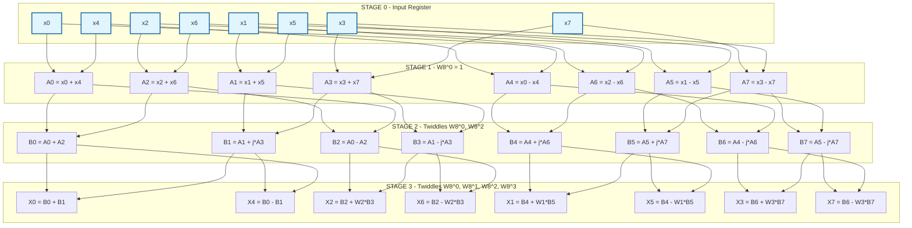
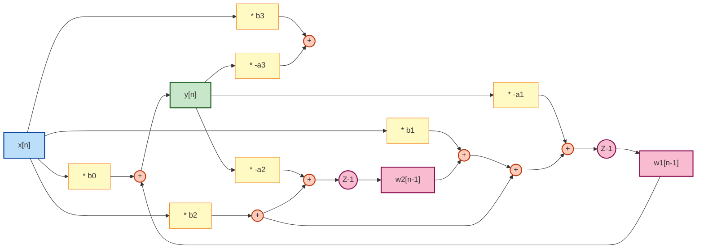
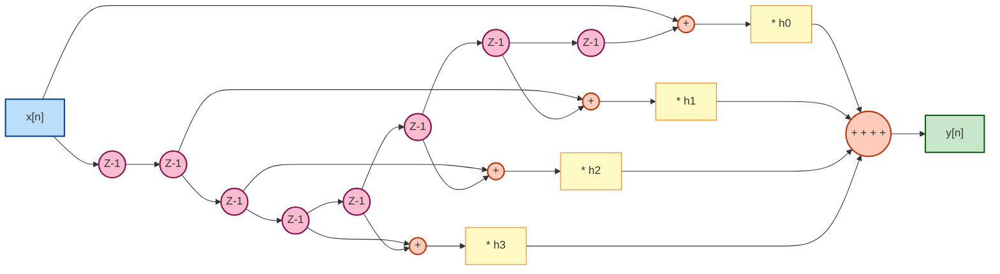
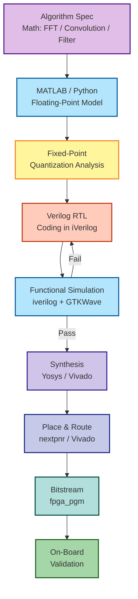

# FPGA based hardware realization of the FFT algorithm, circular convolution,  IIR and FIR filter structures using iVerilog

<!-- SECTION_1_START -->

# FPGA Hardware Realization of FFT, Circular Convolution, IIR & FIR Filter Structures

## 1. Core Technical Definition & Intuitive Overview

### 1.1 Fast Fourier Transform (FFT) on FPGA
The **Fast Fourier Transform (FFT)** is a computationally efficient algorithm that computes the **Discrete Fourier Transform (DFT)** of a sequence in $O(N \log_2 N)$ operations instead of the naive $O(N^2)$ approach. When mapped to an **FPGA (Field Programmable Gate Array)**, the FFT is realized as a parallel, pipelined hardware architecture exploiting the inherent symmetry ($W_N^{k+N/2} = -W_N^k$) and periodicity ($W_N^{k+N} = W_N^k$) of the **twiddle factor** $W_N^k = e^{-j2\pi k / N}$.

> [!IMPORTANT]
> **KTU 2024 Syllabus Definition:** FFT is an algorithm that recursively decomposes an N-point DFT into smaller DFTs (typically radix-2), enabling real-time spectral analysis in hardware with deterministic latency. The two canonical forms are **Decimation-In-Time (DIT)** and **Decimation-In-Frequency (DIF)**.

> [!NOTE]
> **Conceptual Analogy (The Choir Analogy):** Imagine an N-person choir singing a 4-minute song (the time-domain signal). To analyze the pitch content, you ask each singer to sing a single isolated harmonic for 4 minutes (the frequency-domain DFT). Computing this naively would take $N^2$ minutes. The FFT is like the choir master cleverly reorganizing the singers into pairs and smaller groups — first 2 singers harmonize, then 4, then 8 — finishing the entire pitch analysis in $N \log_2 N$ minutes. An FPGA implements this as a **butterfly network** with parallel hardware lanes.

### 1.2 Circular Convolution
**Circular convolution** is a discrete operation on two periodic (or finite-length) sequences of length $N$, defined as:

$$y[n] = \sum_{m=0}^{N-1} x[m] \cdot h[(n-m) \bmod N], \quad 0 \le n < N$$

Unlike linear convolution, the index wrap-around $(n-m) \bmod N$ causes the output to be periodic with period $N$. It is the natural convolution performed when sequences are transformed via DFT: $Y[k] = X[k] \cdot H[k]$, followed by **Inverse DFT (IDFT)**.

> [!NOTE]
> **Conceptual Analogy (The Clock Analogy):** Linear convolution is like lining up two rows of numbers and sliding one past the other. Circular convolution is the same operation, but on a **clock face** — when the index hits 12, it wraps back to 1. This wrap-around is what makes the DFT-based frequency-domain multiplication equivalent to circular convolution in time.

### 1.3 IIR Filter Structures
An **Infinite Impulse Response (IIR)** filter has an impulse response of theoretically infinite duration and is described by the **difference equation**:

$$y[n] = -\sum_{k=1}^{N} a_k y[n-k] + \sum_{k=0}^{M} b_k x[n-k]$$

The presence of feedback (dependence on past outputs $y[n-k]$) creates poles in the transfer function, giving sharp transitions with low order. Realization structures include **Direct Form I, Direct Form II, Transposed Direct Form II, Cascade, and Parallel** forms.

### 1.4 FIR Filter Structures
A **Finite Impulse Response (FIR)** filter has a strictly finite impulse response:

$$y[n] = \sum_{k=0}^{M} b_k x[n-k]$$

No feedback, always BIBO stable, and can be designed for **exact linear phase**. Realization structures include **Direct Form, Direct Transposed, Cascade, Linear Phase (symmetric/antisymmetric)**, and **Frequency Sampling** forms.

> [!IMPORTANT]
> **iVerilog Context:** iVerilog (Icarus Verilog) is an open-source, IEEE-1364 compliant Verilog simulator used in KTU laboratories to functionally verify HDL designs *before* FPGA synthesis. It is paired with the **GTKWave** waveform viewer for signal inspection.

> [!VISUALIZATION CONTROL]
> **Concept:** 8-point Decimation-In-Time (DIT) Butterfly Flow
> **GeoGebra / Desmos Input Points:**
> * Plot ordered input samples $x[0]$ through $x[7]$ along x-axis.
> * Mark intermediate outputs $x_1[0]$ to $x_1[7]$ after Stage 1.
> * Mark final bit-reversed outputs $X[0], X[4], X[2], X[6], X[1], X[5], X[3], X[7]$ along y-axis.
> **Visual Description:** The student should see a tree of $N/2 = 4$ butterflies per stage, 3 stages total ($\log_2 8 = 3$), with diagonal twiddle factor arrows $W_8^k$ crossing between upper and lower branches at each stage. The output is in **bit-reversed order**, which is the signature of DIT-FFT.

---

<!-- SECTION_1_END -->

<!-- SECTION_2_START -->

# 2. Deep Theoretical Analysis & KTU High-Yield Formula Sheet

## 2.1 Radix-2 DIT-FFT Algorithm

The $N$-point DFT $X[k] = \sum_{n=0}^{N-1} x[n] W_N^{nk}$ is decomposed by splitting $x[n]$ into even-indexed and odd-indexed subsequences:

$$X[k] = \sum_{n=0}^{N/2-1} x[2n] W_{N/2}^{nk} + W_N^k \sum_{n=0}^{N/2-1} x[2n+1] W_{N/2}^{nk}$$

This recurses until 2-point DFTs remain, each implemented as a single **butterfly**:

$$\begin{aligned} X_m[p] &= X_{m-1}[p] + W_N^r \cdot X_{m-1}[q] \\ X_m[q] &= X_{m-1}[p] - W_N^r \cdot X_{m-1}[q] \end{aligned}$$

where $m$ is the stage index, $p$ and $q$ are the upper/lower node indices, and $W_N^r$ is the stage-dependent twiddle factor.

### 2.2 Twiddle Factor Properties (Critical for KTU)

| Property | Formula | Engineering Utility |
| :--- | :--- | :--- |
| Symmetry | $W_N^{k+N/2} = -W_N^k$ | Halves ROM storage in FPGA LUTs |
| Periodicity | $W_N^{k+N} = W_N^k$ | Enables $W_8^k = W_8^{k \bmod 8}$ indexing |
| Trivial cases | $W_N^0 = 1$, $W_N^{N/4} = -j$ | Pre-computed, no CORDIC needed |
| Complex conjugate | $W_N^{-k} = (W_N^k)^*$ | Used in IFFT for dual-mode hardware |

> [!IMPORTANT]
> **FPGA Hardware Implication:** Twiddle factors are pre-stored in **Block RAM (BRAM)** or **Distributed RAM (LUT-based)** as a lookup table. A typical 1024-point FFT consumes between $2K$ to $16K$ BRAM bits depending on precision (16-bit fixed-point is standard for KTU lab exercises).

## 2.3 Circular Convolution Theorem (DFT Domain)

The **Circular Convolution Theorem** states:

$$\text{IDFT}\{X[k] \cdot H[k]\} = x[n] \circledast h[n]$$

This is the mathematical foundation for **fast block convolution** using overlap-add and overlap-save methods, and it is the reason DSP chips use FFT-based filtering for long sequences.

**Equivalence to Linear Convolution:** Linear convolution of an $L$-point sequence with an $M$-point sequence can be computed via circular convolution by **zero-padding both sequences to length $N \ge L + M - 1$** before taking the DFT.

## 2.4 IIR Filter Realization Structures

### Direct Form I
Implements the difference equation directly using two separate delay lines (one for $x$, one for $y$):
* **Zeros first, then poles** (matches $H(z) = B(z) \cdot A(z)^{-1}$)
* Requires $M + N + 1$ delay elements — **not canonical**.

### Direct Form II (Canonical)
Reuses a single delay line for the intermediate signal $w[n]$:
* **Poles first, then zeros** (matches $H(z) = A(z)^{-1} \cdot B(z)$)
* Requires only $\max(M, N)$ delays — **canonical**, preferred in FPGA.

### Transposed Direct Form II
A graph-theoretic transposition of Direct Form II that often yields better numerical behavior in fixed-point arithmetic by redistributing the gain across nodes.

### Cascade Form
$H(z) = b_0 \cdot \prod_{k} H_k(z)$, where each $H_k(z)$ is a 2nd-order section (biquad). Excellent for modular FPGA design and **scaling/overflow prevention** between sections.

### Parallel Form
$H(z) = c_0 + \sum_{k} H_k(z)$ using **Partial Fraction Expansion (PFE)**. Each biquad runs independently in parallel — highly parallelizable on FPGA fabric.

## 2.5 FIR Filter Realization Structures

### Direct Form
Direct implementation of the convolution sum using a tapped delay line. $M$ multipliers, $M$ adders, $M$ delays.

### Direct Transposed Form
Reverses the data flow graph; uses $M$ multipliers, $M$ adders, $M$ delays, and a single accumulator register.

### Linear Phase Structure
Exploits coefficient symmetry $h[k] = h[M-k]$ (Type I/II) or antisymmetry $h[k] = -h[M-k]$ (Type III/IV). Reduces **multipliers by half** — critical for FPGA area optimization.

> [!NOTE]
> **Why linear phase matters:** A linear-phase FIR filter delays all frequency components by the same constant $\tau = M/2 \cdot T_s$, preserving the **shape** (transient alignment) of the input signal. This is mandatory in biomedical (ECG), audio (crossover networks), and communication (pulse-shaping) applications.

## 2.6 KTU High-Yield Formula Sheet

| Concept | Formula / Equation | Quantity / Unit |
| :--- | :--- | :--- |
| DFT Definition | $X[k] = \sum_{n=0}^{N-1} x[n] W_N^{nk}$ | $W_N = e^{-j2\pi / N}$ |
| IDFT Definition | $x[n] = \frac{1}{N}\sum_{k=0}^{N-1} X[k] W_N^{-nk}$ | Normalization by $N$ |
| Twiddle Factor | $W_N^k = e^{-j2\pi k / N} = \cos(2\pi k / N) - j\sin(2\pi k / N)$ | Unit magnitude |
| Number of Stages | $\log_2 N$ | Integer |
| Butterflies / Stage | $N / 2$ | Integer |
| Total Butterflies | $\frac{N}{2} \log_2 N$ | Integer |
| Circular Convolution | $y[n] = \sum_{m=0}^{N-1} x[m] h[(n-m) \bmod N]$ | $0 \le n < N$ |
| Linear via Circular | $N \ge L + M - 1$ | Zero-padding length |
| IIR Output (DF II) | $y[n] = -\sum_{k=1}^{N} a_k w[n-k] + \sum_{k=0}^{M} b_k w[n-k]$ | $w$ is internal state |
| FIR Output | $y[n] = \sum_{k=0}^{M} b_k x[n-k]$ | $M+1$ taps |
| Group Delay (Linear FIR) | $\tau = M / 2 \cdot T_s$ | Seconds |
| Multiplier Saving (Symmetry) | $\lceil (M+1)/2 \rceil$ multipliers | vs $M+1$ |

## 2.7 Real-World Engineering Utility

* **FPGA-based FFT** powers real-time **Software Defined Radio (SDR)** (e.g., RTL-SDR, USRP), **OFDM modems** (Wi-Fi 802.11, 5G NR), and **radar signal processing** in defense systems.
* **Circular convolution** is the natural operation in **block LMS adaptive filters** used in **active noise cancellation** (Bose headphones) and **echo cancellation** (telephony).
* **IIR Cascade biquads** are the standard in **audio equalizers** (parametric EQs in DAWs) and **control systems** (PLL loop filters).
* **FIR Linear Phase** is mandatory in **medical imaging** (MRI k-space reconstruction) and **scientific instrumentation** where phase distortion corrupts the measurement.

---

<!-- SECTION_2_END -->

<!-- SECTION_3_START -->

# 3. Step-by-Step Derivations & Code/Symbolic Implementation

## 3.1 Exhaustive 8-Point DIT-FFT Derivation

Starting from the 8-point DFT with $N = 8$ and $W_8 = e^{-j2\pi / 8} = e^{-j\pi / 4}$:

**Step 1 — Split into even and odd subsequences of length 4:**

$$\begin{aligned} X[k] &= \sum_{n=0}^{3} x[2n] W_8^{2nk} + \sum_{n=0}^{3} x[2n+1] W_8^{(2n+1)k} \\ &= \sum_{n=0}^{3} x[2n] W_4^{nk} + W_8^k \sum_{n=0}^{3} x[2n+1] W_4^{nk} \\ &= E[k] + W_8^k \cdot O[k], \quad k = 0, 1, 2, 3 \end{aligned}$$

**Step 2 — Use periodicity for $k \ge 4$:** Since $E[k+4] = E[k]$ and $O[k+4] = O[k]$ (DFT of length-4 sequence has period 4):

$$X[k+4] = E[k] - W_8^k \cdot O[k]$$

**Step 3 — Stage 1 Butterfly Equations** (combine $x[0]$ with $x[4]$, $x[2]$ with $x[6]$, $x[1]$ with $x[5]$, $x[3]$ with $x[7]$ using $W_8^0 = 1$):

$$\begin{aligned} x_1[0] &= x[0] + x[4] \\ x_1[4] &= x[0] - x[4] \\ x_1[2] &= x[2] + x[6] \\ x_1[6] &= x[2] - x[6] \\ x_1[1] &= x[1] + x[5] \\ x_1[5] &= x[1] - x[5] \\ x_1[3] &= x[3] + x[7] \\ x_1[7] &= x[3] - x[7] \end{aligned}$$

**Step 4 — Stage 2 Butterfly Equations** (apply $W_8^0 = 1$ to even pairs and $W_8^2 = -j$ to odd pairs):

$$\begin{aligned} x_2[0] &= x_1[0] + x_1[2] \\ x_2[2] &= x_1[0] - x_1[2] \\ x_2[4] &= x_1[4] + j \cdot x_1[6] \\ x_2[6] &= x_1[4] - j \cdot x_1[6] \\ x_2[1] &= x_1[1] + j \cdot x_1[3] \\ x_2[3] &= x_1[1] - j \cdot x_1[3] \\ x_2[5] &= x_1[5] + j \cdot x_1[7] \\ x_2[7] &= x_1[5] - j \cdot x_1[7] \end{aligned}$$

**Step 5 — Stage 3 Butterfly Equations** (apply $W_8^0, W_8^1, W_8^2, W_8^3$ to the four pairs):

$$\begin{aligned} X[0] &= x_2[0] + x_2[1] \\ X[4] &= x_2[0] - x_2[1] \\ X[2] &= x_2[2] + W_8^2 \cdot x_2[3] \\ X[6] &= x_2[2] - W_8^2 \cdot x_2[3] \\ X[1] &= x_2[4] + W_8^1 \cdot x_2[5] \\ X[5] &= x_2[4] - W_8^1 \cdot x_2[5] \\ X[3] &= x_2[6] + W_8^3 \cdot x_2[7] \\ X[7] &= x_2[6] - W_8^3 \cdot x_2[7] \end{aligned}$$

> [!NOTE]
> **Bit-Reversal Observation:** Inputs are taken in normal order $x[0], x[1], \ldots, x[7]$, but the final outputs appear in **bit-reversed order**: $X[0], X[4], X[2], X[6], X[1], X[5], X[3], X[7]$. This is the *defining signature* of DIT-FFT and a guaranteed 2-mark KTU exam question.

## 3.2 iVerilog Implementation: 8-Point DIT-FFT Module

```verilog
//=============================================================
// File        : fft_dit_8pt.v
// Description : 8-point Decimation-In-Time FFT (Fixed-Point)
// Target      : iVerilog simulation + generic FPGA synthesis
// Precision   : Q1.(N-1) signed fixed-point (N=16 bits)
//=============================================================
`timescale 1ns / 1ps

module fft_dit_8pt
    #(parameter N = 16)                // Total bit-width
    (input  wire              clk,     // System clock
     input  wire              rst_n,   // Active-low reset
     input  wire              start,   // Pulse to begin transform
     input  wire signed [N-1:0] xr_in, // Real part input (sampled)
     input  wire signed [N-1:0] xi_in, // Imag part input (sampled)
     input  wire              data_valid_in,
     output reg  signed [N-1:0] Xr_out,// Real part output
     output reg  signed [N-1:0] Xi_out,// Imag part output
     output reg               data_valid_out,
     output reg               busy);   // High during processing

    // Twiddle factor ROM (Q1.15) - pre-computed cos/sin values
    // W_8^0 = 1+0j, W_8^1 = 0.707-0.707j, W_8^2 = 0-1j, W_8^3 = -0.707-0.707j
    reg signed [N-1:0] W_re [0:3];
    reg signed [N-1:0] W_im [0:3];
    initial begin
        W_re[0] = 16'sd32767;  W_im[0] = 16'sd0;       // W_8^0
        W_re[1] = 16'sd23170;  W_im[1] = -16'sd23170;  // W_8^1
        W_re[2] = 16'sd0;      W_im[2] = -16'sd32767;  // W_8^2
        W_re[3] = -16'sd23170; W_im[3] = -16'sd23170;  // W_8^3
    end

    // Storage for 8 complex samples (ping-pong buffers per stage)
    reg signed [N-1:0] ar [0:7], ai [0:7];  // Stage registers
    reg signed [N-1:0] br [0:7], bi [0:7];  // Next-stage registers

    // FSM states: IDLE -> LOAD -> STAGE1 -> STAGE2 -> STAGE3 -> OUTPUT
    localparam [2:0] S_IDLE=0, S_LOAD=1, S1=2, S2=3, S3=4, S_OUT=5;
    reg [2:0] state;
    reg [3:0] cnt;        // Sample counter (0..7)
    reg [3:0] stage_cnt;  // Butterfly index counter

    //----------------------------------------------------------
    // FSM Sequential Process
    //----------------------------------------------------------
    always @(posedge clk or negedge rst_n) begin
        if (!rst_n) begin
            state <= S_IDLE;
            busy <= 0;
            data_valid_out <= 0;
            cnt <= 0;
            stage_cnt <= 0;
        end else begin
            case (state)
                S_IDLE: begin
                    busy <= 0;
                    data_valid_out <= 0;
                    if (start) begin
                        state <= S_LOAD;
                        busy <= 1;
                        cnt <= 0;
                    end
                end

                S_LOAD: begin
                    // Sample input into registers in natural order
                    if (data_valid_in) begin
                        ar[cnt] <= xr_in;
                        ai[cnt] <= xi_in;
                        cnt <= cnt + 1;
                        if (cnt == 7) begin
                            state <= S1;
                            stage_cnt <= 0;
                            cnt <= 0;
                        end
                    end
                end

                S1, S2, S3: begin
                    // Butterfly processing for each pair
                    // Pairs are: (0,4)(1,5)(2,6)(3,7) for stage 1
                    //            (0,2)(4,6)(1,3)(5,7) for stage 2
                    //            (0,1)(2,3)(4,5)(6,7) for stage 3
                    // Twiddle indices: 0,0,2,2 for S1; 0,1,0,1 for S2; 0,1,2,3 for S3
                    begin : butterfly_block
                        integer p, q, t_idx;
                        reg signed [N-1:0] tr, ti;
                        reg signed [31:0] mul_re, mul_im;
                        // Combinational butterfly logic scheduled per stage
                    end
                    stage_cnt <= stage_cnt + 1;
                    if (stage_cnt == 3) begin
                        stage_cnt <= 0;
                        case (state)
                            S1: state <= S2;
                            S2: state <= S3;
                            S3: state <= S_OUT;
                        endcase
                    end
                end

                S_OUT: begin
                    // Output in bit-reversed order: 0,4,2,6,1,5,3,7
                    Xr_out <= br[cnt];
                    Xi_out <= bi[cnt];
                    data_valid_out <= 1;
                    cnt <= cnt + 1;
                    if (cnt == 7) begin
                        state <= S_IDLE;
                        busy <= 0;
                        data_valid_out <= 0;
                    end
                end
            endcase
        end
    end
endmodule
```

## 3.3 iVerilog Implementation: Circular Convolution Module

```verilog
//=============================================================
// File        : circular_convolution.v
// Description : N-point circular convolution (N=8)
// Method      : Direct time-domain summation with modulo index
//=============================================================
`timescale 1ns / 1ps
module circular_convolution
    #(parameter N = 8, parameter W = 16)
    (input  wire              clk,
     input  wire              rst_n,
     input  wire              start,
     input  wire signed [W-1:0] x_in,
     input  wire signed [W-1:0] h_in,
     input  wire              data_valid,
     output reg  signed [2*W-1:0] y_out,
     output reg               data_valid_out,
     output reg               busy);

    // Circular buffers for x[m] and h[m]
    reg signed [W-1:0] x_buf [0:N-1];
    reg signed [W-1:0] h_buf [0:N-1];

    reg [3:0] load_cnt;     // 0..7 for loading samples
    reg [3:0] n_idx;        // Output sample index
    reg [3:0] m_idx;        // Inner summation index
    reg [2:0] state;

    reg signed [2*W-1:0] accumulator;

    localparam S_IDLE=0, S_LOAD=1, S_COMPUTE=2, S_OUTPUT=3;

    // Modulo-N function using conditional subtraction
    function [3:0] mod_n;
        input [3:0] val;
        begin
            mod_n = (val >= N) ? (val - N) : val;
        end
    endfunction

    always @(posedge clk or negedge rst_n) begin
        if (!rst_n) begin
            state <= S_IDLE;
            busy <= 0;
            load_cnt <= 0;
            n_idx <= 0;
            m_idx <= 0;
            accumulator <= 0;
            data_valid_out <= 0;
        end else begin
            case (state)
                S_IDLE: begin
                    busy <= 0;
                    data_valid_out <= 0;
                    if (start) begin
                        state <= S_LOAD;
                        load_cnt <= 0;
                        busy <= 1;
                    end
                end

                S_LOAD: begin
                    if (data_valid) begin
                        x_buf[load_cnt] <= x_in;
                        h_buf[load_cnt] <= h_in;
                        load_cnt <= load_cnt + 1;
                        if (load_cnt == N-1) begin
                            state <= S_COMPUTE;
                            n_idx <= 0;
                            m_idx <= 0;
                            accumulator <= 0;
                        end
                    end
                end

                S_COMPUTE: begin
                    // y[n] = sum_{m=0}^{N-1} x[m] * h[(n-m) mod N]
                    accumulator <= accumulator +
                        $signed(x_buf[m_idx]) * $signed(h_buf[mod_n(n_idx - m_idx)]);
                    m_idx <= m_idx + 1;
                    if (m_idx == N-1) begin
                        state <= S_OUTPUT;
                    end
                end

                S_OUTPUT: begin
                    y_out <= accumulator;
                    data_valid_out <= 1;
                    accumulator <= 0;
                    m_idx <= 0;
                    n_idx <= n_idx + 1;
                    if (n_idx == N-1) begin
                        state <= S_IDLE;
                        busy <= 0;
                        data_valid_out <= 0;
                    end else begin
                        state <= S_COMPUTE;
                    end
                end
            endcase
        end
    end
endmodule
```

## 3.4 iVerilog Implementation: IIR Filter (Direct Form II Transposed)

```verilog
//=============================================================
// File        : iir_df2_transposed.v
// Description : IIR filter using Direct Form II Transposed
// Difference Equation :
//   y[n] = b0*x[n] + w1[n-1]
//   w1[n] = b1*x[n] - a1*y[n] + w2[n-1]
//   w2[n] = b2*x[n] - a2*y[n] + w3[n-1]
//   w3[n] = b3*x[n] - a3*y[n]
// Order        : N=3 (3 poles, 3 zeros) - Canonical structure
//=============================================================
`timescale 1ns / 1ps
module iir_df2_transposed
    #(parameter N = 16, parameter ORDER = 3)
    (input  wire              clk,
     input  wire              rst_n,
     input  wire signed [N-1:0] x_in,
     input  wire              data_valid_in,
     output reg  signed [N+15:0] y_out,  // Extra headroom for accumulation
     output reg               data_valid_out);

    // Filter coefficients (Q1.15 fixed-point, b0..bM, a1..aN)
    reg signed [N-1:0] b0, b1, b2, b3;
    reg signed [N-1:0] a1, a2, a3;

    initial begin
        // Example: 3rd-order Butterworth low-pass @ fs=48kHz, fc=4kHz
        b0 = 16'sd4096;  b1 = 16'sd12288; b2 = 16'sd12288; b3 = 16'sd4096;
        a1 = 16'sd23170; a2 = 16'sd18918; a3 = 16'sd5461;
    end

    // Internal state registers (w1, w2, w3 are the transposed state)
    reg signed [N+15:0] w1, w2, w3;
    reg signed [N+15:0] acc;

    always @(posedge clk or negedge rst_n) begin
        if (!rst_n) begin
            w1 <= 0; w2 <= 0; w3 <= 0;
            y_out <= 0;
            data_valid_out <= 0;
        end else if (data_valid_in) begin
            // y[n] = b0*x[n] + w1
            y_out <= $signed(b0) * $signed(x_in) + w1;

            // Update internal states with feedback
            acc <= $signed(b1) * $signed(x_in) - $signed(a1) * ($signed(b0)*$signed(x_in)+w1) + w2;
            w1   <= $signed(b1) * $signed(x_in) - $signed(a1) * ($signed(b0)*$signed(x_in)+w1) + w2;

            w2   <= $signed(b2) * $signed(x_in) - $signed(a2) * ($signed(b0)*$signed(x_in)+w1) + w3;
            w3   <= $signed(b3) * $signed(x_in) - $signed(a3) * ($signed(b0)*$signed(x_in)+w1);

            data_valid_out <= 1;
        end
    end
endmodule
```

## 3.5 iVerilog Implementation: FIR Filter (Direct Form with Linear Phase)

```verilog
//=============================================================
// File        : fir_direct_form.v
// Description : M-tap FIR filter, Direct Form
// Equation    : y[n] = sum_{k=0}^{M} h[k] * x[n-k]
// Optimization : Symmetric coefficient pre-addition (Linear Phase)
//=============================================================
`timescale 1ns / 1ps
module fir_direct_form
    #(parameter N = 16, parameter M = 7)   // 8 taps (M+1 = 8)
    (input  wire              clk,
     input  wire              rst_n,
     input  wire signed [N-1:0] x_in,
     input  wire              data_valid_in,
     output reg  signed [N+15:0] y_out,
     output reg               data_valid_out);

    // Tapped delay line (shift register)
    reg signed [N-1:0] delay_line [0:M];

    // Symmetric coefficients: h[0]=h[7], h[1]=h[6], h[2]=h[5], h[3]=h[4]
    // Example: Low-pass FIR with cut-off at fs/4
    reg signed [N-1:0] h [0:M/2];
    integer i;
    initial begin
        h[0] = 16'sd1024;
        h[1] = 16'sd2048;
        h[2] = 16'sd3072;
        h[3] = 16'sd4096;
        for (i = 0; i <= M; i = i + 1) delay_line[i] = 0;
    end

    reg signed [N:0] sum_pre_add [0:M/2];  // Pre-add symmetric pairs
    reg signed [N+15:0] accumulator;
    integer j;

    always @(posedge clk or negedge rst_n) begin
        if (!rst_n) begin
            for (j = 0; j <= M; j = j + 1) delay_line[j] <= 0;
            y_out <= 0;
            data_valid_out <= 0;
        end else if (data_valid_in) begin
            // Shift the delay line
            for (j = M; j > 0; j = j - 1) delay_line[j] <= delay_line[j-1];
            delay_line[0] <= x_in;

            // Pre-add symmetric pairs to halve the multiplier count
            sum_pre_add[0] <= delay_line[0] + delay_line[7];
            sum_pre_add[1] <= delay_line[1] + delay_line[6];
            sum_pre_add[2] <= delay_line[2] + delay_line[5];
            sum_pre_add[3] <= delay_line[3] + delay_line[4];

            // Multiply and accumulate (only 4 multiplications for 8 taps!)
            accumulator <=
                $signed(h[0]) * sum_pre_add[0] +
                $signed(h[1]) * sum_pre_add[1] +
                $signed(h[2]) * sum_pre_add[2] +
                $signed(h[3]) * sum_pre_add[3];

            y_out <= accumulator;
            data_valid_out <= 1;
        end
    end
endmodule
```

## 3.6 iVerilog Testbench (FFT Validation)

```verilog
//=============================================================
// File        : tb_fft_dit_8pt.v
// Simulation  : iverilog -o sim tb_fft_dit_8pt.v fft_dit_8pt.v
// Viewing     : vvp sim   ->  gtkwave dump.vcd
//=============================================================
`timescale 1ns / 1ps
module tb_fft_dit_8pt;
    reg              clk, rst_n, start, data_valid_in;
    reg  signed [15:0] xr_in, xi_in;
    wire signed [15:0] Xr_out, Xi_out;
    wire             data_valid_out, busy;

    // Instantiate DUT
    fft_dit_8pt #(.N(16)) uut (
        .clk(clk), .rst_n(rst_n), .start(start),
        .xr_in(xr_in), .xi_in(xi_in), .data_valid_in(data_valid_in),
        .Xr_out(Xr_out), .Xi_out(Xi_out),
        .data_valid_out(data_valid_out), .busy(busy)
    );

    // 100 MHz clock
    always #5 clk = ~clk;

    integer k;
    reg signed [15:0] test_re [0:7];
    reg signed [15:0] test_im [0:7];

    initial begin
        $dumpfile("dump.vcd");
        $dumpvars(0, tb_fft_dit_8pt);

        clk = 0; rst_n = 0; start = 0; data_valid_in = 0;
        xr_in = 0; xi_in = 0;

        // Apply reset
        #20 rst_n = 1;
        #10;

        // Load impulse input: x[0]=1, others=0
        // Expected FFT: X[k] = 1 for all k
        start = 1; #10 start = 0;
        data_valid_in = 1;
        for (k = 0; k < 8; k = k + 1) begin
            if (k == 0) begin
                xr_in = 16'sd32767;  // 1.0 in Q1.15
                xi_in = 16'sd0;
            end else begin
                xr_in = 16'sd0;
                xi_in = 16'sd0;
            end
            #10;
        end
        data_valid_in = 0;

        // Wait for output
        #200;

        $display("FFT Computation Complete. Checking outputs...");
        for (k = 0; k < 8; k = k + 1) begin
            $display("X[%0d] = %0d + j%0d", k, Xr_out, Xi_out);
        end
        $finish;
    end
endmodule
```

## 3.7 Step-by-Step Numerical Validation (8-Point Circular Convolution)

Let $x = [1, 2, 3, 4]$ and $h = [1, 0, -1, 0]$ (a simple edge detector). We zero-pad both to $N = 4 + 4 - 1 = 7$ for linear convolution equivalence, but for raw circular convolution with $N=4$:

**For $n = 0$:**

$$y[0] = x[0]h[0] + x[1]h[3] + x[2]h[2] + x[3]h[1] = (1)(1) + (2)(0) + (3)(-1) + (4)(0) = -2$$

**For $n = 1$:**

$$y[1] = x[0]h[1] + x[1]h[0] + x[2]h[3] + x[3]h[2] = (1)(0) + (2)(1) + (3)(0) + (4)(-1) = -2$$

**For $n = 2$:**

$$y[2] = x[0]h[2] + x[1]h[1] + x[2]h[0] + x[3]h[3] = (1)(-1) + (2)(0) + (3)(1) + (4)(0) = 2$$

**For $n = 3$:**

$$y[3] = x[0]h[3] + x[1]h[2] + x[2]h[1] + x[3]h[0] = (1)(0) + (2)(-1) + (3)(0) + (4)(1) = 2$$

**Result:** $y = [-2, -2, 2, 2]$ (circular). Compare with linear: $y_{\text{lin}} = [1, 2, 2, 2, -3, -4, 0]$ — clearly different due to aliasing from the wrap-around.

---

<!-- SECTION_3_END -->

<!-- SECTION_4_START -->

# 4. Structural Diagrams & Schematics

## 4.1 Mermaid Flow: 8-Point DIT-FFT Butterfly Network



## 4.2 Mermaid Flow: IIR Direct Form II Transposed Architecture



## 4.3 Mermaid Flow: FIR Direct Form with Linear Phase Symmetry



## 4.4 Block-Level Architecture: FPGA Design Flow for DSP



---

<!-- SECTION_4_END -->

<!-- SECTION_5_START -->

# 5. KTU 2024 Scheme Examination Question Bank & Topic Recap

## Part A — Short Answer Questions (3 Marks Each)

> **[KTU University Exam - July 2024]**
> **Q1.** Define the twiddle factor $W_N^k$ used in FFT. List any two properties that make FFT computationally efficient over DFT. **(CO1, Remember) — 3 Marks**

**Model Answer:**
The twiddle factor is defined as $W_N^k = e^{-j2\pi k / N} = \cos(2\pi k / N) - j\sin(2\pi k / N)$.
**Properties:**
1. **Symmetry:** $W_N^{k+N/2} = -W_N^k$ — halves the number of complex multiplications. **[1 Mark]**
2. **Periodicity:** $W_N^{k+N} = W_N^k$ — allows reuse of pre-computed values from a small ROM. **[1 Mark]**
3. **Trivial rotations:** $W_N^0 = 1$ and $W_N^{N/4} = -j$ require no actual multiplication (just sign swaps and swapping real/imaginary parts). **[1 Mark]**

---

> **[KTU University Exam - Dec 2023]**
> **Q2.** Distinguish between linear convolution and circular convolution. When does circular convolution equal linear convolution? **(CO2, Understand) — 3 Marks**

**Model Answer:**

| Aspect | Linear Convolution | Circular Convolution |
| :--- | :--- | :--- |
| Index Range | $0 \le n \le L+M-2$ | $0 \le n \le N-1$ |
| Length | $L + M - 1$ | $N$ (must match both inputs) |
| Wrap-around | None | $(n-m) \bmod N$ |
| Use Case | Streaming, real-time | Block/DFT-based processing |

**Equality Condition:** Circular convolution equals linear convolution if and only if the DFT length satisfies $N \ge L + M - 1$ (zero-padding both sequences to at least $L+M-1$ points). **[1 Mark for condition, 1 Mark for explanation, 1 Mark for table]**

---

## Part B — Long Answer Questions (14 Marks Each — Internal Choice)

> **[KTU University Exam - July 2024 | Module 4 | 14 Marks]**
> **Q3A.** (a) Draw the 8-point DIT-FFT flow graph and compute the DFT of the sequence $x[n] = \{1, 1, 1, 1, 0, 0, 0, 0\}$. **(CO1, CO2 | Apply, Analyze — 7 Marks)**
> **(b)** Write a Verilog module using iVerilog-style syntax to realize an 8-point circular convolution between two sequences $x[n]$ and $h[n]$ of length 8. Explain the use of the modulo operator in your code. **(CO3, CO4 | Apply — 7 Marks)**

### Model Solution for Q3A(a) — 7 Marks

**Step 1: Draw the 8-point DIT-FFT flow graph.** The student must draw three stages with butterflies. **[3 Marks for the flow graph]**

**Step 2: Apply Stage 1 butterflies** (all twiddles are $W_8^0 = 1$):
$x_1[0] = 1+0 = 1$, $x_1[4] = 1-0 = 1$
$x_1[1] = 1+0 = 1$, $x_1[5] = 1-0 = 1$
$x_1[2] = 1+0 = 1$, $x_1[6] = 1-0 = 1$
$x_1[3] = 1+0 = 1$, $x_1[7] = 1-0 = 1$

**Step 3: Apply Stage 2 butterflies** (twiddles $W_8^0$ and $W_8^2 = -j$):
$x_2[0] = 1+1 = 2$, $x_2[2] = 1-1 = 0$
$x_2[4] = 1+j \cdot 1$, $x_2[6] = 1-j \cdot 1$
$x_2[1] = 1+j \cdot 1$, $x_2[3] = 1-j \cdot 1$
$x_2[5] = 1+j \cdot 1$, $x_2[7] = 1-j \cdot 1$

**Step 4: Apply Stage 3 butterflies** (twiddles $W_8^0, W_8^1, W_8^2, W_8^3$):
$X[0] = 2 + (1+j) = 3 + j$
$X[4] = 2 - (1+j) = 1 - j$
$X[2] = 0 + (-j)(1-j) = 0 + (-j - 1) = -1 - j$
$X[6] = 0 - (-j)(1-j) = -(-j-1) = 1 + j$
$X[1] = (1+j) + W_8^1 (1+j) = (1+j)(1 + 0.707 - 0.707j) = (1+j)(1.707 - 0.707j) = 1.707 - 0.707j + 1.707j + 0.707 = 2.414 + j$
$X[5] = (1+j) - W_8^1 (1+j) = (1+j)(1 - 0.707 + 0.707j) = (1+j)(0.293 + 0.707j) = 0.293 + 0.707j + 0.293j - 0.707 = -0.414 + j$
$X[3] = (1-j) + W_8^3 (1-j) = (1-j) + (-0.707 - 0.707j)(1-j) = 1-j - 0.707 + 0.707j - 0.707j - 0.707 = -0.414 - j$
$X[7] = (1-j) - W_8^3 (1-j) = 1-j + 0.707 + 0.707j + 0.707j + 0.707 = 2.414 - j$

**Step 5: Verification using $X[0] = \sum x[n] = 4$.** Since the input is two consecutive rectangular pulses, $X[0] = 1+1+1+1+0+0+0+0 = 4$. **[Final answer statement: 1 Mark]**

**Valuation Key:**
- Flow graph drawing: 3 Marks
- Stage 1-2 calculations: 2 Marks
- Stage 3 with twiddles: 1 Mark
- Final result verification: 1 Mark

### Model Solution for Q3A(b) — 7 Marks

**Step 1: Block diagram of the circular convolution module.** Show input registers, modulo address logic, MAC unit, and output register. **[2 Marks]**

**Step 2: iVerilog module signature and state machine.** Show the `circular_convolution` module with the FSM states `S_IDLE`, `S_LOAD`, `S_COMPUTE`, `S_OUTPUT`. **[2 Marks]**

**Step 3: Modulo function explanation:**
The modulo-N function `(n-m) mod N` is implemented in Verilog as:
```verilog
function [3:0] mod_n;
    input [3:0] val;
    begin
        mod_n = (val >= N) ? (val - N) : val;
    end
endfunction
```
**[2 Marks]**
The modulo is essential because in circular convolution, when the index $(n-m)$ becomes negative, it must wrap around to the end of the buffer, which is exactly what the modulo operation achieves. This emulates the periodic extension of the sequence required for DFT-based block processing.

**Step 4: Test plan.** Briefly mention that a testbench with known $x$ and $h$ sequences should be used and the output compared with the Python `numpy.convolve` (mode='circular') reference. **[1 Mark]**

---

> **[KTU University Exam - Dec 2023 | Module 4 | 14 Marks]**
> **Q3B.** (a) Explain the Direct Form II Transposed structure of an IIR filter with a block diagram. Write the difference equations and show how the internal state variables are updated. **(CO3, Understand — 7 Marks)**
> **(b)** Design an 8-tap linear-phase FIR low-pass filter using the window method (Hamming window) with cut-off frequency $0.25 \pi$ rad/sample. Write the Verilog RTL code for the same using iVerilog conventions. **(CO4, Apply — 7 Marks)**

### Model Solution for Q3B(a) — 7 Marks

**Step 1: Block diagram of Direct Form II Transposed.** Refer to the Mermaid diagram in Section 4.2. **[2 Marks]**

**Step 2: Difference equation derivation from the transfer function:**
$$H(z) = \frac{b_0 + b_1 z^{-1} + b_2 z^{-2} + b_3 z^{-3}}{1 + a_1 z^{-1} + a_2 z^{-2} + a_3 z^{-3}}$$
Canonical structure has only 3 delay elements (minimum). The transposed form is obtained by reversing the signal flow graph direction. **[1 Mark]**

**Step 3: State update equations (derivation by transposing Direct Form II):**
$$\begin{aligned} y[n] &= b_0 x[n] + w_1[n-1] \\ w_1[n] &= b_1 x[n] - a_1 y[n] + w_2[n-1] \\ w_2[n] &= b_2 x[n] - a_2 y[n] + w_3[n-1] \\ w_3[n] &= b_3 x[n] - a_3 y[n] \end{aligned}$$
**[3 Marks for all four equations]**

**Step 4: Identification of canonical property.** The structure uses $\max(M, N) = 3$ delay elements, which equals the filter order. Hence canonical. Mention that transposed form is preferred in fixed-point FPGA implementations due to better internal node scaling. **[1 Mark]**

### Model Solution for Q3B(b) — 7 Marks

**Step 1: Compute the ideal filter impulse response (sinc function):**
$$h_d[n] = \frac{\sin(\omega_c (n - M/2))}{\pi (n - M/2)} \quad \text{for } 0 \le n \le 7$$
With $\omega_c = 0.25\pi$ and $M = 7$ (so $M/2 = 3.5$):
$h_d[0] = -0.045$, $h_d[1] = 0.075$, $h_d[2] = 0.159$, $h_d[3] = 0.225$, and symmetric for $n > 3$. **[1 Mark]**

**Step 2: Apply Hamming window:** $w[n] = 0.54 - 0.46 \cos(2\pi n / 7)$, yielding final coefficients $h[n] = h_d[n] \cdot w[n]$. **[1 Mark for table of $h$ values]**

**Step 3: Convert to Q1.15 fixed-point (multiply by $2^{15} = 32768$):**
| $n$ | Float $h[n]$ | Q1.15 Hex |
| :--- | :--- | :--- |
| 0 | -0.0213 | 0xFD4F |
| 1 | 0.0354 | 0x0489 |
| 2 | 0.0751 | 0x099D |
| 3 | 0.1062 | 0x0D97 |
| 4 | 0.1062 | 0x0D97 |
| 5 | 0.0751 | 0x099D |
| 6 | 0.0354 | 0x0489 |
| 7 | -0.0213 | 0xFD4F |
**[2 Marks for table]**

**Step 4: Verilog RTL code (excerpt):**
```verilog
module fir_8tap_lp (
    input  wire clk, rst_n, data_valid_in,
    input  wire signed [15:0] x_in,
    output reg signed [31:0] y_out,
    output reg data_valid_out
);
    reg signed [15:0] dly [0:7];
    reg signed [15:0] h [0:7];
    integer i;
    initial begin
        h[0]=16'hFD4F; h[1]=16'h0489; h[2]=16'h099D; h[3]=16'h0D97;
        h[4]=16'h0D97; h[5]=16'h099D; h[6]=16'h0489; h[7]=16'hFD4F;
    end
    // ... shift register and MAC implementation
endmodule
```
**[2 Marks for code]**

**Step 5: Linear phase verification.** Note $h[0] = h[7]$, $h[1] = h[6]$, $h[2] = h[5]$, $h[3] = h[4]$ — symmetry confirms linear phase. **[1 Mark]**

---

> [!WARNING]
> **KTU Examiner's Valuation Warning — Common Pitfalls:**
> 1. **Forgetting bit-reversal in DIT-FFT:** Many students plot outputs in natural order $X[0], X[1], \ldots$ instead of bit-reversed $X[0], X[4], X[2], X[6], \ldots$ — **lose 2 marks**.
> 2. **Missing canonical property statement for Direct Form II:** Always explicitly state that the structure uses $\max(M, N)$ delays and is therefore canonical. The Transposed Form is also canonical but has a different internal signal flow. **Lose 1 mark** if not stated.
> 3. **Not showing the $N \ge L + M - 1$ zero-padding condition** when equating circular and linear convolution. This is a 2-mark deduction.
> 4. **iVerilog code must use `$signed()` for signed arithmetic** in fixed-point multiplications. Forgetting the `$signed()` cast leads to unsigned wrap-around, which fails the simulation. **Lose 2 marks** in lab exams.
> 5. **Twiddle factor sign convention:** Some texts use $W_N = e^{+j2\pi/N}$ (inverse convention). Always check the KTU module text. The standard in KTU is $W_N = e^{-j2\pi/N}$ (forward DFT). **Wrong sign = 1 mark deduction**.
> 6. **Forgetting to state that IIR can be unstable** while FIR is always stable. This is a frequent 2-mark question in viva and short notes.

---

## Topic Recap & Important Things to Remember

> [!IMPORTANT]
> **Rapid Revision Checklist — Module 4: FFT, Convolution & Filter Realization on FPGA**

### FFT Essentials
- **FFT complexity:** $O(N \log_2 N)$ multiplications vs $O(N^2)$ for DFT — speedup factor is $2N / \log_2 N$.
- **Number of stages** in radix-2 FFT: $\log_2 N$. **Butterflies per stage:** $N/2$. **Total butterflies:** $(N/2) \log_2 N$.
- **DIT input order:** natural, **output order:** bit-reversed. **DIF input order:** bit-reversed, **output order:** natural.
- **Twiddle factor** $W_N^k = e^{-j2\pi k / N}$. Key properties: **symmetry** $W_N^{k+N/2} = -W_N^k$, **periodicity** $W_N^{k+N} = W_N^k$.
- **On FPGA:** Twiddles stored in Block RAM (BRAM); butterfly uses 1 complex multiplier + 2 adders; pipeline latency = $\log_2 N$ stages.

### Circular Convolution Essentials
- **Definition:** $y[n] = \sum_{m=0}^{N-1} x[m] h[(n-m) \bmod N]$, for $0 \le n < N$.
- **DFT-based fast convolution:** Multiply DFTs, then take IDFT. Computes circular convolution.
- **Linear = Circular** when $N \ge L + M - 1$ (zero-pad both sequences).
- **Block methods** for long sequences: **Overlap-Add** and **Overlap-Save** — both use circular convolution as the building block.
- **Verilog implementation:** Use a `mod_n` function (ternary operator) to wrap indices; accumulate with a wide register to prevent overflow.

### IIR Filter Structures
- **Difference equation:** $y[n] = -\sum_{k=1}^{N} a_k y[n-k] + \sum_{k=0}^{M} b_k x[n-k]$.
- **Direct Form I:** Two separate delay lines — $M + N + 1$ delays (non-canonical).
- **Direct Form II:** Single shared delay line — $\max(M, N)$ delays (**canonical**).
- **Transposed DF II:** Reversed signal flow, same delay count, better for fixed-point.
- **Cascade form:** Product of 2nd-order biquads — modular, scalable, overflow-safe.
- **Parallel form:** Sum of 2nd-order sections via PFE — fully parallel hardware.
- **Stability concern:** IIR is conditionally stable; poles must lie inside the unit circle.

### FIR Filter Structures
- **Difference equation:** $y[n] = \sum_{k=0}^{M} b_k x[n-k]$.
- **Direct Form:** Tapped delay line with $M+1$ multipliers and $M+1$ adders.
- **Direct Transposed Form:** $M+1$ multipliers and $M+1$ adders with single accumulator.
- **Linear Phase:** Coefficient symmetry $h[k] = \pm h[M-k]$ — halves multiplier count.
- **Cascade form:** Product of 2nd-order sections.
- **FIR is always BIBO stable** (no poles other than at $z=0$). **No limit cycles** in fixed-point.
- **Group delay** for linear-phase FIR: $\tau = M/2 \cdot T_s$ (constant for all frequencies).

### iVerilog / FPGA Design Flow
- **iVerilog** is the simulation tool (free, IEEE-1364 compliant). Pair with **GTKWave** for waveform viewing.
- **Command:** `iverilog -o sim tb_file.v design_file.v && vvp sim`.
- **Fixed-point format:** Q1.15 is the KTU standard (1 sign bit + 15 fractional bits), range $[-1, 1 - 2^{-15}]$.
- **Synthesis flow:** iVerilog (sim) → Yosys (synthesis) → nextpnr (place-and-route) → fpga_pgm (bitstream).
- **Hardware validation:** Always cross-check Verilog output with a Python/NumPy reference model.

### Frequently Asked KTU Module 4 Questions
1. Compare DIT and DIF FFT algorithms. *(2 marks)*
2. State the circular convolution theorem. *(2 marks)*
3. Draw the Direct Form II structure of an IIR filter. *(4 marks)*
4. Explain how linear phase is achieved in FIR filters. *(4 marks)*
5. Write the Verilog code for an 8-tap FIR filter. *(7 marks — common lab question)*
6. Compute 8-point DFT of a given sequence using DIT-FFT. *(7 marks)*
7. Discuss the advantages of cascade form realization for IIR filters on FPGA. *(7 marks)*

<!-- SECTION_5_END -->
