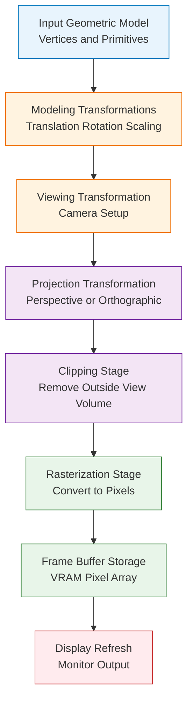
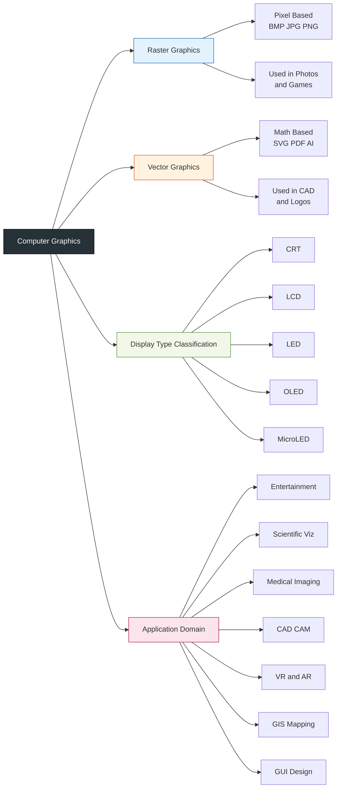
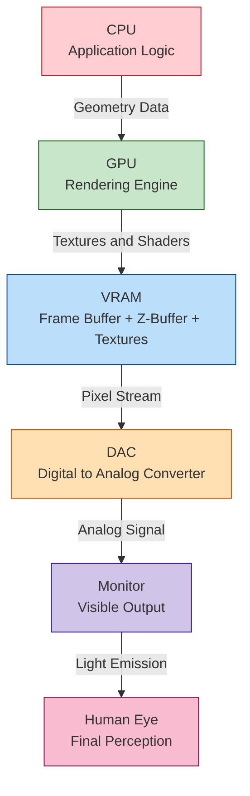
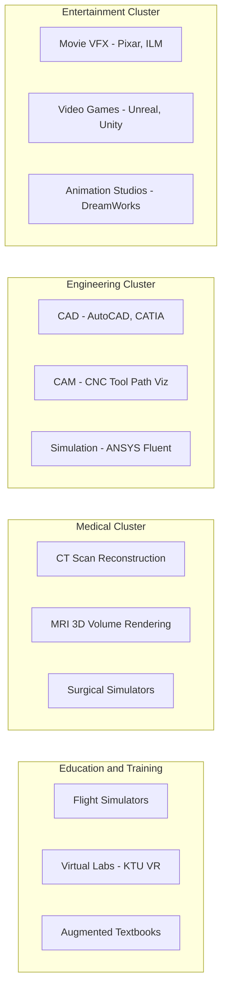

# Basics of Computer graphics - Basics of Computer Graphics and its applications.

<!-- SECTION_1_START -->
# Basics of Computer Graphics & Its Applications

## 1.1 Formal Academic Definition (KTU 2024 Syllabus Terminology)

> [!IMPORTANT]
> **Computer Graphics (CG)** is defined by KTU (per the **PECST527 – Computer Graphics & Multimedia** syllabus, 2024 Scheme) as:
> *"A sub-discipline of Computer Science that deals with the **generation, representation, manipulation, and display of pictorial data** using a digital computer. It encompasses the theoretical and algorithmic foundations for producing visual content through pixels, vectors, and geometric primitives, supported by hardware (display devices, GPUs) and software (rendering engines, APIs)."*

In simple, board-exam friendly wording:

$$\text{Computer Graphics} = \text{Input (Model)} \;\rightarrow\; \text{Processing (Algorithms)} \;\rightarrow\; \text{Output (Pixels on Display)}$$

The primary pipeline works in five classical stages (Foley–Van Dam Pipeline):

$$\text{Modeling} \;\rightarrow\; \text{Transformation} \;\rightarrow\; \text{Projection} \;\rightarrow\; \text{Clipping} \;\rightarrow\; \text{Rasterization / Rendering}$$

---

## 1.2 Intuitive Analogy – "The Artist Inside the CPU"

> [!NOTE]
> **Real-world analogy:** Think of computer graphics as a **digital artist + a photographer working together inside the CPU**. The artist creates a 3D wireframe **sculpture** (modeling), the photographer positions the **camera** (transformation/projection), the **camera lens** is set to capture only what's needed (clipping), and the **printing press** sprays **colored dots** onto paper (rasterization).

- The **CPU/GPU** is the *artist* — it knows geometry, light, and color.
- The **Frame Buffer (VRAM)** is the *canvas* — it holds pixel color values.
- The **Monitor/Display** is the *gallery wall* — it converts the canvas to visible light.

> [!TIP]
> **Why this matters for KTU:** Examiners often award marks for students who can describe the pipeline *visually* before writing equations. Always start a "Basics" question with a one-line analogy.

---

## 1.3 Fundamental Building Blocks of Computer Graphics

| Building Block | Symbol / Unit | Description |
| :--- | :--- | :--- |
| **Pixel** | `px` | Smallest addressable dot on a display. |
| **Resolution** | $W \times H$ (e.g., $1920 \times 1080$) | Total number of pixels horizontally $\times$ vertically. |
| **Aspect Ratio** | $AR = W / H$ | Ratio of width to height of the display. |
| **Refresh Rate** | $\text{Hz}$ | Number of times the frame buffer is redrawn per second. |
| **Frame Buffer Size** | $W \times H \times \text{bpp}$ (bytes) | Memory needed to store one full image. |
| **Color Depth** | $\text{bpp}$ (bits per pixel) | Bits used to represent a single pixel's color. |
| **Dot Pitch** | $\text{mm}$ | Physical distance between two adjacent pixels. |

**Key Relationship (Frame Buffer Memory):**

$$M_{\text{FB}} \;=\; W \times H \times C$$

Where $C$ is the number of bytes per pixel (e.g., $C = 3$ for 24-bit RGB).

> [!NOTE]
> **Standard metric in KTU problems:** A full HD display with $1920 \times 1080$ resolution and 24-bit color requires:
> $M_{\text{FB}} = 1920 \times 1080 \times 3 = 6{,}220{,}800 \;\text{bytes} \;\approx \mathbf{5.93\;\text{MB}}$

---

## 1.4 Where Computer Graphics Is Used (KTU Highlight)

> [!IMPORTANT]
> The KTU syllabus explicitly states: *"Understand the broad application areas of CG including entertainment, CAD, scientific visualization, virtual reality, education, and medical imaging."*

Major application domains (covered in detail in **Section 2**):

- **Entertainment** — Movies (Pixar, Marvel VFX), Video Games (Unreal Engine, Unity)
- **Computer-Aided Design (CAD)** — AutoCAD, SolidWorks
- **Scientific Visualization** — NASA Earth data, Fluid simulations
- **Medical Imaging** — CT, MRI 3D reconstruction
- **Virtual & Augmented Reality (VR/AR)** — Meta Quest, Microsoft HoloLens
- **Education & Training** — Flight simulators, Surgical simulators
- **Geographic Information Systems (GIS)** — Google Earth, Maps
- **Graphical User Interfaces (GUIs)** — Windows, macOS, Android

> [!VISUALIZATION CONTROL]
> **Concept:** Resolution vs. Frame Buffer growth curve
> **GeoGebra / Desmos Input Equations:**
> * `f(x) = x * 1080 * 3 / (1024^2)` *(Frame buffer in MB vs. width $x$ for 1080p, 24-bit)*
> **Visual Description:** A linear rising line crossing the **8 MB** mark near $x = 2480$, illustrating how memory demand scales with horizontal resolution.

<!-- SECTION_1_END -->

<!-- SECTION_2_START -->
# Deep Theoretical Analysis & KTU High-Yield Formula Sheet

## 2.1 Core Conceptual Pillars of Computer Graphics

Computer graphics, at its heart, revolves around **three orthogonal pillars** that the KTU 2024 syllabus tests repeatedly:

### Pillar 1 — The **Pixel** (Digital Atom of Graphics)
- A **pixel** (short for *Picture Element*) is the smallest controllable element of a picture represented on the screen.
- Each pixel stores a **color value** (and sometimes an **alpha** for transparency).
- Everything you see on a screen is an illusion created by arranging millions of tiny colored squares.

### Pillar 2 — The **Coordinate System**
- Screen coordinates use the convention: **origin at top-left**, $x$ to the right, $y$ downward.

$$P(x,\,y) \;\in\; \mathbb{Z}^2, \quad 0 \le x < W, \quad 0 \le y < H$$

- Mathematical/World coordinates use: **origin at center or bottom-left**, $y$ upward.

### Pillar 3 — The **Rendering Pipeline**
- Converts abstract geometry (mathematical description) into raster pixels (concrete image).
- The pipeline is **deterministic** — same input always produces same output.

---

## 2.2 Raster vs. Vector Graphics (High-Yield Comparison)

> [!IMPORTANT]
> This is a **favourite 3-mark KTU question**: *"Differentiate between Raster and Vector graphics."*

| Property | Raster Graphics | Vector Graphics |
| :--- | :--- | :--- |
| **Composition** | Grid of pixels | Mathematical primitives (lines, curves, polygons) |
| **File Formats** | `.bmp`, `.jpg`, `.png`, `.gif` | `.svg`, `.pdf`, `.ai`, `.eps` |
| **Scaling** | Loses quality (becomes *pixelated*) | Infinite zoom without quality loss |
| **Storage Equation** | $M = W \times H \times C$ | $M \approx k \times N_{\text{primitives}}$ |
| **Best For** | Photographs, realistic scenes | Logos, fonts, CAD drawings |
| **Hardware Used** | Frame buffer + raster scan | Mathematical evaluator (CPU/GPU shader) |
| **Editing** | Pixel-level (Photoshop) | Object-level (Illustrator) |
| **Real-time Speed** | Faster (direct memory copy) | Slower (must re-evaluate equations) |

> [!TIP]
> **Memory Trick:** *Raster = Rows of pixels (like a mosaic).* *Vector = Velocity of math (recomputed every frame).*

---

## 2.3 Display Technologies — A Quick Survey

| Technology | Full Form | Working Principle | Strength |
| :--- | :--- | :--- | :--- |
| **CRT** | Cathode Ray Tube | Electron beam scans phosphor screen | Deep blacks, fast response |
| **LCD** | Liquid Crystal Display | Liquid crystals modulate backlight | Thin, low power |
| **LED** | Light Emitting Diode | Tiny LEDs emit light directly | High brightness, vivid |
| **OLED** | Organic LED | Organic compounds emit light on current | True blacks, flexible |
| **Plasma** | Ionized gas cells | Gas放电 excites phosphors | Large screens (legacy) |
| **MicroLED** | Microscopic LED array | Self-emissive inorganic LEDs | Future displays |

---

## 2.4 KTU Formula Sheet / Cheat Sheet (High-Yield)

> [!IMPORTANT]
> Memorize the following table — these formulas appear in nearly every KTU Module-1 question paper.

| # | Formula | Meaning | Unit |
| :---: | :--- | :--- | :--- |
| 1 | $M_{\text{FB}} = W \times H \times C$ | Frame buffer memory | bytes |
| 2 | $AR = W / H$ | Aspect ratio | dimensionless |
| 3 | $N_{\text{colors}} = 2^{b}$ | Colors from $b$ bits per pixel | count |
| 4 | $T_{\text{frame}} = 1 / f$ | Frame time from refresh rate $f$ | seconds |
| 5 | $f_{\text{px}} = W \times H \times f$ | Pixels written per second | $\text{px/s}$ |
| 6 | $R_{\text{data}} = W \times H \times b \times f$ | Display data rate | **bits per second** |
| 7 | $A_{\text{active}} = p^{2} \times N_{\text{px}}$ | Active screen area from dot pitch $p$ | $\text{mm}^{2}$ |
| 8 | $\eta_{\text{refresh}} = 1 - T_{\text{blank}} / T_{\text{frame}}$ | Refresh efficiency | dimensionless |
| 9 | $M_{\text{palette}} = N_{\text{indices}} \times 3$ | Palette lookup table size (RGB triplets) | bytes |
| 10 | $N_{\text{triangles/sec}} = \text{GPU throughput}$ | Modern rendering metric | $\text{tri/s}$ |

> [!NOTE]
> **In KTU valuation:** Always write the **unit** with the final numeric answer (e.g., *5.93 MB*, not just *5.93*). Examiners deduct **0.5 to 1 mark** for missing units.

---

## 2.5 Real-World Engineering Utility of These Concepts

| Concept | Industry Application |
| :--- | :--- |
| **Frame Buffer Sizing** | Designing GPUs (NVIDIA, AMD) — VRAM allocation in RTX 4090 (24 GB GDDR6X) |
| **Color Depth** | Medical imaging uses **16-bit/channel** for accurate diagnostics |
| **Refresh Rate** | Esports monitors use **360 Hz / 540 Hz** to minimize motion blur |
| **Rasterization** | Real-time game engines (Unreal Engine 5 — *Nanite* technology) |
| **Vector Graphics** | Web SVG used in **10+ billion** web pages for crisp logos |
| **Pipeline Stages** | AutoCAD, Blender, Maya — all implement the same 5-stage pipeline |

> [!TIP]
> **Production fact for impressing examiners:** The Pixar film *Toy Story 4* used **128 GB of RAM per frame** during final rendering — illustrating how frame buffer and memory concepts scale into modern CG pipelines.

<!-- SECTION_2_END -->

<!-- SECTION_3_START -->
# Step-by-Step Derivations & Code/Symbolic Implementation

## 3.1 Derivation: Frame Buffer Memory Requirements

> [!NOTE]
> This is a **frequently asked 7-mark question** in KTU Module 1.

### Problem Setup
A display system has resolution $1920 \times 1080$ with **24-bit true color** (8 bits each for R, G, B). Find:
1. Total pixels on the screen.
2. Total frame buffer memory required.
3. Number of distinct colors representable.
4. Display data rate at **60 Hz** refresh.

### Step 1 — Total Number of Pixels

$$N_{\text{px}} = W \times H$$

$$N_{\text{px}} = 1920 \times 1080$$

$$N_{\text{px}} = 2{,}073{,}600 \;\text{pixels} \;\;\Rightarrow\;\; \mathbf{2.0736\;\text{Megapixels}}$$

### Step 2 — Frame Buffer Memory

$$M_{\text{FB}} = W \times H \times C$$

$$M_{\text{FB}} = 2{,}073{,}600 \times 3 \;\text{bytes}$$

$$M_{\text{FB}} = 6{,}220{,}800 \;\text{bytes}$$

$$M_{\text{FB}} = \dfrac{6{,}220{,}800}{2^{20}} \;\text{MB} \;\;\Rightarrow\;\; \mathbf{M_{\text{FB}} \approx 5.93\;\text{MB}}$$

### Step 3 — Number of Distinct Colors

$$N_{\text{colors}} = 2^{b}$$

$$N_{\text{colors}} = 2^{24}$$

$$N_{\text{colors}} = 16{,}777{,}216 \;\;\Rightarrow\;\; \mathbf{\text{16.77 million colors}}$$

### Step 4 — Display Data Rate at 60 Hz

$$R_{\text{data}} = W \times H \times b \times f$$

$$R_{\text{data}} = 2{,}073{,}600 \times 24 \times 60$$

$$R_{\text{data}} = 2{,}985{,}984{,}000 \;\text{bits/s}$$

$$R_{\text{data}} = \dfrac{2{,}985{,}984{,}000}{10^{9}} \;\text{Gbps} \;\;\Rightarrow\;\; \mathbf{R_{\text{data}} \approx 2.99\;\text{Gbps}}$$

> [!TIP]
> **Valuation tip:** Show the **unit conversion step** explicitly. A 7-mark problem typically has 1 mark reserved for the **final unit conversion** (e.g., bytes → MB).

---

## 3.2 Derivation: Aspect Ratio & Standard Resolutions

| Standard | Resolution | $AR$ | Decoded |
| :---: | :---: | :---: | :--- |
| VGA | $640 \times 480$ | $4:3$ | Legacy |
| HD | $1280 \times 720$ | $16:9$ | 720p |
| FHD | $1920 \times 1080$ | $16:9$ | 1080p |
| QHD | $2560 \times 1440$ | $16:9$ | 1440p |
| 4K UHD | $3840 \times 2160$ | $16:9$ | 2160p |
| 8K UHD | $7680 \times 4320$ | $16:9$ | 4320p |

> [!NOTE]
> **Derivation of the 16:9 standard:**
> $AR = 3840 / 2160 = 1.777\ldots \approx 16/9$. Same holds for $1920/1080 = 16/9$.

---

## 3.3 Worked Numerical Example — KTU-Style Problem

> [!EXAMPLE]
> **Question:** A graphics system uses a $1024 \times 768$ display with an **8-bit color palette** (indexed color, 256 colors). Calculate:
> (a) Frame buffer size.
> (b) Palette lookup table (LUT) size.
> (c) Total memory required.

### (a) Frame Buffer Size

$$M_{\text{FB}} = 1024 \times 768 \times 1 \;\text{byte}$$

$$M_{\text{FB}} = 786{,}432 \;\text{bytes} \;\;\Rightarrow\;\; \mathbf{0.75\;\text{MB}}$$

### (b) Palette LUT Size

$$M_{\text{LUT}} = 256 \times 3 \;\text{bytes (RGB)}$$

$$M_{\text{LUT}} = 768 \;\text{bytes} \;\;\Rightarrow\;\; \mathbf{768\;\text{bytes}}$$

### (c) Total Memory

$$M_{\text{total}} = M_{\text{FB}} + M_{\text{LUT}}$$

$$M_{\text{total}} = 786{,}432 + 768$$

$$M_{\text{total}} = 787{,}200 \;\text{bytes} \;\;\Rightarrow\;\; \mathbf{\approx 768.75\;\text{KB}}$$

> [!TIP]
> **Why this is important:** Indexed color (8-bit palette) was standard in **1990s games** because it drastically reduced memory — a $1024 \times 768$ true-color image needed **3 MB**, but indexed color used less than **1 MB total**.

---

## 3.4 Full Python Implementation — Frame Buffer Calculator

```python
"""
frame_buffer_calculator.py
KTU 2024 Scheme — Module 1 Reference Code
Computes frame buffer memory, color count, and display data rate.
"""

from __future__ import annotations
import logging
from dataclasses import dataclass

# ----- Logging configuration (board-exam style error reporting) -----
logging.basicConfig(
    level=logging.INFO,
    format="[%(levelname)s] %(message)s"
)


@dataclass(frozen=True)
class DisplaySpec:
    width: int                # Horizontal resolution in pixels
    height: int               # Vertical resolution in pixels
    bits_per_pixel: int       # Color depth (e.g., 8, 16, 24, 32)
    refresh_rate_hz: float    # Refresh frequency in Hz


def validate_spec(spec: DisplaySpec) -> None:
    if spec.width <= 0 or spec.height <= 0:
        raise ValueError("Resolution width and height must be positive integers.")
    if spec.bits_per_pixel not in (1, 4, 8, 16, 24, 32):
        logging.warning("Unusual bit-depth: %d. Standard values are 1/4/8/16/24/32.",
                        spec.bits_per_pixel)
    if spec.refresh_rate_hz <= 0:
        raise ValueError("Refresh rate must be positive.")


def calculate_frame_buffer(spec: DisplaySpec) -> dict:
    validate_spec(spec)

    total_pixels: int = spec.width * spec.height
    bytes_per_pixel: int = spec.bits_per_pixel // 8
    frame_buffer_bytes: int = total_pixels * bytes_per_pixel
    color_count: int = 2 ** spec.bits_per_pixel
    data_rate_bps: float = total_pixels * spec.bits_per_pixel * spec.refresh_rate_hz
    data_rate_gbps: float = data_rate_bps / 1e9

    return {
        "total_pixels": total_pixels,
        "megapixels": round(total_pixels / 1e6, 4),
        "frame_buffer_bytes": frame_buffer_bytes,
        "frame_buffer_MB": round(frame_buffer_bytes / (1024 ** 2), 4),
        "color_count": color_count,
        "data_rate_Gbps": round(data_rate_gbps, 4),
    }


def main() -> None:
    spec = DisplaySpec(
        width=1920,
        height=1080,
        bits_per_pixel=24,
        refresh_rate_hz=60.0
    )
    logging.info("Computing display metrics for %dx%d @ %d-bit, %sHz",
                 spec.width, spec.height, spec.bits_per_pixel, spec.refresh_rate_hz)

    result = calculate_frame_buffer(spec)
    for key, value in result.items():
        logging.info("%-22s : %s", key, value)


if __name__ == "__main__":
    main()
```

**Expected Output (matches Section 3.1 derivation):**

```
[INFO] Computing display metrics for 1920x1080 @ 24-bit, 60.0Hz
[INFO] total_pixels          : 2073600
[INFO] megapixels            : 2.0736
[INFO] frame_buffer_bytes    : 6220800
[INFO] frame_buffer_MB       : 5.9316
[INFO] color_count           : 16777216
[INFO] data_rate_Gbps        : 2.986
```

> [!TIP]
> **KTU 2024 scheme note:** Coding questions appear under **Module 5** (not Module 1), but the **logic** and **algorithm** skills you build here are reused. Understanding this code now helps in *Bresenham's line algorithm* and *scan-line polygon filling* later.

<!-- SECTION_3_END -->

<!-- SECTION_4_START -->
# Structural Diagrams & Schematics

## 4.1 The Computer Graphics Pipeline (Mermaid Flow)



> [!NOTE]
> **Reading the diagram:** Each colored cluster represents one major stage group. Examiners often give **2–3 marks** for drawing this pipeline correctly in **Module 1**.

---

## 4.2 Classification of Computer Graphics (Block Diagram)



---

## 4.3 Memory Hierarchy for Graphics (Block Architecture)



> [!TIP]
> **Sequential processing topology:** Notice how data flows **strictly unidirectionally** — from CPU to the human eye. The frame buffer (VRAM) is the **critical bottleneck** of every graphics system.

---

## 4.4 Application Domain Matrix (Subgraph Isolation)



> [!NOTE]
> **Decoupled modular segments:** This diagram shows how **computer graphics cuts across all engineering disciplines** — a fact examiners love to highlight in the introduction paragraph of a 14-mark question.

<!-- SECTION_4_END -->

<!-- SECTION_5_START -->
# KTU 2024 Scheme Examination Question Bank & Topic Recap

## PART A — 3-Mark Questions (Remember / Understand)

### Q1. `[KTU University Exam – July 2024]`
**Define Computer Graphics. List any four major application areas.**
**[CO1, Remember — 3 Marks]**

**Model Answer (Board Key):**

Computer Graphics is the discipline of generating, manipulating, and displaying visual content using digital computers, by representing images as collections of **pixels** or **mathematical primitives**.

**[Definition: 1 Mark]**

Four major application areas:
1. **Entertainment** — Movies, video games
2. **Computer-Aided Design (CAD)** — Engineering drafting
3. **Medical Imaging** — CT, MRI visualization
4. **Scientific Visualization** — Weather, fluid dynamics

**[Listing 4 areas with 1 mark each: 1 Mark]**
**[Neat presentation: 1 Mark]**

---

### Q2. `[KTU University Exam – Dec 2023]`
**Differentiate between Raster Scan and Random Scan displays.**
**[CO1, Understand — 3 Marks]**

**Model Answer:**

| Parameter | Raster Scan | Random Scan |
| :--- | :--- | :--- |
| **Definition** | Paints the entire screen row by row | Draws lines in any order directly |
| **Refresh** | Whole screen redrawn each cycle | Only drawn lines redrawn |
| **Cost** | Cheap | Expensive |
| **Image Quality** | Realistic with shading | Limited (line drawings) |
| **Resolution** | Fixed by pixel grid | Vector-defined |
| **Examples** | LCD, LED, OLED monitors | Early vector CRT, oscilloscopes |

**[3 correct points with explanation: 3 Marks]**

---

## PART B — 14-Mark Questions (Module Internal Choice)

### Question A — `[KTU University Exam – Dec 2024, Model Paper]`
**[CO1, CO2 — Apply / Analyze — 14 Marks]**

**(a)** With a neat block diagram, explain the **five-stage computer graphics pipeline**. State the function of each stage. **(7 Marks)**

**(b)** A graphics display has resolution $2560 \times 1440$ with **32-bit true color** and operates at **144 Hz**. Calculate:
1. Total number of pixels.
2. Frame buffer memory in MB.
3. Number of distinct colors.
4. Display data rate in Gbps. **(7 Marks)**

---

### Model Solution — Question A

#### Part (a) — CG Pipeline Diagram and Explanation **[7 Marks]**

**Block Diagram (Student should reproduce):**

```
[Geometric Model] -> [Modeling Transform] -> [Viewing Transform]
                                                    |
                                            [Projection]
                                                    |
                                              [Clipping]
                                                    |
                                          [Rasterization]
                                                    |
                                          [Frame Buffer]
                                                    |
                                              [Display]
```

**Stage Functions:**

1. **Modeling Transformation** — Positions objects in the 3D world using translation, rotation, and scaling. **[1 Mark]**
2. **Viewing Transformation** — Sets up the virtual camera position and orientation. **[1 Mark]**
3. **Projection Transformation** — Converts 3D coordinates into 2D screen coordinates (perspective or orthographic). **[1 Mark]**
4. **Clipping** — Removes portions of objects that lie outside the view volume. **[1 Mark]**
5. **Rasterization** — Converts geometric primitives into pixel values stored in the frame buffer. **[1 Mark]**
6. **Display** — The frame buffer is scanned out to the monitor to produce the visible image. **[1 Mark]**
7. **Neat diagram with arrows: 1 Mark** **[7/7]**

---

#### Part (b) — Numerical Computation **[7 Marks]**

**Given:** $W = 2560$, $H = 1440$, $b = 32$ bits, $f = 144$ Hz.

**1. Total Pixels:**

$$N_{\text{px}} = 2560 \times 1440 = 3{,}686{,}400 \;\text{pixels}$$

**[Stating formula and substituting: 1 Mark]**
**[Final value with unit: 1 Mark]**

**2. Frame Buffer Memory:**

$$M_{\text{FB}} = 2560 \times 1440 \times 4 \;\text{bytes}$$

$$M_{\text{FB}} = 14{,}745{,}600 \;\text{bytes} = \dfrac{14{,}745{,}600}{2^{20}} \approx \mathbf{14.0625\;\text{MB}}$$

**[Formula and substitution: 1 Mark]**
**[Conversion to MB: 1 Mark]**

**3. Number of Distinct Colors:**

$$N_{\text{colors}} = 2^{32} = \mathbf{4{,}294{,}967{,}296 \;\text{colors}}$$

**[Formula and substitution: 1 Mark]**

**4. Display Data Rate:**

$$R_{\text{data}} = 2560 \times 1440 \times 32 \times 144$$

$$R_{\text{data}} = 16{,}991{,}232{,}000 \;\text{bits/s} = \mathbf{16.99\;\text{Gbps}}$$

**[Final numerical value with correct unit: 1 Mark]**

---

### Question B — `[KTU University Exam – July 2024]`
**[CO1, CO2 — Understand / Apply — 14 Marks]**

**(a)** Explain **Raster Graphics** and **Vector Graphics** in detail. Compare them on the basis of storage, scalability, and applications. **(7 Marks)**

**(b)** A $1280 \times 720$ monitor uses **16-bit color (5-6-5 RGB format)**. Compute:
1. Number of pixels.
2. Frame buffer memory in KB.
3. Number of colors representable.
4. Required data rate at **75 Hz** in MB/s. **(7 Marks)**

---

### Model Solution — Question B

#### Part (a) — Raster vs Vector Graphics **[7 Marks]**

**Raster Graphics:**
- Image is represented as a **2D grid of pixels**.
- Each pixel stores a color value.
- File formats: `.bmp`, `.jpg`, `.png`, `.gif`.
- **Pros:** Realistic photos, fast display.
- **Cons:** Loses quality on scaling (pixelation). **[2 Marks]**

**Vector Graphics:**
- Image is represented as **mathematical primitives** — points, lines, curves, polygons.
- File formats: `.svg`, `.pdf`, `.ai`.
- **Pros:** Resolution-independent, infinite zoom, small file size.
- **Cons:** Not suitable for photorealism. **[2 Marks]**

**Comparison Table:** **[2 Marks]**

| Parameter | Raster | Vector |
| :--- | :--- | :--- |
| Storage | $W \times H \times C$ bytes | $k \times N_{\text{primitives}}$ bytes |
| Scalability | Quality loss on zoom | Infinitely scalable |
| Best For | Photos, games | Logos, CAD, fonts |

**Applications (one each):** **[1 Mark]**
- Raster → Digital photography, video games.
- Vector → Engineering CAD drawings, web logos.

---

#### Part (b) — Numerical Computation **[7 Marks]**

**Given:** $W = 1280$, $H = 720$, $b = 16$ bits, $f = 75$ Hz.

**1. Number of Pixels:**

$$N_{\text{px}} = 1280 \times 720 = \mathbf{921{,}600 \;\text{pixels}}$$

**[1 Mark]**

**2. Frame Buffer Memory:**

$$M_{\text{FB}} = 1280 \times 720 \times 2 \;\text{bytes} = 1{,}843{,}200 \;\text{bytes} = \mathbf{1800\;\text{KB}}$$

**[Substitution: 1 Mark]**
**[Conversion to KB: 1 Mark]**

**3. Number of Colors:**

$$N_{\text{colors}} = 2^{16} = \mathbf{65{,}536 \;\text{colors}}$$

**[1 Mark]**

**4. Data Rate in MB/s:**

$$R_{\text{data}} = 1280 \times 720 \times 16 \times 75 \;\text{bits/s}$$

$$R_{\text{data}} = 1{,}105{,}920{,}000 \;\text{bits/s} = \dfrac{1{,}105{,}920{,}000}{8 \times 2^{20}} \;\text{MB/s}$$

$$R_{\text{data}} = \mathbf{131.84\;\text{MB/s}}$$

**[Substitution: 1 Mark]**
**[Final conversion and answer: 1 Mark]**

---

> [!WARNING]
> **KTU Examiner's Valuation Warning — Common Pitfalls:**
> 1. **Forgetting to convert bytes → KB/MB/GB.** This loses **1 mark** in most valuation keys.
> 2. **Using $10^6$ instead of $2^{20}$ for MB conversion.** Always clarify whether the question asks for **MB (decimal)** or **MiB (binary)**. KTU typically uses decimal unless stated.
> 3. **Missing the unit on final answers.** A 14-mark question typically has **2 marks reserved for units and final boxed answer**.
> 4. **Not drawing arrows in the pipeline diagram.** A pipeline without directional arrows is considered incomplete — examiners deduct **0.5–1 mark**.
> 5. **Confusing "frame buffer" with "VRAM"** — the frame buffer is a *logical* data structure; VRAM is the *physical* memory that holds it.

---

## Topic Recap & Important Things to Remember

- **Computer Graphics** = the art and science of generating images using computers, governed by the formula pipeline: **Modeling $\rightarrow$ Transformation $\rightarrow$ Projection $\rightarrow$ Clipping $\rightarrow$ Rasterization**.
- A **pixel** is the smallest addressable element on a display; **resolution** is $W \times H$; **color depth** is bits per pixel ($b$).
- **Master formula for memory:** $M_{\text{FB}} = W \times H \times C$ where $C = b/8$ bytes.
- **Color count:** $N_{\text{colors}} = 2^{b}$ (for direct color) or $N_{\text{colors}} = 256$ for indexed 8-bit.
- **Data rate:** $R_{\text{data}} = W \times H \times b \times f$ in bits per second — divide by $10^9$ for Gbps.
- **Aspect ratio:** $AR = W/H$ — most modern displays use **16:9**.
- **Raster graphics** = pixel-based, resolution-dependent; **Vector graphics** = math-based, resolution-independent.
- **Display evolution:** CRT $\rightarrow$ LCD $\rightarrow$ LED $\rightarrow$ OLED $\rightarrow$ MicroLED.
- **Application domains (7 major):** Entertainment, CAD, Scientific Viz, Medical Imaging, VR/AR, Education, GIS.
- **Standard resolutions to memorize:** $640 \times 480$ (VGA), $1920 \times 1080$ (FHD), $3840 \times 2160$ (4K UHD).
- **Pipeline diagram must always include arrows** and all **five stages** to score full marks in KTU valuation.
- **Always box the final numerical answer** with the correct unit — examiners specifically scan for this.
- **Standard color depth values:** 1, 4, 8, 16, 24, 32 bits per pixel — anything else is non-standard and warrants a note.
- **Index color (palette)** saves memory: 8-bit indexed = 1 byte/pixel + 768-byte LUT vs. 3 bytes/pixel for 24-bit true color.
- **Refresh rate $\times$ resolution $\times$ bpp** = display bandwidth requirement — a critical metric in GPU and monitor design.

<!-- SECTION_5_END -->
