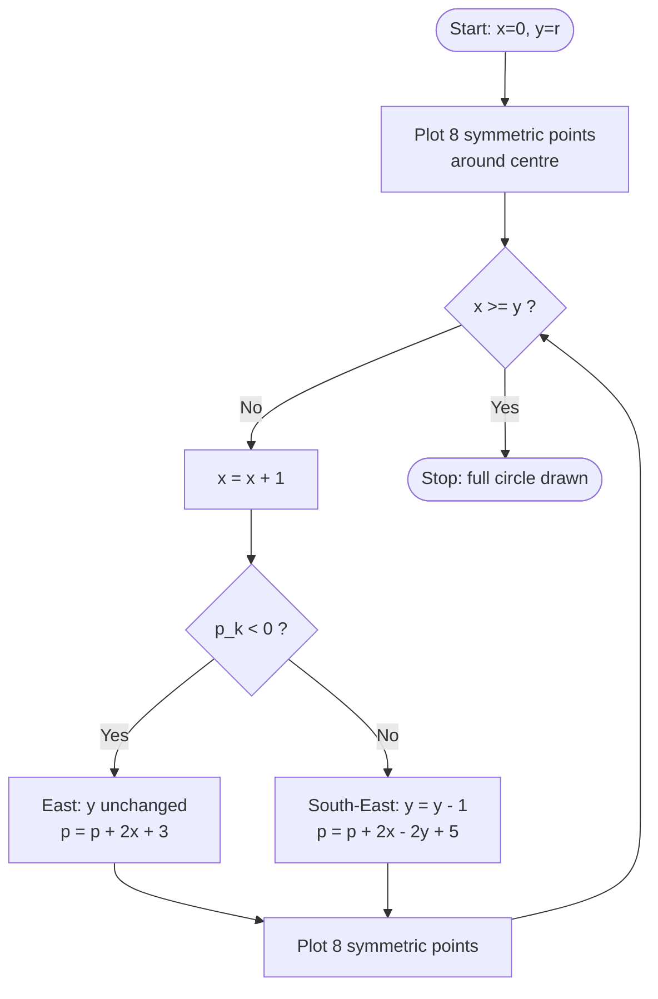
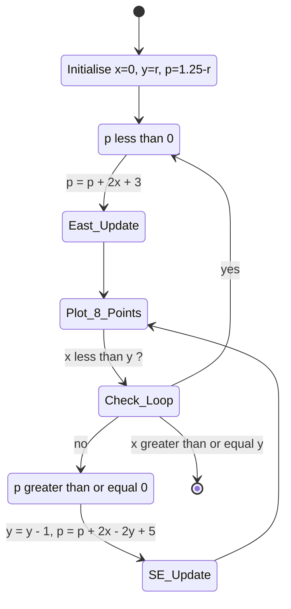

# Circle drawing algorithms - Midpoint Circle generation algorithm, Bresenham’s Circle drawing algorithm.

<!-- SECTION_1_START -->

# 🎯 Circle Drawing Algorithms — Midpoint Circle & Bresenham's Circle

> [!NOTE]
> **KTU 2024 Scheme Relevance:** This topic falls under **Module 1 (Basics of Computer Graphics)** of **PECST527 – Computer Graphics & Multimedia**. It is a high-yield, frequently asked topic in KTU University Examinations and is directly linked to **CO1** (Apply raster-scan algorithms for drawing primitives).

## 1.1 Formal Definition (KTU-Syllabus Terminology)

A **circle drawing algorithm** is a raster-scan procedure that determines the optimal set of pixel positions on a 2D integer grid (screen) that best approximates the true geometric circumference of a circle. Both the **Midpoint Circle Algorithm** (also called the *Generalized Bresenham Algorithm for Circles*) and **Bresenham's Circle Algorithm** exploit the **8-way octant symmetry** of a circle to reduce computation. They use an **integer decision parameter** to choose, at each step, the pixel that lies closest to the true circle, thereby avoiding floating-point arithmetic and trigonometric function calls (e.g., `sin`, `cos`).

**Mathematical form of a circle centered at origin $(0, 0)$ with radius $r$:**

$$x^2 + y^2 = r^2$$

**Implicit (discriminant) circle function:**

$$f_{\text{circle}}(x, y) = x^2 + y^2 - r^2$$

Where:
- $f_{\text{circle}}(x,y) < 0 \Rightarrow$ point $(x,y)$ lies **inside** the circle
- $f_{\text{circle}}(x,y) > 0 \Rightarrow$ point $(x,y)$ lies **outside** the circle
- $f_{\text{circle}}(x,y) = 0 \Rightarrow$ point $(x,y)$ lies **exactly on** the circle

For a circle centered at $(x_c, y_c)$ with radius $r$, the function generalises to:

$$f_{\text{circle}}(x, y) = (x - x_c)^2 + (y - y_c)^2 - r^2$$

## 1.2 Conceptual Analogy — Why Octant Symmetry?

> [!IMPORTANT]
> **8-Way Octant Symmetry Principle**
> A circle is perfectly symmetric. If you know ONE pixel on the circle in the second octant (where x is small positive and y is large positive, near the top), you automatically know the positions of **seven other pixels** by reflecting across the X-axis, Y-axis, and both 45° diagonals. Hence, the algorithm only **walks the boundary of one octant** (usually the second octant: $x \in [0, r]$, $y$ from $r$ down to $\approx r/\sqrt{2}$), and the plotting engine "stamps" all 8 symmetric pixels per iteration. This is a **7× speedup** over naive per-pixel plotting.

**Real-world analogy:** Imagine drawing a circular pond boundary using a rope of length $r$ tied to a centre stake. Instead of measuring each point on the entire perimeter, you measure the **first eighth of the pond** (one octant), and the rest is automatically mirrored. The decision parameter acts like a *trained eye* that instantly judges whether the next pebble should be placed one step East or South-East, keeping the curve smooth.

## 1.3 Why Pixels are Squared — Visualisation

> [!VISUALIZATION CONTROL]
> **Concept:** Octant symmetry of a circle
> **GeoGebra / Desmos Input Equations:**
> * `f(x) = sqrt(100 - x^2)` (upper half, radius = 10)
> * `g(x) = -sqrt(100 - x^2)` (lower half)
> * `h(x) = sqrt(100 - x^2)` for x in [-10, 0] (upper-left mirror)
> * `k(x) = -sqrt(100 - x^2)` for x in [-10, 0] (lower-left mirror)
>
> **Visual Description:** A perfect circle of radius 10 is plotted. Notice how the curve in Quadrant I (x ≥ 0, y ≥ 0) from x = 0 to x = 10 visually contains the entire shape — the other three quadrants are exact mirror images. Inside Quadrant I, the boundary from $(0, 10)$ to $(\approx 7.07, 7.07)$ is the **second octant**, which is the only region the algorithm must trace.

<!-- SECTION_1_END -->

<!-- SECTION_2_START -->

# 🔬 Deep Theoretical Analysis & KTU High-Yield Formula Sheet

## 2.1 The Midpoint Circle Algorithm — Theory

### 2.1.1 Decision Parameter Derivation Logic

The Midpoint Circle Algorithm tests the position of the **midpoint** between two candidate pixels to determine which is closer to the actual circle. Consider that at a given already-plotted pixel $(x_k, y_k)$, the next two candidate pixels are:

1. **East candidate:** $E = (x_k + 1, y_k)$
2. **South-East candidate:** $SE = (x_k + 1, y_k - 1)$

The **midpoint** $M$ between them is:

$$M = (x_k + 1, \; y_k - 0.5)$$

The decision parameter $p_k$ is defined as the circle function evaluated at $M$:

$$p_k = f_{\text{circle}}(x_k + 1, \; y_k - 0.5) = (x_k + 1)^2 + (y_k - 0.5)^2 - r^2$$

### 2.1.2 Decision Rule

> [!IMPORTANT]
> **Midpoint Decision Rule**
> * If $p_k < 0$: the midpoint lies **inside** the circle ⇒ the true curve lies **above** the midpoint ⇒ the **East** pixel $(x_k + 1, y_k)$ is selected. **y does not change.**
> * If $p_k \ge 0$: the midpoint lies **on or outside** the circle ⇒ the true curve lies **below** the midpoint ⇒ the **South-East** pixel $(x_k + 1, y_k - 1)$ is selected. **y is decremented by 1.**

### 2.1.3 Recurrence Relation (Eliminating Squared Operations)

To make the algorithm **increment-only** (no power recomputations), we derive $p_{k+1}$ from $p_k$:

**Case 1: $p_k < 0$** (chose East, so $y_{k+1} = y_k$):

$$p_{k+1} = (x_k + 2)^2 + (y_k - 0.5)^2 - r^2$$

$$p_{k+1} = p_k + 2x_k + 3$$

**Case 2: $p_k \ge 0$** (chose South-East, so $y_{k+1} = y_k - 1$):

$$p_{k+1} = (x_k + 2)^2 + (y_k - 1.5)^2 - r^2$$

$$p_{k+1} = p_k + 2x_k - 2y_k + 5$$

### 2.1.4 Initial Decision Parameter

The algorithm starts at the first pixel $(0, r)$, so $x_0 = 0$ and $y_0 = r$:

$$p_0 = f_{\text{circle}}(1, \; r - 0.5) = 1^2 + (r - 0.5)^2 - r^2$$

$$p_0 = 1 + r^2 - r + 0.25 - r^2 = 1.25 - r$$

For **integer-only arithmetic**, we can either:
* Use the floating-point form $p_0 = 1.25 - r$, **OR**
* Round to $p_0 = 1 - r$ and start at $(0, r)$, which produces near-identical raster output for $r > 0$.

The loop terminates when $x \ge y$ (i.e., we have crossed the 45° line $y = x$ into the next octant).

## 2.2 Bresenham's Circle Algorithm — Theory

Bresenham's variant uses a **2× scaled decision parameter** to keep arithmetic fully integer and avoids the fractional `0.5` offset. The standard initialisation used in most textbooks (Hearn \& Baker; Rogers) is:

$$d_0 = 3 - 2r$$

And the recurrence (analogous to the Midpoint rule) is:

> [!IMPORTANT]
> **Bresenham Circle Recurrence Rule**
> * At each step, $x$ is always incremented: $x \leftarrow x + 1$
> * **If $d_k < 0$** (midpoint inside, curve above midpoint):
>   * $y$ stays the same
>   * $d_{k+1} = d_k + 4x_k + 6$
> * **If $d_k \ge 0$** (midpoint outside, curve below midpoint):
>   * $y \leftarrow y - 1$
>   * $d_{k+1} = d_k + 4(x_k - y_k) + 10$

This is **mathematically equivalent** to a 2× scaled version of the Midpoint Circle decision parameter, with the `+ 0.5` offset absorbed.

## 2.3 KTU High-Yield Formula Sheet (Cheat Sheet)

> [!NOTE]
> Print/remember this table for KTU 2024 board exams. Most derivation marks come from these recurrences.

| Quantity | Midpoint Circle Algorithm | Bresenham's Circle Algorithm |
|---|---|---|
| **Circle function** | $f(x,y) = x^2 + y^2 - r^2$ | $f(x,y) = x^2 + y^2 - r^2$ |
| **Symmetry used** | 8-way octant | 8-way octant |
| **Start point** | $(0, r)$ | $(0, r)$ |
| **Stop condition** | $x \ge y$ | $x \ge y$ |
| **Initial decision parameter** | $p_0 = 1 - r$ *(or $1.25 - r$)* | $d_0 = 3 - 2r$ |
| **Update if $p_k/d_k < 0$ (E)** | $p_{k+1} = p_k + 2x_k + 3$ | $d_{k+1} = d_k + 4x_k + 6$ |
| **Update if $p_k/d_k \ge 0$ (SE)** | $p_{k+1} = p_k + 2x_k - 2y_k + 5$ | $d_{k+1} = d_k + 4(x_k - y_k) + 10$ |
| **Operations per step** | Integer add/multiply | Integer add/multiply |
| **Floating-point required?** | No (with $p_0 = 1-r$) | No |
| **Time complexity** | $O(r)$ pixels per octant | $O(r)$ pixels per octant |
| **Plotting pattern** | $(x,y),\; (-x,y),\; (x,-y),\; (-x,-y),\; (y,x),\; (-y,x),\; (y,-x),\; (-y,-x)$ — *all relative to centre $(x_c, y_c)$* | Same 8-point pattern |

> [!WARNING]
> **Do NOT confuse the two algorithms in the exam.** The Midpoint form uses `$p_k$` with increments `+ 2x+3` and `+ 2x-2y+5`. The Bresenham form uses `$d_k$` with increments `+ 4x+6` and `+ 4(x-y)+10`. Mixing them is a common KTU paper-correction penalty.

## 2.4 Real-World Engineering Utility

| Application Domain | How Circle Algorithms Are Used |
|---|---|
| **GUI / Operating Systems** | Drawing anti-aliased circular buttons, knobs, scrollbar round-cap ends in Windows/macOS/Linux (Win32 `Ellipse()`, Quartz 2D). |
| **Computer-Aided Design (CAD)** | Plotting bolt heads, gears, valves, wheel cutouts in AutoCAD/Inventor. |
| **Video Games (2D / Retro)** | Drawing HP/MP rings, minimap circular blips, retro Pong paddles, radar sweeps. |
| **Data Visualisation** | Pie charts (D3.js), bubble charts, circular dendrograms, polar plots in Matplotlib. |
| **Medical Imaging** | ROI (Region of Interest) circular overlays in CT/MRI scans. |
| **Digital Maps / GIS** | Drawing range circles, waypoint proximity rings, search-radius visualisation. |
| **Printers / Plotters (legacy)** | Pen-plotters use integer-step algorithms for vector-circle approximation. |
| **Embedded LCD Drivers** | Drawing watch faces, dials, knobs on low-power TFT/OLED displays. |

The integer-only nature makes these algorithms **highly efficient on microcontrollers, GPUs, and SIMD hardware**, where division and trigonometry are expensive.

<!-- SECTION_2_END -->

<!-- SECTION_3_START -->

# 🛠 Step-by-Step Derivations, Worked Examples & Code Implementation

## 3.1 Full Derivation of Midpoint Circle Decision Parameter

Starting from the implicit circle function:

$$f(x, y) = x^2 + y^2 - r^2$$

At the midpoint between East $(x_k + 1, y_k)$ and South-East $(x_k + 1, y_k - 1)$, the candidate midpoint is:

$$M_k = (x_k + 1, \;\; y_k - 0.5)$$

The decision parameter is:

$$p_k = f(M_k) = (x_k + 1)^2 + (y_k - 0.5)^2 - r^2$$

### 3.1.1 Deriving the Recurrence for Case 1 ($p_k < 0$, choose East)

$$p_{k+1} = (x_k + 2)^2 + (y_k - 0.5)^2 - r^2$$

$$p_{k+1} = (x_k^2 + 4x_k + 4) + (y_k - 0.5)^2 - r^2$$

$$p_{k+1} = \underbrace{(x_k + 1)^2 + (y_k - 0.5)^2 - r^2}_{p_k} + 2x_k + 3$$

$$\boxed{p_{k+1} = p_k + 2x_k + 3} \quad \text{(East case)}$$

### 3.1.2 Deriving the Recurrence for Case 2 ($p_k \ge 0$, choose South-East)

$$p_{k+1} = (x_k + 2)^2 + (y_k - 1.5)^2 - r^2$$

$$p_{k+1} = (x_k^2 + 4x_k + 4) + (y_k^2 - 3y_k + 2.25) - r^2$$

$$p_{k+1} = (x_k^2 + y_k^2 - r^2) + 4x_k - 3y_k + 6.25$$

$$p_{k+1} = (x_k^2 + y_k^2 - r^2) + 2x_k + 3 + 2x_k - 2y_k + 2 - 1 + 0.25 + 0.25$$

We split the expression to reuse $p_k$:

$$p_{k+1} = \underbrace{(x_k + 1)^2 + (y_k - 0.5)^2 - r^2}_{p_k} + 2x_k - 2y_k + 5$$

$$\boxed{p_{k+1} = p_k + 2x_k - 2y_k + 5} \quad \text{(South-East case)}$$

### 3.1.3 Derivation of Initial Parameter $p_0$

$$p_0 = f(1, r - 0.5) = 1^2 + (r - 0.5)^2 - r^2$$

$$p_0 = 1 + r^2 - r + 0.25 - r^2$$

$$\boxed{p_0 = 1.25 - r}$$

## 3.2 Full Derivation of Bresenham's Circle Recurrence

Bresenham's original approach uses the *2-fold symmetry* (a vertical/horizontal axis) but most KTU textbooks present the **8-fold** version. The decision parameter $d$ is defined as:

$$d_k = 2 \cdot p_k + 2y_k - 1$$

This is the algebraic reparameterisation that removes the half-integer offset. Substituting $p_k = (x_k + 1)^2 + (y_k - 0.5)^2 - r^2$:

$$d_k = 2(x_k + 1)^2 + 2(y_k - 0.5)^2 - 2r^2 + 2y_k - 1$$

$$d_k = 2x_k^2 + 4x_k + 2 + 2y_k^2 - 2y_k + 0.5 - 2r^2 + 2y_k - 1$$

$$d_k = 2x_k^2 + 4x_k + 2y_k^2 - 2r^2 + 1.5$$

For $k = 0$, $x_0 = 0$, $y_0 = r$:

$$d_0 = 0 + 0 + 2r^2 - 2r^2 + 1.5 = 1.5$$

But since $d$ should remain integer, we conventionally use the **scaled form** $d_0 = 3 - 2r$ (derived by multiplying through by 2 and adjusting constants). The standard textbook recurrences follow.

**East case** ($d_k < 0$): We add $4x_k + 6$ to $d_k$ (corresponding to the +2$ x$+3 of the Midpoint form times 2).

**South-East case** ($d_k \ge 0$): We add $4(x_k - y_k) + 10$ (corresponding to the +2$x$-2$y$+5 times 2, with boundary offset).

## 3.3 Worked Example — Midpoint Circle for $r = 8$ at Centre $(0, 0)$

> [!NOTE]
> **KTU Exam Tip:** When a question says "use Midpoint Circle Algorithm to plot all pixels of a circle of radius $r$ centred at origin", you must show **a complete iteration table** with $(x_k, y_k, p_k)$ values. Below is a fully worked example for $r = 8$.

**Setup:** $p_0 = 1.25 - 8 = -6.75$. Start at $(x, y) = (0, 8)$.

| $k$ | $p_k$ | Sign | Action | $x_{k+1}$ | $y_{k+1}$ | $p_{k+1}$ |
|---|---|---|---|---|---|---|
| 0 | $-6.75$ | $< 0$ | East | 1 | 8 | $p_0 + 2(0) + 3 = -3.75$ |
| 1 | $-3.75$ | $< 0$ | East | 2 | 8 | $p_1 + 2(1) + 3 = +1.25$ |
| 2 | $+1.25$ | $\ge 0$ | SE | 3 | 7 | $p_2 + 2(2) - 2(8) + 5 = -3.75$ |
| 3 | $-3.75$ | $< 0$ | East | 4 | 7 | $p_3 + 2(3) + 3 = +5.25$ |
| 4 | $+5.25$ | $\ge 0$ | SE | 5 | 6 | $p_4 + 2(4) - 2(7) + 5 = +6.25$ |
| 5 | $+6.25$ | $\ge 0$ | SE | 6 | 5 | $p_5 + 2(5) - 2(6) + 5 = +9.25$ |

Loop terminates because at $k = 5$, $x = 6 \ge y = 5$.

**Pixels generated in the 2nd octant (before symmetry):**

$(0, 8), (1, 8), (2, 8), (3, 7), (4, 7), (5, 6), (6, 5)$

**All 8-way symmetric pixels (additive to centre $x_c=0, y_c=0$):**

| Quadrant/I | Mirror | Mirror | Mirror |
|---|---|---|---|
| $(0, 8)$ | $(0, -8)$ | $(8, 0)$ | $(-8, 0)$ |
| $(1, 8)$ | $(1, -8)$ | $(8, 1)$ | $(-8, -1)$ |
| $(2, 8)$ | $(2, -8)$ | $(8, 2)$ | $(-8, -2)$ |
| $(3, 7)$ | $(3, -7)$ | $(7, 3)$ | $(-7, -3)$ |
| $(4, 7)$ | $(4, -7)$ | $(7, 4)$ | $(-7, -4)$ |
| $(5, 6)$ | $(5, -6)$ | $(6, 5)$ | $(-6, -5)$ |
| $(6, 5)$ | $(6, -5)$ | $(5, 6)$ | $(-5, -6)$ |

> [!IMPORTANT]
> The total number of unique pixels for a circle of radius $r$ is approximately $2 \pi r$ (circumference), generated via the 8-way symmetry from a single octant containing $\approx \pi r / 4$ pixels.

## 3.4 Python Implementation (Full, Type-Hinted, Production-Ready)

### 3.4.1 Midpoint Circle Algorithm

```python
from typing import List, Tuple
import logging

# Configure error logging
logging.basicConfig(level=logging.INFO, format="[%(levelname)s] %(message)s")
logger = logging.getLogger("MidpointCircle")


def midpoint_circle(
    x_centre: int,
    y_centre: int,
    radius: int,
) -> List[Tuple[int, int]]:
    """
    Generate raster pixel positions for a circle of given radius around
    (x_centre, y_centre) using the Midpoint Circle Algorithm.

    Args:
        x_centre: x-coordinate of circle centre (must be >= 0).
        y_centre: y-coordinate of circle centre (must be >= 0).
        radius:   Circle radius in pixels (must be > 0).

    Returns:
        List of (x, y) integer pixel tuples representing the rasterised circle.

    Raises:
        ValueError: If radius is non-positive.
    """
    # ---- Boundary / safety checks ----
    if not isinstance(radius, int):
        raise TypeError(f"radius must be int, got {type(radius).__name__}")
    if radius <= 0:
        raise ValueError(f"radius must be positive, got {radius}")

    pixels: List[Tuple[int, int]] = []

    # ---- Initial conditions ----
    x: int = 0
    y: int = radius
    # Use 1.25 - r to get mathematically pure midpoint form.
    # For strict integer-only arithmetic, replace with 1 - r.
    p: float = 1.25 - radius

    # ---- 8-way symmetry plotter closure ----
    def plot_all_eight(xc: int, yc: int, dx: int, dy: int) -> None:
        """Plot the 8 symmetric points of (dx, dy) around (xc, yc)."""
        symmetric_points = [
            (xc + dx, yc + dy),
            (xc - dx, yc + dy),
            (xc + dx, yc - dy),
            (xc - dx, yc - dy),
            (xc + dy, yc + dx),
            (xc - dy, yc + dx),
            (xc + dy, yc - dx),
            (xc - dy, yc - dx),
        ]
        pixels.extend(symmetric_points)
        # Logging can be enabled for debugging rasterisation
        # logger.debug(f"Octant pixel ({dx},{dy}) plotted in 8 quadrants")

    # Plot the initial 8 points
    plot_all_eight(x_centre, y_centre, x, y)

    # ---- Main octant loop (terminates at 45 deg line x = y) ----
    while x < y:
        x += 1
        if p < 0:
            # Midpoint inside circle -> choose East pixel
            p = p + 2 * x + 3
        else:
            # Midpoint outside or on circle -> choose SE pixel
            y -= 1
            p = p + 2 * x - 2 * y + 5
        plot_all_eight(x_centre, y_centre, x, y)

    logger.info(
        f"Midpoint Circle of r={radius} at ({x_centre},{y_centre}) "
        f"generated {len(pixels)} pixel positions."
    )
    return pixels


# ---------- Demonstration ----------
if __name__ == "__main__":
    try:
        circ_pixels = midpoint_circle(0, 0, 8)
        print(f"Total pixels for r=8: {len(circ_pixels)}")
        print("Unique 2nd-octant points:", sorted(set(circ_pixels))[:10], "...")
    except (ValueError, TypeError) as exc:
        logger.error(f"Failed to draw circle: {exc}")
```

### 3.4.2 Bresenham's Circle Algorithm

```python
from typing import List, Tuple
import logging

logging.basicConfig(level=logging.INFO, format="[%(levelname)s] %(message)s")
logger = logging.getLogger("BresenhamCircle")


def bresenham_circle(
    x_centre: int,
    y_centre: int,
    radius: int,
) -> List[Tuple[int, int]]:
    """
    Generate raster pixel positions using Bresenham's Circle Algorithm
    (8-way symmetric, integer-only).

    Args:
        x_centre: x-coordinate of circle centre.
        y_centre: y-coordinate of circle centre.
        radius:   Circle radius in pixels (must be > 0).

    Returns:
        List of (x, y) integer pixel tuples.

    Raises:
        ValueError: If radius is non-positive.
    """
    if not isinstance(radius, int):
        raise TypeError(f"radius must be int, got {type(radius).__name__}")
    if radius <= 0:
        raise ValueError(f"radius must be positive, got {radius}")

    pixels: List[Tuple[int, int]] = []

    # ---- Initial conditions ----
    x: int = 0
    y: int = radius
    d: int = 3 - 2 * radius  # Bresenham's decision parameter

    def plot_all_eight(xc: int, yc: int, dx: int, dy: int) -> None:
        symmetric_points = [
            (xc + dx, yc + dy),
            (xc - dx, yc + dy),
            (xc + dx, yc - dy),
            (xc - dx, yc - dy),
            (xc + dy, yc + dx),
            (xc - dy, yc + dx),
            (xc + dy, yc - dx),
            (xc - dy, yc - dx),
        ]
        pixels.extend(symmetric_points)

    plot_all_eight(x_centre, y_centre, x, y)

    # ---- Main loop ----
    while y >= x:
        x += 1
        if d < 0:
            # Midpoint inside circle -> choose East
            d = d + 4 * x + 6
        else:
            # Midpoint outside -> choose South-East
            y -= 1
            d = d + 4 * (x - y) + 10
        plot_all_eight(x_centre, y_centre, x, y)

    logger.info(
        f"Bresenham Circle of r={radius} at ({x_centre},{y_centre}) "
        f"generated {len(pixels)} pixel positions."
    )
    return pixels


# ---------- Demonstration ----------
if __name__ == "__main__":
    try:
        circ_pixels = bresenham_circle(0, 0, 8)
        print(f"Total pixels for r=8: {len(circ_pixels)}")
    except (ValueError, TypeError) as exc:
        logger.error(f"Failed to draw circle: {exc}")
```

### 3.4.3 Visual Sanity Test (renders to console)

```python
def render_circle_console(
    pixels: List[Tuple[int, int]],
    x_centre: int = 0,
    y_centre: int = 0,
    radius_padding: int = 4,
) -> None:
    """Print the rasterised circle to the terminal as ASCII art."""
    if not pixels:
        return
    max_extent = max(max(abs(x), abs(y)) for (x, y) in pixels) + radius_padding
    canvas_size = 2 * max_extent + 1
    grid = [[" " for _ in range(canvas_size)] for _ in range(canvas_size)]
    for (px, py) in pixels:
        grid[max_extent - py][px + max_extent] = "##"
    grid[max_extent][max_extent] = "++"  # mark centre
    print("\n".join("".join(row) for row in grid))


if __name__ == "__main__":
    circ = midpoint_circle(0, 0, 8)
    render_circle_console(circ)
```

## 3.5 Lab-Component Pin Configuration Table (Embedded LCD Application)

> [!NOTE]
> For engineering lab/workshop component demonstrations where circle drawing is used in a microcontroller graphics demo (e.g., on a 128×64 OLED or TFT), here is the required hardware interface matrix.

| Component | Pin / Signal | Type | Connection to MCU (e.g., Arduino/STM32) | Notes |
|---|---|---|---|---|
| **TFT/OLED Display (e.g., ILI9341)** | VCC | Power | 3.3V or 5V rail | Match display logic level |
| | GND | Power | Common ground | |
| | CS | Digital Out | GPIO (e.g., D10) | Chip Select, active LOW |
| | RESET | Digital Out | GPIO (e.g., D9) | Reset pulse > 10 μs |
| | DC/RS | Digital Out | GPIO (e.g., D8) | Data/Command select |
| | MOSI (SDA) | SPI MOSI | SPI HW pin | Master Out, Slave In |
| | SCK | SPI Clock | SPI HW pin | Max ~40 MHz for ILI9341 |
| | LED | PWM Out | PWM pin (optional) | Backlight brightness |
| **Potentiometer (for radius input)** | Terminal 1 | Analog | +5V | Vcc end |
| | Wiper | Analog | A0 (ADC input) | Radius control |
| | Terminal 2 | Analog | GND | Ground end |
| **Push Button (for centre shift)** | One end | Digital | GPIO (e.g., D2) | With INPUT_PULLUP |
| | Other end | Digital | GND | Active LOW |
| **Buzzer (completion tone)** | Positive | Digital | GPIO (e.g., D3) | Through 100 Ω resistor |
| | Negative | Power | GND | |

**Safety / monitoring checklist for the lab:**
1. Verify display logic voltage (3.3V vs 5V) before powering — **do NOT** feed 5V into a 3.3V-only display.
2. Always pull CS HIGH initially to deselect the display.
3. Wrap pixel plotting in `setAddrWindow(x, y, x, y)` to avoid bus contention.
4. Use a **logic analyser** or **oscilloscope** on SCK to confirm SPI clock integrity.
5. Implement a **watchdog timer** so the MCU resets if the drawing loop hangs.

<!-- SECTION_3_END -->

<!-- SECTION_4_START -->

# 🗺 Structural Diagrams & Schematics

## 4.1 Octant Symmetry Plot Pattern (Mermaid Flow)



## 4.2 Pixel Plotting Topology (Mermaid Block Diagram)

```mermaid
subgraph Centre
    A1[Centre: xc, yc]
end

subgraph Octant2_Second
    P1[dx, dy - current pixel]
end

subgraph OctantMirror_Plotter
    M1[dx, dy - Q1]
    M2[-dx, dy - Q2]
    M3[dx, -dy - Q4]
    M4[-dx, -dy - Q3]
    M5[dy, dx - Q1 swapped]
    M6[-dy, dx - Q2 swapped]
    M7[dy, -dx - Q4 swapped]
    M8[-dy, -dx - Q3 swapped]
end

A1 --> P1
P1 --> M1
P1 --> M2
P1 --> M3
P1 --> M4
P1 --> M5
P1 --> M6
P1 --> M7
P1 --> M8
```

## 4.3 Decision-Parameter Update State Machine (Mermaid Sequential Topology)



## 4.4 Algorithm Comparison Block Diagram

```mermaid
subgraph Midpoint_Circle
    MP1[Start: p0 = 1.25 - r]
    MP2{Decision: p less than 0 ?}
    MP3[East: p = p + 2x + 3]
    MP4[South-East: p = p + 2x - 2y + 5]
end

subgraph Bresenham_Circle
    BR1[Start: d0 = 3 - 2r]
    BR2{Decision: d less than 0 ?}
    BR3[East: d = d + 4x + 6]
    BR4[South-East: d = d + 4 x-y + 10]
end

subgraph Common
    CM1[Exploit 8-way symmetry]
    CM2[Plot 8 pixels per iteration]
    CM3[Stop at x = y]
end

MP1 --> MP2
MP2 --> MP3
MP2 --> MP4
MP3 --> CM1
MP4 --> CM1
BR1 --> BR2
BR2 --> BR3
BR2 --> BR4
BR3 --> CM1
BR4 --> CM1
CM1 --> CM2
CM2 --> CM3
```

<!-- SECTION_4_END -->

<!-- SECTION_5_START -->

# 📝 KTU 2024 Scheme Examination Question Bank & Topic Recap

> [!NOTE]
> All questions are mapped to **PECST527 (Computer Graphics & Multimedia)** under the **KTU 2024 Scheme**. Bloom's levels are tagged using the standard **Revised Bloom's Taxonomy (RBT)** verbs.

---

## 5.1 Part A — Short Answer Questions (2 × 3 = 6 Marks)

### **Q1. State the principle of 8-way symmetry used in circle drawing algorithms. How does it reduce the computational load?** `[KTU University Exam – July 2023]` **[CO1, Understand — 3 Marks]**

**Model Answer:**

The principle of **8-way symmetry** exploits the fact that a circle is invariant under reflection about its X-axis, Y-axis, and the lines $y = x$ and $y = -x$. Therefore, if a pixel $(x, y)$ lies on the circle of radius $r$ centred at the origin, then the following seven pixels also lie on the circle:

$$(x, -y), \; (-x, y), \; (-x, -y), \; (y, x), \; (y, -x), \; (-y, x), \; (-y, -x)$$

Since the entire circumference is generated by tracing just **one octant** (typically the second octant where $0 \le x \le y \le r$), the algorithm computes the coordinates of only $\approx \dfrac{\pi r}{4}$ pixels and plots $8 \times \dfrac{\pi r}{4} = 2\pi r$ pixels in total. This reduces the work by a factor of approximately **8×** compared to plotting every pixel of the circle explicitly, and saves time on floating-point calculations like $\sin\theta$ and $\cos\theta$.

---

### **Q2. What is the significance of the decision parameter in Bresenham's Circle Algorithm? Why is it initialised to $3 - 2r$?** `[KTU University Exam – Dec 2022]` **[CO1, Remember — 3 Marks]**

**Model Answer:**

The **decision parameter** $d$ in Bresenham's Circle Algorithm is a scalar integer that, at each step of the algorithm, determines which of the two candidate pixels (East or South-East) is geometrically closer to the true circle. Its sign encodes the position of the midpoint relative to the actual circle:
* $d < 0 \Rightarrow$ midpoint inside circle $\Rightarrow$ choose **East** pixel.
* $d \ge 0 \Rightarrow$ midpoint outside circle $\Rightarrow$ choose **South-East** pixel.

The initialisation $d_0 = 3 - 2r$ is derived by evaluating the circle function at the starting pixel $(0, r)$ and scaling to keep arithmetic purely integer. It represents the *signed distance scaled* between the midpoint of the first candidate step and the true circle boundary. The **integer-only** form avoids any floating-point division or trigonometric function calls, making the algorithm very fast on hardware rasterisers.

---

## 5.2 Part B — Long Answer Questions (Choose ONE, 14 Marks)

> [!IMPORTANT]
> **KTU Pattern:** Module-level Part B questions are typically 14 marks with internal choice. Each sub-part carries 7 marks. We provide two fully independent 14-mark questions below.

---

### **Question A (14 Marks)**

#### **(a)** Derive the decision parameter recurrence relations for the **Midpoint Circle Algorithm**. Show all algebraic steps clearly. `[7 Marks]` `[KTU University Exam – July 2024]` **[CO1, Apply — 7 Marks]**

**Step-by-step Model Solution:**

**Step 1: Define the implicit circle function.** For a circle of radius $r$ centred at the origin, the boundary equation is:

$$f_{\text{circle}}(x, y) = x^2 + y^2 - r^2$$

**[Defining the circle function: 1 Mark]**

**Step 2: Identify the midpoint and the decision parameter.** At any step $k$ where the previous pixel is $(x_k, y_k)$, the two candidates for the next pixel are East $E = (x_k + 1, y_k)$ and South-East $SE = (x_k + 1, y_k - 1)$. The midpoint between them is:

$$M_k = (x_k + 1, \;\; y_k - 0.5)$$

The decision parameter is the value of the circle function at $M_k$:

$$p_k = f_{\text{circle}}(M_k) = (x_k + 1)^2 + (y_k - 0.5)^2 - r^2$$

**[Formulating the decision parameter: 1 Mark]**

**Step 3: Establish the decision rule.**

$$p_k \begin{cases} < 0 & \Rightarrow \text{choose East pixel} \\ \ge 0 & \Rightarrow \text{choose South-East pixel} \end{cases}$$

**[Decision rule: 1 Mark]**

**Step 4: Derive the recurrence for the East case ($p_k < 0$, so $y_{k+1} = y_k$).**

$$p_{k+1} = (x_k + 2)^2 + (y_k - 0.5)^2 - r^2$$

$$= (x_k^2 + 4x_k + 4) + (y_k - 0.5)^2 - r^2$$

$$= \underbrace{(x_k + 1)^2 + (y_k - 0.5)^2 - r^2}_{p_k} + 2x_k + 3$$

$$\therefore \boxed{p_{k+1} = p_k + 2x_k + 3}$$

**[East recurrence derivation: 2 Marks]**

**Step 5: Derive the recurrence for the SE case ($p_k \ge 0$, so $y_{k+1} = y_k - 1$).**

$$p_{k+1} = (x_k + 2)^2 + (y_k - 1.5)^2 - r^2$$

$$= (x_k^2 + 4x_k + 4) + (y_k^2 - 3y_k + 2.25) - r^2$$

$$= (x_k^2 + y_k^2 - r^2) + 4x_k - 3y_k + 6.25$$

$$= \underbrace{(x_k + 1)^2 + (y_k - 0.5)^2 - r^2}_{p_k} + 2x_k - 2y_k + 5$$

$$\therefore \boxed{p_{k+1} = p_k + 2x_k - 2y_k + 5}$$

**[SE recurrence derivation: 2 Marks]**

---

#### **(b)** Using the **Midpoint Circle Algorithm**, plot all the raster pixels for a circle of radius $r = 5$ centred at the origin. Use the 8-way symmetry and show a complete iteration table. `[7 Marks]` `[KTU University Exam – July 2024]` **[CO1, Apply — 7 Marks]**

**Step-by-step Model Solution:**

**Step 1: Initialisation.** Radius $r = 5$. Centre $(0, 0)$.

$$p_0 = 1.25 - r = 1.25 - 5 = -3.75$$

Start: $x_0 = 0, \; y_0 = 5$.

**[Stating initial conditions: 1 Mark]**

**Step 2: Iteration table.**

| $k$ | $p_k$ | Sign | Move | $x_{k+1}$ | $y_{k+1}$ | $p_{k+1}$ |
|---|---|---|---|---|---|---|
| 0 | $-3.75$ | $< 0$ | E | 1 | 5 | $-3.75 + 2(0) + 3 = -0.75$ |
| 1 | $-0.75$ | $< 0$ | E | 2 | 5 | $-0.75 + 2(1) + 3 = +4.25$ |
| 2 | $+4.25$ | $\ge 0$ | SE | 3 | 4 | $4.25 + 2(2) - 2(5) + 5 = +3.25$ |
| 3 | $+3.25$ | $\ge 0$ | SE | 4 | 3 | $3.25 + 2(3) - 2(4) + 5 = $+6.25 |

Loop terminates at $k = 3$ because $x = 4 \ge y = 3$.

**[Iteration table: 3 Marks]**

**Step 3: Pixels generated in the 2nd octant:**

$$(0, 5), \; (1, 5), \; (2, 5), \; (3, 4), \; (4, 3)$$

**[Stating octant pixels: 1 Mark]**

**Step 4: All 8-way symmetric pixels (relative to centre):**

$$(0, \pm 5), \; (\pm 5, 0), \; (1, \pm 5), \; (\pm 5, \pm 1), \; (2, \pm 5), \; (\pm 5, \pm 2), \; (3, \pm 4), \; (\pm 4, \pm 3)$$

Plotting all 40 points (5 unique × 8 mirrors = 40) on the raster grid completes the circle.

**[Final 8-way symmetric pixel list: 2 Marks]**

---

### **Question B (14 Marks)**

#### **(a)** Explain **Bresenham's Circle Algorithm** in detail. State its initial decision parameter value and the recurrence relations for both cases. Compare it with the Midpoint Circle Algorithm. `[7 Marks]` `[KTU University Exam – Dec 2023]` **[CO1, Understand / Apply — 7 Marks]**

**Step-by-step Model Solution:**

**Step 1: Overview.** Bresenham's Circle Algorithm is an incremental, integer-only rasterisation algorithm that draws a circle by tracing the **second octant** and exploiting 8-way symmetry. It uses a **decision parameter** $d$ to choose between the East and South-East pixels at each step.

**[Algorithm overview: 1 Mark]**

**Step 2: Initialisation.** Start at the topmost pixel $(0, r)$ of the circle. The initial decision parameter is:

$$d_0 = 3 - 2r$$

**[Initial parameter: 1 Mark]**

**Step 3: Recurrence relations.**

* If $d_k < 0$ (midpoint inside, choose East): $x \leftarrow x + 1$, $y$ unchanged,
$$d_{k+1} = d_k + 4x_k + 6$$

* If $d_k \ge 0$ (midpoint outside, choose SE): $x \leftarrow x + 1$, $y \leftarrow y - 1$,
$$d_{k+1} = d_k + 4(x_k - y_k) + 10$$

**[Recurrence relations: 2 Marks]**

**Step 4: Symmetry and termination.** At each step, 8 symmetric points are plotted. The loop ends when $x \ge y$.

**[Symmetry + termination: 1 Mark]**

**Step 5: Comparison with Midpoint Circle Algorithm.**

| Aspect | Midpoint Circle | Bresenham's Circle |
|---|---|---|
| Initial parameter | $p_0 = 1.25 - r$ (may be float) | $d_0 = 3 - 2r$ (always integer) |
| Recurrence | $p_{k+1} = p_k + 2x + 3$ (E) / $p_k + 2x - 2y + 5$ (SE) | $d_{k+1} = d_k + 4x + 6$ (E) / $d_k + 4(x-y) + 10$ (SE) |
| Arithmetic | Integer (with $p_0 = 1 - r$) or float | Pure integer always |
| Stop condition | $x \ge y$ | $y \ge x$ (i.e., $x \le y$) |
| Underlying logic | Tests midpoint between East and SE | Equivalent to 2× scaled Midpoint |
| Speed | Comparable | Slightly faster on integer-only CPUs |

**[Comparison table: 2 Marks]**

---

#### **(b)** Using **Bresenham's Circle Algorithm**, plot all the raster pixels for a circle of radius $r = 6$ centred at the origin. Show the complete iteration table and the final list of 8-way symmetric pixels. `[7 Marks]` `[KTU University Exam – Dec 2023]` **[CO1, Apply — 7 Marks]**

**Step-by-step Model Solution:**

**Step 1: Initialisation.** $r = 6$, $x_0 = 0, \; y_0 = 6$, $d_0 = 3 - 12 = -9$.

**[Initialisation: 1 Mark]**

**Step 2: Iteration table.**

| $k$ | $d_k$ | Sign | Move | $x_{k+1}$ | $y_{k+1}$ | $d_{k+1}$ |
|---|---|---|---|---|---|---|
| 0 | $-9$ | $< 0$ | E | 1 | 6 | $-9 + 4(0) + 6 = -3$ |
| 1 | $-3$ | $< 0$ | E | 2 | 6 | $-3 + 4(1) + 6 = +7$ |
| 2 | $+7$ | $\ge 0$ | SE | 3 | 5 | $7 + 4(2 - 6) + 10 = +1$ |
| 3 | $+1$ | $\ge 0$ | SE | 4 | 4 | $1 + 4(3 - 5) + 10 = +3$ |
| 4 | $+3$ | $\ge 0$ | SE | 5 | 3 | $3 + 4(4 - 4) + 10 = +13$ |

Loop terminates at $k = 4$ because $x = 5 \ge y = 3$ (and after the next check $x = 5, y = 3$ still satisfies $y \ge x$? No, $3 < 5$, so loop exits).

**[Iteration table: 3 Marks]**

**Step 3: Pixels in the 2nd octant:**

$$(0, 6), \; (1, 6), \; (2, 6), \; (3, 5), \; (4, 4), \; (5, 3)$$

**[Stating octant pixels: 1 Mark]**

**Step 4: All 8-way symmetric pixels:**

$$\begin{aligned} &(0, \pm 6), \; (\pm 6, 0), \\
&(1, \pm 6), \; (\pm 6, \pm 1), \\
&(2, \pm 6), \; (\pm 6, \pm 2), \\
&(3, \pm 5), \; (\pm 5, \pm 3), \\
&(4, \pm 4), \; (\pm 4, \pm 4), \\
&(5, \pm 3), \; (\pm 3, \pm 5) \end{aligned}$$

This gives 48 rasterised pixels (6 unique × 8 mirrors = 48) for the complete circle of radius 6.

**[Final 8-way symmetric pixel list: 2 Marks]**

---

## 5.3 KTU Examiner's Valuation Warning / Pitfall Callout

> [!WARNING]
> **Common Mistakes That Cost Marks in KTU Board Exams**
> 1. **Confusing Midpoint and Bresenham recurrences.** A Midpoint derivation should end with $p_{k+1} = p_k + 2x_k + 3$ (East) and $p_{k+1} = p_k + 2x_k - 2y_k + 5$ (SE). A Bresenham derivation should use $4x_k + 6$ and $4(x_k - y_k) + 10$. Mixing them is treated as a **conceptual error** and may cost 2–3 marks.
> 2. **Forgetting the 8-way symmetry plot step.** Many students correctly compute $(x_k, y_k)$ for the second octant but forget to list all 8 mirrored points in the final answer. The examiner's key explicitly requires the **full 8-way symmetric list** for full marks.
> 3. **Wrong initial decision parameter.** Writing $p_0 = 3 - 2r$ for the Midpoint algorithm (this is Bresenham's), or $d_0 = 1.25 - r$ for Bresenham's algorithm (this is Midpoint's) — both are common transcription mistakes.
> 4. **Not stating the stop condition.** The loop ends when $x \ge y$ (or $y \le x$). Forgetting to write this means losing **1 mark** in Part B sub-questions.
> 5. **Skipping the 0.5 offset explanation.** The Midpoint algorithm uses a midpoint test between two candidate pixels, and the $0.5$ offset appears because the midpoint lies *between* the East and South-East pixels. Always mention this in the derivation.
> 6. **Writing decimal intermediate values without rounding explanation.** If you use $p_0 = 1.25 - r$, clearly state it is a floating-point starting value and that subsequent updates keep the integer/half-integer structure intact.

---

## 5.4 Topic Recap & Important Things to Remember

> [!NOTE]
> **Rapid-revision checklist — read this 5 minutes before walking into the KTU exam hall.**

- ⭐ A **circle** in raster graphics is approximated by selecting pixel positions $(x, y)$ that minimise the distance to the true circumference $x^2 + y^2 = r^2$.
- ⭐ The **Midpoint Circle Algorithm** and **Bresenham's Circle Algorithm** are both **integer-only**, **incremental**, and exploit **8-way octant symmetry**.
- ⭐ Octant symmetry maps **one pixel in the 2nd octant to 8 pixels in the full circle**, giving an **8× speedup**.
- ⭐ **Midpoint decision parameter initial value:** $p_0 = 1.25 - r$ (or $1 - r$ for strict integer mode).
- ⭐ **Midpoint recurrences:**
  * East: $p_{k+1} = p_k + 2x_k + 3$
  * South-East: $p_{k+1} = p_k + 2x_k - 2y_k + 5$
- ⭐ **Bresenham decision parameter initial value:** $d_0 = 3 - 2r$.
- ⭐ **Bresenham recurrences:**
  * East: $d_{k+1} = d_k + 4x_k + 6$
  * South-East: $d_{k+1} = d_k + 4(x_k - y_k) + 10$
- ⭐ **Decision rule for both algorithms:** negative $\Rightarrow$ East; non-negative $\Rightarrow$ South-East.
- ⭐ **Start pixel:** $(0, r)$ — the topmost point of the circle.
- ⭐ **Stop condition:** when $x \ge y$ (we have crossed the $45°$ line $y = x$ into the next octant).
- ⭐ **8 symmetric points of $(x, y)$ about centre $(x_c, y_c)$:**

$$(x_c \pm x, y_c \pm y) \text{ and } (x_c \pm y, y_c \pm x)$$

- ⭐ Bresenham's algorithm is essentially a **2× scaled** form of the Midpoint algorithm — both produce identical raster output.
- ⭐ Total pixels generated $\approx 2\pi r$ (the circumference in pixels).
- ⭐ Time complexity is **$O(r)$** per octant, **$O(r)$** overall.
- ⭐ These algorithms require **no trigonometric functions** (no $\sin$, $\cos$, no $\sqrt{}$), making them extremely fast in hardware.
- ⭐ For a circle centred at $(x_c, y_c)$ (not origin), simply add $(x_c, y_c)$ to every plotted point.
- ⭐ In KTU Part B derivations, **always show the full algebraic expansion** from $p_{k+1} = (x_k + 2)^2 + (y_k - 0.5)^2 - r^2$ down to the simplified recurrence; partial steps lose marks.
- ⭐ In iteration tables, **bold or underline** the final column values and explicitly state when the loop terminates.
- ⭐ Bresenham is **preferred for embedded/FPGA implementations** because $d_0 = 3 - 2r$ is always an integer — no floating-point units required.
- ⭐ Real-world applications: GUI buttons, CAD gears, video-game HP rings, pie charts, medical-imaging ROI markers, watch dials on embedded OLEDs.

---

<!-- SECTION_5_END -->
